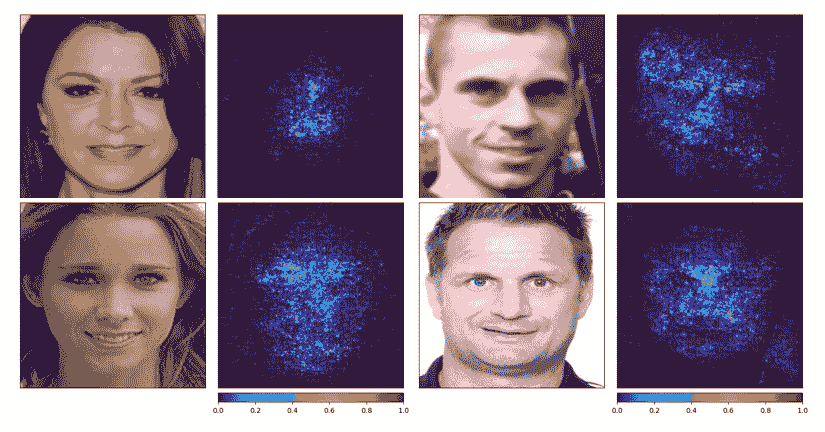

# 第十三章：探索偏见与公平性

有偏见的机器学习模型会产生并放大对某些群体的不公平或歧视性预测。这些模型可能会产生偏见的预测，导致如社会或经济不平等等负面后果。幸运的是，一些国家有反歧视和平等法律，保护少数群体免受不利待遇。机器学习从业者或任何部署有偏见模型的人可能面临的最糟糕情况是收到法律通知，要求支付重罚款，或收到律师函被起诉并被迫关闭其已部署的模型。以下是一些此类情况的例子：

+   叫车应用 Uber 因其面部验证系统在英国受到两个工会的法律诉讼，该系统对深色皮肤人群显示出种族偏见，表现为更频繁的验证错误。这阻碍了他们作为 Uber 司机的工作（[`www.bbc.com/news/technology-58831373`](https://www.bbc.com/news/technology-58831373)）。

+   创作者因 YouTube 对他们的种族及其他少数群体歧视而提起诉讼，因为 YouTube 的算法自动删除了他们的视频，并没有给出合理解释，导致他们无法通过广告收入获利（[`www.washingtonpost.com/technology/2020/06/18/black-creators-sue-youtube-alleged-race-discrimination/`](https://www.washingtonpost.com/technology/2020/06/18/black-creators-sue-youtube-alleged-race-discrimination/)）。

+   Facebook 因其住房广告涉嫌种族、性别、宗教、家庭状态和残疾歧视，遭到美国住房部门起诉并需支付不到 500 万美元的罚款（[`www.npr.org/2019/03/28/707614254/hud-slaps-facebook-with-housing-discrimination-charge`](https://www.npr.org/2019/03/28/707614254/hud-slaps-facebook-with-housing-discrimination-charge)）。

因此，必须格外小心，避免对机器学习模型所接触的基础数据和环境中的敏感和受保护属性产生偏见。在本章中，我们将逐步探讨这个话题，从探索偏见的类型开始，学习检测和评估识别偏见与公平性的方法，最后探讨减轻偏见的途径。本章将介绍的概念和技术适用于所有机器学习模型。然而，偏见缓解是一个例外；我们将在其中探讨一种特定于神经网络的方法，该方法能够可靠地缓解偏见。更正式地说，我们将涵盖以下主题：

+   探索偏见的类型

+   理解 AI 偏见的来源

+   发现偏见与公平性评估方法

+   评估深度学习模型的偏见与公平性

+   针对不同使用案例量身定制偏见与公平性措施

+   减少 AI 偏见

# 技术要求

本章包含一些 Python 编程语言中的实际实现。要完成这些内容，您需要在计算机上安装以下库：

+   `pandas`

+   `matplotlib`

+   `scikit-learn`

+   `numpy`

+   `pytorch`

+   `transformers==4.28.0`

+   `accelerate==0.6.0`

+   `captum`

+   `catalyst`

代码文件可以在 GitHub 上获取，链接为[`github.com/PacktPublishing/The-Deep-Learning-Architect-Handbook/tree/main/CHAPTER_13`](https://github.com/PacktPublishing/The-Deep-Learning-Architect-Handbook/tree/main/CHAPTER_13)。

# 探索偏差的类型

偏差可以被描述为对某个特定观点、意见或信仰系统的自然倾向或倾向，无论其是否被视为正面、中立或负面。另一方面，AI 偏差特指当数学模型延续其创建者或基础数据中固有的偏差时发生的情况。需要注意的是，并非所有信息都被视为偏差，有些信息也可以被视为知识。偏差是一种主观信息，而知识指的是通过学习、经验或研究获得的事实性信息、理解或意识。换句话说，知识是不带偏见的真理。

注意

不要将本书中的偏差与机器学习中臭名昭著的“偏差与方差”概念中的偏差混淆。在这个概念中，偏差指的是机器学习模型在执行某个任务时的简单性。为了完整性，方差指定了模型对数据特征变化的敏感性。在这里，高偏差对应于低方差和欠拟合行为，表明机器学习模型过于简单。低偏差则对应于高方差和过拟合行为。

在本书中，我们将以更口语化的方式使用偏差一词。诸如种族、性别和年龄等更为人知的偏差特征被视为社会偏差或刻板印象。然而，偏差的范围要广得多。以下是一些其他类型偏差的有趣例子：

+   **文化偏差**：文化视角、价值观和规范对判断、决策和行为的影响。它可以通过偏倚的数据收集、失衡的训练数据或反映文化偏见的算法在机器学习模型中表现出来。

+   **认知偏差**：在思维或决策过程中系统性地偏离理性思考的模式。让我们看几个认知偏差的例子，并探讨这些偏差在机器学习项目中可能表现出的现象：

    +   **确认偏差**：偏向于支持现有信念的数据。

    +   **锚定偏差**：在模型训练过程中过度强调某些特征或变量。

    +   **可用性偏差**：依赖于易于获取的数据源，可能忽视相关但不易获取的数据源。

    +   **过度自信偏差**：高估模型的能力或准确性。

    +   **事后偏差**：在观察到模型预测结果后，认为这些预测结果是可以预见的。

    +   **自动化偏差**：过度依赖模型输出而不进行批判性评估

    +   **框架偏差**：通过有偏的数据呈现影响模型的学习过程

    +   **选择偏差**：非随机抽样导致的不具代表性数据

    +   **抽样偏差**：由于样本不具代表性导致的数据偏倚

    +   **报告偏差**：由于个人的偏好或信仰导致的错误陈述

+   **算法偏差**：算法中存在的任何偏差，如机器学习算法。另一个偏差的例子是**聚合偏差**，它是由于数据分组或聚合方法导致的预测偏倚。

+   **测量偏差**：数据收集和测量中的不准确或错误。

这些偏差类别仅仅是冰山一角，可能延伸到非常特定的偏差类别，例如政治偏差、行业偏差、媒体偏差等。现在我们了解了偏差的概念及其涵盖的范围，接下来让我们一起探讨 AI 偏差的来源。

# 理解 AI 偏差的来源

AI 偏差可能发生在深度学习生命周期的任何阶段。让我们逐个了解这些阶段中的偏差：

+   **规划**：在机器学习生命周期的规划阶段，随着项目目标、数据收集方法和模型设计的决定，偏差可能会出现。偏差可能源于主观选择、假设或使用不具代表性的数据源。项目规划者需要保持批判性的视角，积极考虑潜在的偏差，吸纳多元观点，并优先考虑公平性和伦理问题。

+   **数据准备**：这一阶段包括以下几个阶段：

    +   **数据收集**：在数据收集阶段，如果收集的数据未能准确代表目标群体，偏差可能会悄然出现。多个因素可能导致这种偏差，包括抽样偏差、选择偏差，或者某些群体的代表性不足。这些问题可能导致创建不平衡的数据集，无法反映目标群体的真实多样性。

    +   **数据标注**：偏差也可能渗透到数据标注过程中。每个标注员可能有自己固有的偏见，无论是有意识还是无意识，这些偏见可能会影响他们在给数据标注时的决策。如果标注员缺乏多样性或全面的培训，他们的偏见可能会渗入到标注中，最终导致开发出带有偏见的模型，进而延续不公平和歧视。因此，最终的综合数据可能包含多种偏见，甚至可能彼此冲突，从而造成学习过程中的困难。

+   **模型开发**：偏差可以通过两种方式在深度学习模型中引入：

    +   **特征选择**：偏差可能来源于选择用于模型训练的特征。如果某些特征与受保护属性（如种族或性别）相关，模型可能会无意中学习并强化这些偏见，导致歧视性结果。

    +   **预训练模型**：一个预训练的深度学习模型可能是一个有偏的模型。例如，如果模型在有偏的数据上进行训练，它可能会在预测中学习并延续这些偏见。即使进行了微调，偏见也不太可能消失。

+   **传递模型洞察**：偏见特别容易出现在解释模型行为时。理解和解释模型内部工作原理的过程涉及主观推理，并且容易受到偏见的影响。模型洞察的解释在很大程度上依赖于相关人员的视角和先入为主的观念，这可能会根据他们自己的信仰、经验或隐性偏见引入偏见。必须意识到这些潜在的偏见，并力求客观公正，以避免误解或加剧现有偏见。批判性思维和多元视角对确保传递的洞察准确反映模型行为、避免引入额外偏见至关重要。

+   **模型部署**：此阶段涵盖了模型部署时可能出现的偏见，包括以下几个组件：

    +   **用户互动**：在模型部署过程中，当用户提供反馈或响应时，可能会引入偏见，特别是在反馈本身存在偏见，或系统根据用户特征做出不同响应时。例如，ChatGPT 界面中的聊天历史机制允许用户提供有偏的输入。

    +   **人类参与偏见**：当人工审阅者或操作员根据模型预测做出决策时，可能会引入他们自己的偏见或不公正地解读输出结果。这会影响决策过程的公正性。

    +   **环境偏差**：某些特征在未见过的领域可能会被不同地处理和感知，从而导致数据漂移。模型在开发阶段被评估为无偏，但随着新数据的加入，它仍然可能产生有偏的预测。

    +   **重新训练的偏见数据源**：新数据可以被收集并标注用于重新训练，这可能成为偏见的来源。

+   **模型治理**：偏见可能出现在负责监控已部署模型的人员需要为各种类型的漂移设定阈值（将在*第十六章*中介绍，*治理深度学习模型*）、分析预测摘要和检查数据摘要时。设定这些阈值可能会基于主观决策或假设引入偏见。此外，在分析预测和数据摘要时，如果没有以谨慎和批判的思维方式进行，可能会忽视某些偏见，或不小心强化现有偏见。必须保持对这些偏见的敏感性，确保监控和分析过程严格进行，注重公正性和准确性。

现在我们已经发现了深度学习生命周期中各阶段可能的偏差来源，我们准备深入探索偏差检测和公平评估方法。

# 发现偏差和公平评估方法

公平和偏差是对立的概念。公平旨在确保所有个体或群体在决策中得到公平和平等的对待，而偏差则指不公平或不平等的对待。减少偏差是实现公平的关键步骤。偏差可能以不同形式存在，解决所有潜在偏差是复杂的。此外，理解在某个方面实现公平并不意味着完全消除一般性的偏差也很重要。

要了解我们的数据和模型在多大程度上存在偏差以及多么公平，我们需要一组偏差和公平度量来客观地衡量和评估。这将启用一个反馈机制，迭代且客观地减少偏差并实现公平。接下来，让我们来看一些你必须掌握的强健的偏差和公平度量工具，以实现公平：

+   **基于平等代表性的度量**：这一组度量关注的是数据或决策结果的平等比例，而不考虑错误：

    +   **不同影响**：不同影响考察的是模型是否公平地对待不同群体，或者它们在所获得的结果中是否存在显著的相对差异，通过计算群体之间有利结果比例的比值来进行。选定群体在选定属性下的不同影响可以使用以下公式计算：

不同影响（组 A） =

（组 A 的正预测比例　　 ___________________________________________________________　　 参考组或其他群体的正预测比例）

跨群体的不同影响可以求平均，以获得单一的全局代表值。

+   **统计平等差异**：这一方法与不同影响具有相似的益处，但通过使用差值而非比值，提供了绝对差异度量。绝对差异在你可以且需要将值转化为实际影响时很有用，比如基于新样本大小的被歧视个体数量。它可以使用以下公式计算：

统计平等差异 = |（特权组的正预测比例） − （非特权组的正预测比例）|

+   **基于平等错误的度量**：这些度量考虑的是不同群体之间错误率的偏差。

    +   **平均赔率差异 (AOD)**：这衡量了群体之间真实正例和假正例结果的平均差异。AOD 是通过计算不同群体间赔率差异的平均值来得出的。某个特定群体的赔率差异是通过以下公式计算的：该群体的正预测赔率与参考群体的正预测赔率之间的差异：

AOD = (1 / n) * Σ[(TPR _ ref − TPR _ i) + (FPR _ ref − FPR _ i)]

这里，n 是群体的总数，TPR _ i 是群体 i 的真实正例率（灵敏度），FPR _ i 是群体 i 的假正例率（误报率），TPR _ ref 是参考群体的真实正例率，FPR _ ref 是参考群体的假正例率。

+   **平均绝对赔率差异 (AAOD)**：这与 AOD 类似，但在各个群体的计算中增加了绝对项，计算方式如下：

AOD = (1 / n) * Σ[|(TPR _ ref − TPR _ i) + (FPR _ ref − FPR _ i)|]

当你关心一般性差异而不仅仅是群体差异是否被偏好时，应该使用这个方法，而不是 AOD。

+   **通过广义熵指数 (GEI) 衡量分配公平性**：这是通过仅使用数值结果，设计来衡量基于整个群体中个体分布的贫富差距。GEI 的公式如下：

GE(α) = 1 / na(a − 1) ∑ i=1 n (na w a− n)，a ≠ 0,1，

GE(α) = log(n) + ∑ i=1 n w i log(w i)，a = 1，

GE(α) = − log(n) − 1 / n ∑ i=1 n log(w i)，a = 0

其中，E T = ∑ i=1 n E i，w i = E i _ E T

E 是特定实体的选定属性值，E T 是所有实体的总和值，n 是实体或个体的总数。通过 GEI 的 α 参数可以配置两种基本的不平等概念：

+   **泰尔指数**：衡量所有群体之间所有个体的总体不平等。其 α 值为 1。

+   **变异系数**：通过计算群体个体的变异性来衡量不平等。群体的差异越大，该群体的不平等也越大。其 α 值为 2。

如果你想了解整体的不平等情况，可以使用泰尔指数作为主要选择，而当你想按群体理解不平等时，可以切换到变异系数。

+   **个体公平性度量**：基于相似个体的结果差异或相似性是一个单一的基于个体的度量。像 KNN 这样的邻近算法可以让你考虑个体的多个关联特征，并基于相似的例子计算公平性度量。你需要执行以下步骤：

    1.  使用 KNN 方法为每个个体找到具有相似特征的若干个例子，排除受保护属性。

    1.  使用选择的公平性度量计算结果的不平等性。这里最常用的度量是相似示例与个体结果的平均相似度。

+   **通过平衡准确度的公平性准确度性能度量**：这为分类模型的性能提供了平衡评估，特别是在处理不平衡数据集时。平衡准确度是通过计算每个类别的准确度的平均值来得到的。

虽然我们在这里介绍的度量指标仅涵盖了该领域中部分可用的偏差和公平性度量，但它足够通用，可以满足大多数机器学习的应用场景。现在，让我们探讨如何在深度学习项目中实际使用这些度量指标来衡量偏差和公平性。

# 评估深度学习模型的偏差和公平性

在这个实际示例中，我们将探讨广为人知的面部识别的现实应用场景。这个实际示例将用于接下来章节中偏差缓解的实际实施。面部识别的基础是生成特征向量，这些特征向量可以用来执行基于 KNN 的分类，这样新面孔就不需要经过额外的网络训练。在这个示例中，我们将训练一个分类模型，并使用传统的基于分类准确度的度量进行评估；我们不会演示该应用场景的识别部分，后者可以让我们处理未知的面部身份类别。

这里的目标是确保结果的面部分类模型具有较低的性别偏差。我们将使用一个公开可用的面部数据集，名为**BUPT-CBFace-50**，它涵盖了各种不同的面部表情、姿势、光照条件和遮挡的面部图像。该数据集由 10,000 个面部身份类别的 500,000 张图像组成。在这个实际示例中，您将需要至少 12 GB 内存的 GPU，以便在合理的时间内完成训练。在开始示例之前，请从官方来源下载数据集（[`buptzyb.github.io/CBFace/?reload=true`](https://buptzyb.github.io/CBFace/?reload=true)）。您可以在与项目相同的目录中找到它。

让我们从一步一步的代码演示开始，再次使用 Python 和 `pytorch` 库，以及 `catalyst`：

1.  首先，让我们导入必要的库，包括作为深度学习框架的`pytorch`、用于跟踪和比较的`mlflow`、用于预训练 ResNet50 模型的`torchvision`、用于高效处理 PyTorch 模型的`catalyst`以及用于简单图像数据处理的`albumentations`：

    ```py
    import os
    import albumentations as albu
    import numpy as np
    import pandas as pd
    import torch
    import torch.nn as nn
    from albumentations.pytorch.transforms import ToTensorV2
    from PIL import Image
    from sklearn.model_selection import StratifiedShuffleSplit
    from torch.optim import SGD, Adam
    from torch.utils.data import DataLoader, Dataset
    from torchvision import models
    from torchvision.models import resnet50
    import mlflow
    from catalyst import dl, utils, metrics
    from catalyst.contrib.layers import ArcFace
    from catalyst.loggers.mlflow import MLflowLogger
    from captum.attr import IntegratedGradients
    from captum.attr import NoiseTunnel
    from captum.attr import visualization as viz
    os.environ["CUDA_VISIBLE_DEVICES"] = "0"
    ```

    最后一行将设置您的机器的第一个 GPU 为 CUDA 可见，CUDA 是 GPU 的计算接口，用于执行计算。

1.  接下来，我们将定义用于不同组件的配置。这将包括训练过程的特定参数，如批次大小、学习率、训练轮数、在训练过程中停止前的早期停止轮数，以及等待验证指标改进的轮数后才会减少学习率：

    ```py
    batch_size = 64
    val_batch_size = 100
    lr = 0.05
    num_epochs = 20
    early_stopping_epochs = 12
    reduce_lr_patience = 3
    ```

1.  此外，它还将包括我们为计算基于性别的偏差和公平性指标所选择的特权和非特权群体的规定。数据集中男性数量大约是女性的两倍，因此这里的特权群体预计为`Male`：

    ```py
    priviledged_group = 'Male'
    unpriviledged_group = 'Female'
    ```

1.  最后，我们将为`mlflow`实验名称、模型保存目录和一些暂时不启用的额外参数设置名称：

    ```py
    experiment_mlflow = "bias_mitigation_v1"
    logdir = 'experiments/face_modelv1'
    only_male=False
    distill_model=False
    ```

1.  接下来，我们将加载包含数据集元数据的 CSV 文件，主要包括已下载并解压的`BUPT_CBFace`数据集的图像路径：

    ```py
    train = pd.read_csv('face_age_gender.csv')
    image_path = train['image_path'].values
    targets = train['target'].values
    gender_data = train['gender'].values
    ```

1.  此外，我们还将设置`name2class`映射器，以及类 ID 目标数组和类别数量：

    ```py
    name2class = {name: idx for idx, name in enumerate(sorted(set(targets)))}
    id_targets = np.array([name2class[target] for target in targets])
    num_classes = len(name2class)
    ```

1.  接下来，我们将对数据进行分层切分，将其划分为训练集和验证集，确保两个数据集都包含所有可用的人脸身份类别：

    ```py
    splitter = StratifiedShuffleSplit(test_size=.20, n_splits=2, random_state = 7)
    split = splitter.split(image_path, targets)
    train_inds, val_inds = next(split)
    train_images = image_path[train_inds]
    val_images = image_path[val_inds]
    train_targets = id_targets[train_inds]
    val_targets = id_targets[val_inds]
    train_gender_data = gender_data[train_inds]
    val_gender_data = gender_data[val_inds]
    if only_male:
        pass
    ```

    最后的`if`语句逻辑将在下一节关于偏差缓解的内容中讲解。对于后续步骤，将`pass`的使用视为一个指示符。

1.  接下来，我们将定义基于 ResNet50 模型的模型。我们将在这里使用 ARCFace 层，并以 ResNet50 为基础，这是一种度量学习算法。它利用角度边距损失来增强学习到的人脸嵌入的区分能力，从而实现更精确、更鲁棒的人脸识别，能够应对不同的姿势、光照和身份变化：

    ```py
    class ARCResNet50(nn.Module):
        def __init__(self, num_classes):
            super(ARCResNet50, self).__init__()
            self.model =  models.resnet50(pretrained=True)
            s=2**0.5*np.log(num_classes - 1)
            s=13
            self.model.fc = nn.Linear(self.model.fc.in_features, self.model.fc.in_features)
            self.head = ArcFace(self.model.fc.out_features, num_classes, s=s, m=0.15)
        def get_last_conv_features(self, x):
            pass
        def special_forward(self, x, targets=None):
            pass
        def forward(self, x, targets=None):
            outputs = self.model(x)
            outputs = self.head(outputs, targets)
            return outputs
    ```

1.  接下来，我们将初始化模型，分配给 GPU 使用，定义交叉熵损失变量，定义 SGD 优化器变量，并定义在验证性能下降时减少学习率的引擎：

    ```py
    if distill_model:
        pass
    model = ARCResNet50(num_classes=num_classes)
    model.to(device)
    criterion = nn.CrossEntropyLoss()
    optimizer = SGD(model.parameters(), lr=lr, momentum=0.9, weight_decay=1e-5)
    scheduler = torch.optim.lr_scheduler.ReduceLROnPlateau(optimizer, patience=reduce_lr_patience, factor=0.1)
    ```

1.  接下来，我们需要定义 PyTorch 数据集类，以接收图像文件路径和敏感属性，这些敏感属性包括性别数据、目标和指定的 albumentation 变换。最后一个变量将在下一节中使用：

    ```py
    class ImagesDataset(Dataset):
        def __init__(self, files, sensitive_attributes, targets=None, transforms=None, teacher_model_features=None):
            self.files = files
            self.sensitive_attributes = sensitive_attributes
            self.targets = targets
            self.transforms = transforms
            self.teacher_model_features = teacher_model_features
        def __len__(self):
            return len(self.files)
        def __getitem__(self, index):
            file = self.files[index]
            img = np.array(Image.open(file))
            if self.transforms is not None:
                img = self.transforms(image=img)["image"]
            if self.targets is None:
                return img
            target = self.targets[index]
            sensitive_attribute = self.sensitive_attributes[index]
            if self.teacher_model_features is None:
                return img, sensitive_attribute, target
            else:
                teacher_model_feature = torch.from_numpy(self.teacher_model_features[index])
                return img, sensitive_attribute, target, teacher_model_feature
    ```

1.  现在，我们要应用来自`albumentation`库的一组简单变换操作。我们将定义一个方法，返回一个用于训练的带增广的变换实例，以及用于验证的无增广的变换实例。两者都需要变换实例将图像值转换为 PyTorch 张量：

    ```py
    def get_transforms(dataset: str):
         if dataset.lower() == "train":
               return albu.Compose([
               albu.Resize(224, 224),
                albu.HorizontalFlip(),
                albu.Normalize(),
                ToTensorV2()
            ])
        else:
          return albu.Compose([ albu.Resize(224, 224), albu.Normalize(), ToTensorV2()])
    ```

1.  接下来，让我们初始化数据集并随后加载数据集：

    ```py
    if distill_model:
        pass
    else:
        train_dataset = ImagesDataset(train_images, train_gender_data, train_targets,  get_transforms('train'))
        val_dataset =  ImagesDataset(val_images, val_gender_data, val_targets, get_transforms('valid'))
    loaders = {"train": DataLoader(train_dataset, batch_size=batch_size, shuffle=True, num_workers=8),
               "valid": DataLoader(val_dataset, batch_size=val_batch_size, shuffle=False, num_workers=8)}
    ```

1.  现在，我们将定义辅助方法来帮助计算多类偏差和公平性指标，这些方法包括执行安全除法处理和零除法，防止 NaN 值，并计算假正例、真负例、总正例、总负例和总数据。由于这是一个多类问题，我们必须根据类别选择宏平均或微平均统计量。微平均方法将所有样本平等对待，而宏平均方法将所有类别平等对待。宏平均方法有一个潜在问题：如果某个少数类别的表现很好，它会给人一种模型总体表现很好的虚假印象。因此，我们将在这里使用微平均：

    ```py
    def compute_classwise_stats(y_pred, y_true):
        unique_classes = np.unique(y_true)
        num_classes = len(unique_classes)
        false_positives = np.zeros(num_classes)
        total_negatives = np.zeros(num_classes)
        true_positives = np.zeros(num_classes)
        total_positives = np.zeros(num_classes)
        for c_idx in range(num_classes):
            class_label = unique_classes[c_idx]
            class_predictions = (y_pred == class_label)
            class_labels = (y_true == class_label)
            false_positives[c_idx] = np.sum(class_predictions & ~class_labels)
            total_negatives[c_idx] = np.sum(~class_labels)
            true_positives[c_idx] = np.sum(class_predictions & class_labels)
            total_positives[c_idx] = np.sum(class_labels)
        return {
            "false_positives":false_positives,
            "total_negatives": total_negatives,
            "true_positives": true_positives,
            "total_positives": total_positives,
            "total": total_negatives + total_positives,
        }
    def safe_division(a, b):
        return a/b if b else 0.0
    ```

1.  最后，我们将利用这些辅助方法定义一个方法，使用常见的计算结果来计算四个偏差和公平性指标——即，差异影响、统计平等差异、AOD 和 AAOD：

    ```py
    def compute_multiclass_fairness_metrics(
      y_pred, y_true, sensitive_attribute, priviledged_group, unpriviledged_group
    ):
    ```

1.  我们将首先使用辅助方法获得特权组和非特权组的假正例、真负例、总正例、总负例和总数据：

    ```py
      y_pred = y_pred.argmax(1)
      group_stats = {}
      for group in [priviledged_group, unpriviledged_group]:
        group_idx = sensitive_attribute == group
        group_stats[group] = compute_classwise_stats(
          y_pred[group_idx], y_true[group_idx])
    ```

1.  接下来，我们将使用计算出的组统计数据计算特权组和非特权组的真实正例比例，以便直接用于计算差异影响和统计平等差异：

    ```py
      disparities = []
      priviledged_true_positive_ratio = safe_division(
        np.sum(group_stats[priviledged_group]["true_positives"]),np.sum(group_stats[unpriviledged_group]["total"]))
      unpriviledged_true_positive_ratio = safe_division(
        np.sum(group_stats[unpriviledged_group]["true_positives"]),np.sum(group_stats[unpriviledged_group]["total"]))
    ```

1.  现在，我们将使用真实正例比例计算前面提到的两个指标：

    ```py
      disparate_impact = safe_division(unpriviledged_true_positive_ratio, priviledged_true_positive_ratio)
      statistical_parity_diff = priviledged_true_positive_ratio - unpriviledged_true_positive_ratio
    ```

1.  最后，我们将使用真实正例率` tpr `和假正例率` fpr `来计算 AOD 和 AAOD：

    ```py
      for group in [priviledged_group, unpriviledged_group]:
        group_stats[group]["fpr"] = safe_division(
          np.sum(group_stats[priviledged_group]["false_positives"]),np.sum(group_stats[priviledged_group]["total_negatives"]))
        group_stats[group]["tpr"] = safe_division(
          np.sum(group_stats[priviledged_group]["true_positives"]),
    np.sum(group_stats[priviledged_group]["total_positives"])
            )
      AOD = (
            (group_stats[unpriviledged_group]["fpr"] - group_stats[priviledged_group]["fpr"])
            + (group_stats[unpriviledged_group]["tpr"] - group_stats[priviledged_group]["fpr"])
        ) / 2
      AAOD = (
            np.abs(group_stats[unpriviledged_group]["fpr"] - group_stats[priviledged_group]["fpr"])
            + np.abs(group_stats[unpriviledged_group]["tpr"] - group_stats[priviledged_group]["fpr"])
        ) / 2
        return {
            "disparate_impact": disparate_impact,
            "statistical_parity_diff": statistical_parity_diff,
            "average_odds_diff": AOD,
            "average_abs_odds_diff": AAOD
        }
    ```

1.  我们将在训练过程中计算这四个指标，并能够在训练时监控和追踪这些指标。为了追踪实验，我们将记录参数并监控它们在每次迭代和每个 epoch 的表现。我们将使用 MLflow 来完成这个操作。让我们定义`mlflow`日志记录器并记录我们在*步骤 2*中定义的参数：

    ```py
    mlflow_params = dict(
        batch_size=batch_size,
        lr=lr,
        num_epochs=num_epochs,
        early_stopping_epochs=early_stopping_epochs,
        reduce_lr_patience=reduce_lr_patience,
        experiment_mlflow=experiment_mlflow,
        logdir=logdir,
        only_male=only_male,
        distill_model=distill_model,
    )
    all_metrics = [
        "loss", "accuracy", "disparate_impact","statistical_parity_diff", "average_odds_diff","average_abs_odds_diff"
    ]
    mlflow_logger = MLflowLogger(experiment=experiment_mlflow, tracking_uri="experiment/")
    mlflow_logger.log_hparams(mlflow_params)
    ```

1.  由于我们稍后需要一个稍微专业化的流程来计算自定义指标并执行偏差缓解方法，我们将使用`catalyst`定义一个自定义的 runner，用于训练 ResNet50 模型。我们需要定义四个方法的三条自定义逻辑：`on_loader_start`（初始化指标聚合器功能）、`handle_batch`（获取损失）、`on_loader_end`（最终汇总批次指标并更新学习率调度器）以及`get_loggers`（将数据记录到 MLflow）。让我们从定义`on_loader_start`开始：

    ```py
    class CustomRunner(dl.Runner):
      def on_loader_start(self, runner):
        super().on_loader_start(runner)
        self.meters = {key: metrics.AdditiveMetric(compute_on_call=False)
                for key in all_metrics}
    ```

1.  接下来，我们将定义批次处理逻辑，它将以自定义方式从批次数据加载器加载数据，使用在 runner 中初始化的模型执行前向传播，然后计算损失、准确率和多类公平性指标：

    ```py
      def handle_batch(self, batch):
        is_distill_mode = len(batch) == 4
        if is_distill_mode:
          pass
        else:
          features, sensitive_attribute, targets = batch
          logits = self.model(features, targets)
          loss = self.criterion(logits, targets)
        accuracy = (logits.argmax(1) == targets).float().mean().detach().cpu()
        batch_metrics = {
          "loss": loss.item(),"accuracy": accuracy.item()}
        batch_metrics.update(
    **compute_multiclass_fairness_metrics(logits.detach().cpu().numpy(), targets.detach().cpu().numpy(), np.array(sensitive_attribute),priviledged_group,
    unpriviledged_group))
    ```

1.  在同一方法中，我们还需要更新当前批次指标和聚合批次指标，以便它们能够正确地记录，并在训练模式下执行反向传播，而不是验证模式：

    ```py
        self.batch_metrics.update(batch_metrics)
          for key in all_metrics:
            self.meters[key].update(
              self.batch_metrics[key], self.batch_size
            )
            if self.is_train_loader:
                loss.backward()
                self.optimizer.step()
                self.optimizer.zero_grad()
    ```

1.  现在，我们必须定义最后两个简单的方法：

    ```py
      def on_loader_end(self, runner):
            for key in all_metrics:
                self.loader_metrics[key] = self.meters[key].compute()[0]
            if runner.is_valid_loader:
                runner.scheduler.step(self.loader_metrics[self._valid_metric])
            super().on_loader_end(runner)
      def get_loggers(self):
            return {
                "console": dl.ConsoleLogger(),
                "mlflow": mlflow_logger
            }
    ```

1.  最后，我们将初始化运行器并训练模型：

    ```py
    runner = CustomRunner()
    runner.train(
        model=model,
        criterion=criterion,
        optimizer=optimizer,
        loaders=loaders,
        logdir=logdir,
        num_epochs=num_epochs,
        valid_loader="valid",
        valid_metric="loss", # loss"
        minimize_valid_metric=True,
        fp16=False,
        verbose=True,
        load_best_on_end=True,
        scheduler=scheduler,
        callbacks=[
            dl.EarlyStoppingCallback(
                patience=early_stopping_epochs, loader_key="valid", metric_key="loss", minimize=True
            ),
            dl.CheckpointCallback(
                logdir=logdir, save_best=True, load_best_on_end=True, metric_key='loss'
            )
        ]
    )
    ```

    *图 13.1* 显示了 `mlflow` 绘制的训练和验证集每个轮次的准确度、AOD、差异影响和统计平等差异的性能图：


图 13.1 – ResNet50 模型按训练轮次的性能图

验证集得分为 AAOD 和 AOD 各 0.424，准确度 0.841，差异影响 0.398，统计平等 0.051。

1.  图表显示，尽管准确度随着每一轮训练不断提高，但偏差和公平性度量逐渐变差，但停滞在某个值。最低偏差的模型出现在第 0 轮训练时，那时一切几乎为零，包括准确度。尽管该模型没有偏差，但它根本没有任何用处。另一个有趣的观察是在第 16 轮训练时，模型成功地在男性样本上提高了验证准确度，而 AOD 值在同一时刻变得更高。根据具体情况，你可以选择第 15 轮训练的模型，该模型的准确度得分较好，但不是最佳的，且偏差得分较低。

1.  为了进行更深的分析，让我们看看模型在使用 Captum 的集成梯度技术进行预测时关注的重点。我们将可视化大多数面向正面的图像。为了做到这一点，我们必须定义必要的转换方法：

    ```py
    resize_transform = albu.Resize(224, 224)
    norm_transform = albu.Compose([
                albu.Normalize(),
                ToTensorV2()
            ])
    ```

1.  现在，让我们定义要可视化的正面人脸：

    ```py
    val_df = pd.read_csv('val_pose_info.csv')
    straight_indexes = val_df[
        (val_df['pitch']>-10) &
        (val_df['pitch']<10) &
        (val_df['yaw']>-10) &
        (val_df['yaw']<10)
    ].index.values
    ```

1.  最后，让我们可视化关注区域：

    ```py
    integrated_gradients = IntegratedGradients(model)
    noise_tunnel = NoiseTunnel(integrated_gradients)
    for val_idx in straight_indexes[:5]: #range(1):
        image_path = val_images[val_idx]
        pred_label_idx = val_targets[val_idx]
        pil_image = Image.open(image_path)
        img = np.array(pil_image)
        transformed_image = resize_transform(image=img)["image"]
        input =  norm_transform(image=img)["image"].unsqueeze(0)
        attributions_ig_nt = noise_tunnel.attribute(
            input, nt_samples=5, nt_type="smoothgrad_sq",
            target=int(pred_label_idx)
        )
        _ = viz.visualize_image_attr_multiple(
            np.transpose(attributions_ig_nt.squeeze().cpu().detach().numpy(), (1,2,0)),
            transformed_image,
            ["original_image", "heat_map"],
            ["all", "positive"],
            cmap="turbo",
            show_colorbar=True
        )
    ```

    *图 13.2* 显示了原始图像和模型的关注区域：


图 13.2 – 训练的 ResNet50 模型的显著性解释结果

1.  这些可视化结果表明，模型在处理女性面孔时存在偏差，错误地将注意力集中在头发上。对于男性，模型并没有关注头发。模型也稍微关注了白色背景。我们将在下一节学习如何去除这种偏差。

现在我们理解了一些常见的偏差和公平性度量标准，我们需要知道在不同的使用案例中应使用哪些度量标准。

# 在不同使用案例中定制偏差和公平性度量

确定偏差和公平性度量标准以适应我们使用案例的过程，和确定一般模型性能评估度量标准的过程类似，正如在 *第十章*《探索模型评估方法》的*工程化基础模型评估度量标准*部分中所介绍的那样。所以，一定要去查看那个话题！然而，偏差和公平性有独特的方面，需要额外的启发式推荐。之前，我们探索了属于同一度量组的度量推荐。现在，让我们探索四个度量组的通用推荐：

+   当存在敏感和受保护属性时，平等代表性始终是期望的。因此，当你看到这些属性时，务必在数据和模型中使用基于平等代表性的度量。示例包括种族、性别、宗教、性取向、残疾、年龄、社会经济地位、政治倾向和犯罪历史。

+   预测性能一致性是处理敏感和受保护属性的机器学习模型的另一个期望特性。因此，当你看到这些属性时，务必在模型中使用基于错误的平等度量。

+   分布公平性度量和平等代表性度量都衡量不平等。然而，分布公平性直接作用于连续变量，而平等代表性度量作用于分类变量。可以对连续变量进行分箱处理，将其转化为类别，但如何选择合适的分箱策略并不简单。因此，当衡量偏差和公平性的变量是连续变量时，应使用分布公平性度量。

+   考虑所有潜在的偏差和公平性方面，并使用选择的偏差和公平性度量分别进行衡量。

    +   假设有一个机器学习模型用于预测贷款审批。公平性的一个方面是确保贷款审批在不同的群体之间（如种族或性别）是公平的。确保数据的平等代表性以及由此产生的模型可以帮助你实现这一目标。然而，仅仅关注平等的代表性可能无法捕捉到完整的情况。例如，即使不同群体之间的整体贷款批准率是平等的，不同群体的利率差异可能非常显著。这种利率的差异可能导致不公平和不平等的结果，因为某些群体可能会被收取更高的利率，从而导致财务上的不利影响。使用分布公平性度量进行额外评估和监控可以帮助你理解影响，并帮助针对不利群体的偏差缓解。

+   在部署机器学习模型并在模型推断过程中接收个体数据时，评估结果的个体公平性非常有用。这里可以设置一个阈值，当个体公平性得分过高时，触发警报，并需要人工审查员进行评估并做出手动决策。

+   分别计算这些度量并通过敏感群体进行可视化对比，以感受群体间的公平性。这可以帮助你制定针对易受影响群体的偏差缓解响应。

+   预测解释可能有助于理解偏差和公平性的原因。

+   偏差和公平性度量可能与基于准确性的性能度量发生冲突。

此外，有两个全球性对立的观点值得一提，它们会影响你如何看待公平性：

+   **我们都平等** (**WAE**)：这一概念认为，由于数据中固有偏见的存在，数据可能无法准确地代表现实。

+   **所见即所得** (**WYSIWYG**)：这一观点认为，数据所呈现的信息反映了一个不带偏见的现实表现，即便它揭示了不平等现象。

任何一方极端的观点都将导致无法构建模型（WAE）或对公平偏见缺乏足够的重视，最终导致负面后果，正如本章前面提到的（WYSIWYG）。为了在我们的应用场景中创建一个成功的机器学习模型，我们需要战略性地平衡这两种观点，以便同时满足准确性表现和公平性要求。这里采用的一个好策略是运用常识，接受因果关系中看似合逻辑的部分（WYSIWYG），并采取公平的流程帮助我们理解和缓解偏见的局部方面（WAE），即使不能实现真正的公平。

以下是一些值得采用的、最有意义的观点示例：

+   **采用 WYSIWYG**：在个性化广告领域，使用机器学习的 WYSIWYG 观点将包括根据观察到的用户行为和偏好定制广告。例如，如果一个用户频繁与健身相关的内容互动，系统将展示健身设备或健身会员卡的广告。目标是提供与用户兴趣和需求相符的个性化体验。在这个应用场景中，任何关于 WAE 观点的内容都会使项目失败，因为它与个性化的目标相冲突。

+   **采用类似于 75% WYSIWYG 和 25% WAE 的策略**：在使用机器学习做出招聘决策的情境中，WAE 观点有助于倡导对所有候选人的平等考虑，避免性别、种族或其他受保护属性相关的偏见。WYSIWYG 观点则会允许仅根据候选人的资历和技能来构建机器学习模型。创建一个公平且无偏的选拔过程的策略将有助于为所有应聘者提供平等机会，同时仍能成功地构建一个有效的机器学习模型。

在度量标准方面，基于平等代表性的度量标准组与 WAE 观点相关，而基于平等错误的度量标准组与 WYSIWYG 观点相关。因此，如果在应用场景中涉及这两种观点，请选择这两组度量标准。

接下来，我们将探讨如何减轻机器学习模型中的偏见。

# 减轻 AI 偏见

AI 偏见是一种算法偏见，可能来自模型本身的学习过程，或者来自用于学习的数据。缓解偏见的最明显解决方案不是程序化的缓解方法，而是确保在收集数据时采用公平的流程。数据收集和准备过程只有在确保结果数据不仅通过敏感属性平衡，而且确保不包含所有固有和系统性偏见时，才能算是完全公平的。

不幸的是，基于敏感属性的平衡数据集并不能保证模型的公平性。不同子组之间，或数据中与多种因素相关的联动组，可能存在外观上的差异，这可能导致系统偏见。然而，当数据集相较于未考虑可观察敏感群体时是平衡的，偏见可以在一定程度上得到缓解。但这些属性到底是什么呢？在具有明确定义列名的表格结构数据中，识别数据属性可能更容易，但对于深度学习用的非结构化数据，几乎不可能涵盖所有可能的属性。

为了更深入地探讨实际示例，文本数据可以包含大量属性及其示例，例如语言、类型、主题、长度、风格、语气、时间段、作者身份、地理来源和文化视角。图像数据也可以包含大量属性及其示例，例如主题/内容、视角、光照、构图、颜色、纹理、分辨率、方向、背景和文化相关性。最后，音频数据也可以包含大量属性，例如类型、语言、时长、音质、乐器、声乐风格、节奏、情绪、文化影响和录音环境。

确保在所有方面的平等代表性很困难——尤其是当数据轻松获得且原始数据本身已经高度不平衡，仅在某些类别中有少量示例，而其他类别有大量示例时。理想情况下，偏见缓解应始终从数据准备阶段开始执行。然而，如果无法做到这一点，程序化的偏见缓解方法可以在数据收集后应用。

为了更清楚地了解这些方法，请查看*图 13.3*，它展示了各种减少偏见的 approaches：


图 13.3 – 在两个机器学习生命周期阶段下，偏见缓解的四个步骤

程序化的偏见缓解提供了可以在模型构建过程的三个不同阶段应用的方法：

+   **预处理**：这是数据准备阶段中的一部分。以下是属于此组的一些偏见缓解方法示例：

    +   消除受保护属性在模型中的使用。然而，关于受保护属性的信息可能仍然会通过其他相关属性呈现。此外，某些属性与预测所需标签的其他关键信息紧密相连，且无法轻易移除。例如，面部图像中的性别。

    +   不平衡影响移除器，可在 AIF360 开源库中使用。它通过删除数据行来平衡数据集群体的比例，从而实现更好的不平衡得分。

    +   在训练过程中，对特权类别损失加权，使其低于弱势类别的损失，从而使各类别之间的误差更加平等。

    +   针对弱势群体的数据增强。增强技术可以通过两种方式增加数据变化：

        +   通过在弱势群体中添加更多数据变化进行增强，有助于提高该群体的准确性，并有助于平衡错误率，特别是当弱势群体的样本不足时。

        +   反事实角色反转增强技术将特权群体反转为弱势群体，反之亦然，允许实现平等代表性。以下是根据变量类型可以使用的一些增强技术：

    • **文本**：使用词语交换

    • **所有变量类型**：使用风格迁移技术。以下是一些示例技术：

    +   使用训练过的 StarGAN 生成式 AI 技术，这是一种图像生成器，能够反转一个人的性别、改变一个人的年龄等等。

    +   通过减少选定中间层与图像之间的距离，优化期望图像以模仿另一图像的风格。这种方法被称为输入优化传递，基于上一章提到的神经解释技术。

    +   针对已部署模型，通过替换输入进行针对性的反事实角色反转，而不是额外的增强。这允许您在部署过程中显式地控制结果的平等性。

    +   OpenAI 在 Dall-E 的文本到图像提示中随机将“male”更改为“female”，因为该模型有偏向性，倾向于将男性描绘为教授和 CEO 等角色。

+   **处理过程中**：这是模型开发机器学习生命周期阶段的一部分，是训练模型的过程。以下是属于这一组的偏差缓解方法的示例：

    +   **知识蒸馏**：这一概念在*第八章*《探索监督深度学习》中介绍。其思路是，使用更大且更具代表性数据集训练的教师模型，相比于用较小定制数据集训练的学生模型，更不易产生偏见。理想情况下，教师模型中的公平性将被蒸馏到学生模型中。然而，当用有偏的教师模型进行蒸馏时，知识蒸馏也可能会导致生成的学生模型产生更强的偏见。

    +   **对抗性去偏**：该方法通过迭代训练一个分类器，以优化预测准确性，同时最小化对抗性模型从预测中推断受保护属性的能力。分类器旨在对目标变量进行准确预测，而对抗模型则试图辨别与偏差相关的敏感属性。这一同时训练的过程创造了一个竞争环境，使得分类器能够学习编码目标变量的重要信息，同时减少潜在偏见特征的影响。通过这种方式，对抗性去偏通过减轻敏感属性的影响并增强模型预测的整体公平性来促进公平性。

    +   **正则化**：在深度学习中，正则化指的是对神经网络、数据或训练过程进行的任何添加或修改，旨在增加模型对外部数据的泛化能力。这可以间接帮助减少模型中的偏差。一些常见的正则化方法包括 dropout 层、L1/L2 正则化、批量归一化、组归一化、权重标准化、随机深度、标签平滑和数据增强。通过改善泛化能力，正则化方法有助于模型学习数据中的更一般性模式，而不是过度拟合训练集中的偏见特征。该方法在*第二章*中有更为详细的探讨，*深度学习架构设计*。

+   **后处理**：这是模型开发机器学习生命周期阶段的一部分，但仅涵盖处理已训练模型输出以减轻偏差。以下是属于该组的一些偏差缓解方法示例：

    +   **测试时反事实角色逆转增强集成**：该方法涉及执行两个预测，每个使用相反的角色，并对预测结果进行集成。使用最大值或指数均值操作进行集成比平均操作效果更好，具体见[`www.amazon.science/publications/mitigating-gender-bias-in-distilled-language-models-via-counterfactual-role-reversal`](https://www.amazon.science/publications/mitigating-gender-bias-in-distilled-language-models-via-counterfactual-role-reversal)。

    +   **均衡机会后处理**：该方法通过通过阈值优化来调整分类器的输出预测，以确保不同组之间的假阳性和假阴性率相等，具体来说，分别为每个受保护组单独确定预测阈值。

需要注意的是，通过偏差缓解方法得到的更公平的模型可能会导致基于准确率的指标下降。如果在准确率指标上的损失足够小，那么公平的模型是非常值得追求的，因为使用偏差缓解方法不会带来问题。为此，始终从创建基线模型开始，并使用所选择的偏差和公平性指标评估公平性，以确保在使用任何偏差缓解方法之前，模型中确实存在偏差。偏差缓解方法总是会显著增加训练时间，因此确保它是值得的。

此外，还有一些与偏差相关的行为是有用的，需要了解：

+   决策算法往往偏向于更常见的事件，因此平衡的数据有助于减少这种偏差。

+   剪枝模型增加了偏差（更多内容请见[`arxiv.org/pdf/2106.07849.pdf`](https://arxiv.org/pdf/2106.07849.pdf)）。

+   容量有限的模型（较小的模型）往往会利用数据集中的偏差（[`aclanthology.org/2022.gebnlp-1.27.pdf`](https://aclanthology.org/2022.gebnlp-1.27.pdf)），因此在对较小模型进行知识蒸馏时需要小心，并评估偏差和公平性。

在缓解偏差时，您可能会想选择哪四类方法中的哪一类。以下是一个建议：最好在流程的尽早阶段解决偏差问题，这样您可以获得更多的控制权和灵活性。您不希望在缓解偏差时受到有限选项的困扰，最终无法令人满意地解决偏差问题。如果您无法访问数据收集阶段，您可以利用数据预处理技术。另一方面，如果您无法访问数据本身，但拥有已训练的模型，那么应该使用后处理技术。可以将多种技术结合使用，因此请务必使用引入的度量标准来衡量偏差，确保所应用的每种技术都能提高最终模型的公平性。同时，考虑使用多种方法来缓解更多偏差。

到目前为止，我们介绍的程序化偏差缓解方法分为三类。然而，深度学习模型中存在一种强有力的偏差缓解方法，它位于这三类方法的交集处。该方法融合了反事实数据增强、混合增强、知识蒸馏和反事实测试时增强。其思想如下：

1.  使用反事实数据增强来训练教师模型和学生模型，涵盖整个数据集。

1.  使用指数最大值对教师模型的反事实集成选择层特征进行蒸馏到学生模型。这类似于混合增强，但是在特征层面进行的。

然而，反事实角色互换仍然是更易于应用于文本的技术。让我们探索如何使用通用的知识蒸馏方法，减少在上一节中我们探索的人脸分类的同一用例中的偏差。我们在这里将介绍的方法来自[`arxiv.org/pdf/2112.09786.pdf`](https://arxiv.org/pdf/2112.09786.pdf)，该方法提供了两种方法：

+   **(蒸馏与去偏) D&D++**：首先，使用仅限特权群体数据训练教师模型。然后，用教师模型的权重初始化学生模型，并使用正常的损失和基于所选特征层余弦相似度的知识蒸馏损失训练学生模型。最后，使用之前训练的学生模型初始化最终的学生网络，并在整个数据集上进行训练，以教师模型为来源，通过知识蒸馏从先前的学生模型中学习。

+   **一步法蒸馏 D&D**：为了简化流程，但仍然立即有效，步骤可以简化。首先，使用仅限特权群体数据训练教师模型。然后，使用教师模型的知识蒸馏，在整个数据集上训练学生模型。

让我们通过使用上一节中实验的用例，实际探索一步法蒸馏 D&D 方法：

1.  首先，我们将使用仅限特权群体数据训练教师模型，该数据仅包含男性面部身份。让我们为此示例定义具体的不同配置：

    ```py
    batch_size = 64
    lr = 0.05
    num_epochs = 22
    early_stopping_epochs = 12
    reduce_lr_patience = 3
    experiment_mlflow = "bias_mitigation_v2"
    logdir = 'experiments/face_modelv2'
    only_male=False
    distill_model=False
    ```

1.  我们将使用上一节中介绍的相同代码库，但会添加一些自定义代码。第一个是对*第 6 步*中*评估深度学习模型的偏差与公平性*部分代码的扩展，我们将移除训练和验证数据中的女性数据：

    ```py
    if only_male:
      train_raw_targets = targets[train_inds]
      val_raw_targets = targets[val_inds]
      train_male_inds = np.where(train_gender_data=='Male')[0]
      train_images = train_images[train_male_inds]
      train_targets = train_targets[train_male_inds]
      train_gender_data = train_gender_data[train_male_inds]                          val_male_inds = np.where(
      val_gender_data=='Male')[0]
      val_images = val_images[val_male_inds]
      val_targets = val_targets[val_male_inds]
      val_gender_data = val_gender_data[val_male_inds]
    ```

1.  第二是*第 7 步*，我们将定义一个特殊的前向方法和获取最后卷积特征的方法。我们的想法是确保关注的区域相同，而不是面部身份的概率，因为在模型作为人脸识别特征提取器时，这些概率是无用的。这个特殊的前向方法旨在一次前向传递中返回输出对数值和最后的卷积特征，从而减少延迟：

    ```py
    def get_last_conv_features(self, x):
            x = self.model.conv1(x)
            x = self.model.bn1(x)
            x = self.model.relu(x)
            x = self.model.maxpool(x)
            x = self.model.layer1(x)
            x = self.model.layer2(x)
            x = self.model.layer3(x)
            x = self.model.layer4(x)
            x = self.model.avgpool(x)
            x = torch.flatten(x, 1)
            return x
        def special_forward(self, x, targets=None):
            model_features = self.get_last_conv_features(x)
            outputs = self.model.fc(model_features)
            outputs = self.head(outputs, targets)
            return outputs, model_features
    ```

1.  接下来是*第 8 步*，在开始训练之前，我们将提取一次教师模型特征。这将减少训练学生模型所需的时间和资源，因为教师模型的特征将在相同的数据上保持固定，不做增强处理：

    ```py
    device = torch.device("cuda")
    if distill_model:
      if os.path.exists('all_teacher_model_features.npy'):
        all_teacher_model_features = np.load('all_teacher_model_features.npy')
     else:
        teacher_model = ARCResNet50(num_classes=num_classes)
        state_dict = torch.load(os.path.join(distill_model, "model.last.pth"))
        teacher_model.load_state_dict(state_dict)
        teacher_model.to(device)
        cpu_device = torch.device('cpu')
        entire_dataset =  ImagesDataset(image_path, gender_data, targets=id_targets, transforms=get_transforms('valid'))
        entire_data_loader = DataLoader(entire_dataset, batch_size=val_batch_size, shuffle=False, num_workers=8)
        all_teacher_model_features = []
        for batch in tqdm_notebook(entire_data_loader):
          inputs, sensitive_attribute, targets = batch
          with torch.no_grad():
            outputs = teacher_model.get_last_conv_features(inputs.to(device)).to(cpu_device).numpy()
          all_teacher_model_features.append(outputs)
        del teacher_model
        all_teacher_model_features = np.vstack(all_teacher_model_features)
        np.save('all_teacher_model_features.npy', all_teacher_model_features)
        train_teacher_model_features = all_teacher_model_features[train_inds]
        val_teacher_model_features = all_teacher_model_features[val_inds]
    ```

1.  接下来，我们将定义训练和验证数据集，将训练和验证的教师模型特征分别输入到*第 10 步*中：

    ```py
    if distill_model:
        train_dataset = ImagesDataset(
            train_images,
            train_gender_data,
            train_targets,
            get_transforms('train'),
            train_teacher_model_features,
        )
        val_dataset =  ImagesDataset(
            val_images,
            val_gender_data,
            val_targets,
            get_transforms('valid'),
            val_teacher_model_features,
        )
    ```

1.  最后的修改是通过处理批加载来添加额外的教师模型特征和损失，使用交叉熵损失和学生与教师模型最后一层卷积特征的余弦相似度损失，来自*第 14 步*：

    ```py
    if is_distill_mode:
      features, sensitive_attribute, targets, teacher_model_features = batch
      logits, child_model_features = self.model.special_forward(features, targets)
      loss = self.criterion(logits, targets) + nn.functional.cosine_similarity(teacher_model_features, child_model_features).mean()
    ```

1.  现在，按照前一节的步骤运行，进行更改后，你将获得一个大约为 0.774 的验证指标分数，所有其他分数为 0，因为在这第一步中没有女性。

1.  要执行一步蒸馏的下一步骤，请再次执行之前的代码，但进行以下配置更改：

    ```py
    batch_size = 64
    val_batch_size = 100
    lr = 0.05
    num_epochs = 150
    early_stopping_epochs = 5
    reduce_lr_patience = 2
    experiment_mlflow = "bias_mitigation_v3"
    logdir = 'experiments/face_modelv3'
    only_male=False
    distill_model = 'experiments/face_modelv2'
    ```

1.  一步蒸馏 D&D 方法的验证得分为：AAOD 和 AOD 均为 0.3838，准确率为 0.76，差异影响为 0.395，统计公平性为 0.04627。为了公平比较，基础训练的准确率为 0.76333，AAOD 和 AOD 均为 0.38856，差异影响为 0.3885，统计公平性为 0.04758。这意味着改进主要来源于 AOD，差异为 0.0047，统计公平性差异为 0.00131。

1.  通过再次使用*第 19 步*中的集成梯度代码，并应用于我们使用偏见缓解方法训练的模型，可以得到以下结果：



图 13.4：一步蒸馏 D&D 模型的解释

该模型现在专注于正确的特征——即无论性别如何，面部特征而没有背景或头发。

现在，自己尝试使用 D&D++，看看你能得到什么样的改进！

在本节中，我们发现了多种适用于神经网络模型的缓解技术，并间接地表明，评估指标并不是唯一的偏见指示器。

尽管本章主要关注深度学习模型和非结构化数据，但值得注意的是，我们讨论的概念、技术和指标同样适用于结构化数据。结构化数据中的偏见可能以类别不平衡、属性分布偏斜或样本不代表性等形式存在，并可能在模型的预测中体现出来，导致不公平的结果。一个显著的区别是，对于基于结构化数据的用例，偏见通常是由输入特征直接延续的。偏见和公平性评估方法，如基于均等表现的指标、基于均等错误的指标和分布公平性指标，可以用来评估在结构化数据上训练的机器学习模型的公平性。

# 总结

在本章中，我们专注于机器学习模型中的偏见和公平性这一关键问题。我们强调了部署偏见模型可能带来的负面后果，如法律诉讼和罚款。我们讨论了不同类型的偏见，并确定了在深度学习生命周期中偏见可能出现的阶段，包括规划、数据准备、模型开发和部署。

本章还介绍了几种用于检测和评估偏见与公平性的指标，包括基于平等代表性的指标、基于平等错误的指标、分布公平性指标和个体公平性指标。章节中提供了选择适当指标的建议，针对具体用例，并强调了在评估公平性时平衡不同观点的重要性，例如 WAE 和 WYSIWYG。本章还讨论了可以在模型构建的预处理、处理中和后处理阶段应用的程序性偏见缓解方法。这些方法的示例包括消除受保护属性、差异影响移除器、对抗性去偏和等化机会后处理。

最后，本章介绍了一种综合的深度学习模型偏见缓解方法，结合了反事实增强、混合增强、知识蒸馏和反事实测试时增强。这种方法旨在平衡模型的准确性性能和公平性要求。

通过这些内容，你已经了解了在机器学习模型中解决偏见与公平性的重要性和技术，以及如果不妥善处理可能带来的负面后果。这些知识将帮助你构建不仅在准确性指标上表现优异，而且考虑到伦理影响和公平性方面的机器学习系统，从而确保 AI 解决方案的负责任和有效部署，最终在现实应用中带来更好、更公平的结果。

随着我们前进，下一章将转向分析对抗性性能，这是确保生产中强健和可靠的机器学习模型的关键方面。
