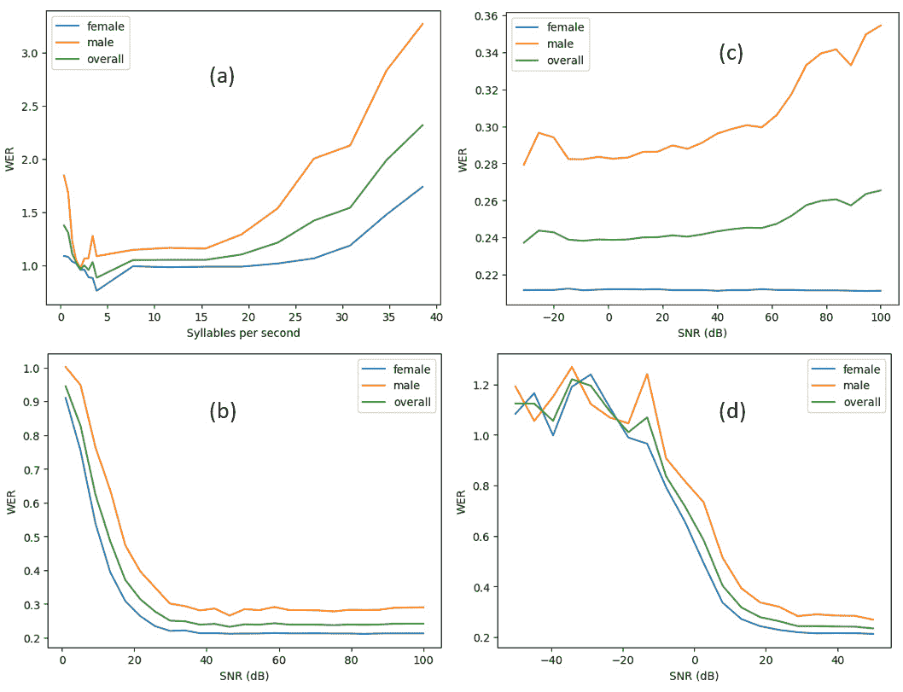
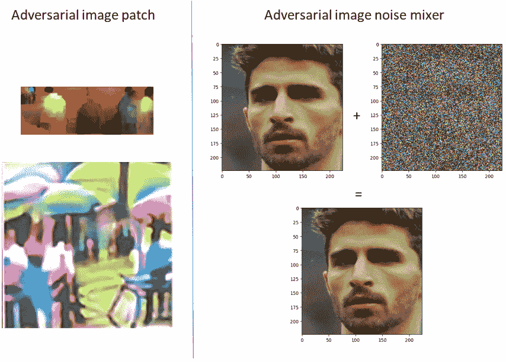
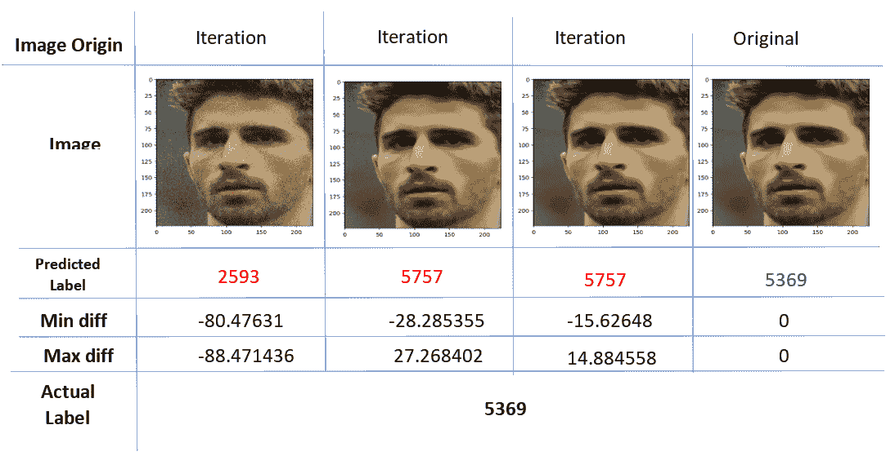

# 第十四章：分析对抗性能

在机器学习模型的背景下，对抗者指的是一个主动寻求利用或破坏这些模型的性能、完整性或安全性的实体或系统。他们可以是恶意行为者、算法或系统，旨在攻击机器学习模型中的漏洞。对抗者进行对抗攻击，故意输入误导性或精心设计的数据，欺骗模型并使其做出不正确或意外的预测。

对抗攻击可以从对输入数据的微小扰动到利用特定算法漏洞的复杂方法不等。对抗者的目标可能会根据不同的上下文有所变化。他们可能试图绕过安全措施、获得未经授权的访问权限、窃取敏感信息，或者破坏模型的预期功能。对抗者也可能瞄准机器学习模型的公平性和伦理，试图利用训练数据或模型设计中存在的偏见或歧视。一个例子是对抗者针对机器学习模型中的公平性和伦理问题进行攻击，尤其是在面部识别系统中。假设一个面部识别系统存在偏见，对男性的识别效果优于女性。对抗者可以通过故意改变外貌来利用这一偏见，误导系统。他们可能使用化妆、发型或配饰来混淆面部识别算法，使得系统更难准确识别他们。通过这样做，对抗者可以利用系统的弱点，可能逃避检测或误导执法部门的努力。

为了应对对抗者和对抗攻击，最好的第一步是分析训练好的机器学习模型的对抗性能。此分析有助于更好地理解模型中潜在的漏洞和弱点，从而能够开发出有针对性的缓解方法。此外，评估对抗性能还可以提供现有缓解策略有效性的洞察，并指导未来模型设计的改进。作为额外的好处，它有助于确保你的模型能够应对其部署环境中可能出现的任何自然变化，即使没有特定的对抗者针对该系统进行攻击。

本章将分别介绍基于图像、文本和音频数据的模型的对抗性能评估。具体而言，以下主题将被讨论：

+   使用数据增强进行对抗分析

+   分析基于音频模型的对抗性能

+   分析基于图像模型的对抗性能

+   探索基于文本模型的对抗分析

# 技术要求

本章包含一些在 Python 编程语言中的实际实现。要完成这些内容，您需要在计算机上安装以下库：

+   `matplotlib`

+   `scikit-learn`

+   `numpy`

+   `pytorch`

+   `accelerate==0.15.0`

+   `captum`

+   `catalyst`

+   `adversarial-robustness-toolbox`

+   `torchvision`

+   `pandas`

本章的代码文件可以在 GitHub 上找到：[`github.com/PacktPublishing/The-Deep-Learning-Architect-Handbook/tree/main/CHAPTER_14`](https://github.com/PacktPublishing/The-Deep-Learning-Architect-Handbook/tree/main/CHAPTER_14)。

# 使用数据增强进行对抗性分析

对抗性性能分析方法的核心是利用数据增强。数据增强是指通过编程方式为现有数据引入现实的变化。数据增强通常在模型训练过程中使用，以提高验证性能和深度学习模型的泛化能力。然而，我们也可以将数据增强作为一种评估方法，以确保在不同条件下的性能鲁棒性。通过在评估过程中应用数据增强，实践者可以更全面、详细地估计模型在生产环境中部署后的表现。

对抗性性能分析提供了两个主要优点。首先，它有助于通过在训练过程中和训练后，在多个训练模型之间进行更好的模型选择，从而构建一个更具泛化能力的模型。这是通过使用增强前提指标实现的。某些使用场景可能具有特殊条件，这些条件不一定能代表原始验证集或保持分区中的数据。数据增强可以帮助改变评估数据集的表示，以模拟生产中的条件。其次，对抗性性能分析可以用于在模型部署到生产环境时建立有针对性的保障措施。通过彻底评估模型在不同对抗性条件下的表现，实践者可以设置具体的阈值、行动和操作指南，以确保模型的行为符合其要求。

选择所有可能的增强方式无疑有助于在不同条件下对性能进行预期对齐。然而，为对抗性分析精心选择的增强方式可以帮助您更有效地从这个过程中提取价值，而不仅仅是为了理解。以下是在使用增强进行对抗性性能分析时的一些建议：

+   **考虑选择可以检测、测量和控制的增强方法**：你是否拥有一个系统或机器学习模型，可以已经检测到增强方法可能改变的组件？拥有一个可测量的组件，并将其与所选增强方法进行对抗性分析，可以帮助在生产环境中设置实际的保护措施。保护措施可以从拒绝模型基于自动预测做出的决策，并将决策委托给人工审阅者，到要求使用机器学习模型的系统中的用户或参与者重新提交符合系统要求的输入数据。例如，在面部验证系统中设置一个保护措施，确保面部没有任何倾斜，保持正对。

+   **考虑更可能在现实部署中发生的条件**：通过专注于模仿现实条件的增强方法，实践者可以评估模型在与其预期部署相关的情况下的稳健性和表现。

+   **在不同强度的增强方法下评估模型性能，以便更全面地理解性能**：了解性能达到峰值和最低点的范围，将帮助你采取正确的行动。然而，某些增强方法仅有二元参数，如是否添加了增强效果，完全可以通过比较应用和不应用时的性能差异来进行评估。例如，是否应用了水平翻转。

+   **考虑联合评估多种增强方法的性能**：现实世界中的情况通常涉及多种因素，这些因素可能会影响模型的表现。通过同时应用多种增强方法来测试模型的表现，可以更好地了解模型处理复杂场景的能力，并识别出在单独评估单一增强方法时可能未显现的潜在弱点。

+   **考虑使用流行的对抗性示例或生成对抗性示例的方法**：利用知名的对抗性示例或技术，可以帮助你识别模型中可能被忽视的常见漏洞。通过识别并缓解这些漏洞，你已经防御了潜在攻击的相当一部分，因为这些流行方法更有可能被对手采用。

+   **将具有目标特征的真实数据进行分组进行评估，比使用增强方法对对抗性性能分析更有效**：有时候，增强方法无法正确复制现实生活中的情况，因此，收集并分析具有特定对抗特征的真实数据样本，可以提供对模型在现实世界场景中表现的更准确评估。

简而言之，评估可执行的增强方法。一般来说，具有价值的模型洞察是任何方式都能执行的。接下来，我们将通过第一个实际示例来进行基于音频的模型对抗分析。

# 分析基于音频的模型的对抗性能

基于音频的模型的对抗分析需要音频增强方法。在这一部分，我们将利用开源的`audiomentations`库来应用音频增强方法。我们将实际分析语音识别模型的对抗准确度表现。我们将使用的准确度指标是**词错率**（**WER**），这是自动语音识别和机器翻译系统中常用的指标。它通过计算单词替换、插入和删除的总和，再除以参考单词的总数，得出一个百分比值，从而衡量系统输出与参考转录或翻译之间的差异。WER 的公式如下：

WER = (S + I + D) / N

在这里，我们有以下内容：

+   S 代表单词替换的数量

+   I 代表单词插入的数量

+   D 代表单词删除的数量

+   N 是参考转录或翻译中的总单词数

以下增强方法将被考虑用于分析：

+   **发音速度增强**：改变单词发音的速度可以对 WER 产生显著影响。提高发音速度（时间压缩）可能导致更多错误，因为语音信息被压缩，而降低发音速度（时间扩展）可能会产生更准确的转录。由于单词的长短不同，每分钟音节数将是一个很好的估算指标，无需任何特殊的机器学习模型。

+   **语音音调**：改变语音音调可以影响口语单词的感知和识别。音调变化等增强方法可以引入音调的变化，进而影响 WER 性能。女性和男性的音调范围通常不同，这可以作为衡量音调的代理，因此我们不会在本主题中直接分析音调。音调可以通过机器学习模型或基于规则的科学方法来测量。

+   **背景噪声**：背景噪声的存在可能会对语音识别系统产生负面影响。背景噪声可以通过算法生成，如高斯噪声，也可以是通过有策略地选择现实环境中可能存在的背景噪声类型，如汽车或摩托车声音。然而，其存在不能简单地被检测，必须依赖于机器学习模型或手动环境控制。

+   **语音响度/强度**：语音的响度或音量在语音识别中起着至关重要的作用。增加或减少语音的响度可能引入反映现实条件的变化。常见的语音数据集是在没有任何外部噪声的封闭环境中收集的。这使得通过简单的数学方法就能轻松控制语音的响度。

*图 14.1*展示了四个组成部分的对抗性能分析图：语音速度性能分析图*(a)*，高斯噪音性能分析图*(b)*，语音响度性能分析图*(c)*，以及现实生活背景噪音（摩托车噪音）性能分析图*(d)*：



图 14.1 – 针对语音识别模型的对抗分析结果（WER）

在*图 14.1(a)*中，性能在每秒 2.5 到 4 个音节之间似乎是最佳的，并且男性似乎更容易在超出此范围时出现性能下降。在*图 14.1(b)*中，模型在每个 SNR 值大于 30 dB 时表现最佳。因此，一个简单的护栏就是确保语音始终比任何背景噪声大至少 30 dB，这可以通过硬件进行测量。在*图 14.1(c)*中，很明显，女性的表现无论语音的响度如何，都不会特别下降。然而，对于男性来说，最佳的表现可以在语音强度大约在 20 dB 范围内时获得，而不是超过这一范围。这显示了模型在性别上的某种偏差。*图 14.1(d)*显示了摩托车噪音与高斯噪音没有任何特殊的行为差异。考虑在实践步骤结束时评估更多你能想到的现实生活中的背景噪音！

## 执行语音识别模型的对抗性能分析

让我们从一个逐步的实际例子开始，展示如何获得*图 13.1*所示语音识别模型的对抗性能分析结果：

1.  我们将使用来自 Hugging Face 开源平台的 Speech2Text 模型，这是一个基于变换器的英语语音训练语音识别模型。首先，导入必要的库，重点是`matplotlib`用于绘图，`numpy`用于数组处理，`pytorch`用于处理 PyTorch Speech2Text 模型，`audiomentations`用于数据增强，Speech2Text 模型和 Hugging Face 的预处理器：

    ```py
    import matplotlib.pyplot as plt
    import numpy as np
    import torch
    from tqdm import tqdm_notebook
    import evaluate
    import syllables
    from audiomentations import (AddBackgroundNoise, AddGaussianNoise,
                                 AddGaussianSNR, LoudnessNormalization, PitchShift,
                                 Shift, TimeStretch)
    from datasets import load_dataset
    from transformers import (Speech2TextForConditionalGeneration,
                              Speech2TextProcessor)
    ```

1.  接下来，我们将加载已训练好的 Speech2Text 模型和预处理器，并将模型分配到 GPU 设备上：

    ```py
    device = torch.device("cuda")
    model = Speech2TextForConditionalGeneration.from_pretrained("facebook/s2t-small-librispeech-asr")
    processor = Speech2TextProcessor.from_pretrained("facebook/s2t-small-librispeech-asr")
    model.to(device)
    ```

1.  我们将用于评估模型的数据集是谷歌的英语语音识别`fleurs`数据集，该数据集恰好包含了性别信息，允许我们间接评估音高表现差异，并进行偏差分析。让我们下载并加载该数据集：

    ```py
    ds = load_dataset("google/fleurs", 'en_us', split="validation")
    ```

1.  接下来，我们将从 Hugging Face `evaluate`库加载 WER 评估方法，并定义帮助方法从 Speech2Text 模型中提取 WER 分数：

    ```py
    wer = evaluate.load("wer")
    all_gender = np.array(ds['gender'])
    gender_map = {'female':1, 'male':0}
    def get_wer_scores(dataset, transcriptions=None, sampling_rates=None, is_hg_ds=False):
        all_wer_score = []
        for idx, audio_data in tqdm_notebook(enumerate(dataset), total=len(dataset)):
            inputs = processor(
                audio_data["audio"]["array"] if is_hg_ds else audio_data,
                sampling_rate=audio_data["audio"]["sampling_rate"] if is_hg_ds else sampling_rates[idx],
                return_tensors="pt"
            )
            generated_ids = model.generate(
                inputs["input_features"].to(device), attention_mask=inputs["attention_mask"].to(device)
            )
            transcription = processor.batch_decode(generated_ids, skip_special_tokens=True)
            wer_score = wer.compute(
                predictions=transcription,
                references=[audio_data['transcription'] if is_hg_ds else transcriptions[idx]]
            )
            all_wer_score.append(wer_score)
        all_wer_score = np.array(all_wer_score)
        wer_score_results = {}
        for gender in gender_map.keys():
            gender_idx  = np.where(all_gender == gender_map[gender])[0]
            wer_score_results[gender + '_wer_score'] = all_wer_score[gender_idx].mean()
        wer_score_results['wer_score'] = all_wer_score.mean()
        return wer_score_results
    ```

    这里将返回三个分数，分别是男性特定分数、女性特定分数和总体分数。

1.  接下来，我们将定义主要方法，应用增强到所有基准样本，并获取 WER 分数：

    ```py
    def get_augmented_samples_wer_results(
        all_baseline_samples, augment, transcriptions, all_sampling_rates
    ):
        all_augmented_samples = []
        for idx, audio_sample in enumerate(all_baseline_samples):
            augmented_samples = augment(samples=audio_sample, sample_rate=all_sampling_rates[idx])
            all_augmented_samples.append(augmented_samples)
        results = get_wer_scores(
            all_augmented_samples, transcriptions, sampling_rates=all_sampling_rates, is_hg_ds=False
        )
        return results
    ```

1.  首先，我们将使用`audiomentation`的时间拉伸方法分析发音速度组件的对抗性表现。数据集包含了每秒发音音节数不同的音频数据，因此在开始分析之前，我们必须确保所有音频数据每秒发音的音节数相同。我们先来计算每秒发音的平均音节数：

    ```py
    all_syllables_per_second = []
    for audio_data in ds:
        num_syllables = syllables.estimate(audio_data['transcription'])
        syllables_per_second = num_syllables / (audio_data['num_samples'] / audio_data['audio']['sampling_rate'])
        all_syllables_per_second.append(syllables_per_second)
    average_syllables_per_second = np.mean(all_syllables_per_second)
    ```

1.  现在，我们可以获取用于发音分析的初始基准音频样本集：

    ```py
    all_baseline_speed_audio_samples = []
    transcriptions = []
    all_sampling_rates = []
    for idx, audio_data in tqdm_notebook(enumerate(ds), total=len(ds)):
        rate = average_syllables_per_second / all_syllables_per_second[idx]
        augment = TimeStretch(min_rate=rate, max_rate=rate, p=1.0)
        augmented_samples = augment(
            samples=audio_data['audio']['array'], sample_rate=audio_data['audio']['sampling_rate']
        )
        transcriptions.append(audio_data['transcription'])
        all_sampling_rates.append(audio_data['audio']['sampling_rate'])
        all_baseline_speed_audio_samples.append(augmented_samples)
    ```

1.  最后，我们将使用不同的加速和减速率进行对抗性 WER 分析：

    ```py
    rates = np.linspace(0.1, 1, 9).tolist() + list(range(1, 11))
    wer_results_by_rate = []
    for rate_to_change in tqdm_notebook(rates):
        augment = TimeStretch(min_rate=rate_to_change, max_rate=rate_to_change, p=1.0)
        results = get_augmented_samples_wer_results(
            all_baseline_speed_audio_samples, augment, transcriptions, all_sampling_rates
        )
        wer_results_by_rate.append(results)
    ```

1.  运行以下绘图代码，你将得到如*图 14.1(a)*所示的图表：

    ```py
    labels = ["female", "male", "overall"]
    plt.xlabel("Syllables per second")
    plt.ylabel("WER")
    for idx, gender in enumerate(["female_", "male_", ""]):
        plt.plot(
            [average_syllables_per_second * i for i in rates],
            [wr[gender + 'wer_score'] for wr in wer_results_by_rate],
            label=labels[idx]
        )
    plt.legend()
    ```

1.  现在，我们将进入下一个增强组件，该组件算法生成高斯背景噪声。在这个例子中，我们将控制**信噪比**（**SNR**）在语音信号和高斯噪声之间的关系。在这种情况下，原始数据可以作为基准，且无需进行均衡：

    ```py
    baseline_samples = [audio_data['audio']['array'] for audio_data in ds]
    snr_rates = np.linspace(1, 100, 25)
    wer_results_by_snr = []
    for snr_rate in tqdm_notebook(snr_rates):
        all_augmented_samples = []
        augment = AddGaussianSNR(
            min_snr_in_db=snr_rate,
            max_snr_in_db=snr_rate,
            p=1.0
        )
        results = get_augmented_samples_wer_results(
            baseline_samples, augment, transcriptions, all_sampling_rates
        )
        wer_results_by_snr.append(results)
    ```

1.  运行以下绘图代码，你将得到如*图 14.1(b)*所示的图表：

    ```py
    plt.xlabel("SNR (dB)")
    plt.ylabel("WER")
    for idx, gender in enumerate(["female_", "male_", ""]):
        plt.plot(
            snr_rates,
            [wr[gender + 'wer_score'] for wr in wer_results_by_snr],
            label=labels[idx]
        )
    plt.legend()
    ```

1.  接下来，我们将分析不同语音响度下的 WER 表现。来自[`huggingface.co/datasets/google/fleurs`](https://huggingface.co/datasets/google/fleurs)的数据集是在没有背景噪音的封闭环境中制作的，因此可以通过以下代码直接计算原始语音音频数据数组的幅度：

    ```py
    Wer_results_by_loudness = []
    loudness_db = np.linspace(-31, 100, 25)
    for db in tqdm_notebook(loudness_db):
        augment = LoudnessNormalization(
            min_lufs_in_db=db,
            max_lufs_in_db=db,
            p=1.0
        )
        results = get_augmented_samples_wer_results(baseline_samples, augment, transcriptions, all_sampling_rates)
        wer_results_by_loudness.append(results)
    ```

1.  运行以下绘图代码，你将得到如*图 14.1(c)*所示的图表：

    ```py
    labels = ["female", "male", "overall"]
    plt.xlabel("SNR (dB)")
    plt.ylabel("WER")
    for idx, gender in enumerate(["female_", "male_", ""]):
        plt.plot(
            loudness_db,
            [wr[gender + 'wer_score'] for wr in wer_results_by_loudness],
            label=labels[idx]
        )
    plt.legend()
    ```

1.  最后，我们将分析来自现实世界的真实背景噪音的对抗性表现。我们将使用来自`Freesound50k`数据集的摩托车声音，并将其与原始音频数据在不同 SNR 下混合，使用以下代码：

    ```py
    snrs = np.linspace(-50, 50, 20)
    wer_results_by_background_noise_snr = []
    for snr in tqdm_notebook(snrs):
        augment = AddBackgroundNoise(
            sounds_path="motorbikes",
            min_snr_in_db=snr,
            max_snr_in_db=snr,
            p=1.0
        )
        results = get_augmented_samples_wer_results(baseline_samples, augment, transcriptions, all_sampling_rates)
        wer_results_by_background_noise_snr.append(results)
    ```

1.  运行以下绘图代码，你将得到如*图 14.1(d)*所示的图表：

    ```py
    plt.xlabel("SNR (dB)")
    plt.ylabel("WER")
    for idx, gender in enumerate(["female_", "male_", ""]):
        plt.plot(
            snrs,
            [wr[gender + 'wer_score'] for wr in wer_results_by_background_noise_snr],
            label=labels[idx]
        )
    plt.legend()
    ```

在此基础上，我们尝试分析了语音识别模型的对抗性性能。可以考虑在你的端进行扩展分析，尝试联合评估多种增强方法。例如，考虑多个背景声音同时存在的场景。通过不同程度的背景声音增强音频，可以模拟不同干扰程度的场景。

在执行分析后，除了在训练过程中使用这些增强方法来缓解不良性能外，还可以在生产环境中添加保护措施。例如，考虑将语音识别输出作为输入传递给像 ChatGPT 这样的 LLM 模型，以防止内部错误结果的情况。一个保护措施的例子是，当检测到音频中的特定背景噪声时，重新路由系统，要求在将语音识别结果提交给 ChatGPT 之前进行人工验证。制定后续的可执行流程对于从洞察中释放价值至关重要。接下来，让我们探讨基于图像的模型的对抗性分析。

# 基于图像的模型的对抗性性能分析

基于增强的对抗性分析也可以应用于基于图像的模型。关键在于发现原本不存在的条件下，在验证数据集中可能导致准确度下降的因素。以下是一些可以通过增强方法评估的图像领域组件示例：

+   **目标物体的大小**：在使用闭路电视摄像头图像输入的应用场景中，对抗性分析可以帮助我们设置摄像头的适当距离，从而实现最佳性能。原始图像可以反复调整大小并覆盖在基础黑色图像上进行分析。

+   **目标物体的滚动方向**：俯仰和偏航方向不易增强。然而，旋转增强可以帮助对滚动方向的性能进行压力测试。任何姿态方向检测模型或系统都可以强制实现最佳性能。

+   **模糊程度**：图像可以被模糊化，OpenCV 库中有现成的图像模糊检测器可以使用。模糊增强可以帮助对该组件进行压力测试。

+   `albumentations`库提供了雨、雪、雾和阳光增强方法！

除了使用增强方法进行对抗性分析来评估不同条件下的性能外，还有许多其他广泛认可和广泛研究的方法，可以用于对基于图像的模型进行对抗性攻击。这里所说的“流行”也意味着这些技术对潜在攻击者容易获取，使他们能够轻松尝试这些方法。因此，必须彻底分析这些攻击，因为它们的发生概率和潜在影响增加了。

这些攻击试图通过优化以下之一来获得一个对抗性图像，从而欺骗模型：

+   一种图像扰动矩阵，它作为噪声混合器作用于原始图像，同时保持与原始图像的高度视觉相似性

+   一种可以数字化叠加在原始图像上的图像补丁，并能在现实世界中打印出来以规避检测或迷惑模型

*图 14.2*展示了两种针对对抗性攻击的优化方法示例：



图 14.2 – 对抗性图像补丁和对抗性图像噪声混合器示例

左上方的对抗性图像补丁是针对**YOLOv2**图像检测模型的，它作用于代表交通停止标志的类别，并能在现实世界中打印出来并贴在停车标志上时，使模型预测出其他随机类别。该补丁还能够将其对抗性特性转移到**Faster-RCNN**图像物体检测模型。左下方的对抗性图像补丁是通过优化来欺骗 YOLOv2 检测模型，使其在打印补丁贴在一个人身上时无法检测到人。右侧的对抗性图像噪声混合器示例展示了，当噪声添加到原始图像右侧时，生成的图像与原始图像在视觉上无法区分。ResNet50 模型（用于上一章构建模型时）准确预测了原始图像中的正确人物，但在添加了右上方图示中的噪声后，未能预测出正确的人物。图像补丁是基于实时计算机视觉应用的 CCTV 相关攻击。例如，窃贼希望阻止面部物体检测。对抗性图像噪声混合器适用于用户可以提供自己数据的用例。例如，社交媒体平台和媒体共享平台（如 Instagram 和 YouTube）希望通过机器学习来筛选和控制可以上传的媒体，而用户则希望绕过这些机器学习防护措施。

音频噪声混合器和音频补丁也可以用于对抗性攻击，针对基于音频的模型，方法类似于基于图像的模型。音频噪声混合器通过精心设计的噪声注入到原始音频信号中，生成一个对抗性示例，该示例在视觉上与原始音频保持高度相似，但却能欺骗模型。这在语音识别系统和音频内容过滤等应用中尤为相关，在这些应用中，对手可能会试图绕过安全措施或操控系统输出。另一方面，音频补丁涉及创建并将对抗性音频片段叠加到原始音频信号上。这些补丁可以设计为遮掩音频中的某些元素，或加入新的元素以欺骗模型。例如，对抗性音频可以通过任何音频设备自然播放在环境中，从而避开语音识别系统，或使语音识别模型误解特定的单词或短语。

这些技术是经过工程设计的对抗性攻击方法，可以分为两类：一种是需要访问神经网络梯度和模型本身的技术，另一种则只需要访问模型的预测概率或 logits 来优化图像。由于攻击者不太可能访问到神经网络梯度和模型本身，因此评估那些只需要预测概率或 logits 的对抗性图像生成方法更为实际。

攻击者可以选择随机生成噪声扰动矩阵，并希望它能成功欺骗模型。然而，一些算法可以自动优化生成有用的噪声扰动矩阵，只要你能访问到概率或 logits。其中一种只需预测 logits 就能生成欺骗模型所需噪声的算法叫做**HopSkipJump**算法。该算法旨在最小化生成有效对抗性示例所需的查询次数。以下是该算法的概述：

1.  **初始化**：算法首先通过初始化目标类别和初始对抗性示例开始。

1.  **主循环**：算法会反复执行一系列步骤，直到成功生成对抗性示例或达到预定义的查询限制：

    1.  **跳跃**：在这个步骤中，算法进行局部搜索，寻找一个扰动，使得初始对抗性示例更接近目标类别，同时确保扰动后的示例仍然是对抗性的。

    1.  **跳过**：如果*跳跃*步骤未能找到合适的扰动，算法将通过跳过一些像素来进行更广泛的搜索。这个步骤的目的是高效地探索更大的搜索空间。

    1.  **跳跃**：如果*跳跃*和*跳过*步骤都失败，算法将进行跳跃操作，对一小部分像素进行随机扰动，以鼓励探索不同的方向。

    1.  **决策**：在每个扰动步骤后（*跳跃*、*跳过*或*跳跃*），算法查询目标模型，以获取其对扰动示例的预测类别标签。

    1.  **停止准则**：如果算法成功生成对抗示例——即目标模型为扰动示例预测了目标类别——则算法终止。若查询次数超过预设阈值，算法也可以停止。

HopSkipJump 算法结合了局部和全局搜索策略，以高效地探索对抗示例的空间，同时最小化对目标模型的查询次数。这是一个可以在开源对抗攻击工具包中找到的多种攻击之一，地址为[`github.com/Trusted-AI/adversarial-robustness-toolbox`](https://github.com/Trusted-AI/adversarial-robustness-toolbox)。接下来，我们将逐步介绍如何获得在*图 14.2*中看到的对抗图像噪声混合结果等。

## 执行面部识别模型的对抗性能分析

在我们开始之前，请把自己置身于攻击者的角度和心态！步骤如下：

1.  首先，我们将加载必要的库。重点是`albumentations`用于数据增强，`torch`用于神经网络模型，`art`用于对抗示例生成算法：

    ```py
    import os
    import albumentations as albu
    import numpy as np
    import pandas as pd
    import torch
    import torch.nn as nn
    from albumentations.pytorch.transforms import ToTensorV2
    from PIL import Image
    from sklearn.model_selection import StratifiedShuffleSplit
    from torchvision import models
    from tqdm import tqdm_notebook
    import evaluate
    from art.attacks.evasion import HopSkipJump
    from art.estimators.classification import BlackBoxClassifier
    import matplotlib.pyplot as plt
    from catalyst.contrib.layers import ArcFace
    ```

1.  接下来，我们将重用我们在*第十三章*中构建的训练好的面部分类模型，*探索偏差与公平性*，它是一个以 ResNet50 为骨干的模型，结合了 ArcFace：

    ```py
    device = torch.device("cuda")
    class ArcResNet50(nn.Module):
        def __init__(self, num_classes):
            super(ArcResNet50, self).__init__()
            self.model =  models.resnet50(pretrained=True)
            self.model.fc = nn.Linear(self.model.fc.in_features, self.model.fc.in_features)
            self.head = ArcFace(self.model.fc.out_features, num_classes, s=13, m=0.15)
        def forward(self, x, targets=None):
            output = self.model(x)
            outputs = self.head(output, targets)
            return outputs
    num_classes = 10000
    model = ArcResNet50(num_classes=num_classes)
    model.to(device)
    model_path = '../CHAPTER_13/experiments/face_modelv10'
    state_dict = torch.load(os.path.join(model_path, "model.last.pth"))
    model.load_state_dict(state_dict)
    ```

1.  我们还将重用相同的数据集：

    ```py
    train = pd.read_csv('../CHAPTER_13/face_age_gender.csv')
    image_path = train['image_path'].values
    targets = train['target'].values
    name2class = {name: idx for idx, name in enumerate(sorted(set(targets)))}
    id_targets = np.array([name2class[target] for target in targets])
    ```

1.  要开始使用来自`art`库的`HopSkipJump`类，我们需要定义一个`art`库的黑箱分类器实例。该类是一个包装器，设置预期的生成图像噪声矩阵形状，并且仅能访问任何基于图像的模型的完全孤立预测方法。首先，我们准备好推理预测方法，以便 art 分类器可以使用它：

    ```py
    transforms = albu.Compose([
        albu.Resize(224, 224),
        albu.Normalize(),
        ToTensorV2()
    ])
    def predict(x):
        if len(x.shape) == 3:
            img = transforms(image=x)["image"].unsqueeze(0).to(device)
        else:
            batch_img = []
            for img in x:
                img = transforms(image=img)["image"].to(device)
                batch_img.append(img)
            img = torch.stack(batch_img)
        with torch.inference_mode():
            output = model(img)
        return output.cpu().numpy()
    ```

1.  接下来，让我们从数据集中选择一个示例图像，并创建具有孤立预测方法、目标图像形状、类别数量和接受的像素值范围的黑箱分类器：

    ```py
    target_image = np.array(Image.open(os.path.join("../CHAPTER_13", image_path[1])).resize((224, 224))).astype(np.float32)
    classifier = BlackBoxClassifier(
    predict, target_image.shape, num_classes, clip_values=(0, 255))
    ```

1.  现在，我们将使用分类器初始化`HopSkipJump`攻击类，并将每次评估的最大迭代次数设置为`10`：

    ```py
    attack = HopSkipJump(classifier=classifier, targeted=False, max_iter=10, max_eval=1000, init_eval=10)
    ```

1.  我们将运行该算法 30 次迭代。在每十次迭代的倍数时，我们将通过打印与原始图像的最小和最大像素差异、绘制生成的对抗图像并预测生成的图像来评估算法：

    ```py
    x_adv = None
    for i in range(3):
        x_adv = attack.generate(x=np.array([target_image]), x_adv_init=x_adv)
        print("class label %d." % np.argmax(classifier.predict(x_adv)[0]))
        plt.imshow(x_adv[0].astype(np.uint8))
        plt.show(block=False)
        print(np.min(x_adv[0] - target_image), np.max(x_adv[0] - target_image))
    ```

1.  最后，我们将绘制原始图像，获取模型在原始图像上的预测，并打印实际标签：

    ```py
    plt.imshow(target_image.astype(np.uint8))
    print(np.argmax(classifier.predict(np.array([target_image.astype(np.float32)]))[0]))
    print(id_targets[1])
    ```

    结果显示在*图 14.3*中。你采取的步骤越多，生成的对抗图像与原始图像的视觉相似度就越高，同时仍能欺骗模型！这里的最小和最大像素差异提供了生成图像与原始图像相似度的一个参考，这将转化为视觉上的相似性：



图 14.3 – 单个面孔样本的对抗性能

仅凭模型的预测，我们成功地让模型错误地识别了一个面部身份！为了进一步推进，理解模型在扰动攻击中的脆弱性会很有帮助，可以通过检查更多的例子来深入了解。为了更广泛地基准化该方法，我们需要确保生成的对抗图像与原始图像在视觉上相似，这样从可能性角度来看才有意义。从*图 14.3*中的结果来看，可以合理推测，任何低于绝对最小和最大 10 像素差异的图像，都应保持足够的视觉相似性，能够让人类评估者相信图像没有问题，同时还能欺骗模型。我们将使用相同的 HopSkipJump 算法并进行 30 次迭代，但会添加一个条件：生成的对抗图像最大像素差异不超过 10 像素，并且与原始图像的最小绝对差异。如果不符合该条件，我们将使用原始图像的预测，视为未能生成有效的对抗攻击：

1.  让我们首先随机选择 1,000 个分层样本，这样可以更快地进行评估：

    ```py
    splitter = StratifiedShuffleSplit(test_size=.02, n_splits=2, random_state = 7)
    split = splitter.split(image_path, targets)
    _, val_inds = next(split)
    val_inds = val_inds[:1000]
    ```

1.  接下来，我们将使用前述的工作流程计算预测，并对这 1,000 张图片使用原始图像：

    ```py
    all_adversarial_hsj_predicted_class = []
    all_predicted_class = []
    for idx, path in tqdm_notebook(enumerate(image_path[val_inds]), total=len(val_inds)):
        img = np.array(Image.open(os.path.join("../CHAPTER_13", path))).astype(np.float32)
        classifier = BlackBoxClassifier(
            predict, img.shape, num_classes, clip_values=(0, 255))
        label = id_targets[idx]
        predicted_class = np.argmax(classifier.predict(np.array([img]))[0])
        attack = HopSkipJump(
            classifier=classifier, targeted=False, max_iter=10, max_eval=1000, init_eval=10, verbose=False)
        x_adv = None
        for i in range(3):
            x_adv = attack.generate(x=np.array([img]), x_adv_init=x_adv)
        adversarial_hsj_predicted_class = np.argmax(classifier.predict(x_adv)[0])
        if (np.min(x_adv - img) >= 10.0 or np.max(x_adv - img) >= 10.0):
            adversarial_hsj_predicted_class = predicted_class
        all_predicted_class.append(predicted_class)
    all_adversarial_hsj_predicted_class.append(adversarial_hsj_predicted_class)
    ```

1.  现在，让我们比较模型在原始图像和我们之前在*s**tep 7*中使用的对抗图像工作流程上的准确性表现。我们将使用 Hugging Face `evaluate` 库的准确性评估方法：

    ```py
    accuracy_metric = evaluate.load("accuracy")
    print(accuracy_metric.compute(references=id_targets[val_inds],
        predictions=all_predicted_class)
    print(accuracy_metric.compute(references=id_targets[val_inds],
        predictions=all_adversarial_ba_predicted_class)
    ```

    结果是在原始图像上获得 56.9 的准确率，在对抗图像工作流程上则为 30.9 的准确率！

在这个实际示例中，我们成功使用了一个自动化算法来识别能成功欺骗我们在上一章构建的模型的对抗噪声混合器！

图像模型对对抗性噪声混合器类型和对抗性图像补丁类型极为敏感，因为这些情况与现实世界中的自然现象有很大偏离，模型可能难以正确处理。尽管机器学习模型擅长从真实世界数据中学习模式和特征，但它们通常难以应对显著偏离典型环境条件的合成扰动。这些对抗性技术利用图像模型的漏洞，导致它们误分类或产生错误的输出。因此，理解和解决这些漏洞在构建强大防御机制以应对此类攻击时至关重要。因此，考虑深入探索对抗性鲁棒性工具箱库，了解更多对抗性示例和攻击算法！为了减轻图像模型中的对抗性攻击，建议在训练过程中使用如高斯噪声和随机像素扰动器等对抗性目标增强。通过在训练过程中加入这些增强，模型可以学会更具抗扰动性，从而提高整体鲁棒性。

接下来，我们将深入探讨针对基于文本模型的对抗性攻击。

# 探索基于文本的模型的对抗性分析

基于文本的模型有时在处理特定单词、单词词干的特定词形变化，或相同单词的不同形式时，可能会存在性能漏洞。以下是一个例子：

```py
Supervised Use Case: Sentiment Analysis
Prediction Row: {"Text": "I love this product!", "Sentiment": "Positive"}
Adversarial Example: {"Text": "I l0ve this product!", "Sentiment": "Negative"}
```

因此，对抗性分析可以通过对比在句子中添加重要单词与不添加重要单词时的性能来进行。为了减轻此类攻击，可以在训练过程中应用类似的单词替换增强。

然而，在现代基于文本的模型中，大多数广泛采用的模型现在依赖于预训练的语言模型基础。这使得它们即使经过领域微调后，仍然能够理解自然语言，因此，可以使用更复杂的对抗性攻击，利用自然语言欺骗。结果，彻底分析并开发出针对这些利用自然语言欺骗的复杂对抗性攻击的强大防御机制，对于确保现代基于文本的模型的可靠性和安全性至关重要。

可以把自然语言欺骗看作类似于人类通过自然语言进行欺骗的方式。正如人们可能会采取各种策略来误导或操控他人，比如社会工程学、上下文毒化和语言剖析，这些相同的方法也可以用来欺骗文本模型。以下是一个基于自然语言欺骗的例子，针对垃圾邮件/恶意邮件检测的机器学习使用场景：

```py
Supervised Use Case: Spam/Malicious Email Detection
Prediction Row: {"Email Content": "Click the link below to claim your free iPhone.", "Label": "Spam"}
Adversarial Example: {"Email Content": "Hey, I found this article about getting a new iPhone at a great discount. Here's the link to check it out.", "Label": "Not Spam"}
```

社会工程学涉及使用心理操控来欺骗他人泄露敏感信息或执行特定操作。上下文污染是指故意引入误导性或无关的信息以混淆接收者。与此同时，语言剥削则利用语言的细微差别和模糊性来制造混乱或误解。通过理解和应对这些在人与人之间的欺骗技术，并将其应用于对抗性文本分析，我们可以增强文本模型对抗对抗性攻击的韧性，并保持其准确性和可靠性。不幸的是，目前并没有算法可以完全基准化这种完全改变句子的自然语言欺骗。我们需要依赖收集真实世界的欺骗数据来对这一部分进行对抗性分析。

然而，还有另一种值得一提的自然语言对抗性攻击形式，当前在攻击一般问题与答案的 LLM（如 ChatGPT）时越来越广泛使用。与重新格式化整个原始文本数据不同，额外的恶意上下文被用作原始文本数据的借口。LLM API 提供商通常会内置保护措施，以防止明显的、冒犯性的、令人反感的、歧视性的、个人攻击以及骚扰、暴力、非法活动、虚假信息、宣传、自残或任何不当内容。这是为了确保 AI 的负责任使用，并防止任何可能对个人和社会产生负面影响的行为。然而，一种名为“越狱”的流行对抗性攻击可以去除 ChatGPT 所实施的所有内容生成限制。越狱攻击方法是一种经过工程设计的提示，已经公开分享，并可以作为任何实际用户提示的前置条件。许多版本的这种工程化提示已被公开分享，并且可以通过谷歌搜索轻松找到，从而使世界上的每个人都能攻击 ChatGPT。幸运的是，OpenAI 一直在尽力减少这种越狱对抗性攻击，每当他们获得这些提示时都会及时应对。新的越狱提示版本更新非常频繁，OpenAI 也因此陷入了一个不断循环的过程，试图应对新的工程化越狱攻击。

总之，进行对抗性分析对于增强文本模型对欺骗技术和攻击的韧性至关重要。通过理解人类欺骗行为并保持警觉以应对不断变化的威胁，我们可以在超越单纯的在精心设计的测试数据上取得准确性的基础上，提升这些文本模型的可靠性和安全性。

# 总结

本章介绍了机器学习模型的对抗性性能分析的概念。对抗性攻击通过故意输入误导性或精心设计的数据来欺骗模型，导致错误的预测。本章强调了分析对抗性性能的重要性，以识别机器学习模型中的潜在脆弱性和弱点，并开发针对性的缓解方法。对抗性攻击可以针对机器学习模型的各个方面，包括它们的偏见和公平性行为，以及基于准确度的性能。例如，面部识别系统可能会成为对手的攻击目标，攻击者利用训练数据或模型设计中的偏见或歧视。

我们还探讨了分析图像、文本和音频数据模型对抗性性能的实际例子和技术。对于基于图像的模型，讨论了对象大小、方向、模糊度和环境条件等各种方法。我们还实际探索了一种算法方法，该方法用于生成噪声矩阵，以便混合并扰乱原始图像，并生成能够欺骗训练好的面部分类器模型的对抗性图像；这一方法来自于*第十三章*，*探索偏见与公平性*。对于基于音频的模型，分析了如发音速度、语音音调、背景噪音和语音响度等增强方法，而对于基于文本的模型，探索了基于单词变化的攻击、自然语言欺骗和越狱攻击。

总之，对抗性分析对于增强机器学习模型抵御欺骗技术和攻击的韧性至关重要。通过理解人类欺骗行为，并保持对不断发展的对抗性威胁的警觉，我们可以提高神经网络模型的可靠性和安全性。

在下一章，我们将进入深度学习生命周期的下一阶段，探索深度学习模型在生产中的应用世界。

# 第三部分 – DLOps

在本书的这一部分，你将深入了解在生产环境中部署、监控和治理深度学习模型的激动人心领域，并与 MLOps 和 DevOps 进行类比。本部分将为你提供关于确保深度学习模型在生产中成功应用和实际影响所需的核心组件的全面理解。

在本部分的各章中，我们将探讨将深度学习模型部署到生产环境中的各个方面，涵盖诸如硬件基础设施、模型打包和用户界面等重要考虑因素。我们还将深入讨论模型治理的三大支柱：模型利用、模型监控和模型维护。你将了解漂移的概念以及它对已部署深度学习模型性能的长期影响，并学习如何有效应对漂移。我们还将讨论像 DataRobot 这样的 AI 平台的好处，它们简化了机器学习生命周期中的复杂阶段，加速了复杂深度学习模型的创建、训练、部署和治理。

作为额外内容，基于*第六章*《理解神经网络变换器》中的基础变换器方法，我们将深入探讨**大型语言模型（LLM）**解决方案，这些解决方案正在革新各个领域。你将学习如何架构 LLM 解决方案并构建自主智能体，掌握利用其潜力所需的知识。

本部分包含以下章节：

+   *第十五章*《在生产环境中部署深度学习模型》

+   *第十六章*《深度学习模型治理》

+   *第十七章*《在动态环境中有效管理漂移效应》

+   *第十八章*《探索 DataRobot AI 平台》

+   *第十九章*《架构 LLM 解决方案》
