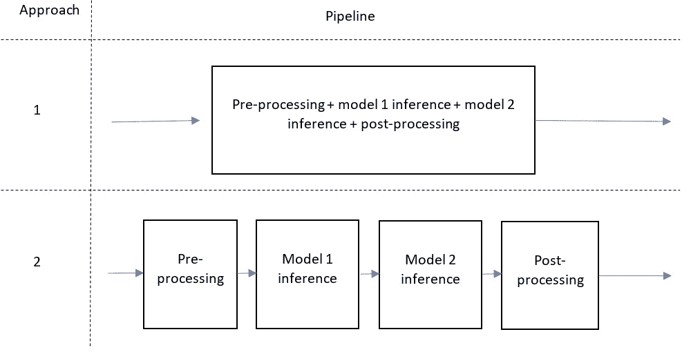

# 第十五章：将深度学习模型部署到生产环境

在前面的章节中，我们深入探讨了数据准备、**深度学习**（**DL**）模型开发的复杂性，以及如何从我们的 DL 模型中获得有价值的见解。通过细致的数据分析、特征工程、模型优化和模型分析，我们已经掌握了确保 DL 模型表现良好并按预期运行的技术。随着我们进入下一个阶段，焦点将转向在生产环境中部署这些 DL 模型。

将深度学习模型部署到生产环境的阶段是一个重要的成就，因为大多数模型无法走到这一步。如果你的项目已经达到了这一里程碑，这意味着你已经成功满足了利益相关者的需求，提供了有价值的见解，并进行了全面的价值和指标分析。恭喜你，你离加入成功项目的少数群体又近了一步。值得注意的是，根据 2022 年 Gartner 的一项调查，VentureBeat 进行了报道，这项调查在线进行，时间为 2021 年 10 月至 12 月，收集了来自美国、德国和英国的 699 名受访者的数据，约有一半（54%）的 AI 模型最终进入生产阶段。此外，由 AI 资源管理解决方案提供商 Run AI 发布的 2023 年《AI 基础设施状态调查》报告显示，在超过 88%的受访公司中，进入生产阶段的 AI 模型不到一半。该调查涉及 450 名来自美国和西欧的行业专业人士。这两项调查突显了这个过程中的挑战，以及达到这一阶段的重要性。

这里的最终目标是让这些 DL 模型以直观的方式对最终用户可用，使他们能够在实际应用中充分发挥 DL 的潜力。在本章中，我们将探讨将 DL 模型无缝集成到生产系统中的各种策略、工具和最佳实践，确保可扩展性、可靠性和用户友好性，适应各种不同的用户需求。

具体而言，我们将讨论以下主题：

+   探索深度学习模型部署的关键组件

+   确定深度学习模型部署的关键需求

+   选择正确的深度学习模型部署选项

+   探讨基于实际使用案例的部署决策

+   探索深度学习（DL）模型部署的通用建议

+   使用 ONNX、TensorRT 和 NVIDIA Triton 服务器部署语言模型

# 技术要求

在本章的最后一部分，我们将进行一个实践性主题。本教程要求你拥有一台配备 NVIDIA GPU 设备的 Linux 机器，最好是在 Ubuntu 上安装 Python 3.10 和`nvidia-docker`工具。此外，我们还需要安装以下 Python 库：

+   `numpy`

+   `transformers==4.21.3`

+   `nvidia-tensorrt==8.4.1.5`

+   `torch==1.12.0`

+   `transformers-deploy`

+   `tritonclient`

代码文件可在 GitHub 上获取：[`github.com/PacktPublishing/The-Deep-Learning-Architect-Handbook/tree/main/CHAPTER_15`](https://github.com/PacktPublishing/The-Deep-Learning-Architect-Handbook/tree/main/CHAPTER_15)。

# 探索深度学习模型部署的关键组件

那么，部署深度学习模型需要什么？它从全面了解每个必需的组件开始，并定义清晰的需求，以指导每个方面的决策。这种方法确保与业务目标和需求保持一致，最大化成功部署的机会。通过精心规划、严谨执行和专注于满足业务需求，你可以增加成功部署深度学习模型并为用户释放其价值的可能性。我们将从探索部署深度学习模型所需的组件开始。

将深度学习模型部署到生产环境不仅仅涉及训练好的模型本身。它需要各个组件之间的无缝协作，共同工作以帮助用户有效地从模型的预测中提取价值。以下是这些组件：

+   **架构选择**：部署系统的整体设计和结构。模型应该作为一个独立的服务、微服务，还是直接作为现有服务的一部分来实现？模型应该托管在云端还是本地？另一个需要考虑的方面是，是否使用容器编排平台，如 Kubernetes、Docker Swarm 或 Apache Mesos，来管理和扩展深度学习模型在容器化应用中的部署。

    这些平台提供灵活的部署方式，可以跨多台机器、云服务提供商或本地基础设施进行部署，并可与其他工具和服务结合使用，以高效管理容器化应用程序和微服务。

+   **硬件/物理基础设施选择**：这涉及到选择你希望使用的物理计算设备，以及组成该计算设备的各个组件的选择。模型应该在 CPU、GPU、TPU，还是 iPhone 中的 **人工神经引擎**（**ANE**）上运行？

+   **模型打包方法和框架**：这是一个涉及将模型的架构、权重和配置序列化为文件或容器格式的组件，从而实现模型在各种环境中的分发、部署和使用。通常，深度学习框架会提供开箱即用的模型打包支持。你是否有架构选择和硬件基础设施偏好，要求模型以特定方式进行打包？

+   **模型安全性、可信度和可靠性组件**：这包括采取措施确保部署的模型在做出准确预测时是安全、可信和可靠的。它涉及到实施防护措施以防止滥用或意外行为，确保模型的一致性，监控模型性能，并提供预测解释，以帮助用户理解和信任模型的输出。确保数据隐私并遵守相关法规也是该组件的一个关键方面。是否有任何特定的安全性、可信度或可靠性要求，必须在你的深度学习模型部署中得到满足？

+   **安全性和身份验证方法**：这些涉及到保护你的深度学习模型及其相关基础设施，以及通过实施合适的身份验证、授权和加密机制来控制对模型的访问。这确保只有授权用户才能访问和与模型进行交互，防止未授权访问、数据泄露以及潜在的模型滥用。你的深度学习模型部署需要哪些安全性和身份验证要求？这些要求将如何集成到你的系统中？

+   **通信协议**：这些定义了在部署的模型和系统中的其他组件或用户之间交换数据的规则和格式。它涉及根据要求选择适当的协议，例如延迟、可靠性和数据格式。通信协议的示例包括 HTTP、RESTful API、gRPC、服务器推送事件和 WebSocket。哪些通信协议最适合你的深度学习模型部署？它们将如何实现，以便模型和用户之间能够无缝互动？

+   **用户界面**：这些是视觉组件和交互方式，允许用户或下游系统访问、与部署的深度学习模型进行交互并获取预测。用户界面可以是基于网页、移动端、桌面应用程序、API，甚至是语音激活系统，具体取决于使用场景和目标用户群体。设计用户友好且直观的界面至关重要，以确保用户能够轻松理解并充分利用模型的预测功能。什么样的用户界面最适合你的深度学习模型部署？如何设计界面，以提供最佳的用户体验，同时有效地传递模型的能力？以下是一些特定于深度学习模型的用户界面设计挑战示例：

    +   **可视化复杂数据**：深度学习模型通常处理多维数据，这可能会让数据以用户友好的方式展示变得具有挑战性。设计人员可能需要设计创新的方式来可视化和呈现这些数据，使用户能够访问并理解这些数据。

    +   **处理实时数据**：在深度学习模型处理和分析实时数据的场景中，用户界面必须有效地管理数据流和更新，确保用户及时获得准确的信息，同时避免信息过载。

    +   **促进模型交互**：用户可能需要与深度学习模型互动，以调整参数、提供反馈或请求额外信息。设计直观的用户界面元素以支持这些交互至关重要，确保用户能够有效地与模型互动。

    +   **解释模型输出**：深度学习模型可能会产生复杂且微妙的输出，这可能会使用户理解和操作变得困难。设计者必须找到方法，以清晰且可操作的方式呈现模型预测结果，同时提供上下文信息，帮助用户解释结果。

    +   **管理不确定性**：深度学习模型可能会产生具有不同置信度或不确定性的预测。设计者应考虑如何将这种不确定性传达给用户，确保他们意识到模型输出的局限性和潜在风险。

    +   **可访问性与包容性**：深度学习模型的用户界面应当适应各种不同背景的用户，包括有不同能力、语言和文化背景的用户。设计师必须确保他们的界面具有可访问性和包容性，考虑到各种用户需求和偏好。

+   **监控与日志组件**：这些工具允许你实时跟踪深度学习模型的性能、使用情况和健康状况。通过收集和分析相关的指标、日志和警报，该组件有助于发现潜在问题、优化模型性能，并确保稳定的部署环境。你将如何实施监控和日志记录，以追踪深度学习模型的健康状况和性能，并且哪些指标对衡量其成功至关重要？

+   **持续集成/持续部署** (**CI/CD**)：该过程涉及每当模型的代码、数据或基础设施发生变化时，自动构建、测试和部署你的深度学习模型。CI/CD 简化了开发生命周期，实现了更快速的迭代和改进，同时确保已部署的模型保持最新并且可靠。你将采用哪些 CI/CD 实践和工具，以维持你的深度学习模型的无缝部署流程？

在每个组件都有众多选项的情况下，制定决策策略至关重要。这个过程的第一步是定义具体的需求，以指导每个组件的决策。在下一节中，我们将讨论如何建立这些需求，确保你的选择与业务目标相符。

# 确定深度学习模型部署的关键要求

为了从多种选项中确定最合适的部署策略，必须识别并定义七个关键要求。这些要求包括延迟和可用性、成本、可扩展性、模型硬件、数据隐私、安全性，以及信任和可靠性要求。让我们详细探讨每一个要求：

+   **延迟和可用性要求**：这两者是紧密相关的组件，应一同定义。可用性要求指的是模型预测的期望运行时间和可访问性水平。延迟要求指的是模型必须满足的最大可接受延迟或响应时间，以提供及时的预测或结果。如果一个部署具有较低的可用性要求，通常可以容忍较高的延迟预测，反之亦然。原因之一是，如果低延迟基础设施在请求模型预测时不可用，那么它就无法确保低延迟。然而，也有一些特殊情况，只在短时间内需要完全可用且低延迟，而其他时间可以不可用，这被视为低可用性但具有低延迟要求。以下是确定延迟和可用性要求时的一些最佳实践：

    +   考虑使用 DL 模型的最终用户或应用程序的期望和需求。与相关方沟通，了解他们期望的响应时间和可用性水平。

    +   评估延迟和可用性对整体系统或业务流程的影响。识别延迟可能显著影响用户体验或业务运营的关键点。等待至少 1 小时才能获得预测，是否能够提供业务所需的价值？

    +   确定可用性特别重要的时间窗口或时段。确定 DL 模型是否需要全天候 24/7 可用，或是否有特定的时段或事件需要高可用性。

    +   设置理想和最大延迟与可用性阈值。最大值通常是指仍能获得显著价值的水平，而理想条件则是稍微提高该值的情况。

+   **成本要求**：预算限制是任何企业的关键考虑因素，因此必须确定您愿意为部署机器学习模型分配的最大成本，以便根据模型预期带来的价值进行规划。为了确保费用不会超过组织愿意投入的金额，建议进行成本效益分析。此分析将评估部署基础设施中各个组件的成本影响，包括如何实现更高的延迟和可用性水平。通过仔细平衡所需要求与相关基础设施成本及操作复杂性，您可以做出与组织整体财务目标相一致的明智决策，同时依然能利用机器学习的优势。

+   **可扩展性要求**：可扩展性是指部署基础设施能够在不影响性能或质量的情况下，应对工作负载需求的增加或减少。确定深度学习模型的可扩展性要求至关重要，因为这将影响部署策略和基础设施的选择。您是否预期模型使用量会随着时间增长？您预期它会增长多快？您需要横向扩展（增加更多模型实例）还是纵向扩展（增加现有实例的资源）？对使用增长速率的预期将帮助您在模型落地时做出适当的组件选择和决策。

+   **模型硬件要求**：选择用于部署深度学习模型的硬件至关重要，因为它会显著影响整体部署的性能、延迟和成本。为了正确识别硬件需求，请考虑以下几点：

    +   **兼容性**：确保所选硬件与用于开发深度学习模型的框架和库兼容。这包括检查硬件是否能支持特定功能，例如可能对模型性能至关重要的 GPU 加速。

    +   **处理能力**：评估高效运行模型所需的处理能力，包括核心数量、内存和存储。考虑模型的复杂性和大小可能对硬件要求的影响。

    +   **功耗和散热**：所选硬件的功耗和散热情况会影响整体运营成本和部署的环境足迹。选择能在性能与能源效率之间找到平衡的硬件。

    +   **未来适应性**：考虑硬件的预期使用寿命及其是否能够适应模型未来的更新或改进。选择可以轻松升级或更换的硬件，以应对可能的需求。

    +   **集成**：确保硬件能够无缝集成到其他部署基础设施及相关系统或组件中。

    通过彻底评估模型的硬件要求，您可以做出明智的决策，确保在优化性能的同时，最小化成本和潜在的瓶颈。

+   **数据隐私要求**：确保深度学习模型及其预测所使用数据的隐私和安全至关重要，因为这会影响部署的信任和合规性。为识别并解决数据隐私要求，请考虑以下方面：

    +   **合规性要求**：了解适用于您组织的数据保护法规和行业标准，如 GDPR、HIPAA 或 CCPA。确保部署策略和基础设施符合这些法规。

    +   **数据存储和处理地点**：评估数据在部署过程中存储和处理的位置。确定是否存在数据驻留要求或限制，如需要将数据存储在特定的地理区域。

    +   **数据访问控制**：所有深度学习应用都应要求实施适当的访问控制，以确保只有授权的用户或系统可以访问数据。这包括实现身份验证、授权和加密机制。

    +   **数据保留和删除政策**：检查是否有数据保留和删除的法律和合规要求。确保部署基础设施支持这些政策，并在必要时允许安全删除数据。

    +   **数据监控与审计**：检查是否需要实施监控和审计机制，以跟踪部署过程中数据的使用和访问。

    +   **数据泄露响应计划**：此类计划应包括角色与职责、沟通渠道和修复措施。检查是否需要制定数据泄露响应计划，列出发生数据泄露或安全事件时的应对步骤。

+   **安全性要求**：反思模型在特定地区部署时必须遵守的法律和伦理边界。

+   **信任与可靠性要求**：机器学习模型的信任与可靠性指的是对模型在部署和运行过程中保持一致的性能、准确性，以及遵守伦理和合规标准的信心。在确定要求时，请考虑以下问题：

    +   模型多久更新或修改一次？

    +   是否有必要追踪多个模型版本？

    +   模型在其运行环境中是否会面临概念漂移或数据漂移？

    +   高效的错误检测和解决有多重要？

    +   模型多久会收到更新或新增功能？

    +   适应用户反馈或变化的需求是否至关重要？

    +   是否有机会利用深度学习的进展来改进模型？

    +   维护稳定和安全的生产环境是否是优先事项？

    +   模型的性能对其用户或业务功能有多关键？

    +   是否有与性能相关的严格服务水平协议（SLA）或监管要求？

    +   在不同环境和配置中，性能一致性是否重要？

    +   模型的预测是否具有重大影响，从而使得一致性对用户信任和成功至关重要？

其中一些要求最好在规划阶段早期确定。例如，从一开始就定义延迟要求，可以帮助您选择一个合适的模型，以确保运行时持续时间符合指定的延迟限制。在探讨了需要定义的要求类型和定义这些要求的大致方法后，我们现在可以讨论如何选择正确的部署选项。

# 选择合适的深度学习（DL）模型部署选项

为深度学习（DL）模型选择正确的部署选项是确保最佳性能、可扩展性和成本效益的关键步骤。为了帮助您做出明智的决策，我们将根据不同的需求探讨推荐的选项。这些建议涵盖多个方面，例如硬件和物理基础设施、监控和日志记录组件，以及部署策略。通过仔细评估模型的特性、资源限制和预期结果，您应该能够识别最合适的部署解决方案，以最大化效率并通过本指南实现投资回报率。我们将在这里探讨的实际部署组件包括架构决策、计算硬件、模型打包与框架、通信协议和用户接口。让我们一一深入探讨每个组件，从架构选择开始。

## 架构选择

机器学习服务的架构选择涉及设计基础设施、数据管道和部署方法，以确保高效和可靠的操作。我们将从服务部署的考虑因素开始：

+   **微服务**：**将深度学习（DL）模型**部署为一个小型、松散耦合、可独立部署的服务，并拥有自己的 API。微服务是一种软件架构设计模式，将应用程序构建为一组小型、松散耦合且可独立部署的服务。每个微服务负责应用程序中的特定功能或领域，并通过明确定义的**应用程序接口（API）**与其他微服务进行通信。因此，当以微服务形式部署时，前提是其他组件也必须以微服务的方式实现。其优势如下：

    +   更好的可扩展性

    +   更便捷的更新和维护

    +   更高的弹性

    +   技术选择的灵活性

    在以下情况下选择该微服务：

    +   当预计模型使用量会增长时

    +   当需要频繁更新时

    +   当需要与各种外部系统集成时

    +   当高可用性至关重要时

+   **独立服务**：将深度学习模型作为一个独立的服务部署，而不是微服务。以电影推荐应用为例——微服务方法是创建一个**评论分析服务**微服务，使用深度学习模型处理电影评论。它有自己的 API、数据存储和部署管道，并且独立于应用中的其他服务运行。在同一个应用中采用独立服务方法，**电影推荐服务**结合了用户偏好管理、电影评论分析（使用深度学习模型）和推荐生成。它更具单体结构，整合了相关功能，拥有自己的 API，但没有为评论分析单独设置微服务。其优点如下：

    +   更容易的管理和维护

    +   更适合复杂的应用

    +   集中的资源和数据访问

    +   组件之间的简化通信

    +   更可预测的性能

    在以下情况下选择此独立服务：

    +   当应用中服务数量有限时

    +   当模型复杂并且需要更单体化的方法时

    +   当模型的范围变化不频繁时

    +   当优先考虑弹性与复杂性之间的平衡时

+   **现有服务的一部分**：将深度学习模型集成到应用或系统的现有服务中。其优点如下：

    +   更少的复杂性

    +   改进的性能

    +   更容易的数据同步

    +   潜在的成本节约

    在以下情况下选择与现有服务集成：

    +   当模型使用量增长有限时

    +   当不需要频繁更新或修改时

    +   当与外部系统的集成有限时

    +   当高弹性不是关键要求时

在微服务和与现有服务集成之间做出决定时，应考虑可扩展性、更新频率、集成需求和弹性等因素。根据这些因素与您的具体需求对齐，以便做出最佳的深度学习模型部署决策。接下来，我们将讨论选择物理部署环境的建议：

+   **云**：当您需要高可用性并且能容忍适度的延迟时，云部署是合适的。它们减少了前期成本，并提供灵活的按需付费定价模型。基于云的基础设施提供几乎无限的资源，允许快速自动扩展，并且通常提供高可用性的保证和托管服务。然而，您需要仔细评估云服务提供商的安全性，并确保其与您的深度学习框架和库兼容。提供 GPU 服务的公司包括 AWS、GCP、Microsoft Azure 和 IBM Cloud。

+   **本地服务器**：本地服务器部署让你对硬件和网络资源拥有更多的控制权，非常适合在特定地理区域内实现低延迟和高可用性。这类部署需要在硬件和维护方面的前期投资，但如果你有高且稳定的资源需求，长期来看可以节省成本。与云端部署相比，本地部署在安全措施和数据隐私方面提供更多的控制权，但也需要更多的精力来维护和更新安全措施。确保与深度学习框架及库的兼容性。

+   **边缘本地部署**：也叫做边缘计算，这种方法将数据处理靠近数据源，提供极低的延迟、提升的安全性和数据隐私保护。边缘部署适用于需要将数据处理和存储靠近数据源的场景，并且能够减少数据传输成本。然而，跨多个边缘设备管理安全性，并确保与深度学习框架及库的兼容性，可能是一个挑战。边缘部署在分布式处理方面具有可扩展性，但可能需要更多的管理和维护工作。

接下来，我们将深入探讨容器编排平台，它们对应用程序和服务在系统中的设计、部署和管理方式产生了深远影响。容器是一个轻量级、独立的可执行软件包，包含了运行软件所需的所有内容，包括代码、运行时、系统工具、库和设置。容器彼此隔离，也与主机系统隔离，使它们能够在不同的计算环境中一致地运行。容器技术主要有两种类型：Docker 容器和 Linux 容器（LXC）。

容器编排平台帮助管理和扩展容器化应用程序中深度学习模型的部署，利用 Docker 容器或 LXC 等技术。这些平台提供跨多台机器、云服务商或本地基础设施的灵活部署。它们可以与其他工具和服务结合使用，从而实现对容器化应用和微服务的高效管理。以下是一些流行的容器编排平台：

+   **Kubernetes（开源）**：Kubernetes 是一个开源的容器编排平台，能够自动化部署、扩展和管理容器化应用程序，包括深度学习模型。它与多种容器技术兼容，包括 Docker 和 LXC。

+   **Docker Swarm（开源）**：Docker Swarm 是 Docker 容器的原生集群和调度工具。它与 Docker 生态系统紧密集成，提供了一种简单的方式来部署和管理容器化应用程序。虽然功能上不如 Kubernetes 丰富，Docker Swarm 以其易用性和更快速的设置而闻名。

+   **Apache Mesos（开源）**：Apache Mesos 是一个分布式系统内核，它将 CPU、内存和存储资源从机器中抽象出来，使得系统具有容错性和弹性。它可以与其他框架（如 Marathon 或 DC/OS）结合使用，提供容器编排功能，用于部署和管理深度学习模型。

+   **Amazon Elastic Kubernetes Service (EKS) 和 Amazon Elastic Container Service (ECS)（收费服务）**：这些是 AWS 提供的托管容器编排服务。EKS 是一个托管的 Kubernetes 服务，而 ECS 是 AWS 自有的容器编排平台。这两项服务简化了在 AWS 基础设施上部署、扩展和管理容器化应用程序的过程。

选择最适合你深度学习部署需求的容器编排平台，例如灵活性、可扩展性、与你偏好的容器技术的兼容性、云提供商以及与其他工具和服务的集成。

接下来，我们将深入探讨实时预测和批量预测之间的架构权衡：

+   **实时预测**：建议将模型始终加载到内存中，以减少延迟并快速响应请求。此设置适用于即时响应至关重要的应用场景，如自动驾驶汽车、实时聊天机器人或欺诈检测系统。使用此选项时，以下是一些建议：

    +   使用一台专用服务器或云实例，确保有足够的内存和处理能力来处理模型和并发请求

    +   使用量化、剪枝或模型蒸馏等技术优化模型推理

    +   如果需要，实施负载均衡器以将传入请求分配到多个模型实例

    +   监控资源使用情况和性能，确保系统满足实时要求，并根据需要进行扩展

    +   使用队列系统确保工作人员不会过载，或者实施自动扩展来处理超载情况

+   **按需批量预测**：批量预测适用于实时响应不重要的场景，且预测可以按批次处理。此设置需要额外的时间来启动工作基础设施、初始化模型并加载训练好的模型权重。使用此选项时，以下是一些建议：

    +   使用队列系统，如 RabbitMQ 或 Amazon SQS，来管理传入的预测请求

    +   设置批处理系统，当处理开始时初始化模型并加载权重

    +   优化批处理大小，以平衡处理时间和资源使用

    +   实施自动扩展来处理变化的工作负载并确保资源的高效使用

接下来，我们将探讨计算硬件选择和建议。

## 计算硬件选择

选择硬件以执行模型计算是关于成本、可用性和运行时之间的权衡。我们来探讨不同的选项，并附上使用每种选项的建议：

+   **CPU**：CPU 是部署深度学习模型的多功能且具有成本效益的选项。它们与大多数框架和库兼容，并为不太复杂的模型提供不错的性能。当成本是首要考虑因素，并且你不需要 GPU 或 TPU 提供的高处理能力时，CPU 是一个不错的选择。

+   **GPU**：GPU 提供更快的处理速度和更好的并行化，显著降低延迟并提高性能。它们非常适合需要高处理能力的复杂模型。当你需要低延迟和高可用性时，GPU 是一个极好的选择，但它们的成本高于 CPU。

+   **TPU**：TPU 是为机器学习任务设计的专用硬件，提供高性能和高效处理。它们特别适用于大型模型或计算密集型任务。当你需要卓越的处理能力和低延迟时，TPU 是一个不错的选择，但要注意可能会有较高的成本，而且它仅在 GCP 中可用，并且只能在 TensorFlow 中使用！

+   **人工神经引擎** (**ANE**)：ANE 是专门的 AI 加速器，通常出现在如 iPhone 等设备中。它们为边缘设备上的深度学习任务提供高效的处理，具有低延迟和能效高的性能。当你的应用需要在 iPhone 这样的边缘设备上满足用户界面需求时，ANE 是一个不错的选择。需要注意的是，它仅与 CoreML 框架兼容，且需要使用 ONNX 权重格式来轻松转换权重到 CoreML。

+   **FPGA**：FPGA 是高度可定制的（其硬件电路可以编程！），同时具有能效高的特性，适用于部署需要低延迟和适应性的深度学习模型。这里的缺点是需要具备深厚的 FPGA 编程语言和电路开发专业知识，才能成功地高效地进行已训练神经网络的推理。这对于大多数团队来说是一个超出范围的设备。

接下来，我们将探讨模型打包和框架选择以及建议。

## 模型打包和框架

这决定了深度学习模型的执行方式，且推荐的选择可能取决于所使用的计算硬件，以及可移植性和运行时需求。以下是一些常见示例，并附有使用建议：

+   **原始框架包装**：你可以利用框架提供的特定优化和功能，从而提高性能。然而，在某些情况下，可能需要与特定硬件选项兼容，例如使用 TPU，而 TPU 仅支持 TensorFlow 框架。因此，如果你有 TPU 而选择使用 PyTorch，就无法使用 TPU。

+   **开放神经网络交换** (**ONNX**) **框架**：ONNX 提供了一种开放标准，用于表示深度学习模型，允许你将模型转换为不同的框架，并在各种硬件平台上运行。使用 ONNX 可以提高模型的灵活性和可移植性，使你能够从更广泛的硬件和基础设施选项中进行选择。此外，它还可以让你利用不同深度学习框架提供的优化和功能。一种方便且通用的解决方案是将模型转换为 ONNX 格式，之后可以根据需要轻松转换为其他格式。这种方法简化了过程，并确保与各种硬件和框架选项的顺利集成，例如在 iPhone 中利用 ANE 加速应用中的深度学习模型。

+   **ONNX Runtime**：这是一种推理加速器，旨在通过利用计算和内存优化来加速在任何硬件上的深度学习模型推理。在 ONNX Runtime 中运行模型比在本地深度学习框架（如 TensorFlow 或 PyTorch）中运行更快。

+   **TensorRT**：这是 NVIDIA 提供的高性能深度学习推理优化器和运行时/编译器库，旨在加速 NVIDIA GPU 上的深度学习模型推理。它支持 TensorFlow 和 ONNX，并提供便捷的方式将模型权重转换为与其框架兼容的格式，从而实现快速高效的模型部署。TensorRT 通过在较低层次调优模型，利用不同 GPU 内部硬件能力，提高 GPU 上的模型推理速度，最大化推理时的模型效率。由于 ONNX 权重与 TensorRT 兼容，将 PyTorch 模型权重转换为 TensorRT 兼容的权重格式的典型路径是先将 PyTorch 模型权重转换为 ONNX 权重。在 NVIDIA GPU 上，TensorRT 的推理速度被认为比 ONNX Runtime 更快。

+   **开放视觉推理与神经网络优化** (**OpenVINO**)：这是英特尔提供的一款工具包，旨在加速深度学习模型在英特尔硬件（包括 CPU、GPU 和 FPGA）上的推理。它支持 TensorFlow、ONNX 以及其他框架，提供在多种环境中的优化模型部署。

接下来，我们将探讨通信协议的选择和建议。

## 使用的通信协议

你应该使用的协议取决于运行时需求、网络负载需求、所选的用户界面、部署模式以及计算需求。以下是一些示例及其推荐：

+   **MQTT**：当你需要一个轻量级、低延迟的协议，适用于资源有限的设备（如物联网设备），并且实时通信和状态更新对你的应用至关重要时，可以使用 MQTT。功耗和散热是重要的考虑因素。

+   **HTTP 或 REST API**：当你需要一个受支持良好、易于实现的协议来处理网页服务和数据交换，且你的应用遵循请求-响应通信模式，并且需要符合数据保护法规和数据隐私要求时，选择此协议。

+   **gRPC**：当你需要高性能、低延迟协议来处理大规模分布式系统或微服务时，选择 gRPC，同时它还支持双向流和多种编程语言的支持。

+   **服务器推送事件**（**SSE**）**或 WebSockets**：当实时通知或实时更新对你的网页应用至关重要时，请使用它们。如果你需要服务器与客户端之间的单向通信，请使用 SSE。如果你需要服务器与客户端之间的双向通信，请使用 WebSockets。一个需要这些通信协议的显著领域是具有机器学习功能的实时协作工具。以下是一些示例：

    +   Grammarly 使用 WebSockets

    +   ChatGPT 使用 SSE

接下来，我们将探讨用户界面选择和推荐。

## 用户界面

在设计机器学习应用的用户界面时，必须考虑用户体验、可访问性、响应性和适应性等因素。以下是一些用户界面的建议：

+   **网页应用程序**：

    +   它们适用于跨平台访问，因为用户可以通过网页浏览器访问应用程序

    +   使用流行的网页开发框架，如 React、Angular 或 Vue.js 来构建响应式和互动性强的用户界面

    +   **示例用例**：一个情感分析工具，允许用户输入文本并通过与机器学习模型的互动获得情感评分，界面基于网页

    对于网页应用程序，你还需要根据提供的好处以及延迟权衡来明智地选择网页框架。请参考 https://www.techempower.com/benchmarks/?utm_source=pocket_mylist#section=data-r20&hw=ph&test=db 获取不同网页框架在单个网页 API 查询中的延迟估算。

+   **移动应用程序**：

    +   非常适合通过智能手机和平板电脑随时访问机器学习功能

    +   使用 Swift 或 Kotlin 开发 iOS 和 Android 平台的原生应用，或使用跨平台框架如 React Native 或 Flutter

    +   **示例用例**：一个移动应用，利用机器学习模型进行图像识别，通过分析用户拍摄的照片来识别植物或动物

+   **桌面应用程序**：

    +   适用于需要专用、平台特定应用并具备离线功能的用户

    +   使用 Electron 或 Qt 等技术来构建跨平台桌面应用程序，或使用平台特定的语言，如 Windows 的 C# 或 macOS 的 Swift

    +   **示例用例**：一个视频编辑软件，内置机器学习驱动的功能，如物体跟踪、自动色彩校正或场景检测

+   **语音用户界面**（**VUI**）：

    +   适用于通过语音命令与机器学习驱动的服务进行免提交互

    +   集成流行的语音助手平台，如亚马逊 Alexa、谷歌助手或苹果 Siri

    +   **示例用例**：一个语音激活的家庭自动化系统，使用自然语言处理根据用户命令控制智能设备

+   **对话式** **UI（聊天机器人）**：

    +   适用于通过文本或语音对话更自然、互动地吸引用户

    +   使用聊天机器人开发平台，如 Dialogflow、Rasa 或 Microsoft Bot Framework

    +   **示例用例**：一个客户支持聊天机器人，使用机器学习驱动的自然语言理解来回答用户查询并提供帮助

+   **增强现实** (**AR**) **和虚拟** **现实** (**VR**)：

    +   适用于将现实世界和数字世界结合的沉浸式和互动式体验

    +   使用 AR/VR 开发平台，如 Unity 或 Unreal Engine，并集成机器学习模型进行物体识别、运动跟踪或场景理解

    +   **示例用例**：一个虚拟训练模拟器，使用深度学习模型实时分析和评估用户表现。在这个 AR/VR 应用中，用户可以练习各种技能，如医疗程序、机械修理或紧急响应场景。深度学习模型通过视觉输入评估用户的操作，提供即时反馈，并为改进提供个性化指导，增强学习体验并加速技能发展。

+   **基于 API 的用户界面**：基于 API 的用户界面提供了一种灵活且可扩展的方式，将你的机器学习模型与各种应用、平台和服务进行集成。这种方法允许开发者构建自定义用户界面或将机器学习驱动的功能整合到现有应用中，从而扩展模型的覆盖面和影响力。这适用于使其他应用、系统或服务能够以编程方式访问和与机器学习模型进行交互。以下是该方法的两个建议：

    +   使用 REST、gRPC、SSE、Websockets 或 MQTT 创建结构良好且有文档的 API，将机器学习模型的功能暴露给外部客户端

    +   实现身份验证和授权机制（例如，API 密钥和 OAuth）以确保对 API 的安全访问

    +   **示例用例**：一个情感分析 API，允许开发者通过 API 调用发送文本数据并接收情感评分，将机器学习驱动的情感分析集成到他们的应用中

选择适合的部署选项涉及仔细评估架构选择、硬件选项、通信协议和用户界面，确保它们最能与特定需求和目标对接。通过考虑可扩展性、更新频率、集成需求和韧性等因素，你可以选择最合适的部署解决方案，从而最大化效率和投资回报率。

接下来，我们将讨论在部署深度学习模型时决策组件的一些实际示例。

# 基于实际用例探讨部署决策

在本节中，我们将探讨深度学习（DL）模型在生产环境中的实际部署决策，重点关注两个不同的使用案例：一个用于电子商务公司的情感分析应用和一个用于安全摄像头的面部检测与识别系统。通过分析这些真实世界的场景，我们将获得建立稳健部署策略的宝贵见解，以满足特定需求和目标。

## 探讨情感分析应用的部署决策

假设你正在开发一个情感分析应用，供电子商务公司用于实时分析客户评论。该系统需要每天处理大量评论，并且低延迟至关重要，以便为公司提供即时的洞察。在这种情况下，你的选择可能如下：

+   **架构选择**：作为独立服务部署，因为它可以提供更好的可扩展性，并且在处理不断增长的请求时更易于更新。

+   **硬件/基础设施选择**：云服务上的 GPU，因为它提供更好的并行处理能力和大规模并发请求的处理能力。

+   **模型包装与框架**：ONNX 和 TensorRT，因为它们提供高效的模型部署和推理加速。

+   **安全性、信任与可靠性**：实施数据漂移和模型性能的监控，定期用更新后的数据重新训练模型，并确保符合数据隐私法规。例如，对用户信息进行匿名化处理，并避免在分析中存储**个人身份信息**（**PII**），因为这可能会违反数据保护法规，如欧盟的 GDPR 或美国的 CCPA，具体取决于应用部署的国家。

+   **通信协议**：RESTful API 或 gRPC，因为它们非常适合用于 Web 服务，并能以低延迟处理大量请求。

+   **用户界面**：基于网页的仪表板，公司的员工可以在其中实时监控情感分析结果。

## 探讨安全摄像头的面部检测与识别系统的部署决策

假设你正在为需要实时检测入侵者的安全摄像头构建物体检测系统。在这种情况下，你的选择可能如下：

+   **架构选择**：本地边缘部署，因为它通过在数据源附近处理数据来提供低延迟和增强的安全性。此选择还减少了数据在网络中传输所需的时间，因为不需要将视频流传输到某个云服务器。

+   **硬件/基础设施选择**：根据与深度学习框架的兼容性和模型的复杂性，在边缘设备上选择 GPU 或 TPU。

+   **模型包装和框架**：ONNX 和 TensorRT，因为它们提供高效的模型部署和推理加速。

+   **安全性、可信度和可靠性**：实现对模型性能的监控，并确保遵守与视频监控相关的本地法规，如数据隐私、存储政策和同意要求，以维持视频分析的伦理和法律标准。例如，面部图像不应被存储，仅应存储提取的面部特征，因为这可能违反与个人数据保护相关的法规，具体取决于部署的国家。

+   **通信协议**：MQTT 或 WebSockets，因为它们提供边缘设备和中央监控系统之间的低延迟通信。

+   **用户界面**：一个桌面应用程序，显示带有物体检测叠加层的实时视频流，供安保人员监控。

通过考虑每个用例的具体需求，您可以就生产环境中部署深度学习模型所需的组件做出明智的决策。接下来，让我们进入一些成功深度学习模型部署的通用建议。

# 探索深度学习部署的通用建议

在这里，我们将发现与三大垂直领域相关的深度学习部署建议，即模型安全、可信度和可靠性保障，模型延迟优化，以及帮助抽象模型部署相关决策并简化模型部署过程的工具。我们将逐一深入探讨这三大领域。

## 模型安全、可信度和可靠性保障

确保模型安全、可信度和可靠性是部署深度学习系统的关键环节。在本节中，我们将探索各种建议和最佳实践，帮助您建立一个强大的框架，以维护模型的完整性。这包括遵守规定、实施安全防护措施、预测一致性、全面测试、分阶段和生产部署策略、可用性测试、重新训练和更新已部署的模型、人工干预决策和模型治理。通过采取这些措施，您可以有效地降低风险、提升性能，并增强用户对您深度学习部署的信任。

### 遵守规定并实施安全防护措施

法规遵从性和保障措施是负责任的深度学习部署的重要组成部分，确保你的模型遵守相关法律、行业标准和道德准则。实施强有力的合规框架不仅可以减少法律和声誉风险，还能增强用户和利益相关者的信任。这是一个非常广泛的话题，以下是一些可以借鉴的例子：

+   **社交媒体平台内容审核**：遵守社区准则和地区法律可以通过实施 AI 驱动的过滤器来检测和标记不当内容，设立人工审查流程处理模糊案件，并为用户提供透明的上诉机制。

+   **AI 驱动的招聘工具**：遵守反歧视法可以采取措施，例如监控偏见和公平性指标的表现，确保任何自动化决策对雇主和申请者都是透明且可解释的。

+   **人脸识别系统**：遵守隐私和道德准则可以通过以下步骤实现，例如在收集和处理个人生物识别数据之前获得明确同意，实施强大的数据安全措施，并确保关于系统能力和局限性的透明度。

+   **基于深度学习的视频监控系统，例如人员检测**：遵守隐私和道德准则可以通过措施实现，例如设置明确的标识牌，告知公众存在监控摄像头，限制数据访问仅限授权人员，并根据当地法规遵守数据保留和删除政策。

+   **推荐系统（YouTube、Netflix 和 Tiktok）**：确保符合数据保护法规可以采取措施，例如实施隐私保护数据处理技术、为用户提供选择退出个性化推荐的功能，以及在数据收集和使用政策方面保持透明。

+   **生成式 AI**：合规性可以通过使用内容过滤机制来实现，以防止有害内容的生成，包括仇恨言论、淫秽材料和鼓励犯罪活动的内容，或者防止关于医疗问题的危险推荐。

随着我们继续探索模型安全性、信任和可靠性保障，让我们来审视确保深度学习部署中预测一致性的关键方面。

### 确保预测一致性

预测一致性是指模型在面对相同的输入数据时，能够生成相同的预测，无论硬件、序列化/反序列化过程、基础设施，还是单条数据还是随机批次。一致性差的预测可能导致对模型准确性和整体性能的预期偏差。为了在各种因素中保持一致性，必须跟踪并复制训练、评估和推理过程中涉及的环境依赖关系。像 Docker 这样的工具可以帮助创建具有特定依赖项的隔离环境，确保无缝体验并消除潜在问题。此外，考虑设置自动化测试，客观地防止任何不一致通过，基本上充当一个保护屏障。

接下来，我们将讨论全面测试在保持可靠的深度学习部署中的重要性。

### 测试

除了预测一致性测试，全面的测试通常可以确保你的深度学习模型和系统在任何时候都能按预期运行，并满足用户需求。深度学习系统本质上是软件系统，需要类似的措施来确保成功部署。测试组件如下：

+   **单元、集成和功能测试**：单元测试、集成测试和功能测试对确保软件组件的可靠性、可维护性和整体质量至关重要。以下是它们的重要性：

    +   **单元测试**：侧重于个别组件或功能，验证其正确性并在开发早期隔离潜在问题。这有助于在问题蔓延前捕捉到错误，减少调试时间，提高代码可维护性。

    +   **集成测试**：验证不同组件之间的交互，确保它们按预期协同工作。这有助于识别界面问题、数据流问题以及在组合组件时可能出现的不一致，确保顺利集成。

    +   **功能测试**：评估软件是否能够实现其预定目的并满足用户需求。端到端功能测试确保软件在实际场景中正常运行，并提供良好的用户体验。

+   **故障切换与恢复测试**：验证模型在遇到硬件或软件崩溃等故障后，能否恢复并保持在意外中断情况下的高可用性。

+   **负载压力测试**：评估模型在不同负载条件下的表现，识别瓶颈并确保其能够处理预期的用户流量。这些测试还能帮助你发现错误，如 GPU 内存溢出、CPU 过载或存储不足等。

+   **广泛且多样化的测试**：模型可能无法优雅地处理意外的输入数据、边缘情况或系统故障，导致崩溃或不期望的行为。考虑所有可能的系统使用方式有助于你捕捉到系统中的问题。

+   **采用分阶段部署和生产部署步骤**：在深度学习（DL）生产部署中采用分阶段和生产部署策略，对于确保模型的可靠性和性能非常有益。这种方法包括为测试（阶段）和最终部署（生产）设置单独的环境，使你能够验证模型的行为并在模型上线之前识别潜在问题。通过采纳这一策略，可以最小化部署未经测试模型的风险，简化问题识别和解决的过程，并提高整个 DL 解决方案的可靠性。确保流水线能够在 24 小时内持续无故障地运行。

+   **可用性测试**：可用性测试的重点是确保软件应用程序能够提供高效、有效且令人满意的用户体验。自动化和手动测试互为补充，各有其独特的作用：

    +   **手动可用性测试**：这涉及真实用户与软件的互动，以识别潜在的可用性问题、了解用户行为并收集定性反馈。手动测试有助于发现自动化测试可能无法检测到的问题，例如导航混乱、指令不清或主观偏好等。这种以人为中心的方法提供了关于用户如何感知软件的宝贵见解，并确定了改进的领域。

    +   **自动化可用性测试**：自动化可用性测试通过使用工具和脚本来模拟用户互动、验证用户界面元素并检查可访问性和响应性，从而补充手动测试。自动化测试具有多个优势，包括提高效率、速度和覆盖面，以及能够在多个设备、平台和浏览器上进行一致的测试。这有助于识别在手动测试中可能不显现的可用性问题，从而确保一致且高质量的用户体验。

接下来，我们来讨论重新训练和更新已部署模型的重要性，以确保其持续的有效性和相关性。

### 重新训练和更新已部署的模型

重新训练和更新策略对于保持深度学习模型的有效性至关重要，因为它解决了随着数据模式变化可能需要定期更新的问题。通过定期在最新、相关的数据上重新训练模型，您可以确保它始终保持最新，并持续提供准确的预测。这不仅有助于保持模型的性能，还能让它与不断变化的趋势和用户需求保持同步。在*第十六章*《深度学习模型治理》中，我们将深入探讨重新训练和更新的重要性，探索其好处和最佳实践，帮助您在实际的深度学习部署中成功实施这一策略。

为了进一步提升我们的深度学习部署效果，我们将探索采用人类决策参与的决策流程的好处。

### 采用人类决策参与的决策流程

将人类决策参与场景纳入您的深度学习部署可以极大提高模型的性能和可靠性，无论是作为长期解决方案，还是在满足某些条件时触发警报。通过让人类专家参与决策过程，您可以弥合模型预测与现实世界复杂性之间的差距，从而做出更准确、细致的决策。这种合作方法通过利用人类的专业知识来验证、纠正和调整模型输出，推动持续改进。此外，人类决策参与系统还能够增强信任和责任感，因为用户可以放心地知道，复杂或高风险的决策不仅由算法做出，还得到了人类判断和监督的支持。

最后，我们将深入探讨模型治理在监督和管理整体深度学习部署过程中的关键作用。

### 模型治理

监控和治理在确保深度学习部署持续有效性和可靠性方面发挥着关键作用。通过跟踪模型的各个方面，如数据漂移和概念漂移监控，您可以识别并解决可能影响其长期表现的问题。数据漂移监控有助于检测底层数据分布的变化，而概念漂移监控则关注输入特征与目标变量之间关系的变化。建立一个强大的监控和治理框架使您能够主动管理模型的性能，并在面临不断变化的趋势和条件时保持其准确性。在*第十六章*《深度学习模型治理》中，我们将更详细地探讨这些方面，以及模型监控和治理的其他关键组件，帮助您制定一个全面的策略，保持深度学习部署的有效性。

接下来，我们将探讨模型延迟优化的建议。

## 优化模型延迟

假设你已经选择了理想的架构，训练了一个模型，提取了洞察，选择了推理模型编译器/加速框架，并为托管模型选择了目标硬件基础设施和架构，那么你可以采取额外的步骤来提高此阶段的模型延迟。可以采用以下技术：

+   **模型剪枝**：去除神经网络中不必要的神经元或权重，而不会显著影响整体性能。剪枝技术包括权重剪枝、神经元剪枝和滤波器剪枝。这可以减小模型大小和计算要求，从而提高推理速度。

+   **模型量化**：将模型参数（例如权重和偏置）的精度从 32 位浮动点数降低到较低位宽的表示方式，如 16 位或 8 位整数。量化可以加速模型推理，同时不会显著损失准确性，特别是在将深度学习模型部署到计算资源有限的硬件上时。

+   **模型蒸馏**：训练一个更小、更快的“学生”模型来模仿较大、较慢的“教师”模型的行为。学生模型从教师模型的输出中学习，以较低的复杂度和更快的推理速度实现相似的性能。此方法在*第十三章*中进行了展示，*探索偏差*和*公平性*。

+   **模型并行**：在模型并行中，神经网络的不同部分被分配到多个设备或处理器上，从而在不同的模型部分上进行并行计算。对于无法完全容纳在单个 GPU 内存中的巨大模型，这种方法是必不可少的。对于具有高度并行操作的模型，延迟可以显著减少。模型并行可以在各种并行级别上实现，例如层级并行、流水线级并行或张量切片级并行。

+   **批量推理**：通过批处理同时处理多个输入样本，使模型能够更好地利用底层硬件，从而提高整体推理速度。

接下来，我们将探讨一些抽象化部署的工具。

## 抽象化部署的工具

有许多工具和平台可用，帮助抽象化模型部署过程，使得在不同环境中部署机器学习模型变得更简单、更高效。以下是一些流行工具和平台的概述，包括开源工具和收费工具：

+   **TensorFlow Serving（开源工具）**：一个灵活的高性能服务系统，用于在生产环境中部署 TensorFlow 模型，提供开箱即用的支持模型版本控制、REST 和 gRPC API，以及在 GPU 和 CPU 上的高效模型服务。

+   **TorchServe（开源工具）**：PyTorch 的等效工具，类似于 TensorFlow Serving。

+   **TensorFlow Extended (TFX)（开源工具）**：一个端到端的平台，用于在生产环境中部署、管理和维护机器学习管道。TFX 与 TensorFlow、TensorFlow Serving 及其他工具集成，提供无缝的部署体验。

+   **MLflow（开源工具）**：一个开源平台，简化了端到端机器学习生命周期，包括实验、可重现性、部署和监控。它支持多种编程语言和机器学习库，是多样化项目的多功能选择。

+   **Kubeflow（开源工具）**：一个与 Kubernetes 集成的解决方案，旨在促进可适应、可传输的机器学习任务的创建、协调、部署和执行。通过为不同的云服务提供商和本地基础设施提供一致的统一环境，它简化了部署过程。

+   **Streamlit（开源工具）**：一个 Python 库，使开发者能够快速构建和部署机器学习与数据科学项目的定制化 web 应用。Streamlit 简化了创建交互式 web 应用的过程，几乎无需编码，从而更容易通过 web 应用共享和部署模型。

+   **NVIDIA Triton（开源工具）**：一个开源工具，可用于部署深度学习（DL）模型。它原生支持许多框架，特别是 TensorRT、Pytorch、ONNX Runtime、OpenVINO，以及一个通用的 Python 后端，允许你包装和运行任何 DL 框架和 Python 代码。它通过 HTTP REST API 和 gRPC 协议提供预测。它还原生提供与 Prometheus 兼容的标准时间序列性能指标日志，之后可用于在 Grafana 仪表板中进行模型监控。它还允许我们在其 C API 中配置自定义指标。最重要的是，它简化了多个 GPU 的利用和 GPU 内存分配。我们将在下一节中实际探讨该工具的使用。

+   **Azure ML 部署（付费工具）**：微软 Azure 的机器学习服务，简化了云端模型的部署。它提供了管理、监控和扩展已部署模型的工具，并支持如 TensorFlow 和 PyTorch 等流行框架。

+   **DataRobot（付费工具）**：DataRobot 是一个自动化机器学习平台，简化了构建、部署和维护机器学习模型的过程。它提供了多种工具和功能，包括定制、模型版本控制、监控和协作。我们将在 *第十八章* 中探索该平台的使用，*探索 DataRobot* *AI 平台*。

+   **Google Vertex AI（付费工具）**：谷歌云提供的托管机器学习平台，简化了端到端的机器学习工作流，包括模型训练、部署和管理。它与 TensorFlow、PyTorch 以及其他流行框架集成。

+   **Amazon SageMaker（付费工具）**：AWS 提供的一项完全托管的机器学习服务，允许开发者快速轻松地构建、训练和部署机器学习模型。它支持多种框架，并提供模型版本管理、监控和扩展工具。

这些工具和平台有助于简化和优化模型部署过程，使开发者能够高效地在各种环境中部署他们的机器学习模型。

成功的 DL 部署需要解决关键方面，例如安全性、信任、可靠性和延迟优化，同时利用简化流程的工具和平台。通过遵循这些建议并使用合适的工具，开发者可以有效地部署和管理他们的 DL 模型，确保在各种环境中始终如一、可靠的性能。

到现在为止，你应该已经能明显看出，在选择 DL 部署系统组件之前，需要评估和考虑许多折衷和标准。然而，如果你没有付费工具，拥有一个 DL 模型，并且可以访问一个具有足够内存来托管模型的 GPU 机器，那么这三种工具就是不容置疑的选择。接下来的部分，我们将深入探讨这三种工具，并实际使用它们。

# 使用 ONNX、TensorRT 和 NVIDIA Triton Server 部署语言模型

这三种工具是 ONNX、TensorRT 和 NVIDIA Triton Server。ONNX 和 TensorRT 旨在执行基于 GPU 的推理加速，而 NVIDIA Triton Server 用于托管 HTTP 或 GRPC API。我们将在本节中实践探索这三种工具。TensorRT 被认为是最擅长优化模型以加速 GPU 推理的工具，而 NVIDIA Triton Server 是一款经过实践考验的托管深度学习（DP）模型的工具，并且与 TensorRT 原生兼容。另一方面，ONNX 是设置过程中的一个中间框架，我们主要用它来托管 TensorRT 直接支持的权重格式。

在本实践教程中，我们将部署一个来源于 Hugging Face 的语言模型，该模型可以在大多数 NVIDIA GPU 设备上运行。我们将把基于 PyTorch 的 Hugging Face 语言模型转换为 ONNX 权重，这将允许 TensorRT 加载 Hugging Face 语言模型。接下来，我们将创建代码和配置，要求 NVIDIA Triton Server 框架托管该语言模型。NVIDIA Triton Server 支持两种方式来部署模型，一种是将深度学习（DL）模型与其预处理和后处理方法作为一个单一管道部署，所有这些都嵌入在一个 Python 类中，另一种是通过逻辑上分离管道的不同组件来部署 DL 模型。*图 15.1* 描述了这两种方法，它们涉及需要两个模型的管道：



图 15.1 – 配置具有两个模型的管道中模型部署的两种方法

部署深度学习模型管道的一种直观且简单的方式是使用第一种方法。然而，第二种方法，通过将每个组件分开并拆分为独立的配置，提供了多种好处：

+   **模块化和可重用性**：模块化的特点使得各个部分可以在不同的管道或项目中重用。此外，它还允许在保持其他组件的同时，轻松地交换组件。

+   **可扩展性和灵活性**：这使得您可以将不同的组件部署到不同的 GPU，并为每个组件分配不同的实例进行同时运行。此外，这种方法允许与 CPU 绑定的方法不受 GPU 限制。

+   **并行性和延迟减少**：可以通过并行分支启用本地并行性，而不需要在 Python 代码中实现它。

将以下两种方法视为组织工厂流水线的方式：

+   在第一种方法中，整个组装过程被合并为一个单一的管道。这意味着所有组件都会按顺序处理并组合成一个集成过程。这种方法可能更容易设置和管理，但它的灵活性和可扩展性可能不如第二种方法。

+   在第二种方法中，组装过程被拆分为独立的模块化组件，这些组件可以单独管理和优化。这样可以提高灵活性和可扩展性，因为每个组件可以独立调整或更换，而不会影响整个管道。此外，这种方法支持并行处理，多个组件可以同时处理，可能会减少整体延迟并提高效率。

为了简化演示，我们将在这里展示第一种方法。

## 实际使用单一管道方法部署深度学习模型。

在本教程中，我们将探索使用 ONNX、TensorRT 和 NVIDIA Triton Server 部署深度学习模型的过程。在使用 NVIDIA Triton Server 部署模型时，您可能会遇到与模型加载、配置或推理相关的问题。以下是一些故障排除建议：

+   验证模型文件、配置文件和其他必需文件是否位于正确位置，并且具有正确的文件权限。

+   确保模型配置文件（`config.pbtxt`）具有正确的设置，例如输入和输出张量名称、数据类型和维度。

+   检查 NVIDIA Triton Server 日志，查看是否有任何错误消息或警告，这些可能为问题提供线索。

+   确保必要的依赖项，如深度学习框架、ONNX 和 TensorRT，已安装并与您的系统和硬件兼容。

让我们以逐步的方式开始实际操作教程：

1.  首先，我们需要通过运行以下代码来安装`transformer-deploy`仓库：

    ```py
    pip install git+ https://github.com/ELS-RD/transformer-deploy/tree/6b88e24ade6ce199e825adc0477b28a07f51f17d
    ```

    或者，我们可以使用以下命令：

    ```py
    git clone https://github.com/ELS-RD/transformer-deploy
    git checkout 6b88e24ade6ce199e825adc0477b28a07f51f17d
    transformer-deploy uses the tracing mode from PyTorch to convert a PyTorch model into ONNX. This involves sending some example PyTorch tensor data to the PyTorch helper tool, which will then trace the data shapes in the model through a forward pass to form the graph in ONNX. The following code shows a snippet of this tool as a pytorch library method:

    ```

    with torch.no_grad():

    torch.onnx.export(

    model_pytorch,

    args=tuple(inputs_pytorch.values()),

    f=output_path,

    opset_version=13,

    do_constant_folding=True,

    input_names=input_names,

    output_names=output_names,

    dynamic_axes=dynamic_axis,

    training=TrainingMode.EVAL,

    )

    这是我们使用 transformer-deploy 工具时发生的情况：

    ```py

    ```

    trt_engine = builder.build_serialized_network(network_def, config)

    engine: ICudaEngine = runtime.deserialize_cuda_engine(trt_engine)

    with open(engine_file_path, "wb") as f:

    f.write(engine.serialize())

    ```py

    Here, `network_def` contains the ONNX graph definition of the model, and `config` specifies all the optimization strategies where the TensorRT default will be used.
    ```

1.  现在，我们将执行命令，将选定的 Hugging Face 文本生成模型转换为 TensorRT 序列化引擎：

    ```py
    roneneldan/TinyStories-3M. Additionally, one aspect that we need to take care of when using any graph optimizations and conversions to another framework is to make sure it maintains a satisfactory level of accuracy and doesn’t degrade too much from the model when it is run in the original base framework. A natural way to do this is to check the validation performance where the model is trained. In this case, we don’t know what dataset the Hugging Face model is trained from, so a workaround can be to take any relevant text generation dataset and validate on both the base framework and target framework setup. The transformer-deploy tool performs a simple predicted values deviation check to make sure the predicted values that are generated using the target framework don’t deviate too far from the values generated using the base framework. The atol parameter controls the leniency of this deviation check.
    ```

1.  在 *步骤 4* 中运行命令的结果如下：

    ```py
    [Pytorch (FP32)] mean=6.05ms, sd=0.21ms, min=5.91ms, max=8.12ms, median=6.01ms, 95p=6.27ms, 99p=7.16ms
    [Pytorch (FP16)] mean=7.76ms, sd=0.25ms, min=7.52ms, max=10.16ms, median=7.72ms, 95p=7.98ms, 99p=9.20ms
    [TensorRT (FP16)] mean=0.61ms, sd=0.06ms, min=0.56ms, max=0.86ms, median=0.57ms, 95p=0.70ms, 99p=0.71ms
    [ONNX Runtime (FP32)] mean=1.89ms, sd=0.06ms, min=1.81ms, max=2.48ms, median=1.88ms, 95p=1.93ms, 99p=2.21ms
    [ONNX Runtime (FP16)] mean=2.07ms, sd=0.09ms, min=1.99ms, max=3.11ms, median=2.06ms, 95p=2.11ms, 99p=2.62ms
    Each inference engine output is within 5.0 tolerance compared to Pytorch output
    triton_models/model.plan
    ```

    在这里，我们将把模型移到以下路径的新文件夹中：

    ```py
    models/transformer_tensorrt_text_generation/1/model.plan
    ```

1.  现在，是时候创建托管此 TensorRT 模型在 NVIDIA Triton Server 上所需的代码和配置了。按照 *图 15**.1* 中的方式 1，我们需要定义一个 Python 类，用于初始化并使用 Hugging Face 分词器和 TensorRT 引擎进行推理。让我们开始在这个部署 Python 代码文件中导入必要的 Python 库：

    ```py
    from typing import List
    import numpy as np
    import tensorrt as trt
    import torch
    import triton_python_backend_utils as pb_utils
    from transformers import AutoTokenizer, TensorType
    from transformer_deploy.backends.trt_utils import load_engine
    ```

1.  接下来，我们必须指定模型和我们存储序列化 TensorRT 模型的路径：

    ```py
    model = "roneneldan/TinyStories-3M"
    tensorrt_path = "/models/transformer_tensorrt_text_generation/1/model.plan"
    ```

1.  现在，我们必须定义 `TritonPythonModel` 类接口，从初始化方法开始：

    ```py
    class TritonPythonModel:
        def initialize(self, args):
            self.tokenizer = AutoTokenizer.from_pretrained(model)
            self.model_input_names = self.tokenizer.model_input_names
            trt_logger = trt.Logger(trt.Logger.VERBOSE)
            runtime = trt.Runtime(trt_logger)
            self.model = load_engine(
                runtime=runtime, engine_file_path=tensorrt_path
            )
    ```

    类名必须与初始化方法名相同，即 `initialize`。此代码从 Hugging Face 库方法中加载预训练的分词器，并从互联网下载分词器。需要注意的是，对于生产环境中部署的模型，建议将分词器权重或任何模型权重的管理实例存储在某个位置，以确保可靠的部署过程。此外，代码加载了序列化的 TensorRT 引擎。

1.  接下来，我们需要定义分词器和模型的实际推理部分，如下所示：

    ```py
    def execute(self, requests):
            responses = []
            for request in requests:
                query = [t.decode("UTF-8") for t in pb_utils.get_input_tensor_by_name(request, "TEXT").as_numpy().tolist()]
                tokens = self.tokenizer(
                    text=query, return_tensors=TensorType.PYTORCH, return_attention_mask=False
                )
                input_ids = tokens.input_ids.type(dtype=torch.int32)
                input_ids = input_ids.to("cuda")
                output_seq: torch.Tensor = self.model({"input_ids": input_ids})['output'].cpu().argmax(2)
                decoded_texts: List[str] = [self.tokenizer.decode(seq, skip_special_tokens=True) for seq in output_seq]
                tensor_output = [pb_utils.Tensor("OUTPUT_TEXT", np.array(t, dtype=object)) for t in decoded_texts]
                responses.append(pb_utils.InferenceResponse(tensor_output))
            return responses
    ```

1.  这段代码应位于 `models/transformer_tensorrt_text_generation/1/model.py` 路径下的 Python 代码 `model.py` 文件中。

    名为 `1` 的文件夹是为了表示 `transformer_tensorrt_text_generation` 模型名称的版本。

1.  我们需要的最终文件是一个配置文件，该文件指定了模型的名称、模型的最大批量大小、模型的后端类型（在本例中是 Python）、输入类型、模型的名称和维度、输出类型、模型的名称和维度、该管道的实例数量，以及是否使用 GPU 或 CPU。该文件需要命名为 `config.pbtxt`。我们使用的该文件内容如下：

    ```py
    name: "transformer_tensorrt_text_generation"
    max_batch_size: 0
    backend: "python"
    input [
    {
          name: "TEXT"
          data_type: TYPE_STRING
          dims: [ -1 ]
    }
    ]
    output [
    {
          name: "OUTPUT_TEXT"
          data_type: TYPE_STRING
          dims: [ -1 ]
    }
    ]
    instance_group [
    {
         count: 1
         kind: KIND_GPU
    }
    ]
    ```

    应该将其存储在以下文件路径下：

    ```py
    models/transformer_tensorrt_text_generation/config.pbtxt
    ```

1.  现在，我们有了运行 NVIDIA Triton Server 和部署我们的语言模型所需的所有代码和配置，这是一种基于 `nvidia-docker` 的易于使用的部署，且有公开可用和可下载的镜像。可以通过执行以下命令将语言模型部署到 NVIDIA Triton Server：

    ```py
    triton_client.py, which will define the code that’s needed to query the hosted model to obtain a generated text and print it out on the command line. The first step is to import the necessary libraries, which in this case will only be the HTTP client from the tritonclient library:

    ```

    导入 tritonclient.http 作为 httpclient

    ```py

    ```

1.  我们还需要指定在*第 12 步*中定义的`config.pbtxt`文件中的模型名称以及模型版本，如下所示：

    ```py
    MODEL_NAME = "transformer_tensorrt_text_generation"
    MODEL_VERSION = "1"
    ```

1.  现在，我们将使用`httpclient`助手工具定义客户端，定义输入数据，配置输出数据，以便根据`config.pbtxt`指定的输出名称获取，并打印生成的文本：

    ```py
    def main():
        client = httpclient.InferenceServerClient(url="localhost:8000"
        input_text = np.array(["Tell me a joke."], dtype=object)
        input_tensors = [
            httpclient.InferInput("TEXT", (1,), datatype="BYTES")
        ]
        input_tensors[0].set_data_from_numpy(input_text)
        outputs = [
           httpclient.InferRequestedOutput("OUTPUT_TEXT")
        ]
        query_response = client.infer(
            model_name=MODEL_NAME,
            model_version=MODEL_VERSION,
            inputs=input_tensors,
            outputs=outputs
          )
          output_text = query_response.as_numpy("OUTPUT_TEXT")
          print(output_text)
        if __name__ == '__main__':
            main()
    ```

1.  在命令行中运行`python triton_client.py`将返回以下响应：

    ```py
    b' you are big!"\n\n\n\n\n\n\n\n\n\n\n\n\n\n\n\n\n\n\n\n\n\n\n\n\n\n\n\n\n\n\n\n\n\n\n\n\n\n\n\n\n\n\n\n\n\n\n\n\n\n\n\n\n\n\n\n\n\n\n\n\n\n\n\n\n\n\n\n\n\n\n\n\n\n\n\n\n\n\n\n\n\n\n\n\n\n\n\n\n\n\n\n\n\n\n\n\n\n\n\n\n\n\n\n\n\n\n\n\n\n\n\n\n\n\n\n\n\n\n\n\n\n\n\n'
    ```

到此为止，我们完成了实践教程！

本主题旨在展示使用 NVIDIA Triton Server 加速部署语言模型所需的最小工作流，这与音频 DL 模型或计算机视觉 DL 模型并无太大区别。尝试使用这里展示的工作流与其他语言模型进行实验，并尝试调整所有设置！请注意，由于新语言模型中的高度自定义层，转换或优化阶段可能会遇到一些问题，因此你可能需要在基础库中修复这些问题，或者将其提交给相关团队并等待更新。

在专门使用语言模型进行部署时，还有一些额外的工具可以用于部署，它们由于对 Hugging Face 模型的高层次抽象以及对选定 LLM 的开箱即用官方支持，可能值得考虑。具体如下：

+   `baichuan-inc/Baichuan-7B`）、BLOOM（`bigscience/bloom` 和 `bigscience/bloomz`）、GPT-2（`gpt2` 和 `gpt2-xl`）、GPT BigCode（`bigcode/starcoder` 和 `bigcode/gpt_bigcode-santacoder`）、GPT-J（`EleutherAI/gpt-j-6b` 和 `nomic-ai/gpt4all-j`）、GPT-NeoX（`EleutherAI/gpt-neox-20b`、`databricks/dolly-v2-12b` 和 `stabilityai/stablelm-tuned-alpha-7b`）、LLaMA 和 LLaMA-2（`meta-llama/Llama-2-70b-hf`、`lmsys/vicuna-13b-v1.3`、`young-geng/koala` 和 `openlm-research/open_llama_13b`）、MPT（`mosaicml/mpt-7b` 和 `mosaicml/mpt-30b`）、OPT（`facebook/opt-66b` 和 `facebook/opt-iml-max-30b`）

+   **CTranslate2**（https://github.com/OpenNMT/CTranslate2）：这款工具以高效的推理性能为特点，支持以下模型：

    +   **编码器-解码器模型**：Transformer 基础/大模型、M2M-100、NLLB、BART、mBART、Pegasus、T5 和 Whisper

    +   **仅解码器模型**：GPT-2、GPT-J、GPT-NeoX、OPT、BLOOM、MPT、Llama、CodeGen、GPTBigCode 和 Falcon

    +   **仅编码器模型**：BERT

+   **文本生成接口**（https://github.com/huggingface/text-generation-inference）：如果没有加速器，这个工具效率较低，但它为以下模型提供了手动执行的离线优化：BLOOM、FLAN-T5、Galactica、GPT-Neox、Llama、OPT、SantaCoder、Starcoder、Falcon 7B、Falcon 40B、MPT 和 Llama V2

+   **OpenLLM**（[`github.com/bentoml/OpenLLM`](https://github.com/bentoml/OpenLLM)）：这款工具集成了 Langchain 和 Hugging Face 代理，但没有使用加速器/编译器库

+   **Mlc-llm** ([`github.com/mlc-ai/mlc-llm`](https://github.com/mlc-ai/mlc-llm))：这支持多种设备，如手机

最后一点，如果我们没有遵循上一个主题中提出的建议和指南，这里呈现的实际部署示例将不会如此有效，因此请务必全面执行每一个建议！

# 摘要

在本章中，我们探讨了在生产环境中部署深度学习模型的各个方面，重点关注了关键组件、需求和策略。我们讨论了架构选择、硬件基础设施、模型打包、安全性、信任度、可靠性、安全性、认证、通信协议、用户界面、监控和日志记录组件，以及持续集成和部署。

本章还为根据特定需求选择正确部署选项提供了逐步指南，例如延迟、可用性、可扩展性、成本、模型硬件、数据隐私和安全需求。我们还探讨了确保模型安全性、信任度和可靠性的一般建议，优化模型延迟，并利用简化部署流程的工具。

使用 ONNX、TensorRT 和 NVIDIA Triton Server 部署语言模型的实际教程展示了加速部署所需的最小工作流程，展示了使用 NVIDIA Triton Server 的加速部署的实例。

通过理解并实施本章提出的策略和最佳实践，您可以成功地在生产环境中部署深度学习模型，并为每个所需组件的最明智选择发挥其全部潜力。要在成功的道路上进一步发展，我们需要确保在部署模型后不要忘记我们的模型，并始终考虑监控我们部署的模型。

在下一章中，我们将深入探讨我们需要考虑的监控许多方面，以确保我们机器学习用例的持续成功。
