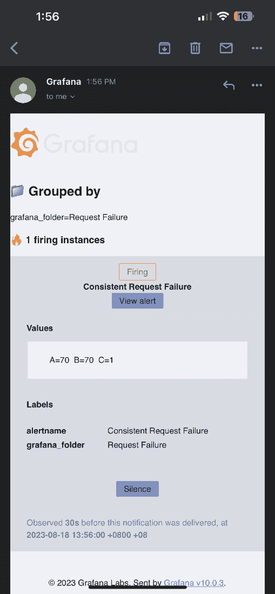

# 第十六章：深度学习模型治理

部署一个模型只是它旅程的开始。一旦它进入现实世界，它就像一个活生生的生命体——它需要高效使用以最大化效益，需要升级以保持锐利，需要维护以保持一致性表现，最终，还需要优雅地退出。想象一下路上的一辆车：你开始驾驶，但你也需要有效使用它、加油、保养，最终更换它或它的组件。深度学习模型的运作也同样如此。

模型治理作为引导力量，监督模型的使用，并始终保持对其性能和背景的警觉，确保模型能够持续、一致、可靠地传递价值。在深度学习领域，模型治理至关重要，它确保这些复杂的模型符合最高的质量、可靠性和公平性标准。

本章深入探讨了深度学习模型治理的三个基本支柱：引导模型利用的方向，着重于深度学习模型的合理应用；通过模型监控在各个方面保持对其性能的警觉；以及通过模型维护确保其在不断发展的深度学习领域保持最佳状态。通过实施健全的模型治理框架，深度学习架构师可以有效管理这些复杂模型所带来的挑战，并充分利用其巨大潜力，推动生产中的有价值的洞察和决策。本章将详细介绍这些模型治理的支柱。*图 16.1* 展示了我们将在本章探讨的模型治理概念的整体视图：


图 16.1 – 本章将介绍的概念背景下，模型治理的整体概述

具体来说，我们将涵盖以下主题：

+   深度学习模型利用的治理

+   通过监控治理深度学习模型

+   通过维护治理深度学习模型

# 技术要求

本章介绍了监控指标和设置警报的实际示例，利用前一教程中的代码，参考*第十五章*，*在生产中部署深度学习模型*。本教程要求你使用安装了 Python 3.10 和 `nvidia-docker` 工具的 Ubuntu 系统，并且拥有一台配有 NVIDIA GPU 的 Linux 机器。此外，我们还需要安装以下 Python 库：

+   `numpy`

+   `transformers==4.21.3`

+   `nvidia-tensorrt==8.4.1.5`

+   `torch==1.12.0`

+   `transformers-deploy`

+   `Tritonclient`

代码文件可以在 GitHub 上找到：[`github.com/PacktPublishing/The-Deep-Learning-Architect-Handbook/tree/main/CHAPTER_16`](https://github.com/PacktPublishing/The-Deep-Learning-Architect-Handbook/tree/main/CHAPTER_16)。

# 深度学习模型利用的治理

模型利用，深度学习模型治理的第一支柱，对于这些复杂工具的负责任和道德部署至关重要。在本节中，我们将探讨模型利用的各个方面，包括护栏过滤器、问责制、合规性、验证、共享访问、透明度和决策支持系统。通过全面解决这些方面，深度学习架构师可以确保有效的模型利用，最大化模型的价值，同时减轻潜在的风险和意外后果。让我们深入了解这些方面：

+   **护栏过滤器**：这些过滤器在确保模型在既定边界内运行、最小化与不准确或有害预测相关的风险方面起着至关重要的作用。它们有助于保持模型的初衷。虽然使用模型预测的目标可以根据具体的使用案例大不相同，但一些常见类型的护栏在广泛应用中具有普适性：

    +   **防止有害使用每次预测**：模型或其预测的有害使用可能涉及广泛的问题，包括与敏感属性相关的偏见、恶意攻击（如对抗性攻击）和与骚扰相关的文本生成。*图 16.2*展示了 OpenAI ChatGPT 在触发有害使用护栏后显示其预测的方式。


图 16.2 – OpenAI ChatGPT 的有害使用护栏触发响应

+   **防止使用低置信度的预测**：为了保持模型输出的可靠性，必须防止使用置信度低的预测。然而，问题在于回归模型的预测没有可以作为置信度得分的预测值。此外，尽管分类模型预测通常会应用 softmax 操作，使得预测值的和为 1，但它并没有适当地校准为实际的统计概率。*一致性预测*是一种经过实战考验的统计和强大的技术，能够为每个预测提供一个稳健的置信区间，从而更好地理解模型的确定性。此外，超出训练数据边界或发生漂移的输入数据可能会降低模型的性能，甚至在没有生成预测的情况下将其视为低置信度预测的特殊情况。

+   **防止使用不准确的模型**：通过持续监控和评估模型的准确性表现，可以确定何时停止使用某个模型，特别是在高风险的使用场景下，并进行模型维护，即重新训练和更新模型。

+   **减少偏见**：护栏过滤器有助于最小化与敏感属性（如种族、性别或民族）相关的偏见。通过防止模型产生可能导致歧视性结果的预测，护栏过滤器有助于更公平、公正地应用这些技术。

+   **防止已知数据条件对模型性能产生负面影响**：例如，面部识别系统应仅对正面无遮挡且没有戴口罩或眼镜的面部进行预测。在*第十四章* *分析对抗性表现*中介绍的对抗性表现分析必须在部署前进行，以识别可能对模型性能产生负面影响的特征。在部署过程中，可以对已识别的特征施加适当的阈值，这些特征预计会恶化模型的表现，并作为预测预防的护栏。

+   **仅对关键预测实施人工干预**：在高风险场景中，例如医学药物推荐，涉及决策过程的人工专家是至关重要的，且在进行特定预测时，需要更高层次的专家参与。

+   **问责制**：这涉及到角色和责任的明确分配，并解决与模型所有权、合规性、训练数据以及每个开发阶段的审批流程相关的问题。问责制是人工智能和机器学习系统的关键方面，确保在整个模型生命周期中，角色、责任和所有权有明确的理解。它包括以下两个方面：

    +   **模型所有权**：明确模型的所有者对于建立问责制至关重要。这包括确定负责模型开发、维护和更新的各方，以及那些因模型使用而可能产生不良后果的责任方。与模型所有权相关的其他关键考虑因素包括：

        +   **处理人员变动**：当模型所有者离职或角色变动时，应该有一个明确定义的流程，将所有权和责任转交给另一位合适的个人或团队。这确保了模型能够继续得到适当的监督和维护，且问责制得以清晰保持。

        +   **共享访问和默认管理员角色**：为了促进有效的模型治理并减少潜在的中断，建立共享访问和默认管理员角色至关重要。这允许多个团队成员监督模型的开发、维护和更新，从而减少对单个个体的依赖。此类共享访问应配备明确的角色和责任指南，以避免混乱并保持问责制。

    +   **处理开源模型**：专有模型通常在单一组织内开发，这使得处理问责制变得简单，遵循前述的相关考量。而在开源模型中，开发过程通常涉及来自不同背景的多个贡献者，这使得建立问责制变得更加具有挑战性。为了解决这个问题，必须提供明确的贡献指南，保持模型开发历史的透明文档，并实施社区驱动的治理结构，或者指定一组核心维护者来监督该项目。作为替代方案，可以在组织中确立一个主要模型负责人，负责该组织中开源模型的所有使用责任。

    +   **预测责任**：在高风险应用场景中，预测责任对于保持问责制和确保准确、可靠的结果至关重要。由于原始预测结果可能并不总是容易理解，因此通常需要后处理步骤将其转化为更易于理解的洞察或嵌套结果。在每个后处理阶段对结果的批准进一步确保了最终结果的质量和相关性，从而促进了 AI 和机器学习模型的负责任和有效使用。

+   **模型与预测透明度**：这对于促进对 AI 系统的信任和理解至关重要。这意味着要提供关于模型开发的清晰解释和相关信息，包括其架构、训练数据和方法论。提供这些洞察使用户能够理解模型如何生成预测，并确保 AI 系统与道德和负责任的实践一致，最终有助于更好的决策和更可靠的结果。这些解释可以是模型开发阶段用于理解和比较不同模型和预测的相同内容。

+   **决策支持系统**：这包括构建能够让决策者与模型预测和洞察互动的界面或平台。系统中应提供用户友好的仪表板、报告和可视化工具，同时将业务规则、法规和政策纳入决策过程中。这在高风险应用场景中再次具有重要作用。

现在，我们将深入探讨模型治理的第二个组成部分——监控已部署的模型。

# 通过监控来管理深度学习模型

模型监控对于维护深度学习模型在整个生命周期中的性能、可靠性和公平性至关重要。随着数据环境和业务需求的变化，持续监控可以帮助及早发现问题，如模型漂移、性能下降和潜在的偏差，从而确保持续交付准确且有价值的预测。这个过程包括收集和分析关键性能指标，持续评估模型输出与真实数据的对比，并识别任何可能影响模型效能的新兴趋势。通过实施一个强大的模型监控框架，深度学习架构师可以主动应对挑战，并做出有关模型更新、优化和再训练的明智决策，从而最大化模型的价值并减少与模型部署相关的风险。

模型监控只有在能够采取纠正措施来应对性能下降或不良情况时才具有价值。因此，监控的目标应该是识别和纠正不良行为。可以采取的措施更广泛地归入模型治理的第三支柱——模型维护，我们将在下一节单独讨论。现在，让我们深入探讨已部署机器学习模型的各种类别和具体指标，并举例说明哪些条件可能促使启动模型维护程序：

+   **基于模型准确性的性能指标**：这些是我们在*第十章*《探索模型评估方法》中更全面介绍的典型模型评估指标，如准确率、召回率、精确度、F1 分数、AUC-ROC 和对数损失。在模型开发和交付模型洞察阶段使用的相同评估指标应在此重用。当在未来能够获得真实标签时，这些指标可以通过两种方式进行监控：

    +   **自然情况**：当使用场景是时间序列预测未来目标，或者目标对模型拥有者并非立即可得时，目标可以在未来自然获得。

    +   **手动标注**：建议定期进行标注，选取一部分历史生产输入数据样本来验证模型性能的有效性。

    导致模型维护触发的条件是使用在模型构建和评估实验过程中提到的相同使用场景有效性阈值。正如在*第十章*《探索模型评估方法》中强调的那样，这个阈值理想情况下应该与业务指标阈值有所关联。

+   **数据质量度量**：数据质量度量提供了关于输入数据的有效性、特征和一致性的基本见解。数据质量与模型的准确性和偏差表现相关，因此任何偏离常规的情况都可能导致准确性的下降。以下是一些此类度量的示例：

    +   **缺失或不完整数据计数**：指数据集中数据缺失或不完全可用的实例数量。这会影响模型的准确性和可靠性，因为模型可能没有足够的信息来进行预测。

    +   **无效数据边界计数**：指的是数据值超出可接受或预期范围的实例。这可能导致模型预测错误，因为模型可能从不正确的数据点中推断，而这些数据点并没有经过学习。

    +   **异常值和离群点指标度量**：用于识别与数据集中的整体模式或趋势显著偏离的异常或极端数据点。这与无效数据边界有相同的根本原因。

    +   **数据漂移**：当数据中输入特征的分布随时间变化时，就会发生数据漂移。这可能由于多种原因，例如数据源的变化、用户行为的变化，或外部因素影响数据生成过程。数据漂移可能导致模型性能下降，因为模型是在不同数据分布上训练的，可能无法很好地适应新的数据分布。监控数据漂移有助于识别何时需要重新训练或调整模型，以保持其准确性和有效性。在*第十七章*，*在动态环境中有效管理漂移效应*，我们将深入探讨用于检测数据漂移的技术，重点是深度学习特定数据输入。

    +   **概念漂移**：指的是随着时间的推移，输入特征与目标变量之间关系的变化。这种变化可能导致一个原本准确的模型在性能上退化，因为模型所学的模式不再与不断变化的关系一致。这也与数据质量部分中介绍的标签一致性度量相关，详见*第一章*，*深度学习生命周期*。

+   **系统性能度量**：这些度量有助于确保部署的模型满足操作要求。系统性能度量下的主要子组如下：

    +   **推理延迟**：指的是模型从输入数据生成预测或输出所需的时间。低延迟对于实时应用和用户体验至关重要，因为它确保模型提供快速及时的结果。

    +   **吞吐量**：衡量模型在特定时间范围内能够生成的预测或输出的数量。高吞吐量对于处理大规模数据并保持所需的性能水平至关重要，尤其是在高需求场景中。

    +   **资源利用率**：评估模型在运行过程中对资源（如 CPU、内存和存储）的使用效率。优化资源利用率可以确保模型在可用的基础设施上高效运行，降低成本并提升可扩展性。

    +   **排队延迟和请求数量**：排队延迟指的是每个请求在被部署的深度学习模型处理前所经历的等待时间。监控排队延迟和请求数量有助于识别系统中的潜在瓶颈，并优化模型同时处理多个请求的能力。

+   **警报和事件指标**：这些指标有助于确保及时识别和解决问题，从而实现系统性能的最佳化。它们如下：

    +   **警报频率**：此指标指的是在特定时间段内生成的警报数量，表示系统中的潜在问题或异常。监控警报频率有助于识别模式和趋势，从而采取主动措施防止或缓解重复出现的问题。

    +   **警报严重性**：这衡量了一个问题对整体系统性能的影响程度。通过根据严重性对警报进行分类，可以优先处理最关键的问题，从而确保资源的高效利用，并最大程度地减少对系统的负面影响。

    +   **事件解决时间**：这是处理和解决由警报引发的事件所花费的时间。跟踪这个指标有助于评估事件响应过程的有效性，并识别需要改进的地方，最终实现更快的解决时间和更好的系统性能。

+   **模型公平性和偏差指标**：在**第十三章**中介绍的用于比较不同开发模型的相同指标，也可以应用于监控已部署模型的公平性。

+   **业务指标**：监控与业务相关的指标对于评估部署的深度学习模型对组织目标的影响至关重要，并确保其与业务目标的对齐。并非所有东西都能通过数字来监控，因此要找出那些可以量化的组件。以下是一些需要考虑的指标：

    +   **关键绩效指标**（**KPIs**）：识别并跟踪受模型预测直接影响的关键绩效指标，例如收入、客户满意度、投资回报率或运营效率。这有助于评估模型对业务的整体贡献。

    +   **用户采纳与参与度**：监控用户与模型的互动方式，包括使用模式、频率和反馈。这可以为模型的相关性、易用性及其在满足用户需求方面的整体效果提供洞察。

通过监控各种指标组的变化，不仅可以全面了解深度学习模型的性能、可靠性和公平性，还有助于识别新兴趋势和模式。通过密切监控这些指标，可以积极解决潜在问题，如模型漂移、性能下降和偏见，确保准确预测的持续交付。这也意味着分析监控指标中的模式对于制定改进计划以提升深度学习模型性能和解决潜在问题至关重要。

为有效分析和利用所监控的指标，建议将关键指标整合到一个全面的仪表板中，以便轻松跟踪和评估模型的整体健康状况，并最终增强监控过程。Grafana，一个流行的开源分析和监控平台，可以通过提供各种功能和集成有效地满足这些要求。随着我们的进展，我们将探讨如何通过使用 NVIDIA Triton 推理服务器、Prometheus 和 Grafana 来监控深度学习模型的实用教程。

## 使用 NVIDIA Triton Server、Prometheus 和 Grafana 监控部署的深度学习模型

NVIDIA Triton Server 通过 Prometheus 格式的 REST HTTP API 托管配置的指标，提供实时洞察，无需保留历史数据。要持续保存指标数据，需要配置 Prometheus 与 NVIDIA Triton Server 连接。虽然 Prometheus 可以随时间跟踪和记录指标，但它缺乏可视化能力。这就是 Grafana 的用武之地。它是一个平台，可以利用 Prometheus 记录的数据创建具有自定义图形和表格的动态仪表板。Prometheus 通过单独的 REST HTTP API 方便地共享其记录的信息，从而实现与 Grafana 的无缝连接。此外，Grafana 允许可靠地设置警报规则。

监控的第一步是计划我们想要监控的指标，我们将在接下来讨论。

### 选择要监控的指标

通过 NVIDIA Triton Server 托管的任何部署模型默认支持各种标准指标。这些指标包括以下内容：

+   **推理请求指标**：成功次数、失败次数、推理次数和执行次数

+   **与 GPU 相关的指标**：功率使用、功率限制、能量消耗、GPU 利用率、GPU 总内存和 GPU 已使用内存

+   **与 CPU 相关的指标**：CPU 利用率、CPU 总内存和 CPU 已使用内存

+   **响应缓存指标**：缓存命中次数、缓存未命中次数、缓存命中时间和缓存未命中时间

请注意，这些指标可以手动禁用。在这个实际示例中，我们将利用上一章中使用 NVIDIA Triton Server 部署的语言模型实现，并额外使用 Prometheus 和 Grafana 工具。NVIDIA Triton Server 记录的默认标准指标很有用，但我们还需要一些可能对业务有用且特定于语言模型的自定义指标。NVIDIA Triton Server 支持通过 C API 自定义指标，这意味着你需要开发 C 代码！然而，自从 NVIDIA Triton Server 版本 23.05 以来，有一种相对较新的方式支持自定义指标，那就是你可以使用 Python 为 NVIDIA Triton Server 定义自定义指标！我们将在我们的实际教程中探索这一新特性，以下是我们为语言模型探索的一些自定义指标，这些指标可能会有用：

+   **处理的令牌数量**：输入数据越大，请求的时间可能会越长。

+   **生成的令牌数量**：输出令牌数量越大，请求的时间可能会越长。

+   **Flesch 阅读分数**：这是一个阅读理解指标，用来衡量文本的易读性，它是一个有用的业务指标，因为生成的文本需要易于理解，才能发挥其作用。

现在我们准备好深入实践示例了。

### 跟踪和可视化所选指标随时间的变化

在开始之前，请确保你已经安装了 `nvidia-docker`、Prometheus、Node Exporter 和 Grafana 版本 v10.0.3。另外，确保 Prometheus 和 Grafana 可以从命令行的任何位置调用。我们将按照以下步骤逐步开始这个过程：

注意

我们正在利用来自*第十五章*的代码，*将深度学习模型部署到生产环境*。这里需要的第一个更改是，我们将在`model.py`文件中的`TritonPythonModel`基础上进行修改。NVIDIA 提供的 Python 自定义指标 API 允许你在`TritonPythonModel`中定义和记录指标，直接在你可以定义的三个方法中进行：`initialize`、`execute`和`finalize`。

1.  首先，我们将使用的附加库是`textstat`和`nltk`，这些将用于计算可读性分数：

    ```py
    import textstat
    import nltk
    nltk.download('punkt')
    ```

1.  第一步是在`initialize`方法中初始化指标日志记录实例。Prometheus 支持四种指标类型：计数器（用于增加的值）、仪表（用于波动的值）、直方图（用于观察值的分布）和摘要（用于跟踪数据中的分位数）。我们计划添加的三个自定义指标本质上是波动的值，任何直方图都可以在 Grafana 中创建。让我们定义我们将使用的指标系列。你可以为每个指标系列设置名称、描述和类型。此外，你可以为任何逻辑组创建多个指标系列。就我们的情况而言，所有三个我们计划的指标都是业务指标，且是波动的值：

    ```py
    self.metric_family = pb_utils.MetricFamily(
        name="business_metrics",
        description="",
        kind=pb_utils.MetricFamily.GAUGE
    )
    ```

1.  现在，让我们在这个指标系列中定义指标：

    ```py
    self.number_of_input_tokens_metric = self.metric_family.Metric(
        labels={"name": "Number of input tokens","version": "1"}
    )
    self.number_of_tokens_generated_metric = self.metric_family.Metric(
        labels={"name": "Number of tokens generated", "version": "1"}
    )
    self.readability_metric = self.metric_family.Metric(
        labels={"name": "Flesch Readability Score", "version": "1"}
    )
    ```

    方便的是，如果任何逻辑需要更改，您可以对指标进行版本控制，这使得监控过程更为稳健。

1.  接下来，我们将在每次执行时记录指标。我们将定义一个辅助方法，随后将在 `execute` 方法结束时执行：

    ```py
    def _compute_custom_metrics(self, input_tokens, generated_tokens, generated_text):
       self.readability_metric.set(textstat.flesch_reading_ease((generated_text)))
        self.number_of_input_tokens_metric.set(input_tokens.shape[1])
        self.number_of_tokens_generated_metric.set(generated_tokens.shape[1])
    ```

1.  最后，我们将在 `execute` 方法下使用这个辅助方法：

    ```py
    self._compute_custom_metrics(input_ids, output_seq, " ".join(decoded_texts))
    ```

1.  现在，我们需要使用相同的命令启动 NVIDIA Triton Server `nvidia-docker` 实例，命令如下：

    ```py
    sudo docker run --gpus=all -it --shm-size=256m --rm -p8000:8000 -p8001:8001 -p8002:8002 -v ${PWD}/models:/models nvcr.io/nvidia/tritonserver:23.05-py3
    ```

1.  之后，我们进入 Docker 环境，接下来的步骤是安装必要的库：

    ```py
    pip install transformers==4.21.3 nvidia-tensorrt==8.4.1.5 git+https://github.com/ELS-RD/transformer-deploy torch==1.12.0  -f https://download.pytorch.org/whl/cu116/torch_stable.html textstat==0.7.3
    ```

注意

对于生产环境，请务必创建一个 Docker 镜像，其中所有库都已经固定，这样您就不再需要手动安装库。

1.  现在，您可以在命令行中执行 `python triton_client.py` 命令并获取预测结果。

1.  默认指标和自定义指标立即托管在 URL `http://localhost:8002/metrics` 中，您可以查看实时的文本格式指标。如果您使用的是远程服务器，可以将 `localhost` 替换为服务器的 IP 地址。以下代码片段展示了可以在前述 URL 中找到的实时 Prometheus 格式的指标：

    ```py
    # HELP nv_gpu_power_usage GPU power usage in watts
    # TYPE nv_gpu_power_usage gauge
    nv_gpu_power_usage{gpu_uuid="GPU-246b298f-13e6-f93e-b6f1-0fb8933ce337"} 13.676
    nv_gpu_power_usage{gpu_uuid="GPU-0fa69700-a702-0113-f30c-89d3fa1cec2f"} 19.626
    # HELP nv_gpu_power_limit GPU power management limit in watts
    # TYPE nv_gpu_power_limit gauge
    nv_gpu_power_limit{gpu_uuid="GPU-246b298f-13e6-f93e-b6f1-0fb8933ce337"} 250
    nv_gpu_power_limit{gpu_uuid="GPU-0fa69700-a702-0113-f30c-89d3fa1cec2f"} 260
    # HELP nv_cpu_utilization CPU utilization rate [0.0 - 1.0]
    # TYPE nv_cpu_utilization gauge
    nv_cpu_utilization 0.04902789518174133
    # HELP nv_cpu_memory_total_bytes CPU total memory (RAM), in bytes
    # TYPE nv_cpu_memory_total_bytes gauge
    nv_cpu_memory_total_bytes 67239776256
    # HELP nv_cpu_memory_used_bytes CPU used memory (RAM), in bytes
    # TYPE nv_cpu_memory_used_bytes gauge
    nv_cpu_memory_used_bytes 14459383808
    # TYPE business_metrics gauge
    business_metrics{name="Flesch Readability Score",version="1"} 93.81
    business_metrics{name="Number of tokens generated",version="1"} 128
    business_metrics{name="Number of input tokens",version="1"} 11
    ```

1.  由于这些只是实时指标，我们需要设置本地服务器或使用在线 Prometheus 服务器。在此步骤中，我们将选择本地托管的 Prometheus 服务器，需要在命令行中运行以下命令：

    ```py
    sudo systemctl start node_exporter
    node_exporter here is a Prometheus exporter that collects system-level metrics from target machines, enabling Prometheus to monitor and analyze their resource usage and performance.
    ```

1.  现在，我们需要将 NVIDIA Triton Server 端点添加到 Prometheus 配置文件中，以便跟踪指标。为此，请在命令行中执行 `sudo gedit /etc/prometheus/prometheus.yml`，然后添加以下作业详情：

    ```py
    - job_name: "triton"
        scrape_interval: 10s
        static_configs:
          - targets: ["localhost:8002"]
    ```

    这样，Prometheus 就可以从 NVIDIA Triton Server 记录指标了。

1.  Prometheus 默认使用端口 `9090` 托管其 Web 应用。因此，通过浏览器访问链接 `localhost:9090` 将进入 Prometheus 首页。进入 **状态** 标签，点击下拉菜单中的 **目标**，将显示以下截图，验证 Triton 端点正在被跟踪。


图 16.3 – 左侧是 Prometheus Web 应用主页，右侧是 Prometheus 正在跟踪并从中获取指标的目标

注意

默认情况下，Prometheus 不强制用户账户管理，但可以配置为强制执行。

1.  接下来，我们将设置 Grafana 以连接到本地托管的 Prometheus 实例。首先，我们需要通过在命令行中执行以下命令来启动 Grafana 服务：

    ```py
    3000, so accessing the localhost:3000 link in a web browser will bring you to the home page. The default username and password are admin and admin. Once that is filled in, click on Log In and create a new password, after which you will be greeted with Grafana’s home page. We can set up the Prometheus link now by clicking on the three-line button on the top-left tab and clicking on the Data sources tab under the Administration dropdown, as shown in *Figure 16**.4 (a)*. This will result in the screen shown in *Figure* *16**.4 (b)*.
    ```


图 16.4 – 显示如何在 Grafana Web 应用中导航到添加数据源页面的截图

1.  接下来，点击 Prometheus 作为数据源，您将看到如*图 16.5 (a)*所示的屏幕。将 Prometheus 默认托管的 Web 应用链接设置为`http://localhost:9090`，然后点击**保存并测试**。这应该会显示如*图 16.5 (b)*所示的成功界面。


图 16.5 – Grafana Prometheus 数据源设置标签页（a）和成功创建的屏幕（b）

1.  这样，您将看到数据源已成功创建，如*图 16.6 (a)*所示。此时，我们可以创建一个仪表盘来可视化我们正在监控的指标。Grafana 允许通过三种方式创建仪表盘：通过其公开共享的仪表盘 ID 导入，通过导出的仪表盘 JSON 文件导入，以及创建新的仪表盘。在 Grafana 中，您可以使用内置的可视化 UI 构建器系统或基于**PromQL**的可视化手动创建多种类型的可视化，并选择它们的展示方式。然而，在本教程中，我们将通过导入一个已有的仪表盘 JSON 文件来使用现成的可视化。为此，使用*图 16.4 (a)*所示的三行按钮下拉菜单导航到仪表盘页面。进入仪表盘页面后，点击**新建**，然后点击**导入**，如*图 16.6 (b)*所示。


图 16.6 – Grafana 数据源标签页显示已创建的数据源，仪表盘标签页显示新建按钮的下拉菜单

1.  将提供的`Triton Inference Server-1692252636911.json`文件直接拖入导入区域，然后连接到您创建的 Prometheus 数据库，您将看到如*图 16.7*所示的仪表盘。


图 16.7 – 用于监控教程的自定义 Grafana 仪表盘

请注意，生成该指标的机器上有两块 GPU，这也是为什么会有两个 GPU 统计数据。此可视化有效地展示了大多数默认的 NVIDIA Triton Server 指标，并通过图形显示了这三个额外的自定义指标，这些图形捕捉了它们的历史值直到当前时刻。然而，硬件资源特定的统计数据是一个例外，它们仅以实时方式展示。

现在，监控中缺少的部分是创建规则和条件，这些规则和条件被认为是警报事件，称为事件警报组件。没有警报的深度学习模型监控就像有了安防摄像头，却没有警报系统。你不会知道问题何时发生，直到为时已晚。事件可能包括模型准确度下降、响应延迟、资源瓶颈、在监控已部署深度学习模型时的意外输出变化和硬件故障等。Grafana 具有内建的警报管理、通知管理和联系人管理系统，我们将在接下来的部分中利用这些功能。

### 使用 Grafana 设置警报

让我们来看看如何使用 Grafana 设置警报的步骤：

1.  点击**警报**标签，如*图 16**.4 (a)*所示，然后点击**警报规则**。你将看到如*图 16**.8*所示的界面。


图 16.8 – NVIDIA Triton 请求失败警报规则的警报规则标签设置

1.  在这个例子中，我们将设置一个警报，当有任何 NVIDIA Triton Server 推理请求失败时触发。所以，在同一标签页中，选择`nv_inference_request_failure`指标标签，并将阈值设置为小于 1 的数值，这样单个失败请求就会触发警报。如*图 16**.8*所示，数值被设置为`0.8`。

1.  接下来，将评估间隔设置为一分钟，并且仅在连续五分钟内出现请求失败时才会触发警报，如*图 16**.9*所示。然后，点击**保存并退出**按钮。


图 16.9 – 警报规则的评估间隔设置

Grafana 中的警报可能有三种状态：**正常**，表示条件未触发；**待处理**，表示条件部分触发，但行为还不一致；**触发**，表示条件已持续满足，并且警报已被触发。现在，警报规则已保存并创建，你将看到如*图 16**.10 (a)*所示的界面，状态为**正常**。*图 16**.10 (b)*展示了**待处理**阶段，其中检测到失败，但还不够一致，无法触发警报。另一方面，*图 16**.10 (c)*展示了**触发**阶段，其中故障已按照配置的时间间隔持续发生。


图 16.10 – 正常状态（a）、待处理状态（b）和触发状态（c）的警报状态

1.  要配置这些警报发送到哪里以及发送给谁，我们将使用**联系人**和**通知策略**选项卡，这些都在**警报**部分。首先，点击**联系人**选项卡，设置将接收通知的人员。你甚至可以将这些人员组织成小组，但为了简化本教程，我们将通知发送给自己。Grafana 提供了多种联系方式集成：Alertmanager、Cisco Webex Teams、钉钉、Discord、电子邮件、Google Chat、Kafka REST 策略、LINE、Microsoft Teams、Opsgenie、PagerDuty、Pushover、Sensu Go、Slack、Telegram、Threema Gateway、VictorOps、Webhook 和 WeCom。为了简化操作，我们将选择一个广泛可用的集成类型：电子邮件。Grafana 使用**sSMTP**软件发送电子邮件，因此在继续操作之前，请确保你已设置了电子邮件账户并配置了凭据。在联系人设置中，输入你的姓名和电子邮件，然后点击**测试**以生成一个测试通知，确认凭据准确。确认收到电子邮件通知后，保存设置。有关设置界面的示例，请参见*图 16**.11*。


图 16.11 – 设置电子邮件的联系人选项卡

1.  接下来，我们需要将联系人与默认通知策略关联起来。转到**通知策略**选项卡，点击**设置**，并将默认联系点更改为我们在*第 4 步*中设置的电子邮件联系人。然后你将看到一个类似于*图 16**.12*的界面。


图 16.12 – 设置为通知我们的默认通知策略

1.  现在，我们已经设置好接收电子邮件通知！作为一个挑战，尝试找出一些方法让推理服务器请求失败，如果无法做到，修改规则为某个一定会触发的条件，这样你就能通过电子邮件收到一个实际的警报通知示例。*图 16**.13*展示了你将通过手机界面收到的示例电子邮件。



图 16.13 – 示例触发的警报电子邮件通知，状态为 Firing

通过这些，我们成功为部署的深度学习模型设置了监控和警报系统！这个实现中的一个显著注意事项是，指标与模型执行捆绑在一起。为了解耦以避免增加特定推理预测的运行时，解决方案是使用 C API 来构建自定义指标。如果记录指标所需的时间不重要，你也可以考虑在 NVIDIA Triton Server 中托管另一个“模型”，该模型接收来自特定推理模型的输出并记录指标。NVIDIA Triton Server 还提供了一个名为`perf_client`的工具，可以评估不同配置的运行时，帮助你优化系统的性能。具体来说，该工具衡量并报告在不同负载条件下的吞吐量和延迟。

然而，仅仅拥有监控和警报并不能提供完整的模型监控视图。我们需要深入分析这些数据，交叉参考它们，发现连接并找出模式。这就像检查汽车的燃油效率、轮胎压力和发动机温度，确保驾驶顺畅。

此外，仅靠警报无法解决问题。它们就像汽车的警示灯——它们告诉你出现了问题，但你仍然需要停车，打开引擎盖并修复问题。这就是模型维护的作用。在下一部分，我们将探讨如何不仅检测问题，还能采取行动，确保模型在长期内保持平稳高效地运行。

# 通过维护管理深度学习模型

指标记录、仪表盘构建、记录的指标分析和警报是模型监控的核心组成部分，但它们只有在采取适当的行动之后才有效，这些行动包含在模型维护中。模型维护类似于赛车中的技术维修团队，定期对深度学习模型进行微调和优化，以确保它们高效且有效地运行。就像技术维修团队快速修理、加油和调整赛车部件以适应变化的赛道条件一样，模型维护涉及到更新模型以应对环境变化，利用反馈回路获取的新数据改进和完善模型，并针对杂项问题进行事件响应。这确保了模型始终保持在正确轨道上，提供有价值的见解，并在数据和业务需求不断变化的环境中推动明智的决策。

模型维护的关键方面全面包括以下内容：

+   **建立反馈回路**：建立反馈回路对于捕获实际结果和验证模型预测至关重要，它使深度学习从业者能够识别改进的领域，并相应地调整模型。

+   **重新训练**：重新训练是模型维护的一个关键环节，确保模型能够跟上最新的数据和趋势，从而保持准确性和相关性。定期重新训练可以使模型从新的见解中学习，并适应不断变化的数据环境，保证稳定的性能。幸运的是，对于深度学习模型，可以使用微调过程，这比完全重新训练过程要快得多。以下是两个强调频繁更新和模型重新训练重要性的使用案例：

    +   **电子商务产品推荐**：在电子商务中，消费者偏好和产品可用性变化迅速。为了提供相关的产品推荐，深度学习模型需要频繁地进行重新训练，可能是每周甚至每天一次，以理解最新的趋势和客户行为。

    +   **社交媒体情感分析**：社交媒体平台不断发展，出现新的趋势、标签和用户行为。为了准确评估公众情感和意见，深度学习模型需要经常重新训练，可能是每季度一次，以适应这些变化。

+   **事件响应处理**：当警报信号显示潜在问题时，拥有一个专门的响应团队来及时处理和解决问题至关重要。该团队应该具备充分的能力，调查根本原因，采取纠正措施，并防止类似问题在未来再次发生。让我们来看看不同类型事件的响应处理建议：

    +   **数据相关事件**：这些事件发生在模型接收到不正确、不完整或有偏的数据输入时。处理此类问题时，响应团队应该与数据提供者紧密合作，识别原因，纠正数据，并在需要时重新训练模型。

    +   **模型性能事件**：这些事件涉及模型生成不准确或出乎意料的预测。正确的处理方式需要模型拥有者（负责模型创建或批准模型使用）与预测拥有者（负责批准预测使用）之间的合作，正如前面*深度学习模型利用治理*部分所描述的那样。两者应该分析模型的表现，识别架构或训练中潜在的问题，并实施改进，确保未来能够提供更好的性能。

    +   **基础设施相关事件**：这些事件由硬件或软件故障引起，影响模型的部署环境。响应团队应该与基础设施提供商或团队合作，解决问题，确保模型能够顺利运行。

    +   **安全事件**：这些事件涉及未经授权的访问、数据泄露或其他恶意活动，目标是模型。响应团队应该遵循组织的安全政策，识别威胁，并采取适当的措施来减轻风险。

    +   **合规性和监管事件**：当模型的输出或操作违反了法律或监管要求时，就会发生这些事件。响应团队应与法律和合规团队合作，处理违规问题并修改模型以符合必要的规定。

通过全面考虑此处分享的模型维护组件，组织可以有效解决已部署深度学习模型所面临的挑战，确保其持续改进并与业务需求对齐。传统上，这些维护操作是在警报触发后手动执行的。然而，也可以根据警报事件安排定制任务以自动执行。考虑使用 Apache Airflow 来协调从模型监控警报中触发的自动化任务。Apache Airflow 就像是数据任务的指挥，允许你在有向无环图格式中编排和调度复杂的工作流。它让你定义、自动化并监控任务序列，确保它们按正确的顺序和时间发生。然而，基于模型监控警报创建自动化任务存在一些固有的局限性和风险，接下来我们将简要探讨这些问题。

## 探讨使用由模型监控警报触发的自动化任务的局限性和风险

尽管基于模型监控警报自动化任务可以节省时间和资源，但在实施这种方法时也存在局限性和潜在风险，必须加以考虑。基于模型监控警报自动化任务的一些局限性如下：

+   **问题复杂性**：有些问题可能过于复杂或微妙，无法通过自动化过程有效处理。例如，在一个医学影像分析的深度学习模型中，当监控警报表明准确率下降时，可能触发一个自动化任务来重新训练模型。然而，问题的复杂性可能源于训练数据的不平衡，比如某种疾病的代表性不足，而仅仅通过重新训练模型是无法解决的。在这种情况下，自动化过程可能无法有效解决问题的根本原因。

+   **缺乏上下文**：自动化任务可能缺乏考虑问题更广泛背景的能力，也无法理解其对系统其他方面可能产生的影响。

    假设有一个深度学习模型，根据各种行为和人口统计因素预测客户流失。可以设置一个自动化任务，当检测到高流失风险的客户时，向他们发送促销优惠。然而，该任务可能没有足够的上下文来考虑外部因素，比如近期的负面宣传事件或广泛的服务中断，这些因素可能导致流失风险的暂时性增加。这种缺乏上下文的情况可能导致不必要的促销优惠和资源的无效使用。

+   **不充分或不适当的响应**：自动化任务可能无法始终选择最合适的响应措施来应对警报，这可能导致次优的结果。例如，一个监控社交媒体帖子中有害内容的 AI 模型可能会检测到包含冒犯性语言的帖子。自动响应系统可能会立即删除帖子或禁用用户，而没有考虑到误报的可能性或帖子的更广泛背景（例如，引用冒犯性语言以进行批评）。

至于启用基于模型监控警报的自动化任务所涉及的风险，如下所示：

+   **过度依赖自动化**：过度依赖自动化任务可能导致模型维护过程中缺乏人工监督和专业知识。这可能导致忽略只有人类直觉才能察觉的微妙模式和趋势，进而可能导致模型性能不佳。

+   **不准确或过早的触发**：自动化任务通常是根据监控指标中的特定条件触发的。如果这些条件没有被仔细定义，任务可能会不准确或过早地触发，导致对模型采取不必要甚至有害的行动。

+   **缺乏灵活性**：自动化任务通常是为特定场景或问题设计的，可能不足以应对无法预见或复杂的情况。这可能限制其在处理模型维护过程中出现的独特挑战时的有效性。

+   **错误叠加的风险**：当自动化任务根据错误的警报或不准确的指标执行时，它们可能通过对模型进行不必要或不正确的调整来加剧问题。这可能导致模型性能进一步恶化，甚至造成不可逆的损害。

+   **安全风险**：基于警报自动化任务可能会使模型及其基础设施面临潜在的安全风险，特别是如果自动化系统没有得到充分的安全保障。未经授权的访问或操作自动化系统可能会导致意外后果或恶意行为影响模型。

为了缓解这些局限性和风险，必须在自动化和人工参与之间找到平衡。这可以通过引入人类介入系统、确保监控指标和警报的适当验证与校准，并实施强有力的安全措施来保护自动化基础设施来实现。

通过这一点，我们已经涵盖了深度学习模型治理的所有组成部分。这种三支柱的整体方法最终使组织能够持续并一致地发挥深度学习模型的全部潜力，在现实世界中推动有价值的洞察力和信息驱动的决策。

# 摘要

在本章中，我们探讨了深度学习模型治理的三大基础支柱：模型利用、模型监控和模型维护。模型利用确保深度学习模型的有效、效率、伦理和负责任的使用，而模型监控则允许对性能进行持续评估，识别潜在的偏差或漂移，并监控基础设施相关的指标。另一方面，模型维护侧重于定期更新和完善，以确保模型与不断变化的数据环境和业务需求保持一致。

我们还深入了解了使用 NVIDIA Triton Server、Prometheus 和 Grafana 监控深度学习模型的技术步骤。通过认真考虑模型治理的各个组成部分，深度学习架构师可以有效管理这些复杂模型在生产环境中的挑战，并持续挖掘它们为推动有价值的洞察和决策所带来的潜力。

在下一章中，我们将进一步深入探讨深度学习模型漂移检测的细节。
