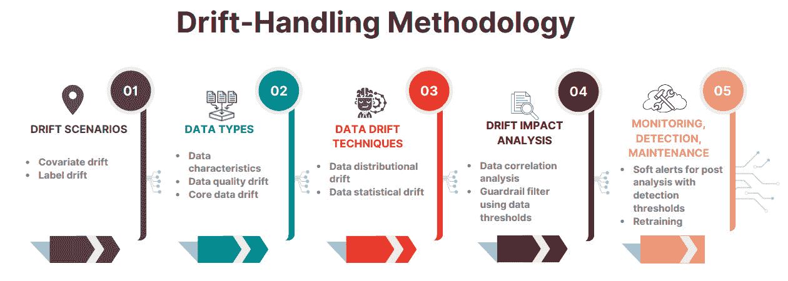
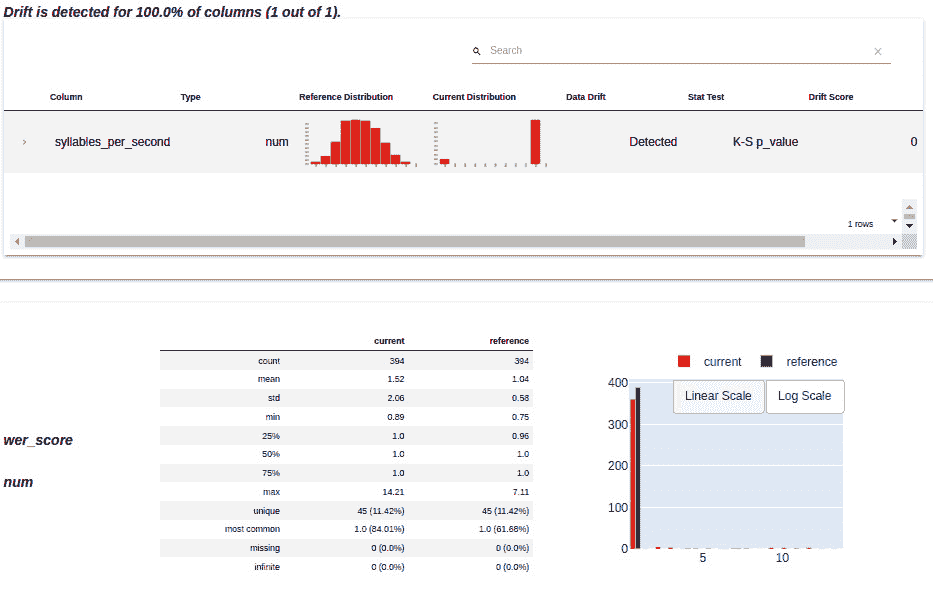
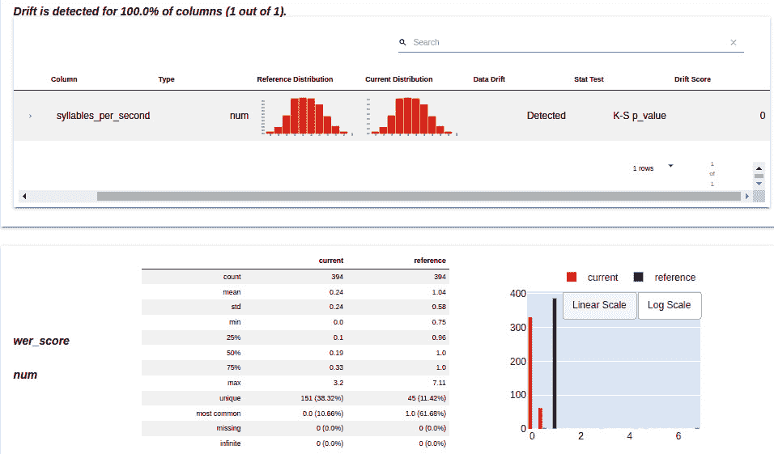

# 第十七章：在动态环境中有效管理漂移

漂移是已部署深度学习模型随着时间推移性能下降的一个重要因素，涵盖了概念漂移、数据漂移和模型漂移。让我们通过一个基于烹饪的类比来理解已部署模型的漂移。假设一个已部署的深度学习模型就像一位技艺精湛的厨师，他旨在创造让顾客满意的菜肴，但他擅长某种特定的菜系。概念漂移发生在顾客的口味偏好发生变化时，这会改变食材和受欢迎菜肴之间的关系，从而影响顾客的口味需求。而数据漂移则是当食材本身发生变化时，比如口味的变化或食材的供应变化。最后，模型指标监控警报最直接的表现是当厨师失去顾客时。在所有这些情况下，厨师都必须调整菜肴以维持其成功，就像深度学习模型需要更新，以应对概念漂移（即输入和目标变量之间关系的变化）以及数据漂移（即输入数据分布和特征的调整）。

监测漂移对于确保深度学习模型的持续成功至关重要，就像厨师需要跟踪顾客不断变化的口味和食材的变化一样。作为一个预告，只有某些用例需要监控。在本章中，我们将深入探讨测量和检测漂移的技术，这将使我们能够有效监控并在检测到漂移时及时发送警报，并进行必要的模型维护调整。通过与厨师类比，监控漂移的技术可以类比为厨师观察顾客反应、阅读评论或收集反馈，以更好地了解顾客的偏好和食材的质量。通过保持警觉，避免任何漂移，厨师和深度学习模型都能适应和进化，保持专业水平，并在动态环境中提供卓越的成果。具体来说，我们将涵盖以下主题：

+   探索漂移问题

+   探索漂移的类型

+   探索处理漂移的策略

+   以编程方式检测漂移

+   比较和对比 Evidently 和 Alibi-Detect 库在漂移检测中的应用

# 技术要求

本章将涵盖一个实际示例，用于测试数据漂移技术。我们将使用 Python 3.10，此外，我们还需要安装以下 Python 库：

+   `evidently`

+   `numpy`

+   `transformers==4.21.3`

+   `torch==1.12.0`

+   `syllables`

+   `audiomentations`

+   `datasets`

代码文件可以在 GitHub 上找到：[`github.com/PacktPublishing/The-Deep-Learning-Architect-Handbook/tree/main/CHAPTER_17`](https://github.com/PacktPublishing/The-Deep-Learning-Architect-Handbook/tree/main/CHAPTER_17)。

# 探索漂移问题

漂移最明显的问题是准确度的下降。然而，漂移带来的问题比你最初注意到的要多，包括以下几点：

+   **适用性**：随着数据模式和分布的变化，模型对新数据的准确预测能力可能会受到影响。这可能导致模型在现实场景中的效果降低，从而减少决策价值，进而增加模型变得不相关且难以使用的可能性。

+   **可解释性**：理解和解释模型的决策可能变得具有挑战性，因为影响其预测的因素可能不再与当前的数据环境相符。这可能会妨碍与利益相关者的有效沟通，并且削弱对模型预测的信任。需要注意的是，原本可以解释的模型仍然是可以解释的，因为我们仍然可以准确地说明它是如何使用输入数据的，但随着数据的漂移，解释可能变得更加困难。

+   **公平性**：偏见和差异可能会出现或加剧，引发模型输出中的公平性问题。这可能导致不同群体受到不平等待遇，延续有害的不平等，并在模型应用中带来伦理问题。

+   **稳定性**：对输入数据变化的敏感性可能导致性能波动，影响模型的稳定性和一致性。不稳定的模型可能导致不可靠的结果，使决策者难以依赖模型的输出。

这些问题全面地突显了数据漂移可能带来的挑战。现在，我们已经了解了三种高层次的漂移类型。这些是有用的，但不足以实施漂移检测。了解可能影响模型的漂移类型将帮助你为任何部署相关的问题做好准备，并实施漂移监测，这也引出了下一个话题。

# 探索漂移的类型

漂移就像是数据工作方式的变化。当数据本身发生变化，或其来源的环境发生变化时，就会发生漂移。这种变化有时会突然或快速发生，有时会很缓慢，甚至以某种重复的模式出现。面对漂移时，重要的是要看到大局，而不仅仅是几次偶然的异常波动。漂移并不是指那些稀有的异常或一两次奇怪的预测；它指的是那些长期存在的变化，就像是一个新的、持久的模式。这些持续的变化可能会永久破坏你的模型，使其变得不那么有用。这就像是你的朋友偶尔突然开始说另一种语言，这可能会导致一些偶尔的困惑，但不会成为大问题。但如果他们开始一直讲另一种语言，那就会是个大问题。

此外，漂移可以分为三种主要类型：数据漂移、概念漂移和模型漂移。虽然概念漂移与数据有关，可以认为它是数据漂移的一部分，但在该领域中，概念漂移和数据漂移通常被视为分开的。让我们依次深入探讨每种漂移类型，从数据漂移开始。

## 探索数据漂移类型

数据漂移是指当前数据批次的某些特征与历史批次的特征存在差异。需要理解的是，数据漂移不仅仅局限于某一种类型的变化。许多从业者错误地只关注数据漂移中最为广为人知的特征变化类型——分布的变化。分布是统计学中的一个基本概念，揭示了数据集中各种变量值出现的频率。它帮助我们理解数据的性质，但这种理解是模糊的。一些常见的分布模式包括正态分布、均匀分布、偏态分布、指数分布、泊松分布、二项分布和多项分布。判断分布变化是有益还是有害可能具有挑战性，因为分布变化有时会带来好的结果，而分布不变也不一定意味着性能不会下降。分布变化与模型性能之间的关系并非总是直观的，这使得准确评估影响变得困难。*因此，建议始终考虑其他更易理解、经过交叉验证测试的统计数据漂移，这些数据漂移与性能指标高度相关，而非数据* *分布漂移。*

统计漂移指的是统计特征的变化，例如均值、方差、相关性或偏度等，这些变化可能对模型性能产生更直接的影响。这也意味着它们之间的关系更可预测，从而可以采取更有针对性的维护措施。统计值之间的变化可以通过差异或比率来衡量。例如，如果一个深度学习模型被训练用于识别手写数字，则数字的均值强度发生统计漂移（例如，由于光照条件的变化）可能会直接影响模型的准确性。采用这种方法将使我们更好地为潜在的负面影响做准备，并保持数据分析的有效性。更广泛地说，这两者之间的选择是**数据** **漂移技术**的一部分。

然而，漂移的相关性和可靠性处理的前提在于选择应用分布或统计漂移方法的数据类型。其他数据类型的一些示例如下：

+   **数据特征漂移**：当数据的基础属性或特征发生变化时，就会发生数据特征漂移。需要记住的是，漂移不仅仅涵盖实际的模型输入或输出数据变化，还可以包括与输入或输出数据相关的外部描述符或元数据。为了更具体地说明这一点，下面是一些可以监控和测量漂移的特征示例：

    +   **文本**：某些词语、短语、情感、词数以及句子的平均长度

    +   **图像**：物体方向、光照色调、颜色、大小以及任何样式

    +   **音频**：声音或说话人音高、节奏、音色、语调、说话人性别、说话人口音、说话人方言和说话风格

+   **数据质量漂移**：当收集的数据质量发生分布变化时，例如缺失值、数据输入错误或测量误差，就会发生数据质量漂移。这些变化可能会影响模型进行准确预测的能力。

+   **核心数据漂移**：涉及图像、文本、音频以及从深度学习模型的任何层级提取的嵌入数据。该数据类型的漂移可能很难解读，而且很难找到与您关心的指标之间的关联。原始的非结构化数据本身的漂移很少与您关心的指标相关。然而，从实际用于预测的深度学习模型中提取的嵌入数据更有可能显示出与您关心的指标相关的漂移值。作为标准，实践者通常选择来自最终层输出的嵌入数据。

虽然这些数据类型类别涵盖了数据漂移的特征，但还有两种更高层次的数据漂移类型需要了解。这些更高层次的数据漂移类型决定了漂移的测量、监控和检测位置，可以被标记为**漂移场景**的一部分。它们如下所示：

+   **协变量漂移**或输入特征漂移，涉及输入特征的变化，同时保持与目标变量的关系不变。这可能源于数据收集方法、用户行为或外部因素的变化，挑战模型有效泛化的能力。它可能影响某些特征在预测目标变量时的重要性或相关性。

+   `电子产品` 到具体标签，如 `智能手机`，当基础的用户-产品关系保持不变时，就构成了标签漂移。

在我们理解数据漂移的基础上，接下来我们将深入探讨同样重要的概念漂移现象，关注不同用例和场景中输入数据与目标变量之间不断变化的关系。

## 探索概念漂移

概念漂移与特定的应用场景和数据特征密切相关。概念漂移的发生和影响并不拘泥于预定义的类型，而是基于问题背景、数据属性、时间动态、外部影响和适应策略等因素的变化。认识到这一背景依赖性对于定制有效的概念漂移检测和适应方法至关重要，以确保方法能够与每种情境的细微差异相匹配。让我们来看看一些概念漂移的例子：

+   **搜索引擎算法**：搜索引擎的排名算法从用户行为中学习，但用户偏好随着时间的推移而演变。曾经被认为相关的内容可能不再相关，导致相关性的概念发生变化，并改变输入数据（查询）和目标（排名）之间的关系。

+   **在线广告活动**：在在线广告中，用户的点击行为由于新的趋势或人口统计特征而发生变化。这导致用户偏好的变化，影响输入数据（广告展示）和目标（点击率）之间的关系。

+   **医疗诊断**：在医学诊断中，患者的个人资料随着人口统计数据或健康趋势的变化而发生变化。这会影响数据中“正常”和“异常”的概念，改变输入数据（患者特征）和目标（诊断）之间的关系。

最后，是时候探索最后一种漂移类型，称为模型漂移。

## 探索模型漂移

模型漂移仅仅涉及模型评估指标的变化，这通常需要提供真实和自然的目标，系统指标和业务指标。这个漂移是最直接可以监控和捕捉的，因为它可以直接与你关心的指标相关联。

现在，我们已经准备好探索处理漂移的策略。

# 探索处理漂移的策略

仅仅为已部署的模型设置漂移监控并不足以有效应对所有潜在的漂移相关问题。你需要问自己：选择的数据类型的具体漂移是否会影响模型在最关键的指标上的表现？漂移在何种情况下变得不可接受？要正确处理漂移，首先要确定对你的模型和业务最重要的漂移指标和数据类型。如果你的模型开发得当，它可能具有通用性，这是大多数机器学习从业者的主要目标。这意味着一个开发良好的模型应该能够有效应对漂移。当漂移检测和警报配置不充分考虑其影响时，可能会出现在没有实际问题的情况下触发漂移警报的风险，这可能导致时间和资源的浪费，而这些本可以用于其他更有生产力的地方。*图 17.1*展示了我们将要探讨的涵盖策略的高层次方法：



图 17.1 – 漂移处理方法

让我们深入探讨第一种策略，即探索漂移检测方法和策略。

## 探索漂移检测策略

并不是所有可能影响模型及其相关指标的漂移类型都需要监控。检测漂移有两种主要方法，如下所示：

+   **基于人工洞察和领域知识估计未来漂移事件**：这种方法不需要任何监控设置，依赖人工作为警报机制。假设有一个电子商务平台，使用深度学习模型向客户推荐商品，目的是增加商品购买量。在不同季节，比如万圣节或圣诞节，顾客偏好的漂移通常会发生。例如，人们在十月可能会搜索服装，而在十二月则会搜索礼物。基于这些领域知识，在每个季节来临之前，你可以预先根据预期的季节趋势调整模型的推荐，而不是测量和检测漂移。这避免了测量和检测偏好的变化，并最终可以防止性能下降。

+   **使用自动化程序化测量、监控和检测特定特征或模式**：假设你训练了一个深度学习模型来识别电子邮件是否是垃圾邮件，并通过真实数据进行了验证。通过分析，你发现电子邮件的平均长度影响了模型的性能。由于没有足够的数据来训练模型解决这个问题，你决定部署该模型，并监控电子邮件长度的变化。通过跟踪和比较这个程序化的电子邮件长度测量，你可以有效地检测到漂移，并采取后续行动来改进模型性能。程序化数据分布漂移检测方法包括统计检验、距离度量和分类模型，将在*程序化检测漂移*部分进一步探讨。

有时两者都需要，有时只需要第一种方法。在预计概念漂移发生的固定日期上进行规划，并安排相应的日期来缓解漂移，比尝试检测漂移更为合理。然而，正如前面所提到的，某些情况下你确实需要实施漂移监控和检测。

如果选择以编程方式测量、监控和检测漂移，重要的是要确保为漂移的测量和检测设置足够长的时间间隔。你需要捕捉到那些持久的漂移，它们可能会让你的模型表现不佳。这能确保我们不是在追踪一次性异常，而是在解决那些能影响模型可靠性的显著变化。为此，生产中的漂移检测应配置为批处理模式运行，不需要实时监控和检测。

对于其他监控已部署深度学习模型的指标，推荐的方案是使用 NVIDIA Triton 推理服务器、Prometheus 服务器和 Grafana 来实现实时预测、监控和告警功能。然而，对于批量预测，推荐的技术栈是使用 Apache Airflow 来调度漂移检测任务定期执行，使用 PostgreSQL 等数据库存储来自 Airflow 任务的漂移测量值，并通过 Grafana 连接到 PostgreSQL 进行批量漂移监控和告警创建。特别地，推荐使用数据库而不是 Prometheus，因为数据库更为高效，Prometheus 需要设置更多服务，占用更多资源。使用 Prometheus 可能会浪费资源，因为它是为实时使用而设计的，而在这里并不需要实时使用。可以参考 [`github.com/evidentlyai/evidently/tree/v0.4.4/examples/integrations/airflow_batch_monitoring`](https://github.com/evidentlyai/evidently/tree/v0.4.4/examples/integrations/airflow_batch_monitoring) 获取如何设置此方案的教程。

设置推荐的批量预测栈的前提是，输入数据必须保存在某个地方，以便 Airflow 任务能够在未来获取。数据可以以任何格式存储，通常对于实际业务用例，输入数据应已存在于如 PostgreSQL 等数据库中。如果漂移应用于预测结果，那么预测结果要么也需要保存在数据库中，要么可以作为漂移测量之前的任务，置于 Airflow 中相同的有向无环图（DAG）下，并可以定期调度执行。

接下来，为了确保能够可靠地进行漂移监控和检测，我们需要在设置之前进行一个额外步骤，即分析漂移的影响。

## 分析漂移的影响

为了减少漂移警报在没有实际问题的情况下被触发的风险，在部署之前对所选模型进行**漂移影响分析**。漂移影响分析与*第十四章*，*分析对抗性性能*部分中介绍的对抗性性能分析方法密切相关。可以采用相同的策略，使用可控的增强或收集具有目标数据特征漂移的真实世界数据进行评估。因此，可以重新探索该章节，并将相同的分析方法应用于漂移的考虑。其核心思想是确保你选择用于监控漂移的数据类型或类型的任何变化与模型性能指标之间有某种关联。换句话说，一次性进行相关性分析、对抗性性能分析或漂移影响分析！但要注意相关性不等于因果关系的问题，避免得出误导性结论。

注意

当无法增强特征时，部署后进行监控并进行影响分析可能是至关重要的。

因此，作为额外奖励，来自对抗性性能分析的发现应指导建立适当的检测阈值，这个阈值通过确定在任何额外的指标降级变得不可接受的阶段来决定。就像二进制阈值必须精细调校，以平衡二分类模型中召回率和精确度的权衡一样。这是上一章中*第十六章*，*深度学习模型管理*部分引入的护栏过滤器组件的一部分。通过数据特征阈值实现的护栏过滤器，可以降低数据在极端情况下漂移的风险。

这里需要区分介绍的两种相关方法，它们有助于应对性能降级，即带有阈值的护栏过滤器和漂移监控。护栏过滤器在每个预测请求级别上运行，而漂移则在更高层次上进行，在特定时间范围内与一批预测一起工作。它们之间的关键互利关系是，护栏过滤器有助于消除已知会导致不准确或不可靠结果的极端示例，从而减少更极端漂移的可能性和不良影响。即使通过护栏过滤器避免了极端值，测量和监控相同数据类型的统计数据仍然是有用的。

另一个需要考虑的重要方面是，部署后的模型可能会受到各种类型的漂移影响。有时候，你可以可靠地分析特定特征对期望指标的影响，而在其他情况下，即使特征是可测量的，你也可能无法分析这种影响。这种无法分析的原因可能来自于缺乏有效的增广方法来模拟该特征，或是缺乏包含目标特征的自然数据示例。当你无法可靠地分析影响时，有两种主要的选择可以考虑：

+   设置对所选数据特征统计的监控，而不包含检测组件，从而允许在随着时间的推移收集到更多数据后进行未来的分析。或者，考虑实施软警报机制，当你怀疑可能影响模型的特征出现极端或未知值时，提醒进行部署后的分析。

+   应用基于数据分布漂移的监控和检测。虽然很难预测分布变化对指标的影响，但将其作为一种更可靠的任意软警报机制仍然有价值，类似于前面提到的方式。

在制定检测策略并验证其影响后，接下来就是考虑如何解决漂移可能带来的潜在问题，并确定应对任何漂移事件的步骤。

## 探索减缓漂移的策略

这属于模型维护的范畴，我们采取行动以确保模型保持在正确轨道上，并在时间推移中保持有效性。以下是一些可以用于处理漂移警报的技术：

+   **重新训练或微调**：定期使用新数据重新训练或微调模型，融入任何模式或趋势的变化。这将帮助模型适应不断变化的数据动态，并保持其准确性。

+   **防止预测高风险漂移指标范围**：不要允许数据位于高风险特征范围或分布距离范围内的预测。例如，人脸识别系统应仅预测正面无遮挡、没有戴口罩或眼镜的人脸。这样可以实现针对漂移的有针对性预防，因为你接收到的数据始终会在预期的范围内。

+   **人工分析**：当漂移警报触发时，专家参与决策过程。专家可以审查情况，验证模型的总体预测，并提供反馈以改善模型的性能。这种方法有助于保持模型的准确性和有效性，同时也为未来的改进提供宝贵的见解。这对于处理新的、未见过的、非数值型数据（如文本数据中的新词或新的标签类别）非常有用。

通过适当的漂移影响分析、漂移检测策略和模型维护流程设置，你可以确保即使在基础数据分布发生变化的情况下，你的深度学习模型仍然保持稳健和准确。通过理解数据变化如何影响模型的性能，制定识别和量化漂移的策略，并建立清晰的模型更新和维护流程，你可以主动解决问题，保持模型的可靠性，并随着时间的推移提供一致且值得信赖的结果。

在接下来的章节中，我们将深入探讨程序化漂移检测的主题。

# 程序化检测漂移

在全面理解漂移类型及其影响的基础上，我们将探索程序化检测漂移的技术，深入探讨概念漂移和数据漂移的领域。掌握这些方法后，你将能够实施高风险的漂移检测组件。让我们从概念漂移开始。

## 程序化检测概念漂移

概念漂移涉及输入数据和目标数据。这意味着，只有当我们能够访问生产环境中的真实目标标签时，才能有效地检测部署模型的概念漂移。当你能够访问这些标签时，可以采用以下技术来检测概念漂移：

+   **检查生产数据与参考训练数据的相似性**：这应包括输入数据和输出数据。

+   **使用模型评估指标作为代理**：评估指标可以指示概念漂移或数据漂移。

+   **使用基于多变量的数据漂移检测，并包括输入和目标数据**：这在检测数据漂移而非概念漂移时可能不可靠。但这并不改变必须采取措施的事实，所以这是可以接受的。

接下来，我们将探索程序化数据漂移检测。

## 程序化检测数据漂移

程序化检测数据漂移涉及两个关键步骤：量化数据变化的类型，并基于参考或训练数据和当前数据应用检测阈值。对于基于统计的漂移，检测可以通过分析中识别的数据统计值阈值来实现。然而，对于基于分布的数据漂移，定义阈值可能会变得困难且模糊。在本节中，我们将重点介绍量化分布变化的方法。为此，可以采用以下任一方法：

+   `evidently`，以及它的优缺点：

    | **统计** **检验类型** | **优点** | **缺点** | **Evidently** **实现信息** |
    | --- | --- | --- | --- |
    | **Kolmogorov-** **Smirnov** (**K-S**) 检验 | 非参数且无分布要求，使其具有广泛适用性。计算和解释速度快。 | 对分布尾部的差异不太敏感。假设数据是连续且一维的。 | 支持：数值数据类型阈值：得分 < 0.05 默认：对于数值数据，样本数 <= 1,000 |
    | 卡方检验 | 适用于分类数据。计算和解释速度快。 | 需要将数据分箱，这可能是主观的。假设观察值是独立的。 | 支持：分类数据类型 阈值：得分 < 0.05 默认：对于标签 > 2 的分类数据，如果样本量 <= 1,000 |
    | Z 检验 | 适用于大样本。计算和解释速度快。 | 假设数据符合正态分布且已知总体方差。对于小样本不适用。 | 支持：分类数据类型 阈值：得分 < 0.05 默认：对于二元分类数据，如果样本量 <= 1,000 |
    | Anderson-Darling 检验 | 相比 K-S 检验，对分布尾部的差异更为敏感。可以通过适当的缩放用于多种分布。 | 假设数据是连续的。计算上比 K-S 检验更复杂。 | 支持：数值数据类型 阈值：得分 < 0.05 默认：N/A |
    | Fisher 精确检验 | 即使在小样本下也能准确。适用于分类数据。 | 计算密集，特别是在大样本时。仅限于 2x2 的列联表。 | 支持：分类数据类型 阈值：得分 < 0.05 默认：N/A |
    | Cramér-von Mises 检验 | 对分布的中心区域和尾部区域的差异敏感。非参数性且不依赖分布。 | 比 K-S 检验计算上更复杂。假设数据是连续的。 | 支持：数值数据类型 阈值：得分 < 0.05 默认：N/A |
    | G 检验（似然比检验） | 适用于分类数据。渐近上与卡方检验等效。 | 需要较大的样本量才能获得准确的结果。假设观察值是独立的。 | 支持：分类数据类型 阈值：得分 < 0.05 默认：N/A |
    | Epps-Singleton 检验 | 对分布形状的差异敏感。对异常值具有鲁棒性。 | 计算复杂。假设数据是连续的。 | 支持：数值数据类型 阈值：得分 < 0.05 默认：N/A |
    | T 检验 | 计算和解释速度快。适用于比较两个组的均值。 | 假设数据符合正态分布且方差相等。当正态性假设不成立时，适用于小样本的情况不佳。 | 支持：数值数据类型 阈值：得分 < 0.05 默认：N/A |

表 17.1 – 分布变化的统计检验

+   `evidently` 及其优缺点：

    | **距离度量** | **优点** | **缺点** | **显然** **实施信息** |
    | --- | --- | --- | --- |
    | Wasserstein 距离 | 捕捉两种分布之间的几何差异，考虑到形状和位置。为比较分布提供了一种自然且可解释的度量标准。 | 计算开销较大，尤其是在高维数据中。对于离散分布或稀疏数据可能效果不佳。 | 支持：数值数据类型 阈值：距离 >= 0.1 默认：对于数值数据，如果样本量 > 1,000 |
    | **Kullback-Leibler**（**KL**）散度 | 通过测量使用一个分布编码另一个分布所需的额外位数来量化两个概率分布之间的差异。适用于连续分布，并且具有较强的理论基础。 | 非对称：KL(P &#124;&#124; Q) ≠ KL(Q &#124;&#124; P)，这可能影响度量的解释。如果两个分布的支持不重叠，可能会导致结果为无限值，这使得它不太适合数据漂移检测。 | 支持：数值型和类别型数据阈值：距离 >= 0.1 |
    | **Jensen-Shannon**（**JS**）距离 | 对称度量：JS(P &#124;&#124; Q) = JS(Q &#124;&#124; P)，使得它更适合进行比较。值范围在 0 到 1 之间，便于解释。结合了 KL 散度和互信息的优点。 | 在某些情况下，JS 距离可能对分布之间的小差异不够敏感。 | 支持：数值型和类别型数据阈值：距离 >= 0.1 默认：对于类别型数据，如果样本量 > 1,000 |
    | Hellinger 距离 | 有界：生成的值在 0 到 1 之间，易于解释 | 可能对分布之间的小差异不够敏感。 | 支持：数值型和类别型数据阈值：距离 >= 0.1 |

表 17.2 – 数据漂移的距离度量

+   **分类模型区分参考数据和当前数据**：需要设置一个二元阈值。虽然这严格来说不是一个分布变化的测量，但它可以视为一个近似的分布变化。

幸运的是，`evidently` 库提供了所有这些方法，并且有默认阈值。Evidently 是一个易于使用的工具包，提供了度量监控、数据漂移检测和数据漂移分析功能，适用于机器学习模型。

作为数据分布基础漂移检测主题的后续，介绍的任何方法都可以通过单变量或多变量方法来执行。选择这些方法的依据取决于数据的复杂性和所需的漂移检测粒度。以下是选择每种方法的建议：

+   在以下情况下使用单变量漂移检测：

    +   各个变量之间的关系不显著或不是主要关注点

    +   目标是从细粒度层面检测漂移，专注于每个变量单独分析

    +   数据维度低或变量数量少，分析每个变量时不那么具有挑战性

    +   可用于分析的计算资源或时间有限，因为单变量方法通常比多变量方法计算需求更低

+   在以下情况下使用多变量漂移检测：

    +   多个变量之间的关系至关重要，检测这些关系中的漂移对于模型性能至关重要

    +   数据具有高维度或有很多变量，导致很难单独分析每个变量

    +   目标是捕捉数据漂移的全貌，考虑变量之间的相互作用

    +   可用的计算资源和分析时间是充足的，因为多变量方法可能比单变量方法更消耗计算资源

    +   单个变量的意义未定义，例如来自深度学习模型生成的嵌入

评估这些因素，以确定检测机器学习模型中数据漂移的适当方法。

最后一步是确定检测阈值。由于任何分布变化不一定意味着正面或负面的影响，因此很难通过交叉验证技术为您的数据集设置阈值。这里的思路是设定一个合理的大幅度分布变化值，至少能够引起影响变化。幸运的是，如果使用 `evidently` 库，它提供了默认的阈值，使我们能够在无法分析指标影响时，将此技术真正视为一个任意漂移检测器。

接下来，我们将深入探讨使用 Python **evidently** 库进行程序化数据分布漂移检测的简短实践实现。

## 使用 evidently 实现程序化数据分布漂移检测

你可能好奇的是，分布的绝对幅度是否在分布漂移计算中很重要。在这一部分，我们将探索一个简短的教程，演示如何使用 evidently，该教程展示了以下三点：

+   在分布漂移的测量中，绝对幅度和相对幅度都很重要。

+   检测到的分布漂移或高度漂移的分数不一定导致性能下降

+   分布漂移与指标性能下降的对齐

该教程将基于与 *第十四章* 中的 *执行对抗性性能分析用于语音识别模型* 部分相同的模型、数据集和数据集特征，*分析对抗性性能*，讲解语音识别。让我们按步骤深入探讨：

1.  首先，我们将导入必要的库：

    ```py
    import evaluate
    import numpy as np
    import pandas as pd
    import syllables
    import torch
    from audiomentations import TimeStretch
    from datasets import load_dataset
    from evidently.metric_preset import DataDriftPreset
    from evidently.metrics import ColumnSummaryMetric
    from evidently.metrics import DataDriftTable
    from evidently.report import Report
    from tqdm import tqdm_notebook
    from transformers import Speech2TextProcessor, Speech2TextForConditionalGeneration
    ```

1.  接下来，我们将在 GPU 上加载数据集和语音识别模型：

    ```py
    ds = load_dataset("google/fleurs", 'en_us', split="validation")
    device = torch.device("cuda")
    model = Speech2TextForConditionalGeneration.from_pretrained("facebook/s2t-small-librispeech-asr")
    processor = Speech2TextProcessor.from_pretrained("facebook/s2t-small-librispeech-asr")
    model.to(device)
    ```

1.  我们将在这里使用词错误率（WER）性能指标，因此我们将使用 Hugging Face `evaluate` 库中的方法，并结合计算并返回指标分数列表的方法：

    ```py
    wer = evaluate.load("wer")
    def get_wer_scores(dataset, transcriptions=None, sampling_rates=None, is_hg_ds=False, verbose=True):
      all_wer_score = []
      for idx, audio_data in tqdm_notebook(enumerate(dataset), total=len(dataset), disable=not verbose):
         inputs = processor(
            audio_data["audio"]["array"] if is_hg_ds else audio_data, sampling_rate=audio_data["audio"]["sampling_rate"] if is_hg_ds else sampling_rates[idx], return_tensors="pt")
         generated_ids = model.generate(
            inputs["input_features"].to(device), attention_mask=inputs["attention_mask"].to(device))
         transcription = processor.batch_decode(
    generated_ids, skip_special_tokens=True)
         wer_score = wer.compute(predictions=transcription, references=[audio_data['transcription'] if is_hg_ds else transcriptions[idx]])
         all_wer_score.append(wer_score)
         return np.array(all_wer_score)
    ```

1.  我们将使用一个已知特征，它会影响模型的指标性能，可以通过增强进行控制，并且可以测量，这就是每秒音节数。让我们定义一个方法，获取增强结果并调用该方法来计算指标分数：

    ```py
    def get_augmented_samples_wer_results(all_baseline_samples, transcriptions, all_sampling_rates, rates_to_change):
         all_augmented_samples = []
         for idx, audio_sample in enumerate(all_baseline_samples):
            if rates_to_change[idx] != 0:
               augment = TimeStretch(min_rate=rates_to_change[idx], max_rate=rates_to_change[idx], p=1.0)
               augmented_samples = augment(samples=audio_sample, sample_rate=all_sampling_rates[idx])
               all_augmented_samples.append(
    augmented_samples)
            else:
               all_augmented_samples.append(audio_sample)
               wer_scores = get_wer_scores( all_augmented_samples, transcriptions, sampling_rates=all_sampling_rates, is_hg_ds=False)
         return wer_scores, all_augmented_samples
    ```

1.  为了正确演示即使检测到漂移时性能改进的行为，我们将使用修改过的数据集作为参考基准。让我们通过首先提取原始数据集信息来获取它：

    ```py
    all_syllables_per_second = []
    original_dataset = []
    all_sampling_rates = []
    transcriptions = []
         for audio_data in ds:
         num_syllables = syllables.estimate(audio_data['transcription'])
         syllables_per_second = num_syllables / (audio_data['num_samples'] / audio_data['audio']['sampling_rate'])
         all_syllables_per_second.append(
    syllables_per_second)
         original_dataset.append(audio_data['audio']['array'])
         all_sampling_rates.append(audio_data['audio']['sampling_rate'])
         transcriptions.append(
    audio_data['transcription'])
    ```

1.  接下来，我们获取一个扩展到原始时长三倍的音频数据集，并准备与`evidently`库处理兼容的 DataFrame，从而有效地将每秒音节数减少三倍：

    ```py
    reference_wer_scores, reference_samples = get_augmented_samples_wer_results(original_dataset, transcriptions, all_sampling_rates, rates_to_change=[3] * len(original_dataset)
    )
    reference_df = pd.DataFrame({
      "wer_score": reference_wer_scores,
      "syllables_per_second": [sps / 3.0 for sps in all_syllables_per_second]})
    ```

1.  现在我们有了参考数据集，我们需要一个当前数据集来模拟我们在部署的模型中接收到的新数据。我们将把参考数据集的 90%修改为每秒 10 个音节，以展示从正常分布到高度偏斜分布的极端分布变化情况：

    ```py
    majority_number = int(len(reference_samples) * 0.9)
    minority_number = len(reference_samples) - majority_number
    majority_rates = []
    for i in range(majority_number):
         majority_rates.append(10.0 / all_syllables_per_second[i])
         current_wer_scores, current_samples = get_augmented_samples_wer_results(reference_samples, transcriptions, all_sampling_rates, rates_to_change=majority_rates + [0] * minority_number)
    reference_syllables_per_second = reference_df[
      'syllables_per_second'].values.tolist()
    current_df = pd.DataFrame({
      "wer_score": current_wer_scores,
      "syllables_per_second": [10] * majority_number + reference_syllables_per_second[-minority_number:]})
    ```

1.  现在我们既有参考数据集，也有当前数据集，让我们获取数据漂移报告：

    ```py
    data_drift_dataset_report = Report(metrics=[
      DataDriftTable(columns=["syllables_per_second"]),
      ColumnSummaryMetric(column_name="wer_score")])
    data_drift_dataset_report.run(reference_data=reference_df, current_data=current_df)
    data_drift_dataset_report.show(mode='inline')
    ```



图 17.2 – Evidently 生成的数据漂移报告

请记住，当数据集的列数少于 1,000 列时，会使用默认的 K-S 检验，这也是此处所使用的情况。在 0.05 的阈值下，检测到了漂移，并且度量指标的性能显著下降；这是理想的情况。

1.  接下来，我们将创建一个模拟，其中每秒发音的音节数将是当前数据的三倍。我们将使用原始数据集，并获取`evidently`的漂移报告：

    ```py
    wer_scores = get_wer_scores(original_dataset, transcriptions, sampling_rates=all_sampling_rates, is_hg_ds=False)
    current_df = pd.DataFrame({"wer_score": wer_scores,
      "syllables_per_second":all_syllables_per_second})
    data_drift_dataset_report = Report(metrics=[
      DataDriftTable(columns=["syllables_per_second"]),
      ColumnSummaryMetric(column_name="wer_score")])
    data_drift_dataset_report.run(reference_data=reference_df, current_data=current_df)
    data_drift_dataset_report.show(mode='inline')
    ```

    这将生成如*图 17.3*所示的报告：



图 17.3 – Evidently 报告显示相同分布但不同幅度的漂移仍被检测到

在这里，分布模式明显相同，但每组每秒音节的绝对幅度要高得多。K-S 检验仍然成功地将其检测为漂移，因为它使用累积分布差异，展示了分布漂移方法的多功能性。至此，我们已经完成了教程！`evidently`提供了更广泛的度量指标，包括数据质量统计和模型评估指标。它还内置支持监控数据漂移，并检测数据类型，如嵌入和文本。请务必单独探索这些功能。此外，考虑深入研究每种方法的细节，发现分布漂移技术中你从未想到过的新行为。

除了 Evidently 之外，还有一个值得注意的开源库可以用于以编程方式处理漂移，这也是我们接下来要探讨的内容的一部分。

## 比较和对比 Evidently 与 Alibi-Detect 库在漂移检测中的应用

在本节中，我们将对比和分析两种流行的深度学习模型漂移检测库：**Evidently** 和 **Alibi-Detect**。这两种库都提供用于监控和检测数据漂移的工具，但它们在功能上有所不同。通过了解每个库的优缺点，你可以选择最适合你需求的漂移检测工具，帮助你在深度学习模型中实现数据漂移的检测。

**Evidently** 具有以下特点：

+   提供一个易于使用的工具包，用于监控数据漂移，包括对各种数据类型（如嵌入和文本）的内置支持

+   提供一整套用于衡量漂移的指标，包括统计测试、距离度量和分类模型

+   支持单变量和多变量漂移检测方法，能够灵活处理不同类型的数据和使用场景

+   提供简单直观的界面，用于生成漂移检测报告和可视化

+   支持通用评估指标和数据质量指标

另一方面，**Alibi-Detect** 具有以下特点：

+   一个 Python 库，包含多种漂移检测、离群值检测和对抗性检测技术

+   支持在线和离线检测器，用于表格数据、文本、图像和时间序列

+   声称支持 TensorFlow 和 PyTorch 模型，开箱即用

**Evidently** 和 **Alibi-Detect** 都是深度学习模型中漂移检测的强大库。根据你的具体需求，你可以选择 **Evidently** 或 **Alibi-Detect** 作为首选的漂移检测库。在典型情况下，**Evidently** 可以作为事实上的标准库。然而，在撰写本书时，如果你处理的是没有可用嵌入模型的非表格数据、需要离群值检测，或需要 **Evidently** 不提供的统计测试，那么 **Alibi-Detect** 是一个更合适的选择。

# 总结

在本章中，我们探讨了漂移的概念，它会随着时间的推移影响已部署深度学习模型的性能。我们介绍了三种类型的漂移——概念漂移、数据漂移和模型漂移，并讨论了有效应对这些问题的策略。包括处理漂移的策略，诸如自动化编程检测和人工领域专家预测，量化漂移的策略，以及有效减缓漂移的策略。我们了解到，基于统计的漂移应始终优于模糊的数据分布漂移。我们还了解到，以批处理方式在定期间隔内监控漂移对于确保深度学习模型的持续成功至关重要。最后，使用`evidently`库，我们展示了如何在实际教程中实现编程数据分布漂移检测，并理解了能够塑造你对数据分布漂移方法思考方式的行为。这些知识可以应用于多个行业和领域，例如医疗、金融、零售和制造业，在这些行业中，保持深度学习模型的准确性和性能对于高效决策和优化业务流程至关重要。

本章标志着我们深入探讨深度学习生命周期每个组件的完成。在下一章中，我们将探索一个付费平台——DataRobot，如何在一个易于使用的用户界面中涵盖深度学习生命周期的关键组件。
