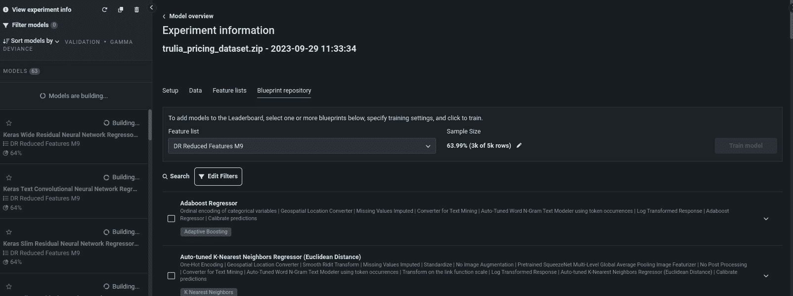

# 第十八章：探索 DataRobot AI 平台

本章我们将重点讨论 DataRobot AI 平台，这是一款付费软件平台，提供强大的工具集来支持深度学习应用案例。DataRobot 允许用户简化机器学习生命周期中的复杂阶段。它为数据科学家、工程师和研究人员提供了一个直观的界面，帮助他们在项目和业务中利用机器学习的强大功能。当我们深入了解 DataRobot 的工作原理时，你将学习到它如何简化并加速复杂深度学习模型的创建、训练、部署和管理。凭借为自动化和易用性设计的功能，它使用户能够专注于真正重要的事情——从他们的机器学习应用中提取重要的价值。

我们的探索将重点介绍 DataRobot 的关键功能，强调其在深度学习解决方案演进中的潜力。DataRobot 致力于为机器学习应用案例提供自动化、协作和可扩展性的结合，使其在深度学习领域也成为一个值得关注的工具。

具体来说，我们将涵盖以下内容：

+   高级概述：DataRobot AI 平台提供的功能

+   使用 DataRobot 准备数据

+   使用 DataRobot 执行建模实验

+   部署深度学习蓝图

+   管理已部署的深度学习蓝图

# 技术要求

本章我们将探讨一个实用的话题，通过使用 DataRobot 部署的模型进行预测。我们将使用 Python 3.10，并需要安装以下 Python 库：

+   `datarobotx==0.1.17`

+   `pandas==2.0.3`

代码文件可以在 GitHub 上找到：[`github.com/PacktPublishing/The-Deep-Learning-Architect-Handbook/tree/main/CHAPTER_18`](https://github.com/PacktPublishing/The-Deep-Learning-Architect-Handbook/tree/main/CHAPTER_18)，数据集可以从 [`www.kaggle.com/datasets/dicksonchin93/datarobot-compatible-house-pricing-dataset`](https://www.kaggle.com/datasets/dicksonchin93/datarobot-compatible-house-pricing-dataset) 下载。

此外，需要一个付费或免费试用账户才能访问 DataRobot。订阅试用账户的步骤如下：

1.  访问 DataRobot 网站：[`www.datarobot.com/trial/`](https://www.datarobot.com/trial/)。

1.  在网页右侧的 **Start For Free** 界面中填写你的凭证，并点击 **Submit** 按钮。

# 高级概述：DataRobot AI 平台提供的功能

DataRobot AI 平台通过模型监控和模型维护工具提供数据摄取、数据准备、数据洞察、模型开发、模型评估、模型洞察与分析、模型部署和模型治理，这些工具相互无缝配合。虽然 DataRobot 简化了深度学习生命周期，但需要注意的是，规划阶段仍然需要人工输入，以定义项目的目标和范围。此外，你仍然需要利用易于获得的洞察、报告和结果。最终，这意味着这样的平台是一个可以协助任何机器学习从业者的工具，而不是替代数据科学家、机器学习工程师、机器学习研究人员或数据分析师。可以把像 DataRobot 这样的 AI 平台看作是强大的计算器，可以帮助你快速而准确地解决复杂的数学问题。但就像计算器不能代替你的思考一样，DataRobot 也无法替代数据科学家、工程师、分析师或研究人员的专业知识和创造力。

DataRobot 提供的某些工具被设计为可扩展、可组合和灵活，允许你添加自己的代码或组件，它们不会将你束缚在平台仅提供的功能上。此外，一些组件覆盖了广泛的方法，因此你不需要担心进行任何定制化。实际上，这意味着你可以在可靠的速度下执行项目，同时仍然保持定制化的能力。

在我们深入了解 DataRobot 提供的组件之前，还有一些关键信息可以帮助你了解该平台的功能：

+   **平台托管选项**：DataRobot AI 平台提供云托管应用。如果你的企业有数据隐私和安全方面的顾虑，DataRobot 还提供将 AI 平台作为私有托管实例，在你自己的基础设施中进行托管的选项。

+   **可扩展性和协作性**：无论你是单个用户还是团队，DataRobot 都设计为可以根据你的需求进行扩展。DataRobot 提供的大多数工具组件都可以与多个用户共享，这使得不同用户之间的协作成为可能。

+   `datarobot`，可以通过 `PyPI` 安装。几乎你在 Web UI 中看到的所有内容都可以通过 API 接口和 Python API 客户端访问。此外，Notebooks 功能提供了一个灵活和互动的环境，在这个环境中，数据科学家可以手动进行复杂的数据分析、创建机器学习模型，并通过 Python API 客户端轻松地与 DataRobot 其他功能一起原型化数据操作。它通过允许默认使用传统的 Python 代码来增强用户体验。

+   **过渡到以用例为中心的资产管理**：在*第一章*中介绍的机器学习（ML）或深度学习（DL）生命周期是一个迭代过程。也就是说，一个深度学习用例会涉及大量的数据、数据版本、模型开发实验、使用已部署模型的应用程序和创建的笔记本。DataRobot 中的**工作台**功能旨在通过在单一界面中管理许多与用例相关的资产，支持这一过程，使得通过用例实现价值变得更加容易。然而，在编写本书时，工作台并未全面支持传统的、独立管理的 DataRobot 项目提供的所有功能。未来将会更新以支持完整的功能套件。你可以使用 DataRobot Classic 功能单独管理项目。*图 18.1* 展示了典型机器学习从业者如何导航平台的示例流程：

给 PD：该图片已发送进行重绘。

图 18.1 – 示例工作台工作流

现在，我们已准备好深入了解深度学习用例相关的支持功能，首先从数据准备组件开始。

# 使用 DataRobot 准备数据

平台提供的第一个部分是数据准备组件。DataRobot 通过提供一系列功能来简化数据摄取、清洗、转换和集成过程。让我们详细了解这些功能。

## 深度学习模型开发的数据摄取

在 DataRobot 中，深度学习模型的开发始于数据摄取这一关键步骤。这个过程允许你直接从各种来源导入数据，包括云存储（如 AWS S3）、Google Cloud Storage、本地文件或数据库（如 PostgreSQL、Oracle 和 SQL Server）。该平台接受多种文件格式，包括 CSV、XLSX 和 ZIP 文件。此外，平台支持通过二级数据集作为输入数据类型的图像、文本、文档、地理空间、数值、类别和汇总类别数据。对于目标数据类型，平台支持数值型、类别型和多标签数据类型，以及无目标数据的无监督学习。这为回归、二元分类、多类分类、多标签分类、无监督异常检测和无监督聚类奠定了基础。

值得注意的是，图像数据类型、文本数据类型和文档数据类型是 DataRobot 中构建深度学习用例的核心非结构化输入数据类型。图像数据和文档数据通过底层编码为 base64 字符串来支持。然而，待导入的数据集本身可以是已压缩的图像或文档文件夹，其中文件夹名称为类别或目标名称。文本数据自然可以以表格数据的形式存在于某一列中，并以 CSV 等格式编码。此外，如果存在二级数据集或日期时间特征列，DataRobot 会自动创建有用的特征。

有两种路径可以导入数据：

+   通过项目创建，这与模型开发过程紧密相连。

+   通过**AI 目录**功能，你可以独立共享数据集，之后可以用于在用例或项目中独立创建实验。

让我们探索第二种方法，因为它是一种更负责任且可靠的数据管理方式，用于模型开发。

### 使用 DataRobot 导入图像和文本数据集

我们将处理一个使用多模态数据预测房价的案例，数据包括图像数据、文本数据、日期数据、分类数据和数值数据。让我们开始一步步的教程：

1.  通过点击**+ 创建新用例**按钮开始创建用例，按钮如*图 18.2*所示。*图 18.2*中的页面也是你进入 DataRobot web 应用并通过[app.datarobot.com](http://app.datarobot.com)登录后的着陆页面：


图 18.2 – 在 Workbench 中创建用例的界面

1.  现在，点击右上角的**DataRobot Classic**，然后点击界面左上角的**AI 目录**选项卡。接着，点击界面左上角的**添加到目录**按钮，再点击**本地文件**，如*图 18.3*所示：


图 18.3 – 在 DataRobot 中将数据集添加到目录的界面

1.  上传代码仓库中提供的`trulia_pricing_dataset.zip`文件。该数据集是一个 ZIP 文件，包含一个 CSV 文件，其中包含原始数据，此外还有原始图像文件，这些图像文件通过其在 ZIP 文件中的相对路径映射到 CSV 中的某一列。从这里，AI 目录中的上传数据集可以独立管理并单独共享。

1.  创建完成后，再次进入右上角的 Workbench，进入我们创建的用例，并将用例重命名为合适的名称，如`房价预测`。然后，点击界面右上角的**添加新**按钮下拉菜单，点击**添加数据集**，如*图 18.4*所示：


图 18.4 – 工作台界面中的定价预测用例

1.  从**数据注册表**页面选择`trulia_pricing_dataset`并点击**添加到用例**，如*图 18.5*所示：


图 18.5 – 将数据集添加到用例

现在，我们已经准备好进入 DataRobot 的 EDA 部分。

## 数据的探索性分析

DataRobot 提供了一个两步体验，用于执行最多 500MB 数据子集的**探索性数据分析**（**EDA**）。第一步是 EDA，在确定项目或实验类型之前执行，第二步则在之后进行。提供了标准的 EDA 技术，包括数值和分类数据的直方图，分类数据前 50 项的频率分布，重复计数、缺失值计数、伪缺失值检测、过度零值检测、目标泄漏、数值汇总、离群行、单变量特征与目标的相关性，以及一个衡量互信息的特征关联矩阵。特别是对于图片和文本数据，DataRobot Classic 在*第 1 步*显示数据的总体样本，并在*第 2 步*按目标值或值范围组进行排序。

*图 18.6*展示了 DataRobot Classic 中的房价预测数据集的 EDA 2 可视化，左侧图片显示了按目标分组的图片样本，右侧图片则显示了重复特征的界面：


图 18.6 – 图片的 EDA 1 和 EDA 2

现在，让我们继续进行房价数据集的 EDA 教程。

### 在 DataRobot 中实际执行 EDA

我们将按步骤继续进行 EDA 教程：

1.  在用例中的**数据**选项卡下点击`trulia_pricing_dataset`实体，你将看到*图 18.7*所示的视图，界面可以水平和垂直滚动：


图 18.7 – 工作台中房价数据集的样本数据预览 EDA 界面

如果你滚动查看整个表格，你会发现数据集由 68 个特征组成，其中 52 个特征被认为是有用的。最显著的是一个有效的图片列，以及另外 23 个原本应该是图片的列，但由于链接没有正确包含，实际上只是一些链接。它还包含五个有用的文本列，分别为事实、简短和完整的地址、房屋特征以及房屋的一般描述。

1.  如果你点击左上角的**特征**按钮，你将看到*图 18.8*所示的界面，其中展示了数据集的简单统计信息：


图 18.8 – 房价数据集的特征

1.  现在，我们需要设置预测目标。这里的用例是预测房价，因此点击**目标特征**框中的`价格`。然后你会看到如*图 18.9*所示的界面：


图 18.9 – 在工作台中选择目标

1.  然后，点击**开始建模**按钮，开始快速建模过程。如果你从 DataRobot Classic 界面导航到**数据**标签，你将能够看到在后台计算的单变量重要性。这会根据所选目标对特征进行单变量信息量排名。这个过程在*图 18.10*中用绿色条形图表示：


图 18.10 – DataRobot Classic 数据标签显示单变量重要性

接下来，我们将探索 DataRobot 在连接数据集源并执行 EDA 后，如何支持数据预处理。

## 数据预处理用于深度学习模型开发

DataRobot 允许你使用其**预处理**功能对数据进行转换。此功能支持通过数据连接将数据集添加到源（如 Snowflake）。你可以创建一组打算应用于整个数据集的转换，这些转换被称为**食谱**。这些转换首先会在实时样本上进行测试，以确保其准确性。一旦食谱完成，它将被发送到数据源并执行，生成最终的输出数据集。此功能还允许你选择性地将转换后的数据集直接保存到数据源中，并通过数据注册表（AI Catalog）获取输出。

DataRobot 支持广泛的转换操作，包括以下内容：

+   从同一连接实例合并数据集

+   对数据集特征应用数学聚合

+   使用标量子查询、标量函数或窗口函数计算新特征

+   根据指定的值和条件过滤行

+   去重行以移除重复项

+   查找并替换特定特征值

+   重命名数据集中的特征

+   从数据集中删除选定的特征

注意

DataRobot 不提供数据标注工具来从零开始创建标签，它依赖于一个假设：原始的业务数据已经被记录并保存在某个地方。使用外部标注工具，如 LabelBox，来协作和可靠地为深度学习用例标注数据。

由于我们使用的数据集是本地数据集，因此这里不会实际探讨数据预处理部分。请访问[`docs.datarobot.com/en/docs/workbench/wb-dataprep/wb-wrangle-data/wb-add-operation.html`](https://docs.datarobot.com/en/docs/workbench/wb-dataprep/wb-wrangle-data/wb-add-operation.html)进一步了解此话题。

接下来，我们将探讨 DataRobot 如何执行建模实验或项目。

# 使用 DataRobot 执行建模实验

DataRobot 目前提供两种方式来执行建模实验：DataRobot Classic 和 Workbench。Workbench 是一个在用例下管理实验的地方，重点是更加无缝地从用例中提取价值，而 DataRobot Classic 是原始的 AutoML 体验，其中建模实验被称为项目。在这里，项目或建模实验包含相同的组件，这些组件包括建模机器学习、收集模型洞察与预测洞察以及进行一次性批量预测。我们将深入探讨这三个组件。

## 深度学习建模

DataRobot 提供以 **有向无环图**（**DAG**）形式呈现的建模配置和任务，这些图被称为 **蓝图**。图中的每个节点分组为以下内容：

+   **输入数据**：输入节点可以是任何支持的输入数据类型。

+   **数据预处理任务**：它们包括数据规范化、标准化、缺失值填充以及任何数据预处理逻辑。你也可以执行选择具体列进行操作的任务。此外，执行预测后处理的技术也在这里归类。作为特征转换的预训练网络也在这里归类。

+   **建模任务**：它们包括所有格式的任何模型，模型会生成预测。你还可以将一个模型任务作为中间节点的一部分，在这里，模型的预测可以通过堆叠方法用于后续的建模任务。堆叠方法输出来自 *k*-折交叉验证策略的组合折外特征，该策略在*第八章*，《探索监督式深度学习》的*深度学习训练数据划分*部分中介绍。这对于训练神经网络并以非过拟合方式在推理阶段提供新特征非常有用。

从全面来看，根据数据类型，支持的深度学习特定任务类型如下：

+   **图像任务**：视觉 AI 特性是封装与 DataRobot 中图像相关的所有内容的产品功能，支持预训练特征提取器、微调特征提取器和预测器，涉及以下网络：Darknet、EfficientNet-B0、EfficientNet-B4、Preresnet10、Resnet50、Squeezenet、mobilenet-v3-small 和 EfficientNetV2-S。特别是对于预训练特征提取器，提供了上述网络的修剪变体，这些变体在提高推理速度的同时不会降低准确性。对于特征提取器，DataRobot 提供了一种开箱即用的方式，可以从预训练网络中提取低、中、高及最高级别的特征，并可以根据使用案例进行调整。此外，支持图像增强任务，这些任务可以在实验执行前和蓝图训练后通过**高级调优**功能进行配置，其中训练过的蓝图可以使用新参数重新训练。在配置图像增强过程中，将提供增强图像的显示预览，这将在接下来的实际操作部分中进行展示。

+   **文本和文档的模型类型**：DataRobot 支持多种文本和文档处理模型，包括词形还原器、预训练的词性标注器、词干提取器、FastText 嵌入、带停用词的 TFIDF、针对英语语言的预训练 TinyBERT 特征提取器、针对英语语言的预训练 Roberta 特征提取器，以及支持多语言的预训练 MiniLM。请注意，DataRobot 为文本所做的策略是，所使用的停用词和预训练模型将取决于在 EDA 样本中检测到的语言。

+   **通用模型**：DataRobot 提供了多种通用模型，如带残差的 MLP 和不带残差的 MLP、**自动特征交互学习**（**AutoInt**）、使用 Hyperband 进行 MLP 的神经架构搜索、自归一化残差 MLP 与训练计划以及自适应训练计划。

DataRobot 会根据数据集的特点、自动驾驶、快速、手动或综合模式的建模策略，自动确定将包含在实验中的蓝图。手动模式不会运行任何蓝图，而是由你决定运行哪个蓝图。快速模式、自动驾驶模式和综合模式可以视为分别需要最快、中等速度和最慢时间完成的模式。综合模式作为完成最慢的模式，会运行不同的蓝图或额外的蓝图，这些蓝图可能会长时间运行，如大型深度学习模型。

DataRobot 使用一种建模策略，逐渐淘汰模型，以找到最佳的探索和运行时平衡，从而构建最佳模型。这涉及创建一组样本量较小的蓝图，并移除较弱的模型。然后，顶级蓝图会使用更大的样本量依次进行训练。这个过程通过识别第二个精简的特征列表，仅保留最具信息量的特征，继续进行。最终，使用这个特征列表对最佳模型进行训练。对于图像，所有蓝图都使用一个预训练的 CNN 模型作为基础模型。当最终的蓝图使用最终的样本量和精简的特征列表构建完成时，最佳模型将在一个更大且更耗时的预训练网络上进行重训练。这种方法有助于识别最有效的特征，并确保最终模型在准确性和效率上得到优化。

另一个关键的建模功能是 DataRobot 的偏差和公平性功能。它使用户能够通过定义受保护的属性、评估各种公平性指标并比较不同子群体的模型表现来构建和评估公平的 AI 模型。在撰写本书时，受保护的属性必须是分类值。如果通过**显示高级选项**启用该功能，平台会自动检测潜在的偏见，提供缓解策略，并允许用户在整个模型开发过程中监控公平性。通过纳入这些功能，DataRobot 促进了负责任的 AI 部署，确保模型符合伦理指南并为所有用户和子群体提供公平的结果。

如果你想尝试一些不属于开箱即用的深度学习任务的工作，可以利用**自定义任务**，这些任务可以在建模实验或项目中共享和使用。自定义任务允许你定义自定义逻辑来进行数据预处理或建模逻辑。基于此功能，组合式机器学习（Composable ML）功能允许你灵活地重构和重新排列蓝图 DAG。这些功能使你能够利用更多开箱即用的常用方法，并能够在实验中尝试任何自定义模型。

DataRobot 通过按需工作队列执行所有任务，例如训练蓝图、计算模型洞察和计算预测。每个用户将获得自己分配的工作者数量。使用深度学习模型进行训练和预测可能需要较长时间。幸运的是，DataRobot 既有 CPU 工作者也有 GPU 工作者，深度学习模型可以在 GPU 工作者上运行，以加速运行时间。

在评估方面，DataRobot 使用嵌套交叉验证，并且绝不使用测试数据进行训练过程中的验证。DataRobot 支持的评估指标非常全面，可以参考 [`docs.datarobot.com/en/docs/modeling/reference/model-detail/opt-metric.html`](https://docs.datarobot.com/en/docs/modeling/reference/model-detail/opt-metric.html)。这些指标和训练好的蓝图随后会以排行榜形式呈现，蓝图会根据所选指标进行排名。

然而，蓝图之间的比较远不止是比较在同一数据集上训练的蓝图。数据集可以不同，实验设置也可以不同，关联的洞察也会有所不同。此时，**模型比较**功能有助于弥补这个差距，并允许在单一用例下比较许多蓝图设置。

最后要提到的是，大多数与建模相关的设置，如权重列、分区策略和优化的评估指标，都可以在**高级选项**功能下进行配置。接下来我们将继续教程，执行一个模型实验。

### 在 DataRobot 中实际执行建模实验

让我们通过逐步过程深入了解 DataRobot 的实际建模，从上一个教程继续：

1.  在你启动建模过程后，在工作台中你将看到以下界面，DataRobot 会显示平台在等待蓝图加载时的操作情况：


图 18.11 – 等待蓝图在工作台中加载

1.  在等待蓝图生成并完成训练后，在工作台中，你将能够看到左侧排序好的训练蓝图，如*图 18**.12 (a)*所示，我们可以**星标**两个模型，以便更全面地比较它们：


图 18.12 – (a) 显示带有分数的排名蓝图，(b) 显示数据集对比功能

1.  通过点击**对比**标签，你将能够在多个实验中，按评估指标、数据集、蓝图类型等方面比较两个星标模型的表现，正如*图* *18**.12 (b)*所示。

1.  通过点击在**Gamma Deviance**指标下表现最好的模型，我们可以在**蓝图**下拉菜单中查看该模型的蓝图结构，如*图 18**.13*所示。该蓝图是一个多模态蓝图，最终模型使用 XGBoost，并接受来自分类、地理空间、数值、图像和文本变量的转化输入。


图 18.13 – 最佳模型蓝图图示

1.  现在，让我们看看是否可以对**验证**、**交叉验证**或**留置**分区的指标得分进行手动改进。由于默认实验建模模式是快速试点，并且在撰写时不能在 Workbench 中重新运行另一种建模模式，让我们通过点击实验界面左上角的**查看实验信息**来手动选择存储库中可用的蓝图，这将带您到*图 18**.14*中的界面：



图 18.14 – 实验信息中的蓝图存储库选项卡

1.  现在，搜索所有 Keras 模型和精调图像模型，勾选复选框，并点击右侧的**训练模型**按钮，以训练更多需要更长时间执行的蓝图。

1.  作为额外的建模步骤，让我们将图像增强添加到先前标记为最佳模型的现有模型中。我们可以通过导航到**DataRobot 经典模型**选项卡，并点击验证分区上最佳模型上的星号。在**蓝图**下的**评估**选项卡中点击**高级调整**子选项卡。这将带您到*图 18**.15*中显示的界面：


图 18.15 – 最佳模型的评估选项卡下的高级调整界面

1.  现在，滚动到**Image Augmentation List**选项卡，点击**创建新列表**，如*图 18**.16 (a)*所示。将**模糊**、**遮挡**、**水平翻转**、**垂直翻转**、**每个原始图像的新图像**、**概率**、**位移**、**缩放**和**旋转**配置为默认设置。点击**预览增强**按钮，你将看到像*图 18**.16 (b)*中那样的图像预览。现在点击**保存为新列表**，设置你的名称，并点击**创建增强列表**。最后，点击**开始调整**，这也显示在*图 18**.16 (a)*中：


图 18.16 – 高级调整中的图像增强配置

等到新调整的蓝图完成训练，你将会得到一个表现更好的蓝图！

这里完成的步骤仅涵盖 DataRobot 支持的建模过程的一小部分。请务必探索功能，如偏差、公平性缓解和评估、可组合 ML、自定义任务、许多其他参数的高级调整以及时间序列建模。

到这个阶段，我们仅使用评估指标作为模型比较的唯一反馈形式。在大多数关键使用情况下，仅使用指标比较蓝图是不够的。在接下来的部分中，我们将发现如何收集模型和预测见解，全面比较蓝图。

## 收集模型和预测见解

值得注意的是，DataRobot 提供了以下洞察，这些洞察与包含深度学习模型任务的蓝图相关：

+   **特征影响**：这是一种多变量分析，帮助确定数据集中不同特征的重要性，揭示哪些变量对模型预测有最强的影响。

+   **特征效果**：这是一个工具，帮助你理解数据集中每个特征如何影响模型的预测。它提供了一个清晰、易于解释的可视化，展示每个特征与模型输出之间的关系。

+   **激活图**：这些是显示输入图像中最有责任做出最终蓝图预测的区域的可视化。它涵盖了作为预测器的神经网络、中间特征提取器，甚至是中间建模器。

+   **预测解释**：这些是用于解释模型输出的技术，突出显示每个输入特征对特定预测的贡献。**SHAP**（**Shapley 加性解释**）和 **XEMP**（**基于扰动的扩展示例模型解释**）是两种受支持的流行方法。对于图像，使用图像激活图；对于文本解释，使用与模型无关的方法提供基于单词的重要性分数。

+   **词云**：这是一种可视化技术，用于表示文本数据集中单词或短语的频率，其中单词的大小表示其重要性或频率。

+   **图像嵌入**：这是在低维空间中对图像的可视化，捕捉了图像的基本特征。它来源于支持的 CNN 模型的输出。

+   **ROC 曲线**：这是一个图表，展示了二分类器的诊断能力，显示不同阈值设置下的真实正例率与假正例率的关系，帮助选择最佳阈值。除了曲线，还增加了混淆矩阵和一个可选的利润曲线功能。利润曲线是一种工具，通过绘制不同阈值下的利润（或其他性能指标），帮助优化分类模型的阈值。

+   **神经网络可视化工具**：这是一个工具，允许用户可视化神经网络的架构，展示各层、神经元以及它们之间的连接。

+   **训练仪表盘**：这是一个工具，提供一个易于使用的界面，展示了重要的损失曲线以及神经网络模型的每个训练周期或迭代的各种度量。

+   **蓝图可视化工具**：这是一个功能，提供了整个蓝图的综合视图，展示了创建机器学习模型时所涉及的数据处理、特征工程和建模步骤。

现在，让我们继续之前的教程，探索其中的一些功能。

### 实际上在 DataRobot 中收集洞察

在 DataRobot Classic 体验中的每个蓝图下，您可以探索所有的洞察功能。在 Workbench 中，正在进行工作以增加全面的洞察体验，迄今为止，特征影响、提升图和残差洞察已可用。让我们以逐步方式深入讲解教程中的洞察部分：

1.  从点击`图像 4`栏开始使用，即使它只是 URLs。接下来的`Home Id`栏应该被移除：


图 18.17 – 特征对最佳模型的影响

1.  接下来，我们将通过点击`浴室`来探索最佳蓝图的特征效果。效果图显示，随着浴室数量的增加，价格通常会增加，这很有道理：


图 18.18 – 最佳蓝图的特征效果

1.  接下来，点击`描述`，它也是一个重要的贡献特征。点击**值**栏下的符号打开弹出模态窗口，您可以查看该特征的文本说明，如*图 18.19*所示。两个说明都很清晰且合理：


图 18.19 – 最佳蓝图的预测说明

1.  现在，让我们点击被负面归因的`nice`。然而，`cozy`被负面归因是有道理的，因为它通常指代小型单元。


图 18.20 – 最佳蓝图的词云重要性归因

1.  接下来，点击**激活图**子标签页，查看*图 18.21*所示的界面：


图 18.21 – 最佳蓝图的激活图

对于图像激活图，您需要注意逻辑上不合常理的区域。可以提出像“为什么模型在看天空？”或“为什么模型在看草地？”这样的问题。同时，可以进一步提问“修剪整齐的草坪和价格有关系吗？”对于这个使用场景，涉及到很多视觉组件，使得很难判断什么不合常理。聚焦于草地仍然可能是有意义的，但至少可以放心的是，模型至少没有在看没有任何贡献的天空。此外，预测和实际过滤器可以帮助您辨别成功示例的行为与失败示例的行为，这对于形成模型识别的模式的心理图像非常有帮助。另一个问题是，图像列在表示房屋的哪一部分时没有标准化。标准化有助于您获得更好的预测性能。

1.  最后，你可以单独导出洞察报告，甚至更好的是，下载合规报告文档，它提供了一个离线的一站式文档，包含所有洞察。你可以通过点击**合规性**标签页并点击**创建报告**按钮（如*图 18.22*所示）来完成。文档有一个默认结构，但你可以根据需要设计报告的确切结构。代码库中提供了一个示例文档。


图 18.22 – 蓝图下的模型合规文档界面

这样，我们就完成了关于收集洞察的教程。不过，请注意，这并不是一个全面的关于此用例的洞察收集方法。因此，务必测试更多类型的洞察，例如提升图和图像嵌入，并在收集洞察时进行更多模型改进的迭代。

在我们进入 DLOps 部分之前，先来探索一下如何在不部署模型的情况下进行批量预测。

## 批量预测

在某些用例中，部署不是必须的，因为可以通过自定义触发器或一次性事件以定期的方式异步进行预测。这时，**批量预测**功能就派上用场了。批量预测允许你上传数据，选择性地计算预测结果（并可附加预测解释），完成后可以下载结果。

此步骤可以在 DataRobot Classic 和 Workbench 中完成。对于 DataRobot Classic 的图形界面体验，导航到**预测**标签下的**进行预测**子标签页。然后，你就可以上传你希望用来生成一次性预测的数据集。该界面如*图 18.23*所示：


图 18.23 – 批量预测功能界面

仍然会有一些用例需要通过单个样本进行实时预测。这引出了下一部分——讨论 DataRobot 如何管理蓝图的部署。

# 部署深度学习蓝图

DataRobot 允许通过实验或项目中的训练蓝图直接部署模型，我们将在下一个实际操作部分中详细探讨。然而，对于更高级的用户，平台还允许通过 `requirements.txt` 文件部署自定义模型。一旦上传，用户就可以创建、测试并将自定义推理模型部署到 DataRobot 的集中部署中心。这些自定义模型支持不同类型的模型，包括回归、分类和非结构化类型，其中输入和输出可以是各种类型。

为确保自定义模型的可靠性和兼容性，DataRobot 提供了一个全面的测试套件，供自定义模型工作坊使用。自定义模型测试套件涵盖了广泛的评估，包括以下内容：

+   **启动检查**：确保自定义模型能够构建且自定义模型服务能够无误启动

+   **空值插补检查**：这验证了对缺失值的处理

+   **副作用检查**：确保在批量数据中预测的一行数据与单独预测同一行数据时产生相同的预测结果

+   **预测验证**：这确认了预测的正确性

+   **性能检查**：这评估了模型的效率和速度

+   **稳定性检查**：这评估了模型的一致性和可靠性

+   **持续时间检查**：这衡量了完成各种任务所需的时间

通过运行这些测试，你可以在部署前验证自定义模型的性能、稳定性和预测准确性。使用监督式自定义模型的一个额外好处是，它可以与训练数据关联，这样就可以计算预测解释并衡量和监控数据漂移。一旦你的自定义模型完成并经过测试，就可以将其与 DataRobot 中的其他蓝图一起部署，使其成为高级用户的多功能且强大的工具。要部署模型（无论是自定义模型还是本地 DataRobot 模型），前提是你需要选择你想要的部署可靠性。可靠性级别包括以下几种：

+   **低**：适用于非关键、实验性或低优先级的用例，在这些情况下，偶尔的停机或性能下降是可以接受的。此选项提供最少的资源和基础设施冗余。

+   **中等**：适用于需要在成本和性能之间平衡的中等重要的用例。此级别提供比低级选项更好的资源和冗余，但在高峰期负载时，仍可能会经历一些停机或性能下降。

+   **高**：推荐用于要求高可用性和高性能的重要用例。此级别提供增加的资源、基础设施冗余和更快的响应时间，以确保在重负载下也能保持一致的性能。

+   **关键**：专为任务关键型应用设计，最大化可用性和性能至关重要。此选项提供最高级别的资源、冗余和响应时间，以确保在任何条件下几乎无停机时间并保持最佳性能。

选择适当的可靠性级别可以让 DataRobot 根据你的需求配置适当的服务器机器类型和基础设施来托管你的模型。由于你的组织签订的部署协议有一定限制，选择适当的可靠性级别可以确保你不会在超出组织部署限制后支付过多费用，或者确保你不会超出部署限制。换句话说，你必须管理部署过程中产生的成本。让我们继续之前的教程，部署表现最佳的蓝图，该蓝图没有经过验证或保留分区训练。

## 实际在 DataRobot 中部署蓝图

部署蓝图就像去蓝图下的 **Predict** 标签下的 **Deploy** 子标签，然后点击 **Deploy model** 按钮一样简单。接着，你需要选择部署可靠性，默认值为低。然后，在相同位置再次点击 **Deploy model** 按钮。第一个 **Deploy model** 按钮的界面如 *图 18.24* 所示：


图 18.24 – 部署蓝图

就这样！我们已经成功通过点击两个按钮在 DataRobot 中部署了一个模型。接下来，我们将讨论 DataRobot 如何管理已部署的蓝图。

# 管理已部署的深度学习蓝图

在本节中，我们将讨论 DataRobot 如何通过提供全面的模型利用、监控和维护工具，帮助用户有效地管理他们的深度学习模型。DataRobot 关注无缝集成，允许用户在云端或本地基础设施上部署 AI 应用，管理预测输出，并使用自定义指标和警报监控模型性能。此外，平台支持数据漂移检测，并提供再训练功能，以持续改进模型。我们将详细探讨这些功能，展示 DataRobot 如何帮助用户高效管理深度学习模型，并确保其在整个生命周期中的最佳性能。

## 通过 DataRobot 中的模型利用进行管理

用户可以通过多种方式访问他们的模型，如 API 调用、Python 接口，或 DataRobot 制作的名为 `base64` 格式的应用程序。DataRobot 还方便将预测结果直接存储到数据库中，从而简化了将模型输出纳入现有工作流程或应用程序的过程。此外，DataRobot 允许安排定期执行批量预测，以便按指定的频率和时间自动执行。

总体而言，DataRobot 中的模型利用组件简化了深度学习模型和机器学习模型的一般应用流程，使其对各个领域的用户更具可及性和效率。

现在，让我们继续之前的教程，使用 DataRobot HTTP 客户端库获取预测。

### 实际使用 DataRobot 中部署蓝图的预测

在本节中，我们将继续上一个教程，并使用`datarobotx` Python 客户端库通过已部署的模型生成预测。在每个部署下，DataRobot 都包含了低级示例代码，可以向部署发送实时`prediction-api`请求。然而，在本教程中，我们将使用一个简单易用的高级库`datarobotx`，该库简化了`prediction-api`请求的发送。让我们开始逐步操作：

1.  让我们先导入所需的库：

    ```py
    import datarobotx as drx
    import pandas as pd
    ```

1.  接下来，我们将基于部署 ID 初始化部署实例。你需要在此处将`deployment_id`替换为自己的部署 ID：

    ```py
    deployment_id = "YOUR_DEPLOYMENT_ID"
    d = drx.Deployment(deployment_id)
    ```

1.  接下来，我们将在 DataRobot 上下文类中设置 API 令牌和端点 URL。你需要在此处设置自己的令牌：

    ```py
    drx.Context(
         token="YOUR_API_TOKEN",
         endpoint="https://app.datarobot.com/api/v2",
    )
    ```

1.  现在，我们将加载代码仓库中提供的`trulia_one_row.csv`房价数据框，并使用初始化的部署实例进行预测。最后，我们展示预测结果：

    ```py
    one_row_df = pd.read_csv("trulia_one_row.csv")
    prediction_results = d.predict(one_row_df, max_explanations=3)
    print(prediction_results.to_json(indent=2))
    ```

    这将产生以下结果：

    ```py
    {"prediction":{"0":1020288.625},"explanation_1_feature_name":{"0":"Price Sqr Ft"},"explanation_1_strength":{"0":0.4690563465},"explanation_1_actual_value":{"0":"$359\/sqft"},"explanation_1_qualitative_strength":{"0":"+++"},"explanation_2_feature_name":{"0":"Description"},"explanation_2_strength":{"0":0.3055447842},"explanation_2_actual_value":{"0":" The table is set in this large Plan 4 with its top two levels of interactive living spaces for educating and engaging. Four bedrooms suit home-based entrepreneurs, stepchildren and a widowed parent who can come together in an expansive gathering room. An elongated deck invites open-air grilling and entertaining. A side-by-side garage adds valuable storage. "},"explanation_2_qualitative_strength":{"0":"++"},"explanation_3_feature_name":{"0":"Bath"},"explanation_3_strength":{"0":0.2212744913},"explanation_3_actual_value":{"0":3.0},"explanation_3_qualitative_strength":{"0":"++"}}
    ```

本教程到此结束。接下来，我们将深入了解 DataRobot 如何为已部署的模型实现模型监控。

## 通过在 DataRobot 中进行模型监控进行治理

在 DataRobot 中，模型监控是一个重要组成部分，允许用户跟踪其已部署的深度学习模型的性能和健康状况。平台提供了多项功能，确保模型随着时间的推移保持最佳性能：

+   **数据漂移检测**：DataRobot 持续监控输入数据分布的变化，识别任何与原始训练数据的偏差。此功能帮助用户了解模型是否因基础数据发生变化而可能面临准确度下降的风险。

+   **模型性能监控**：用户可以跟踪其模型随时间变化的性能。包括以下内容：

    +   **准确性**：可以通过将实际目标值与预测值进行比较来进行监控。实际目标值可以在做出预测后随时发送到部署，但前提是必须设置关联 ID 并返回，以将实际目标与历史预测请求连接起来。

    +   **公平性**：确保 AI 模型在生产环境中继续提供公平和无偏的预测。这里同样需要一个关联 ID，因为它与准确性相关的性能指标相关。部署模型的公平性功能的关键方面包括：

        +   **公平性指标追踪**：平台追踪各种公平性指标，如差异影响、人口统计平衡和机会平等，使用户能够评估其模型在受保护属性不同子群体中的公平性。

        +   **警报和通知**：如果检测到偏差或差异，DataRobot 可以配置为发送警报和通知，确保用户及时了解在模型生命周期中可能出现的任何公平性问题。

+   **谦逊规则**：用户可以设置基于不良条件执行的操作。支持的条件包括预测中的不确定性、异常输入值或范围，以及低观察区域。支持的操作包括记录触发器、用定义的预测覆盖预测结果，以及抛出错误。这增强了用户对模型预测的整体信心，减少了模型基于低信心水平的预测、分布外数据或低观察数据点做出错误决策的风险。

+   **部署服务健康监控**：包括总预测次数、总请求次数、在定义的时间间隔内发出的请求数、聚合响应时间（例如中位数）、聚合执行时间（中位数）、每分钟调用的中位数峰值负载、数据错误率、系统错误率、消费者数量以及缓存命中率。

+   **部署通知**：有关部署变化的通知，可以选择通知所有变化或仅通知关键变化。

+   **自定义指标追踪和警报**：DataRobot 允许用户定义和监控特定于其使用案例的自定义性能指标。用户可以设置警报，当某些阈值被达到时通知他们，从而确保及时响应任何与性能相关的问题。

现在，让我们实际探索一下 DataRobot 提供的模型监控界面。

### 实际监控在 DataRobot 中已部署的蓝图

点击已部署模型的**服务健康**标签，你将能够查看整体服务健康监控。如*图 18.25*所示。此外，你可以在已部署模型下的各自标签中查看数据漂移、准确性、谦逊、公平性和自定义指标的仪表盘。而通知则默认配置为发送至所有部署活动，并可以根据偏好进行配置。


图 18.25 – 已部署模型的服务健康状况

接下来，我们将讨论用户如何维护已部署模型的性能，并确保模型能够持续提供价值。

## 通过 DataRobot 进行模型维护的管理

DataRobot 中的模型维护是管理深度学习模型的一个关键方面，确保它们在整个生命周期内持续提供准确和可靠的结果。平台提供了多个功能来促进有效的模型维护：

+   **挑战者模型和模型替换**：DataRobot 允许用户创建并比较替代模型（称为挑战者模型）与当前已部署模型的表现。通过评估这些挑战者模型的表现，用户可以识别潜在的改进，并决定是否需要用性能更好的替代模型替换现有模型。一旦确定了更好的模型，它将被称为**冠军模型**，并替换掉之前的模型，保持相同的部署 ID，确保顺利过渡到更好的模型。

+   **模型版本控制**：DataRobot 跟踪并管理模型的不同版本，允许用户在需要时轻松恢复到之前的版本。此功能确保用户可以保留模型历史记录，并在不同版本之间进行性能对比。

+   **再训练和再训练策略**：用户可以将通过已部署模型接收到的数据，包括输入数据和延迟的目标值，注册到 AI 目录中。这使得模型能够使用最新的数据进行再训练。此外，DataRobot 的再训练策略提供了一种管理和自动化模型更新过程的方法，确保已部署的模型保持相关性并维持最佳性能。再训练策略的关键方面包括以下内容：

    +   **可定制触发器**：用户可以定义用于再训练的特定触发器，例如数据漂移、性能下降或预定的时间间隔，以便在满足特定条件时自动启动再训练过程。

    +   **数据集成**：再训练策略促进了新数据无缝集成到模型更新过程中，确保模型训练时使用最新和最相关的信息。

    +   **自动化再训练和部署工作流**：DataRobot 自动化了整个再训练过程，从数据摄取和预处理到模型构建和验证，简化了模型更新工作流，并减少了人工工作量。用户可以选择保持相同的模型及其参数，保持相同的模型并进行超参数优化，或者从自动驾驶模式中选择最佳模型。再训练后的模型会使用性能指标自动与新数据进行评估，帮助用户评估更新后的模型性能，并确定其是否准备好重新部署。一旦再训练后的模型达到您希望实现的性能标准，DataRobot 将帮助其无缝部署，最小化中断，替换掉现有模型。通过采用再训练策略，DataRobot 简化并自动化了模型更新过程，帮助用户确保他们部署的 AI 模型在新数据和洞察可用时保持准确、相关和高性能。

通过深入了解 DataRobot 支持的功能，并通过实践教程，我们获得了关于 DataRobot 如何利用深度学习方法处理和分析数据，包括非结构化数据和结构化数据的重大见解。现在，让我们来看看一些实际的案例，这些案例展示了该技术的能力，并由对 DataRobot 充满热情的客户分享了他们的经验。

# 探索一些客户成功案例

DataRobot 使众多组织通过实施深度学习解决方案取得了显著成功，特别是在处理非结构化数据（如文本和图像）方面。虽然大多数成功案例仍然保密，但我们很幸运能有一些客户热情地分享了他们鼓舞人心的经验，展示了深度学习在各个行业中具有的变革潜力。其中一些显著的成功案例包括：

+   联想，这家领先的科技公司，成功在其巴西笔记本电脑制造厂实施了 DataRobot 的视觉 AI，以改善质量控制并提高生产力。该视觉 AI 系统通过自动化比对笔记本电脑上的识别标签与其相应的物料清单，将标签验证的准确率从 93%提高到了 98%。此实施不仅减少了人工标签过程中的错误，还对交货时间、客户满意度以及制造商的法律风险产生了积极影响。

+   OYAK 水泥，土耳其领先的水泥制造商，成功利用 DataRobot 的 AI 解决方案优化了其制造流程，从而降低了成本和 CO2 排放。通过实施 AI 辅助的过程控制，OYAK 将替代燃料的使用量提高了七倍，减少了近 2%的总 CO2 排放，并节省了约 3900 万美元的成本。该公司还能够更高效地预测和防止机械故障，提高了整体运营效率和环境可持续性。

+   AUTOproff 成功实施了 DataRobot AI 平台，其中包括处理车辆图像数据的视觉 AI 能力，开发了其定价机器人来进行自动化的汽车价值估算。这个 AI 驱动的解决方案自动化了 55%–60%的所有估算，从而提高了定价准确性，并显著缩短了生成报价所需的时间。因此，评估人员可以专注于更为稀有的车辆，提高了他们的效率。定价机器人的成功在 AUTOproff 的欧洲扩展中发挥了关键作用，使公司能够迅速适应新市场。这最终提高了客户满意度，并优化了业务运作。

获取更多关于最新成功案例的信息，请访问[`www.datarobot.com/customers/`](https://www.datarobot.com/customers/)。

当我们走到本章的尾声时，如果您有兴趣亲自试用 DataRobot AI 平台，并且尚未拥有访问权限，您可以订阅免费的试用版。这将使您能够亲身体验 DataRobot 所提供的强大工具和自动化功能，试用期为 30 天（截至 2023 年 9 月 28 日），帮助您专注于从深度学习应用中提取显著价值。

# 总结

本章探讨了 DataRobot AI 平台，并展示了 AI 平台能为您提供的普遍好处。DataRobot 简化了机器学习生命周期中的复杂阶段，为数据科学家、工程师和研究人员提供了直观的界面。通过利用像 DataRobot 这样的 AI 平台的潜力，用户可以加速创建、训练、部署和管理复杂的深度学习模型，专注于从机器学习应用中提取显著价值。

DataRobot 为机器学习应用场景提供自动化、协作和可扩展性。DataRobot 支持多种数据类型和先进功能，如偏差与公平性缓解、可组合机器学习、定制任务、先进调优和时间序列建模等。DataRobot 还使用户能够在基于云的或本地的基础设施上部署 AI 应用程序，管理预测输出，监控模型性能，并维护在**挑战者模型**、**模型版本控制**、**再训练**和**再训练策略**等功能中实现的模型。

本章展示了 DataRobot AI 平台的各种功能和能力，但并未全面覆盖该平台提供的所有内容。此外，随着公司不断发展以满足现实世界数据科学的需求，未来可能会添加任何尚未支持的功能。欲了解更详细的信息，可以参考官方文档 [`docs.datarobot.com/`](https://docs.datarobot.com/)。

总之，像 DataRobot 这样的 AI 平台为深度学习应用提供了强大的解决方案，简化并加速了深度学习生命周期。然而，它们并不是数据科学家、工程师、分析师或研究人员的专业知识和创造力的替代品；相反，它们是帮助从业人员快速且准确地解决复杂问题的工具。

当我们进入下一章时，我们将深入探讨大语言模型的世界，探索它们的潜力、挑战以及如何创造有效的解决方案。在前面所有章节的基础上，我们将揭示如何利用 LLM 的强大功能来处理复杂的语言任务，并创建先进的、具备上下文意识的应用程序。
