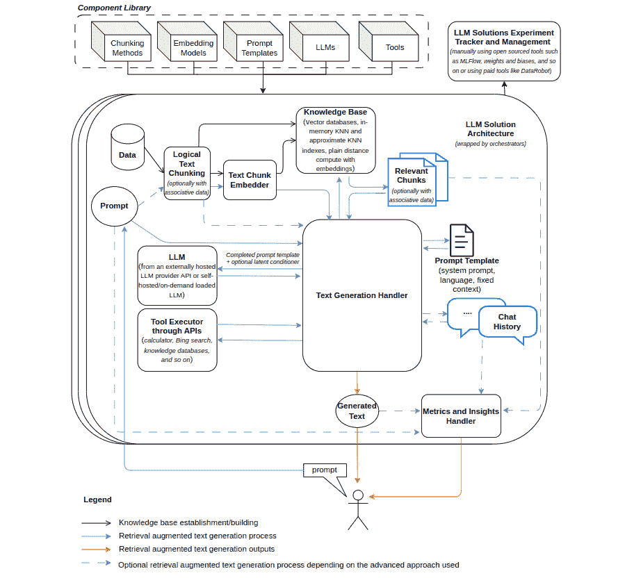
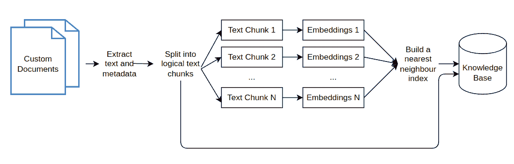
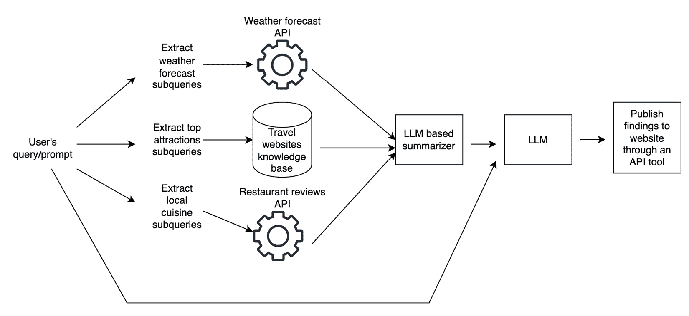

# 第十九章：构建 LLM 解决方案

**大型语言模型** (**LLMs**) 已经彻底改变了 **自然语言处理** (**NLP**) 和 **人工智能** (**AI**) 领域，展现出在处理各种任务时的卓越多功能性。然而，要实现它们的全部潜力，需要解决一些挑战并开发有效的 LLM 解决方案。本章将为您揭开构建 LLM 解决方案的神秘面纱，重点介绍内存、问题解决能力、自主代理和增强性能的高级工具等关键方面。我们将专注于基于检索增强的语言模型，这些模型能够提供上下文相关的信息，探讨它们的实际应用以及进一步改进它们的方法。此外，我们还将揭示挑战、最佳实践和评估方法，以确保 LLM 解决方案的成功。

在这些基础概念的基础上，本章将为您提供必要的知识和技巧，帮助您创建强大的 LLM 解决方案，满足您的特定需求。通过掌握构建 LLM 解决方案的艺术，您将更好地准备好应对复杂的挑战，优化性能，并在各种现实应用中释放这些多功能模型的真正潜力。

具体来说，我们将涵盖以下主题：

+   LLM 解决方案概述

+   处理 LLM 解决方案中的知识

+   评估 LLM 解决方案

+   识别 LLM 解决方案中的挑战

+   应对 LLM 解决方案的挑战

+   利用 LLM 构建自主代理

+   探索 LLM 解决方案的应用场景

# LLM 解决方案概述

LLM 在回答问题、机器翻译、语言建模、情感分析和文本摘要等多种任务中表现出色。它们能够生成非结构化文本，但可以被引导生成结构化输出。LLM 解决方案利用这一能力，并通过知识库中的自定义数据来创造有针对性的、有价值的结果，服务于组织和个人。通过合理优化流程和客观提升输出质量，LLM 解决方案可以释放 LLM 生成内容的真正潜力，使其在各类应用中更加强大和实用。

随着预训练世界知识的 LLM 逐渐变得更加普及，这在使更多人群能够获得这些好处方面发挥了重要作用。得益于各种 LLM 提供商和开源平台，组织和开发者现在可以更轻松地采纳并将 LLM 集成到他们的工作流程中。知名的 LLM 提供商，如 OpenAI（GPT-4 或 GPT-3.5）、Microsoft Azure、Google 和 Amazon Bedrock，提供预训练模型和 API，能够无缝集成到各种应用程序中。此外，Hugging Face 平台通过提供丰富的开源模型库，使 LLM 更加易于访问。Hugging Face 不仅提供了广泛的预训练模型和微调技术，还培养了一个积极的社区，持续贡献于 LLM 的改进。

随着组织和个人利用 LLM 的强大功能来完成日常任务和用例，至关重要的是要确定如何有效利用定制知识。这一考虑确保了 LLM 能够针对特定需求得到最优利用；这一点将在*LLM 解决方案中的知识处理*部分进一步探讨。通过充分利用 LLM 日益增加的可达性和多功能性，组织和个人能够释放这些强大模型的全部潜力，推动创新并改善结果。

尽管大语言模型（LLMs）具有令人印象深刻的能力，但在解决它们未被设计用来处理的复杂问题时，仍面临一些限制。以下是其中的一些限制：

+   无法访问最新事件的信息

+   倾向于虚构事实或生成模仿的虚假信息

+   理解低资源语言的困难

+   缺乏进行精确计算的数学能力

+   对时间流逝的无意识

为了克服这些限制并增强 LLM 的解决问题能力，可以通过加入以下组件来开发先进的解决方案：

+   **实时数据集成**：通过将 LLM 连接到实时数据源，如 API、数据库或网络服务，模型可以获取最新的信息并提供更准确的回应。

+   **现有工具集成**：将现有工具和 API 集成到 LLM 架构中，可以扩展其能力，使其执行一些单独模型难以或无法完成的任务。

+   **具有不同人格和背景的多个代理**：开发一个多代理系统，每个代理具有独特的人格和背景，可以帮助解决不同问题情境下的挑战。这些代理可以协作、共享信息并提供更全面、可靠的解决方案。

*图 19.1* 显示了一种架构，展示了可以在 LLM 解决方案中应用的不同方法和技巧，本章将介绍这些内容：

图 19.1 – LLM 解决方案架构

在接下来的几个部分，我们将更全面地深入探讨此 LLM 解决方案架构中列出的各个组件以及 LLM 解决方案的整体内容。我们将从如何处理 LLM 解决方案中的知识开始。

# 处理 LLM 解决方案中的知识

域知识是创建 LLM 解决方案的关键，它提供了解决特定问题所需的背景信息和理解。这最终确保了解决方案得出的答案或行动是准确的且有帮助的。域知识需要作为上下文包含在内，作为参数化记忆、非参数化记忆的一部分，或两者的结合。参数化记忆指的是在 LLM 中学习到的参数。非参数化记忆指的是外部知识库，如文档、文章或摘录列表，可以根据需要选择注入为 LLM 上下文的一部分。这个过程也被称为上下文学习方法、知识检索或信息检索。

非参数化的外部知识可以通过以下任一方式提供给 LLM：

+   **作为交叉注意力机制中的潜在条件**：潜在条件涉及从外部知识生成潜在特征向量，并将其作为键值向量的一部分输入到注意力机制中，该机制在*第六章*《理解神经网络转换器》中已介绍，同时原始输入作为查询向量传入。此方法通常需要对网络的解码器部分进行某种形式的微调，尤其是在编码器-解码器的转换器架构中。理想情况下，微调过程将构建一个解码器，使其能够推广到目标外部潜在特征的领域，并能够关注各种信息。此方法允许将任何数据模态作为外部知识进行包含。值得注意的是，发布的研究论文中的**检索增强生成**（**RAG**）和**检索增强转换器**（**RETRO**）方法[1][2]采用了这种方法。

+   **作为 LLM 输入提示的一部分**：这是一个简单的过程，不需要任何微调，但仍然可以从中受益。这种方法为将任何自定义领域知识应用于 LLM 提供了最低的入门门槛。然而，这种方法仅支持以能够有效表示为文本数据的数据模态表示的知识，如文本、数值、类别和日期数据。值得注意的是，发布的研究论文中的**检索增强语言模型预训练**（**REALM**）方法[3]，特别用于预训练，并未作为最终训练模型的一部分使用。

两种方法都需要建立一个知识库，如*图 19.2*所示，并且需要一个知识检索组件来从知识库中检索信息，如*图 19.1*所示：

图 19.2 – 构建知识库

*表 19.1* 简要总结了 REALM、RETRO 和 RAG 方法：

| **知识** **检索方法** | **检索器训练** | **检索集成** |
| --- | --- | --- |
| RAG | 使用冻结的基础网络进行微调 | 带有交叉注意力的潜在调节器 |
| REALM | 完整的端到端训练 | 特别地将其预先加入提示中，不使用模板 |
| RETRO | 使用冻结的基础网络进行微调 | 带有交叉注意力的潜在调节器 |

表 19.1 – 与 LLM 方法的检索集成简短概述

知识库要求将文本数据预处理成适当的逻辑块或段落。这些段落随后通过训练好的变换器模型转化为嵌入向量。最后，构建最近邻索引，使得能够高效地从知识库中检索相关信息。最近邻索引可以是简单的 KNN 算法，用来计算提示嵌入向量之间的原始距离，或者是近似 KNN 算法，近似计算距离。然后，索引和逻辑文本段落将作为知识库的一部分，可以用于检索。执行检索的方法可以根据不同策略有所不同，但最简单的形式是通过生成提示的嵌入向量，并使用索引返回知识库中与之最接近的前`k`个文本段落。这些前`k`个最接近的文本段落可以作为 LLM 提示的一部分或作为潜在调节器包含进去。

对于将最相关的文本切块作为提示的一部分的方式，制作一个可以插入特定内容的提示模板是标准做法，并有助于合理地组织提示中的信息。这可以像使用引导性文本`Context:`一样简单，接着是检索到的相关文本切块，并在提示模板的上下文部分之前和之后插入换行符。

尽管研究论文通常会提出涵盖检索过程各个方面的已发布方法，但将构建和使用知识库的每个组件视为独立的、可互换的部分是很有帮助的。这允许在特定情况下选择最合适的组件，从而具有更大的灵活性。此外，尽管存在一种已发布的方法被称为 RAG，但值得注意的是，在实践中，RAG 这一术语通常用来描述将知识检索与 LLM 集成的通用方法，而不仅仅指该特定方法。接下来，我们将简要介绍可以根据用例自由修改的三大基于方法的组件。我们还将选择帮助简化这些组件实现的协调工具。

## 探索文本切块方法

文本切块过程会影响 LLM 上下文利用效率和生成结果的质量。选择合适的切块方法取决于以下因素：

+   **用于生成嵌入向量的嵌入模型**：不同的预训练嵌入模型在文本切块时可能有不同的要求或限制。两个这样的要求是支持的上下文大小和预训练期间使用的典型文本上下文大小。

+   **预期提示所需信息的粒度**：预期提示所需的详细程度或粒度可能会影响文本切块方法的选择。根据具体的使用案例，方法应能够将文本切分成合适且简洁的片段，从而为 LLM 提供必要的信息，以生成准确、简洁且相关的响应。

+   **用于构建知识库的文本数据的性质**：文本数据本身的特征也可能影响文本切块方法的选择。例如，如果文本数据由长段落或文档组成，可能更适合采用将文本拆分成较小切块或章节的方法。另一方面，如果文本数据已经被组织成逻辑段落，则可能更倾向于选择能够保留这些段落的方法。此外，如果文本数据是 Python 代码，使用代码方法对文本进行切块可能更为合适。

有几种方法可以进行文本切块，包括句子、段落、实体、主题和章节切块。这些方法帮助将文本组织成可以被 LLM 处理的有意义单元。一个值得注意且易于使用的方法是来自 LangChain 库的递归切块方法。该方法通过递归地使用有序文本分隔符列表、最大切块大小和切块之间的重叠百分比来调整切块的粒度。最大切块大小应根据嵌入模型支持的上下文大小量身定制，以确保生成的切块能够有效处理。与此同时，加入重叠百分比有助于最小化错过关键信息的风险，特别是那些可能位于切块边界的信息。

许多基于递归切块方法的文档特定切块方法是通过指定适当的文本分隔符的有序列表创建的。具体来说，截至`langchain==0.0.314`，已经为 Python 代码创建了递归方法（`PythonCodeTextSplitter`），为 Markdown 文档创建了`MarkdownTextSplitter`类的递归方法，以及为 LaTeX 格式文本创建了`LatexTextSplitter`类的递归方法。

接下来，让我们深入探讨嵌入模型的选择。

## 探索嵌入模型

嵌入模型在为 LLM 解决方案生成知识库中起着至关重要的作用。这些模型负责将文本的语义信息编码为向量表示，然后这些向量用于从知识库中检索相关信息。

一个提供文本嵌入模型性能洞察的基准是 `text-embedding-ada-002`。

在选择用于生成知识库的嵌入模型时，必须考虑模型大小、嵌入维度和序列长度等因素。传统的嵌入模型，如 GloVe，提供高速度，但可能缺乏上下文意识，导致较低的平均得分。另一方面，像 `all-mpnet-base-v2` 和 `all-MiniLM-L6-v2` 这样的模型在速度和性能之间取得了平衡，提供了令人满意的结果。为了获得最佳性能，像 `bge-large-en-v1.5`、`ember-v1` 和 `e5-large-v2` 这样的更大模型主导了 MTEB 排行榜，所有这些模型的大小为 1.34 GB。

需要注意的是，嵌入模型的选择取决于具体的任务和使用的数据集。因此，深入探索 MTEB 排行榜的不同选项，并考虑知识库生成过程的要求，有助于选择最合适的嵌入模型。

MTEB 通过其丰富的数据集和评估指标集合，为 NLP 领域的研究人员和实践者提供了宝贵的资源。通过利用 MTEB 提供的洞察，开发者可以在为 LLM 解决方案选择嵌入模型时做出明智的决策。

在我们深入探索知识库索引类型之前，必须记住，分块方法和嵌入模型的选择决定了知识库的构建方式。这两个组成部分在 LLM 能够高效地检索和利用知识方面发挥着重要作用。现在，让我们更深入地了解知识库索引类型，并学习它们如何提升 LLM 解决方案的效率。

## 探索知识库索引类型

知识库索引是大规模语言模型（LLM）解决方案中检索机制的支柱。它是实现高效查找相关信息的组成部分。虽然实现这个索引的方法有很多种，但它们的目标都是提供一种快速高效的方式，从知识库中基于输入提示检索最相关的文本片段。

构建知识库索引有多种选择。它们从手动代码实现，到使用各种向量数据库库、服务提供商和插件都有。以下是一些可选方案：

+   `faiss` 是一个用于高效相似度搜索稠密向量的库，`scipy` 是一个用于计算成对距离的库。这允许自定义，但可能需要更多的努力和专业知识，并且需要更大的内存分配。

+   **服务提供商**：各种云服务提供商提供向量数据库服务，包括 Pinecone、Chroma、Vespa 和 Weaviate。这些服务处理了管理向量数据库的复杂性，提供了可扩展且强大的解决方案，可以轻松地集成到你的 LLM 架构和解决方案中。

+   **支持向量计算的数据库工具**：传统的数据库工具，如 MongoDB、Neo4j、Redis 和 PostgreSQL，通过插件提供向量计算支持。如果你已经在技术栈中使用这些工具，并希望利用它们的功能来构建知识库，这可能是一个不错的选择。

+   **插件**：还有一些插件可以直接从 LLM 服务提供商获取，例如 ChatGPT，它们可以帮助构建和维护知识库。

选择正确的知识库索引类型取决于你的具体需求，比如知识库的大小、检索需求的复杂性以及你可用的资源。在做出选择时，要考虑可扩展性、集成的简便性、成本以及对知识库控制的程度。如果你的知识库已经足够大，建议只考虑使用实际数据库技术或声称使用这种技术的向量数据库。如果你的知识库比较小，例如六位数范围内，通过 Python 计算单次提示的原始距离计算时间少于 1 秒！接下来，我们将简要探索 LLM 解决方案的协调库。

## 探索 LLM 解决方案的协调工具

构建 LLM 解决方案的过程可以通过使用特定工具进行简化。开源的协调库，如 LangChain 和 LlamaIndex，在这个过程中发挥了重要作用。这两种工具简化了设置知识库、集成 LLM 和管理检索机制等任务。总的来说，协调工具显著减少了 LLM 解决方案的复杂性和开发时间。

除了开源的协调工具外，还有一些付费选项可供选择，这些选项提供高级功能和支持。包括 DataRobot、Microsoft Azure、IBM Watson、LangSmith、OpenAI 和 Google Vertex AI。这些平台提供了广泛的预构建模型、集成和工具，能够简化整个流程，从数据摄取到模型部署和监控。

在继续探索这些工具和方法的同时，建立强大的评估方法至关重要，以衡量这些组件对你的解决方案的影响，确保它达成预期目标。我们将在接下来的部分深入探讨这些方法。

# 评估 LLM 解决方案

评估 LLM 解决方案是充分发挥其潜力并确保其在各种应用中有效性的关键步骤。通过实施一套全面的评估方法，组织可以更好地评估 LLM 解决方案的性能、准确性和整体质量，同时考虑相关的成本、安全标准的遵守情况，以及对用户的潜在负面影响。换句话说，这样做为你提供了有价值的见解，帮助做出有根据的决策。为了实现全面评估，我们可以将评估方法视为定量衡量或定性衡量的一部分。让我们按这些组别深入探讨评估方法。

## 通过定量指标评估 LLM 解决方案

定量指标可以在提供的评估数据集中进行汇总，能够提供一种更快速、全面和客观的衡量方式，用于比较多个 LLM 解决方案设置。以下是一些定量指标的例子：

+   **理解和流利度相关的指标**：Flesch 阅读难易度、Coleman Liau 指数和 SMOG 可读性。

+   **基于事实的指标**：任何使用知识库提供的事实进行推理的指标：

    +   **事实一致性**：指的是将生成的文本与知识库中陈述的事实进行比较。需要注意的是，相关的事实可能并不总是出现在知识库中。这个指标也被称为抽取性指标。要衡量事实一致性，可以使用语义相似度，侧重于文本含义上的差异，或者使用词汇相似度，强调文本中词汇的匹配。

    +   **事实相关性**：这是指所提供的事实的相关性，而不考虑 LLM 生成的内容。只有在你有排名的相关文档标签时，才可以实现这一点。

+   **生成文本的相关性/准确性指标**：该指标评估由大语言模型（LLM）生成的文本与理想真实情况的相关性和准确性。可以通过相似度度量或自我评估技术来计算。自我评估可以进一步细分为以下几个方面：

    +   **有访问令牌概率**：通过计算对数概率的平均值来评估生成文本的质量。较高的对数概率表明模型对其输出更有信心，意味着相关性和准确性较高。

    +   **没有访问到令牌概率**：**SelfCheckGPT**是一种可以评估生成文本的方法，无需依赖令牌概率。该方法利用 LLM 的能力评估其生成内容的质量，提供了一种替代的相关性和准确性衡量方式。

+   **运行时指标**：生成文本所需的时间、处理的令牌数等。

+   **成本指标**：生成的令牌数、API 调用成本、托管成本等。

+   **防护措施违规指标**：违反预定义标准的输出百分比。防护措施的例子包括有毒内容水平和仇恨言论程度。

+   **对抗性性能指标**：衡量处理对抗性输入的性能。这些指标在 *第十四章* 中有更为详细的介绍，*分析* *对抗性性能*。

+   **偏见和公平性指标**：用于评估生成文本中的偏见的定量度量。这些在 *第十三章* 中有更为详细的介绍，*探索偏见* *与公平性*。

+   **任何监督式分类或回归指标**：可以应用于 LLM 解决方案的结果或结果行动。

请注意，像生成文本相关性和事实一致性度量这样的定量方法，通过使用相似度度量来比较两组文本，并不像监督模型的度量（如准确度）那样可靠。这些指标应谨慎对待。此外，定量指标的一个附加好处是，它们可以用于程序化地监控已部署的模型。接下来，我们将深入探讨定性手动评估。

## 通过定性评估方法评估 LLM 解决方案

定性方法涉及人类反馈和手动评估，补充了定量度量，并提供了对 LLM 性能的全面理解。当没有参考的真实数据集时，它有时也是唯一可用的评估方法。以下是一些定性 LLM 解决方案评估方法的示例：

+   **人类反馈评分**：这是用户对生成响应的评分或排名，用于评估其有效性和相关性。示例包括文本的语法和连贯性。

+   **生成文本相关性评估**：这涉及手动评估生成文本与给定上下文或提示的相关性。

+   **预测解释**：评估生成文本或预测背后的推理过程，这有助于识别 LLM 解决方案中的潜在偏见或错误逻辑。

+   **伦理与法律合规性**：通过手动审查确保生成的文本符合伦理和法律指南。

通过结合定量指标和定性手动评估，组织可以更深入地了解 LLM 的表现，并识别潜在的改进领域。通常，应该将 LLM 解决方案视为与任何监督式机器学习项目没有区别，并像评估监督式机器学习项目一样，严格评估它们。这种全面评估 LLM 解决方案的方法不仅确保了一致的表现和合规性，还帮助将这些强大的模型与特定的需求和目标对齐，从而推动创新并改善各种应用中的成果。

# 识别 LLM 解决方案中的挑战

尽管 LLM 具有令人印象深刻的能力，但在解决复杂的现实世界问题时，它们面临许多挑战。在本节中，我们将探讨 LLM 解决方案面临的一些挑战，并讨论可能的应对方式。我们将按高层次的群组来探讨这些挑战，如下所示：

+   **输出和** **输入限制**：

    +   **LLM 只是生成文本**：文本输出可以为许多企业提供价值。然而，许多其他用例需要以完全不同的格式进行预测和推荐。

    +   **LLM 的上下文大小有限**：问题在于，随着输入大小的增大，训练和预测所需的计算资源会呈指数级增加。因此，上下文大小通常保持在一到三千个标记的范围内。这个问题应该只在需要长上下文的用例中普遍存在，因为对于大多数用例，几千个上下文大小应该足够。

    +   **LLM 是文本特定模型**：默认情况下，其他数据模式不被支持。

    +   **重复检索信息**：从知识库中检索到的信息可能高度相关，但却是重复且数量庞大的。由于 LLM 的上下文大小是有限的，当多个信息片段作为上下文时，可能会因为重复而占用大部分上下文限制配额，从而引发风险。

+   **知识和** **信息相关挑战**：

    +   **无法访问最新信息**：LLM 可能不了解最近的事件或发展，导致它们提供的信息过时或不准确。

    +   **处理低资源语言**：LLM 在理解和处理数据或资源有限的语言时可能会遇到困难。

    +   **对时间进程的无知**：LLM 可能无法理解时间的概念，这会在处理与时间敏感的信息时引发混淆。

    +   **信息丧失**：研究表明，LLM 更倾向于关注句子的开头和结尾，而不是中间部分，因此会丧失放在中间的最重要信息。

    +   **单一索引失败**：当 LLM 因其训练数据的限制而缺乏关于特定主题或领域的足够知识时，就会出现这个挑战。例如，如果你询问 LLM 关于一个新开张的本地餐馆，而这个餐馆没有出现在它的训练数据中，LLM 可能会提供有限或不相关的信息。

    +   **从文档中检索不完整的内容**：当从分段句子中检索到正确的文档，但实际所需的内容位于同一文档中检索到的部分下方时，LLM 可能无法提供用户所需的完整或准确的信息。

    示例：在一个关于软件安装过程的文档搜索中，LLM 检索到了提及安装的部分，但实际的逐步说明位于文档的下一部分。因此，用户只获得了一个概述，而没有得到进行正确安装所需的详细信息。

    +   **在上下文中使用无关信息**：LLM 可能会将其上下文中的无关信息作为其输出的依据，本质上模仿或回响在上下文中出现的观点，即使这些观点不适用于当前的情况或不合适。这种现象被称为“拍马屁”，可能导致误导或无用的回应。

    +   **全球知识库总结任务无法准确执行**：检索过程无法了解其请求的知识库类型，因此无法有效地执行全球总结任务。

+   **准确性** **和可靠性**：

    +   **幻觉**：LLM 可能会生成看似合理但并非基于事实的虚假或误导性信息。这一现象被称为幻觉。

    +   **缺乏数学技能**：LLM 通常无法进行精确计算或解决复杂的数学问题。这一问题相对广为人知，且根据不同的视角来看，稍显有争议。

    +   **模仿虚假**：这些是 LLM 生成的虚假陈述，因为它们模仿了训练数据中常见的误解。由于模型从其训练数据中学习，它可能无意中再现广泛存在但错误的信念。例如，如果许多人认为某种特定的食物会引发某种特定的疾病，LLM 可能会生成类似的陈述，尽管从科学角度来看并不准确。

    +   **非模仿虚假**：这些是由于模型未能完全实现其训练目标而产生的虚假陈述，包括幻觉现象，即看似合理但实际上不正确的陈述。例如，一个 LLM 可能会生成关于某个历史事件的陈述，而该事件根本未曾发生，但对于不了解该事件的某些人来说，这个陈述听起来可能很有说服力。

+   **运行时性能问题**：LLM 的运行时间可能较慢。此外，向其添加知识库后，整个过程可能变得比原来更慢。

+   **伦理影响和社会影响**：LLM（大规模语言模型）的广泛采用和部署带来了若干伦理影响和社会影响。由于这些模型从大量数据中学习，它们可能无意中继承训练数据中的偏见，导致偏颇的输出，延续刻板印象，或传播虚假信息。此外，LLM 可能生成内容，这些内容可能无意中促进有害行为、仇恨言论或侵犯隐私问题。使用 LLM 解决方案时涉及以下伦理挑战：

    +   **偏见与公平性**：确保 LLM 在分析贷款申请和确定信用资质时不表现出偏见或歧视特定用户群体，如种族、性别、年龄或其他受保护属性。考虑这样一个情况，银行使用 LLM 分析贷款申请并确定信用资质。LLM 是基于历史数据训练的，这些数据可能对某些族裔群体存在偏见。因此，LLM 可能会以更高的比率拒绝这些群体的贷款申请，即使申请人有良好的信用评分。

    +   **隐私问题**：LLM 可能在其输出中无意生成个人可识别信息（PII）或敏感数据，这引发隐私问题和潜在的法律问题。考虑这样一个情况，一个医疗机构使用 LLM 为其客户生成个性化的健康建议。LLM 可能会在生成的建议中无意包含特定患者的姓名和医疗状况，然后这些信息被公开分享，违反了患者的隐私。

    +   **错误信息和虚假信息**：LLM 可能会生成误导性或虚假信息，这可能导致错误信息和虚假信息的传播。考虑这样一个情况，新闻机构使用 LLM 自动总结和发布新闻文章。模型无意中生成了一个误传原始故事的摘要，导致关于重要商业并购的错误信息传播。

    +   **安全性**：确保由 LLM 生成的内容符合道德准则、法律法规和社区标准，同时避免推广有害或冒犯性内容。考虑这样一种情况，电商平台使用 LLM 为卖家生成产品描述。LLM 可能会创建促销潜在有害产品的描述，如召回的商品或违反安全规定的商品，从而使平台面临法律和道德问题。

    +   **透明度与可解释性**：确保 LLM 的决策对用户和利益相关者是透明、可理解和可证明的。考虑这样一个情况，保险公司使用 LLM 评估风险并确定客户的保费。客户收到显著提高的保费并要求解释增加的原因。LLM 的决策过程本身是不透明且难以理解的，这使得公司难以提供清晰和合理的解释。

现在我们已经确定了这些挑战，让我们继续下一节，我们将探讨克服这些限制的潜在解决方案和策略。

# 处理 LLM 解决方案中的挑战

解决 LLM 面临的棘手挑战对于释放其全部潜力并使其成为解决现实问题的可靠工具或助手至关重要。只有通过解决这些挑战，LLM 的解决方案才能客观有效地形成。在本节中，我们将深入探讨各种互补策略，帮助我们解决这些挑战并提升 LLM 在高级问题类型中的性能。我们将从输出和输入限制开始。

## 解决输出和输入限制挑战

导航输出和输入限制挑战对于释放 LLM 的全部潜力至关重要，使它们能够高效处理多样的数据类型、格式和上下文大小，同时提供准确可靠的结果。解决方案如下：

+   **定制化预处理**：设计定制化的预处理技术，将非文本数据转换为能够被 LLM 高效处理的格式。例如，设计一个结构，将结构化的表格数据放置在 LLM 提示符中。

+   **使用上下文限制扩展神经网络组件**：实施先进的神经网络组件，如 LongLORA，需要对现有模型进行微调，以扩展上下文窗口大小，使 LLM 能够处理更多的信息量。然而，需要注意的是，这个选项可能不适用于外部 LLM 提供商，只有在考虑托管自己的 LLM 模型时才可行。

+   **LLM 上下文优化**：任何浪费空间或重复内容都会限制我们从中提取和生成答案的深度和广度。这里有三种可能的方法：

    +   仅选择最相关和独特的信息包含在 LLM 的上下文窗口中。最大边缘相关性算法可用于从距离分数中找到一组既相关又独特的信息集。

    +   考虑压缩和总结提供的信息，LLM 也可以执行这一任务，然后使用总结的信息作为主 LLM 提示中的上下文。

    +   根据需求应用知识检索，而不是默认的方式。这种按需行为可以通过微调或上下文学习来实现，将 RAG 作为工具来教导 LLM 使用。

接下来，我们将通过知识和信息来解决挑战。

## 解决与知识和信息相关的挑战

解决输出和输入限制挑战对于增强 LLM 在解决各种数据模态和上下文大小的实际问题中的多功能性和有效性至关重要。解决方案如下：

+   **实时数据集成**：将 LLM 与实时数据源（如 API、数据库或网络服务）连接，可以帮助它们访问最新信息并提供更准确的响应。将来自知识库的相关信息融入其中，使用 RAG 方法是该解决方案的一部分。与通过自定义数据对模型进行微调相比，RAG 还可以帮助减少幻觉现象，前提是严格的提示词要求 LLM 不偏离提示中提供的上下文。

+   **工具集成**：通过集成现有的工具、API 和专门的算法来增强 LLM 架构，可以显著扩展其能力，使其能够处理独立模型难以完成或无法完成的任务。工具可以用于检索生成过程中所需的额外输入上下文，或者用于执行生成文本所要求的特定任务。例如，利用外部搜索引擎、特定领域 API 和计算库，提供准确的响应，解决复杂的数学问题，或回答与实时数据相关的查询。对于具有 API 访问权限的 LLM（如 GPT-3.5），可以通过有效的少量示例提示实现这一目标，而像**Toolformer**和 OpenAI 的**WebGPT**等高级模型则展示了将外部工具无缝集成到 LLM 参数记忆和框架中的潜力。WebGPT 可以通过检测其生成的 Bing 搜索引擎标识符来浏览互联网，并在继续生成文本前执行搜索。另一方面，Toolformer 是一种 LLM，能够自主选择并利用 API，集成如计算器、问答系统、搜索引擎、翻译器和日历等工具，以改进生成过程。这是将 LLM 转变为能够完成现实世界任务的智能体的关键功能。

+   `[1,` `3,` `5,` `7,` `9,` `10,` `8,` `6,` `4,` `2]`，LLM 被鼓励平等关注文本的所有部分，从而减少遗漏中间部分有价值信息的可能性。

+   **利用 LLM 上下文中的周围信息**：该解决方案通过结合来自源文档的额外信息，增强了 LLM 的理解能力。扩大检索范围，包含周围的文本或元数据，帮助 LLM 生成更准确和全面的响应，确保其考虑更广泛的上下文。这种方法提高了 LLM 处理复杂问题并提供充分信息响应的能力，能有效解决文档搜索的使用案例问题。

+   **使用 LLM 过滤掉无关的上下文**：在进行生成任务之前，LLM 会被用来识别并移除任何无关的上下文。然后，经过精炼的上下文将用于生成响应。这种看似简单且合乎逻辑的方法在大多数案例中已证明其有效性，如论文 [`arxiv.org/abs/2311.11829v1`](https://arxiv.org/abs/2311.11829v1) 中所介绍的那样。此外，这种技术的黑箱特性使其易于实现，从而促进了更直观、自然的 LLM 生成内容。

+   **定期构建最新的知识库**：为了解决单一索引失败的问题，定期维护和更新 LLM 的知识库是至关重要的。这确保了 LLM 能够跟上最新的发展，并提供准确的跨学科信息，最终提高其在解决现实世界问题时的可靠性和有效性。

+   **将 RAG 视为 LLM 可以基于其生成动态使用的工具**：这有助于解决无法在知识库的全局层面进行总结的问题。类似于死侍意识到自己是漫画书中的角色，我们需要检索过程能够意识到它正在从哪种类型的知识库中进行检索，并为总结任务配置一个特殊的处理程序。这里的一个额外好处是，允许 LLM 配置返回多少行相关文本，以便在需要时可以根据范围进行扩展和收缩。

+   **多索引检索**：为了解决单一索引失败的问题，可以采用多索引检索方法。该方案涉及将用户的查询分解，或者换句话说，拆分成多个组件，并从多个来源或知识索引中检索信息。这种多角度的搜索策略有助于收集更广泛和全面的信息，减少由于单一索引的局限性而忽视相关细节的可能性。假设用户询问某种稀有鸟类。使用单一索引可能获得的信息有限，而采用多索引检索方法，LLM 将执行以下操作：

    1.  将查询分解成多个组件（例如，栖息地、饮食和外貌）。

    1.  从多个来源检索数据（例如，鸟类学数据库、自然网站和社交媒体）。

    1.  汇总并综合数据，生成全面的响应。

+   **设置有向无环图 (DAG) 工作流**：设置 DAG 工作流涉及将一系列任务或过程组织成结构化的、非循环的顺序，以高效处理多个信息来源并扩展 LLM 的功能。在 LLM 的上下文中，可以手动设计一个 DAG 工作流，连接各种工具、API 和算法，同时解决与实时数据集成、工具集成和多索引检索相关的问题。我们来考虑一个用例，假设用户想要规划一次旅行，并需要了解目的地的各个方面，如天气、景点和当地美食。LLM 可以使用 DAG 工作流高效地解决这个复杂的查询。以下是 LLM 的 DAG 工作流示例：

    1.  将用户的查询分解为子查询或组件，具体来说是天气预报、热门景点和美食主题。

    1.  对于每个子查询，确定相关的工具、API 或数据源。对于天气预报，我们将从天气 API 获取数据。对于热门景点，我们将从旅游网站知识库中提取信息。对于当地美食，我们将从餐厅评价网站 API 获取数据。

    1.  在将每个事实作为 LLM 输入上下文的一部分之前，先对其进行总结。

    1.  使用用户查询和总结的事实执行 LLM 生成过程。

    1.  通过 API 将结果发布到网站上。

    该 DAG 如 *图 19.3* 所示：

图 19.3 – 一个示例的 LLM DAG 工作流

通过设置手动 DAG 工作流，LLM 可以高效地处理来自多个来源的信息，利用外部工具和 API，提供准确可靠的回答，以应对各种现实世界中的问题。

该策略帮助 LLM 提供更准确、更详细的回答，即使在信息稀缺或无法在单一索引中轻易获取的情况下。这类问题通常被称为多跳问答。

接下来，我们将解决准确性和可靠性的问题。

## 解决准确性和可靠性的问题

确保 LLM 的准确性和可靠性对于建立对其能力的信任以及使其成为有效的解决问题工具至关重要。解决准确性和可靠性挑战的解决方案如下：

+   **将 LLM 解决方案视为任何建模实验**：将 LLM 与知识库配对，使用相关指标评估其性能，并收集见解，以根据深度学习生命周期迭代地调整其能力。这将帮助你选择一个至少能产生较少幻觉并帮助你理解其在特定应用中的有效性的模型。

+   **微调检索嵌入模型**：这不是仅仅依赖于预训练的嵌入模型或嵌入模型提供者。这样可以提高检索的准确性，从而提升 LLM 生成响应的质量。

+   **提示工程**：提示工程是制定有效且有针对性的提示，以引导语言模型的响应，从而提高其准确性、相关性和整体表现的过程。可以考虑实施以下技术：

    +   **思维链（CoT）**：该方法鼓励 LLM 生成逐步推理过程，从而在涉及算术、常识推理和其他问题解决场景的任务中产生更准确和结构化的响应。通过引导 LLM 经过一系列推理步骤，CoT 有助于减少诸如事实幻觉等问题，同时提高生成内容的整体质量和连贯性。

    +   **ReAct**：这种方法是一个框架，它交替进行推理过程和任务特定的操作，使得 LLM 能够生成更可靠和真实的响应。通过结合动态推理和与外部来源的互动，ReAct 有效地解决了事实幻觉和错误传播等问题，从而提高了 LLM 的可解释性和可信度。

    +   **提示调优**：提示调优是一种通过使用基于梯度的方法优化输入提示来细化 LLM 行为的技术，这使得更好地控制模型的响应，并提高在各种问题解决任务中的准确性和相关性。通过微调提示，用户可以有效地引导 LLM 生成更理想和更具上下文特定的输出。然而，这仅适用于你可以自己托管的 LLM。

+   **依赖精心设计的提示**：利用已发布的精心设计的提示，而不是自己设计一个。这是 Langchain 和 Auto-GPT 使用的一种技术。AutoGPT 是一个基于 GPT-4 的开源 Python 应用程序。它无需多次提示即可自动执行任务，使用 AI 代理访问网页并执行操作，所需的指导最小。与 ChatGPT 不同，AutoGPT 可以执行更大的任务，例如创建网站和制定营销策略，而不需要逐步的指令。它有多种应用，例如生成内容、设计徽标和开发聊天机器人。

+   **拒绝采样（best-of-n）参考**：使用拒绝采样技术通过从多个尝试中选择最佳响应来提高生成响应的质量。最佳响应可以通过选定的度量进行评估。

+   **重新排名知识检索的相关性距离分数**：知识检索属于推荐系统领域。常用的一种技术是实现适当的回归基础推荐模型来重新排名相关性距离分数。这有助于提供更准确且潜在的个性化的相关信息，伴随更多的上下文数据。大多数现实世界的大规模推荐产品，如 YouTube，都采用了这种技术。

+   **迭代检索与生成**：使用自问、自我激活 RAG、ITER-RETGEN 等技术生成临时响应，评估其质量，并通过检索的知识进行迭代优化。这种方法有助于减少幻觉现象，提高 LLM 生成内容的质量。

+   **多智能体系统**：开发由具有独特个性和背景的智能体组成的多智能体系统，以解决多样化的难题。这些智能体可以协作、共享信息，并提供更全面、更可靠的解决方案。一个例子是**AutoAgents**。AutoAgents 是一个创新框架，能够根据不同任务自适应地生成和协调多个专门的智能体，构建一个 AI 团队。该框架由两个阶段组成：草拟阶段和执行阶段。在草拟阶段，根据输入任务生成智能体团队和执行计划，而在执行阶段，通过智能体间的协作和反馈来优化计划，最终产生结果。AutoAgents 能够动态合成和协调多个专家智能体，为不同任务构建定制化的 AI 团队。关于开放式问答和创意写作任务的实验表明，与现有方法相比，AutoAgents 在效果上具有优势。AutoAgents 为解决复杂任务提供了新的视角，通过为不同任务分配不同的角色并促进团队合作。

接下来，我们将深入探讨应对运行时性能挑战的解决方案。

## 应对运行时性能挑战

运行时性能挑战是一个关键问题，它会显著影响语言模型的效率和效果。随着 LLM 的复杂性和规模不断增长，优化其运行时性能变得比以往任何时候都更加重要。解决这一问题的方案如下：

+   **缓存输出**：临时存储结果以避免重复计算信息，从而提高响应速度和性能。此方法在处理重复或相似查询时尤为有效。

+   **GPU 和 GPU 推理加速器**：这仅适用于您自己托管的 LLM。LLM 需要依赖这些组件才能在合理的时间内运行。在*第十五章*，*将深度学习模型* *部署到生产环境* 中，这些内容已有更详细的介绍。

+   `scann` 算法和 `faiss` *IVFPQFS* 算法在索引构建时间、索引大小、检索召回率和检索运行时之间提供了良好的平衡。然而，仅在大规模知识库中才需要使用近似 KNN 算法，因为小型知识库的检索速度已经非常快，通常小于 1 秒。通常，适合的数据维度范围在三位数的向量列大小和七位数的向量行大小之间。

## 解决伦理影响和社会影响的挑战

解决 LLM 解决方案的伦理影响和社会影响对于确保其在各种应用中的负责任和可持续部署至关重要。通过考虑 LLM 生成内容的伦理和社会后果，开发者可以创建尊重用户价值观、遵循法律指南并对社会产生积极贡献的模型。

解决这些挑战的策略如下：

+   **偏见和公平性缓解**：在 *第十三章*中介绍的方法的背景下，考虑以下策略，*探索偏见* *与公平性*：

    +   **数据收集与准备**：确保用于微调 LLM 模型的数据集多样且具有代表性。平衡数据中的敏感属性，并消除或控制可能由这些属性引发的偏见。此外，你可以指示 LLM 在自然语言的输入上下文中明确不传播偏见。更好的是，赋予用户定义偏好、价值观和伦理指导方针的权力，使 LLM 能够生成符合个别用户需求和价值观的内容。

    +   **微调过程中的偏见缓解**：在微调过程中实施对抗性数据增强、对抗训练或重采样等技术，以减少偏见特征的影响并提高公平性。

    +   **后处理**：使用平衡后处理等技术修改 LLM 生成的内容，确保输出结果的公平性。这可以应用于使用像 OpenAI GPT-4 或微调的开源模型等 LLM 提供商时。

    +   **监控与评估**：持续监控 LLM 生成的内容，使用偏见和公平性指标识别潜在偏见，并根据需要调整模型，确保符合伦理指南和公平性要求。

+   **隐私保护技术**：采用隐私保护方法，如差分隐私、联邦学习和同态加密，保护训练数据和生成内容中的敏感信息。实施政策和指导方针，以防止在 LLM 生成内容中无意泄露**个人可识别信息**（**PII**）。

+   **事实核查和可信度评估**：将事实核查和可信度评估机制整合到 LLM 解决方案中，以减少生成误导性或虚假信息的风险。这可以通过将 LLM 与外部知识源（如知识数据库）集成，验证生成内容的准确性来实现。你还可以指示 LLM 保持谦逊，在无法进行事实验证时不返回任何声明。

+   **内容审查和防护措施**：实施内容审查技术，如关键词过滤、基于机器学习的分类器以及人工审核流程，防止生成有害或冒犯性内容。建立防护措施，如有毒性阈值或伦理指南，以确保 LLM 生成的内容符合社区标准和法律规定。

+   **透明度和可解释性**：开发方法，增强 LLM 生成内容的透明度和可解释性，例如提供推理痕迹、显著性图或反事实解释。在*第十一章*《解释神经网络预测》以及*第十二章*《解释神经网络》中介绍的概念可以应用于 LLM。

通过实施这些策略，开发者可以创建符合用户价值观并遵守法律指南的 LLM 解决方案，同时也能对社会做出积极贡献。解决 LLM 的伦理影响和社会影响是建立对技术信任的关键一步，确保其在各类应用中的负责任和可持续部署。

在全面理解了与 LLM 相关的挑战及其潜在解决方案之后，我们现在可以将注意力转向解决 LLM 解决方案在各组织和行业中推广的重大挑战。

## 解决 LLM 解决方案采纳的重大挑战

实现 LLM 解决方案全部潜力的一个重大挑战在于其在各个组织和行业中的采纳。与任何机器学习或深度学习解决方案的采纳类似，推动 LLM 采纳的关键因素是信任。对技术能力的信任、其在解决特定使用案例中的有效性以及其交付实际成果的能力是广泛采纳的必要条件。

为了克服这一挑战，至关重要的是系统性地教育各组织了解 LLM 的强大能力、其多样的应用及如何根据特定需求量身定制 LLM。这包括通过真实的成功案例展示 LLM 的优势，提供实施 LLM 解决方案的实际指导，并为各组织在将 LLM 集成到工作流中的复杂性提供支持。

建立对 LLM 解决方案的信心需要全面评估其性能，解决本章前面讨论的挑战，并确保解决方案能够实现预期目标。通过实施包括定量指标和定性人工评估在内的全面评估方法，组织可以更好地评估 LLM 解决方案的性能、准确性和整体质量。这些评估应该是迭代进行的，以便持续改进 LLM 解决方案。

此外，解决本章中提到的挑战，如输出和输入限制、与知识和信息相关的挑战、准确性和可靠性问题以及运行时性能挑战，对于建立对 LLM 解决方案的信心至关重要。通过利用本章讨论的策略和技术，组织可以优化 LLM 的性能，确保其在各种应用中的有效性。

建立对 LLM 解决方案的信心的另一个关键方面是与利益相关者进行有效的沟通与协作。这包括共享评估结果、讨论 LLM 的优点和潜在局限性，以及解决利益相关者对 LLM 解决方案采用可能存在的任何疑虑。

总之，成功采用 LLM 解决方案需要结合严格的评估、解决挑战和与利益相关者的有效沟通。通过以与任何机器学习或深度学习解决方案相同的关注度对待 LLM 解决方案的采用，组织能够建立对 LLM 能力和性能的信心，释放其在广泛现实应用中的全部潜力。至此，我们已经详细探讨了困扰 LLM 的挑战及其解决方案。

在接下来的部分，我们将深入探讨如何利用 LLM 构建自主代理，这可以显著扩展和提升我们的解决问题能力。

# 利用 LLM 构建自主代理

LLM 可以在一个有前景的领域中得到应用——开发能够高效解决复杂问题并与环境互动的自主代理。本节将重点讨论如何利用 LLM 构建这样的代理，并讨论其有效性的关键因素。

自主代理是由 AI 驱动的实体，能够独立执行任务、做出决策并与环境互动。通过将 LLM 融入这些代理，开发者可以创建出多功能且具有适应性的系统，能够应对各种挑战。以下是 LLM 驱动的自主代理的一些关键组成部分：

+   **规划与决策**：LLM 可以用来生成引导代理行动的计划和策略，考虑到上下文和目标。

+   **观察和从环境中学习**：LLM 可以训练观察并解读环境，从过去的经验中学习，并相应地调整其行为。

+   **协作问题解决**：可以开发多代理系统，每个代理都有独特的个性和背景。这些代理可以协作、共享信息，并提供更全面、更可靠的解决方案。

+   **自我完善**：自主代理可以利用 LLM 分析其表现，识别需要改进的领域，并随着时间推移完善其策略和行为。

代理包含了本章*识别 LLM 解决方案中的挑战*部分中提出的挑战解决方案的各个部分。此外，这里介绍的解决方案可以组合起来，以扩展整体架构化 LLM 解决方案所能覆盖的问题范围。本章早些时候介绍的已发布代理方法示例包括 WebGPT、Toolformer、Auto-GPT 和 AutoAgents。利用 LLM 的自主代理是实现强大 LLM 解决方案的关键。通过将 LLM 的优势与代理的适应性和决策能力相结合，开发者可以创造出革命性的系统，彻底改变各个领域和行业。

通过全面了解 LLM 解决方案及其潜在应用，让我们探索一些能够有效应用这些解决方案的具体案例。

# 探索 LLM 解决方案的应用案例

在这一部分中，我们将探索一些令人着迷的现实世界应用案例，展示 LLM 解决方案如何真正发挥作用。这将让你感受到 LLM 解决方案的革命性。以下是这些应用案例：

+   **旅行行程规划器**：LLM 可以用于开发先进的旅行行程规划器，根据用户的偏好和约束生成个性化的旅行计划。通过将 LLM 与旅行 API（如航班、酒店和景点数据库）以及实时数据源（如天气和交通信息）集成，这些规划器能够提供针对个别旅行者需求的上下文感知推荐。值得注意的是，Booking.com 和 Expedia 等公司已将此功能整合到他们的产品中，Agoda 也宣布将会进行相关工作。

+   **智能辅导系统**：LLM 可以用于开发智能辅导系统，为学生提供个性化的学习体验。通过将 LLM 与教育内容、评估工具和学习者数据集成，这些系统能够生成有针对性的学习材料、提供实时反馈，并根据个别学习需求进行适应。这为学生提供了更高效、更有趣的学习体验。值得注意的是，Duolingo 是一家在其游戏化语言学习产品中实现了此类解决方案的公司。

+   **自动化电子邮件回复**：LLM 解决方案可以用于开发自动化电子邮件回复系统，处理各种类型的咨询，如客户支持、销售询问或一般信息请求。通过将 LLMs 与电子邮件 API、CRM 系统和相关知识库集成，电子邮件回复可以个性化、准确并具有上下文相关性。这有助于企业简化客户沟通并提供高效的支持。值得注意的是，Nanonets AI 公司在其产品中实现了这一解决方案。

+   **代码生成**：LLMs 可以根据用户输入或特定需求生成代码片段、算法或整个软件程序。像 GitHub Copilot 这样的解决方案利用 LLMs 帮助开发者编写代码，建议相关的代码片段，并根据上下文完成代码的部分内容。通过将 LLMs 与代码仓库、编程语言 API 和特定领域的知识库结合，代码生成可以根据特定的编程语言、框架和使用场景量身定制，从而提升开发者的生产力。

+   **客户支持聊天机器人**：LLM 解决方案可以用于开发先进的、具有上下文感知的聊天机器人，更有效地处理客户咨询和支持请求。通过将 LLMs 与**客户关系管理**（**CRM**）系统和知识库结合，聊天机器人能够为客户查询提供个性化且准确的回答。这有助于企业提升客户支持服务、减少响应时间，并提高客户满意度。像 forethought.ai、Ada 和 EBI.AI 等公司在其产品中提供了类似的解决方案。

+   **医疗诊断和治疗建议**：大语言模型（LLMs）可以用于开发先进的诊断工具，通过分析患者的症状、病史和相关医学文献，建议潜在的诊断和治疗方案。通过将 LLMs 与**电子健康记录**（**EHR**）系统、医学数据库以及特定领域的知识库结合，这些工具可以帮助医疗专业人员做出更为明智的决策，改善患者的治疗效果。值得注意的是，三星公司 Harman 已经实施并提供了这样的解决方案，作为其服务的一部分。

+   **个人财务管理**：LLMs 可以用于开发智能的个人财务管理应用，根据用户特定的财务目标和风险承受能力，提供量身定制的财务建议、预算建议和投资推荐。通过将 LLMs 与银行 API、股市数据和财务知识库集成，这些应用能够为用户提供具有上下文感知的财务规划和指导。虽然不完全是一个服务或产品，但彭博公司开发了 BloombergGPT，这是一款专为金融领域设计的 50 亿参数的大型语言模型，展示了 LLMs 在金融领域的潜力。

+   **创意内容生成**：LLMs 可用于根据用户输入、偏好或灵感生成创意内容，如故事、诗歌或音乐。通过将 LLM 与文学作品数据库、音乐库和创作技巧与风格的知识库集成，这些应用程序可以生成独特且吸引人的内容，迎合个人艺术品味和需求。值得注意的是，Jasper 构建了一个平台来应对这一用例。

+   **法律文档分析与草拟**：LLMs 可用于开发先进的法律文档分析与草拟工具，帮助法律专业人士审查合同、识别潜在问题，并根据特定需求生成法律文档。通过将 LLM 与法律数据库、合同模板及领域特定知识库集成，这些工具可以帮助简化法律工作，并提高法律行业的工作效率。值得注意的是，netdocuments 通过其产品实现了这一用例。

+   **智能家居自动化**：LLMs 可用于开发智能家居自动化系统，这些系统可以理解自然语言命令，并适应用户的偏好和日常作息。通过将 LLM 与智能家居设备、API 以及用户行为数据集成，这些系统可以提供更加直观和个性化的家居自动化体验，使用户能够轻松便捷地控制家居环境。Amazon Alexa 就是这一用例的典型代表。

在这些用例中，将 LLM 与相关工具、API 和数据源集成，可以确保生成的内容、推荐和响应是准确的、上下文相关的，并且根据特定需求量身定制，从而提升用户体验并在各个领域提供有价值的支持。

# 摘要

在本章中，我们探讨了大语言模型（LLMs）及其解决现实问题和在各种应用中创造价值的潜力。我们讨论了架构 LLM 解决方案的关键方面，例如处理知识、与实时数据和工具交互、评估 LLM 解决方案、识别并解决挑战，以及利用 LLM 构建自主代理。我们还强调了检索增强语言模型在提供上下文相关信息方面的重要性，并考察了多种技术和库，以改善 LLM 解决方案。

我们还讨论了 LLM 的局限性，例如输出和输入的限制、知识和信息相关的挑战、准确性和可靠性问题、运行时性能问题、伦理影响和社会影响，以及 LLM 解决方案采用的总体挑战。为了解决这些局限性，我们提出了多种互补策略，如实时数据集成、工具集成、提示工程、拒绝采样、多代理系统、运行时优化技术、偏见和公平性缓解、内容审查，以及实现 LLM 透明性和可解释性。最后，我们讨论了利用 LLM 构建自主代理，这可以显著扩展和提升在各种应用中的问题解决能力。

通过理解 LLM 解决方案的复杂性，并应用本章讨论的策略和技术，组织和个人可以充分发挥 LLM 的潜力，推动创新并改善各类应用中的成果。

通过阅读*《深度学习架构手册》*，你获得了对深度学习生命周期各个阶段的宝贵洞察，探索了从规划、数据准备到模型部署和治理的关键方面。在完成这段启发性的学习旅程后，你现在已经具备了设计、开发和部署有效深度学习解决方案的知识和技能。为了在这一坚实的基础上继续进步，考虑采取以下下一步行动：

+   将你新学到的知识应用到实际项目中，无论是在你的专业领域，还是通过开源贡献，获取实践经验并加深理解。

+   通过参加会议、关注有影响力的研究人员以及阅读研究论文，保持对深度学习领域最新研究、趋势和突破的了解。

+   探索深度学习中你感兴趣的专业领域，如强化学习、生成对抗网络或少样本学习，进一步拓展你的专业知识。

+   与其他深度学习爱好者和专业人士合作，加入社区、讨论论坛和社交媒体群组，交流思想、分享经验、互相学习。

+   考虑攻读深度学习或相关领域的进阶课程、认证，甚至是学位，以提升你的教育水平和资质。

拥抱未来的挑战与胜利，因为通过掌握构建深度学习模型和复杂深度学习架构的技能，深刻理解偏见和公平性，以及能够监控和维持模型性能，你已经为释放深度学习的全部潜力并推动广泛应用中的创新做好了充分准备。祝你在深度学习的世界中继续取得成功和成长！

# 深入阅读

1.  *RAG*: [`doi.org/10.48550/arXiv.2005.11401`](https://doi.org/10.48550/arXiv.2005.11401)

1.  *RETRO*: [`arxiv.org/pdf/2112.04426.pdf`](https://arxiv.org/pdf/2112.04426.pdf)

1.  *REALM*: [`doi.org/10.48550/arXiv.2002.08909`](https://doi.org/10.48550/arXiv.2002.08909)
