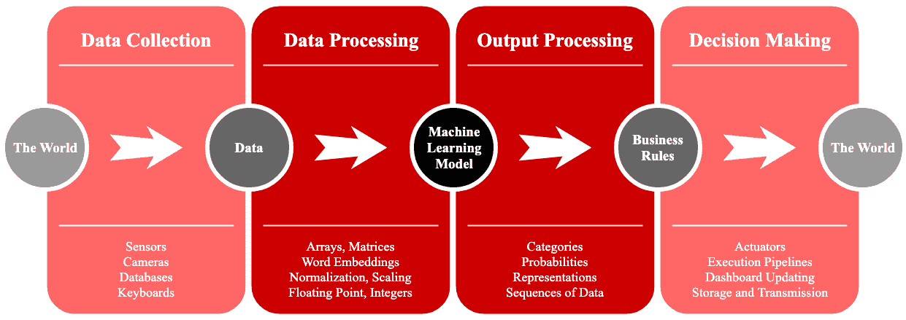
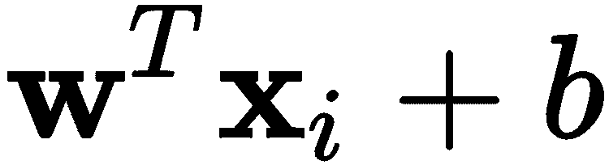
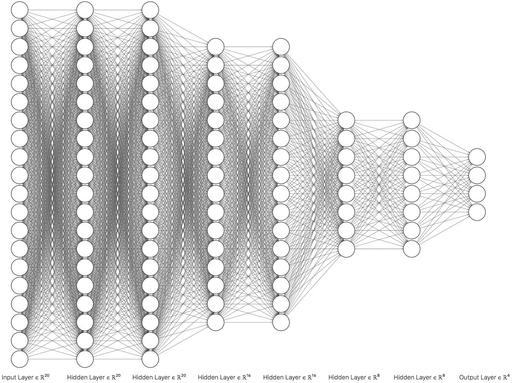

机器学习简介

您可能近年来常常听到**机器学习**（**ML**）或**人工智能**（**AI**）这个术语，尤其是**深度学习**（**DL**）。这可能是您决定投资本书并深入了解更多的原因。随着神经网络领域一些新的激动人心的进展，深度学习已成为机器学习中的热门领域。如今，难以想象没有快速的语言间文本翻译，或者没有快速的歌曲识别的世界。这些，以及许多其他事情，都是深度学习改变世界潜力的冰山一角。当您读完本书后，我们希望您能加入这个行列，搭乘基于深度学习的新应用和项目的快车。

本章简要介绍了机器学习领域及其如何用于解决常见问题。在本章中，您将深入理解机器学习的基本概念、所涉及的研究问题以及它们的重要性。

本章将涵盖以下主题：

+   深入了解机器学习生态系统

+   从数据中训练机器学习算法

+   深度学习简介

+   为什么深度学习在今天如此重要？

# 第三章：深入了解机器学习生态系统

从*图 1.1*中描述的典型机器学习应用流程来看，您可以看到机器学习有广泛的应用。然而，机器学习算法只是更大生态系统中一个小部分，这个生态系统有许多活动的组件，但机器学习今天正在改变世界各地的生活：

图 1.1 - 机器学习生态系统。机器学习通过多个数据处理和解释阶段与世界互动，以实现整体系统集成

部署的机器学习应用通常从数据收集过程开始，使用不同类型的传感器，例如摄像头、激光器、光谱仪或其他直接获取数据的方式，包括本地和远程数据库，不论其大小。在最简单的情况下，输入可以通过计算机键盘或智能手机屏幕点击收集。在此阶段，收集到或感知到的数据被视为原始数据。

原始数据通常会在输入到机器学习模型之前进行预处理。原始数据很少是机器学习算法的实际输入，除非该机器学习模型旨在从原始数据中找到丰富的表示形式，然后将其用作另一个机器学习算法的输入。换句话说，有些机器学习算法专门作为预处理工具使用，它们与将要对预处理数据进行分类或回归的主机器学习模型无关。一般来说，这一数据预处理阶段的目标是将原始数据转换为具有特定数据类型的数组或矩阵。一些常见的预处理策略包括：

+   词向量转换，例如，使用 GloVe 或 Word2Vec

+   序列到向量或序列到矩阵策略

+   值范围归一化，例如，将(0, 255)转换为(0.0, 1.0)

+   统计值归一化，例如，调整为零均值和单位方差

一旦这些预处理措施完成，大多数机器学习算法就可以使用这些数据。然而，必须指出，预处理阶段并非简单，它需要对操作系统的高级知识和技能，有时甚至需要电子学方面的知识。从一般意义上讲，一个真正的机器学习应用有一个长期的流程，涉及计算机科学和工程的不同方面。

处理后的数据通常是你在像现在你正在阅读的这本书中看到的内容。原因是我们需要关注深度学习，而不是数据处理。如果你希望在这个领域有更深入的了解，可以阅读数据科学方面的资料，如 Ojeda, T. *et.al.* 2014 或 Kane, F. 2017。

从数学角度来看，处理过的数据整体上用大写粗体字母*`X`*表示，其中有*`N`*行（或数据点）。如果我们想引用数据集中的特定`i`元素（或行），我们可以写作：**`Xᵢ`**。该数据集有`d`列，通常被称为特征*。* 一种理解特征的方法是将其看作维度。例如，如果数据集有两个特征，身高和体重，那么你可以用二维图表示整个数据集。第一维，**`x[1]`**（身高），可以作为横轴，而第二维，**`x[2]`**（体重），可以作为纵轴，如*图 1.2*所示：

图 1.2 - 示例二维数据

在生产过程中，当数据呈现给机器学习算法时，会执行一系列张量乘法和加法。这些向量运算通常通过非线性函数进行转换或归一化。接下来会进行更多的乘法和加法，更多的非线性变换，临时存储中间值，最后产生与输入相对应的期望输出。现在，你可以将这个过程看作是一个机器学习的“黑箱”，随着你继续阅读，黑箱会逐步揭示出来。

机器学习根据输入产生的输出通常需要某种形式的解释。例如，如果输出是一个对象分类为某一组或另一组的概率向量，那么可能需要进行解释。你可能需要了解概率有多低，以便考虑不确定性，或者你可能需要了解概率之间有多大差异，以便考虑更大的不确定性。输出处理充当了机器学习与决策世界之间的连接因素，通过业务规则的使用。这些规则可以是*if-then*规则，例如：“如果最大预测概率是第二大预测概率的两倍，那么发出预测；否则，不继续做出决策。”或者它们可以是基于公式的规则，或更复杂的方程组系统。

最终，在决策阶段，机器学习算法准备与世界互动，通过执行器开启一个灯泡，或者在预测不确定时购买股票，警告经理公司将在三天内用完库存，需要购买更多商品，或者通过**应用程序编程接口**（**API**）调用或**操作系统**（**OS**）命令向智能手机扬声器发送一条音频信息，说“这里是去电影院的路线”，并打开地图应用程序。

这是机器学习系统在生产环境中的广泛概述。然而，这假设机器学习算法已经正确训练和测试过，而这其实是最容易的部分，相信我。书的结尾，你将能够熟练训练高度复杂的深度学习算法，但现在，让我们先介绍通用的训练过程。

# 从数据中训练机器学习算法

一个典型的预处理数据集正式定义如下：

其中`y`是与输入向量`x`对应的期望输出。所以，机器学习的动机是利用数据，通过复杂的张量（向量）乘法和加法，或者简单地通过测量数据点之间的相似度或距离，来找到对`x`的线性和非线性变换，最终的目的是根据`x`预测*`y`*。

一种常见的思考方式是，我们希望对`x`进行某个未知函数的近似：

其中*`w`*是一个未知的向量，帮助`x`与*`b`*一起进行变换。这个公式非常基础、线性，仅仅是展示一个简单学习模型的样子。在这个简单的例子中，机器学习算法的核心是找到最佳的*`w`*和*`b`*，使得它们能够提供最接近（如果不是完美的话）*`y`*，即期望输出的结果。像感知机（Rosenblatt, F. 1958）这样非常简单的算法，通过过去在选择`w`和*`b`*时犯的错误，尝试不同的*`w`*和*`b`*值，从而根据错误的比例来选择下一步的参数。

一种结合感知机模型的方式，它们从直觉上看同一输入，结果证明比单一模型更好。后来，人们意识到将它们堆叠在一起可能是通向多层感知机的下一步，但问题是，1970 年代的人们认为学习过程过于复杂。这些多层系统类似于大脑神经元，这也是我们今天称它们为神经网络的原因。随着机器学习领域的一些有趣发现，出现了新的特定种类的神经网络和算法，被称为深度学习。

# 引入深度学习

虽然关于学习算法的更详细讨论将在 第四章《从数据中学习》中进行，本节将讨论神经网络的基本概念以及促使深度学习发展的相关内容。

## 神经元的模型

人类大脑通过其他神经元（突触）接收来自外界的电荷刺激，然后具有一个核，根据输入的刺激来触发神经元的激活**。** 在神经元的末端，输出信号通过树突传播到其他神经元，从而形成神经元网络。

人类神经元的类比如图 *1.3* 所示，其中输入由向量 *`x`* 表示，神经元的激活由某个函数 **z(.)** 给出，输出为 *`y`*。神经元的参数为 `w` 和 *`b`*：

图 1.3 - 神经元的基本模型

神经元的可训练参数是 *`w`* 和 *`b`*，它们是未知的。因此，我们可以使用训练数据  来通过某种学习策略来确定这些参数。从图中可以看出，`x`[`1`] 乘以 **`w[1]`**，然后 *`x`*[`2`] 乘以 **`w[2]`**，并且 *`b`* 乘以 1；所有这些乘积相加，可以简化为：

激活函数的作用是确保输出在所需的输出范围内。假设我们希望使用简单的线性激活，那么函数 `z`(.) 就不存在，或者可以跳过，如下所示：

这通常发生在我们想要解决回归问题时，输出数据的范围可以从 -∞ 到 +∞。然而，我们可能希望训练神经元来判断一个向量 *`x`* 是否属于两类之一，比如 -1 和 +1。那么，使用一种叫做符号激活的函数可能更为合适：

其中 *sign*(.) 函数表示如下：

还有许多其他的激活函数，但我们稍后会介绍。现在，我们将简要展示其中一个最简单的学习算法，即 **感知机学习算法** (**PLA**)。

## 感知机学习算法

PLA 从假设你希望将数据 `X` 分类为两类：正类 (+) 和负类 (-) 开始。它将通过训练找到 *某些 *`w`* 和 `b` 来预测相应的正确标签 *`y`*。PLA 使用 *sign*(.) 函数作为激活函数。以下是 PLA 执行的步骤：

1.  初始化 `w` 为零，迭代计数器 `t` = 0

1.  当存在任何分类错误的例子时：

+   选择一个分类错误的例子，称其为`x`^*，其真实标签是`y`^*

+   更新`w`如下：`w`*[t+1]* = `w`*[t]* + `y`^*`x`^*

+   增加迭代计数器`t`++并重复

请注意，为了使 PLA 按我们预期的方式工作，我们必须进行调整。我们希望的是， 在表达式中隐含了。只有在我们设置了 和  时，这种方式才会起作用。之前的规则寻找`w`，这意味着我们在寻找`b`。

为了说明 PLA，考虑以下线性可分数据集的情况：

线性可分数据集是指数据点足够分开，以至于至少存在一条假设的线可以用来将数据分为两组。拥有线性可分的数据集是所有机器学习科学家的梦想，但自然界中很少能找到这样的数据集。在后续章节中，我们将看到神经网络如何将数据转换到一个新的特征空间，在这个空间中可能存在这样的分割线。

这个二维数据集是使用 Python 工具随机生成的，我们将在后面讨论这些工具。目前，显而易见的是，你可以在两组数据之间画一条线并将它们分开。

按照之前的步骤，PLA 可以找到*`a`*解，即仅在四次迭代内，在这个特定情况下，可以找到一个完全满足训练数据目标输出的分隔线。每次更新后的图示以及每次更新时找到的相应线条如下：

在第零次迭代时，所有 100 个点都被误分类，但在随机选择一个被误分类的点进行第一次更新后，新线仅错过了四个点：

在第二次更新后，线仅错过一个数据点：

最终，在第三次更新后，所有数据点都被正确分类。这只是为了展示一个简单的学习算法如何能够成功地从数据中学习。而且，感知机模型为更复杂的模型（如神经网络）奠定了基础。接下来，我们将介绍浅层网络的概念及其基本复杂性。

## 浅层网络

神经网络由多个网络层连接而成。与此不同，感知机只有一个神经元，其结构包括输入层和输出层。在神经网络中，输入层和输出层之间还有额外的层，如*图 1.4*所示，这些层被称为隐藏层：

图 1.4 - 浅层神经网络示例

图中的示例展示了一个神经网络，它的隐藏层包含八个神经元。输入层的维度是 10 维，输出层有四个维度（四个神经元）。这个中间层可以根据你的系统在训练时处理的能力，包含任意数量的神经元，但通常来说，保持神经元数量在合理范围内是个不错的选择。

如果这是你第一次使用神经网络，建议你的隐藏层大小，也就是神经元的数量，应该大于或等于输入层的大小，且小于或等于输出层的大小。然而，虽然这是对初学者的好建议，但这并不是一个绝对的科学事实，因为找到神经网络的最佳神经元数量更像是一门艺术，而非科学，通常需要通过大量的实验来确定。

神经网络能够解决比没有网络更困难的问题，例如，*仅仅*依靠像感知机这样的单一神经单元。这个概念应该是直观的，而且很容易理解。神经网络能够解决包括线性可分问题在内的更复杂问题。对于线性可分问题，我们可以使用感知机模型和神经网络。但是，对于更复杂和不可线性分割的问题，感知机无法提供高质量的解决方案，而神经网络则能够做到。

例如，如果我们考虑一个二分类数据集，并将数据组拉得更近，感知机将无法得出解决方案，这时可以采用其他策略来阻止其陷入无穷循环。或者，我们可以切换到神经网络，并训练它找到尽可能好的解决方案。*图 1.5* 展示了一个在一个不可线性分割的二分类数据集上，训练一个隐藏层包含 100 个神经元的神经网络的示例：

图 1.5 - 使用包含 100 个神经元的隐藏层的神经网络对非可分数据进行非线性求解

这个神经网络在隐藏层有 100 个神经元。这个选择是通过实验得出的，之后的章节你将学习到如何找到这些实例的策略。然而，在我们继续之前，有两个新术语需要进一步解释：不可分数据和非线性模型，它们的定义如下：

+   非可分数据是指没有一条线能够将数据组（或类别）分成两个组的数据。

+   非线性模型或解决方案是那些在分类问题的最佳解决方案不是一条线时，通常会自然地出现的。例如，它可以是由任何高于一次的多项式描述的曲线。一个例子请参见*图 1.5*。

非线性模型通常是我们在本书中所要使用的模型，原因是这在现实世界中更为常见。而且，它是非线性的，从某种程度上说，是因为问题是不可分的。为了实现这种非线性解，神经网络模型会经历以下数学操作。

### 输入层到隐藏层

在神经网络中，输入向量*`x`*通过权重*`w`*连接到多个神经元，对于每个神经元，可以将其视为由多个权重向量组成的矩阵*`W`*。矩阵*`W`*的列数等于层中神经元的数量，行数则等于输入向量*`x`*的特征数（或维度）。因此，隐藏层的输出可以被看作以下向量：

其中，`b`是一个偏置向量，其元素对应于一个神经单元，`h`的大小与隐藏单元的数量成正比。例如，*图 1.4*中的八个神经元，以及*图 1.5*中的 100 个神经元。然而，激活函数 z(.)不一定是*sign*(.)函数，事实上，它通常不是。相反，大多数人使用的是那些易于*可微分*的函数。

可微分的激活函数是指具有数学导数的函数，这个导数可以通过传统的数值方法计算，或者函数的导数被明确定义。相反，不具有定义导数的函数就是不可计算的，甚至几乎不可能计算。

### 隐藏层到隐藏层

在神经网络中，我们可以有多个隐藏层，而我们将在本书中大量使用这种情况。在这种情况下，矩阵*`W`*可以表示为一个三维矩阵，其第三维的元素个数与网络的隐藏层数量相等。对于第`i`层，我们将该矩阵称为**W[`i`]**，以便于表示。

因此，我们可以将第`i`个隐藏层的输出表示为：

对于`i` = 2, 3, ..., `k`-1，其中*`k`*是总层数，并且**`h[1]`**是通过前一层给定的方程计算的（见前一节），该方程直接使用*`x`*，并且不需要经过最后一层**`h[k]`**，因为后者将在下文中讨论时计算。

### 隐藏层到输出层

网络的整体输出是最后一层的输出：

在这里，最后的激活函数通常与隐藏层的激活函数不同。最后一层（输出层）的激活函数通常取决于我们尝试解决的问题类型。例如，如果我们想解决回归问题，我们会使用线性函数；如果是分类问题，则会使用 sigmoid 激活函数。我们稍后会讨论这些问题。现在，应该显而易见的是，感知机算法在训练阶段将不再有效。

虽然学习过程仍然需要基于神经网络所犯的错误，但调整不能直接与被错误分类或预测的数据点成比例。原因是，最后一层的神经元负责进行预测，但它们依赖于前一层，而前一层可能又依赖于更前面的层，在对*`W`*和*`b`*进行调整时，必须为每个神经元做出不同的调整。

一种方法是应用梯度下降技术来训练神经网络。梯度下降技术有很多种，我们将在后面的章节中讨论其中最流行的一些。通常，梯度下降算法是这样一种算法：如果你对一个函数求导，并且导数的值为零，那么你就找到了可以获得的最大值（或最小值），即你正在对其求导的参数集的极值。对于标量，我们称之为导数；但对于向量或矩阵（`W`，`b`），我们称之为梯度。

我们可以使用的函数被称为损失函数。

损失函数通常是可微分的，这样我们就可以使用一些梯度下降算法来计算它的梯度。

我们可以定义一个损失函数，例如，如下所示：

这个损失被称为**均方误差**（**MSE**）；它旨在衡量目标输出*`y`*与输出层中预测输出*`h`*[*`k`*]之间的差异，差异是通过其元素的平方来度量并进行平均。这是一个好的损失函数，因为它是可微的，并且计算起来非常容易。

这样的神经网络引入了大量的可能性，但在学习过程中依赖于一种称为反向传播（Hecht-Nielsen, R. 1992）的梯度下降技术。我们这里不详细解释反向传播（我们将在后面讲解），而是要指出，反向传播改变了机器学习的世界，但由于其一些实际限制，很多年里并没有取得很大进展，解决这些限制的问题为深度学习铺平了道路。

## 深度网络

2019 年 3 月 27 日，ACM 发布了一则公告，宣布三位计算机科学家因其在深度学习方面的成就获得了计算机领域的诺贝尔奖——即 ACM 图灵奖。他们的名字分别是 Yoshua Bengio、Yann LeCun 和 Geoffrey Hinton；他们都是非常杰出的科学家。他们的主要贡献之一就是反向传播学习算法。

在[官方通讯](https://www.acm.org/media-center/2019/march/turing-award-2018)中，ACM 这样写道，关于 Dr. Hinton 和他的其中一篇开创性论文（Rumelhart, D. E. 1985）：

在 1986 年的一篇论文《通过误差传播学习内部表示》中，Hinton 与 David Rumelhart 和 Ronald Williams 共同合作，展示了反向传播算法使神经网络能够发现其数据的内部表示，从而使神经网络能够解决之前认为超出其能力范围的问题。反向传播算法今天已成为大多数神经网络的标准算法。

同样，他们在 Dr. LeCun 的论文（LeCun, Y., *et.al.,* 1998）中写道：

LeCun 提出了反向传播算法（backprop）的早期版本，并基于变分原理给出了清晰的推导。他在加速反向传播算法方面的工作包括描述了两种简单的方法来加速学习时间。

Dr. Hinton 能够证明，有一种方法可以通过使用生物启发式算法（如通过调整神经元之间连接的重要性来进行前向和反向调整）来最小化神经网络中的损失函数。通常，反向传播与前馈神经网络相关，而前后传播则与限制玻尔兹曼机（在第十章中介绍，*限制玻尔兹曼机*）相关。

前馈神经网络是一种其输入直接通过没有反向连接的中间层传递到输出层的网络，如*图 1.4*所示，在本书中我们将经常讨论这些内容。

通常可以安全假设，除非另有说明，所有神经网络都是前馈结构。本书的大部分内容将讨论深度神经网络，其中绝大多数是前馈类型的，例外的情况包括限制玻尔兹曼机或递归神经网络等。

反向传播使得人们能够以一种前所未见的方式训练神经网络；然而，人们在大数据集和更大（更深）架构上训练神经网络时遇到了问题。如果你查看 80 年代末和 90 年代初的神经网络论文，你会注意到当时的架构很小；网络通常不超过两三层，神经元的数量通常也不会超过几百个。这些今天被称为浅层神经网络。

主要问题在于较大数据集的收敛时间，以及更深架构的收敛时间。LeCun 博士的贡献正是在这一领域，他设想了加速训练过程的不同方法。其他进展，例如在**图形处理单元**（**GPUs**）上进行向量（张量）计算，显著提高了训练速度。

因此，在过去的几年中，我们见证了深度学习的崛起，即训练更深神经网络的能力，实际上是具有三层或四层，甚至是数十层和数百层的网络。此外，我们还拥有各种各样的架构，可以完成过去十年无法完成的任务。

如*图 1.6*所示的深度网络，30 年前是无法训练的，而实际上它并不算深：

图 1.6 - 一个有八层的深度全连接前馈神经网络

在本书中，我们将认为任何具有三层或四层以上的网络都是深度神经网络。然而，并没有一个标准定义明确说明深度网络究竟有多深。此外，您还需要考虑到，今天我们认为的“深度”——在 2020 年写这本书时的标准——在 20 或 30 年后可能不再被认为是深度网络。

无论深度学习的未来如何，让我们现在来讨论一下为什么今天深度学习如此重要。

# 为什么今天深度学习如此重要？

今天，我们享受着 20 或 30 年前没有的算法和策略带来的好处，这些算法和策略让我们能够拥有正在改变生活的惊人应用。让我总结一下今天深度学习的一些伟大且重要的内容：

+   **小批量训练**：这种策略使得我们今天能够使用非常大的数据集，并且一点一点地训练深度学习模型。在过去，我们必须将整个数据集加载到内存中，这对于一些大数据集来说在计算上是不可能的。今天，虽然可能需要更长的时间，但我们至少可以在有限的时间内进行训练。

+   **新型激活函数**：例如，**修正线性单元**（**ReLUs**）是一种相对较新的激活函数，它解决了许多使用反向传播策略进行大规模训练时遇到的问题。这些新的激活函数使得训练算法能够在深度架构上收敛，而在过去，我们往往会在非收敛的训练过程中卡住，最终导致梯度爆炸或消失。

+   **新颖的神经网络架构**：例如，卷积神经网络或循环神经网络通过开辟我们能用神经网络做的事情的可能性，正在改变世界。卷积网络广泛应用于计算机视觉领域或其他卷积运算自然适用的领域，如多维信号或音频分析。带有记忆的循环神经网络广泛应用于文本序列分析，使我们能够拥有理解单词、句子和段落的网络，我们可以用它们进行语言翻译等诸多任务。

+   **有趣的损失函数**：这些损失在深度学习中起到了有趣的作用，因为过去我们只是一遍又一遍地使用相同的标准损失，如均方误差（MSE）。今天，我们不仅可以最小化 MSE，同时还可以最小化权重的范数或某些神经元的输出，这导致了更稀疏的权重和解决方案，反过来使得模型在生产环境中部署时更高效。

+   **类似生物学的新策略**：例如，缺失或丢弃神经元之间的连接，而不是让它们始终完全连接，这更符合现实，或者说更像生物神经网络的设计。此外，完全丢弃或移除神经元是一个新的策略，可以促使某些神经元在其他神经元被移除时表现出色，学习更丰富的表示，同时在训练时和部署时减少计算量。不同且专业化的神经网络之间共享参数，今天也被证明是一个有趣且有效的策略。

+   **对抗训练**：让一个神经网络与另一个网络竞争，后者的唯一目的是生成虚假的、嘈杂的和混乱的数据点，试图让网络失败，已被证明是一种优秀的策略，能够让网络从数据中学习得更好，并且在生产环境中具备更强的抗干扰能力。

深度学习有许多其他有趣的事实和要点，使其成为一个令人兴奋的领域，也为编写本书提供了正当理由。我希望你和我们一样激动，开始阅读本书时，你将知道我们将编写一些这个时代最令人兴奋和不可思议的神经网络。我们的最终目标是构建能够泛化的深度神经网络。

泛化是指神经网络在从未见过的数据上做出正确预测的能力。这是所有机器学习和深度学习从业者的终极目标，且需要极大的技能和对数据的深刻理解。

# 总结

本章节介绍了机器学习的概况。它阐述了机器学习背后的动机以及该领域常用的术语。它还介绍了深度学习以及深度学习在人工智能领域中的位置。到此为止，你应该已经对神经网络的基本概念有了足够的了解，足以好奇它能够有多大。你也应该对深度学习领域以及每周都会有新进展的各类新技术感到非常好奇。

到此为止，你应该有点迫不及待开始你的深度学习编程之旅了；因此，接下来的逻辑步骤是转到第二章，*深度学习框架的设置与介绍*。在这一章中，你将通过设置系统并确保你能访问成功成为深度学习从业者所需的资源，为实际操作做好准备。但在你继续之前，请先用以下问题测试一下自己。

# 问题与答案

1.  **感知器和/或神经网络能否解决可线性分割的数据分类问题？**

是的，两个都可以。

1.  **感知器和/或神经网络能否解决不可分割数据的分类问题？**

是的，两个都可以。然而，感知器将永远运行下去，除非我们指定停止条件，例如最大迭代次数（更新次数），或在若干次迭代后，如果误分类点数没有减少，则停止。

1.  **在机器学习领域中，哪些变化使我们今天能够拥有深度学习？**

(A) 反向传播算法，批量训练，ReLU 等；

(B) 计算能力，GPU，云计算等等。

1.  **为什么泛化是好事？**

因为深度神经网络在处理它们从未见过的数据时最为有效，即它们没有在这些数据上进行训练的数据。

# 参考文献

+   Hecht-Nielsen, R. (1992). *反向传播神经网络的理论*。在 *感知神经网络*（第 65-93 页）。 *Academic Press*。

+   Kane, F. (2017). *动手实践数据科学与 Python 机器学习*. *Packt Publishing Ltd*。

+   LeCun, Y., Bottou, L., Orr, G., 和 Muller, K. (1998). *神经网络中的高效反向传播：行内技巧*（Orr, G. 和 Müller, K. 编）。 *计算机科学讲义笔记*，1524(98), 111。

+   Ojeda, T., Murphy, S. P., Bengfort, B., 和 Dasgupta, A. (2014). *实用数据科学食谱*。*Packt Publishing Ltd*。

+   Rosenblatt, F. (1958). *感知器：大脑中信息存储和组织的概率模型*。 *心理学评论*，65(6), 386。

+   Rumelhart, D. E., Hinton, G. E., 和 Williams, R. J. (1985). *通过误差传播学习内部表示*（No. ICS-8506）。 *加利福尼亚大学圣地亚哥分校认知科学研究所*。
