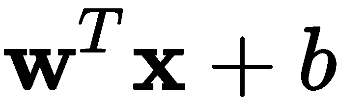
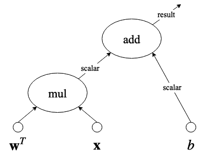
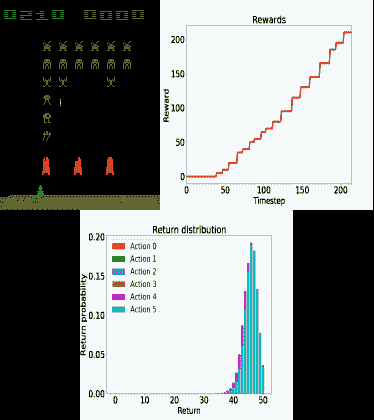

深度学习框架的设置与介绍

到此为止，你已经熟悉了**机器学习**（**ML**）和**深度学习**（**DL**）——这非常棒！你应该已经准备好开始为编写和运行你自己的程序做准备。本章将帮助你在设置 TensorFlow 和 Keras 的过程中，并介绍它们在深度学习中的用途和重要性。Dopamine 作为一种新的强化学习框架将在后续使用。本章还简要介绍了其他一些重要的深度学习库。

本章将涵盖以下主题：

+   Colaboratory 的介绍

+   TensorFlow 的介绍与设置

+   Keras 的介绍与设置

+   PyTorch 的介绍

+   Dopamine 的介绍

+   其他深度学习库

# 第四章：Colaboratory 的介绍

什么是 Colaboratory？Colaboratory 是一个基于网页的研究工具，用于进行机器学习和深度学习。它本质上类似于 Jupyter Notebook。Colaboratory 如今非常流行，因为它不需要任何设置。

本书中，我们将使用运行在 Colaboratory 上的 Python 3，它将安装我们可能需要的所有库。

Colaboratory 免费使用，且兼容大多数主流浏览器。开发 Colaboratory 工具的公司是 Google^™。与 Jupyter 笔记本不同，在 Colaboratory 中，你的一切都运行在云端，而不是你自己的电脑上。有个要点：你需要一个 Google 账号，因为所有的 Colaboratory 笔记本都保存在你的个人 Google Drive 空间里。然而，如果你没有 Google 账号，你仍然可以继续阅读，了解如何安装你需要的每个 Python 库来在自己电脑上运行。不过，我强烈建议你创建一个 Google 账号，至少为了能使用本书中的 Colaboratory 笔记本进行深度学习学习。

当你在 Colaboratory 上运行代码时，它会在一个专用的虚拟机上运行，接下来是有趣的部分：你可以分配一个 GPU 来使用！或者，如果你愿意，也可以使用 CPU。每当你没有运行程序时，Colaboratory 会取消分配资源（因为大家都希望有效工作），但你可以随时重新连接它们。

如果你准备好了，可以前往这个链接：[`colab.research.google.com/`](https://colab.research.google.com/)

如果你对 Colaboratory 有兴趣并希望进一步了解，可以搜索*欢迎使用 Colaboratory！*。现在你已经访问了上面的链接，我们可以开始使用 TensorFlow 了。

从现在开始，我们将**Colaboratory**简称为**Colab**，这实际上是人们对它的常见称呼。

# TensorFlow 的介绍与设置

**TensorFlow**（**TF**）的名字中有一个词是*Tensor*，即向量的同义词。因此，TF 是一个 Python 框架，旨在在与神经网络建模相关的向量运算中表现出色。它是最受欢迎的机器学习库。

作为数据科学家，我们更偏向使用 TF，因为它是免费的、开源的并且有着强大的用户基础，同时它采用了基于图形的张量操作执行的最前沿研究。

## 设置

现在我们来开始设置或验证你是否拥有正确设置的指令：

1.  要开始安装 TF，请在 Colaboratory 中运行以下命令：

```py
%tensorflow_version 2.x
!pip install tensorflow
```

这将安装大约 20 个必需的库来运行 TF，其中包括`numpy`，例如。

注意命令前面的感叹号（!）吗？这是在 Colaboratory 上运行 shell 命令的方式。例如，假设你想删除名为`model.h5`的文件，那么你可以运行命令`!rm model.h5`。

1.  如果安装过程顺利执行，你将能够运行以下命令，这将打印出你在 Colaboratory 上安装的 TF 版本：

```py
import tensorflow as tf
print(tf.__version__)
```

这将产生以下输出：

```py
2.1.0
```

1.  本版本的 TF 是写这本书时的当前版本。然而，大家都知道 TF 版本经常变化，可能在你阅读这本书时会有一个新版本。如果是这样，你可以按照以下方式安装特定版本的 TF：

```py
!pip install tensorflow==2.1.0
```

我们假设你已经熟悉 Python，因此我们将相信你能够根据本书中使用的版本来匹配适当的库版本。这并不困难，可以像之前那样轻松完成，例如，使用`==`符号来指定版本。我们将在继续时展示所使用的版本。

### 支持 GPU 的 TensorFlow

Colaboratory 默认会自动启用 TensorFlow 的 GPU 支持。不过，如果你有自己的 GPU 系统并希望设置支持 GPU 的 TensorFlow，安装非常简单。只需在你的个人系统中输入以下命令：

```py
$ pip install tensorflow-gpu
```

然而，请注意，这假设你已经为你的系统安装了所有必要的驱动程序，以便访问 GPU。不过，不用担心，关于这个过程有很多文档可以在网上找到，举个例子，[`www.tensorflow.org/install/gpu`](https://www.tensorflow.org/install/gpu)。如果遇到任何问题并且你需要继续前进，我强烈建议你返回并在 Colaboratory 上进行操作，因为这是学习最简单的方式。

现在让我们来看看 TensorFlow 是如何工作的，以及它的图形化范式如何使其变得非常强大。

## TensorFlow 背后的原理

本书是为深度学习的绝对初学者准备的。因此，关于 TF 如何工作的知识，我们希望你了解以下内容。TF 创建一个图形，包含从输入张量到操作的最高抽象层次的执行过程。

例如，假设我们有已知的输入向量 **`x`** 和 **`w`**，并且有一个已知常量 `b`，假设你想执行以下操作：



如果我们通过声明和赋值张量来创建这个操作，图形将如下所示，在*图 2.1*中：



图 2.1 - 张量乘法和加法操作示例

在此图中，有一个张量乘法操作，*mul*，其结果是一个标量，并且需要与另一个标量 `b` 相加，*add*。请注意，这可能是一个中间结果，并且在实际计算图中，结果会向上移动到执行树的更高层次。有关 TF 如何使用图形的更详细信息，请参考这篇论文（Abadi, M., 等，2016）。

总之，TF 寻找执行张量操作的最佳方式，将特定部分委托给 GPU（如果可用），否则如果可用的话，将操作并行化在 CPU 核心上。它是开源的，拥有一个不断壮大的全球用户社区。大多数深度学习专业人员都了解 TF。

现在让我们讨论如何设置 Keras，以及它如何抽象化 TensorFlow 的功能。

# Keras 的简介和设置

如果你在互联网上搜索 TensorFlow 的示例代码，你会发现它可能并不容易理解或跟随。你可以找到适合初学者的教程，但实际上，事情往往很容易变得复杂，编辑别人写的代码也可能非常困难。Keras 作为一种 API 解决方案，可以相对轻松地开发深度学习 TensorFlow 模型原型。事实上，Keras 不仅支持在 TensorFlow 上运行，还支持在 CNTK 和 Theano 上运行。

我们可以将 Keras 看作是对实际 TensorFlow 模型和方法的抽象。这种共生关系已经变得如此流行，以至于 TensorFlow 现在非正式地鼓励那些刚开始使用 TensorFlow 的人使用 Keras。Keras 非常友好，易于在 Python 中跟随，并且从总体上来说，学习起来也很简单。

## 设置

要在你的 Colab 中设置 Keras，请执行以下操作：

1.  运行以下命令：

```py
!pip install keras
```

1.  系统将开始安装所需的库和依赖项。安装完成后，输入并运行以下代码片段：

```py
import keras
print(keras.__version__)
```

这将输出一个确认消息，显示它使用 TensorFlow 作为后台，并且使用的是最新版的 Keras，在本书编写时，Keras 的版本是 2.2.4。因此，输出如下所示：

```py
Using TensorFlow backend.
2.2.4
```

## Keras 背后的原理

Keras 提供给用户的功能主要有两种方式：顺序模型和功能性 API。

这些内容可以总结如下：

+   **顺序模型**：这是指使用 Keras 的一种方式，允许你线性（或顺序地）堆叠层实例。在这里，层实例的含义与我们在第一章中讨论的一致，*机器学习简介*中提到过的。也就是说，层具有某种输入、某种行为或主要模型操作，以及某种输出。

+   **功能性 API**：这是深入定义更复杂模型的最佳方法，如合并模型、多输出模型、具有多个共享层的模型以及许多其他可能性。别担心，这些是高级话题，会在后续章节中讲解清楚。功能性 API 范式为程序员提供了更多自由，能做出不同的创新。

我们可以把顺序模型看作是开始使用 Keras 的简便方法，而功能性 API 则适用于更复杂的问题。

记得[第一章](https://cdp.packtpub.com/deep_learning_for_beginners/wp-admin/post.php?post=25&action=edit#post_24)中的浅层神经网络吗？好吧，这就是你如何使用 Keras 的顺序模型范式来构建该模型的方法：

```py
from keras.models import Sequential
from keras.layers import Dense, Activation

model = Sequential([
    Dense(10, input_shape=(10,)),
    Activation('relu'),
    Dense(8),
    Activation('relu'),
    Dense(4),
    Activation('softmax'),
])
```

代码的前两行分别导入了`Sequential`模型和`Dense`层与`Activation`层。`Dense`层是一个全连接的神经网络，而`Activation`层是以特定方式调用丰富的激活函数集，例如 ReLU 和 SoftMax，正如前面的例子所示（这些将在后文详细解释）。

或者，你也可以使用`add()`方法来实现相同的模型：

```py
from keras.models import Sequential
from keras.layers import Dense, Activation

model = Sequential()
model.add(Dense(10, input_dim=10))
model.add(Activation('relu'))
model.add(Dense(8))
model.add(Activation('relu'))
model.add(Dense(4))
model.add(Activation('softmax'))
```

第二种写法看起来更线性，而第一种更像是通过列表的方式在 Python 中实现。这实际上是相同的，最终你可能会偏好某一种方法。不过，记住，之前的两个例子都使用了 Keras 的顺序模型。

现在，仅为比较之用，这是如何使用 Keras 功能性 API 范式编写完全相同的神经网络架构：

```py
from keras.layers import Input, Dense
from keras.models import Model

inputs = Input(shape=(10,))

x = Dense(10, activation='relu')(inputs)
x = Dense(8, activation='relu')(x)
y = Dense(4, activation='softmax')(x)

model = Model(inputs=inputs, outputs=y)
```

如果你是经验丰富的程序员，你会注意到功能性 API 风格提供了更多的灵活性。它允许你定义输入张量，并将其用作模型不同部分的输入（如果需要的话）。然而，使用功能性 API 假设你已经熟悉顺序模型。因此，在本书中，我们将从顺序模型开始，随着向更复杂神经网络模型的进展，逐步引入功能性 API 范式。

就像 Keras 一样，还有其他一些 Python 库和框架可以让我们以相对较低的难度进行机器学习。在写这本书的时候，最流行的是 Keras，其次是 PyTorch。

# PyTorch 简介

在本书编写时，PyTorch 是第三大最受欢迎的深度学习框架。尽管与 TensorFlow 相比，PyTorch 在全球的历史较短，但它的受欢迎程度仍在不断增加。PyTorch 的一个有趣特点是，它允许一些 TensorFlow 不具备的定制功能。此外，PyTorch 还得到了 Facebook™的支持。

尽管本书涵盖了 TensorFlow 和 Keras，但我认为我们都应该记住，PyTorch 是一个很好的替代方案，而且它与 Keras 非常相似。作为参考，以下是如果用 PyTorch 编写，我们之前展示的相同浅层神经网络的代码：

```py
import torch

device = torch.device('cpu')

model = torch.nn.Sequential(
          torch.nn.Linear(10, 10),
          torch.nn.ReLU(),
          torch.nn.Linear(10, 8),
          torch.nn.ReLU(),
          torch.nn.Linear(8, 2),
          torch.nn.Softmax(2)
        ).to(device)
```

相似之处很多。此外，从 Keras 到 PyTorch 的过渡对于有动机的读者来说不应太困难，而且这可能是未来的一项很好的技能。然而，目前社区的大部分兴趣仍集中在 TensorFlow 及其所有衍生版本上，特别是 Keras。如果你想了解更多关于 PyTorch 的起源和基本原理，或许这篇文章会对你有所帮助（Paszke, A., 等，2017 年）。

# Dopamine 简介

深度强化学习领域的一个有趣的最新发展是 Dopamine。Dopamine 是一个用于快速原型设计深度强化学习算法的框架。本书将简要介绍强化学习，但你需要知道如何安装它。

Dopamine 以对强化学习新用户易于使用而闻名。此外，尽管它不是 Google 的官方产品，但大多数开发者都是 Google 的员工。在编写本书时，它的框架非常紧凑，并提供了现成可用的算法。

要安装 Dopamine，你可以运行以下命令：

```py
!pip install dopamine-rl
```

你可以通过执行以下命令来测试 Dopamine 是否正确安装：

```py
import dopamine
```

这不会输出任何内容，除非发生错误。通常，Dopamine 会使用大量外部库，以便做更多有趣的事情。目前，利用强化学习进行训练的一个最有趣的应用就是通过奖励策略训练代理，这在游戏中有直接的应用。

作为一个例子，参见*图 2.2*，该图展示了一个视频游戏在学习过程中，使用强化行为的策略根据代理采取的动作来强化期望行为的时间快照：



图 2.2 - Dopamine 在游戏强化学习问题中的代理样本可视化

强化学习中的代理是决定下一步采取什么行动的角色。代理通过观察世界及其规则来完成这一任务。规则越明确，结果就越受约束。如果规则太宽松，代理可能无法做出好的行动决策。

尽管本书没有深入探讨强化学习，但我们将在本书的最后一章介绍一个有趣的游戏应用。现在，你可以阅读以下白皮书，了解更多关于 Dopamine 的信息（Castro, P. S., *等，*2018）。

# 其他深度学习库

除了两个大头——TensorFlow 和 Keras 外，还有其他一些竞争者正在深度学习领域崭露头角。我们已经讨论过 PyTorch，但还有更多。这里我们简要地谈一谈它们。

## Caffe

Caffe 也是一个流行的框架，由加州大学伯克利分校开发（Jia, Y., 等，2014）。它在 2015-2016 年间变得非常流行。一些雇主仍然要求具备这种技能，学术文章中也仍然提到它的使用。然而，由于 TF 的成功和 Keras 的可访问性，其使用正在逐渐衰退。

如需了解更多关于 Caffe 的信息，请访问：[`caffe.berkeleyvision.org`](https://caffe.berkeleyvision.org)。

还要注意到 Caffe2 的存在，它是由 Facebook 开发并且开源的。它是基于 Caffe 构建的，但现在 Facebook 有了新的“冠军”——PyTorch。

## Theano

Theano 是由 Yoshua Bengio 的团队在蒙特利尔大学于 2007 年开发的（Al-Rfou, R., *等，*2016）。Theano 有一个相对较老的用户群，可能见证了 TF 的崛起。最新的重大版本发布于 2017 年底，尽管没有明确的计划发布新的重大版本，但社区仍在持续更新。

如需了解更多关于 Theano 的信息，请访问：

[`deeplearning.net/software/theano/`](http://deeplearning.net/software/theano/)

## 荣誉提名

还有其他一些替代方案，可能由于各种原因不如它们流行，但值得在此提及，以防它们的未来发生变化。以下是这些替代方案：

| **名称** | **开发者** | **更多信息** |
| --- | --- | --- |
| MXNET | Apache | [`mxnet.apache.org/`](https://mxnet.apache.org/) |
| CNTK | Microsoft | [`cntk.ai`](https://cntk.ai) |
| Deeplearning4J | Skymind | [`deeplearning4j.org/`](https://deeplearning4j.org/) |
| Chainer | Preferred Networks | [`chainer.org/`](https://chainer.org/) |
| FastAI | Jeremy Howard | [`www.fast.ai/`](https://www.fast.ai/) |

# 总结

本章介绍了如何设置必要的库以运行 TensorFlow、Keras 和 Dopamine。希望你能使用 Colab 来让学习变得更轻松。你还学到了这些框架背后的基本思维方式和设计理念。尽管在编写本书时，这些框架是最受欢迎的，但仍有其他竞争者，我们也简要介绍了它们。

到此为止，你已经准备好开始掌握深度学习之旅。我们的第一个里程碑是了解如何为深度学习应用准备数据。这个步骤对模型的成功至关重要。无论模型多么优秀，结构多么深，如果数据没有正确格式化或处理，都会导致灾难性的性能结果。因此，我们将前往第三章，*准备数据。* 在该章节中，你将学习如何处理数据集，并将其准备好用于你想要用特定类型的深度学习模型解决的具体任务。然而，在你进入该章节之前，请先尝试通过以下问题自测。

# 问题与答案

1.  **Colab 是否在我的个人计算机上运行？**

不，Keras 运行在云端，但通过一些技巧和设置，你可以将其连接到你自己的个人云。

1.  **Keras 使用 GPU 吗？**

是的。因为 Keras 运行在 TensorFlow 上（在本书的设置中），而 TensorFlow 使用 GPU，所以 Keras 也使用 GPU。

1.  **Keras 中的两种主要编码范式是什么？**

(A) 顺序模型；(B) 功能性 API。

1.  **我们为什么关心多巴胺？**

因为市面上只有少数几个你可以信任的强化学习框架，而多巴胺就是其中之一。

# 参考文献

+   Abadi, M., Barham, P., Chen, J., Chen, Z., Davis, A., Dean, J., Devin, M., Ghemawat, S., Irving, G., Isard, M., 和 Kudlur, M. (2016). *Tensorflow: 一个大规模机器学习系统.* 在*第 12 届 {USENIX} 操作系统设计与实现研讨会*（{OSDI} 16）（第 265-283 页）。

+   Paszke, A., Gross, S., Chintala, S., Chanan, G., Yang, E., DeVito, Z., Lin, Z., Desmaison, A., Antiga, L. 和 Lerer, A. (2017). *Pytorch 中的自动微分。*

+   Castro, P. S., Moitra, S., Gelada, C., Kumar, S., 和 Bellemare, M. G. (2018). *Dopamine: 一个深度强化学习的研究框架.* arXiv 预印本 arXiv:1812.06110。

+   Jia, Y., Shelhamer, E., Donahue, J., Karayev, S., Long, J., Girshick, R., Guadarrama, S., 和 Darrell, T. (2014 年 11 月). *Caffe: 用于快速特征嵌入的卷积架构.* 在*第 22 届 ACM 国际多媒体会议论文集*（第 675-678 页）。*ACM*。

+   Al-Rfou, R., Alain, G., Almahairi, A., Angermueller, C., Bahdanau, D., Ballas, N., Bastien, F., Bayer, J., Belikov, A., Belopolsky, A. 和 Bengio, Y. (2016). *Theano: 一个用于快速计算数学表达式的 Python 框架.* arXiv 预印本 arXiv:1605.02688。
