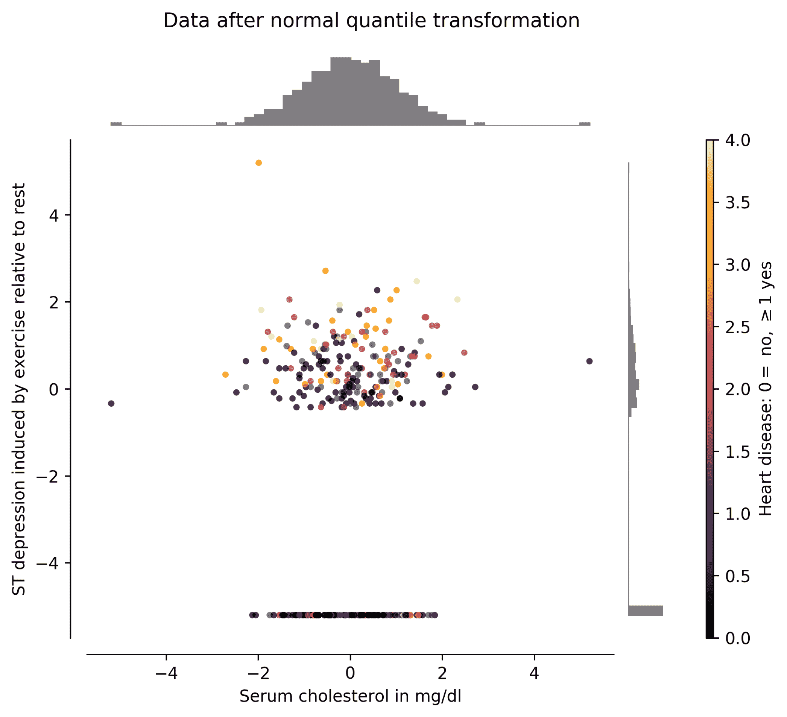

准备数据

现在，您已经成功地准备好学习深度学习，参见第二章，*深度学习框架的设置与简介*，接下来我们将为您提供一些在深度学习实践中可能会频繁遇到的数据处理重要指导。对于深度学习的学习来说，准备好合适的数据集将有助于您更多地集中精力设计模型，而不是花时间准备数据。然而，大家都知道，这并不是现实的期望，如果你询问任何数据科学家或机器学习专家，他们会告诉你，建模的一个重要方面就是知道如何准备数据。知道如何处理数据以及如何准备数据，将节省你大量的时间，你可以用来微调模型。任何花费在准备数据上的时间都是值得投资的时间。

本章将向您介绍数据处理背后的主要概念，以使其在深度学习中变得有用。它将涵盖格式化输出和输入（无论是类别数据还是实值数据）的基本概念，以及数据增强或降维的技术。到本章结束时，您应该能够处理最常见的数据处理技术，这些技术将有助于您在未来选择成功的深度学习方法。

本章特别讨论以下内容：

+   二进制数据与二分类

+   类别数据与多分类

+   实值数据与单变量回归

+   改变数据分布

+   数据增强

+   数据降维

+   操作数据的伦理影响

# 第五章：二进制数据与二分类

在本节中，我们将集中精力**准备**具有二进制输入或目标的数据。当然，所谓二进制，指的是可以表示为 0 或 1 的值。请注意，*表示为*这两个词的重点。原因是，一列数据可能包含的并不一定是 0 或 1 的值，但它可以被解释为或表示为 0 或 1。

请考虑以下数据集片段：

| *x*[1] | *x*[2] | ... | *y* |
| --- | --- | --- | --- |
| 0 | 5 | ... | a |
| 1 | 7 | ... | a |
| 1 | 5 | ... | b |
| 0 | 7 | ... | b |

在这个只有四行的小数据集示例中，列 *x*[1] 的值显然是二进制的，要么是 *0*，要么是 *1*。然而，*x*[2] 表面上可能并不被认为是二进制的，但如果仔细观察，这一列中的唯一值是 *5* 或 *7*。这意味着数据可以正确且唯一地映射到一组两个值。因此，我们可以将 *5* 映射为 *0*，将 *7* 映射为 *1*，或者反过来也可以；这并不重要。

在目标输出值 *y* 中也观察到类似现象，*y* 同样包含可以映射到大小为 2 的集合的独特值。我们可以通过将 *b* 映射为 *0*，将 *a* 映射为 ***1*** 来进行这样的映射。

如果你打算将字符串映射到二进制值，请务必检查你所使用的特定模型能处理的数据类型。例如，在某些支持向量机实现中，目标的首选值是-1 和 1。这也是二进制的，只不过在一个不同的集合中。决定使用哪种映射之前，请务必进行仔细检查。

在接下来的子章节中，我们将专门处理二进制目标，使用数据集作为案例研究。

## 克里夫兰心脏病数据集的二进制目标

*克里夫兰心脏病*（克里夫兰 1988）数据集包含 303 个受试者的病人数据。数据集中的一些列有缺失值，我们也会处理这些缺失值。数据集包含 13 列，其中包括胆固醇和年龄等数据。

目标是检测一个主体是否患有心脏病，因此这是一个二进制问题。我们要处理的问题是，数据用从 0 到 4 的值进行了编码，其中 0 表示没有心脏病，而 1 到 4 的范围表示某种类型的心脏病。

我们将使用标识为`Cleveland`的数据集部分，可以从此链接下载：[`archive.ics.uci.edu/ml/machine-learning-databases/heart-disease/processed.cleveland.data`](https://archive.ics.uci.edu/ml/machine-learning-databases/heart-disease/processed.cleveland.data)

数据集的属性如下：

| **列** | **描述** |
| --- | --- |
| *x*[1] | 年龄 |
| *x*[2] | 性别 |
| *x*[3] | 胸痛类型：1: 典型心绞痛，2: 非典型心绞痛，3: 非心绞痛性疼痛，4: 无症状 |
| *x[4]* | 休息时血压（住院时的毫米汞柱值） |
| *x*[5] | 血清胆固醇（单位：mg/dl） |
| *x[6]* | 空腹血糖 > 120 mg/dl：1 = 是，0 = 否 |
| *x[7]* | 休息时心电图结果：0: 正常，1: 存在 ST-T 波异常，2: 显示可能或确诊的左心室肥大 |
| *x[8]* | 达到的最大心率 |

| *x[9]* | 运动引起的心绞痛：1 = 是

0 = 无 |

| *x[10]* | 运动时 ST 段与静息时 ST 段的相对压低 |
| --- | --- |

| *x[11]* | 峰值运动 ST 段的坡度：1: 上坡

2: 平坦

3: 下降坡度

|

| *x[12]* | 通过荧光透视检查的主要血管数量（0-3） |
| --- | --- |

| *x[13]* | Thal：3 = 正常

6 = 固定缺陷

7 = 可逆性缺陷

|

| *y* | 心脏病诊断（冠状动脉造影疾病状态）：0: < 50% 直径狭窄

1: > 50% 直径狭窄 |

接下来，我们将按照以下步骤读取数据集到 pandas DataFrame 并进行清理：

1.  在我们的 Google Colab 中，我们首先使用`wget`命令下载数据，如下所示：

```py
!wget https://archive.ics.uci.edu/ml/machine-learning-databases/heart-disease/processed.cleveland.data
```

这会将文件`processed.cleveland.data`下载到 Colab 的默认目录。可以通过检查 Colab 左侧的文件标签来验证此操作。请注意，前面的指令是一个非常长的单行命令。

1.  接下来，我们使用 pandas 加载数据集，以验证数据集是否可读且可访问。

Pandas 是一个在数据科学家和机器学习科学家中非常流行的 Python 库。它使得加载和保存数据集、替换缺失值、获取数据的基本统计属性甚至执行数据转换变得非常容易。Pandas 就是救命稻草，现在大多数机器学习库都接受 pandas 作为有效的输入格式。

在 Colab 中运行以下命令以加载并显示一些数据：

```py
import pandas as pd
df = pd.read_csv('processed.cleveland.data', header=None)
print(df.head())
```

`read_csv()` 函数用于加载格式为 **逗号分隔值**（**CSV**）的文件。我们使用 `header=None` 参数告诉 pandas 数据没有实际的列标题；如果省略此参数，pandas 会将数据的第一行用作每列的名称，但在这种情况下我们不希望这样做。

加载的数据存储在一个名为`df`的变量中，变量名可以是任何名字，但我认为它很容易记住，因为 pandas 将数据存储在一个 DataFrame 对象中。因此，`df` 看起来是一个合适的、简短且易记的名称。然而，如果我们处理多个 DataFrame，那么最好为每个 DataFrame 起不同的名字，使用能够描述其包含数据的名称会更方便。

`head()` 方法是 DataFrame 上操作的方法，它类似于 `unix` 命令，用于获取文件的前几行。在 DataFrame 上，`head()` 方法返回前五行数据。如果你希望获取更多或更少的行数据，可以将一个整数作为参数传递给该方法。例如，如果你想获取前三行，可以执行 `df.head(3)`。

执行上述代码的结果如下：

```py
    0   1   2     3     4   5   6     7   8    9   10  11  12  13
0  63\.  1\.  1\.  145\.  233\.  1\.  2\.  150\.  0\.  2.3  3\.  0\.  6\.   0
1  67\.  1\.  4\.  160\.  286\.  0\.  2\.  108\.  1\.  1.5  2\.  3\.  3\.   2
2  67\.  1\.  4\.  120\.  229\.  0\.  2\.  129\.  1\.  2.6  2\.  2\.  7\.   1
3  37\.  1\.  3\.  130\.  250\.  0\.  0\.  187\.  0\.  3.5  3\.  0\.  3\.   0
4  41\.  0\.  2\.  130\.  204\.  0\.  2\.  172\.  0\.  1.4  1\.  0\.  3\.   0
```

下面是一些需要观察和记住的事项，供将来参考：

+   在左侧，有一个没有名称的列，其中包含连续的数字：0、1、...、4。这些是 pandas 为数据集中的每一行分配的索引值。这些是唯一的数字。有些数据集有唯一的标识符，比如图像的文件名。

+   在顶部，有一行从 0、1、... 到 13 的数字。这些是列标识符。它们也是唯一的，并且可以在给定的情况下进行设置。

+   在每一行和每一列的交点处，我们有值，这些值要么是浮动的小数，要么是整数。整个数据集包含的是小数，除了第 13 列，它是我们的目标列，包含整数。

1.  因为我们将使用这个数据集作为一个二分类问题，现在我们需要将最后一列修改为只包含二进制值：0 和 1。我们将保留 0 的原始含义，即没有心脏病，任何大于或等于 1 的值都将映射为 1，表示诊断为某种类型的心脏病。我们将执行以下操作：

```py
print(set(df[13]))
```

指令`df[13]`查看 DataFrame 并检索索引为`13`的列的所有行。接着，对第 13 列所有行应用`set()`方法将创建该列中所有唯一元素的集合。通过这种方式，我们可以知道有多少不同的值，以便进行替换。输出如下：

```py
{0, 1, 2, 3, 4}
```

从这点可以看出，0 表示没有心脏病，1 表示有心脏病。然而，2、3 和 4 需要映射为 1，因为它们也表示有心脏病。我们可以通过执行以下命令来进行此更改：

```py
df[13].replace(to_replace=[2,3,4], value=1, inplace=True)
print(df.head())
print(set(df[13]))
```

在这里，`replace()`函数作用于 DataFrame，用于替换特定值。在我们的例子中，它有三个参数：

+   `to_replace=[2,3,4]`表示要查找的项目列表，用于进行替换。

+   `value=1`表示将替换每个匹配项的值。

+   `inplace=True`表示我们希望在该列上进行修改。

在某些情况下，pandas DataFrame 像不可变对象一样工作，这使得必须使用`inplace=True`参数。如果我们没有使用这个参数，就需要像下面这样操作。

`df[13] = df[13].replace(to_replace=[2,3,4], value=1)`，这对经验丰富的 pandas 用户来说不成问题。这意味着你应该能够无论如何都能轻松操作。

初学者使用 pandas 时的主要问题是它并不*总是*像不可变对象那样工作。因此，你应该随时查阅 pandas 文档：[`pandas.pydata.org/pandas-docs/stable/index.html`](https://pandas.pydata.org/pandas-docs/stable/index.html)

前述命令的输出如下：

```py
    0   1   2     3     4   5   6     7   8    9   10  11  12  13
0  63\.  1\.  1\.  145\.  233\.  1\.  2\.  150\.  0\.  2.3  3\.  0\.  6\.   0
1  67\.  1\.  4\.  160\.  286\.  0\.  2\.  108\.  1\.  1.5  2\.  3\.  3\.   1
2  67\.  1\.  4\.  120\.  229\.  0\.  2\.  129\.  1\.  2.6  2\.  2\.  7\.   1
3  37\.  1\.  3\.  130\.  250\.  0\.  0\.  187\.  0\.  3.5  3\.  0\.  3\.   0
4  41\.  0\.  2\.  130\.  204\.  0\.  2\.  172\.  0\.  1.4  1\.  0\.  3\.   0

{0, 1}
```

首先，注意当我们打印前五行时，第十三列现在只包含值 0 或 1。你可以将其与原始数据进行比较，验证加粗字体中的数字确实已经更改。我们还通过`set(df[13])`验证了该列所有唯一值的集合现在仅包含`{0, 1}`，这是我们想要的目标。

通过这些更改，我们可以使用该数据集训练深度学习模型，并可能改善现有的文献中记录的表现[Detrano, R., *et al.* (1989)]。

相同的方法可以应用于将任何其他列转换为我们需要的二值集合。作为练习，我们再做一个关于著名`MNIST`数据集的例子。

## 对 MNIST 数据集进行二值化

MNIST 数据集在深度学习社区中非常著名（Deng, L. (2012)）。它包含了成千上万张手写数字的图像。图 3.1 展示了 MNIST 数据集中的八个样本：


图 3.1 – MNIST 数据集的八个样本。每张图片上方的数字对应于目标类别。

如你所见，这个数据集中的样本杂乱无章，且非常真实。每张图像的大小为 28 x 28 像素。并且只有 10 个目标类别，每个数字对应一个类别，即 0，1，2，...，9。这里的复杂性通常在于某些数字可能与其他数字相似；例如，1 和 7，或者 0 和 6。然而，大多数深度学习算法已经成功地以高准确度解决了这个分类问题。

从*图 3.1*中仔细检查会发现，图像中的值并不完全是零和一，也就是二进制值。实际上，这些图像是 8 位灰度图像，值的范围在[0-255]之间。正如前面提到的，这对于大多数先进的深度学习算法来说不再是问题。然而，对于一些算法，例如**限制玻尔兹曼机**（**RMBs**），输入数据需要是二进制格式[0,1]，因为这正是该算法传统上所需要的格式。

因此，我们将做两件事：

+   对图像进行二值化，以便获得二进制输入

+   对目标进行二值化，使其成为一个二分类问题

在本示例中，我们将任意选择两个数字，7 和 8，作为我们的目标类别。

### 对图像进行二值化

二值化过程是图像处理中的常见步骤。它正式被称为图像阈值化，因为我们需要一个阈值来决定哪些值变为零，哪些变为一。关于这个主题的详细调查，请参考（Sezgin, M., 和 Sankur, B.（2004））。这意味着，在选择完美阈值时，背后有一门科学，这个阈值能够最小化从[0, 255]到[0, 1]的范围转换误差。

然而，由于这不是一本关于图像处理的书籍，我们将任意设置阈值为 128。这样，任何小于 128 的值将变为零，任何大于或等于 128 的值将变为一。

这一过程可以通过在 Python 中使用索引轻松完成。接下来，我们将显示数据集的一小部分，以确保数据已经正确转换。我们将通过执行以下命令来实现这一点：

1.  为了加载数据集并验证其维度（形状），请运行以下命令：

```py
from sklearn.datasets import fetch_openml
mnist = fetch_openml('mnist_784')
print(mnist.data.shape)
print(mnist.target.shape)
```

以下是输出结果：

```py
(70000, 784)
(70000,)
```

首先需要注意的是，我们正在使用一个名为`scikit learn`或`sklearn`的机器学习库，它是 Python 中最常用的通用机器学习库之一。`MNIST`数据集是通过`fetch_openml()`方法加载的，该方法需要传入一个数据集标识符，当前数据集的标识符是`'mnist_784'`。数字`784`来自于`MNIST`图像的大小，即 28 x 28 像素，可以将其看作一个由 784 个元素组成的向量，而不是 28 列 28 行的矩阵。通过验证`shape`属性，我们可以看到该数据集包含 70,000 张图像，这些图像被表示为大小为 784 的向量，目标也是按照相同比例表示的。

请注意，与前一节使用加载到 pandas 中的数据集不同，在这个例子中，我们直接使用数据作为列表或列表的数组。你应该能自如地处理 pandas 和原始数据集。

1.  要实际进行二值化，并验证数据前后的变化，运行以下命令：

```py
print(mnist.data[0].reshape(28, 28)[10:18,10:18])
mnist.data[mnist.data < 128] = 0
mnist.data[mnist.data >=128] = 1
print(mnist.data[0].reshape(28, 28)[10:18,10:18])
```

这将输出以下内容：

```py
[[ 1\. 154\. 253\.  90\.   0\.   0\.   0\.   0.]
 [ 0\. 139\. 253\. 190\.   2\.   0\.   0\.   0.]
 [ 0\.  11\. 190\. 253\.  70\.   0\.   0\.   0.]
 [ 0\.   0\.  35\. 241\. 225\. 160\. 108\.   1.]
 [ 0\.   0\.   0\.  81\. 240\. 253\. 253\. 119.]
 [ 0\.   0\.   0\.   0\.  45\. 186\. 253\. 253.]
 [ 0\.   0\.   0\.   0\.   0\.  16\.  93\. 252.]
 [ 0\.   0\.   0\.   0\.   0\.   0\.   0\. 249.]]

[[ 0\. 1\. 1\. 0\. 0\. 0\. 0\. 0.]
 [ 0\. 1\. 1\. 1\. 0\. 0\. 0\. 0.]
 [ 0\. 0\. 1\. 1\. 0\. 0\. 0\. 0.]
 [ 0\. 0\. 0\. 1\. 1\. 1\. 0\. 0.]
 [ 0\. 0\. 0\. 0\. 1\. 1\. 1\. 0.]
 [ 0\. 0\. 0\. 0\. 0\. 1\. 1\. 1.]
 [ 0\. 0\. 0\. 0\. 0\. 0\. 0\. 1.]
 [ 0\. 0\. 0\. 0\. 0\. 0\. 0\. 1.]]
```

指令 `data[0].reshape(28, 28)[10:18,10:18]` 做了三件事：

1.  `data[0]` 返回第一张图像，大小为（1, 784）的数组。

1.  `reshape(28, 28)` 将（1, 784）数组调整为（28, 28）矩阵，这就是实际的图像；这对于显示实际数据很有用，例如生成*图 3.1*。

1.  `[10:18,10:18]` 仅获取（28, 28）矩阵中列和行从 10 到 18 的位置的子集；这大致对应于图像的中心区域，是查看变化的好地方。

上述是仅用于查看数据，但实际的更改在接下来的行中完成。行`mnist.data[mnist.data < 128] = 0` 使用了 Python 索引。指令 `mnist.data < 128` 返回一个布尔值的多维数组，`mnist.data[ ]` 使用该数组作为索引，将相应的值设置为零。关键是对所有严格小于 128 的值执行此操作。接下来的行做了相同的操作，但适用于大于或等于 128 的值。

通过检查输出，我们可以确认数据已经成功改变，并已被阈值化或二值化。

### 目标的二值化

我们将通过以下两个步骤对目标进行二值化：

1.  首先，我们将丢弃其他数字的图像数据，只保留 7 和 8。然后，我们将 7 映射为 0，8 映射为 1。 这些命令将创建新的变量`X`和`y`，它们仅包含数字 7 和 8：

```py
X = mnist.data[(mnist.target == '7') | (mnist.target == '8')]
y = mnist.target[(mnist.target == '7') | (mnist.target == '8')]
print(X.shape)
print(y.shape)
```

这将输出以下内容：

```py
(14118, 784)
(14118)
```

注意使用了`OR`运算符，`|`，用于逻辑地将两个布尔索引集合进行“或”操作，并产生一个新的布尔索引集合。这些索引用于生成一个新的数据集。新数据集的形状包含略多于 14,000 张图像。

1.  为了将 7 映射为 0，8 映射为 1，我们可以运行以下命令：

```py
print(y[:10])
y = [0 if v=='7' else 1 for v in y]
print(y[:10])
```

这将输出以下内容：

```py
['7' '8' '7' '8' '7' '8' '7' '8' '7' '8']
[0, 1, 0, 1, 0, 1, 0, 1, 0, 1]
```

指令 `[0 if v=='7' else 1 for v in y]` 检查`y`中的每个元素，如果某个元素是`'7'`，则返回`0`，否则（例如，当它是`'8'`时），返回`1`。正如输出所示，选择前 10 个元素，数据被二值化为集合{`0`, `1`}。

请记住，`y`中的目标数据已经是二值化的，因为它只包含两个可能的唯一数字集{`7`, `8`}。但是我们将它二值化为集合{`0`, `1`}，因为在使用不同的深度学习算法时，这通常更好，尤其是当这些算法计算非常特定类型的损失函数时。

这样，数据集已经准备好与二分类器和通用分类器一起使用。但是，如果我们实际上想要拥有多个类别呢？例如，要检测`MNIST`数据集中的所有 10 个数字，而不仅仅是 2 个数字？或者，如果我们有特征、列或输入，它们不是数字而是分类数据呢？接下来的部分将帮助你在这些情况下准备数据。

# 分类数据和多类别

现在你知道如何将数据二值化以适应不同目的后，我们可以看看其他类型的数据，例如分类数据或多标签数据，以及如何将它们转换为数字。事实上，大多数先进的深度学习算法只接受数值数据。这只是一个设计问题，可以在以后轻松解决，这不是什么大问题，因为你将学到有简单的方法将分类数据转换为有意义的数值表示。

**分类数据**包含作为不同类别嵌入的信息。这些类别可以表示为数字或字符串。例如，一个数据集有一列名为`country`，其中包含“印度”、“墨西哥”、“法国”和“美国”等项目。或者，一个包含邮政编码的数据集，如 12601、85621 和 73315。前者是**非数字**分类数据，后者是**数字**分类数据。国家名称需要转换为数字才能使用，但邮政编码已经是数字，作为单纯的数字是没有意义的。从机器学习的角度来看，如果我们将邮政编码转换为纬度和经度坐标，邮政编码会变得更加有意义；这种方式能更好地捕捉到彼此更近的地方，而不是直接使用数字。

首先，我们将解决将字符串类别转换为普通数字的问题，然后将其转换为一种称为**独热编码**的格式。

## 将字符串标签转换为数字

我们将再次使用`MNIST`数据集，并使用其字符串标签，*0*，*1*，...，*9*，并将它们转换为数字。我们可以通过多种方式实现这一点：

+   我们可以通过一个简单的命令，`y = list(map(int, mnist.target))`，将所有字符串映射到整数，并完成任务。现在，变量`y`仅包含像`[8, 7, 1, 2, ...]`这样的整数列表。但这只解决了这个特定情况的问题；你需要学习一些适用于所有情况的方法。所以，我们不应该这样做。

+   我们可以通过反复遍历数据 10 次来做一些繁琐的工作——`mnist.target = [0 if v=='0' else v for v in mnist.target]`——对每个数字都这样做。但同样，这样做（以及其他类似的事情）只对这种情况有效。我们不应该这样做。

+   我们可以使用 scikit-learn 的`LabelEncoder()`方法，它将任何标签列表映射到一个数字。这对于所有情况都有效。

让我们通过以下步骤使用`scikit`方法：

1.  运行以下代码：

```py
from sklearn import preprocessing
le = preprocessing.LabelEncoder()
print(sorted(list(set(mnist.target))))

le.fit(sorted(list(set(mnist.target))))
```

这将产生以下输出：

```py
['0', '1', '2', '3', '4', '5', '6', '7', '8', '9']

LabelEncoder()
```

`sorted(list(set(mnist.target)))`命令执行了三件事：

+   `set(mnist.target)` 提取数据中唯一值的集合，例如，`{'8', '2', ..., '9'}`。

+   `list(set(mnist.target))` 只是将集合转换为列表，因为我们需要列表或数组供`LabelEncoder()`方法使用。

+   这里`sorted(list(set(mnist.target)))`非常重要，以确保*0* 映射到 0，而不是*8* 映射到 0，依此类推。它对列表进行排序，结果如下 - `['0', '1', ..., '9']`。

`le.fit()`方法接受一个列表（或数组），并生成一个映射（字典），用于将标签或字符串编码为数字，并将其存储在`LabelEncoder`对象中，以供将来使用（如果需要，也可以向后编码）。

1.  接下来，我们可以按如下方式测试编码：

```py
print(le.transform(["9", "3", "7"]) )

list(le.inverse_transform([2, 2, 1]))
```

这将输出以下内容：

```py
[9 3 7]

['2', '2', '1']
```

`transform()`方法将基于字符串的标签转换为数字，而`inverse_transform()`方法接受数字并返回对应的字符串标签或类别。

任何尝试映射到未见过的类别或数字将导致`LabelEncoder`对象产生错误。请在提供所有可能类别列表时，尽量确保其完整。

1.  一旦`LabelEncoder`对象被拟合并测试完成，我们可以简单地运行以下指令来编码数据：

```py
print("Before ", mnist.target[:3])
y = le.transform(mnist.target)
print("After ", y[:3])
```

这将输出以下内容：

```py
Before ['5' '0' '4']
After [5 0 4]
```

新的编码标签现在存储在`y`中，准备使用。

这种将标签编码为整数的方法也称为**顺序编码**。

该方法适用于所有作为字符串编码的标签，在这些情况下，您可以简单地映射为数字，而不会丧失上下文。在`MNIST`数据集中，我们可以将*0*映射为 0，将*7*映射为 7，而不会丧失上下文。以下是您可以进行此操作的其他示例：

+   **年龄段**：['18-21', '22-35', '36+'] 转换为 [0, 1, 2]

+   **性别**：['male', 'female'] 转换为 [0, 1]

+   **颜色**：['red', 'black', 'blue', ...] 转换为 [0, 1, 2, ...]

+   **学位**：['primary', 'secondary', 'high school', 'university'] 转换为 [0, 1, 2, 3]

然而，我们在这里做了一个重要假设：标签本身不编码任何特殊含义。正如我们之前提到的，邮政编码可以简单地编码为较小的数字；然而，它们有地理意义，进行这样的编码可能会对我们的深度学习算法性能产生负面影响。类似地，在前述列表中，如果研究需要某种特殊含义，表示*大学*学位比*小学*学位要更高或更重要，那么我们可能需要考虑不同的数字映射。或者，也许我们希望我们的学习算法能够*学习*这些细微差别！在这种情况下，我们应该使用广为人知的独热编码策略。

## 将类别转换为独热编码

在大多数情况下，如果类别或标签之间可能存在特殊含义，将类别转换为独热编码是更好的选择。在这种情况下，独热编码被认为比顺序编码更有效 [Potdar, K., *et al.* (2017)]。

其思想是将每个标签表示为一个布尔状态，并具有独立的列。例如，假设有以下数据列：

| **性别** |
| --- |
| '女性' |
| '男性' |
| '男性' |
| '女性' |
| '女性' |

这可以通过一热编码唯一地转换为以下新数据：

| **性别 _ 女性** | **性别 _ 男性** |
| --- | --- |
| 1 | 0 |
| 0 | 1 |
| 0 | 1 |
| 1 | 0 |
| 1 | 0 |

如您所见，二进制位是*热*（为 1），只有当标签对应于特定行时，它才为 1，否则为 0。还要注意，我们重新命名了列，以便追踪哪个标签对应哪个列；然而，这仅仅是推荐的格式，并不是正式规则。

在 Python 中，我们有多种方式可以做到这一点。如果您的数据在 pandas DataFrame 中，那么您可以直接执行 `pd.get_dummies(df, prefix=['性别'])`，假设您的列在 `df` 中，且您希望使用 `性别` 作为前缀。

要重现前表中讨论的确切结果，请按照以下步骤操作：

1.  运行以下命令：

```py
import pandas as pd
df=pd.DataFrame({'Gender': ['female','male','male',
                            'female','female']})
print(df)
```

这将输出以下内容：

```py
  Gender
0 female
1 male
2 male
3 female
4 female
```

1.  现在只需通过运行以下命令来进行编码：

```py
pd.get_dummies(df, prefix=['Gender'])
```

生成的结果如下：

```py
  Gender_female  Gender_male
0             1            0
1             0            1
2             0            1
3             1            0
4             1            0
```

这种编码的一个有趣且可能显而易见的特性是，所有编码列的行上的 `OR` 和 `XOR` 操作将始终为 1，而 `AND` 操作将返回 0。

对于数据不是 pandas DataFrame 的情况，例如 MNIST 目标，我们可以使用 scikit-learn 的 `OneHotEncoder.transform()` 方法。

`OneHotEncoder` 对象有一个构造函数，它会自动初始化所有参数并通过 `fit()` 方法确定大部分参数。它会确定数据的大小、数据中存在的不同标签，并创建一个动态映射，供我们与 `transform()` 方法一起使用。

要对 `MNIST` 目标进行一热编码，我们可以这样做：

```py
from sklearn.preprocessing import OneHotEncoder
enc = OneHotEncoder()
y = [list(v) for v in mnist.target] # reformat for sklearn
enc.fit(y)

print('Before: ', y[0])
y = enc.transform(y).toarray()
print('After: ', y[0])
print(enc.get_feature_names())
```

这将输出以下内容：

```py
Before: ['5']
After: [0\. 0\. 0\. 0\. 0\. 1\. 0\. 0\. 0\. 0.]
['x0_0' 'x0_1' 'x0_2' 'x0_3' 'x0_4' 'x0_5' 'x0_6' 'x0_7' 'x0_8' 'x0_9']
```

这段代码包括我们的经典合理性检查，我们验证标签 `'5'` 确实被转换为一个具有 10 列的行向量，其中数字 `6` 是*热*的。它按预期工作。`y` 的新维度是*n*行和 10 列。

这是在 MNIST 上使用深度学习方法时，目标的首选格式。一热编码目标非常适合神经网络，其中每个类别只有一个神经元。在这种情况下，每个数字对应一个神经元。每个神经元将需要学习预测一热编码行为，即只有一个神经元应该被激活（即“热”），而其他神经元应该被抑制。

前述过程可以完全重复，用于将任何其他列转换为一热编码，前提是它们包含分类数据。

类别、标签以及将它们映射到整数或位的特定映射，在我们想将输入数据分类到这些类别、标签或映射时非常有用。但是，如果我们想要输入数据映射到连续数据该怎么办？例如，通过查看一个人的反应来预测其智商；或者根据天气和季节的输入数据预测电价。这就是所谓的回归数据，我们将在接下来讨论。

# 实值数据和单变量回归

在使用基于深度学习的分类模型时，了解如何处理类别数据非常重要；然而，了解如何为回归准备数据同样重要。包含类似连续实值的数据，如温度、价格、体重、速度等，适合用于回归；也就是说，如果我们有一个包含不同类型值的 dataset，其中有一列是实值数据，我们可以对该列进行回归分析。这意味着我们可以利用数据集中的其他所有数据来预测该列的值。这就是所谓的**单变量回归**，即对一个变量的回归分析。

大多数机器学习方法在回归数据**归一化**后表现更好。我们所说的归一化是指数据将具有特定的统计性质，从而使计算更加稳定。这对于许多深度学习算法至关重要，因为它们容易受到梯度消失或爆炸的影响（Hanin, B. (2018)）。例如，在神经网络中计算梯度时，误差需要从输出层向输入层反向传播；但是，如果输出层的误差很大且值的范围（即它们的**分布**）也很大，那么反向传播时的乘法可能会导致变量溢出，从而破坏训练过程。

为了克服这些困难，最好对可用于回归的变量或实值变量进行归一化处理。归一化过程有许多变体，但我们将讨论两种主要方法，一种是设置数据的特定统计性质，另一种是设置数据的特定范围。

## 缩放到特定范围的值

让我们回到本章前面讨论的心脏病数据集。如果你仔细观察，许多变量是实值数据，非常适合回归；例如，*x*[5]和*x*[10]。

所有变量都适合回归。这意味着，从技术上讲，我们可以对任何数值数据进行预测。某些值是实值数据使它们在回归中更具吸引力，原因有很多。例如，这一列中的值具有超越整数和自然数的含义。

让我们聚焦于 *x*[5] 和 *x*[10]，它们分别是用于衡量胆固醇水平和运动引起的 ST 残差的变量。如果我们想改变医生最初的研究问题，原本是基于不同因素研究心脏病，那么如果现在我们想用所有因素（包括知道病人是否患有心脏病）来确定或预测他们的胆固醇水平呢？我们可以通过对 *x*[5] 进行回归来实现。

因此，为了准备 *x*[5] 和 *x*[10] 数据，我们将继续进行数据缩放。为了验证，我们将分别检索数据缩放前后的描述性统计信息。

为了重新加载数据集并显示描述性统计信息，我们可以执行以下操作：

```py
df = pd.read_csv('processed.cleveland.data', header=None)
df[[4,9]].describe()
```

在这种情况下，索引 `4` 和 `9` 分别对应 *x*[5] 和 *x*[10]，`describe()` 方法输出以下信息：

```py
                 4            9
count   303.000000   303.000000
mean    246.693069     1.039604
std      51.776918     1.161075
min     126.000000     0.000000
25%     211.000000     0.000000
50%     241.000000     0.800000
75%     275.000000     1.600000
max     564.000000     6.200000
```

最显著的属性是该列中包含的均值和最大值/最小值。这些值在我们将数据缩放到不同范围时会发生变化。如果我们将数据可视化为带有相应直方图的散点图，结果就像 *图 3.2*：


图 3.2 – 两列 *x*[5] 和 *x*[10] 的散点图及其相应的直方图

从 *图 3.2* 中可以看到，范围差异很大，数据的分布也不同。这里所需的新范围是最小值为 0，最大值为 1。这个范围在我们进行数据缩放时是典型的。可以使用 scikit-learn 的 `MinMaxScaler` 对象来实现，代码如下：

```py
from sklearn.preprocessing import MinMaxScaler
scaler = MinMaxScaler()
scaler.fit(df[[4,9]])
df[[4,9]] = scaler.transform(df[[4,9]])
df[[4,9]].describe()
```

这将输出以下内容：

```py
                4            9
count  303.000000   303.000000
mean     0.275555     0.167678
std      0.118212     0.187270
min      0.000000     0.000000
25%      0.194064     0.000000
50%      0.262557     0.129032
75%      0.340183     0.258065
max      1.000000     1.000000
```

`fit()` 方法内部的工作原理是确定数据的当前最小值和最大值。然后，`transform()` 方法使用这些信息来去除最小值并除以最大值，从而实现所需的范围。正如所见，新的描述性统计信息已经发生变化，可以通过查看 *图 3.3* 中坐标轴的范围来确认：


图 3.3 – 新缩放后的 *x*[5] 和 *x*[10] 的散点图及其相应的直方图

然而，如果你仔细观察，你会发现数据的分布没有发生变化。也就是说，*图 3.2* 和 *图 3.3* 中数据的直方图依然相同。这是一个非常重要的事实，因为通常情况下，你并不希望改变数据的分布。

## 标准化为零均值和单位方差

预处理实数值数据的另一种方式是使其具有零均值和单位方差。这个过程有许多不同的名称，比如标准化、z-score 标准化、居中处理等。

假设 ***x*** = [*x*[5], *x*[10]]，根据我们之前的特征，接下来可以按如下方式对 ***x*** 进行标准化：


这里，*µ* 是一个对应于***x***每列均值的向量，*σ* 是一个对应于***x***每列标准差的向量。

在标准化***x***后，如果我们重新计算均值和标准差，应该得到均值为零，标准差为一。在 Python 中，我们可以这样做：

```py
df[[4,9]] = (df[[4,9]]-df[[4,9]].mean())/df[[4,9]].std()
df[[4,9]].describe()
```

这将输出如下内容：

```py
                   4                9
count   3.030000e+02     3.030000e+02
mean    1.700144e-16    -1.003964e-16
std     1.000000e+00     1.000000e+00
min    -2.331021e+00    -8.953805e-01
25%    -6.893626e-01    -8.953805e-01
50%    -1.099538e-01    -2.063639e-01
75%     5.467095e-01     4.826527e-01
max     6.128347e+00     4.444498e+00
```

注意，标准化后，均值在数值上为零，标准差为一。当然，也可以使用 scikit-learn 中的`StandardScaler`对象来完成相同的操作，如下所示：

```py
from sklearn.preprocessing import StandardScaler
scaler = StandardScaler()
scaler.fit(df[[4,9]])
df[[4,9]] = scaler.transform(df[[4,9]])
```

这将产生相同的结果，数值差异可以忽略不计。对于实际应用而言，两种方法都会达到相同的效果。

尽管直接在数据框中或使用`StandardScaler`对象进行标准化都合适，但如果你在处理生产应用时，应该更倾向于使用`StandardScaler`对象。一旦`StandardScaler`对象使用`fit()`方法，它可以通过重新调用`transform()`方法轻松应用于新的、未见过的数据；然而，如果直接在 pandas 数据框上进行操作，我们就必须手动存储均值和标准差，并在每次需要标准化新数据时重新加载它们。

现在，为了进行比较，*图 3.4* 显示了数据标准化后的新范围。如果仔细观察坐标轴，你会发现零值的位置是数据最多的地方，也就是均值所在的位置。因此，数据簇围绕零均值居中：


图 3.4 – 标准化列 *x*[5] 和 *x*[10] 的散点图及其相应的直方图

再次注意，在*图 3.4* 中，应用标准化过程后，数据的分布仍然没有变化。但是如果你确实想改变数据的分布呢？请继续阅读下一节。

# 改变数据分布

已经证明，改变目标的分布，特别是在回归的情况下，可以在学习算法的性能上带来积极的效果（Andrews, D. F., 等人，1971 年）。

在这里，我们将讨论一种特别有用的转换方法，称为**分位数转换**。这种方法的目标是查看数据并以某种方式对其进行处理，使得其直方图遵循**正态**分布或**均匀**分布。它通过查看分位数估计值来实现这一点。

我们可以使用以下命令来转换与上一节相同的数据：

```py
from sklearn.preprocessing import QuantileTransformer
transformer = QuantileTransformer(output_distribution='normal')
df[[4,9]] = transformer.fit_transform(df[[4,9]])
```

这将有效地将数据映射到一个新的分布，即正态分布。

这里，**正态分布**一词指的是类似高斯的**概率密度函数**（**PDF**）。这是任何统计学教科书中都能找到的经典分布。通常，当绘制时，它会呈现出钟形曲线的形状。

请注意，我们还使用了`fit_transform()`方法，它同时执行`fit()`和`transform()`，这样做很方便。

如图 3.5 所示，与胆固醇数据相关的变量 *x*[5] 很容易被转化为具有钟形的正态分布。然而，对于 *x*[10]，在某个特定区域数据的密集出现使得分布呈现钟形，但带有长尾，这种情况并不理想：



图 3.5 – 正态变换后的列 *x*[5] 和 *x*[10] 的散点图及其对应的类高斯直方图

将数据转化为均匀分布的过程非常相似。我们只需在`QuantileTransformer()`构造函数中的一行做一个小小的修改，如下所示：

```py
transformer = QuantileTransformer(output_distribution='uniform')
```

现在，数据已经被转化为均匀分布，如图 3.6 所示：


图 3.6 – 均匀变换后的列 *x*[5] 和 *x*[10] 的散点图及其对应的均匀直方图

从图中可以看出，数据在每个变量上的分布已经变得均匀。再次强调，数据在特定区域的聚集效应导致同一区域内有大量值集中，这种情况并不理想。这个伪影还会在数据的分布中造成空隙，通常很难处理，除非我们使用数据增强技术，接下来我们将讨论这一点。

# 数据增强

现在你已经学会如何处理数据以使其具备特定的分布，接下来你需要了解数据增强，通常它与缺失数据或高维数据相关。传统的机器学习算法在处理维度超过样本数的数据时可能会遇到问题。这个问题并不适用于所有深度学习算法，但一些算法在学习建模时，若变量数目大于可用样本数目，学习就会变得更加困难。为了解决这个问题，我们有几个选择：要么减少维度或变量（参见下一节），要么增加数据集中的样本量（本节讨论）。

增加更多数据的工具之一被称为**数据增强**（Van Dyk, D. A., 和 Meng, X. L. (2001)）。在本节中，我们将使用`MNIST`数据集来举例说明一些特定于图像的数据增强技术，但这些技术的概念可以扩展到其他类型的数据。

我们将涵盖基本内容：添加噪声、旋转和重缩放。也就是说，从一个原始示例中，我们将生成三个新的、不一样的数字图像。我们将使用被称为`scikit image`的图像处理库。

## 重缩放

我们像之前那样重新加载`MNIST`数据集：

```py
from sklearn.datasets import fetch_openml
mnist = fetch_openml('mnist_784')
```

然后，我们可以简单地调用`rescale()`方法来创建一个重新缩放的图像。重新调整图像大小的整个目的是将图像重新缩放回原始尺寸，因为这使得图像看起来像是原始图像的小分辨率版本。虽然在这个过程中会失去一些特征，但实际上它能让深度学习模型变得更健壮。也就是说，模型能适应物体的尺度，或者在这种情况下，能适应数字的尺度：

```py
from skimage.transform import rescale
x = mnist.data[0].reshape(28,28)
```

一旦我们有了作为原始图像的`x`，我们可以按照以下方式进行缩放操作：

```py
s = rescale(x, 0.5, multichannel=False)
x_= rescale(s, 2.0, multichannel=False)
```

在这里，增强后的图像（已缩放）是`x_`*。*请注意，在这个案例中，图像先按 50%的比例缩小，再按 200%的比例放大。由于图像只有一个单一的通道，即为灰度图，所以`multichannel`参数设置为`false`。

在重新缩放时，要小心使用能够得到精确除法因子的缩放比例。例如，一个 28 x 28 的图像，如果按 0.5 的比例缩小，会变成 14 x 14；这是好的。但是，如果按 0.3 的比例缩小，图像会变成 8.4 x 8.4，最终变成 9 x 9；这不好，因为它可能会带来不必要的复杂性。保持简单。

除了重新缩放，我们还可以稍微修改现有的数据，使其在不偏离原始图像太多的情况下，产生一些变体，接下来我们将讨论这一点。

## 添加噪声

同样，我们还可以向原始图像添加高斯噪声。这会在整个图像上生成随机模式，以模拟摄像头问题或噪声采集。这里我们使用它来增强我们的数据集，并最终生成一个能够抗噪声的深度学习模型。

为此，我们使用`random_noise()`方法，如下所示：

```py
from skimage.util import random_noise
x_ = random_noise(x)
```

再次强调，增强后的图像（带噪声）是`x_`。

除了噪声之外，我们还可以稍微改变图像的视角，以便在不同角度下保留原始形状，接下来我们会讨论这一点。

## 旋转

我们可以对图像应用简单的旋转效果，以获得更多的数据。图像的旋转是学习良好特征的关键部分。更大的数据集通常包含许多略微旋转或完全旋转的图像。如果我们的数据集中没有这样的图像，我们可以手动旋转它们并增强我们的数据。

为此，我们使用`rotate()`方法，如下所示：

```py
from skimage.transform import rotate
x_ = rotate(x, 22)
```

在这个例子中，数字`22`指定了旋转的角度：

当你在增强数据集时，你可能想要考虑在随机角度上进行多次旋转。


图 3.7 – 使用前面提到的数据增强技术生成的图像示例

第一列是 MNIST 数据集中的原始数字。第二列显示了重新缩放的效果。第三列显示了原始图像加上高斯噪声。最后一列显示了分别为 20 度（上）和-20 度（下）的旋转效果。

## 其他增强技术

对于图像数据集，还有其他一些增强数据的想法，包括以下内容：

+   改变图像的投影

+   添加压缩噪声（对图像进行量化）

+   除了高斯噪声，还有其他类型的噪声，比如椒盐噪声或乘法噪声

+   随机以不同距离平移图像

但最强大的增强方式是将所有这些方法结合起来！

图像很有趣，因为它们在局部区域高度相关。但对于一般的非图像数据集，例如心脏病数据集，我们可以通过其他方式来增强数据，例如：

+   添加低方差的高斯噪声

+   添加压缩噪声（量化）

+   从计算得到的概率密度函数中绘制新点

对于其他特殊数据集，如基于文本的数据，我们还可以执行以下操作：

+   用同义词替换一些单词

+   删除一些单词

+   添加包含错误的单词

+   删除标点符号（仅当您不在乎语言结构的正确性时）

关于此以及许多其他增强技术的更多信息，请查阅关于您特定数据类型的最新进展的在线资源。

现在让我们深入探讨一些可以用于缓解高维和高度相关数据集问题的降维技术。

# 数据降维

如前所述，如果我们面临数据中维度（或变量）大于样本数的问题，我们可以通过增强数据或减少数据的维度来解决这个问题。现在，我们将讨论后者的基础知识。

我们将研究如何在有监督和无监督的情况下，通过小型和大型数据集减少维度。

## 有监督算法

有监督的降维算法之所以称为有监督，是因为它们考虑了数据的标签，以找到更好的表示。这类方法通常会产生良好的结果。也许最流行的一种是**线性判别分析**（**LDA**），我们接下来将讨论它。

### 线性判别分析

Scikit-learn 有一个`LinearDiscriminantAnalysis`类，可以轻松地对所需的组件数进行降维。

**组件数**指的是所需的维度数量。这个名称来自于**主成分分析**（**PCA**），它是一种统计方法，用于确定数据集的中心化协方差矩阵的特征向量和特征值；然后，与特定特征向量关联的最大特征值被认为是最重要的、*主*成分。当我们使用 PCA 降到特定数量的组件时，我们说我们想要保留那些在由数据的协方差矩阵的特征值和特征向量诱导的空间中最重要的组件。

LDA 和其他降维技术也有类似的哲学思想，旨在找到低维空间（基于所需的组件数），并根据数据的其他属性更好地表示数据。

如果我们以心脏病数据集为例，我们可以使用 LDA 将整个数据集从 13 维降至 2 维，同时使用标签[0, 1, 2, 3, 4]来指导 LDA 算法更好地分离这些标签所代表的组。

为了实现这一点，我们可以按照以下步骤进行：

1.  首先，我们重新加载数据并删除缺失值：

```py
from sklearn.discriminant_analysis import LinearDiscriminantAnalysis
df = pd.read_csv('processed.cleveland.data', header=None)
df = df.apply(pd.to_numeric, errors='coerce').dropna()
```

请注意，在心脏病数据集中我们之前不需要处理缺失值，因为 pandas 会自动忽略缺失值。但在这里，由于我们严格地将数据转换为数字，缺失值会被转换为`NaN`，因为我们指定了`errors='coerce'`，这会将任何转换错误强制转换为`NaN`。因此，通过`dropna()`，我们会忽略包含这些值的行，因为它们会导致 LDA 失败。

1.  接下来，我们准备`X`和`y`变量，分别包含数据和目标，然后我们执行 LDA，如下所示：

```py
X = df[[0,1,2,3,4,5,6,7,8,9,10,11,12]].values
y = df[13].values

dr = LinearDiscriminantAnalysis(n_components=2)
X_ = dr.fit_transform(X, y)
```

在这个例子中，`X_`包含了整个数据集，并通过`n_components=2`表示为二维数据。选择两个组件仅仅是为了图形上展示数据的外观。但你可以根据需要将其更改为任意数量的组件。

*图 3.8* 展示了如果将 13 维数据集压缩或降至二维后的效果：


图 3.8 – 使用 LDA 将维度从 13 降至 2

请注意，值为 0（没有心脏病）的点大多数聚集在左侧，而其余的值（即 1、2、3 和 4，表示心脏病）则似乎聚集在右侧。这是一个很好的特性，在我们从 13 个维度中选择两列时，*图 3.2* 到 *图 3.6* 中并没有观察到这种现象。

从技术上讲，13 维度的相关信息仍然保留在 LDA 所生成的二维空间中。如果数据在这些低维表示中似乎可以分离，深度学习算法可能有很大机会学习到表现良好的分类或回归表示。

虽然 LDA 可以提供一种非常好的方法，通过数据中的标签进行降维，但我们并不总是拥有标注数据，或者我们可能不希望使用现有的标签。在这种情况下，我们可以并且应该探索其他不需要标签信息的鲁棒方法，比如无监督技术，接下来我们将讨论这些技术。

## 无监督 技术

无监督技术是最受欢迎的方法，因为它们不需要关于标签的先验信息。我们从 PCA 的核化版本开始，然后再处理适用于更大数据集的方法。

### 核 PCA

这种 PCA 的变种使用核方法来估计距离、方差和其他参数，以确定数据的主要成分（Schölkopf, B. 等人，（1997））。与常规 PCA 相比，它可能需要更多的时间来得出解决方案，但相对于传统的 PCA，使用它非常值得。

scikit-learn 的 `KernelPCA` 类可以按如下方式使用：

```py
from sklearn.decomposition import KernelPCA

dr = KernelPCA(n_components=2, kernel='linear')
X_ = dr.fit_transform(X)
```

同样，我们使用两个维度作为新的空间，并使用 `'linear'` 核函数。核函数的其他常见选择包括：

+   `'rbf'` 用于径向基函数核

+   `'poly'` 用于多项式核函数

就个人而言，我通常喜欢使用 `'rbf'` 核函数，因为它更强大且稳健。但很多时候，你会花费宝贵的时间来确定参数 *γ* 的最佳值，*γ* 决定了径向基函数的“钟形”宽度。如果你有时间，可以尝试 `'rbf'` 并实验参数 `gamma`。

使用核 PCA 的结果如 *图 3.9* 所示。图中再次显示了负类（无心脏病，值为 0）在 KPCA 诱导空间的左下方的聚类排列。正类（心脏病，值 ≥ 1）则倾向于向上聚类：


图 3.9 – 使用核 PCA 将维度从 13 降到 2

与 *图 3.8* 相比，LDA 产生了一个略微更好的空间，可以将不同组分隔开。然而，尽管现在不知道实际的目标类别，KPCA 仍然做得很好。现在，LDA 和 KPCA 在小数据集上可能几乎不需要时间，但如果数据量很大呢？我们接下来将讨论一些选项。

### 大数据集

之前的例子在中等大小的数据集上效果很好。然而，在处理非常大的数据集时，即维度或样本数量非常多时，一些算法可能无法发挥最佳效果。在最坏的情况下，它们可能无法得出解决方案。接下来的两个无监督算法通过使用一种名为 **批量训练** 的技术，旨在对大数据集表现良好。这种技术是众所周知的，并已成功应用于机器学习（Hinton, G. E.，（2012））。

主要思路是将数据集划分为小（迷你）批次，并逐步向寻找问题的全局解推进。

#### 稀疏主成分分析（Sparse PCA）

我们首先来看看 scikit-learn 中的稀疏编码版本的 PCA，即 `MiniBatchSparsePCA`。该算法将确定满足稀疏性约束的最佳子空间转换。

**稀疏性** 是矩阵（或向量）的一种特性，其中大多数元素是零。稀疏性的反面是密集性。在深度学习中，我们喜欢稀疏性，因为我们进行大量的张量（向量）乘法，如果某些元素为零，我们就不需要执行这些乘法，从而节省时间并优化速度。

按照以下步骤使用 `MNIST` 数据集并减少其维度，因为它有 784 个维度和 70,000 个样本。数据集足够大，但即使是更大的数据集也可以使用：

1.  我们从重新加载数据并为稀疏 PCA 编码做准备开始：

```py
from sklearn.datasets import fetch_openml
mnist = fetch_openml('mnist_784')

X = mnist.data
```

1.  然后我们按如下方式进行降维：

```py
from sklearn.decomposition import MiniBatchSparsePCA

dr = MiniBatchSparsePCA(n_components=2, batch_size=50, 
                        normalize_components=True)
X_ = dr.fit_transform(X)
```

这里，`MiniBatchSparsePCA()` 构造函数接受三个参数：

+   `n_components`，我们为了可视化的目的将其设置为 2。

+   `batch_size` 决定算法每次使用多少样本。我们将其设置为 `50`，但更大的数字可能会导致算法变慢。

+   `normalize_components` 是指通过*中心化*数据进行预处理，即使其均值为零，方差为单位；我们建议每次都进行此操作，特别是当你的数据高度相关时，比如图像数据。

`MNIST` 数据集通过稀疏 PCA 变换后，如*图 3.10*所示：


图 3.10 – 使用稀疏 PCA 将 MNIST 数据集降维到二维

如你所见，类别之间的分离并不完全清晰。虽然有一些明显的数字聚类，但由于组之间的重叠，看起来并不是一项简单的任务。这部分是由于许多数字可能相似。例如，数字 1 和 7 可能会聚在一起（左右上下），或者 3 和 8 可能会聚在一起（中间和上面）。

但我们也可以使用另一个流行且有用的算法，称为字典学习。

#### 字典学习

字典学习是通过使用一种可以轻松扩展到非常大数据集的过程，学习变换的基础（称为**字典**）（Mairal, J., 等, 2009）。

使用基于 PCA 的算法无法做到这一点，但这种技术仍然非常强大，最近在全球主要会议之一——*2019 年国际机器学习大会*上获得了*终身成就奖*。

该算法可以通过 `MiniBatchDictionaryLearning` 类在 scikit-learn 中使用。我们可以如下使用：

```py
from sklearn.decomposition import MiniBatchDictionaryLearning

dr = MiniBatchDictionaryLearning(n_components=2, batch_size=50)
X_ = dr.fit_transform(X)
```

构造函数 `MiniBatchDictionaryLearning()` 接受与 `MiniBatchSparsePCA()` 相似的参数，且意义相同。所学习到的空间结果如*图 3.11*所示：


图 3.11 – 使用字典学习将 MNIST 数据降维到二维

如图所示，即使存在明显定义的聚类，类别之间仍然存在显著的重叠。如果将此数据（二维数据）用作输入来训练分类器，可能会导致性能不佳。这并不意味着算法不好。可能的原因是，二维数据可能不是最终维度的最佳选择。继续阅读以了解更多信息。

## 关于维度的数量

降维并不是总是必要的步骤，但对于高度相关的数据，例如图像数据，强烈建议进行降维。

所有讨论过的降维技术其实都是力图去除数据中的冗余信息，并保留重要内容。如果我们要求算法将一个非相关、非冗余的数据集从 13 维降到 2 维，那听起来有些冒险；或许选择 8 维或 9 维会是更好的选择。

任何认真的机器学习者都不会尝试将一个 784 维的非相关、非冗余数据集降到仅仅 2 维。即使数据高度相关且冗余，比如`MNIST`数据集，要求从 784 维降到 2 维也是一个极大的挑战。这是一个非常冒险的决定，可能会丢失重要的、具有判别力的相关信息；或许选择 50 维或 100 维会是更好的选择。

没有普适的方法来找出合适的维度数量。这是一个需要实验的过程。如果你想在这方面做到优秀，你必须尽职尽责，至少进行两个或更多不同维度的实验。

# 操作数据的伦理影响

操作数据时有许多伦理影响和风险，你需要了解。我们生活在一个大多数深度学习算法必须经过纠正的世界中，因为发现它们存在偏见或不公平现象，这通常需要通过重新训练来进行修正。这是非常不幸的；你需要成为一个负责任地使用人工智能并生产经过深思熟虑模型的人。

在操作数据时，要小心仅仅因为认为异常值会影响模型性能就把它们移除。有时，异常值代表了保护群体或少数群体的信息，删除这些异常值会助长不公平现象，并且引入对多数群体的偏见。除非你完全确定这些异常值是由故障传感器或人为错误造成的，否则应避免删除异常值。

小心你对数据分布的转化方式。大多数情况下，改变数据的分布是可以的，但如果你处理的是人口统计数据，必须特别关注你所做的转化。

处理人口信息（如性别）时，如果将女性和男性分别编码为 0 和 1，在考虑比例时可能会存在风险；我们需要小心，不要推广一种不反映使用你模型的社区现实的平等（或不平等）。唯一的例外是，当我们当前的现实展示出非法歧视、排斥和偏见时。在这种情况下，我们的模型（基于我们的数据）不应反映这一现实，而应反映我们社区希望实现的合法现实。也就是说，我们将准备良好的数据，创建反映我们期望成为的社会的模型，而不是延续社会问题的模型。

# 总结

在本章中，我们讨论了许多数据处理技术，这些技术我们将会在以后不断使用。现在花时间学习这些内容，而不是等到以后再学，对你来说是有益的。这将使我们在建模深度学习架构时更加容易。

读完本章后，你现在已经能够处理和生成用于分类或特征表示的二元数据。你也知道如何处理分类数据和标签，并为分类或回归做准备。当你有实值数据时，你现在知道如何识别统计属性，以及如何规范化这些数据。如果你遇到具有非正态或非均匀分布的数据问题，现在你知道如何解决它。如果你遇到数据不足的问题，你学会了一些数据增强技术。在本章的结尾，你了解了一些最流行的降维技术。你将在以后的学习中学到更多相关内容，例如我们谈到的自动编码器，也可以用于降维。但请耐心等待，我们会在适当的时候深入讲解。

现在，我们将继续前进，开始下一个关于基础机器学习的介绍性主题。第四章，*从数据中学习*，介绍了深度学习理论中的最基本概念，包括回归和分类中的性能测量，以及过拟合的识别。然而，在我们深入之前，请先尝试用以下问题测试自己。

# 问题与答案

1.  **心脏数据集中哪些变量适合回归？**

事实上，所有变量都是如此。但理想的变量是那些实值变量。

1.  **数据的缩放会改变数据的分布吗？**

不会。分布保持不变。统计量，如均值和方差，可能会发生变化，但分布保持不变。

1.  **监督学习和无监督学习的降维方法之间的主要区别是什么？**

监督算法使用目标标签，而无监督算法则不需要这些信息。

1.  **什么时候使用基于批次的降维方法更好？**

当你拥有非常大的数据集时。

# 参考文献

+   克利夫兰心脏病数据集（1988）。首席研究人员：

    a. 匈牙利心脏病研究所。布达佩斯：安德拉斯·贾诺西，医学博士。

    b. 苏黎世大学医院，瑞士：威廉·斯坦布伦，医学博士。

    c. 巴塞尔大学医院，瑞士：马蒂亚斯·菲斯特尔，医学博士。

    d. V.A. 医疗中心，长滩和克利夫兰诊所基金会：罗伯特·德特兰诺，医学博士，博士。

+   Detrano, R., Janosi, A., Steinbrunn, W., Pfisterer, M., Schmid, J.J., Sandhu, S., Guppy, K.H., Lee, S. 和 Froelicher, V., (1989)。冠状动脉疾病诊断中新概率算法的国际应用。*美国心脏病学杂志*，64(5)，304-310。

+   Deng, L. (2012). 用于机器学习研究的手写数字图像的 MNIST 数据库（最佳网络）。*IEEE 信号处理杂志*，29(6)，141-142。

+   Sezgin, M., 和 Sankur, B. (2004). 图像阈值技术的综述与定量性能评估。*电子成像杂志*，13(1)，146-166。

+   Potdar, K., Pardawala, T. S., 和 Pai, C. D. (2017). 神经网络分类器的分类变量编码技术比较研究。*国际计算机应用杂志*，175(4)，7-9。

+   Hanin, B. (2018). 哪些神经网络架构导致梯度爆炸与消失？收录于 *神经信息处理系统进展*（第 582-591 页）。

+   Andrews, D. F., Gnanadesikan, R., 和 Warner, J. L. (1971). 多元数据的变换。*生物统计学*，825-840。

+   Van Dyk, D. A., 和 Meng, X. L. (2001). 数据增强的艺术。*计算与图形统计学杂志*，10(1)，1-50。

+   Schölkopf, B., Smola, A., 和 Müller, K. R. (1997 年 10 月). 核主成分分析。收录于 *国际人工神经网络会议*（第 583-588 页）。Springer，柏林，海德堡。

+   Hinton, G. E. (2012). 限制玻尔兹曼机训练实用指南。收录于 *神经网络：行业技巧*（第 599-619 页）。Springer，柏林，海德堡。

+   Mairal, J., Bach, F., Ponce, J., 和 Sapiro, G. (2009 年 6 月). 稀疏编码的在线字典学习。收录于 *第 26 届年度国际机器学习大会论文集*（第 689-696 页）。ACM。
