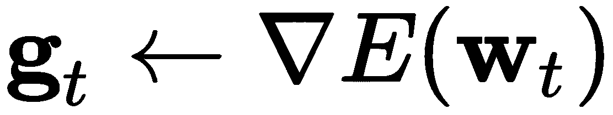
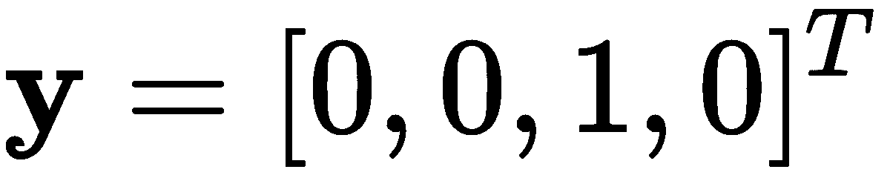
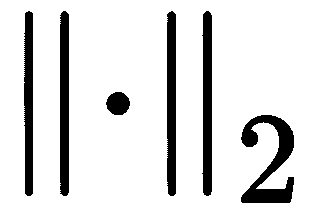
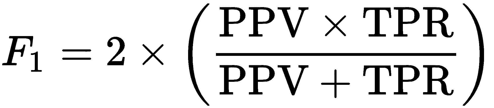
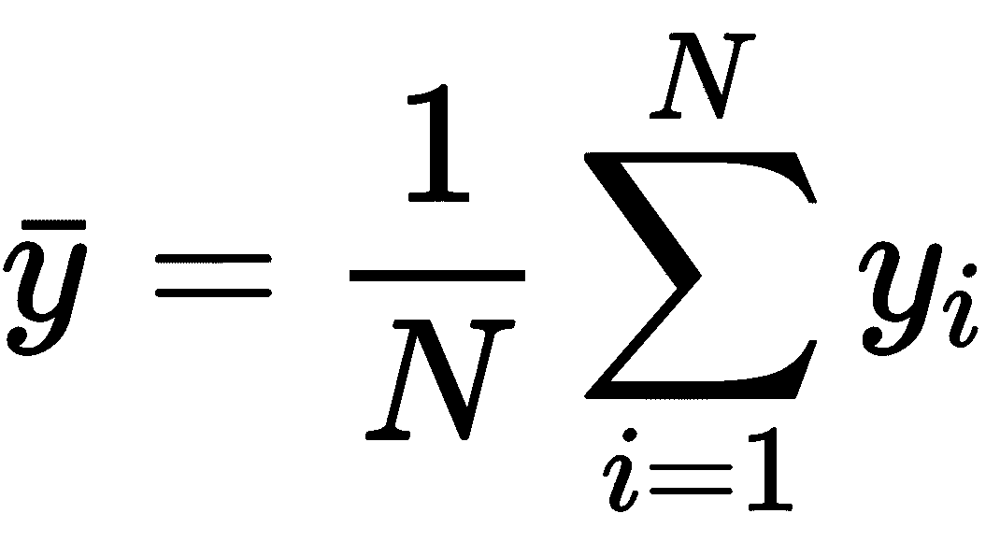
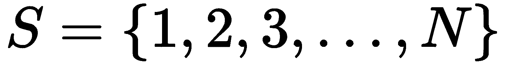
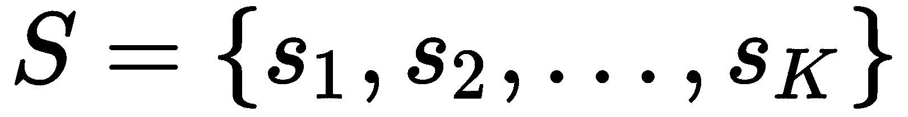

从数据中学习

数据准备对于复杂数据集来说花费大量时间，正如我们在上一章中所见。然而，花时间准备数据是值得的……这一点我可以保证！同样，花时间理解从数据中学习的基本理论对于任何想进入深度学习领域的人来说都非常重要。理解学习理论的基础，将在你阅读新算法或评估自己模型时带来回报。当你阅读本书后面的章节时，这也会让你的学习过程变得更加轻松。

更具体地说，本章介绍了深度学习理论中最基础的概念，包括回归和分类的性能衡量，以及过拟合的识别。它还提供了一些关于模型超参数的合理性以及优化需求的警告。

本章的结构如下：

+   有目的的学习

+   衡量成功与错误

+   识别过拟合和泛化

+   学习的艺术

+   深度学习算法训练的伦理影响

# 第六章：有目的的学习

在[第三章](https://cdp.packtpub.com/deep_learning_for_beginners/wp-admin/post.php?post=26&action=edit)《准备数据》中，我们讨论了如何为两种主要问题类型准备数据：**回归**和**分类**。在这一节中，我们将更详细地讨论分类和回归的技术差异。这些差异很重要，因为它们会限制你可以使用的机器学习算法类型，以解决你的问题。

## 分类

如何判断你的问题是否属于分类问题？答案取决于两个主要因素：你要解决的**问题**和你用于解决问题的**数据**。当然可能还有其他因素，但这两个因素无疑是最为重要的。

如果你的目标是建立一个模型，给定某些输入，模型将确定输出是否属于两个或更多的不同类别，那么你遇到的是一个分类问题。以下是分类问题的一些非详尽例子：

+   给定一张图片，标出其包含的数字（区分 10 个类别：0-9 数字）。

+   给定一张图片，确定其中是否包含猫（区分两个类别：是或否）。

+   给定一系列温度读数，确定其季节（区分四个类别：四季）。

+   给定一条推文的文本，确定其情感（区分两个类别：正面或负面）。

+   给定一张人的图片，确定其年龄段（区分五个类别：<18，18-25，26-35，35-50，>50）。

+   给定一张狗的图片，确定其品种（区分 120 个类别：国际公认的犬种）。

+   给定整个文档，确定它是否被篡改（区分类别：真实或被更改）。

+   根据光谱辐射计的卫星读数，确定地理位置是否与植被的光谱特征匹配（区分两个类别：是或否）。

如您在列表中的示例中所见，不同类型的问题具有不同类型的数据。在这些示例中看到的数据称为**标记数据**。

未标记数据非常常见，但在没有某种允许将数据样本匹配到类别的处理的情况下，很少用于分类问题。例如，可以对未标记数据使用无监督聚类，将数据分配给特定的聚类（例如组或类别），此时，数据在技术上成为“标记数据”。

列表中另一个需要注意的重要事项是，我们可以将分类问题分为两大类：

+   **二元分类**：仅用于任意两个类别之间的分类

+   **多类分类**：用于对超过两个类别进行分类

这种区别可能看起来是任意的，但实际上并非如此；事实上，分类的类型将限制您可以使用的学习算法类型和您可以期望的性能。为了更好地理解这一点，让我们分别讨论每种分类。

### 二元分类

这种类型的分类通常被认为比多类别问题简单得多。实际上，如果我们能解决二元分类问题，我们可以通过决定将问题分解为几个二元分类问题的策略，从技术上讲解决多类问题（*Lorena, A. C.* 等，*2008*）。

为什么这被认为是一个较简单的问题之一，是因为二元分类学习算法背后的算法和数学基础。假设我们有一个二元分类问题，比如在[第三章](https://cdp.packtpub.com/deep_learning_for_beginners/wp-admin/post.php?post=26&action=edit)，《准备数据》中解释的克利夫兰数据集。该数据集包含每个患者的 13 个医学观察结果 — 我们可以称之为 。对于每个患者记录，都有一个相关的标签，指示患者是否患有某种心脏疾病（+1）或没有（-1） — 我们将称之为 。因此，一个完整的数据集 ，包含 *N *个样本，可以被定义为一组数据和标签：


如[第一章](https://cdp.packtpub.com/deep_learning_for_beginners/wp-admin/post.php?post=24&action=edit)所讨论，*机器学习简介*，学习的核心目的是使用一种算法，它能够找到将输入数据*`x`*映射到标签`y`的方式，并正确地处理所有样本在![]中的情况，并能够进一步（希望）对已知数据集之外的样本进行处理，。使用感知机和相应的**感知机学习算法**（**PLA**），我们的目标是找到能够满足以下条件的参数![]：


对于所有样本，`i` = 1, 2, ..., `N`。然而，正如我们在[第一章](https://cdp.packtpub.com/deep_learning_for_beginners/wp-admin/post.php?post=24&action=edit)中讨论的，*机器学习简介*，如果数据是非线性可分的，方程式将无法满足。在这种情况下，我们可以得到一个近似值或预测结果，这不一定是期望的结果；我们将称这样的预测为。

那么，学习算法的核心目标便是减少期望目标标签与预测结果之间的差异。在理想的情况下，我们希望所有`i` = 1, 2, ..., `N`时都能实现。对于某些`i`的情况，其中，学习算法必须进行调整（即自我训练），通过寻找新的参数，希望能够避免在未来犯下类似的错误。

此类算法背后的科学因模型而异，但最终目标通常是相同的：

+   减少每次学习迭代中的错误数量，。

+   尽可能少的迭代（步骤）学习模型参数。

+   尽可能快地学习模型参数。

由于大多数数据集处理的是不可分问题，PLA 通常会被忽略，转而使用其他能够更快收敛且迭代次数较少的算法。许多学习算法通过采取特定的步骤来调整参数，以减少错误，这些步骤是基于错误的变化性和参数选择的导数。因此，最成功的算法（至少在深度学习中）是那些基于某种梯度下降策略的算法（Hochreiter, S.等，2001）。

现在，让我们回顾一下最基本的迭代梯度策略。假设我们想要通过给定的数据集，，来学习参数 。为了让事情变得稍微简单一些，我们需要对问题的表述进行一些小调整。我们希望  能够在表达式  中隐含出来。唯一能够实现这一点的方式是，如果我们设置  和 。

通过这个简化，我们可以直接搜索*`w`*，这也意味着同时搜索*`b`*。使用固定的*学习率*进行梯度下降如下所示：

1.  将权重初始化为零（ ）并将迭代计数器初始化为零（）。

1.  当 时，执行以下操作：

1.  计算相对于  的梯度，并将其存储在 中。

1.  更新 ，使其看起来像这样：。

1.  增加迭代计数器并重复。

这里有几个需要解释的地方：

+   梯度计算，，并非易事。对于某些特定的机器学习模型，它可以通过解析方式确定；但在大多数情况下，必须通过使用一些最新的算法来数值求解。

+   我们仍然需要定义如何计算误差，；但这将在本章的下一部分中讲解。

+   需要指定一个学习率，，这本身就是一个问题。

解决这个最后问题的一种方式是：为了找到最小化误差的参数 ，我们需要参数 。现在，在应用梯度下降时，我们可以考虑找到  参数，但那样我们就会陷入一个无限循环。由于现如今梯度下降的算法通常会自动计算学习率或使用自适应方法来调整它（Ruder, S. 2016），我们不再详细讨论梯度下降及其学习率的问题。

### 多类分类

将数据分类为多个类别会对学习算法的性能产生重要影响。一般来说，模型的性能会随着需要识别的类别数量的增加而下降。例外情况是，如果你有大量的数据和强大的计算能力，因为这样你可以克服数据集中的类别不平衡问题，估计巨大的梯度，并进行大规模的计算和模型更新。计算能力未来可能不再是限制因素，但目前仍然是。

多类别问题可以通过使用如**一对一**或**一对多**等策略来解决。

在一对多（one versus all）中，你实际上有一个专家二分类器，擅长从所有其他模式中识别出一个模式，而其实现策略通常是级联的。下面是一个示例：

```py
if classifierSummer says is Summer: you are done
else:
 if classifierFall says is Fall: you are done
 else:
   if classifierWinter says is Winter: you are done
   else:
     it must be Spring and, thus, you are done
```

下面是该策略的图示。假设我们有二维数据，能够告诉我们一年四季的一些信息，如下所示：


图 4.1 - 随机化的二维数据，可能告诉我们一年四季的一些信息

在这种随机化的二维数据情况下，我们有四个类别，对应于四季。二分类直接使用是行不通的。然而，我们可以训练专家型二分类器，专门处理*一个*特定类别*与所有其他类别*的区别。如果我们训练一个二分类器来判断数据点是否属于夏季类别，使用一个简单的感知器，我们可以得到如下所示的分隔超平面：


图 4.2：一个专家型 PLA，它擅长将夏季数据与其他所有季节数据区分开来

类似地，我们可以训练其余的专家，直到我们拥有足够的专家来测试整个假设；也就是说，直到我们能够将所有类别相互区分开来。

另一种选择是使用能够处理多输出的分类器；例如，决策树或集成方法。但在深度学习和神经网络的情况下，这指的是可以在输出层有多个神经元的网络，例如在[第一章](https://cdp.packtpub.com/deep_learning_for_beginners/wp-admin/post.php?post=24&action=edit)中展示的*图 1.6*和*图 1.9*，*机器学习导论*。

多输出神经网络的数学公式与单输出神经网络仅有细微差异，输出不再是一个二值集合，如！[](img/0f347d74-fa0b-4e7f-8523-3b84761dae43.png)，而是一个独热编码值的向量，如！[](img/3476b823-1083-4257-a7e0-71949ade683a.png)。在这种情况下，|`C`|表示集合`C`的大小，其中包含所有不同的类别标签。对于前面的例子，`C`将包含以下内容：`C` = {'*夏季*', '*秋季*', '*冬季*', '*春季*'}。以下是每个独热编码的样子：

+   **夏季**：

+   **秋季**：

+   **冬季**：

+   **春季**：

目标向量中的每个元素将对应四个神经元的期望输出。我们还应指出，数据集定义现在应该反映样本输入数据和标签都是向量：


处理多类别分类问题的另一种方法是使用**回归**。

## 回归

之前我们指定了，对于二分类问题，目标变量可以取一组二值，如！[](img/0f347d74-fa0b-4e7f-8523-3b84761dae43.png)。我们还提到，对于多分类问题，可以修改目标变量，使其成为一个向量，向量的大小取决于类别的数量，如！[](img/a5246959-0c32-4040-aa86-b99a914f8c09.png)。那么，回归问题处理的情况是目标变量是任何实数值，如！[](img/8dbf0dcb-9e08-48c6-888e-9e62c7d77f96.png)。

这里的含义非常有趣，因为使用回归模型和算法，我们可以*严格来说*进行二分类，因为实数集包含任何二值数字集合：

。

此外，如果我们将`C` = {'*夏季*', '*秋季*', '*冬季*', '*春季*'}更改为数值表示形式，例如 C = {0,1,2,3}，那么*严格来说*，我们又会使用回归，因为它具有相同的特性：

。

尽管回归模型可以解决分类问题，但建议使用专门针对分类的模型，并仅将回归模型用于回归任务。

即使回归模型可以用于分类（Tan, X., et.al. 2012），它们也非常适合目标变量是实数的情况。以下是一些回归问题的示例列表：

+   给定一张图片时，指出其中有多少人（输出可以是任何大于等于 0 的整数）。

+   给定一张图片时，指出其中含有猫的概率（输出可以是 0 到 1 之间的任何实数）。

+   给定一系列关于温度的读数，判断实际的体感温度（输出可以是任何整数，范围取决于单位）。

+   给定一条推文的文本，判断其是否具有攻击性（输出可以是 0 到 1 之间的任何实数）。

+   给定一个人的图片，判断他们的年龄（输出可以是任何正整数，通常小于 100）。

+   给定一整篇文档，判断可能的压缩率（输出可以是 0 到 1 之间的任何实数）。

+   给定卫星光谱辐射仪的读数，判断对应的红外值（输出可以是任何实数）。

+   给定一些主要报纸的头条，判断油价（输出可以是任何大于等于 0 的实数）。

从这个列表中可以看到，由于实数范围涵盖了所有整数以及所有正负数，可能性非常多，即使这个范围对于特定应用来说过于宽泛，回归模型也可以根据范围要求进行扩展或缩小。

为了说明回归模型的潜力，让我们从一个基本的**线性回归**模型开始，后续章节中我们将介绍基于深度学习的更复杂的回归模型。

线性回归模型尝试解决以下问题：


该问题的求解适用于`i` = 1, 2, ..., `N`。然而，我们也可以像之前一样使用相同的技巧，将`b`的计算包含在同一个方程中。所以，我们可以说我们正在尝试解决以下问题：


再次强调，我们正在尝试学习参数，，从而得到所有`i`情况下的。在线性回归的情况下，预测值，，应该理想情况下等于真实目标值，，如果输入数据，，某种程度上能描述一条完美的直线。但由于这非常不可能，所以必须有一种方法来学习参数，，即使是这样，。为了实现这一点，线性回归学习算法首先会对小错误给予低惩罚，对大错误给予较大惩罚。这是有道理的，对吧？这非常直观。

惩罚预测误差的自然方式是通过将预测值与目标值之间的差异平方。以下是差异较小时的一个例子：


这是一个当差异较大时的例子：


在这两个例子中，期望的目标值是`1`。在第一种情况下，预测值`0.98`非常接近目标，平方差是`0.0004`，相对于第二种情况来说很小。第二个预测值偏离了`14.8`，这导致平方差为`219.4`。这对于构建学习算法来说是合理且直观的；即，惩罚错误的程度与其大小成正比。

我们可以正式定义总的平均误差，作为参数*`w`*的选择的函数，即所有平方误差的平均和，这也被称为**均方误差（MSE）**：

。

如果我们将预测定义为当前选择的，即，那么我们可以将误差函数重写如下：

。

这可以通过-范数（也称为欧几里得范数，）来简化，首先定义一个数据矩阵，其元素为数据向量，以及一个相应的目标向量，如下所示：

。

误差的简化形式如下：


这可以展开成以下重要方程：

。

这很重要，因为它有助于计算误差的导数，，这是调整参数所必需的，调整方向与误差的导数成比例。现在，按照线性代数的基本性质，我们可以说误差的导数（由于它会产生一个矩阵，因此被称为梯度）如下：

。

因为我们希望找到能够最小化误差的参数，我们可以将梯度设置为`0`，然后解出。通过将梯度设置为`0`并忽略常数值，我们得出如下结果：


。

这些被称为**正规方程**（Krejn, S. G. E. 1982）。然后，如果我们简单地使用术语，我们就得到了**伪逆**的定义（Golub, G. 和 Kahan, W. 1965）。这一方法的美妙之处在于，我们不需要通过迭代计算梯度来选择最佳参数，。事实上，由于梯度是解析的和直接的，我们可以一次性计算，正如在这个线性回归算法中所解释的那样：

1.  从构建对，。

1.  估算伪逆。

1.  计算并返回。

为了直观地展示这一点，假设我们有一个系统，它发送一个遵循线性函数的信号；然而，当信号被传输时，它会被常规噪声污染，噪声具有`0`均值和单位方差，并且我们只能观察到被噪声污染的数据，如下所示：


图 4.3 - 被随机噪声污染的数据读取

比如说，一个黑客读取了这些数据，并运行线性回归尝试确定在数据被污染之前产生这些数据的真实函数，那么这个数据黑客将得到这里显示的解：


图 4.4 - 针对给定噪声数据读取问题的线性回归解法

显然，正如前面的图所示，线性回归解法非常接近真实的原始线性函数。在这个特定的例子中，可以观察到较高的接近度，因为数据被噪声污染，而这种噪声符合**白噪声**的模式；然而，对于不同类型的噪声，模型的表现可能不如这个例子中的效果。此外，大多数回归问题根本不是线性的；实际上，最有趣的回归问题是高度非线性的。尽管如此，基本的学习原理是相同的：

+   在每次学习迭代中（或者直接一次性得到结果，如线性回归中所示），减少错误的数量，。

+   在尽可能少的迭代（步骤）中学习模型参数。

+   尽快学习模型参数。

引导学习过程的另一个重要组成部分是成功或错误的计算方式，这与选择的参数有关，。在 PLA 的情况下，它简单地找到了错误并进行了调整。对于多类问题，这是通过在某些误差度量上进行梯度下降的过程；而在线性回归中，这是通过直接使用均方误差（MSE）进行梯度计算。但现在，让我们深入探讨其他可以量化和定性分析的误差度量和成功标准。

# 衡量成功与错误

在深度学习模型中，使用的性能度量标准种类繁多，如准确率、平衡误差率、均方误差等。为了保持条理，我们将它们分为三类：二分类、多分类和回归。

## 二分类

在分析和衡量模型成功与否时，有一个重要的工具被广泛使用，它被称为**混淆矩阵**。混淆矩阵不仅在直观展示模型如何进行预测时非常有用，我们还可以从中提取其他有趣的信息。下图展示了一个混淆矩阵的模板：


图 4.5 - 混淆矩阵及其派生的性能度量标准

混淆矩阵及其派生的所有度量标准是传达模型好坏的重要方式。你应该将此页面加入书签，并在需要时随时返回查看。

在前面的混淆矩阵中，你会注意到它在垂直轴上有两列，表示真实的目标值，而在水平轴上，表示预测值。行与列的交点表示实际预测值与应预测值之间的关系。矩阵中的每个条目都有特殊的含义，并且可以推导出其他有意义的综合性能度量标准。

以下是度量标准及其含义：

| **缩写** | **描述** | **解释** |
| --- | --- | --- |
| TP | *真阳性* | 这是指一个数据点属于正类，并且被正确预测为正类。 |
| TN | *真阴性* | 这是指一个数据点属于负类，并且被正确预测为负类。 |
| FP | *假阳性* | 这是指一个数据点属于负类，但被错误地预测为正类。 |
| FN | *假阴性* | 这是指一个数据点属于正类，但被错误地预测为负类。 |
| PPV | *正预测值* 或 *精度* | 这是指所有预测为正类的值中，正确预测为正类的比例。 |
| NPV | *负预测值* | 这是所有预测为负的值中，正确预测为负的比例。 |
| FDR | *假发现率* | 这是所有预测为正的值中，错误预测为正的比例。 |
| FOR | *假阴性率* | 这是所有预测为负的值中，错误预测为负的比例。 |
| TPR | *真正率*，*灵敏度*，*召回率*，*命中率* | 这是所有应为正类的值中，正确预测为正类的比例。 |
| FPR | *假阳性率*或*假警报率* | 这是所有预测为正的值中，错误预测为负的比例。 |
| TNR | **真阴性率**，*特异度*，或*选择性* | 这是所有应为负类的值中，正确预测为负类的比例。 |
| FNR | **假阴性率**或*漏检率* | 这是所有应为正类的值中，错误预测为负类的比例。 |

这些中的一些可能会比较难以理解；不过，你现在不需要记住它们，随时可以回来查看这个表格。

还有一些其他指标，它们的计算稍微复杂一些，例如：

| **缩写** | **描述** | **解释** |
| --- | --- | --- |
| ACC | *准确率* | 这是正确预测正类和负类的比例，基于所有样本。 |
| `F[1]` | `F[1]`*-得分* | 这是精确度和灵敏度的平均值。 |
| MCC | *马修斯相关系数* | 这是期望类别和预测类别之间的相关性。 |
| BER | *平衡错误率* | 这是在类别不平衡情况下的平均错误率。 |

在这份包含*复杂*计算的列表中，我加入了如**ACC**和**BER**这样的缩写，它们有非常直观的含义。然而，主要问题是当我们处理多类时，它们会有所变化。因此，在多类情况下，它们的计算会稍有不同。其余的指标依然是针对二分类的（如定义）。

在讨论多类指标之前，以下是计算之前这些指标的公式：





在一般意义上，你希望**ACC**、**F[1]**和**MCC**尽量高，而**BER**尽量低。

## 多类

当我们超越简单的二分类时，常常涉及多类问题，例如`C` = {'*夏季*'，'*秋季*'，'*冬季*'，'*春季*'}或`C` = {0,1,2,3}。这会在一定程度上限制我们衡量错误或成功的方式。

考虑多类的混淆矩阵，如下所示：


图 4.6 - 多类别的混淆矩阵

从以下图表可以明显看出，由于我们不再只有正负类别，而是有一组有限的类别，真正的正类或负类的概念已经消失：


各个类别，，可以是字符串或数字，只要它们符合集合的规则。也就是说，类别的集合，，必须是有限且唯一的。

要在此测量 ACC，我们将统计混淆矩阵主对角线上的所有元素，并将其除以样本的总数：


在这个方程中，表示混淆矩阵，表示迹运算；即，方阵主对角线元素的和。因此，总误差为`1-ACC`，但在类别不平衡的情况下，误差指标或简单的准确率可能会产生误导。为此，我们必须使用 BER 指标，对于多个类别，定义如下：


在这个新的 BER 公式中，表示混淆矩阵中*第 j*行和*第 i*列的元素，。

一些机器学习学派使用混淆矩阵的行来表示真实标签，列来表示预测标签。分析背后的理论和解释都是相同的。不要对`sklearn`使用翻转的方法感到惊慌；这与此无关，你应该不会遇到任何理解上的问题。

作为示例，考虑之前在*图 4.1*中展示的数据集。如果我们运行一个五层的神经网络分类器，可能会得到像这样的决策边界：


图 4.7 - 使用五层神经网络对一个二维数据集进行分类的区域

显然，该数据集不能通过一个非线性超平面完美分开；每个类别的边界都有一些数据点交叉。在前面的图表中，我们可以看到，只有*夏季*类别没有数据点被错误分类。

然而，如果我们实际计算并展示混淆矩阵，以下结果会更为明显：


图 4.8 - 从训练误差中获得的混淆矩阵，基于示例二维数据集

在这种情况下，准确率可以计算为 ACC=(25+23+22+24)/100，得到的 ACC 为 0.94，看起来不错，错误率为 1-ACC = 0.06。这个例子有轻微的类别不平衡。这里是每个类别的样本数：

+   夏季：25

+   秋季：25

+   冬季：24

+   春季：26

冬季组的样本数比其他组少，春季组的样本数比其他组多。虽然这是一个非常小的类别不平衡，但它可能足以导致一个误导性较低的错误率。现在我们必须计算平衡错误率 BER。

BER 可以按如下方式计算：


这里，错误率与 BER 之间的差异是 0.01% 的低估。然而，对于类别严重不平衡的情况，差距可能会大得多，因此我们有责任仔细测量并报告适当的错误度量，BER。

关于 BER 另一个有趣的事实是，它直观上是平衡准确率的对应物；这意味着如果我们去掉 BER 方程中的 `1–` 项，就剩下平衡准确率。此外，如果我们检查分子中的项，就可以看到其上的分数导致了每个类别的准确率；例如，第一个类别，夏季，准确率为 100%，第二个，秋季，准确率为 92%，依此类推。

在 Python 中，`sklearn` 库有一个类，可以根据真实标签和预测标签自动确定混淆矩阵。这个类叫做 `confusion_matrix`，它属于 `metrics` 超类，我们可以通过以下方式使用它：

```py
from sklearn.metrics import confusion_matrix
cm = confusion_matrix(y, y_pred)
print(cm)
```

如果 `y` 包含真实标签，`y_pred` 包含预测标签，那么前述操作将输出类似这样的结果：

```py
[[25 0 0 0]
 [ 0 23 1 1]
 [ 1 0 22 1]
 [ 0 1 1 24]]
```

我们可以通过简单地做以下操作来计算 BER：

```py
BER = []
for i in range(len(cm)):
 BER.append(cm[i,i]/sum(cm[i,:]))
print('BER:', 1 - sum(BER)/len(BER))
```

这将输出以下内容：

```py
BER: 0.06006410256410266
```

或者，`sklearn` 有一个内置函数，可以在与混淆矩阵相同的超级类中计算平衡准确率得分。这个类叫做 `balanced_accuracy_score`，我们可以通过以下方式计算 BER：

```py
from sklearn.metrics import balanced_accuracy_score
print('BER', 1- balanced_accuracy_score(y, y_pred))
```

我们得到以下输出：

```py
BER: 0.06006410256410266
```

现在让我们讨论回归的指标。

## 回归

最流行的指标是**MSE**，我们在本章前面解释线性回归如何工作时已讨论过该指标。然而，我们将它作为超参数选择的函数进行了解释。在这里，我们将其重新定义为一般意义上的如下：


另一个与 MSE 非常相似的指标是**均值绝对误差**（**MAE**）。虽然 MSE 对大错误的惩罚更严重（平方惩罚），而对小错误的惩罚较轻，MAE 则直接按实际值和预测值之间的绝对差异惩罚所有误差。这是 MAE 的正式定义：


最后，在其他回归评估指标中，深度学习中常用的指标是**`R`² 得分**，也叫做**决定系数**。这个指标表示模型中独立变量所解释的方差比例。它衡量模型在面对与训练数据具有相同统计分布的未见数据时，表现良好的可能性。这是它的定义：


样本均值定义如下：



Scikit-learn 提供了每个这些指标的类，见下表：

| **回归指标** | **Scikit-learn 类** |
| --- | --- |
| `R`² 得分 | `sklearn.metrics.r2_score` |
| MAE | `sklearn.metrics.mean_absolute_error` |
| MSE | `sklearn.metrics.mean_squared_error` |

所有这些类都将真实标签和预测标签作为输入参数。

举个例子，如果我们将*图 4.3* 和 *图 4.4* 中展示的线性回归模型及其数据作为输入，我们可以确定三个误差指标，如下所示：

```py
from sklearn.metrics import mean_absolute_error
from sklearn.metrics import mean_squared_error
from sklearn.metrics import r2_score

r2 = r2_score(y,y_pred)
mae = mean_absolute_error(y,y_pred)
mse = mean_squared_error(y,y_pred)

print('R_2 score:', r2)
print('MAE:', mae)
print('MSE:', mse)
```

上述代码的输出如下：

```py
R_2 score: 0.9350586211501963
MAE: 0.1259473720654865
MSE: 0.022262066145814736
```

下图展示了使用的样本数据及其获得的性能。显然，使用这三种性能指标的表现很好：


图 4.9 - 在含有白噪声的线性回归模型上的误差指标

一般来说，你总是希望确定系数尽可能接近 `1`，并且所有的误差（MSE 和 MAE）尽可能接近 `0`。尽管这些都是很好的模型评估指标，但我们需要注意的是，要在**未见的验证**或**测试数据**上报告这些指标。这样做可以准确衡量模型的泛化能力，并在模型发生灾难性错误之前识别出过拟合。

# 识别过拟合和泛化

通常，在受控的机器学习环境中，我们会得到一个可以用于训练的数据集和一个可以用于测试的不同数据集。其思路是：你只在**训练**数据上运行学习算法，但当你想了解模型的表现时，你将**测试**数据输入到模型中并观察输出。在竞赛和黑客马拉松中，通常会提供测试数据，但不会提供与之相关的标签，因为获胜者将根据模型在测试数据上的表现来选择，而不希望他们通过查看测试数据的标签并做出调整来作弊。如果是这种情况，我们可以使用**验证**数据集，我们可以通过从训练数据中分离一部分数据来创建验证数据集。

拥有单独数据集的全部意义，即验证集或测试集，是为了评估在这些数据上的表现，因为我们知道我们的模型并没有用它来训练。一个模型能够在未见过的验证集或测试集上表现得同样好，或者接近同样好的能力，称为**泛化**。

泛化是大多数学习算法的最终目标；我们所有深度学习的专业人员和从业者都梦想在我们的所有模型中实现出色的泛化。同样，我们最大的噩梦是**过拟合**。

过拟合是泛化的对立面。当我们的模型在训练数据上表现非常好，但在面对验证集或测试集时，表现显著下降时，就发生了过拟合。这表明我们的模型几乎记住了训练数据的细节，而忽略了样本空间中的一般性规律，这些规律有助于产生良好的模型。

在本章及后续章节中，我们将遵循以下数据拆分规则：

+   如果我们提供了带标签的测试数据，我们将基于训练集进行训练，并根据测试集报告性能。

+   如果我们没有提供测试数据（或如果我们有无标签的测试数据），我们将拆分训练集，创建一个验证集，通过交叉验证策略报告性能。

让我们单独讨论每种情况。

## 如果我们有测试数据

为了开始讨论，假设我们有一个深度学习模型，并且有一组超参数，，这些超参数可能是模型的权重、神经元数量、层数、学习率、丢弃率等等。然后，我们可以说，一个用训练数据训练的模型，，（具有超参数）可以得到如下的训练准确率：


这是一个训练模型在训练数据上的训练准确率。因此，如果我们有带标签的测试数据，，有`M`个数据点，我们可以通过计算以下内容来简单地估算**测试准确率**：


在报告测试准确率时，有一个重要的特性在大多数情况下通常是成立的——所有的测试准确率通常小于训练准确率加上一些由于参数选择不当造成的噪声：


这通常意味着，如果你的测试准确率明显高于训练准确率，那么可能存在训练模型的问题。此外，我们还可以考虑测试数据与训练数据在统计分布和描述它的多维流形上有显著差异的可能性。

总结来说，如果我们有正确选择的测试数据，那么在测试集上报告性能是非常重要的。然而，性能低于训练时的表现是完全正常的。不过，如果性能显著较低，可能存在过拟合问题；如果性能显著较高，则可能是代码、模型或测试数据选择有问题。过拟合问题可以通过选择更好的参数 ，或选择不同的模型  来解决，这在下一节中有讨论。

现在，让我们简要讨论一种情况，即我们没有测试数据，或者我们有没有标签的测试数据。

## 没有测试数据？没问题——交叉验证

交叉验证是一种技术，它允许我们将训练数据  分割成更小的组用于训练。需要记住的最重要一点是，分割应该是理想情况下具有相等数量的样本，并且我们要轮流选择用于训练和验证集的组。

让我们讨论著名的交叉验证策略——**`k`-折交叉验证**（Kohavi, R. 1995）。这里的想法是将训练数据划分为 `k` 组，这些组（理想情况下）大小相等，然后选择 `k`-1 组用于训练模型，并衡量被排除的组的性能。接着，每次更换组，直到所有组都被选中用于测试。

在前面的章节中，我们讨论了使用标准准确度（ACC）来衡量性能，但我们也可以使用任何性能指标。为了展示这一点，我们现在将计算均方误差（MSE）。这就是 `k`-折交叉验证算法的样子：

1.  输入数据集 ，模型 ，参数 ，以及折数 。

1.  将索引集  划分为  组（理想情况下大小相等），，使得 。

1.  对于每个  情况，执行以下操作：

+   选择训练集的索引，如 ![]，并形成训练集，![]。

+   选择验证集的索引，如 ，并形成验证集，。

+   使用在训练集上选择的参数训练模型：。

+   计算模型在验证集上的误差，![]，![]

1.  返回对于所有的情况。

通过这个，我们可以计算交叉验证误差（MSE），公式如下：


我们还可以计算相应的标准差：

。

通常，观察我们性能度量的标准差是一个好主意——无论我们选择哪种方法——因为它能反映我们在验证集上的表现一致性。理想情况下，我们希望交叉验证的 MSE 为`0`，，标准差为`1`，。

为了解释这一点，我们可以使用受白噪声污染的样本数据回归示例，见*图 4.3*和*图 4.4*。为了简化这个例子，我们将使用总共 100 个样本，`N`=100，并且使用 3 折交叉验证。我们将使用 scikit-learn 的`KFold`类，在`model_selection`父类中，并获得交叉验证后的 MSE 及其标准差。

为此，我们可以使用以下代码，并加入其他度量标准：

```py
import numpy as np
from sklearn.metrics import mean_absolute_error
from sklearn.metrics import mean_squared_error
from sklearn.metrics import r2_score
from sklearn.model_selection import KFold

# These will be used to save the performance at each split
cv_r2 = []
cv_mae = []
cv_mse = []

# Change this for more splits
kf = KFold(n_splits=3)
k = 0

# Assuming we have pre-loaded training data X and targets y
for S_D, S_V in kf.split(X):
  X_train, X_test = X[S_D], X[S_V]
  y_train, y_test = y[S_D], y[S_V]

  # Train your model here with X_train and y_train and...
  # ... test your model on X_test saving the output on y_pred

  r2 = r2_score(y_test,y_pred)
  mae = mean_absolute_error(y_test,y_pred)
  mse = mean_squared_error(y_test,y_pred)

  cv_r2.append(r2)
  cv_mae.append(mae)
  cv_mse.append(mse)

print("R_2: {0:.6}  Std: {1:0.5}".format(np.mean(cv_r2),np.std(cv_r2)))
print("MAE: {0:.6}  Std: {1:0.5}".format(np.mean(cv_mae),np.std(cv_mae)))
print("MSE: {0:.6}  Std: {1:0.5}".format(np.mean(cv_mse),np.std(cv_mse)))
```

这段代码的结果会返回如下内容：

```py
R_2: 0.935006  Std: 0.054835
MAE: 0.106212  Std: 0.042851
MSE: 0.0184534  Std: 0.014333
```

这些结果是交叉验证后的，能更清晰地展示模型的泛化能力。为了比较目的，参考*图 4.9*中展示的结果。你会注意到，现在仅使用约 66%的数据（因为我们将数据分成了三组）进行训练，约 33%的数据用于测试，得到的结果与之前在*图 4.9*中测得的性能结果非常一致，如下所示：


图 4.10 - 交叉验证性能度量，括号中为标准差

前面的图表展示了每次数据拆分所找到的线性回归解以及真实的原始函数；你可以看到，找到的解与真实模型非常接近，从而得到了良好的性能，这通过**`R`²**、**MAE**和**MSE**来衡量。

**练习**

请继续改变折数，逐步增加，并记录你的观察结果。交叉验证的性能有什么变化？它们是保持不变、增加还是减少？交叉验证性能的标准差发生了什么变化？它们是保持不变、增加还是减少？你认为这意味着什么？

通常，交叉验证用于数据集 ，并用模型  在参数  上进行训练。然而，学习算法中最大的一项挑战就是找到能够产生最佳（测试或交叉验证）性能的最佳参数集 。许多机器学习科学家认为，选择参数集的过程可以通过一些算法**自动化**，而另一些人则认为这是一种**艺术**（Bergstra, J. S., 等，2011 年）。

# 学习背后的艺术

对于我们这些花费数十年研究机器学习的人来说，经验影响着我们为学习算法选择参数的方式。但对于那些初学者来说，这是需要培养的技能，而这种技能是在理解学习算法如何工作的基础上发展起来的。一旦你读完这本书，我相信你会掌握足够的知识，能够明智地选择参数。与此同时，我们可以在这里讨论一些使用标准和新颖算法自动寻找参数的思路。

在继续之前，我们需要在此时做出区分，并定义在学习算法中非常重要的两大类参数。具体如下：

+   **模型参数：** 这些是表示模型所代表的解决方案的参数。例如，在感知机和线性回归中，这可能是向量  和标量 ，而对于深度神经网络来说，这可能是权重矩阵  和偏置向量 。对于卷积网络，这可能是滤波器集。

+   **超参数：** 这些是模型所需的参数，用来引导学习过程以寻找解决方案（模型参数），通常表示为 。例如，在感知机中，超参数可能是最大迭代次数；在深度神经网络中，超参数可能包括层数、神经元的数量、神经元的激活函数以及学习率；对于**卷积神经网络**（**CNN**），超参数可能包括滤波器的数量、滤波器的大小、步幅、池化大小等。

换句话说，模型参数在一定程度上是由超参数的选择决定的。通常，除非出现数值异常，否则所有学习算法都会为相同的超参数集一致地找到解决方案（模型参数）。因此，学习过程中的主要任务之一就是找到最佳的超参数集，以便为我们提供最好的解决方案。

为了观察改变模型超参数的影响，我们再次考虑之前展示的四类季节分类问题，参见*图 4.7*。我们假设使用的是全连接网络，如《第一章》《机器学习导论》中所述，我们希望确定的超参数是最适合的层数。为了教学目的，假设每层的神经元数量会按指数增加，如下所示：

| **层数** | **每层的神经元数量** |
| --- | --- |
| 1 | (8) |
| 2 | (16, 8) |
| 3 | (32, 16, 8) |
| 4 | (64, 32, 16, 8) |
| 5 | (128, 64, 32, 16, 8) |
| 6 | (256, 128, 64, 32, 16, 8) |
| 7 | (512, 256, 128, 64, 32, 16, 8) |

在之前的配置中，括号中的第一个数字对应最接近输入层的神经元数量，而括号中的最后一个数字对应最接近输出层的神经元数量（输出层由 4 个神经元组成，每个类别一个）。

所以，层数代表 ，在这个例子中。如果我们遍历每个配置并确定交叉验证后的 BER，我们可以确定哪个架构表现最佳；也就是说，我们正在为性能优化 。得到的结果如下所示：

| **层数 – ![]** | *`1`* | *`2`* | *`3`* | *`4`* | *`5`* | *`6`* | *`7`* |
| --- | --- | --- | --- | --- | --- | --- | --- |
| **BER** | 0.275 | 0.104 | 0.100 | 0.096 | 0.067 | 0.079 | 0.088 |
| **标准差** | 0.22 | 0.10 | 0.08 | 0.10 | 0.05 | 0.04 | 0.08 |

从结果中，我们可以很容易地确定，最佳架构是五层的，因为它具有最低的 BER 和第二小的标准差。事实上，我们可以收集每个配置在每个分割点的数据，并生成这里展示的箱线图：


图 4.11 - 优化层数的交叉验证数据箱线图

这个箱线图展示了几个重要的点。首先，模型在增加层数到`5`时，BER 明显下降，之后又开始上升。这在机器学习中非常常见，被称为**过拟合曲线**，通常呈`u`形（或者对于高值表现较好的性能指标来说是`n`形）。在这种情况下，最低点表示最优的超参数（在`5`时）；该点左侧表示**欠拟合**，右侧则表示**过拟合**。第二个要点是，即使多个模型具有相似的 BER，我们也会选择那个波动性较小且最稳定的模型。

为了说明欠拟合、良拟合和过拟合之间的差异，我们将展示由最差的欠拟合、最好的拟合和最差的过拟合产生的决策边界。在这种情况下，最差的欠拟合是一个隐层，最好的拟合是五个隐层，最差的过拟合是七个隐层。它们各自的决策边界分别展示在 *图 4.12*、*图 4.13* 和 *图 4.14* 中：


图 4.12 - 一个单隐层网络的分类边界，出现了欠拟合

在前面的图中，我们可以看到欠拟合的情况非常明显，因为存在决策边界，这些边界阻止了许多数据点被正确分类：


图 4.13 - 一个五隐层网络的分类边界，具有相对较好的拟合

类似地，前面的图展示了决策边界，但与 *图 4.12* 相比，这些边界似乎为不同组的数据显示了更好的分离——这是一个良好的拟合：


图 4.14 - 一个七隐层网络的分类边界，出现了过拟合

如果你仔细观察，*图 4.12* 显示某些区域被划分得非常差，而在 *图 4.14* 中，网络架构试图 *过于努力* 地完美分类所有样本，以至于 *Fall* 类别（黄色点）的离群值进入了 *Winter* 类别（蓝色点）的区域，并且它有了自己的小区域，这可能会在后续产生负面影响。*图 4.13* 中的类别似乎对一些离群值具有鲁棒性，并且大多数情况下具有明确的区域。

随着我们继续深入本书，我们将处理更多复杂的超参数集。这里我们只处理了一个，但理论是相同的。通过这种方式寻找最佳超参数集的方法被称为穷举搜索。然而，也有其他查看参数的方法，比如执行**网格搜索**。

假设你没有固定的方法来确定每个层的神经元数量（与之前的例子不同）；你只知道你希望神经元数量在 `4` 到 `1024` 之间，层数在 `1` 到 `100` 之间，以便允许深层或浅层模型。在这种情况下，你无法进行穷举搜索，因为那样需要太多时间！此时，网格搜索作为一种解决方案，用于在通常是等间距的区域内对搜索空间进行采样。

例如，网格搜索可以查看在 `[4, 1024]` 范围内的多个神经元数量，使用 10 个等间距的值——`4`、`117`、`230`、`344`、`457`、`570`、`684`、`797`、`910` 和 `1024`——以及在 `[1, 100]` 范围内的层数，使用 10 个等间距的值——`1`、`12`、`23`、`34`、`45`、`56`、`67`、`78`、`89` 和 `100`。与查看 1020*100=102,000 次搜索不同，网格搜索只需查看 10*10=100 次搜索。

在`sklearn`中，有一个类，`GridSearchCV`，它可以在交叉验证中返回最佳模型和超参数；它是`model_selection`超类的一部分。同一类中还有另一个类，叫做`RandomizedSearchCV`，其方法基于在搜索空间中进行随机搜索。这就叫做**随机搜索**。

在**随机搜索**中，前提是它将在`[4, 1024]`范围内以及`[1,100]`范围内随机抽取数字，分别用于神经元和层数，直到达到最大迭代次数的限制。

通常，如果你知道参数搜索空间的范围和分布，尝试在你认为可能具有更好交叉验证性能的空间上进行**网格搜索**。然而，如果你对参数搜索空间知之甚少或完全不了解，可以使用**随机搜索**方法。实际上，这两种方法都很有效。

还有其他一些更复杂的方法，它们效果很好，但在 Python 中的实现尚未标准化，因此我们在此不会详细介绍。不过，你应该了解这些方法：

+   贝叶斯超参数优化（Feurer, M., 等，2015 年）

+   基于进化理论的超参数优化（Loshchilov, I., 等，2016 年）

+   基于梯度的超参数优化（Maclaurin, D., 等，2015 年）

+   基于最小二乘法的超参数优化（Rivas-Perea, P., 等，2014 年）

# 深度学习算法训练的伦理影响

关于训练深度学习模型的伦理影响，有一些要点可以提及。在处理代表人类感知的数据时，总是存在潜在的危害。但同样，关于人类和人类互动的数据必须严格保护，并且在创建基于此类数据的模型之前需要仔细审查。这些思考在接下来的部分中有详细展开。

## 使用适当的性能度量来报告

避免通过选择唯一的性能指标来伪造良好的性能，这种做法让你的模型看起来很优秀。阅读文章和报告时，不乏有多分类模型在明显类别不平衡的数据集上训练，但仅报告标准的准确度。这些模型很可能会报告较高的准确率，因为模型会偏向过采样类别，而对欠采样类别产生偏见。因此，这些模型必须报告平衡准确度或平衡错误率。

类似地，对于其他类型的分类和回归问题，你必须报告适当的性能指标。如果不确定，报告尽可能多的性能指标是明智的。没有人会抱怨有人使用过多的指标来报告模型性能。

不报告适当的度量标准可能带来的后果有很多，从拥有未被发现的偏差模型，并将其部署到生产系统中引发灾难性后果，到提供误导性信息，可能会对我们理解特定问题以及模型性能产生不利影响。我们必须记住，我们所做的可能会影响他人，因此需要保持警惕。

## 小心处理异常值并验证它们

异常值通常被视为在学习过程中需要避免的坏东西，我同意这个观点。除非它们不是真正的异常值，否则模型应该对异常值具有鲁棒性。如果我们拥有一些数据，但对它一无所知，合理的假设是将异常值解读为异常现象。

然而，如果我们对数据有所了解（因为我们收集了数据、获得了所有相关信息，或者知道产生数据的传感器），我们就可以验证异常值是否真的是异常值。我们必须验证它们是否是由于人工输入错误、传感器故障、数据转换错误或其他人为因素造成的。如果异常值不是这些原因的产物，那么我们没有合理的依据认为它是异常值。事实上，这样的数据给我们提供了关于可能不常发生，但最终会再次发生的情况的重要信息，模型需要做出正确的响应。

请考虑下图所示的数据。如果我们在没有验证的情况下随意决定忽略异常值（如顶部的图示所示），那么这些异常值实际上可能并不是真正的异常值，模型将会创建一个狭窄的决策空间，忽略这些异常值。在这个例子中，结果是一个点将被错误地分类为属于另一个群体，而另一个点可能会被排除在主要群体之外：


图 4.15 - 我的模型在学习空间中的差异。顶部的图示展示了忽略异常值的结果。底部的图示展示了包括异常值的结果

然而，如果我们验证数据并发现异常值是完全有效的输入，那么模型可能会学习到一个更好的决策空间，这个空间可能包括异常值。然而，这可能会导致一个次要问题，即一个点被分类为属于两个不同的群体，并且具有不同程度的隶属关系。虽然这是一个问题，但它的风险远小于错误地将某些东西分类。比起以 100%的确定性错误分类，最好是有 60%的确定性认为一个点属于一个类别，40%的确定性认为它属于另一个类别。

如果你考虑一下，忽略离群值构建的模型，若被部署到政府系统中，可能会导致歧视问题。它们可能对少数群体或受保护群体存在偏见。如果部署到学校学生选拔系统中，可能会导致优秀学生的被拒绝。如果部署到 DNA 分类系统中，可能会错误地忽略两个非常相近的 DNA 群体的相似性。因此，始终验证离群值，如果可能的话。

## 对于下采样的群体，使用加权类别。

如果你遇到类不平衡的问题，如*图 4.15*所示，我建议你通过获取更多数据来平衡类，而不是减少数据。如果这不可行，可以考虑使用允许你为某些类别赋予不同权重的算法，从而平衡类之间的不均衡。以下是几种最常见的技术：

+   在小型数据集上，使用`sklearn`和`class_weight`选项。在训练模型时，它会根据提供的类权重惩罚错误。你还可以尝试一些自动化的替代方法，它们也会有所帮助，例如`class_weight="auto"`和`class_weight="balanced"`。

+   在使用批处理训练的大型数据集上，使用 Keras 和`BalancedBatchGenerator`类。每次准备的样本（批次）都会保持一致的平衡，从而引导学习算法平等地考虑所有群体。该类是`imblearn.keras`的一部分。

每次当你想要构建一个不偏向多数群体的模型时，你应该尝试使用这些策略。这些策略的伦理意义与前述已提到的点相似。但最重要的是，我们必须保护生命，并尊重他人；每个人都有平等且无限的价值。

# 总结

在这一基础章节中，我们讨论了学习算法的基础知识及其目的。接着，我们研究了通过准确率、误差和其他统计工具来衡量成功与失败的最基本方法。我们还探讨了过拟合问题以及其对应概念——泛化，这一概念非常重要。随后，我们讨论了超参数选择的艺术及其自动化搜索策略。

阅读完本章后，你现在可以解释分类和回归的技术差异，并能够计算不同的性能指标，如 ACC、BER、MSE 等，以适应不同的任务。现在，你可以通过交叉验证策略使用训练集、验证集和测试集来检测过拟合，能够尝试和观察调整学习模型超参数的效果。你也准备好批判性地思考预防深度学习算法对人类造成伤害所需的预防措施和设备。

下一章是 *第五章*，*训练单个神经元*，它修订并扩展了神经元的概念，神经元概念最初在 *第一章*，*机器学习简介* 中介绍，并展示了其在 Python 中的实现，使用不同的数据集分析不同数据可能产生的潜在影响；即，线性和非线性可分数据。然而，在进入这一部分之前，请尝试使用以下问题进行自我测验。

# 问题与答案

1.  **当你做交叉验证练习时，标准差发生了什么变化，这意味着什么？**

随着折数增加，标准差趋于稳定并减小。这意味着性能度量更加可靠；它是对泛化能力或过拟合的准确度量。

1.  **超参数和模型参数有什么区别？**

模型参数是学习算法的数值解；超参数是模型需要了解的内容，以便有效地找到解决方案。

1.  **网格搜索比随机搜索在超参数调优上更快吗？**

这取决于。如果超参数的选择影响学习算法的计算复杂性，那么两者可能会表现得不同。然而，在类似的搜索空间和摊销的情况下，两者应该大致在相同时间完成。

1.  **我可以将基于回归的学习算法用于分类问题吗？**

可以，只要标签、类别或组映射到实数集合中的一个数字。

1.  **我可以将基于分类的学习算法用于回归问题吗？**

不是。

1.  **损失函数的概念是否与误差度量相同？**

是的，但也不完全是。是的，从损失函数将衡量性能的角度来看；然而，性能不一定是关于分类或回归数据的准确性；它可能与其他方面有关，比如在信息论空间中的组或距离的质量。例如，线性回归基于最小化的 MSE 算法作为损失函数，而 K-means 算法的损失函数是数据到其均值的平方距离之和，它的目标是最小化这个值，但这并不一定意味着它是一个误差。在后一种情况下，它可以说是作为一种聚类质量度量。

# 参考文献

+   Lorena, A. C., De Carvalho, A. C., & Gama, J. M. (2008)，在多类问题中组合二分类器的综述，*人工智能评论*，30(1-4)，19

+   Hochreiter, S., Younger, A. S., & Conwell, P. R. (2001 年 8 月)，使用梯度下降进行学习的研究，发表于 *国际人工神经网络会议*（第 87-94 页），Springer：柏林，海德堡

+   Ruder, S. (2016), 梯度下降优化算法概述，*arXiv* *预印本* arXiv:1609.04747

+   Tan, X., Zhang, Y., Tang, S., Shao, J., Wu, F., & Zhuang, Y. (2012 年 10 月), 用于分类的逻辑张量回归，在*智能科学与智能数据工程国际会议*（第 573-581 页），Springer: 柏林，海德堡

+   Krejn, S. G. E. (1982), *巴拿赫空间中的线性方程*，Birkhäuser: 波士顿

+   Golub, G., & Kahan, W. (1965), 计算矩阵的奇异值和伪逆，*工业与应用数学学会期刊*，B 卷：数值分析，2(2)，（第 205-224 页）

+   Kohavi, R. (1995 年 8 月), 交叉验证与自助法在准确性估计和模型选择中的研究，*IJCAI*，14(2)，（第 1137-1145 页）

+   Bergstra, J. S., Bardenet, R., Bengio, Y., & Kégl, B. (2011), 超参数优化算法，在*神经信息处理系统进展*中，（第 2546-2554 页）

+   Feurer, M., Springenberg, J. T., & Hutter, F. (2015 年 2 月), 通过元学习初始化贝叶斯超参数优化，在*第二十九届人工智能美国协会会议*中

+   Loshchilov, I., & Hutter, F. (2016), CMA-ES 用于深度神经网络的超参数优化，*arXiv 预印本* arXiv:1604.07269

+   Maclaurin, D., Duvenaud, D., & Adams, R. (2015 年 6 月), 通过可逆学习进行基于梯度的超参数优化，在*国际机器学习会议*（第 2113-2122 页）

+   Rivas-Perea, P., Cota-Ruiz, J., & Rosiles, J. G. (2014), 一种用于 LP-SVR 超参数选择的非线性最小二乘准牛顿策略，*机器学习与控制论国际期刊*，5(4)，（第 579-597 页）
