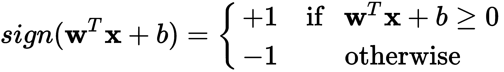

训练一个单神经元

在回顾了数据学习的相关概念后，我们现在将重点关注一个训练最基本神经网络模型的算法：**感知机**。我们将探讨使该算法运作所需的步骤及停止条件。本章将呈现感知机模型，作为第一个代表神经元的模型，旨在以简单的方式从数据中学习。感知机模型对于理解从数据中学习的基础和高级神经网络模型至关重要。本章还将讨论与非线性可分数据相关的问题和考虑因素。

在本章结束时，你应该能够自如地讨论感知机模型，并应用其学习算法。你将能够在数据是线性可分或非线性可分的情况下实现该算法。

具体来说，本章涵盖以下主题：

+   感知机模型

+   感知机学习算法

+   感知机与非线性可分数据

# 第七章：感知机模型

回到第一章，*机器学习简介*，我们简要介绍了神经元的基本模型和**感知机学习算法**（**PLA**）。在本章中，我们将重新审视并扩展这一概念，并展示如何用 Python 编码实现它。我们将从基本定义开始。

## 视觉概念

感知机是一个类比于人类信息处理单元的模型，最初由 F. Rosenblatt 提出，并在*图 5.1*中描述（Rosenblatt, F. (1958)）。在该模型中，输入由向量表示 ，神经元的激活由函数 给出，输出为 。神经元的参数为  和 ：


图 5.1 – 感知机的基本模型

感知机的*可训练*参数为 ，这些参数是未知的。因此，我们可以使用输入训练数据 来使用 PLA 确定这些参数。从*图 5.1*可以看出， 乘以 ，然后 乘以 ，并且 乘以 1；所有这些乘积相加后，再输入*符号*激活函数，在感知机中，其操作如下：



激活函数的主要目的是将模型的任何响应映射到二进制输出：![]。

现在让我们一般性地讨论一下张量。

## 张量操作

在 Python 中，感知机的实现需要一些简单的张量（向量）操作，可以通过标准的 NumPy 功能来完成。首先，我们可以假设给定的数据![]是一个包含多个向量（矩阵）的向量，表示为![]，以及表示多个单独目标的向量![]。然而，注意到为了便于感知机的实现，需要将包含在中，正如*图 5.1*中所建议的那样，这样可以简化![]中的乘法和加法，如果我们将修改为，并将修改为![]，则可以简化输入![]的感知机响应，具体如下：


请注意，****现在在中是隐式存在的。

假设我们希望获得用于训练的`X`数据集，我们需要为感知机准备这些数据；我们可以通过 scikit-learn 的`make_classification`方法生成一个简单的线性可分数据集，如下所示：

```py
from sklearn.datasets import make_classification

X, y = make_classification(n_samples=100, n_features=2, n_classes=2,
                           n_informative=2, n_redundant=0, n_repeated=0,
                           n_clusters_per_class=1, class_sep=1.5, 
                           random_state=5)
```

在这里，我们使用`make_classification`构造函数生成 100 个数据点（`n_samples`），这 100 个数据点有两个类别（`n_classes`），并且通过足够的分隔度（`class_sep`）使得数据具有线性可分性。然而，生成的数据集在`y`中产生了![]中的二进制值，我们需要将其转换为![]中的值。这可以通过以下简单操作实现：用负目标值替换零目标值：

```py
y[y==0] = -1
```

生成的数据集如*图 5.2*所示：


图 5.2 - 用于感知机测试的二维样本数据

接下来，我们可以通过将一个长度为`N=100`的全 1 向量添加到`X`中，为每个输入向量添加数字 1，具体操作如下：

```py
import numpy as np
X = np.append(np.ones((N,1)), X, 1)    
```

现在，`X`中的新数据包含一个全为 1 的向量。这将简化张量操作的计算![]，适用于所有。考虑矩阵，这个常见的张量操作可以通过一步完成，简单地将其视为。我们甚至可以将这个操作与符号激活函数合并成一步，具体如下：

```py
np.sign(w.T.dot(X[n]))
```

这是数学张量操作![]的等效形式。有了这个概念，让我们使用前面介绍的 dataset 和刚才描述的操作，更详细地回顾 PLA。

# 感知器学习算法

**感知器学习算法**（**PLA**）如下：

**输入**：二分类数据集![]

+   将初始化为零，迭代计数器

+   只要存在任何错误分类的样本：

+   选取一个被错误分类的样本，记作，其真实标签是

+   按如下方式更新：

+   增加迭代计数器，![]，并重复

**返回**：

现在，让我们看看这在 Python 中是如何实现的。

## Python 中的 PLA

这里有一个 Python 实现，我们将逐部分讨论，部分内容已被讨论过：

```py
N = 100 # number of samples to generate
random.seed(a = 7) # add this to achieve for reproducibility

X, y = make_classification(n_samples=N, n_features=2, n_classes=2,
                           n_informative=2, n_redundant=0, n_repeated=0,
                           n_clusters_per_class=1, class_sep=1.2, 
                           random_state=5)

y[y==0] = -1

X_train = np.append(np.ones((N,1)), X, 1) # add a column of ones

# initialize the weights to zeros
w = np.zeros(X_train.shape[1])
it = 0

# Iterate until all points are correctly classified
while classification_error(w, X_train, y) != 0:
  it += 1
  # Pick random misclassified point
  x, s = choose_miscl_point(w, X_train, y)
  # Update weights
  w = w + s*x

print("Total iterations: ", it)
```

前几行在本章的*张量操作*部分已讨论过。将初始化为零，通过`w = np.zeros(X_train.shape[1])`完成。该向量的大小取决于输入的维度。然后，`it`只是一个迭代计数器，用于跟踪执行的迭代次数，直到 PLA 收敛为止。

`classification_error()`方法是一个辅助方法，接受当前的参数向量`w`、输入数据`X_train`和相应的目标数据`y`作为参数。该方法的目的是确定当前状态下误分类的点的数量（如果有的话），并返回错误的总数。该方法可以定义如下：

```py
def classification_error(w, X, y):
  err_cnt = 0
  N = len(X)
  for n in range(N):
    s = np.sign(w.T.dot(X[n]))
    if y[n] != s:
      err_cnt += 1    # we could break here on large datasets
  return err_cnt      # returns total number of errors
```

该方法可以简化如下：

```py
def classification_error(w, X, y):
  s = np.sign(X.dot(w))
  return sum(s != y)
```

然而，虽然这种优化方法对于小型数据集很有用，但对于大型数据集来说，可能没有必要计算所有点的误差。因此，第一种（且较长的）方法可以根据预期的数据类型进行使用和修改，如果我们知道将处理大型数据集，可以在第一次遇到误差时就跳出该方法。

我们代码中的第二个辅助方法是`choose_miscl_point()`。该方法的主要目的是随机选择一个被误分类的点（如果有的话）。它的参数包括当前的参数向量`w`、输入数据`X_train`和对应的目标数据`y`。它返回一个误分类点`x`以及该点对应的目标符号`s`。该方法可以按如下方式实现：

```py
def choose_miscl_point(w, X, y):
  mispts = []
  for n in range(len(X)):
    if np.sign(w.T.dot(X[n])) != y[n]:
      mispts.append((X[n], y[n]))
  return mispts[random.randrange(0,len(mispts))]
```

同样，也可以通过随机化索引列表、遍历它们并返回第一个找到的点来优化速度，如下所示：

```py
def choose_miscl_point(w, X, y):
 for idx in random.permutation(len(X)):
   if np.sign(w.T.dot(X[idx])) != y[idx]:
     return X[idx], y[idx]
```

然而，第一种实现方式对绝对初学者或者那些想要对误分类点进行额外分析的人来说非常有用，这些误分类点可以方便地保存在`mispts`列表中。

无论实现方式如何，关键点是要随机选择误分类的点。

最后，更新是通过使用当前参数、误分类点和对应的目标，通过执行`w = w + s*x`的方式完成的。

如果你运行完整的程序，它应该输出类似这样的内容：

```py
Total iterations: 14
```

总迭代次数可能会根据数据类型和误分类点选择的随机性质而有所不同。对于我们使用的特定数据集，决策边界可能看起来像*图 5.3*所示：


图 5.3 – 使用 PLA 找到的决策边界

迭代次数还将取决于特征空间中数据点之间的分隔或间隙。间隙越大，越容易找到解决方案，反之亦然。最坏的情况是当数据是非线性可分时，我们将在接下来讨论这一点。

# 在非线性可分数据上的感知器

如前所述，当数据是可分离时，感知器将在有限时间内找到解决方案。然而，找到解决方案所需的迭代次数取决于数据组在特征空间中彼此的距离。

**收敛**是指学习算法找到一个解决方案，或者达到一个被学习模型设计者接受的稳定状态。

接下来的段落将讨论在不同类型数据上的收敛性：线性可分和非线性可分。

## 对线性可分数据的收敛性

对于我们在本章中研究的特定数据集，两个数据组之间的分离度是一个可变参数（这通常是实际数据中的一个问题）。该参数是`class_sep`，可以取任意实数；例如：

```py
X, y = make_classification(..., class_sep=2.0, ...)
```

这使我们能够研究当改变分隔参数时，感知机算法收敛所需的平均迭代次数。实验设计如下：

+   我们将分隔系数从大到小变化，记录其收敛所需的迭代次数：2.0、1.9、...、1.2、1.1。

+   我们将重复进行此实验 1000 次，并记录平均迭代次数及其对应的标准差。

请注意，我们决定将实验运行到 1.1，因为 1.0 已经生成了一个非线性可分的数据集。如果我们进行实验，我们可以将结果记录在表格中，结果如下：

| **运行** | **2.0** | **1.9** | **1.8** | **1.7** | **1.6** | **1.5** | **1.4** | **1.3** | **1.2** | **1.1** |
| --- | --- | --- | --- | --- | --- | --- | --- | --- | --- | --- |
| 1 | 2 | 2 | 2 | 2 | 7 | 10 | 4 | 15 | 13 | 86 |
| 2 | 5 | 1 | 2 | 2 | 4 | 8 | 6 | 26 | 62 | 169 |
| 3 | 4 | 4 | 5 | 6 | 6 | 10 | 11 | 29 | 27 | 293 |
| ... | ... | ... | ... | ... | ... | ... | ... | ... | ... | ... |
| 998 | 2 | 5 | 3 | 1 | 9 | 3 | 11 | 9 | 35 | 198 |
| 999 | 2 | 2 | 4 | 7 | 6 | 8 | 2 | 4 | 14 | 135 |
| 1000 | 2 | 1 | 2 | 2 | 2 | 8 | 13 | 25 | 27 | 36 |
| **平均值** | **2.79** | **3.05** | **3.34** | **3.67** | **4.13** | **4.90** | **6.67** | **10.32** | **24.22** | **184.41** |
| **标准差** | **1.2** | **1.3** | **1.6** | **1.9** | **2.4** | **3.0** | **4.7** | **7.8** | **15.9** | **75.5** |

该表格显示，当数据分隔得很好时，迭代次数的平均值相对稳定；然而，当分隔间隔减小时，迭代次数显著增加。为了更直观地展示这一点，表格中的相同数据现在以*图 5.4*的对数刻度形式展示：


图 5.4 - 当数据组靠得越来越近时，PLA 迭代次数的增长

很明显，当分隔间隔变小的时候，迭代次数会呈指数级增长。*图 5.5*显示了最大的分隔间隔 2.0，并且表明 PLA 在四次迭代后找到了一个解：


图 5.5 - 感知机在分隔间隔为 2.0 时，找到了解，迭代了四次。

同样，*图 5.6*显示，当分隔间隔最大时，1.1，PLA 需要 183 次迭代；仔细查看图形可以发现，后者的解比较难找到，因为数据组之间的距离太近：


图 5.6 - 感知机在分隔间隔为 1.1 时，找到了一个解，迭代了 183 次。

如前所述，非线性可分的数据可以通过设置 1.0 的间隔来生成，PLA 将进入无限循环，因为总会有一个数据点被错误分类，而 `classification_error()` 方法将永远不会返回零值。对于这种情况，我们可以修改 PLA 以允许在非线性可分的数据上找到解决方案，接下来的部分将讨论这一点。

## 对非线性可分数据的收敛

对原始 PLA 的修改相当简单，但足以在大多数情况下找到一个可接受的解决方案。我们需要向 PLA 添加的主要两项内容如下：

+   防止算法永远运行下去的机制

+   存储最佳解决方案的机制

关于第一点，我们可以简单地指定一个算法停止的迭代次数。关于第二点，我们可以简单地将一个解决方案保存在存储中，并将其与当前迭代的解决方案进行比较。

这里展示了 PLA 的相关部分，新的变化已用粗体标出，稍后将进行详细讨论：

```py
X, y = make_classification(n_samples=N, n_features=2, n_classes=2,
 n_informative=2, n_redundant=0, n_repeated=0,
 n_clusters_per_class=1, class_sep=1.0, 
 random_state=5)

y[y==0] = -1

X_train = np.append(np.ones((N,1)), X, 1) # add a column of ones

# initialize the weights to zeros
w = np.zeros(X_train.shape[1])
it = 0
bestW = {}
bestW['err'] = N + 1 # dictionary to keep best solution
bestW['w'] = []
bestW['it'] = it

# Iterate until all points are correctly classified
#   or maximum iterations (i.e. 1000) are reached
while it < 1000:
 err = classification_error(w, X_train, y)
 if err < bestW['err']:   # enter to save a new w
 bestW['err'] = err
 bestW['it'] = it
 bestW['w'] = list(w)
 if err == 0:  # exit loop if there are no errors
 break
  it += 1
  # Pick random misclassified point
  x, s = choose_miscl_point(w, X_train, y)
  # Update weights
  w += s*x

print("Best found at iteration: ", bestW['it'])
print("Number of misclassified points: ", bestW['err'])
```

在这段代码中，`bestW` 是一个字典，用来追踪到目前为止的最佳结果，并且它被初始化为合理的值。首先需要注意的是，循环现在被数字 1,000 限制，这是你当前允许的最大迭代次数，你可以根据需要将其更改为任何你想要的最大迭代次数。对于大数据集或高维数据集，每次迭代的代价较高时，减少这个数字是合理的。

接下来的变化是加入了条件语句 `if err < bestW['err']`，它决定了是否应该存储一组新的参数。每当通过总误分类样本数确定的误差低于存储参数的误差时，便会进行更新。为了完整性，我们还需要检查是否存在误差，这意味着数据是线性可分的，已找到解决方案，循环需要终止。

最后几个 `print` 语句将仅仅输出记录最佳解决方案时的迭代次数和误差。输出可能如下所示：

```py
Best found at iteration: 95
Number of misclassified points: 1
```

该输出是通过在数据集上运行更新后的 PLA 生成的，数据集的分隔度为 1.0，如*图 5.7*所示：


图 5.7 – 更新后的 PLA 在 95 次迭代后找到一个解决方案，只有一个误分类点

从图中可以看到，正类中有一个样本被错误分类。知道在这个例子中总共有 100 个数据点，我们可以确定准确率为 99/100。

这种存储*迄今为止最佳解决方案*的算法，通常被称为**口袋算法**（Muselli，M. 1997）。而学习算法的提前终止思想则受到著名数值优化方法的启发。

其中一个普遍的限制是感知器只能生成基于二维空间中的一条直线或多维空间中的一个线性超平面的解决方案。然而，这个限制可以通过将多个感知器组合在一起，并放置在多个层中，轻松解决，从而为可分离和不可分离的问题生成高度复杂的非线性解决方案。这将是下一章的主题。

# 总结

本章介绍了经典感知器模型的概述。我们讨论了理论模型及其在 Python 中的实现，适用于线性和非线性可分数据集。到此为止，你应该足够自信，能够自己实现感知器。你应该能够在神经元的上下文中识别感知器模型。此外，你现在应该能够在感知器或任何其他学习算法中实现口袋算法和提前终止策略。

由于感知器是为深度神经网络铺平道路的最基本元素，在我们在此介绍了它之后，下一步是进入第六章，*训练多层神经元*。在这一章中，你将接触到使用多层感知器算法进行深度学习的挑战，比如用于误差最小化的梯度下降技术，以及超参数优化以实现泛化。但在你前往那里之前，请尝试通过以下问题进行自我测试。

# 问答

1.  **数据的可分性与 PLA 迭代次数之间有什么关系？**

随着数据组之间的接近，迭代次数可能呈指数增长。

1.  **PLA 会一直收敛吗？**

并不总是，只有在数据是线性可分的情况下。

1.  **PLA 可以在非线性可分数据上收敛吗？**

不行。然而，你可以通过修改它，使用例如口袋算法，来找到一个可接受的解决方案。

1.  **为什么感知器如此重要？**

因为它是最基本的学习策略之一，帮助我们构思了学习的可能性。如果没有感知器，科学界可能需要更长时间才能意识到基于计算机的自动学习算法的潜力。

# 参考文献

+   Rosenblatt, F. (1958). The perceptron: a probabilistic model for information storage and organization in the brain. *Psychological review*, 65(6), 386.

+   Muselli, M. (1997). On convergence properties of the pocket algorithm. *IEEE Transactions on Neural Networks*, 8(3), 623-629.
