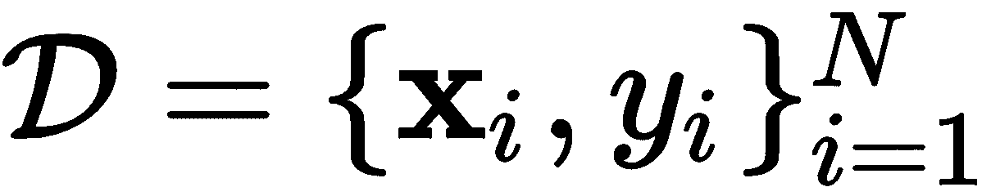
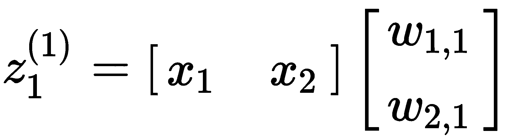
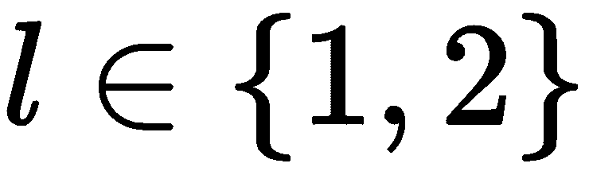
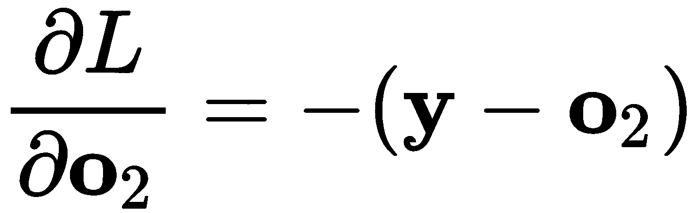

训练多个神经元层

在之前的第六章中，*单神经元训练*一节，我们探讨了涉及单一神经元和感知器概念的模型。感知器模型的一个限制是，最多只能在多维超平面上产生线性解。然而，通过使用多个神经元和多个神经元层来产生高度复杂的非线性解，针对可分和不可分问题，这一限制可以轻松解决。本章将带你了解深度学习的第一个挑战，使用**多层感知器**（**MLP**）算法，例如用于误差最小化的梯度下降技术，接着是超参数优化实验，以确定可靠的准确性。

本章将涵盖以下主题：

+   MLP 模型

+   最小化误差

+   寻找最佳超参数

# 第八章：MLP 模型

我们之前在第五章中，*单神经元训练*一节中，已经看到 Rosenblatt 的感知器模型对于某些问题来说既简单又强大（Rosenblatt, F. 1958）。然而，对于更复杂和高度非线性的问题，Rosenblatt 没有充分关注他连接了更多神经元并采用不同架构的模型，包括更深的模型（Tappert, C. 2019）。

多年后，在 1990 年代，2019 年图灵奖得主 Geoffrey Hinton 教授继续致力于将更多神经元连接在一起，因为这种方式比单一神经元更像大脑（Hinton, G. 1990）。如今，大多数人知道这种方法被称为*联结主义*。其主要思想是以不同的方式连接神经元，从而模拟大脑中的连接。第一个成功的模型之一是 MLP，它使用基于监督梯度下降的学习算法，通过标记数据学习逼近一个函数，，。

*图 6.1*展示了一个包含多个神经元的 MLP，它指示了输入是如何通过权重与所有神经元连接的，这些权重激活神经元以产生一个较大的（非零）数值响应，具体取决于需要*学习*的变量权重：


图 6.1 – 单隐藏层中的多个感知器

为了完整性，*图 6.2*展示了相同的架构，但以竖直方向呈现；它还用浅灰色表示正权重，用深灰色表示负权重。*图 6.2*旨在展示某些特征可能比其他特征更能激活某些神经元：


图 6.2 – MLP，权重采用灰度编码：浅灰色表示正权重，深灰色表示负权重

基于*图 6.2*，顶部的神经元层被称为**输入层**。这些特征与称为**隐藏层**的不同神经元连接。这个层通常至少包含一层神经元，但在深度学习中，它可能包含更多层。

**关于输入层附近权重的解释**：MLP 和感知机之间的一个关键区别是，除非隐藏层仅包含一个神经元，否则输入层中权重的解释在 MLP 中会丧失。通常，在感知机中，你可以认为某些特征的重要性与直接与这些特征相关联的值（权重）有直接的关系。例如，最负权重相关联的特征被认为会对结果产生负面影响，而最正权重相关联的特征也会显著地影响结果。因此，在感知机（和线性回归）中，查看权重的绝对值可以帮助我们了解特征的重要性。在 MLP 中则不然；涉及的神经元越多，层数越多，解释权重和特征重要性的可能性就越小。你不应过于依赖第一层的权重来推断特征的重要性。要小心。

从*图 6.1*中，我们可以看到神经元，，被简化为意味着有某种非线性激活函数，![]，作用在标量上，标量是通过加上特征和与这些特征及神经元相关的权重的乘积得到的，。在更深的 MLP 层中，输入不再是来自输入层的数据，，而是来自前一层的输出：。我们将在下一节对符号进行一些更改，以更正式地描述这个过程。

目前，你需要知道的是，MLP 比感知机要好得多，因为它能够学习高度复杂的非线性模型。而感知机只能提供线性模型。但这种强大的能力也伴随着巨大的责任。MLP 有一个非凸且不平滑的损失函数，这限制了学习过程的实现，尽管已经取得了很多进展，但这些问题仍然存在。另一个缺点是，学习算法可能需要其他超参数来确保算法的成功（收敛）。最后，值得注意的是，MLP 需要对输入特征进行预处理（归一化），以减轻神经元在特定特征上过拟合的问题。

现在，让我们来看看学习过程是如何实际发生的。

# 最小化误差

使用 MLP 从数据中学习是其诞生以来的一个主要问题。正如我们之前指出的，神经网络面临的一个主要问题是更深层模型的计算可行性，另一个问题是稳定的学习算法，能够收敛到合理的最小值。机器学习的一个重大突破，也是为深度学习铺平道路的，是基于反向传播的学习算法的开发。许多科学家在 1960 年代独立推导并应用了不同形式的反向传播；然而，大多数功劳归于 G. E. Hinton 教授及其团队（Rumelhart, D. E. 等，1986 年）。在接下来的几段中，我们将详细介绍这个算法，其唯一目的是**最小化错误**，以减少在训练过程中由于预测不准确而导致的误差。

首先，我们将描述这个名为**螺旋**（spirals）的数据集。*这是一个广为人知的基准数据集，具有两个可分的类别，但这些类别是高度非线性的。正负类别在二维空间的相对两侧盘绕，随着从中心向外扩展，如*图 6.3*所示：*


图 6.3 - 来自双螺旋基准数据集的示例数据

可以使用以下 Python 函数生成该数据集：

```py
def twoSpirals(N):
  np.random.seed(1)
  n = np.sqrt(np.random.rand(N,1)) * 780 * (2*np.pi)/360
  x = -np.cos(n)*n
  y = np.sin(n)*n
  return (np.vstack((np.hstack((x,y)),np.hstack((-x,-y)))), 
          np.hstack((np.ones(N)*-1,np.ones(N))))

X, y = twoSpirals(300)  #Produce 300 samples
```

在这个代码片段中，我们将接收一个`X`的两列矩阵，其行是螺旋数据集的样本，而`y`包含相应的目标类别，来自集合。*图 6.3*是基于前面的代码片段生成的，包含 300 个样本。

我们还将使用一个非常简单的多层感知机（MLP）架构，该架构仅包含一个隐藏层的三个神经元；这只是为了尽可能清晰地解释*反向传播*。所提出的 MLP 如*图 6.4*所示：

反向传播在业内人士中今天被称为**反向传播**（backprop）。*如果你阅读最近的在线讨论，它很可能会被简称为 backprop。*


图 6.4 - 用于基于反向传播学习的简单多层感知机（MLP）架构，应用于螺旋数据集

如*图 6.4*所示的网络架构假设存在一个定义良好的输入向量，包含多个向量，（一个矩阵），表示为 ，以及多个独立的目标向量，。此外，每一层，，都有一个权重矩阵，，这在第一层也是如此。例如，从*图 6.4*中，权重矩阵将如下所示：


。

这些矩阵的值是随机初始化的实际值。隐藏层  由三个神经元组成。每个神经元接收作为输入的 ，这是特征和权重的内积，得到加权的观察值，指向第 *i* 个神经元；例如，对于第一个神经元，计算方式如下：



这里， 表示第一层中第一个神经元的激活函数的输出，在本例中将是一个 sigmoid 函数。

Sigmoid 激活函数表示为 。这个函数很有趣，因为它会将输入值压缩，并将其映射到 0 和 1 之间的值。它也是一个很好的用于梯度计算的函数，因为其导数是已知的，且易于计算：。

在 Python 中，我们可以很容易地编写以下 sigmoid 函数代码：

```py
def sigmoid(z, grad=False):
  if grad:
    return z * (1\. - z)
  return 1\. / (1\. + np.exp(-z))
```

最后，输出层由两个神经元组成，在本例中我们将用它们来建模每个目标类别，即正螺旋和负螺旋。

有了这些，我们可以通过反向传播（backprop）来根据梯度的方向调整权重，从而最小化给定标签样本集的误差；更多详细信息，请参考此教程（Florez, O. U. 2017）。我们将按照接下来的步骤进行操作。

## 第 1 步 – **初始化**

我们将执行初始步骤，在此步骤中我们 *随机初始化* 网络权重。在我们的示例中，我们将使用以下值：


在 Python 中，我们可以通过以下方式生成介于 `-1` 和 `1` 之间的这些权重：

```py
w1 = 2.0*np.random.random((2, 3))-1.0
w2 = 2.0*np.random.random((3, 2))-1.0
```

## 第 2 步 – 前向传播

下一步是 **前向传播**。在此步骤中，输入  被传递到输入层，并向前传播到网络中，直到我们在输出层观察到结果向量。我们的小示例中的前向传播如下所示。我们首先对单个样本  进行线性变换，使用第一层中的权重 ：


因此，对于某些情况下的 ![]，我们计算如下：


这将导致以下结果：


然后，我们将  传递通过 sigmoid 函数并得到 ，这就是第一隐藏层中三个神经元的输出。结果如下：


这可以这样实现：

```py
o1 = sigmoid(np.matmul(X, w1))
```

以一种有趣的方式来看待我们在第一层所取得的成果，我们已经将二维的输入数据映射到三维空间，现在这些数据将被处理以便观察输出再回到二维空间。

同样的过程会在后续的隐藏层中重复。在我们的例子中，我们只会为输出层再做一次。我们计算如下：


这导致了以下计算结果：


这导致了以下结果：


同样，我们将  通过 sigmoid 函数传递，并得到 ，这是输出层中两个神经元的输出。这导致了以下结果：


我们的实现方式如下：

```py
o2 = sigmoid(np.matmul(o1, w2))
```

此时，我们需要为这个输出赋予一些意义，以便确定下一步的操作。我们希望在这两个神经元中建模的是输入数据  属于正类在  中的概率，以及属于负类在  中的概率。下一步是建立一个误差度量来进行学习。

误差度量，或称误差函数，也叫做**损失**函数。

## 第 3 步 – 计算损失

下一步是定义并**计算总损失**。在第四章《从数据中学习》中，我们讨论了一些误差度量（或损失），例如**均方误差**（**MSE**）：


思考这个损失函数的导数非常重要，因为我们希望根据该损失函数提供的梯度调整网络的权重。因此，我们可以进行小的调整，这些调整不会影响学习过程的整体结果，但能得到很好的导数。例如，如果我们对  取导数，平方将导致乘以 2 的因子，但我们可以通过稍微修改 MSE，加入除以 2 的操作，来抵消这一影响，具体如下：


因此，这个损失可以用来确定预测与实际目标结果的“偏差”有多大。在前面的例子中，期望的结果如下：


预测的响应如下所示：


这是正常的，因为权重是随机初始化的；因此，模型的表现较差是可以预期的。可以通过使用现代方法进一步改进网络，这些方法对权重采取过大值进行惩罚。在神经网络中，总是存在*梯度爆炸*或*梯度消失*的风险，而减少大梯度影响的一种简单方法是限制权重能够取的数值范围。这被广泛称为**正则化**。它还带来了其他良好的特性，例如*sparse*（稀疏）模型。我们可以通过以下方式修改损失函数来实现这种正则化：


这个损失函数可以如下实现：

```py
L = np.square(y-o2).sum()/(2*N) + lambda*(np.square(w1).sum()+np.square(w2).sum())/(2*N)
```

添加的正则化项将每层中的所有权重相加，并根据![] 参数对大的权重进行惩罚。这是一个超参数，需要我们自己进行微调。一个大的![]值会对任何大权重进行重罚，而一个小的![]值则忽略权重在学习过程中的任何影响。这就是我们将在此模型中使用的损失函数，值得注意的是，正则化项也是容易求导的。

## 第 4 步 – 反向传播

下一步是执行**反向传播**。目标是根据损失的大小调整权重，并朝着减少损失的方向进行调整。我们首先计算关于输出层权重的偏导数 ，然后计算关于第一层权重的偏导数 。

我们通过解决第一个偏导数来开始*反向传播*。我们可以通过使用著名的链式法则来做到这一点，该法则允许我们将主导数分解成表示相同过程的多个部分；我们可以按如下方式进行：


在这里，  适用于所有的 。如果我们独立定义这些偏导数的每一部分，我们就得到了以下结果：




这三个偏导数每次都有一个精确的解。在我们的例子中，它们的值将如下所示：


现在，由于我们需要更新权重， ，我们需要一个 3 x 2 的矩阵，因此，我们可以通过以下方式将偏导数的向量相乘来获得这个更新：


为了得到这个结果，我们首先需要对右侧的两个小向量进行逐元素乘法，然后通过左侧转置向量执行常规乘法。在 Python 中，我们可以这样做：

```py
dL_do2 = -(y - o2)
do2_dz2 = sigmoid(o2, grad=True)
dz2_dw2 = o1
dL_dw2 = dz2_dw2.T.dot(dL_do2*do2_dz2) + lambda*np.square(w2).sum()
```

现在我们已经计算了导数，我们可以使用传统的梯度缩放因子来更新权重，这个因子被称为**学习率**。我们计算新的值，如下所示：


**学习率**是我们在机器学习中用来限制导数在更新过程中影响的一种机制。记住，导数被解释为在给定输入数据下，权重变化的速率。一个*大*的学习率过多地决定了导数的方向和幅度，存在跳过良好局部最小值的风险。一个*小*的学习率则仅部分考虑了导数的信息，可能导致朝局部最小值的进展非常缓慢。学习率是需要调整的另一个超参数。

现在，我们继续计算下一个导数，，这将使我们能够计算关于的更新。我们首先定义偏导数并尝试简化其计算，如下所示：


如果我们仔细关注第一个偏导数，，我们可以注意到其导数定义如下：


但下划线部分已经在之前计算过了！注意，下划线部分等价于在先前定义方程中的下划线部分：


这是一个很好的性质，得益于微分链式法则，它使我们能够*重复利用*计算，并拥有一个更加高效的学习算法。这个优良的性质还告诉我们，实际上我们正在将更深层的信息融入到靠近输入的层中。现在，我们继续进行每个偏导数的单独计算，因为我们已经完成了一部分工作。

由于，那么第一项可以表示为：


在我们的示例中，这会导致以下结果：


现在，偏导数中的第二项可以如下计算：


这导致了以下向量：


完成这些后，我们现在能够计算最后一项，可以直接按如下方式计算：


最后，我们可以将每个偏导数的结果代入链式法则的乘积中：


通过重新排列向量以获得与权重矩阵维度一致的结果矩阵，即可获得此结果。乘法运算得到以下结果：


在 Python 中，我们这样做：

```py
dL_dz2 = dL_do2 * do2_dz2
dz2_do1 = w2
dL_do1 = dL_dz2.dot(dz2_do1.T)
do1_dz1 = sigmoid(o1, grad=True)
dz1_dw1 = X
dL_dw1 = dz1_dw1.T.dot(dL_do1*do1_dz1) + lambda*np.square(w1).sum()
```

最后，相应的更新计算如下：


通过在迭代（*epoch*）时分配![]来完成反向传播算法，具体实现如下：

```py
w1 += -alpha*dL_dw1
w2 += -alpha*dL_dw2
```

这个过程会根据我们希望的时期（epochs）重复进行。我们可以使用以下参数让算法运行：


然后，得到的分离超平面将如下图所示：


图 6.5 - 分离三神经元 MLP 的超平面

该图显示有许多样本被错误分类，这些错误分类的样本以黑点表示。总准确率为 62%。显然，三个神经元足以产生一个比随机猜测更好的分类器；然而，这并不是最理想的结果。接下来，我们必须通过调整超参数和神经元或层的数量来调优分类器。这就是我们接下来要讨论的内容。

# 寻找最佳超参数

使用 Keras 编码，我们可以用一种更简单的方式实现我们在上一节中编写的代码。我们可以依赖于反向传播算法已经被正确编码，并且经过改进以增强稳定性，同时还有一套丰富的其他特性和算法可以提升学习过程。在我们开始优化 MLP 的超参数之前，应该指出，使用 Keras 时的等效实现是什么。以下代码应该重现相同的模型、几乎相同的损失函数和几乎相同的反向传播方法：

```py
from tensorflow.keras.models import Sequential
from tensorflow.keras.layers import Dense

mlp = Sequential()
mlp.add(Dense(3, input_dim=2, activation='sigmoid'))
mlp.add(Dense(2, activation='sigmoid'))

mlp.compile(loss='mean_squared_error',
            optimizer='sgd',
            metrics=['accuracy'])

# This assumes that you still have X, y from earlier
# when we called X, y = twoSpirals(300)
mlp.fit(X, y, epochs=1000, batch_size=60)
```

这将产生 62.3%的错误率和如*图 6.7*所示的决策边界：


图 6.6 – 基于 Keras 的 MLP，和*图 6.5*中的模型相同

该图与*图 6.6*非常相似，预期如此，因为它们是相同的模型。但让我们简要回顾一下代码中描述的模型含义。

如前所述，`from tensorflow.keras.models import Sequential`导入了 Sequential 库，它允许我们创建一个*顺序模型*，而不是*函数式*模型创建方法，`mlp = Sequential()`，它还允许我们向模型中添加元素，`mlp.add()`，例如多个神经元层（全连接层）：`Dense(...)`。

顺序模型的第一层必须指定输入的维度（输入层大小），在本例中为 `2`，并指定激活函数为 sigmoid：`mlp.add(Dense(3, input_dim=2, activation='sigmoid'))`。这里的数字 `3` 表示该模型在第一隐藏层中将有多少个神经元。

第二层（也是最后一层）类似，但表示输出层中的两个神经元：`mlp.add(Dense(2, activation='sigmoid'))`。

一旦指定了顺序模型，我们必须对其进行编译，`mlp.compile(...)`，定义要最小化的损失函数，`loss='mean_squared_error'`，要使用的优化（反向传播）算法，`optimizer='sgd'`，以及在每个训练周期后报告的度量列表，`metrics=['accuracy']`。这里定义的均方损失函数不包括前面提到的正则化项，但这不应对结果产生更大影响；因此，损失函数是我们之前见过的：


`sgd` 优化器定义了一种算法，称为 **随机梯度下降**。这是一种计算梯度并相应更新权重的稳健方法，自 20 世纪 50 年代以来就已经出现了[Amari, S. I. 1993]。在 Keras 中，默认的 *学习率* 是 ；然而，该学习率有衰减策略，使学习率能够根据学习过程进行调整。

鉴于此，我们将调整以下超参数：

+   学习率，，是自适应的。

+   层数为 2、3 或 4，每层 16 个神经元（输出层除外）。

+   激活函数，可以是 ReLU 或 sigmoid。

这可以通过进行多次交叉验证实验来实现，正如在第四章《从数据中学习》中所解释的那样。下表展示了在五折交叉验证下执行的实验和相应的结果：

| **实验** | **超参数** | **平均准确率** | **标准差** |
| --- | --- | --- | --- |
| `a` | (16-Sigmoid, 2-Sigmoid) | 0.6088 | 0.004 |
| `b` | (16-ReLU, 2-Sigmoid) | 0.7125 | 0.038 |
| `c` | (16-Sigmoid, 16-Sigmoid, 2-Sigmoid) | 0.6128 | 0.010 |
| `d` | (16-ReLU, 16-Sigmoid, 2-Sigmoid) | 0.7040 | 0.067 |
| `e` | (16-Sigmoid, 16-Sigmoid, 16-Sigmoid, 2-Sigmoid) | 0.6188 | 0.010 |
| `f` | (16-ReLU, 16-Sigmoid, 16-ReLU, 2-Sigmoid) | 0.7895 | 0.113 |
| `g` | (16-ReLU, 16-ReLU, 16-Sigmoid, 2-Sigmoid) | **0.9175** | 0.143 |
| `h` | (16-ReLU, 16-ReLU, 16-ReLU, 2-Sigmoid) | 0.9050 | 0.094 |
| `i` | (16-ReLU, 16-Sigmoid, 16-Sigmoid, 2-Sigmoid) | 0.6608 | 0.073 |

请注意，另有一些实验是加上了第五层进行的，但在平均性能和变异性方面并未显著提高。看来，四层，每层仅有 16 个神经元（除了输出层为 2 个神经元），就足以产生足够的类别分离。*图 6.8* 展示了来自实验 `g` 的一个样本运行，达到了 99% 的最高准确率：


图 6.7 – 使用四层（16,16,16,2）神经网络对两个螺旋数据集的分类边界。对应于表 1 中的实验 g。

对 *图 6.8* 进行视觉检查可以发现，最大的混淆边缘位于螺旋的起始中心区域，那里两条螺旋非常接近。还可以注意到，分隔超平面在某些区域似乎是不平滑的，这通常是 MLP 的特点。有些人认为，这一现象是由于输入层的神经元使用线性函数来近似某个函数，而更深层的神经元则是线性函数的混合体，这些混合体基于这些线性函数生成非线性函数。当然，情况要复杂得多，但这里值得注意的是这一点。

在我们结束这一章之前，请注意还有其他超参数是我们可以通过经验进行优化的。我们本可以选择不同的优化器，例如 `adam` 或 `rmsprop`；我们本可以尝试其他激活函数，例如 `tanh` 或 `softmax`；我们本可以尝试更多的层数；或者我们本可以尝试更多（或更少）且不同数量的神经元，以递增、递减或混合的顺序。不过，现阶段，这些实验足以表明，实验不同的选项是找到最适合我们特定应用或我们要解决的问题的方法的关键。

这结束了我们的介绍章节，接下来的章节将讨论具有特定用途的架构类型，而不是通常被认为是多用途、基础神经网络的 MLP。我们的下一章将讨论自编码器；它们可以看作是一个特殊类型的神经网络，旨在将输入数据编码成一个更小的维度空间，然后再将其重构回原始输入空间，最小化重构数据中的信息丢失。自编码器允许我们压缩数据，并在没有与数据相关标签的情况下进行学习。后者使得自编码器成为一种特殊的神经网络，采用被归类为**无监督学习**的方法进行学习。

# 摘要

本章是一个中级入门章节，展示了 MLP 的设计及其功能的相关范式。我们讨论了其元素背后的理论框架，并对广为人知的反向传播机制进行了全面的讨论，用于对损失函数进行梯度下降。理解反向传播算法对于后续章节至关重要，因为一些模型专门设计用来克服反向传播可能遇到的一些困难。你应该对你学到的反向传播知识有信心，这将帮助你更好地理解深度学习的本质。反向传播算法，除此之外，是深度学习成为一个令人兴奋的领域的原因之一。现在，你应该能够理解并设计具有不同层和不同神经元的 MLP。此外，你应该有信心去改变其一些参数，尽管我们会在后续阅读中详细讲解更多内容。

第七章，*自编码器*，将继续介绍一种与 MLP 非常相似的架构，这种架构今天被广泛应用于许多不同的学习任务，尤其是与数据表示学习相关的任务。本章开启了一个新的部分，专门讨论基于无监督学习的算法和模型，这种学习方式让你即使在数据没有标签的情况下，也能从中学习。

# 问题与答案

1.  **为什么 MLP 优于感知器模型？**

神经元数量和层数更多的 MLP 使其相对于感知器在建模非线性问题和解决更复杂的模式识别问题上具有优势。

1.  **为什么反向传播如此重要？**

因为它是让神经网络在大数据时代得以学习的关键。

1.  **MLP 总是会收敛吗？**

是的，也不是。它总是会收敛到损失函数的局部最小值；然而，它不能保证收敛到全局最小值，因为通常大多数损失函数都是非凸的和非平滑的。

1.  **我们为什么要尝试优化模型的超参数？**

因为任何人都可以训练一个简单的神经网络；然而，并不是每个人都知道应该改变哪些内容来使其更好。模型的成功在很大程度上取决于你尝试不同的方案，并向自己（和他人）证明你的模型已经是最好的。这将使你成为更好的学习者，也成为更优秀的深度学习专业人员。

# 参考文献

+   Rosenblatt, F. (1958). 感知器：一种用于大脑信息存储和组织的概率模型。*Psychological Review*, 65(6), 386。

+   Tappert, C. C. (2019). 谁是深度学习的奠基人？*人工智能研讨会*。

+   Hinton, G. E. (1990). 连接主义学习程序。*Machine learning*。Morgan Kaufmann, 555-610。

+   Rumelhart, D. E., Hinton, G. E., & Williams, R. J. (1986). 通过反向传播误差学习表示。*Nature*, 323(6088), 533-536。

+   Florez, O. U. (2017). 一次一个乐高：解释神经网络学习的数学原理。*在线*: [`omar-florez.github.io/scratch_mlp/`](https://omar-florez.github.io/scratch_mlp/).

+   Amari, S. I. (1993). 反向传播与随机梯度下降方法。*神经计算*, 5(4-5), 185-196.
