自动编码器

本章通过解释编码层和解码层之间的关系来介绍自动编码器模型。我们将展示一个属于无监督学习范畴的模型。本章还介绍了与自动编码器模型常关联的损失函数，并将其应用于 MNIST 数据的降维及其在自动编码器诱导的潜在空间中的可视化。

本章将涉及以下主题：

+   无监督学习简介

+   编码和解码层

+   降维与可视化的应用

+   无监督学习的伦理影响

# 第十章：无监督学习简介

随着机器学习在过去几年中的发展，我遇到了许多分类不同类型学习的方法。最近，在 2018 年蒙特利尔举行的 NeurIPS 大会上，Alex Graves 博士分享了关于不同类型学习的信息，见*图 7.1*：

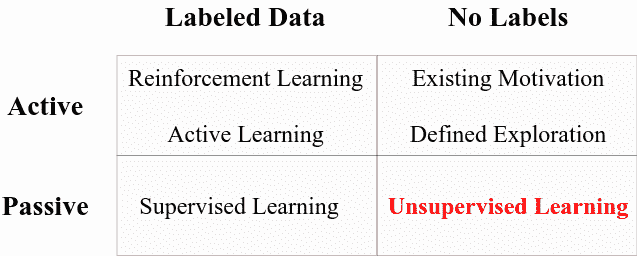

图 7.1 – 不同类型的学习

这种分类方法在今天非常有用，因为目前有许多学习算法正在被研究和改进。第一行描述了*主动*学习，这意味着学习算法与数据之间存在交互。例如，在强化学习和作用于*标记数据*的主动学习中，奖励策略可以指示模型在接下来的迭代中将读取哪种类型的数据。然而，传统的监督学习（即我们迄今为止所学习的内容）不与数据源交互，而是假设数据集是固定的，并且其维度和形状不会改变；这些非交互式方法被称为*被动*学习。

*图 7.1*中表格的第二列代表一种特殊类型的学习算法，它不需要*标签*来从数据中学习。其他算法则要求你拥有一个带有数据的与标签相关联的数据集；也就是说：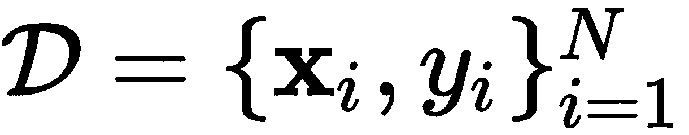。然而，无监督算法不需要标签来“处理”数据。

你可以把标签看作是**老师**。老师告诉学习者**x**对应于![]，然后学习者通过反复试验来尝试学习![]和![]之间的关系，不断调整其*信念*（参数），直到理解正确。然而，如果没有老师，学习者对标签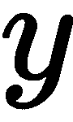一无所知，因此学习者通过自己从中学习*某些东西*，并在一定的边界条件下形成自己对的信念，而永远不会知道的任何信息。

在接下来的章节中，我们将学习**无监督学习**，这是一种假设我们所拥有的数据在形态或形式上不会发生变化，并且在学习过程以及部署过程中保持一致的学习方式。这些算法的指导依据是其他因素，而非标签，例如，针对数据压缩的独特损失函数。另一方面，还有一些算法具有探索机制或特定的动机，以交互方式从数据中学习，这些算法被称为**主动学习**算法。本书不会讨论这些算法，因为本书旨在作为入门教程，适合完全初学者。然而，我们将详细讨论一些最强大的*无监督*深度学习模型。

我们将首先学习**自编码器**。自编码器的唯一目的是将输入数据输入到由两部分组成的神经网络中：**编码器**和**解码器**。编码器部分的任务是对输入数据进行编码，通常是将其压缩到一个低维空间，从而压缩或编码输入数据。模型的解码器部分负责将编码（或压缩）的输入数据的潜在表示重新构建回原始形状和原始值，而不丢失任何数据。也就是说，在理想的自编码器中，输入等于输出。让我们在接下来的章节中更详细地讨论这一点。

# 编码和解码层

自编码器可以分解为两个主要组件，这些组件在无监督学习过程中起到特定的作用。*图 7.2*的左侧展示了一个使用全连接（密集）层实现的自编码器。它接收一些向量作为输入，，然后进入六个隐藏层；前三个层分别有 6、4 和 2 个神经元，目的是将输入数据压缩到二维，因为两个神经元的输出是两个标量值。这个第一组层被称为**编码器**：

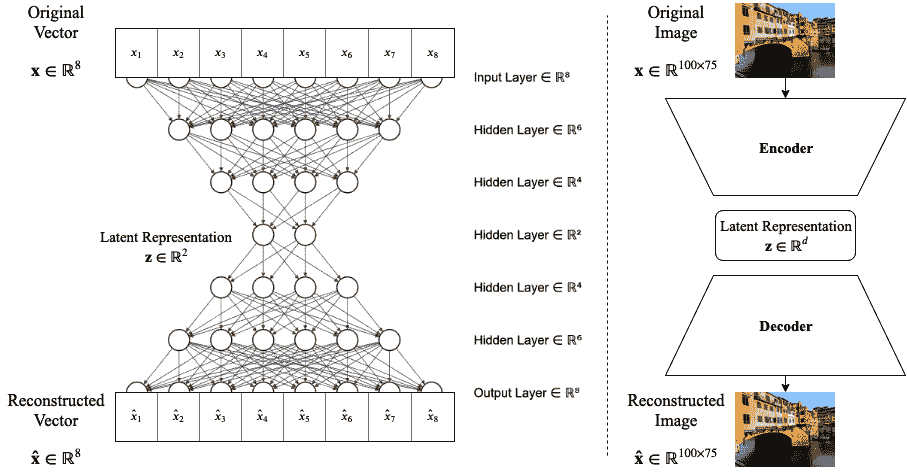

图 7.2 – 自动编码器的两种表示。左侧：完整且描述性的模型。右侧：简洁且抽象的模型表示

第二组神经元用于将输入数据重建回其原始维度和数值！[](img/9d520487-cfc5-48c1-aa44-2e0a69486ce5.png)，它通过三层，分别有 4、6 和 8 个神经元来实现；这一组层被称为**解码器**。

注意，自动编码器的最后一层*必须具有*与输入向量的维度相同的神经元数量。否则，重建结果将无法与输入数据匹配。

在这种情况下，*图 7.2* 左侧显示的自动编码器充当压缩网络，意思是，在训练模型达到良好重建后，如果我们断开解码器，我们就得到了一个神经网络，它将输入数据编码为二维（或我们选择的任何维度）。这相比于监督学习模型，具有独特的优势：在监督学习模型中，我们教网络寻找一个可以与给定目标标签关联的模式；然而，在无监督学习中（比如在这个自动编码器中），网络并不寻找一个特定的模式，而是学习以任何能够保留输入数据最具代表性和最重要信息的方式使用输入空间，从而允许在解码器中进行良好的重建。

想象一个神经网络和一个自动编码器，它们接受猫和狗的图像作为输入；传统的神经网络可以被训练来区分猫和狗，它的任务是寻找狗和猫图像中的重要模式，以便区分它们；然而，自动编码器将训练来学习最重要的模式，所有模式中最具代表性的模式，以便保留这些信息并允许无论标签是什么都能进行良好的重建。从某种程度上说，传统的监督神经网络是带有偏见的，它只能从猫和狗的角度来看待世界，而自动编码器则可以自由地从任何角度学习，不管是猫还是狗。

*图 7.2* 右侧的图示展示了自动编码器的另一种表示，它更加抽象且紧凑。这种表示方式在描述相对深的自动编码器时非常有用，当网络层数多到难以逐一表示所有神经元和所有层时（如*图 7.2* 左侧所示）。我们将使用这些梯形图形来表示编码器/解码器；我们还注意到，这种抽象化将允许我们使用其他类型的层，而不仅仅是密集（全连接）层。*图 7.2* 右侧的图示展示了一个自动编码器，该编码器将图像作为输入，接着将输入编码到*d-*维空间，然后将*潜在*向量重建回输入（图像）空间。

**潜在空间**是一个映射学习到的低维模式的空间。它也被称为 *学习到的表示空间*。理想情况下，这个潜在空间包含关于输入数据的重要信息，而且其维度少于输入数据，同时不会丢失任何信息。

现在我们来实现每个自编码器部分，基于左侧的简单模型，如 *图 7.2* 所示。

## 编码层

我们将使用的 TensorFlow 和 Keras 库包括来自 `tensorflow.keras.layers` 的 `Input` 和 `Dense`，以及来自 `tensorflow.keras.models` 的 `Model`。我们将采用 `keras` 的函数式方法，而不是 *顺序* 建模。请导入以下内容：

```py
from tensorflow.keras.layers import Input, Dense
from tensorflow.keras.models import Model
```

`Input` 层将用来描述输入向量的维度，在我们的例子中是 `8`：

```py
inpt_dim = 8
ltnt_dim = 2 

inpt_vec = Input(shape=(inpt_dim,))
```

然后，考虑到所有的激活函数都为 `sigmoid`，仅仅为了这个例子，我们可以如下定义编码器各层的流水线：

```py
elayer1 = Dense(6, activation='sigmoid')(inpt_vec)
elayer2 = Dense(4, activation='sigmoid') (elayer1)
encoder = Dense(ltnt_dim, activation='sigmoid') (elayer2)
```

`Dense` 类构造函数接收神经元数量和激活函数作为参数，在定义的末尾（右侧）我们必须包括该层的输入，这个输入在左侧赋予名称。因此，在代码行 `elayer1 = Dense(6, activation='sigmoid')(inpt_vec)` 中，分配给该层的名称是 `elayer1`，`6` 是神经元数量，`activation='sigmoid'` 为该密集层分配了 `sigmoid` 激活函数，而 `inpt_vec` 是该层的输入。

在前面三行代码中，我们定义了编码器的各层，而 `encoder` 变量指向可以输出潜在变量的对象，如果我们将其作为模型并调用 `predict()` 方法：

```py
latent_ncdr = Model(inpt_vec, encoder)
```

在这一行代码中，`latent_ncdr` 包含可以将输入数据映射到潜在空间的模型，一旦训练完成。但在此之前，让我们以类似的方式定义解码器的各层。

## 解码层

我们可以如下定义解码器各层：

```py
dlayer1 = Dense(4, activation='sigmoid')(encoder)
dlayer2 = Dense(6, activation='sigmoid') (dlayer1)
decoder = Dense(inpt_dim, activation='sigmoid') (dlayer2)
```

请注意，在前面的代码中，神经元的数量通常是递增的，直到最后一层与输入维度匹配。在此案例中，4、6 和 8 被定义为 `inpt_dim`。类似地，`decoder` 变量指向能够输出重建输入的对象，如果我们将其作为模型并调用 `predict()` 方法。

我们故意将编码器和解码器分开，仅仅是为了展示如果需要的话，我们可以访问网络的不同组件。然而，我们可能也应该将自编码器从输入到输出作为一个整体来定义，使用 `Model` 类，如下所示：

```py
autoencoder = Model(inpt_vec, decoder)
```

这正是我们之前所说的“如果我们将其做成一个模型并调用 `predict()`”的意思。这个声明实际上是在创建一个模型，它以`inpt_vec`中定义的输入向量作为输入，并从`decoder`层中获取输出。然后，我们可以使用这个模型对象，它在 Keras 中有一些方便的功能，允许我们传入输入、读取输出、训练以及进行其他我们将在接下来的章节中讨论的操作。现在，由于我们已经定义了模型，并且在训练之前，我们需要定义训练的目标，也就是我们的损失函数。

## 损失函数

我们的损失函数必须与自编码器的目标相关。这个目标是完美地重建输入。也就是说，在理想的自编码器中，我们的输入 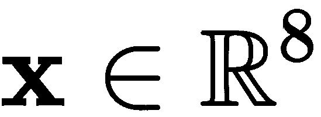 和我们的重建 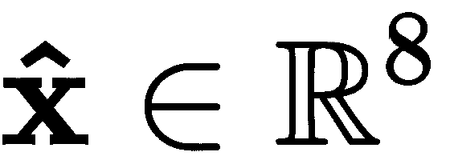 必须是相同的。这意味着它们之间的绝对差异必须为零：

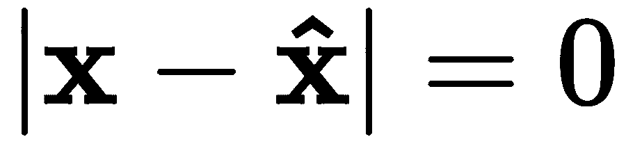

然而，这可能不太现实，并且它并不是一个我们容易求导的函数。为此，我们可以回到经典的均方误差函数，其定义如下：

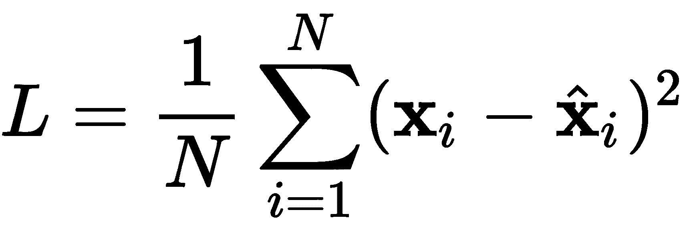

我们希望使 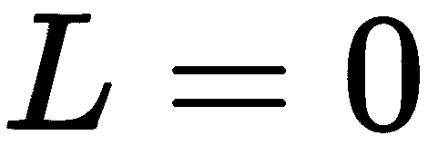 变得理想，或者至少尽可能将其最小化。我们将这个损失函数解释为最小化输入与其重建之间的平方差的平均值。如果我们使用标准的反向传播策略，比如某种标准的梯度下降技术，我们可以像下面这样编译模型并准备训练：

```py
autoencoder.compile(loss='mean_squared_error', optimizer='sgd')
```

`compile()` 方法为训练做好准备。先前定义的损失函数作为参数传入，`loss='mean_squared_error'`，这里选择的优化技术被称为**随机梯度下降** (**SGD**)*，* `optimizer='sgd'`。有关 SGD 的更多信息，请参见 Amari, S. I. (1993)。

## 学习与测试

由于这是一个简单自编码器的入门示例，我们将只使用一个数据点进行训练，并开始学习过程。我们还希望展示编码版本和重建版本。

我们将使用数字 39 的二进制表示，作为八位数字，它对应于 00100111\. 我们将声明其为我们的输入向量，具体如下：

```py
import numpy as np
x = np.array([[0., 0., 1., 0., 0., 1., 1., 1.]])
```

然后我们可以执行如下的训练：

```py
hist = autoencoder.fit(x, x, epochs=10000, verbose=0)

encdd = latent_ncdr.predict(x)
x_hat = autoencoder.predict(x)
```

`fit()` 方法执行训练。它的前两个参数是输入数据和期望的目标输出；在自编码器的情况下，它们都是 `x`。训练的轮次通过 `epochs=10000` 来指定，因为此时模型已经能够生成不错的输出，我们将冗余输出设置为零，使用 `verbose=0`，因为我们不需要可视化每个 epoch。

在 Google Colab 或 Jupyter Notebook 中，一次性在屏幕上可视化超过 1,000 个时期并不是一个好主意。网页浏览器可能会对负责显示所有这些时期的 JavaScript 代码无响应。请注意。

在潜在编码器模型`latent_ncdr`和`autoencoder`模型中的`predict()`方法会在指定的层产生输出。如果我们检索`encdd`，我们可以看到输入的潜在表示，如果我们检索`x_hat`，我们可以看到重建。我们甚至可以手动计算均方误差，如下所示：

```py
print(encdd)
print(x_hat)
print(np.mean(np.square(x-x_hat)))  # MSE
```

这产生了以下输出：

```py
[[0.54846555 0.4299447 ]]
[[0.07678119 0.07935049 0.91219556 0.07693048 0.07255505 0.9112366 0.9168126 0.9168152 ]]
0.0066003498745448655
```

这里的数字会因为学习算法的非监督特性而有所变化。第一个输出向量可以是任意实数。第二个输出向量可能会有接近零和接近一的实数，类似于原始的二进制向量，但确切的值每次都会有所不同。

第一个由两个元素组成的向量是潜在表示，[0.55, 0.43]；此时这可能对我们来说意义不大，但在数据压缩方面，它将非常重要。这意味着我们可以用两个数字来表示八个数字。

虽然这只是一个玩具示例，用两位数字表示二进制数并不是非常令人兴奋，但其背后的理论是，我们可以取[0, 1]范围内的任意八个浮点数，并将它们压缩到同一范围内的两个数字中。

第二个显示的向量显示了良好重建的证据：应该是零的东西是 0.08，应该是一的东西是 0.91。手动计算的**均方误差**（**MSE**）为 0.007，虽然不是零，但足够小以达到良好的效果。

我们可以使用在调用`fit()`时定义的`hist`对象中存储的信息来可视化训练阶段的 MSE 衰减过程。该对象包含跨时期的损失函数值信息，并允许我们使用以下代码可视化该过程：

```py
import matplotlib.pyplot as plt

plt.plot(hist.history['loss'])
plt.title('Model reconstruction loss')
plt.ylabel('MSE')
plt.xlabel('Epoch')
plt.show()
```

这产生了您在*图 7.3*中看到的内容：

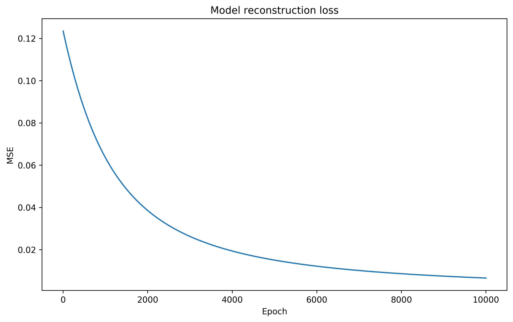

图 7.3 – 自编码器训练过程中的重建损失随时期的变化

好吧，再次强调，这只是一个使用一个数据点的玩具示例。我们在*现实生活*中绝不会这样做。为了展示这是一个多么糟糕的主意，我们可以取用于训练模型的二进制字符串并反转每一个位，得到 11011000（或者十进制的 216）。如果我们将这个输入给自编码器，我们期望会有一个*良好的*重建，但让我们看看如果我们尝试这样做会发生什么：

```py
x = np.array([[1., 1., 0., 1., 1., 0., 0., 0.]])  #216

encdd = latent_ncdr.predict(x)
x_hat = autoencoder.predict(x)

print(encdd)
print(x_hat)
print(np.mean(np.square(x-x_hat)))
```

我们得到以下输出：

```py
[[0.51493704 0.43615338]]
[[0.07677279 0.07933337 0.9122421 0.07690183 0.07254466 0.9112378 0.9167745 0.91684484]]
0.8444848864148122
```

再次强调，这里的数字会因为学习算法的非监督特性而有所变化。如果您的结果与此处所见不同（我敢肯定会有），那也没有问题。

如果将这些结果与之前的结果进行比较，你会发现潜在表示并没有太大变化，且重构输出与给定输入完全不匹配。显然，模型**记住**了它所训练的输入。当我们计算均方误差 (MSE) 并得到 0.84 时，可以看出这个值相比之前获得的要大得多。

解决方法当然是增加更多数据。但这仅是构建自编码器的玩具示例。从此之后，真正变化的是数据的类型和数量、层数以及层的类型。在下一节中，我们将探讨简单自编码器在降维问题中的应用。

# 在降维和可视化中的应用

自编码器的一些最有趣的应用之一是降维 [Wang, Y., 等 (2016)]。鉴于我们生活在一个数据存储易于访问且价格合理的时代，当前到处都有大量数据被存储。然而，并非所有数据都是相关的信息。举个例子，考虑一个始终朝一个方向的家庭安防摄像头的视频录制数据库。可以想象，每一帧视频或图像中有大量重复数据，且收集的数据中只有极少部分是有用的。我们需要一种策略来查看这些图像中真正重要的部分。图像本身具有大量冗余信息，且图像区域之间通常存在相关性，这使得自编码器在压缩图像信息时非常有用 (Petscharnig, S., 等 (2017))。

为了展示自编码器在图像降维中的适用性，我们将使用著名的 MNIST 数据集。

## MNIST 数据准备

有关 MNIST 的详细信息，请参阅第三章，*准备数据*。在这里，我们只提到 MNIST 数据将被缩放到范围[0, 1]。我们还需要通过将 28 x 28 的数字图像重塑为 784 维的向量来将所有图像转换为向量。可以通过以下方式实现：

```py
from tensorflow.keras.datasets import mnist

(x_train, y_train), (x_test, y_test) = mnist.load_data()

x_train = x_train.astype('float32') / 255.
x_test = x_test.astype('float32') / 255.

x_train = x_train.reshape((len(x_train), 28*28))
x_test = x_test.reshape((len(x_test), 28*28))
```

我们将使用 `x_train` 来训练自编码器，并使用 `x_test` 来测试自编码器对 MNIST 数字的编码和解码泛化能力。出于可视化目的，我们将需要 `y_test`，但由于我们不需要在无监督学习中使用标签，`y_train` 可以忽略。

*图 7.4* 描述了 `x_test` 中的前八个样本。这些样本将在多个实验中用于展示不同自编码器模型的能力：

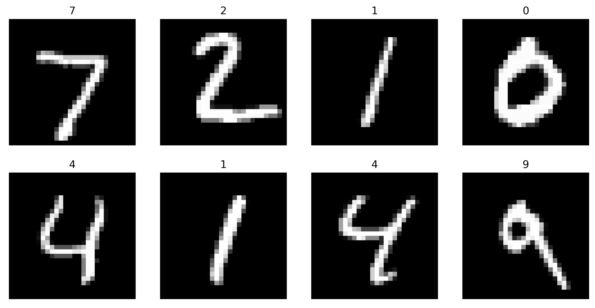

图 7.4 – 用于比较的测试 MNIST 数字

## MNIST 的自编码器

我们可以设计几个不同层数的实验，以观察自编码器在 MNIST 上的性能变化。我们可以从一个四层的自编码器开始，始终使用一个二的潜在维度。这样做是为了方便在自编码器引导的二维空间中可视化 MNIST 数字。

基于之前定义的自编码器，我们可以提出以下四层基础自编码器：

```py
inpt_dim = 28*28
ltnt_dim = 2

inpt_vec = Input(shape=(inpt_dim,))

elayer1 = Dense(392, activation='sigmoid')(inpt_vec)
elayer2 = Dense(28, activation='sigmoid') (elayer1)
elayer3 = Dense(10, activation='sigmoid') (elayer2)
encoder = Dense(ltnt_dim, activation='tanh')(elayer3)

dlayer1 = Dense(10, activation='sigmoid')(encoder)
dlayer2 = Dense(28, activation='sigmoid')(dlayer1)
dlayer3 = Dense(392, activation='sigmoid')(dlayer2)
decoder = Dense(inpt_dim, activation='sigmoid')(dlayer3)

latent_ncdr = Model(inpt_vec, encoder)
autoencoder = Model(inpt_vec, decoder)

autoencoder.compile(loss='binary_crossentropy', optimizer='adam')

hist = autoencoder.fit(x_train, x_train, epochs=100, batch_size=256, 
                       shuffle=True, validation_data=(x_test, x_test))
```

这将是后续模型的基础。这里有一些新的内容需要特别强调，并需要适当介绍。首先要介绍的一个重要内容是一个新的激活函数，叫做**双曲正切**。这个激活函数的定义如下：

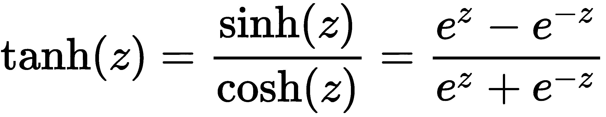

相应的第一导数相对简单：

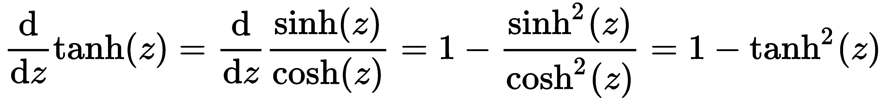

除了拥有一个漂亮且易于计算的导数外，双曲正切激活函数还具有一个良好的输出范围[-1, 1]。这提供了一个中立的范围，不必局限于 sigmoid 范围[0, 1]。为了可视化的目的，有时在双曲正切范围内可视化是很有趣的，但并非必须这么做。

我们引入的另一个新元素是称为**二元交叉熵**的损失函数：

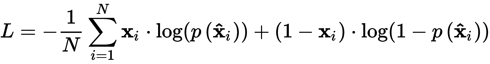

通常，二元交叉熵使用信息，这是理论上的一种方法，用来计算目标数据  和重构（或预测）数据  之间的误差。从某种意义上说，它衡量了目标和预测之间的熵或惊讶量。例如，在理想的自编码器中，目标  与其重构  相等并不令人惊讶，损失应该为零。然而，如果目标  不等于 ，这将是令人惊讶的，并且会产生较大的损失。

关于使用交叉熵损失的自编码器的更完整讨论，请参见(Creswell, A., et. al. (2017))。

还引入了一种新的优化器，叫做**Adam**（Kingma, D. P., et. al. (2014)）。它是一种用于随机优化的算法，使用自适应学习率，在某些深度学习应用中已被证明非常快速。当我们处理深度学习模型和大数据集时，速度是一个重要的特性。时间至关重要，而 Adam 提供了一种非常有效的方法，已经变得相当流行。

最后，我们添加的新内容是在`fit()`方法中。你应该已经注意到有两个新的参数：`shuffle=True`，它允许在训练过程中对数据进行洗牌；以及`validation_data=( , )`，它指定了一个数据元组，用于监控使用验证数据的损失，验证数据是模型从未见过的，也不会用于训练。

这就是我们所介绍的所有新内容。下一步将解释我们在实验中尝试的自编码器架构。请参见*图 7.5*，以作为我们将进行的实验的参考：

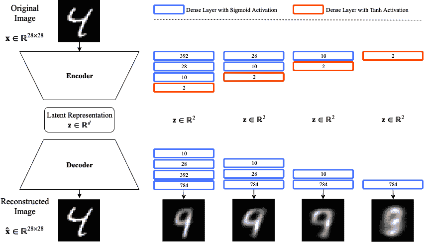

图 7.5 – 不同的自编码器配置，展示潜在表示质量的差异

在图中，你会注意到我们使用的是自编码器的抽象表示，而*图 7.5*的右侧展示了每个自编码器架构将使用的不同层。第一个架构对应于本节中展示的代码。也就是说，代码展示了一个自编码器，其中编码层分别有 392、28、10 和 2 个神经元；解码层则分别有 10、28、392 和 784 个神经元。右侧的下一个模型包含相同的层，只是删除了对应于 392 个神经元的那一对层，依此类推。

最后一个自编码器模型仅包含两层，一层编码（两个神经元）和一层解码（784 个神经元）。此时，你应该能够修改 Python 代码，删除必要的层，并复制*图 7.5*中展示的模型。下一步是训练*图 7.5*中的模型，并可视化输出质量。

## 训练与可视化

执行`autoencoder.fit()`进行 100 轮训练，生成一个可行的模型，能够轻松地按要求将数据编码为二维。仔细观察训练过程中的损失函数，我们可以看到它已经正确收敛：

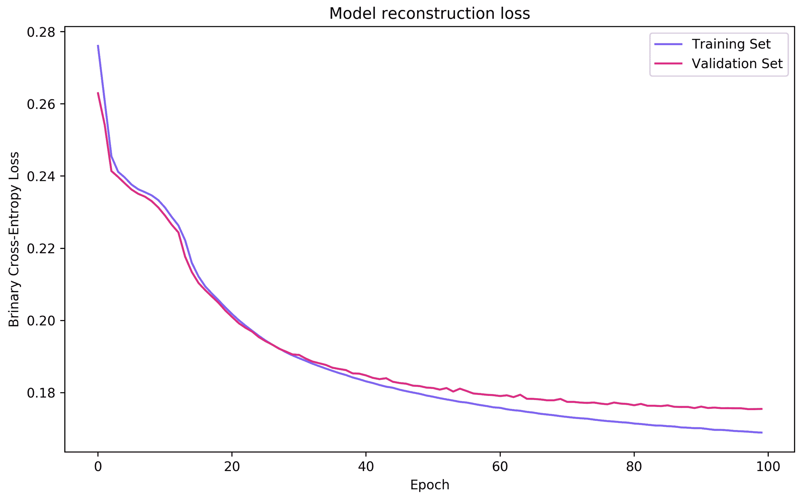

图 7.6 – 四层自编码器训练过程中损失函数的监控

一旦模型成功训练完成，我们可以使用以下方法来提取编码后的表示：

```py
encdd = latent_ncdr.predict(x_test)
```

我们使用的是测试集`x_test`。此编码将按要求压缩为二维，并生成一个范围为[-1, 1]的潜在表示。类似地，我们总是可以拿测试集，使用自编码器对其进行压缩和重构，看看输入和重构结果有多相似。我们可以用以下方式进行：

```py
x_hat = autoencoder.predict(x_test)
```

在我们研究 MNIST 学到的潜在表示之前，可以先看看重建质量，作为评估学习模型质量的一种方式。*图 7.7* 显示了使用*图 7.4*作为参考的每个模型输入的重建结果（在`x_hat`中）。该图分为四部分，每一部分对应*图 7.5*中描述的模型：a) 八层模型，b) 六层模型，c) 四层模型，d) 两层模型：

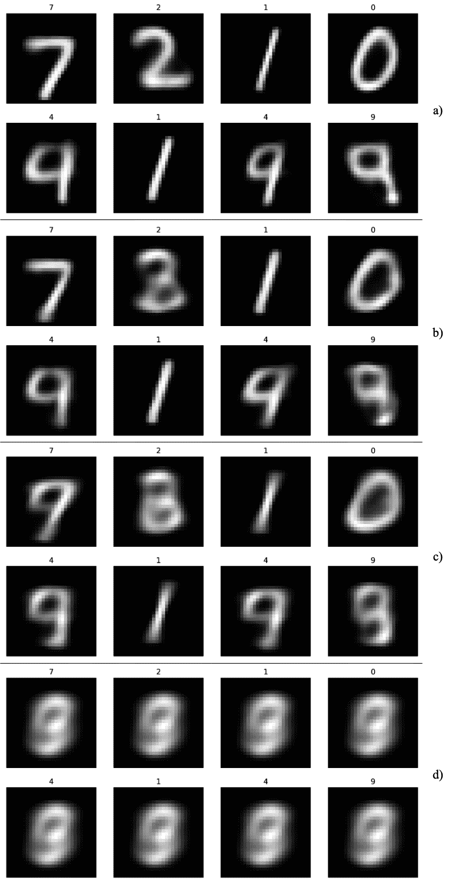

图 7.7 – 图 7.5 中模型的自编码器重建：a) 八层模型，b) 六层模型，c) 四层模型，d) 两层模型

从*图 7.7.a*中，我们可以看到，具有八层（392、28、10、2、10、28、392、784）的模型在重建结果上表现普遍良好，除了数字 4 和 9。显然，这两个数字在视觉上非常相似，因此自编码器很难清楚地区分这两个数字。为了进一步探索这一观察，我们可以将测试数据在潜在空间中可视化（在`encdd`中），如*图 7.8*所示：

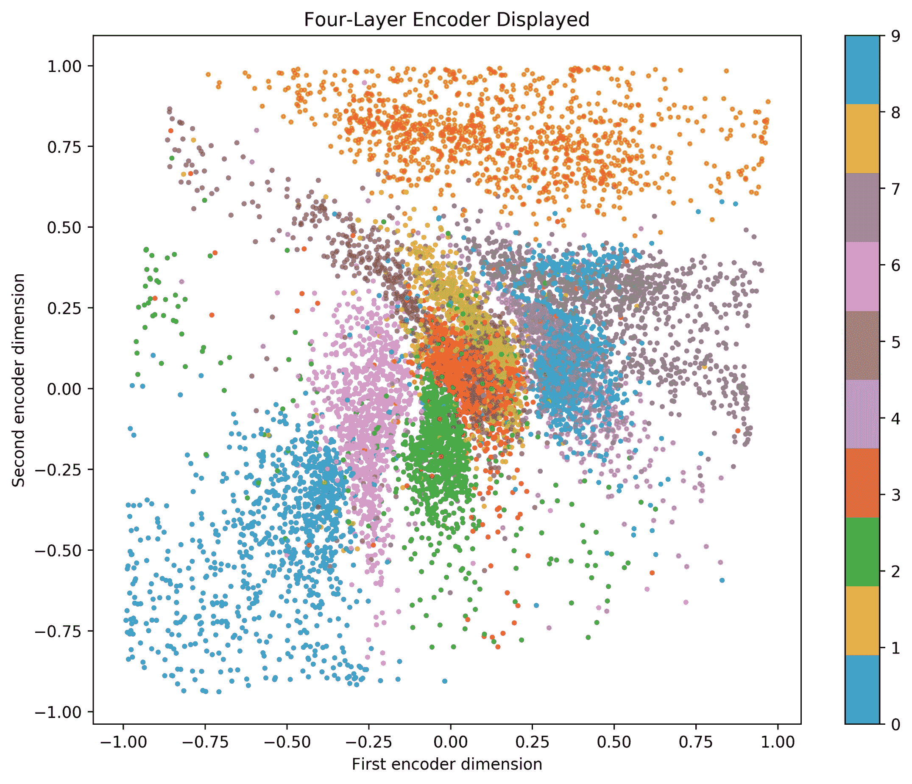

图 7.8 – 使用 MNIST 测试数据的四层编码器

在自编码器生成的潜在空间中，数字四和九之间的重叠非常明显。然而，大多数其他数字组之间有相对清晰的独立簇。*图 7.8* 也解释了其他相似数字之间的自然接近性；例如，一和七看起来彼此接近，零和六也是如此，三和八也如此。然而，那些看起来不相似的数字则位于潜在空间的对立部分——例如，零和一。

*图 7.9* 描述了移除了 392 个神经元层的三层自编码器，保留了 28、10、2 神经元的架构。显然，潜在空间的质量显著降低，尽管一些主要结构保持一致。也就是说，零和一位于对立面，其他看起来相似的数字更为接近；与*图 7.8*相比，重叠度更大。这个三层自编码器的质量持续较低，如*图 7.7.b*所示：

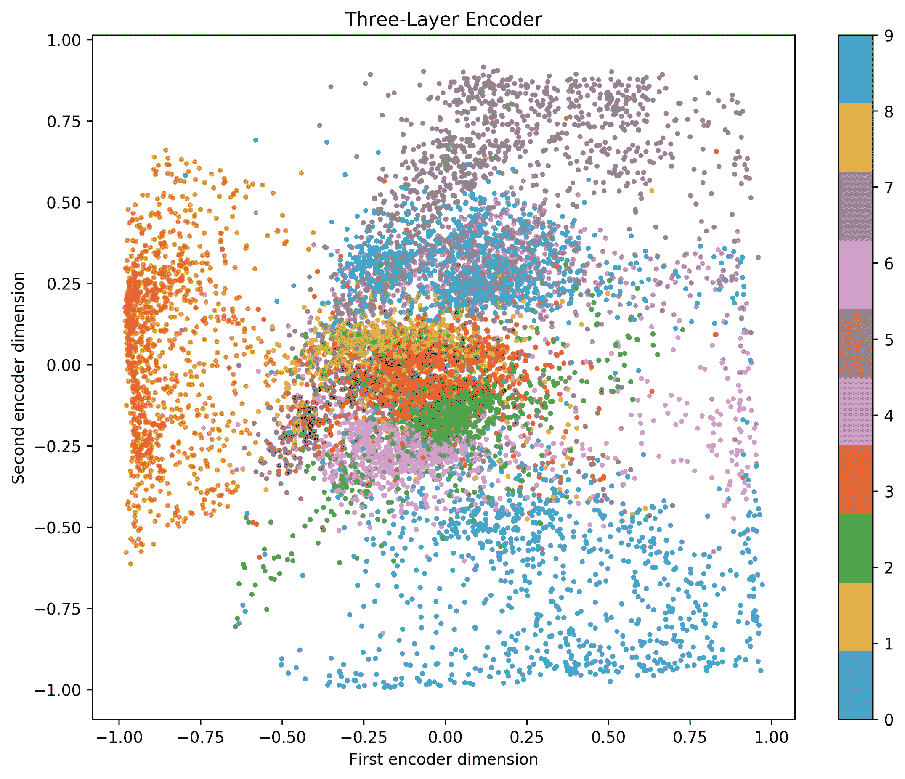

图 7.9 – 使用 MNIST 测试数据的三层编码器

在*图 7.10*中，我们可以观察到具有 10 和 2 个神经元的两层自编码器的结果，与之前的自编码器相比，数字重叠度更大；这一点在*图 7.7.c*中表现得尤为明显，重建效果较差：

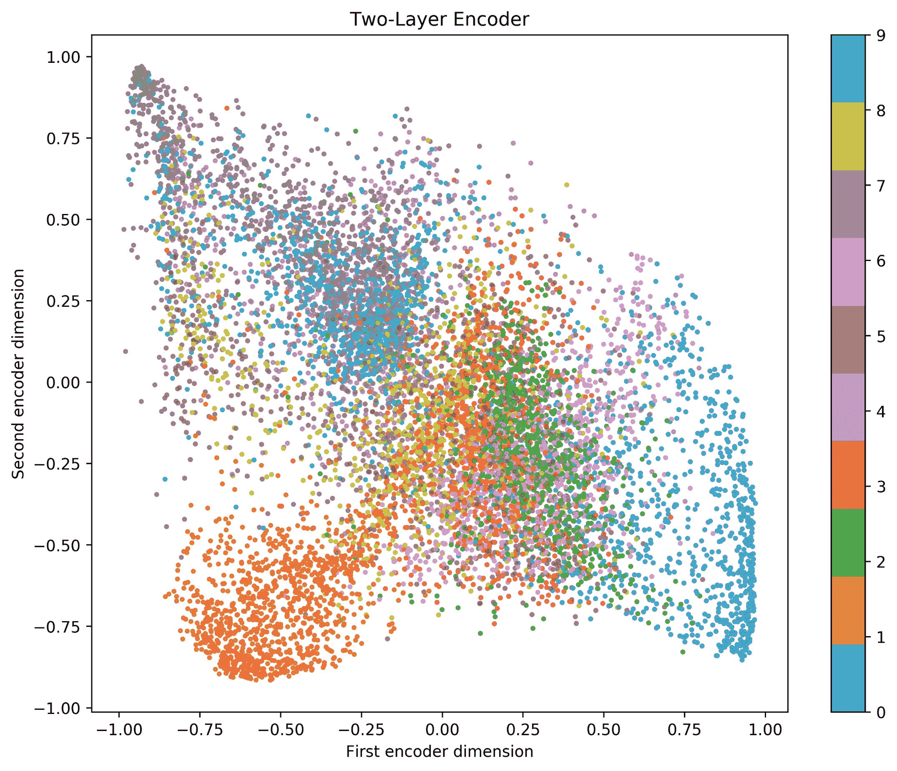

图 7.10 – 使用 MNIST 测试数据的两层编码器

最后，*图 7.11* 显示了单层自编码器的潜在空间。显然，这是一个糟糕的主意。只要考虑我们要求自编码器做什么：我们要求仅仅两个神经元找到一种方式来查看数字的整个图像，并找到一种方法（学习权重 ![]）将所有图像映射到二维空间。这根本不可能做到。从逻辑上讲，如果我们只有一层，我们至少需要 10 个神经元才能充分建模 MNIST 中的 10 个数字：

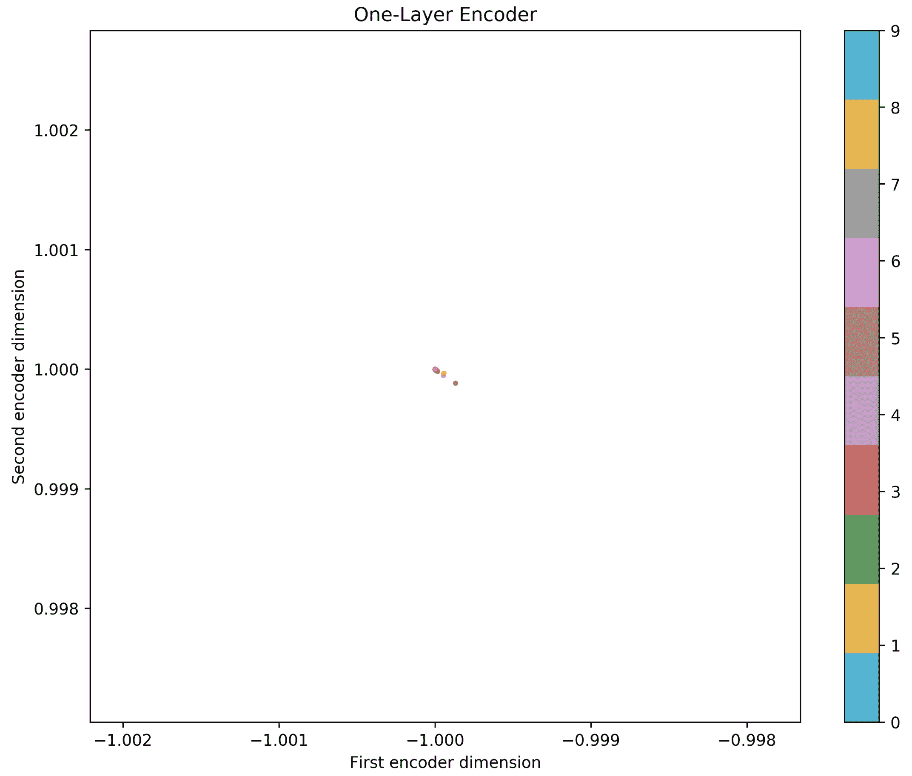

图 7.11 – 使用 MNIST 测试数据的单层编码器 – 一个糟糕的主意

对 *图 7.11* 的仔细观察也表明，轴的尺度变化略微不同；这可以解释为编码器无法将所有 MNIST 数字分离到潜在空间的不同区域。实际上，除非输入空间的维度已经非常低，否则请不要使用层数和神经元很少的自编码器。正如本实验所示，自编码器在深层配置中可能更成功。在下一章中将学习更多关于深度自编码器的内容。

# 无监督学习的伦理影响

无监督学习，比如我们在之前探讨的自编码器中看到的，并不是魔法。它是成熟的，并且有非常严格的边界，这些边界是已知且预先定义的。它没有能力学习数据所给定限制之外的新事物。记住，正如本章引言部分所解释的，无监督学习是**被动**学习。

然而，即使是最强大的无监督学习模型，也存在伦理风险。一个主要的问题是，它们在处理异常值或可能包含边缘案例的数据时会造成困难。例如，假设有大量关于 IT 招聘的数据，其中包含候选人的工作经验、当前薪资以及掌握的编程语言。如果这些数据大部分都是关于具有相同编程语言经验的候选人，只有少数人懂 Python，那么那些懂 Python 的候选人可能会被放置到一个难以清晰可视化的边界或区域，因为模型已经学会了，Python 作为一种不常见的语言，可能在数据压缩、降维或数据可视化方面不相关。此外，想象一下，5 年后，即使出现了在 5 年前训练时未知的编程语言，你仍然使用那个模型。这时模型可能无法正确映射这些信息，以供可视化或数据压缩应用使用。

你必须非常小心选择用于训练自编码器的数据，且拥有多样化的案例对于任何模型的可靠性都至关重要。如果数据缺乏多样性，自编码器将倾向于只从一个输入空间中学习。假设你在先前提到的 10 个 MNIST 数字的图像上训练自编码器——你不会期望自编码器在猫的图像上表现良好；那样做是错误的，并且很可能产生不想要的结果。例如，当使用人的图像时，你必须确保训练数据中有足够的多样性和广泛性，以便进行适当的训练，并且模型能够对未包含在训练数据中的人类图像做出正确的反应。

# 总结

本章展示了自编码器是非常简单的模型，可以用于对数据进行编码和解码，应用于不同的目的，比如数据压缩、数据可视化，以及仅保留重要特征的潜在空间的发现。我们展示了自编码器中神经元的数量和层数对模型成功的重要性。更深（更多层）和更宽（更多神经元）的特征通常是好模型的关键，尽管这可能导致训练时间变慢。

在这一点上，你应该知道监督学习和无监督学习在被动学习方面的区别。你也应该能够熟练地实现自编码器的两个基本组成部分：编码器和解码器。同样，你应该能够修改自编码器的架构，微调它以实现更好的性能。以本章中讨论的例子为例，你应该能够将自编码器应用于降维问题或数据可视化问题。此外，你还应该考虑使用无监督学习算法时与训练数据相关的风险和责任。

第八章，*深度自编码器*，将继续介绍比本章所涉及的更深更宽的自编码器架构。下一章将介绍深度置信网络的概念及其在深度无监督学习中的重要性。通过介绍深度自编码器并与浅层自编码器进行对比，来解释这些概念。该章还将提供关于优化神经元数量和层数以最大化性能的重要建议。

# 问题与答案

1.  **过拟合对自编码器来说是坏事吗？**

其实不是。你希望自编码器出现过拟合！也就是说，你希望它能够精确地在输出中重现输入数据。然而，这里有一个警告。你的数据集必须相对于模型的大小足够大；否则，数据的记忆将会阻碍模型在未见过的数据上的泛化能力。

1.  **为什么我们在编码器的最后一层使用了两个神经元？**

仅用于可视化目的。由两个神经元产生的二维潜在空间使我们能够轻松地在潜在空间中可视化数据。在下一章中，我们将使用其他配置，这些配置不一定具有二维潜在空间。

1.  **自编码器到底有什么酷的地方？**

它们是简单的神经网络模型，无需教师进行学习（无监督学习）。它们不会偏向于学习特定的标签（类别）。通过迭代观察，它们学习数据的世界，旨在学习最具代表性和相关性的特征。它们可以用作特征提取模型，但我们将在未来的章节中进一步讨论这一点。

# 参考文献

+   Amari, S. I. (1993). 反向传播与随机梯度下降方法。*Neurocomputing*, 5(4-5), 185-196.

+   Wang, Y., Yao, H., & Zhao, S. (2016). 基于自编码器的降维方法。*Neurocomputing*, 184, 232-242.

+   Petscharnig, S., Lux, M., & Chatzichristofis, S. (2017). 使用深度学习和自编码器进行图像特征的降维。发表于*第十五届国际基于内容的多媒体索引研讨会*（第 23 页）。ACM。

+   Creswell, A., Arulkumaran, K., & Bharath, A. A. (2017). 关于通过最小化二元交叉熵训练去噪自编码器的研究。*arXiv 预印本* arXiv:1708.08487.

+   Kingma, D. P., & Ba, J. (2014). Adam：一种随机优化方法。arXiv 预印本 arXiv:1412.6980.
