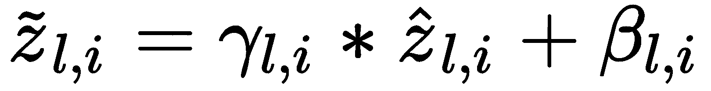
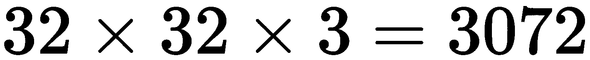
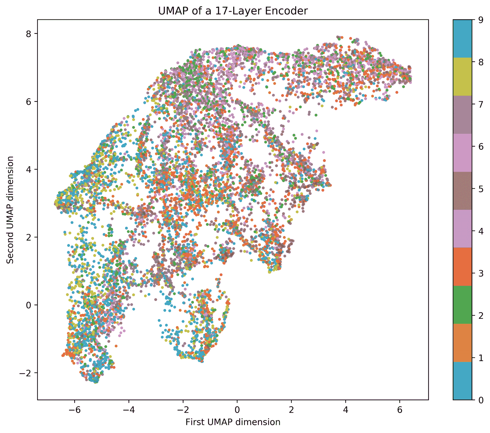
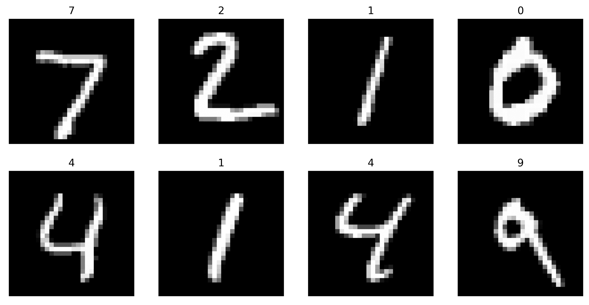

深度自编码器

本章介绍了深度信念网络的概念及这种深度无监督学习方式的重要性。通过引入深度自编码器以及两种有助于创建稳健模型的正则化技术，来解释这些概念。这些正则化技术——批量归一化和丢弃法，已被证明能促进深度模型的学习，并广泛应用。我们将在 MNIST 数据集和一个更具挑战性的彩色图像数据集 CIFAR-10 上展示深度自编码器的强大能力。

在本章结束时，你将能够体会到构建深度信念网络的好处，观察到它们在建模和输出质量方面的优势。你将能够实现自己的深度自编码器，并证明对于大多数任务，深层模型比浅层模型更优。你将熟悉批量归一化和丢弃法策略，以优化模型并最大化性能。

本章结构如下：

+   介绍深度信念网络

+   构建深度自编码器

+   使用深度自编码器探索潜在空间

# 第十一章：介绍深度信念网络

在机器学习中，有一个领域在讨论**深度学习**（**DL**）时常常被提及，叫做**深度信念网络**（**DBNs**）（Sutskever, I. 和 Hinton, G. E. (2008)）。一般而言，这个术语也用于指基于图的机器学习模型，例如著名的**限制玻尔兹曼机**。然而，DBNs 通常被视为深度学习家族的一部分，其中深度自编码器是该家族中最为突出的成员之一。

深度自编码器被视为 DBNs 的一种形式，因为在前向传播过程中，有些潜在变量仅对单层可见。这些层的数量通常比单层自编码器要多。深度学习（DL）和 DBNs 的一项核心原则是，在学习过程中，不同层次之间代表着不同的知识。这些知识表示是通过*特征学习*获得的，并且没有偏向特定的类别或标签。此外，研究表明，这种知识表现出层次结构。例如，考虑图像；通常，靠近输入层的层学习的是低阶特征（如边缘），而更深的层学习的是高阶特征，即明确的形状、模式或物体（Sainath, T. N. 等人（2012））。

在深度信念网络（DBN）中，与大多数深度学习模型一样，特征空间的可解释性可能很困难。通常，查看第一层的权重可以提供有关学习的特征和/或特征图外观的信息；然而，由于更深层中的高非线性，特征图的可解释性一直是一个问题，需要谨慎考虑（Wu, K., 等人（2016））。尽管如此，DBN 在特征学习方面仍然表现出色。在接下来的几节中，我们将介绍在高度复杂数据集上的更深层版本的自编码器。我们将引入几种新型的层，以展示模型可以有多深。

# 构建深度自编码器

只要自编码器有不止一对层（一个编码层和一个解码层），它就可以被称为*深度*自编码器。在自编码器中堆叠层是提高其特征学习能力的好策略，能够找到在分类或回归应用中具有高度判别性的独特潜在空间。然而，在第七章《自编码器》中，我们已经介绍了如何在自编码器上堆叠层，我们将再次这样做，但这次我们将使用一些新的层类型，这些层超出了我们之前使用的全连接层。它们是**批量归一化**和**丢弃**层。

这些层中没有神经元；然而，它们作为具有非常具体目的的机制，在学习过程中发挥作用，通过防止过拟合或减少数值不稳定性，能够带来更成功的结果。让我们讨论一下这些层，然后我们将在几个重要的数据集上继续实验这两种层。

## 批量归一化

批量归一化自 2015 年被引入深度学习（Ioffe, S., 和 Szegedy, C. (2015)）以来，已经成为深度学习的一个重要组成部分。它是一项重大变革，因为它具有几个优点：

+   它可以防止被称为**消失梯度**或**爆炸梯度**的问题，这在递归网络中非常常见（Hochreiter, S. (1998)）。

+   它可以通过充当学习模型的正则化器，从而加快训练过程（Van Laarhoven, T. (2017)）。

这些属性的总结以及我们将用于表示批量归一化的块图像显示在*图 8.1*中：


图 8.1 – 批量归一化层的主要属性

被数据科学家称为*批量归一化*的机制，通过为梯度计算提供稳定性，并调整它们如何影响神经网络不同层权重的更新，从而加速了训练或模型的收敛。这是因为它可以防止梯度消失或爆炸，这是基于梯度的优化在深度学习模型中的自然结果。也就是说，模型越深，梯度如何影响更深层的层和单个单位，可能会导致大幅度更新或非常小的更新，这可能导致变量溢出或数值为零。

如*图 8.2*顶部所示，批量归一化具有通过归一化输入数据来调节输入数据边界的能力，从而使输出遵循正态分布。图底部说明了批量归一化应用的位置，即在神经元内部，在将输出发送到下一层之前：


图 8.2 – 简单自编码器的批量归一化

考虑有一个（小）批次的数据，，大小为，这允许我们定义以下方程式。首先，批次的均值，在层上，可以按如下方式计算：


相应的标准差可以按如下方式计算：

。

然后，我们可以按如下方式归一化层中的每个单位：


这里，是为了数值稳定性引入的常数，但可以根据需要进行调整。最后，每个单位在层的归一化神经输出，，可以在进入激活函数之前按如下方式计算：



这里，和是每个神经单位需要学习的参数。之后，层中单位的任何激活函数选择都会接收到归一化的输入，![]，并产生一个输出，该输出经过最佳归一化，以最小化损失函数。

查看收益的一种简单方法是想象归一化过程：虽然它发生在每个单元上，但学习过程本身决定了所需的最佳归一化方式，以最大化模型的性能（最小化损失）。因此，它能够在某些特征或潜在空间中，如果归一化不必要，就消除归一化的效果，或者它也可以利用归一化的效果。需要记住的一个重要点是，当使用批量归一化时，学习算法会学会如何最优化地使用归一化。

我们可以使用`tensorflow.keras.layers.BatchNormalization`来创建一个批量归一化层，如下所示：

```py
from tensorflow.keras.layers import BatchNormalization
...
bn_layer = BatchNormalization()(prev_layer)
...
```

这显然是使用函数式编程范式完成的。考虑以下示例，它是一个关于电影评论的数据集，名为*IMDb*（Maas, A. L., 等人，2011），我们将在第十三章《循环神经网络》中详细解释。在这个例子中，我们只是尝试证明添加批量归一化层与不添加的效果。仔细看看下面的代码片段：

```py
from tensorflow.keras.models import Model
from tensorflow.keras.layers import Dense, Activation, Input
from tensorflow.keras.layers import BatchNormalization
from keras.datasets import imdb
from keras.preprocessing import sequence
import numpy as np

inpt_dim = 512    #input dimensions
ltnt_dim = 256    #latent dimensions

# -- the explanation for this will come later --
(x_train, y_train), (x_test, y_test) = imdb.load_data()
x_train = sequence.pad_sequences(x_train, maxlen=inpt_dim)
x_test = sequence.pad_sequences(x_test, maxlen=inpt_dim)
# ----------------------------------------------
```

接下来我们继续构建模型：

```py
x_train = x_train.astype('float32') 
x_test = x_test.astype('float32')

# model with batch norm
inpt_vec = Input(shape=(inpt_dim,))
el1 = Dense(ltnt_dim)(inpt_vec)        #dense layer followed by
el2 = BatchNormalization()(el1)        #batch norm
encoder = Activation('sigmoid')(el2)
decoder = Dense(inpt_dim, activation='sigmoid') (encoder)
autoencoder = Model(inpt_vec, decoder)

# compile and train model with bn
autoencoder.compile(loss='binary_crossentropy', optimizer='adam')
autoencoder.fit(x_train, x_train, epochs=20, batch_size=64, 
                shuffle=True, validation_data=(x_test, x_test))
```

在这段代码中，批量归一化层被放置在激活层之前。因此，它将归一化输入到激活函数，在本例中是`sigmoid`。类似地，我们也可以构建一个不带批量归一化层的相同模型，如下所示：

```py
# model without batch normalization
inpt_vec = Input(shape=(inpt_dim,))
el1 = Dense(ltnt_dim)(inpt_vec) #no batch norm after this
encoder = Activation('sigmoid')(el1)
latent_ncdr = Model(inpt_vec, encoder)
decoder = Dense(inpt_dim, activation='sigmoid') (encoder)
autoencoder = Model(inpt_vec, decoder)

# compile and train model with bn
autoencoder.compile(loss='binary_crossentropy', optimizer='adam')
autoencoder.fit(x_train, x_train, epochs=20, batch_size=64, 
                shuffle=True, validation_data=(x_test, x_test))
```

如果我们训练这两个模型，并绘制它们在最小化损失函数时的表现，我们会很快注意到，使用批量归一化会带来显著的效果，如*图 8.3*所示：


图 8.3 – 带有和不带批量归一化的学习进度比较

图表表明，使用批量归一化的效果是在训练集和验证集的损失函数都减少。这些结果与许多你可以自己尝试的实验是一致的！然而，正如我们之前所说的，这并不一定意味着每次都会发生这种情况。这是一种相对现代的技术，迄今为止已证明它能正常工作，但这并不意味着它对我们已知的所有情况都有效。

我们强烈建议在所有模型中，首先尝试使用没有批量归一化的模型来解决问题，然后在你对现有性能感到满意时，再回来使用批量归一化，看看是否能略微提升**性能**和**训练速度**。

假设你尝试了批量归一化，并且得到了性能、速度或两者的提升，但现在你发现模型一直在过拟合。别担心！还有一种有趣且新颖的技术，叫做**随机失活**。正如我们在接下来的部分所讨论的，它可以为模型提供一种减少过拟合的替代方法。

## 随机失活

Dropout 是一种于 2014 年发布的技术，并在发布后不久迅速流行开来（Srivastava, N., Hinton, G., 等（2014））。它作为一种应对过拟合的替代方法，而过拟合正是它的主要特性之一，具体可以总结如下：

+   它可以减少过拟合的机会。

+   它可以提高模型的泛化能力。

+   它可以减少主导神经元的影响。

+   它可以促进神经元的多样性。

+   它可以促进更好的神经元协作。

我们将在 Dropout 中使用的块状图像及其主要特性如*图 8.4*所示：


图 8.4 – Dropout 层特性

Dropout 策略之所以有效，是因为它通过断开表示某些假设（或模型）的特定神经元，使网络能够寻找替代假设来解决问题。用一个简单的方式来看待这种策略：假设你有一群专家负责判断一张图片中是否包含猫或椅子。可能有大量专家认为图片中有椅子，但只需要有一个专家特别大声、非常确信图片中有猫，就足以说服决策者去听这个特别大声的专家，而忽视其他专家。在这个类比中，专家就是神经元。

可能有一些神经元特别确信（有时由于对无关特征的过拟合，错误地确信）某个事实，而它们的输出值与该层中其他神经元相比特别高，甚至以至于更深层的网络学会更多地依赖这一层，从而导致更深层的过拟合。**Dropout**是一个机制，它会选择该层中的一部分神经元，并将它们完全从该层断开，使得没有输入流入这些神经元，也没有输出从这些神经元流出，如*图 8.5*所示：


图 8.5 – Dropout 机制在第一个隐藏层上的应用。这里的 Dropout 断开了一个神经元与该层的连接

在前面的示意图中，第一个隐藏层的 Dropout 率为三分之一。这意味着，完全随机地，三分之一的神经元将会被断开。*图 8.5*展示了当第一个隐藏层的第二个神经元被断开时的情况：没有来自输入层的输入进入，也没有输出从它那里出来。模型完全不知道它的存在；从实际操作的角度来看，这就像是一个不同的神经网络！

然而，被断开的神经元仅在一次训练步骤中断开：它们的权重在一次训练步骤内保持不变，而所有其他权重会被更新。这有一些有趣的影响：

+   由于神经元的随机选择，那些倾向于主导（过拟合）某些特征的*麻烦制造者*最终会被选中，而其余的神经元将学会在没有这些*麻烦制造者*的情况下处理特征空间。这有助于防止和减少过拟合，同时促进不同神经元之间的协作，它们在不同领域具有专业知识。

+   由于神经元的持续忽略/断开连接，网络有可能从根本上发生变化——几乎就像我们在每一步训练中都在训练多个神经网络，而实际上并不需要创建许多不同的模型。这一切都是由于 dropout 的原因。

通常建议在更深的网络中使用 dropout，以改善深度学习中常见的过拟合问题。

为了展示使用 dropout 时性能的差异，我们将使用与上一节相同的数据集，但我们将在自编码器中添加一个额外的层，如下所示：

```py
from tensorflow.keras.layers import Dropout
...
# encoder with dropout
inpt_vec = Input(shape=(inpt_dim,))
el1 = Dense(inpt_dim/2)(inpt_vec)
```

在这段代码中，dropout 率为 10%，意味着在训练过程中，`e14` 密集层中 10% 的神经元会被随机断开连接多次。

```py

el2 = Activation('relu')(el1)
el3 = Dropout(0.1)(el2)
el4 = Dense(ltnt_dim)(el3)
encoder = Activation('relu')(el4)
```

解码器与之前完全相同，基线模型仅不包含 dropout 层：

```py
# without dropout
inpt_vec = Input(shape=(inpt_dim,))
el1 = Dense(inpt_dim/2)(inpt_vec)
el2 = Activation('relu')(el1)
el3 = Dense(ltnt_dim)(el2)
encoder = Activation('relu')(el3)
```

如果我们选择`'adagrad'`并在 100 个 epoch 上进行训练并比较性能结果，我们可以获得*图 8.6*中所示的性能：


图 8.6 – 比较带有 dropout 和不带 dropout 的模型的自编码器重建损失

以下是完整代码：

```py
from tensorflow.keras.models import Model
from tensorflow.keras.layers import Dense, Activation, Input
from tensorflow.keras.layers import Dropout
from keras.datasets import imdb
from keras.preprocessing import sequence
import numpy as np
import matplotlib.pyplot as plt

inpt_dim = 512
ltnt_dim = 128

(x_train, y_train), (x_test, y_test) = imdb.load_data()
x_train = sequence.pad_sequences(x_train, maxlen=inpt_dim)
x_test = sequence.pad_sequences(x_test, maxlen=inpt_dim)

x_train = x_train.astype('float32') 
x_test = x_test.astype('float32')
```

然后我们像这样定义带有 dropout 的模型：

```py
# with dropout
inpt_vec = Input(shape=(inpt_dim,))
el1 = Dense(inpt_dim/2)(inpt_vec)
el2 = Activation('relu')(el1)
el3 = Dropout(0.1)(el2)
el4 = Dense(ltnt_dim)(el3)
encoder = Activation('relu')(el4)

# model that takes input and encodes it into the latent space
latent_ncdr = Model(inpt_vec, encoder)

decoder = Dense(inpt_dim, activation='relu') (encoder)

# model that takes input, encodes it, and decodes it
autoencoder = Model(inpt_vec, decoder)
```

然后我们对其进行编译、训练，存储训练历史记录，并清除变量以便重新使用，如下所示：

```py
autoencoder.compile(loss='binary_crossentropy', optimizer='adagrad')

hist = autoencoder.fit(x_train, x_train, epochs=100, batch_size=64, 
                       shuffle=True, validation_data=(x_test, x_test))

bn_loss = hist.history['loss']
bn_val_loss = hist.history['val_loss']

del autoencoder
del hist
```

然后我们对一个不带 dropout 的模型进行相同的操作：

```py
# now without dropout
inpt_vec = Input(shape=(inpt_dim,))
el1 = Dense(inpt_dim/2)(inpt_vec)
el2 = Activation('relu')(el1)
el3 = Dense(ltnt_dim)(el2)
encoder = Activation('relu')(el3)

# model that takes input and encodes it into the latent space
latent_ncdr = Model(inpt_vec, encoder)

decoder = Dense(inpt_dim, activation='relu') (encoder)

# model that takes input, encodes it, and decodes it
autoencoder = Model(inpt_vec, decoder)

autoencoder.compile(loss='binary_crossentropy', optimizer='adagrad')

hist = autoencoder.fit(x_train, x_train, epochs=100, batch_size=64, 
                       shuffle=True, validation_data=(x_test, x_test))
```

接下来，我们收集训练数据并像这样绘制它：

```py
loss = hist.history['loss']
val_loss = hist.history['val_loss']

fig = plt.figure(figsize=(10,6))
plt.plot(bn_loss, color='#785ef0')
plt.plot(bn_val_loss, color='#dc267f')
plt.plot(loss, '--', color='#648fff')
plt.plot(val_loss, '--', color='#fe6100')
plt.title('Model reconstruction loss')
plt.ylabel('Binary Cross-Entropy Loss')
plt.xlabel('Epoch')
plt.legend(['With Drop Out - Training', 
            'With Drop Out - Validation', 
            'Without Drop Out - Training', 
            'Without Drop Out - Validation'], loc='upper right')
plt.show()
```

从*图 8.6*中我们可以看到，带有 dropout 的模型表现优于不带 dropout 的模型。这表明，训练时没有使用 dropout 更容易发生过拟合，原因是当不使用 dropout 时，验证集上的学习曲线较差。

如前所述，`adagrad` 优化器已被选择用于此任务。我们做出这个决定是因为你应该逐步学习更多的优化器。Adagrad 是一种自适应算法；它根据特征的频率来进行更新（Duchi, J. 等人，2011）。如果某个特征出现频率较高，更新就会较小，而对于那些不常见的特征，则会进行较大的更新。

当**数据集稀疏**时，建议使用 Adagrad。例如，在像本例中这样的词嵌入任务中，频繁出现的词会导致小的更新，而稀有词则需要较大的更新。

最后，需要提到的是，`Dropout(rate)`属于`tf.keras.layers.Dropout`类。作为参数传入的 rate 值对应着每次训练步骤中该层的神经元将随机断开的比率。

推荐使用介于**0.1 和 0.5**之间的 dropout 率，以实现对网络性能的显著改进。并且建议**仅在深度网络中使用 dropout**。不过，这些是经验性的发现，您需要通过自己的实验来验证。

现在我们已经解释了这两个相对较新的概念——dropout（丢弃法）和 batch normalization（批量归一化），接下来我们将创建一个相对简单但强大的深度自编码器网络，用于发现不偏向特定标签的潜在表示。

# 使用深度自编码器探索潜在空间

潜在空间，正如我们在第七章 *自编码器*中所定义的那样，在深度学习中非常重要，因为它们可以导致基于假设丰富潜在表示的强大决策系统。而且，正是由于自编码器（和其他无监督模型）产生的潜在空间不偏向特定标签，使得它们在表示上非常丰富。

在第七章 *自编码器*中，我们探讨了 MNIST 数据集，这是深度学习中的标准数据集，并展示了通过仅使用四个密集层的编码器和整个自编码器模型的八层，我们能够轻松地找到非常好的潜在表示。在下一节中，我们将处理一个更为复杂的数据集——CIFAR-10，之后我们会回到探索`IMDB`数据集的潜在表示，该数据集我们在本章前面部分已经简要探讨过。

## CIFAR-10

2009 年，*加拿大高级研究院（CIFAR）*发布了一个非常大的图像集合，可以用来训练深度学习模型识别各种物体。我们将在本例中使用的这个数据集被广泛称为 CIFAR-10，因为它仅包含 10 个类别，总共有 60,000 张图像；*图 8.7*展示了每个类别的样本：


图 8.7 – 来自 CIFAR-10 数据集的样本图像。数字表示每个类别分配的数值，方便起见。

数据集中的每张图像为 32x32 像素，使用 3 个维度来跟踪颜色细节。从图中可以看到，这些小图像包含了标签之外的其他物体，如文本、背景、结构、景观以及其他部分遮挡的物体，同时保留了前景中的主要兴趣物体。这使得它比 MNIST 更具挑战性，因为 MNIST 的背景始终是黑色的，图像是灰度的，每张图像中只有一个数字。如果你从未接触过计算机视觉应用，可能不知道与 MNIST 相比，处理 CIFAR-10 要复杂得多。因此，我们的模型需要比 MNIST 模型更具鲁棒性和深度。

在 TensorFlow 和 Keras 中，我们可以使用以下代码轻松加载和准备我们的数据集：

```py
import numpy as np
from tensorflow.keras.datasets import cifar10

(x_train, y_train), (x_test, y_test) = cifar10.load_data()
x_train = x_train.astype('float32') / 255.
x_test = x_test.astype('float32') / 255.
x_train = x_train.reshape((len(x_train), np.prod(x_train.shape[1:])))
x_test = x_test.reshape((len(x_test), np.prod(x_test.shape[1:])))

print('x_train shape is:', x_train.shape)
print('x_test shape is:', x_test.shape)
```

上述代码输出如下：

```py
x_train shape is: (50000, 3072)
x_test shape is: (10000, 3072)
```

这表示我们有六分之一的数据显示为测试数据（约 16%），其余的用于训练。3,072 维来自于像素和通道的数量：。上述代码还将数据从[0, 255]的范围归一化到[0.0, 1.0]的浮动数值。

为了继续我们的示例，我们将提出一个如*图 8.8*所示架构的深度自编码器，它将接受一个 3,072 维的输入，并将其编码为 64 维：


图 8.8 – CIFAR-10 数据集上深度自编码器的架构

该架构在编码器中使用了 17 层，在解码器中使用了 15 层。图中的密集层对应块内写有神经元的数量。可以看到，该模型在编码输入数据的过程中实现了一系列战略性的批量归一化和丢弃层策略。在此示例中，所有丢弃层的丢弃率为 20%。

如果我们使用标准的`adam`优化器和标准的二元交叉熵损失函数训练模型 200 个 epoch，我们可以获得如*图 8.9*所示的训练性能：


图 8.9 – 深度自编码器模型在 CIFAR-10 上的损失重建

以下是完整的代码：

```py
from tensorflow import keras
from tensorflow.keras.datasets import cifar10
from tensorflow.keras.models import Model
from tensorflow.keras.layers import Dense, Dropout, Activation, Input
from tensorflow.keras.layers import BatchNormalization import matplotlib.pyplot as plt
import numpy as np

inpt_dim = 32*32*3
ltnt_dim = 64

# The data, split between train and test sets:
(x_train, y_train), (x_test, y_test) = cifar10.load_data()
x_train = x_train.astype('float32') / 255.
x_test = x_test.astype('float32') / 255.
x_train = x_train.reshape((len(x_train), np.prod(x_train.shape[1:])))
x_test = x_test.reshape((len(x_test), np.prod(x_test.shape[1:])))
print('x_train shape:', x_train.shape)
print('x_test shape:', x_test.shape)
```

我们将模型定义如下：

```py
inpt_vec = Input(shape=(inpt_dim,))
el1 = Dense(2048)(inpt_vec)
el2 = Activation('relu')(el1)
el3 = Dense(1024)(el2)
el4 = BatchNormalization()(el3)
el5 = Activation('relu')(el4)
el6 = Dropout(0.2)(el5)

el7 = Dense(512)(el6)
el8 = Activation('relu')(el7)
el9 = Dense(256)(el8)
el10 = BatchNormalization()(el9)
el11 = Activation('relu')(el10)
el12 = Dropout(0.2)(el11)

el13 = Dense(128)(el12)
el14 = Activation('relu')(el13)
el15 = Dropout(0.2)(el14)
el16 = Dense(ltnt_dim)(el15)
el17 = BatchNormalization()(el16)
encoder = Activation('tanh')(el17)

# model that takes input and encodes it into the latent space
latent_ncdr = Model(inpt_vec, encoder)
```

接下来我们将模型的解码器部分定义如下：

```py
dl1 = Dense(128)(encoder)
dl2 = BatchNormalization()(dl1)
dl3 = Activation('relu')(dl2)

dl4 = Dropout(0.2)(dl3)
dl5 = Dense(256)(dl4)
dl6 = Activation('relu')(dl5)
dl7 = Dense(512)(dl6)
dl8 = BatchNormalization()(dl7)
dl9 = Activation('relu')(dl8)

dl10 = Dropout(0.2)(dl9)
dl11 = Dense(1024)(dl10)
dl12 = Activation('relu')(dl11)
dl13 = Dense(2048)(dl12)
dl14 = BatchNormalization()(dl13)
dl15 = Activation('relu')(dl14)
decoder = Dense(inpt_dim, activation='sigmoid') (dl15)
```

我们将它们组合成一个自编码器模型，进行编译并像这样训练：

```py
# model that takes input, encodes it, and decodes it
autoencoder = Model(inpt_vec, decoder)

# setup RMSprop optimizer
opt = keras.optimizers.RMSprop(learning_rate=0.0001, decay=1e-6, )

autoencoder.compile(loss='binary_crossentropy', optimizer=opt)

hist = autoencoder.fit(x_train, x_train, epochs=200, batch_size=10000, 
                       shuffle=True, validation_data=(x_test, x_test))

# and now se visualize the results
fig = plt.figure(figsize=(10,6))
plt.plot(hist.history['loss'], color='#785ef0')
plt.plot(hist.history['val_loss'], color='#dc267f')
plt.title('Model reconstruction loss')
plt.ylabel('Binary Cross-Entropy Loss')
plt.xlabel('Epoch')
plt.legend(['Training Set', 'Test Set'], loc='upper right')
plt.show()
```

如*图 8.9*所示的模型性能很好地收敛，训练集和测试集上的损失都在减少，这意味着模型没有过拟合，并且随着时间的推移，继续适当调整权重。为了可视化模型在未见数据（测试集）上的表现，我们可以简单地随机选择测试集中的样本，如*图 8.10*中的样本，这些样本产生的输出如*图 8.11*所示：


图 8.10 – CIFAR-10 测试集中的样本输入


图 8.11 – 来自图 8.10 中样本的输出（重构）

从*图 8.11*中可以看到，重构正确地处理了输入数据的色谱。然而，很明显，问题在重构方面比 MNIST 更难。形状模糊，尽管它们似乎位于正确的空间位置。重构中显然缺少一些细节。我们可以让自编码器更深，或者训练更长时间，但问题可能并没有得到正确解决。我们可以通过一个事实来解释这个性能，那就是我们故意选择了一个大小为 64 的潜在表示，这个大小甚至小于一个只有 5×5 像素的图像：。如果你仔细想一想，反思一下，就会明白这是几乎不可能的，因为从 3,072 到 64 意味着压缩了 2.08%！

解决这个问题的方法不是让模型变得更大，而是要认识到潜在表示的大小可能不足以捕捉输入的相关细节，从而进行良好的重构。当前的模型可能在降低特征空间的维度时过于激进。如果我们使用 UMAP 将 64 维的潜在向量可视化为 2 维，我们会得到如*图 8.12*所示的图形：



图 8.12 – 测试集中的潜在向量的 UMAP 二维表示

我们之前没有提到 UMAP，但我们简要说明一下，UMAP 是最近提出的一种开创性数据可视化工具，正在开始引起关注（McInnes, L., 等人（2018））。在我们的案例中，我们仅仅使用 UMAP 来可视化数据分布，因为我们并没有让自编码器将数据编码到二维。*图 8.12*表明，类的分布没有足够清晰的定义，无法让我们观察到分离或明显的聚类。这确认了深度自编码器并没有捕捉到足够的信息来进行类的分离；然而，在潜在空间的某些部分，仍然可以看到明显定义的组，例如位于底部中间和左侧的聚类，其中一个聚类与一组飞机图像相关。例如，这个**深度信念网络**已经足够了解输入空间的信息，能够区分输入的某些不同特征；例如，它知道飞机与青蛙有很大区别，或者至少它们可能出现在不同的环境中，也就是说，青蛙会出现在绿色背景下，而飞机可能出现在蓝色天空的背景下。

**卷积神经网络**（**CNNs**）对于大多数计算机视觉和图像分析问题（如本例）是一个更好的选择。我们将在第十二章中讲到*卷积神经网络*。请耐心等待，我们将逐步介绍不同的模型。你将看到我们如何制作一个卷积自编码器，它能比使用全连接层的自编码器实现更好的性能。目前，我们将继续使用自编码器，稍微再多讲一会儿。

*图 8.8*中介绍的模型可以通过函数式方法实现；编码器可以定义如下：

```py
from tensorflow.keras.models import Model
from tensorflow.keras.layers import Dense, Dropout, Activation, Input
from tensorflow.keras.layers import BatchNormalization, MaxPooling1D
import numpy as np

inpt_dim = 32*32*3
ltnt_dim = 64

inpt_vec = Input(shape=(inpt_dim,))
el1 = Dense(2048)(inpt_vec)
el2 = Activation('relu')(el1)
el3 = Dense(1024)(el2)
el4 = BatchNormalization()(el3)
el5 = Activation('relu')(el4)
el6 = Dropout(0.2)(el5)

el7 = Dense(512)(el6)
el8 = Activation('relu')(el7)
el9 = Dense(256)(el8)
el10 = BatchNormalization()(el9)
el11 = Activation('relu')(el10)
el12 = Dropout(0.2)(el11)

el13 = Dense(128)(el12)
el14 = Activation('relu')(el13)
el15 = Dropout(0.2)(el14)
el16 = Dense(ltnt_dim)(el15)
el17 = BatchNormalization()(el16)
encoder = Activation('tanh')(el17)

# model that takes input and encodes it into the latent space
latent_ncdr = Model(inpt_vec, encoder)
```

请注意，所有的丢弃层每次的丢弃率为 20%。这 17 层将输入 `inpt_dim=3072` 维度映射到 `ltnt_dim = 64` 维度。编码器的最后一个激活函数是双曲正切函数 `tanh`，其输出范围为 [-1,1]；这个选择仅仅是为了方便可视化潜在空间。

接下来，解码器的定义如下：

```py
dl1 = Dense(128)(encoder)
dl2 = BatchNormalization()(dl1)
dl3 = Activation('relu')(dl2)

dl4 = Dropout(0.2)(dl3)
dl5 = Dense(256)(dl4)
dl6 = Activation('relu')(dl5)
dl7 = Dense(512)(dl6)
dl8 = BatchNormalization()(dl7)
dl9 = Activation('relu')(dl8)

dl10 = Dropout(0.2)(dl9)
dl11 = Dense(1024)(dl10)
dl12 = Activation('relu')(dl11)
dl13 = Dense(2048)(dl12)
dl14 = BatchNormalization()(dl13)
dl15 = Activation('relu')(dl14)
decoder = Dense(inpt_dim, activation='sigmoid') (dl15)

# model that takes input, encodes it, and decodes it
autoencoder = Model(inpt_vec, decoder)
```

解码器的最后一层具有 `sigmoid` 激活函数，将其映射回输入空间范围，即[0.0, 1.0]。最后，我们可以像以前定义的那样，使用 `binary_crossentropy` 损失和 `adam` 优化器，训练 `autoencoder` 模型 200 个 epoch，如下所示：

```py
autoencoder.compile(loss='binary_crossentropy', optimizer='adam')

hist = autoencoder.fit(x_train, x_train, epochs=200, batch_size=5000, 
                       shuffle=True, validation_data=(x_test, x_test))
```

结果已在*图 8.9*到*图 8.11*中展示过。然而，重新审视 MNIST 是很有意思的，但这次我们将使用深度自编码器，接下来会讨论。

## MNIST

`MNIST` 数据集是一个很好的示例，它的复杂度低于 CIFAR-10，可以使用深度自编码器进行处理。在第七章中，*自编码器*，我们讨论了浅层自编码器，并展示了增加层数是有益的。在本节中，我们更进一步，展示了具有丢弃层（dropout）和批量归一化层（batch normalization）的深度自编码器如何在生成丰富的潜在表示方面表现得更好。*图 8.13*展示了提出的架构：


图 8.13 – 用于 MNIST 的深度自编码器

层的数量和层的顺序与*图 8.8*中的相同；然而，密集层中的神经元数量和潜在表示的维度发生了变化。压缩率从 784 降到 2，或 0.25%：



图 8.14 – 测试集的 MNIST 原始样本数字

然而，重建结果非常好，如*图 8.14*和*图 8.15*所示：


图 8.15 – 从原始测试集重建的 MNIST 数字，如*图 8.14*所示

图中显示的重建图像具有非常好的细节，尽管在边缘看起来有些模糊。模型似乎很好地捕捉到了数字的整体形状。测试集的相应潜在表示显示在*图 8.16*中：


图 8.16 – 测试集中 MNIST 数字的潜在表示，部分展示于*图 8.14*中

从前面的图中，我们可以看到有清晰的聚类；然而，需要指出的是，自动编码器对标签一无所知，这些聚类完全是从数据中学习得出的。这正是自动编码器的强大之处。如果将编码器模型拆开并使用标签重新训练，模型的性能可能会更好。但现在，我们暂且停在这里，继续讨论下一章中的一种*生成*模型——第九章，*变分自动编码器*。

# 总结

本章展示了深度自动编码器在结合正则化策略（如 dropout 和批量归一化）时的强大功能。我们实现了一个超过 30 层的自动编码器！这真是*深度*！我们看到，在复杂问题中，深度自动编码器能够提供对高度复杂数据的无偏潜在表示，就像大多数深度信念网络一样。我们探讨了 dropout 如何通过在每次学习步骤中随机忽略（断开）一部分神经元，来降低过拟合的风险。此外，我们还了解了批量归一化如何通过逐步调整某些神经元的响应，提供学习算法的稳定性，确保激活函数和其他连接的神经元不会饱和或在数值上溢出。

到此为止，你应该能够自信地在深度自动编码器模型中应用批量归一化和 dropout 策略。你应该能够创建自己的深度自动编码器，并将其应用于需要丰富潜在表示的数据可视化、数据压缩、降维问题，以及其他类型的嵌入式数据，其中需要低维表示。

第九章，*变分自动编码器*，将从*生成* *建模*的角度继续讨论自动编码器。生成模型能够通过从概率密度函数中采样来生成数据，这非常有趣。我们将特别讨论变分自动编码器模型，作为在存在噪声数据时，深度自动编码器的更好替代方案。

# 问题与解答

1.  **本章讨论的哪种正则化策略可以缓解深度模型中的过拟合？**

Dropout。

1.  **添加批量归一化层会使学习算法需要学习更多的参数吗？**

事实上，并不是这样。对于每一层使用 dropout 的情况，每个神经元需要学习的参数只有两个：。如果你做一下计算，你会发现新增的参数其实相对较少。

1.  **还有哪些其他的深度置信网络？**

限制玻尔兹曼机（Restricted Boltzmann Machines），例如，是另一种非常流行的深度置信网络实例。[第十章](https://cdp.packtpub.com/deep_learning_for_beginners/wp-admin/post.php?post=33&action=edit)，*限制玻尔兹曼机*，将详细介绍这些内容。

1.  **为什么深度自编码器在 MNIST 数据集上的表现优于 CIFAR-10？**

事实上，我们并没有一个客观的方式来判断深度自编码器在这些数据集上的表现是否更好。我们在考虑时往往带有偏见，习惯于从聚类和数据标签的角度思考。我们在考虑 *图 8.12* 和 *图 8.16* 中潜在表示时，将其与标签关联的偏见，使得我们无法考虑其他可能性。以 CIFAR-10 为例：如果自编码器正在学习根据纹理、颜色调色板或几何属性来表示数据呢？回答这些问题是理解自编码器内部工作原理及其如何学习表示数据的关键，但这需要更高级的技能和时间。总之，在我们回答这些问题之前，我们无法确定它是否表现不佳；否则，如果我们用类别、组和标签的视角来看问题，可能会误以为是这样。

# 参考文献

+   Sutskever, I., & Hinton, G. E. (2008). 深度、狭窄的 sigmoid 置信网络是通用近似器。*神经计算*，20(11)，2629-2636。

+   Sainath, T. N., Kingsbury, B., & Ramabhadran, B. (2012 年 3 月). 使用深度置信网络的自编码器瓶颈特征。发表于 2012 年 *IEEE 国际声学、语音与信号处理大会 (ICASSP)* (第 4153-4156 页)。IEEE。

+   Wu, K., & Magdon-Ismail, M. (2016). 节点逐一贪婪深度学习用于可解释特征。*arXiv 预印本* arXiv:1602.06183。

+   Ioffe, S., & Szegedy, C. (2015 年 6 月). 批量归一化：通过减少内部协变量偏移加速深度网络训练。发表于 *国际机器学习大会 (ICML)* (第 448-456 页)。

+   Srivastava, N., Hinton, G., Krizhevsky, A., Sutskever, I., & Salakhutdinov, R. (2014). Dropout：一种简单的防止神经网络过拟合的方法。*机器学习研究期刊*，15(1)，1929-1958。

+   Duchi, J., Hazan, E., & Singer, Y. (2011). 在线学习与随机优化的自适应子梯度方法。*机器学习研究期刊*，12(Jul)，2121-2159。

+   McInnes, L., Healy, J., & Umap, J. M. (2018). 用于降维的统一流形逼近与投影。*arXiv 预印本* arXiv:1802.03426。

+   Maas, A. L., Daly, R. E., Pham, P. T., Huang, D., Ng, A. Y., & Potts, C. (2011, June). 学习情感分析的词向量。在*计算语言学年会第 49 届年会*: *人类语言技术*-volume 1 (pp. 142-150). 计算语言学协会。

+   Hochreiter, S. (1998). 在学习递归神经网络期间的梯度消失问题及其解决方案。不确定性、*模糊性和基于知识的系统*国际期刊, 6(02), 107-116。

+   Van Laarhoven, T. (2017). L2 正则化对批处理和权重规范化的比较。*arXiv 预印本* arXiv:1706.05350。
