变分自编码器

自编码器在寻找丰富的潜在空间方面非常强大。它们几乎是神奇的，对吧？如果我们告诉你**变分自编码器**（**VAE**）更令人印象深刻呢？嗯，它们确实更强大。它们继承了传统自编码器的所有优点，并增加了从参数化分布中生成数据的能力。

在本章中，我们将介绍生成模型在无监督深度学习领域的理念及其在新数据生成中的重要性。我们将展示 VAE 作为深度自编码器的更好替代方案。在本章结束时，你将了解 VAE 的来源和目的。你将能够看出深度和浅层 VAE 模型之间的区别，并且能够欣赏 VAE 的生成特性。

本章的结构如下：

+   介绍深度生成模型

+   检视 VAE 模型

+   在 MNIST 上比较深层和浅层 VAE

+   思考生成模型的伦理影响

# 第十二章：介绍深度生成模型

深度学习为整个机器学习社区做出了非常有趣的贡献，特别是在深度判别模型和生成模型方面。我们熟悉判别模型的定义——例如，**多层感知机**（**MLP**）就是一个例子。在判别模型中，我们的任务是根据输入数据，猜测、预测或近似所需的目标，![]，*！[](img/36b66f81-9b91-46e6-9cc5-c91817249c39.png)*。用统计学术语来说，我们正在建模条件概率密度函数，！[](img/4af3a90c-1525-4445-a4ec-ddade5cbafce.png)。另一方面，生成模型就是大多数人所指的：

*一个可以生成数据！[](img/36b66f81-9b91-46e6-9cc5-c91817249c39.png)，它遵循特定分布，基于输入或刺激！[](img/e5b5b6ea-6bfd-48d7-bd48-19b814924ab4.png)。*

在深度学习中，我们可以建立一个神经网络，它能够非常好地建模这个生成过程。从统计学的角度来看，神经模型近似条件概率密度函数，！[](img/8c63f596-488c-4e73-a7aa-7e08c2fa3fac.png)。虽然如今有多种生成模型，但在本书中，我们将重点讨论三种。

首先，我们将讨论 VAE，它将在下一节中详细介绍。其次，第十章，《*受限玻尔兹曼机*》将介绍图形方法及其特性（Salakhutdinov, R., 等，2007 年）。最后的方法将在第十四章，《*生成对抗网络*》中介绍。这些网络正在改变我们对模型鲁棒性和数据生成的思考方式（Goodfellow, I., *等*，2014 年）。

# 检视 VAE 模型

VAE 是一种特定类型的自编码器（Kingma, D. P., & Welling, M. (2013)）。它通过贝叶斯方法学习数据集的特定统计属性。首先，定义![]为随机潜变量的先验概率密度函数，![]。接下来，我们可以描述条件概率密度函数![]，它可以解释为一个能够生成数据的模型——比如，![]。由此我们可以用条件分布和先验分布来近似后验概率密度函数，如下所示：

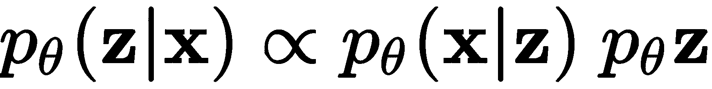

事实证明，精确的后验是不可处理的，但这个问题可以通过做一些假设并使用一个有趣的想法来计算梯度，从而近似求解。首先，假设先验服从各向同性高斯分布，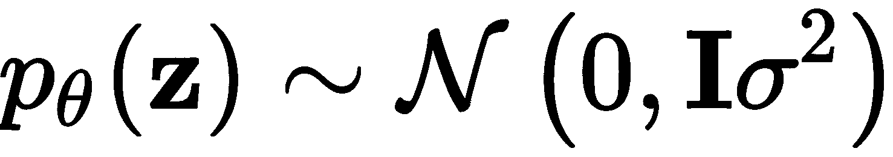。我们还可以假设条件分布![]可以用神经网络进行参数化建模；也就是说，给定潜在向量，我们用神经网络来*生成* 。在这种情况下，网络的权重记作![]，该网络相当于*解码器*网络。选择的参数化分布可以是高斯分布，用于输出可能取值范围广泛的情况，或者是伯努利分布，如果输出可能是二进制（或布尔）值。接下来，我们必须再次使用另一个神经网络来近似后验，通过![]与独立的参数![]。这个网络可以被解释为*编码器*网络，它接受作为输入并生成潜在变量。

在这个假设下，我们可以定义一个损失函数，如下所示：

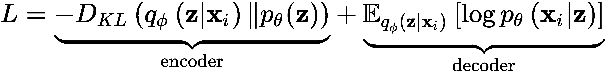

完整的推导可以参照 Kingma, D. P., & Welling, M. (2013) 中的内容。然而，简而言之，我们可以说，在第一个项中， 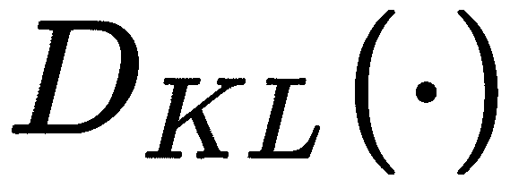 是 Kullback–Leibler 散度函数，它旨在衡量先验分布 ![] 与后验分布 ![] 的差异。这发生在 *编码器* 中，我们希望确保先验和后验的分布  相匹配。第二项与解码器网络相关，旨在基于条件分布 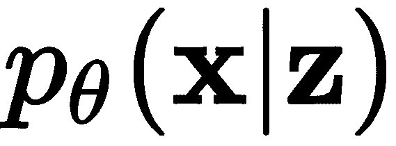 的负对数似然最小化重构损失，同时参考后验的期望 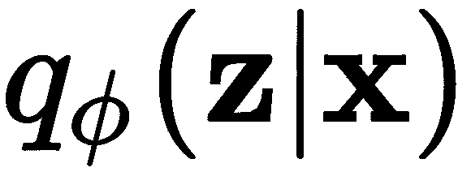。

使 VAE 通过梯度下降学习的最后一个技巧是使用一个叫做**重参数化**的概念。这一技巧是必要的，因为无法将一个样本  编码为一个均值为 0 且方差为某值的各向同性高斯分布，并从该分布中抽取样本 ，停顿在那里，然后继续解码并计算梯度，最后再返回并进行更新。重参数化技巧实际上是一种从 ![] 生成样本的方法，同时允许进行梯度计算。如果我们说 ![]，我们可以用一个辅助变量 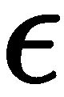 来表示随机变量 ，并且其边际概率密度函数为 ![]，使得 ![] 和 ![] 是一个由 ![] 参数化的函数，并返回一个向量。这使得可以对参数 ![] （生成器或解码器）进行梯度计算，并使用任何可用的梯度下降方法对 ![] 和 ![] 进行更新。

方程中 ![] 的 *tilde* 符号（~）可以解释为 *服从分布*。因此，该方程可以读作  服从后验分布 ![]。

*图 9.1* 展示了 VAE 的架构，明确显示了在 *瓶颈* 中涉及的各个部分，以及网络各部分的解释：

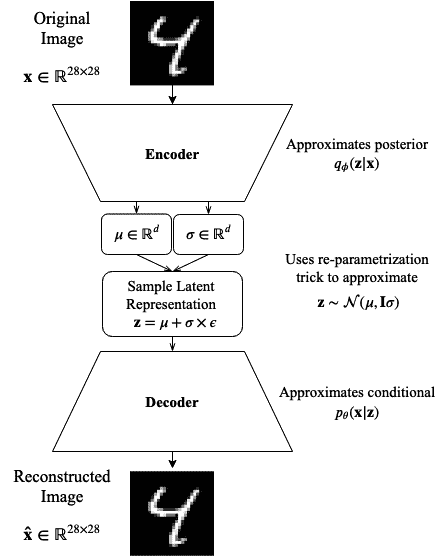

图 9.1 – VAE 架构

上述图示表明，在理想的 VAE 中，分布的参数会被准确无误地学习，从而实现精确的重构。然而，这仅仅是一个示意图，实际上，完美重构可能很难实现。

**瓶颈**是神经网络中存在的潜在表示或参数，这些网络从具有大量神经单元的层转向具有较少神经单元的层。这些瓶颈已知能产生有趣的特征空间（Zhang, Y., *et al.* (2014)）。

现在，让我们准备逐步构建第一个 VAE。我们将从描述我们将使用的数据集开始。

## 重新审视心脏病数据集

在第三章中，*数据准备*，我们详细描述了一个叫做**克利夫兰心脏病**数据集的属性。该数据集的两列截图如*图 9.2*所示。在这里，我们将重新审视这个数据集，目的是将原始的 13 个维度数据降至仅 2 个维度。不仅如此，我们还将尝试从生成器——即解码器——中生成新数据：

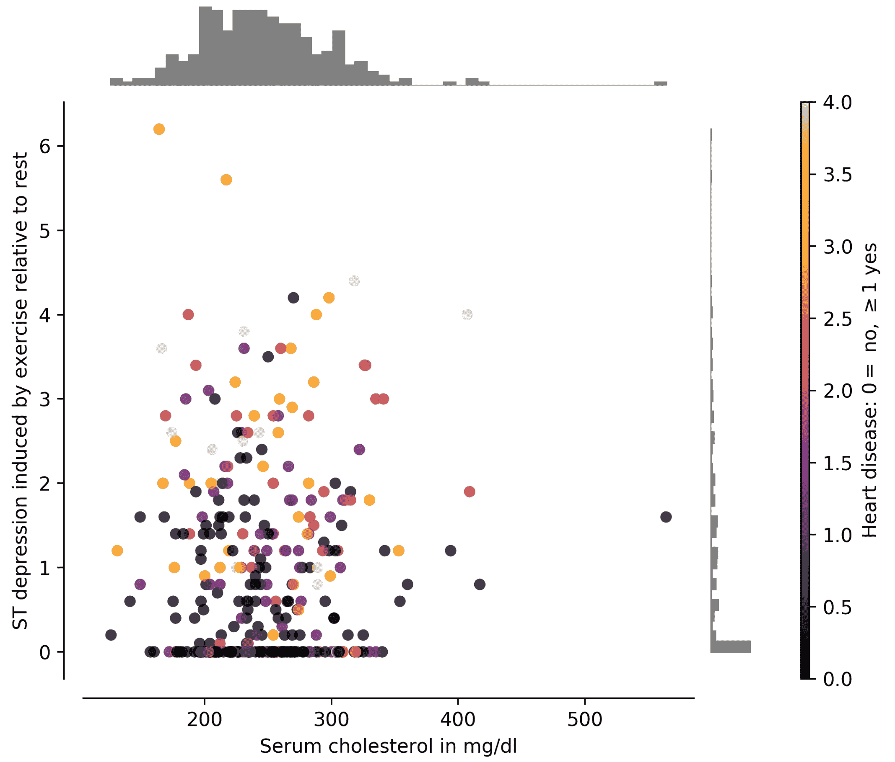

图 9.2 – 克利夫兰心脏病数据集的两列样本

我们尝试进行降维的工作可以通过查看第三章中的*图 3.8*和*图 3.9*轻松证明，并注意到数据可能会被处理，以查看神经网络是否能将没有心脏病的数据与其他数据分开聚类。同样，我们可以证明生成新数据的合理性，因为数据集本身仅包含 303 个样本。

为了下载数据，我们可以简单地运行以下代码：

```py
#download data
!wget https://archive.ics.uci.edu/ml/machine-learning-databases/heart-disease/processed.cleveland.data
```

然后，为了将数据加载到数据框中并分离训练数据和目标，我们可以执行以下代码：

```py
import pandas as pd
df = pd.read_csv('processed.cleveland.data', header=None)
# this next line deals with possible numeric errors
df = df.apply(pd.to_numeric, errors='coerce').dropna()
X = df[[0, 1, 2, 3, 4, 5, 6, 7, 8, 9, 10, 11, 12]].values
y = df[13].values
```

接下来，我们需要做的是编写重参数化技巧的代码，以便在训练过程中能够采样随机噪声。

## 重参数化技巧和采样

记住，重参数化技巧的目的是从 ![] 而不是 ![] 进行采样。此外，回想一下分布 ![]。这将使我们能够让学习算法学习 ![] 的参数——即 ![]——我们只需要从 ![] 中生成一个样本。

为了实现这一点，我们可以生成以下方法：

```py
from tensorflow.keras import backend as K

def sampling(z_params):
  z_mean, z_log_var = z_params
  batch = K.shape(z_mean)[0]
  dims = K.int_shape(z_mean)[1]
  epsilon = K.random_normal(shape=(batch, dims))
  return z_mean + K.exp(0.5 * z_log_var) * epsilon
```

`sampling()` 方法接收 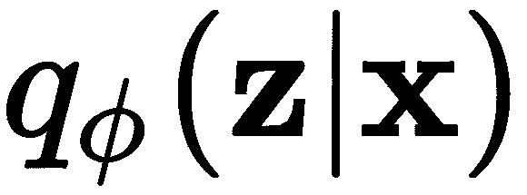 的均值和对数方差（这些需要学习），并返回从这个参数化分布中抽取的样本向量； 只是来自高斯（`random_normal`）分布的随机噪声，均值为 0，方差为 1。为了使此方法完全兼容小批量训练，样本将根据小批量的大小生成。

## 在编码器中学习后验的参数

后验分布，![]，本身是不可处理的，但由于我们使用了重参数化技巧，我们实际上可以基于  进行采样。接下来，我们将创建一个简单的编码器来学习这些参数。

为了保证数值稳定性，我们需要将输入缩放为均值为 0，方差为 1。为此，我们可以调用在 第三章《数据准备》中学到的方法：

```py
from sklearn.preprocessing import StandardScaler
scaler = StandardScaler()
scaler.fit(X)
x_train = scaler.transform(X)
original_dim = x_train.shape[1]
```

`x_train` 矩阵包含经过缩放的训练数据。以下变量对于设计 VAE 的编码器也会非常有用：

```py
input_shape = (original_dim, )
intermediate_dim = 13 
batch_size = 18 # comes from ceil(sqrt(x_train.shape[0]))
latent_dim = 2 # useful for visualization
epochs = 500
```

这些变量比较直观，唯一需要注意的是批次大小是以样本数量的平方根为基准的。这是一个通过经验得出的良好起点，但在较大的数据集上，它并不能保证是最优的。

接下来，我们可以按如下方式构建编码器部分：

```py
from tensorflow.keras.layers import Lambda, Input, Dense, Dropout, BatchNormalization
from tensorflow.keras.models import Model

inputs = Input(shape=input_shape)
bn = BatchNormalization()(inputs)
dp = Dropout(0.2)(bn)
x = Dense(intermediate_dim, activation='sigmoid')(dp)
x = Dropout(0.2)(x)
z_mean = Dense(latent_dim)(x)
z_log_var = Dense(latent_dim)(x)
z_params = [z_mean, z_log_var]
z = Lambda(sampling, output_shape=(latent_dim,))(z_params)
encoder = Model(inputs, [z_mean, z_log_var, z])
```

这种编码器方法利用了 `Lambda` 类，它是 `tensorflow.keras.layers` 库的一部分。这使得我们能够将之前定义的 `sampling()` 方法（或任何任意表达式）作为一个层对象来使用。*图 9.3* 展示了完整 VAE 的架构，包括前面代码块中描述的编码器层：

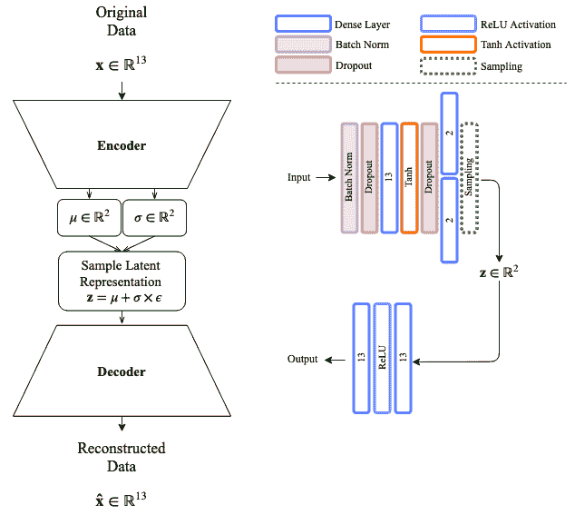

图 9.3 – 适用于克利夫兰心脏病数据集的 VAE 架构

编码器使用批量归一化，接着是输入层的 **丢弃**，然后是一个包含 **Tanh 激活** 和 **丢弃** 的密集层。通过 **丢弃**，两个密集层负责建模潜在变量分布的参数，并从这个参数化分布中抽取样本。接下来将讨论解码器网络。

## 建模解码器

VAE 的解码器部分在你已知的自动编码器中是非常标准的。解码器接受潜在变量，该变量在 VAE 中由参数化分布生成，然后它应该精确地重建输入。解码器可以按如下方式指定：

```py
latent_inputs = Input(shape=(latent_dim,))
x = Dense(intermediate_dim, activation='relu')(latent_inputs)
r_outputs = Dense(original_dim)(x)    # reconstruction outputs
decoder = Model(latent_inputs, r_outputs)
```

在前面的代码中，我们简单地连接了两个密集层——第一个层包含 ReLU 激活，而第二个层则具有线性激活，以便映射回输入空间。最后，我们可以根据编码器和解码器中定义的输入和输出来定义完整的 VAE：

```py
outputs = decoder(encoder(inputs)[2])   # it is index 2 since we want z
vae = Model(inputs, outputs)
```

如此处所述并在*图 9.3*中所示，VAE 模型已经完成。接下来将进入训练该模型的步骤，其中包括定义损失函数，我们将在后面讨论。

## 最小化损失

我们之前解释过，损失函数需要以编码器和解码器为基础；这是我们讨论过的方程：


如果我们想编写这个损失函数的代码，我们需要用更实际的方式来表示它。应用之前在问题中做出的所有假设，包括重新参数化技巧，可以让我们将损失的近似值用更简单的方式重新编写，如下所示：

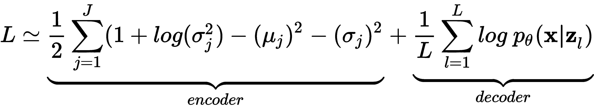

这适用于所有样本的 ，其中 ![] 和 ![]。此外，解码器损失部分可以使用你喜欢的任何重建损失来近似——例如**均方误差**（**MSE**）损失或二元交叉熵损失。已证明，最小化这些损失中的任何一个也会最小化后验。

我们可以将重建损失定义为 MSE，如下所示：

```py
from tensorflow.keras.losses import mse
r_loss = mse(inputs, outputs)
```

或者，我们也可以用二元交叉熵损失来表示，如下所示：

```py
from tensorflow.keras.losses import binary_crossentropy
r_loss = binary_crossentropy(inputs, outputs)
```

我们可以做的一件额外的事情（这是可选的），是监控重建损失与 KL 散度损失（与编码器相关的项）之间的重要性。通常的做法是将重建损失乘以潜在维度或输入维度。这样做实际上会使损失增大。若选择后者，我们可以像下面这样对重建损失进行惩罚：

```py
r_loss = original_dim * r_loss
```

现在，编码器项的 KL 散度损失可以用均值和方差来表示，如下所示：

```py
kl_loss = 1 + z_log_var - K.square(z_mean) - K.exp(z_log_var)
kl_loss = 0.5 * K.sum(kl_loss, axis=-1)
```

因此，我们可以简单地将整体损失添加到模型中，模型变为如下形式：

```py
vae_loss = K.mean(r_loss + kl_loss)
vae.add_loss(vae_loss)
```

有了这些，我们就可以继续编译模型并进行训练，接下来将做详细说明。

## 训练 VAE

最后一步是编译 VAE 模型，这将把所有部分结合在一起。在编译过程中，我们需要选择一个优化器（梯度下降法）。在这种情况下，我们选择*Adam*（Kingma, D. P.，*et al.*（2014））。

有趣的是，VAE 的创始人是同一个人在不久之后创造了 Adam 优化器。他的名字是**Diederik P. Kingma**，目前是 Google Brain 的研究科学家。

为了编译模型并选择优化器，我们需要执行以下操作：

```py
vae.compile(optimizer='adam')
```

最后，我们使用训练数据进行 500 次 epoch 的训练，批大小为 18，代码如下：

```py
hist = vae.fit(x_train, epochs=epochs,
               batch_size=batch_size,
               validation_data=(x_train, None))
```

请注意，我们使用训练集作为验证集。在大多数情况下，这样做是不推荐的，但在这里这样做是可行的，因为选择相同的 mini-batch 进行训练和验证的概率非常低。此外，通常来说，这样做被认为是作弊；然而，用于重构的潜在表示并不直接来自输入，而是来自与输入数据相似的分布。为了展示训练集和验证集会产生不同的结果，我们绘制了跨越各个 epoch 的训练进度，如*图 9.4*所示：

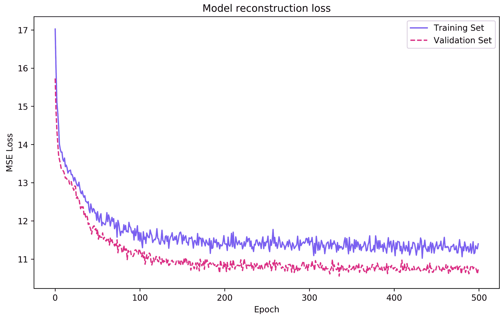

图 9.4 – VAE 在各个 epoch 中的训练表现

上图不仅表明模型收敛速度很快，而且还显示模型不会对输入数据进行过拟合。通常来说，这是一个很好的特性。

*图 9.4*可以通过以下代码生成：

```py
import matplotlib.pyplot as plt

fig = plt.figure(figsize=(10,6))
plt.plot(hist.history['loss'], color='#785ef0')
plt.plot(hist.history['val_loss'], '--', color='#dc267f')
plt.title('Model reconstruction loss')
plt.ylabel('MSE Loss')
plt.xlabel('Epoch')
plt.legend(['Training Set', 'Validation Set'], loc='upper right')
plt.show()
```

然而，请注意，由于 VAE 是无监督的，因此结果可能会有所不同。

接下来，如果我们观察通过从随机分布中采样并利用训练过程中学到的参数生成的潜在表示，我们就能看到数据的样子。*图 9.5*展示了获得的潜在表示：

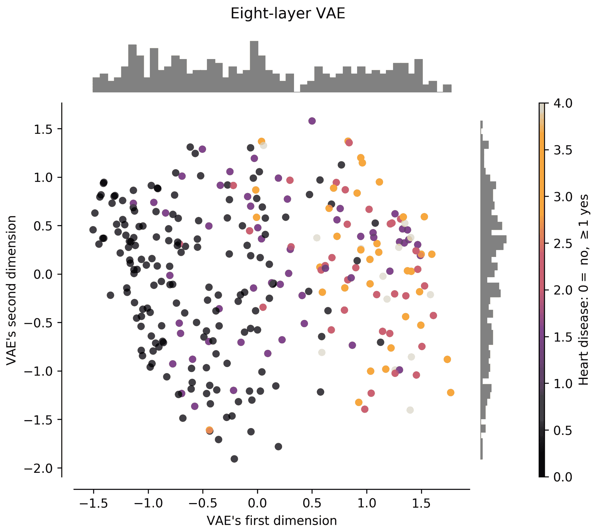

图 9.5 – VAE 在二维空间中采样的潜在表示

图中清晰地显示，未指示心脏病的数据聚集在左侧象限，而对应心脏病的样本聚集在潜在空间的右侧象限。图顶端显示的直方图表明存在两个明确的聚类。这很好！另外，请记住，VAE 并不知道任何标签信息：我们无法过分强调这一点！将这里的*图 9.5*与第三章中的*图 3.9*进行比较，*数据预处理*，你会注意到 VAE 的表现优于 KPCA。此外，将此图与第三章中的*图 3.8*进行比较，*数据预处理*，并注意到 VAE 的表现与**线性判别分析**(**LDA**)相当（如果不是更好）。LDA 利用标签信息生成低维表示。换句话说，LDA 有点“作弊”。

VAE 最有趣的特性之一是我们可以生成数据；接下来，让我们看看是如何做到这一点的。

## 从 VAE 生成数据

由于 VAE 学习潜在空间上参数化分布的参数，并利用这些参数采样来重构输入数据，因此我们可以利用这些参数生成更多的样本并进行重构。这个想法是根据我们的需求生成数据。

我们从编码原始数据集开始，看看重建的结果与原始数据有多接近。然后，生成数据应该是直观的。为了将输入数据编码到潜在空间并解码，我们可以做如下操作：

```py
encdd = encoder.predict(x_train)
x_hat = decoder.predict(encdd[0])
```

记住，`x_train`是！[](img/b0c5b964-8583-4007-8807-e18c4b9522ef.png)，而`x_hat`是重建结果，！[](img/6476b534-a425-4523-a577-baeeb7b34df3.png)。注意，我们使用`encdd[0]`作为解码器的输入。之所以这样做，是因为编码器输出的是三个向量的列表，`[z_mean, z_log_var, z]`。因此，使用列表中的第 0 个元素即表示对应样本的分布均值。实际上，`encdd[0][10]`会得到一个二维向量，对应于能够生成数据集中第 10 个样本的分布均值——也就是`x_train[10]`。如果你仔细想一下，均值可能是我们能够找到的最佳潜在表示，因为它最有可能在解码器中重建输入。

牢记这一点，我们可以通过运行类似的代码来查看重建的效果有多好：

```py
import numpy as np
print(np.around(scaler.inverse_transform(x_train[0]), decimals=1))
print(np.around(scaler.inverse_transform(x_hat[0]), decimals=1))
```

这将产生以下输出：

```py
[ 63.0  1.0  1.0  145.0  233.0  1.0  2.0  150.0  0.0  2.3  3.0  0.0  6.0 ]
[ 61.2  0.5  3.1  144.1  265.1  0.5  1.4  146.3  0.2  1.4  1.8  1.2  4.8 ]
```

如果输出显示的是难以阅读的科学计数法，可以尝试暂时禁用它，如下所示：

`import numpy as np`

`np.set_printoptions(suppress=True)`

`print(np.around(scaler.inverse_transform(x_train[0]), decimals=1))`

`print(np.around(scaler.inverse_transform(x_hat[0]), decimals=1))`

`np.set_printoptions(suppress=False)`

在这个例子中，我们专注于训练集中的第一个数据点，也就是`x_train[0]`，位于顶部行；它的重建结果位于底部行。仔细检查可以发现两者之间有差异；然而，这些差异可能在均方误差（MSE）方面相对较小。

另一个需要指出的重要方面是，数据在训练模型之前已被缩放，因此需要将其缩放回原始输入空间。幸运的是，`StandardScaler()`类有一个`inverse_transform()`方法，可以帮助将任何重建数据映射回输入空间中每个维度的值范围。

为了随意生成更多数据，我们可以定义一个方法来实现。以下方法会产生均匀分布的随机噪声，范围为`[-2, +2]`，这个范围来自于对*图 9.5*的分析，该图显示了潜在空间的范围在这个区间内：

```py
def generate_samples(N = 10, latent_dim = 2):
  noise = np.random.uniform(-2.0, 2.0, (N,latent_dim))
  gen = decoder.predict(noise)
  return gen
```

这个函数需要根据潜在空间中值的范围进行调整；同时，也可以通过观察潜在空间中数据的分布来调整。例如，如果潜在空间似乎是正态分布的，那么可以像这样使用正态分布：`noise = np.random.normal(0.0, 1.0, (N,latent_dim))`，假设均值为 0，方差为 1。

我们可以通过以下方式调用函数生成*伪*数据：

```py
gen = generate_samples(10, latent_dim)
print(np.around(scaler.inverse_transform(gen), decimals=1))
```

这将产生以下输出：

```py
[[ 43.0  0.7  2.7  122.2  223.8  0.0  0.4  172.2  0.0  0.3  1.2  0.1  3.6]
 [ 57.4  0.9  3.9  133.1  247.6  0.1  1.2  129.0  0.8  2.1  2.0  1.2  6.4]
 [ 60.8  0.7  3.5  142.5  265.7  0.3  1.4  136.4  0.5  1.9  2.0  1.4  5.6]
 [ 59.3  0.6  3.2  137.2  261.4  0.2  1.2  146.2  0.3  1.2  1.7  0.9  4.7]
 [ 51.5  0.9  3.2  125.1  229.9  0.1  0.7  149.5  0.4  0.9  1.6  0.4  5.1]
 [ 60.5  0.5  3.2  139.9  268.4  0.3  1.3  146.1  0.3  1.2  1.7  1.0  4.7]
 [ 48.6  0.5  2.6  126.8  243.6  0.1  0.7  167.3  0.0  0.2  1.1  0.1  3.0]
 [ 43.7  0.8  2.9  121.2  219.7  0.0  0.5  163.8  0.1  0.5  1.4  0.1  4.4]
 [ 54.0  0.3  2.5  135.1  264.2  0.2  1.0  163.4  0.0  0.3  1.1  0.3  2.7]
 [ 52.5  1.0  3.6  123.3  227.8  0.0  0.8  137.7  0.7  1.6  1.8  0.6  6.2]]
```

回想一下，这些数据是由随机噪声生成的。你可以看到，这是深度学习领域的一个重大突破。你可以使用这些数据来增强你的数据集，并根据需要生成任意数量的样本。我们可以查看生成样本的质量，自己判断其是否足够满足我们的需求。

现在，考虑到你和我可能不是专门从事心脏病研究的医生，我们可能没有资格确切判断生成的数据是否合理；但如果我们正确执行了操作，通常来说，它确实是合理的。为了明确这一点，接下来的部分将使用 MNIST 图像来证明生成的样本是好的，因为我们都可以对数字图像进行视觉评估。

# 比较 MNIST 上的深层和浅层 VAE

比较浅层和深层模型是实验过程的一部分，目的是找到最佳模型。在这个关于 MNIST 图像的比较中，我们将实现 *图 9.6* 中显示的架构作为浅层模型，而深层模型的架构如 *图 9.7* 所示：

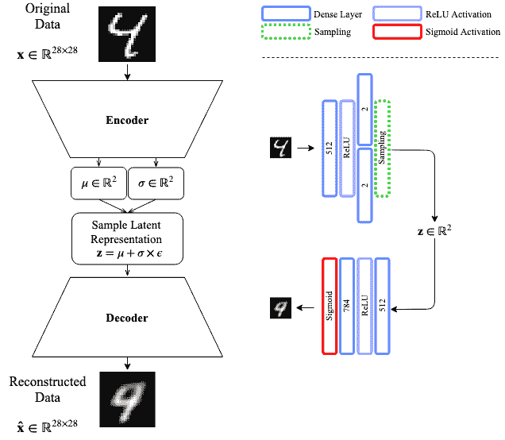

图 9.6 – MNIST 上的 VAE 浅层架构

正如你所看到的，这两个模型在涉及的层数上有很大不同。由于这一差异，重建的质量也会有所不同：

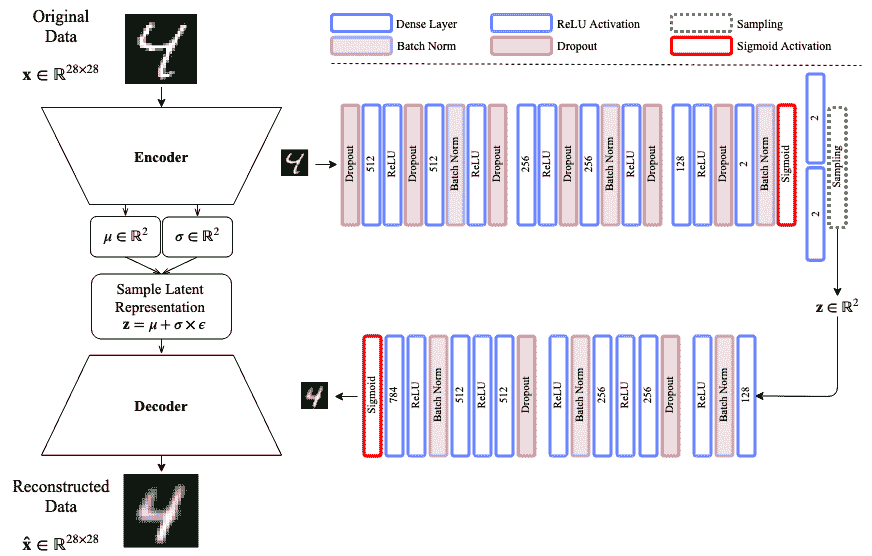

图 9.7 – MNIST 上的 VAE 深度架构

这些模型将使用少量的 epoch 来训练浅层 VAE，而更深的模型将使用更多的 epoch。

重现浅层编码器的代码可以从在克利夫兰心脏病数据集中使用的示例中轻松推断出来；然而，深层 VAE 的代码将在接下来的章节中讨论。

## 浅层 VAE

我们可以用来比较 VAE 的第一件事之一是其学习到的表示。*图 9.8* 显示了训练集的潜在空间投影：

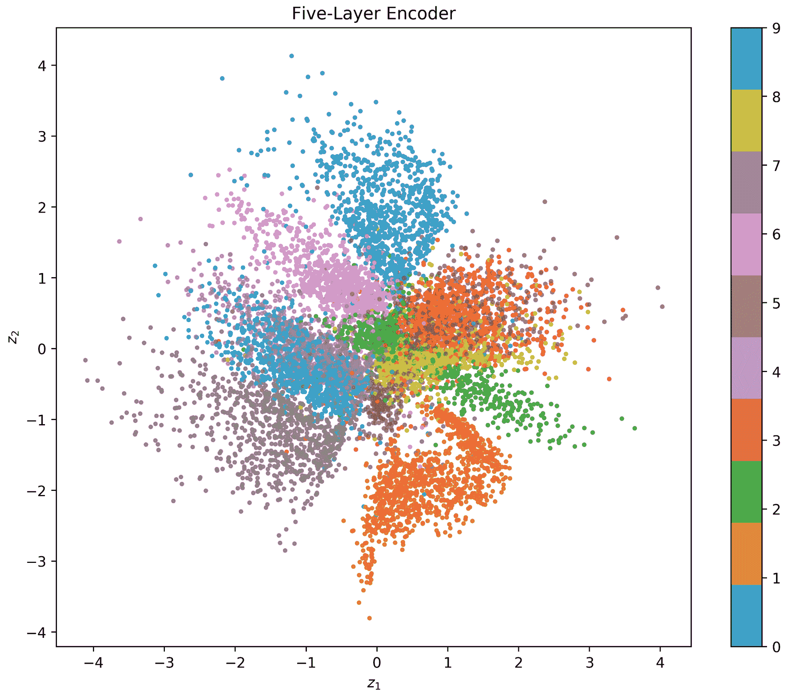

图 9.8 – 浅层 VAE 潜在空间投影（训练数据集）

从前面的图中，我们可以观察到数据点的聚类从中心坐标向外扩展。我们希望看到的是清晰定义的聚类，这些聚类之间的分隔足够清晰，以便于分类。例如，在这种情况下，我们看到某些组之间有一点重叠，特别是 4 和 9 号组，这其实是有道理的。

接下来需要关注的是模型的重建能力。*图 9.9* 显示了输入的示例，*图 9.10* 显示了模型训练后的相应重建结果：

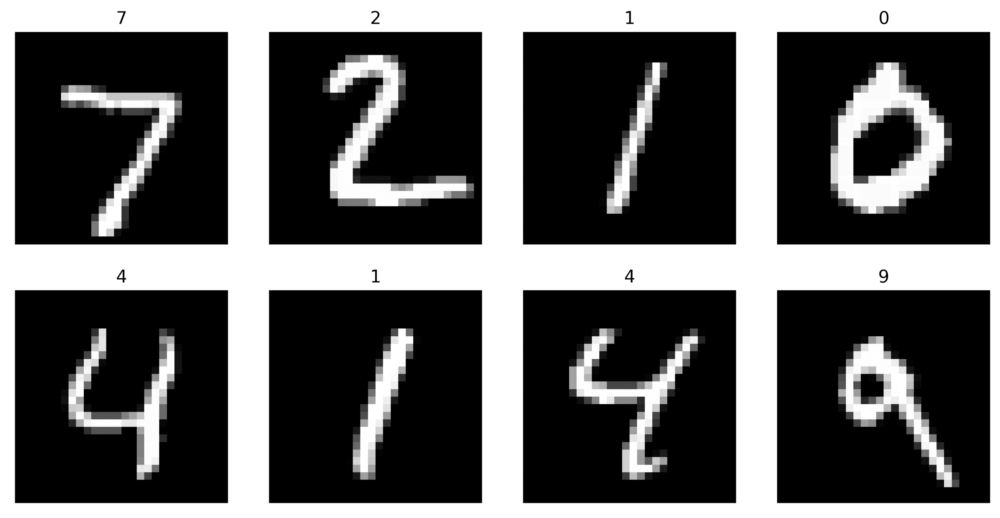

图 9.9 – VAE 的示例输入

对于浅层模型的预期是，其表现将直接与模型的大小相关：

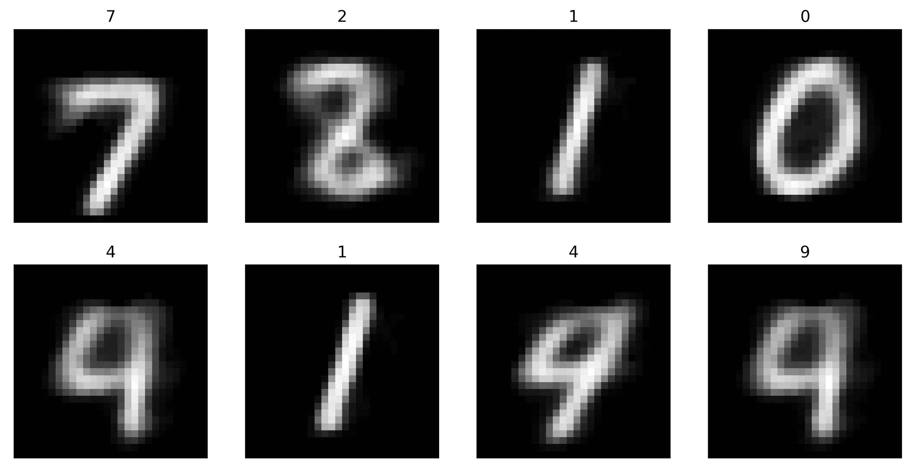

图 9.10 – 浅层 VAE 重建与图 9.9 中输入的关系

显然，数字 2 和数字 8 的重建似乎存在一些问题，这一点通过观察*图 9.8*中这两个数字之间的重叠可以得到确认。

另一个我们可以做的事情是，如果我们从潜在空间的范围中绘制数字，来可视化 VAE 生成的数据。*图 9.11*展示了潜在空间在两个维度上的变化：

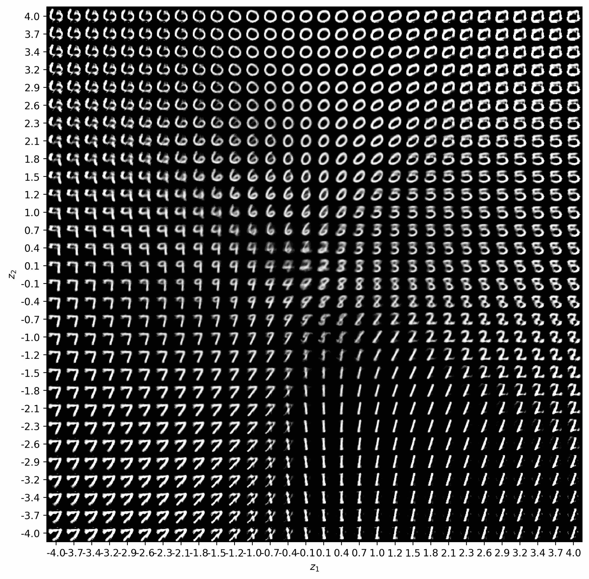

图 9.11 – 浅层 VAE 在范围 [-4,4] 内的潜在空间探索

在*图 9.11*中，我们发现非常有趣的一点是，我们可以看到随着潜在空间的遍历，数字是如何逐步转换成其他数字的。如果我们沿着从上到下的中线，我们可以看到数字如何从 0 转变为 6，然后是 2，再到 8，最后到 1。我们也可以通过沿着对角线或其他方向进行同样的操作。制作这种类型的可视化还允许我们看到一些在训练数据集中没有看到的伪影，这些伪影可能会在我们生成数据时造成潜在问题。

为了查看更深层的模型是否比这个更好，我们将在下一节中实现它。

## 深层 VAE

*图 9.7*展示了一种可以分部分实现的深层 VAE 架构——首先是编码器，然后是解码器。

### 编码器

编码器可以使用函数式范式实现，如下所示：

```py
from tensorflow.keras.layers import Lambda, Input, Dense, Dropout
from tensorflow.keras.layers import Activation, BatchNormalization
from tensorflow.keras.models import Model

inpt_dim = 28*28
ltnt_dim = 2

inpt_vec = Input(shape=(inpt_dim,))
```

这里，`inpt_dim`对应于 28*28 的 MNIST 图像的 784 个维度。接下来，继续以下内容：

```py
el1 = Dropout(0.1)(inpt_vec)
el2 = Dense(512)(el1)
el3 = Activation('relu')(el2)
el4 = Dropout(0.1)(el3)
el5 = Dense(512)(el4)
el6 = BatchNormalization()(el5)
el7 = Activation('relu')(el6)
el8 = Dropout(0.1)(el7)

el9 = Dense(256)(el8)
el10 = Activation('relu')(el9)
el11 = Dropout(0.1)(el10)
el12 = Dense(256)(el11)
el13 = BatchNormalization()(el12)
el14 = Activation('relu')(el13)
el15 = Dropout(0.1)(el14)

el16 = Dense(128)(el15)
el17 = Activation('relu')(el16)
el18 = Dropout(0.1)(el17)
el19 = Dense(ltnt_dim)(el18)
el20 = BatchNormalization()(el19)
el21 = Activation('sigmoid')(el20)

z_mean = Dense(ltnt_dim)(el21)
z_log_var = Dense(ltnt_dim)(el21)
z = Lambda(sampling)([z_mean, z_log_var])
encoder = Model(inpt_vec, [z_mean, z_log_var, z])
```

请注意，编码器模型使用了 10% 丢弃率的丢弃层。其他层都是我们之前见过的内容，包括批量归一化。唯一的新内容是`Lambda`函数，正如本章前面所定义的。

接下来，我们将定义解码器。

### 解码器

解码器比编码器少了几层。这种层的选择只是为了展示，只要编码器和解码器中的稠密层数量几乎相等，就可以省略一些其他层，作为实验的一部分，寻找性能提升。

这是解码器的设计：

```py
ltnt_vec = Input(shape=(ltnt_dim,))
dl1 = Dense(128)(ltnt_vec)
dl2 = BatchNormalization()(dl1)
dl3 = Activation('relu')(dl2)

dl4 = Dropout(0.1)(dl3)
dl5 = Dense(256)(dl4)
dl6 = Activation('relu')(dl5)
dl7 = Dense(256)(dl6)
dl8 = BatchNormalization()(dl7)
dl9 = Activation('relu')(dl8)

dl10 = Dropout(0.1)(dl9)
dl11 = Dense(512)(dl10)
dl12 = Activation('relu')(dl11)
dl13 = Dense(512)(dl12)
dl14 = BatchNormalization()(dl13)
dl15 = Activation('relu')(dl14)
dl16 = Dense(inpt_dim, activation='sigmoid') (dl15)

decoder = Model(ltnt_vec, dl16)
```

再次强调，这里没有什么新内容，是层与层之间的叠加。然后，我们可以将所有这些组合在一起形成模型，如下所示：

```py
outputs = decoder(encoder(inpt_vec)[2])
vae = Model(inpt_vec, outputs)
```

就是这样！在此之后，我们可以编译模型，选择优化器，并像之前的节那样训练模型。

如果我们想要可视化深层 VAE 的潜在空间，以便与*图 9.8*进行比较，我们可以查看*图 9.12*中展示的空间：

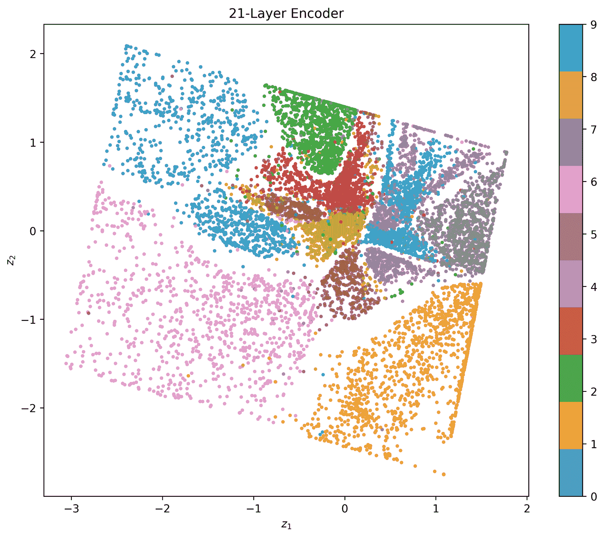

图 9.12 – 深层 VAE 训练数据集的潜在空间投影

如你所见，潜在空间在几何形态上看起来有所不同。这很可能是激活函数作用的结果，它们限制了特定流形的潜在空间范围。最有趣的现象之一是，即使存在一些重叠——例如，数字 9 和 4，样本组之间的分离仍然很明显。然而，与*图 9.8*相比，这种重叠程度较轻。

*图 9.13* 展示了与*图 9.9*中的相同输入的重建效果，但这次使用的是更深层的 VAE：

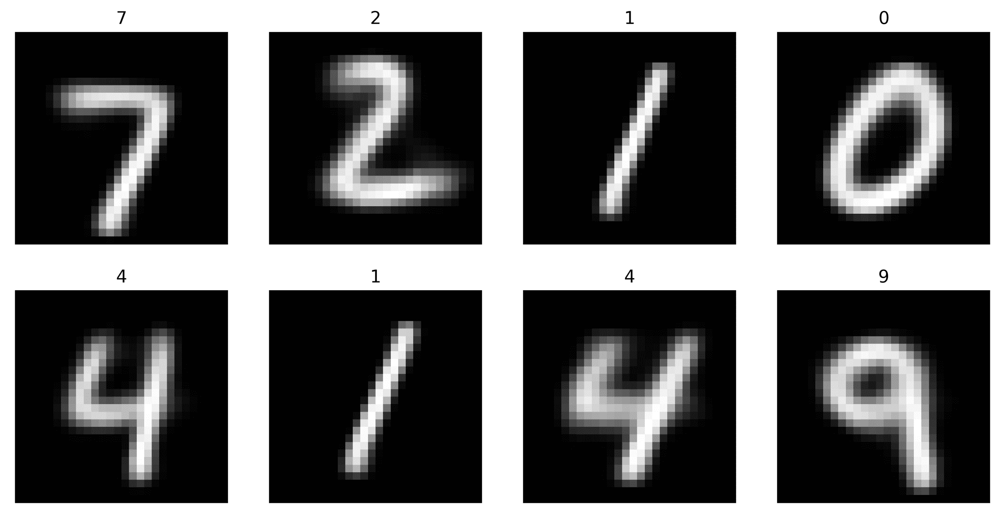

图 9.13 – 深层 VAE 重建与图 9.9 中的输入相对应。与图 9.10 进行比较

显然，与浅层 VAE 相比，重建效果要好得多且更具鲁棒性。为了更清楚地展示这一点，我们还可以通过在潜在空间中生成与潜在空间相同范围的随机噪声来探索生成器。这在*图 9.14*中得到了展示：

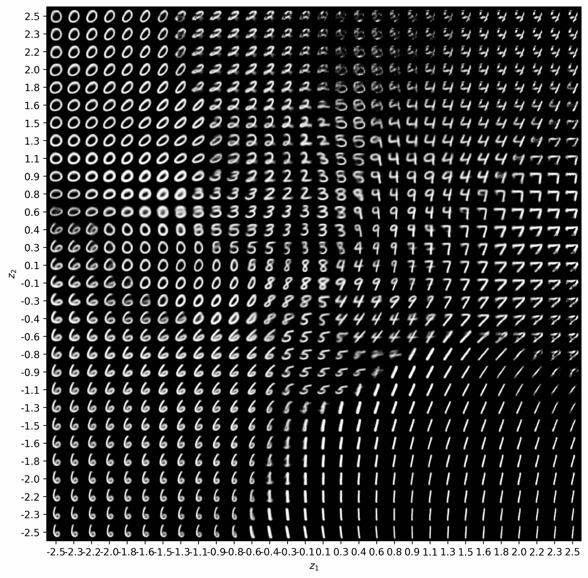

图 9.14 – 深度 VAE 潜在空间在范围 [-4,4] 内的探索，涵盖两个维度。与图 9.11 进行比较

深层 VAE 的潜在空间显然在多样性上更为丰富，并且从视觉角度来看更加有趣。如果我们选择最右侧的那一条线，并从下到上遍历空间，我们可以看到数字 1 变成 7，再变成 4，且变化是逐渐且小幅的。

## 去噪 VAE

VAE 在图像去噪应用中也表现得非常出色（Im, D. I. J., *等*（2017））。这一特性是通过在学习过程中注入噪声来实现的。若想了解更多信息，你可以在网上搜索去噪 VAE，你会找到关于这个话题的资料。我们只是希望你了解它们的存在，并知道它们在你需要时可以使用。

# 思考生成模型的伦理影响

生成模型是当前深度学习领域最激动人心的话题之一。但强大的能力伴随着巨大的责任。我们可以利用生成模型的力量做许多有益的事情，例如：

+   扩展你的数据集，使其更加完整

+   使用未见过的数据训练模型，使其更加稳定

+   找到对抗样本来重新训练你的模型，使其更具鲁棒性

+   创建看起来像其他事物的全新图像，例如艺术作品或车辆的图像

+   创建听起来像其他声音的新声音序列，例如人类说话或鸟类鸣叫

+   为数据加密生成新的安全代码

我们可以根据想象力的限制继续前进。我们必须时刻记住的是，这些生成模型如果没有正确建模，可能会导致许多问题，比如偏见，从而引发模型的可信度问题。使用这些模型生成某人说过的话，但实际上他们并没有说过的话的虚假音频序列，或者生成某人做过的事情但其实并未发生过的面孔图像，甚至是将不属于某人面孔的身体合成进去，这些都非常容易做到。

一些最显著的不当行为包括深度伪造。我们无需浪费时间讨论如何实现这一点，但可以明确的是，我们的生成模型不应被用于恶意目的。不久之后，国际法将会出台，惩罚那些通过恶意生成建模犯罪的人。

但在国际法律尚未出台、各国尚未制定新政策之前，你在开发模型时必须遵循最佳实践：

+   测试你的模型是否存在最常见的偏见类型：历史偏见、社会偏见、算法偏见等（Mehrabi, N., *et al.* (2019)）。

+   使用合理的训练集和测试集来训练你的模型。

+   留意数据预处理技术；更多细节请参见第三章，*数据准备*。

+   确保你的模型产生的输出始终尊重所有人类的尊严和价值。

+   让同行验证你的模型架构。

牢记这一点，继续以负责任且富有创意的方式使用你现在拥有的新工具：VAE。

# 总结

本高级章节展示了一个非常有趣且相对简单的模型，能够通过配置自编码器并应用变分贝叶斯原理，从已学习的分布中生成数据，最终形成变分自编码器（VAE）。我们分析了该模型的各个部分，并通过克利夫兰数据集的输入数据来解释它们。随后，我们从学习到的参数化分布中生成了数据，证明了 VAE 可以轻松用于此目的。为了验证 VAE 在浅层和深层配置中的鲁棒性，我们在 MNIST 数据集上实现了一个模型。实验证明，深层架构能产生更加明确的数据分布区域，而浅层架构则产生模糊的分布区域；然而，无论是浅层模型还是深层模型，都在学习表示任务中表现出色。

到目前为止，你应该已经能够自信地识别 VAE 的各个组成部分，并能够在其动机、架构和能力方面区分传统自编码器和 VAE 的主要区别。你应该能够欣赏 VAE 的生成能力，并且准备好实现它们。在阅读完本章之后，你应该能够编写基本的和深度的 VAE 模型，并能够使用它们进行降维和数据可视化，以及在意识到潜在风险的情况下生成数据。最后，你现在应该已经熟悉了如何在 TensorFlow 和 Keras 中使用 `Lambda` 函数进行通用操作。

如果你到目前为止喜欢学习无监督模型，请继续跟我一起阅读 第十章，*限制玻尔兹曼机*，本章将介绍一个独特的模型，它基于图形模型。图形模型将图论与学习理论结合，用于执行机器学习。限制玻尔兹曼机的一个有趣之处是，在学习过程中算法可以前进和后退，以满足连接约束。敬请期待！

# 问题与答案

1.  **如何从随机噪声中生成数据？**

由于 VAE 学习的是一个参数化的随机分布的参数，我们可以简单地利用这些参数从该分布中进行采样。由于随机噪声通常遵循具有特定参数的正态分布，因此我们可以说我们正在对随机噪声进行采样。值得一提的是，解码器知道如何处理符合特定分布的噪声。

1.  **更深层次的 VAE 有什么优势？**

很难说出其优势是什么（如果有的话），因为没有数据或不知道应用场景。例如，对于克利夫兰心脏病数据集，深层 VAE 可能不必要；而对于 MNIST 或 CIFAR，适度较大的模型可能有益。视情况而定。

1.  **有没有办法修改损失函数？**

当然，你可以更改损失函数，但要小心保持其构建原理。如果假设一年后我们找到了简化负对数似然函数的方式，那么我们可以（且应该）回过头来编辑损失函数，以采用新的方法。

# 参考文献

+   Kingma, D. P., & Welling, M. (2013)。自编码变分贝叶斯。*arXiv 预印本* arXiv:1312.6114。

+   Salakhutdinov, R., Mnih, A., & Hinton, G. (2007 年 6 月)。用于协同过滤的限制玻尔兹曼机。发表于 *第 24 届国际机器学习大会论文集*（第 791-798 页）。

+   Goodfellow, I., Pouget-Abadie, J., Mirza, M., Xu, B., Warde-Farley, D., Ozair, S., Courville, A. 和 Bengio, Y. (2014)。生成对抗网络。发表于 *神经信息处理系统进展*（第 2672-2680 页）。

+   Zhang, Y., Chuangsuwanich, E., & Glass, J. (2014, May). 使用低秩矩阵分解提取深度神经网络瓶颈特征。在*2014 年 IEEE 国际会议上的声学、语音和信号处理（ICASSP）*（pp. 185-189）。IEEE。

+   Kingma, D. P., & Ba, J. (2014). Adam：随机优化方法。*arXiv 预印本* arXiv:1412.6980。

+   Mehrabi, N., Morstatter, F., Saxena, N., Lerman, K., & Galstyan, A. (2019). 机器学习中的偏见和公平性调查。*arXiv 预印本* arXiv:1908.09635。

+   Im, D. I. J., Ahn, S., Memisevic, R., & Bengio, Y. (2017, February). 变分自动编码框架的去噪标准。在*第 31 届 AAAI 人工智能大会*。
