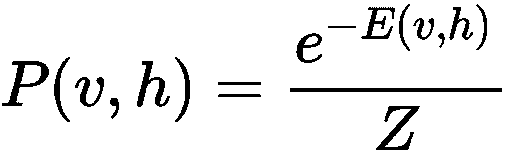
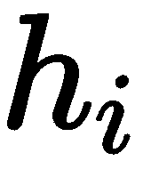

受限玻尔兹曼机

一起学习后，我们已经看到无监督学习的强大功能，并且希望已经说服自己，它可以应用于不同的问题。我们将以一个激动人心的方法——**受限玻尔兹曼机**（**RBMs**）结束无监督学习的主题。当我们不关心层数过多时，我们可以使用 RBMs 从数据中学习，并找到满足能量函数的方法，从而产生一个强大的模型来表示输入数据。

本章通过介绍 RBMs 的反向-前向特性，补充了第八章《深度自编码器》内容，同时与**自编码器**（**AEs**）的单向特性进行了对比。本章将 RBMs 与 AEs 在降维问题上的应用进行比较，使用 MNIST 作为案例研究。当你完成本章学习后，你应该能够使用 scikit-learn 实现 RBM，并使用伯努利 RBM 实现一个解决方案。你将能够进行 RBM 和 AE 潜在空间的可视化比较，并通过可视化学习到的权重来检查 RBM 和 AE 的内部工作原理。

本章组织结构如下：

+   RBM 简介

+   使用 RBM 学习数据表示

+   比较 RBMs 和 AEs

# 第十三章：RBM 简介

RBMs 是无监督模型，适用于需要丰富潜在表示的各种应用。它们通常与分类模型一起使用，目的是从数据中提取特征。它们基于**玻尔兹曼机**（**BMs**），接下来我们将讨论这一点（Hinton, G. E., 和 Sejnowski, T. J.（1983））。

## 玻尔兹曼机

受限玻尔兹曼机（RBM）可以被看作是一个无向的稠密图，如*图 10.1*所示：


图 10.1 – 玻尔兹曼机模型

这个无向图有一些神经单元，它们被建模为**可见**的，，以及一组被建模为**隐藏**的神经单元，。当然，可能会有比这些更多的神经单元。但该模型的关键是所有神经元彼此连接：它们都*互相交流*。本节不会深入讲解此模型的训练过程，但基本上这是一个迭代过程，其中输入数据呈现到可见层，每个神经元（一次调整一个）会调整它与其他神经元之间的连接，以满足一个损失函数（通常基于能量函数），直到学习过程达到满意的程度。

尽管 RB 模型非常有趣且强大，但训练时间却非常长！考虑到这是在 1980 年代初期，当时进行比这更大的图和更大数据集的计算可能会显著影响训练时间。然而，在 1983 年，G. E. Hinton 及其合作者提出了通过限制神经元之间的通信来简化 BM 模型的方法，正如我们接下来将讨论的那样。

## RBMs

传统 BM 的*限制*在于神经元之间的通信；也就是说，可见神经元只能与隐藏神经元通信，隐藏神经元只能与可见神经元通信，正如*图 10.2*所示：


图 10.2 – 一个 RBM 模型。与图 10.1 中的 BM 模型进行比较。

如*图 10.2*所示的图被称为**密集二分图**。也许你会觉得它看起来很像我们迄今为止使用的典型密集神经网络；然而，它并不完全相同。主要的区别在于我们使用的所有神经网络仅仅是从输入（可见层）到隐藏层的信息传递，而 RBM 则可以双向通信！其余的元素是熟悉的：我们有需要学习的权重和偏置。

如果我们坚持使用如*图 10.2*所示的简单模型，我们可以用更简单的术语解释 RBM 背后的学习理论。

让我们将每一个神经元单元解释为一个随机变量，其当前状态依赖于其他神经元单元的状态。

这种解释使我们能够使用与**马尔可夫链蒙特卡洛**（**MCMC**）（Brooks, S., et al. (2011)）相关的采样技术；然而，我们在本书中不会深入讨论这些技术的细节。

使用这种解释，我们可以为模型定义一个能量函数，如下所示：


其中！[](img/da9561fe-3f4a-4973-9c06-1c311d126aae.png)分别表示可见神经元和隐藏神经元的偏置。事实证明，我们还可以将神经元和隐藏神经元的联合概率密度函数表示如下：



它具有一个简单的边际分布：


条件和边际中的分母被称为归一化因子，它的作用仅仅是确保概率值相加等于 1，可以定义如下：


这些公式使我们能够快速找到用于训练的 MCMC 技术；最著名的是，你会在文献中发现对比散度（Contrastive Divergence）涉及吉布斯采样（Gibbs sampling）是最常见的方法（Tieleman, T. (2008)）。

目前只有少数实现了的 RBM 可供学习者使用；其中之一是可以在 scikit-learn 中使用的伯努利 RBM，我们接下来将讨论它。

## 伯努利 RBMs

虽然广义的 RBM 模型对其使用的数据不做任何假设，但是 Bernoulli RBM 假设输入数据表示在 [0,1] 范围内的值，可以解释为概率值。在理想情况下，这些值属于集合 {0,1}，这与伯努利试验密切相关。如果您有兴趣，还有其他方法假设输入遵循高斯分布。您可以通过阅读 Yamashita, T. 等人 (2014) 了解更多信息。

只有少数数据集可以用于此类 RBM；MNIST 是一个示例，可以将其解释为二进制输入，其中当没有数字迹象时数据为 0，当存在数字信息时数据为 1。在 scikit-learn 中，`BernoulliRBM` 模型可以在神经网络集合中找到：`sklearn.neural_network`。

在伯努利样本输入分布的假设下，这个 RBM 模型 *大约* 使用一种称为 **Persistent Contrastive Divergence** (**PCD**) 的方法优化对数似然。据称，PCD 在当时比任何其他算法都快得多，并引发了讨论和兴奋，很快被背景传播的普及所掩盖，与密集网络相比。

在接下来的部分中，我们将使用 Bernoulli RBM 在 MNIST 上实现，目的是学习数据集的表示。

# 使用 RBM 学习数据表示

现在您已经了解了 RBM 背后的基本思想，我们将使用 `BernoulliRBM` 模型以无监督的方式学习数据表示。与以往一样，我们将使用 MNIST 数据集进行比较。

对于一些人来说，**学习表示** 的任务可以被视为 **特征工程**。后者在术语上有一个可解释性的组成部分，而前者并不一定要求我们赋予学到的表示含义。

在 scikit-learn 中，我们可以通过以下方式创建 RBM 的实例：

```py
from sklearn.neural_network import BernoulliRBM
rbm = BernoulliRBM()
```

在 RBM 的构造函数中，默认参数如下：

+   `n_components=256`，即隐藏单元的数量，，而可见单元的数量，，则根据输入的维度进行推断。

+   `learning_rate=0.1` 控制学习算法更新的强度，推荐尝试 `{1, 0.1, 0.01, 0.001}` 中的值。

+   `batch_size=10` 控制在批处理学习算法中使用的样本数量。

+   `n_iter=10` 控制在停止学习算法之前运行的迭代次数。算法的性质允许我们继续运行它，但通常在少数迭代中找到良好的解决方案。

我们只需将默认的组件数改为 100 即可。由于 MNIST 数据集的原始维度是 784（因为它由 28 x 28 的图像组成），因此使用 100 个维度似乎是一个不错的主意。

为了在 MNIST 训练数据（已加载到`x_train`中）上使用 100 个组件训练 RBM，我们可以执行以下操作：

```py
from sklearn.neural_network import BernoulliRBM
from tensorflow.keras.datasets import mnist
import numpy as np

(x_train, y_train), (x_test, y_test) = mnist.load_data()

image_size = x_train.shape[1]
original_dim = image_size * image_size
x_train = np.reshape(x_train, [-1, original_dim])
x_test = np.reshape(x_test, [-1, original_dim])
x_train = x_train.astype('float32') / 255
x_test = x_test.astype('float32') / 255

rbm = BernoulliRBM(verbose=True)

rbm.n_components = 100
rbm.fit(x_train)
```

训练过程中的输出可能如下所示：

```py
[BernoulliRBM] Iteration 1, pseudo-likelihood = -104.67, time = 12.84s
[BernoulliRBM] Iteration 2, pseudo-likelihood = -102.20, time = 13.70s
[BernoulliRBM] Iteration 3, pseudo-likelihood = -97.95, time = 13.99s
[BernoulliRBM] Iteration 4, pseudo-likelihood = -99.79, time = 13.86s
[BernoulliRBM] Iteration 5, pseudo-likelihood = -96.06, time = 14.03s
[BernoulliRBM] Iteration 6, pseudo-likelihood = -97.08, time = 14.06s
[BernoulliRBM] Iteration 7, pseudo-likelihood = -95.78, time = 14.02s
[BernoulliRBM] Iteration 8, pseudo-likelihood = -99.94, time = 13.92s
[BernoulliRBM] Iteration 9, pseudo-likelihood = -93.65, time = 14.10s
[BernoulliRBM] Iteration 10, pseudo-likelihood = -96.97, time = 14.02s
```

我们可以通过在 MNIST 测试数据`x_test`上调用`transform()`方法来查看学习到的表示，方法如下：

```py
r = rbm.transform(x_test)
```

在这种情况下，有 784 个输入维度，但`r`变量将具有 100 个维度。为了在由 RBM 引起的潜在空间中可视化测试集，我们可以像之前一样使用 UMAP，这将产生*图 10.3*中所示的二维图：


图 10.3 – 使用 UMAP 对 RBM 在 MNIST 测试数据上的学习表示进行可视化

从 RBM 特征空间使用 UMAP 生成此图的完整代码如下：

```py
import matplotlib.pyplot as plt
import umap

y_ = list(map(int, y_test))
X_ = rbm.transform(x_test)

X_ = umap.UMAP().fit_transform(X_)

plt.figure(figsize=(10,8))
plt.title('UMAP of 100 RBM Learned Components on MNIST')
plt.scatter(X_[:,0], X_[:,1], s=5.0, c=y_, alpha=0.75, cmap='tab10')
plt.xlabel('$z_1$')
plt.ylabel('$z_2$')
plt.colorbar()
```

将*图 10.3*与前几章中展示的表示进行比较。从图中可以看出，存在明显的类别分离和聚类，同时也可以看到类别之间有轻微的重叠。例如，数字 3 和 8 之间有一些重叠，这也是可以预料的，因为这两个数字看起来相似。这个图也显示了 RBM 的良好泛化能力，因为*图 10.3*中的数据来自模型未曾见过的数据。

我们可以进一步检查 RBM 学习到的权重（或*组件*）；也就是说，我们可以检索与可见层相关的权重，方法如下：

```py
v = rbm.components_
```

在这种情况下，`v`变量将是一个 784 x 100 的矩阵，描述了学习到的权重。我们可以可视化每一个神经元，并重构与这些神经元相关的权重，结果将类似于*图 10.4*中的组成部分：


图 10.4 – RBM 学习到的权重

细致检查*图 10.4*会告诉我们，有一些权重关注于对角线特征、圆形特征或对特定数字和边缘非常特定的特征。例如，底部一行的特征似乎与数字 2 和 6 有关。

*图 10.4*中显示的权重可以用来将输入空间转换为更丰富的表示，这些表示随后可以在允许进行此任务的管道中用于分类。

为了满足我们的学习好奇心，我们还可以通过使用`gibbs()`方法对网络进行采样，从而查看 RBM 及其状态。这意味着我们可以可视化在将输入呈现给可见层时发生了什么，然后是隐藏层的响应，再将其作为输入重复这个过程，观察模型的刺激如何变化。例如，运行以下代码：

```py
import matplotlib.pyplot as plt
plt.figure()
cnt = 1
for i in range(10):    #we look into the first ten digits of test set
  x = x_test[i]
  for j in range(10):  #we project and reuse as input ten times
    plt.subplot(10, 10, cnt)
    plt.imshow(x.reshape((28, 28)), cmap='gray')
    x = rbm.gibbs(x) #here use current as input and use as input again
    cnt += 1
plt.show()
```

这将有效地产生一个类似于*图 5*所示的图：


图 10.5 – 基于 MNIST 的 RBM 上的 Gibbs 采样

*图 10.5* 显示了第一列的输入，剩余的 10 列是连续的采样调用。显然，随着输入在 RBM 中前后传播，它会出现一些轻微的变形。以第五行（对应数字 4）为例，我们可以看到输入是如何变形的，直到它看起来像是数字 2。除非在第一次采样调用时观察到强烈的变形，否则这些信息不会对所学习到的特征产生直接影响。

在下一节中，我们将使用 AE 与 RBM 进行比较。

# 比较 RBM 和 AE

现在我们已经看到 RBM 的表现，是时候将其与 AE 进行比较了。为了公平地进行比较，我们可以提出 AE 最接近 RBM 的配置；也就是说，我们将有相同数量的隐藏单元（编码器层中的神经元）和相同数量的可见层神经元（解码器层），如*图 10.6*所示：


图 10.6 – 与 RBM 相当的 AE 配置

我们可以使用我们在第七章中讲解的工具，*自动编码器*，来建模和训练我们的 AE，如下所示：

```py
from tensorflow.keras.layers import Input, Dense
from tensorflow.keras.models import Model

inpt_dim = 28*28    # 784 dimensions
ltnt_dim = 100      # 100 components

inpt_vec = Input(shape=(inpt_dim,))
encoder = Dense(ltnt_dim, activation='sigmoid') (inpt_vec)
latent_ncdr = Model(inpt_vec, encoder)
decoder = Dense(inpt_dim, activation='sigmoid') (encoder)
autoencoder = Model(inpt_vec, decoder)

autoencoder.compile(loss='binary_crossentropy', optimizer='adam')
autoencoder.fit(x_train, x_train, epochs=200, batch_size=1000)
```

这里没有什么新东西，除了我们只用两个足够大的密集层进行训练，这些层足以提供很好的表示。*图 10.7* 展示了在测试集上学习到的表示的 UMAP 可视化：


图 10.7 – 使用 UMAP 可视化的 AE 引导表示

上述图像是通过以下代码生成的：

```py
import matplotlib.pyplot as plt
import umap

y_ = list(map(int, y_test))
X_ = latent_ncdr.predict(x_test)

X_ = umap.UMAP().fit_transform(X_)

plt.figure(figsize=(10,8))
plt.title('UMAP of 100 AE Learned Components on MNIST')
plt.scatter(X_[:,0], X_[:,1], s=5.0, c=y_, alpha=0.75, cmap='tab10')
plt.xlabel('$z_1$')
plt.ylabel('$z_2$')
plt.colorbar()
```

从*图 10.7*中可以看到，数据聚类得非常好；尽管这些聚类比*图 10.3*中的更为接近，但聚类内部的分离似乎更好。与 RBM 类似，我们也可以可视化所学习到的权重。

`tensorflow.keras`中的每个`Model`对象都有一个名为`get_weights()`的方法，可以检索每一层的所有权重列表。让我们运行一下这个：

```py
latent_ncdr.get_weights()[0]
```

它使我们能够访问第一层的权重，并允许我们像可视化 RBM 权重一样可视化它们。*图 10.8* 显示了学习到的权重：


图 10.8 – AE 权重

与*图 10.4*中的 RBM 权重相比，*图 10.8*中展示的权重没有明显的数字特定特征。这些特征似乎集中在非常独特的区域，表现为纹理和边缘。看到这一点非常有趣，因为它表明，根本不同的模型会产生根本不同的潜在空间。

如果 RBM 和 AE 都能产生有趣的潜在空间，想象一下如果我们在深度学习项目中同时使用它们会取得什么成果！尝试一下吧！

最后，为了证明 AE 能够实现高质量的重建，如模型所示，我们可以看看*图 10.9*：


图 10.9 – AE 输入（顶部一行）和重建结果（底部一行）

使用 100 个组件进行重建的结果似乎具有高质量，如*图 10.9*所示。然而，这对于 RBM 来说是不可能的，因为它们的目的并非一定是重建数据，正如我们在本章中解释的那样。

# 摘要

本章中级内容向你展示了 RBM 的基本理论及其应用。我们特别关注了一个伯努利 RBM，它处理可能遵循伯努利分布的输入数据，从而实现快速学习和高效计算。我们使用了 MNIST 数据集来展示 RBM 学习到的表示有多么有趣，并且可视化了学习到的权重。最后，我们通过将 RBM 与一个非常简单的 AE 进行比较，表明两者都学习到了高质量的潜在空间，尽管它们是根本不同的模型。

到目前为止，你应该能够实现自己的 RBM 模型，可视化其学习到的组件，并通过投影（转换）输入数据，观察隐藏层投影，来看学习到的潜在空间。你应该能够自信地在大型数据集（如 MNIST）上使用 RBM，甚至与 AE 进行比较。

下一章是关于监督深度学习的新一组章节的开始。第十一章，*深度和宽度神经网络*，将带领我们进入一系列围绕监督深度学习的令人兴奋的新话题。该章节将解释深度神经网络与宽度神经网络在监督学习中的性能差异及其复杂性。它将介绍密集网络和稀疏网络的概念，重点是神经元之间的连接。你不能错过！

# 问题与答案

1.  **为什么我们不能用 RBM 进行数据重建？**

RBM 与 AE 从根本上是不同的。RBM 旨在优化能量函数，而 AE 旨在优化数据重建函数。因此，我们不能使用 RBM 进行重建。然而，这一根本差异带来了新的潜在空间，这些潜在空间既有趣又强大。

1.  **我们可以给 RBM 添加更多层吗？**

不是的。在这里呈现的当前模型中并不适用。神经元堆叠层的概念更适合深度 AE 的概念。

1.  **那 RBM 到底有什么酷的地方呢？**

它们简单。它们快速。它们提供丰富的潜在空间。到目前为止没有可比拟的对手。最接近的竞争者是 AEs。

# 参考文献

+   Hinton, G. E., 和 Sejnowski, T. J.（1983 年 6 月）。最优感知推理。在*IEEE 计算机视觉与模式识别会议论文集*（第 448 卷）中。IEEE 纽约。

+   Brooks, S., Gelman, A., Jones, G., 和 Meng, X. L.（主编）。(2011)。*马尔科夫链蒙特卡罗手册*。CRC 出版社。

+   Tieleman, T.（2008 年 7 月）。使用似然梯度的近似方法训练限制玻尔兹曼机。载于第 25 届*国际机器学习会议*论文集（第 1064-1071 页）。

+   Yamashita, T.、Tanaka, M.、Yoshida, E.、Yamauchi, Y. 和 Fujiyoshii, H.（2014 年 8 月）。在限制玻尔兹曼机中，选择伯努利分布还是高斯分布。载于 2014 年第 22 届*国际模式识别会议*（第 1520-1525 页）。IEEE。

+   Tieleman, T. 和 Hinton, G.（2009 年 6 月）。利用快速权重提高持久对比散度。载于第 26 届年*国际机器学习会议*论文集（第 1033-1040 页）。
