深度与宽神经网络

到目前为止，我们已经涵盖了多种无监督深度学习方法，这些方法可以应用于许多有趣的领域，例如特征提取、信息压缩和数据增强。然而，当我们转向可以执行分类或回归等任务的监督式深度学习方法时，我们必须首先解决一个与神经网络相关的重要问题，这个问题你可能已经在思考了：*宽神经网络和深神经网络之间有什么区别？*

在本章中，你将实现深度神经网络和宽神经网络，以观察两者在性能和复杂性上的差异。作为额外内容，我们还将讨论稠密网络和稀疏网络之间在神经元连接方面的概念。我们还将优化网络中的丢弃率，以最大化网络的泛化能力，这是今天必须掌握的一项关键技能。

本章结构如下：

+   宽神经网络

+   稠密深度神经网络

+   稀疏深度神经网络

+   超参数优化

# 第十五章：宽神经网络

在我们讨论本章涉及的神经网络类型之前，可能有必要重新审视一下深度学习的定义，然后继续介绍所有这些类型。

## 深度学习回顾

最近，在 2020 年 2 月 9 日，图灵奖得主 Yann LeCun 在纽约市的 AAAI-20 会议上做了一个有趣的演讲。在演讲中，他清晰地阐明了深度学习的定义，在我们在此给出这个定义之前，让我提醒你，LeCun（与 J. Bengio 和 G. Hinton 一起）被认为是深度学习的奠基人之一，并且正是因其在该领域的成就而获得了图灵奖。因此，他的观点非常重要。其次，在本书中，我们没有给出深度学习的明确定义；人们可能认为它指的是深度神经网络，但这并不准确——它远不止于此，所以让我们彻底澄清这个问题。

“这不仅仅是监督学习，这不仅仅是神经网络，**深度学习**是通过将参数化模块组装成（可能是动态的）计算图，并通过使用基于梯度的方法优化参数来训练它执行任务的一种理念。” —— Yann LeCun

到目前为止，我们覆盖的大多数模型都符合这个定义，除了我们用来解释更复杂模型的简单入门模型。之所以这些入门模型不被视为深度学习，是因为它们不一定是计算图的一部分；我们具体指的是感知器（Rosenblatt, F. (1958)）*，以及相应的**感知器学习算法**（**PLA**）（Muselli, M. (1997)）*。然而，从**多层感知器**（**MLP**）开始，到目前为止展示的所有算法实际上都是深度学习算法。

在这一点上做出这个重要的区分是必要的，因为这是一本深度学习书籍，而你正在*学习*深度学习。我们即将学习一些深度学习中最有趣的主题，我们需要聚焦于深度学习是什么。我们将讨论深度网络和宽网络；然而，两者都是深度学习。实际上，我们将在这里讨论的所有模型都是深度学习模型。

有了这个澄清之后，让我们定义一下什么是宽网络。

## 宽层

使神经网络**变宽**的原因是在相对较少的隐藏层中拥有相对较多的神经元。深度学习的最新发展甚至使得计算处理具有无限数量神经单元的宽网络成为可能（Novak, R., 等人，2019 年）。虽然这是该领域的一个重要进展，但我们会将层数限制为具有合理数量的单元。为了与*较不宽*的网络进行比较，我们将为 CIFAR-10 数据集创建一个宽网络。我们将创建如下图所示的架构：

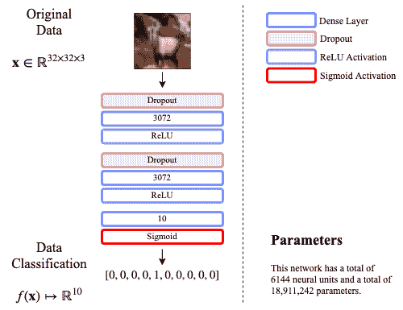

图 11.1 – CIFAR-10 的宽网络架构

我们从现在开始要考虑神经网络的一个重要方面是**参数**的数量。

在深度学习中，**参数**的数量定义为学习算法需要通过梯度下降技术估计的变量数量，以便最小化损失函数。大多数参数通常是网络的权重；然而，其他参数可能包括偏置、*批归一化*的均值和标准差、卷积网络的滤波器、循环网络的记忆向量以及许多其他内容。

了解参数的数量特别重要，因为在理想情况下，你希望数据样本的数量大于你想要学习的变量数。换句话说，理想的学习场景应该包含比参数更多的数据。如果你仔细想想，这是直观的；假设有一个矩阵，包含两行三列。三列描述的是水果的红、绿、蓝三色的表示。两行对应的是一个橙子的样本和一个苹果的样本。如果你想建立一个线性回归系统来判断数据是否来自橙子，你肯定希望有更多的数据！尤其是因为有很多苹果，它们的颜色可能与橙子的颜色相似。更多的数据更好！但如果你有更多的参数，比如在线性回归中，参数的数量与列数相同，那么你的问题通常会被描述为*不适定*问题。在深度学习中，这种现象被称为**过度参数化**。

只有在深度学习中，过度参数化的模型才会表现得非常好。有研究表明，在神经网络的特定情况下，考虑到数据在非线性关系中的冗余性，损失函数可以生成平滑的地形（Soltanolkotabi, M., et al. (2018)）。这尤其有趣，因为我们可以证明，过度参数化的深度学习模型在使用梯度下降时会收敛到非常好的解决方案（Du, S. S., et al. (2018)）。

### 摘要

在 Keras 中，有一个名为 `summary()` 的函数，当从 `Model` 对象调用时，可以显示需要估算的总参数数量。例如，让我们创建图 *Figure 11.1* 中的宽网络：

```py
from tensorflow.keras.layers import Input, Dense, Dropout
from tensorflow.keras.models import Model

inpt_dim = 32*32*3    # this corresponds to the dataset
                      # to be explained shortly
inpt_vec = Input(shape=(inpt_dim,), name='inpt_vec')
dl = Dropout(0.5, name='d1')(inpt_vec)
l1 = Dense(inpt_dim, activation='relu', name='l1')(dl)
d2 = Dropout(0.2, name='d2')(l1)
l2 = Dense(inpt_dim, activation='relu', name='l2') (d2)
output = Dense(10, activation='sigmoid', name='output') (l2)

widenet = Model(inpt_vec, output, name='widenet')

widenet.compile(loss='binary_crossentropy', optimizer='adam')
widenet.summary()
```

这段代码会产生以下输出：

```py
Model: "widenet"
_________________________________________________________________
Layer (type)           Output Shape    Param # 
=================================================================
inpt_vec (InputLayer)  [(None, 3072)]  0 
_________________________________________________________________
d1 (Dropout)           (None, 3072)    0 
_________________________________________________________________
l1 (Dense)             (None, 3072)    9440256 
_________________________________________________________________
d2 (Dropout)           (None, 3072)    0 
_________________________________________________________________
l2 (Dense)             (None, 3072)    9440256 
_________________________________________________________________
output (Dense)         (None, 10)      30730 
=================================================================
Total params: 18,911,242
Trainable params: 18,911,242
Non-trainable params: 0
```

此处生成的摘要表明模型中的参数总数为 18,911,242。这是为了说明，简单的宽网络在具有 3,072 个特征的问题中可以有近 1900 万个参数。这显然是一个过度参数化的模型，我们将在其上执行梯度下降来学习这些参数；换句话说，这是一个深度学习模型。

### 名称

本章将介绍的另一个新内容是使用 **名称** 来标识 Keras 模型中的各个组件。你应该注意到，在之前的代码中，脚本包含了一个新的参数并为其分配了一个字符串值；例如，`Dropout(0.5, **name**='d1')`。这在内部用于跟踪模型中各个部分的名称。这是一个好的实践，但并不是强制要求的。如果不提供名称，Keras 会自动为每个组件分配一个通用名称。为元素分配名称在保存或恢复模型时（我们很快就会做这件事——请耐心等待），或在打印摘要时（如前所述）可能会很有帮助。

现在，让我们看看将要加载的数据集。准确地说，就是之前提到的具有 3,072 个维度的数据集，称为 CIFAR-10。

## CIFAR-10 数据集

本章中我们将使用的数据集称为 **CIFAR-10**。它来源于 **Canadian Institute For Advanced Research**（**CIFAR**）的缩写。数字 10 来自数据集所包含的类别数量。它是一个彩色图像数据集，还有一个包含 100 种不同对象的替代数据库，称为 CIFAR-100；然而，我们现在将重点关注 CIFAR-10。每个彩色图像是 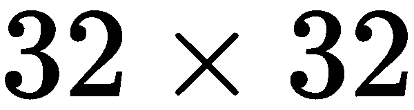 像素。考虑到颜色通道，它的总维度为 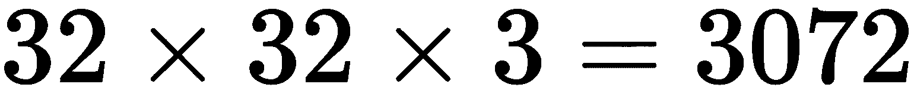。

图 *Figure 11.1* 中的示意图有一个图像样本，而图 *Figure 11.2* 中则展示了测试集内每个类别的示例：

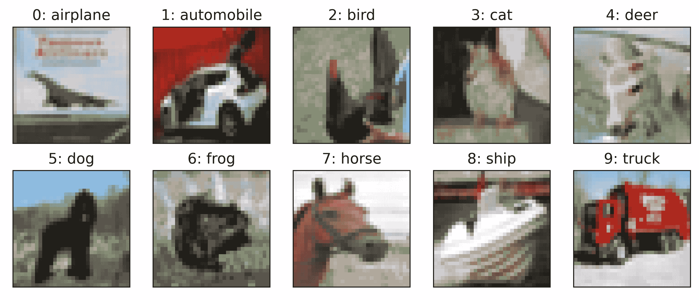

图 11.2 – CIFAR-10 数据集中每个类别的样本彩色图像

可以通过执行以下命令来加载该数据集：

```py
from tensorflow.keras.datasets import cifar10
from tensorflow.keras.utils import to_categorical
import NumPy as np

(x_train, y_train), (x_test, y_test) = cifar10.load_data()

# Makes images floats between [0,1]
x_train = x_train.astype('float32') / 255.
x_test = x_test.astype('float32') / 255.

# Reshapes images to make them vectors of 3072-dimensions
x_train = x_train.reshape((len(x_train), np.prod(x_train.shape[1:])))
x_test = x_test.reshape((len(x_test), np.prod(x_test.shape[1:])))

# Converts list of numbers into one-hot encoded vectors of 10-dim
y_train = to_categorical(y_train, 10)
y_test = to_categorical(y_test, 10)

print('x_train shape:', x_train.shape)
print('x_test shape:', x_test.shape)
```

这会自动下载数据并产生以下输出：

```py
x_train shape: (50000, 3072)
x_test shape: (10000, 3072)
```

这些内容除了数据集外，没什么新鲜的。关于数据集的准备方式，请参考第三章，*数据准备*，我们将在其中讲解如何通过标准化数据并将目标转换为独热编码来将数据转化为可用数据。

我们通过打印数据集的形状，使用 NumPy 数组的`.shape`属性得到的输出显示，我们有 50,000 个样本用于训练，另外还有 10,000 个样本用于测试训练效果。这是深度学习社区的标准数据集划分方式，便于不同方法间的比较。

## 新的训练工具

通过到目前为止的代码，我们可以很容易地开始训练过程，只需像下面这样调用`fit()`方法：

```py
widenet.fit(x_train, y_train, epochs=100, batch_size=1000, 
            shuffle=True, validation_data=(x_test, y_test))
```

这些并不新颖，我们在第九章，*变分自编码器*中已经讲解过这些细节。然而，我们希望引入一些新的重要工具，这些工具将帮助我们更高效地训练更好的模型，并保存我们最优训练的模型。

### 保存或加载模型

保存训练好的模型很重要，如果我们想销售产品、分发工作架构，或控制模型的版本，这样的模型可以通过调用以下任一方法来保存：

+   `save()`，用于保存整个模型，包括优化器的状态，例如梯度下降算法、迭代次数、学习率等。

+   `save_weights()`，用于仅保存模型的参数。

例如，我们可以按以下方式保存模型的权重：

```py
widenet.save_weights("widenet.hdf5")
```

这将会在本地磁盘上创建一个名为`widenet.hdf5`的文件。这种文件扩展名对应一种叫做**层次数据格式**（**HDF**）的标准文件格式，它可以确保跨平台的一致性，因此，便于数据共享。

你可以稍后通过执行以下命令重新加载保存的模型：

```py
widenet.load_weights("widenet.hdf5")
```

请注意，执行此操作前你必须先构建好模型，即按照**精确**的顺序创建所有模型层，并使用完全相同的名称。另一种替代方法是使用`save()`方法来避免重新构建模型。

```py
widenet.save("widenet.hdf5")
```

然而，使用`save()`方法的缺点是，为了加载模型，你将需要导入一个额外的库，如下所示：

```py
from tensorflow.keras.models import load_model

widenet = load_model("widenet.hdf5")
```

本质上，这样就不需要重新创建模型了。在本章中，我们将通过保存模型权重来让你习惯这一过程。现在，让我们来看一下如何使用**回调函数**，这是一种监控学习过程的有趣方法。我们将从一个**用于降低学习率的回调**开始。

### 动态降低学习率

Keras 有一个`callbacks`的父类，位于`tensorflow.keras.callbacks`中，在这里我们有其他有用的工具，其中包括一个用于减少学习率的类。如果你不记得**学习率**是什么，可以回到第六章，*训练多层神经网络*，复习一下这个概念。不过，简而言之，学习率控制了更新模型参数时沿梯度方向所采取的步长大小。

问题在于，很多时候，你会遇到某些深度学习模型在学习过程中*陷入困境*。我们所说的*陷入困境*是指在训练集或验证集上，损失函数没有取得任何进展。专业人士使用的技术术语是，学习看起来像是**平台期**。这是一个显而易见的问题，尤其是当你查看损失函数在多个训练轮次（epochs）中的变化时，因为它看起来像是一个*平台期*，也就是一条平坦的线。理想情况下，我们希望看到损失在每个训练轮次中都在下降，通常在前几个训练轮次中是这样的，但有时降低学习率能帮助学习算法通过对现有已学知识（即已学得的参数）做出小的调整来*集中注意力*，从而继续进步。

我们在这里讨论的类叫做`ReduceLROnPlateau`。你可以按如下方式加载它：

```py
from tensorflow.keras.callbacks import ReduceLROnPlateau
```

要使用这个库，你需要在定义后，在`fit()`函数中使用`callbacks`参数，如下所示：

```py
reduce_lr = ReduceLROnPlateau(monitor='val_loss', factor=0.1, patience=20)

widenet.fit(x_train, y_train, batch_size=128, epochs=100, 
            callbacks=reduce_lr, shuffle=True, 
            validation_data=(x_test, y_test))
```

在这段代码中，我们使用以下参数调用`ReduceLROnPlateau`：

+   `monitor='val_loss'`，这是默认值，但你可以更改它以查看`'loss'`曲线中的平台期。

+   `factor=0.1`，这是默认值，表示学习率将被减少的比例。例如，Adam 优化器的默认学习率是 0.001，但当检测到平台期时，它会乘以 0.1，从而得到新的学习率 0.0001。

+   `patience=20`，默认值是 10，表示在监视的损失没有改善的情况下，连续多少轮次会被认为是平台期。

这个方法中还有其他参数可以使用，但在我看来，这些是最常用的。

接下来，我们来看另一个重要的回调：*提前停止*。

### 提前停止学习过程

下一个回调很有趣，因为它允许你在没有进展的情况下停止训练，并且**它允许你在学习过程中保留模型的最佳版本**。它与前一个回调在同一个类中，名为`EarlyStopping()`，你可以按如下方式加载它：

```py
from tensorflow.keras.callbacks import EarlyStopping
```

提前停止回调本质上让你在指定的`patience`参数指定的若干训练轮次内没有进展时停止训练过程。你可以按如下方式定义并使用提前停止回调：

```py
stop_alg = EarlyStopping(monitor='val_loss', patience=100, restore_best_weights=True)

widenet.fit(x_train, y_train, batch_size=128, epochs=1000, 
            callbacks=stop_alg, shuffle=True, 
            validation_data=(x_test, y_test))
```

下面是 `EarlyStopping()` 中每个参数的简短解释：

+   `monitor='val_loss'`，这是默认值，但你可以更改为查看 `'loss'` 曲线的变化。

+   `patience=100`，默认值为 10，是指在监控的损失没有改善的轮数。我个人喜欢将这个值设置为比 `ReduceLROnPlateau` 中的耐心值更大的数值，因为我喜欢在终止学习过程之前，先让学习率在学习过程中产生一些改善（希望如此），而不是因为没有改善就提前结束。

+   `restore_best_weights=True`，默认值为 `False`。如果为 `False`，则会保存最后一轮训练得到的模型权重。但是，如果设置为 `True`，它将保存并返回学习过程中最好的权重。

这个最后的参数是我个人最喜欢的，因为我可以将训练的轮数设置为一个合理的较大数值，让训练持续进行，直到它需要的时间为止。在前面的示例中，如果我们将训练轮数设置为 1,000，这并不意味着学习过程会进行 1,000 轮，但如果在 50 轮内没有进展，过程可以提前终止。如果过程已经达到了一个点，模型学到了良好的参数，但没有进一步的进展，那么可以在 50 轮后停止，并仍然返回在学习过程中记录下的最佳模型。

我们可以将所有前面的回调函数和保存方法结合如下：

```py
from tensorflow.keras.callbacks import ReduceLROnPlateau, EarlyStopping

reduce_lr = ReduceLROnPlateau(monitor='val_loss', factor=0.5, patience=20)
stop_alg = EarlyStopping(monitor='val_loss', patience=100, 
                         restore_best_weights=True)

hist = widenet.fit(x_train, y_train, batch_size=1000, epochs=1000, 
                   callbacks=[stop_alg, reduce_lr], shuffle=True, 
                   validation_data=(x_test, y_test))

widenet.save_weights("widenet.hdf5")
```

注意，回调函数已经被合并成一个回调列表，监控学习过程，寻找平稳期来降低学习率，或在几轮内没有改善时终止过程。同时，注意我们创建了一个新变量 `hist`。这个变量包含一个字典，记录了学习过程中的日志，例如每轮的损失。我们可以绘制这些损失曲线，看看训练过程是如何进行的，如下所示：

```py
import matplotlib.pyplot as plt

plt.plot(hist.history['loss'], color='#785ef0')
plt.plot(hist.history['val_loss'], color='#dc267f')
plt.title('Model reconstruction loss')
plt.ylabel('Binary Cross-Entropy Loss')
plt.xlabel('Epoch')
plt.legend(['Training Set', 'Test Set'], loc='upper right')
plt.show()
```

这将生成 *图 11.3* 中的曲线：

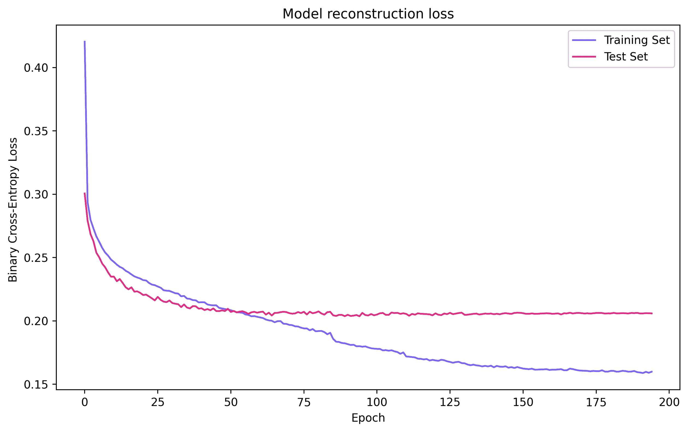

图 11.3 – 使用回调函数的 widenet 模型损失随轮次变化的曲线

从图中我们可以清楚地看到，在第 85 轮左右，学习率下降的证据，在验证损失（即测试集上的损失）平稳后进行调整；然而，这对验证损失几乎没有影响，因此训练在大约第 190 轮时提前终止，因为验证损失没有改善。

在下一节中，我们将以定量的方式分析 `widenet` 模型的性能，以便稍后进行比较。

## 结果

在这里，我们只是想以易于理解并能与他人沟通的方式来解释网络的性能。我们将重点分析模型的混淆矩阵、精度、召回率、F1 分数、准确率和均衡误差率。如果你不记得这些术语的含义，请返回并快速复习第四章，*数据学习*。

scikit-learn 的一个优点是它有一个自动化过程，可以生成一个分类性能报告，其中包括上述大部分术语。这个报告被称为**分类报告**。我们将需要的其他库可以在`sklearn.metrics`类中找到，并可以按如下方式导入：

```py
from sklearn.metrics import classification_report
from sklearn.metrics import confusion_matrix
from sklearn.metrics import balanced_accuracy_score
```

这三种库的工作方式类似——它们使用真实标签和预测值来评估性能：

```py
from sklearn.metrics import classification_report
from sklearn.metrics import confusion_matrix
from sklearn.metrics import balanced_accuracy_score
import NumPy as np

y_hat = widenet.predict(x_test) # we take the neuron with maximum
y_pred = np.argmax(y_hat, axis=1)  # output as our prediction

y_true = np.argmax(y_test, axis=1)   # this is the ground truth
labels=[0, 1, 2, 3, 4, 5, 6, 7, 8, 9]

print(classification_report(y_true, y_pred, labels=labels))

cm = confusion_matrix(y_true, y_pred, labels=labels)
print(cm)

ber = 1- balanced_accuracy_score(y_true, y_pred)
print('BER:', ber)
```

这段代码输出类似如下内容：

```py
    precision  recall  f1-score  support
0   0.65       0.59    0.61      1000
1   0.65       0.68    0.67      1000
2   0.42       0.47    0.44      1000
3   0.39       0.37    0.38      1000
4   0.45       0.44    0.44      1000
5   0.53       0.35    0.42      1000
6   0.50       0.66    0.57      1000
7   0.66       0.58    0.62      1000
8   0.62       0.71    0.67      1000
9   0.60       0.57    0.58      1000

accuracy               0.54      10000

[[587  26  86  20  39   7  26  20 147  42]
 [ 23 683  10  21  11  10  22  17  68 135]
 [ 63  21 472  71 141  34 115  41  24  18]
 [ 19  22  90 370  71 143 160  43  30  52]
 [ 38  15 173  50 442  36 136  66  32  12]
 [ 18  10 102 224  66 352 120  58  29  21]
 [  2  21  90  65  99  21 661   9  14  18]
 [ 36  15  73  67  90  45  42 582  13  37]
 [ 77  70  18  24  17   3  20   9 713  49]
 [ 46 167  20  28  14  14  30  36  74 571]]

BER: 0.4567
```

顶部部分显示了`classification_report()`的输出。它提供了模型的精度、召回率、F1 分数和准确率。理想情况下，我们希望这些数字尽可能接近 1.0。直观上，准确率需要达到 100%（或 1.0）；然而，其他的数字则需要仔细研究。从这个报告中，我们可以观察到总准确率为 54%。从报告的其余部分，我们可以确定分类准确性较高的类别是 1 和 8，分别对应*汽车*和*船只*。类似地，我们可以看到分类最差的两个类别是 3 和 5，分别对应*猫*和*狗*。

虽然这些数字提供了信息，但我们可以通过查看混淆矩阵来探究混淆的来源，混淆矩阵是由`confusion_matrix()`生成的一组数字。如果我们检查第四行（对应标签 3，*猫*）的混淆矩阵，我们可以看到它正确地将 370 只猫分类为猫，但 143 只猫被分类为狗，160 只猫被分类为青蛙，这些是最严重的混淆区域。另一种视觉化查看的方式如下图所示：

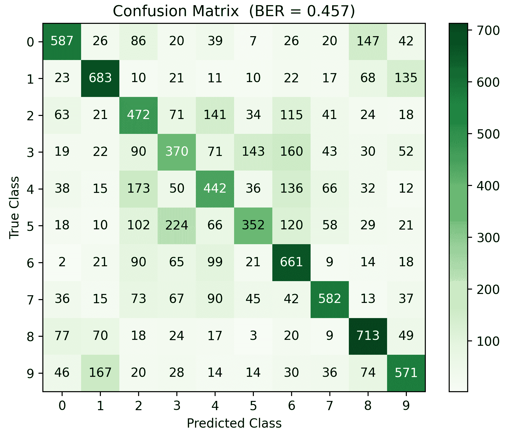

图 11.4 – widenet 模型的混淆矩阵可视化

理想情况下，我们希望看到一个对角线的混淆矩阵；然而，在这种情况下，我们并未看到这种效果。通过目视检查，从*图 11.4*中，我们可以观察到哪些类别的正确预测最少，并在视觉上确认混淆的地方。

最后，重要的是要注意，虽然**分类准确率**（**ACC**）为 54%，我们仍然需要验证**平衡误差率**（**BER**），以补充我们对准确率的了解。当类别分布不均时，特别重要，即某些类别的样本多于其他类别。如第四章《从数据中学习》中所解释，我们可以简单地计算平衡准确率并从中减去 1。这显示出 BER 为 0.4567，即 45.67%。在理想情况下，我们希望将 BER 降到零，绝对避免 BER 为 50%，这意味着模型的表现与随机猜测没有区别。

在这种情况下，模型的准确性并不令人印象深刻；然而，这是一个非常具有挑战性的分类问题，尤其对于全连接网络而言，因此，这一表现并不令人惊讶。接下来，我们将尝试做一个类似的实验，将网络从相对宽的网络改为深度网络，并对比结果。

# 稠密深度神经网络

众所周知，深度网络在分类任务中可以提供良好的性能（Liao, Q., 等，2018）。在本节中，我们希望构建一个深度稠密神经网络，并观察它在 CIFAR-10 数据集上的表现。我们将构建如下图所示的模型：

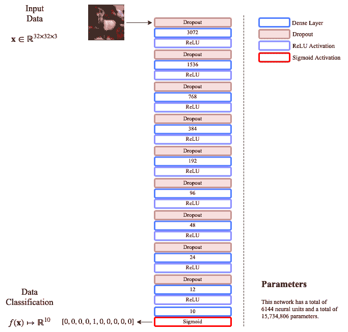

图 11.5 – CIFAR-10 深度稠密网络的网络架构

该模型的目标之一是与*图 11.1*中的宽网络具有相同数量的神经单元。该模型具有瓶颈架构，其中神经元的数量随着网络加深而减少。我们可以使用 Keras 的函数式方法以编程方式实现这一点，接下来我们将讨论。

## 构建和训练模型

关于 Keras 的函数式方法，一个有趣的事实是，在构建模型时，我们可以**重复使用**变量名，甚至可以通过循环构建模型。例如，假设我想创建具有 dropout 比例的稠密层，这些比例会随着神经元数量的增加而指数下降，下降的因子分别为 1.5 和 2。

我们可以通过一个循环来实现这一点，循环使用初始的 dropout 比率 `dr` 和初始的神经单元数量 `units`，每次分别按因子 1.5 和 2 递减，前提是神经单元的数量始终大于 10；我们在 10 停止，因为最后一层将包含 10 个神经元，每个类别一个。大致如下所示：

```py
while units > 10: 
  dl = Dropout(dr)(dl)
  dl = Dense(units, activation='relu')(dl)
  units = units//2
  dr = dr/1.5
```

前面的代码片段说明了我们可以重用变量而不至于让 Python 混淆，因为 TensorFlow 在计算图上操作，能够正确解决图中各部分的顺序。代码还显示了我们可以非常轻松地创建一个瓶颈型网络，其中单元数和 dropout 比例按指数衰减。

构建此模型的完整代码如下：

```py
# Dimensionality of input for CIFAR-10
inpt_dim = 32*32*3

inpt_vec = Input(shape=(inpt_dim,))

units = inpt_dim    # Initial number of neurons 
dr = 0.5    # Initial drop out rate   

dl = Dropout(dr)(inpt_vec)
dl = Dense(units, activation='relu')(dl)

# Iterative creation of bottleneck layers
units = units//2
dr = dr/2
while units>10: 
 dl = Dropout(dr)(dl)
 dl = Dense(units, activation='relu')(dl)
 units = units//2
 dr = dr/1.5

# Output layer
output = Dense(10, activation='sigmoid')(dl)

deepnet = Model(inpt_vec, output)
```

编译并训练模型的过程如下：

```py
deepnet.compile(loss='binary_crossentropy', optimizer='adam')
deepnet.summary()

reduce_lr = ReduceLROnPlateau(monitor='val_loss', factor=0.5, patience=20, 
                              min_delta=1e-4, mode='min')
stop_alg = EarlyStopping(monitor='val_loss', patience=100, 
                         restore_best_weights=True)
hist = deepnet.fit(x_train, y_train, batch_size=1000, epochs=1000, 
                   callbacks=[stop_alg, reduce_lr], shuffle=True, 
                   validation_data=(x_test, y_test))

deepnet.save_weights("deepnet.hdf5")
```

这会产生以下输出，这是由前面的`deepnet.summary()`产生的：

```py
Model: "model"
_________________________________________________________________
Layer (type)          Output Shape    Param # 
=================================================================
input_1 (InputLayer)  [(None, 3072)]  0 
_________________________________________________________________
dropout (Dropout)     (None, 3072)    0 
_________________________________________________________________
dense (Dense)         (None, 3072)    9440256 
_________________________________________________________________
.
.
.
_________________________________________________________________
dense_8 (Dense)       (None, 12)      300 
_________________________________________________________________
dense_9 (Dense)       (None, 10)      130 
=================================================================
Total params: 15,734,806
Trainable params: 15,734,806
Non-trainable params: 0
```

如前面的总结所示，且在*图 11.5*中也展示了，该模型的总参数数量为**15,734,806**。这确认了该模型是一个过度参数化的模型。打印的总结还展示了在没有特定名称的情况下，模型的各个部分是如何命名的；即它们都基于类名和连续的编号获得一个通用名称。

`fit()` 方法用于训练深度模型，当我们像之前在*图 11.3*中一样绘制训练记录在`hist`变量中的内容时，我们得到以下图像：

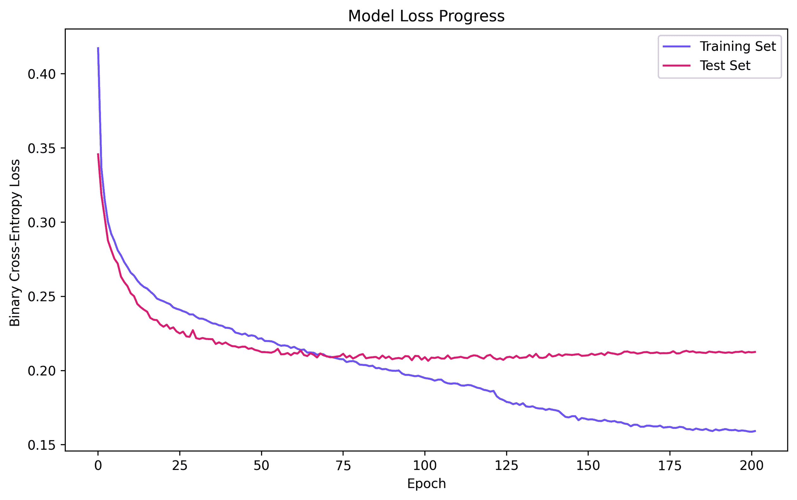

图 11.6 – 使用回调函数在不同 epoch 下的深度网络损失

从*图 11.6*中可以看出，深度网络在大约 200 个 epoch 后停止训练，训练集和测试集在大约第 70 个 epoch 交叉，之后模型开始对训练集过拟合。如果我们将这个结果与*图 11.3*中的宽网络结果进行比较，可以看到模型大约在第 55 个 epoch 开始过拟合。

现在我们来讨论该模型的定量结果。

## 结果

如果我们以与宽网络相同的方式生成分类报告，我们得到如下结果：

```py
     precision  recall  f1-score  support

 0   0.58       0.63    0.60      1000
 1   0.66       0.68    0.67      1000
 2   0.41       0.42    0.41      1000
 3   0.38       0.35    0.36      1000
 4   0.41       0.50    0.45      1000
 5   0.51       0.36    0.42      1000
 6   0.50       0.63    0.56      1000
 7   0.67       0.56    0.61      1000
 8   0.65       0.67    0.66      1000
 9   0.62       0.56    0.59      1000

 accuracy               0.53      10000

[[627  22  62  19  45  10  25  18 132  40]
 [ 38 677  18  36  13  10  20  13  55 120]
 [ 85  12 418  82 182  45  99  38  23  16]
 [ 34  14 105 347  89 147 161  50  17  36]
 [ 58  12 158  34 496  29 126  55  23   9]
 [ 25   7 108 213  91 358 100  54  23  21]
 [ 9   15  84  68 124  26 631   7  11  25]
 [ 42  23  48  58 114  57  61 555  10  32]
 [110  75  16  22  30  11   8   5 671  52]
 [ 51 171  14  34  16   9  36  36  69 564]]

BER 0.4656
```

这表明与宽网络的结果相当，其中我们得到了 0.4567 的 BER，这代表了 0.0089 的差异，偏向于宽网络，这在此情况下并不代表显著差异。我们可以通过查看前面的结果或下图所示的混淆矩阵，验证模型在特定类别上的分类性能也是可比的：

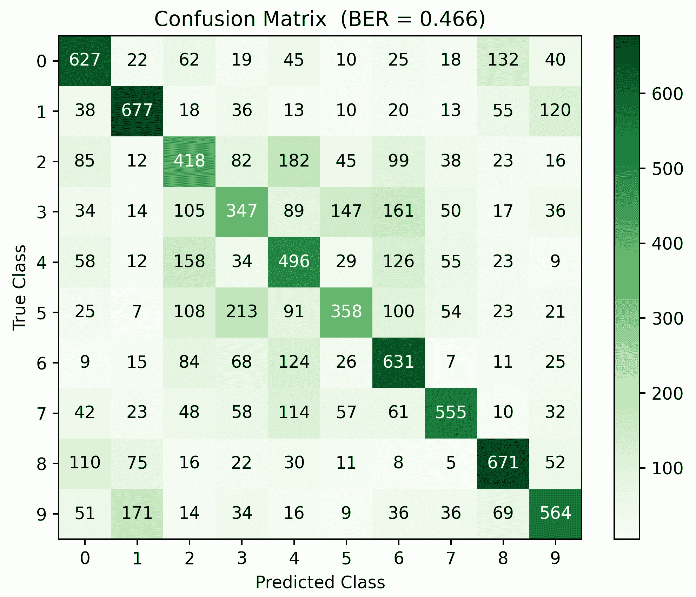

图 11.7 – 深度网络模型的混淆矩阵可视化

从前面的结果可以确认，最难分类的类别是第 3 类，*猫*，它们经常与狗混淆。同样，最容易分类的是第 1 类，*船*，它们经常与飞机混淆。但再一次，这与宽网络的结果一致。

另一种我们可以尝试的深度网络类型是促进网络权重稀疏性的网络，我们将在接下来讨论。

# 稀疏深度神经网络

稀疏网络可以在其架构的不同方面定义为*sparse*（Gripon, V., 和 Berrou, C., 2011）。然而，本节中我们将研究的特定稀疏性是指与网络的权重相关的稀疏性，即其参数。我们将检查每个具体的参数，看它是否接近于零（从计算的角度来看）。

当前，在 Keras 上通过 TensorFlow 施加权重稀疏性有三种方式，它们与向量范数的概念相关。如果我们看曼哈顿范数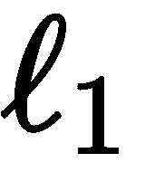，或者欧几里得范数，它们的定义如下：

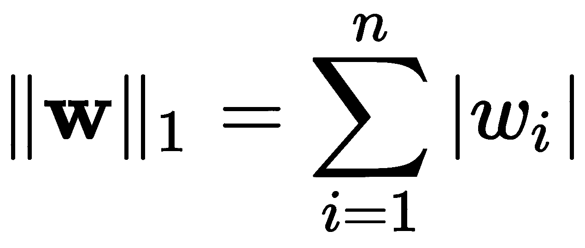,

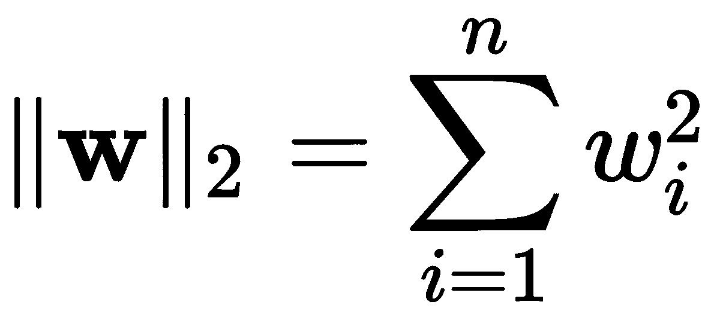

这里，`n` 是向量中元素的数量 。正如你所看到的，简而言之，-norm 会根据元素的绝对值将所有元素相加，而-norm 会根据元素的平方值来相加。显然，如果两个范数都接近零，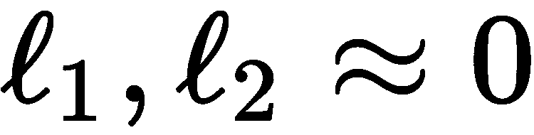，大多数元素很可能是零或接近零。在这里，个人选择是使用-norm，因为与相比，较大的向量会受到平方惩罚，从而避免特定神经元主导某些项。

Keras 包含这些工具在`regularizers`类中：`tf.keras.regularizers`。我们可以按如下方式导入它们：

+   -norm: `tf.keras.regularizers.l1(l=0.01)`

+   -norm: `tf.keras.regularizers.l2(l=0.01)`

这些正则化器应用于网络的损失函数，以最小化权重的范数。

**正则化器**是机器学习中用来表示一个术语或函数，它将元素提供给目标（损失）函数，或一般的优化问题（如梯度下降），以提供数值稳定性或促进问题的可行性。在这种情况下，正则化器通过防止某些权重值的爆炸，同时促进一般稀疏性，从而促进权重的稳定性。

参数`l=0.01`是一个惩罚因子，它直接决定了最小化权重范数的重要性。换句话说，惩罚按如下方式应用：

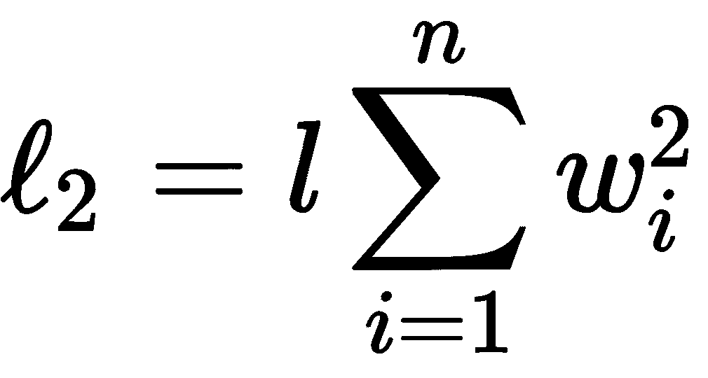

因此，使用非常小的值，如`l=0.0000001`，将对范数关注较少，而`l=0.01`将在最小化损失函数时对范数给予更多关注。关键是：这个参数需要调整，因为如果网络太大，可能会有几百万个参数，这会导致范数看起来非常大，因此需要一个小的惩罚；而如果网络相对较小，则建议使用更大的惩罚。由于这个练习是在一个拥有超过 1500 万个参数的非常深的网络上进行的，我们将使用`l=0.0001`的值。

让我们继续构建一个稀疏网络。

## 构建稀疏网络并训练它

要构建这个网络，我们将使用与*图 11.5*中显示的完全相同的架构，只是每个单独的密集层的声明将包含一个我们希望考虑该层权重的范数最小化的规范。请查看前一节的代码，并将其与以下代码进行比较，其中我们突出显示了差异：

```py
# Dimensionality of input for CIFAR-10
inpt_dim = 32*32*3

inpt_vec = Input(shape=(inpt_dim,))

units = inpt_dim    # Initial number of neurons 
dr = 0.5    # Initial drop out rate   

dl = Dropout(dr)(inpt_vec)
dl = Dense(units, activation='relu', 
           kernel_regularizer=regularizers.l2(0.0001))(dl)

# Iterative creation of bottleneck layers
units = units//2
dr = dr/2
while units>10: 
  dl = Dropout(dr)(dl)
  dl = Dense(units, activation='relu', 
             kernel_regularizer=regularizers.l2(0.0001))(dl)
  units = units//2
  dr = dr/1.5

# Output layer
output = Dense(10, activation='sigmoid', 
               kernel_regularizer=regularizers.l2(0.0001))(dl)

sparsenet = Model(inpt_vec, output)
```

编译和训练模型是相同的，像这样：

```py
sparsenet.compile(loss='binary_crossentropy', optimizer='adam')
sparsenet.summary()

reduce_lr = ReduceLROnPlateau(monitor='val_loss', factor=0.5, patience=20, 
                              min_delta=1e-4, mode='min')
stop_alg = EarlyStopping(monitor='val_loss', patience=100, 
                         restore_best_weights=True)
hist = sparsenet.fit(x_train, y_train, batch_size=1000, epochs=1000, 
                     callbacks=[stop_alg, reduce_lr], shuffle=True, 
                     validation_data=(x_test, y_test))

sparsenet.save_weights("sparsenet.hdf5")
```

`sparsenet.summary()` 的输出与前一节中的 `deepnet.summary()` 完全相同，因此我们这里不再重复。但是，我们可以看一下当损失最小化时的训练曲线 - 请参见以下图：

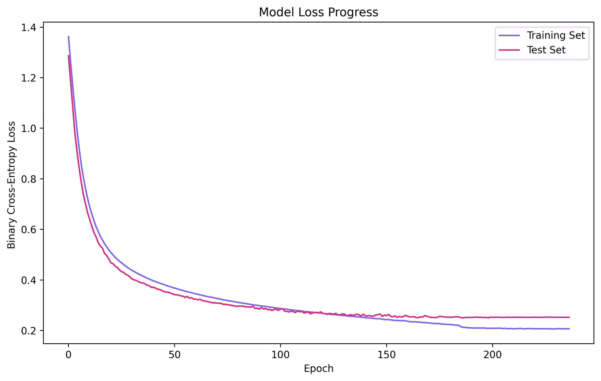

图 11.8 - 稀疏网络模型跨时期的损失函数优化

从图中可以看出，训练集和测试集的两条曲线在大约第 120 个时期之前非常接近最小值，之后开始偏离，模型开始过拟合。与*图 11.3*和*图 11.6*中的先前模型相比，我们可以看到这个模型的训练速度可以稍慢一些，仍然可以实现相对收敛。然而，请注意，虽然损失函数仍然是二元交叉熵，但模型也在最小化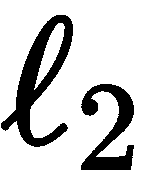-范数，使得这种特定的损失函数与先前的不可直接比较。

现在让我们讨论该模型的定量结果。

## 结果

当我们进行性能的定量分析时，我们可以看出该模型与先前的模型相比是可比的。在 BER 方面有轻微的增益；然而，这并不足以宣布胜利，并且问题解决的任何手段都不足以解决问题 - 请参阅以下分析：

```py
     precision recall f1-score support

 0   0.63      0.64   0.64     1000
 1   0.71      0.66   0.68     1000
 2   0.39      0.43   0.41     1000
 3   0.37      0.23   0.29     1000
 4   0.46      0.45   0.45     1000
 5   0.47      0.50   0.49     1000
 6   0.49      0.71   0.58     1000
 7   0.70      0.61   0.65     1000
 8   0.63      0.76   0.69     1000
 9   0.69      0.54   0.60     1000

 accuracy             0.55     10000

[[638  17  99   7  27  13  27  10 137  25]
 [ 40 658  11  32  11   7  21  12 110  98]
 [ 78  11 431  34 169  93 126  31  19   8]
 [ 18  15  96 233  52 282 220  46  14  24]
 [ 47   3 191  23 448  36 162  57  28   5]
 [ 17   6 124 138  38 502 101  47  16  11]
 [  0   9  59  51 111  28 715   8  13   6]
 [ 40   1  66  50  85  68  42 608  12  28]
 [ 76  45  18  16  25   8  22   5 755  30]
 [ 51 165  12  38   6  23  29  43  98 535]]

BER 0.4477
```

我们可以清楚地得出结论，与本章讨论的其他模型相比，该模型在性能上并不更差。事实上，对以下图中显示的混淆矩阵的仔细检查表明，这个网络在性质相似的对象方面也会产生类似的错误：

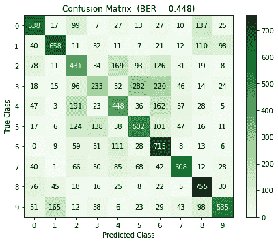

图 11.9 - 稀疏网络模型的混淆矩阵

现在，由于很难理解到目前为止我们讨论的模型之间的差异 - 广泛、深入和稀疏，我们可以计算并绘制每个训练模型权重的范数，如下图所示：

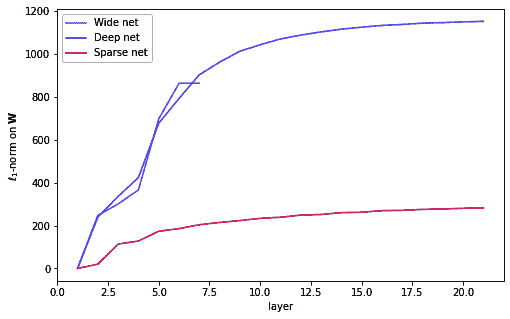

图 11.10 - 训练模型的累积范数权重

该图显示了按-范数进行的计算，从而使得数值足够接近以便进行评估；在横轴上是层数，纵轴上是随着网络层数增加的累积范数。这是我们可以欣赏到不同网络在其参数上的差异之处。在稀疏网络中，累积范数比其他网络要小得多（大约是其他网络的四到五倍）。对于那些可能被实现到芯片上或其他零权重能在生产中带来高效计算的应用来说，这可能是一个有趣且重要的特征（Wang, P. 等，2018）。

虽然网络权重受范数影响的程度可以通过超参数优化技术进行实验确定，但通常更常见的是确定其他参数，例如丢弃率、神经单元数量等，这些将在下一节讨论。

# 超参数优化

有一些方法可以用来优化参数；例如，有些是基于梯度的（Rivas, P. 等，2014；Maclaurin, D. 等，2015*），而其他则是贝叶斯方法（Feurer, M. 等，2015*）。然而，至今还没有一种通用的方法能够既极其有效又高效——通常你只能获得其中之一。你可以在这里阅读更多关于其他算法的内容（Bergstra, J. S. 等，2011*）。

对于该领域的任何初学者来说，最好从一些简单且容易记住的东西入手，例如随机搜索（Bergstra, J. & Bengio, Y. 2012*）或网格搜索。这两种方法非常相似，虽然我们这里重点讨论**网格搜索**，但这两者的实现非常相似。

## 库和参数

我们将需要使用两个我们之前未涉及过的主要库：`GridSearchCV`，用于执行带有交叉验证的网格搜索，和`KerasClassifier`，用于创建可以与 scikit-learn 通信的 Keras 分类器。

两个库可以如下导入：

```py
from sklearn.model_selection import GridSearchCV
from tensorflow.keras.wrappers.scikit_learn import KerasClassifier
```

我们将优化的超参数（及其可能的值）如下：

+   **丢弃率**：`0.2`，`0.5`

+   **优化器**：`rmsprop`，`adam`

+   **学习率**：`0.01`，`0.0001`

+   **隐藏层中的神经元数量**：`1024`，`512`，`256`

总的来说，超参数的可能组合是 2x2x2x3=24。这是四维网格中的选项总数。替代方案的数量可以更大、更全面，但请记住：为了简单起见，我们在这个例子中保持简单。此外，由于我们将应用交叉验证，你需要将可能的组合数乘以交叉验证中的划分数量，这样就能得出为确定最佳超参数组合所执行的完整端到端训练会话的数量。

请注意你将在网格搜索中尝试的选项数量，因为所有这些选项都会被测试，对于较大的网络和数据集，这可能会花费很多时间。随着经验的积累，你将能够通过思考所定义的架构来选择更小的参数集。

完整的实现将在下一节讨论。

## 实现与结果

这里展示了网格搜索的完整代码，但请注意，这些内容大多是重复的，因为它是基于本章前面讨论的宽网络模型进行建模的：

```py
from sklearn.model_selection import GridSearchCV
from tensorflow.keras.wrappers.scikit_learn import KerasClassifier
from tensorflow.keras.layers import Input, Dense, Dropout
from tensorflow.keras.models import Model
from tensorflow.keras.optimizers import Adam, RMSprop
from tensorflow.keras.datasets import cifar10
from tensorflow.keras.utils import to_categorical
from tensorflow.keras.callbacks import ReduceLROnPlateau, EarlyStopping
import NumPy as np

# load and prepare data (same as before)
(x_train, y_train), (x_test, y_test) = cifar10.load_data()
x_train = x_train.astype('float32') / 255.0
x_test = x_test.astype('float32') / 255.0
x_train = x_train.reshape((len(x_train), np.prod(x_train.shape[1:])))
x_test = x_test.reshape((len(x_test), np.prod(x_test.shape[1:])))
y_train = to_categorical(y_train, 10)
y_test = to_categorical(y_test, 10)
```

我们声明一个方法来构建模型并返回它，代码如下：

```py
# A KerasClassifier will use this to create a model on the fly
def make_widenet(dr=0.0, optimizer='adam', lr=0.001, units=128):
  # This is a wide architecture
  inpt_dim = 32*32*3
  inpt_vec = Input(shape=(inpt_dim,))
  dl = Dropout(dr)(inpt_vec)
  l1 = Dense(units, activation='relu')(dl)
  dl = Dropout(dr)(l1)
  l2 = Dense(units, activation='relu') (dl)
  output = Dense(10, activation='sigmoid') (l2)

  widenet = Model(inpt_vec, output)

  # Our loss and lr depends on the choice
  if optimizer == 'adam':
    optmzr = Adam(learning_rate=lr)
  else:
    optmzr = RMSprop(learning_rate=lr)

  widenet.compile(loss='binary_crossentropy', optimizer=optmzr, 
                  metrics=['accuracy'])

  return widenet
```

然后我们将各部分拼接在一起，搜索参数，并按如下方式进行训练：

```py
# This defines the model architecture
kc = KerasClassifier(build_fn=make_widenet, epochs=100, batch_size=1000, 
                     verbose=0)

# This sets the grid search parameters
grid_space = dict(dr=[0.2, 0.5],      # Dropout rates
                  optimizer=['adam', 'rmsprop'], 
                  lr=[0.01, 0.0001],  # Learning rates
                  units=[1024, 512, 256])

gscv = GridSearchCV(estimator=kc, param_grid=grid_space, n_jobs=1, cv=3, verbose=2)
gscv_res = gscv.fit(x_train, y_train, validation_split=0.3,
                    callbacks=[EarlyStopping(monitor='val_loss', 
                                             patience=20, 
                                             restore_best_weights=True),
                               ReduceLROnPlateau(monitor='val_loss', 
                                                 factor=0.5, patience=10)])

# Print the dictionary with the best parameters found:
print(gscv_res.best_params_)
```

这将打印出几行，每一行对应交叉验证运行一次。我们在这里省略了很多输出，只是为了向你展示它的样子，但如果你愿意，可以手动调整输出的详细程度：

```py
Fitting 3 folds for each of 24 candidates, totalling 72 fits
[CV] dr=0.2, lr=0.01, optimizer=adam, units=1024 .....................
[Parallel(n_jobs=1)]: Using backend SequentialBackend with 1 concurrent workers.
[CV] ...... dr=0.2, lr=0.01, optimizer=adam, units=1024, total= 21.1s
[CV] dr=0.2, lr=0.01, optimizer=adam, units=1024 .....................
[Parallel(n_jobs=1)]: Done 1 out of 1 | elapsed: 21.1s remaining: 0.0s
[CV] ...... dr=0.2, lr=0.01, optimizer=adam, units=1024, total= 21.8s
[CV] dr=0.2, lr=0.01, optimizer=adam, units=1024 .....................
[CV] ...... dr=0.2, lr=0.01, optimizer=adam, units=1024, total= 12.6s
[CV] dr=0.2, lr=0.01, optimizer=adam, units=512 ......................
[CV] ....... dr=0.2, lr=0.01, optimizer=adam, units=512, total= 25.4s
.
.
.
[CV] .. dr=0.5, lr=0.0001, optimizer=rmsprop, units=256, total= 9.4s
[CV] dr=0.5, lr=0.0001, optimizer=rmsprop, units=256 .................
[CV] .. dr=0.5, lr=0.0001, optimizer=rmsprop, units=256, total= 27.2s
[Parallel(n_jobs=1)]: Done 72 out of 72 | elapsed: 28.0min finished

{'dr': 0.2, 'lr': 0.0001, 'optimizer': 'adam', 'units': 1024}
```

最后一行是你最宝贵的信息，因为它是最佳参数组合，能带来最佳的结果。现在，你可以使用这些**优化后的**参数来更改你原始的宽网络实现，看看性能变化。你应该会看到平均准确率提升约 5%，这并不差！

或者，你可以尝试更大范围的参数集，或者增加交叉验证的分割数。可能性是无穷的。你应该始终尝试优化模型中的参数数量，原因如下：

+   它让你对自己的模型充满信心。

+   它让你的客户对你充满信心。

+   它向世界表明你是一个专业人士。

做得好！是时候总结一下了。

# 总结

本章讨论了神经网络的不同实现方式，即宽网络、深度网络和稀疏网络实现。阅读完本章后，你应该理解设计的差异以及它们如何影响性能或训练时间。此时，你应该能够理解这些架构的简洁性以及它们如何为我们迄今为止讨论的其他方法提供新的替代方案。本章中，你还学习了如何优化模型的超参数，例如，丢弃率，以最大化网络的泛化能力。

我相信你注意到这些模型的准确率超过了随机机会，也就是说，> 50%；然而，我们讨论的问题是一个非常难以解决的问题，你可能不会感到惊讶，像我们在这里研究的一般神经网络架构并没有表现得特别出色。为了获得更好的性能，我们可以使用一种更为专门的架构，旨在解决输入具有高度空间相关性的问题，比如图像处理。一种专门的架构类型被称为**卷积神经网络**（**CNN**）。

我们的下一个章节，第十二章，*卷积神经网络*，将详细讨论这一点*。*你将能够看到从通用模型转向更具领域特定性的模型所带来的差异有多大。你不能错过即将到来的这一章。但在你继续之前，请尝试用以下问题进行自我测验。

# 问题与答案

1.  **宽网络和深网络之间的性能有显著差异吗？**

在我们这里研究的案例中并没有太多。然而，你必须记住的一点是，两个网络学到的输入的东西或方面是根本不同的。因此，在其他应用中，性能可能会有所不同。

1.  **深度学习是否等同于深度神经网络？**

不，深度学习是机器学习的一个领域，专注于使用新颖的梯度下降技术训练过参数化模型的所有算法。深度神经网络是具有多个隐藏层的网络。因此，深度网络就是深度学习。但是，深度学习并不专属于深度网络。

1.  **你能举一个稀疏网络被需要的例子吗？**

让我们思考一下机器人技术。在这个领域，大多数东西运行在具有内存约束、存储约束和计算能力约束的微芯片上；找到大部分权重为零的神经架构意味着你不必计算这些乘积。这意味着拥有可以存储在更小空间中、加载更快、计算更快的权重。其他可能的应用包括物联网设备、智能手机、智能车辆、智慧城市、执法等。

1.  **我们如何使这些模型表现得更好？**

我们可以通过包括更多选项来进一步优化超参数。我们可以使用自编码器来预处理输入。但最有效的做法是切换到 CNN 来解决这个问题，因为 CNN 在图像分类上尤其擅长。请参见下一章。

# 参考文献

+   Rosenblatt, F. (1958). 感知机：大脑中信息存储与组织的概率模型。*心理学评论*，65(6)，386。

+   Muselli, M. (1997). 关于口袋算法收敛性的性质。*IEEE 神经网络学报*，8(3)，623-629。

+   Novak, R., Xiao, L., Hron, J., Lee, J., Alemi, A. A., Sohl-Dickstein, J., & Schoenholz, S. S. (2019). 神经切线：Python 中快速且简单的无限神经网络。*arXiv 预印本* arXiv:1912.02803。

+   Soltanolkotabi, M., Javanmard, A., & Lee, J. D. (2018). 关于过参数化浅层神经网络优化景观的理论见解。*IEEE 信息论学报*，65(2)，742-769。

+   Du, S. S., Zhai, X., Poczos, B., & Singh, A. (2018). 梯度下降可以证明优化过参数化神经网络。*arXiv 预印本* arXiv:1810.02054。

+   Liao, Q., Miranda, B., Banburski, A., Hidary, J., & Poggio, T. (2018). 一个令人惊讶的线性关系预测深度网络的测试性能。*arXiv 预印本* arXiv:1807.09659。

+   Gripon, V., & Berrou, C. (2011). 具有大规模学习多样性的稀疏神经网络。《*IEEE 神经网络学报*》，22(7)，1087-1096。

+   Wang, P., Ji, Y., Hong, C., Lyu, Y., Wang, D., & Xie, Y. (2018 年 6 月). SNrram：一种基于电阻式随机存取存储器的高效稀疏神经网络计算架构。载于*2018 年第 55 届 ACM/ESDA/IEEE 设计自动化大会*（DAC）（第 1-6 页）。IEEE。

+   Rivas-Perea, P., Cota-Ruiz, J., & Rosiles, J. G. (2014). 一种用于 lp-svr 超参数选择的非线性最小二乘准牛顿策略。《*机器学习与网络科学国际期刊*》，5(4)，579-597。

+   Maclaurin, D., Duvenaud, D., & Adams, R. (2015 年 6 月). 通过可逆学习进行基于梯度的超参数优化。载于*国际机器学习大会*（第 2113-2122 页）。

+   Feurer, M., Springenberg, J. T., & Hutter, F. (2015 年 2 月). 通过元学习初始化贝叶斯超参数优化。载于*第二十九届 AAAI 人工智能大会*。

+   Bergstra, J., & Bengio, Y. (2012). 随机搜索超参数优化。《*机器学习研究期刊*》，13(1)，281-305。

+   Bergstra, J. S., Bardenet, R., Bengio, Y., & Kégl, B. (2011). 超参数优化算法。载于*神经信息处理系统进展*（第 2546-2554 页）。
