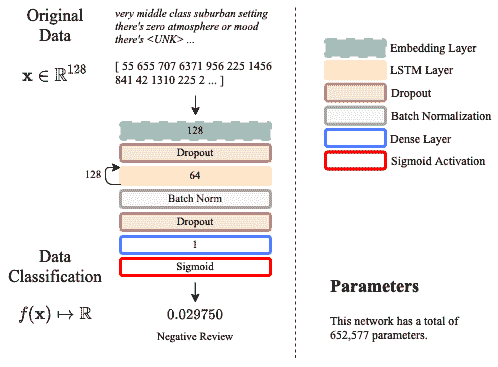

循环神经网络

本章介绍了循环神经网络，从基本模型开始，逐步介绍能够处理内部记忆学习的*新型*循环层，这些层能够记住或忘记数据集中的某些模式。我们将首先展示，循环网络在推断时间序列或顺序模式时非常强大，然后我们将介绍对传统范式的改进，提出具有内部记忆的模型，这个模型可以在时间空间中双向应用。

我们将通过将情感分析问题作为序列到向量的应用来接近学习任务，然后我们将专注于自动编码器，同时作为向量到序列和序列到序列模型。到本章结束时，你将能够解释为什么长短期记忆模型比传统的密集方法更优。你将能够描述双向长短期记忆模型如何在单向方法上可能具有优势。你将能够实现自己的循环神经网络，并将其应用于自然语言处理问题或图像相关的应用，包括序列到向量、向量到序列和序列到序列建模。

本章的结构如下：

+   循环神经网络简介

+   长短期记忆模型

+   序列到向量模型

+   向量到序列模型

+   序列到序列模型

+   伦理学影响

# 第十七章：循环神经网络简介

**循环神经网络**（**RNNs**）基于 Rumelhart 的早期工作（Rumelhart, D. E.等人，1986），他是一位心理学家，与我们之前提到的 Hinton 密切合作。这个概念很简单，但在使用数据序列进行模式识别的领域却具有革命性。

**数据序列**是任何在时间或空间上具有高度相关性的数据片段。例如，音频序列和图像。

RNN 中的递归概念可以通过以下图示来说明。如果你认为神经单元的密集层，这些层可以在不同的时间步上通过某些输入来激活，。*图 13.1 (b)*和*(c)*展示了一个具有五个时间步的 RNN，。我们可以在*图 13.1 (b)*和*(c)*中看到，输入如何在不同的时间步之间可访问，但更重要的是，神经单元的输出也可以提供给下一层神经元：


图 13.1\. 循环层的不同表示：（a）是本书中优选的使用方式；（b）展示了神经单元和反馈回路；（c）是（b）的扩展版本，展示了训练过程中实际发生的情况。

RNN 能够看到前一层神经元的激活情况，这有助于网络更好地理解序列，而不是没有这些附加信息。然而，这也带来了成本：与传统的密集层相比，计算的参数会更多，因为输入  和前一个输出  都需要有权重。

## 简单 RNN

在 Keras 中，我们可以创建一个简单的 RNN，具有**五个时间步长**和**10 个神经单元**（参见*图 13.1*），代码如下：

```py
from tensorflow.keras import Sequential
from tensorflow.keras.layers import SimpleRNN

n_units = 10
t_steps = 5
inpt_ftrs=2
model = Sequential()
model.add(SimpleRNN(n_units, input_shape=(t_steps, inpt_ftrs)))
model.summary()
```

这给出了以下总结：

```py
Model: "sequential"
_________________________________________________________________
Layer (type)            Output Shape  Param # 
=================================================================
simple_rnn (SimpleRNN)  (None, 10)    130 
=================================================================
Total params: 130
Trainable params: 130
Non-trainable params: 0
```

上面的示例代码假设**输入的特征数量**只有**两个**；例如，我们可以在二维中拥有顺序数据。这类 RNN 被称为*简单*的，因为它们类似于具有 `tanh` 激活函数和递归特性的密集网络。

RNN 通常与嵌入层配合使用，接下来我们将讨论这一点。

## 嵌入层

嵌入层通常与 RNN 配合使用，尤其是在需要额外处理的序列中，以增强 RNN 的鲁棒性。考虑以下情境，当你有一句话 *"This is a small vector"*，并且你想训练一个 RNN 来检测句子是否写得正确或写得不好。你可以使用所有你能想到的长度为五的句子来训练 RNN，包括 *"This is a small vector"*。为此，你需要找到一种方法将句子转化为 RNN 可以理解的形式。嵌入层就派上了用场。

有一种叫做**词嵌入**的技术，它的任务是将一个词转换成一个向量。现在有几种成功的实现方法，例如 Word2Vec（Mikolov, T., 等人（2013））或 GloVe（Pennington, J., 等人（2014））。然而，我们将重点介绍一种简单且易于使用的技术。我们将分步进行：

1.  确定你想要处理的句子的长度。这将成为 RNN 层输入的维度。虽然这一步对设计嵌入层不是必需的，但你很快就会需要它，并且在早期决定这一点非常重要。

1.  确定数据集中不同单词的数量，并为它们分配一个数字，创建一个字典：词到索引。这被称为词汇表。

大多数人会先确定词汇表，然后计算每个单词的频率，将词汇表中的单词按频率排序，使得索引 0 对应数据集中最常见的单词，最后一个索引对应最不常见的单词。如果你希望忽略最常见或最不常见的单词，这种方法可能会很有帮助。

1.  用对应的索引替换数据集中所有句子中的单词。

1.  确定词嵌入的维度，并训练一个嵌入层，将数字索引映射到具有所需维度的实值向量。

看看*图 13.2*中的例子。如果我们取单词*This*，它的索引是 7，一些训练过的嵌入层可以将这个数字映射到一个大小为 10 的向量，如你在*图 13.2 (b)*中看到的那样。这就是词嵌入过程。

你可以对完整的句子*"This is a small vector"*重复这个过程，它可以映射到一个**索引序列** [7, 0, 6, 1, 28]，并为你生成一个**词向量序列**；见*图 13.2 (c)*。换句话说，它会生成一个**词嵌入序列**。RNN 可以轻松处理这些序列，并判断这些序列所代表的句子是否正确。

然而，我们必须说，确定一个句子是否正确是一个具有挑战性且有趣的问题（Rivas, P.等人，2019 年）：


图 13.2. 嵌入层：(a) 是本书中推荐使用的形式；(b) 展示了一个词嵌入的例子；(c) 展示了一个词序列及其对应的词嵌入矩阵。

基于*图 13.2*中展示的模型，可以如下创建一个 Keras 中的嵌入层：

```py
from tensorflow.keras import Sequential
from tensorflow.keras.layers import Embedding

vocab_size = 30
embddng_dim = 10
seqnc_lngth = 5

model = Sequential()
model.add(Embedding(vocab_size, embddng_dim, input_length=seqnc_lngth))
model.summary()
```

这产生了以下总结：

```py
Model: "sequential"
_________________________________________________________________
Layer (type)             Output Shape     Param # 
=================================================================
embedding (Embedding)    (None, 5, 10)    300 
=================================================================
Total params: 300
Trainable params: 300
Non-trainable params: 0
```

然而请注意，词汇表的大小通常在几千个左右，适用于大多数常见语言中的典型 NLP 任务。想想你那本传统的字典……它有多少条目？通常是几千个。

类似地，句子通常会长于五个单词，因此你应该预期拥有比前面例子更长的序列。

最后，嵌入维度取决于你希望模型在嵌入空间中的丰富程度，或者取决于模型空间的约束。如果你希望模型较小，可以考虑使用例如 50 维的嵌入。但如果空间不成问题，且你拥有一个包含数百万条数据的优秀数据集，并且有无限的 GPU 计算能力，那么你可以尝试使用 500、700 甚至 1000+维度的嵌入。

现在，让我们通过一个现实生活中的例子来将这些部分结合起来。

## IMDb 上的词嵌入和 RNN

IMDb 数据集在前面的章节中已经解释过了，但为了简洁起见，我们会说它包含基于文本的电影评论，并且每个条目都与一个正面（1）或负面（0）的评价相关联。

Keras 让你可以访问这个数据集，并提供了一些优化时间的不错功能，当你在设计模型时。例如，数据集已根据每个单词的频率进行处理，因此最小的索引会与频繁出现的单词相关联，反之亦然。考虑到这一点，你还可以排除英语中最常见的单词，比如说 10 个或 20 个。而且你甚至可以将词汇表的大小限制为比如 5,000 或 10,000 个单词。

在我们继续之前，我们需要解释一些你将要看到的内容：

+   词汇量为 10,000。我们可以提出一个观点，支持保持 10,000 的词汇量，因为这里的任务是确定评论是正面还是负面的。也就是说，我们不需要过于复杂的词汇表来进行这种判断。

+   消除前 20 个单词。英语中最常见的单词包括诸如 "a" 或 "the" 的单词；这些单词可能在确定电影评论是正面还是负面时并不重要。因此，消除最常见的 20 个单词应该是可以接受的。

+   句子长度为 128 个单词。较小的句子，如 5 个单词的句子，可能缺乏足够的内容，而较长的句子，如 300 个单词的句子，则可能在少于这些单词的情况下就能感知评论的语调。选择 128 个单词完全是任意的，但在前面解释的意义上是合理的。

考虑到这些因素，我们可以轻松地按以下方式加载数据集：

```py
from keras.datasets import imdb
from keras.preprocessing import sequence

inpt_dim = 128
index_from = 3

(x_train, y_train),(x_test, y_test)=imdb.load_data(num_words=10000,
                                                   start_char=1,
                                                   oov_char=2,
                                                   index_from=index_from,
                                                   skip_top=20)
x_train = sequence.pad_sequences(x_train, 
                                 maxlen=inpt_dim).astype('float32')
x_test = sequence.pad_sequences(x_test, maxlen=inpt_dim).astype('float32')

# let's print the shapes
print('x_train shape:', x_train.shape)
print('x_test shape:', x_test.shape)
```

我们也可以像这样打印一些数据以进行验证：

```py
# let's print the indices of sample #7
print(' '.join(str(int(id)) for id in x_train[7]))

# let's print the actual words of sample #7
wrd2id = imdb.get_word_index()
wrd2id = {k:(v+index_from) for k,v in wrd2id.items()}
wrd2id["<PAD>"] = 0
wrd2id["<START>"] = 1
wrd2id["<UNK>"] = 2
wrd2id["<UNUSED>"] = 3

id2wrd = {value:key for key,value in wrd2id.items()}
print(' '.join(id2wrd[id] for id in x_train[7] ))
```

这将输出以下内容：

```py
x_train shape: (25000, 128)
x_test shape: (25000, 128)

 55   655    707    6371     956    225    1456    841     42 1310   225     2 ...
very middle class suburban setting there's zero atmosphere or mood there's <UNK> ...
```

前面的代码的第一部分展示了如何加载数据集并将其分为训练集和测试集，分别为 `x_train` 和 `y_train`，`x_test` 和 `y_test`。剩余部分只是为了显示数据集的形状（维度）以进行验证，并且也可以打印出其原始形式中的第 7 个样本（索引）及其相应的单词。如果你以前没有使用过 IMDb，这部分代码可能有些奇怪。但主要的点是我们需要为特殊标记保留某些索引：句子开头 `<START>`，未使用的索引 `<UNUSED>`，未知词索引 `<UNK>`，以及零填充索引 `<PAD>`。一旦我们为这些标记做了特殊分配，我们就可以轻松地从索引映射回单词。这些索引将由 RNN 学习，并且它将学会如何处理它们，无论是通过忽略它们还是给予它们特定的权重。

现在，让我们实现如下图表所示的架构，其中包括前面解释过的所有层次：


图 13.3\. IMDb 数据集的 RNN 架构

图表显示了与负面评论相关联的训练集中的示例（第 7 个）。图表中描绘的架构以及加载数据的代码如下所示：

```py
from keras.datasets import imdb
from keras.preprocessing import sequence
from tensorflow.keras.models import Model
from tensorflow.keras.layers import SimpleRNN, Embedding, BatchNormalization
from tensorflow.keras.layers import Dense, Activation, Input, Dropout

seqnc_lngth = 128
embddng_dim = 64
vocab_size = 10000

(x_train, y_train), (x_test, y_test) = imdb.load_data(num_words=vocab_size, 
                                                      skip_top=20)
x_train = sequence.pad_sequences(x_train, 
                                 maxlen=seqnc_lngth).astype('float32')
x_test = sequence.pad_sequences(x_test, 
                                maxlen=seqnc_lngth).astype('float32')
```

模型的各层定义如下：

```py
inpt_vec = Input(shape=(seqnc_lngth,))
l1 = Embedding(vocab_size, embddng_dim, input_length=seqnc_lngth)(inpt_vec)
l2 = Dropout(0.3)(l1)
l3 = SimpleRNN(32)(l2)
l4 = BatchNormalization()(l3)
l5 = Dropout(0.2)(l4)
output = Dense(1, activation='sigmoid')(l5)

rnn = Model(inpt_vec, output)

rnn.compile(loss='binary_crossentropy', optimizer='adam', 
            metrics=['accuracy'])
rnn.summary()
```

此模型使用了之前使用过的标准损失和优化器，生成的摘要如下：

```py
Model: "functional"
_________________________________________________________________
Layer (type)                 Output Shape     Param # 
=================================================================
input_1 (InputLayer)         [(None, 128)]    0 
_________________________________________________________________
embedding (Embedding)        (None, 128, 64)  640000 
_________________________________________________________________
dropout_1 (Dropout)          (None, 128, 64)  0 
_________________________________________________________________
simple_rnn (SimpleRNN)       (None, 32)       3104 
_________________________________________________________________
batch_normalization (BatchNo (None, 32)       128 
_________________________________________________________________
dropout_2 (Dropout)          (None, 32)       0 
_________________________________________________________________
dense (Dense)                (None, 1)        33 
=================================================================
Total params: 643,265
Trainable params: 643,201
Non-trainable params: 64
```

然后我们可以使用之前使用过的回调函数来训练网络：a）早停止，和 b）自动学习率降低。学习过程可以如下执行：

```py
from tensorflow.keras.callbacks import ReduceLROnPlateau, EarlyStopping
import matplotlib.pyplot as plt

#callbacks
reduce_lr = ReduceLROnPlateau(monitor='val_loss', factor=0.5, patience=3, 
                              min_delta=1e-4, mode='min', verbose=1)

stop_alg = EarlyStopping(monitor='val_loss', patience=7, 
                         restore_best_weights=True, verbose=1)

#training
hist = rnn.fit(x_train, y_train, batch_size=100, epochs=1000, 
               callbacks=[stop_alg, reduce_lr], shuffle=True, 
               validation_data=(x_test, y_test))

```

然后我们保存模型并显示损失如下所示：

```py
# save and plot training process
rnn.save_weights("rnn.hdf5")

fig = plt.figure(figsize=(10,6))
plt.plot(hist.history['loss'], color='#785ef0')
plt.plot(hist.history['val_loss'], color='#dc267f')
plt.title('Model Loss Progress')
plt.ylabel('Brinary Cross-Entropy Loss')
plt.xlabel('Epoch')
plt.legend(['Training Set', 'Test Set'], loc='upper right')
plt.show()
```

前面的代码生成了以下图表，该图表显示网络在第 3 轮之后开始过拟合：


图 13.4. 训练过程中 RNN 的损失

过拟合在递归网络中相当常见，你不应对这种行为感到惊讶。至今，使用当前的算法，这种现象非常普遍。然而，关于 RNN 的一个有趣事实是，与其他传统模型相比，它们的收敛速度非常快。如你所见，经过三次迭代后，收敛情况已经不错。

接下来，我们必须通过查看平衡准确率、混淆矩阵和**ROC 曲线下面积**（**AUC**）来检查实际的分类性能。我们只会在测试集上进行如下操作：

```py
from sklearn.metrics import confusion_matrix
from sklearn.metrics import balanced_accuracy_score
from sklearn.metrics import roc_curve, auc
import matplotlib.pyplot as plt
import numpy as np

y_hat = rnn.predict(x_test)

# gets the ROC
fpr, tpr, thresholds = roc_curve(y_test, y_hat)
roc_auc = auc(fpr, tpr)

# plots ROC
fig = plt.figure(figsize=(10,6))
plt.plot(fpr, tpr, color='#785ef0', 
         label='ROC curve (AUC = %0.2f)' % roc_auc)
plt.plot([0, 1], [0, 1], color='#dc267f', linestyle='--')
plt.xlim([0.0, 1.0])
plt.ylim([0.0, 1.05])
plt.xlabel('False Positive Rate')
plt.ylabel('True Positive Rate')
plt.title('Receiver Operating Characteristic Curve')
plt.legend(loc="lower right")
plt.show()

# finds optimal threshold and gets ACC and CM
optimal_idx = np.argmax(tpr - fpr)
optimal_threshold = thresholds[optimal_idx]
print("Threshold value is:", optimal_threshold)
y_pred = np.where(y_hat>=optimal_threshold, 1, 0)
print(balanced_accuracy_score(y_test, y_pred))
print(confusion_matrix(y_test, y_pred))
```

首先，让我们分析这里生成的图表，它显示在*图 13.5*中：


图 13.5. 测试集上计算的 RNN 模型的 ROC 和 AUC

该图显示了**真阳性率**（**TPR**）和**假阳性率**（**FPR**）的良好组合，尽管并不理想：我们希望看到更陡峭的阶梯状曲线。AUC 值为 0.92，这再次表明表现不错，但理想情况下，AUC 应该为 1.0。

类似地，代码生成了平衡准确率和混淆矩阵，结果大致如下所示：

```py
Threshold value is: 0.81700134

0.8382000000000001

[[10273 2227]
 [ 1818 10682]]
```

首先，我们在这里计算作为 TPR 和 FPR 函数的最优阈值。我们希望选择一个阈值，使其能给我们带来最大的 TPR 和最小的 FPR。这里显示的阈值和结果**会变化**，具体取决于网络的初始状态；然而，准确率通常应该接近一个非常相似的值。

一旦计算出最优阈值，我们可以使用 NumPy 的`np.where()`方法对整个预测结果进行阈值处理，将其映射为{0, 1}。之后，计算得出的平衡准确率为 83.82%，这再次表明表现不错，但也不算理想。

改进图 13.3 中显示的 RNN 模型的一个可能方法是，某种方式使循环层具有在各层间“记住”或“忘记”特定单词的能力，并且继续在序列中激活神经元。下一节将介绍具有这种能力的 RNN 类型。

# 长短期记忆模型

最初由 Hochreiter 提出，**长短期记忆模型**（**LSTM**）作为递归模型的改进版本获得了广泛关注[Hochreiter, S., *et al.* (1997)]。LSTM 承诺解决与传统 RNN 相关的以下问题：

+   梯度消失

+   梯度爆炸

+   无法记住或忘记输入序列的某些方面

以下图表显示了一个非常简化的 LSTM 版本。在*(b)*中，我们可以看到附加到某些记忆上的自循环，而在*(c)*中，我们可以观察到网络展开或展开后的样子：


图 13.6. 简化版 LSTM 的表示

模型的内容远不止这些，但最核心的部分在*图 13.6*中展示了。可以观察到，LSTM 层不仅从前一个时间步接收前一个输出，还接收一个叫做**状态**的信息，这个状态充当了一种记忆。在图中你可以看到，尽管当前输出和状态可以传递到下一层，但它们也可以在任何需要的地方使用。

在*图 13.6*中没有显示的一些内容包括 LSTM 记忆或遗忘的机制。由于这些对于初学者来说可能比较复杂，书中没有进行详细说明。然而，到目前为止你只需要知道，有三种主要机制：

+   +   **输出控制**：输出神经元受前一个输出和当前状态的刺激程度

    +   **记忆控制**：当前状态中将遗忘多少前一个状态的信息

    +   **输入控制**：前一个输出和新状态（记忆）在确定当前状态时的考虑程度

这些机制是可训练的，并且针对每一个单独的序列数据集进行优化。但为了展示使用 LSTM 作为我们递归层的优势，我们将重复之前的相同代码，只是将 RNN 替换为 LSTM。

加载数据集并构建模型的代码如下：

```py
from keras.datasets import imdb
from keras.preprocessing import sequence
from tensorflow.keras.models import Model
from tensorflow.keras.layers import LSTM, Embedding, BatchNormalization
from tensorflow.keras.layers import Dense, Activation, Input, Dropout

seqnc_lngth = 128
embddng_dim = 64
vocab_size = 10000

(x_train, y_train), (x_test, y_test) = imdb.load_data(num_words=vocab_size, 
                                                      skip_top=20)
x_train = sequence.pad_sequences(x_train, maxlen=seqnc_lngth).astype('float32')
x_test = sequence.pad_sequences(x_test, maxlen=seqnc_lngth).astype('float32')
```

可以按照以下方式指定模型：

```py
inpt_vec = Input(shape=(seqnc_lngth,))
l1 = Embedding(vocab_size, embddng_dim, input_length=seqnc_lngth)(inpt_vec)
l2 = Dropout(0.3)(l1)
l3 = LSTM(32)(l2)
l4 = BatchNormalization()(l3)
l5 = Dropout(0.2)(l4)
output = Dense(1, activation='sigmoid')(l5)

lstm = Model(inpt_vec, output)

lstm.compile(loss='binary_crossentropy', optimizer='adam', 
             metrics=['accuracy'])
lstm.summary()
```

这将产生以下输出：

```py
Model: "functional"
_________________________________________________________________
Layer (type) Output Shape Param # 
=================================================================
input (InputLayer)          [(None, 128)] 0 
_________________________________________________________________
embedding (Embedding)       (None, 128, 64) 640000 
_________________________________________________________________
dropout_1 (Dropout)         (None, 128, 64) 0 
_________________________________________________________________
lstm (LSTM)                 (None, 32) 12416 
_________________________________________________________________
batch_normalization (Batch  (None, 32) 128 
_________________________________________________________________
dropout_2 (Dropout)         (None, 32) 0 
_________________________________________________________________
dense (Dense)               (None, 1) 33 
=================================================================
Total params: 652,577
Trainable params: 652,513
Non-trainable params: 64
```

这基本上复制了下图所示的模型：



图 13.7\. 基于 LSTM 的 IMDb 数据集神经架构

请注意，该模型的参数几乎比简单的 RNN 模型多了 10,000 个。然而，前提是这些参数的增加应当也带来性能的提升。

然后我们像之前一样训练模型，代码如下：

```py
from tensorflow.keras.callbacks import ReduceLROnPlateau, EarlyStopping
import matplotlib.pyplot as plt

#callbacks
reduce_lr = ReduceLROnPlateau(monitor='val_loss', factor=0.5, patience=3, 
                              min_delta=1e-4, mode='min', verbose=1)

stop_alg = EarlyStopping(monitor='val_loss', patience=7, 
                         restore_best_weights=True, verbose=1)

#training
hist = lstm.fit(x_train, y_train, batch_size=100, epochs=1000, 
                callbacks=[stop_alg, reduce_lr], shuffle=True, 
                validation_data=(x_test, y_test))
```

接下来，我们保存模型并展示其性能，代码如下：

```py
# save and plot training process
lstm.save_weights("lstm.hdf5")

fig = plt.figure(figsize=(10,6))
plt.plot(hist.history['loss'], color='#785ef0')
plt.plot(hist.history['val_loss'], color='#dc267f')
plt.title('Model Loss Progress')
plt.ylabel('Brinary Cross-Entropy Loss')
plt.xlabel('Epoch')
plt.legend(['Training Set', 'Test Set'], loc='upper right')
plt.show()
```

这段代码将生成下图所示的图表：


图 13.8\. 训练 LSTM 过程中各个 epoch 的损失变化

从图中可以看出，模型在**一个 epoch**后开始过拟合。使用在最佳点训练好的模型，我们可以如下计算实际性能：

```py
from sklearn.metrics import confusion_matrix
from sklearn.metrics import balanced_accuracy_score
from sklearn.metrics import roc_curve, auc
import matplotlib.pyplot as plt
import numpy as np

y_hat = lstm.predict(x_test)

# gets the ROC
fpr, tpr, thresholds = roc_curve(y_test, y_hat)
roc_auc = auc(fpr, tpr)

# plots ROC
fig = plt.figure(figsize=(10,6))
plt.plot(fpr, tpr, color='#785ef0', 
         label='ROC curve (AUC = %0.2f)' % roc_auc)
plt.plot([0, 1], [0, 1], color='#dc267f', linestyle='--')
plt.xlim([0.0, 1.0])
plt.ylim([0.0, 1.05])
plt.xlabel('False Positive Rate')
plt.ylabel('True Positive Rate')
plt.title('Receiver Operating Characteristic Curve')
plt.legend(loc="lower right")
plt.show()

# finds optimal threshold and gets ACC and CM
optimal_idx = np.argmax(tpr - fpr)
optimal_threshold = thresholds[optimal_idx]
print("Threshold value is:", optimal_threshold)
y_pred = np.where(y_hat>=optimal_threshold, 1, 0)
print(balanced_accuracy_score(y_test, y_pred))
print(confusion_matrix(y_test, y_pred))
```

这将产生下图所示的 ROC 曲线：


图 13.9\. 基于 LSTM 架构的 ROC 曲线

从图表中我们可以看到，模型略有提升，生成了 AUC 为 0.93 的结果，而简单的 RNN 模型的 AUC 为 0.92。

查看由前述代码生成的平衡准确率和混淆矩阵，我们可以看到类似这样的数字：

```py
Threshold value is: 0.44251397
0.8544400000000001
[[10459 2041]
 [ 1598 10902]]
```

在这里，我们可以看到准确率为 85.44%，比简单的 RNN 提高了大约 2%。我们进行这个实验只是为了展示，通过更换 RNN 模型，我们可以轻松地看到性能提升。当然，也有其他方法可以提高模型，例如：

+   增加/减少词汇表的大小

+   增加/减少序列长度

+   增加/减少嵌入维度

+   增加/减少递归层中的神经元单元

可能还有其他类型的模型。

到目前为止，你已经看到如何将文本表示（电影评论）进行处理，这是一种常见的 NLP 任务，并且找到一种方式将其表示为一个空间，在这个空间中你可以将评论分类为负面或正面。我们通过嵌入和 LSTM 层完成了这一过程，但在最后，这里有一个包含一个神经元的全连接层，给出最终的输出。我们可以将其看作是从文本空间映射到一个一维空间，在这个空间中我们可以进行分类。我们这么说是因为考虑这些映射时，有三种主要的方式：

+   **序列到向量**：就像这里讨论的例子，将序列映射到一个`n`维的空间。

+   **向量到序列**：这与上面相反，从一个`n`维的空间到一个序列。

+   **序列到序列**：这将一个序列映射到另一个序列，通常中间会经过一个`n`维的映射。

为了举例说明这些概念，我们将在接下来的章节中使用自编码器架构和 MNIST。

# 序列到向量模型

在上一节中，你*从技术上*看到了一个序列到向量的模型，它将一个序列（代表单词的数字）映射到一个向量（一个维度对应于电影评论）。然而，为了更进一步理解这些模型，我们将回到 MNIST 作为输入源，构建一个将一个 MNIST 数字映射到潜在向量的模型。

## 无监督模型

让我们在下图所示的自编码器架构中进行工作。我们之前研究过自编码器，现在我们将再次使用它们，因为我们了解到它们在找到稳健的、由无监督学习驱动的向量表示（潜在空间）方面非常强大：


图 13.10. 基于 LSTM 的 MNIST 自编码器架构

这里的目标是获取一张图像并找到其潜在表示，在*图 13.10*的例子中，这个表示是二维的。然而，你可能会想：图像怎么会是一个序列呢？

我们可以将一张图像解释为一系列行，或者一系列列。假设我们将一个二维图像（28x28 像素）解释为一系列行；我们可以将每一行从上到下看作是 28 个向量的序列，每个向量的维度为 1x28。这样，我们就可以使用 LSTM 来处理这些序列，利用 LSTM 理解序列中时间关系的能力。通过这种方式，我们的意思是，比如在 MNIST 的例子中，某一行图像与前一行或下一行相似的可能性非常高。

进一步注意到，*图 13.10*中提出的模型不需要像我们之前处理文本时那样使用嵌入层。回想一下，在处理文本时，我们需要将每个单词嵌入（向量化）成一个向量序列。然而，对于图像，它们本身就是向量的序列，因此不再需要嵌入层。

这里展示的代码没有什么新内容，除了两个有用的数据操作工具：

+   `RepeatVector()`：这将允许我们任意重复一个向量。它有助于解码器（见*图 13.10*）将一个向量转换为一个序列。

+   `TimeDistributed()`：这将允许我们将特定类型的层分配给序列的每个元素。

这两者是`tensorflow.keras.layers`集合的一部分。它们在以下代码中实现：

```py
from tensorflow.keras.models import Model
from tensorflow.keras.layers import Dense, Activation, Input
from tensorflow.keras.layers import BatchNormalization, Dropout
from tensorflow.keras.layers import Embedding, LSTM
from tensorflow.keras.layers import RepeatVector, TimeDistributed
from tensorflow.keras.datasets import mnist
from tensorflow.keras.callbacks import ReduceLROnPlateau, EarlyStopping
import numpy as np

seqnc_lngth = 28    # length of the sequence; must be 28 for MNIST
ltnt_dim = 2        # latent space dimension; it can be anything reasonable

(x_train, y_train), (x_test, y_test) = mnist.load_data()

x_train = x_train.astype('float32') / 255.
x_test = x_test.astype('float32') / 255.

print('x_train shape:', x_train.shape)
print('x_test shape:', x_test.shape)
```

在加载数据后，我们可以如下定义模型的编码器部分：

```py
inpt_vec = Input(shape=(seqnc_lngth, seqnc_lngth,))
l1 = Dropout(0.1)(inpt_vec)
l2 = LSTM(seqnc_lngth, activation='tanh', 
          recurrent_activation='sigmoid')(l1)
l3 = BatchNormalization()(l2)
l4 = Dropout(0.1)(l3)
l5 = Dense(ltnt_dim, activation='sigmoid')(l4)

# model that takes input and encodes it into the latent space
encoder = Model(inpt_vec, l5)
```

接下来，我们可以如下定义模型的解码器部分：

```py
l6 = RepeatVector(seqnc_lngth)(l5)
l7 = LSTM(seqnc_lngth, activation='tanh', recurrent_activation='sigmoid', 
          return_sequences=True)(l6)
l8 = BatchNormalization()(l7)
l9 = TimeDistributed(Dense(seqnc_lngth, activation='sigmoid'))(l8)

autoencoder = Model(inpt_vec, l9)
```

最后，我们像这样编译并训练模型：

```py
autoencoder.compile(loss='binary_crossentropy', optimizer='adam')
autoencoder.summary()

reduce_lr = ReduceLROnPlateau(monitor='val_loss', factor=0.5, patience=5, 
                              min_delta=1e-4, mode='min', verbose=1)

stop_alg = EarlyStopping(monitor='val_loss', patience=15, 
                         restore_best_weights=True, verbose=1)

hist = autoencoder.fit(x_train, x_train, batch_size=100, epochs=1000, 
                       callbacks=[stop_alg, reduce_lr], shuffle=True, 
                       validation_data=(x_test, x_test))
```

代码应打印以下输出，显示数据集的维度，模型参数的总结，以及训练步骤，我们为了节省空间省略了训练步骤：

```py
x_train shape: (60000, 28, 28)
x_test shape: (10000, 28, 28)

Model: "functional"
_________________________________________________________________
Layer (type)               Output Shape      Param # 
=================================================================
input (InputLayer)         [(None, 28, 28)]  0 
_________________________________________________________________
dropout_1 (Dropout)        (None, 28, 28)    0 
_________________________________________________________________
lstm_1 (LSTM)              (None, 28)        6384 
_________________________________________________________________
batch_normalization_1 (Bat (None, 28)        112 
_________________________________________________________________
.
.
.
time_distributed (TimeDist (None, 28, 28)    812 
=================================================================
Total params: 10,950
Trainable params: 10,838
Non-trainable params: 112
_________________________________________________________________

Epoch 1/1000
600/600 [==============================] - 5s 8ms/step - loss: 0.3542 - val_loss: 0.2461
.
.
.

```

模型最终会收敛到一个谷底，随后通过回调自动停止。之后，我们可以直接调用`encoder`模型，将任何有效的序列（例如 MNIST 图像）转换为向量，接下来我们将执行这个操作。

## 结果

我们可以调用`encoder`模型将任何有效的序列转换为一个向量，方法如下：

```py
encoder.predict(x_test[0:1])
```

这将生成一个二维向量，其中的值对应于序列`x_test[0]`的向量表示，`x_test[0]`是 MNIST 测试集中的第一张图像。它可能看起来像这样：

```py
array([[3.8787320e-01, 4.8048562e-01]], dtype=float32)
```

然而，请记住，这个模型是在没有监督的情况下训练的，因此，这里显示的数字肯定会有所不同！编码器模型实际上就是我们的序列到向量的模型。其余的自编码器模型用于进行重建。

如果你对自编码器模型如何从仅有两个值的向量重建 28x28 图像感到好奇，或者对整个 MNIST 测试集在学习到的二维空间中投影后的样子感兴趣，你可以运行以下代码：

```py
import matplotlib.pyplot as plt
import numpy as np

x_hat = autoencoder.predict(x_test)

smp_idx = [3,2,1,18,4,8,11,0,61,9]      # samples for 0,...,9 digits
plt.figure(figsize=(12,6))
for i, (img, y) in enumerate(zip(x_hat[smp_idx].reshape(10, 28, 28), y_test[smp_idx])):
  plt.subplot(2,5,i+1)
  plt.imshow(img, cmap='gray')
  plt.xticks([])
  plt.yticks([])
  plt.title(y)
plt.show()
```

这将显示原始数字的样本，如图 11 所示。


图 11\. 原始 MNIST 数字 0-9

以下代码生成重建数字的样本：

```py
plt.figure(figsize=(12,6))
for i, (img, y) in enumerate(zip(x_test[smp_idx].reshape(10, 28, 28), y_test[smp_idx])):
  plt.subplot(2,5,i+1)
  plt.imshow(img, cmap='gray')
  plt.xticks([])
  plt.yticks([])
  plt.title(y)
plt.show()
```

重建的数字如下所示，如*图 12*：


图 12\. 使用基于 LSTM 的自编码器重建的 MNIST 数字 0-9

下一段代码将显示原始数据投影到潜在空间中的散点图，如*图 13*所示：

```py
y_ = list(map(int, y_test))
X_ = encoder.predict(x_test)

plt.figure(figsize=(10,8))
plt.title('LSTM-based Encoder')
plt.scatter(X_[:,0], X_[:,1], s=5.0, c=y_, alpha=0.75, cmap='tab10')
plt.xlabel('First encoder dimension')
plt.ylabel('Second encoder dimension')
plt.colorbar()
```

回想一下，由于自编码器的无监督性质，这些结果可能会有所不同。同样，学习到的空间可以被直观地认为是像*图 13*中所示的那样，其中每个点对应一个序列（MNIST 数字），它被转化为二维向量：


图 13. 基于 MNIST 数据集的学习向量空间

从*图 13*中，我们可以看到，即使重建仅基于二维向量，序列到向量模型也能有效工作。我们将在下一节看到更大的表示。然而，你需要知道，序列到向量模型在过去几年里非常有用 [Zhang, Z., *等* (2017)]。

另一个有用的策略是创建向量到序列模型，即从向量表示转换到序列表示。在自编码器中，这对应于解码器部分。接下来，我们将讨论这个话题。

# 向量到序列模型

如果你回顾*图 10*，向量到序列模型将对应于解码器漏斗形状。主要理念是，大多数模型通常能够从大量输入到丰富表示之间无缝转换。然而，直到最近，机器学习社区才重新获得动力，在从向量成功生成序列方面取得了显著进展（Goodfellow, I., 等 (2016)）。

你可以再次思考*图 10*以及其中表示的模型，它将从原始序列中生成一个序列。在这一节中，我们将专注于第二部分——解码器，并将其用作向量到序列模型。然而，在进入这一部分之前，我们将介绍另一种 RNN 的版本——双向 LSTM。

## 双向 LSTM

**双向 LSTM**（**BiLSTM**）简单来说，就是一个能够同时向前和向后分析序列的 LSTM，如*图 14*所示：


图 14. 双向 LSTM 表示

请考虑以下示例，序列被分析为向前和向后：

+   一段音频序列，在自然声音中分析，然后再反向分析（有些人这样做是为了寻找*潜意识*信息）。

+   一段文本序列，如一句话，既可以向前分析其风格，也可以向后分析，因为某些模式（至少在英语和西班牙语中）会向后引用；例如，一个动词引用的是在句首出现的主语。

+   一张图像，从上到下、从下到上、从一侧到另一侧或反向都有独特的形状；如果你想到数字 9，从上到下，传统的 LSTM 可能会忘记顶部的圆形部分而记住底部的细长部分，而 BiLSTM 可能能够通过从上到下和从下到上的方式同时回忆起数字的两个重要部分。

从*图 14 (b)*中，我们也可以观察到，正向和反向传递的状态和输出在序列中的任何位置都是可用的。

我们可以通过简单地在一个普通的 LSTM 层外面调用`Bidirectional()`包装器来实现双向 LSTM。然后，我们将采用*图 10*中的架构，并对其进行修改，得到如下结果：

+   潜在空间中的 100 维

+   用双向 LSTM 替换 LSTM 层

+   从潜在空间到解码器的额外丢弃层

新的架构将如下所示：*图 15*


图 15\. 实现双向 LSTM 以构建向量到序列模型

回想一下，这里最重要的一点是尽可能让潜在空间（向量到序列模型的输入）变得更加丰富，从而生成更好的序列。我们试图通过增加潜在空间的维度并添加双向 LSTM 来实现这一点。让我们继续实现这一点，并查看结果。

## 实现与结果

实现*图 15*中架构的代码如下：

```py
from tensorflow.keras.models import Model
from tensorflow.keras.layers import Dense, Activation, Input
from tensorflow.keras.layers import BatchNormalization, Dropout
from tensorflow.keras.layers import Bidirectional, LSTM
from tensorflow.keras.layers import RepeatVector, TimeDistributed
from tensorflow.keras.datasets import mnist
from tensorflow.keras.callbacks import ReduceLROnPlateau, EarlyStopping
import numpy as np

seqnc_lngth = 28
ltnt_dim = 100 

(x_train, y_train), (x_test, y_test) = mnist.load_data()

x_train = x_train.astype('float32') / 255.
x_test = x_test.astype('float32') / 255.
```

我们定义模型的编码器部分如下：

```py
inpt_vec = Input(shape=(seqnc_lngth, seqnc_lngth,))
l1 = Dropout(0.5)(inpt_vec)
l2 = Bidirectional(LSTM(seqnc_lngth, activation='tanh', 
                        recurrent_activation='sigmoid'))(l1)
l3 = BatchNormalization()(l2)
l4 = Dropout(0.5)(l3)
l5 = Dense(ltnt_dim, activation='sigmoid')(l4)

# sequence to vector model
encoder = Model(inpt_vec, l5, name='encoder')
```

模型的解码器部分可以定义如下：

```py
ltnt_vec = Input(shape=(ltnt_dim,))
l6 = Dropout(0.1)(ltnt_vec)
l7 = RepeatVector(seqnc_lngth)(l6)
l8 = Bidirectional(LSTM(seqnc_lngth, activation='tanh', 
                   recurrent_activation='sigmoid', 
                   return_sequences=True))(l7)
l9 = BatchNormalization()(l8)
l10 = TimeDistributed(Dense(seqnc_lngth, activation='sigmoid'))(l9)

# vector to sequence model
decoder = Model(ltnt_vec, l10, name='decoder')
```

接下来，我们编译自编码器并训练它：

```py
recon = decoder(encoder(inpt_vec))
autoencoder = Model(inpt_vec, recon, name='ae')

autoencoder.compile(loss='binary_crossentropy', optimizer='adam')
autoencoder.summary()

reduce_lr = ReduceLROnPlateau(monitor='val_loss', factor=0.5, patience=5, 
                              min_delta=1e-4, mode='min', verbose=1)

stop_alg = EarlyStopping(monitor='val_loss', patience=15, 
                         restore_best_weights=True, verbose=1)

hist = autoencoder.fit(x_train, x_train, batch_size=100, epochs=1000, 
                       callbacks=[stop_alg, reduce_lr], shuffle=True, 
                       validation_data=(x_test, x_test))
```

这里没有什么新东西，除了之前解释过的`Bidirectional()`包装器。输出应该会生成完整自编码器模型的总结以及完整的训练操作，结果看起来会是这样：

```py
Model: "ae"
_________________________________________________________________
Layer (type)          Output Shape     Param # 
=================================================================
input (InputLayer)    [(None, 28, 28)] 0 
_________________________________________________________________
encoder (Functional)  (None, 100)      18692 
_________________________________________________________________
decoder (Functional)  (None, 28, 28)   30716 
=================================================================
Total params: 49,408
Trainable params: 49,184
Non-trainable params: 224
_________________________________________________________________
Epoch 1/1000
600/600 [==============================] - 9s 14ms/step - loss: 0.3150 - val_loss: 0.1927
.
.
.
```

现在，经过若干轮无监督学习，训练会自动停止，我们可以将`decoder`模型作为我们的向量到序列模型。但在此之前，我们可能想快速检查重构的质量，可以通过运行与之前相同的代码生成以下图示中的图像：


图 16\. 使用双向 LSTM 自编码器重构的 MNIST 数字

如果你将*图 11*与*图 16*进行比较，你会注意到重构效果要好得多，而且相比于之前模型在*图 12*中的重构，细节程度也得到了改善。

现在我们可以直接调用我们的向量到序列模型，输入任何兼容的向量，方法如下：

```py
z = np.random.rand(1,100)
x_ = decoder.predict(z)
print(x_.shape)
plt.imshow(x_[0], cmap='gray')
```

这将生成如下输出和*图 17*中的图表：

```py
(1, 28, 28)
```


图 17\. 由模型从随机向量生成的序列

你可以生成任意数量的随机向量并测试你的向量到序列模型。另一个有趣的观察点是序列到序列模型，我们将在接下来的部分介绍。

# 序列到序列模型

一位 Google Brain 的科学家（Vinyals, O. 等，2015）写道：

“序列已成为监督学习中的一等公民，这要归功于循环神经网络的复兴。许多需要从一个序列映射到另一个序列的复杂任务现在可以通过**序列到序列**（**seq2seq**）框架来公式化，该框架利用链式法则有效地表示序列的联合概率。”

这非常正确，因为现在这些应用已经扩展。只需想一下以下的序列到序列项目想法：

+   文档摘要。输入序列：一份文档。输出序列：摘要。

+   图像超分辨率。输入序列：低分辨率图像。输出序列：高分辨率图像。

+   视频字幕。输入序列：视频。输出序列：文本字幕。

+   机器翻译。输入序列：源语言的文本。输出序列：目标语言的文本。

这些是令人兴奋且极具挑战性的应用。如果你使用过在线翻译工具，那么很可能你已经使用过某种类型的序列到序列模型。

在本节中，为了简单起见，我们将继续使用*图 15*中的自编码器作为我们的主要关注点，但为了确保我们都对序列到序列模型的一般性有共同的理解，我们将指出以下几点：

+   序列到序列模型可以跨领域映射；例如，从视频到文本或从文本到音频。

+   序列到序列模型可以在不同维度中进行映射；例如，将低分辨率图像转换为高分辨率图像，或反之，用于压缩。

+   序列到序列模型可以使用许多不同的工具，例如稠密层、卷积层和循环层。

有了这个概念，你几乎可以根据你的应用构建一个序列到序列模型。现在，我们将回到*图 15*中的模型，并展示自编码器是一个序列到序列模型，因为它接受图像的行序列并产生另一幅图像的行序列。由于这是一个自编码器，输入和输出的维度必须匹配。

我们将把展示之前训练过的序列到序列模型（自编码器）限制在以下简短的代码片段中，这段代码是从前一节的代码发展而来的：

```py
plt.figure(figsize=(12,6))
for i in range(10):
  plt.subplot(2,5,i+1)
  rnd_vec = np.round(np.mean(x_test[y_test==i],axis=0))   #(a)
  rnd_vec = np.reshape(rnd_vec, (1,28,28))                #(b)
  z = encoder.predict(rnd_vec)                            #(c)
  decdd = decoder.predict(z)                              #(d)
  plt.imshow(decdd[0], cmap='gray')
  plt.xticks([])
  plt.yticks([])
  plt.title(i)
plt.show()
```

让我们解释一下这些步骤。在*(a)*中，我们为每个数字计算平均序列；这是对以下问题的回答：既然随机做很简单，我们可以使用什么作为输入序列？好吧，使用平均序列来构建测试集听起来足够有趣。

接下来，*(b)* 只是为了使输入与编码器输入维度兼容。然后，*(c)* 获取平均序列并将其转换为一个向量。最后，*(d)* 使用该向量重新创建序列，产生以下图示所示的图表：


图 18。序列到序列示例输出

从图表中，你可以轻松观察到与手写数字一致的明确定义的模式，这些模式是由双向 LSTM 生成的行序列。

在我们结束之前，让我们谈一下这些模型的一些伦理影响。

# 伦理影响

随着递归模型的复兴及其在捕捉序列中的时间信息方面的适用性，存在发现潜在空间未被公平分配的风险。在操作未经妥善整理数据的无监督模型中，这种风险可能更大。如果你考虑到，模型并不关心它发现的关系；它只关心最小化损失函数，因此如果它是用 1950 年代的杂志或报纸进行训练的，它可能会发现“女性”一词与家务劳动的词汇（如“扫帚”、“碗碟”和“烹饪”）在欧几里得距离上接近，而“男性”一词则可能与所有其他劳动（如“驾驶”、“教学”、“医生”和“科学家”）接近。这就是潜在空间中引入偏见的一个例子（Shin, S.,et al. (2020)）。

这里的风险在于，向量到序列或序列到序列模型会更容易将医生与男性而非女性联系起来，将烹饪与女性而非男性联系起来，仅举几个例子。你可以将这种情况扩展到面部图像，发现某些具有特定特征的人可能会被错误地关联起来。这就是为什么进行我们所做的这种分析如此重要——尽可能地尝试可视化潜在空间，查看模型输出，等等。

这里的关键要点是，虽然这里讨论的模型非常有趣且强大，但它们也带来了学习我们社会中被认为是“不可接受”的内容的风险。如果这种风险存在并且未被发现，可能会导致偏见（Amini, A., et al. (2019)）。如果偏见没有被及时发现，它可能会导致多种形式的歧视。因此，请始终对这些问题以及超出你自己社会背景的事项保持谨慎。

# 总结

本高级章节向你展示了如何创建 RNN。你了解了 LSTM 及其双向实现，这是处理具有远程时间相关性的序列最强大的方法之一。你还学习了如何创建基于 LSTM 的情感分析模型，用于电影评论的分类。你设计了一个自编码器，使用简单的和双向的 LSTM 来学习 MNIST 的潜在空间，并将其既用作向量到序列模型，也用作序列到序列模型。

在这一点上，你应该能够自信地解释 RNN 中记忆的动机，这种动机源于对更强大模型的需求。你应该能够舒适地使用 Keras/TensorFlow 编写自己的递归网络。此外，你还应该自信地实现监督式和无监督式的递归网络。

LSTM 在编码高度相关的空间信息（如图像、音频或文本）方面表现出色，就像 CNN 一样。然而，CNN 和 LSTM 都学习非常特定的潜在空间，这些空间可能缺乏多样性。如果有恶意黑客试图破解你的系统，这可能会成为问题；如果你的模型非常特定于你的数据，它可能对变化非常敏感，从而导致输出结果出现灾难性后果。自编码器通过使用一种生成方法——变分自编码器，来解决这个问题，变分自编码器学习的是数据的分布，而不是数据本身。然而，问题依然存在：如何将这种生成方法的理念应用到其他类型的网络中，这些网络不一定是自编码器？想要找到答案，你不能错过下一章，第十四章，*生成对抗神经网络*。下一章将介绍一种通过攻击神经网络并教会它们变得更强大的方法。但在你继续之前，请先通过以下问题来测试自己。

# 问题与答案

1.  **如果 CNN 和 LSTM 都能建模空间相关的数据，是什么让 LSTM 更优？**

一般来说没有什么特别的，除了 LSTM 具有记忆功能这一点。但在某些应用中，比如自然语言处理（NLP），其中句子是顺序发现的，并且有时会前后引用某些词语，且可能在开始、中间和结尾处都有多次引用。BiLSTM 比 CNN 更容易快速建模这种行为。CNN 可能也能学会这样做，但相比之下，它可能需要更长的时间。

1.  **增加更多递归层能使网络变得更好吗？**

不，增加更多的层可能会使情况变得更糟。建议保持简单，最多不超过三层，除非你是科学家并在进行某些新实验。否则，在编码器模型中，不应连续有超过三层的递归层。

1.  **LSTM 还有哪些其他应用？**

音频处理与分类；图像去噪；图像超分辨率；文本摘要与其他文本处理和分类任务；词语补全；聊天机器人；文本补全；文本生成；音频生成；图像生成。

1.  **LSTM 和 CNN 似乎有相似的应用，是什么让你选择一个而不是另一个？**

LSTM 比其他模型更快收敛，因此，如果时间是一个因素，LSTM 更好。CNN 比 LSTM 更稳定，因此，如果你的输入非常不可预测，LSTM 可能会将问题带入递归层，每次使其变得更糟，这时 CNN 可以通过池化来缓解问题。在个人层面上，我通常在与图像相关的应用中首先尝试 CNN，而在 NLP 应用中则优先尝试 LSTM。

# 参考文献

+   Rumelhart, D. E., Hinton, G. E., 和 Williams, R. J. (1986). *通过反向传播误差学习表示*. *Nature*, 323(6088), 533-536.

+   Mikolov, T., Sutskever, I., Chen, K., Corrado, G. S., 和 Dean, J. (2013). *词语和短语的分布式表示及其组合性*. 见于 *神经信息处理系统进展* (第 3111-3119 页).

+   Pennington, J., Socher, R., 和 Manning, C. D. (2014 年 10 月). *Glove：用于词表示的全局向量*. 见于 *2014 年自然语言处理实证方法会议论文集* (EMNLP) (第 1532-1543 页).

+   Rivas, P., 和 Zimmermann, M. (2019 年 12 月). *关于英语句子质量评估的句子嵌入的实证研究*. 见于 *2019 年国际计算科学与计算智能会议* (CSCI) (第 331-336 页). IEEE.

+   Hochreiter, S., 和 Schmidhuber, J. (1997). *长短期记忆网络*. *神经计算*, 9(8), 1735-1780.

+   Zhang, Z., Liu, D., Han, J., 和 Schuller, B. (2017). *学习音频序列表示用于声学事件分类*. *arXiv 预印本* arXiv:1707.08729.

+   Goodfellow, I., Bengio, Y., 和 Courville, A. (2016). *序列建模：递归与递归网络*. *深度学习*, 367-415.

+   Vinyals, O., Bengio, S., 和 Kudlur, M. (2015). *顺序重要：集合的序列到序列*. *arXiv 预印本* arXiv:1511.06391.

+   Shin, S., Song, K., Jang, J., Kim, H., Joo, W., 和 Moon, I. C. (2020). *通过潜在解耦和反事实生成中和词嵌入中的性别偏见*. *arXiv 预印本* arXiv:2004.03133.

+   Amini, A., Soleimany, A. P., Schwarting, W., Bhatia, S. N., 和 Rus, D. (2019 年 1 月). *通过学习潜在结构揭示和缓解算法偏见*. 见于 *2019 年 AAAI/ACM 人工智能、伦理与社会会议论文集* (第 289-295 页).
