生成对抗网络

阅读关于制作寿司的资料很容易；然而，实际上制作一种新的寿司比我们想象的要困难。在深度学习中，创造性过程更为复杂，但并非不可能。我们已经看到如何构建可以分类数字的模型，使用密集网络、卷积网络或递归网络，今天我们将看到如何构建一个可以生成数字的模型。本章介绍了一种被称为生成对抗网络的学习方法，它属于对抗学习和生成模型的范畴。本章解释了生成器和判别器的概念，以及为什么拥有良好的训练数据分布近似可以使模型在其他领域取得成功，比如*数据增强*。在本章结束时，你将知道为什么对抗训练如此重要；你将能够编写训练生成器和判别器所需的机制；并且你将编写一个**生成对抗网络**（**GAN**）来从学习的潜在空间生成图像。

本章的结构如下：

+   引入对抗学习

+   训练 GAN

+   比较 GAN 和 VAE

+   思考生成模型的伦理影响

# 第十八章：引入对抗学习

最近，使用对抗神经网络进行对抗训练引起了广泛关注（Abadi, M.等，2016）。这是因为对抗神经网络可以训练以保护模型免受基于 AI 的对抗者攻击。我们可以将对抗学习分为两个主要分支：

+   **黑盒**：在这一类别中，机器学习模型作为一个黑盒存在，对抗者只能学习攻击黑盒，使其失败。对抗者任意地（在某些界限内）创建伪输入使黑盒模型失败，但无法访问其攻击的模型（Ilyas, A.等，2018）。

+   **内部人员**：这种类型的对抗学习旨在成为训练模型的一部分，模型的目标是抵抗这种攻击。对抗者会影响一个被训练为*不*易被此类对抗者欺骗的模型的结果（Goodfellow, I.等，2014）。

这些方法各有优缺点：

| **黑盒优点** | **黑盒缺点** | **内部人员优点** | **内部人员缺点** |
| --- | --- | --- | --- |
| 它提供了探索更多生成方法的能力。 | 没有办法影响或改变黑盒模型。 | 经过对抗训练的模型可能对特定的黑盒攻击更加鲁棒。 | 目前生成攻击的选项有限。 |
| 它通常较快，且可能找到破坏模型的方法。 | 生成器通常只关注扰动现有数据。 | 生成器可以用于*增强*数据集。 | 它通常较慢。 |
|  | 生成器可能无法用于*增强*数据集。 |  |  |

由于这本书是给初学者的，我们将专注于一个最简单的模型：一个被称为 GAN 的内部模型。我们将查看其各个部分并讨论其批量训练。

GANs 在历史上被用来生成逼真的图像（Goodfellow, I., 等人 (2014)），通常解决多智能体问题（Sukhbaatar, S., *等人* (2016)），甚至是密码学（Rivas, P., *等人* (2020)）。

让我们简要讨论对抗学习和 GANs。

## 使用对手进行学习

一个机器学习模型可以传统地学习进行分类或回归等任务，其中可能有一个模型试图学习区分输入是否合法或伪造的情况。在这种情况下，一个机器学习模型可以被创建为一个生成伪造输入的对手，如*图 14.1*所示：

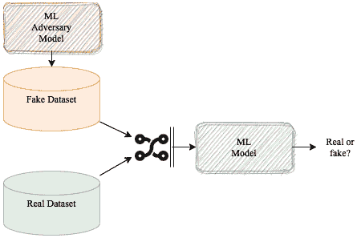

图 14.1 - 对抗学习

在这种范例中，机器学习模型需要学会区分真实输入和假输入。当它犯错时，它需要*学会*调整自己以确保正确识别真实输入。另一方面，对手需要继续生成假输入，目的是使模型失败。

每个模型的成功看起来是这样的：

+   **机器学习主模型**成功的条件是能够成功区分假的和真实的输入。

+   **对手模型**成功的条件是能够愚弄机器学习主模型，使其将假数据通过为真实数据。

正如你所看到的，它们彼此竞争。一个的成功是另一个的失败，反之亦然。

在学习过程中，机器学习主模型将持续调用批量的真实和假数据来学习、调整和重复，直到我们对性能满意，或者达到其他停止标准。

一般来说，在对抗学习中，对手没有具体要求，除了产生假数据。

**对抗鲁棒性**是一个新术语，用于证明某些模型对抗对手攻击的能力。这些证书通常是针对特定类型的对手。详细内容请参见 Cohen, J. M., *等人* (2019)。

一种流行的对抗学习类型发生在 GAN 内部，接下来我们将讨论它。

## GANs

GAN 是实施对抗学习的最简单的基于神经网络的模型之一，最初由 Ian Goodfellow 和合作者在蒙特利尔的一家酒吧里构思出来（Goodfellow, I., 等人 (2014)）。它基于一个极小极大化的优化问题，可以表述如下：

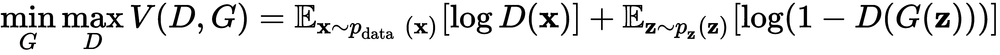

这个方程式有几个部分需要解释，所以我们开始吧：

+   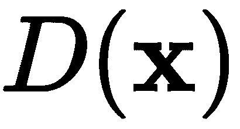：在 GAN 中，这是鉴别器，它是一个神经网络，接收输入数据 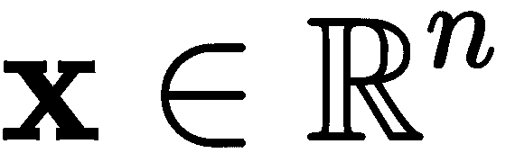，并判断它是真还是假，如 *图 14.2* 所示。

+   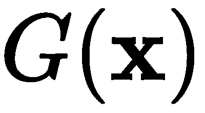：在 GAN 中，这是生成器，它也是一个神经网络，但其输入是随机噪声 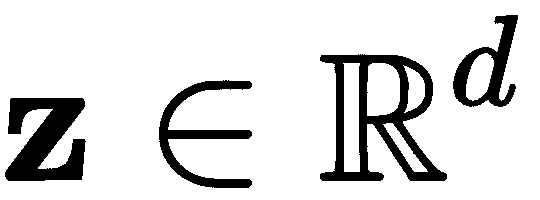，概率为 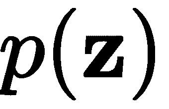：

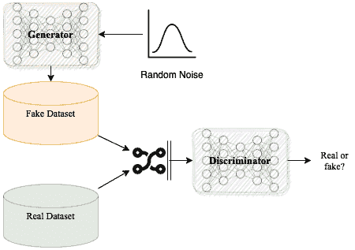

图 14.2 - GAN 主要范式

理想情况下，我们希望最大化鉴别器的正确预测 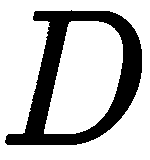，同时，我们还希望最小化生成器的误差 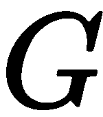，生成一个不会欺骗鉴别器的样本，表示为 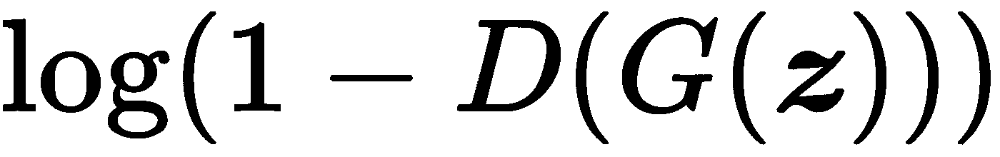。期望值和对数的公式来自标准的交叉熵损失函数。

总结一下，在 GAN 中，生成器和鉴别器都是神经网络。生成器从随机分布中提取随机噪声，并利用这些噪声生成 *假* 输入来欺骗鉴别器。

牢记这一点，我们继续进行简单 GAN 的编码。

# 训练 GAN

我们将从一个简单的基于 MLP 的模型开始实现，也就是说，我们的生成器和鉴别器将是密集的、完全连接的网络。然后，我们将继续实现卷积式 GAN。

## 一个 MLP 模型

我们现在将专注于创建 *图 14.3* 中所示的模型。该模型的生成器和鉴别器在层数和总参数量上有所不同。通常情况下，生成器的构建比鉴别器需要更多的资源。如果你仔细想想，这是直观的：创作过程通常比识别过程更为复杂。在生活中，如果你反复看到毕加索的所有画作，识别他的画作可能会很容易。

然而，实际像毕加索那样绘画，可能要比这难得多：

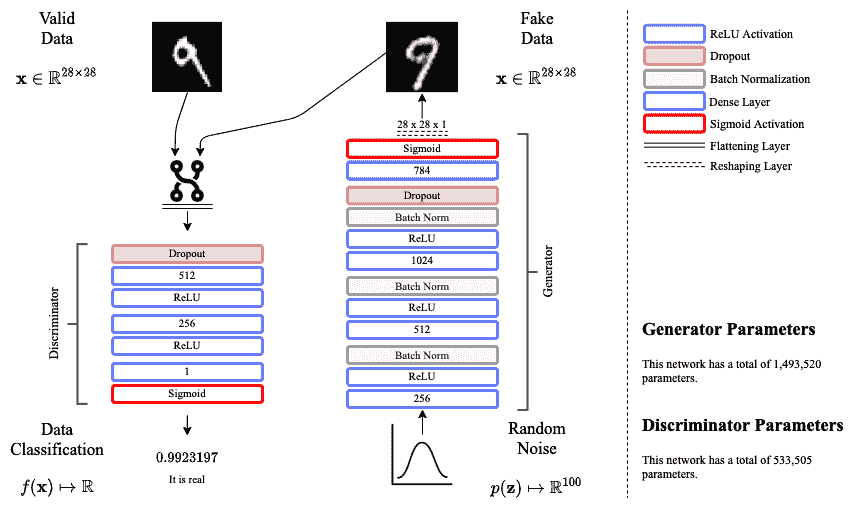

图 14.3 - 基于 MLP 的 GAN 架构

这张图展示了一个图标，简单地表示鉴别器将同时处理假数据和真实数据，并从这两个世界中学习。关于 GAN，你必须始终记住的一点是，它们 **生成** 来自 **随机噪声** 的数据。想一想这一点，你就会意识到这非常酷。

所以，*图 14.3* 中的架构并没有什么我们之前没有发现的新东西。然而，设计本身是原创的。此外，用 Keras 创建它的方式确实是一项挑战。因此，我们将展示完整的代码，并尽可能多地添加注释以便让大家理解。

这是完整的代码：

```py
from tensorflow.keras.models import Model
from tensorflow.keras.layers import Dense, Activation, Input, Flatten
from tensorflow.keras.layers import BatchNormalization, Dropout, Reshape
from tensorflow.keras.optimizers import Adam
from tensorflow.keras.datasets import mnist
import numpy as np
import matplotlib.pyplot as plt

img_dims = 28
img_chnl = 1 
ltnt_dim = 100

(x_train, y_train), (x_test, y_test) = mnist.load_data()

x_train = x_train.astype('float32') / 255.
x_test = x_test.astype('float32') / 255.

# this makes sure that each image has a third dimension
x_train = np.expand_dims(x_train, axis=3)    # 28x28x1
x_test = np.expand_dims(x_test, axis=3)

print('x_train shape:', x_train.shape)
print('x_test shape:', x_test.shape)
```

接下来，我们将生成器定义如下：

```py
# building the generator network
inpt_noise = Input(shape=(ltnt_dim,))
gl1 = Dense(256, activation='relu')(inpt_noise)
gl2 = BatchNormalization()(gl1)
gl3 = Dense(512, activation='relu')(gl2)
gl4 = BatchNormalization()(gl3)
gl5 = Dense(1024, activation='relu')(gl4)
gl6 = BatchNormalization()(gl5)
gl7 = Dropout(0.5)(gl6)
gl8= Dense(img_dims*img_dims*img_chnl, activation='sigmoid')(gl7)
gl9= Reshape((img_dims,img_dims,img_chnl))(gl8)
generator = Model(inpt_noise, gl9)
gnrtr_img = generator(inpt_noise)
# uncomment this if you want to see the summary
# generator.summary()
```

接下来，我们可以如下定义判别器：

```py
# building the discriminator network
inpt_img = Input(shape=(img_dims,img_dims,img_chnl))
dl1 = Flatten()(inpt_img)
dl2 = Dropout(0.5)(dl1)
dl3 = Dense(512, activation='relu')(dl2)
dl4 = Dense(256, activation='relu')(dl3)
dl5 = Dense(1, activation='sigmoid')(dl4)
discriminator = Model(inpt_img, dl5)
validity = discriminator(gnrtr_img)
# uncomment this if you want to see the summary
# discriminator.summary()
```

下一步是将各部分结合起来，如下所示：

```py
# you can use either optimizer:
# optimizer = RMSprop(0.0005)
optimizer = Adam(0.0002, 0.5)

# compiling the discriminator
discriminator.compile(loss='binary_crossentropy', optimizer=optimizer, 
                      metrics=['accuracy'])

# this will freeze the discriminator in gen_dis below
discriminator.trainable = False

gen_dis = Model(inpt_noise, validity)    # full model
gen_dis.compile(loss='binary_crossentropy', optimizer=optimizer)
```

接下来，我们将把训练放入一个循环中，这个循环将运行多个纪元，直到我们想要的次数：

```py
epochs = 12001     # this is up to you!
batch_size=128    # small batches recommended
sample_interval=200    # for generating samples

# target vectors
valid = np.ones((batch_size, 1))
fake = np.zeros((batch_size, 1))

# we will need these for plots and generated images
samp_imgs = {}
dloss = []
gloss = []
dacc = []

# this loop will train in batches manually for every epoch
for epoch in range(epochs):
  # training the discriminator first >>
  # batch of valid images
  idx = np.random.randint(0, x_train.shape[0], batch_size)
  imgs = x_train[idx]

  # noise batch to generate fake images
  noise = np.random.uniform(0, 1, (batch_size, ltnt_dim))
  gen_imgs = generator.predict(noise)

  # gradient descent on the batch
  d_loss_real = discriminator.train_on_batch(imgs, valid)
  d_loss_fake = discriminator.train_on_batch(gen_imgs, fake)
  d_loss = 0.5 * np.add(d_loss_real, d_loss_fake)

  # next we train the generator with the discriminator frozen >>
  # noise batch to generate fake images
  noise = np.random.uniform(0, 1, (batch_size, ltnt_dim))

  # gradient descent on the batch
  g_loss = gen_dis.train_on_batch(noise, valid)

  # save performance
  dloss.append(d_loss[0])
  dacc.append(d_loss[1])
  gloss.append(g_loss)

  # print performance every sampling interval
  if epoch % sample_interval == 0:
    print ("%d [D loss: %f, acc.: %.2f%%] [G loss: %f]" % 
           (epoch, d_loss[0], 100*d_loss[1], g_loss))

    # use noise to generate some images
    noise = np.random.uniform(0, 1, (2, ltnt_dim))
    gen_imgs = generator.predict(noise)
    samp_imgs[epoch] = gen_imgs    
```

这将产生类似以下的输出：

```py
0 [D loss: 0.922930, acc.: 21.48%] [G loss: 0.715504]
400 [D loss: 0.143821, acc.: 96.88%] [G loss: 4.265501]
800 [D loss: 0.247173, acc.: 91.80%] [G loss: 4.752715]
.
.
.
11200 [D loss: 0.617693, acc.: 66.80%] [G loss: 1.071557]
11600 [D loss: 0.611364, acc.: 66.02%] [G loss: 0.984210]
12000 [D loss: 0.622592, acc.: 62.50%] [G loss: 1.056955]
```

由于一切基于**随机**噪声，这在你的系统中可能看起来不同。这个随机性可能会让你的模型朝不同的方向发展。然而，你会看到的是，如果生成器正常工作，它的损失应该会逐渐减少，并且准确率应该接近于随机变化，也就是接近 50%。如果判别器始终保持 100%的准确率，说明生成器表现不佳；如果判别器的准确率接近 50%，那么可能是生成器过于优秀，或者判别器过于弱。

现在，让我们绘制几样东西：学习曲线（损失和准确率），以及不同纪元生成的样本。

以下代码将绘制学习曲线：

```py
import matplotlib.pyplot as plt

fig, ax1 = plt.subplots(figsize=(10,6))
ax1.set_xlabel('Epoch')
ax1.set_ylabel('Loss')
ax1.plot(range(epochs), gloss, '-.', color='#dc267f', alpha=0.75, 
         label='Generator')
ax1.plot(range(epochs), dloss, '-.', color='#fe6100', alpha=0.75, 
         label='Discriminator')
ax1.legend(loc=1)
ax2 = ax1.twinx()
ax2.set_ylabel('Discriminator Accuracy') 
ax2.plot(range(epochs), dacc, color='#785ef0', alpha=0.75, 
         label='Accuracy')
ax2.legend(loc=4)
fig.tight_layout() 
plt.show()
```

这将生成如下图所示的图表：

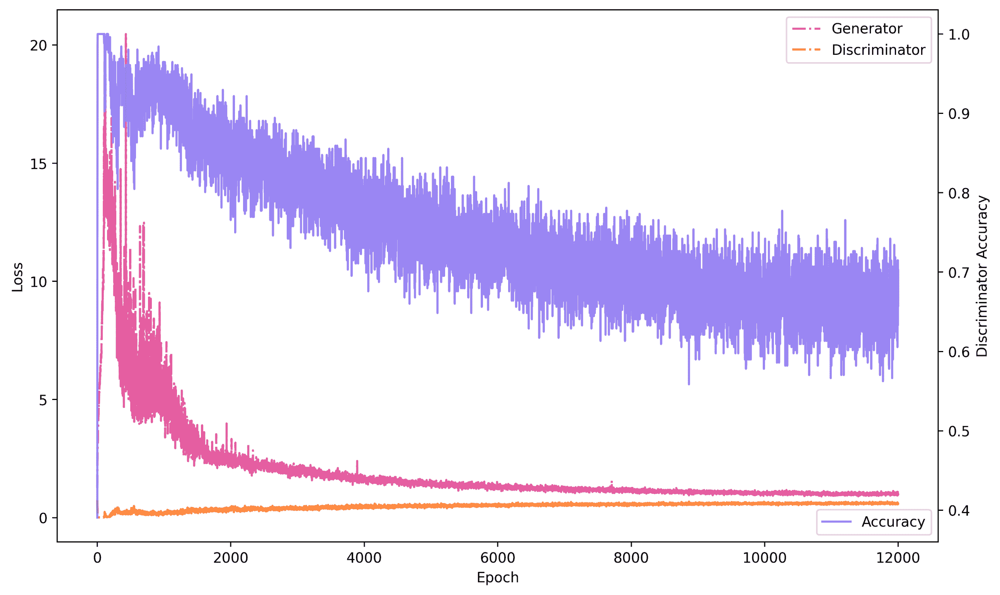

图 14.4 - 生成器和判别器在多个纪元中的损失变化。基于 MLP 的 GAN 在多个纪元中的准确率。

如图所示，判别器的损失最初较低，准确率也显示了这一点。然而，随着纪元的推进，生成器的表现变得更好（损失减少），而准确率则缓慢下降。

*图 14.5*显示了在每个采样的纪元下生成的一些图像，这些图像是由随机噪声生成的：

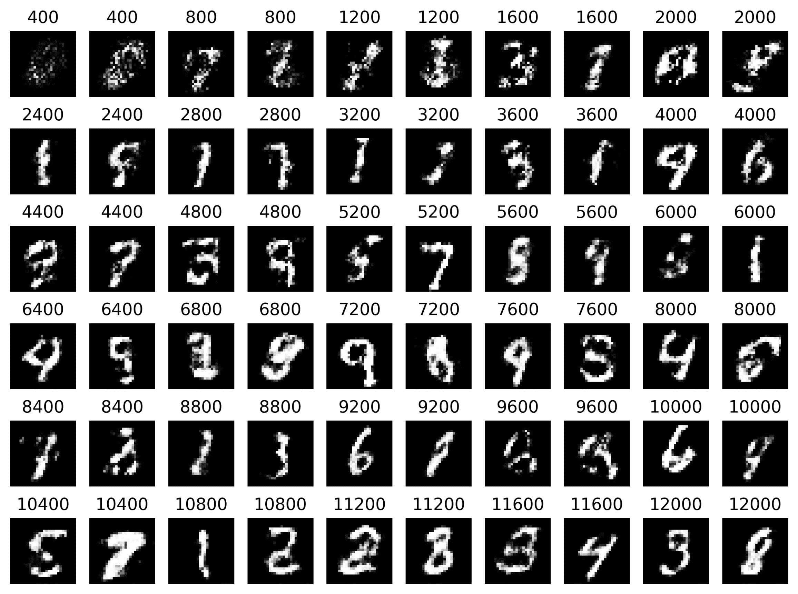

图 14.5 - GAN 在不同纪元生成的图像

如你所见，最初的图像看起来噪声较大，而后来的图像则有更多的细节和熟悉的形状。这将证实判别器准确率的下降，因为这些图像看起来几乎与真实图像相似。*图 14.5*是使用以下代码生成的：

```py
import matplotlib.pyplot as plt

fig, axs = plt.subplots(6, 10, figsize=(10,7.5))
cnt = sample_interval
for i in range(6):
  for j in [0, 2, 4, 6, 8]:
    img = samp_imgs[cnt]
    axs[i,j].imshow(img[0,:,:,0], cmap='gray')
    axs[i,j].axis('off')
    axs[i,j].set_title(cnt)
    axs[i,j+1].imshow(img[1,:,:,0], cmap='gray')
    axs[i,j+1].axis('off')
    axs[i,j+1].set_title(cnt)
    cnt += sample_interval
plt.show()
```

让我们考虑一下这个模型的一些收获：

+   如前所述的模型，如果我们在需要的地方将模型做大，仍然有提升的空间。

+   如果我们需要一个好的生成器，我们可以扩展生成器，或者将其改为卷积生成器（见下一节）。

+   如果我们愿意，可以保存`discriminator`并重新训练它（微调）用于数字分类。

+   如果我们愿意，可以使用`generator`来增强数据集，添加任意数量的图像。

尽管基于 MLP 的 GAN 质量*尚可*，我们可以看到，生成的形状可能不如原始样本定义得那么清晰。然而，卷积 GAN 能够提供帮助。

让我们继续，将基于 MLP 的模型转换为卷积模型。

## 一个卷积模型

卷积方法在 GAN 中的应用由 Radford 等人（2015）广泛推广。所提出的模型被称为**深度卷积 GAN**（**DCGAN**）。其主要目标是通过一系列卷积层学习特征表示，以生成*虚假*图像或*区分*真实和虚假图像。

接下来，我们将**故意**使用不同的名称来指代判别网络，我们称之为**批评者**。这两个术语在文献中都有使用。然而，新的趋势是使用术语*批评者*，而旧的术语可能会逐渐消失。无论如何，你应该知道这两个术语指的都是同一个东西：一个任务是判断输入是有效的（来自原始数据集）还是伪造的（来自对抗生成器）。

我们将实现以下图示中的模型：

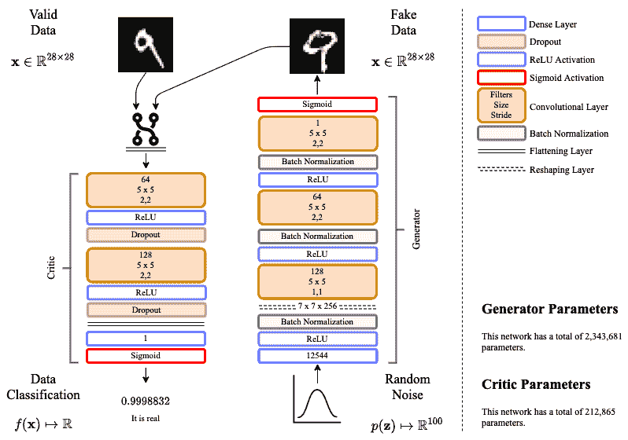

图 14.6 - 基于 CNN 的 GAN 架构

这个模型有一些在本书中前所未见的新内容：`Conv2DTranspose`。这种层与传统的卷积层`Conv2D`非常相似，不同之处在于它的工作方向正好相反。`Conv2D`层学习过滤器（特征图），将输入拆分为过滤后的信息，而`Conv2DTranspose`层则是将过滤后的信息合并在一起。

有些人将`Conv2DTranspose`称为*反卷积*。然而，我个人认为这样做是不正确的，因为*反卷积*是一个与`Conv2DTranspose`执行的操作有显著不同的数学运算。无论如何，你需要记住，如果在 CNN 的上下文中看到*反卷积*，它指的就是`Conv2DTranspose`。

模型中的其余元素是我们之前已经讨论过的内容。完整的代码（去除注释）如下：

```py
from tensorflow.keras.models import Model
from tensorflow.keras.layers import Dense, Activation, Input, Conv2DTranspose, Flatten
from tensorflow.keras.layers import BatchNormalization, Dropout, Reshape, Conv2D
from tensorflow.keras.optimizers import Adam
from tensorflow.keras.datasets import mnist
import numpy as np
import matplotlib.pyplot as plt

img_dims = 28
img_chnl = 1 
ltnt_dim = 100

(x_train, y_train), (x_test, y_test) = mnist.load_data()

x_train = x_train.astype('float32') / 255.
x_test = x_test.astype('float32') / 255.

x_train = np.expand_dims(x_train, axis=3)
x_test = np.expand_dims(x_test, axis=3)
```

接下来，我们定义如下的生成器：

```py
# building the generator convolutional network
inpt_noise = Input(shape=(ltnt_dim,))
gl1 = Dense(7`7`256, activation='relu')(inpt_noise)
gl2 = BatchNormalization()(gl1)
gl3 = Reshape((7, 7, 256))(gl2)
gl4 = Conv2DTranspose(128, (5, 5), strides=(1, 1), padding='same', 
                      activation='relu')(gl3)
gl5 = BatchNormalization()(gl4)
gl6 = Conv2DTranspose(64, (5, 5), strides=(2, 2), padding='same', 
                      activation='relu')(gl5)
gl7 = BatchNormalization()(gl6)
gl8 = Conv2DTranspose(1, (5, 5), strides=(2, 2), padding='same', 
                      activation='sigmoid')(gl7)
generator = Model(inpt_noise, gl8)
gnrtr_img = generator(inpt_noise)
generator.summary()  # print to verify dimensions
```

然后，我们定义如下的批评网络：

```py
# building the critic convolutional network
inpt_img = Input(shape=(img_dims,img_dims,img_chnl))
dl1 = Conv2D(64, (5, 5), strides=(2, 2), padding='same', 
             activation='relu')(inpt_img)
dl2 = Dropout(0.3)(dl1)
dl3 = Conv2D(128, (5, 5), strides=(2, 2), padding='same', 
             activation='relu')(dl2)
dl4 = Dropout(0.3)(dl3)
dl5 = Flatten()(dl4)
dl6 = Dense(1, activation='sigmoid')(dl5)
critic = Model(inpt_img, dl6)
validity = critic(gnrtr_img)
critic.summary()   # again, print for verification
```

接下来，我们将各部分组合起来并设置模型的参数如下：

```py
optimizer = Adam(0.0002, 0.5)

critic.compile(loss='binary_crossentropy', optimizer=optimizer, 
               metrics=['accuracy'])

critic.trainable = False

gen_crt = Model(inpt_noise, validity)
gen_crt.compile(loss='binary_crossentropy', optimizer=optimizer)

epochs = 12001
batch_size=64
sample_interval=400
```

然后，我们使用以下周期进行训练：

```py
valid = np.ones((batch_size, 1))
fake = np.zeros((batch_size, 1))

samp_imgs = {}
closs = []
gloss = []
cacc = []
for epoch in range(epochs):
  idx = np.random.randint(0, x_train.shape[0], batch_size)
  imgs = x_train[idx]

  noise = np.random.uniform(0, 1, (batch_size, ltnt_dim))
  gen_imgs = generator.predict(noise)
  c_loss_real = critic.train_on_batch(imgs, valid)
  c_loss_fake = critic.train_on_batch(gen_imgs, fake)
  c_loss = 0.5 * np.add(c_loss_real, c_loss_fake)

  noise = np.random.uniform(0, 1, (batch_size, ltnt_dim))
  g_loss = gen_crt.train_on_batch(noise, valid)

  closs.append(c_loss[0])
  cacc.append(c_loss[1])
  gloss.append(g_loss)

  if epoch % sample_interval == 0:
    print ("%d [C loss: %f, acc.: %.2f%%] [G loss: %f]" % 
           (epoch, d_loss[0], 100*d_loss[1], g_loss))

    noise = np.random.uniform(0, 1, (2, ltnt_dim))
    gen_imgs = generator.predict(noise)
    samp_imgs[epoch] = gen_imgs    
```

前面 70%的代码与之前相同。然而，卷积网络的设计是新的。代码将打印生成器和批评网络的摘要。以下是生成器的摘要：

```py
Model: "Generator"
_________________________________________________________________
Layer (type)                   Output Shape       Param # 
=================================================================
input_1 (InputLayer)           [(None, 100)]      0 
_________________________________________________________________
dense_1 (Dense)                (None, 12544)      1266944 
_________________________________________________________________
batch_normalization_1 (Batch   (None, 12544)      50176 
_________________________________________________________________
reshape (Reshape)              (None, 7, 7, 256)  0 
_________________________________________________________________
conv2d_transpose_1 (Conv2DTran (None, 7, 7, 128)  819328 
_________________________________________________________________
batch_normalization_2 (Batch   (None, 7, 7, 128)  512 
_________________________________________________________________
conv2d_transpose_2 (Conv2DTr   (None, 14, 14, 64) 204864 
_________________________________________________________________
batch_normalization_3 (Batch   (None, 14, 14, 64) 256 
_________________________________________________________________
conv2d_transpose_3 (Conv2DTr   (None, 28, 28, 1)  1601 
=================================================================
Total params: 2,343,681
Trainable params: 2,318,209
Non-trainable params: 25,472
```

这是批评者的摘要：

```py
_________________________________________________________________
Model: "Critic"
_________________________________________________________________
Layer (type)         Output Shape         Param # 
=================================================================
input_2 (InputLayer) [(None, 28, 28, 1)]  0 
_________________________________________________________________
conv2d_1 (Conv2D)    (None, 14, 14, 64)   1664 
_________________________________________________________________
dropout_1 (Dropout)  (None, 14, 14, 64)   0 
_________________________________________________________________
conv2d_2 (Conv2D)    (None, 7, 7, 128)    204928 
_________________________________________________________________
dropout_2 (Dropout)  (None, 7, 7, 128)    0 
_________________________________________________________________
flatten (Flatten)    (None, 6272)         0 
_________________________________________________________________
dense_2 (Dense)      (None, 1)             6273 
=================================================================
Total params: 212,865
Trainable params: 212,865
Non-trainable params: 0
```

训练步骤的一个示例输出如下所示：

```py
0 [C loss: 0.719159, acc.: 22.66%] [G loss: 0.680779]
400 [C loss: 0.000324, acc.: 100.00%] [G loss: 0.000151]
800 [C loss: 0.731860, acc.: 59.38%] [G loss: 0.572153]
.
.
.
11200 [C loss: 0.613043, acc.: 66.41%] [G loss: 0.946724]
11600 [C loss: 0.613043, acc.: 66.41%] [G loss: 0.869602]
12000 [C loss: 0.613043, acc.: 66.41%] [G loss: 0.854222]
```

从训练输出中，我们可以看到卷积网络比 MLP 对手更快地减少生成器的损失。似乎在剩余的 epochs 中，批评者学习得较慢，以便更能抵抗生成的伪输入。通过使用以下代码绘制结果，可以更清楚地观察到这一点：

```py
import matplotlib.pyplot as plt

fig, ax1 = plt.subplots(figsize=(10,6))

ax1.set_xlabel('Epoch')
ax1.set_ylabel('Loss')
ax1.plot(range(epochs), gloss, '-.', color='#dc267f', alpha=0.75, 
         label='Generator')
ax1.plot(range(epochs), closs, '-.', color='#fe6100', alpha=0.75, 
         label='Critic')
ax1.legend(loc=1)
ax2 = ax1.twinx() 

ax2.set_ylabel('Critic Accuracy') 
ax2.plot(range(epochs), cacc, color='#785ef0', alpha=0.75, 
         label='Accuracy')
ax2.legend(loc=4)

fig.tight_layout() 
plt.show()
```

代码生成了如*图 14.7*所示的图表。从图中，我们可以看到关于更快收敛到小损失和批评者准确度恢复较慢的声明：

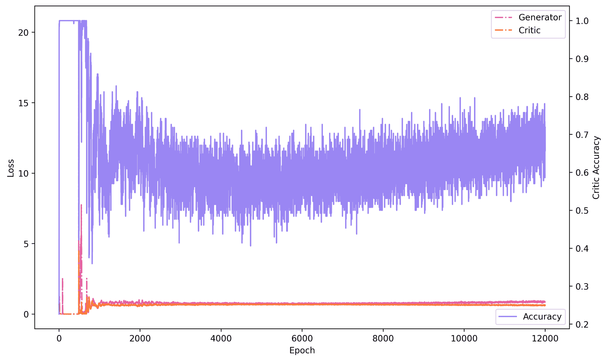

图 14.7 - 基于 CNN 的 GAN 学习曲线

我们还可以显示在训练卷积生成对抗网络时生成的样本。结果如*图 14.8*所示。这些结果与在 2000 个 epochs 下训练出的低质量生成器一致。在经过 5000 个 epochs 后，生成器能够生成定义明确的数字，这些数字可以轻松通过验证：

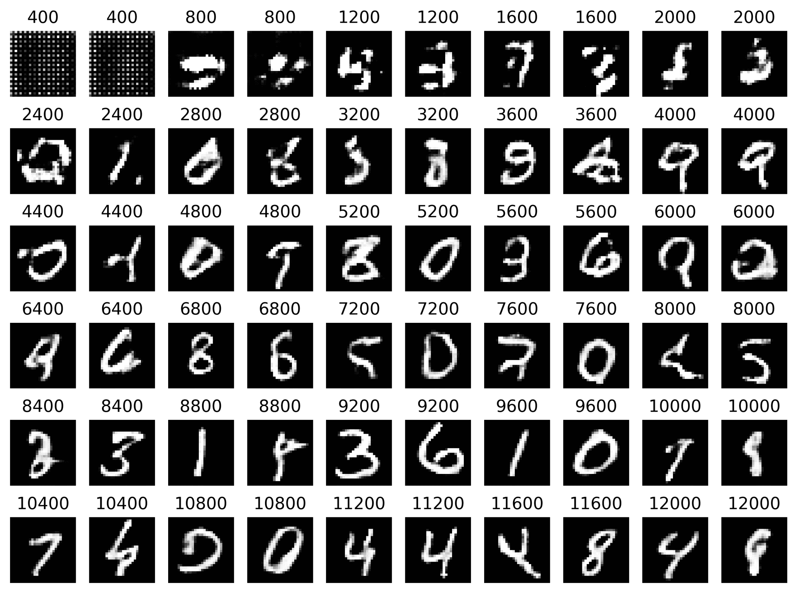

图 14.8 - 训练过程中生成的样本

作为参考，我们可以分别比较*图 14.5*和*图 14.8*，它们展示了基于 MLP 和卷积的不同方法。这样的比较有助于了解通用 GAN（基于 MLP）和专注于空间关系的 GAN（基于 CNN）之间的根本差异。

现在，我们简要讨论一下**变分自编码器**（**VAEs**）和生成对抗网络（GANs）所带来的生成能力。

# 比较 GAN 和 VAE

在第九章中，我们讨论了 VAE 作为一种降维机制，旨在学习输入空间分布的参数，并基于从潜在空间中随机抽取的样本，利用学习到的参数进行重建。这提供了我们在第九章中已讨论过的若干优点，如下所示：

+   由于 VAE 学习的是输入的分布，而非输入本身，因此它有能力减小噪声输入的影响。

+   通过简单查询潜在空间生成样本的能力

另一方面，GAN 也可以像 VAE 一样生成样本。然而，两者的学习过程有很大不同。在 GAN 中，我们可以将模型视为由两个主要部分组成：一个判别器和一个生成器。而在 VAE 中，我们也有两个网络：一个编码器和一个解码器。

如果我们要在两者之间做任何联系，那就是解码器和生成器在 VAE 和 GAN 中分别扮演着非常相似的角色。然而，编码器和判别器的目标则截然不同。编码器的目标是学习找到一个丰富的潜在表示，通常这个表示的维度远小于输入空间。而判别器的目标不是去找到任何表示，而是解决一个日益复杂的二分类问题。

我们可以主张判别器肯定是在学习输入空间的特征；然而，判别器和编码器中最深层的特征是否相似，这一说法还需要更多的证据。

我们可以通过比较的方法是，采用第九章中的深度 VAE 模型，*变分自编码器*，*图 14.7*，对其进行训练，并从 VAE 的生成器中随机抽取一些样本，同时对卷积 GAN 做同样的操作。

我们可以通过显示卷积 GAN 的样本并在前一节最后一段代码后立即执行以下代码来开始。该代码包含了已训练好的 GAN。代码如下：

```py
import matplotlib.pyplot as plt
import numpy as np

plt.figure(figsize=(10,10))
samples = np.random.uniform(0.0, 1.0, size=(400,ltnt_dim))
imgs = generator.predict(samples)
for cnt in range(20*20):
  plt.subplot(20,20,cnt+1)
  img = imgs[cnt]
  plt.imshow(img[:,:,0], cmap='gray')
  plt.xticks([])
  plt.yticks([])
plt.show()
```

这段代码将从随机噪声中生成 400 个数字！绘图如*图 14.9*所示：

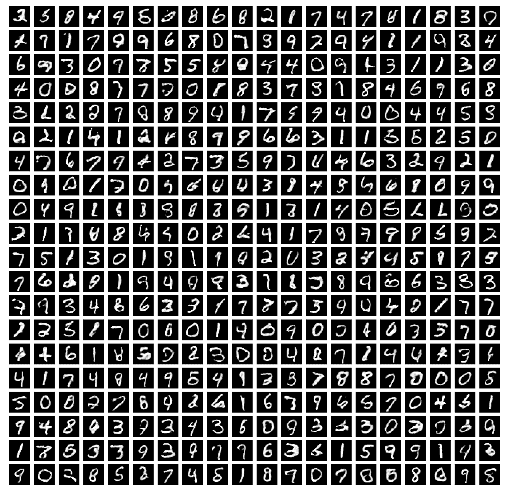

图 14.9 - 由卷积 GAN 生成的 400 个数字

回想一下，这些数字是在经过 12,000 次训练后生成的。质量似乎相对较好。这些数字大多数可能会欺骗人类，让他们以为它们真的是人类写的。

现在，我们想看看使用 VAE 生成的数字质量。为此，你需要参考第九章，*变分自编码器*，并使用提供的代码实现深度 VAE，并训练大约 5,000 次迭代。训练完成后，你可以使用解码器通过选择随机参数从随机噪声中生成样本。

一旦 VAE 的训练完成，以下是你应该使用的代码：

```py
import matplotlib.pyplot as plt
import numpy as np

plt.figure(figsize=(10,10))
samples = np.random.normal(0.0, 1.0, size=(400,ltnt_dim))
imgs = decoder.predict(samples)
for cnt in range(20*20):
  plt.subplot(20,20,cnt+1)
  img = imgs[cnt].reshape((28,28))
  plt.imshow(img, cmap='gray')
  plt.xticks([])
  plt.yticks([])
plt.show()
```

几个明显的区别是，VAE 假设潜在空间的参数遵循正态分布；此外，输出需要被重塑为 28x28，而 GAN 则通过 2D 卷积输出层直接生成正确形状的输出。这段代码的输出如*图 14.10*所示：

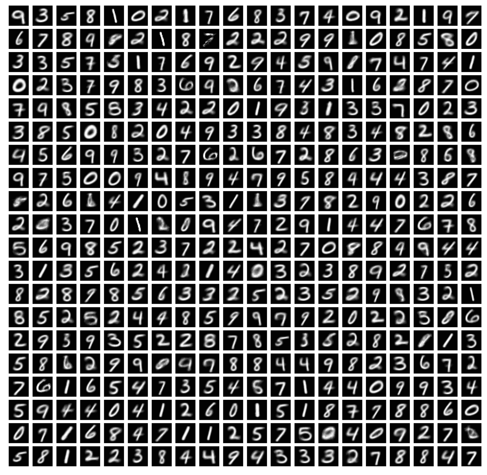

图 14.10 - 由 VAE 解码器使用随机噪声生成的 400 个数字样本

从图中可以看出，这些数字中的一些看起来非常好；有些人可能会说看起来太好。它们看起来平滑、圆润，或许我们可以说没有噪点。与由 GAN 生成的数字相比，VAE 生成的数字缺少那种带有噪音感的独特特征。然而，这可以是好事，也可以是坏事，取决于你想做什么。

假设你想要一些干净的样本，容易被识别为*伪造的*，那么 VAE 是最好的选择。现在，假设我们希望生成的样本能轻易地让人类相信它们不是机器生成的；在这种情况下，可能 GAN 更合适。

尽管有这些区别，两者都可以用来扩充你的数据集，如果你需要更多的数据。

# 思考 GAN 的伦理影响

关于生成模型的一些伦理思考已经在第九章，*变分自编码器*中提到。然而，鉴于 GAN 的对抗性质，第二轮的思考是必要的。也就是说，GAN 隐含地要求在最小-最大博弈中“欺骗”一个判别器，生成器需要取得胜利（或者判别器也可以）。这一概念推广到对抗学习，为攻击现有的机器学习模型提供了手段。

很成功的计算机视觉模型，如 VGG16（一个 CNN 模型），已经遭受过执行对抗攻击的模型攻击。有一些*补丁*可以打印出来，放在 T 恤、帽子或任何物体上，当这些补丁出现在输入到被攻击的模型中时，模型会被欺骗，认为原本存在的物体是完全不同的（Brown, T. B., 等人（2017））。这里有一个示例，通过对抗性补丁将香蕉欺骗成烤面包机：[`youtu.be/i1sp4X57TL4`](https://youtu.be/i1sp4X57TL4)。

既然这些类型的对抗攻击已经被确认存在，研究人员也发现了当前系统中的漏洞。因此，作为深度学习从业者，我们几乎有责任确保我们的模型在面对对抗攻击时具有鲁棒性。这对于涉及敏感信息的系统，或做出可能影响人类生命的决策的系统尤为重要。

例如，部署在机场以协助安全工作的深度学习模型需要进行测试，以避免某人穿着印有对抗性补丁的 T 恤，意图避免被识别为受限区域内的人员。这对人口安全至关重要。然而，用于自动调节某人唱歌音频的深度学习系统可能并不是特别关键。

你需要做的是测试你的模型是否受到对抗性攻击的影响。网上有多个资源，并且经常更新，只需搜索就可以轻松找到。如果你发现深度学习模型中存在漏洞，你应该立即向开发者报告，以确保我们社会的福祉。

# 摘要

本章高级内容向你展示了如何创建 GAN 网络。你了解了 GAN 的主要组件：生成器和判别器，以及它们在学习过程中的作用。你了解了对抗性学习的概念，尤其是在打破模型并使其对攻击具备鲁棒性方面。你基于同一数据集编写了基于 MLP 和基于卷积的 GAN，并观察了它们的差异。到此为止，你应该能够自信地解释为什么对抗训练如此重要。你应该能够编写必要的机制来训练 GAN 的生成器和判别器。你应该对编写 GAN 代码并与 VAE 进行对比，从已学习的潜在空间生成图像充满信心。你应该能够设计生成模型，考虑到其社会影响及使用生成模型时应承担的责任。

GAN 非常有趣，并且已经带来了令人惊叹的研究和应用。它们还暴露了其他系统的脆弱性。目前深度学习的状态涉及 AE、GAN、CNN 和 RNN 的组合，利用每种方法的特定组件，并逐步提高深度学习在各个领域的应用潜力。如今深度学习的世界充满了激动人心的前景，你现在已经准备好去拥抱它，并深入探讨你感兴趣的任何领域。第十五章，*关于深度学习未来的最终评价*，将简要评论我们对深度学习未来的看法。它尝试以某种*预言性的*语气谈论未来的事情。但在你离开之前，请用以下问题自我测试一下。

# 问题与答案

1.  **在 GAN 中，谁是对手？**

生成器。它充当一个模型，唯一的目的就是让评论员失败；它是评论员的对手。

1.  **为什么生成器模型比评论员模型更大？**

这并非总是如此。这里讨论的模型作为数据生成器更为有趣。然而，我们可以利用评论员并重新训练它用于分类，在这种情况下，评论员模型可能会更大。

1.  **什么是对抗性鲁棒性？**

这是深度学习中的一个新领域，致力于研究如何验证深度学习模型能够抵御对抗性攻击。

1.  **哪一个更好——GAN 还是 VAE？**

这取决于应用场景。与 VAE 相比，GAN 往往能产生更“有趣”的结果，但 VAE 更稳定。此外，训练 GAN 通常比训练 VAE 更快。

1.  **GAN 是否有任何风险？**

是的。有一个已知的问题叫做*模式崩溃*，它指的是 GAN 在不同训练周期中无法生成新颖且不同的结果。网络似乎会卡在一些样本上，这些样本足以在评论员中引起足够的混淆，从而生成较低的损失，但生成的数据缺乏多样性。这仍然是一个悬而未决的问题，没有普遍的解决方案。GAN 生成器缺乏多样性是其崩溃的迹象。想了解更多关于模式崩溃的信息，请阅读 Srivastava, A., 等人（2017 年）。

# 参考文献

+   Abadi, M., 和 Andersen, D. G. (2016). *使用对抗性神经密码学保护通信*。*arXiv 预印本* arXiv:1610.06918。

+   Ilyas, A., Engstrom, L., Athalye, A., 和 Lin, J. (2018). *有限查询和信息下的黑盒对抗性攻击*。*arXiv 预印本* arXiv:1804.08598。

+   Goodfellow, I., Pouget-Abadie, J., Mirza, M., Xu, B., Warde-Farley, D., Ozair, S., 和 Bengio, Y. (2014). *生成对抗网络*。载于 *神经信息处理系统进展*（第 2672-2680 页）。

+   Sukhbaatar, S., 和 Fergus, R. (2016). *使用反向传播学习多智能体通信*。载于 *神经信息处理系统进展*（第 2244-2252 页）。

+   Rivas, P., 和 Banerjee, P. (2020). *基于神经网络的 ECB 模式图像对抗加密，采用 16 位块*。发表于 *国际人工智能会议*。

+   Cohen, J. M., Rosenfeld, E., 和 Kolter, J. Z. (2019). *通过随机平滑获得认证的对抗性鲁棒性*。*arXiv 预印本* arXiv:1902.02918。

+   Radford, A., Metz, L., 和 Chintala, S. (2015). *使用深度卷积生成对抗网络进行无监督表示学习*。*arXiv 预印本* arXiv:1511.06434。

+   Brown, T. B., Mané, D., Roy, A., Abadi, M., 和 Gilmer, J. (2017). *对抗性补丁*。*arXiv 预印本* arXiv:1712.09665。

+   Srivastava, A., Valkov, L., Russell, C., Gutmann, M. U., 和 Sutton, C. (2017). *Veegan：使用隐式变分学习减少 GAN 中的模式崩溃*。发表于 *神经信息处理系统进展*（第 3308-3318 页）。
