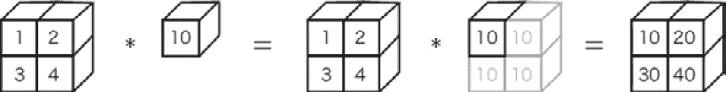
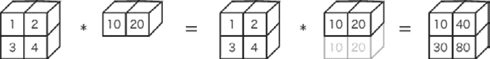
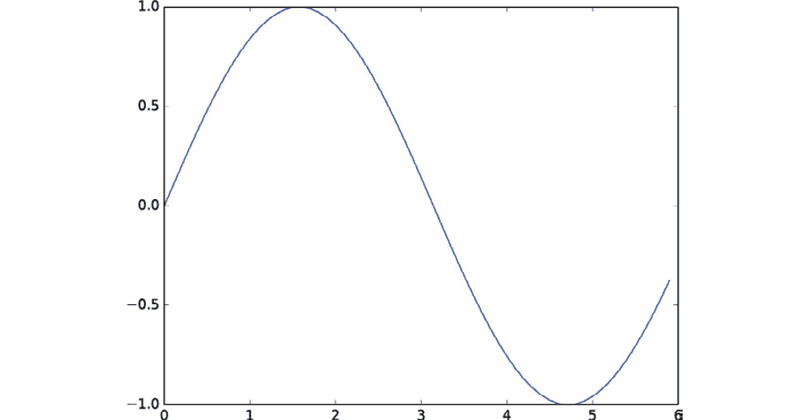
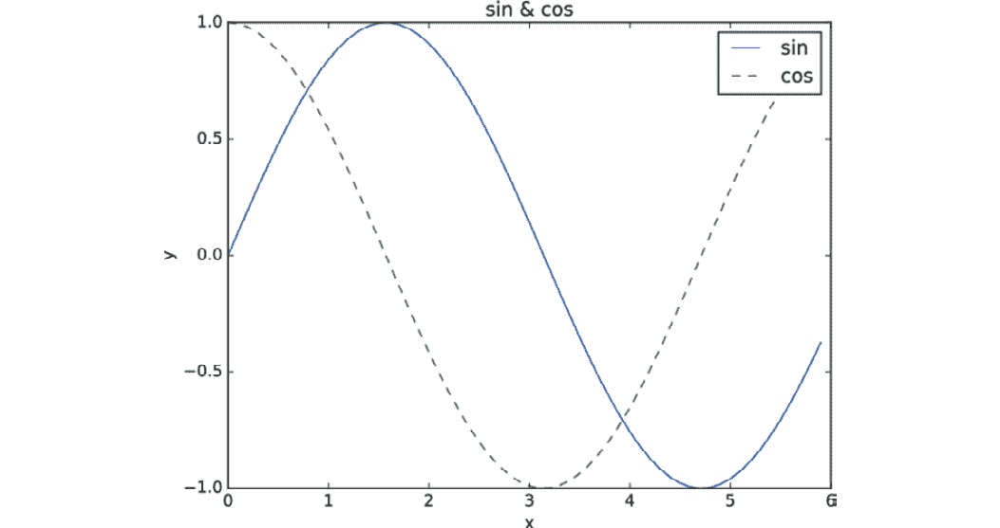

# 第二章：1. Python 简介

自 Python 编程语言发布以来，已经过去了 20 多年。在此期间，它不断发展并增加了用户基础。Python 目前是世界上最流行的编程语言。

在本书中，我们将使用这门强大的语言来实现一个深度学习系统。本章简要介绍 Python 并描述如何使用它。如果你已经熟悉 Python、NumPy 和 Matplotlib，可以跳过本章。

## 什么是 Python？

Python 是一种简单的编程语言，易于阅读和学习。它是开源软件，你可以免费使用它，随意编写具有类似英语语法的程序，而无需耗时的编译过程。这使得 Python 易于使用，因此成为初学者程序员的绝佳选择。事实上，许多大学和专业学校的计算机科学课程选择 Python 作为他们教授的第一门语言。

Python 使你能够编写既易于阅读又高效（快速）的代码。如果需要处理大量数据并且要求快速响应，Python 将满足你的需求。这也是为什么 Python 深受初学者和专业人士喜爱的原因。像 Google、Microsoft 和 Facebook 这样的前沿 IT 公司也经常使用 Python。

Python 常常用于科学领域，尤其是机器学习和数据科学。由于其高性能以及在数值计算和统计处理方面的优秀库（例如 NumPy 和 SciPy），Python 在数据科学领域占据了坚实的地位。它常被用作深度学习框架（如 Caffe、TensorFlow 和 PyTorch）的核心，这些框架提供 Python 接口。因此，学习 Python 对于希望使用深度学习框架的人来说也非常有用。

Python 是一种优化的编程语言，特别是在数据科学领域，因为它为初学者和专业人士提供了各种用户友好且高效的功能。正因为如此，它成为了实现本书目标的自然选择：*从基础学习深度学习*。

## 安装 Python

以下部分描述了在你的环境（PC）中安装 Python 时需要注意的一些事项。

### Python 版本

Python 有两个主要版本：版本 2 和版本 3。目前，两个版本都在积极使用。因此，当你安装 Python 时，必须仔细选择要安装的版本。这两个版本并不完全兼容（准确来说，没有**向后兼容性**）。一些用 Python 3 编写的程序无法在 Python 2 中运行。本书使用的是 Python 3。如果你只安装了 Python 2，建议安装 Python 3。

### 我们使用的外部库

本书的目标是从基础实现 *深度学习*。因此，我们的方针是尽量少使用外部库，但我们会例外地使用以下两个库：NumPy 和 Matplotlib。我们将利用这两个库来高效地实现深度学习。

NumPy 是一个用于数值计算的库。它提供了许多便捷的方法来处理高级数学算法和数组（矩阵）。为了在本书中实现深度学习，我们将利用这些便捷的方法进行高效的实现。

Matplotlib 是一个用于绘制图形的库。你可以使用 Matplotlib 来可视化实验结果，并在执行深度学习时直观地检查数据。本书使用这些库来实现深度学习。

本书使用以下编程语言和库：

+   Python 3

+   NumPy

+   Matplotlib

现在，我们将介绍如何安装 Python，供需要安装的读者参考。如果你已经满足这些要求，可以跳过此部分。

### Anaconda 发行版

尽管有多种安装 Python 的方法，本书推荐使用一个名为 **Anaconda** 的发行版。发行版包含所需的库，用户可以一次性安装这些库。Anaconda 发行版专注于数据分析，并包含了对数据分析有用的库，例如前面提到的 NumPy 和 Matplotlib。

正如我们之前提到的，本书使用的是 Python 3。因此，你需要安装适用于 Python 3 的 Anaconda 发行版。使用以下链接下载适合你操作系统的发行版并安装：

[`docs.anaconda.com/anaconda/install/`](https://docs.anaconda.com/anaconda/install/)

## Python 解释器

安装 Python 后，首先检查版本。打开终端（Windows 系统为命令提示符），输入 `python --version` 命令。该命令会输出你安装的 Python 版本：

```py
$ python --version
Python 3.4.1 :: Anaconda 2.1.0 (x86_64)
```

如果显示了 Python 3.4.1（具体数字会根据你安装的版本不同而有所变化），如前面的代码所示，说明 Python 3 已经成功安装。现在，输入 `python` 并启动 Python 解释器：

```py
$ python
Python 3.4.1 |Anaconda 2.1.0 (x86_64)| (default, Sep 10 2014, 17:24:09) [GCC 4.2.1 (Apple Inc. build 5577)] on darwin
Type "help", "copyright", "credits" or "license" for more information.
>>>
```

Python 解释器也可以称作 `3`，当你问“1+2 等于多少？”时，输入以下内容：

```py
>>> 1 + 2
3
```

因此，Python 解释器允许你进行交互式编程。在本书中，我们将使用交互式模式来处理 Python 编程的简单示例。

### 数学运算

你可以进行数学运算，例如加法和乘法，如下所示：

```py
>>> 1 - 2
-1
>>> 4 * 5
20
>>> 7 / 5
1.4
>>> 3 ** 2
9
```

这里，* 表示乘法，/ 表示除法，** 表示指数运算。（3 ** 2 表示 3 的平方。）在 Python 2 中，当你将两个整数相除时，会返回一个整数。例如，7/5 的结果是 1。而在 Python 3 中，当你将两个整数相除时，会返回一个浮动小数。

### 数据类型

编程有数据类型。数据类型表示数据的特性，比如整数、浮点数或字符串。Python 提供了`type()`函数来检查数据的类型：

```py
>>> type(10)
<class 'int'>
>>> type(2.718)
<class 'float'>
>>> type("hello")
<class 'str'>
```

前面的结果表明，`10`是`int`（整数类型），`2.718`是`float`（浮点类型），而`hello`是`str`（字符串类型）。`type`和`class`这两个词有时可以互换使用。输出结果`<class 'int'>`可以解释为`10`是`int`的`class`（类型）。

### 变量

你可以定义`x`和`y`。你还可以使用变量来计算或给变量赋另一个值：

```py
>>> x = 10 # Initialize
>>> print(x) 
10
>>> x = 100 # Assign
>>> print(x)
100
>>> y = 3.14
>>> x * y
314.0
>>> type(x * y)
<class 'float'>
```

Python 是一种动态类型的编程语言。`x`是`int`（整数）。Python 通过`x`被初始化为整数 10 来判断`x`的类型是`int`。前面的例子还表明，整数与小数相乘会返回小数（自动类型转换）。`#`符号用于注释后续字符，Python 会忽略它们。

### 列表

你可以使用列表（数组）将多个数字赋值给一个变量：

```py
>>> a = [1, 2, 3, 4, 5] # Create a list
>>> print(a) # Print the content of the list
[1, 2, 3, 4, 5]
>>> len(a) # Get the length of the list
5
>>> a[0] # Access the first element
1
>>> a[4]
5
>>> a[4] = 99 # Assign a value
>>> print(a)
[1, 2, 3, 4, 99]
```

要访问一个元素，你可以写`a[0]`，例如。`[ ]`中的数字称为索引，从 0 开始（索引 0 表示第一个元素）。Python 列表提供了一种便捷的表示法，称为`切片`。你可以使用切片来访问单个元素或列表的子列表：

```py
>>> print(a)
[1, 2, 3, 4, 99]
>>> a[0:2] # Obtain from the zero index to the second index (the second one is not included!) 
[1, 2]
>>> a[1:] # Obtain from the first index to the last
[2, 3, 4, 99]
>>> a[:3] # Obtain from the zero index to the third index (the third one is not included!) 
[1, 2, 3]
>>> a[:-1] # Obtain from the first element to the second-last element
[1, 2, 3, 4]
>>> a[:-2] # Obtain from the first element to the third-last element
[1, 2, 3]
```

你可以通过写`a[0:2]`来切片一个列表。在这个例子中，`a[0:2]`获取从零索引到第二个索引前的元素。因此，在这种情况下，它只会显示零索引和一索引的元素。索引数字`-1`表示最后一个元素，而`-2`表示倒数第二个元素。

### 字典

在列表中，值是通过索引号（0，1，2，...）存储的，索引从 0 开始。字典以键/值对的形式存储数据。与它们含义相关的单词就像在语言词典中一样被存储在字典中：

```py
>>> me = {'height':180} # Create a dictionary
>>> me['height'] # Access an element
180
>>> me['weight'] = 70 # Add a new element
>>> print(me)
{'height': 180, 'weight': 70}
```

### 布尔值

Python 有一个布尔类型。它的值是`True`或`False`。布尔类型的运算符有`and`、`or`和`not`（数据类型决定了可以使用的运算符，例如数字可以使用+、-、*、/等运算符）：

```py
>>> hungry = True # Hungry?
>>> sleepy = False # Sleepy?
>>> type(hungry)
<class 'bool'>
>>> not hungry
False
>>> hungry and sleepy 
False
>>> hungry or sleepy 
True
```

### `if`语句

你可以使用`if`/`else`根据条件切换过程：

```py
>>> hungry = True
>>> if hungry:
...  print("I'm hungry")
...
I'm hungry
>>> hungry = False
>>> if hungry:
...    print("I'm hungry") # Indent with spaces
... else:
...     print("I'm not hungry")
...     print("I'm sleepy")
...
I'm not hungry
I'm sleepy
```

在 Python 中，空格有着重要的意义。在这个`if`语句的例子中，`if hungry`后的下一行语句是以四个空格开头的。这是一个缩进，表示当条件（`if hungry`）满足时会执行的代码。虽然你可以使用制表符（Tab）来缩进，Python 推荐使用空格。

在 Python 中，使用空格表示缩进。通常每个缩进级别使用四个空格。

### `for`语句

使用`for`语句进行循环：

```py
>>> for i in [1, 2, 3]:
...    print(i)
...
1
2
3
```

这个例子输出了一个列表的元素`[1, 2, 3]`。当你使用`for … in …:`语句时，你可以依次访问数据集中的每个元素，例如列表。

### 函数

你可以定义一组过程作为一个**函数**：

```py
>>> def hello():
...  print("Hello World!")
...
>>> hello()
Hello World!
```

一个函数可以接受一个参数：

```py
>>> def hello(object):
...  print("Hello " + object + "!")
...
>>> hello("cat")
Hello cat!
```

使用`+`来连接字符串。

要关闭 Python 解释器，对于 Linux 和 macOS X，输入*Ctrl*+`D`（按住*Ctrl*键的同时按下`D`键）。对于 Windows，输入*Ctrl*+`Z`并按*Enter*键。

## Python 脚本文件

到目前为止展示的例子使用了一个 Python 解释器，提供了一种可以与 Python 交互的模式，适用于简单的实验。然而，如果你想进行大规模的处理，它就有点不方便，因为每次都得输入程序。在这种情况下，你可以将 Python 程序保存为一个文件并一次性执行。接下来的部分提供了 Python 脚本文件的例子。

### 保存到文件

打开你的文本编辑器并创建一个`hungry.py`文件。`hungry.py`文件只包含一行代码，如下所示：

```py
print("I'm hungry!")
```

然后，打开终端（Windows 的命令提示符）并移动到创建`hungry.py`文件的位置。使用文件名`hungry.py`作为参数执行`python`命令。在这里，

假设`hungry.py`位于`~/deep-learning-from-zero/ch01`目录下（在本书提供的源代码中，`hungry.py`位于`ch01`目录下）：

```py
$ cd ~/deep-learning-from-zero/ch01 # Move to the directory
$ python hungry.py
I'm hungry! 
```

因此，你可以使用`python hungry.py`命令来运行 Python 程序。

### 类

到目前为止，你已经学习了`int`和`str`等数据类型（你可以使用`type()`函数来检查对象的类型）。这些数据类型被称为**内建**数据类型，因为它们是 Python 自带的。在这里，你将定义一个新的类来创建你的数据类型。你还可以定义你自己的方法（类的函数）和属性。

在 Python 中，你可以使用`class`关键字来定义一个类。你必须使用以下格式：

```py
class name:
    def __init__ (self, argument, …): # Constructor
        ...
    def method name 1 (self, argument, …): # Method 1
        ...
    def method name 2 (self, argument, …): # Method 2
        ...
```

`__init__`方法是一个特殊的初始化方法。这个初始化方法也被显式地称为`self`，作为方法的第一个参数来表示你自己（你的实例）。（对那些熟悉其他语言的人来说，这种做法可能显得有些奇怪。）

创建一个简单的类，如下所示，并将以下程序保存为`man.py`：

```py
class Man:
    def __init__(self, name):
        self.name = name
        print("Initialized!")
    def hello(self):
        print("Hello " + self.name + "!")
    def goodbye(self):
        print("Good-bye " + self.name + "!")
m = Man("David")
m.hello()
m.goodbye()
```

从终端执行`man.py`：

```py
$ python man.py
Initialized!
Hello David!
Good-bye David!
```

在这里，你定义了一个新的类`Man`。在前面的例子中，从`Man`类创建了一个实例（对象）m。

`Man`类的构造函数（初始化方法）接受`name`作为参数，并用它来初始化实例变量`self.name`。一个`self`。

## NumPy

在实现深度学习时，数组和矩阵经常被计算。NumPy 的数组类`(numpy.array)`提供了许多方便的方法，这些方法在深度学习中非常常用。本节简要介绍了 NumPy，稍后我们会使用它。

### 导入 NumPy

NumPy 是一个外部库。**外部**这里的意思是，NumPy 没有包含在标准 Python 中。所以，你必须先加载（导入）NumPy 库：

```py
>>> import numpy as np
```

在 Python 中，使用 import 语句导入库。这里，`import numpy as np`表示将`numpy`库加载为`np`。因此，你现在可以通过`np`来引用 NumPy 的方法。

### 创建 NumPy 数组

你可以使用`np.array()`方法创建一个 NumPy 数组。`np.array()`以 Python 列表作为参数来创建一个 NumPy 数组——也就是`numpy.ndarray`：

```py
>>> x = np.array([1.0, 2.0, 3.0])
>>> print(x)
[ 1\. 2\. 3.]
>>> type(x)
<class 'numpy.ndarray'>
```

### NumPy 中的数学运算

以下是一些涉及 NumPy 数组的数学运算示例：

```py
>>> x = np.array([1.0, 2.0, 3.0])
>>> y = np.array([2.0, 4.0, 6.0])
>>> x + y # Add arrays
array([ 3., 6., 9.])
>>> x - y
array([ -1., -2., -3.])
>>> x * y # element-wise product
array([ 2.,	8., 18.])
>>> x / y
array([ 0.5, 0.5, 0.5])
```

请注意，数组`x`和`y`的元素数量是相同的（它们都是一维数组，包含三个元素）。当`x`和`y`的元素数量相同，数学运算会对每个元素进行。如果元素数量不同，则会发生错误。因此，它们的元素数量必须相同。“对于每个元素”也称为**逐元素**，而“每个元素的乘积”称为**逐元素乘积**。

除了逐元素计算，NumPy 数组与单一数字（标量值）之间的数学运算也是可用的。在这种情况下，计算会在 NumPy 数组的每个元素与标量值之间进行。这一特性被称为**广播**（更多详细信息将在后续介绍）：

```py
>>> x = np.array([1.0, 2.0, 3.0])
>>> x / 2.0
array([ 0.5, 1\. , 1.5])
```

### N 维 NumPy 数组

在 NumPy 中，你可以创建多维数组，也可以创建一维数组（线性数组）。例如，你可以按如下方式创建二维数组（矩阵）：

```py
>>> A = np.array([[1, 2], [3, 4]])
>>> print(A)
[[1 2]
[3 4]]
>>> A.shape
(2, 2)
>>> A.dtype
dtype('int64')
```

在这里，创建了一个 2x2 的矩阵`A`。你可以使用`shape`检查矩阵`A`的形状，使用`dtype`检查其元素的类型。以下是矩阵的数学运算：

```py
>>> B = np.array([[3, 0],[0, 6]])
>>> A + B
array([[ 4, 2],
[ 3, 10]])
>>> A * B
array([[ 3, 0],
[ 0, 24]])
```

与数组一样，矩阵如果具有相同形状，则按元素逐一进行计算。矩阵与标量（单个数字）之间的数学运算也是可用的。这也是通过广播来实现的：

```py
>>> print(A)
[[1 2]
[3 4]]
>>> A * 10
array([[ 10, 20],
[ 30, 40]])
```

一个 NumPy 数组（`np.array`）可以是 N 维数组。你可以创建任意维数的数组，例如一维、二维、三维等。在线性代数中，一维数组叫做**向量**，二维数组叫做**矩阵**。将向量和矩阵的概念推广就是**张量**。在本书中，我们将把二维数组称为矩阵，把三维或更多维的数组称为张量或多维数组。

### 广播

在 NumPy 中，你还可以对形状不同的数组进行数学运算。在前面的例子中，2x2 矩阵`A`被与标量值`s`相乘。*图 1.1*展示了这个操作的过程：标量值`10`被扩展为 2x2 元素进行运算。这个智能特性叫做**广播**：



###### 图 1.1：广播示例——标量值 10 被视为一个 2x2 矩阵

这里是另一个广播示例的计算：

```py
>>> A = np.array([[1, 2], [3, 4]])
>>> B = np.array([10, 20])
>>> A * B
array([[ 10, 40],
[ 30, 80]])
```

在这里（如*图 1.2*所示），一维数组`B`被转换为与二维数组`A`相同的形状，并且它们按元素进行逐一计算。

因此，NumPy 可以使用广播机制在形状不同的数组之间进行运算：



###### 图 1.2：示例广播

### 访问元素

元素的索引从`0`开始（如常规）。你可以按如下方式访问每个元素：

```py
>>> X = np.array([[51, 55], [14, 19], [0, 4]])
>>> print(X)
[[51 55]
[14 19]
[ 0 4]]
>>> X[0]  # 0th row
array([51, 55])
>>> X[0][1] # Element at (0,1)
55
```

使用`for`语句来访问每个元素：

```py
>>> for row in X:
...    print(row)
...
[51 55]
[14 19]
[0 4]
```

除了前面描述的索引操作，NumPy 还可以使用数组来访问每个元素：

```py
>>> X = X.flatten( ) # Convert X into a one-dimensional array
>>> print(X)
[51 55 14 19 0 4]
>>> X[np.array([0, 2, 4])] # Obtain the elements of the 0th, 2nd, and 4th indices
array([51, 14, 0])
```

使用这种符号可以获取仅满足特定条件的元素。例如，下面的语句从`X`中提取大于`15`的值：

```py
>>> X > 15
array([ True, True, False, True, False, False], dtype=bool)
>>> X[X>15]
array([51, 55, 19])
```

使用 NumPy 数组时，使用不等号（例如`X > 15`，如前面的示例）会返回一个布尔数组。这里，布尔数组被用来提取数组中的每个元素，提取那些值为`True`的元素。

#### 注意

有人说，像 Python 这样的动态语言在处理速度上比 C 和 C++ 这样的静态语言（编译语言）要慢。实际上，你应该在 C/C++ 中编写程序来处理繁重的计算工作。当 Python 需要性能时，某个过程的内容可以在 C/C++ 中实现。那时，Python 作为中介调用用 C/C++ 编写的程序。在 NumPy 中，主要的处理过程是由 C 和 C++ 实现的。因此，你可以在不降低性能的情况下使用便捷的 Python 语法。

## Matplotlib

在深度学习实验中，绘制图形和可视化数据非常重要。使用 Matplotlib，你可以轻松地通过绘制图形和图表来进行可视化。本节将介绍如何绘制图形并显示图像。

### 绘制简单图形

你可以使用 Matplotlib 的`pyplot`模块来绘制图形。这里是绘制正弦函数的示例：

```py
import numpy as np
import matplotlib.pyplot as plt
# Create data
x = np.arange(0, 6, 0.1) # Generate from 0 to 6 in increments of 0.1
y = np.sin(x)
# Draw a graph
plt.plot(x, y)
plt.show()
```

这里，NumPy 的`arange`方法用于生成数据[0, 0.1, 0.2, …, 5.8, 5.9]并命名为`x`。NumPy 的正弦函数`np.sin()`应用于`x`的每个元素，`x`和`y`的数据行提供给`plt.plot`方法绘制图形。最后，通过`plt.show()`显示图形。当执行上述代码时，显示的图像如*图 1.3*所示：



###### 图 1.3：正弦函数图

### pyplot 的特性

这里，我们将绘制余弦函数（`cos`），除了之前查看过的正弦函数（`sin`）。我们还将使用一些`pyplot`的其他特性来显示标题、x 轴的标签名称等：

```py
import numpy as np
import matplotlib.pyplot as plt
# Create data
x = np.arange(0, 6, 0.1) # Generate from 0 to 6 in increments of 0.1
y1 = np.sin(x)
y2 = np.cos(x)
# Draw a graph
plt.plot(x, y1, label="sin")
plt.plot(x, y2, linestyle = "--", label="cos") # Draw with a dashed line
plt.xlabel("x") # Label of the x axis
plt.ylabel("y") # Label of the y axis
plt.title('sin & cos') # Title
plt.legend()
plt.show()
```

*图 1.4*显示了生成的图形。你可以看到图形的标题和坐标轴的标签名称：



###### 图 1.4：正弦和余弦函数图

### 显示图像

`imshow()` 方法用于显示图像，它也包含在 `pyplot` 中。你可以使用 `matplotlib.image` 模块中的 `imread()` 加载图像，如下例所示：

```py
import matplotlib.pyplot as plt 
from matplotlib.image import imread
img = imread('lena.png') # Load an image (specify an appropriate path!) 
plt.imshow(img)
plt.show()
```

当你执行这段代码时，显示的图像是*图 1.5*：


###### 图 1.5：显示图像

在此，假设图像 `lena.png` 位于当前目录。根据你的环境，你需要更改文件的名称和路径。在本书提供的源代码中，`lena.png` 位于 `dataset` 目录下作为示例图像。例如，要从 `ch01` 目录中执行上述代码，需将图像路径从 `lena.png` 更改为 `../dataset/lena.png` 以确保正常运行。

## 总结

本章介绍了实现深度学习和神经网络所需的一些 Python 编程基础。下一章，我们将进入深度学习的世界，看看一些实际的 Python 代码。

本章仅提供了 Python 的简要概述。如果你想了解更多，以下材料可能会有所帮助。对于 Python，推荐阅读 *Bill Lubanovic: Introducing Python, Second Edition, O'Reilly Media, 2019*。这是一本实用的入门书籍，详细讲解了从 Python 基础到应用的编程内容。对于 NumPy，*Wes McKinney: Python for Data Analysis, O'Reilly Media, 2012* 语言简单易懂，结构清晰。此外，*Scipy Lecture Notes*（[`scipy-lectures.org`](https://scipy-lectures.org)）网站深入描述了 NumPy 和 Matplotlib 在科学计算中的应用。如果你感兴趣，可以参考这些资料。

本章涵盖了以下内容：

+   Python 是一种简单易学的编程语言。

+   Python 是一个开源软件，你可以根据需要自由使用。

+   本书使用 Python 3 实现深度学习。

+   NumPy 和 Matplotlib 被用作外部库。

+   Python 提供了两种执行模式：解释器模式和脚本文件模式。

+   在 Python 中，你可以将函数和类实现并作为模块导入。

+   NumPy 提供了许多处理多维数组的便捷方法。
