# 第三章：2. 感知机

本章描述了一种叫做*感知机*的算法。它由美国研究员弗兰克·罗森布拉特于 1957 年发明，正是从这种传统算法中衍生出了神经网络（即深度学习），因此它是学习这两个领域更高阶知识的必要第一步。本章将介绍感知机，并利用感知机解决简单问题。在此过程中，你将熟悉感知机的基本原理。

## 什么是感知机？

感知机接收多个信号作为输入，并输出一个信号。这里的“信号”像电流或河流一样“流动”。就像电流通过导体推动电子前进一样，感知机中的信号也会流动并传递信息。与电流不同的是，感知机中的信号是二进制的：“流动（1）或不流动（0）。”在本书中，0 表示“不传递信号”，1 表示“传递信号”。

（为了准确起见，注意本章描述的感知机更准确地应称为“人工神经元”或“简单感知机”。在这里，我们将其称为“感知机”，因为其基本过程通常是相同的。）

*图 2.1* 显示了一个接收两个信号作为输入的感知机示例：


###### 图 2.1：带有两个输入的感知机

`x`1 和 `x`2 是输入信号，`y` 是输出信号，`w`1 和 `w`2 是权重（w 是“权重”一词的首字母）。前面的图中的圆圈叫做“神经元”或“节点”。当输入信号传递到神经元时，每个信号都与其对应的权重相乘（`w`1 `x`1 和 `w`2 `x`2）。神经元对接收到的信号进行求和，当和超过某一限制值时，它输出 1。这有时被称为“激活神经元”。这里，限制值称为**阈值**，并由*θ*符号表示。

这就是感知机的工作原理。公式（2.1）展示了我们在此描述的内容：

|  | (2.1) |
| --- | --- |

感知机为多个输入中的每一个设置了特定的权重，权重控制每个信号的重要性。权重越大，信号对该权重的影响就越大。

#### 注意

权重相当于电气“电阻”。电阻是衡量电流通过难度的参数。电阻越小，电流越大。同时，当感知机的权重越大，流过的信号也越强。电阻和权重的作用方式相同，它们都控制信号通过的难易程度。

## 简单逻辑电路

### 与门

以下是一些使用感知机的简单问题。我们在这里讨论逻辑电路。让我们首先思考一个 AND 门。一个 AND 门由两个输入和一个输出组成。输入和输出信号的表格，如*图 2.2*所示，称为“真值表”。如*图 2.2*所示，当两个输入为 1 时，AND 门输出 1，其他情况输出 0：

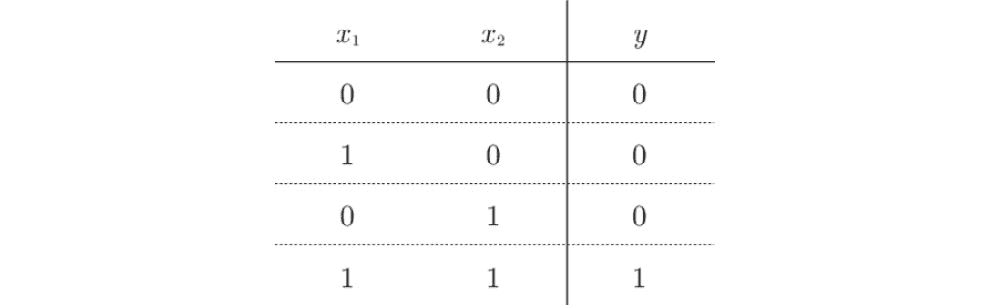

###### 图 2.2：AND 门的真值表

现在，我们将使用感知机来表示这个 AND 门。我们将确定 `w`1、`w`2 和 *θ* 的值，使它们满足*图 2.2*的真值表。我们可以设置什么值来创建一个符合*图 2.2*条件的感知机？

实际上，满足*图 2.2*的参数组合有无数种。例如，当（`w`1, `w`2, *θ*）=（0.5, 0.5, 0.7）时，感知机的工作方式如*图 2.2*所示。（0.5, 0.5, 0.8）和（1.0, 1.0, 1.0）也满足 AND 门的条件。如果设置这些参数，当 `x`1 和 `x`2 都为 1 时，带权信号的总和超过给定的阈值*θ*。

### NAND 和 OR 门

现在，让我们来看一个 NAND 门。NAND 是 Not AND 的意思，NAND 门的输出是 AND 门的反面。如*图 2.3*提供的真值表所示，当 `x`1 和 `x`2 都为 1 时，它输出 0，其他情况输出 1。NAND 门有哪些参数组合呢？

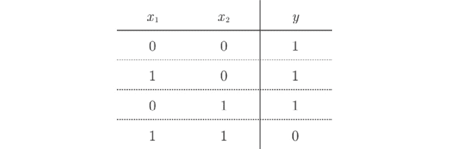

###### 图 2.3：NAND 门的真值表

一组组合（`w`1, `w`2, *θ*）=（-0.5, -0.5, -0.7）可以表示一个 NAND 门，实际上还有无数种其他组合。事实上，你可以通过反转构建 AND 门的参数值的所有符号来构建一个 NAND 门。

现在，让我们看看 OR 门，如*图 2.4*所示。这是一个逻辑电路，当至少一个输入信号为 1 时，它输出 1。你认为我们可以为 OR 门设置什么参数？

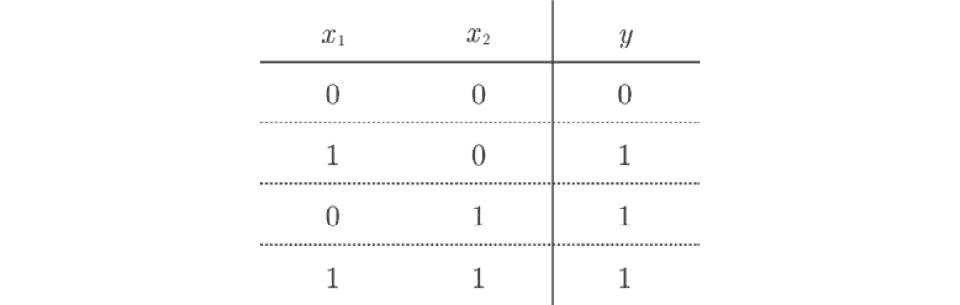

###### 图 2.4：OR 门的真值表

#### 注意

在这里，我们是决定感知机参数的人，而不是计算机。在查看“训练数据”时，也就是所谓的真值表，我们手动考虑（或找到）了参数值。在机器学习问题中，计算机会自动确定参数值。**训练**是决定合适参数的任务，我们考虑感知机的结构（模型），并将训练数据提供给计算机。

如前所述，我们可以使用感知器构建与门、非与门和或门逻辑电路。这里重要的是，感知器的结构对于与门、非与门和或门是相同的。三者之间的区别在于参数值（权重和阈值）。就像一个多才多艺的演员能够演绎各种角色一样，当适当调整参数值时，具有相同结构的感知器可以变成与门、非与门或或门。

## 实现感知器

### 简单实现

让我们使用 Python 实现前面的逻辑电路。在这里，我们将定义 AND 函数，接受`x1`和`x2`作为参数：

```py
def AND(x1, x2):
    w1, w2, theta = 0.5, 0.5, 0.7
    tmp = x1*w1 + x2*w2
    if tmp <= theta:
        return 0
    elif tmp > theta:
        return 1
```

`w1`、`w2` 和 `theta` 参数在函数内部被初始化。当加权输入的总和超过阈值时，返回 1；否则，返回 0。让我们检查输出是否与*图 2.2*中所示的相同：

```py
AND(0, 0) # 0 (output)
AND(1, 0) # 0 (output)
AND(0, 1) # 0 (output)
AND(1, 1) # 1 (output)
```

输出结果如我们预期的那样。这样，你就构建了一个与门。尽管你可以使用类似的过程构建非与门或或门，但我们将稍微改变实现方式。

### 引入权重和偏置

尽管前面的与门实现简单且易于理解，我们将在后续章节中将其改为不同的实现方式，将方程（2.1）中的*θ*替换为-b，并在方程（2.2）中表示感知器的行为：

|  | (2.2) |
| --- | --- |

尽管符号的表示法已经发生变化，方程（2.1）和（2.2）表示的完全相同。这里，b 被称为偏置，而`w`1 和 `w`2 被称为**权重**。如方程（2.2）所示，感知器将输入信号值与权重相乘后加和，再加上偏置。如果和超过 0，输出 1，否则输出 0。现在，让我们使用 NumPy 实现方程（2.2）。我们将使用 Python 解释器逐一检查结果：

```py
>>> import numpy as np
>>> x = np.array([0, 1]) # Input
>>> w = np.array([0.5, 0.5]) # Weight
>>> b = -0.7	# Bias
>>> w*x
array([ 0\. ,  0.5])
>>> np.sum(w*x)
0.5
>>> np.sum(w*x) + b
-0.19999999999999996 # About -0.2 (Operation error with floatingpoint numbers)
```

如此示例所示，当 NumPy 数组相乘时，如果两个数组的元素数量相同，它们的每个元素都会相乘。因此，在计算`w*x`时，每个元素都会相乘，（[0, 1] * [0.5, 0.5] => [0, 0.5]）。在`np.sum(w*x)`中，每个元素会被求和。当偏置被加到这个加权和时，方程（2.2）的计算就完成了。

### 使用权重和偏置的实现

你可以使用权重和偏置实现与门，如下所示：

```py
def AND(x1, x2):
    x = np.array([x1, x2])
    w = np.array([0.5, 0.5])
    b = -0.7
    tmp = np.sum(w*x) + b
    if tmp <= 0:
        return 0
    else:
        return 1
```

这里，-*θ*称为偏置（bias），`b`。请注意，偏置与权重* w*1 和 `w`2 的作用不同。具体来说，`w`1 和 `w`2 作为参数，控制输入信号的重要性，而偏置则作为调节神经元激活容易度的参数——即输出信号为 1 的可能性。例如，如果`b`是-0.1，当输入信号的加权和超过 0.1 时，神经元会触发。另一方面，如果`b`是-20.0，只有当输入信号的加权和超过 20.0 时，神经元才会触发。因此，偏置的值决定了神经元激活的难易程度。虽然`w`1 和 `w`2 被称为“权重”，而`b` 被称为“偏置”，但在某些上下文中，所有这些参数（即`b`，`w`1 和 `w`2）有时统称为“权重”。

#### 注：

“偏置”一词也有“填充”的意思。它表示如果没有输入（即输入为 0），则输出会增加。实际上，如果输入`x`1 和`x`2 均为 0，那么当计算公式(2.2)中的`b` + `w`1 `x`1 + `w`2 `x`2 时，输出的值就是偏置的值。

现在，让我们实现 NAND 和 OR 门：

```py
def NAND(x1, x2):
    x = np.array([x1, x2])
    w = np.array([-0.5, -0.5]) # Only the weights and bias are different from AND!
    b = 0.7
    tmp = np.sum(w*x) + b
    if tmp <= 0:
        return 0
    else:
        return 1
def OR(x1, x2):
    x = np.array([x1, x2])
    w = np.array([0.5, 0.5]) # Only the weights and bias are different from AND!
    b = -0.2
    tmp = np.sum(w*x) + b
    if tmp <= 0:
        return 0
    else:
        return 1
```

如前一部分所述，AND、NAND 和 OR 门在感知器的结构上是相同的，区别仅在于权重参数的值。在实现 NAND 和 OR 门时，唯一区别就是权重和偏置的值与 AND 门不同。

## 感知器的局限性

如前所述，我们可以使用感知器来实现 AND、NAND 和 OR 逻辑门。在接下来的部分，你将考虑如何实现 XOR 门。

### XOR 门

XOR 门是一种门电路，也叫做*异或*门。如图 2.5 所示，当`x`1 或`x`2 其中之一为 1 时，输出为 1（“exclusive”意味着“仅限于一个”）。为了利用感知器实现 XOR 门，权重应该取什么值呢？

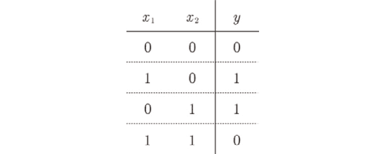

###### 图 2.5：XOR 门的真值表

事实上，利用我们目前所学的感知器，无法构建这个 XOR 门。那么，为什么我们可以构建 AND 门和 OR 门，却不能构建 XOR 门呢？

首先，让我们通过视觉方式检查 OR 门的行为。例如，当权重参数为(`b`, `w`1, `w`2) = (-0.5, 1.0, 1.0)时，OR 门符合图 2.5 中的真值表。在这种情况下，感知器由公式(2.3)表示：

|  | (2.3) |
| --- | --- |

由公式(2.3)表示的感知器生成了两个由直线-0.5 + `x`1 + `x`2 = 0 分隔的区域。直线分隔出的一个区域输出 1，另一个区域输出 0。图 2.6 直观地展示了这一点：

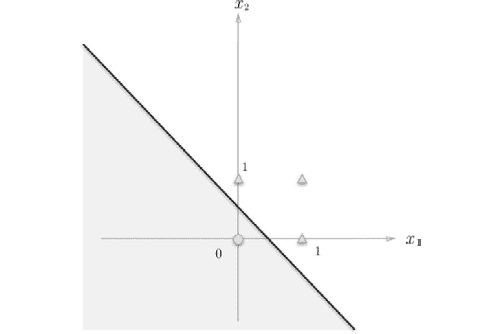

###### 图 2.6：可视化感知器——感知器在灰色区域输出 0，这符合 OR 门的特性

OR 门在(`x`1, `x`2) = (0, 0)时输出 0，在(`x`1, `x`2) = (0, 1)、(1, 0)、(1, 1)时输出 1。这里，圆圈表示 0，三角形表示 1。要创建一个 OR 门，我们必须用一条直线将圆圈和三角形分开。这条直线实际上可以正确地分割四个点。

那么，XOR 门的情况如何呢？我们能像在 OR 门的情况下那样，用一条直线将圆圈和三角形分开吗？

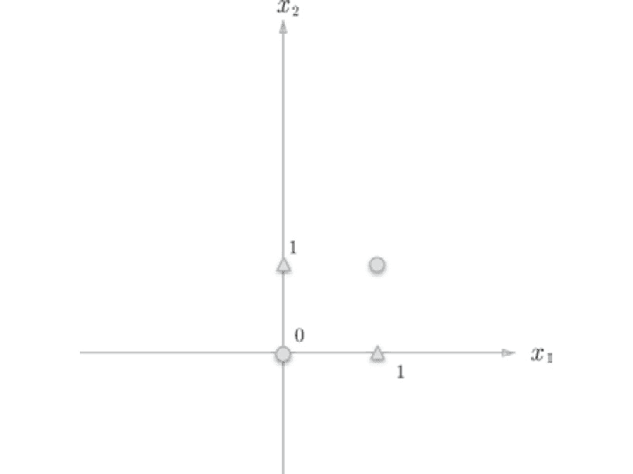

###### 图 2.7：圆圈和三角形表示 XOR 门的输出。

无论你多么努力地解决这个问题，你都无法用一条直线将圆圈和三角形分开。一条直线无法将它们分开。

### 线性与非线性

你不能用一条直线将圆圈和三角形分开。然而，如果你能够去掉“直线”这一限制，就能做到分开。例如，你可以创建将圆圈和三角形分开的区域，如*图 2.8*所示。

感知机的局限性在于它只能表示由直线分割的区域。它不能表示曲线，如*图 2.8*所示。在*图 2.8*中，由曲线分割的区域被称为*非线性*区域，而由直线分割的区域被称为*线性*区域。*线性*和*非线性*这两个词在机器学习中常常使用。你可以通过*图 2.6*和*图 2.8*来可视化它们：

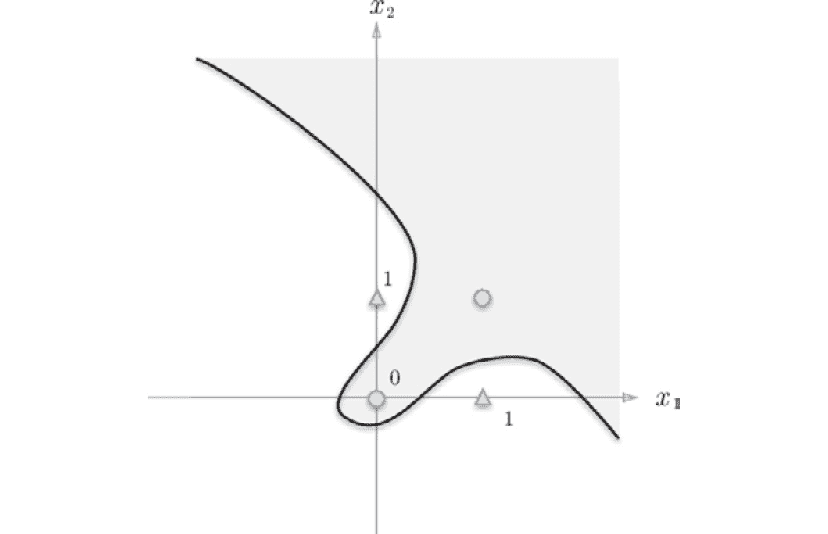

###### 图 2.8：曲线可以将圆圈和三角形分开

## 多层感知机

不幸的是，我们无法使用感知机表示 XOR 门。然而，这并不是什么坏消息。实际上，感知机的优点在于可以堆叠多个感知机层（本节的重点是多个层可以表示 XOR）。稍后我们会讨论堆叠层的问题。在这里，我们可以从另一个角度考虑 XOR 门的问题。

### 组合现有的门

我们可以采取一些方法来制作 XOR 门。其中一种方法是将我们迄今为止创建的 AND、NAND 和 OR 门组合起来并接线。在这里，AND、NAND 和 OR 门用*图 2.9*中的符号表示。*图 2.9*中 NAND 门顶端的圆圈表示输出已被反转。


###### 图 2.9：AND、NAND 和 OR 门的符号

现在，让我们思考如何将 AND、NAND 和 OR 门接线以创建一个 XOR 门。请注意，你可以将 AND、NAND 或 OR 分别分配给*图 2.10*中的每个*?*符号，以完成 XOR 门：

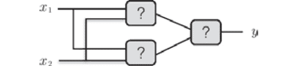

###### 图 2.10：将“？”符号替换为 AND、NAND 或 OR 门，完成 XOR 门！

更具体地说，上一节中描述的感知器的限制是单层感知器无法表示 XOR 门或划分非线性区域。在这里，我们将看到通过组合感知器（即堆叠层）可以构建 XOR 门。

*图 2.11* 中的接线可以构建一个 XOR 门。这里，`x`1 和 `x`2 表示输入信号，而 `y` 表示输出信号。`x`1 和 `x`2 是 NAND 和 OR 门的输入，而 NAND 和 OR 门的输出是 AND 门的输入：

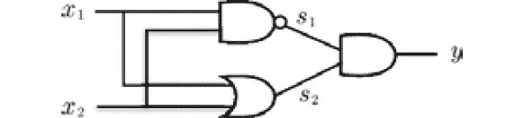

###### 图 2.11：AND、NAND 和 OR 门的组合构建了一个 XOR 门

让我们检查一下*图 2.11*中的接线是否真的能够形成一个 XOR 门。假设 NAND 的输出是 `s`1，OR 的输出是 `s`2，我们将完成真值表。*图 2.12* 显示了结果。当我们查看 `x`1、`x`2 和 `y` 时，可以看到它们代表了 XOR 的输出：

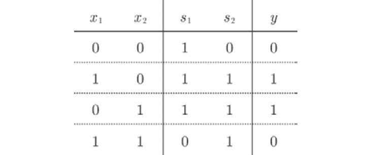

###### 图 2.12：XOR 门的真值表

### 实现 XOR 门

现在，我们将使用 Python 实现 *图 2.11* 中接线表示的 XOR 门。通过使用我们之前定义的 AND、NAND 和 OR 函数，我们可以如下实现：

```py
def XOR(x1, x2):
    s1 = NAND(x1, x2)
    s2 = OR(x1, x2)
    y = AND(s1, s2)
    return y
```

XOR 函数按预期输出结果：

```py
XOR(0, 0) # 0 (output)
XOR(1, 0) # 1 (output)
XOR(0, 1) # 1 (output)
XOR(1, 1) # 0 (output)
```

现在，我们可以构建一个 XOR 门。完成后，我们将通过感知器（明确显示神经元）表示我们刚刚实现的 XOR。*图 2.13* 显示了这种表示。

XOR 是一个多层网络，如 *图 2.13* 所示。在这里，我们将称最左边一列为 `层 0`，接下来为 `层 1`，最右边为 `层 2`。

*图 2.13* 中的感知器形状与我们之前看到的 AND 和 OR 感知器有所不同（*图 2.1*）。AND 和 OR 感知器是单层的，而 XOR 感知器是两层的。具有多层的感知器有时被称为**多层感知器**：

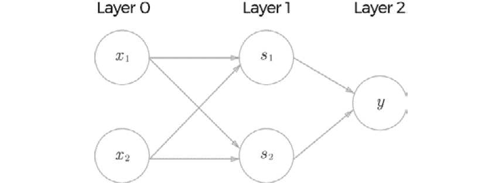

###### 图 2.13：感知器表示的 XOR

#### 注释

尽管 *图 2.13* 中的感知器由三层组成，但我们将其称为“二层感知器”，因为只有两层（层 0 和层 1 之间、层 1 和层 2 之间）有权重。一些文献将 *图 2.13* 中的感知器称为“三层感知器”，因为它由三层组成。

如 *图 2.13* 所示，二层感知器在层 0 和层 1 之间以及层 1 和层 2 之间传递信号。以下将更详细地描述这种行为：

1.  层 0 中的两个神经元接收输入信号并将信号传递给层 1 中的神经元。

1.  层 1 中的神经元将信号传递给层 2 中的神经元，层 2 的神经元输出 y。

这个两层感知机的行为可以与通过管道的组装过程进行比较。第一层（或第一层的工作者）处理到达的“组件”，并在完成任务后将其传递给第二层（第二层的工作者）。第二层的工作者处理从第一层工作者接收到的“组件”，完成并输出（交付）它。

因此，XOR 门中的感知机会在工作者之间“传递组件”。这种两层结构使得感知机能够构建 XOR 门。这可以解释为“单层感知机无法实现的事情，可以通过添加一层来实现”。通过堆叠层（加深层数），感知机能够提供更灵活的表示。

## 从 NAND 到计算机

多层感知机可以创建比我们到目前为止所研究的电路更复杂的电路。例如，一个能够加法运算的加法器电路可以通过感知机来创建。一个将二进制数转换为十进制数的编码器，以及一个在满足特定条件时输出 1 的电路（奇偶校验电路）也可以通过感知机来表示。事实上，我们甚至可以用感知机来表示一个计算机。

计算机是一种处理信息的机器。当它接收到输入时，计算机会以某种方式处理这些输入并输出结果。以某种方式处理意味着计算机和感知机都有输入和输出，并根据固定的规则对其进行计算。

尽管看起来计算机内部执行的是非常复杂的过程，但实际上（令人惊讶的是），一组 NAND 门就可以复现计算机的功能。令人惊讶的事实是，NAND 门是构建计算机所需的全部元件，这意味着感知机也可以代表一个计算机，因为 NAND 门本身就可以用感知机来构造。简而言之，如果我们可以通过组合 NAND 门来创建一个计算机，那么我们也可以通过仅仅组合感知机来表示一个计算机（感知机的组合可以表示为一个多层感知机）。

#### 注释

你可能会觉得很难相信一组 NAND 门可以创建一个计算机。如果你对这个话题感兴趣，推荐阅读《计算机系统的元素：从基本原理构建现代计算机》（MIT 出版社）。这本书旨在深入理解计算机。在“从 NAND 到俄罗斯方块”的口号下，它通过 NAND 门创建一个能够运行俄罗斯方块的计算机。如果你阅读这本书，你会意识到计算机是可以由简单的元素——也就是 NAND 门构建的。

因此，多层感知机能够实现像构建计算机一样复杂的表示。那么，哪种感知机结构可以表示一个计算机呢？构建一个计算机需要多少层呢？

答案是，理论上，计算机可以通过两层感知机来创建。已经证明，任何函数都可以通过两层感知机来表示（准确地说，当激活函数是非线性的 Sigmoid 函数时——具体细节见下一章）。然而，通过指定合适的权重来在两层感知机结构中创建计算机将是一项非常繁重的工作。实际上，从低级组件（如 NAND 门）开始创建计算机，逐步创建所需的组件（模块）是很自然的——从与门（AND）和或门（OR）开始，进而到半加器和全加器，**算术逻辑单元**（**ALU**），以及中央处理器（CPU）。因此，使用感知机表示计算机时，创建多层结构是很自然的方式。

虽然本书中我们不会创建计算机，但请记住，多层感知机能够实现非线性表示，并且原则上它们能够表示计算机所做的事情。

## 小结

本章我们讲解了感知机。感知机是一个非常简单的算法，你应该能够很快理解它的工作原理。感知机是神经网络的基础，下一章我们将学习神经网络。这些要点可以总结为以下列表：

+   感知机是一种具有输入和输出的算法。当它接收到某个输入时，会输出一个固定值。

+   感知机有“权重”和“偏置”参数。

+   你可以使用感知机表示诸如与门（AND）和或门（OR）这样的逻辑电路。

+   XOR 门不能通过单层感知机表示。

+   两层感知机可以用来表示 XOR 门。

+   单层感知机只能表示线性区域，而多层感知机可以表示非线性区域。

+   多层感知机理论上可以表示计算机。
