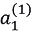

# 第四章：3. 神经网络

我们在上一章学习了感知机，其中有好消息也有坏消息。好消息是，感知机很可能能够表示复杂的函数。例如，感知机（理论上）能够表示计算机执行的复杂过程，正如上一章所描述的那样。坏消息是，在确定合适的权重之前，必须先手动定义权重，以满足预期的输入和输出。在上一章中，我们使用了与 AND 和 OR 门相关的真值表来手动确定适当的权重。

神经网络的存在是为了解决坏消息。更具体地说，神经网络的一个重要特性是，它可以自动从数据中学习合适的权重参数。本章概述了神经网络，并着重介绍了它们的区别。下一章将描述它如何从数据中学习权重参数。

## 从感知机到神经网络

神经网络在许多方面与上一章中描述的感知机相似。神经网络是如何工作的，以及它如何与感知机有所不同，将在本节中进行描述。

### 神经网络示例

*图 3.1* 显示了一个神经网络示例。这里，左列称为**输入层**，右列称为**输出层**，中间列称为**中间层**。中间层也叫做隐藏层。“隐藏”意味着隐藏层中的神经元是不可见的（与输入层和输出层中的神经元不同）。在本书中，我们将这些层依次称为第 0 层、第 1 层和第 2 层（层编号从第 0 层开始，因为在后面使用 Python 实现层时这样做较为方便）。在*图 3.1*中，第 0 层是输入层，第 1 层是中间层，第 2 层是输出层：


###### 图 3.1：神经网络示例

#### 注意

尽管*图 3.1*中的网络包含三层，但我们称其为“二层网络”，因为它有两个带权重的层。有些书籍根据构成网络的层数称其为“三层网络”，但在本书中，网络的名称是根据具有权重的层数来命名的（即输入层、隐藏层和输出层的总层数减去 1）。

*图 3.1* 中的神经网络在形态上类似于上一章中的感知机。实际上，在神经元连接方式上，它与我们在上一章中看到的感知机没有什么不同。那么，信号是如何在神经网络中传递的呢？

### 回顾感知机

要回答这个问题，我们首先需要回顾感知机。考虑一个具有以下结构的网络：


###### 图 3.2：回顾感知机

*图 3.2* 展示了一个感知器，它接收两个输入信号 (x1 和 x2)，并输出 y。如前所述，*图 3.2* 中的感知器由方程式 (3.1) 表示：

|  | (3.1) |
| --- | --- |

这里，b 是一个称为“偏置”的参数，控制神经元触发的容易程度。同时，w1 和 w2 是表示单个信号“权重”的参数，用于控制它们的重要性。

你可能已经注意到，*图 3.2* 中的网络没有偏置 b。如果需要，我们可以在 *图 3.3* 中表示偏置。在 *图 3.3* 中添加了一个权重为 b，输入为 1 的信号。这个感知器接收三个信号 (x1, x2 和 1) 作为神经元的输入，并将每个信号与相应的权重相乘后传递到下一个神经元。下一个神经元将加权信号求和，如果总和超过 0，则输出 1。如果没有超过 0，则输出 0。以下图中的神经元用实心灰色表示，以便与其他神经元区分开来。这是因为偏置的输入信号始终为 1：


](img/fig03_3.jpg)

###### 图 3.3：明确展示偏置

现在，我们想简化方程式 (3.1)。为此，我们使用一个单一的函数来表示这个条件，其中 `1` 是当和超过 0 时的输出，如果不超过则输出 0。在这里，我们引入一个新函数 `h`(`x`)，并将方程式 (3.1) 重写为方程式 (3.2) 和 (3.3)，如下所示：

|  | (3.2) |
| --- | --- |
|  | (3.3) |

方程式 (3.2) 表示 `h`(`x`) 函数将输入信号的和转换为输出 y。方程式 (3.3) 中表示的 `h`(`x`) 函数当输入超过 0 时返回 1，否则返回 0。因此，方程式 (3.2) 和 (3.3) 与方程式 (3.1) 的操作方式相同。

### 引入激活函数

这里出现的 `h`(`x`) 函数通常称为 **激活函数**。它将输入信号的和转换为输出信号。正如“激活”这个名字所示，激活函数决定了输入信号的和如何激活（即它如何触发）。

现在，我们可以再次重写方程式 (3.2)。方程式 (3.2) 执行两个过程：加权输入信号求和，然后通过激活函数转换该和。因此，可以将方程式 (3.2) 分解为以下两个方程式：

|  | (3.4) |
| --- | --- |
|  | (3.5) |

在方程式 (3.4) 中，加权输入信号和偏置的和变为 a。在方程式 (3.5) 中，a 被 *h()* 转换，`y` 被输出。

到目前为止，一个神经元已被表示为一个圆形。*图 3.4* 明确展示了方程式 (3.4) 和 (3.5)：


](img/fig03_4.jpg)

###### 图 3.4：明确展示激活函数执行的过程

*图 3.4* 明确展示了激活函数在神经元圆圈内执行的过程。我们可以清楚地看到，带权重的信号之和成为节点 `a`，并通过激活函数 `h`() 转换为节点 `y`。在本书中，“神经元”和“节点”是可以互换使用的术语。这里，圆圈 `a` 和 `y` 被称为“节点”，与之前使用的“神经元”意义相同。  

我们将继续将神经元表示为一个圆圈，如 *图 3.5* 左侧所示。在本书中，我们还将展示激活过程（如 *图 3.5* 右侧所示），以便能够阐明神经网络的行为：  

  

###### 图 3.5：左侧的图像是一个普通的神经元图像，而右侧的图像则明确展示了神经元激活的过程（a 是输入信号的总和，h() 是激活函数，y 是输出）  

现在，让我们专注于激活函数，它是从感知机到神经网络的桥梁。  

#### 注意  

在本书中，"感知机"一词所表示的算法并没有严格定义。通常，“简单感知机”是一个单层网络，其中使用一个在阈值处改变输出值的阶跃函数作为激活函数。“多层感知机”通常指包含多个层并使用平滑激活函数（如 sigmoid 函数）的神经网络。  

## 激活函数

由方程（3.3）表示的激活函数在阈值处改变输出值，称为“阶跃函数”或“阶梯函数”。因此，我们可以说，“感知机使用阶跃函数作为激活函数”。换句话说，感知机从众多候选函数中选择“阶跃函数”作为激活函数。如果感知机使用了阶跃函数作为激活函数，那么如果使用其他函数作为激活函数会发生什么呢？好吧，通过将激活函数从阶跃函数更改为其他函数，我们可以进入神经网络的世界。下一节将介绍神经网络的激活函数。  

### Sigmoid 函数  

神经网络中常用的激活函数之一是 **sigmoid 函数**，其由方程（3.6）表示：  

|  | (3.6) |   |
| --- | --- | --- |

方程(3.6)中的`exp(-`x`)`表示`e`-x。实数`e`是自然常数，即 2.7182... 由方程(3.6)表示的 Sigmoid 函数看起来很复杂，但它其实只是一个“函数”。一个函数是一个转换器，当提供输入时，它会返回输出。例如，当提供像 1.0 和 2.0 这样的值到 Sigmoid 函数时，返回的值如`h`(1.0) = 0.731... 和`h`(2.0) = 0.880...。

在神经网络中，Sigmoid 函数通常用作激活函数来转换信号，并将转换后的信号传递给下一个神经元。事实上，上一章所描述的感知机和这里描述的神经网络的主要区别就是激活函数。其他方面，如神经元的多层连接结构和信号如何传递，基本上与感知机是一样的。现在，让我们通过与阶跃函数的比较，更深入地了解作为激活函数使用的 Sigmoid 函数。

### 实现阶跃函数

在这里，我们将使用 Python 显示阶跃函数的图。正如方程(3.3)所表示的，阶跃函数当输入超过 0 时输出 1，否则输出 0。以下是阶跃函数的简单实现：

```py
    def step_function(x):
        if x > 0:
            return 1
        else:
            return 0
```

这个实现简单易懂，但它只接受一个实数（浮点数）作为参数`x`。因此，`step_function(3.0)`是允许的。但是，这个函数不能接受 NumPy 数组作为参数。因此，`step_function(np.array([1.0, 2.0]))`是不允许的。在这里，我们希望修改为未来的实现，以便它可以接受 NumPy 数组。为此，我们可以编写类似以下的实现：

```py
    def step_function(x):
        y = x > 0
        return y.astype(np.int)
```

尽管前面的函数只有两行，但它可能有些难以理解，因为它使用了 NumPy 的一个有用“技巧”。在这里，使用以下 Python 解释器的示例来描述使用了什么样的技巧。在这个示例中，提供了 NumPy 的`x`数组。对于 NumPy 数组，进行比较运算符操作：

```py
>>> import numpy as np
>>> x = np.array([-1.0, 1.0, 2.0])
>>> x
array([-1., 1., 2.])
>>> y = x > 0
>>> y
array([False, True, True], dtype=bool)
```

当对 NumPy 数组进行“大于”比较时，数组中的每个元素都会被比较，以生成一个布尔数组。在这里，当`x`数组中的每个元素超过 0 时，它会被转换为`True`，否则为`False`。然后，生成新的数组`y`。

`y`数组是布尔类型，所需的阶跃函数必须返回`0`或`1`的整数类型。因此，我们将数组`y`的元素类型从布尔型转换为整数型：

```py
>>> y = y.astype(np.int)
>>> y
array([0, 1, 1])
```

如图所示，`astype()`方法用于转换 NumPy 数组的类型。`astype()`方法将所需的类型（在此示例中为`np.int`）作为参数。在 Python 中，`True`会被转换为`1`，`False`会被转换为`0`，通过将布尔类型转换为整数类型。前面的代码解释了在实现阶跃函数时 NumPy 所使用的“技巧”。

### 阶跃函数图

现在，让我们绘制之前定义的阶跃函数的图像。为此，我们需要使用 Matplotlib 库：

```py
import numpy as np
import matplotlib.pylab as plt
def step_function(x):
    return np.array(x > 0, dtype=np.int)
x = np.arange(-5.0, 5.0, 0.1)
y = step_function(x)
plt.plot(x, y)
plt.ylim(-0.1, 1.1) # Specify the range of the y-axis
plt.show()
```

`np.arange(-5.0, 5.0, 0.1)` 会生成一个包含从 `-5.0` 到 `5.0`，步长为 `0.1` 的 NumPy 数组（`[-5.0, -4.9, …, 4.9]`）。`step_function()` 接受一个 NumPy 数组作为参数。它会对数组中的每个元素执行阶跃函数，并返回一个数组作为结果。当这些 `x` 和 `y` 数组被绘制时，会显示出*图 3.6*所示的图形：


###### 图 3.6：阶跃函数图

如*图 3.6*所示，阶跃函数的输出在 0 的阈值处从 0 变为 1（或从 1 变为 0）。阶跃函数有时被称为“阶梯函数”，因为它的输出就像楼梯的台阶，正如*图 3.6*所示。

### 实现 sigmoid 函数

现在，让我们来实现一个 sigmoid 函数。我们可以将公式（3.6）中的 sigmoid 函数用 Python 编写如下：

```py
def sigmoid(x):
    return 1 / (1 + np.exp(-x))
```

这里，`np.exp(-x)` 对应公式中的 `exp(−x)`。这个实现并不复杂。当将 NumPy 数组作为 `x` 参数传递时，仍然能够返回正确的结果。该 sigmoid 函数接收 NumPy 数组时，会按正确的方式计算，如下所示：

```py
>>> x = np.array([-1.0, 1.0, 2.0])
>>> sigmoid(x)
array([0.26894142,  0.73105858,  0.88079708])
```

sigmoid 函数的实现支持 NumPy 数组，这得益于 NumPy 的广播功能（有关详情，请参阅*第一章：Python 简介*中的*广播*部分）。当对标量和 NumPy 数组进行操作时，借助广播机制，操作会在标量和 NumPy 数组的每个元素之间执行。

```py
>>> t = np.array([1.0, 2.0, 3.0])
>>> 1.0 + t
array([2., 3., 4.])
>>> 1.0 / t
array([1\.  ,  0.5  ,   0.33333333])
```

在上述示例中，算术运算（如 `+` 和 `/`）是在标量值（此处为 1.0）和 NumPy 数组之间进行的。结果是，标量值和 NumPy 数组的每个元素都参与了运算，结果作为 NumPy 数组输出。在这个 sigmoid 函数的实现中，因为 `np.exp(-x)` 会生成一个 NumPy 数组，`1 / (1 + np.exp(-x))` 也会对 NumPy 数组的每个元素进行操作。

现在，让我们来绘制 sigmoid 函数的图像。绘制代码几乎与阶跃函数的代码相同。唯一的区别是输出 `y` 的函数被更改为 sigmoid 函数：

```py
x = np.arange(-5.0, 5.0, 0.1)
y = sigmoid(x)
plt.plot(x, y)
plt.ylim(-0.1, 1.1) # Specify the range of the y-axis
plt.show()
```

上述代码执行时会生成*图 3.7*所示的图形：


###### 图 3.7：sigmoid 函数图

### 比较 sigmoid 函数和阶跃函数

让我们比较一下 sigmoid 函数和阶跃函数。*图 3.8* 显示了 sigmoid 函数和阶跃函数。两者有什么不同？又有哪些相似之处？我们可以考虑一下*图 3.8*，并思考一下这个问题。

当你查看*图 3.8*时，你可能会注意到平滑度上的差异。Sigmoid 函数是一条平滑曲线，其输出会基于输入连续变化。另一方面，阶跃函数的输出在`0`时会突然变化。Sigmoid 函数的平滑性在训练神经网络时具有重要意义：


###### 图 3.8：阶跃函数和 Sigmoid 函数（虚线表示阶跃函数）

与之前提到的平滑度相关，它们的不同之处在于阶跃函数仅返回 0 或 1，而 Sigmoid 函数返回如 0.731...和 0.880...等实数。也就是说，在感知机中，0 和 1 的二进制信号在神经元之间流动，而在神经网络中，连续实数信号在神经元之间流动。

当我们用“水”来描述这两个函数的行为时，阶跃函数可以比作“石榴水竹”（水流出管道后竹管撞击石头的声音），而 Sigmoid 函数则可以比作“水车”。阶跃函数执行两个动作：排水或储水（0 或 1），而 Sigmoid 函数则像“水车”一样，基于达到它的水量来控制水流。

现在，考虑一下阶跃函数和 Sigmoid 函数的相似之处。它们在“平滑度”上有所不同，但从更广泛的角度来看，当你查看*图 3.8*时，你可能会发现它们在形状上是相似的。实际上，它们都在输入较小时输出接近/为 0 的值，而随着输入增大，输出趋近/达到 1。阶跃函数和 Sigmoid 函数在输入信号包含重要信息时输出较大的值，而在没有重要信息时输出较小的值。它们还有一个相似之处，就是无论输入信号的值多么小或大，它们都会输出介于 0 和 1 之间的值。

### 非线性函数

阶跃函数和 Sigmoid 函数在另一个方面也相似。一个重要的相似点是它们都是**非线性函数**。Sigmoid 函数由一条曲线表示，而阶跃函数则由看起来像楼梯的直线表示。它们都被归类为非线性函数。

#### 注意

“非线性函数”和“线性函数”这两个术语通常出现在激活函数中。一个函数是一个“转换器”，当提供一个值时返回一个结果。一个输出为输入值乘以常数的函数称为线性函数（其表示式为`h`（`x`） = *cx*，其中`c`为常数）。因此，线性函数的图像是一条直线。与此相对，顾名思义，非线性函数的图像不是一条简单的直线。

在神经网络中，必须使用非线性函数作为激活函数。换句话说，线性函数不能作为激活函数使用。为什么线性函数不能使用？原因是如果使用线性函数，增加神经网络中的层数将变得毫无意义。

线性函数的问题在于，无论增加多少层，总有一个“没有隐藏层的网络”能够完成相同的任务。为了具体理解这一点（并且稍微直观一些），我们来看一个简单的例子。这里，使用线性函数 `h`(`x`) = *cx* 作为激活函数，并像三层网络一样计算 `y`(`x`) = `h`(`h`(`h`(`x`)))。它包含了 y(x) = c×c×c×x 的乘法，而同样的操作可以通过一次乘法 `y`(`x`) = *ax*（其中 `a` = `c`³）来表示。因此，它可以通过一个没有隐藏层的网络来表示。正如这个例子所示，使用线性函数会抵消多层的优势。因此，为了利用多层的优势，必须使用非线性函数作为激活函数。

### ReLU 函数

到目前为止，我们已经学习了作为激活函数的阶跃函数和 sigmoid 函数。虽然 sigmoid 函数在神经网络历史上已经使用了很长时间，但如今主要使用一种叫做**整流线性单元**（**ReLU**）的函数。

如果输入超过 0，ReLU 函数将直接输出输入值。如果输入小于或等于 0，它将输出 0（见 *图 3.9*）：


###### 图 3.9：ReLU 函数

方程 (3.7) 表示 ReLU 函数：

|  | (3.7) |
| --- | --- |

如图和方程所示，ReLU 函数非常简单。因此，我们也可以轻松实现它，如下所示：

```py
def relu(x):
    return np.maximum(0, x)
```

这里使用了 NumPy 的最大值函数。它输出输入值中较大的那个。

虽然在本章后续将使用 sigmoid 函数作为激活函数，但 ReLU 函数主要在本书后半部分使用。

## 计算多维数组

如果你学会了如何使用 NumPy 计算多维数组，你将能够高效地实现一个神经网络。首先，我们将学习如何使用 NumPy 计算多维数组。然后，我们将实现一个神经网络。

### 多维数组

简单来说，多维数组是“一个由数字组成的集合”，这些数字可以排成一行、一个矩形、三维的，或者（更一般地）N 维的，这种集合被称为多维数组。我们将使用 NumPy 来创建一个多维数组。首先，我们将创建一个一维数组，正如我们到目前为止所描述的那样：

```py
>>> import numpy as np
>>> A = np.array([1, 2, 3, 4])
>>> print(A)
[1 2 3 4]
>>> np.ndim(A)
1
>>> A.shape
(4,)
>>> A.shape[0]
4
```

如图所示，你可以使用`np.ndim()`函数来获取数组的维度数量。你还可以使用实例变量`shape`来获取数组的形状。前面的例子显示，`A`是一个由四个元素组成的一维数组。请注意，`A.shape`的结果是一个元组。这是因为该结果的返回格式对于一维数组和多维数组都是相同的。例如，对于二维数组返回一个(4,3)的元组，对于三维数组返回(4,3,2)的元组。因此，对于一维数组也会返回一个元组。现在，让我们创建一个二维数组：

```py
>>> B = np.array([[1,2], [3,4], [5,6]])
>>> print(B)
[[1 2]
[3 4]
[5 6]]
>>> np.ndim(B)
2
>>> B.shape
(3, 2)
```

在这里，创建了一个 3x2 的数组 B。3x2 数组意味着它在第一维上有三个元素，在下一维上有两个元素。第一维是维度 0，下一维是维度 1（在 Python 中索引从 0 开始）。二维数组称为矩阵。如*图 3.10*所示，数组中的水平序列称为**行**，垂直序列称为**列**：


###### 图 3.10：水平序列称为“行”，垂直序列称为“列”

### 矩阵乘法

现在，考虑矩阵（二维数组）的乘积。对于 2x2 矩阵，矩阵乘法的计算如*图 3.11*所示（定义为此过程中的计算）：


###### 图 3.11：计算矩阵乘法

如本例所示，矩阵乘法通过将左矩阵的（水平）行与右矩阵的（垂直）列的元素相乘并加和来计算。计算结果被存储为新多维数组的元素。例如，A 的第一行与 B 的第一列的结果成为第一行的第一个元素，而 A 的第二行与 B 的第一列的结果成为第二行的第一个元素。在本书中，方程中的矩阵用粗体显示。例如，矩阵用`A`表示，以区别于只有一个元素的标量值（例如，a 或 b）。这个计算在 Python 中实现如下：

```py
>>> A = np.array([[1,2], [3,4]])
>>> A.shape
(2, 2)
>>> B = np.array([[5,6], [7,8]])
>>> B.shape
(2, 2)
>>> np.dot(A, B)
array([[19, 22],
    [43, 50]])
```

A 和 B 是 2x2 矩阵。使用 NumPy 的`np.dot()`函数计算矩阵 A 和 B 的乘积（这里的“dot”表示点积）。`np.dot`（点积）计算一维数组的内积以及二维数组的矩阵乘法。你需要注意的是，`np.dot(A, B)`和`np.dot(B, A)`可能返回不同的值。与常规运算（+，*等）不同，矩阵的乘积在操作数（A 和 B）的顺序不同的情况下会有所不同。

上述示例展示了 2x2 矩阵的乘积。你也可以计算不同形状矩阵的乘积。例如，2x3 矩阵和 3x2 矩阵的乘积可以通过以下 Python 代码实现：

```py
>>> A = np.array([[1,2,3], [4,5,6]])
>>> A.shape
(2, 3)
>>> B = np.array([[1,2], [3,4], [5,6]])
>>> B.shape
(3, 2)
>>> np.dot(A, B)
array([[22, 28],
    [49, 64]])
```

上述代码展示了如何实现 2x3 矩阵 A 和 3x2 矩阵 B 的乘积。在这里，你必须注意“矩阵的形状”。具体来说，矩阵 A 的维度 1 中的元素数量（列数）必须与矩阵 B 的维度 0 中的元素数量（行数）相同。实际上，在上述示例中，矩阵 A 是 2x3，矩阵 B 是 3x2，矩阵 A 维度 1 中的元素数量（3）与矩阵 B 维度 0 中的元素数量（3）相同。如果它们不同，则无法计算矩阵的乘积。那么，如果你尝试计算 2x3 矩阵 A 和 2x2 矩阵 C 的乘积，以下错误将发生：

```py
>>> C = np.array([[1,2],  [3,4]])
>>> C.shape
(2, 2)
>>> A.shape
(2, 3)
>>> np.dot(A, C)
```

回溯（最近的调用最后）：

```py
    File "<stdin>", line 1, in <module>
ValueError: shapes (2,3) and (2,2) not aligned: 3 (dim 1) != 2 (dim 0)
```

这个错误提示矩阵 A 的维度 1 和矩阵 C 的维度 0 在元素数量上不相同（维度的索引从零开始）。换句话说，要计算多维数组的乘积，两个矩阵的相关维度的元素数量必须相同。因为这是一个重要的点，让我们在*图 3.12*中再检查一遍：


###### 图 3.12：矩阵乘法时相关维度的元素数量必须相同

*图 3.12*展示了 3x2 矩阵 A 和 2x4 矩阵 B 的乘积结果，得到 3x4 矩阵 C。如我们所见，矩阵 A 和矩阵 B 的相关维度的元素数量必须相同。结果矩阵 C 的行数与矩阵 A 相同，列数与矩阵 B 相同。这一点也很重要。

即使 A 是二维矩阵而 B 是一维数组，依然适用相同的原则（即相关维度的元素数量必须相同），如*图 3.13*所示：


###### 图 3.13：即使 A 是二维矩阵而 B 是一维数组，相关维度的元素数量也必须相同

*图 3.13*中的示例可以通过以下 Python 代码实现：

```py
>>> A = np.array([[1,2], [3, 4], [5,6]])
>>> A.shape
(3, 2)
>>> B = np.array([7,8])
>>> B.shape
(2,)
>>> np.dot(A,  B)
array([23, 53, 83])
```

### 神经网络中的矩阵乘法

现在，让我们使用 NumPy 矩阵实现神经网络，如*图 3.14*所示。假设神经网络仅有权重，偏置和激活函数已省略。


###### 图 3.14：使用矩阵乘法计算神经网络

在这个实现中，我们必须注意`X`、`W`和`Y`的形状。非常重要的一点是，`X`和`W`对应维度中的元素数量必须相同：

```py
>>> X = np.array([1, 2])
>>> X.shape
(2,)
>>> W = np.array([[1, 3, 5], [2, 4, 6]])
>>> print(W)
[[1 3 5]
[2 4 6]]
>>> W.shape
(2, 3)
>>> Y = np.dot(X, W)
>>> print(Y)
[ 5  11  17]
```

如图所示，你可以使用`np.dot`（多维矩阵的点积）一次性计算结果`Y`。这意味着，即使`Y`的元素数量是 100 或 1000，你也可以一次性计算出来。如果没有`np.dot`，你就必须逐个提取`Y`的元素（并使用`for`语句）进行计算，这样非常繁琐。因此，我们可以说，使用矩阵乘法来计算多维矩阵的乘积这一技巧非常重要。

## 实现一个三层神经网络

现在，让我们实现一个“实际的”神经网络。在这里，我们将实现从输入到输出的过程（一个前向传播过程），并且这个过程使用的是*图 3.15*中所示的三层神经网络。我们将使用 NumPy 的多维数组（如前一节所述）来实现。通过充分利用 NumPy 数组，你可以为神经网络的前向传播过程编写简洁的代码。

### 检查符号

在这里，我们将使用像和这样的符号来解释神经网络中执行的过程。它们可能看起来有点复杂。你可以快速浏览这一部分，因为这些符号仅在此处使用：


###### 图 3.15：一个三层神经网络，包括输入层（层 0）中的两个神经元，第一个隐藏层（层 1）中的三个神经元，第二个隐藏层（层 2）中的两个神经元，以及输出层（层 3）中的两个神经元

#### 注意

本节中重要的是，神经网络的计算可以作为矩阵计算来统一进行。神经网络中每一层的计算可以通过矩阵乘法统一进行（从更广泛的视角来看，这也是合理的）。因此，即使你忘记了与这些符号相关的详细规则，也不会影响后续的理解。

让我们从定义符号开始。请查看*图 3.16*。该图展示了从输入层 x2 到下一层神经元*a*的权重。

如 *图 3.16* 所示，“(1)”位于权重或隐藏层神经元的右上角。这个数字表示第 1 层的权重或神经元。一个权重在右下角有两个数字，表示下一层和上一层神经元的索引。例如，** 表示它是上一层第二个神经元（`x`2）到下一层第一个神经元（**) 的权重。权重右下角的索引数字必须按照“下一层的编号和上一层的编号”顺序排列：


###### 图 3.16：权重符号

### 实现每层信号传递

现在，我们来看一下从输入层到“第 1 层的第一个神经元”的信号传递。*图 3.17* 以图示方式展示了这一过程：


###### 图 3.17：从输入层到第 1 层的信号传递

如 *图 3.17* 所示，① 被添加为偏置神经元。请注意，偏置的右下角只有一个索引。这是因为在上一层中只有一个偏置神经元（① 神经元）。现在，让我们将 ** 表达为一个方程式，回顾一下我们迄今为止所学的内容。** 是加权信号和偏置的总和，并按照以下方式计算：

|  | (3.8) |
| --- | --- |

通过使用矩阵乘法，可以将第 1 层的“加权和”整体表示为：

|  | (3.9) |
| --- | --- |

这里，A(1)、X、B(1) 和 W(1) 如下所示：


现在，我们使用 NumPy 的多维数组来实现方程（3.9）。这里为输入信号、权重和偏置设置了任意值：

```py
X = np.array([1.0, 0.5])
W1 = np.array([[0.1, 0.3, 0.5], [0.2, 0.4, 0.6]])
B1 = np.array([0.1, 0.2, 0.3])
print(W1.shape) # (2, 3)
print(X.shape)  # (2,)
print(B1.shape) # (3,)
A1 = np.dot(X, W1) + B1
```

该计算与上一节中的计算相同。W1 是一个 2x3 的数组，X 是一个包含两个元素的单维数组。此外，在这种情况下，W1 和 X 的对应维度中的元素个数相同。

现在，考虑激活函数在第 1 层中执行的过程。*图 3.18* 以图示方式展示了这些过程。

如 *图 3.18* 所示，隐藏层中的加权和（加权信号和偏置的总和）表示为 *a'*，通过激活函数转换的信号表示为 `z`'。这里，激活函数表示为 `h`()，使用的是 sigmoid 函数：


###### 图 3.18：从输入层到第 1 层的信号传递

该过程在 Python 中的实现如下：

```py
Z1 = sigmoid(A1)
print(A1) # [0.3, 0.7, 1.1]
print(Z1) # [0.57444252, 0.66818777, 0.75026011]
```

这个 `sigmoid()` 函数是我们之前定义的。它接受一个 NumPy 数组并返回一个具有相同元素个数的 NumPy 数组。

现在，我们继续讲解从第 1 层到第 2 层的实现（*图 3.19*）：


###### 图 3.19：从第一层到第二层的信号传递

这个实现与之前的实现相同，不同之处在于第一层的输出（Z1）是第二层的输入。如你所见，通过使用 NumPy 数组，可以轻松地实现信号从一层到另一层的传递：

```py
W2 = np.array([[0.1, 0.4], [0.2, 0.5], [0.3, 0.6]])
B2 = np.array([0.1, 0.2])
print(Z1.shape) # (3,)
print(W2.shape) # (3, 2)
print(B2.shape) # (2,)
A2 = np.dot(Z1, W2) + B2
Z2 = sigmoid(A2)
```

最后，让我们实现从第二层到输出层的信号传递（*图 3.20*）。你可以几乎以与我们之前看到的其他实现相同的方式实现输出层。唯一不同的是最后的激活函数与我们之前看到的隐藏层的激活函数不同：

```py
def identity_function(x): 
    return x
W3 = np.array([[0.1, 0.3], [0.2, 0.4]])
B3 = np.array([0.1, 0.2])
A3 = np.dot(Z2, W3) + B3
Y = identity_function(A3) # or Y = A3
```

在这里，我们将定义一个名为`identity_function()`的函数，并将其作为输出层的激活函数。单位函数将输入原样输出。尽管在这个例子中不需要定义`identity_function()`，但为了与之前的实现保持一致，使用了该实现。在*图 3.20*中，输出层的激活函数显示为`σ()`，以表明它与隐藏层的激活函数`h`()不同（`σ`被称为**sigma**）：


###### 图 3.20：从第二层到输出层的信号传递

你可以根据希望解决的问题类型选择输出层使用的激活函数。通常，对于回归问题使用单位函数，对于二分类问题使用 sigmoid 函数，对于多分类问题使用 softmax 函数。输出层的激活函数将在下一节中详细解释。

### 实现总结

这也完成了我们对三层神经网络的研究。以下总结了我们到目前为止的实现过程。按照神经网络实现的惯例，只有权重采用大写字母（例如，W1），而其他项（如偏置和中间结果）则采用小写字母：

```py
def init_network(): 
    network = {}
    network['W1'] = np.array([[0.1,  0.3,  0.5],  [0.2,  0.4,  0.6]])
    network['b1'] = np.array([0.1,  0.2,  0.3])
    network['W2'] = np.array([[0.1,  0.4],  [0.2,  0.5],  [0.3,  0.6]])
    network['b2'] = np.array([0.1,  0.2])
    network['W3'] = np.array([[0.1,  0.3],  [0.2,  0.4]]) 
    network['b3'] = np.array([0.1,  0.2])
    return network
def forward(network, x):
    W1, W2, W3 = network['W1'], network['W2'], network['W3']
    b1, b2, b3 = network['b1'], network['b2'], network['b3']
    a1 = np.dot(x, W1) + b1
    z1 = sigmoid(a1)
    a2 = np.dot(z1, W2)  +  b2 
    z2 = sigmoid(a2)
    a3 = np.dot(z2,  W3)  +  b3
    y = identity_function(a3)
    return y
network = init_network() 
x =  np.array([1.0,  0.5]) 
y = forward(network, x)
print(y) # [ 0.31682708 0.69627909]
```

这里定义了`init_network()`和`forward()`函数。`init_network()`函数初始化权重和偏置，并将其存储在字典类型的变量`network`中，该变量存储了各个层所需的参数、权重和偏置。`forward()`函数则实现了将输入信号转化为输出信号的过程。

这里的“forward”表示从输入到输出的传递过程。稍后，在我们训练神经网络时，我们将研究反向过程（从输出到输入）。

这完成了前向传播方向上三层神经网络的实现。通过使用 NumPy 的多维数组，我们能够高效地实现神经网络。

## 设计输出层

你可以将神经网络同时用于分类问题和回归问题。然而，你必须根据所处理的问题更改输出层的激活函数。通常，回归问题使用恒等函数，分类问题使用 softmax 函数。

#### 注意

机器学习问题可以大致分为“分类问题”和“回归问题”。分类问题是指识别数据属于哪个类别——例如，将图像中的人分类为男性或女性——而回归问题则是从某些输入数据中预测一个（连续的）数值——例如，预测图像中人的体重。

## 恒等函数与 Softmax 函数

恒等函数的输出就是输入本身。一个不进行任何处理、直接输出输入内容的函数就是恒等函数。因此，当输出层使用恒等函数时，输入信号会原样返回。利用我们迄今使用的神经网络图，你可以像 *图 3.21* 所示一样，用恒等函数表示这个过程。恒等函数的转换过程可以通过一条箭头来表示，方式与我们之前见过的激活函数类似：


](img/fig03_21.jpg)

###### 图 3.21：恒等函数

用于分类问题的 softmax 函数可以通过以下方程表示：

|  | (3.10) |
| --- | --- |

`exp(x)` 是一个指数函数，表示 ex（e 是自然常数，约为 2.7182…）。假设输出层的总数为 n，方程提供了第 k 个输出，yk。如方程（3.10）所示，softmax 函数的分子是输入信号 `a`k 的指数函数，分母是所有输入信号指数函数的总和。

*图 3.22* 通过图形方式展示了 softmax 函数。如你所见，softmax 函数的输出是通过箭头与所有输入信号连接的。正如方程（3.10）所示，输出的每个神经元都受到所有输入信号的影响：


](img/fig03_22.jpg)

###### 图 3.22：Softmax 函数

现在，让我们实现 softmax 函数，并使用 Python 解释器逐个检查结果：

```py
>>> a = np.array([0.3, 2.9, 4.0])
>>>
>>> exp_a = np.exp(a) # Exponential function
>>> print(exp_a)
[ 1.34985881 18.17414537 54.59815003]
>>>
>>> sum_exp_a = np.sum(exp_a) # Sum of exponential functions
>>> print(sum_exp_a)
74.1221542102
>>>
>>> y = exp_a / sum_exp_a
>>> print(y)
[ 0.01821127 0.24519181 0.73659691]
```

该实现通过 Python 表示了方程（3.10）的 softmax 函数。因此，不需要额外的描述。当我们以后使用 softmax 函数时，我们将其定义为一个 Python 函数，如下所示：

```py
def softmax(a):
    exp_a = np.exp(a) 
    sum_exp_a = np.sum(exp_a)
    y = exp_a / sum_exp_a
    return y
```

### 实现 Softmax 函数时的问题

上述实现的 softmax 函数正确地表示了方程 (3.10)，但在计算机计算中存在缺陷。这个缺陷是溢出问题。实现 softmax 函数涉及计算指数函数，而指数函数的值可能非常大。例如，`e`10 的值大于 20,000，`e`100 是一个超过 40 位的巨大值。`e`1000 的结果返回 `inf`，表示无限大值。将这些大值相除会得到一个“不稳定”的结果。

#### 注意

当计算机处理“数字”时，它会以有限的数据宽度存储，例如四个或八个字节。这意味着一个数字有一定的有效数字位数。一个数字能够表示的范围是有限的。因此，会存在无法表达非常大值的问题，这称为溢出，所以我们在使用计算机进行计算时必须小心。

softmax 函数的改进实现来源于以下方程：

|  | (3.11) |
| --- | --- |

首先，通过将分子和分母同时乘以一个任意常数 `C` 来变换方程 (3.11)（由于分子和分母都乘以相同的常数，因此进行的计算是相同的）。然后，将 C 移入指数函数 (exp)，表示为 log `C`。最后，将 log `C` 替换为另一个符号 *C'*。

方程 (3.11) 表明，在计算 softmax 函数中的指数函数时，加上或减去某个常数不会改变结果。虽然在这里你可以使用任何数作为 *C'*，但通常使用输入信号中的最大值来防止溢出。考虑以下示例：

```py
>>> a = np.array([1010, 1000, 990])
>>> np.exp(a) / np.sum(np.exp(a)) # Calculating the softmax function
array([  nan,   nan,   nan]) # Not calculated correctly
>>>
>>> c = np.max(a) # 1010
>>> a - c
array([ 0, -10, -20])
>>>
>>> np.exp(a - c) / np.sum(np.exp(a - c))
array([   9.99954600e-01,	4.53978686e-05,	2.06106005e-09])
```

如本例所示，当输入信号的最大值 (`c`，此处) 被减去时，你可以正确计算该函数。否则，将返回 nan（非数：不稳定）值。基于此描述，我们可以按如下方式实现 softmax 函数：

```py
def softmax(a):
    c = np.max(a)
    exp_a = np.exp(a - c) # Prevent an overflow
    sum_exp_a = np.sum(exp_a)
    y = exp_a / sum_exp_a 
    return y
```

### Softmax 函数的特点

你可以使用 `softmax()` 函数来计算神经网络的输出，如下所示：

```py
>>> a = np.array([0.3, 2.9, 4.0])
>>> y = softmax(a)
>>> print(y)
[ 0.01821127 0.24519181 0.73659691]
>>> np.sum(y)
1.0
```

Softmax 函数输出一个介于 0 和 1.0 之间的实数。softmax 函数的输出总和为 1。总和为 1 是 softmax 函数的一个重要特性，因为它意味着我们可以将 softmax 函数的输出解释为“概率”。

举例来说，在前面的例子中，我们可以将 `y[0]` 的概率解释为 `0.018`（1.8%），`y[1]` 的概率为 `0.245`（24.5%），`y[2]` 的概率为 `0.737`（73.7%）。根据这些概率，我们可以说，“由于第二个元素的概率最高，答案是第二类。”我们甚至可以用概率性地回答：“答案是第二类，概率为 74%，第一类的概率为 25%，零类的概率为 1%。”因此，你可以使用 softmax 函数来概率性地（统计学上）处理问题。

我们应该注意，应用 softmax 函数不会改变元素的顺序。这是因为指数函数，*(y = exp(x))*，是单调递增的。实际上，在前面的例子中，`a` 中元素的顺序与 `y` 中元素的顺序相同。`a` 中的最大值是第二个元素，而 `y` 中的最大值也是第二个元素。

通常，神经网络的分类任务只会识别与最大输出对应的类别。使用 softmax 函数并不会改变最大输出对应的神经元位置。因此，你可以在神经网络分类中省略输出层的 softmax 函数。实际上，由于指数函数需要一些计算，输出层的 softmax 函数通常会被省略。

#### 注意

解决机器学习问题的过程分为两个阶段：“训练”和“预测”。首先，在训练阶段你训练一个模型，然后使用训练好的模型在推理阶段对未知数据进行预测（分类）。如前所述，推理阶段通常省略输出层的 softmax 函数。我们之所以在输出层使用 softmax 函数，是因为它对神经网络的训练有重要作用（更多细节请参考下一章）。

### 输出层中的神经元数量

你必须根据要解决的问题来确定输出层中神经元的数量。对于分类问题，分类的类别数通常作为输出层神经元的数量。例如，要从输入图像中预测一个从 `0` 到 `9` 的数字（10 类分类），输出层会有 10 个神经元，如 *图 3.23* 所示：


###### 图 3.23：输出层中的神经元对应于每个数字

如 *图 3.23* 所示，输出层中的神经元从上到下分别对应数字 0、1、...、9。这里，各种灰度的不同深浅表示输出层神经元的值。在这个例子中，`y`2 的颜色最深，因为 `y`2 神经元输出的值最大。这表明该神经网络预测输入属于与 `y`2 对应的类别；也就是“2”。

## 手写数字识别

现在我们已经介绍了神经网络的机制，让我们考虑一个实际的问题。我们将对一些手写数字图像进行分类。假设训练已经完成，我们将使用训练好的参数在神经网络中实现“推理”。在神经网络中，这种推理也称为前向传播。

#### 注意

与解决机器学习问题的过程相同（包括“训练”和“推理”两个阶段），要使用神经网络解决问题，我们将使用训练数据训练权重参数，然后在预测时使用训练好的参数对输入数据进行分类。

### MNIST 数据集

在这里，我们将使用称为 MNIST 的手写数字图像集。MNIST 是机器学习领域中最著名的数据集之一，并以从简单实验到研究的各种方式使用。当您阅读有关图像识别或机器学习的研究论文时，您经常会注意到 MNIST 数据集作为实验数据的使用。

MNIST 数据集包含从 0 到 9 的数字图像（*Figure 3\. 24*）。它包含 60,000 张训练图像和 10,000 张测试图像，用于训练和推理。当我们使用 MNIST 数据集时，通常使用训练图像进行训练，并测量训练模型如何正确分类测试图像：

![图 3.24：MNIST 图像数据集示例

[img/fig03_24.jpg)

###### 图 3.24：MNIST 图像数据集示例

MNIST 的图像数据是 28x28 的灰度图像（一个通道），每个像素值从 0 到 255。每个图像数据都有标签，如“7”，“2”和“1”。

本书提供了一个方便的 Python 脚本`mnist.py`，位于`dataset`目录中。它支持下载 MNIST 数据集并将图像数据转换为 NumPy 数组。要使用`mnist.py`脚本，当前目录必须是`ch01`、`ch02`、`ch03`、... 或 `ch08`目录。通过在`mnist.py`中使用`load_mnist()`函数，您可以轻松加载 MNIST 数据，如下所示：

```py
import sys, os
sys.path.append(os.pardir) # Configure to import the files in the parent directory
from dataset.mnist import load_mnist
# Waits for a few minutes for the first call ... 
(x_train, t_train), (x_test, t_test) = ∖
    load_mnist(flatten=True, normalize=False)
# Output the shape of each data
print(x_train.shape) # (60000, 784)
print(t_train.shape) # (60000,)
print(x_test.shape) # (10000, 784)
print(t_test.shape) # (10000,)
```

首先，配置导入父目录中文件的详细信息。然后，从`dataset`/`mnist.py`导入`load_mnist`函数。最后，使用导入的`load_mnist`函数加载 MNIST 数据集。第一次调用`load_mnist`时，需要互联网连接下载 MNIST 数据。后续调用因为仅加载本地保存的文件（pickle 文件），所以完成时间很快。

#### 注意

用于加载 MNIST 图像的文件位于本书提供的源代码的数据集目录中。假定此 MNIST 数据集仅从`ch01`、`ch02`、`ch03`、... 或 `ch08`目录中使用。因此，要使用数据集，需要`sys.path.append(os.pardir)`语句。这是因为必须导入父目录（数据集目录）中的文件。

`load_mnist` 函数返回加载的 MNIST 数据，格式为 `(训练图像，训练标签)，(测试图像，测试标签)`。它可以接受三个参数：`load_mnist(normalize=True, flatten=True, one_hot_label=False)`。第一个参数 `normalize` 指定是否将输入图像归一化到 0.0 到 1.0 之间。如果设置为 `False`，输入图像的像素值将保持在 0 到 255 之间。第二个参数 `flatten` 指定是否将输入图像展平（将其转换为一维数组）。如果设置为 `False`，输入图像将以三维数组（1 × 28 × 28）存储。如果设置为 `True`，图像将以一维数组形式存储，包含 784 个元素。第三个参数 `one_hot_label` 指定是否使用独热编码存储标签。在独热编码的数组中，只有正确标签的元素为 1，其他元素为 0，例如 [0,0,1,0,0,0,0,0,0,0]。当 `one_hot_label` 为 `False` 时，标签将仅存储正确的标签值，如 7 或 2；当 `one_hot_label` 为 `True` 时，标签将存储为独热编码数组。

#### 注意

Python 有一个方便的功能，叫做 pickle，它可以在程序执行过程中将对象保存为文件。通过加载保存的 pickle 文件，你可以立即恢复程序执行过程中使用的对象。`load_mnist()` 函数（用于加载 MNIST 数据集）也使用 pickle（用于第二次或之后的加载阶段）。通过使用 pickle 的功能，你可以快速准备 MNIST 数据。

现在，让我们显示 MNIST 图像以检查数据。我们将使用 `ch03/mnist_show.py`。

```py
import sys, os
sys.path.append(os.pardir)
import numpy as np
from dataset.mnist import load_mnist
from PIL import Image
def img_show(img):
    pil_img = Image.fromarray(np.uint8(img)) 
    pil_img.show()
(x_train, t_train), (x_test, t_test) = /
    load_mnist(flatten=True, normalize=False)
    img = x_train[0] 
    label = t_train[0] 
    print(label) # 5
    print(img.shape)	# (784,)
    img = img.reshape(28, 28) # Reshape the image based on the original size
    print(img.shape)	# (28, 28) 
    img_show(img)
```

这将产生以下输出：


###### 图 3.25：显示 MNIST 图像

请注意，当 `flatten=True` 时，加载的图像会作为一维的 NumPy 数组存储。因此，为了显示图像，你必须将其重新调整为原始的 28x28 大小。你可以使用 `reshape()` 方法，通过指定所需的形状来调整 NumPy 数组的形状。你还需要将以 NumPy 数组存储的图像数据转换为 PIL 所需的数据对象。你可以使用 `Image.fromarray()` 进行此转换。

### 神经网络推理

现在，让我们实现一个神经网络，用于预测 MNIST 数据集上的数据。该网络由一个包含 784 个神经元的输入层和一个包含 10 个神经元的输出层组成。输入层的 784 来自于图像的大小（28 x 28 = 784），而输出层的 10 来自于 10 类分类（数字 0 到 9 的 10 个类别）。有两个隐藏层：第一个隐藏层有 50 个神经元，第二个隐藏层有 100 个神经元。你可以根据需要更改 50 和 100 的值。首先，我们定义三个函数：`get_data()`、`init_network()` 和 `predict()`（以下源代码位于 `ch03/neuralnet_mnist.py`）：

```py
def get_data():
    (x_train, t_train), (x_test, t_test) = /
        load_mnist(normalize=True, flatten=True, one_hot_label=False)
    return x_test, t_test
def init_network():
    with open("sample_weight.pkl", 'rb') as f: 
        network = pickle.load(f)
    return network
def predict(network, x):
    W1, W2, W3 = network['W1'], network['W2'], network['W3']
    b1, b2, b3 = network['b1'], network['b2'], network['b3']
    a1 = np.dot(x, W1) + b1
    z1 = sigmoid(a1)
    a2 = np.dot(z1, W2) + b2
    z2 = sigmoid(a2)
    a3 = np.dot(z2, W3) + b3
    y = softmax(a3)
    return y
```

`init_network()`函数加载了存储在 pickle 文件`sample_weight.pkl`中的训练权重参数。这个文件包含了权重和偏差参数，并以字典类型变量的形式存储。剩下的两个函数与之前描述的实现几乎相同，因此不需要再次描述。现在，我们将使用这三个函数来进行神经网络的预测。我们想要评估识别精度——即它能够多正确地分类：

```py
x, t = get_data() 
network = init_network()
accuracy_cnt = 0
for i in range(len(x)):
    y = predict(network, x[i])
    p = np.argmax(y) # Obtain the index of the most probable element
    if p == t[i]:
        accuracy_cnt += 1
print("Accuracy:" + str(float(accuracy_cnt) / len(x)))
```

在这里，我们将获取 MNIST 数据集并构建一个网络，然后使用`for`语句获取存储在`x`中的每个图像数据，并使用`predict()`函数进行分类。`predict()`函数返回一个 NumPy 数组，其中包含每个标签的概率。例如，返回一个像[0.1, 0.3, 0.2, …, 0.04]这样的数组，表示"0"的概率为 0.1，"1"的概率为 0.3，依此类推。通过找到这个概率列表中最大值的索引，我们可以得到最可能的元素作为预测结果。你可以使用`np.argmax(x)`来获取数组中最大元素的索引。它返回`x`参数指定数组中最大元素的索引。最后，神经网络预测的答案与正确的标签进行比较，正确预测的比率将显示为识别精度（准确率）。

当前面的代码执行时，`Accuracy:0.9352`会显示。这表示 93.52%的分类是正确的。我们在这里不讨论识别准确率，因为我们的目标是运行一个训练好的神经网络，但在本书的后面部分，我们将改进神经网络的结构和训练方法，以获得更高的识别准确率。实际上，准确率将超过 99%。

在这个例子中，`load_mnist`函数的参数`normalize`被设置为`True`。当`normalize`为`True`时，函数会将图像中每个像素的值除以 255，使得数据值处于 0.0 到 1.0 之间。将数据转换为某个特定范围内的值叫做**归一化**，而以特定方式转换神经网络的输入数据叫做**预处理**。在这里，输入图像数据在预处理阶段进行了归一化。

#### 注意

在实际应用中，预处理常常用于神经网络（深度学习）中。通过实验已经证明了预处理的有效性，例如提高了区分度和加快了学习速度。在前面的例子中，简单的归一化是通过将每个像素的值除以 255 来进行的预处理。实际上，预处理通常是在考虑整个数据分布的基础上进行的。归一化是通过使用整个数据的平均值和标准差来进行的，使得所有数据都围绕 0 分布或符合某个特定的范围。此外，**白化**也会被执行，以便所有数据分布更加均匀。

### 批量处理

这个过程是使用 MNIST 数据集实现神经网络的过程。在这里，我们将重新审视前面的实现，并重点关注输入数据和权重参数的“形状”。

让我们使用 Python 解释器输出前面神经网络中每一层权重的形状：

```py
>>> x, _ = get_data( )
>>> network = init_network( )
>>> W1, W2, W3 = network['W1'], network['W2'], network['W3']
>>>
>>> x.shape
(10000, 784)
>>> x[0].shape
(784,)
>>> W1.shape
(784, 50)
>>> W2.shape
(50, 100)
>>> W3.shape
(100, 10)
```

让我们检查多维数组的对应维度的元素数量是否与前面的结果一致（偏差被省略）。*图 3.26*以图形化方式展示了这一点。在这里，多维数组的对应维度的元素数量是一致的。请验证一个包含 10 个元素的单维数组 y 是否作为最终结果返回：


###### 图 3.26：数组形状变化

*图 3.26*展示了一个一维数组（原本为 28x28 的二维数组）包含 784 个元素输入，并返回一个包含 10 个元素的一维数组的过程。这是单张图片输入时的处理流程。

现在，让我们思考一下当多张图片同时输入时的处理过程。例如，假设你想使用`predict()`函数一次性处理 100 张图片。为了实现这一点，你可以将`x`的形状更改为`100×784`，这样就可以将 100 张图片作为输入数据一起输入。*图 3.27*以图形化方式展示了这一点：


###### 图 3.27：批处理中的数组形状变化

如*图 3.27*所示，输入数据的形状为 100x784，输出数据的形状为 100x10\。这表示 100 张图片的输入数据会一次性返回结果。例如，`x[0]`和`y[0]`存储第 0 张图片的图像和预测结果，`x[1]`和`y[1]`存储第一张图片的图像和预测结果，以此类推。

这种有组织的输入数据集，如这里所述，称为**批次**。批次就像一堆叠起来的图片，类似于一叠钞票。

#### 注意

批处理在计算机计算中具有巨大优势。由于许多处理数值计算的库经过高度优化，因此可以高效地计算大型数组，批处理大大减少了每张图片的处理时间。当数据传输成为神经网络计算的瓶颈时，批处理可以减轻总线带宽的负载（即：操作与数据加载的比例可以增加）。虽然批处理需要计算一个大型数组，但一次性计算整个数组比一点一点地分割计算小数组要快。

现在，让我们在实现中使用批处理。这里，和之前代码的不同之处以粗体标出：

```py
x, t = get_data( ) 
network = init_network( )
batch_size = 100 # Number of batches
accuracy_cnt = 0
for i in range(0, len(x), batch_size):
    x_batch = x[i:i+batch_size]
    y_batch = predict(network, x_batch)
    p = np.argmax(y_batch, axis=1)
    accuracy_cnt += np.sum(p == t[i:i+batch_size])
print("Accuracy:" + str(float(accuracy_cnt) / len(x)))
```

现在，我们将描述每个加粗的部分。首先，让我们看一下 `range()` 函数。您可以使用 `range()` 函数，例如 `range(start, end)`，生成一个从 `start` 到 `end-1` 的整数列表。通过指定三个整数，如 `range(start, end, step)`，您可以生成一个按 `step` 指定的值递增的整数列表，如下例所示：

```py
>>> list( range(0, 10) )
[0, 1, 2, 3, 4, 5, 6, 7, 8, 9]
>>> list( range(0, 10, 3) )
[0, 3, 6, 9]
```

基于 `range()` 函数返回的列表，`x[i:i+batch_size]` 用于从输入数据中提取一个批次。`x[i:i+batch_n]` 从输入数据中获取第 `i-` 个到 `i+batch_n-` 个的数据。在这个例子中，数据从开始提取 100 项，比如 x[0:100]，x[100:200]，…

然后，`argmax()` 获取最大值的索引。请注意，这里指定了一个参数 `axis=1`。这意味着，在一个 100x10 的数组中，最大值的索引是在维度 1（轴几乎等同于维度）中的元素中找到的，如下所示：

```py
>>> x = np.array([[0.1, 0.8, 0.1], [0.3, 0.1, 0.6],
... [0.2, 0.5, 0.3], [0.8, 0.1, 0.1]])
>>> y = np.argmax(x, axis=1)
>>> print(y)
[1 2 1 0]
```

最后，将每一批次的分类结果与实际答案进行比较。为此，使用比较运算符（`==`）来比较 NumPy 数组。返回一个布尔值数组 `True`/`False`，并计算 `True` 的数量，如下所示：

```py
>>> y = np.array([1, 2, 1, 0])
>>> t = np.array([1, 2, 0, 0])
>>> print(y==t)
[True True False True]
>>> np.sum(y==t)
3
```

这就是使用批处理实现的内容。批处理使得处理快速且高效。当我们在下一章学习神经网络时，将会使用一批批的图像数据进行训练。到时候，我们也会像本章一样构建一个批处理实现。

## 总结

本章描述了神经网络中的前向传播。本章中解释的神经网络与上一章的感知器相同，都以层次化的方式传递神经元信号。然而，在激活函数方面有很大差异，这些激活函数会在信号传递到下一个神经元时改变信号。在激活函数中，神经网络使用的是 Sigmoid 函数，该函数平滑地改变信号，而感知器使用的是步进函数，该函数会突然改变信号。这一差异在神经网络训练中非常重要，并将在下一章中进行描述。本章涵盖了以下内容：

+   神经网络使用平滑变化的函数作为激活函数，如 Sigmoid 函数或 ReLU 函数。

+   通过使用 NumPy 的多维数组，您可以高效地实现神经网络。

+   机器学习问题大致可以分为分类问题和回归问题。

+   在为输出层使用激活函数时，回归问题通常使用恒等函数，分类问题则使用 softmax 函数。

+   对于分类问题，用来分类的类别数作为输出层神经元的数量。

+   一组输入数据被称为一个批次。按批次进行预测可以加速计算过程。
