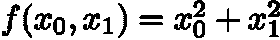
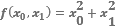

# 第五章：4. 神经网络训练

本章介绍神经网络的训练。当我们在这个语境中谈论“训练”时，我们指的是从训练数据中自动获取最佳权重参数。在本章中，我们将介绍一种称为损失函数的标准，它使得神经网络能够学习。训练的目的是发现能够使损失函数值最小的权重参数。本章还将介绍一种通过函数梯度发现最小损失函数值的方法，这种方法被称为梯度法。

## 从数据中学习

神经网络的核心特性是其从数据中学习的能力。从数据中学习意味着权重参数的值可以自动确定。如果你需要手动确定所有参数，这将是一项非常艰巨的任务。例如，对于一个样本感知机，如*第二章*所示的*感知机*，我们在查看真值表时手动确定了参数值。这里只有三个参数。然而，在实际的神经网络中，参数的数量可以从几千到几万不等。对于具有更多层次的深度学习，参数数量可能达到数亿。手动确定这些参数几乎是不可能的。本章描述了神经网络的训练，或者说如何从数据中确定参数值，并实现了一个使用 Python 从 MNIST 数据集学习手写数字的模型。

#### 注意

对于线性可分问题，感知机可以通过数据自动学习。当训练完成一定次数时，它能够解决线性可分问题，这就是所谓的“感知机收敛定理”。另一方面，非线性分离问题是无法解决的（自动化）。

### 数据驱动

数据在机器学习中至关重要。机器学习在数据中寻找答案，发现数据中的模式，并基于此讲述一个故事。没有数据，它什么也做不了。因此，“数据”处于机器学习的核心。我们可以说，这种数据驱动的方法是对以“人”为中心方法的偏离。

通常，当我们解决一个问题时——尤其是当我们需要找出一个模式时——我们必须考虑各种因素来找到答案。“这个问题似乎有这样的模式。”“不，可能在别的地方有原因。”基于我们的经验和直觉，我们通过反复试验推进这一任务。机器学习尽量避免人为干预。它试图从收集到的数据中找到答案（模式）。此外，神经网络和深度学习有一个共同的重要特性，那就是它们能够比传统的机器学习更好地避免人为干预。

让我们来看一个具体的问题。假设我们想实现一个识别数字"5"的程序。假设我们的目标是实现一个程序，判断手写图像（如*图 4.1*所示）是"5"还是不是"5"。这个问题看起来相对简单。我们可以使用什么算法呢？


###### 图 4.1：手写数字示例——"5"的书写方式因人而异

当你尝试设计一个能正确分类"5"的程序时，你会发现这比预期的要难得多。我们可以轻松识别"5"，但很难明确识别图像为"5"的规则。如*图 4.1*所示，书写方式因人而异。这告诉我们，找到识别"5"的规则将是艰苦的工作，并且可能需要大量的时间。

现在，我们不再是从零开始"推导"出识别"5"的算法，而是希望有效利用数据来解决问题。我们可以使用的方法之一是从图像中提取特征，并使用机器学习技术来学习这些特征的模式。特征指的是一个转换器，它被设计用来准确地从输入数据（输入图像）中提取重要数据（关键数据）。图像的特征通常被描述为一个向量。在计算机视觉领域，著名的特征包括 SIFT、SURF 和 HOG。你可以使用这些特征将图像数据转换为向量，并使用机器学习中的分类器，如 SVM 和 KNN，来学习转换后的向量。

在这种机器学习方法中，"机器"从收集到的数据中发现一个模式。与我们从头开始发明算法相比，这可以更高效地解决问题，并减少对"人"的负担。然而，我们必须注意，当图像被转换成向量时，所使用的特征是由"人"设计的。因为没有使用适合问题的特征（或者没有设计特征），是无法获得良好结果的。例如，要识别狗的面部，可能需要选择与识别"5"不同的特征。毕竟，即使是使用特征和机器学习的方法，也可能需要根据问题选择合适的特征，这些特征仍然由"人"来选择。

到目前为止，我们已经讨论了两种机器学习方法。这两种方法如*图 4.2*中的上排所示。同时，使用神经网络（深度学习）的方法则显示在*图 4.2*的下排。它通过一个没有人工干预的模块来表示。

如*图 4.2*所示，神经网络学习的是图像"原样"。在第二种方法中，使用特征和机器学习的示例，称为人工设计的特征，而在神经网络中，"机器"从图像中学习重要的特征：


###### 图 4.2：从人工规则到从数据中学习的“机器”的范式转变——没有人工干预的模块以灰色显示

#### 注意

深度学习有时被称为“端到端机器学习。”“**端到端**”意味着“从一端到另一端”，也就是说，从原始数据（输入）中获取期望的结果（输出）。

神经网络的优势在于它可以在相同的流程中解决所有问题；例如，无论是试图识别“5”、一只狗还是一个人脸，神经网络都会耐心地学习提供的数据，努力发现在给定问题中的模式。神经网络可以“端到端”地学习数据，无论是解决什么问题。

### 训练数据和测试数据

在本章中，我们将介绍神经网络训练，从处理机器学习数据的一些最佳实践开始。

在机器学习问题中，我们通常根据目的使用**训练数据**和**测试数据**。首先，我们仅使用训练数据来寻找最优参数。然后，使用测试数据来评估训练好的模型的能力。为什么要将训练数据和测试数据分开？因为我们希望模型具备泛化能力。我们必须将训练数据和测试数据分开，因为我们要正确评估这种**泛化**能力。

泛化是指未知数据（不包含在训练数据中的数据）的能力，机器学习的最终目标是获得这种泛化能力。例如，手写数字识别可以用于自动读取明信片上的邮政编码。在这种情况下，手写数字识别必须能够识别“某个人”写的字符。这个“某个人”并不是“某个特定的人写的特定字符”，而是“一个任意的人写的任意字符”。即便模型能很好地区分你的训练数据，它可能只学会了数据中某个人的特定书写风格。

因此，如果你只使用一个数据集来学习参数并评估它们，那么无法提供正确的评估。这会导致一个可以很好地处理某个数据集，但无法处理另一个数据集的模型。当模型过于适应仅一个数据集时，**过拟合**就会发生。避免过拟合是机器学习中的一个重要挑战。

## 损失函数

当你被问到“你现在有多幸福？”时，你会怎么回答？我们通常会模糊地回答：“我挺开心的”或者“我不太开心。”如果有人回答：“我当前的幸福分数是 10.23”，你可能会感到惊讶，因为这个人只能用一个分数量化自己的幸福。如果真有这样的人，他可能只根据自己的“幸福分数”来引导生活。

这个“幸福评分”是一个寓言，用来说明在神经网络训练中发生的一些类似现象。在神经网络训练中，使用一个“评分”来表示当前的状态。基于这个评分，搜索最佳的权重参数。就像这个人根据“幸福评分”寻找“最佳生活”，神经网络则通过“一个评分”来寻找最优的参数。在神经网络训练中使用的评分叫做**损失函数**。虽然任何函数都可以作为损失函数，但通常使用的是平方误差之和或交叉熵误差。

#### 注意

损失函数是一个指标，用来表示神经网络能力的“差劲”程度。它表示当前神经网络对标记数据的不适应程度，以及它与标记数据的偏差程度。你可能觉得“能力差劲”作为评分有些不自然，但你可以将损失函数乘以一个负值，解释为“能力好的评分”（即“能力好”的评分）。“最小化能力差劲”与“最大化能力好”是等价的。因此，能力的“差劲”指标与能力的“好”指标本质上是相同的。

### 平方误差之和

有几种函数可以用作损失函数。可能最著名的是**平方误差之和**。它通过以下方程表示：

|  | (4.1) |
| --- | --- |

在这里，*y*k 是神经网络的输出，*t*k 是标记数据，*k*是数据的维度数量。例如，在*第三章：神经网络*的*手写数字识别*部分中，*y*k 和*t*k 是由 10 个元素组成的数据项：

```py
>>> y = [0.1, 0.05, 0.6, 0.0, 0.05, 0.1, 0.0, 0.1, 0.0, 0.0]
>>> t = [0, 0, 1, 0, 0, 0, 0, 0, 0, 0]
```

这些数组的元素对应于从第一个索引开始按顺序排列的数字“0”，“1”，“2”，...。在这里，神经网络的输出 y 是经过 softmax 函数处理的输出。softmax 函数的输出可以解释为一个概率。在这个例子中，“0”的概率是 0.1，“1”的概率是 0.05，“2”的概率是 0.6，依此类推。同时，t 是标记数据。在标记数据中，正确的标签是 1，其他标签是 0。这里，标签“2”是 1，表示正确答案是“2”。将正确标签设为 1，其他标签设为 0，称为**独热编码表示**。

如方程(4.1)所示，平方误差之和是神经网络输出与正确教师数据相应元素之间差值的平方和。现在，让我们在 Python 中实现平方误差之和。你可以按照以下方式实现：

```py
def sum_squared_error(y,  t):
    return 0.5 * np.sum((y-t)**2)
```

在这里，`y`和`t`参数是 NumPy 数组。由于这只是实现方程式(4.1)，我们在此不再详细解释。现在，我们将使用这个函数进行计算：

```py
>>> # Assume that "2" is correct
>>> t = [0, 0, 1, 0, 0, 0, 0, 0, 0, 0]
>>>
>>>  #  Example 1: "2" is the most probable (0.6)
>>> y = [0.1, 0.05, 0.6, 0.0, 0.05, 0.1, 0.0, 0.1, 0.0, 0.0]
>>> sum_squared_error(np.array(y), np.array(t))
0.097500000000000031
>>>
>>>  #  Example 2: "7" is the most probable (0.6)
>>> y = [0.1, 0.05, 0.1, 0.0, 0.05, 0.1, 0.0, 0.6, 0.0, 0.0]
>>> sum_squared_error(np.array(y), np.array(t))
0.59750000000000003
```

这里有两个例子。在第一个例子中，正确答案是“2”，神经网络的输出在“2”时最大。与此同时，在第二个例子中，正确答案是“2”，但神经网络的输出在“7”时最大。实验结果显示，第一个例子的损失函数较小，这表明标记数据之间的差异较小。换句话说，平方误差的和表明第一个例子的输出与标记数据更为匹配。

### 交叉熵误差

除了平方误差和，**交叉熵误差**也常被用作损失函数。其表达式如下：

|  | (4.2) |
| --- | --- |

这里，log 表示自然对数，即以*e (log*e*)*为底的对数。yk 是神经网络的输出，tk 是正确标签。在 tk 中，只有正确标签的索引为 1；其他索引为 0（独热表示法）。因此，方程式（4.2）仅计算对应正确标签的输出的对数，1。例如，如果“2”是正确标签的索引，并且神经网络对应的输出是 0.6，则交叉熵误差为`-log 0.6 = 0.51`。如果“2”的输出是 0.1，则误差为`-log 0.1 = 2.30`。交叉熵误差依赖于正确标签的输出结果。*图 4.3*显示了这个自然对数的图形：


###### 图 4.3：自然对数 y = log x 的图形

如*图 4.3*所示，*y*在* x *为 1 时为 0，且随着*x*接近 0，*y*的值变得更小。因此，由于正确标签对应的输出更大，方程式（4.2）趋向于 0。当输出为 1 时，交叉熵误差为 0。当正确标签的输出较小时，方程式（4.2）的值较大。

现在，让我们实现一个交叉熵误差：

```py
def cross_entropy_error(y, t):
    delta = 1e-7
    return -np.sum(t * np.log(y + delta))
```

在这里，y 和 t 参数是 NumPy 数组。当计算`np.log`时，会加上一个非常小的值 delta。如果计算`np.log(0)`，则返回`-inf`，表示负无穷。在这种情况下，计算无法继续进行。为避免这种情况，会加上一个非常小的值，以避免负无穷的出现。现在，为了便于计算，我们使用`cross_entropy_error(y, t)`：

```py
>>> t = [0, 0, 1, 0, 0, 0, 0, 0, 0, 0]
>>> y = [0.1, 0.05, 0.6, 0.0, 0.05, 0.1, 0.0, 0.1, 0.0, 0.0]
>>> cross_entropy_error(np.array(y), np.array(t))
0.51082545709933802
>>>
>>> y = [0.1, 0.05, 0.1, 0.0, 0.05, 0.1, 0.0, 0.6, 0.0, 0.0]
>>> cross_entropy_error(np.array(y), np.array(t))
2.3025840929945458
```

在第一个例子中，正确标签的输出为 0.6，交叉熵误差为 0.51。在下一个例子中，正确标签的输出小到只有 0.1，交叉熵误差为 2.3。这些结果与我们到目前为止讨论的一致。

### 小批量学习

对于机器学习问题，训练数据用于训练。准确地说，它意味着找到训练数据的损失函数，并找到使该值尽可能小的参数。因此，必须使用所有训练数据来获得损失函数。如果有 100 条训练数据，则必须将它们 100 个损失函数的和作为指标。

在我们之前描述的损失函数示例中，使用的是单条数据的损失函数。对于交叉熵误差，方程（4.3）可以计算所有训练数据的损失函数之和：

|  | (4.3) |
| --- | --- |

假设数据元素的数量为 N。tnk 表示第 n 条数据的第 k 个值（ynk 是神经网络的输出，tnk 是标记数据）。虽然这个方程看起来有点复杂，但它只是方程（4.2）的扩展，表示对于 N 条数据的单条数据损失函数。最终，它除以`N`进行归一化。除以 N 计算每条数据的“平均损失函数”。这个平均值可以作为一致的指标，而不受训练数据量的影响。例如，即使训练数据的数量为 1,000 或 10,000，也可以计算每个数据元素的平均损失函数。

MNIST 数据集包含 60,000 条训练数据。计算所有这些数据的损失函数之和需要一些时间。大数据有时包含数百万或数千万条数据。在这种情况下，计算所有数据的损失函数并不实际。因此，提取部分数据来近似所有数据。此外，在神经网络训练中，选取一些训练数据，并对每一组数据进行训练，这种方式称为小批量（mini-batch）训练。例如，从 60,000 条训练数据中随机选择 100 条数据进行训练。这种训练方式叫做**小批量训练**。

现在，让我们编写一些代码，从训练数据中随机选择指定数量的数据进行小批量训练。在此之前，以下是加载 MNIST 数据集的代码：

```py
import sys, os
sys.path.append(os.pardir)
import numpy as np
from dataset.mnist import load_mnist
(x_train,  t_train),  (x_test,  t_test)  =  /
    load_mnist(normalize=True, one_hot_label=True)
print(x_train.shape) # (60000, 784)
print(t_train.shape) # (60000, 10)
```

如*第三章*《神经网络》中所述，`load_mnist`函数加载了 MNIST 数据集。它位于本书提供的`dataset/mnist.py`文件中。该函数加载训练和测试数据。通过指定`one_hot_label=True`参数，你可以使用独热编码表示法，其中正确标签为 1，其他标签为 0。

当你加载之前的 MNIST 数据时，你会发现训练数据的数量是 60,000，输入数据包含 784 行图像数据（最初为 28x28）。标记数据是具有 10 行的数据。因此，`x_train`和`t_train`的形状分别为（60000，784）和（60000，10）。

现在，如何从训练数据中随机提取 10 条数据？我们可以通过使用 NumPy 的`np.random.choice()`函数编写以下代码：

```py
train_size = x_train.shape[0]
batch_size = 10
batch_mask = np.random.choice(train_size, batch_size) 
x_batch = x_train[batch_mask]
t_batch = t_train[batch_mask]
```

通过使用`np.random.choice()`，你可以从指定的数字中随机选择所需数量的数字。例如，`np.random.choice(60000, 10)`会从 0 到小于 60,000 的数字中随机选择 10 个数字。在实际代码中，如这里所示，你可以获取索引作为一个数组，用于选择小批量：

```py
>>> np.random.choice(60000, 10)
array([ 8013, 14666, 58210, 23832, 52091, 10153, 8107, 19410, 27260,
21411])
```

现在，你可以指定随机选择的索引来提取小批量数据。我们将使用这些小批量来计算损失函数。

#### 注意

为了衡量电视观众人数，并不是所有家庭都参与，而是选定的家庭。例如，通过测量从东京随机选取的 1,000 户家庭的收视情况，你可以大致估算整个东京的收视人数。这 1,000 户家庭的收视情况与整个收视情况并不完全相同，但可以作为一个近似值。就像这里描述的收视情况一样，小批量的损失函数是通过使用样本数据来近似整个数据来衡量的。简而言之，随机选择的小部分数据（小批量）被用作整个训练数据的近似值。

### 实现交叉熵误差（使用小批量）

我们如何使用小批量数据来实现交叉熵误差？通过改进我们之前实现的交叉熵误差（仅针对一条数据），我们可以轻松实现它。这里，我们将支持单条数据输入和批量数据输入：

```py
def cross_entropy_error(y, t):
    if y.ndim == 1:
        t = t.reshape(1, t.size)
        y = y.reshape(1, y.size)
    batch_size = y.shape[0]
    return -np.sum(t * np.log(y + 1e-7)) / batch_size
```

这里，`y`是神经网络的输出，`t`是标签数据。如果`y`是一维的（也就是说，要计算一条数据的交叉熵误差），则数据的形状会发生变化。每条数据的平均交叉熵误差是通过根据批量数据量进行归一化来计算的。

如果标签数据是作为标签提供的（不是以独热表示格式，而是以“2”和“7”等标签形式），我们可以如下实现交叉熵误差：

```py
def cross_entropy_error(y, t): 
    if y.ndim == 1:
        t = t.reshape(1, t.size)
        y = y.reshape(1, y.size)
    batch_size = y.shape[0]
    return -np.sum(np.log(y[np.arange(batch_size), t] + 1e-7)) / batch_size
```

请注意，如果某个元素在独热表示中`t`为 0，则其交叉熵误差也为`0`，你可以忽略此计算。换句话说，如果你能够获取神经网络对正确标签的输出，就可以计算交叉熵误差。因此，对于作为独热表示的`t`，使用`t * np.log(y)`，而对于作为标签的`t`，使用`np.log(y[np.arange(batch_size), t])`进行相同的处理（这里为了可视化，已省略“一个非常小的值`1e-7`”的描述）。

作为参考，我们可以简要介绍一下`np.log( y[np.arange(batch_size), t] )`。`np.arange(batch_size)`会生成一个从 0 到`batch_size-1`的数组。当`batch_size`为 5 时，`np.arange(batch_size)`生成一个 NumPy 数组，[0, 1, 2, 3, 4]。`t`包含标签，如[2, 7, 0, 9, 4]，而`y[np.arange(batch_size), t]`则提取每个数据的正确标签对应的神经网络输出（在这个例子中，`y[np.arange(batch_size), t]`生成的 NumPy 数组为`[y[0,2], y[1,7], y[2,0], y[3,9], y[4,4]]`）。

### 为什么我们要配置损失函数？

有些人可能会想，为什么我们要引入损失函数？例如，在数字识别的情况下，我们希望参数提高识别准确率。引入损失函数难道不是多余的工作吗？我们的目标是实现一个最大化识别准确率的神经网络。那么，难道我们不应该使用“识别准确率”作为评分标准吗？

你可以通过关注“导数”在神经网络训练中的作用，来找到这个问题的答案。下一节将详细解释这一点。神经网络训练的目标是寻找最优的参数（权重和偏置），使损失函数的值最小。为了寻找损失函数最小的值，需要计算某个参数的导数（准确来说是梯度），并根据导数的值逐步更新参数值。

例如，假设这里存在一个虚拟的神经网络。我们将关注神经网络中的一个权重参数。在这里，权重参数的损失函数的导数表示当权重参数的值稍微改变时，损失函数的变化情况。如果导数变为负值，则可以通过将权重参数沿正方向调整来减少损失函数。另一方面，如果导数是正值，则可以通过将权重参数沿负方向调整来减少损失函数。然而，当导数值为 0 时，不管如何移动权重参数，损失函数的值都不会改变。此时，权重参数的更新将停止。

我们不能使用识别准确率作为评分标准，因为在几乎所有位置，导数都会变为 0，导致参数无法更新。现在，让我们简洁地总结一下这一点。

#### 注意

在训练神经网络时，我们不应使用识别准确率作为评分标准。原因是，如果使用识别准确率作为评分标准，大多数地方的参数导数将为零。

那么，为什么把识别精度作为评分会导致参数的导数在几乎所有位置都为 0 呢？为了说明这一点，我们考虑另一个例子。假设一个神经网络能识别训练数据中的 100 个项目中的 32 个。这意味着识别精度是 32%。如果我们将识别精度作为评分，稍微改变权重参数，它仍会保持在 32%，不会发生变化。稍微调整参数不会提高识别精度。即使识别精度提高，变化也不会是连续的，比如 32.0123…%，而是突发性的，比如 33% 和 34%。另一方面，如果使用损失函数作为评分，损失函数的当前值表示为一个值，比如 0.92543…稍微改变参数值也会使损失函数连续变化，比如 0.93432…

稍微调整参数只会稍微改变识别精度，且任何变化都是不连续和突发的。这对于激活函数的“阶跃函数”也是一样的。如果使用阶跃函数作为激活函数，神经网络也无法正确学习，原因相同。阶跃函数的导数在几乎所有位置（除 0 外）都为 0，如*图 4.4*所示。当使用阶跃函数时，参数的微小变化会被阶跃函数抹去，损失函数的值不会发生变化，即使你将其用作评分。

阶跃函数只在某些时刻发生变化，就像石上水流或稻草人。另一方面，Sigmoid 函数的导数（切线）会连续变化，纵轴的输出（值）也会不断变化，曲线的梯度也在不断变化，如*图 4.4*所示。简而言之，Sigmoid 函数的导数在任何位置都不为 0。这对于神经网络的“训练”至关重要。因为梯度从不为 0，神经网络可以正确学习：


###### 图 4.4：阶跃函数与 Sigmoid 函数——阶跃函数的梯度在几乎所有位置为 0，而 Sigmoid 函数（切线）的梯度从不为 0

## 数值微分

梯度法使用梯度信息来确定前进的方向。本节将介绍梯度是什么以及它的特性，从“导数”开始。

### 导数

例如，假设你在 10 分钟内跑了 2 公里，刚开始全程马拉松。你可以计算出速度为 *2 / 10 = 0.2* [公里/分钟]。你以每分钟 0.2 公里的速度跑步。

在这个例子中，我们计算了“行驶距离”随“时间”的变化量。严格来说，这个计算表示的是 10 分钟的“平均速度”，因为你在 10 分钟内跑了 2 公里。导数表示的是在“某一时刻”的变化量。因此，通过缩小 10 分钟的时间（比如过去 1 分钟的距离、过去 1 秒的距离、过去 0.1 秒的距离，等等），你可以得到某一时刻的变化量（瞬时速度）。

因此，导数表示在某一时刻的变化量。这个定义由以下方程表示：

|  | (4.4) |
| --- | --- |

方程（4.4）表示一个函数的导数。左侧的表示* f(x)* 关于*x*的导数——即 f(x)对 x 的变化程度。方程（4.4）表示的导数表明了由于*x*的“微小变化”，函数*f(x)*的值如何发生变化。在这里，微小变化*h*被无限接近 0，这表示为。

让我们编写一个程序，根据方程（4.4）来求取一个函数的导数。为了直接实现方程（4.4），你可以为计算目的给 h 赋一个小值：

```py
# Bad implementation sample
def numerical_diff(f,  x): 
    h = 10e-50
    return (f(x+h) - f(x)) / h
```

该函数名为`numerical_diff(f, x)`，即**数值微分**。它接受两个参数：函数 f 和函数 f 的自变量 x。这个实现看起来是正确的，但可以做出两个改进。

前面的实现使用了一个小值`10e-50`（即“0.00...1”包含 50 个零）作为 h，因为我们希望使用尽可能小的值作为 h（如果可能的话，我们希望将 h 无限接近 0）。但是这里出现了**舍入误差**的问题。舍入误差是指在最终的计算结果中，因忽略小范围内的数字（例如，忽略八位或更多小数位）而产生的误差。以下例子展示了 Python 中的舍入误差：

```py
>>> np.float32(1e-50)
0.0
```

当你在 float32 类型（32 位浮点数）中表示`1e-50`时，值变成了 0.0。你无法正确表示它。使用过小的值会导致计算机计算时出现问题。现在，这是第一个改进。你可以将 10−4 作为小值 h 来使用。已知值约为 10−4 时会产生较好的结果。

第二个改进是在函数 f 的差异方面。前面的实现计算了 x + h 和 x 之间函数 f 的差异。你应该注意到，这种计算首先会引入误差。如*图 4.5*所示，"真实导数"对应于函数在 *x* 位置的梯度（称为切线），而这个实现中的导数对应于 (*x* + *h*) 和 x 之间的梯度。因此，真实导数（真实切线）与这个实现的值不完全相同。这个差异的原因是你无法将 *h* 无限接近于 0：


###### 图 4.5: 真实导数（真实切线）和数值微分（通过近似获得的切线）在数值上是不同的

如*图 4.5*所示，数值微分包含误差。为了减小这个误差，你可以计算函数（*f*）在 (*x + h*) 和 (*x - h*) 之间的差异。这种差异称为**中心差分**，因为它是围绕 *x* 计算的（另一方面，(*x + h*) 和 *x* 之间的差异称为**前向差分**）。现在，让我们基于这两个改进实现数值微分（数值梯度）：

```py
def numerical_diff(f,  x): 
    h = 1e-4 # 0.0001
    return (f(x+h) - f(x-h)) / (2*h)
```

#### 注意

如前面的代码所示，通过使用非常小的值差异来计算导数被称为**数值微分**。另一方面，通过扩展获得导数称为“解析解”或“解析求导”，例如，使用“analytic”一词。你可以通过解析方式得到 *y* = *x*² 的导数，如。因此，你可以计算出 *y* 对 *x* 的导数为 2，结果是 4。解析导数是没有误差的“真实导数”。

### 数值微分的示例

让我们通过数值微分来求导一个简单的函数。第一个例子是由以下方程表示的二次函数：

|  | (4.5) |
| --- | --- |

在 Python 中实现方程（4.5）如下：

```py
def function_1(x):
    return 0.01*x**2 + 0.1*x
```

绘制这个函数的图像。以下是绘制图像的代码和结果图像（*图 4.6*）：

```py
import numpy as np
import  matplotlib.pylab  as  plt
x = np.arange(0.0, 20.0, 0.1) # The array x containing 0 to 20 in increments of 0.1
y = function_1(x)
plt.xlabel("x")
plt.ylabel("f(x)")
plt.plot(x, y)
plt.show()
```

现在计算当 x=5 和 x=10 时的函数微分：

```py
>>> numerical_diff(function_1, 5)
0.1999999999990898
>>> numerical_diff(function_1, 10)
0.2999999999986347
```

这里计算的微分是 *f(x)* 对 *x* 的变化量，它对应于函数的梯度。顺便提一下，*f(x) = 0.01x*² + 0.1x* 的解析解是 *= 0.02x + 0.1*。当 *x=5* 和 *x=10* 时，真实导数分别为 0.2 和 0.3。它们与数值微分的结果不完全相同，但误差非常小。实际上，误差小到可以认为它们几乎是相同的值：


###### 图 4.6：图形 *f* (*x*) = 0.01*x*2 + 0.1*x*

我们将使用前面的数值微分结果来绘制梯度为数值微分值的直线图。结果如*图 4.7*所示。在这里，您可以看到导数对应于函数的切线（源代码位于`ch04/gradient_1d.py`）：


###### 图 4.7：当 *x* = 5 和 *x* = 10 时的切线 – 使用数值微分的值作为直线的梯度

### 偏导数

接下来，我们来看方程（4.6）表示的函数。这个简单的方程计算了参数的平方和。请注意，它有两个变量，不像前面的例子那样只有一个变量：

|  | (4.6) |
| --- | --- |

你可以在 Python 中这样实现：

```py
def function_2(x):
    return x[0]**2 + x[1]**2
    # or return np.sum(x**2)
```

这里假设传递的是 NumPy 数组作为参数。该函数简单地对每个 NumPy 数组的元素进行平方并求和（`np.sum(x**2)`也能实现相同的处理）。现在，让我们绘制这个函数的图形。该三维图形如下所示：


###### 图 4.8：图形 

现在，我们要计算方程（4.6）的导数。这里，请注意方程（4.6）有两个变量。因此，您必须指定对于 *x*0 和 *x*1 中的哪一个变量计算微分。由多个变量组成的函数的导数称为**偏导数**。它们表示为 。

为了说明这一点，考虑以下两个偏导数问题及其解决方案：

`x0` 当 `x0 = 3` 且 `x1 = 4` 时：

```py
>>> def function_tmp1(x0):
...	return x0*x0 + 4.0**2.0
...
>>> numerical_diff(function_tmp1, 3.0)
6.00000000000378
```

`x1` 当 `x0 = 3` 且 `x1 = 4` 时：

```py
>>> def function_tmp2(x1):
...	return 3.0**2.0 + x1*x1
...
>>> numerical_diff(function_tmp2, 4.0)
7.999999999999119
```

为了解决这些问题，定义了一个只有一个变量的函数，并计算该函数的导数。例如，当`x1=4`时，定义了该函数，其中只有一个变量`x0`，并将其传递给该函数进行数值微分。根据结果，答案是`6.00000000000378`，答案是`7.999999999999119`。它们与解析微分的解大致相同。

这样，偏导数计算了某一位置的梯度，就像对一个变量的微分一样。然而，对于偏导数来说，某一个变量是目标变量，其他变量则固定在某个特定值。在前面的实现中，定义了一个新函数来保持其他变量在特定值上。这个新定义的函数被传递给先前的数值微分函数来计算偏导数。

## 梯度

在前面的例子中，分别计算了*x*0 和*x*1 的偏导数。现在，我们希望计算*x*0 和*x*1 的偏导数总和。例如，假设我们要计算当`x0 = 3`和`x1 = 4`时(*x*0, *x*1)的偏导数，如。表示所有变量偏导数总和的向量，如，被称为**梯度**。你可以通过以下方式实现梯度：

```py
def numerical_gradient(f,   x): 
    h = 1e-4 # 0.0001
    grad = np.zeros_like(x) # Generate an array with the same shape as x
    for idx in range(x.size):
        tmp_val = x[idx]
        # Calculate f(x+h)
        x[idx] = tmp_val + h
        fxh1 = f(x)
        # Calculate f(x-h)
        x[idx] = tmp_val - h
        fxh2 = f(x)
        grad[idx] = (fxh1 - fxh2) / (2*h)
        x[idx] = tmp_val # Restore the original value
    return grad
```

实现`numerical_gradient(f, x)`函数看起来有点复杂，但过程几乎和单变量数值微分中的步骤一样。请注意，`np.zeros_like(x)`生成一个与`x`形状相同且元素全为零的数组。

`numerical_gradient(f, x)`函数接受`f（函数）`和`x（NumPy 数组）`作为参数，并为 NumPy 数组`x`中的每个元素获取数值微分。现在，让我们使用这个函数来计算梯度。在这里，我们将获得点（3, 4），（0, 2）和（3, 0）处的梯度：

```py
>>> numerical_gradient(function_2, np.array([3.0, 4.0]))
array([ 6., 8.])
>>> numerical_gradient(function_2, np.array([0.0, 2.0]))
array([ 0., 4.])
>>> numerical_gradient(function_2, np.array([3.0, 0.0]))
array([  6.,    0.])
```

#### 注

实际结果是[6.0000000000037801, 7.9999999999991189]，但返回的是[6., 8.]。这是因为返回的 NumPy 数组进行了格式化，以便更清晰地显示数值。

因此，我们可以计算(*x*0, *x*1)每个点的梯度。上面的例子显示，点（3, 4）处的梯度是（6, 8），点（0, 2）处的梯度是（0, 4），点（3, 0）处的梯度是（6, 0）。这些梯度意味着什么呢？为了理解这一点，让我们看看的梯度。在这里，我们将使梯度变为负数，并绘制向量（源代码位于`ch04/gradient_2d.py`）。

的梯度显示为指向最低点的向量（箭头），如*图 4.9*所示。在*图 4.9*中，梯度似乎指向函数*f*(*x*0, *x*1)的“最低位置（最小值）”。就像指南针一样，箭头指向一个点。它们距离“最低位置”越远，箭头的大小就越大：


###### 图 4.9：的梯度

在*图 4.9*所示的示例中，梯度指向最低位置，但情况并非总是如此。事实上，梯度在每个位置都指向较低的方向。更准确地说，梯度的方向是**在每个位置上使函数值减少最快的方向**。这是一个重要的概念，请务必记住这一点。

### 梯度法

许多机器学习问题在训练过程中需要寻找最优参数。神经网络在训练过程中也需要找到最优参数（权重和偏差）。这里的最优参数是指损失函数取最小值时的参数值。然而，损失函数可能很复杂，参数空间也很庞大，我们无法直接猜测最小值的所在位置。梯度法利用梯度来寻找函数的最小值（或最小可能值）。

梯度表示在每个位置上最能减少函数值的方向。因此，梯度指向的位置是否真的是函数的最小值，换句话说，梯度指向的方向是否真的是正确的方向，是无法保证的。实际上，在复杂的函数中，梯度指向的方向在大多数情况下并不是最小值所在的方向。

#### 注意

在局部最小值、最小值以及一个被称为函数鞍点的点处，梯度为 0。局部最小值是局部范围内的最小值，即在一个有限范围内的最小值。鞍点是在一个方向上为局部最大值，在另一个方向上为局部最小值的位置。梯度法寻找的是梯度为 0 的位置，但这个位置并不总是全局最小值（它可能是局部最小值或鞍点）。当一个函数具有复杂且扭曲的形状时，学习可能会进入一个（几乎）平坦的区域，并且可能会出现一个被称为“平台期”的停滞期，导致训练停滞不前。

即使梯度的方向并不总是指向全局最小值，沿着这个方向移动也可以最大程度地减少函数值。因此，若要寻找最小值的位置或寻找函数具有最小可能值的位置，应该根据梯度信息来确定移动的方向。

现在，让我们来看一下梯度法。在梯度法中，你会沿着梯度方向从当前位置移动一个固定的距离。通过这样做，你会在新位置上获得一个梯度，然后再次沿着梯度方向移动。这样，你会反复沿梯度方向移动。通过反复沿梯度方向移动逐渐减少函数值的过程被称为**梯度法**。这种方法常用于机器学习中的优化问题，尤其是在神经网络的训练中。

#### 注意

如果梯度法用于寻找最小值或最大值，它有另一个名称。准确来说，寻找最小值的方法称为 **梯度下降法**，而寻找最大值的方法称为 **梯度上升法**。然而，反转损失函数的符号可以将最小值问题转换为最大值问题。因此，“下降”与“上升”之间的区别并不是特别重要。通常，**梯度下降法**在神经网络（深度学习）中被广泛使用。

现在，让我们用一个公式表示梯度法。公式 (4.7) 展示了一个梯度法：

|  | (4.7) |
| --- | --- |

在公式 (4.7) 中，η 调整更新的幅度。这在神经网络中称为 **学习率**。学习率决定了需要学习多少以及如何更新参数。

公式 (4.7) 展示了一个训练实例的更新方程，步骤会重复进行。每一步都按照公式 (4.7) 更新变量值，并且这个步骤会重复多次，以逐步减小函数的值。这个例子有两个变量，但即使增加了变量数量，也使用类似的方程——每个变量的偏导数——来进行更新。

你必须提前指定学习率的值，如 0.01 或 0.001。通常，如果这个值过大或过小，就无法达到“好的位置”。在神经网络训练中，我们通常通过调整学习率来检查训练是否成功。

现在，让我们在 Python 中实现一个梯度下降法。可以按如下方式进行：

```py
def gradient_descent(f,  init_x,  lr=0.01,  step_num=100): 
    x = init_x
    for i in range(step_num):
        grad = numerical_gradient(f, x)
        x -= lr * grad
    return x
```

`f` 参数是需要优化的函数，`init_x` 参数是初始值，`lr` 参数是学习率，`step_num` 参数是梯度法中重复的次数。通过 `numerical_gradient(f, x)` 获取函数的梯度，并将其乘以学习率进行更新，重复指定的 `step_num` 次数。

你可以使用此函数获取函数的局部最小值，甚至在运气好的时候得到全局最小值。现在，让我们尝试解决一个问题。

**问题**：使用梯度法获取  的最小值：

```py
>>> def function_2(x):
...    return x[0]**2 + x[1]**2
...
>>> init_x = np.array([-3.0, 4.0])
>>> gradient_descent(function_2, init_x=init_x, lr=0.1, step_num=100)
array([ -6.11110793e-10, 8.14814391e-10])
```

在这里，指定初始值为 (-3.0, 4.0)，并通过梯度法开始寻找最小值。最终结果为 (-6.1e-10, 8.1e-10)，几乎接近 (0, 0)。实际上，真实的最小值是 (0, 0)。通过使用梯度法，你成功地获得了几乎正确的结果。*图 4.10* 显示了使用梯度法更新的过程。原点是最低点，你可以看到结果逐渐接近它。绘制该图的源代码位于 `ch04/gradient_method.py`（`ch04/gradient_method.py` 并未显示虚线，这些虚线表示图中的等高线）：


###### 图 4.10：使用梯度方法更新——虚线表示函数的等高线

如前所述，过大或过小的学习率都无法取得良好的结果。让我们在这里做一些关于这两种情况的实验：

```py
# When the learning rate is too large: lr=10.0
>>> init_x = np.array([-3.0, 4.0])
>>>  gradient_descent(function_2,  init_x=init_x,  lr=10.0,  step_num=100)
array([ -2.58983747e+13, -1.29524862e+12])
# When the learning rate is too small: lr=1e-10
>>> init_x = np.array([-3.0, 4.0])
>>> gradient_descent(function_2, init_x=init_x, lr=1e-10, step_num=100)
array([-2.99999994, 3.99999992])
```

正如这个实验所示，如果学习率过大，结果会发散到一个很大的值。另一方面，如果学习率过小，则几乎不会发生更新。设置合适的学习率非常重要。

#### 注意

类似学习率这样的参数被称为**超参数**。它与神经网络的参数（权重和偏置）在特性上有所不同。神经网络中的权重参数可以通过训练数据和训练算法自动获得，而超参数必须手动指定。通常，你需要将超参数设置为不同的值，找到一个能够良好训练的值。

### 神经网络的梯度

在神经网络训练中，你还必须计算梯度。这里的梯度是损失函数对于权重参数的梯度。例如，假设一个神经网络只有权重 W（2x3 数组），损失函数是 L。在这种情况下，我们可以将梯度表示为。以下方程显示了这一点：

|  | (4.8) |
| --- | --- |

每个元素的是每个元素的偏导数。例如，第一行第一列的元素表示 w11 的微小变化如何影响损失函数 L。这里重要的是，的形状与 W 的形状相同。实际上，在公式(4.8)中，W 和的形状是相同的（2x3）。

现在，让我们实现一个程序，通过使用一个简单的神经网络来计算梯度。为此，我们将实现一个名为`simpleNet`的类（源代码位于`ch04/gradient_simplenet.py`）：

```py
import sys, os
sys.path.append(os.pardir)
import numpy as np
from common.functions import softmax, cross_entropy_error
from common.gradient import numerical_gradient
class simpleNet:
    def __ init __ (self):
        self.W = np.random.randn(2,3) # Initialize with a Gaussian distribution
    def predict(self, x):
        return np.dot(x, self.W)
    def loss(self, x, t):
        z = self.predict(x) 
        y = softmax(z)
        loss = cross_entropy_error(y, t)
        return  loss
```

这里使用了`common/functions.py`中的`softmax`和`cross_entropy_error`方法。同时也使用了`common/gradient.py`中的`numerical_gradient`方法。`simpleNet`类只有一个实例变量，即形状为 2x3 的权重参数。它有两个方法：一个是用于预测的`predict(x)`，另一个是用于计算损失函数值的`loss(x, t)`。这里，`x`参数是输入数据，`t`参数是正确标签。现在，让我们尝试使用`simpleNet`：

```py
>>> net = simpleNet()
>>> print(net.W) # Weight parameters
[[ 0.47355232 0.9977393 0.84668094]
[ 0.85557411 0.03563661 0.69422093]]
>>>
>>> x = np.array([0.6, 0.9])
>>> p = net.predict(x)
>>> print(p)
[ 1.05414809 0.63071653 1.1328074]
>>> np.argmax(p) # Index for the maximum value
2
>>>
>>> t = np.array([0, 0, 1]) # Correct label
>>> net.loss(x, t)
0.92806853663411326
```

接下来，让我们使用`numerical_gradient(f, x)`来计算梯度。这里定义的`f(W)`函数接受一个虚拟参数`W`。因为`f(x)`函数在`numerical_gradient(f, x)`中执行，所以为了保持一致，`f(W)`被定义：

```py
>>> def f(W):
...    return net.loss(x, t)
...
>>> dW = numerical_gradient(f, net.W)
>>> print(dW)
[[ 0.21924763 0.14356247 -0.36281009]
 [ 0.32887144 0.2153437 -0.54421514]]
```

`numerical_gradient(f, x)` 的 `f` 参数是一个函数，`x` 参数是函数 `f` 的输入参数。因此，这里定义了一个新函数 `f`，它以 `net.W` 作为参数并计算损失函数。新定义的函数被传递给 `numerical_gradient(f, x)`。

`numerical_gradient(f, net.W)` 返回 `dW`，它是一个二维的 2x3 数组。`dW` 显示例如： 对应的  大约为 `0.2`。这表明，当 w11 增加 h 时，损失函数的值增加了 0.2h。 大约为 `-0.5`，这表明当 w23 增加 h 时，损失函数的值减少了 0.5h。因此，为了减少损失函数，应该将 w23 更新为正方向，而 w11 更新为负方向。你还可以看到，更新 w23 对减少损失函数的贡献大于更新 w11。

在前面的实现中，新函数写成了 `def f(x):…`。在 Python 中，您可以使用 `lambda` 表达式来编写并实现一个简单的函数，如下所示：

```py
>>> f = lambda w: net.loss(x, t)
>>> dW = numerical_gradient(f, net.W)
```

在获得神经网络的梯度后，您只需使用梯度方法更新权重参数。在下一节中，我们将为一个两层神经网络实现所有这些训练过程。

#### 注意

我们在这里使用的 `numerical_gradient()` 函数与之前处理多维数组（如权重参数 `W`）的实现稍有不同。然而，这些更改非常简单，仅用于处理多维数组。有关详细信息，请参考源代码（`common/gradient.py`）。

## 实现训练算法

到目前为止，我们已经学习了神经网络训练的基础知识。诸如“损失函数”、“小批量”、“梯度”和“梯度下降法”等重要关键词已经相继出现。接下来，我们将回顾一下神经网络训练的流程。让我们一起回顾神经网络训练的步骤。

假设条件

神经网络具有可调的权重和偏差。调整它们以适应训练数据的过程称为“训练”。神经网络训练包括四个步骤。

第 1 步（小批量）

从训练数据中随机选择一些数据。选中的数据称为小批量。这里的目的是减少小批量的损失函数值。

第 2 步（计算梯度）

为了减少小批量的损失函数，计算每个权重参数的梯度。梯度表示最能减少损失函数值的方向。

第 3 步（更新参数）

在梯度方向上稍微更新权重参数。

第 4 步（重复）

重复 *步骤* *1*、*2* 和 *3*。

上述四个步骤用于神经网络训练。此方法使用梯度下降法来更新参数。由于这里使用的数据是随机选取的小批量数据，因此称之为**随机梯度下降**。 “随机”意味着“随机选择数据。”因此，随机梯度下降表示“对随机选取的数据应用梯度下降法”。在许多深度学习框架中，随机梯度下降通常作为 **SGD** 函数实现，其名称源自其首字母。

现在，让我们实现一个实际学习手写数字的神经网络。在这里，一个两层神经网络（包含一个隐藏层）将使用 MNIST 数据集进行训练。

### 作为一个类的两层神经网络

首先，让我们实现一个两层神经网络作为类。这个类被命名为 `TwoLayerNet`，其实现如下（`TwoLayerNet` 的实现基于斯坦福大学 CS231n 课程《*卷积神经网络与视觉识别*》（[`cs231n.github.io/`](http://cs231n.github.io/)）提供的 Python 源代码。源代码位于 `ch04/two_layer_net.py`）：

```py
import sys, os
sys.path.append(os.pardir)
from common.functions import *
from common.gradient import numerical_gradient
class TwoLayerNet:
    def __ init __ (self, input_size, hidden_size, output_size,
                          weight_init_std=0.01):
        # Initialize weights
        self.params = {}
        self.params['W1'] = weight_init_std * /
                            np.random.randn(input_size, hidden_size)
        self.params['b1'] = np.zeros(hidden_size) 
        self.params['W2'] = weight_init_std * /
                            np.random.randn(hidden_size, output_size)
        self.params['b2'] = np.zeros(output_size)
    def predict(self, x):
        W1, W2 = self.params['W1'], self.params['W2']
        b1, b2 = self.params['b1'], self.params['b2']
        a1 = np.dot(x, W1) + b1
        z1 = sigmoid(a1)
        a2 =  np.dot(z1, W2) + b2
        y = softmax(a2)
        return y
    # x: input data, t: label data
    def loss(self, x, t):
        y = self.predict(x)
        return cross_entropy_error(y, t)
    def accuracy(self, x, t):
        y = self.predict(x)
        y = np.argmax(y, axis=1)
        t = np.argmax(t, axis=1)
        accuracy = np.sum(y == t) / float(x.shape[0])
        return accuracy
    # x: input data, t: teacher data
    def numerical_gradient(self, x, t):
        loss_W = lambda  W:  self.loss(x,  t)
        grads = {}
        grads['W1'] = numerical_gradient(loss_W, self.params['W1']) 
        grads['b1'] = numerical_gradient(loss_W, self.params['b1'])
        grads['W2'] = numerical_gradient(loss_W, self.params['W2']) 
        grads['b2'] = numerical_gradient(loss_W, self.params['b2'])
        return grads
```

这个类的实现稍微有些长，但并没有出现什么新的内容。它与上一章中讲解的神经网络前向处理实现有很多相似之处。首先，让我们来看一下在这个类中使用的变量和方法。*表 4.1* 显示了重要的变量，而 *表 4.2* 显示了所有的方法：


###### 表 4.1: 在 TwoLayerNet 类中使用的变量


###### 表 4.2: 在 TwoLayerNet 类中使用的方法

`TwoLayerNet` 类有两个字典变量，`params` 和 `grads`，作为实例变量。`params` 变量包含权重参数。例如，第 1 层的权重参数存储在 `params['W1']` 中，类型为 NumPy 数组。你可以使用 `params['b1']` 访问第 1 层的偏置。以下是一个示例：

```py
net = TwoLayerNet(input_size=784, hidden_size=100, output_size=10)
net.params['W1'].shape # (784, 100)
net.params['b1'].shape # (100,)
net.params['W2'].shape # (100, 10)
net.params['b2'].shape # (10,)
```

如图所示，`params` 变量包含了该网络所需的所有参数。`params` 变量中的权重参数用于预测（前向处理）。你可以按如下方式进行预测：

```py
x = np.random.rand(100, 784) # Dummy input data (for 100 images)
y = net.predict(x)
```

`grads` 变量包含每个参数的梯度，以便与 `params` 变量一一对应。当你使用 `numerical_gradient()` 方法计算梯度时，梯度信息会存储在 `grads` 变量中，如下所示：

```py
x = p.random.rand(100, 784) # Dummy input data (for 100 images)
t = np.random.rand(100, 10) # Dummy correct label (for 100 images)
grads = net.numerical_gradient(x, t) # Calculate gradients
grads['W1'].shape # (784, 100)
grads['b1'].shape # (100,)
grads['W2'].shape # (100, 10)
grads['b2'].shape # (10,)
```

现在，让我们看一下 `TwoLayerNet` 中方法的实现。`__init__` (`self`, `input_size`, `hidden_size`, `output_size`) 方法是类的初始化方法（在生成 `TwoLayerNet` 时调用）。参数依次是输入层、隐藏层和输出层的神经元数量。从左到右排列。对于手写数字识别，提供了总共 784 张 28x28 大小的输入图像，并返回 10 个类别。因此，我们指定了 `input_size=784` 和 `output_size=10` 参数，并设置适当的 `hidden_size` 作为隐藏层的数量。

该初始化方法还初始化了权重参数。确定初始权重参数的值对于神经网络训练的成功至关重要。我们将在后面详细讨论权重参数的初始化。这里，权重通过使用基于高斯分布的随机数来初始化，偏置被初始化为 0。`predict(self, x)` 和 `accuracy(self, x, t)` 与上一章中我们看到的神经网络预测实现几乎相同。如果你有任何疑问，请参考上一章。`loss(self, x, t)` 方法计算损失函数的值。它基于 `predict()` 的结果和正确标签来获得交叉熵误差。

剩下的 `numerical_gradient(self, x, t)` 方法计算每个参数的梯度。它使用数值微分来计算每个参数的损失函数的梯度。`gradient(self, x, t)` 方法将在下一章中实现。

#### 注意

`numerical_gradient(self, x, t)` 使用数值微分计算参数的梯度。在下一章中，我们将讨论如何使用反向传播快速计算梯度，反向传播返回的结果几乎与使用数值微分得到的结果相同，但处理速度更快。通过反向传播获取梯度的方法将在下一章实现为 `gradient(self, x, t)`。如果你想节省时间，可以使用 `gradient(self, x, t)` 替代 `numerical_gradient(self, x, t)`，因为神经网络训练本身就需要一定的时间。

### 实现小批量训练

在这里，我们将使用小批量训练来实现神经网络训练。在小批量训练中，我们从训练数据中随机提取一些数据（称为小批量），并使用它来通过梯度方法更新参数。我们将使用 MNIST 数据集（源代码位于 `ch04/train_neuralnet.py`）来进行 `TwoLayerNet` 类的训练：

```py
import numpy as np
from dataset.mnist import load_mnist
from two_layer_net import TwoLayerNet
(x_train, t_train), (x_test, t_test) = \
    load_mnist(normalize=True, one_hot_label=True)
train_loss_list = []
# Hyper-parameters
iters_num = 10000
train_size = x_train.shape[0]
batch_size = 100
learning_rate = 0.1
network = TwoLayerNet(input_size=784, hidden_size=50, output_size=10)
for i in range(iters_num):
    # Obtain a mini-batch
    batch_mask = np.random.choice(train_size, batch_size)
    x_batch = x_train[batch_mask]
    t_batch = t_train[batch_mask]
    # Calculate a gradient
    grad = network.numerical_gradient(x_batch, t_batch)
    # grad = network.gradient(x_batch, t_batch) # fast version!
    # Update the parameters
    for key in ('W1', 'b1', 'W2', 'b2'): 
        network.params[key] -= learning_rate * grad[key]
    # Record learning progress
    loss = network.loss(x_batch, t_batch)
    train_loss_list.append(loss)
```

这里，mini-batch 的大小为 100。每次，从 60,000 条训练数据中随机抽取 100 条数据（图像数据和正确标签数据）。然后，针对该 mini-batch 计算梯度，并使用**随机梯度下降**（**SGD**）更新参数。这里，梯度方法的更新次数，即迭代次数为 10,000。每次更新时，都会计算训练数据的损失函数，并将其值添加到数组中。*图 4.11*显示了损失函数值变化的图形。

*图 4.11*显示，随着训练次数的增加，损失函数的值逐渐减小。这表明训练成功。神经网络的权重参数正在逐渐适应数据。神经网络确实在学习。通过反复接触数据，神经网络正在接近最优的权重参数：


###### 图 4.11：损失函数的变化——左侧图像显示了 10,000 次迭代的变化，右侧图像显示了 1,000 次迭代的变化

### 使用测试数据进行评估

*图 4.11*的结果表明，反复训练数据会逐渐减小损失函数的值。然而，损失函数的值是“mini-batch 训练数据的损失函数值”。训练数据的损失函数值的减小表明神经网络正在良好地学习。然而，这个结果并不证明它可以像处理当前数据集一样处理不同的数据集。

在神经网络训练中，我们必须检查是否能正确识别训练数据以外的数据。我们必须检查是否没有发生“过拟合”。过拟合意味着只能正确识别训练数据中包含的图像，而无法识别那些未包含的图像。

神经网络训练的目标是获得泛化能力。为此，我们必须使用不包含在训练数据中的数据来评估神经网络的泛化能力。在接下来的实现中，我们将在训练过程中定期记录测试数据和训练数据的识别准确率。我们将为每个 epoch 记录测试数据和训练数据的识别准确率。

#### 注意

一个 epoch 是一个单位。一个 epoch 表示所有训练数据用于训练时的迭代次数。例如，假设使用 100 个 mini-batch 来学习 10,000 条训练数据。经过 100 次随机梯度下降方法的重复，所有训练数据都会被看到。在这种情况下，`100 次迭代 = 1 个 epoch`。

现在，我们将稍微调整前面的实现，以获得正确的评估。这里，和之前实现的不同之处已用**粗体**标出：

```py
import numpy as np
from dataset.mnist import load_mnist
from two_layer_net import TwoLayerNet
(x_train, t_train), (x_test, t_test) = \
    load_mnist(normalize=True, one_hot_label=True)
train_loss_list = []
train_acc_list = []
test_acc_list = []
# Number of iterations per epoch
iter_per_epoch = max(train_size / batch_size, 1)
# Hyper-parameters
iters_num = 10000
batch_size = 100
learning_rate = 0.1
network = TwoLayerNet(input_size=784, hidden_size=50, 
output_size=10)
for i in range(iters_num):
    # Obtain a mini-batch
    batch_mask = np.random.choice(train_size, batch_size) 
    x_batch = x_train[batch_mask]
    t_batch = t_train[batch_mask]
    # Calculate a gradient
    grad = network.numerical_gradient(x_batch, t_batch) 
    # grad = network.gradient(x_batch, t_batch) # Quick version!
    # Update the parameters
    for key in ('W1', 'b1', 'W2', 'b2'): 
        network.params[key] -= learning_rate * grad[key]
    loss = network.loss(x_batch, t_batch)
    train_loss_list.append(loss)
    # Calculate recognition accuracy for each epoch
    if i % iter_per_epoch == 0:
        train_acc = network.accuracy(x_train, t_train)
        test_acc = network.accuracy(x_test, t_test)
        train_acc_list.append(train_acc)
test_acc_list.append(test_acc)
        print("train acc, test acc | " + str(train_acc) + " , " + str(test_acc))
```

在前面的例子中，我们计算了所有训练数据和测试数据的识别精度，并在每个训练轮次中记录了结果。每个训练轮次都会计算一次识别精度，因为在`for`语句中重复计算会消耗时间。而且，我们不需要频繁记录识别精度（我们只需要识别精度的近似变化）。因此，记录了每个训练轮次的训练数据识别精度变化。

现在，让我们通过图表展示前面代码的结果：


###### 图 4.12：训练数据和测试数据的识别精度变化。横轴表示训练轮次

在*图 4.12*中，实线表示训练数据的识别精度，而虚线表示测试数据的识别精度。如您所见，随着训练次数的增加（训练的进展），训练数据和测试数据的识别精度都得到了提高。在这里，我们可以看到两条识别精度曲线几乎重合，这表明没有发生过拟合。

## 总结

本章介绍了神经网络训练。首先，我们介绍了一个叫做损失函数的`得分`，使神经网络能够学习。神经网络训练的目标是发现能够使损失函数值最小的权重参数。接着，我们学习了如何使用函数的梯度（即梯度法）来发现损失函数的最小值。本章涵盖了以下要点：

+   在机器学习中，我们使用训练数据和测试数据。

+   训练数据用于训练，而测试数据用于评估训练模型的泛化能力。

+   损失函数作为神经网络训练中的得分函数使用。权重参数通过更新，使得损失函数的值逐渐减小。

+   为了更新权重参数，我们使用它们的梯度，按照梯度方向反复更新它们的值。

+   当给定非常小的值时，基于差异来计算导数的过程称为数值微分。

+   您可以使用数值微分来获得权重参数的梯度。

+   数值微分需要时间来计算，但其实现较为简单。另一方面，反向传播将在下一章中描述，虽然它稍微复杂一些，但能够快速计算梯度。
