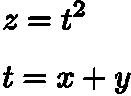
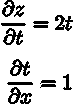
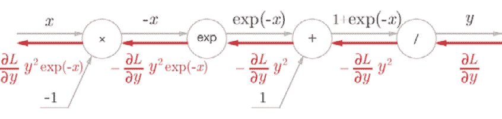
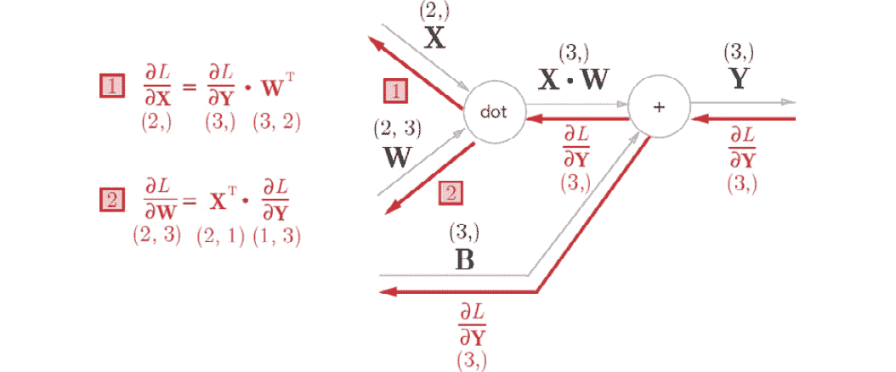

# 第六章：5\. 反向传播

上一章讲解了神经网络的训练。在那一章中，神经网络中权重参数的梯度（即损失函数对权重参数的梯度）是通过数值微分获得的。数值微分很简单，且易于实现，但它的缺点是计算速度较慢。本章介绍了反向传播，它是一种更高效地计算权重参数梯度的方法。

有两种方法可以正确理解反向传播。一种使用“方程式”，另一种使用**计算图**。前者是一种常见方法，许多关于机器学习的书籍通过专注于公式来扩展这一点。这种方式很好，因为它严格且简单，但可能隐藏了重要细节，或者最终只是一些毫无意义的方程式列表。

因此，本章将使用计算图，以便让你“直观”地理解反向传播。编写代码将进一步加深你的理解，并使你信服这一点。使用计算图来解释反向传播的想法基于 Andrej Karpathy 的博客（*黑客的神经网络指南*，([`karpathy.github.io/neuralnets/`](http://karpathy.github.io/neuralnets/))) 以及他和斯坦福大学的李飞飞教授提供的深度学习课程（*CS231n:* *用于视觉识别的卷积神经网络*，[`cs231n.github.io/`](http://cs231n.github.io/))。

## 计算图

计算图展示了计算过程。这个图作为数据结构图表示，由多个节点和边（即连接节点的直线）组成。在这一节中，我们将解决简单的问题，以便在逐步进入更复杂的反向传播之前，先熟悉计算图的使用。

### 使用计算图解决问题

本节中的问题足够简单，你可以用心算解决它们，但这里的目的是让你熟悉计算图。学习使用计算图将对我们后续要讨论的复杂计算非常有帮助，因此首先掌握如何使用计算图非常重要。

**问题 1**：太郎买了两个每个 100 日元的苹果。如果加上 10%的消费税，请计算他支付的金额。

计算图展示了带有节点和箭头的计算过程。节点用圆圈表示，运算在其中描述。箭头上方的中间结果显示从左到右流动的每个节点的计算结果。下图展示了解决问题 1 的计算图：


###### 图 5.1：使用计算图解答问题 1

如上图所示，100 日元的苹果流向“x2”节点后变成了 200 日元，然后传递到下一个节点。接着，200 日元传递到“× 1.1”节点后变为 220 日元。这个计算图的结果显示答案是 220 日元。

在上面的图示中，每个圆圈内包含了“× 2”或“× 1.1”作为一个操作。你也可以只在圆圈中放入“x”来表示操作。在这种情况下，如下图所示，你可以将“*2*”和“*1.1*”放在圆圈外部，作为“苹果数量”和“消费税”变量。

这个问题的解答可以从下面的图中看到：


###### 图 5.2：使用计算图解答问题 1：“苹果数量”和“消费税”变量被放置在圆圈外部

**问题 2**：太郎买了 2 个苹果和 3 个橙子。一个苹果 100 日元，橙子 150 日元。计算施加了 10%的消费税后，他支付了多少钱？

如问题 1 所示，我们将使用计算图来解答问题 2。以下图示显示了这个问题的计算图：


###### 图 5.3：使用计算图解答问题 2

在这个问题中，增加了一个加法节点“+”，用于求和苹果和橙子的数量。创建计算图后，我们从左到右推进计算。计算结果从左到右移动，就像电流在电路中流动一样，计算在结果到达最右端时结束。上图显示答案是 715 日元。

使用计算图解决问题时，必须执行以下操作：

1.  创建一个计算图。

1.  在计算图上从左到右推进计算。

步骤 2 被称为向前传播或**前向传播**。在前向传播中，计算从开始到结束沿着计算图进行传播。如果存在前向传播，我们也可以考虑向后传播——从右到左。这被称为**反向传播**，它将在我们稍后计算导数时发挥重要作用。

### 局部计算

计算图的主要特点是，它可以通过传播“局部计算”来获得最终结果。“局部”意味着“与节点相关的一个小范围”。局部计算可以从与节点相关的信息中返回下一个结果（后续结果），无论整体上发生了什么。

我们可以通过一个具体的例子来分解局部计算。例如，假设我们在超市买了两个苹果和许多其他东西。为了可视化这一点，你可以创建一个像这样的计算图：


###### 图 5.4：购买两个苹果和其他许多东西的例子

假设我们购买了许多物品，总金额是 4,000 日元（经过复杂计算得出），如前面的计算图所示。这里重要的是，每个节点中的计算都是局部计算。为了求出苹果和其他购买物品的总金额（4,000 + 200 -> 4,200），你只需要将这两个数字相加，而不必考虑 4,000 是如何得出的。换句话说，在每个节点中需要计算的仅仅是与该节点相关的计算——在这个例子中，就是将两个数字相加。我们不需要考虑整个图。

因此，你可以在计算图中专注于局部计算。无论整个计算多么复杂，每一步所做的都是“目标节点的局部计算”。通过传递简单局部计算的结果，你可以获得构成整个图的复杂计算结果。

#### 注意

例如，汽车的组装过程是复杂的，但通常是基于“流水线”上的分工进行的。每个工人（或机器）执行简单的工作。工作成果传递给下一个工人，最终完成一辆车的组装。计算图也将复杂的计算分解为“简单的局部计算”，并将计算结果传递给下一个节点，就像汽车沿流水线传递一样。像汽车组装一样，复杂的计算可以分解为简单的计算。

### 为什么我们使用计算图？

我们通过使用计算图解决了两个问题，现在可以考虑其优势。其中之一是前面提到的“局部计算”。无论整个计算多么复杂，局部计算使你能够集中精力处理每个节点中的简单计算，从而简化整个问题。

另一个优势是，你可以在计算图中保留所有中间计算的结果（例如，计算出两个苹果的 200 日元和加上消费税前的 650 日元）。然而，使用计算图的最大原因是，你可以通过反向传播高效地计算“导数”。

为了描述计算图中的反向传播，再次考虑问题 1。在这个问题中，你计算了关于两个苹果和消费税的最终支付金额。现在假设你需要知道当苹果价格上涨时，最终支付金额将如何变化。这就相当于求“支付金额对苹果价格的导数”。它对应于当苹果价格为 x，支付金额为 L 时，得到。这个导数的值表示当苹果价格“略微”上涨时，支付金额会增加多少。

如前所述，您可以在计算图中使用反向传播来获得一个值，例如“支付金额对苹果价格的导数”。首先，我们只看结果。如下面的图所示，您可以通过在计算图中使用反向传播来获得导数：


###### 图 5.5：使用反向传播传播微分值

如前图所示，反向传播通过箭头（粗线）以与前向方向相反的方向进行图示。反向传播传递“局部微分”，并将值放置在箭头下方。在此示例中，导数值从右到左传递，如 1 -> 1.1 -> 2.2。结果显示“支付金额对苹果价格的导数”的值为 2.2。

这表示当苹果的价格上涨 1 日元时，最终支付的金额增加了 2.2 日元。这意味着当苹果价格小幅上涨时，最终支付的金额会增加小幅值的 2.2 倍。在这里，只获得了相对于苹果价格的导数，但您也可以通过类似步骤获得“支付金额相对于消费税的导数”和“支付金额相对于苹果数量的导数”。

在这些步骤中，您可以共享导数的中间结果（传递到一半的导数），以便更高效地计算多个导数。因此，计算图的优势在于前向传播和反向传播使您能够高效地获得每个变量的导数值。

## 链式法则

计算图中的前向传播将计算结果从左到右沿前向方向传播。这些计算看起来很自然，因为它们通常是这样进行的。另一方面，在反向传播中，“局部导数”沿反向方向从右到左传播。传播“局部导数”的原理基于**链式法则**。让我们来看一下链式法则，明确它如何与计算图中的反向传播相对应。

### 计算图中的反向传播

现在我们来看一个使用计算图进行反向传播的示例。假设存在一个计算关系 *y = f(x)*，以下图展示了该计算的反向传播：


###### 图 5.6：计算图中的反向传播——局部导数在反向方向上相乘

如前图所示，反向传播将信号 E 乘以节点的局部导数，，并将其传播到下一个节点。这里的局部导数指的是在前向传播中获得计算的导数，y = f(x)，并表示获得 y 相对于 x 的导数，；例如，y = f(x) = x²，。局部导数与从上游传播下来的值（此例中的 E）相乘，并传递到前一个节点。

这就是反向传播的过程。它可以高效地获得目标导数值。之所以能够实现这一点，可以通过下一节中定义的链式法则原理来解释。

### 什么是链式法则？

在解释链式法则之前，我们需要先讨论`z = (x + y)`²由两个方程组成，如方程(5.1)所示：

|  | (5.1) |
| --- | --- |

链式法则是与复合函数的导数相关的特性，定义如下。

当一个函数由复合函数表示时，复合函数的导数可以表示为构成复合函数的每个函数的导数的乘积。

这就是链式法则的原理。虽然看起来可能很难，但其实它相当简单。在方程(5.1)给出的例子中，（z 对 x 的导数）是（*z*对*t*的导数）和（*t*对 x 的导数）的乘积。你可以用以下方程(5.2)表示这个：

|  | (5.2) |
| --- | --- |

你可以轻松记住方程(5.2)，因为∂t 相互抵消，如下所示：

现在，让我们用链式法则来获得方程(5.2)的导数，。首先，获得方程(5.1)的局部微分（偏微分）：

|  | (5.3) |
| --- | --- |

如方程(5.3)所示，是 2t，是 1\。这个结果是通过微分公式获得的。最终结果，，可以通过方程(5.3)中得到的导数乘积计算得到：

|  | (5.4) |
| --- | --- |

### 链式法则与计算图

现在，让我们用计算图来表达方程(5.4)中链式法则的计算。当我们用节点"**2"表示平方时，我们可以为其绘制如下图：


###### 图 5.7：方程(5.4)的计算图 – 局部导数相乘并在反向传播中传递

如上图所示，计算图中的反向传播将信号从右向左传播。反向传播将提供给节点的信号乘以节点的局部导数（偏导数），然后传递给下一个节点。例如，在反向传播中，“**2”中的输入是 。它乘以本地导数 （在正向传播中，输入是 t，输出是 z，因此此节点的（局部）导数是 ），然后乘以并传递给下一个节点。在上图中，反向传播中的第一个信号  在前面的方程中未出现。这是因为  = 1。

从上图我们应该注意的是左侧位置的反向传播结果。这对应于链式法则导致的 *"关于 x 的 z 的导数"。反向传播执行的操作基于链式法则的原理。

当您指定方程 (5.3) 的结果，如上图所示，结果如下。因此， 是 2(x + y)：


###### 图 5.8: 基于计算图中反向传播结果，是 2(x + y)

## 反向传播

前面的章节描述了计算图中的反向传播是基于链式法则的。我们现在将介绍通过以“+”和“x”等操作为例的反向传播工作方式。

### 加法节点中的反向传播

首先，让我们考虑一个加法节点中的反向传播。在这里，我们将看一下方程 *z = x + y* 的反向传播。我们可以按如下方式（解析地）获得 *z = x + y* 的导数：

|  | (5.5) |
| --- | --- |

正如方程 (5.5) 所示， 和  都是 1。因此，我们可以在计算图中表示它们，如下图所示。在反向传播中，从上游传来的导数 —— 例如本例中的  —— 被乘以 1 并传递到下游。简言之，在加法节点的反向传播中，乘以 1，因此它只传递输入值到下一个节点。

在这个例子中，来自上游的微分值被表示为 。这是因为我们假设了一个大型计算图，最终输出 L，如*图 5.10*所示。计算 *z = x + y* 存在于大型计算图的某处，并且  的值从上游传递下来。 和  的值向下传播：


###### 图 5.9：加法节点中的反向传播——左侧是正向传播，右侧是反向传播。

如右图所示，加法节点中的反向传播将一个值从上游传递到下游，而不做任何变化。


###### 图 5.10：这个加法节点存在于最终输出计算的某个位置。

在反向传播中，从最右侧的输出开始，局部的导数从节点到节点以反向方向传播

现在，让我们来看一个反向传播的例子。假设存在一个计算 "10 + 5 = 15"，并且一个值为 1.3 从上游流向反向传播。以下图示表示了这一过程，基于计算图：


###### 图 5.11：加法节点中反向传播的例子

因为加法节点中的反向传播只将输入信号输出到下一个节点，它将 1.3 传递给下一个节点。

### 乘法节点中的反向传播

让我们通过以方程 *z = xy* 为例来看看乘法节点中的反向传播。该方程的微分由以下方程（5.6）表示：

|  | (5.6) |
| --- | --- |

基于前面的方程（5.6），你可以写出如下的计算图。

对于乘法的反向传播，上游的值与正向传播输入信号的“反向值”相乘后传递给下游。反向值意味着，如果正向传播中的信号是 x，那么反向传播时要乘的值是 y；如果正向传播中的信号是 y，那么反向传播时要乘的值是 x，如下图所示。

让我们来看一个例子。假设存在一个计算 10 x 5 = 50，并且一个值为 1.3 从上游流向反向传播。*图 5.13* 以计算图的形式显示了这一过程。

在乘法的反向传播中，反向的输入信号相乘，因此得到 1.3 x 5 = 6.5 和 1.3 x 10 = 13。而在加法的反向传播中，上游的值仅被传递给下游。因此，正向传播中的输入信号不需要。在另一方面，对于乘法的反向传播，正向传播中的输入信号是必须的。因此，为了实现一个乘法节点，正向传播的输入信号需要保留：


###### 图 5.12：乘法节点中的反向传播——左侧是正向传播，右侧是反向传播


](img/Figure_5.14.jpg)

###### 图 5.13：乘法节点中的反向传播示例

### 苹果例子

让我们再从本章开始时考虑购买苹果的例子——两个苹果和消费税。这里要解决的问题是，三个变量（苹果的价格、苹果的数量和消费税）如何影响最终支付的金额。这对应于计算“苹果价格对支付金额的导数”，“苹果数量对支付金额的导数”和“消费税对支付金额的导数”。我们可以通过在计算图中使用反向传播来解决这个问题，如下图所示：


](img/Figure_5.14.jpg)

###### 图 5.14：购买苹果的反向传播示例

如前所述，输入信号在乘法节点的反向传播中被反向并传递到下游。根据前面图示的结果，苹果价格的微分为 2.2，苹果数量为 110，消费税为 200。它们表示当消费税和苹果价格增加相同的量时，消费税对最终支付金额的影响为 200，而苹果价格的影响为 2.2。然而，这一结果是因为在这个例子中，消费税和苹果价格的单位不同（消费税的单位是 100%，而苹果价格的单位是 1 日元）。

最后，让我们通过“购买苹果和橙子”这个练习来解决反向传播问题。请计算各个变量的导数，并将数字填入下图中提供的方框内（你可以在下一节找到答案）：


](img/Figure_5.15.jpg)

###### 图 5.15：购买苹果和橙子的反向传播示例——通过将数字填入方框完成此计算

## 实现简单层

在本节中，我们将使用 Python 实现我们所描述的苹果例子，使用计算图中的乘法节点作为**乘法层**（**MulLayer**），而将加法节点作为**加法层**（**AddLayer**）。

#### 注意

在下一节中，我们将实现一个类，其中包含构成神经网络的“层”。这里的“层”是神经网络中的一个功能单元——Sigmoid 层用于 sigmoid 函数，Affine 层用于矩阵乘法。因此，我们还将在“层”级别实现乘法和加法节点。

### 实现一个乘法层

我们将实现一个层，使其具有两个常用的方法（接口）：`forward()`和`backward()`，分别对应正向传播和反向传播。现在，你可以将乘法层实现为一个名为`MulLayer`的类，如下所示（源代码位于`ch05/layer_naive.py`）：

```py
class MulLayer:
   def __init__ (self): 
      self.x = None
      self.y = None
    def forward(self, x, y):
       self.x = x
       self.y =y
       out = x * y
       return out
    def backward(self, dout):
       dx = dout * self.y # Reverse x and y
       dy = dout * self.x
       return dx, dy
```

`__init__()`初始化实例变量`x`和`y`，用于保留正向传播中的输入值。`forward()`接收两个变量`x`和`y`，并将它们相乘并输出它们的乘积。另一方面，`backward()`将来自上游的导数`dout`与正向传播的“反向值”相乘，并将结果传递给下游。

现在，使用`MulLayer`实现“购买苹果”——两个苹果和消费税。在前面的部分，我们使用计算图中的正向传播和反向传播来进行这个计算，如下图所示：


](img/Figure_5.16.jpg)

###### 图 5.16: 购买两个苹果

通过使用乘法层，我们可以如下实现该正向传播（源代码位于`ch05/buy_apple.py`）：

```py
apple = 100
apple_num = 2
tax = 1.1
# layer
mul_apple_layer = MulLayer()
mul_tax_layer = MulLayer()
# forward
apple_price = mul_apple_layer.forward(apple, apple_num)
price = mul_tax_layer.forward(apple_price, tax)
print(price) # 220
```

你可以使用`backward()`来获取每个变量的导数。

```py
# backward
dprice = 1
dapple_price, dtax = mul_tax_layer.backward(dprice)
dapple, dapple_num = mul_apple_layer.backward(dapple_price)
print(dapple, dapple_num, dtax) # 2.2 110 200
```

在这里，调用`backward()`的顺序与调用`forward()`的顺序相反。请注意，`backward()`的参数是“正向传播中输出变量的导数”。例如，乘法层`mul_apple_layer`在正向传播中返回`apple_price`，而在反向传播中，它将`apple_price (dapple_price)`的导数值作为参数传递。该程序的执行结果与前面的图示结果相符。

### 实现一个加法层

现在，我们将实现一个加法层，它是一个加法节点，如下所示：

```py
class AddLayer:
   def __init__ (self):
      pass
   def forward(self, x, y):
      out = x + y
      return out
   def backward(self, dout): 
      dx = dout * 1
      dy = dout * 1
      return dx, dy
```

加法层无需初始化，因此`__init__()`什么都不做（`pass`语句表示“什么都不做”）。加法层中的`forward()`接收两个参数`x`和`y`，并将它们相加输出。`backward()`将上游的导数`dout`传递给下游。

现在，让我们使用加法层和乘法层来实现购买两个苹果和三个橙子的操作，如下图所示。


](img/Figure_5.17.jpg)

###### 图 5.17: 购买两个苹果和三个橙子

你可以如下方式在 Python 中实现这个计算图（源代码位于`ch05/buy_apple_orange.py`）：

```py
apple = 100
apple_num = 2
orange = 150
orange_num = 3
tax = 1.1
# layer
mul_apple_layer = MulLayer()
mul_orange_layer = MulLayer()
add_apple_orange_layer = AddLayer()
mul_tax_layer = MulLayer()
# forward
apple_price = mul_apple_layer.forward(apple, apple_num) #(1)
orange_price = mul_orange_layer.forward(orange, orange_num) #(2)
all_price = add_apple_orange_layer.forward(apple_price, orange_price) #(3)
price = mul_tax_layer.forward(all_price, tax) #(4)
# backward
dprice = 1
dall_price, dtax = mul_tax_layer.backward(dprice) #(4)
dapple_price, dorange_price = add_apple_orange_layer.backward(dall_price) #(3)
dorange, dorange_num = mul_orange_layer.backward(dorange_price) #(2)
dapple, dapple_num = mul_apple_layer.backward(dapple_price) #(1)
print(price) # 715
print(dapple_num, dapple, dorange, dorange_num, dtax) # 110 2.2 3.3 165 650
```

这个实现稍微长一些，但每一条语句都很简单。所需的层被创建，并按适当的顺序调用前向传播方法`forward()`。然后，反向传播方法`backward()`会以与前向传播相反的顺序调用，以获得所需的导数。

通过这种方式，在计算图中实现层（如加法层和乘法层）变得容易，你可以利用它们获得复杂的导数。接下来，我们将实现神经网络中使用的层。

## 实现激活函数层

现在，我们将计算图的思想应用于神经网络。在这里，我们将使用 ReLU 和 Sigmoid 层（激活函数）来实现构成神经网络的“层”。

### ReLU 层

**Rectified Linear Unit**（**ReLU**）作为激活函数，其表达式为以下方程（5.7）：

|  | (5.7) |
| --- | --- |

从前面的方程式（5.7）中，你可以通过方程式（5.8）得到 y 关于 x 的导数：

|  | (5.8) |
| --- | --- |

如方程式（5.8）所示，如果前向传播中的输入 x 大于 0，反向传播会将上游的值传递给下游而不做任何改变。同时，如果前向传播中的 x 为 0 或更小，信号将在反向传播中停在那里。你可以在计算图中表示这一点，如下图所示：


###### 图 5.18：ReLU 层的计算图

接下来，我们来实现 ReLU 层。在实现神经网络中的一个层时，我们假设 `forward()` 和 `backward()` 以 NumPy 数组作为参数。ReLU 层的实现位于 `common/layers.py`：

```py
class Relu:
   def __init__ (self): 
      self.mask = None
   def forward(self, x):
      self.mask = (x <= 0)
      out = x.copy()
      out[self.mask] = 0
      return out
   def backward(self, dout):
      dout[self.mask] = 0
      dx = dout
      return dx
```

`Relu` 类有一个实例变量 `mask`。`mask` 变量是一个由 `True`/`False` 值组成的 NumPy 数组。如果前向传播中输入 `x` 的某个元素为 0 或更小，那么 mask 中对应的元素为 `True`。否则（如果大于 0），该元素为 `False`。例如，`mask` 变量包含一个由 `True` 和 `False` 组成的 NumPy 数组，如下面的代码所示：

```py
>>> x = np.array( [[1.0, -0.5], [-2.0, 3.0]] )
>>> print(x)
[[  1\.    -0.5]
[-2\.    3\. ]]
>>> mask = (x <= 0)
>>> print(mask)
[[False True]
[ True False]] 
```

如前图所示，当前向传播中的输入值为 0 或更小时，反向传播的值为 0。因此，在反向传播中，前向传播中存储的 mask 变量被用来设置来自上游的 `dout`。如果 mask 的某个元素为 `True`，则 `dout` 中对应的元素被设置为 0\。

#### 注意

ReLU 层在电路中充当“开关”的角色。在前向传播中，当电流流过它时，它会打开开关；当电流不流过时，它会关闭开关。在反向传播中，如果开关是打开的，电流会继续流动；如果开关是关闭的，电流则不再流动。

### Sigmoid 层

接下来，让我们实现一个 sigmoid 函数。这由方程（5.9）表示：

|  | （5.9） |
| --- | --- |

下图显示了代表方程（5.9）的计算图：


###### 图 5.19：Sigmoid 层的计算图（仅正向传播）

这里，*exp* 和 */* 节点除了 *X* 和 *+* 节点之外还出现了。*exp* 节点计算 *y = exp(x)*，而 */* 节点计算 。

方程（5.9）的计算涉及局部计算的传播。接下来，让我们考虑前面计算图中展示的反向传播，逐步查看反向传播的流程，总结我们到目前为止描述的内容。

**第一步：**

*/* 节点表示 。其导数通过以下方程解析表示：

| `` | （5.10） |
| --- | --- |

基于方程（5.10），在反向传播中，节点将上游值乘以 *−y*2（正向传播中输出的平方的加法逆），并将值传递给下游。以下计算图显示了这一过程：


###### 图 5.20：Sigmoid 层的计算图（带有平方的加法逆）

**第二步：**

*+* 节点仅将上游值传递给下游。以下计算图显示了这一点：


###### 图 5.21：Sigmoid 层的计算图（传递上游值）

**第三步：**

*"exp"* 节点表示 *y = exp(x)*，其导数由以下方程表示：

|  | （5.11） |
| --- | --- |

在下面的计算图中，节点将上游值乘以正向传播中的输出（在本例中为 *exp(-x)*），并将值传递给下游：


###### 图 5.22：Sigmoid 层的计算图

**第四步：**

在正向传播中，*X* 节点反转值以便进行乘法运算。因此，在这里乘以 *−1*：



###### 图 5.23：Sigmoid 层的计算图（反转值）

因此，我们可以在前面图示中的计算图中展示 Sigmoid 层的反向传播。根据前面计算图的结果，反向传播的输出是，并传播到下游节点。需要注意的是，可以通过前向传播的输入*x*和输出*y*计算得出。因此，我们可以将前面图示中的计算图绘制为一个分组的“sigmoid”节点，如下所示：


###### 图 5.24：Sigmoid 层的计算图（简化版）

*图 5.23*中的计算图和*图 5.24*中的简化计算图提供了相同的计算结果。简化版更高效，因为它可以省略反向传播中的中间计算。还需要注意的是，通过分组节点，你可以只关注输入和输出，而无需关心 Sigmoid 层的细节。

你也可以将组织如下：

|  | (5.12) |
| --- | --- |

因此，你只能通过前向传播的输出计算上图所示的 Sigmoid 层中的反向传播：


###### 图 5.25：Sigmoid 层的计算图——你可以使用前向传播的输出 y 来计算反向传播

现在，让我们在 Python 中实现 Sigmoid 层。根据前面的图示，你可以按如下方式实现它（此实现位于`common/layers.py`）：

```py
class Sigmoid:
   def __init__ (self): 
      self.out = None
   def forward(self, x):
      out = 1 / (1 + np.exp(-x)) 
      self.out = out
   return out
def backward(self, dout):
   dx = dout * (1.0 - self.out) * self.out
   return dx
```

该实现将前向传播的输出保存在`out`实例变量中，然后在反向传播中使用`out`变量进行计算。

## 实现仿射层和 Softmax 层

### 仿射层

在神经网络的前向传播中，使用矩阵乘积（`np.dot()`，在 NumPy 中）来加权信号求和（详情请参阅*第三章：神经网络*中的*计算多维数组*部分）。例如，你是否还记得下面在 Python 中的实现？

```py
>>> X = np.random.rand(2) # Input values
>>> W = np.random.rand(2,3) # Weights
>>> B = np.random.rand(3) # Biases
>>>
>>> X.shape # (2,)
>>> W.shape # (2, 3)
>>> B.shape # (3,)
>>>
>>> Y = np.dot(X, W) + B
```

假设`X`、`W`和`B`分别是形状为`(2,)`、`(2, 3)`和`(3,)`的多维数组。基于此，你可以计算神经元的加权和为`Y = np.dot(X, W) + B`。`Y`经过激活函数处理并传播到下一层，这就是神经网络中的前向传播过程。请注意，矩阵乘法时，相应维度中的元素数量必须相同。这意味着在`X`和`W`的乘积中，相应维度的元素数量必须一致，如下图所示。这里，矩阵的形状以括号表示为*(2, 3)*（这是与 NumPy 的输出形状一致）：


###### 图 5.26：矩阵乘法时，相应维度中的元素数量必须相同

#### 注意

神经网络中的前向传播中的矩阵乘积在几何学中被称为“仿射变换”。因此，我们将实现执行仿射变换的过程，称之为“仿射层”。

现在，让我们来看一下计算过程——矩阵的乘积和偏置的加和——在计算图中的表示。当我们将计算矩阵乘积的节点表示为“dot”时，以下计算图可以表示计算`np.dot(X, W) + B`。在每个变量上方，都会标明该变量的形状（例如，*X*的形状是*(2,)*，而*X – W*的形状是*(3,)*，如下所示）：


###### 图 5.27：仿射层的计算图。请注意，变量是矩阵。每个变量上方显示该变量的形状

前述是一个相对简单的计算图。但请注意，*X*、*W*和*B*是多维数组。在我们之前看到的计算图中，“标量值”在节点之间流动，而在这个例子中，“多维数组”在节点之间传播。

让我们思考一下前述计算图的反向传播过程。为了获得多维数组的反向传播，你可以采用与之前用于标量值的计算图相同的步骤，通过逐个写出多维数组的每个元素来进行。这样，我们可以得到以下方程式（如何得到方程（5.13）在此省略）：

|  | (5.13) |
| --- | --- |

在方程（5.13）中，WT 中的 T 表示转置。转置操作将 W 的(i, j)元素切换为(j, i)元素，如下所示的方程：

|  | (5.14) |
| --- | --- |

如方程（5.14）所示，当 W 的形状为(2, 3)时，WT 的形状变为(3, 2)。

根据方程 (5.13)，让我们写出计算图中的反向传播。下图展示了结果：



###### 图 5.28：仿射层的反向传播。请注意，变量是矩阵。每个变量下方显示了该变量的形状。

让我们仔细考虑每个变量的形状。请注意，X 和  形状相同，W 和  在形状上是相同的，这是因为以下方程：

|  | (5.15) |
| --- | --- |

我们注意矩阵的形状，因为矩阵乘法要求对应维度中的元素数量相同，检查它们是否相同可以得到方程 (5.13)。例如，考虑  和 W 的乘积，使得  的形状变为 (2,)，当  的形状为 (3,) 且 W 的形状为 (2,3) 时。然后，方程 (5.13) 就成立。这可以在下图中看到：


###### 图 5.29：矩阵乘积（通过配置矩阵乘积，使得对应维度中的元素数量相同，可以创建“点”节点的反向传播）

### 基于批量的仿射层。

仿射层将一块数据作为输入，X。在本节中，我们将讨论基于批量的仿射层，它共同传播 N 个数据点（一个数据组被称为“批量”）。让我们从查看基于批量的仿射层的计算图（*图 5.30*）开始。

与之前的解释唯一不同的是，输入 X 的形状现在是 (N, 2)。我们需要做的就是按照之前的方式计算计算图中的矩阵。对于反向传播，我们必须小心矩阵的形状。只有在此之后，我们才能以相同的方式得到  和 。

当添加偏置时，必须小心。在前向传播中，偏置被添加到每个数据的 X · W 中。例如，当 N = 2（两个数据点）时，偏置被添加到每个数据点（每个计算结果）。下图展示了这一过程的具体示例：


###### 图 5.30：基于批量的仿射层计算图。

```py
>>> X_dot_W = np.array([[0, 0, 0], [10, 10, 10]])
>>> B = np.array([1, 2, 3])
>>>
>>> X_dot_W
array([[  0,    0,    0],
    [ 10,  10, 10]])
>>> X_dot_W + B
array([[  1,    2,    3],
    [11,  12, 13]])
```

在前向传播中，偏置项被加到每个数据上（第一个、第二个，依此类推）。因此，在反向传播中，反向传播中每个数据的值必须与偏置项的元素合并。以下代码展示了这一点：

```py
>>> dY = np.array([[1, 2, 3,], [4, 5, 6]])
>>> dY
array([[1,  2,  3],
[4,  5,  6]])
>>>
>>> dB = np.sum(dY, axis=0)
>>> dB
array([5,  7,  9])
```

在这个例子中，我们假设有两条数据（N = 2）。在偏置的反向传播中，对于每条数据，关于这两条数据的导数会被加总。为了实现这一点，`np.sum()`会对轴 0 的元素进行求和。

因此，仿射层的实现如下所示。`common/layers.py`中的仿射层实现与这里描述的实现稍有不同，因为它考虑了输入数据为张量（四维数组）的情况：

```py
class Affine:
    def __init__ (self, W, b): 
       self.W = W
       self.b = b
       self.x = None
       self.dW = None
       self.db = None
    def forward(self, x): 
       self.x = x
       out = np.dot(x, self.W) + self.b
       return out
    def backward(self, dout):
        dx = np.dot(dout, self.W.T)
       self.dW = np.dot(self.x.T, dout)
       self.db = np.sum(dout, axis=0)
       return dx
```

### Softmax-with-Loss 层

最后，我们应该考虑一个 softmax 函数，它是输出层。softmax 函数归一化输入的值并输出它们（如前所述）。例如，下面的图显示了手写数字识别中 Softmax 层的输出。

如我们所见，Softmax 层归一化了输入的值（即将它们转换为输出值的总和为 1），并输出它们。Softmax 层有 10 个输入，因为手写数字识别将数据分类为 10 个类别。

#### 注意

神经网络的处理包含两个阶段：**推理**和**训练**。通常，神经网络的推理阶段不使用 Softmax 层。例如，在下图所示的网络中，最后一个仿射层的输出作为推理结果。神经网络的未归一化输出结果（即下图中 Softmax 层之前的仿射层输出）有时称为“得分”。为了在神经网络推理中得到唯一的答案，只需要计算最大得分，因此不需要 Softmax 层。然而，在神经网络训练过程中是需要 Softmax 层的。


###### Figure 5.31: 图像通过仿射层和 ReLU 层转换，10 个输入值被 Softmax 层归一化

在这个例子中，“0”的得分是 5.3，经过 Softmax 层转换为 0.008（0.8%）。 “2”的得分是 10.1，经过 Softmax 层转换为 0.991（99.1%）。

现在，我们将实现“Softmax-with-Loss 层”，该层也包含交叉熵误差，这是一个损失函数。下图显示了 Softmax-with-Loss 层的计算图（softmax 函数和交叉熵误差）：


###### Figure 5.32: Softmax-with-Loss 层的计算图

如你所见，Softmax-with-Loss 层略显复杂。这里只展示了结果。如果你对 Softmax-with-Loss 层的构建过程感兴趣，请参考*附录*中*Softmax-with-Loss 层的计算图*部分。

我们可以将前面图示的计算图简化如下：


###### 图 5.33：“简化”版的 Softmax-with-Loss 层计算图

在前面的计算图中，Softmax 层表示 Softmax 函数，而交叉熵误差层表示交叉熵误差。在这里，我们假设数据已经被分类为三类，并且有三个输入（得分），这些数据来自前一层。如图所示，Softmax 层对输入(a1, a2, a3)进行归一化，并输出(y1, y2, y3)。交叉熵误差层接收 Softmax 的输出(y1, y2, y3)和标签(t1, t2, t3)，并根据这些数据输出损失 L。

从 Softmax 层的反向传播返回(y1 t1, y2 t2, y3 t3)，这是一个“干净”的结果。因为(y1, y2, y3)是 Softmax 层的输出，(t1, t2, t3)是标签，(y1 − t1, y2 − t2, y3 − t3)是 Softmax 层的输出与标签之间的差异。在神经网络反向传播时，这个差异作为误差传递给上一层。这个特性在训练神经网络时非常重要。

请注意，神经网络训练的目的是调整权重参数，使得神经网络的输出（Softmax 的输出）接近标签。为了做到这一点，我们需要有效地将神经网络输出与标签之间的误差传递给上一层。前面的结果(y1 − t1, y2 − t2, y3 − t3)正是 Softmax 层输出与标签之间的差异，并清楚地显示了神经网络输出与标签之间的当前误差。

当我们使用“交叉熵误差”作为“softmax 函数”的损失函数时，反向传播返回一个“漂亮”的结果，(y1 − t1, y2 − t2, y3 − t3)。这个“漂亮”的结果不是偶然的。调用交叉熵误差的函数就是为了做到这一点。在回归问题中，输出层使用“恒等函数”，损失函数使用“平方误差和”（参见*第三章*的*设计输出层*部分，*神经网络*）是出于同样的原因。当我们使用平方误差和作为“恒等函数”的损失函数时，反向传播也会提供一个“漂亮”的结果，(y1 − t1, y2 − t2, y3 − t3)。

让我们在这里考虑一个具体的例子。假设对于一组数据，标签是（0，1，0），而 Softmax 层的输出是（0.3，0.2，0.5）。此时，神经网络没有正确识别，因为它是正确标签的概率只有 0.2（20%）。在这种情况下，从 Softmax 层向后传播一个较大的误差（0.3，−0.8，0.5）。因为这个较大的误差会传播到前面的层，所以 Softmax 层之前的层从这个大误差中学到了更多信息。

作为另一个例子，假设对于一组数据，标签是（0，1，0），而 Softmax 层的输出是（0.01，0.99，0）（这个神经网络识别得相当准确）。在这种情况下，从 Softmax 层向后传播一个小的误差（0.01，−0.01，0）。这个小误差会传播到前面的层。Softmax 层之前的层只学习到小部分信息，因为误差很小。

现在，我们来实现 Softmax-with-Loss 层。你可以按照如下方式实现 Softmax-with-Loss 层：

```py
class SoftmaxWithLoss:
    def __init__ (self):
        self.loss = None # Loss
        self.y = None	# Output of softmax
        self.t = None	# Label data (one-hot vector)
    def forward(self, x, t):
        self.t = t
        self.y = softmax(x)
        self.loss = cross_entropy_error(self.y, self.t)
        return self.loss
    def backward(self, dout=1): 
        batch_size = self.t.shape[0]
        dx = (self.y - self.t) / batch_size
        return dx
```

本实现使用了 `softmax()` 和 `cross_entropy_error()` 函数。这些函数在《第三章 神经网络》的子章节 *实现 Softmax 函数时的问题* 和《第四章 神经网络训练》的子章节 *实现交叉熵误差（使用小批量）* 中已经实现。因此，这里的实现非常简单。请注意，每个数据的误差会在反向传播时传播到前面的层，因为传播值会被批量大小（`batch_size`）除以。

## 实现反向传播

你可以通过将之前实现的层像拼装乐高积木一样组合起来，构建一个神经网络。在这里，我们将通过组合目前为止实现的层来构建一个神经网络。

### 神经网络训练的整体视图

因为我的描述有点长，在继续实现之前，我们先来回顾一下神经网络训练的整体过程。现在我们将查看神经网络训练的流程。

### 前提假设

神经网络具有可调的权重和偏置。调整它们以使其适应训练数据的过程称为“训练”。神经网络训练包括以下四个步骤：

**步骤 1（小批量）：**

从训练数据中随机选择一些数据。

**步骤 2（计算梯度）：**

获取每个权重参数的损失函数梯度。

**步骤 3（更新参数）：**

在梯度的方向上稍微更新参数。

**步骤 4（重复）：**

重复步骤 1、2 和 3。

反向传播发生在*步骤 2*，*计算梯度*。在上一章中，我们通过数值微分获得梯度。数值微分容易实现，但计算时间较长。如果使用反向传播，我们可以更快速有效地获得梯度。

### 实现一个支持反向传播的神经网络

在本节中，我们将实现一个名为`TwoLayerNet`的两层神经网络。首先，我们将查看*表 5.1*和*表 5.2*中该类的实例变量和方法。

这个类的实现稍微长一些，但有许多部分与*第四章*中*实现训练算法*部分的实现相似。与上一章的主要变化是，这里使用了层。如果使用层，你可以通过在层之间传播来获取识别结果（`predict( )`）和梯度（`gradient( )`）：


###### 表 5.1：TwoLayerNet 类中的实例变量


###### 表 5.2：TwoLayerNet 类中的方法

现在，让我们实现`TwoLayerNet`：

```py
import sys, os
sys.path.append(os.pardir)
import numpy as np
from common.layers import *
from common.gradient import numerical_gradient
from collections import OrderedDict
class TwoLayerNet:
    def __init__ (self, input_size, hidden_size, output_size,
            weight_init_std=0.01):
    # Initialize weights
    self.params = {}
    self.params['W1'] = weight_init_std * \
                    np.random.randn(input_size, hidden_size)
    self.params['b1'] = np.zeros(hidden_size)
    self.params['W2'] = weight_init_std * \
                    np.random.randn(hidden_size, output_size)
    self.params['b2'] = p.zeros(output_size)
    # Create layers
self.layers = OrderedDict( )
    self.layers['Affine1'] = \
        Affine(self.params['W1'], self.params['b1'])
self.layers['Relu1'] = Relu( ) 
    self.layers['Affine2'] = \
    Affine(self.params['W2'], self.params['b2'])
    self.lastLayer = SoftmaxWithLoss( )
    def predict(self, x):
        for layer in self.layers.values( ):
x = layer.forward(x)
        return x
    # x: input data, t: label data
    def loss(self, x, t):
        y = self.predict(x)
        return self.lastLayer.forward(y, t)
    def accuracy (self, x, t): 
        y = self.predict(x)
        y = np.argmax(y, axis=1)
        if t.ndim != 1 : t = np.argmax(t, axis=1)
        accuracy = np.sum(y == t) / float(x.shape[0])
        return accuracy
    # x: input data, t: teacher data
    def numerical_gradient(self, x, t):
        loss_W = lambda W: self.loss(x, t)
        grads = {}
        grads['W1'] = numerical_gradient(loss_W, self.params['W1'])
        grads['b1'] = numerical_gradient(loss_W, self.params['b1'])
        grads['W2'] = numerical_gradient(loss_W, self.params['W2'])
        grads['b2'] = numerical_gradient(loss_W, self.params['b2'])
        return grads
    def gradient(self, x, t): 
        # forward
        self.loss(x, t)
        # backward
        dout = 1
        dout = self.lastLayer.backward(dout)
        layers = list(self.layers.values( ))
        layers.reverse( )
for layer in layers:
            dout = layer.backward(dout)
        # Settings
        grads = {}
        grads['W1'] = self.layers['Affine1'].dW
        grads['b1'] = self.layers['Affine1'].db
        grads['W2'] = self.layers['Affine2'].dW
        grads['b2'] = self.layers['Affine2'].db
        return grads
```

注意这里的代码是加粗的。保持神经网络层为`OrderedDict`（即有序字典）是特别重要的，因为它意味着字典可以记住添加到其中的元素顺序。因此，在神经网络的前向传播中，你可以按添加顺序调用层的`forward()`方法完成处理。在反向传播中，你只需要按相反顺序调用这些层。Affine 和 ReLU 层在内部会正确处理前向传播和反向传播。所以，你只需要按正确的顺序将层组合起来并按顺序调用它们（或反向顺序调用）。

因此，通过将神经网络的组件实现为“层”，你可以轻松构建神经网络。使用“层”进行模块化实现的优势是巨大的。如果你想创建一个包含五层、十层或二十层的大型网络，你可以通过添加所需的层（就像组装乐高积木一样）来完成。通过这种方式，通过每一层实现的前向传播和反向传播，正确地获得了识别和学习所需的梯度。

### 梯度检查

到目前为止，我们已经看到了计算梯度的两种方法。它们中的一种使用数值微分，另一种通过解析解来求解方程。后一种方法通过使用反向传播，使得即使有很多参数也能高效地计算。因此，从现在开始，我们将使用反向传播而不是缓慢的数值微分来计算梯度。

数值微分需要时间来计算。如果存在正确的反向传播实现，我们就不需要数值微分的实现。那么，数值微分到底有什么用呢？事实上，数值微分是用来检查反向传播的实现是否正确的。

数值微分的优点在于它易于实现，与更加复杂的反向传播相比，犯错的概率较低。因此，数值微分的结果常常与反向传播的结果进行比较，以检查反向传播的实现是否正确。这个验证过程被称为`ch05/gradient_check.py`。

```py
import sys, os
sys.path.append(os.pardir)
import numpy as np
from dataset.mnist import load_mnist
from two_layer_net import TwoLayerNet
# Load data
(x_train, t_train), (x_test, t_test) = \
   load_mnist(normalize=True, one_hot_label=True)
network = TwoLayerNet(input_size=784, hidden_size=50, output_size=10)
x_batch = x_train[:3]
t_batch = t_train[:3]
grad_numerical = network.numerical_gradient(x_batch, t_batch) 
grad_backprop = network.gradient(x_batch, t_batch)
# Calculate the average of the absolute errors of individual weights
for key in grad_numerical.keys( ):
   diff = np.average( np.abs(grad_backprop[key] - grad_numerical[key]) )
   print(key + ":" + str(diff))
```

这里，MNIST 数据集像往常一样被加载。接下来，使用部分训练数据检查数值微分的梯度与反向传播的梯度之间的误差。误差是通过对各个权重参数中元素差异的绝对值求平均得出的。当执行上述代码时，将返回以下结果：

```py
b1:9.70418809871e-13
W2:8.41139039497e-13
b2:1.1945999745e-10
W1:2.2232446644e-13
```

结果表明，数值微分和反向传播计算的梯度之间的差异非常小。例如，层 1 偏置的误差为 `9.7e-13 (0.00000000000097)`。这表明反向传播计算的梯度也是正确的，并提高了其准确性的可靠性。

数值微分的计算结果与反向传播的计算结果之间的误差很少为 0。原因在于计算机执行的计算精度是有限的（例如，使用的是 32 位浮动点数）。由于数值精度有限，误差通常不会为 0。但是，如果实现正确，误差应该是一个接近 0 的小值。如果误差较大，则说明反向传播的实现有误。

### 使用反向传播进行训练

最后，我们将看到如何使用反向传播实现神经网络训练。唯一的区别是梯度是通过反向传播计算的。我们将仅查看代码并省略描述（源代码位于 `ch05/train_neuralnet.py`）：

```py
import sys, os
sys.path.append(os.pardir)
import numpy as np
from dataset.mnist import load_mnist
from two_layer_net import TwoLayerNet
# Load data
(x_train, t_train), (x_test, t_test) = \
    load_mnist(normalize=True, one_hot_label=True)
network = TwoLayerNet(input_size=784, hidden_size=50, output_size=10)
iters_num = 10000
train_size = x_train.shape[0]
batch_size = 100
learning_rate = 0.1
train_loss_list = [ ]
train_acc_list = [ ]
test_acc_list = [ ]
iter_per_epoch = max(train_size / batch_size, 1)
for i in range(iters_num):
   batch_mask = np.random.choice(train_size, batch_size)
   x_batch = x_train[batch_mask]
   t_batch = t_train[batch_mask]
   # Use backpropagation to obtain a gradient
   grad = network.gradient(x_batch, t_batch)
   # Update
   for key in ('W1', 'b1', 'W2', 'b2'): 
      network.params[key] -= learning_rate * grad[key]
   loss = network.loss(x_batch, t_batch)
   train_loss_list.append(loss)
if i % iter_per_epoch == 0:
   train_acc = network.accuracy(x_train, t_train)
   test_acc = network.accuracy(x_test, t_test)
   train_acc_list.append(train_acc)
   test_acc_list.append(test_acc)
   print(train_acc, test_acc)
```

## 总结

本章中，我们学习了计算图，它以直观的方式展示了计算过程。我们查看了一个描述神经网络反向传播的计算图，并实现了具有多个层的神经网络处理，包括 ReLU 层、Softmax-with-Loss 层、仿射层和 Softmax 层。这些层具有前向和后向方法，可以通过前向和后向传播数据来高效地计算权重参数的梯度。通过将层作为模块，您可以在神经网络中自由组合它们，从而轻松构建所需的网络。本章涵盖了以下内容：

+   我们可以使用计算图来直观地展示计算过程。

+   计算图中的一个节点由局部计算组成，局部计算构成了整个计算。

+   在计算图中执行前向传播会进行常规计算。与此同时，在计算图中执行反向传播可以计算每个节点的微分。

+   通过将神经网络中的组件实现为层，您可以高效地计算梯度（反向传播）。

+   通过比较数值微分和反向传播的结果，您可以检查反向传播的实现是否正确（梯度检查）。
