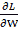

# 第七章：6\. 训练技巧

本章描述了神经网络训练中的重要思想，包括用于寻找最优权重参数的优化技术、权重参数的初始值以及设置超参数的方法——这些都是神经网络训练中的重要话题。我们将讨论正则化方法，如权重衰减和丢弃法，以防止过拟合并加以实现。最后，我们将探讨批量归一化，这在近年来的研究中被广泛使用。通过使用本章介绍的方法，你将能够有效地推进神经网络训练，从而提高识别精度。

## 更新参数

神经网络训练的目的是找到使损失函数值最小化的参数。问题在于找到最优参数——这一过程被称为**优化**。不幸的是，优化非常困难，因为参数空间非常复杂，且最优解很难找到。你不能通过解方程来立即得到最小值。在深度网络中，情况更加困难，因为参数的数量非常庞大。

到目前为止，我们依赖参数的梯度（导数）来寻找最优参数。通过反复使用参数的梯度在梯度方向上更新参数，我们逐步接近最优参数。这是一种简单的方法，称为**随机梯度下降法**（**SGD**），但它比随机搜索参数空间是一种“更聪明”的方法。然而，SGD 是一种简单的方法，（对于某些问题）也有一些方法能够更好地工作。那么，我们首先来考虑 SGD 的缺点，并介绍其他优化技术。

### 冒险者的故事

在进入主题之前，我们可以通过一个寓言来描述我们在优化方面所面临的情况。

#### 注意

有一个奇怪的冒险者。他每天穿越广阔的干旱地区，寻找一片深谷的底部。他的目标是到达最深的谷底，他称之为“深处”。这也是他旅行的原因。此外，他对自己设定了两个严格的“限制”。其中一个是不能使用地图，另一个是要蒙住双眼。因此，他不知道最深的谷底在哪个地方，也看不见任何东西。在这种严格的条件下，这个冒险者如何寻找“深处”？他如何高效地移动以寻找“深处”？

我们在寻找最优参数时所处的情境，就像这个冒险者的世界一样是一片黑暗。我们必须在广阔且复杂的地形中，蒙着眼睛、没有地图地寻找“深处”。

在这种困难的情况下，重要的是“地面的倾斜度”。冒险者看不到周围的环境，但他知道地面的倾斜度，因为他能从站立的位置（他的双脚可以感觉到）感知到它。因此，SGD 的策略是沿着地面倾斜度最陡的方向前进。勇敢的冒险者想：“通过不断重复，我可能某天能够到达‘深处’。”

### SGD

既然我们已经理解了这个优化问题的困难，接下来让我们回顾一下 SGD。方程 6.1 表示 SGD 如下：

|  | (6.1) |
| --- | --- |

这里，要更新的权重参数是 W，W 的损失函数梯度是。η是学习率，我们需要预定义它的值，如 0.01 或 0.001。方程中的`<-`表示右侧的值将用于更新左侧的值。如方程 6.1 所示，SGD 是一个简单的方法，它在梯度方向上移动一定的距离。现在，我们将以 Python 类的形式实现`SGD`：

```py
class SGD:
    def __init__ (self, lr=0.01):
        self.lr = lr
    def update(self, params, grads): 
        for key in params.keys():
            params[key] -= self.lr * grads[key]
```

这里，初始化时的参数`lr`是学习率。学习率被保留为一个实例变量。我们还将定义`update(params, grads)`方法，这个方法会在 SGD 中被反复调用。`params`和`grads`是字典类型的变量（如同我们至今在神经网络实现中所做的那样）。例如，`params['W1']`和`grads['W1']`，每个元素存储着权重参数或梯度。通过使用`SGD`类，你可以像下面这样更新神经网络中的参数（以下代码是伪代码，不可直接运行）：

```py
network = TwoLayerNet(...)
optimizer = SGD()
for i in range(10000):
    ...
    x_batch, t_batch = get_mini_batch(...)  # Mini-batch
    grads = network.gradient(x_batch, t_batch)
    params = network.params
    optimizer.update(params, grads)
    ...
```

这里出现的变量名`optimizer`表示“优化者”。在此，SGD 扮演着这一角色。`optimizer`变量负责更新参数。我们所需要做的就是将关于参数和梯度的信息传递给优化器。

因此，单独实现一个优化类有助于特性的模块化。例如，我们很快就会实现另一个优化技术，叫做`update(params, grads)`。然后，我们只需将`optimizer = SGD()`语句更改为`optimizer = Momentum()`，就能从 SGD 切换到 Momentum 优化技术。

#### 注意

在许多深度学习框架中，已经实现了各种优化技术，并提供了机制，让我们可以轻松地在它们之间切换。例如，在一个叫 Lasagne 的深度学习框架中，优化技术作为函数实现，并存放在`updates.py`文件中（[`github.com/Lasagne/Lasagne/blob/master/lasagne/updates.py`](http://github.com/Lasagne/Lasagne/blob/master/lasagne/updates.py)）。用户可以从中选择所需的优化技术。

### SGD 的缺点

虽然 SGD（随机梯度下降）简单且易于实现，但在某些问题上可能效率较低。为了讨论 SGD 的缺点，我们考虑一个计算以下函数最小值的问题：

|  | (6.2) |
| --- | --- |

由方程 6.2 表示的函数形状像一个沿 x 轴方向拉伸的“碗”，如下面的图所示。实际上，方程 6.2 的等高线像是沿 x 轴方向延伸的椭圆。

现在，让我们来看一下由方程 6.2 表示的函数的梯度。*图 6.2*展示了这些梯度。这些梯度在 y 轴方向上很大，而在 x 轴方向上很小。换句话说，y 轴方向的倾斜度很陡，而 x 轴方向则比较平缓。注意，方程 6.2 的最小值位置是`(x, y) = (0, 0)`，但在许多地方，*图 6.2*中的梯度并未指向(0, 0)方向。

让我们将 SGD 应用于如下图所示的函数。它从`(x, y) = (-7.0, 2.0)`（初始值）开始搜索。*图 6.3*显示了结果：


###### 图 6.1：

###### 图 6.2：梯度！68

SGD 以锯齿状方式移动，如下图所示。SGD 的缺点是，如果一个函数的形状不是各向同性的，也就是说它是拉长的，它的搜索路径会变得低效。因此，我们需要比 SGD 更智能的方法，能够仅沿梯度方向移动。SGD 搜索路径低效的根本原因是梯度并没有指向正确的最小值：


###### 图 6.3：SGD 优化更新路径 — 由于它以锯齿状方式逼近最小值(0, 0)，效率低

为了改进 SGD 的缺点，我们将介绍三种替代方法：动量法、AdaGrad 和 Adam。我们将简要描述它们，并展示它们的方程和 Python 实现。

### 动量

动量与物理学有关；它意味着“运动量”。动量法通过以下方程表示：

|  | (6.3) |
| --- | --- |
|  | (6.4) |

就像 SGD 一样，W 是要更新的权重参数，是 W 的损失函数梯度，η是学习率。这里出现的新变量 v 是物理学中的“速度”。方程 6.3 表示了一个物理法则，说明物体在梯度方向上受力并由此加速。在动量法中，更新函数就像球在地面上滚动一样，如下图所示：


###### 图 6.4：动量图像 — 一个球在地面坡道上滚动

方程 6.3 中的项αv 会在物体不受力时逐渐减速（为α设置一个值，如 0.9）。这就是地面或空气阻力造成的摩擦力。以下代码展示了动量的实现（源代码位于`common/optimizer.py`）：

```py
class Momentum:
    def __ init __ (self,  lr=0.01,  momentum=0.9):
        self.lr = lr
        self.momentum = momentum 
        self.v = None
    def update(self, params, grads): 
        if self.v is None:
        self.v = {}
        for key, val in params.items(): 
            self.v[key] = np.zeros_like(val)
        for key in params.keys():
            self.v[key] = self.momentum*self.v[key] - self.lr*grads[key]
            params[key] += self.v[key]
```

实例变量`v`保留了物体的速度。在初始化时，`v`不保留任何值。当调用`update()`时，它保留了与字典变量结构相同的数据。剩下的实现很简单：它只需实现方程 6.3 和 6.4。

现在，让我们使用动量来解决方程 6.2 中的优化问题。下图展示了结果。

如下图所示，更新路径像一个球在碗中滚动。可以看到，与 SGD 相比，“之字形程度”有所减少。x 轴方向上的力非常小，但物体始终在相同的方向上受到力，并且在相同的方向上不断加速。另一方面，y 轴方向上的力很大，但物体在正负方向上交替受力，彼此抵消，因此 y 轴方向上的速度不稳定。这可以加速 x 轴方向上的运动，并减少与 SGD 相比的之字形运动：


###### 图 6.5：通过动量优化的更新路径

### AdaGrad

在神经网络训练中，学习`rate--η`在`equation--`中的值非常重要。如果它太小，训练会持续太长时间。如果它太大，训练会发散，无法达到正确的训练效果。

有一种有效的学习率技术叫做**学习率衰减**。它随着训练的进行使用更低的学习率。这种方法在神经网络训练中经常使用。神经网络首先学习“很多”，然后逐渐学习“更少”。

逐渐降低学习率等同于逐渐减小所有参数的学习率。AdaGrad（*John Duchi, Elad Hazan, and Yoram Singer (2011): Adaptive Subgradient Methods for Online Learning and Stochastic Optimization. Journal of Machine Learning Research 12, Jul (2011), 2121 – 2159.*）是这种方法的一个高级版本。AdaGrad 为每个参数创建了一个定制的值。

AdaGrad 会自适应地调整每个参数元素的学习率以进行训练（AdaGrad 中的"Ada"来自于"Adaptive"）。现在，我们将通过方程展示 AdaGrad 的更新方法：

|  | (6.5) |
| --- | --- |
|  | (6.6) |

就像 SGD 一样，W 是需要更新的权重参数，是 W 的损失函数梯度，η是学习率。这里引入了一个新变量 h。h 变量存储了迄今为止梯度值的平方和，如方程 6.5 所示（方程 6.5 中的⊙表示数组元素之间的乘法）。在更新参数时，AdaGrad 通过乘以来调整学习的规模。对于已经显著移动的参数元素（即已经进行了大量更新的参数），学习率会变小。因此，您可以通过逐渐减少那些显著移动的参数的学习率来衰减每个参数元素的学习率。

#### 注意

AdaGrad 将所有过去的梯度记录为平方和。因此，随着学习的进行，更新的程度变小。当学习无限进行时，更新的程度变为 0，导致没有更新。RMSProp（*Tieleman, T., & Hinton, G. (2012): Lecture 6.5—RMSProp: Divide the gradient by a running average of its recent magnitude. COURSERA: Neural Networks for Machine Learning*）方法解决了这个问题。它不会对所有过去的梯度进行等权重处理，而是逐渐遗忘过去的梯度，并进行加权处理，从而使新梯度的信息得以清晰反映。这样，过去梯度的规模会指数衰减，这就是所谓的“指数加权平均”。

现在，让我们来实现 AdaGrad。您可以按如下方式实现 AdaGrad（源代码位于`common/optimizer.py`）：

```py
class AdaGrad:
    def __init__ (self, lr=0.01): 
        self.lr = lr
        self.h = None
    def update(self, params, grads): 
        if self.h is None:
        self.h = {}
        for key, val in params.items(): 
            self.h[key] = np.zeros_like(val)
for key in params.keys():
    self.h[key] += grads[key] * grads[key]
    params[key] -= self.lr * grads[key] / (np.sqrt(self.h[key]) + 1e-7)
```

请注意，最后一行添加了一个小的值`1e-7`。这可以防止当`self.h[key]`包含`0`时发生除以`0`的情况。在许多深度学习框架中，您可以将这个小值配置为一个参数，但在这里，使用了一个固定值`1e-7`。

现在，让我们用 AdaGrad 来解决方程 6.2 中的优化问题。下图展示了结果：


###### 图 6.6：AdaGrad 优化的更新路径

前面的图像显示了参数高效地向最小值移动。最初，参数移动较多，因为 y 轴方向的梯度很大。调整与大幅运动成比例进行，因此更新步长变小。这样，y 轴方向的更新程度被减弱，从而减少了锯齿形的波动。

### Adam

在 Momentum 中，参数的更新基于物理法则，就像一个球在碗中滚动一样。AdaGrad 为每个参数元素自适应地调整更新步长。那么，当 Momentum 和 AdaGrad 这两种技术结合时，会发生什么呢？这就是 Adam 技术的基本思想（这里对 Adam 的解释是直观的，缺少一些更细致的技术细节。如需更精确的定义，请参阅原文）。

Adam 是一种新的技术，于 2015 年提出。其理论略显复杂。直观上来说，它类似于动量和 AdaGrad 的结合体。通过结合这两种技术的优势，我们可以期待有效地搜索参数空间。超参数的“偏差校正”也是 Adam 的一个特点。更多细节，请参阅原始论文（*Diederik Kingma 和 Jimmy Ba. (2014): Adam: A Method for Stochastic Optimization. arXiv:1412.6980[cs] (2014 年 12 月)*）。在 Python 中实现为`common/optimizer.py`中的`Adam`类。

现在，让我们使用 Adam 来解决方程 6.2 的优化问题。下图显示了结果。


###### 图 6.7: Adam 优化的更新路径

如*图 6.7*所示，Adam 的更新路径就像是把球滚进碗里一样移动。这种运动类似于动量，但球的左右运动较小。这种优势是由学习率的自适应调整引起的。

#### 注意

Adam 有三个超参数。第一个是学习率（在论文中表示为α）。其他两个是主动量的系数β1 和次动量的系数β2。文章指出，标准值分别为β1 为 0.9，β2 为 0.999，在许多情况下非常有效。

### 我们应该使用哪种更新技术？

到目前为止，我们已经考虑了四种参数更新技术。在这里，我们将比较它们的结果（源代码位于`ch06/optimizer_compare_naive.py`）。

如*图 6.8*所示，不同的技术使用不同的路径来更新参数。这幅图似乎显示 AdaGrad 是最好的，但请注意，结果因解决的问题而异。当然，结果也会因超参数的值（如学习率）而异：


###### 图 6.8: 优化技术的比较 – SGD、动量、AdaGrad 和 Adam

到目前为止，我们已经看过四种技术：SGD、动量、AdaGrad 和 Adam。但我们应该使用哪一种？遗憾的是，目前没有一种被广泛认可的技术能够解决所有问题。每种技术都有其独特的特点和优势，使其更适合某些问题而不适合其他问题。因此，了解在特定情况下哪种技术最有效非常重要。

SGD 仍然被广泛应用于许多研究中。动量和 AdaGrad 也值得尝试。最近，许多研究人员和工程师似乎更喜欢 Adam。本书主要使用 SGD 和 Adam。您可以根据需要尝试其他技术。

### 使用 MNIST 数据集比较更新技术

对于手写数字识别，我们将比较迄今为止描述的四种技术：SGD、动量法、AdaGrad 和 Adam。让我们探讨每种技术在训练过程中的工作原理。*图 6.9* 显示了结果（源代码位于 `h06/optimizer_compare_mnist.py`）：


###### 图 6.9：使用 MNIST 数据集比较四种更新技术——横轴表示学习的迭代次数，纵轴表示损失函数的值

本实验使用了一个五层神经网络，每层有 100 个神经元。ReLU 被用作激活函数。

*图 6.9* 的结果显示，其他技术的学习速度比 SGD 更快。似乎剩下的三种技术学习得差不多快。当我们仔细观察时，AdaGrad 学得略快一些。在本实验中，值得注意的是，结果会因为学习率的超参数和神经网络的结构（层数）而有所不同。然而，一般来说，其他三种技术的学习速度通常会比 SGD 快，有时还能获得更好的最终识别性能。

## 初始权重值

初始权重值在神经网络训练中尤为重要。设置什么样的初始权重值通常决定了神经网络训练的成败。本节将解释推荐的初始权重值，并通过实验验证它们是否能加速神经网络的学习。

### 如何将初始权重值设置为 0？

稍后，我们将介绍一种叫做权重衰减的技术，它可以减少过拟合并提高泛化性能。简而言之，权重衰减是一种减少权重参数值以防止过拟合的技术。

如果我们希望权重较小，从最小的初始值开始可能是一个不错的方法。在这里，我们使用 `0.01 * np.random.randn(10, 100)` 作为初始权重值。这个小值是从高斯分布中生成的，乘以 0.01——高斯分布的标准差为 0.01。

如果我们希望权重值较小，怎样将所有初始权重值设置为 0 呢？这是一个糟糕的主意，因为它会阻止我们正确地训练。

为什么初始权重值不应该是 0？换句话说，为什么权重不应该是统一值？因为在反向传播中，所有权重值会以相同的方式均匀更新。所以，假设在一个两层神经网络中，第一层和第二层的权重都是 0。那么，在前向传播时，输入层的所有神经元的值都会被传递到第二层，因为输入层的权重是 0。当相同的值输入到第二层的所有神经元时，在反向传播时，第二层的所有权重都会以相同的方式更新（请记住“在乘法节点中的反向传播”）。因此，权重以相同的值更新，并且变成对称值（重复值）。因此，拥有许多权重没有意义。为了防止权重统一或破坏其对称结构，需要使用随机初始值。

### 隐藏层激活值的分布

观察隐藏层中激活值的分布（这里指的是激活函数后的输出数据，尽管一些文献称流经各层的数据为“激活”）提供了很多信息。在这里，我们将进行一个简单的实验，看看初始权重值如何改变隐藏层中的激活值。我们将一些随机生成的数据输入到一个五层神经网络中（使用 sigmoid 函数作为激活函数），并通过直方图展示每一层激活值的分布。这个实验基于斯坦福大学的 CS231n 课程（*CS231n: 卷积神经网络与视觉识别* ([`cs231n.github.io/`](http://cs231n.github.io/)))。

实验的源代码位于`ch06/weight_init_activation_histogram.py`。以下是部分代码：

```py
import numpy as np
import matplotlib.pyplot as plt
def sigmoid(x):
    return 1 / (1 + np.exp(-x))
x = np.random.randn(1000, 100) # 1000 data
node_num = 100 # Number of nodes (neurons) in each hidden layer
hidden_layer_size = 5 # Five hidden layers exist
activations = {}	# The results of activations are stored here
for i in range(hidden_layer_size):
    if i != 0:
        x = activations[i-1]
    w = np.random.randn(node_num, node_num) * 1
    z = np.dot(x, w)
    a = sigmoid(z) # Sigmoid function!
    activations[i] = a
```

这里有五层，每一层有 100 个神经元。作为输入数据，随机生成 1,000 个数据点，服从高斯分布，并提供给这五层神经网络。使用 sigmoid 函数作为激活函数，每一层的激活结果存储在`activations`变量中。请注意权重的规模。这里使用标准差为 1 的高斯分布。这个实验的目的是通过改变这个尺度（标准差）来观察`activations`的分布如何变化。现在，让我们展示存储在`activations`中的每一层数据，并以直方图的形式呈现：

```py
# Draw histograms
for i, a in activations.items( ): 
    plt.subplot(1, len(activations), i+1)
    plt.title(str(i+1) + "-layer")
    plt.hist(a.flatten(), 30, range=(0,1))
plt.show()
```

执行此代码将生成下图所示的直方图。

该图显示，每一层的激活值主要为 0 和 1。这里使用的 sigmoid 函数是一种 S 曲线函数。当 sigmoid 函数的输出接近 0（或 1）时，微分的值会接近 0。因此，当数据主要是 0 和 1 时，反向传播中的梯度值会变得越来越小，直到消失。这就是所谓的**梯度消失**问题。在深度学习中，层数较多时，梯度消失问题可能会变得更加严重。

接下来，让我们进行相同的实验，但这次权重的标准差为 0.01。为了设置初始权重值，您需要修改之前的代码，如下所示：

```py
# w = np.random.randn(node_num, node_num) * 1
w = np.random.randn(node_num, node_num) * 0.01
```


###### 图 6.10：当使用标准差为 1 的高斯分布作为初始权重值时，各层激活值的分布

观察结果。以下图像显示了当使用标准差为 0.01 的高斯分布作为初始权重值时，各层激活值的分布：


###### 图 6.11：当使用标准差为 0.01 的高斯分布作为初始权重值时，各层激活值的分布

现在，激活值集中在 0.5 附近。与之前的例子不同，它们并不偏向于 0 和 1。梯度消失问题没有发生。然而，当激活值存在偏差时，会在表示能力上造成很大问题。如果多个神经元输出几乎相同的值，那么这些神经元就没有存在的意义。例如，当 100 个神经元输出几乎相同的值时，一个神经元就可以代表几乎相同的内容。因此，偏置的激活值会导致问题，因为表示能力受到限制。

#### 注意

各层激活值的分布需要适当地分散。这是因为，当每一层的输入数据适度多样时，神经网络能够高效地学习。另一方面，当数据有偏时，训练可能会因为梯度消失和“有限的表示能力”而变得不顺利。

接下来，我们将使用 Xavier Glorot 等人在论文中推荐的初始权重值（*Xavier Glorot 和 Yoshua Bengio（2010）：理解训练深度前馈神经网络的难度。发表于《国际人工智能与统计会议论文集》（AISTATS2010）。人工智能与统计学会*）。这就是所谓的“Xavier 初始化”。目前，Xavier 初始化器通常在普通的深度学习框架中使用。例如，在 Caffe 框架中，你可以为初始权重设置指定 `xavier` 参数来使用 Xavier 初始化器。

Xavier 的论文得出了适当的权重尺度，以便每一层的激活值能够相似地分布。论文中指出，当前一层有 n 个节点时，应使用标准差为  的分布作为初始值（Xavier 的论文建议设置同时考虑前一层输入节点和下一层输出节点的数量。然而，在像 Caffe 这样的框架实现中，值仅基于前一层的输入节点数量计算，以简化实现，如这里所述）。这一点可以从下图中看到：


###### 图 6.12：Xavier 初始化器 – 当前一层有 n 个节点连接时，初始值使用标准差为  的分布

当使用 Xavier 初始化器时，由于前一层的节点数量较大，因此为目标节点设置的初始值权重的尺度较小。现在，让我们使用 Xavier 初始化器来完成一些实验。你只需修改初始权重值，如下所示（这里的实现进行了简化，因为所有层的节点数量均为 100）：

```py
node_num = 100 # Number of nodes in the previous layer
w = np.random.randn(node_num, node_num) / np.sqrt(node_num)
```


###### 图 6.13：当使用 Xavier 初始化器作为初始权重值时，各层激活值的分布

上图展示了使用 Xavier 初始化器时的结果。它表明分布更广泛，尽管较高的层呈现出更扭曲的形状。我们可以预期，由于每层中流动的数据得到了正确分布，训练将会高效进行，并且 sigmoid 函数的表示不会受到限制。

#### 注意

此外，上层的分布在形状上略有扭曲。使用`tanh`函数（双曲函数）代替`sigmoid`函数时，扭曲的形状有所改善。实际上，当使用`tanh`函数时，分布将呈现钟形曲线。`tanh`函数是一种 S 型曲线函数，类似于`sigmoid`函数。`tanh`函数关于原点(0, 0)对称，而`sigmoid`函数则关于`(x, y) = (0, 0.5)`对称。最好使用`tanh`函数，这样激活函数就能关于原点对称。

### ReLU 的初始权重值

Xavier 初始化器基于激活函数是线性的假设。Xavier 初始化器是合适的，因为`sigmoid`和`tanh`函数是对称的，可以在其中心附近被视为线性函数。与此同时，对于 ReLU，建议使用初始值。这被称为 He 初始化器，由 Kaiming He 等人提出并推荐（*Kaiming He, Xiangyu Zhang, Shaoqing Ren, 和 Jian Sun (2015)：深入研究整流器：超越 ImageNet 分类中的人类水平表现。在 1026 – 1034*）。He 初始化器使用标准差为的高斯分布，当前一层的节点数为 n 时。如果我们考虑到 Xavier 初始化器是，我们可以直观地假设系数必须加倍，以提供更广的分布，因为对于 ReLU，负区域为 0。

让我们来看一下当 ReLU 作为激活函数时激活分布的情况。我们将考虑在使用标准差为 0.01（即`std=0.01`）的高斯分布、Xavier 初始化器和专为 ReLU 设计的 He 初始化器后进行的三个实验的结果（*图 6.14*）。

结果表明，当`std=0.01`时，每一层的激活值都非常小（各层分布的平均值如下：第 1 层：0.0396，第 2 层：0.00290，第 3 层：0.000197，第 4 层：1.32e-5，第 5 层：9.46e-7）。当小数据流过神经网络时，反向传播中权重的梯度也很小。这是一个严重的问题，因为训练几乎无法推进。

接下来，我们来看一下使用 Xavier 初始化器的结果。这表明，随着层数加深，偏置逐渐增大，激活值也一样。训练时会出现梯度消失的问题。另一方面，对于 He 初始化器，每一层中高斯分布的扩展是相似的。即使层数更深，数据的扩展也相似。因此，我们可以预期在反向传播时也能流动适当的值。

总结来说，当使用 ReLU 作为激活函数时，应使用 He 初始化器；对于像`sigmoid`和`tanh`这样的 S 型曲线函数，应使用 Xavier 初始化器。至于目前写作时，这是最佳实践。

### 使用 MNIST 数据集比较权重初始化器

让我们用实际数据来看不同权重初始化器如何影响神经网络的学习。我们将在实验中使用`std=0.01`、Xavier 初始化器和 He 初始化器（源代码位于`ch06/weight_init_compare.py`）。下图展示了结果：


###### 图 6.14：当使用 ReLU 作为激活函数时，权重初始化器对激活值分布的变化

本实验使用一个五层的神经网络（每层 100 个神经元）和 ReLU 作为激活函数。下图所示的结果揭示了对于`std=0.01`，没有进行学习。这是因为在前向传播时，较小的值（接近 0 的数据）流动，就像我们在激活值分布中看到的那样。因此，在反向传播时计算得到的梯度也很小，导致权重更新的次数很少。另一方面，Xavier 和 He 初始化器的训练过程顺利进行。下图也显示了对于 He 初始化器，训练进展较快：


###### 图 6.15：使用 MNIST 数据集比较权重初始化器——横轴表示训练的迭代次数，纵轴表示损失函数的值

如我们所见，初始权重值在神经网络训练中非常重要。它们往往决定了训练的成功与否。尽管初始权重值的重要性有时被忽视，但起始（初始）值对一切都是重要的。

### 批量归一化

在前一节中，我们观察了每一层激活值的分布。我们了解到，适当的初始权重值为每层激活值的分布提供了一个适当的扩展，从而使训练过程顺利进行。那么，强制调整激活值的分布，使其在每一层中都有适当的扩展，效果如何呢？

该技术基于批量归一化的思想（*Sergey Ioffe 和 Christian Szegedy（2015）：批量归一化：通过减少内部协变量偏移加速深度网络训练。arXiv:1502.03167[cs]（2015 年 2 月）*）。

### 批量归一化算法

批量归一化（也称为 batch norm）最早在 2015 年提出。尽管批量归一化是一项新技术，但它已被许多研究人员和工程师广泛应用。事实上，在围绕机器学习的竞赛中，批量归一化常常能够取得优异的成绩。

批量归一化因其以下优点而受到广泛关注：

+   它可以加速学习（可以增加学习率）。

+   它不那么依赖于初始权重值（你不需要对初始值过于小心）。

+   它减少了过拟合（减少了对 dropout 的需求）。

第一个优点特别吸引人，因为深度学习需要大量时间。通过批量归一化，初始权重值无需过于担心，而且由于它减少了过拟合，它消除了深度学习中的这种焦虑来源。

正如我们之前所述，批量归一化的目的是调整每一层激活值的分布，使其具有适当的分布范围。为此，规范化数据分布的层被插入到神经网络中，成为批量归一化层（也称为批量归一化层），如下面的图所示：


###### 图 6.16：使用批量归一化的神经网络示例（批量归一化层以灰色显示）

如其名称所示，批量归一化对用于训练的每个小批次进行规范化。具体来说，它将数据规范化，使得平均值为 0，方差为 1。以下方程展示了这一点：

|  | (6.7) |
| --- | --- |

在这里，一组 m 个输入数据，b ，被视为一个小批次，并计算其平均值，，和方差，。输入数据被规范化，使其平均值为 0，方差为 1，以实现适当的分布。在方程 6.7 中，ε是一个小值（如 10e-7）。这可以防止除以 0 的情况。

方程 6.7 简单地将一个小批次的输入数据，，转换为平均值为 0、方差为 1 的数据，。通过将此过程插入激活函数之前（或之后）（请参见*Sergey Ioffe 和 Christian Szegedy (2015)：批量归一化：通过减少内部协变量偏移来加速深度网络训练. arXiv:1502.03167[cs] (2015 年 2 月)*和*Dmytro Mishkin 和 Jiri Matas (2015)：你需要的只是一个好的初始化. arXiv:1511.06422[cs] (2015 年 11 月)*讨论（和实验）是否应将批量归一化插入激活函数之前或之后），你可以减少数据的分布偏差。

此外，批量归一化层将数据规范化为具有特殊缩放和平移的形式。以下方程展示了这一转换：

|  | (6.8) |
| --- | --- |

这里，γ 和 β 是参数。它们从 γ = 1 和 β = 0 开始，并将通过训练调整为适当的值。

这是批量归一化的算法。该算法提供了神经网络中的前向传播。通过使用计算图，如*第五章*《反向传播》所述，我们可以将批量归一化表示如下。

我们在这里不会详细讨论如何推导批量归一化的反向传播，因为它有些复杂。当你使用计算图时，像下图所示的图，你可以相对容易地推导出批量归一化的反向传播。Frederik Kratzert 的博客 *理解批量归一化层中的反向传播* ([`kratzert.github.io/2016/02/12/understanding-the-gradient-flow-through-the-batch-normalization-layer.html`](https://kratzert.github.io/2016/02/12/understanding-the-gradient-flow-through-the-batch-normalization-layer.html)) 提供了详细的描述。如果你感兴趣，请参考：


###### 图 6.17：批量归一化的计算图

#### 注意

*图 6.17* 引用了参考文献，*Frederik Kratzert 的博客 “理解批量归一化层中的反向传播”* ([`kratzert.github.io/2016/02/12/understanding-the-gradient-flow-through-the-batch-normalization-layer.html`](https://kratzert.github.io/2016/02/12/understanding-the-gradient-flow-through-the-batch-normalization-layer.html))。

### 评估批量归一化

现在，让我们使用批量归一化层进行一些实验。首先，我们将使用 MNIST 数据集，看看在有无批量归一化层的情况下，学习进度如何变化（源代码可以在 `ch06/batch_norm_test.py` 找到）。*图 6.18* 展示了结果。

*图 6.18* 显示了批量归一化加速训练的效果。接下来，我们看看在使用不同初始值规模时，训练进度如何变化。*图 6.19* 包含了当初始权重值的标准差发生变化时，训练进度的图表。

这表明在几乎所有情况下，批量归一化都能加速训练。事实上，当不使用批量归一化时，如果没有合适的初始值规模，训练根本无法进行。

正如我们所见，使用批量归一化可以加速训练，并且为初始权重值提供了鲁棒性（“鲁棒性”意味着对初始值的依赖较小）。由于其如此优秀的特性，批量归一化将在许多情况下发挥积极作用。

## 正则化

**过拟合** 通常会给机器学习问题带来困难。在过拟合的情况下，模型过度拟合训练数据，无法正确处理不包含在训练数据中的其他数据。机器学习的目标是泛化性能。理想情况下，模型应该能够正确识别不包含在训练数据中的未知数据。虽然你可以通过这种方式创建一个复杂且具有代表性的模型，但减少过拟合同样很重要：


###### 图 6.18：批量归一化的效果——批量归一化加速学习

### 过拟合

过拟合的主要原因有两个：

+   模型参数较多，且具有代表性。

+   训练数据不足。

在这里，我们通过提供这两个原因来产生过拟合。在 MNIST 数据集中，60,000 条训练数据中仅提供了 300 条，并且使用了一个七层的网络来增加网络的复杂性。每层有 100 个神经元。ReLU 作为激活函数：


###### 图 6.19：实线表示使用批归一化的结果，虚线表示未使用批归一化的结果——每个图的标题表示初始权重值的标准差

以下是本实验的一部分代码（源文件位于`ch06/overfit_weight_decay.py`）。首先，代码加载数据：

```py
(x_train, t_train), (x_test, t_test) = load_mnist(normalize=True)
# Reduce learning data to reproduce overfitting
x_train = x_train[:300] 
t_train = t_train[:300]
```

以下代码进行训练。在这里，识别准确率对于每个训练周期的所有训练数据和测试数据都进行计算：

```py
network = MultiLayerNet(input_size=784, hidden_size_list=[100, 100, 100, 100, 100, 100], output_size=10)
optimizer = SGD(lr=0.01) # Use SGD with the learning rate of 0.01 to update the parameters
max_epochs = 201
train_size = x_train.shape[0]
batch_size = 100
train_loss_list = []
train_acc_list = []
test_acc_list = []
iter_per_epoch = max(train_size / batch_size, 1
epoch_cnt = 0
for i in range(1000000000):
    batch_mask = np.random.choice(train_size, batch_size)
    x_batch = x_train[batch_mask]
    t_batch = t_train[batch_mask]
    grads = network.gradient(x_batch, t_batch)
    optimizer.update(network.params, grads)
    if i % iter_per_epoch == 0:
        train_acc = network.accuracy(x_train, t_train)
        test_acc = network.accuracy(x_test, t_test)
        train_acc_list.append(train_acc)
        test_acc_list.append(test_acc)
        epoch_cnt += 1
        if epoch_cnt >= max_epochs:
            break
```

`train_acc_list` 和 `test_acc_list` 列表存储了每个周期的识别准确率。一个周期表示所有训练数据已被使用。我们基于这些列表（`train_acc_list` 和 `test_acc_list`）绘制图表。以下图表显示了结果。

使用训练数据测量的识别准确率在 100 个周期后几乎达到了 100%，但在测试数据上的识别准确率远低于 100%。这些大的差异是由于训练数据的过拟合造成的。该图显示了模型无法正确处理在训练中未使用的通用数据（测试数据）：


###### 图 6.20：训练数据（train）和测试数据（test）识别准确率的变化

### 权重衰减

**权重衰减**技术常用于减少过拟合。通过在训练过程中对大权重施加惩罚，它避免了过拟合。当一个权重参数取较大值时，往往会发生过拟合。

如前所述，神经网络训练的目的是减少损失函数的值。例如，您可以将权重的平方范数（L2 范数）添加到损失函数中。这样，您就可以防止权重过大。当权重为 W 时，权重衰减的 L2 范数为。此项被添加到损失函数中。在这里，λ是控制正则化强度的超参数。如果您将较大的值设置给λ，您可以对较大的权重施加更强的惩罚。出现在的开始处，是一个常数，用于调整，以便的微分为λW。

权重衰减将添加到所有权重的损失函数中。因此，在计算权重的梯度时，正则化项λW 的微分会被添加到反向传播的结果中。

L2 范数是每个元素的平方和。除了 L2 范数，还有 L1 范数和 L ∞范数。L1 范数是绝对值之和，即|w1| + |w2| + ... + |wn|。L ∞范数也称为最大范数，是所有元素绝对值中的最大值。你可以选择这些范数中的任何一个作为正则化项。每个范数都有其特点，但这里我们只实现 L2 范数，因为它是最常用的。

现在，让我们进行一个实验。我们将在前述实验中应用λ= 0.1 的权重衰减。下图显示了实验结果（支持权重衰减的网络位于`common/multi_layer_net.py`，实验代码位于`ch06/overfit_weight_decay.py`）：


###### 图 6.21：使用权重衰减时，训练数据（train）和测试数据（test）识别准确率的变化

上图显示了训练数据和测试数据的识别准确率有所不同，但与*图 6.20*（未使用权重衰减）所示的情况相比，差异较小。这表明过拟合已被减少。注意，训练数据的识别准确率尚未达到 100%（1.0）。

### Dropout

前一节描述了权重衰减技术。它将权重的 L2 范数添加到损失函数中以减少过拟合。权重衰减实现简单，并且可以在一定程度上减少过拟合。然而，随着神经网络模型的复杂化，权重衰减往往不足够。这时，常常使用 Dropout 技术（*N. Srivastava, G. Hinton, A. Krizhevsky, I. Sutskever, 和 R. Salakhutdinov（2014）：Dropout：一种防止神经网络过拟合的简单方法。《机器学习研究杂志》，1929–1958 页，2014 年*）。

Dropout 在训练过程中随机删除神经元。训练时，它会随机选择隐藏层中的神经元并将其删除。如下面的图所示，被删除的神经元不会传递信号。训练时，每次数据流动时，都会随机选择要删除的神经元。测试时，所有神经元的信号都会传播。每个神经元的输出会乘以训练时被删除神经元的比率：


###### 图 6.22：Dropout 概念

#### 注意

*图 6.22* 引用自文献，*N. Srivastava, G. Hinton, A. Krizhevsky, I. Sutskever, 和 R. Salakhutdinov（2014）：Dropout：一种防止神经网络过拟合的简单方法。《机器学习研究杂志》，1929–1958 页，2014 年*。

左侧图片展示了普通神经网络，而右侧图片展示了应用了 dropout 的网络。Dropout 随机选择神经元并将其删除，以阻止后续信号的传递。

现在，让我们实现 dropout。这里实现的重点是简洁性。如果在训练过程中进行适当的计算，我们只需通过前向传播流动数据（无需乘以被删除神经元的比率）。这种实现方式在深度学习框架中得到了广泛应用。例如，Chainer 框架中实现的 dropout 可能会很有用：

```py
class Dropout:
    def __init__ (self, dropout_ratio=0.5):
        self.dropout_ratio = dropout_ratio
        self.mask = None
    def forward(self, x, train_flg=True): 
        if  train_flg:
            self.mask = np.random.rand(*x.shape) > self.dropout_ratio
            return x * self.mask
        else:
            return x * (1.0 - self.dropout_ratio)
    def backward(self, dout):
        return dout * self.mask
```

请注意，在每次前向传播中，要删除的神经元会在`self.mask`中被标记为`False`。`self.mask`会随机生成一个与`x`形状相同的数组，并在其值大于`dropout_ratio`时将对应元素设置为`True`。反向传播中的行为与 ReLU 相同。如果一个神经元在前向传播中传递了信号，它会在反向传播中不加改变地传递该信号。如果一个神经元在前向传播中没有传递信号，它将在反向传播中停止该信号的传递。

我们将使用 MNIST 数据集来验证 dropout 的效果。源代码可以在`ch06/overfit_dropout.py`中找到。它使用`Trainer`类来简化实现。

`Trainer`类在`common/trainer.py`中实现。它执行了本章迄今为止的网络训练。有关详细信息，请参见`common/trainer.py`和`ch06/overfit_dropout.py`。

为了实验 dropout，我们将使用一个七层的网络（每层包含 100 个神经元，并且 ReLU 作为激活函数），与之前的实验相同。一个实验将使用 dropout，而另一个则不使用。下图展示了结果。

如我们所见，使用 dropout 可以减少训练数据和测试数据之间的识别准确率差异。它还表明，训练数据的识别准确率并没有达到 100%。因此，即使在一个典型的网络中，你也可以使用 dropout 来减少过拟合：


###### 图 6.23：左侧图片展示了没有使用 dropout 的实验，右侧图片展示了使用了 dropout（dropout_rate=0.15）的实验

#### 注意

在机器学习中，常常使用集成学习，其中多个模型分别学习，然后通过预测对它们的多个输出进行平均。例如，当我们在神经网络中使用集成学习时，我们准备五个具有相同（或相似）结构的网络并训练每一个。然后，在测试时，我们将五个输出的平均值作为结果。实验表明，集成学习能将神经网络的识别准确率提高几个百分点。

集成学习与 dropout 很相似。在 dropout 中随机删除神经元的过程可以解释为每次提供一个不同的模型来学习数据。在预测时，神经元的输出会乘以删除率（例如 0.5）来对模型进行平均。因此，我们可以说 dropout 在一个网络中模拟了集成学习。

## 验证超参数

神经网络使用许多超参数，以及如权重和偏置等参数。这里的超参数包括每层神经元的数量、批次大小、更新参数的学习率以及权重衰减。将超参数设置为不合适的值会导致模型性能下降。这些超参数的值非常重要，但确定它们通常需要大量的反复试验。本节将介绍如何尽可能高效地搜索超参数值。

### 验证数据

在我们到目前为止使用的数据集中，训练数据和测试数据是分开的。训练数据用于训练网络，而测试数据用于评估泛化性能。因此，你可以判断网络是否过于拟合训练数据（即是否发生了过拟合），以及其泛化性能有多大。

我们将使用不同的超参数设置进行验证。请注意，绝不能使用测试数据来评估超参数的性能。这一点非常重要，但往往被忽视。

那么，为什么不能使用测试数据来评估超参数的性能呢？如果使用测试数据来调整超参数，超参数的值会过拟合测试数据。换句话说，它使用测试数据来检查超参数值是否“合适”，因此调整超参数值使其仅适应测试数据。在这种情况下，模型可能会提供较低的泛化性能，并且无法适应其他数据。

因此，我们需要使用验证数据（称为**验证数据**）来调整它们。这些验证数据用于评估我们超参数的质量。

训练数据用于学习参数（权重和偏置）。验证数据用于评估超参数的性能。测试数据则用于（理想情况下只用一次）训练结束后检查泛化性能。

一些数据集提供单独的训练数据、验证数据和测试数据。有些则只提供训练数据和测试数据，而有些只提供一种类型的数据。在这种情况下，你必须手动分离数据。对于 MNIST 数据集，获取验证数据的最简单方法是预先分离出 20% 的训练数据并将其作为验证数据。以下代码展示了这一点：

```py
(x_train, t_train), (x_test, t_test) = load_mnist()
# Shuffle training data
x_train, t_train = shuffle_dataset(x_train,  t_train)
# Separate validation data
validation_rate = 0.20
validation_num = int(x_train.shape[0] * validation_rate)
x_val = x_train[:validation_num]
t_val = t_train[:validation_num]
x_train = x_train[validation_num:]
t_train = t_train[validation_num:]
```

在此，输入数据和标注数据在分离训练数据之前会进行洗牌。这是因为某些数据集可能存在偏差（例如，数字“0”到“10”按顺序排列）。`shuffle_dataset`函数使用`np.random.shuffle`，并包含在`common/util.py`中。

接下来，让我们使用验证数据来看一下优化超参数的技术。

### 优化超参数

在优化超参数时，重要的是逐步缩小包含“好”超参数值的范围。为此，我们将首先设置一个较大的范围，从该范围内随机选择超参数（采样），并使用采样得到的值来评估识别准确率。接下来，我们将重复这些步骤几次，并观察识别准确率的结果。根据结果，我们将缩小“好”超参数值的范围。通过重复这个过程，我们可以逐渐限制合适超参数的范围。

有报告称，在进行搜索之前进行随机采样比系统性搜索（如网格搜索）在优化神经网络的超参数时提供更好的结果 (*James Bergstra 和 Yoshua Bengio (2012)：随机搜索超参数优化. 机器学习研究期刊 13, 2012 年 2 月，281–305*)。这是因为不同的超参数对最终识别准确率的影响程度不同。

指定“广泛”范围的超参数是有效的。我们将以“10 的幂”为单位指定范围，例如从 0.001（10^−3）到 1000（10³）（这也叫做“在对数尺度上指定”）。

请注意，在优化超参数时，深度学习需要大量时间（甚至可能需要几天或几周）。因此，在寻找超参数时，任何看似不合适的超参数必须被舍弃。在优化超参数时，减少训练的 epoch 大小以缩短每次评估所需的时间是有效的。我们之前已经讨论过超参数的优化，以下是对此讨论的总结：

**步骤 0**

指定超参数的范围。

**步骤 1**

从范围内随机采样超参数。

**步骤 2**

使用在*步骤 1*中采样得到的超参数值进行训练，并使用验证数据评估识别准确率（设置较小的 epoch）。

**步骤 3**

重复*步骤 1*和*步骤 2*若干次（例如 100 次），并根据识别准确率的结果逐步缩小超参数的范围。当范围缩小到一定程度时，从中选择一个超参数值。这是优化超参数的一个实际方法。

#### 注意

然而，你可能会觉得这种方法更多是工程师的“智慧”而非科学。如果你需要一种更精细的优化超参数的技术，可以使用**贝叶斯优化**。它很好地利用了贝叶斯定理等数学理论，提供了更严格且更高效的优化。详细内容请参见论文 *Practical Bayesian Optimization of Machine Learning Algorithms*（*Jasper Snoek, Hugo Larochelle, and Ryan P. Adams (2012)：Practical Bayesian Optimization of Machine Learning Algorithms. In F. Pereira, C. J. C. Burges, L. Bottou, & K. Q. Weinberger, eds. Advances in Neural Information Processing Systems 25. Curran Associates, Inc., 2951 – 2959*）。

### 实现超参数优化

现在，让我们使用 MNIST 数据集来优化一些超参数。我们将寻找两个超参数：学习率和权重衰减率。权重衰减率控制权重衰减的强度。这个问题和解决方案基于斯坦福大学的*CS231n*（*CS231n: Convolutional Neural Networks for Visual Recognition*（[`cs231n.github.io/`](http://cs231n.github.io/)））课程。

如前所述，超参数是通过在对数尺度范围内随机采样来验证的，例如从 0.001（10−3）到 1,000（103）。我们可以在 Python 中写成 `10 ** np.random.uniform(-3, 3)`。这个实验将从权重衰减率的范围 10−8 到 10−4 以及学习率的范围 10−6 到 10−2 开始。在这种情况下，我们可以将超参数的随机采样写成如下形式：

```py
weight_decay = 10 ** np.random.uniform(-8, -4)
lr = 10 ** np.random.uniform(-6, -2)
```

在这里，超参数是随机采样的，采样值用于训练。然后，使用不同的超参数值重复训练多次，以寻找适合的超参数值。这里省略了实现的细节，只显示了结果。优化超参数的源代码位于`ch06/hyperparameter_optimization.py`。

当我们有权重衰减率的范围 10−8 到 10−4 和学习率的范围 10−6 到 10−2 时，我们得到以下结果。在这里，我们可以看到在学习验证数据时，按高识别准确率的降序排列的过渡：


###### 图 6.24：实线表示验证数据的识别准确率，虚线表示训练数据的识别准确率

这表明训练从 `Best-1` 到 `Best-5` 顺利进行。让我们检查一下 `Best-1` 到 `Best-5` 的超参数值（即学习率和权重衰减率）。这些是结果：

```py
Best-1 (val acc:0.83) | lr:0.0092, weight decay:3.86e-07
Best-2 (val acc:0.78) | lr:0.00956, weight decay:6.04e-07
Best-3 (val acc:0.77) | lr:0.00571, weight decay:1.27e-06
Best-4 (val acc:0.74) | lr:0.00626, weight decay:1.43e-05
Best-5 (val acc:0.73) | lr:0.0052, weight decay:8.97e-06
```

在这里，我们可以看到，当学习率为 0.001 到 0.01，权重衰减率为 10−8 到 10−6 时，学习进展良好。因此，观察到训练成功的超参数范围有所缩小。你可以在缩小的范围内重复相同的过程，从而逐步缩小适合超参数的范围，并在某个阶段选择最终的超参数。

## 总结

本章介绍了一些用于神经网络训练的重要技术。如何更新参数、如何指定初始权重值、批量归一化和 Dropout 是现代神经网络中使用的基本技术。这里描述的技术通常用于最先进的深度学习。在本章中，我们学习了以下内容：

+   四种著名的参数更新方法：Momentum、AdaGrad、Adam 和 SGD。

+   如何指定初始权重值，这是正确训练时非常重要的。

+   Xavier 初始化器和 He 初始化器，这些是有效的初始权重值。

+   批量归一化加速训练并提高初始权重值的鲁棒性。

+   权重衰减和 Dropout 是减少过拟合的正则化技术。

+   寻找合适超参数的有效方法是逐渐缩小合适值所在的范围。
