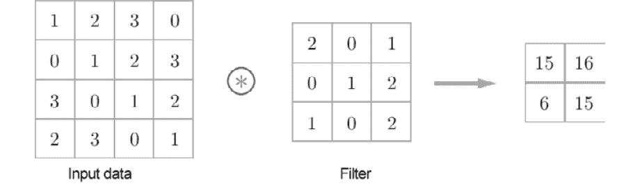
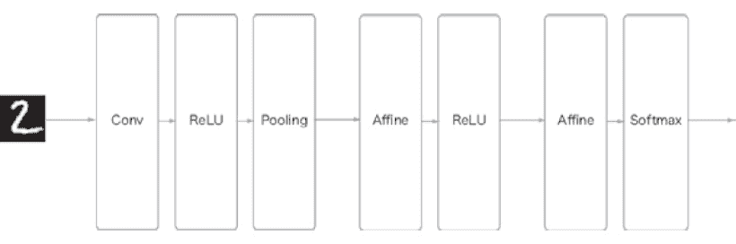

# 第八章：7. 卷积神经网络

本章介绍**卷积神经网络**（**CNN**）。CNN 广泛应用于 AI 领域，包括图像识别和语音识别。本章将详细讲解 CNN 的机制及如何在 Python 中实现它们。

## 总体架构

首先，让我们看看 CNN 的网络架构。你可以通过组合各层来创建 CNN，方法与我们之前看到的神经网络相似。然而，CNN 还有其他层：卷积层和池化层。我们将在接下来的部分详细探讨卷积层和池化层。本节将描述如何组合这些层来创建 CNN。

在我们迄今为止看到的神经网络中，所有相邻层的神经元都是连接的。这些层被称为**全连接**层，我们将它们实现为仿射层。例如，你可以使用仿射层创建一个由五个全连接层组成的神经网络，如*图 7.1*所示。

如*图 7.1*所示，在全连接神经网络中，激活函数的 ReLU 层（或 Sigmoid 层）跟随仿射层。在这里，经过四对**仿射 – ReLU**层后，接着是第五层的仿射层。最后，Softmax 层输出最终结果（概率）：


###### 图 7.1：由全连接层（仿射层）组成的示例网络

那么，CNN 的架构是什么样的呢？*图 7.2*展示了一个示例 CNN：


###### 图 7.2：示例 CNN – 添加了卷积层和池化层（它们显示为灰色矩形）

如*图 7.2*所示，CNN 具有额外的卷积层和池化层。在 CNN 中，各层按**卷积 – ReLU – （池化）**的顺序连接（池化层有时会省略）。我们可以将之前的**仿射 – ReLU**连接视为被“卷积 – ReLU – （池化）”替代。

在*图 7.2*中的 CNN 中，请注意靠近输出的层是之前的“仿射 – ReLU”对，而最后的输出层是之前的“仿射 – Softmax”对。这就是普通 CNN 中常见的结构。

## 卷积层

有一些 CNN 特有的术语，如填充和步幅。流经 CNN 中每一层的数据是具有特定形状的数据（如三维数据），这与之前的全连接网络不同。因此，当你第一次学习 CNN 时，可能会觉得它们很复杂。在这里，我们将深入探讨 CNN 中使用的卷积层的机制。

### 全连接层的问题

我们之前见过的完全连接神经网络使用了完全连接层（仿射层）。在完全连接层中，邻接层中的所有神经元都会连接在一起，并且输出的数量可以任意确定。

然而，完全连接层的问题在于，数据的形状被*忽略*了。例如，当输入数据是图像时，它通常具有三维形状，取决于高度、宽度和通道维度。然而，当这些三维数据提供给完全连接层时，必须转换为一维的平面数据。在我们之前使用的 MNIST 数据集的例子中，输入图像的形状是 1, 28, 28（1 个通道，高度为 28 像素，宽度为 28 像素），但这些元素被排列成一行，最终得到了 784 个数据点，并提供给了第一个仿射层。

假设一张图像具有三维形状，并且这种形状包含重要的空间信息。识别这些信息的关键模式可能隐藏在三维形状中。空间上接近的像素具有相似的值，RGB 通道彼此紧密相关，而远离的像素则没有关系。然而，完全连接层忽略了形状，将所有输入数据视为等价的神经元（具有相同维度的神经元），因此无法利用形状相关的信息。

另一方面，卷积层保持数据的形状。对于图像，它接收作为三维数据的输入，并将三维数据输出到下一层。因此，卷积神经网络（CNN）可以正确理解具有形状的数据，例如图像。

在卷积神经网络（CNN）中，卷积层的输入/输出数据有时被称为**特征图**。卷积层的输入数据叫做**输入特征图**，而卷积层的输出数据叫做**输出特征图**。在本书中，*输入/输出数据*和*特征图*将交替使用。

### 卷积操作

卷积层中执行的处理称为“卷积操作”，等同于图像处理中的“滤波操作”。让我们看一个例子（*图 7.3*）来理解卷积操作：



###### 图 7.3：卷积操作 – ⊛ 符号表示卷积操作

如*图 7.3*所示，卷积操作将滤波器应用于输入数据。在这个例子中，输入数据的形状有高度和宽度，滤波器的形状也是如此。当我们将数据和滤波器的形状表示为（高度，宽度）时，输入大小为（4，4），滤波器大小为（3，3），输出大小为（2，2）。一些文献中使用“核”这个词来表示“滤波器”。

现在，让我们来分析*图 7.3*中展示的卷积操作所执行的计算。*图 7.4*展示了卷积操作的计算过程。

卷积操作被应用到输入数据时，滤波器窗口按固定间隔滑动。这里的窗口指的是*图 7.4*中显示的灰色 3x3 区域。如*图 7.4*所示，滤波器的元素和输入的对应元素在每个位置上进行乘法和求和（这个计算有时称为**乘加操作**）。结果被存储在输出的对应位置。通过在所有位置执行这个过程，可以得到卷积操作的输出。

一个全连接神经网络有偏置和权重参数。在卷积神经网络（CNN）中，滤波器参数对应于之前的“权重”。它同样也有偏置。*图 7.3*中的卷积操作展示了滤波器应用的阶段。*图 7.5*展示了卷积操作的处理流程，包括偏置：


###### 图 7.4：卷积操作的计算过程


###### 图 7.5：卷积操作中的偏置 – 在应用滤波器后，向元素中添加一个固定值（偏置）

如*图 7.5*所示，偏置项在应用滤波器后被添加到数据中。在这里，偏置始终是一个固定值（1x1），即在滤波器应用后的四个数据元素中，每个都存在一个偏置。这个值会被加到滤波器应用后的所有元素中。

### 填充

在卷积层处理之前，有时会在输入数据周围填充固定数据（如 0）。这叫做**填充**，并且在卷积操作中经常使用。例如，在*图 7.6*中，对（4, 4）输入数据进行了填充 1。填充 1 意味着用一个像素宽度的零填充周围：


###### 图 7.6：卷积操作中的填充 – 在输入数据周围添加零（这里用虚线表示填充，零被省略）

如*图 7.6*所示，填充将（4, 4）输入数据转换为（6, 6）数据。在应用（3, 3）滤波器后，生成（4, 4）输出数据。在这个例子中，使用了填充 1。你可以设置任意整数值作为填充值，例如 2 或 3。如果填充值是 2，输入数据的大小将是（8, 8）。如果填充是 3，则大小为（10, 10）。

#### 注

填充主要用于调整输出大小。例如，当一个（3, 3）滤波器应用于（4, 4）输入数据时，输出大小为（2, 2）。输出大小比输入大小少了两个元素。这在深度网络中会引发一个问题，因为卷积操作会重复很多次。如果每次卷积操作都在空间上减小大小，输出大小最终会达到 1，这时就无法再进行卷积操作了。为避免这种情况，可以使用填充。在前面的例子中，当填充宽度为 1 时，输出大小（4, 4）与输入大小（4, 4）保持一致。因此，你可以在执行卷积操作后将相同空间大小的数据传递给下一层。

### 步幅

应用滤波器的位置间隔称为**步幅**。在之前的所有例子中，步幅为 1。例如，当步幅为 2 时，应用滤波器的窗口间隔为两个元素，如*图 7.7*所示。

在*图 7.7*中，使用步幅为 2 的滤波器应用于（7, 7）输入数据。当步幅为 2 时，输出大小变为（3, 3）。因此，步幅指定了应用滤波器的间隔。


###### 图 7.7：步幅为 2 的示例卷积操作

如我们所见，步幅越大，输出大小越小；填充越大，输出大小越大。我们如何用方程表示这些关系呢？让我们来看一下如何根据填充和步幅来计算输出大小。

这里，输入大小是(`H`, `W`)，滤波器大小是(*FH*, *FW*)，输出大小是(*OH*, *OW*)，填充是`P`，步幅是`S`。在这种情况下，你可以通过以下方程来计算输出大小，即方程（7.1）：

|  | （7.1） |
| --- | --- |

现在，让我们使用这个方程做一些计算：

1.  **示例 1：示例见图 7.6**

    输入大小：（4, 4），填充：1，步幅：1，滤波器大小：（3, 3）：

    

1.  **示例 2：示例见图 7.7**

    输入大小：（7, 7），填充：0，步幅：2，滤波器大小：（3, 3）：

    

1.  **示例 3**

    输入大小：（28, 31），填充：2，步幅：3，滤波器大小：（5, 5）：

    

正如这些例子所示，你可以通过赋值给方程（7.1）来计算输出大小。你只能通过赋值来获得输出大小，但请注意，你必须赋值以确保方程（7.1）中的和能被整除。如果输出大小不能整除（即结果是小数），你必须通过生成错误来处理这个问题。一些深度学习框架会在没有生成错误的情况下提前处理这个过程；例如，当无法整除时，它们会将值四舍五入到最接近的整数。

### 对三维数据进行卷积操作

到目前为止，我们查看的示例针对的是具有高度和宽度的二维形状。对于图像，我们必须处理具有通道维度、高度和宽度的三维数据。在这里，我们将使用之前示例中使用的相同技术，查看三维数据上的卷积操作示例。

*图 7.8* 显示了卷积操作的示例，而 *图 7.9* 显示了计算过程。在这里，我们可以看到在三维数据上执行卷积操作的结果。与二维数据（*图 7.3* 中的示例）相比，你可以看到特征图的深度（通道维度）增加了。如果在通道维度上有多个特征图，则对每个通道使用输入数据和滤波器执行卷积操作，并将结果相加以获得一个输出：


###### 图 7.8：三维数据的卷积操作


###### 图 7.9：三维数据的卷积操作计算过程

#### 注意

在三维卷积操作中，如本例所示，输入数据和滤波器在通道数上必须相同。在本例中，输入数据和滤波器的通道数相同，都是三。然而，你可以设置滤波器的大小为你喜欢的任何值。在本例中，滤波器的大小为 (3, 3)。你可以将其设置为任何大小，如 (2, 2)、(1, 1) 或 (5, 5)。然而，如前所述，通道数必须与输入数据的通道数相同。在本例中，必须是三。

### 思考块

在三维卷积操作中，你可以将数据和滤波器视为矩形块。这里的块是一个三维长方体，如*图 7.10*所示。我们将三维数据表示为一个多维数组，顺序为通道、高度、宽度。因此，当通道数为 C，高度为 H，宽度为 W 时，形状表示为 (C, H, W)。我们将以相同的顺序表示滤波器，因此当通道数为 C，高度为 **FH**（**滤波器高度**），宽度为 **FW**（**滤波器宽度**）时，滤波器的形状表示为 (C, FH, FW)：


###### 图 7.10：使用块来考虑卷积操作

在本例中，数据的输出是一个特征图。一个特征图意味着输出通道的大小为一。那么，如何在通道维度上提供多个卷积操作的输出呢？为此，我们使用多个滤波器（权重）。*图 7.11* 图示了这一点：


###### 图 7.11：具有多个滤波器的示例卷积操作

如 *图 7.11* 所示，当应用的滤波器数量为 FN 时，生成的输出地图数量也为 FN。通过组合 FN 地图，您可以创建形状为（FN，OH，OW）的块。将这个完成的块传递到下一层是 CNN 的过程。

您还必须考虑卷积操作中的滤波器数量。为此，我们将编写滤波器权重数据作为四维数据（output_channel，input_channel，height，width）。例如，当有 20 个具有三个通道的大小为 5 x 5 的滤波器时，表示为（20，3，5，5）。

卷积操作具有偏置项（类似于全连接层）。*图 7.12* 展示了在添加偏置项后 *图 7.11* 提供的示例。

正如我们所见，每个通道只有一个偏置数据。这里，偏置的形状是（FN，1，1），而滤波器输出的形状是（FN，OH，OW）。添加这两个块将相同的偏置值添加到滤波器输出结果的每个通道中，（FN，OH，OW）。NumPy 的广播功能有助于处理不同形状的块（请参考*第一章*中*Python 介绍*中的*广播*部分）：


###### 图 7.12：卷积操作流程（也添加了偏置项）

### 批处理

输入数据在神经网络处理中批处理。到目前为止，我们已经查看了对全连接神经网络的实现，支持批处理，这使得在训练过程中支持小批量更加高效。

我们还可以通过将每层数据流作为四维数据存储来支持卷积操作的批处理。具体来说，数据按顺序存储为（batch_num，channel，height，width）。例如，当对 N 个数据进行批处理中显示的处理时，数据的形状如下。

在此展示的批处理数据流中，每个数据片段的批次维度都添加在数据的开头。因此，数据作为四维数据通过每一层传递。请注意，在网络中流动的四维数据表示对 N 个数据进行卷积操作；即，同时进行 N 个处理：


###### 图 7.13：卷积操作流程（批处理）

## 池化层

池化操作使高度和宽度的空间变小。如 *图 7.14* 所示，它将一个 2 x 2 的区域转换为一个元素以减小空间的大小：


###### 图 7.14：最大池化过程

本例展示了当进行 2 x 2 最大池化，并且步幅为 2 时的过程。“最大池化”取区域内的最大值，而“2 x 2”表示目标区域的大小。如图所示，它取的是 2 x 2 区域内的最大元素。步幅在这个例子中是 2，因此 2 x 2 窗口每次移动两个元素。一般来说，池化窗口的大小和步幅使用相同的值。例如，3 x 3 窗口的步幅是 3，4 x 4 窗口的步幅是 4。

#### 注意

除了最大池化，还可以使用平均池化。最大池化取目标区域中的最大值，而平均池化则对目标区域内的值进行平均。在图像识别中，主要使用最大池化。因此，本书中的“池化层”指的就是最大池化。

### 池化层的特性

池化层具有多种特性，下面将进行描述。

**没有需要学习的参数**

与卷积层不同，池化层没有需要学习的参数。池化层没有需要学习的参数，因为它仅仅是在目标区域内取最大值（或对值进行平均）。

**通道数不变**

在池化中，输出数据的通道数与输入数据的通道数相同。如*图 7.15*所示，这一计算是独立地对每个通道进行的：


###### 图 7.15：池化不会改变通道数量

**对微小的位移变化具有鲁棒性**

即使输入数据发生轻微偏移，池化层也能返回相同的结果。因此，它对输入数据的微小位移变化具有鲁棒性。例如，在 3 x 3 池化中，池化能够吸收输入数据的位移，正如*图 7.16*所示：


###### 图 7.16：即使输入数据在宽度方向上移动了一个元素，输出仍然相同（可能因数据不同而有所不同）

## 实现卷积层和池化层

到目前为止，我们已经详细了解了卷积层和池化层。在本节中，我们将用 Python 实现这两个层。如《第五章 反向传播》中所述，这里实现的类同样提供了前向和后向方法，可以作为一个模块使用。

你可能觉得实现卷积和池化层比较复杂，但如果你使用某些“技巧”，就能轻松实现它们。本节将介绍这个技巧，使得当前的任务变得简单。接下来，我们将实现一个卷积层。

### 四维数组

如前所述，在 CNN 的每一层中，四维数据都会流动。例如，当数据的形状是 (10, 1, 28, 28) 时，表示有十块数据，每块数据的高度为 28，宽度为 28，并且只有 1 个通道。你可以在 Python 中如下实现：

```py
>>> x = np.random.rand(10, 1, 28, 28) # Generate data randomly
>>> x.shape
(10, 1, 28, 28)
```

要访问第一块数据，你可以写 `x[0]`（在 Python 中，索引从 0 开始）。同样，你可以写 `x[1]` 来访问第二块数据：

```py
>>> x[0].shape # (1, 28, 28)
>>> x[1].shape # (1, 28, 28)
```

要访问第一块数据中第一个通道的空间数据，你可以写如下内容：

```py
>>> x[0, 0] # or x[0][0]
```

你可以在 CNN 中通过这种方式处理四维数据。因此，卷积操作的实现可能会很复杂。然而，有一个被称为 `im2col` 的“技巧”使得这个任务变得简单。

### 通过 im2col 进行扩展

要实现卷积操作，通常需要多次嵌套 `for` 语句。这样的实现方式稍显麻烦，且在 NumPy 中使用 `for` 语句会降低处理速度（在 NumPy 中，最好不要使用 `for` 语句来访问元素）。在这里，我们不会使用任何 `for` 语句，而是使用一个简单的函数——`im2col` 来实现一个简单的实现。

`im2col` 函数便捷地为滤波器（权重）扩展输入数据。如 *图 7.17* 所示，`im2col` 将三维输入数据转换为二维矩阵（准确地说，它将包括批量数量的四维数据转换为二维数据）。

`im2col` 为滤波器（权重）便捷地扩展输入数据。具体来说，它将滤波器将在输入数据（一个三维块）上应用的区域扩展为一行，如 *图 7.18* 所示。`im2col` 扩展了所有应用滤波器的区域。

在 *图 7.18* 中，使用了大步幅，以使得滤波器区域不重叠。这是出于可视化的原因。在实际的卷积操作中，滤波器区域在大多数情况下会重叠，此时通过 `im2col` 扩展后的元素数量会比原始块中的更多。因此，使用 `im2col` 的实现存在一个缺点，就是比通常情况下消耗更多的内存。然而，将数据放入大矩阵对于计算机进行计算是有利的。例如，矩阵计算库（线性代数库）对矩阵计算进行了高度优化，可以快速乘大矩阵。因此，通过将输入数据转换为矩阵，你可以有效地使用线性代数库：


###### 图 7.17：im2col 概述


###### 图 7.18：从一开始就在行中扩展滤波器目标区域

#### 注意

`im2col` 这个名称是 "image to column"（图像到列）的缩写，意思是将图像转换为矩阵。深度学习框架如 Caffe 和 Chainer 提供了 `im2col` 函数，用于实现卷积层。

在使用`im2col`扩展输入数据后，你需要做的就是将卷积层的滤波器（权重）展开为一行，并将这两个矩阵相乘（见*图 7.19*）。这个过程几乎与全连接的仿射层相同：


###### 图 7.19：卷积操作中的滤波细节——将滤波器展开成列，并将矩阵与通过`im2col`扩展的数据相乘。最后，重塑输出数据的结果大小。

如*图 7.19*所示，使用`im2col`函数的输出是一个二维矩阵。你必须将二维输出数据转换为合适的形状，因为 CNN 将数据存储为四维数组。下一部分将介绍实现卷积层的流程。

### 实现卷积层

本书使用了`im2col`函数，我们将把它当作一个黑盒来使用，而不考虑它的实现。`im2col`的实现位于`common/util.py`。它是一个简单的函数，长度大约为 10 行。如果你感兴趣，请参考它。

这个`im2col`函数的接口如下：

```py
im2col (input_data, filter_h, filter_w, stride=1, pad=0)
```

+   `input_data`：由四维数组组成的输入数据（数据量、通道数、高度、宽度）

+   `filter_h`：滤波器的高度

+   `filter_w`：滤波器的宽度

+   `stride`：步长

+   `pad`：填充

`im2col`函数考虑了“滤波器大小”、“步长”和“填充”来将输入数据扩展为二维数组，具体如下：

```py
import sys, os
sys.path.append(os.pardir)
from common.util import im2col
x1 = np.random.rand(1, 3, 7, 7)
col1 = im2col(x1, 5, 5, stride=1, pad=0)
print(col1.shape) # (9, 75)
x2 = np.random.rand(10, 3, 7, 7)
col2 = im2col(x2, 5, 5, stride=1, pad=0)
print(col2.shape) # (90, 75)
```

上述代码展示了两个例子。第一个使用 7x7 的数据，批次大小为 1，通道数为 3。第二个使用相同形状的数据，批次大小为 10。当我们使用`im2col`函数时，在这两种情况下第二维的元素数量都是 75。这是滤波器中元素的总数（3 个通道，大小为 5x5）。当批次大小为 1 时，`im2col`的结果大小是(9, 75)。另一方面，当批次大小为 10 时，第二个例子的结果是(90, 75)，因为批次大小是 10，它可以存储 10 倍的数据。

现在，我们将使用`im2col`实现一个卷积层，作为一个名为`Convolution`的类：

```py
class Convolution:
    def __init__(self, W, b, stride=1, pad=0):
        self.W = W
        self.b = b
        self.stride = stride
        self.pad = pad
    def forward(self, x):
        FN, C, FH, FW = self.W.shape
        N, C, H, W = x.shape
        out_h = int(1 + (H + 2*self.pad - FH) / self.stride)
        out_w = int(1 + (W + 2*self.pad - FW) / self.stride)
        col = im2col(x, FH, FW, self.stride, self.pad)
        col_W = self.W.reshape(FN, -1).T # Expand the filter
        out = np.dot(col, col_W) + self.b
        out = out.reshape(N, out_h, out_w, -1).transpose(0, 3, 1, 2)
        return out
```

卷积层的初始化方法接受滤波器（权重）、偏置、步长和填充作为参数。滤波器是四维的，(`FN`、`C`、`FH` 和 `FW`)。`FN`表示滤波器数量（滤波器的个数），`C`表示通道数，`FH`表示滤波器的高度，`FW`表示滤波器的宽度。

在卷积层的实现中，一个重要的部分已经用粗体标出。在这里，`im2col`用来扩展输入数据，而`reshape`用来将滤波器扩展为二维数组。扩展后的矩阵被相乘。

扩展滤波器的代码段（前面代码中加粗的部分）将每个滤波器的块扩展为一行，如*图 7.19*所示。这里，`-1` 被指定为 `reshape (FN, -1)`，这是 `reshape` 的一个便捷特性。当 `reshape` 使用 `-1` 时，元素数量会自动调整以匹配多维数组中的元素数量。例如，一个形状为 (10, 3, 5, 5) 的数组总共有 750 个元素。此处指定 `reshape(10, -1)` 后，它会被重塑为形状为 (10, 75) 的数组。

`forward` 函数会在最后适当调整输出大小。这里使用了 NumPy 的 `transpose` 函数。`transpose` 函数改变多维数组中轴的顺序。如*图 7.20*所示，你可以指定从 0 开始的索引顺序，以改变轴的顺序。

因此，你可以几乎以与全连接的仿射层相同的方式实现卷积层的前向过程，通过使用 `im2col` 来进行扩展（详见*第五章*中的*实现仿射层与 Softmax 层*、*反向传播*）。接下来，我们将实现卷积层的反向传播。请注意，卷积层的反向传播必须执行 `im2col` 的反向操作。这由本书提供的 col2im 函数处理（位于 `common/util.py`）。除非使用 col2im，否则你可以像实现仿射层一样实现卷积层的反向传播。卷积层反向传播的实现位于 `common/layer.py`。


###### 图 7.20：使用 NumPy 的转置函数更改轴的顺序——指定索引（数字）以改变轴的顺序

### 实现池化层

在实现池化层时，可以像卷积层一样使用 `im2col` 来扩展输入数据。不同之处在于，池化操作不依赖于通道维度，这与卷积层不同。如*图 7.21*所示，目标池化区域在每个通道上独立扩展。

扩展后，你只需在扩展后的矩阵的每一行中取最大值，并将结果转变为适当的形状（*图 7.22*）。

这就是池化层中前向过程的实现方法。以下是一个 Python 示例实现：

```py
class Pooling:
    def __init__(self, pool_h, pool_w, stride=1, pad=0):
        self.pool_h = pool_h
        self.pool_w = pool_w
        self.stride = stride
        self.pad = pad
    def forward(self, x):
        N, C, H, W = x.shape
        out_h = int(1 + (H - self.pool_h) / self.stride)
        out_w = int(1 + (W - self.pool_w) / self.stride)
        # Expansion (1)
        col = im2col(x, self.pool_h, self.pool_w, self.stride, self.pad)
        col = col.reshape(-1, self.pool_h*self.pool_w)
        # Maximum value (2)
        out = np.max(col, axis=1)
        # Reshape (3)
        out = out.reshape(N, out_h, out_w, C).transpose(0, 3, 1, 2)
            return out
```


###### 图 7.21：扩展输入数据的目标池化区域（2x2 池化）

如*图 7.22*所示，实现池化层时有三个步骤：

1.  扩展输入数据。

1.  在每行中取最大值。

1.  适当调整输出形状。

每个步骤的实现都很简单，只有一两行代码：


###### 图 7.22：池化层实现的流程——池化区域中的最大元素以灰色显示

#### 注意

你可以使用 NumPy 的`np.max`方法来获取最大值。通过在`np.max`中指定`axis`参数，你可以沿指定的轴获取最大值。例如，`np.max(x, axis=1)`返回`x`在第一维每个轴上的最大值。

这就是池化层前向过程的全部内容。如图所示，在将输入数据扩展成适合池化的形状后，后续的实现非常简单。

对于池化层中的反向过程，`max`的反向传播（用于*第五章*中*ReLU 层*小节中的 ReLU 层实现），提供了更多的信息。池化层的实现位于`common/layer.py`。

## 实现一个 CNN

到目前为止，我们已经实现了卷积和池化层。现在，我们将结合这些层，创建一个可以识别手写数字的卷积神经网络（CNN）并实现它，如*图 7.23*所示。

如*图 7.23*所示，网络由“卷积 – ReLU – 池化 – 仿射 – ReLU – 仿射 – Softmax”层组成。我们将实现它作为一个名为`SimpleConvNet`的类：



###### 图 7.23：简单 CNN 的网络配置

现在，让我们来看看`SimpleConvNet (__init__)`的初始化。它接受以下参数：

+   `input_dim`：输入数据的维度（**通道**，**高度**，**宽度**）。

+   `conv_param`：卷积层的超参数（字典）。以下是字典的键：

+   `filter_num`：滤波器的数量

+   `filter_size`：滤波器的大小

+   `stride`：步幅

+   `pad`：填充

+   `hidden_size`：隐藏层中的神经元数量（全连接）

+   `output_size`：输出层中的神经元数量（全连接）

+   `weight_init_std`：初始化时权重的标准差

这里，卷积层的超参数作为一个名为`conv_param`的字典提供。我们假设所需的超参数值存储为`{'filter_num':30, 'filter_size':5, 'pad':0, 'stride':1}`。

`SimpleConvNet`初始化的实现稍微长一些，所以这里将其分成三个部分，以便更容易理解。以下代码展示了初始化过程的第一部分：

```py
class SimpleConvNet:
    def __init__(self, input_dim=(1, 28, 28),
                conv_param={'filter_num':30, 'filter_size':5,
                    'pad':0, 'stride':1},
                hidden_size=100, output_size=10, weight_init_std=0.01):
        filter_num = conv_param['filter_num']
        filter_size = conv_param['filter_size']
        filter_pad = conv_param['pad']
        filter_stride = conv_param['stride']
        input_size = input_dim[1]
        conv_output_size = (input_size - filter_size + 2*filter_pad) / \
                        filter_stride + 1
        pool_output_size = int(filter_num * (conv_output_size/2) *(conv_output_size/2))
```

这里，初始化参数提供的卷积层超参数从字典中提取（以便我们可以在后续使用）。然后，计算卷积层的输出大小。以下代码初始化了权重参数：

```py
    self.params = {}
    self.params['W1'] = weight_init_std * \
    np.random.randn(filter_num, input_dim[0],
    filter_size, filter_size)
    self.params['b1'] = np.zeros(filter_num)
    self.params['W2'] = weight_init_std * \
    np.random.randn(pool_output_size,hidden_size)
    self.params['b2'] = np.zeros(hidden_size)
    self.params['W3'] = weight_init_std * \
    np.random.randn(hidden_size, output_size)
    self.params['b3'] = np.zeros(output_size)
```

训练所需的参数是第一层（卷积层）和剩余的两层全连接层的权重和偏置。这些参数存储在实例字典变量`params`中。`W1`键用于表示第一层（卷积层）的权重，`b1`键用于表示第一层（卷积层）的偏置。同样，`W2`和`b2`键分别用于表示第二层（全连接层）的权重和偏置，`W3`和`b3`键分别用于表示第三层（全连接层）的权重和偏置。最后，所需的层被生成，具体如下：

```py
    self.layers = OrderedDict( )
    self.layers['Conv1'] = Convolution(self.params['W1'],
                                self.params['b1'],
                                conv_param['stride'],
                                conv_param['pad'])
    self.layers['Relu1'] = Relu( )
    self.layers['Pool1'] = Pooling(pool_h=2, pool_w=2, stride=2)
    self.layers['Affine1'] = Affine(self.params['W2'],
                                self.params['b2'])
    self.layers['Relu2'] = Relu( )
    self.layers['Affine2'] = Affine(self.params['W3'],
                                self.params['b3'])
    self.last_layer = SoftmaxWithLoss( )
```

层按适当顺序添加到有序字典（`OrderedDict`）中。只有最后一层`SoftmaxWithLoss`被添加到另一个变量`last-layer`中。

这是`SimpleConvNet`的初始化。在初始化之后，您可以实现`predict`方法来进行预测，以及`loss`方法来计算损失函数的值，具体如下：

```py
def predict(self, x):
    for layer in self.layers.values( ):
        x = layer.forward(x)
    return x
def loss(self, x, t):
    y = self.predict(x)
return self.lastLayer.forward(y, t)
```

这里，`x`参数是输入数据，`t`参数是标签。`predict`方法只按顺序调用添加的各层，将结果传递到下一层。除了`predict`方法中的前向处理外，`loss`方法在最后一层`SoftmaxWithLoss`之前执行前向处理。

以下实现通过反向传播获得梯度，具体如下：

```py
def gradient(self, x, t):
    # forward
    self.loss(x, t)
    # backward
    dout = 1
    dout = self.lastLayer.backward(dout)
    layers = list(self.layers.values( ))
    layers.reverse( )
    for layer in layers:
        dout = layer.backward(dout)
    # Settings
    grads = {}
    grads['W1'] = self.layers['Conv1'].dW
    grads['b1'] = self.layers['Conv1'].db
    grads['W2'] = self.layers['Affine1'].dW
    grads['b2'] = self.layers['Affine1'].db
    grads['W3'] = self.layers['Affine2'].dW
    grads['b3'] = self.layers['Affine2'].db
    return grads
```

使用反向传播来获得参数的梯度。为此，前向传播和后向传播依次进行。由于每一层的前向和后向传播都已正确实现，这里只需要按适当顺序调用它们。最后，每个权重参数的梯度存储在`grads`字典中。因此，您可以实现`SimpleConvNet`。

现在，让我们使用 MNIST 数据集来训练`SimpleConvNet`类。训练的代码几乎与《第四章，神经网络训练》中的*实现训练算法*部分描述的相同。因此，这里不再展示代码（源代码位于`ch07/train_convnet.py`）。

当使用`SimpleConvNet`训练 MNIST 数据集时，训练数据的识别准确率为 99.82%，测试数据的识别准确率为 98.96%（不同的训练可能导致略有不同的识别准确率）。对于一个相对较小的网络，99%的测试数据识别准确率已经非常高。在下一章，我们将添加更多层，创建一个测试数据识别准确率超过 99%的网络。

如我们所见，卷积层和池化层是图像识别中不可或缺的模块。卷积神经网络（CNN）能够读取图像的空间特征，并在手写数字识别中达到高精度。

## 可视化卷积神经网络（CNN）

卷积神经网络（CNN）中的卷积层“看到”什么？在这里，我们将可视化卷积层，探索卷积神经网络中的运作。

### 可视化第一层的权重

之前，我们对 MNIST 数据集进行了简单的 CNN 训练。第一层（卷积层）权重的形状为（30, 1, 5, 5）。它的尺寸为 5x5，具有 1 个通道和 30 个过滤器。当过滤器的尺寸为 5x5 且具有 1 个通道时，它可以被视为一个单通道灰度图像。现在，让我们将卷积层（第一层）的过滤器作为图像展示。在这里，我们将比较训练前后的权重。*图 7.24* 展示了结果（源代码位于 `ch07/visualize_filter.py`）：


###### 图 7.24：训练前后第一层（卷积层）权重。权重的元素是实数，但它们在 0 到 255 之间进行归一化，以便展示图像，最小值为黑色（0），最大值为白色（255）。

如*图 7.24*所示，训练前的过滤器是随机初始化的。黑白色调没有任何规律。另一方面，训练后的过滤器是具有某种模式的图像。一些过滤器从白色到黑色有渐变，而一些过滤器有小的颜色区域（称为“斑点”），这表明训练为过滤器提供了模式。

在*图 7.24*的右侧，具有模式的过滤器“看到了”边缘（颜色的边界）和斑点。例如，当一个过滤器的左半部分为白色、右半部分为黑色时，它对垂直边缘做出了反应，如*图 7.25*所示。

*图 7.25* 展示了选择两个学习到的过滤器并对输入图像进行卷积处理时的结果。你可以看到“过滤器 1”对垂直边缘做出了反应，而“过滤器 2”对水平边缘做出了反应：


###### 图 7.25：过滤器对水平和垂直边缘的反应。输出图像 1 中的垂直边缘处出现了白色像素。与此同时，输出图像 2 中的水平边缘处出现了许多白色像素。

因此，你可以看到卷积层中的过滤器提取了诸如边缘和斑点等基本信息。之前实现的 CNN 将这些基本信息传递给后续层。

### 使用层次结构提取信息

上述结果来自第一个（卷积）层。它提取了低级信息，如边缘和斑点。那么，具有多层的 CNN 中的每一层提取了什么类型的信息呢？关于深度学习中的可视化研究[*Matthew D. Zeiler 和 Rob Fergus (2014): 可视化和理解卷积网络。在 David Fleet, Tomas Pajdla, Bernt Schiele, & Tinne Tuytelaars 编辑的《计算机视觉 – ECCV 2014》一书中，Lecture Notes in Computer Science. Springer International Publishing，818 – 833*]和[*A. Mahendran 和 A. Vedaldi (2015): 通过反转深度图像表示理解它们。在 2015 年 IEEE 计算机视觉与模式识别会议（CVPR）上，5188 – 5196\. DOI:* ([`dx.doi.org/10.1109/CVPR.2015.7299155`](http://dx.doi.org/10.1109/CVPR.2015.7299155))]中指出，越深的层，提取的信息越抽象（更准确地说，是反应强烈的神经元）。

## 典型的 CNN

迄今为止，已经提出了多种不同架构的卷积神经网络（CNN）。在本节中，我们将介绍两个重要的网络。其中一个是 LeNet（*Y. Lecun, L. Bottou, Y. Bengio, 和 P. Haffner (1998): 基于梯度的学习应用于文档识别。《IEEE 86 卷，11 期》（1998 年 11 月），2278 – 2324\. DOI*: ([`dx.doi.org/10.1109/5.726791`](http://dx.doi.org/10.1109/5.726791)))。它是最早的 CNN 之一，并于 1998 年首次提出。另一个是 AlexNet（*Alex Krizhevsky, Ilya Sutskever, 和 Geoffrey E. Hinton (2012): 基于深度卷积神经网络的 ImageNet 分类。在 F. Pereira, C. J. C. Burges, L. Bottou, & K. Q. Weinberger 编辑的《神经信息处理系统进展 25》一书中，Curran Associates，Inc.，1097 – 1105*）。它在 2012 年提出，引起了人们对深度学习的关注。

### LeNet

LeNet 是一个用于手写数字识别的网络，提出于 1998 年。在该网络中，卷积层和池化层（即只“稀疏元素”的子采样层）被重复使用，最后通过全连接层输出结果。

LeNet 与“当前 CNN”之间确实存在一些差异。一个是激活函数的不同，LeNet 使用的是 sigmoid 函数，而现在主要使用 ReLU。原始 LeNet 中使用了子采样来减少中间数据的大小，而现在主要使用最大池化：

这样，LeNet 与“当前 CNN”之间存在一些差异，但差异并不显著。考虑到 LeNet 几乎是 20 年前提出的“第一个 CNN”，这一点令人惊讶。

### AlexNet

AlexNet 发布距 LeNet 提出已有近 20 年。尽管 AlexNet 引发了深度学习的热潮，但其网络架构与 LeNet 相比变化不大：

AlexNet 将卷积层和池化层堆叠，并通过全连接层输出结果。它的架构与 LeNet 差异不大，但也有一些不同之处，如下所示：

+   使用 ReLU 作为激活函数

+   使用了一种名为**局部响应归一化**（**LRN**）的局部归一化层。

+   使用了 Dropout（请参见*第六章*中的*Dropout*小节，*训练技巧*）。

LeNet 和 AlexNet 在网络架构上没有太大区别。然而，周围的环境和计算机技术有了显著进步。现在，人人都能获取大量数据，而且广泛使用的 GPU 擅长进行大规模并行计算，从而能够以高速进行大规模操作。大数据和 GPU 极大地推动了深度学习的发展。

#### 注意

深度学习中通常存在许多参数（即网络具有许多层）。训练需要大量计算，而且需要大量数据来“满足”这些参数。我们可以说，GPU 和大数据为解决这些挑战提供了帮助。

## 总结

在本章中，我们学习了 CNN。具体来说，我们详细讨论了卷积层和池化层（构成 CNN 的基本模块），以便从实现的角度理解它们。CNN 主要用于处理与图像相关的数据。在继续学习之前，请确保你理解了本章的内容。

本章我们学习了以下内容：

+   在 CNN 中，卷积层和池化层被添加到之前由全连接层组成的网络中。

+   你可以使用`im2col`（一个用于将图像扩展为数组的函数）来简洁高效地实现卷积层和池化层。

+   可视化 CNN 可以让你看到随着网络层次变深，如何提取更高级的信息。

+   典型的 CNN 包括 LeNet 和 AlexNet。

+   大数据和 GPU 对深度学习的发展有着重要的推动作用。
