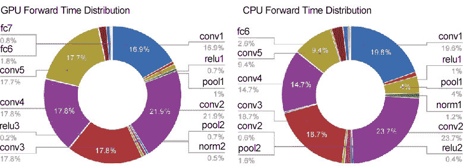

# 第九章：8\. 深度学习

深度学习是一种基于深度神经网络的机器学习方法。通过向我们迄今为止描述的网络中添加层，你可以创建一个深度网络。然而，深度网络也存在一些问题。本章将介绍深度学习的特点、问题与可能性，以及当前深度学习实践的概述。

## 使网络更深

在本书中，我们已经学习了很多关于神经网络的知识，包括构成神经网络的各种层、训练中使用的有效技巧、尤其适用于图像处理的卷积神经网络（CNN）以及如何优化参数。这些都是深度学习中的重要技巧。在这里，我们将整合到目前为止学到的技巧，创建一个深度网络。接着，我们将尝试使用 MNIST 数据集进行手写数字识别。

### 更深的网络

首先，我们将创建一个具有*图 8.1*中所示网络架构的 CNN。这个网络基于 VGG 网络，下一节将对此进行描述。

如*图 8.1*所示，网络比我们迄今为止实现的网络要深。这里使用的所有卷积层都是小的 3x3 卷积核。在这里，随着网络的加深，通道数变得更大（卷积层中的通道数从第一层的 16 增加到 16、32、32、64 和 64）。如你所见，池化层被插入以逐渐减少中间数据的空间大小，同时丢弃层用于后续的全连接层：

###### 图 8.1：用于手写数字识别的深度 CNN

该网络使用"He 初始化器"来初始化权重，并使用 Adam 来更新权重参数，从而具有以下特点：

+   使用小的 3×3 卷积核的卷积层

+   ReLU 作为激活函数

+   在全连接层后使用的丢弃层

+   优化由 Adam 进行

+   "He 初始化器"用于初始权重值

正如这些特点所示，*图 8.1*中的网络使用了我们迄今为止学到的许多神经网络技巧。现在，我们来使用这个网络进行训练。结果表明，这个网络的识别准确率为 99.38%（最终的识别准确率可能略有不同，但该网络通常会超过 99%）。

#### 注意

实现*图 8.1*中显示的网络的源代码位于`ch08/deep_convnet.py`。用于训练的代码在`ch08/train_deepnet.py`中提供。你可以使用这些代码来重现这里进行的训练。深度网络的训练需要大量时间（可能超过半天）。本书提供了在`ch08/deep_conv_net_params.pkl`中的训练权重参数。`deep_convnet.py`代码文件提供了一个加载训练参数的功能，你可以根据需要使用它。

如*图 8.1*所示，网络的错误率仅为 0.62%。在这里，我们可以看到哪些图像被错误地识别了。*图 8.2*展示了识别错误的示例：

###### 图 8.2：识别错误的示例图像——每个图像的左上角显示正确标签，而右下角则显示该网络的预测结果

如*图 8.2*所示，这些图像即使对我们人类来说也很难识别。左上角的图像看起来像是“0”（正确答案是“6”），旁边的图像显然像是“5”（正确答案是“3”）。一般来说，“1”和“7”，“0”和“6”，“3”和“5”之间的区别很难区分。这些示例解释了为什么它们被错误识别。

尽管这个深度卷积神经网络（CNN）非常精确，但它以与人类相似的方式错误地识别了图像。这也向我们展示了深度卷积神经网络的巨大潜力。

### 提高识别准确性

名为“这个图像属于什么类别？”的网站（*Rodrigo Benenson 的博客* “*分类数据集结果*”（[`rodrigob.github.io/are_we_there_yet/build/classification_datasets_results.html`](http://rodrigob.github.io/are_we_there_yet/build/classification_datasets_results.html)））根据相关文献中发布的技术对各种数据集的识别准确率进行了排名（见*图 8.3*）：

###### 图 8.3：MNIST 数据集的排名技术

#### 注意

*图 8.3*摘自参考文献，*Rodrigo Benenson 的博客* “*分类数据集结果*”（[`rodrigob.github.io/are_we_there_yet/build/classification_datasets_results.html`](http://rodrigob.github.io/are_we_there_yet/build/classification_datasets_results.html)），数据截至 2016 年 6 月。

在*图 8.3*中显示的排名中，“神经网络”、“深度”和“卷积”等关键词十分显眼。许多排名靠前的技术基于 CNN。截至 2016 年 6 月，MNIST 数据集的最高识别准确率为 99.79%（错误率为 0.21%），该技术同样是基于 CNN 的（*Li Wan, Matthew Zeiler, Sixin Zhang, Yann L. Cun, 和 Rob Fergus（2013）：使用 DropConnect 对神经网络进行正则化。发表于 Sanjoy Dasgupta & David McAllester 编辑的《第 30 届国际机器学习会议（ICML2013）论文集》。JMLR 工作坊和会议记录，1058-1066*）。这里使用的 CNN 并不深（包含两层卷积层和两层全连接层）。

#### 注意

对于 MNIST 数据集，即使网络不是很深，也可以立即获得最高的准确率。对于像手写数字识别这样相对简单的问题，网络的表示能力不需要非常高。因此，增加层数并不是很有益。在大规模的通用目标识别过程中，增加网络的层数可以大大提高识别精度，因为这是一个复杂的问题。

通过检查上述高排名的技术，我们可以找到一些进一步提高识别准确率的技术和技巧。例如，我们可以看到，集成学习、学习率衰减和**数据增强**都有助于提高识别准确率。数据增强是一种简单但特别有效的提高识别准确率的方法。

数据增强使用一种算法来人工扩展输入图像（训练图像）。如*图 8.4*所示，它通过旋转或垂直/水平移动稍微改变输入图像来增加图像。当数据集中的图像数量有限时，这种方法尤其有效：

###### 图 8.4：样本数据增强

你可以通过多种方式使用数据增强来扩展图像，而不仅仅是*图 8.4*中所示的修改。例如，你可以裁剪图像的一部分（或剪裁）或水平翻转图像（称为翻转，但这仅在图像的对称性不需要考虑时有效）。对于普通图像，改变它们的外观（例如，通过调整亮度和缩放它们）也是有效的。如果你可以通过数据增强增加训练图像的数量，你可以通过深度学习提高识别准确率。虽然这看起来是一个简单的技巧，但它通常能带来良好的结果。我们在这里不实现数据增强。由于实现这一点非常简单，如果你有兴趣，可以自己尝试。

### 更深网络的动机

关于让网络变深的重要性，仍有很多未解之谜。尽管目前的理论研究尚不足够，但过去的研究和实验可以在某种程度上解释一些事情（相对直观）。本节将提供一些数据和解释，支持“让网络变深”这一观点的重要性。

首先，来自大规模图像识别竞赛（如 ILSVRC）的结果显示了“让网络变深”的重要性（详细信息请参见下一节）。这些结果表明，许多近期排名靠前的技术都基于深度学习，并且网络往往会变得更深。网络越深，识别性能越好。

其中一个优势是你可以减少网络中的参数数量。当网络变得更深时，可以用更少的参数实现相似（或更高）的表现。考虑到卷积操作中的滤波器大小，这一点很容易理解。*图 8.5* 显示了一个具有 5x5 滤波器的卷积层。

请注意，每个输出数据节点计算时所依据的输入数据区域。当然，每个输出节点都基于示例中*图 8.5*所示的输入数据的 5x5 区域。那么，现在我们来思考一个 3x3 卷积操作重复两次的情况，如*图 8.6*所示。在这种情况下，中间数据是基于每个输出节点的 3x3 区域。那么，前一个输入数据的哪个区域是中间数据的 3x3 区域依据的呢？当你仔细查看*图 8.6*时，你会发现它是基于一个 5×5 区域的。因此，*图 8.6*中的输出数据“查看”了输入数据的 5×5 区域进行计算：

###### 图 8.5：5x5 卷积操作示例

###### 图 8:6：3x3 卷积操作重复两次的示例

一个 5x5 卷积操作的区域相当于两个 3x3 卷积操作的区域。前者使用 25 个参数（5x5），而后者总共使用 18 个参数（2x3x3）。因此，多个卷积层减少了参数数量。随着网络加深，减少的参数数量会变得更大。例如，当 3x3 卷积操作重复三次时，参数总数为 27。为了通过一次卷积操作“查看”相同的区域，需要一个 7x7 的滤波器，这意味着参数数量上升至 49。

#### 注意

通过多次应用小卷积核使网络更深的优势在于它可以减少参数数量并扩展**感受野**（改变神经元的局部空间区域）。当你增加层数时，卷积层之间会放置一个激活函数，如 ReLU，从而改进网络表示。这是因为激活函数对网络施加了“非线性”力量。多个非线性函数能够表达更复杂的特征。

训练效率是使网络更深的另一个优势。更深的网络可以减少训练数据并快速进行训练。你可以通过记住在*第七章*《卷积神经网络》中的*可视化 CNN*部分提供的描述来直观地理解这一点。在该部分，你了解到 CNN 中的卷积层是分层提取信息的。在前面的卷积层中，神经元对简单的形状（如边缘）做出反应。随着层次的加深，神经元对更加复杂的形状做出反应，比如纹理和物体部分。

以这样的网络层次结构为基础，考虑识别“狗”的问题。要在浅层网络中解决这个问题，卷积层必须同时“理解”狗的许多特征。狗有多种类型，它们的外貌因拍摄图像的环境不同而有所变化。因此，理解狗的特征需要多样的训练数据和大量的训练时间。

然而，你可以通过加深网络来将问题进行层次化学习。这样，每一层学习的任务变得更简单。例如，第一层可以集中学习边缘。因此，网络可以通过少量的训练数据高效学习。这是因为包含边缘的图像数量大于包含狗的图像数量，边缘的模式也比狗的模式简单。

同样重要的是，通过加深网络，你可以层次化地传递信息。例如，提取边缘的下一层可以利用边缘信息，因此我们可以期望它能够高效地学习更高级的模式。简而言之，通过加深网络，你可以将每一层学习的问题分解成“容易解决的简单问题”，从而期望高效的训练。

这就是支持“加深网络”重要性的解释。请注意，近年来更深层的网络得益于新的技术和环境，如大数据和计算能力，这些都使得深度网络能够正确训练。

## 深度学习简史

据说深度学习之所以在大规模图像识别竞赛中引起广泛关注，是因为**ImageNet 大规模视觉识别挑战赛**（**ILSVRC**）于 2012 年举行。在比赛中，一种名为 AlexNet 的深度学习技术取得了压倒性的胜利，颠覆了传统的图像识别方法。自 2012 年深度学习反击以来，它一直在随后的竞赛中扮演着主导角色。在这里，我们将探讨当前深度学习在大规模图像识别竞赛（即 ILSVRC）中的趋势。

### ImageNet

ImageNet (*J. Deng, W. Dong, R. Socher, L.J. Li, Kai Li, 和 Li Fei-Fei (2009)：ImageNet：一个大规模层次化图像数据库*。在 IEEE 计算机视觉与模式识别大会，2009 年。CVPR 2009。248–255。DOI*：([`dx.doi.org/10.1109/CVPR.2009.5206848`](http://dx.doi.org/10.1109/CVPR.2009.5206848))) 是一个包含超过 100 万张图像的数据集。如*图 8.7*所示，它包含了各种类型的图像，每张图像都与一个标签（类别名）相关联。每年都会使用这个庞大的数据集举行一个名为 ILSVRC 的图像识别比赛：

###### 图 8.7: 大规模 ImageNet 数据集中的示例数据

#### 注

*图 8.7* 引自参考文献，*J. Deng, W. Dong, R. Socher, L.J. Li, Kai Li, 和 Li Fei-Fei (2009): ImageNet: A large-scale hierarchical image database*。收录于 IEEE 计算机视觉与模式识别会议 *Computer Vision and Pattern Recognition, 2009\. CVPR 2009\. 248 – 255\. DOI:* ([`dx.doi.org/10.1109/CVPR.2009.5206848`](http://dx.doi.org/10.1109/CVPR.2009.5206848))。

ILSVRC 比赛提供了一些测试项目，其中一个是“分类”（在“分类”项目中，1,000 个类别通过识别准确率进行竞赛）。*图 8.8*显示了自 2010 年以来 ILSVRC 分类项目的获胜队伍结果。在这里，如果前五个预测中包含正确的类别，则认为分类是“正确的”。以下条形图展示了错误率：

###### 图 8.8: ILSVRC 比赛获胜队伍的结果—纵坐标显示错误率，横坐标显示年份。队伍名称或技术名称显示在横坐标上的括号内。

请注意从前面的图表中可以看出，自 2012 年以来，深度学习技术一直处于领先地位。实际上，我们可以看到，在 2012 年，AlexNet 显著降低了错误率。从那时起，深度学习技术在准确性方面稳步提升。这一点在 2015 年的 ResNet 中尤为明显，ResNet 是一个具有超过 150 层的深度网络，并且将错误率降至 3.5%。甚至有人说，这一结果超过了普通人类的识别能力。

在过去几年中，取得显著成果的深度学习网络中，VGG、GoogLeNet 和 ResNet 最为著名。你会在许多与深度学习相关的地方遇到它们。接下来我将简要介绍这三种著名网络。

### VGG

VGG 是一个“基础”卷积神经网络（CNN），由卷积层和池化层组成。如*图 8.9*所示，它可以拥有最多 16 层（或 19 层）带权重的层（卷积层和全连接层），使得网络更深，并且根据层数的不同，有时被称为“VGG16”或“VGG19”：

###### 图 8.9: VGG

#### 注

*图 8.9* 引自参考文献，*Karen Simonyan 和 Andrew Zisserman (2014): Very Deep Convolutional Networks for Large-Scale Image Recognition. arXiv:1409.1556[cs] (2014 年 9 月)*。

VGG 包含连续的卷积层，并使用小的 3x3 滤波器。如前图所示，两个或四个连续的卷积层和一个池化层将尺寸减半，并且这一过程会重复进行。最终，结果通过全连接层给出。

#### 注

VGG 在 2014 年的比赛中获得了第二名（接下来的 GoogLeNet 获得了 2014 年的冠军）。它的性能不如第一名的网络，但许多工程师更喜欢使用基于 VGG 的网络，因为其结构非常简单且具有广泛的适用性。

### GoogLeNet

*图 8.10* 显示了 GoogLeNet 的网络架构。矩形表示各种层，例如卷积层和池化层：

###### 图 8.10：GoogLeNet

#### 注意

*图 8.10* 和 *图 8.11* 引自 *Christian Szegedy 等人 (2015)：通过卷积更深。发表于 IEEE 计算机视觉与模式识别大会（CVPR）*。

当你观察它时，网络架构似乎非常复杂，但本质上与 CNN 的架构相似。GoogLeNet 的独特之处在于，网络不仅在垂直方向上有深度，而且在水平方向上也有深度（扩展）。

GoogLeNet 在水平方向上有“宽度”。它被称为“inception 架构”，并基于*图 8.11*所示的结构：

###### 图 8.11：GoogLeNet 的 Inception 架构

如*图 8.11*所示，Inception 架构应用了多种不同大小的滤波器（及池化）并将结果合并。将这一 Inception 架构作为一个构建模块（组件）是 GoogLeNet 的主要特点。

GoogLeNet 在许多地方使用 1x1 滤波器的卷积层。这种 1x1 卷积操作减少了通道方向上的大小，从而减少了参数的数量并加速了处理。

### ResNet

ResNet (*Kaiming He, Xiangyu Zhang, Shaoqing Ren, and Jian Sun (2015): 深度残差学习用于图像识别. arXiv:1512.03385[cs] (2015 年 12 月)*) 是微软团队开发的网络。其特点是具有一种“机制”，能够使网络比以往更深。

增加网络深度对提高其性能非常重要。然而，当网络变得过深时，深度学习就会失败，最终性能通常较差。为了解决这个问题，ResNet 引入了“跳跃架构”（也称为“快捷方式”或“旁路”）。通过引入这一跳跃架构，随着网络深度的增加，性能可以得到提升（尽管深度有一定限制）。

跳跃架构跳过输入数据中的卷积层，将输入数据添加到输出中，如*图 8.12*所示：

###### 图 8.12：ResNet 的组成——这里的“权重层”表示一个卷积层

#### 注意

*图 8.12* 和 *图 8.13* 引自文献，*Kaiming He, Xiangyu Zhang, Shaoqing Ren, and Jian Sun (2015): 深度残差学习用于图像识别. arXiv:1512.03385[cs] (2015 年 12 月)*。

在*图 8.12*中，输入*x*通过跳过两个连续的卷积层与输出相连。两个卷积层的输出本来是*F(x)*，而跳跃架构则将其改为*F(x) + x*。

采用这种跳跃架构使得即使网络很深，也能够高效地进行学习。这是因为跳跃架构在反向传播时传递信号而不发生衰减。

#### 注意

跳跃架构只将输入数据“原样”传递。在反向传播时，它也将来自上游的梯度“原样”传递给下游，不会发生变化。因此，你不需要担心梯度变小（或过大）的问题。你可以预期“有意义的梯度”会传递到前面的层。你也可以预期跳跃架构能够缓解传统的梯度消失问题，避免随着网络加深，梯度逐渐减小。

ResNet 基于我们之前描述的 VGG 网络，并采用跳跃架构使网络更深。*图 8.13*展示了这一结果：

###### 图 8.13：ResNet – 块支持 3x3 卷积层。其特点是跳跃架构，即跳过某些层。

如*图 8.13*所示，ResNet 跳过了两个卷积层，从而使得网络更深。实验表明，即使网络包含 150 层或更多层，识别精度仍然持续提高。在 ILSVRC 比赛中，它取得了 3.5%的惊人结果（即错误率，表示正确类别未包含在前 5 个预测中的比例）。

#### 注意

使用巨大的 ImageNet 数据集训练的权重数据通常能够有效地使用。这被称为**迁移学习**。将部分训练好的权重复制到另一个神经网络中进行微调。例如，提供一个与 VGG 结构相同的网络。将训练好的权重作为初始值，并针对新数据集进行微调。当数据集较少时，迁移学习尤其有效。

## 加速深度学习

大数据和大规模网络要求在深度学习中进行大量操作。我们迄今为止使用了 CPU 进行计算，但仅仅依靠 CPU 不足以应对深度学习的需求。实际上，许多深度学习框架支持**图形处理单元**（**GPU**）来快速处理大量操作。最近的框架开始通过使用多个 GPU 或机器来支持分布式学习。本节描述了加速深度学习计算的方法。我们在第 8.1 节中结束了深度学习的实现。在这里，我们不会实现所描述的加速（例如 GPU 的支持）。

### 面临的挑战

在讨论加速深度学习之前，我们先来看一下深度学习中哪些过程需要消耗时间。*图 8.14*中的饼图展示了 AlexNet 在前向处理过程中各类操作所消耗的时间：

###### 图 8.14：AlexNet 前向处理过程中各层所花时间的百分比——左侧图表显示 GPU 时间，右侧图表显示 CPU 时间

这里，“conv”表示卷积层，“pool”表示池化层，“fc”表示全连接层，“norm”表示归一化层（引用自*贾扬清（2014）：大规模学习语义图像表示。博士论文，加利福尼亚大学伯克利分校电子电气计算机系，2014 年 5 月*，[`www.eecs.berkeley.edu/Pubs/TechRpts/2014/EECS-2014-93.html`](http://www.eecs.berkeley.edu/Pubs/TechRpts/2014/EECS-2014-93.html))）。

如你所见，卷积层在 AlexNet 中花费了大量的时间。实际上，卷积层的总处理时间占 GPU 时间的 95%和 CPU 时间的 89%！因此，在卷积层进行快速高效的操作是深度学习的主要挑战。*图 8.14*展示了推理阶段的结果，但卷积层在训练阶段也花费了大量时间。

#### 注释

如在*第七章*中*卷积神经网络*部分所述，卷积层中的操作基本上是“乘加运算”。因此，加速深度学习的关键在于如何快速高效地进行大量的“乘加运算”。

### 使用 GPU 进行加速

最初，GPU 仅用于图形处理。最近，GPU 不仅用于图形处理，还用于一般数值计算。由于 GPU 能够快速进行并行算术运算，GPU 计算利用其强大的计算能力广泛应用于各种领域。

深度学习需要大量的乘加运算（或大矩阵的乘积）。GPU 擅长这种大规模并行运算，而 CPU 擅长连续的复杂计算。与仅使用 CPU 相比，使用 GPU 来加速深度学习运算的效果非常显著。*图 8.15*对比了 AlexNet 在 CPU 和 GPU 上学习所花费的时间：

###### 图 8.15：对比 AlexNet 在“16 核 Xeon CPU”和“Titan 系列”GPU 之间的学习时间

#### 注释

*图 8.15*引用自参考文献，*NVIDIA 博客 "NVIDIA 通过 TITAN X、新的 DIGITS 训练系统和 DevBox 推动深度学习"* ([`blogs.nvidia.com/blog/2015/03/17/digits-devbox/`](https://blogs.nvidia.com/blog/2015/03/17/digits-devbox/))。

如您所见，CPU 用了超过 40 天，而 GPU 只用了 6 天。我们还可以看到，使用针对深度学习优化的 cuDNN 库，进一步加速了训练过程。

GPU 主要由两家公司提供，NVIDIA 和 AMD。尽管您可以使用两者的 GPU 进行一般的算术运算，但 NVIDIA 的 GPU 更“熟悉”深度学习。实际上，许多深度学习框架只能从 NVIDIA 的 GPU 中受益。这是因为 NVIDIA 提供的 GPU 计算集成开发环境 CUDA 被广泛用于深度学习框架中。*图 8.15*中所示的 cuDNN 库运行在 CUDA 上，实现了针对深度学习优化的各种功能。

#### 注意事项

我们使用了`im2col`将卷积层中的操作转化为大矩阵的乘积。实现这一`im2col`方法适合 GPU。GPU 擅长一次性计算大批量数据，而不是逐个计算小批量数据。通过使用`im2col`计算巨大的矩阵乘积，可以轻松展现 GPU 的真正实力。

### 分布式训练

通过使用 GPU，您可以加速深度学习的操作，但深度网络仍然需要几天甚至几周的时间来完成训练。正如我们到目前为止所看到的，深度学习涉及大量的试错过程。为了创建一个好的网络，您必须尝试许多方法。自然，您希望尽可能减少训练所需的时间。于是，扩展深度学习或“分布式训练”变得至关重要。

为了进一步加速深度学习所需的计算，您可能希望将计算任务分布到多个 GPU 或机器上。现在，一些深度学习框架支持通过多个 GPU 或机器进行分布式训练。其中，谷歌的 TensorFlow 和微软的**计算网络工具包**（**CNTK**）已被开发出来，专注于分布式训练。基于数据中心中低延迟和高吞吐量的网络，这些框架的分布式训练取得了令人惊讶的效果。

分布式训练能够加速深度学习的速度吗？答案是：GPU 数量越多，训练速度越快。事实上，100 个 GPU（即安装在多台机器上的 100 个 GPU）相比单个 GPU，能实现 56 倍的加速。这意味着，通常需要 7 天才能完成的训练，使用 100 个 GPU 只需 3 小时，充分展示了分布式训练的惊人效果。

分布式训练中的“如何分配计算”是一个非常难的问题。它包含了许多难以解决的问题，例如机器之间的通信和数据同步。你可以将这些难题交给优秀的框架，如 TensorFlow。在这里，我们不会讨论分布式训练的细节。如需了解分布式训练的技术细节，请参阅有关 TensorFlow 的技术论文（白皮书）（*Martín Abadi 等人（2016）：TensorFlow：在异构分布式系统上进行大规模机器学习。arXiv:1603.04467[cs]（2016 年 3 月）*）。

### 降低算术精度的位数

内存空间和总线带宽，以及计算复杂度，可能成为加速深度学习的瓶颈。对于内存空间，必须在内存中存储大量的权重参数和中间数据。对于总线带宽，当通过 GPU（或 CPU）总线的数据量增加并超过限制时，会出现瓶颈。在这些情况下，你希望网络中流动的数据的位数尽可能小。

计算机主要使用 64 位或 32 位浮点数来表示实数。使用更多的位数表示数字可以减少数值计算中的误差影响，但会增加处理成本和内存使用量，并对总线带宽造成负担。

根据我们对深度学习中数值精度（即表示数值所使用的位数）的了解，它并不需要非常高的精度。这是神经网络最重要的特性之一，因为它具有鲁棒性。这里的鲁棒性意味着，例如，即使输入图像中含有少量噪声，神经网络的输出结果也不会改变。可以把它理解为即使网络中的数据“退化”，鲁棒性也使得输出结果受影响较小。

计算机通常使用 32 位单精度浮点数表示法或 64 位双精度浮点数表示法来表示十进制数。实验表明，16 位`float`在深度学习中足够使用（*Suyog Gupta, Ankur Agrawal, Kailash Gopalakrishnan, 和 Pritish Narayanan (2015)：使用有限数值精度的深度学习。CoRR, abs/1502.02551 392 (2015)*）。实际上，NVIDIA 的 Pascal 架构支持半精度浮点数的运算。人们认为未来半精度格式将成为标准。

#### 注意

NVIDIA 的 Maxwell 架构的 GPU 支持存储半精度浮点数（以保持数据），但并未进行 16 位运算。下一代 Pascal 架构则进行了 16 位运算。我们可以预期，仅使用半精度浮点数进行计算将加速处理，使其速度大约是上一代 GPU 的两倍。

在之前的深度学习实现中，我们没有涉及数值精度的问题。Python 通常使用 64 位浮点数。NumPy 提供了一种 16 位半精度浮点数据类型（但仅用于存储，而非计算）。我们可以很容易地证明，使用 NumPy 的半精度浮点数不会降低识别准确性。如果您感兴趣，请参见 `ch08/half_float_network.py`。

一些研究已经探讨了在深度学习中减少位数的问题。在最近的研究中，提出了一种名为“二值化神经网络”的技术（*Matthieu Courbariaux 和 Yoshua Bengio (2016): 二值化神经网络：训练具有约束权重和激活值为 +1 或 -1 的深度神经网络。arXiv 预印本 arXiv:1602.02830 (2016)*）。该技术用 1 位表示权重和中间数据。减少位数以加速深度学习是一个我们应该关注的话题，尤其是在考虑将深度学习用于嵌入式设备时。

## 深度学习的实际应用

作为使用深度学习的一个例子，我们主要讨论了图像分类，如手写数字识别，这被称为“物体识别”。然而，除了物体识别，我们还可以将深度学习应用于许多其他问题。深度学习在许多问题中表现出色，如图像识别、语音（语音识别）和自然语言处理。本节将介绍深度学习在计算机视觉领域的应用。

### 物体检测

物体检测识别图像中物体的位置并对其进行分类。物体检测比物体识别更具挑战性。物体识别的目标是识别整个图像，而物体检测则必须识别图像中各类物体的位置，并且可能存在多个物体。

一些基于 CNN 的技术已被提出用于物体检测。这些技术表现出色，表明深度学习在物体检测中同样有效。

在基于 CNN 的物体检测技术中，一种名为 R-CNN（*Ross Girshick, Jeff Donahue, Trevor Darrell, 和 Jitendra Malik (2014): 用于精确物体检测和语义分割的丰富特征层次结构. 第 580 – 587 页*）的技术非常著名。*图 8.16* 展示了 R-CNN 的流程：

###### 图 8.16：R-CNN 的流程图

#### 注意

*图 8.16* 引用了参考文献，*Ross Girshick, Jeff Donahue, Trevor Darrell, 和 Jitendra Malik (2014): 用于精确物体检测和语义分割的丰富特征层次结构. 第 580 – 587 页*。

在*图 8.16*中，请注意 *2. 提取区域提议* 和 *3. 计算 CNN 特征* 部分。第一个技术检测出看似物体的区域（以某种方式），然后对提取的区域应用 CNN 进行分类。R-CNN 将图像转换为正方形，并使用 **支持向量机**（**SVMs**）进行分类。其实际流程略显复杂，但主要由上述过程组成：提取候选区域并计算 CNN 特征。

在 R-CNN 的“提取区域候选”过程中，检测到目标候选区域，这时可以使用计算机视觉中已经开发的各种技术。在关于 R-CNN 的论文中，使用了一种叫做选择性搜索的技术。最近，提出了一种叫做“Faster R-CNN”的技术（*Shaoqing Ren, Kaiming He, Ross Girshick, 和 Jian Sun (2015)：Faster R-CNN：通过区域提议网络实现实时目标检测。发表于 C. Cortes, N. D. Lawrence, D. D. Lee, M. Sugiyama 和 R. Garnett 编辑的《神经信息处理系统进展 28》。Curran Associates, Inc., 91 – 99*）。它甚至使用 CNN 提取区域提议。Faster R-CNN 使用一个 CNN 完成整个过程，从而实现快速处理。

### 分割

分割是基于像素对图像进行分类的技术。它通过使用标注了物体的像素训练数据进行学习，并在推理过程中对输入图像的所有像素进行分类。到目前为止，我们实现的神经网络对整个图像进行分类。那么，如何基于像素进行分类呢？

使用神经网络进行分割的最简单方法是对每个像素进行预测。例如，你可以提供一个网络，分类一个矩形区域中心的像素，并对所有像素进行预测。如你所见，这需要与像素数量相同的前向计算过程，因此完成起来需要大量时间（问题在于卷积操作会无用地重复计算很多区域）。为了减少这种无效计算，提出了一种叫做 **全卷积网络**（**FCN**）的技术（*Jonathan Long, Evan Shelhamer 和 Trevor Darrell (2015)：用于语义分割的全卷积网络。发表于 IEEE 计算机视觉与模式识别会议（CVPR）*）。它在一次前向计算中对所有像素进行分类（见*图 8.20*）。

FCN 是一种仅由卷积层组成的网络。虽然普通的 CNN 包含全连接层，但 FCN 用*执行相同功能的卷积层*替换了全连接层。在用于目标识别的网络中的全连接层中，中间数据的空间体积被处理为线性排列的节点。另一方面，在一个仅由卷积层组成的网络中，空间体积可以在处理过程中保持，直到最后的输出。

FCN 的主要特点是最后的空间尺寸会扩展。这个扩展可以使缩小的中间数据膨胀，从而一次性恢复到与输入图像相同的大小。FCN 末尾的扩展是通过双线性插值（双线性扩展）实现的。FCN 使用反卷积来进行双线性扩展（详细内容请参见论文《(*Jonathan Long, Evan Shelhamer, and Trevor Darrell (2015): Fully Convolutional Networks for Semantic Segmentation. In The IEEE Conference on Computer Vision and Pattern Recognition (CVPR)*)》）。

#### 注意

在全连接层中，输出连接到所有输入。你也可以在卷积层中创建一个结构相同的连接。例如，一个输入数据大小为 32x10x10（通道数为 32，高度为 10，宽度为 10）的全连接层可以用一个过滤器大小为 32x10x10 的卷积层来替代。如果全连接层有 100 个输出节点，卷积层可以通过提供 100 个 32x10x10 的过滤器完全实现相同的处理。这样，全连接层就可以被一个进行等效处理的卷积层替代。

### 生成图像描述

有一些有趣的研究正在进行，这些研究结合了自然语言和计算机视觉。当提供一张图像时，自动生成解释该图像的文本（即图像描述）。

例如，一张来自越野摩托车比赛的摩托车图像可能会附带这样的描述：“一个人在泥路上骑摩托车”（该文本是从图像中自动生成的）。令人惊讶的是，系统甚至“理解”到它是在泥路上，并且有一个人骑着摩托车。

一个名为**神经图像描述**（**NIC**）的模型通常用于生成图像描述，用于深度学习。NIC 由一个深度卷积神经网络（**CNN**）和一个用于处理自然语言的**递归神经网络**（**RNN**）组成。RNN 具有递归连接，常用于处理自然语言和时间序列数据等顺序数据。

NIC 使用 CNN 从图像中提取特征，并将其传递给 RNN。RNN 利用 CNN 提取的特征作为初始值，通过“递归”生成文本。我们在此不讨论技术细节。基本上，NIC 有一个简单的架构，结合了两个神经网络：CNN 和 RNN。它能够生成惊人的精准图像描述。处理图像和自然语言等不同类型信息的能力被称为**多模态处理**。近年来，多模态处理受到了广泛关注：

#### 注意

RNN 中的 R 代表递归。“递归”表示神经网络的递归网络架构。由于递归架构，RNN 受到之前生成的信息的影响——换句话说，它能记住过去的信息。这是 RNN 的主要特征。例如，在生成单词“I”后，它会受到该单词的影响，生成下一个单词“am”。然后，它会受到之前生成的“I am”这两个词的影响，生成单词“sleeping”。对于自然语言和时间序列数据等连续数据，RNN 的行为就像记住了过去的信息一样。

## 深度学习的未来

深度学习现在正在被应用于各个领域，包括传统领域。 本节描述了深度学习的可能性以及一些展示深度学习未来的研究。

### 转换图像风格

有一项研究正在进行，利用深度学习“绘制”图像，就像艺术家一样。神经网络的一个流行应用案例是根据两张提供的图像创建一张新图像。其中一张被称为“内容图像”，而另一张被称为“风格图像”。新图像是基于这两张图像创建的。

在一个示例中，你可以指定梵高的画风作为要应用于内容图像的风格，深度学习将按指定方式绘制一幅新图像。这项研究发表在论文《艺术风格的神经算法》中（*Leon A. Gatys, Alexander S. Ecker, 和 Matthias Bethge (2015)：艺术风格的神经算法。arXiv:1508.06576[cs, q-bio]（2015 年 8 月）*），并在发布后立刻引起了全世界的关注。

粗略地说，在该技术中，网络中的中间数据会进行学习，从而接近“内容图像”的中间数据。通过这种方式，输入图像可以转换成类似内容图像的形状。为了吸收来自“风格图像”的风格，引入了风格矩阵的概念。通过训练使得风格矩阵的差距变小，输入图像可以接近梵高的风格。

### 生成图像

前述的图像风格迁移示例需要两张图像来生成一张新图像。另一方面，一些研究尝试在不需要任何图像的情况下生成新图像（该技术通过预先使用大量图像进行训练，但生成新图像时不需要任何图像）。例如，你可以使用深度学习从零开始生成一张“卧室”图像。

它们看起来像真实的照片，但实际上是由 DCGAN 新生成的。这些由 DCGAN 生成的图像是没有人见过的图像（即那些不在训练数据中的图像），并且是从零开始新创作的。

当 DCGAN 生成看起来像真实图像时，它创建了一个图像生成过程的模型。该模型通过使用许多图像（例如卧室的图像）进行学习。训练完成后，你可以使用该模型生成新的图像。

DCGANs 使用深度学习。DCGAN 技术的关键点是它使用了两个神经网络：一个生成器和一个判别器。生成器生成看起来真实的图像，而判别器判断图像是否真实，即判断它是由生成器生成的，还是实际上是拍摄的。通过这种方式，两个网络通过相互竞争进行训练。

生成器学习创建假图像的更复杂技术，而判别器则像一个评估师，可以更高精度地检测假图像。有趣的是，在一种被称为**生成对抗网络**（**GAN**）的技术中，它们通过竞争共同成长。最终，通过竞争成长起来的生成器能够绘制看起来真实的图像（或者可能会成长得更好）。

#### 注意

我们到目前为止看到的机器学习问题被称为**监督学习**问题。它们使用包含图像数据和标签对的数据集，比如手写数字识别。而这里的问题中并没有提供标签数据。只提供图像（即一组图像）。这被称为**无监督学习**。无监督学习已经研究了相对较长时间（**深度置信网络**和**深度玻尔兹曼机**是著名的），但似乎现在它并没有被积极研究。由于像 DCGANs 这样的深度学习技术越来越受到关注，预计无监督学习将在未来得到进一步发展。

### 自动驾驶

“自动驾驶”技术，即计算机代替人类驾驶汽车，可能很快会实现。IT 公司、大学、研究机构以及汽车制造商都在竞争实现自动驾驶。这只有在诸如路径规划技术（确定交通路线）和传感技术（包括摄像头和激光器）等各种技术结合的情况下才能实现。据说，用于正确识别周围环境的技术是最重要的。要识别一个每天每时每刻都在变化的环境，以及那些自由移动的汽车和人类，极其困难。

如果系统能够在各种环境中稳健且可靠地识别出旅行区域，自动驾驶可能在不久的将来得以实现——这是深度学习应该证明其价值的重要任务。

例如，一种基于 CNN 的网络叫做 SegNet（*Vijay Badrinarayanan, Kendall, 和 Roberto Cipolla（2015）：SegNet：一种用于图像分割的深度卷积编码解码架构。arXiv 预印本 arXiv:1511.00561（2015）*）可以准确识别道路环境，如*图 8.17*所示：

###### 图 8.17：通过深度学习进行图像分割的示例 – 道路、汽车、建筑物和人行道被准确识别

#### 注意

*图 8.17*来自参考文献，*SegNet 演示页面*（[`mi.eng.cam.ac.uk/projects/segnet/`](http://mi.eng.cam.ac.uk/projects/segnet/)）。

对输入图像进行分割（像素级评估），如*图 8.17*所示。结果表明，道路、建筑物、人行道、树木、汽车和摩托车得到了较为准确的区分。如果深度学习能够提升这些识别技术的准确性和速度，自动驾驶有可能在不久的将来实现实际应用。

### 深度 Q 网络（强化学习）

有一个研究领域叫做**强化学习**，计算机通过试错自我学习，就像人类学习如何骑自行车一样。这与“监督学习”不同，后者是由“监督者”面对面地进行教学。

强化学习的基本框架是，代理根据环境的情况选择行动，并且它的行动会改变环境。采取行动后，环境会给予代理一些奖励。强化学习的目的是确定代理的行动策略，使其能够获得更好的奖励，如下图所示：

###### 图 8.18：强化学习的基本框架 – 代理通过自我学习获得更好的奖励

*图 8.18*中的图示显示了强化学习的基本框架。请注意，奖励不是像监督学习中那样的标注数据。例如，在视频游戏《超级马里奥兄弟》中，移动马里奥向右所获得的奖励数量未必是明确的。在这种情况下，"预期"奖励必须通过清晰的指标（如游戏得分、获得金币、击败敌人、游戏结束逻辑等）来确定。在监督学习中，每个行动都可以由“监督者”正确评估。

**深度 Q 网络**（**DQN**）是一种强化学习技术（*Volodymyr Mnih 等人（2015）：通过深度强化学习实现人类水平的控制，《自然》518，7540（2015），529 – 533*），它使用深度学习。它基于一种叫做 Q 学习的强化学习算法。Q 学习确定一个叫做最优动作值函数的函数，用来确定最优动作。DQN 使用深度学习（CNN）来逼近这个函数。

一些研究表明，DQNs 可以自动学习视频游戏，取得比人类更成功的游戏成绩。如*图 8.19*所示，当 CNN 用于 DQN 时，它接收四帧连续的游戏图像作为输入，并输出游戏控制器（操纵杆的移动和按钮操作）的“价值”。

传统上，当网络学习视频游戏时，通常会提前提取并提供游戏的状态（如角色的位置）。与此同时，DQN 仅接收视频游戏的图像作为输入数据，如*图 8.19*所示。这是 DQN 值得注意的地方，并大大提高了其适用性。因为你不需要为每个游戏更改设置，只需要向 DQN 提供游戏图像。事实上，DQNs 已经以相同的配置学习了许多游戏，如“吃豆人”和“雅达利 2600”，并取得了比人类更好的结果：

###### 图 8.19：使用深度 Q 网络学习视频游戏的操作。在这里，网络接收视频游戏的图像作为输入，并通过反复试错学习游戏控制器（操纵杆）的操作。

#### 注意

*图 8.17*引用自参考文献，*Volodymyr Mnih 等人（2015）：通过深度强化学习实现人类水平的控制，《自然》518，7540（2015），529 – 533*。

#### 注意

一则名为 AlphaGo 的人工智能（*David Silver 等人（2016）：通过深度神经网络和树搜索掌握围棋游戏，《自然》529，7587（2016），484 – 489*）战胜围棋冠军的消息引起了广泛关注。AlphaGo 也使用了深度学习和强化学习。它通过学习 3000 万条由专业人士创建的游戏记录，并多次与自己对战，积累了足够的知识。AlphaGo 和 DQNs 都由谷歌的 DeepMind 进行研究。未来我们必须关注它们的活动。

## 总结

在本章中，我们实现了一个深度卷积神经网络（CNN），并取得了超过 99%的优秀手写数字识别结果。我们还讨论了使网络更深的动机以及当前趋向于更深网络的趋势。我们还探讨了深度学习的趋势和应用，并且加速研究将推动这项技术进入未来。

在深度学习领域，仍有许多未知的内容，新的研究成果不断发布。全球的研究人员和工程师们持续积极研究，并将实现我们甚至无法想象的技术。

本章涵盖了以下几点：

+   使网络更深将提升许多深度学习问题的性能。

+   在图像识别比赛中，使用深度学习的技术获得了高排名，当前的网络比前代更深。

+   著名的网络包括 VGG、GoogLeNet 和 ResNet。

+   GPU、分布式训练和减少位精度可以加速深度学习。

+   深度学习（神经网络）可以用于物体检测和分割，以及物体识别。

+   使用深度学习的应用包括图像描述生成、图像生成和强化学习。如今，深度学习在自动驾驶中的应用也备受期待。

感谢您阅读本书。我们希望您对深度学习有了更好的理解，并且觉得这是一段有趣的旅程。
