# 附录 A

## 关于

本节内容是为了帮助学生完成书中的活动。它包括学生为完成并实现活动目标所需要执行的详细步骤。

## Softmax-with-Loss 层的计算图

下图是 Softmax-with-Loss 层的计算图，并获得反向传播。我们将 softmax 函数称为 Softmax 层，交叉熵误差称为 **交叉熵误差** 层，而这两者组合的层称为 Softmax-with-Loss 层。你可以通过 *图 A.1* 提供的计算图表示 Softmax-with-Loss 层：熵：

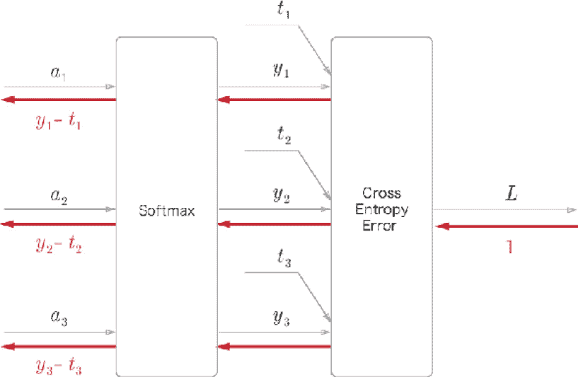

###### 图 A.1：Softmax-with-Loss 层的计算图

*图 A.1* 中显示的计算图假设有一个神经网络用于分类三个类别。来自上一层的输入是 (a1, a2, a3)，Softmax 层输出 (y1, y2, y3)。标签是 (t1, t2, t3)，交叉熵误差层输出损失 L。

本附录展示了 Softmax-with-Loss 层反向传播的结果为 (y1 − t1, y2 − t2, y3 − t3)，如 *图 A.1* 所示。

### 前向传播

*图 A.1* 中显示的计算图并没有展示 Softmax 层和交叉熵误差层的详细信息。在这里，我们将首先描述这两个层的细节。

首先，让我们来看一下 Softmax 层。我们可以用以下方程表示 softmax 函数：

| 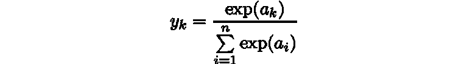 | (A.1) |
| --- | --- |

因此，我们可以通过 *图 A.2* 提供的计算图展示 Softmax 层。在这里，S 代表指数和，是方程 (A.1) 中的分母。最终输出为 (y1, y2, y3)。

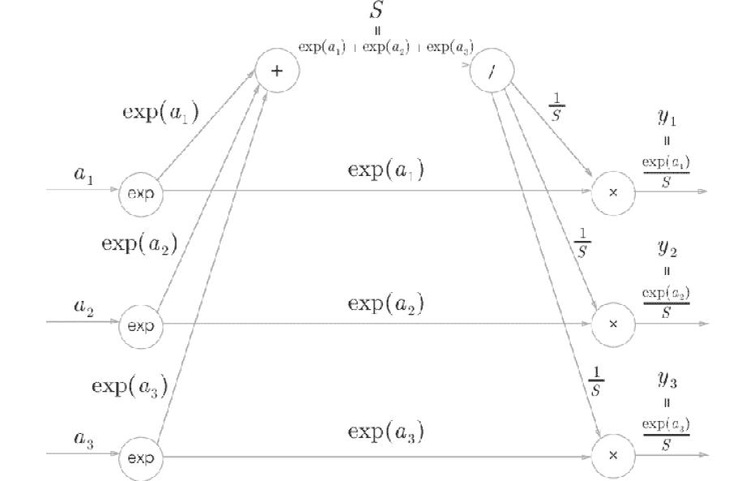

###### 图 A.2：Softmax 层的计算图（仅前向传播）

接下来，让我们来看一下交叉熵误差层。以下方程展示了交叉熵误差：

| 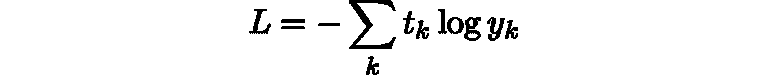 | (A.2) |
| --- | --- |

基于方程 (A.2)，我们可以画出交叉熵误差层的计算图，如 *图 A.3* 所示。

*图 A.3* 中显示的计算图只是将方程 (A.2) 展示为计算图。因此，我认为这里没有什么特别困难的。

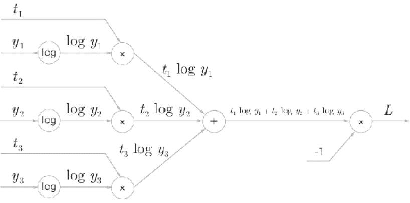

###### 图 A.3：交叉熵误差层的计算图（仅前向传播）

现在，让我们来看一下反向传播：

### 反向传播

首先，让我们来看一下交叉熵误差层的反向传播。我们可以如下绘制交叉熵误差层的反向传播：

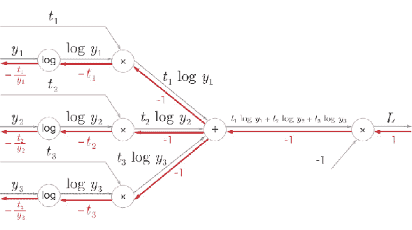

###### 图 A.4: 交叉熵误差层的反向传播

请注意以下事项，以便获得此计算图的反向传播：

+   反向传播的初始值（*图 A.4*中的最右侧反向传播值）为 1（因为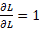）。

+   对于“x”节点的反向传播，正向传播输入信号的“反转值”乘以上游的导数后传递到下游。

+   对于“+”节点，来自上游的导数被传递而不进行任何更改。

+   “log”节点的反向传播遵循以下方程：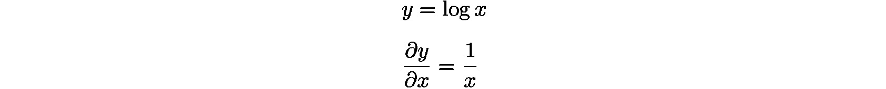

基于此，我们可以轻松地获得交叉熵误差层的反向传播。因此，值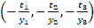将作为反向传播到 Softmax 层的输入。

接下来，我们来看看 Softmax 层的反向传播。由于 Softmax 层稍微复杂，我想一步步检查它的反向传播：

**第 1 步：**

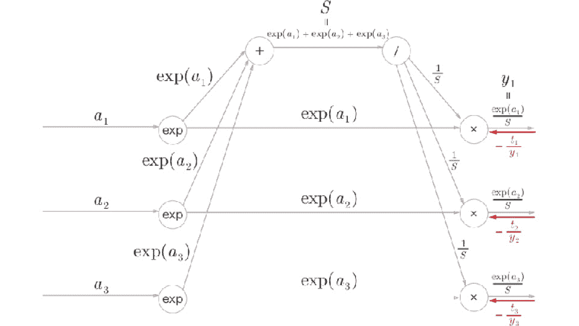

###### 图 A.5: 第 1 步

反向传播的值来自前一层（交叉熵误差层）。

**第 2 步：**

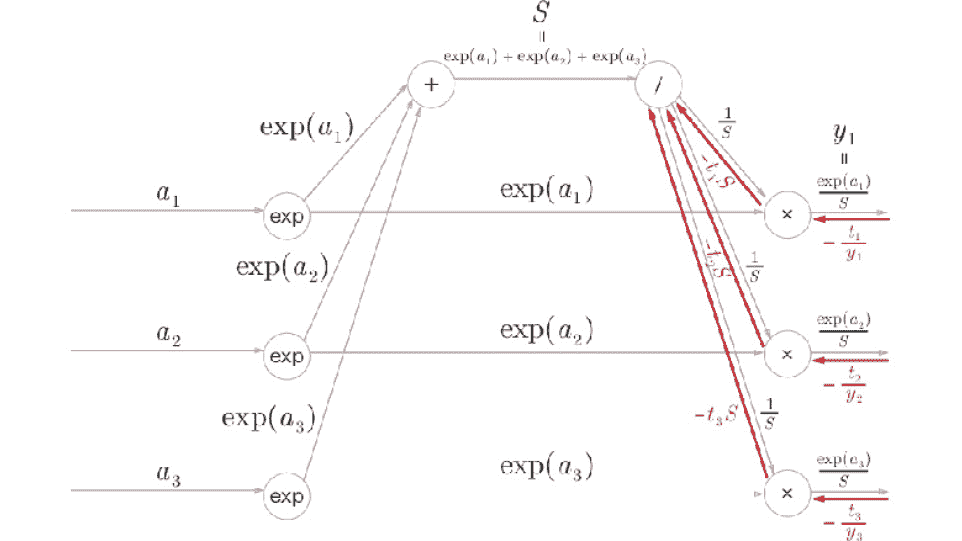

###### 图 A.6: 第 2 步

“x”节点“反转”正向传播的值以进行乘法计算。这里，执行以下计算：

| 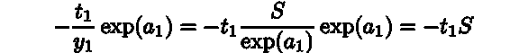 | (A.3) |
| --- | --- |

**第 3 步：**

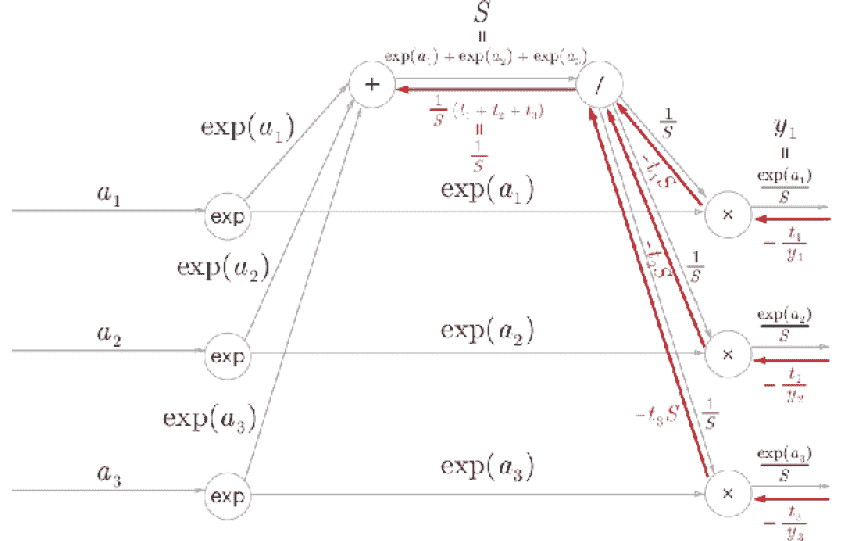

###### 图 A.7: 第 3 步

如果正向传播中的流分支成多个值，则在反向传播中这些分离的值会被相加。因此，在这里三个分开的反向传播值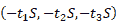被加在一起。对于添加的值，进行 */* 的反向传播，结果是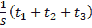。这里，(*t*1, *t*2, *t*3) 是标签和“独热向量”。独热向量意味着 (*t*1, *t*2, *t*3) 中的一个值为 1，其他值都为 0。因此，(*t*1, *t*2, *t*3) 的和为 1。

**第 4 步：**

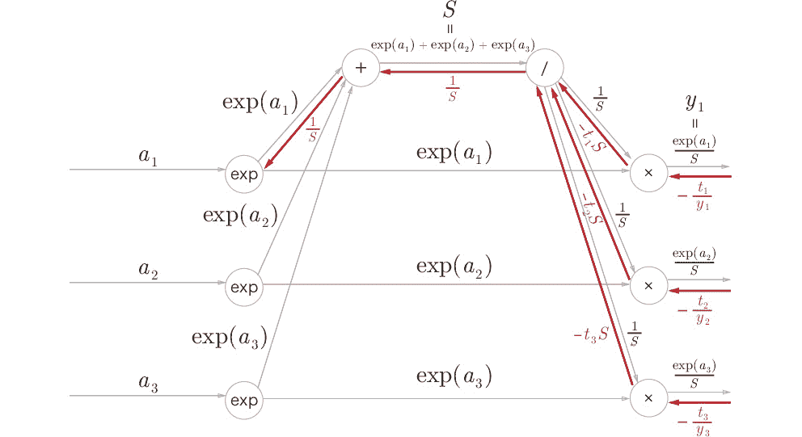

###### 图 A.8: 第 4 步

“+”节点只传递值而不改变它。

**第 5 步：**

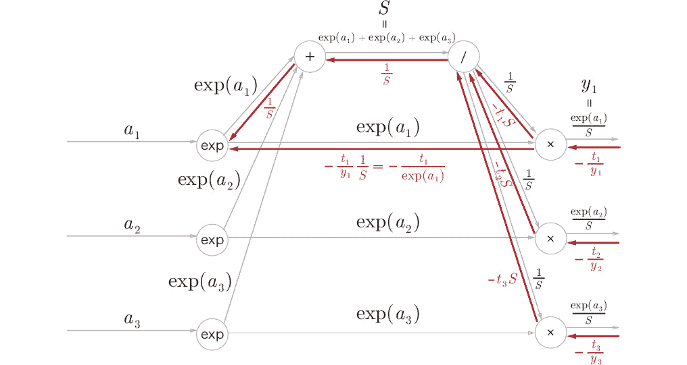

###### 图 A.9: 第 5 步

“x”节点“反转”值以进行乘法计算。这里，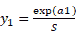被用来转化方程式。

**第 6 步：**

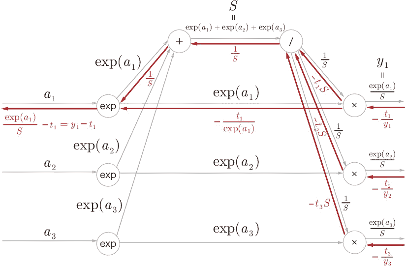

###### 图 A.10: 第 6 步

在“exp”节点中，以下方程成立：

| 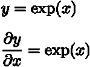 | (A.4) |
| --- | --- |

因此，将两个单独输入的和相加，并乘以 exp(a1)，就是反向传播所得到的结果。我们可以将其写为 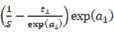，并通过变换得到 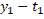。因此，在前向传播输入为 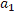 的节点，反向传播为 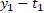。对于 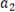 和 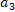，我们可以使用相同的过程（结果分别为 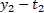 和 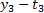）。通过这种方式，我们可以轻松地证明，即使我们想要分类 n 类而不是三类，我们也能得到相同的结果。

## 摘要

这里详细展示了带损失的 Softmax 层的计算图，并得到了其反向传播结果。*图 A.11* 显示了带损失的 Softmax 层的完整计算图：

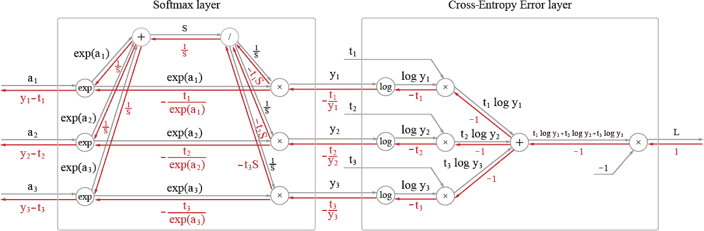

###### 图 A.11：带损失的 Softmax 层的计算图

如*图 A.11*所示，计算图看起来复杂。然而，如果按步骤推进计算图，获得导数（即反向传播过程）将会变得不那么麻烦。当你遇到看起来复杂的层（例如批归一化层）时，除了这里描述的带损失的 Softmax 层，你可以使用此过程。这比仅仅看公式更容易理解。
