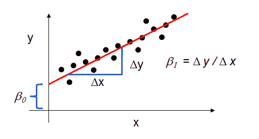

# 第二章：数据建模实践——泰坦尼克号例子

线性模型是数据科学领域的基本学习算法。理解线性模型的工作原理对你学习数据科学的旅程至关重要，因为它是大多数复杂学习算法（包括神经网络）的基础构建块。

在本章中，我们将深入探讨数据科学领域的一个著名问题——泰坦尼克号例子。这个例子的目的是介绍用于分类的线性模型，并展示完整的机器学习系统管道，从数据处理与探索到模型评估。我们将在本章讨论以下主题：

+   回归的线性模型

+   分类的线性模型

+   泰坦尼克号例子——模型构建与训练

+   不同类型的误差

# 回归的线性模型

线性回归模型是最基本的回归模型类型，广泛应用于预测数据分析。回归模型的总体思想是研究两件事：

1.  一组解释性特征/输入变量是否能很好地预测输出变量？模型是否使用了能够解释因变量（输出变量）变化的特征？

1.  哪些特征是因变量的重要特征？它们通过哪些方式影响因变量（由参数的大小和符号表示）？这些回归参数用于解释一个输出变量（因变量）与一个或多个输入特征（自变量）之间的关系。

回归方程将阐述输入变量（自变量）对输出变量（因变量）的影响。这个方程最简单的形式，只有一个输入变量和一个输出变量，由公式 *y = c + b`x` 定义。这里，`y` = 估计的因变量值，`c` = 常数，`b` = 回归参数/系数，`x` = 输入（自）变量。

# 动机

线性回归模型是许多学习算法的基础，但这并不是它们流行的唯一原因。以下是它们流行的关键因素：

+   **广泛应用**：线性回归是最古老的回归技术，广泛应用于许多领域，如预测和金融分析。

+   **运行速度快**：线性回归算法非常简单，不包括过于昂贵的数学计算。

+   **易于使用**（**无需大量调优**）：线性回归非常容易使用，并且它通常是机器学习或数据科学课程中学习的第一个方法，因为你不需要调整过多的超参数来提高性能。

+   **高度可解释**：由于线性回归的简单性以及检查每个预测变量与系数对的贡献的便捷性，它具有很高的可解释性；你可以轻松理解模型的行为，并为非技术人员解读模型输出。如果某个系数为零，那么相关的预测变量不做任何贡献。如果某个系数不为零，可以轻松确定该特定预测变量的贡献。

+   **许多方法的基础**：线性回归被认为是许多学习方法的基础，例如神经网络及其日益增长的部分——深度学习。

# 广告 – 一个财务示例

为了更好地理解线性回归模型，我们将通过一个广告示例来学习。我们将尝试预测一些公司在广告支出（包括电视、广播和报纸广告）方面的花费与其销售额之间的关系。

# 依赖项

为了使用线性回归建模我们的广告数据样本，我们将使用 Statsmodels 库来获取线性模型的良好特性，但稍后我们将使用 scikit-learn，它提供了许多对数据科学非常有用的功能。

# 使用 pandas 导入数据

在 Python 中有许多库可以用来读取、转换或写入数据。其中特别的一个库是 pandas：[`pandas.pydata.org/`](http://pandas.pydata.org/)。Pandas 是一个开源库，提供强大的数据分析功能和工具，并且其数据结构非常易于使用。

你可以通过多种方式轻松获取 pandas。获取 pandas 的最佳方式是通过`conda`进行安装：[`pandas.pydata.org/pandas-docs/stable/install.html#installing-pandas-with-anaconda`](http://pandas.pydata.org/pandas-docs/stable/install.html#installing-pandas-with-anaconda)。

“conda 是一个开源的包管理系统和环境管理系统，用于安装多个版本的软件包及其依赖项，并可以轻松地在它们之间切换。它支持 Linux、OS X 和 Windows 操作系统，最初为 Python 程序设计，但也可以打包和分发任何软件。” – conda 网站。

你可以通过安装 Anaconda 来轻松获得 conda，它是一个开源的数据科学平台。

那么，让我们看一下如何使用 pandas 来读取广告数据样本。首先，我们需要导入`pandas`：

```py
import pandas as pd
```

接下来，我们可以使用`pandas.read_csv`方法将数据加载到一个易于使用的 pandas 数据结构——**DataFrame**中。关于`pandas.read_csv`及其参数的更多信息，可以参考 pandas 的文档：[`pandas.pydata.org/pandas-docs/stable/generated/pandas.read_csv.html`](https://pandas.pydata.org/pandas-docs/stable/generated/pandas.read_csv.html)。

```py
# read advertising data samples into a DataFrame
```

```py
advertising_data = pd.read_csv('http://www-bcf.usc.edu/~gareth/ISL/Advertising.csv', index_col=0)
```

传递给`pandas.read_csv`方法的第一个参数是表示文件路径的字符串值。该字符串可以是包含`http`、`ftp`、`s3`和`file`的 URL。传递的第二个参数是作为数据行标签/名称的列的索引。

现在，我们有了数据的 DataFrame，其中包含 URL 中提供的广告数据，每一行通过第一列进行标记。如前所述，pandas 提供了易于使用的数据结构，你可以将其作为数据容器。这些数据结构具有一些与之关联的方法，你将使用这些方法来转换和/或操作数据。

现在，让我们来看看广告数据的前五行：

```py
# DataFrame.head method shows the first n rows of the data where the   
# default value of n is 5, DataFrame.head(n=5)
advertising_data.head()
```

输出：

|  | **电视** | **广播** | **报纸** | **销售** |
| --- | --- | --- | --- | --- |
| 1 | 230.1 | 37.8 | 69.2 | 22.1 |
| 2 | 44.5 | 39.3 | 45.1 | 10.4 |
| 3 | 17.2 | 45.9 | 69.3 | 9.3 |
| 4 | 151.5 | 41.3 | 58.5 | 18.5 |
| 5 | 180.8 | 10.8 | 58.4 | 12.9 |

# 理解广告数据

这个问题属于监督学习类型，其中我们有解释性特征（输入变量）和响应（输出变量）。

特征/输入变量是什么？

+   **电视**：在给定市场上为单一产品在电视上花费的广告费用（单位：千美元）

+   **广播**：在广播上花费的广告费用

+   **报纸**：在报纸上花费的广告费用

响应/结果/输出变量是什么？

+   **销售**：在给定市场上单一产品的销售额（单位：千个商品）

我们还可以使用`DataFrame`方法 shape 来了解数据中的样本/观测值数量：

```py
# print the shape of the DataFrame
advertising_data.shape
Output:
(200, 4)
```

所以，广告数据中有 200 个观测值。

# 数据分析与可视化

为了理解数据的潜在形式、特征与响应之间的关系，以及更多的见解，我们可以使用不同类型的可视化。为了理解广告数据特征与响应之间的关系，我们将使用散点图。

为了对数据进行不同类型的可视化，你可以使用 Matplotlib（[`matplotlib.org/`](https://matplotlib.org/)），它是一个用于创建可视化的 Python 2D 库。要获取 Matplotlib，你可以按照他们的安装说明：[`matplotlib.org/users/installing.html`](https://matplotlib.org/users/installing.html)。

让我们导入可视化库 Matplotlib：

```py
import matplotlib.pyplot as plt

# The next line will allow us to make inline plots that could appear directly in the notebook
# without poping up in a different window
%matplotlib inline
```

现在，让我们使用散点图来可视化广告数据特征与响应变量之间的关系：

```py
fig, axs = plt.subplots(1, 3, sharey=True)

# Adding the scatterplots to the grid 
advertising_data.plot(kind='scatter', x='TV', y='sales', ax=axs[0], figsize=(16, 8))
advertising_data.plot(kind='scatter', x='radio', y='sales', ax=axs[1])
advertising_data.plot(kind='scatter', x='newspaper', y='sales', ax=axs[2])
```

输出：


图 1：用于理解广告数据特征与响应变量之间关系的散点图

现在，我们需要看看广告如何帮助增加销售。因此，我们需要就此提出几个问题给自己。有价值的问题可以是关于广告与销售之间的关系，哪种广告对销售的贡献更大，以及每种类型广告对销售的大致影响。我们将尝试使用简单线性模型来回答此类问题。

# 简单回归模型

线性回归模型是一种学习算法，用于预测**定量**（也称为**数值**）**响应**，其使用**解释性** **特征**（或**输入**或**预测器**）的组合。

只有一个特征的简单线性回归模型采用以下形式：

*y = beta[0] + beta[1]x*

这里：

+   `y`是预测的数值（响应） → **销售**

+   `x`是特征

+   *beta[0]*称为**截距**

+   *beta[1]*是特征`x` → **电视广告**的系数

*beta[0]*和*beta[1]*都被视为模型的**系数**。为了创建一个能够预测广告示例中销售值的模型，我们需要学习这些系数，因为*beta[1]*将是特征`x`对响应`y`的学习效果。例如，如果*beta[1] = 0.04*，这意味着额外投入 100 美元用于电视广告与销售增加四个小部件**相关**。因此，我们需要继续看看如何学习这些系数。

# 学习模型系数

为了估计我们模型的系数，我们需要用回归线拟合数据，以获得与实际销售类似的答案。为了获得最适合数据的回归线，我们将使用一个称为**最小二乘**的标准。因此，我们需要找到一条最小化预测值与观察值之间差异的线。*图 2*说明了这一点：


图 2：用最小化残差平方和（预测值与观察值之差）的回归线拟合数据点（电视广告样本）

下列元素存在于*图 2*中：

+   **黑色点**表示`x`（电视广告）和`y`（销售）的实际或观察值

+   **蓝线**表示最小二乘线（回归线）

+   **红线**表示残差，即预测值与观察（实际）值之间的差异

所以，这就是我们的系数与最小二乘线（回归线）的关系：

+   *beta[0]*是**截距**，即*x =0*时`y`的值

+   *beta[1]*是**斜率**，表示`y`相对于`x`的变化量

*图 3*展示了这个图形化解释：



图 3：最小二乘线与模型系数之间的关系

现在，让我们继续使用**Statsmodels**来学习这些系数：

```py
# To use the formula notation below, we need to import the module like the following
import statsmodels.formula.api as smf
# create a fitted model in one line of code(which will represent the least squares line)
lm = smf.ols(formula='sales ~ TV', data=advertising_data).fit()
# show the trained model coefficients
lm.params
```

输出：

```py
Intercept    7.032594
TV           0.047537
dtype: float64
```

如我们所提到的，线性回归模型的一个优点是它们易于解释，所以我们继续解释该模型。

# 解释模型系数

让我们看看如何解释模型的系数，比如电视广告的系数 (*beta[1]*)：

+   输入/特征（电视广告）支出的单位增加**与**销售（响应）单位增加`0.047537`相关。换句话说，每额外花费 $100 在电视广告上**与**销售增加 4.7537 单位相关。

从电视广告数据构建已学习模型的目标是预测未见数据的销售额。那么，让我们看看如何使用已学习的模型来预测销售值（我们不知道的）基于给定的电视广告值。

# 使用模型进行预测

假设我们有未见过的电视广告支出数据，并且我们想知道这些广告对公司销售的相应影响。那么，我们需要使用已学习的模型来为我们做这个预测。假设我们想知道 $50000 的电视广告支出会使销售额增加多少。

让我们使用已学习的模型系数来进行计算：

*y = 7.032594 + 0.047537 x 50*

```py
# manually calculating the increase in the sales based on $50k
7.032594 + 0.047537*50000
```

输出：

```py
9,409.444
```

我们还可以使用 Statsmodels 来为我们做预测。首先，我们需要将电视广告值以 pandas DataFrame 的形式提供，因为 Statsmodels 接口期望如此：

```py
# creating a Pandas DataFrame to match Statsmodels interface expectations
new_TVAdSpending = pd.DataFrame({'TV': [50000]})
new_TVAdSpending.head()
```

输出：

|  | **电视广告** |
| --- | --- |
| 0 | 50000 |

现在，我们可以使用预测函数来预测销售值：

```py
# use the model to make predictions on a new value
preds = lm.predict(new_TVAdSpending)
```

输出：

```py
array([ 9.40942557])
```

让我们看看已学习的最小二乘法拟合直线是什么样子的。为了绘制这条线，我们需要两个点，每个点由以下一对值表示：（`x, predict_value_of_x`）。

那么，让我们取电视广告特征的最小值和最大值：

```py
# create a DataFrame with the minimum and maximum values of TV
X_min_max = pd.DataFrame({'TV': [advertising_data.TV.min(), advertising_data.TV.max()]})
X_min_max.head()
```

输出：

|  | **电视广告** |
| --- | --- |
| 0 | 0.7 |
| 1 | 296.4 |

让我们为这两个值获取相应的预测：

```py
# predictions for X min and max values
predictions = lm.predict(X_min_max)
predictions
```

输出：

```py
array([  7.0658692,  21.12245377])
```

现在，让我们绘制实际数据，并用最小二乘法拟合一条直线：

```py
# plotting the acutal observed data
advertising_data.plot(kind='scatter', x='TV', y='sales')
#plotting the least squares line
plt.plot(new_TVAdSpending, preds, c='red', linewidth=2)
```

输出：


图 4：实际数据与最小二乘法拟合直线的图示

这个示例的扩展及进一步的解释将在下一章中讲解。

# 用于分类的线性模型

在本节中，我们将讲解逻辑回归，它是广泛使用的分类算法之一。

什么是逻辑回归？逻辑回归的简单定义是它是一种涉及线性判别的分类算法。

我们将通过两个要点来澄清这个定义：

1.  与线性回归不同，逻辑回归并不试图在给定一组特征或输入变量的情况下估计/预测数值变量的值。相反，逻辑回归算法的输出是给定样本/观测值属于特定类别的概率。简单来说，假设我们有一个二分类问题。在这种问题中，输出变量中只有两个类别，例如，患病或未患病。那么，某个样本属于患病类别的概率是`P₀`，而属于未患病类别的概率是*P[1] = 1 - P[0]*。因此，逻辑回归算法的输出始终介于 0 和 1 之间。

1.  正如你可能知道的那样，有许多回归或分类的学习算法，每种学习算法对数据样本有自己的假设。选择适合你数据的学习算法的能力将随着实践和对该主题的深入理解而逐渐掌握。因此，逻辑回归算法的核心假设是，我们的输入/特征空间可以通过一个线性面将其分隔为两个区域（每个类别一个区域），如果我们只有两个特征，这个面就是一条线，若有三个特征，则是一个平面，依此类推。这个边界的位置和方向将由你的数据决定。如果你的数据满足这种约束，即通过一个线性面将它们分隔成对应每个类别的区域，那么这些数据就被称为线性可分的。下图展示了这一假设。在*图 5*中，我们有三个维度的输入或特征和两个可能的类别：患病（红色）和未患病（蓝色）。分隔两个区域的边界称为**线性判别面**，因为它是线性的，并且有助于模型区分属于不同类别的样本：


图 5：分隔两个类别的线性决策面

如果你的数据样本不是线性可分的，你可以通过将数据转化为更高维度的空间来实现线性可分，即通过添加更多特征。

# 分类与逻辑回归

在上一节中，我们学习了如何将连续量（例如，电视广告对公司销售的影响）预测为输入值（例如，电视、广播和报纸广告）的线性函数。但是，对于其他任务，输出将不是连续量。例如，预测某人是否患病是一个分类问题，我们需要一个不同的学习算法来完成这个任务。在本节中，我们将深入探讨逻辑回归的数学分析，它是一种用于分类任务的学习算法。

在线性回归中，我们试图使用线性模型函数 *y = hθ = θ^Τ x* 来预测数据集中第 *i^(th)* 个样本 *x^((i))* 的输出变量 *y^((i))* 的值。但这并不是分类任务的一个好方法，尤其是像预测二进制标签 *(y^((i)) ∈ {0,1})* 这样的任务。

逻辑回归是我们可以用于分类任务的众多学习算法之一，在这种方法中，我们使用不同的假设类来预测一个特定样本属于正类的概率和属于负类的概率。因此，在逻辑回归中，我们将尝试学习以下函数：


该函数  通常被称为 **sigmoid** 或 **logistic** 函数，它将 *θ^Τx* 的值压缩到一个固定范围 *[0,1]*，如下图所示。因为值会被压缩到 [0,1] 之间，所以我们可以将 *hθ* 解释为一个概率。

我们的目标是寻找参数 *θ* 的值，使得当输入样本 `x` 属于正类时，概率 *P(y = 1|x) = hθ* 较大，而当 `x` 属于负类时，概率较小：


图 6：Sigmoid 函数的形状

所以，假设我们有一组训练样本及其对应的二进制标签 *{(x^((i)), y^((i))): i = 1,...,m}*。我们需要最小化以下代价函数，该函数衡量给定的 `$1` 的表现如何：


注意，对于每个训练样本，方程求和的两个项中只有一个非零项（取决于标签 *y^((i))* 的值是 `0` 还是 `1`）。当 *y^((i)) = 1* 时，最小化模型的代价函数意味着我们需要让 *hθ))* 较大；而当 *y^((i)) = 0* 时 *，我们希望让 *1 - h[θ]* 较大。

现在，我们有一个代价函数来计算给定假设 `$1` 与训练样本的匹配程度。我们可以通过使用优化技术来最小化 *J(θ)*，从而找到最佳的参数选择 *θ*，进而学习如何对训练样本进行分类。一旦我们完成这一步骤，就可以利用这些参数将新的测试样本分类为 1 或 0，查看哪一个类标签的概率较高。如果 *P(y = 1|x) < P(y = 0|x)*，则输出 0，否则输出 1，这与定义一个 0.5 的类间阈值并检查 *hθ > 0.5* 是一致的。

为了最小化代价函数 *J(θ)*，我们可以使用一种优化技术，寻找能够最小化代价函数的最佳 *θ* 值。因此，我们可以使用一种叫做**梯度**的微积分工具，它尝试找到代价函数的最大增加速率。然后，我们可以朝相反方向前进，以找到该函数的最小值；例如，*J(θ)* 的梯度记作 *∇[θ]J(θ)*，这意味着对代价函数相对于模型参数的梯度进行求解。因此，我们需要提供一个函数，用来计算 *J(θ)* 和 *∇[θ]J(θ)*，以便根据任何给定的 *θ* 值进行求解。如果我们已经推导出了代价函数 *J(θ)* 相对于 `$1` 的梯度或导数，那么我们将得到以下结果：


这可以写成向量形式：


现在，我们对逻辑回归有了数学上的理解，那么让我们继续使用这一新学习方法来解决分类任务。

# Titanic 示例 – 模型构建与训练

泰坦尼克号沉船事件是历史上最臭名昭著的事件之一。此次事故导致 2,224 名乘客和船员中有 1,502 人死亡。在这个问题中，我们将利用数据科学来预测乘客是否能够幸存，并基于这次灾难的实际统计数据来测试我们模型的性能。

要继续 Titanic 示例，你需要执行以下步骤：

1.  通过点击 [`github.com/ahmed-menshawy/ML_Titanic/archive/master.zip`](https://github.com/ahmed-menshawy/ML_Titanic/archive/master.zip) 下载该仓库的 ZIP 文件，或者从终端执行：

1.  Git 克隆：[`github.com/ahmed-menshawy/ML_Titanic.git`](https://github.com/ahmed-menshawy/ML_Titanic.git)

1.  安装 `[virtualenv]`：([`virtualenv.readthedocs.org/en/latest/installation.html`](http://virtualenv.readthedocs.org/en/latest/installation.html))

1.  导航到你解压或克隆的代码库目录，并通过 `virtualenv ml_titanic` 创建一个虚拟环境

1.  使用 `source ml_titanic/bin/activate` 激活虚拟环境

1.  使用 `pip install -r requirements.txt` 安装所需的依赖项

1.  从命令行或终端执行 `ipython notebook`

1.  按照本章中的示例代码操作

1.  完成后，通过执行 `deactivate` 来停用虚拟环境

# 数据处理与可视化

在这一部分，我们将进行一些数据预处理和分析。数据探索与分析被认为是应用机器学习过程中的最重要步骤之一，甚至可能是最关键的一步，因为在这个阶段，你将了解将会陪伴你整个训练过程的“朋友”——数据。同时，了解你的数据能够帮助你缩小可能使用的候选算法范围，从而找到最适合你数据的算法。

首先，我们导入实现所需的必要包：

```py
import matplotlib.pyplot as plt
 %matplotlib inline

 from statsmodels.nonparametric.kde import KDEUnivariate
 from statsmodels.nonparametric import smoothers_lowess
 from pandas import Series, DataFrame
 from patsy import dmatrices
 from sklearn import datasets, svm

 import numpy as np
 import pandas as pd
 import statsmodels.api as sm

from scipy import stats
stats.chisqprob = lambda chisq, df: stats.chi2.sf(chisq, df)
```

让我们使用 Pandas 读取泰坦尼克号乘客和船员数据：

```py
titanic_data = pd.read_csv("data/titanic_train.csv")
```

接下来，让我们检查数据集的维度，看看我们有多少个样本，以及描述数据集的解释性特征有多少：

```py
titanic_data.shape

 Output:
 (891, 12)
```

所以，我们一共有 891 个观察样本、数据样本或乘客/船员记录，以及 12 个解释性特征来描述这些记录：

```py
list(titanic_data)

 Output:
 ['PassengerId',
 'Survived',
 'Pclass',
 'Name',
 'Sex',
 'Age',
 'SibSp',
 'Parch',
 'Ticket',
 'Fare',
 'Cabin',
 'Embarked']
```

让我们看看一些样本/观察数据：

```py
titanic_data[500:510]

```

输出：


图 7：泰坦尼克号数据集的样本

现在，我们有一个 Pandas 数据框，包含了我们需要分析的 891 名乘客的信息。数据框的列表示每个乘客/船员的解释性特征，如姓名、性别或年龄。

其中一些解释性特征是完整的，没有任何缺失值，比如生还特征，拥有 891 个条目。其他解释性特征包含缺失值，比如年龄特征，只有 714 个条目。数据框中的任何缺失值都表示为 NaN。

如果你探索所有的数据集特征，你会发现票务和船舱特征有很多缺失值（NaN），因此它们不会对我们的分析增加太多价值。为了解决这个问题，我们将从数据框中删除这些特征。

使用以下代码删除数据框中`ticket`和`cabin`特征：

```py
titanic_data = titanic_data.drop(['Ticket','Cabin'], axis=1)
```

数据集中有很多原因可能会导致缺失值。但是，为了保持数据集的完整性，我们需要处理这些缺失值。在这个特定问题中，我们选择将其删除。

使用以下代码删除所有剩余特征中的`NaN`值：

```py
titanic_data = titanic_data.dropna()
```

现在，我们有了一个完整的数据集，可以用来进行分析。如果你决定删除所有 NaN，而不首先删除**票务**和**船舱**特征，你会发现大部分数据集会被删除，因为`.dropna()`方法会删除数据框中的一个观察值，即使它只在某个特征中有一个 NaN。

让我们做一些数据可视化，看看某些特征的分布，并理解解释性特征之间的关系：

```py
# declaring graph parameters
fig = plt.figure(figsize=(18,6))
alpha=alpha_scatterplot = 0.3
alpha_bar_chart = 0.55
# Defining a grid of subplots to contain all the figures
ax1 = plt.subplot2grid((2,3),(0,0))
# Add the first bar plot which represents the count of people who survived vs not survived.
titanic_data.Survived.value_counts().plot(kind='bar', alpha=alpha_bar_chart)
# Adding margins to the plot
ax1.set_xlim(-1, 2)
# Adding bar plot title
plt.title("Distribution of Survival, (1 = Survived)")
plt.subplot2grid((2,3),(0,1))
plt.scatter(titanic_data.Survived, titanic_data.Age, alpha=alpha_scatterplot)
# Setting the value of the y label (age)
plt.ylabel("Age")
# formatting the grid
plt.grid(b=True, which='major', axis='y')
plt.title("Survival by Age, (1 = Survived)")
ax3 = plt.subplot2grid((2,3),(0,2))
titanic_data.Pclass.value_counts().plot(kind="barh", alpha=alpha_bar_chart)
ax3.set_ylim(-1, len(titanic_data.Pclass.value_counts()))
plt.title("Class Distribution")
plt.subplot2grid((2,3),(1,0), colspan=2)
# plotting kernel density estimate of the subse of the 1st class passenger’s age
titanic_data.Age[titanic_data.Pclass == 1].plot(kind='kde')
titanic_data.Age[titanic_data.Pclass == 2].plot(kind='kde')
titanic_data.Age[titanic_data.Pclass == 3].plot(kind='kde')
# Adding x label (age) to the plot
plt.xlabel("Age")
plt.title("Age Distribution within classes")
# Add legend to the plot.
plt.legend(('1st Class', '2nd Class','3rd Class'),loc='best')
ax5 = plt.subplot2grid((2,3),(1,2))
titanic_data.Embarked.value_counts().plot(kind='bar', alpha=alpha_bar_chart)
ax5.set_xlim(-1, len(titanic_data.Embarked.value_counts()))
plt.title("Passengers per boarding location")
```


图 8：泰坦尼克号数据样本的基本可视化

如前所述，本次分析的目的是根据可用特征预测特定乘客是否能在灾难中生还，比如旅行舱位（在数据中称为`pclass`）、**性别**、**年龄**和**票价**。因此，让我们看看能否更好地通过可视化来了解幸存和死亡的乘客。

首先，让我们绘制一个条形图，看看每个舱位（生还/死亡）中观察的数量：

```py
plt.figure(figsize=(6,4))
fig, ax = plt.subplots()
titanic_data.Survived.value_counts().plot(kind='barh', color="blue", alpha=.65)
ax.set_ylim(-1, len(titanic_data.Survived.value_counts()))
plt.title("Breakdown of survivals(0 = Died, 1 = Survived)")
```


图 9：生还情况分布

让我们通过性别划分前面的图表，进一步了解数据：

```py
fig = plt.figure(figsize=(18,6))
#Plotting gender based analysis for the survivals.
male = titanic_data.Survived[titanic_data.Sex == 'male'].value_counts().sort_index()
female = titanic_data.Survived[titanic_data.Sex == 'female'].value_counts().sort_index()
ax1 = fig.add_subplot(121)
male.plot(kind='barh',label='Male', alpha=0.55)
female.plot(kind='barh', color='#FA2379',label='Female', alpha=0.55)
plt.title("Gender analysis of survivals (raw value counts) "); plt.legend(loc='best')
ax1.set_ylim(-1, 2)
ax2 = fig.add_subplot(122)
(male/float(male.sum())).plot(kind='barh',label='Male', alpha=0.55)  
(female/float(female.sum())).plot(kind='barh', color='#FA2379',label='Female', alpha=0.55)
plt.title("Gender analysis of survivals"); plt.legend(loc='best')
ax2.set_ylim(-1, 2)
```


图 10：基于性别特征的泰坦尼克号数据进一步拆解

现在，我们有了更多关于两个可能类别（生还和死亡）的信息。探索和可视化步骤是必要的，因为它能让你更深入了解数据的结构，并帮助你选择适合问题的学习算法。正如你所看到的，我们从非常基础的图表开始，然后逐步增加图表的复杂性，以便发现更多关于我们所处理数据的信息。

# 数据分析 – 监督式机器学习

该分析的目的是预测幸存者。因此，结果将是生还或未生还，这是一个二元分类问题；在这个问题中，只有两个可能的类别。

我们可以使用许多学习算法来解决二元分类问题。逻辑回归就是其中之一。正如维基百科所解释的：

*在统计学中，逻辑回归或 logit 回归是一种回归分析方法，用于预测类别型因变量（可以取有限数量值的因变量，这些值的大小没有实际意义，但其大小的排序可能有意义，也可能没有意义）的结果，基于一个或多个预测变量。也就是说，它用于估计定性响应模型中参数的经验值。描述单次试验可能结果的概率是通过逻辑函数建模的，作为解释变量（预测变量）的函数。在本文中，"逻辑回归"通常特指因变量为二元的情况——即，类别数量为二——而具有多个类别的问题称为多项式逻辑回归，若类别是有序的，则称为有序逻辑回归。逻辑回归衡量类别型因变量与一个或多个自变量之间的关系，这些自变量通常（但不一定）是连续的，通过使用概率得分作为因变量的预测值。* 

为了使用逻辑回归，我们需要创建一个公式，告诉模型我们所提供的特征/输入类型：

```py
# model formula
# here the ~ sign is an = sign, and the features of our dataset
# are written as a formula to predict survived. The C() lets our
# regression know that those variables are categorical.
# Ref: http://patsy.readthedocs.org/en/latest/formulas.html
formula = 'Survived ~ C(Pclass) + C(Sex) + Age + SibSp + C(Embarked)'
# create a results dictionary to hold our regression results for easy analysis later
results = {}
# create a regression friendly dataframe using patsy's dmatrices function
y,x = dmatrices(formula, data=titanic_data, return_type='dataframe')
# instantiate our model
model = sm.Logit(y,x)
# fit our model to the training data
res = model.fit()
# save the result for outputing predictions later
results['Logit'] = [res, formula]
res.summary()
Output:
Optimization terminated successfully.
 Current function value: 0.444388
 Iterations 6
```


图 11：逻辑回归结果

现在，让我们绘制模型的预测值与实际值，以及残差图，残差是目标变量的实际值与预测值之间的差异：

```py
# Plot Predictions Vs Actual
plt.figure(figsize=(18,4));
plt.subplot(121, axisbg="#DBDBDB")
# generate predictions from our fitted model
ypred = res.predict(x)
plt.plot(x.index, ypred, 'bo', x.index, y, 'mo', alpha=.25);
plt.grid(color='white', linestyle='dashed')
plt.title('Logit predictions, Blue: \nFitted/predicted values: Red');
# Residuals
ax2 = plt.subplot(122, axisbg="#DBDBDB")
plt.plot(res.resid_dev, 'r-')
plt.grid(color='white', linestyle='dashed')
ax2.set_xlim(-1, len(res.resid_dev))
plt.title('Logit Residuals');
```


图 12：理解 logit 回归模型

现在，我们已经构建了逻辑回归模型，并且在此之前，我们对数据集进行了分析和探索。上述示例向你展示了构建机器学习解决方案的一般流程。

大多数时候，从业者会因为缺乏对机器学习概念的理解经验而陷入一些技术陷阱。例如，有人可能在测试集上获得了 99%的准确率，但在没有调查数据中类别分布的情况下（例如，负样本和正样本的数量），他们就部署了模型。

为了突出这些概念，并区分你需要注意的不同类型的误差，以及你应该真正关心的误差，我们将进入下一部分。

# 不同类型的误差

在机器学习中，有两种类型的误差，作为数据科学的新人，你需要理解它们之间至关重要的区别。如果你最终最小化了错误的类型，整个学习系统将变得毫无用处，你将无法在未见过的数据上实践应用它。为了减少从业者对这两种误差的误解，我们将在接下来的两个部分中进行解释。

# 表观（训练集）误差

这是第一种你不必关心最小化的误差类型。这个误差类型的值小并不意味着你的模型在未见过的数据上能够很好地工作（泛化）。为了更好地理解这种误差类型，我们将举一个简单的课堂情境例子。解决课堂问题的目的并不是能够在考试中再次解决相同的问题，而是能够解决其他可能与课堂上练习的问题不完全相似的问题。考试题目可能来自与课堂问题同一类，但不一定是完全相同的。

表观误差是训练好的模型在我们已经知道真实结果/输出的训练集上的表现。如果你能够在训练集上得到 0 误差，那么它是一个很好的指示，表明你的模型（大多数情况下）在未见过的数据上（不会）表现良好（不会泛化）。另一方面，数据科学的核心在于使用训练集作为基础知识，使学习算法能够在未来的未见过数据上表现良好。

在*图 3*中，红色曲线代表**表观**误差。每当你增加模型的记忆能力（例如，通过增加解释性特征的数量来增加模型复杂度），你会发现表观误差趋近于零。可以证明，如果你的特征数量与观测/样本数量相同，那么**表观**误差将为零：


图 13：表观误差（红色曲线）和泛化/真实误差（浅蓝色）

# 泛化/真实误差

这是数据科学中第二个也是更重要的错误类型。构建学习系统的整个目的是在测试集上获得更小的泛化误差；换句话说，让模型在一组没有在训练阶段使用的观测数据/样本上表现良好。如果你还记得上一节中的课堂情境，你可以把泛化误差看作是解决考试题目的一种能力，这些考试题目不一定和你在课堂上解决的题目类似，也不是你通过学习和熟悉科目所解决的题目。因此，泛化性能是指模型能够利用它在训练阶段学到的技能（参数），正确预测未见过数据的结果/输出。

在*图 13*中，浅蓝色的线表示泛化误差。你可以看到，随着模型复杂度的增加，泛化误差会减少，直到某个点，模型开始失去其增益能力，泛化误差会开始上升。这个曲线的部分，被称为**过拟合**，是指泛化误差失去增益能力的地方。

本节的关键内容是尽量减少泛化误差。

# 总结

线性模型是一个非常强大的工具，如果你的数据符合其假设，它可以作为初始学习算法。理解线性模型将帮助你理解更复杂的模型，因为这些复杂模型以线性模型为构建模块。

接下来，我们将继续使用泰坦尼克号例子，更详细地探讨模型复杂度和评估。模型复杂度是一个非常强大的工具，你需要小心使用它，以便提升泛化误差。误解它会导致过拟合问题。
