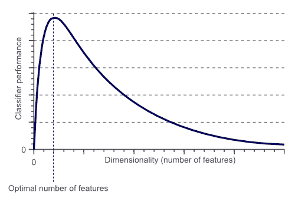
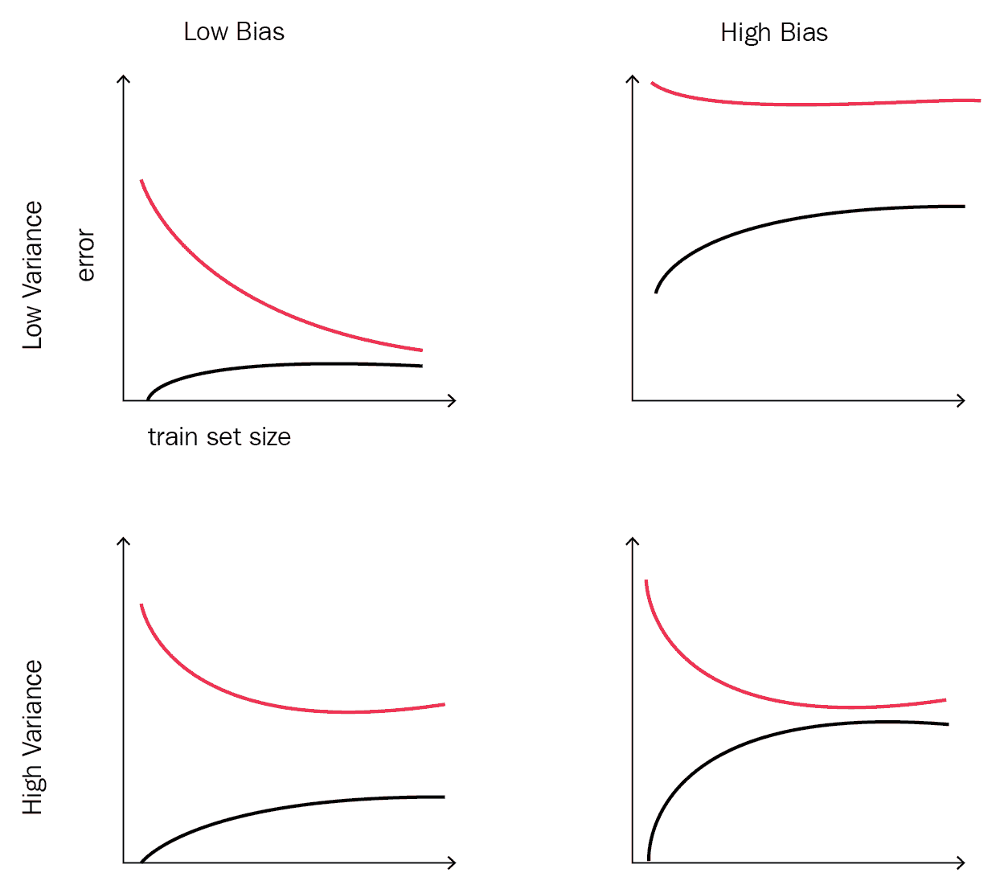

# 第三章：特征工程与模型复杂度——泰坦尼克号示例回顾

模型复杂度与评估是建立成功的数据科学系统的必要步骤。有很多工具可以用来评估和选择你的模型。在这一章中，我们将介绍一些能够通过增加更多描述性特征并从现有特征中提取有意义信息的工具。我们还将讨论与特征数量优化相关的其他工具，并了解为什么特征数量过多而训练样本/观察数过少是一个问题。

本章将解释以下主题：

+   特征工程

+   维度灾难

+   泰坦尼克号示例回顾——整体概览

+   偏差-方差分解

+   学习可见性

# 特征工程

特征工程是模型性能的关键组成部分之一。一个具有正确特征的简单模型，可能比一个具有糟糕特征的复杂模型表现更好。你可以把特征工程过程看作是决定预测模型成功或失败的最重要步骤。如果你理解数据，特征工程将会变得更加容易。

特征工程广泛应用于任何使用机器学习解决单一问题的人，这个问题是：**如何从数据样本中获取最大价值用于预测建模**？这是特征工程过程和实践所解决的问题，而你的数据科学技能的成功，始于如何有效地表示你的数据。

预测建模是一个将一组特征或输入变量（`x₁`, `x₂`, ..., `x[n]`）转换为感兴趣的输出/目标（y）的公式或规则。那么，什么是特征工程呢？它是从现有的输入变量（`x₁`, `x₂`, ..., `x[n]`）中创建新的输入变量或特征（`z₁`, `z₂`, ..., `z[n]`）的过程。我们不仅仅是创建任何新特征；新创建的特征应该对模型的输出有所贡献并且相关。创建与模型输出相关的特征，如果了解领域知识（如营销、医学等），将会是一个容易的过程。即使机器学习从业人员在这一过程中与领域专家互动，特征工程的结果也会更加优秀。

一个领域知识有用的例子是给定一组输入变量/特征（温度、风速和云层覆盖百分比）时建模降雨的可能性。在这个特定的例子中，我们可以构建一个新的二进制特征，叫做**阴天**，其值为 1 或否，表示云层覆盖百分比小于 20%，否则值为 0 或是。在这个例子中，领域知识对于指定阈值或切割百分比至关重要。输入越深思熟虑且有用，模型的可靠性和预测能力就越强。

# 特征工程的类型

作为一种技术，特征工程有三个主要的子类别。作为深度学习的实践者，你可以自由选择它们，或以某种方式将它们结合起来。

# 特征选择

有时被称为**特征重要性**，这是根据输入变量对目标/输出变量的贡献对输入变量进行排序的过程。此外，这个过程也可以被视为根据输入变量在模型预测能力中的价值对其进行排序的过程。

一些学习方法会在其内部过程中执行这种特征排名或重要性（如决策树）。这些方法大多使用熵来过滤掉价值较低的变量。在某些情况下，深度学习实践者会使用这种学习方法来选择最重要的特征，然后将其输入到更好的学习算法中。

# 降维

降维有时也被称为特征提取，它是将现有输入变量组合成一个新的、显著减少的输入变量集合的过程。用于这种类型特征工程的最常用方法之一是**主成分分析**（**PCA**），它利用数据的方差来生成一个减少后的输入变量集合，这些新变量看起来不像原始的输入变量。

# 特征构建

特征构建是特征工程中常用的一种类型，通常人们在谈论特征工程时会提到它。这项技术是从原始数据中手工构建或构造新特征的过程。在这种类型的特征工程中，领域知识非常有用，可以通过现有特征手动构建其他特征。像其他特征工程技术一样，特征构建的目的是提高模型的预测能力。一个简单的特征构建例子是利用日期时间戳特征生成两个新特征，如 AM 和 PM，这可能有助于区分白天和夜晚。我们还可以通过计算噪声特征的均值来将嘈杂的数值特征转化为更简单的名义特征，然后确定给定的行是否大于或小于该均值。

# 泰坦尼克号例子重访

在这一节中，我们将再次通过不同的角度使用特征工程工具来回顾泰坦尼克号的例子。如果你跳过了第二章，*数据建模实践 - 泰坦尼克号的例子*，泰坦尼克号的例子是一个 Kaggle 竞赛，目的是预测某个特定乘客是否幸存。

在重新审视泰坦尼克号的例子时，我们将使用 scikit-learn 和 pandas 库。所以首先，让我们开始读取训练集和测试集，并获取一些数据的统计信息：

```py
# reading the train and test sets using pandas
train_data = pd.read_csv('data/train.csv', header=0)
test_data = pd.read_csv('data/test.csv', header=0)

# concatenate the train and test set together for doing the overall feature engineering stuff
df_titanic_data = pd.concat([train_data, test_data])

# removing duplicate indices due to coming the train and test set by re-indexing the data
df_titanic_data.reset_index(inplace=True)

# removing the index column the reset_index() function generates
df_titanic_data.drop('index', axis=1, inplace=True)

# index the columns to be 1-based index
df_titanic_data = df_titanic_data.reindex_axis(train_data.columns, axis=1)
```

我们需要指出几点关于前面代码片段的内容：

+   如所示，我们使用了 pandas 的`concat`函数将训练集和测试集的数据框合并。这对于特征工程任务很有用，因为我们需要全面了解输入变量/特征的分布情况。

+   在合并两个数据框后，我们需要对输出数据框进行一些修改。

# 缺失值

这一步是获得客户提供的新数据集后需要首先考虑的事情，因为几乎每个数据集都会有缺失或错误的数据。在接下来的章节中，你将看到一些学习算法能够处理缺失值，而其他算法则需要你自己处理缺失数据。在这个示例中，我们将使用来自 scikit-learn 的随机森林分类器，它需要单独处理缺失数据。

处理缺失数据有不同的方法。

# 删除任何含有缺失值的样本

如果你有一个小数据集且缺失值较多，那么这种方法就不太合适，因为删除含有缺失值的样本会导致数据无效。如果你有大量数据，并且删除这些数据不会对原始数据集造成太大影响，那么这种方法可能是一个快捷且简单的选择。

# 缺失值填补

这种方法在处理分类数据时非常有用。其背后的直觉是，缺失值可能与其他变量相关，删除这些缺失值会导致信息丢失，从而显著影响模型。

例如，如果我们有一个二值变量，可能的取值为-1 和 1，我们可以添加另一个值（0）来表示缺失值。你可以使用以下代码将**Cabin**特征的空值替换为`U0`：

```py
# replacing the missing value in cabin variable "U0"
df_titanic_data['Cabin'][df_titanic_data.Cabin.isnull()] = 'U0'
```

# 分配一个平均值

这也是一种常见的方法，因为它的简便性。对于数值特征，你可以直接用均值或中位数替换缺失值。在处理分类变量时，你也可以通过将众数（出现频率最高的值）分配给缺失值来使用此方法。

以下代码将`Fare`特征中非缺失值的中位数分配给缺失值：

```py
# handling the missing values by replacing it with the median fare
df_titanic_data['Fare'][np.isnan(df_titanic_data['Fare'])] = df_titanic_data['Fare'].median()
```

或者，你可以使用以下代码查找`Embarked`特征中出现频率最高的值，并将其分配给缺失值：

```py
# replacing the missing values with the most common value in the variable
df_titanic_data.Embarked[df_titanic_data.Embarked.isnull()] = df_titanic_data.Embarked.dropna().mode().values
```

# 使用回归或其他简单模型来预测缺失变量的值

这是我们将用于泰坦尼克号示例中`Age`特征的方法。`Age`特征是预测乘客生还的一个重要步骤，采用前述方法通过计算均值填补会使我们丧失一些信息。

```py
Age feature:
```

```py
# Define a helper function that can use RandomForestClassifier for handling the missing values of the age variable
def set_missing_ages():
    global df_titanic_data

    age_data = df_titanic_data[
        ['Age', 'Embarked', 'Fare', 'Parch', 'SibSp', 'Title_id', 'Pclass', 'Names', 'CabinLetter']]
    input_values_RF = age_data.loc[(df_titanic_data.Age.notnull())].values[:, 1::]
    target_values_RF = age_data.loc[(df_titanic_data.Age.notnull())].values[:, 0]

    # Creating an object from the random forest regression function of sklearn<use the documentation for more details>
    regressor = RandomForestRegressor(n_estimators=2000, n_jobs=-1)

    # building the model based on the input values and target values above
    regressor.fit(input_values_RF, target_values_RF)

    # using the trained model to predict the missing values
    predicted_ages = regressor.predict(age_data.loc[(df_titanic_data.Age.isnull())].values[:, 1::])

```

```py
    # Filling the predicted ages in the original titanic dataframe
    age_data.loc[(age_data.Age.isnull()), 'Age'] = predicted_ages
```

# 特征变换

在前两部分中，我们介绍了如何读取训练集和测试集并将其合并，还处理了一些缺失值。现在，我们将使用 scikit-learn 的随机森林分类器来预测乘客的生还情况。不同实现的随机森林算法接受的数据类型不同。scikit-learn 实现的随机森林仅接受数值数据。因此，我们需要将分类特征转换为数值特征。

有两种类型的特征：

+   **定量**：定量特征是以数值尺度度量的，可以进行有意义的排序。在泰坦尼克号数据中，`Age`特征就是定量特征的一个例子。

+   **定性**：定性变量，也称为**分类变量**，是非数值型变量。它们描述的是可以归类的数据。在泰坦尼克号数据中，`Embarked`（表示出发港口的名称）特征就是定性特征的一个例子。

我们可以对不同的变量应用不同种类的转换。以下是一些可以用来转换定性/分类特征的方法。

# 虚拟特征

这些变量也被称为分类特征或二元特征。如果要转换的特征只有少数几个不同的值，那么这种方法将是一个不错的选择。在泰坦尼克号数据中，`Embarked`特征只有三个不同的值（`S`、`C`和`Q`），并且这些值经常出现。因此，我们可以将`Embarked`特征转换为三个虚拟变量（`'Embarked_S'`、`'Embarked_C'`和`'Embarked_Q'`），以便使用随机森林分类器。

以下代码将展示如何进行这种转换：

```py
# constructing binary features
def process_embarked():
    global df_titanic_data

    # replacing the missing values with the most common value in the variable
    df_titanic_data.Embarked[df.Embarked.isnull()] = df_titanic_data.Embarked.dropna().mode().values

    # converting the values into numbers
    df_titanic_data['Embarked'] = pd.factorize(df_titanic_data['Embarked'])[0]

    # binarizing the constructed features
    if keep_binary:
        df_titanic_data = pd.concat([df_titanic_data, pd.get_dummies(df_titanic_data['Embarked']).rename(
            columns=lambda x: 'Embarked_' + str(x))], axis=1)
```

# 因子化

这种方法用于从其他特征创建一个数值型分类特征。在 pandas 中，`factorize()`函数可以做到这一点。如果你的特征是字母数字的分类变量，那么这种转换就非常有用。在泰坦尼克号数据中，我们可以将`Cabin`特征转换为分类特征，表示舱位的字母：

```py
# the cabin number is a sequence of of alphanumerical digits, so we are going to create some features
# from the alphabetical part of it
df_titanic_data['CabinLetter'] = df_titanic_data['Cabin'].map(lambda l: get_cabin_letter(l))
df_titanic_data['CabinLetter'] = pd.factorize(df_titanic_data['CabinLetter'])[0]
```

```py
def get_cabin_letter(cabin_value):
    # searching for the letters in the cabin alphanumerical value
    letter_match = re.compile("([a-zA-Z]+)").search(cabin_value)

    if letter_match:
        return letter_match.group()
    else:
        return 'U'
```

我们还可以通过以下方法对定量特征应用转换。

# 缩放

这种转换仅适用于数值型特征。

例如，在泰坦尼克号数据中，`Age`特征的值可能达到 100，而家庭收入可能达到百万级别。一些模型对数值的大小比较敏感，因此对这些特征进行缩放可以帮助模型表现得更好。此外，缩放也可以将变量的值压缩到一个特定的范围内。

以下代码将通过从每个值中减去其均值并将其缩放到单位方差来缩放`Age`特征：

```py
# scale by subtracting the mean from each value
```

```py
scaler_processing = preprocessing.StandardScaler()
```

```py
df_titanic_data['Age_scaled'] = scaler_processing.fit_transform(df_titanic_data['Age'])
```

# 分箱

这种量化转换用于创建分位数。在这种情况下，量化特征值将是转换后的有序变量。这种方法不适用于线性回归，但可能在使用有序/类别变量时，学习算法能有效地响应。

以下代码对`Fare`特征应用了这种转换：

```py
# Binarizing the features by binning them into quantiles
df_titanic_data['Fare_bin'] = pd.qcut(df_titanic_data['Fare'], 4)

if keep_binary:
    df_titanic_data = pd.concat(
        [df_titanic_data, pd.get_dummies(df_titanic_data['Fare_bin']).rename(columns=lambda x: 'Fare_' + str(x))],
        axis=1)
```

# 派生特征

在上一节中，我们对泰坦尼克号数据应用了一些转换，以便能够使用 scikit-learn 的随机森林分类器（该分类器只接受数值数据）。在本节中，我们将定义另一种变量类型，它是由一个或多个其他特征衍生出来的。

在这个定义下，我们可以说上一节中的一些转换也叫做**派生特征**。在本节中，我们将研究其他复杂的转换。

在前几节中，我们提到你需要运用特征工程技能来衍生新特征，以增强模型的预测能力。我们也谈到了特征工程在数据科学流程中的重要性，以及为什么你应该花费大部分时间和精力来提出有用的特征。在这一节中，领域知识将非常有帮助。

非常简单的派生特征的例子包括从电话号码中提取国家代码和/或地区代码。你还可以从 GPS 坐标中提取国家/地区信息。

泰坦尼克号数据集非常简单，包含的变量不多，但我们可以尝试从文本特征中推导出一些新特征。

# 姓名

`name`变量本身对大多数数据集来说是没有用的，但它有两个有用的属性。第一个是名字的长度。例如，名字的长度可能反映你的地位，从而影响你上救生艇的机会：

```py
# getting the different names in the names variable
df_titanic_data['Names'] = df_titanic_data['Name'].map(lambda y: len(re.split(' ', y)))
```

第二个有趣的属性是`Name`标题，它也可以用来表示地位和/或性别：

```py
# Getting titles for each person
df_titanic_data['Title'] = df_titanic_data['Name'].map(lambda y: re.compile(", (.*?)\.").findall(y)[0])

# handling the low occurring titles
df_titanic_data['Title'][df_titanic_data.Title == 'Jonkheer'] = 'Master'
df_titanic_data['Title'][df_titanic_data.Title.isin(['Ms', 'Mlle'])] = 'Miss'
df_titanic_data['Title'][df_titanic_data.Title == 'Mme'] = 'Mrs'
df_titanic_data['Title'][df_titanic_data.Title.isin(['Capt', 'Don', 'Major', 'Col', 'Sir'])] = 'Sir'
df_titanic_data['Title'][df_titanic_data.Title.isin(['Dona', 'Lady', 'the Countess'])] = 'Lady'

# binarizing all the features
if keep_binary:
    df_titanic_data = pd.concat(
        [df_titanic_data, pd.get_dummies(df_titanic_data['Title']).rename(columns=lambda x: 'Title_' + str(x))],
        axis=1)
```

你也可以尝试从`Name`特征中提出其他有趣的特征。例如，你可以使用姓氏特征来找出泰坦尼克号上家族成员的规模。

# 舱位

在泰坦尼克号数据中，`Cabin`特征由一个字母表示甲板，和一个数字表示房间号。房间号随着船的后部增加，这将提供乘客位置的有用信息。我们还可以通过不同甲板上的乘客状态，帮助判断谁可以上救生艇：

```py
# repllacing the missing value in cabin variable "U0"
df_titanic_data['Cabin'][df_titanic_data.Cabin.isnull()] = 'U0'

# the cabin number is a sequence of of alphanumerical digits, so we are going to create some features
# from the alphabetical part of it
df_titanic_data['CabinLetter'] = df_titanic_data['Cabin'].map(lambda l: get_cabin_letter(l))
df_titanic_data['CabinLetter'] = pd.factorize(df_titanic_data['CabinLetter'])[0]

# binarizing the cabin letters features
if keep_binary:
    cletters = pd.get_dummies(df_titanic_data['CabinLetter']).rename(columns=lambda x: 'CabinLetter_' + str(x))
    df_titanic_data = pd.concat([df_titanic_data, cletters], axis=1)

# creating features from the numerical side of the cabin
df_titanic_data['CabinNumber'] = df_titanic_data['Cabin'].map(lambda x: get_cabin_num(x)).astype(int) + 1

```

# 票

`Ticket`特征的代码并不一目了然，但我们可以做一些猜测并尝试将它们分组。查看`Ticket`特征后，你可能会得到以下线索：

+   几乎四分之一的票以字符开头，而其余的票则仅由数字组成。

+   车票代码中的数字部分似乎能提供一些关于乘客等级的提示。例如，以 1 开头的数字通常是头等舱票，2 通常是二等舱，3 是三等舱。我说*通常*是因为这适用于大多数情况，但并非所有情况。也有以 4-9 开头的票号，这些票号很少见，几乎完全是三等舱。

+   几个人可以共享一个车票号码，这可能表示一家人或亲密的朋友一起旅行，并像一家人一样行动。

以下代码尝试分析车票特征代码，以得出前述提示：

```py
# Helper function for constructing features from the ticket variable
def process_ticket():
    global df_titanic_data

    df_titanic_data['TicketPrefix'] = df_titanic_data['Ticket'].map(lambda y: get_ticket_prefix(y.upper()))
    df_titanic_data['TicketPrefix'] = df_titanic_data['TicketPrefix'].map(lambda y: re.sub('[\.?\/?]', '', y))
    df_titanic_data['TicketPrefix'] = df_titanic_data['TicketPrefix'].map(lambda y: re.sub('STON', 'SOTON', y))

    df_titanic_data['TicketPrefixId'] = pd.factorize(df_titanic_data['TicketPrefix'])[0]

    # binarzing features for each ticket layer
    if keep_binary:
        prefixes = pd.get_dummies(df_titanic_data['TicketPrefix']).rename(columns=lambda y: 'TicketPrefix_' + str(y))
        df_titanic_data = pd.concat([df_titanic_data, prefixes], axis=1)

    df_titanic_data.drop(['TicketPrefix'], axis=1, inplace=True)

    df_titanic_data['TicketNumber'] = df_titanic_data['Ticket'].map(lambda y: get_ticket_num(y))
    df_titanic_data['TicketNumberDigits'] = df_titanic_data['TicketNumber'].map(lambda y: len(y)).astype(np.int)
    df_titanic_data['TicketNumberStart'] = df_titanic_data['TicketNumber'].map(lambda y: y[0:1]).astype(np.int)

    df_titanic_data['TicketNumber'] = df_titanic_data.TicketNumber.astype(np.int)

    if keep_scaled:
        scaler_processing = preprocessing.StandardScaler()
        df_titanic_data['TicketNumber_scaled'] = scaler_processing.fit_transform(
            df_titanic_data.TicketNumber.reshape(-1, 1))

def get_ticket_prefix(ticket_value):
    # searching for the letters in the ticket alphanumerical value
    match_letter = re.compile("([a-zA-Z\.\/]+)").search(ticket_value)
    if match_letter:
        return match_letter.group()
    else:
        return 'U'

def get_ticket_num(ticket_value):
    # searching for the numbers in the ticket alphanumerical value
    match_number = re.compile("([\d]+$)").search(ticket_value)
    if match_number:
        return match_number.group()
    else:
        return '0'

```

# 交互特征

交互特征是通过对一组特征执行数学运算得到的，表示变量之间关系的影响。我们对数值特征进行基本的数学运算，观察变量之间关系的效果：

```py
# Constructing features manually based on  the interaction between the individual features
numeric_features = df_titanic_data.loc[:,
                   ['Age_scaled', 'Fare_scaled', 'Pclass_scaled', 'Parch_scaled', 'SibSp_scaled',
                    'Names_scaled', 'CabinNumber_scaled', 'Age_bin_id_scaled', 'Fare_bin_id_scaled']]
print("\nUsing only numeric features for automated feature generation:\n", numeric_features.head(10))

new_fields_count = 0
for i in range(0, numeric_features.columns.size - 1):
    for j in range(0, numeric_features.columns.size - 1):
        if i <= j:
            name = str(numeric_features.columns.values[i]) + "*" + str(numeric_features.columns.values[j])
            df_titanic_data = pd.concat(
                [df_titanic_data, pd.Series(numeric_features.iloc[:, i] * numeric_features.iloc[:, j], name=name)],
                axis=1)
            new_fields_count += 1
        if i < j:
            name = str(numeric_features.columns.values[i]) + "+" + str(numeric_features.columns.values[j])
            df_titanic_data = pd.concat(
                [df_titanic_data, pd.Series(numeric_features.iloc[:, i] + numeric_features.iloc[:, j], name=name)],
                axis=1)
            new_fields_count += 1
        if not i == j:
            name = str(numeric_features.columns.values[i]) + "/" + str(numeric_features.columns.values[j])
            df_titanic_data = pd.concat(
                [df_titanic_data, pd.Series(numeric_features.iloc[:, i] / numeric_features.iloc[:, j], name=name)],
                axis=1)
            name = str(numeric_features.columns.values[i]) + "-" + str(numeric_features.columns.values[j])
            df_titanic_data = pd.concat(
                [df_titanic_data, pd.Series(numeric_features.iloc[:, i] - numeric_features.iloc[:, j], name=name)],
                axis=1)
            new_fields_count += 2

print("\n", new_fields_count, "new features constructed")
```

这种特征工程可以生成大量特征。在前面的代码片段中，我们使用了 9 个特征来生成 176 个交互特征。

我们还可以去除高度相关的特征，因为这些特征的存在不会为模型提供任何额外的信息。我们可以使用斯皮尔曼相关系数来识别和去除高度相关的特征。斯皮尔曼方法的输出中有一个秩系数，可以用来识别高度相关的特征：

```py
# using Spearman correlation method to remove the feature that have high correlation

# calculating the correlation matrix
df_titanic_data_cor = df_titanic_data.drop(['Survived', 'PassengerId'], axis=1).corr(method='spearman')

# creating a mask that will ignore correlated ones
mask_ignore = np.ones(df_titanic_data_cor.columns.size) - np.eye(df_titanic_data_cor.columns.size)
df_titanic_data_cor = mask_ignore * df_titanic_data_cor

features_to_drop = []

# dropping the correclated features
for column in df_titanic_data_cor.columns.values:

    # check if we already decided to drop this variable
    if np.in1d([column], features_to_drop):
        continue

    # finding highly correlacted variables
    corr_vars = df_titanic_data_cor[abs(df_titanic_data_cor[column]) > 0.98].index
    features_to_drop = np.union1d(features_to_drop, corr_vars)

print("\nWe are going to drop", features_to_drop.shape[0], " which are highly correlated features...\n")
df_titanic_data.drop(features_to_drop, axis=1, inplace=True)
```

# 高维灾难

为了更好地解释高维灾难和过拟合问题，我们将通过一个示例来说明，其中我们有一组图像。每张图像中都有一只猫或一只狗。所以，我们想建立一个模型，能够区分包含猫和包含狗的图像。就像在*第一章*中提到的鱼类识别系统，*数据科学 - 鸟瞰图*，我们需要找到一个可以被学习算法用来区分这两类（猫和狗）的解释性特征。在这个示例中，我们可以认为颜色是一个很好的描述符，用来区分猫和狗。所以，平均红色、平均蓝色和平均绿色的颜色可以作为解释性特征，用来区分这两类。

算法随后将以某种方式结合这三个特征，形成两个类别之间的决策边界。

三个特征的简单线性组合可能类似于以下形式：

```py
If 0.5*red + 0.3*green + 0.2*blue > 0.6 : return cat;
```

```py
else return dog;
```

这些描述性特征不足以获得一个性能良好的分类器，因此我们可以决定添加更多的特征，以增强模型的预测能力，从而区分猫和狗。例如，我们可以考虑通过计算图像在 X 和 Y 两个维度上的平均边缘或梯度强度来添加图像的纹理特征。添加这两个特征后，模型的准确性将得到提升。我们甚至可以通过添加越来越多的基于颜色、纹理直方图、统计矩等特征，进一步提高模型的分类能力。我们可以轻松地添加几百个这些特征来增强模型的预测能力。但反直觉的结果是，当特征数量超过某个限度时，模型的性能反而会变差。你可以通过查看*图 1*来更好地理解这一点：



图 1：模型性能与特征数量的关系

*图 1* 显示了随着特征数量的增加，分类器的性能也在提升，直到我们达到最优特征数量。基于相同大小的训练集添加更多特征将会降低分类器的性能。

# 避免维度灾难

在前面的部分中，我们展示了当特征数量超过某个最优点时，分类器的性能将会下降。理论上，如果你有无限的训练样本，维度灾难将不存在。所以，最优的特征数量完全依赖于你的数据大小。

避免这一“诅咒”的一种方法是从大量特征 `N` 中子集选择 `M` 个特征，其中 *M << N*。每个 `M` 中的特征可以是 `N` 中一些特征的组合。有一些算法可以为你完成这项工作。这些算法通过某种方式尝试找到原始 `N` 特征的有用、无相关的线性组合。一个常用的技术是**主成分分析**（**PCA**）。PCA 试图找到较少数量的特征，这些特征能够捕捉原始数据的最大方差。你可以在这个有趣的博客中找到更多的见解和完整的 PCA 解释：[`www.visiondummy.com/2014/05/feature-extraction-using-pca/`](http://www.visiondummy.com/2014/05/feature-extraction-using-pca/)。

一种简单实用的方法来对原始训练特征应用 PCA 是使用以下代码：

```py
# minimum variance percentage that should be covered by the reduced number of variables
variance_percentage = .99

# creating PCA object
pca_object = PCA(n_components=variance_percentage)

# trasforming the features
input_values_transformed = pca_object.fit_transform(input_values, target_values)

# creating a datafram for the transformed variables from PCA
pca_df = pd.DataFrame(input_values_transformed)

print(pca_df.shape[1], " reduced components which describe ", str(variance_percentage)[1:], "% of the variance")
```

在泰坦尼克号的示例中，我们尝试在原始特征上应用与不应用 PCA 来构建分类器。由于我们最终使用的是随机森林分类器，我们发现应用 PCA 并不是非常有帮助；随机森林在没有任何特征转换的情况下也能很好地工作，甚至相关的特征对模型的影响也不大。

# 泰坦尼克号示例回顾——整合在一起

在本节中，我们将把特征工程和维度减少的各个部分结合起来：

```py
import re
import numpy as np
import pandas as pd
import random as rd
from sklearn import preprocessing
from sklearn.cluster import KMeans
from sklearn.ensemble import RandomForestRegressor
from sklearn.decomposition import PCA

# Print options
np.set_printoptions(precision=4, threshold=10000, linewidth=160, edgeitems=999, suppress=True)
pd.set_option('display.max_columns', None)
pd.set_option('display.max_rows', None)
pd.set_option('display.width', 160)
pd.set_option('expand_frame_repr', False)
pd.set_option('precision', 4)

# constructing binary features
def process_embarked():
    global df_titanic_data

    # replacing the missing values with the most common value in the variable
    df_titanic_data.Embarked[df.Embarked.isnull()] = df_titanic_data.Embarked.dropna().mode().values

    # converting the values into numbers
    df_titanic_data['Embarked'] = pd.factorize(df_titanic_data['Embarked'])[0]

    # binarizing the constructed features
    if keep_binary:
        df_titanic_data = pd.concat([df_titanic_data, pd.get_dummies(df_titanic_data['Embarked']).rename(
            columns=lambda x: 'Embarked_' + str(x))], axis=1)

# Define a helper function that can use RandomForestClassifier for handling the missing values of the age variable
def set_missing_ages():
    global df_titanic_data

    age_data = df_titanic_data[
        ['Age', 'Embarked', 'Fare', 'Parch', 'SibSp', 'Title_id', 'Pclass', 'Names', 'CabinLetter']]
    input_values_RF = age_data.loc[(df_titanic_data.Age.notnull())].values[:, 1::]
    target_values_RF = age_data.loc[(df_titanic_data.Age.notnull())].values[:, 0]

    # Creating an object from the random forest regression function of sklearn<use the documentation for more details>
    regressor = RandomForestRegressor(n_estimators=2000, n_jobs=-1)

    # building the model based on the input values and target values above
    regressor.fit(input_values_RF, target_values_RF)

    # using the trained model to predict the missing values
    predicted_ages = regressor.predict(age_data.loc[(df_titanic_data.Age.isnull())].values[:, 1::])

    # Filling the predicted ages in the original titanic dataframe
    age_data.loc[(age_data.Age.isnull()), 'Age'] = predicted_ages

# Helper function for constructing features from the age variable
def process_age():
    global df_titanic_data

    # calling the set_missing_ages helper function to use random forest regression for predicting missing values of age
    set_missing_ages()

    # # scale the age variable by centering it around the mean with a unit variance
    # if keep_scaled:
    # scaler_preprocessing = preprocessing.StandardScaler()
    # df_titanic_data['Age_scaled'] = scaler_preprocessing.fit_transform(df_titanic_data.Age.reshape(-1, 1))

    # construct a feature for children
    df_titanic_data['isChild'] = np.where(df_titanic_data.Age < 13, 1, 0)

    # bin into quartiles and create binary features
    df_titanic_data['Age_bin'] = pd.qcut(df_titanic_data['Age'], 4)

    if keep_binary:
        df_titanic_data = pd.concat(
            [df_titanic_data, pd.get_dummies(df_titanic_data['Age_bin']).rename(columns=lambda y: 'Age_' + str(y))],
            axis=1)

    if keep_bins:
        df_titanic_data['Age_bin_id'] = pd.factorize(df_titanic_data['Age_bin'])[0] + 1

    if keep_bins and keep_scaled:
        scaler_processing = preprocessing.StandardScaler()
        df_titanic_data['Age_bin_id_scaled'] = scaler_processing.fit_transform(
            df_titanic_data.Age_bin_id.reshape(-1, 1))

    if not keep_strings:
        df_titanic_data.drop('Age_bin', axis=1, inplace=True)

# Helper function for constructing features from the passengers/crew names
def process_name():
    global df_titanic_data

    # getting the different names in the names variable
    df_titanic_data['Names'] = df_titanic_data['Name'].map(lambda y: len(re.split(' ', y)))

    # Getting titles for each person
    df_titanic_data['Title'] = df_titanic_data['Name'].map(lambda y: re.compile(", (.*?)\.").findall(y)[0])

    # handling the low occurring titles
    df_titanic_data['Title'][df_titanic_data.Title == 'Jonkheer'] = 'Master'
    df_titanic_data['Title'][df_titanic_data.Title.isin(['Ms', 'Mlle'])] = 'Miss'
    df_titanic_data['Title'][df_titanic_data.Title == 'Mme'] = 'Mrs'
    df_titanic_data['Title'][df_titanic_data.Title.isin(['Capt', 'Don', 'Major', 'Col', 'Sir'])] = 'Sir'
    df_titanic_data['Title'][df_titanic_data.Title.isin(['Dona', 'Lady', 'the Countess'])] = 'Lady'

    # binarizing all the features
    if keep_binary:
        df_titanic_data = pd.concat(
            [df_titanic_data, pd.get_dummies(df_titanic_data['Title']).rename(columns=lambda x: 'Title_' + str(x))],
            axis=1)

    # scaling
    if keep_scaled:
        scaler_preprocessing = preprocessing.StandardScaler()
        df_titanic_data['Names_scaled'] = scaler_preprocessing.fit_transform(df_titanic_data.Names.reshape(-1, 1))

    # binning
    if keep_bins:
        df_titanic_data['Title_id'] = pd.factorize(df_titanic_data['Title'])[0] + 1

    if keep_bins and keep_scaled:
        scaler = preprocessing.StandardScaler()
        df_titanic_data['Title_id_scaled'] = scaler.fit_transform(df_titanic_data.Title_id.reshape(-1, 1))

# Generate features from the cabin input variable
def process_cabin():
    # refering to the global variable that contains the titanic examples
    global df_titanic_data

    # repllacing the missing value in cabin variable "U0"
    df_titanic_data['Cabin'][df_titanic_data.Cabin.isnull()] = 'U0'

    # the cabin number is a sequence of of alphanumerical digits, so we are going to create some features
    # from the alphabetical part of it
    df_titanic_data['CabinLetter'] = df_titanic_data['Cabin'].map(lambda l: get_cabin_letter(l))
    df_titanic_data['CabinLetter'] = pd.factorize(df_titanic_data['CabinLetter'])[0]

    # binarizing the cabin letters features
    if keep_binary:
        cletters = pd.get_dummies(df_titanic_data['CabinLetter']).rename(columns=lambda x: 'CabinLetter_' + str(x))
        df_titanic_data = pd.concat([df_titanic_data, cletters], axis=1)

    # creating features from the numerical side of the cabin
    df_titanic_data['CabinNumber'] = df_titanic_data['Cabin'].map(lambda x: get_cabin_num(x)).astype(int) + 1

    # scaling the feature
    if keep_scaled:
        scaler_processing = preprocessing.StandardScaler() # handling the missing values by replacing it with the median feare
    df_titanic_data['Fare'][np.isnan(df_titanic_data['Fare'])] = df_titanic_data['Fare'].median()
    df_titanic_data['CabinNumber_scaled'] = scaler_processing.fit_transform(df_titanic_data.CabinNumber.reshape(-1, 1))

def get_cabin_letter(cabin_value):
    # searching for the letters in the cabin alphanumerical value
    letter_match = re.compile("([a-zA-Z]+)").search(cabin_value)

    if letter_match:
        return letter_match.group()
    else:
        return 'U'

def get_cabin_num(cabin_value):
    # searching for the numbers in the cabin alphanumerical value
    number_match = re.compile("([0-9]+)").search(cabin_value)

    if number_match:
        return number_match.group()
    else:
        return 0

# helper function for constructing features from the ticket fare variable
def process_fare():
    global df_titanic_data

    # handling the missing values by replacing it with the median feare
    df_titanic_data['Fare'][np.isnan(df_titanic_data['Fare'])] = df_titanic_data['Fare'].median()

    # zeros in the fare will cause some division problems so we are going to set them to 1/10th of the lowest fare
    df_titanic_data['Fare'][np.where(df_titanic_data['Fare'] == 0)[0]] = df_titanic_data['Fare'][
                                                                             df_titanic_data['Fare'].nonzero()[
                                                                                 0]].min() / 10

    # Binarizing the features by binning them into quantiles
    df_titanic_data['Fare_bin'] = pd.qcut(df_titanic_data['Fare'], 4)

    if keep_binary:
        df_titanic_data = pd.concat(
            [df_titanic_data, pd.get_dummies(df_titanic_data['Fare_bin']).rename(columns=lambda x: 'Fare_' + str(x))],
            axis=1)

    # binning
    if keep_bins:
        df_titanic_data['Fare_bin_id'] = pd.factorize(df_titanic_data['Fare_bin'])[0] + 1

    # scaling the value
    if keep_scaled:
        scaler_processing = preprocessing.StandardScaler()
        df_titanic_data['Fare_scaled'] = scaler_processing.fit_transform(df_titanic_data.Fare.reshape(-1, 1))

    if keep_bins and keep_scaled:
        scaler_processing = preprocessing.StandardScaler()
        df_titanic_data['Fare_bin_id_scaled'] = scaler_processing.fit_transform(
            df_titanic_data.Fare_bin_id.reshape(-1, 1))

    if not keep_strings:
        df_titanic_data.drop('Fare_bin', axis=1, inplace=True)

# Helper function for constructing features from the ticket variable
def process_ticket():
    global df_titanic_data

    df_titanic_data['TicketPrefix'] = df_titanic_data['Ticket'].map(lambda y: get_ticket_prefix(y.upper()))
    df_titanic_data['TicketPrefix'] = df_titanic_data['TicketPrefix'].map(lambda y: re.sub('[\.?\/?]', '', y))
    df_titanic_data['TicketPrefix'] = df_titanic_data['TicketPrefix'].map(lambda y: re.sub('STON', 'SOTON', y))

    df_titanic_data['TicketPrefixId'] = pd.factorize(df_titanic_data['TicketPrefix'])[0]

    # binarzing features for each ticket layer
    if keep_binary:
        prefixes = pd.get_dummies(df_titanic_data['TicketPrefix']).rename(columns=lambda y: 'TicketPrefix_' + str(y))
        df_titanic_data = pd.concat([df_titanic_data, prefixes], axis=1)

    df_titanic_data.drop(['TicketPrefix'], axis=1, inplace=True)

    df_titanic_data['TicketNumber'] = df_titanic_data['Ticket'].map(lambda y: get_ticket_num(y))
    df_titanic_data['TicketNumberDigits'] = df_titanic_data['TicketNumber'].map(lambda y: len(y)).astype(np.int)
    df_titanic_data['TicketNumberStart'] = df_titanic_data['TicketNumber'].map(lambda y: y[0:1]).astype(np.int)

    df_titanic_data['TicketNumber'] = df_titanic_data.TicketNumber.astype(np.int)

    if keep_scaled:
        scaler_processing = preprocessing.StandardScaler()
        df_titanic_data['TicketNumber_scaled'] = scaler_processing.fit_transform(
            df_titanic_data.TicketNumber.reshape(-1, 1))

def get_ticket_prefix(ticket_value):
    # searching for the letters in the ticket alphanumerical value
    match_letter = re.compile("([a-zA-Z\.\/]+)").search(ticket_value)
    if match_letter:
        return match_letter.group()
    else:
        return 'U'

def get_ticket_num(ticket_value):
    # searching for the numbers in the ticket alphanumerical value
    match_number = re.compile("([\d]+$)").search(ticket_value)
    if match_number:
        return match_number.group()
    else:
        return '0'

# constructing features from the passenger class variable
def process_PClass():
    global df_titanic_data

    # using the most frequent value(mode) to replace the messing value
    df_titanic_data.Pclass[df_titanic_data.Pclass.isnull()] = df_titanic_data.Pclass.dropna().mode().values

    # binarizing the features
    if keep_binary:
        df_titanic_data = pd.concat(
            [df_titanic_data, pd.get_dummies(df_titanic_data['Pclass']).rename(columns=lambda y: 'Pclass_' + str(y))],
            axis=1)

    if keep_scaled:
        scaler_preprocessing = preprocessing.StandardScaler()
        df_titanic_data['Pclass_scaled'] = scaler_preprocessing.fit_transform(df_titanic_data.Pclass.reshape(-1, 1))

# constructing features based on the family variables subh as SibSp and Parch
def process_family():
    global df_titanic_data

    # ensuring that there's no zeros to use interaction variables
    df_titanic_data['SibSp'] = df_titanic_data['SibSp'] + 1
    df_titanic_data['Parch'] = df_titanic_data['Parch'] + 1

    # scaling
    if keep_scaled:
        scaler_preprocessing = preprocessing.StandardScaler()
        df_titanic_data['SibSp_scaled'] = scaler_preprocessing.fit_transform(df_titanic_data.SibSp.reshape(-1, 1))
        df_titanic_data['Parch_scaled'] = scaler_preprocessing.fit_transform(df_titanic_data.Parch.reshape(-1, 1))

    # binarizing all the features
    if keep_binary:
        sibsps_var = pd.get_dummies(df_titanic_data['SibSp']).rename(columns=lambda y: 'SibSp_' + str(y))
        parchs_var = pd.get_dummies(df_titanic_data['Parch']).rename(columns=lambda y: 'Parch_' + str(y))
        df_titanic_data = pd.concat([df_titanic_data, sibsps_var, parchs_var], axis=1)

# binarzing the sex variable
def process_sex():
    global df_titanic_data
    df_titanic_data['Gender'] = np.where(df_titanic_data['Sex'] == 'male', 1, 0)

# dropping raw original
def process_drops():
    global df_titanic_data
    drops = ['Name', 'Names', 'Title', 'Sex', 'SibSp', 'Parch', 'Pclass', 'Embarked', \
             'Cabin', 'CabinLetter', 'CabinNumber', 'Age', 'Fare', 'Ticket', 'TicketNumber']
    string_drops = ['Title', 'Name', 'Cabin', 'Ticket', 'Sex', 'Ticket', 'TicketNumber']
    if not keep_raw:
        df_titanic_data.drop(drops, axis=1, inplace=True)
    elif not keep_strings:
        df_titanic_data.drop(string_drops, axis=1, inplace=True)

# handling all the feature engineering tasks
def get_titanic_dataset(binary=False, bins=False, scaled=False, strings=False, raw=True, pca=False, balanced=False):
    global keep_binary, keep_bins, keep_scaled, keep_raw, keep_strings, df_titanic_data
    keep_binary = binary
    keep_bins = bins
    keep_scaled = scaled
    keep_raw = raw
    keep_strings = strings

    # reading the train and test sets using pandas
    train_data = pd.read_csv('data/train.csv', header=0)
    test_data = pd.read_csv('data/test.csv', header=0)

    # concatenate the train and test set together for doing the overall feature engineering stuff
    df_titanic_data = pd.concat([train_data, test_data])

    # removing duplicate indices due to coming the train and test set by re-indexing the data
    df_titanic_data.reset_index(inplace=True)

    # removing the index column the reset_index() function generates
    df_titanic_data.drop('index', axis=1, inplace=True)

    # index the columns to be 1-based index
    df_titanic_data = df_titanic_data.reindex_axis(train_data.columns, axis=1)

    # processing the titanic raw variables using the helper functions that we defined above
    process_cabin()
    process_ticket()
    process_name()
    process_fare()
    process_embarked()
    process_family()
    process_sex()
    process_PClass()
    process_age()
    process_drops()

    # move the survived column to be the first
    columns_list = list(df_titanic_data.columns.values)
    columns_list.remove('Survived')
    new_col_list = list(['Survived'])
    new_col_list.extend(columns_list)
    df_titanic_data = df_titanic_data.reindex(columns=new_col_list)

    print("Starting with", df_titanic_data.columns.size,
          "manually constructing features based on the interaction between them...\n", df_titanic_data.columns.values)

    # Constructing features manually based on the interaction between the individual features
    numeric_features = df_titanic_data.loc[:,
                       ['Age_scaled', 'Fare_scaled', 'Pclass_scaled', 'Parch_scaled', 'SibSp_scaled',
                        'Names_scaled', 'CabinNumber_scaled', 'Age_bin_id_scaled', 'Fare_bin_id_scaled']]
    print("\nUsing only numeric features for automated feature generation:\n", numeric_features.head(10))

    new_fields_count = 0
    for i in range(0, numeric_features.columns.size - 1):
        for j in range(0, numeric_features.columns.size - 1):
            if i <= j:
                name = str(numeric_features.columns.values[i]) + "*" + str(numeric_features.columns.values[j])
                df_titanic_data = pd.concat(
                    [df_titanic_data, pd.Series(numeric_features.iloc[:, i] * numeric_features.iloc[:, j], name=name)],
                    axis=1)
                new_fields_count += 1
            if i < j:
                name = str(numeric_features.columns.values[i]) + "+" + str(numeric_features.columns.values[j])
                df_titanic_data = pd.concat(
                    [df_titanic_data, pd.Series(numeric_features.iloc[:, i] + numeric_features.iloc[:, j], name=name)],
                    axis=1)
                new_fields_count += 1
            if not i == j:
                name = str(numeric_features.columns.values[i]) + "/" + str(numeric_features.columns.values[j])
                df_titanic_data = pd.concat(
                    [df_titanic_data, pd.Series(numeric_features.iloc[:, i] / numeric_features.iloc[:, j], name=name)],
                    axis=1)
                name = str(numeric_features.columns.values[i]) + "-" + str(numeric_features.columns.values[j])
                df_titanic_data = pd.concat(
                    [df_titanic_data, pd.Series(numeric_features.iloc[:, i] - numeric_features.iloc[:, j], name=name)],
                    axis=1)
                new_fields_count += 2

    print("\n", new_fields_count, "new features constructed")

    # using Spearman correlation method to remove the feature that have high correlation

    # calculating the correlation matrix
    df_titanic_data_cor = df_titanic_data.drop(['Survived', 'PassengerId'], axis=1).corr(method='spearman')

    # creating a mask that will ignore correlated ones
    mask_ignore = np.ones(df_titanic_data_cor.columns.size) - np.eye(df_titanic_data_cor.columns.size)
    df_titanic_data_cor = mask_ignore * df_titanic_data_cor

    features_to_drop = []

    # dropping the correclated features
    for column in df_titanic_data_cor.columns.values:

        # check if we already decided to drop this variable
        if np.in1d([column], features_to_drop):
            continue

        # finding highly correlacted variables
        corr_vars = df_titanic_data_cor[abs(df_titanic_data_cor[column]) > 0.98].index
        features_to_drop = np.union1d(features_to_drop, corr_vars)

    print("\nWe are going to drop", features_to_drop.shape[0], " which are highly correlated features...\n")
    df_titanic_data.drop(features_to_drop, axis=1, inplace=True)

    # splitting the dataset to train and test and do PCA
    train_data = df_titanic_data[:train_data.shape[0]]
    test_data = df_titanic_data[test_data.shape[0]:]

    if pca:
        print("reducing number of variables...")
        train_data, test_data = reduce(train_data, test_data)
    else:
        # drop the empty 'Survived' column for the test set that was created during set concatenation
        test_data.drop('Survived', axis=1, inplace=True)

    print("\n", train_data.columns.size, "initial features generated...\n") # , input_df.columns.values

    return train_data, test_data

# reducing the dimensionality for the training and testing set
def reduce(train_data, test_data):
    # join the full data together
    df_titanic_data = pd.concat([train_data, test_data])
    df_titanic_data.reset_index(inplace=True)
    df_titanic_data.drop('index', axis=1, inplace=True)
    df_titanic_data = df_titanic_data.reindex_axis(train_data.columns, axis=1)

    # converting the survived column to series
    survived_series = pd.Series(df_titanic_data['Survived'], name='Survived')

    print(df_titanic_data.head())

    # getting the input and target values
    input_values = df_titanic_data.values[:, 1::]
    target_values = df_titanic_data.values[:, 0]

    print(input_values[0:10])

    # minimum variance percentage that should be covered by the reduced number of variables
    variance_percentage = .99

    # creating PCA object
    pca_object = PCA(n_components=variance_percentage)

    # trasforming the features
    input_values_transformed = pca_object.fit_transform(input_values, target_values)

    # creating a datafram for the transformed variables from PCA
    pca_df = pd.DataFrame(input_values_transformed)

    print(pca_df.shape[1], " reduced components which describe ", str(variance_percentage)[1:], "% of the variance")

    # constructing a new dataframe that contains the newly reduced vars of PCA
    df_titanic_data = pd.concat([survived_series, pca_df], axis=1)

    # split into separate input and test sets again
    train_data = df_titanic_data[:train_data.shape[0]]
    test_data = df_titanic_data[test_data.shape[0]:]
    test_data.reset_index(inplace=True)
    test_data.drop('index', axis=1, inplace=True)
    test_data.drop('Survived', axis=1, inplace=True)

    return train_data, test_data

# Calling the helper functions
if __name__ == '__main__':
    train, test = get_titanic_dataset(bins=True, scaled=True, binary=True)
    initial_drops = ['PassengerId']
    train.drop(initial_drops, axis=1, inplace=True)
    test.drop(initial_drops, axis=1, inplace=True)

    train, test = reduce(train, test)

    print(train.columns.values)
```

# 偏差-方差分解

在上一节中，我们了解了如何为模型选择最佳超参数。这个最佳超参数集是基于最小化交叉验证误差的度量来选择的。现在，我们需要看看模型在未见过的数据上的表现，或者所谓的外部样本数据，指的是在模型训练阶段未曾见过的新数据样本。

以以下示例为例：我们有一个大小为 10,000 的数据样本，我们将使用不同的训练集大小训练相同的模型，并在每一步绘制测试误差。例如，我们将取出 1,000 作为测试集，剩余的 9,000 用于训练。那么，在第一次训练时，我们将从这 9,000 个样本中随机选择 100 个作为训练集。我们将基于*最佳*选择的超参数集来训练模型，使用测试集进行测试，最后绘制训练（内部样本）误差和测试（外部样本）误差。我们会为不同的训练集大小重复这个训练、测试和绘图操作（例如，使用 9,000 中的 500 个，然后是 1,000 个，依此类推）。

在进行所有这些训练、测试和绘图后，我们将得到一个包含两条曲线的图，表示相同模型在不同训练集大小下的训练误差和测试误差。从这张图中，我们可以了解模型的表现如何。

输出图表将包含两条曲线，分别表示训练误差和测试误差，图表的形状可能是*图 2*中展示的四种可能形状之一。这个不同的形状来源于 Andrew Ng 在 Coursera 上的机器学习课程（[`www.coursera.org/learn/machine-learning`](https://www.coursera.org/learn/machine-learning)）。这是一门非常棒的课程，适合机器学习初学者，课程内容充满了洞见和最佳实践：



图 2：在不同训练集大小下绘制训练误差和测试误差的可能形状

那么，我们什么时候应该接受我们的模型并将其投入生产？我们又如何知道模型在测试集上表现不佳，从而不会产生较差的泛化误差呢？这些问题的答案取决于你从不同训练集大小中绘制训练误差与测试误差的图形所得到的形状：

+   如果你的图形类似于*左上*的那种，它代表了较低的训练误差，并且在测试集上有很好的泛化性能。这个形状是一个赢家，你应该继续使用这个模型并将其投入生产。

+   如果你的图形类似于*右上*的那种，它代表了较高的训练误差（模型未能从训练样本中学习）并且在测试集上的泛化性能甚至更差。这个形状是完全失败的，你需要回过头来检查你的数据、选择的学习算法和/或选择的超参数是否存在问题。

+   如果你的形状类似于*左下方*的那个，它代表了一个较差的训练误差，因为模型没有成功地捕捉到数据的潜在结构，而这种结构也适用于新的测试数据。

+   如果你的形状类似于*右下方*的那个，它代表了高偏差和高方差。这意味着你的模型没有很好地学习训练数据，因此无法很好地泛化到测试集上。

偏差和方差是我们可以用来判断模型好坏的组成部分。在监督学习中，存在两个相互对立的误差来源，通过使用*图 2*中的学习曲线，我们可以找出我们的模型是由于哪个（哪些）组成部分受到了影响。高方差和低偏差的问题叫做**过拟合**，这意味着模型在训练样本上表现良好，但在测试集上泛化不佳。另一方面，高偏差和低方差的问题叫做**欠拟合**，这意味着模型没有充分利用数据，也没能从输入特征中估计出输出/目标。我们可以采取不同的方法来避免这些问题，但通常，增强其中一个会以牺牲另一个为代价。

我们可以通过添加更多特征来解决高方差问题，这些特征可以让模型学习。这个解决方案很可能会增加偏差，因此你需要在它们之间做出某种权衡。

# 学习可见性

有许多出色的数据科学算法可以用来解决不同领域的问题，但使学习过程可见的关键因素是拥有足够的数据。你可能会问，为了让学习过程变得可见且值得做，需要多少数据？作为经验法则，研究人员和机器学习从业者一致认为，你需要的数据样本至少是模型中**自由度**数量的 10 倍。

例如，在线性模型的情况下，自由度表示你数据集中所拥有的特征数量。如果你的数据中有 50 个解释性特征，那么你至少需要 500 个数据样本/观测值。

# 打破经验法则

在实际操作中，你可以打破这个规则，用少于数据中特征数 10 倍的数据进行学习；这通常发生在模型简单且使用了某种叫做**正则化**的方法（将在下一章讨论）。

Jake Vanderplas 写了一篇文章（[`jakevdp.github.io/blog/2015/07/06/model-complexity-myth/`](https://jakevdp.github.io/blog/2015/07/06/model-complexity-myth/)）来展示即使数据的参数比示例更多，依然可以进行学习。为了证明这一点，他使用了正则化方法。

# 总结

在本章中，我们介绍了机器学习从业者用来理解数据并让学习算法从数据中获得最大收益的最重要工具。

特征工程是数据科学中第一个也是最常用的工具，它是任何数据科学管道中必不可少的组件。该工具的目的是为数据创建更好的表示，并提高模型的预测能力。

我们看到大量特征可能会导致问题，并使分类器的表现变得更差。我们还发现，存在一个最佳特征数量，可以最大化模型的性能，而这个最佳特征数量是数据样本/观测值数量的函数。

随后，我们介绍了最强大的工具之一——偏差-方差分解。这个工具广泛用于测试模型在测试集上的表现。

最后，我们讲解了学习可见性，它回答了一个问题：为了开展业务并进行机器学习，我们需要多少数据。经验法则表明，我们需要的样本/观测值至少是数据特征数量的 10 倍。然而，这个经验法则可以通过使用另一种工具——正则化来打破，正则化将在下一章详细讨论。

接下来，我们将继续增加我们可以使用的数据科学工具，以从数据中推动有意义的分析，并面对应用机器学习时的日常问题。
