# 第五章：TensorFlow 实践 - 一些基本示例

在本章中，我们将解释 TensorFlow 背后的主要计算概念，即计算图模型，并展示如何通过实现线性回归和逻辑回归帮助你入门。

本章将涵盖以下主题：

+   单个神经元的能力与激活函数

+   激活函数

+   前馈神经网络

+   多层网络的需求

+   TensorFlow 术语—回顾

+   线性回归模型—构建与训练

+   逻辑回归模型—构建与训练

我们将从解释单个神经元实际上可以做什么/建模开始，并基于此，提出多层网络的需求。接下来，我们将对在 TensorFlow 中使用/可用的主要概念和工具做更详细的阐述，并展示如何使用这些工具构建简单的示例，如线性回归和逻辑回归。

# 单个神经元的能力

**神经网络** 是一种计算模型，主要受到人类大脑生物神经网络处理传入信息方式的启发。神经网络在机器学习研究（特别是深度学习）和工业应用中取得了巨大突破，如计算机视觉、语音识别和文本处理等领域取得了突破性的成果。本章中，我们将尝试理解一种特定类型的神经网络，即 **多层感知器**。

# 生物学动机与连接

我们大脑的基本计算单元是**神经元**，我们神经系统中大约有 860 亿个神经元，这些神经元通过大约  到  的突触相连接。

*图 1* 显示了生物神经元，*图 2* 显示了对应的数学模型。在生物神经元的图示中，每个神经元通过树突接收传入信号，然后沿着轴突产生输出信号，轴突分支后通过突触连接到其他神经元。

在神经元的对应数学计算模型中，沿轴突传播的信号  与树突的乘法操作  相互作用，该树突来自系统中另一个神经元，并根据该突触的突触强度进行交互，突触强度由 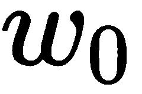 表示。其核心思想是，突触权重/强度  由网络学习，它们控制一个特定神经元对另一个神经元的影响。

此外，在*图 2*中，树突将信号传送到细胞体，细胞体将这些信号求和。如果最终结果超过某个阈值，神经元就会在计算模型中被激活。

同时，值得一提的是，我们需要控制通过轴突传递的输出脉冲频率，因此我们使用被称为**激活函数**的东西。实际上，一个常用的激活函数是 Sigmoid 函数 σ，因为它接受一个实数值输入（求和后的信号强度）并将其压缩到 0 和 1 之间。我们将在接下来的部分中看到这些激活函数的详细信息：


图 1：大脑的计算单元（http://cs231n.github.io/assets/nn1/neuron.png）

这里是生物学模型对应的基本数学模型：

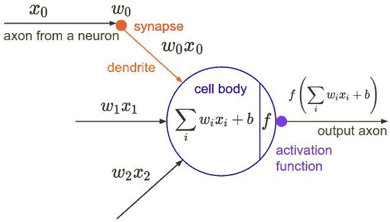

图 2：大脑计算单元的数学模型（http://cs231n.github.io/assets/nn1/neuron_model.jpeg）

神经网络中的基本计算单元是神经元，通常称为**节点**或**单元**。它接收来自其他节点或外部来源的输入，并计算输出。每个输入都有一个相关的**权重**（*`w`*），该权重根据该输入相对于其他输入的重要性分配。节点将一个函数 `f`（我们稍后会定义）应用于其输入的加权和。

因此，神经网络的一般基本计算单元称为**神经元**/**节点**/**单元**。

这个神经元接收来自前一个神经元或外部来源的输入，然后对该输入进行处理以产生所谓的激活。每个输入到这个神经元的信号都有自己的权重 ，它表示连接的强度，从而也表示该输入的重要性。

因此，神经网络这个基本构建模块的最终输出是加权求和后的输入 `w`，然后神经元通过激活函数处理加和后的输出。

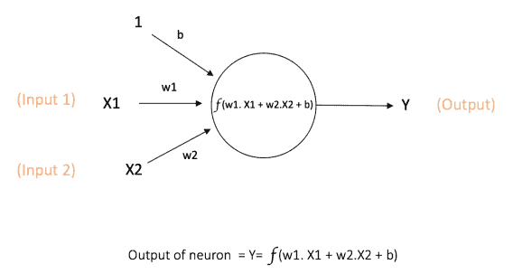

图 3：单个神经元

# 激活函数

神经元的输出如*图 3*所示进行计算，并通过激活函数进行处理，从而在输出中引入非线性。这个 `f` 称为**激活函数**。激活函数的主要目的是：

+   在神经元的输出中引入非线性。这一点非常重要，因为大多数真实世界的数据是非线性的，我们希望神经元能够学习这些非线性表示。

+   将输出压缩到特定范围内。

每个激活函数（或非线性函数）接受一个数字并对其执行一定的固定数学操作。在实际中，你可能会遇到几种激活函数。

因此，我们将简要介绍最常见的激活函数。

# Sigmoid

从历史上看，Sigmoid 激活函数在研究人员中广泛使用。该函数接受一个实数值输入，并将其压缩到 0 和 1 之间，如下图所示：

*σ(x) = 1 / (1 + exp(−x))*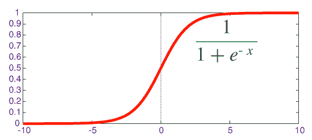

图 4：Sigmoid 激活函数

# Tanh

Tanh 是另一种激活函数，能够容忍一些负值。Tanh 接受一个实值输入，并将其压缩到 [-1, 1] 之间：

*tanh(x) = 2σ(2x) − 1*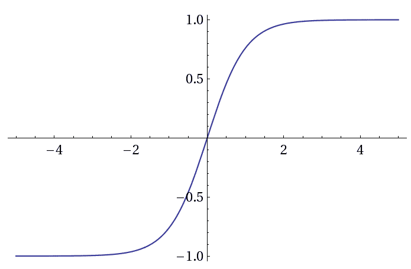

图 5：Tanh 激活函数

# ReLU

**整流线性单元**（**ReLU**）不容忍负值，因为它接受一个实值输入并将其在零处进行阈值处理（将负值替换为零）：

*f(x) = max(0, x)*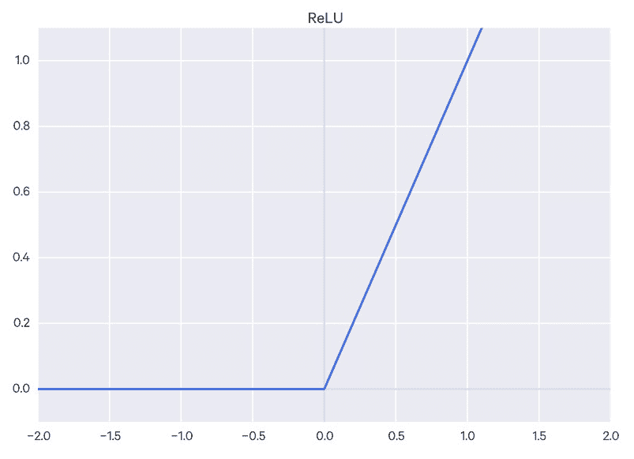

图 6：Relu 激活函数

**偏置的重要性**：偏置的主要功能是为每个节点提供一个可训练的常量值（除了节点接收的正常输入之外）。请参见此链接 [`stackoverflow.com/questions/2480650/role-of-bias-in-neural-networks`](https://stackoverflow.com/questions/2480650/role-of-bias-in-neural-networks) 了解有关神经元中偏置作用的更多信息。

# 前馈神经网络

前馈神经网络是最早且最简单的人工神经网络类型。它包含多个神经元（节点），这些神经元按层排列。相邻层的节点之间有连接或边。这些连接都有与之关联的权重。

一个前馈神经网络的示例如 *图 7* 所示：

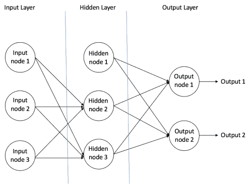

图 7：一个示例前馈神经网络

在前馈网络中，信息仅向一个方向流动——从输入节点，通过隐藏节点（如果有的话），然后到输出节点。网络中没有循环或回路（这种前馈网络的特性与循环神经网络不同，后者节点之间的连接会形成循环）。

# 多层网络的需求

**多层感知器**（**MLP**）包含一个或多个隐藏层（除了一个输入层和一个输出层）。虽然单层感知器只能学习线性函数，但 MLP 也可以学习非线性函数。

*图 7* 显示了一个具有单个隐藏层的 MLP。请注意，所有连接都有与之关联的权重，但图中仅显示了三个权重（*w0*、*w1* 和 *w2*）。

**输入层**：输入层有三个节点。偏置节点的值为 1。其他两个节点将 X1 和 X2 作为外部输入（这些数值取决于输入数据集）。如前所述，**输入层**中不执行计算，因此 **输入层** 中节点的输出分别是 *`1`*、**X1** 和 **X2**，并将其送入 **隐藏层**。

**隐藏层：** **隐藏层**也有三个节点，其中偏置节点的输出为 1。隐藏层中另外两个节点的输出依赖于来自**输入层**的输出（*`1`*，**X1** 和 **X2**），以及与连接（边）相关的权重。记住，`f`指的是激活函数。这些输出随后被馈送到**输出层**中的节点。

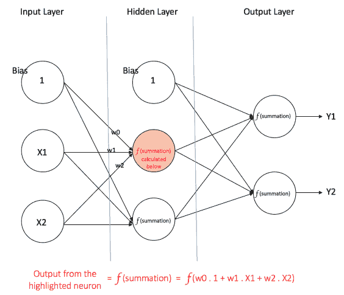

图 8：具有一个隐藏层的多层感知器

**输出层：** **输出层**有两个节点；它们从**隐藏层**接收输入，并执行类似于高亮显示的隐藏节点所示的计算。计算得出的值（**Y1** 和 **Y2**）作为多层感知器的输出。

给定一组特征 *X = (x1, x2, …)* 和目标 `y`，多层感知器可以学习特征与目标之间的关系，无论是分类问题还是回归问题。

让我们通过一个例子来更好地理解多层感知器。假设我们有以下学生成绩数据集：

**表 1 – 示例学生成绩数据集**

| **学习小时数** | **期中考试成绩** | **期末考试结果** |
| --- | --- | --- |
| 35 | 67 | 通过 |
| 12 | 75 | 未通过 |
| 16 | 89 | 通过 |
| 45 | 56 | 通过 |
| 10 | 90 | 未通过 |

这两列输入数据表示学生学习的小时数和学生在期中考试中获得的成绩。**期末结果**列可以有两个值，*`1`* 或 *`0`*，表示学生是否通过期末考试。例如，我们可以看到，如果学生学习了 35 小时并且期中考试得了 67 分，他/她最终通过了期末考试。

现在，假设我们想预测一个学生学习了 25 小时并且期中考试得了 70 分，他/她是否能通过期末考试：

**表 2 – 示例学生期末考试结果未知**

| **学习小时数** | **期中考试成绩** | **期末考试结果** |
| --- | --- | --- |
| 26 | 70 | ? |

这是一个二分类问题，其中多层感知器可以从给定的示例（训练数据）中学习，并在给定新数据点时做出有根据的预测。我们很快就会看到多层感知器如何学习这些关系。

# 训练我们的 MLP – 反向传播算法

多层感知器学习的过程称为**反向传播**算法。我推荐阅读 Hemanth Kumar 在 Quora 上的这篇回答，[`www.quora.com/How-do-you-explain-back-propagation-algorithm-to-a-beginner-in-neural-network/answer/Hemanth-Kumar-Mantri`](https://www.quora.com/How-do-you-explain-back-propagation-algorithm-to-a-beginner-in-neural-network/answer/Hemanth-Kumar-Mantri)（后面引用），该回答清晰地解释了反向传播。

"**误差反向传播**，通常简称为 BackProp，是人工神经网络（ANN）训练的几种方式之一。它是一种监督式训练方法，这意味着它从带标签的训练数据中学习（有一个监督者来引导其学习）。

简单来说，BackProp 就像是“**从错误中学习**”。每当 ANN 犯错时，监督者都会纠正它。

一个 ANN 由不同层次的节点组成：输入层、隐藏层和输出层。相邻层之间节点的连接有与之关联的“权重”。学习的目标是为这些边分配正确的权重。给定一个输入向量，这些权重决定了输出向量的值。

在监督学习中，训练集是标注的。这意味着对于某些给定的输入，我们知道期望/预期的输出（标签）。

反向传播算法：

最初，所有边的权重是随机分配的。对于训练数据集中的每个输入，激活人工神经网络（ANN）并观察其输出。将此输出与我们已知的期望输出进行比较，误差被“传播”回前一层。该误差被记录并相应地“调整”权重。这个过程会不断重复，直到输出误差低于预定的阈值。

一旦上述算法终止，我们就得到了一个“学习过”的 ANN，我们认为它已经准备好处理“新”输入。这个 ANN 被认为已经从多个示例（标注数据）以及它的错误（误差传播）中学习了。”

—Hemanth Kumar。

现在我们了解了反向传播的工作原理，让我们回到学生成绩数据集。

显示在*图 8*中的 MLP 有两个输入层节点，分别接收学习时长和期中成绩作为输入。它还拥有一个包含两个节点的隐藏层。输出层也有两个节点；上层节点输出*通过*的概率，而下层节点输出*失败*的概率。

在分类应用中，我们广泛使用 softmax 函数 ([`cs231n.github.io/linear-classify/#softmax`](http://cs231n.github.io/linear-classify/#softmax)) 作为 MLP 输出层的激活函数，以确保输出是概率，并且它们的和为 1。softmax 函数接受一个任意实数值的向量，并将其压缩成一个在 0 和 1 之间的值的向量，且它们的和为 1。因此，在此情况下：

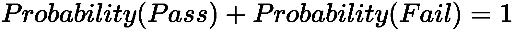

# 步骤 1 – 前向传播

网络中的所有权重都是随机初始化的。我们考虑一个特定的隐藏层节点，并称其为`V`。假设从输入到该节点的连接权重为**w1**、**w2**和**w3**（如图所示）。

然后，网络将第一个训练样本作为输入（我们知道，对于输入 35 和 67，及格的概率是 1）：

+   网络输入 = [35, 67]

+   网络期望输出（目标） = [1, 0]

然后，考虑节点的输出`V`，可以通过以下方式计算（f 是激活函数，如 sigmoid）：

*V = f (1*w1 + 35*w2 + 67*w3)*

同样，来自隐藏层的另一个节点的输出也会被计算出来。隐藏层中两个节点的输出作为输入，传递给输出层的两个节点。这使我们能够计算输出层两个节点的输出概率。

假设输出层两个节点的输出概率分别是 0.4 和 0.6（由于权重是随机分配的，输出也会是随机的）。我们可以看到，计算出来的概率（0.4 和 0.6）与期望的概率（分别是 1 和 0）相差很远，因此可以说网络产生了*错误的输出*。

# 步骤 2 – 反向传播与权重更新

我们计算输出节点的总误差，并通过反向传播将这些误差传递回网络，计算梯度。然后，我们使用诸如梯度下降之类的优化方法来调整网络中所有的权重，目的是减少输出层的误差。

假设考虑的节点的新权重是*w4*、*w5*和*w6*（经过反向传播并调整权重后）。

如果我们现在将相同的样本作为输入喂入网络，由于权重已经被优化以最小化预测误差，网络的表现应该比初始运行更好。输出节点的误差现在减少到[0.2, -0.2]，而之前是[0.6, -0.4]。这意味着我们的网络已经学会正确地分类我们的第一个训练样本。

我们对数据集中的所有其他训练样本重复这个过程。然后，我们可以说我们的网络已经学习了这些示例。

如果我们现在想预测一名学习了 25 小时并且期中考试得了 70 分的学生是否能通过期末考试，我们通过前向传播步骤，找到通过与不通过的输出概率。

我在这里避免了数学方程和梯度下降等概念的解释，而是尽量为算法建立直觉。关于反向传播算法的更深入的数学讨论，请参考这个链接：[`home.agh.edu.pl/%7Evlsi/AI/backp_t_en/backprop.html`](http://home.agh.edu.pl/%7Evlsi/AI/backp_t_en/backprop.html)。

# TensorFlow 术语回顾

本节将概述 TensorFlow 库以及基本 TensorFlow 应用程序的结构。TensorFlow 是一个开源库，用于创建大规模的机器学习应用程序；它可以在各种硬件上建模计算，从安卓设备到异构多 GPU 系统。

TensorFlow 使用一种特殊的结构来在不同的设备上执行代码，如 CPU 和 GPU。计算被定义为一个图形，每个图形由操作组成，也称为**操作**，因此每当我们使用 TensorFlow 时，我们都会在图形中定义一系列操作。

要运行这些操作，我们需要将图形加载到一个会话中。会话会翻译这些操作并将它们传递给设备进行执行。

例如，下面的图像表示了一个 TensorFlow 图形。`W`、`x` 和 `b` 是图中边缘上的张量。*MatMul* 是对张量 `W` 和 `x` 的操作；之后，调用 *Add*，并将前一个操作的结果与 `b` 相加。每个操作的结果张量会传递给下一个操作，直到最后，可以得到所需的结果。

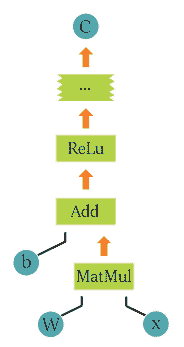

图 9：示例 TensorFlow 计算图

为了使用 TensorFlow，我们需要导入该库；我们将其命名为 `tf`，这样就可以通过写 `tf` 点号再加上模块名来访问模块：

```py
import tensorflow as tf
```

为了创建我们的第一个图形，我们将从使用源操作开始，这些操作不需要任何输入。这些源操作或源操作将把它们的信息传递给其他操作，这些操作将实际执行计算。

让我们创建两个源操作，它们将输出数字。我们将它们定义为 `A` 和 `B`，你可以在下面的代码片段中看到：

```py
A = tf.constant([2])
```

```py
B = tf.constant([3])
```

之后，我们将定义一个简单的计算操作 `tf.add()`，用来将两个元素相加。你也可以使用 `C = A + B`，如下面的代码所示：

```py
C = tf.add(A,B)
```

```py
#C = A + B is also a way to define the sum of the terms
```

由于图形需要在会话的上下文中执行，我们需要创建一个会话对象：

```py
session = tf.Session()
```

为了查看图形，让我们运行会话来获取之前定义的 `C` 操作的结果：

```py
result = session.run(C)
print(result)
```

```py
Output:
[5]
```

你可能会觉得，仅仅是加两个数字就做了很多工作，但理解 TensorFlow 的基本结构是非常重要的。一旦你理解了它，你就可以定义任何你想要的计算；再次强调，TensorFlow 的结构使它能够处理不同设备（CPU 或 GPU）甚至集群上的计算。如果你想了解更多，可以运行方法`tf.device()`。

你也可以随时实验 TensorFlow 的结构，以便更好地理解它是如何工作的。如果你想查看 TensorFlow 支持的所有数学操作，可以查阅文档。

到现在为止，你应该已经理解了 TensorFlow 的结构以及如何创建基本的应用程序。

# 使用 TensorFlow 定义多维数组

现在我们将尝试使用 TensorFlow 定义这些数组：

```py
salar_var = tf.constant([4])
vector_var = tf.constant([5,4,2])
matrix_var = tf.constant([[1,2,3],[2,2,4],[3,5,5]])
tensor = tf.constant( [ [[1,2,3],[2,3,4],[3,4,5]] , [[4,5,6],[5,6,7],[6,7,8]] , [[7,8,9],[8,9,10],[9,10,11]] ] )
with tf.Session() as session:
    result = session.run(salar_var)
    print "Scalar (1 entry):\n %s \n" % result
    result = session.run(vector_var)
    print "Vector (3 entries) :\n %s \n" % result
    result = session.run(matrix_var)
    print "Matrix (3x3 entries):\n %s \n" % result
    result = session.run(tensor)
    print "Tensor (3x3x3 entries) :\n %s \n" % result
```

```py
Output:
Scalar (1 entry):
 [2] 

Vector (3 entries) :
 [5 6 2] 

Matrix (3x3 entries):
 [[1 2 3]
 [2 3 4]
 [3 4 5]] 

Tensor (3x3x3 entries) :
 [[[ 1  2  3]
  [ 2  3  4]
  [ 3  4  5]]

 [[ 4  5  6]
  [ 5  6  7]
  [ 6  7  8]]

 [[ 7  8  9]
  [ 8  9 10]
  [ 9 10 11]]]
```

现在你已经理解了这些数据结构，我鼓励你使用一些之前的函数来尝试这些数据结构，看看它们如何根据结构类型表现：

```py
Matrix_one = tf.constant([[1,2,3],[2,3,4],[3,4,5]])
Matrix_two = tf.constant([[2,2,2],[2,2,2],[2,2,2]])
first_operation = tf.add(Matrix_one, Matrix_two)
second_operation = Matrix_one + Matrix_two
with tf.Session() as session:
    result = session.run(first_operation)
    print "Defined using tensorflow function :"
    print(result)
    result = session.run(second_operation)
    print "Defined using normal expressions :"
    print(result)
```

```py
Output:
Defined using tensorflow function :
[[3 4 5]
 [4 5 6]
 [5 6 7]]
Defined using normal expressions :
[[3 4 5]
 [4 5 6]
 [5 6 7]]
```

使用常规符号定义以及`tensorflow`函数，我们能够实现逐元素相乘，也叫做**哈达玛积**。但如果我们想要常规的矩阵乘法呢？我们需要使用另一个 TensorFlow 函数，叫做`tf.matmul()`：

```py
Matrix_one = tf.constant([[2,3],[3,4]])
Matrix_two = tf.constant([[2,3],[3,4]])
first_operation = tf.matmul(Matrix_one, Matrix_two)
with tf.Session() as session:
    result = session.run(first_operation)
    print "Defined using tensorflow function :"
    print(result)
```

```py
Output:
Defined using tensorflow function :
[[13 18]
 [18 25]]
```

我们也可以自己定义这个乘法，但已经有一个函数可以做这个，所以不需要重新发明轮子！

# 为什么使用张量？

张量结构通过赋予我们自由来帮助我们按自己想要的方式构造数据集。

这在处理图像时特别有用，因为图像中信息的编码方式。

想到图像时，很容易理解它有高度和宽度，因此用二维结构（矩阵）表示其中包含的信息是有意义的……直到你记得图像有颜色。为了添加颜色信息，我们需要另一个维度，这就是张量特别有用的地方。

图像被编码为颜色通道；图像数据在每个颜色的强度在给定点的颜色通道中表示，最常见的是 RGB（即红色、蓝色和绿色）。图像中包含的信息是每个通道颜色在图像的宽度和高度中的强度，就像这样：

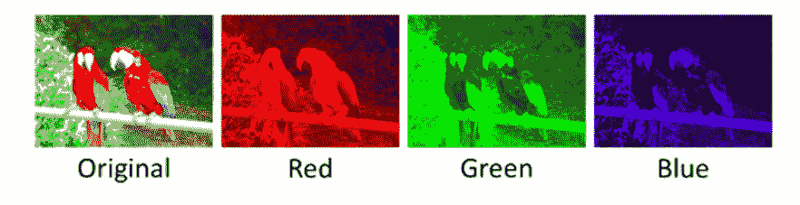

图 10：特定图像的不同颜色通道

因此，红色通道在每个点上的强度（带宽和高度）可以用矩阵表示；蓝色和绿色通道也是如此。于是，我们最终得到三个矩阵，当这些矩阵结合在一起时，就形成了一个张量。

# 变量

现在我们更熟悉数据的结构了，我们将看看 TensorFlow 如何处理变量。

要定义变量，我们使用命令`tf.variable()`。为了能够在计算图中使用变量，有必要在会话中运行图之前初始化它们。这可以通过运行`tf.global_variables_initializer()`来完成。

要更新变量的值，我们只需运行一个赋值操作，将一个值分配给变量：

```py
state = tf.Variable(0)
```

让我们首先创建一个简单的计数器，一个每次增加一个单位的变量：

```py
one = tf.constant(1)
new_value = tf.add(state, one)
update = tf.assign(state, new_value)
```

变量必须通过运行初始化操作来初始化，前提是图已启动。我们首先需要将初始化操作添加到图中：

```py
init_op = tf.global_variables_initializer()
```

然后，我们启动一个会话来运行图。

我们首先初始化变量，然后打印状态变量的初始值，最后运行更新状态变量的操作，并在每次更新后打印结果：

```py
with tf.Session() as session:
 session.run(init_op)
 print(session.run(state))
 for _ in range(3):
    session.run(update)
    print(session.run(state))
```

```py
Output:
0
1
2
3
```

# 占位符

现在，我们知道如何在 TensorFlow 中操作变量，但如果要向 TensorFlow 模型外部提供数据怎么办？

如果你想从模型外部向 TensorFlow 模型提供数据，你需要使用占位符。

那么，这些占位符是什么，它们有什么作用？占位符可以看作是模型中的*空洞*，*空洞*是你将数据传递给它的地方。你可以通过 `tf.placeholder(datatype)` 创建它们，其中 `datatype` 指定数据的类型（整数、浮点数、字符串和布尔值）以及其精度（8、16、32 和 64 位）。

每种数据类型的定义和相应的 Python 语法如下：

**表 3 – 不同 TensorFlow 数据类型的定义**

| **数据类型** | **Python 类型** | **描述** |
| --- | --- | --- |
| `DT_FLOAT` | `tf.float32` | 32 位浮点数。 |
| `DT_DOUBLE` | `tf.float64` | 64 位浮点数 |
| `DT_INT8` | `tf.int8` | 8 位带符号整数。 |
| `DT_INT16` | `tf.int16` | 16 位带符号整数。 |
| `DT_INT32` | `tf.int32` | 32 位带符号整数。 |
| `DT_INT64` | `tf.int64` | 64 位带符号整数。 |
| `DT_UINT8` | `tf.uint8` | 8 位无符号整数。 |
| `DT_STRING` | `tf.string` | 可变长度的字节数组。每个张量的元素都是一个字节数组。 |
| `DT_BOOL` | `tf.bool` | 布尔值。 |
| `DT_COMPLEX64` | `tf.complex64` | 由两个 32 位浮点数（实部和虚部）组成的复数。 |
| `DT_COMPLEX128` | `tf.complex128` | 由两个 64 位浮点数（实部和虚部）组成的复数。 |
| `DT_QINT8` | `tf.qint8` | 用于量化操作的 8 位带符号整数。 |
| `DT_QINT32` | `tf.qint32` | 用于量化操作的 32 位带符号整数。 |
| `DT_QUINT8` | `tf.quint8` | 用于量化操作的 8 位无符号整数。 |

所以，让我们创建一个占位符：

```py
a=tf.placeholder(tf.float32)
```

定义一个简单的乘法操作：

```py
b=a*2
```

现在，我们需要定义并运行会话，但由于我们在模型中创建了一个*空洞*来传递数据，因此在初始化会话时，我们必须传递一个带有数据的参数；否则会出现错误。

为了将数据传递给模型，我们调用会话时会传入一个额外的参数 `feed_dict`，在其中我们应该传递一个字典，字典的每个占位符名称后跟其对应的数据，就像这样：

```py
with tf.Session() as sess:
    result = sess.run(b,feed_dict={a:3.5})
    print result
```

```py
Output:
7.0
```

由于 TensorFlow 中的数据是以多维数组的形式传递的，我们可以通过占位符传递任何类型的张量，以获得简单的乘法操作的结果：

```py
dictionary={a: [ [ [1,2,3],[4,5,6],[7,8,9],[10,11,12] ] , [ [13,14,15],[16,17,18],[19,20,21],[22,23,24] ] ] }
with tf.Session() as sess:
    result = sess.run(b,feed_dict=dictionary)
    print result
```

```py
Output:
[[[  2\.   4\.   6.]
  [  8\.  10\.  12.]
  [ 14\.  16\.  18.]
  [ 20\.  22\.  24.]]

 [[ 26\.  28\.  30.]
  [ 32\.  34\.  36.]
  [ 38\.  40\.  42.]
  [ 44\.  46\.  48.]]]
```

# 操作

操作是表示图中张量的数学运算的节点。这些操作可以是任何类型的函数，比如加法、减法张量，或者可能是激活函数。

`tf.matmul`、`tf.add` 和 `tf.nn.sigmoid` 是 TensorFlow 中的一些操作。这些类似于 Python 中的函数，但直接作用于张量，每个函数都有特定的功能。

其他操作可以在以下网址找到：[`www.tensorflow.org/api_guides/python/math_ops`](https://www.tensorflow.org/api_guides/python/math_ops)。

让我们来尝试一些操作：

```py
a = tf.constant([5])
b = tf.constant([2])
c = tf.add(a,b)
d = tf.subtract(a,b)
with tf.Session() as session:
    result = session.run(c)
    print 'c =: %s' % result
    result = session.run(d)
    print 'd =: %s' % result
```

```py
Output:
c =: [7]
d =: [3]
```

`tf.nn.sigmoid` 是一个激活函数：它有点复杂，但这个函数有助于学习模型评估什么样的信息是有用的，什么是无用的。

# 线性回归模型——构建与训练

根据我们在第二章《数据建模实践——泰坦尼克号示例》中的线性回归解释，*数据建模实践——泰坦尼克号示例*，我们将依赖这个定义来构建一个简单的线性回归模型。

让我们首先导入实现所需的必要包：

```py
import numpy as np
import tensorflow as tf
import matplotlib.patches as mpatches
import matplotlib.pyplot as plt
plt.rcParams['figure.figsize'] = (10, 6)
```

让我们定义一个自变量：

```py
input_values = np.arange(0.0, 5.0, 0.1)
input_values
```

```py
Output:
array([ 0\. ,  0.1,  0.2,  0.3,  0.4,  0.5,  0.6,  0.7,  0.8,  0.9,  1\. ,
        1.1,  1.2,  1.3,  1.4,  1.5,  1.6,  1.7,  1.8,  1.9,  2\. ,  2.1,
        2.2,  2.3,  2.4,  2.5,  2.6,  2.7,  2.8,  2.9,  3\. ,  3.1,  3.2,
        3.3,  3.4,  3.5,  3.6,  3.7,  3.8,  3.9,  4\. ,  4.1,  4.2,  4.3,
        4.4,  4.5,  4.6,  4.7,  4.8,  4.9])
```

```py
##You can adjust the slope and intercept to verify the changes in the graph
weight=1
bias=0
output = weight*input_values + bias
plt.plot(input_values,output)
plt.ylabel('Dependent Variable')
plt.xlabel('Indepdendent Variable')
plt.show()
Output:
```

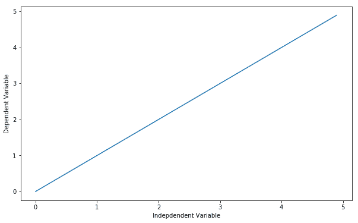

图 11：依赖变量与自变量的可视化

现在，让我们看看这如何转化为 TensorFlow 代码。

# 使用 TensorFlow 进行线性回归

在第一部分，我们将生成随机数据点并定义线性关系；我们将使用 TensorFlow 来调整并获得正确的参数：

```py
input_values = np.random.rand(100).astype(np.float32)
```

这个示例中使用的模型方程是：

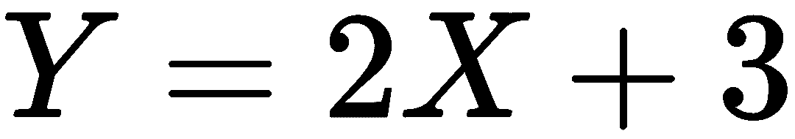

这个方程没有什么特别之处，它只是我们用来生成数据点的模型。事实上，你可以像稍后一样更改参数。我们添加了一些高斯噪声，使数据点看起来更有趣：

```py
output_values = input_values * 2 + 3
output_values = np.vectorize(lambda y: y + np.random.normal(loc=0.0, scale=0.1))(output_values)
```

这是数据的一个示例：

```py
list(zip(input_values,output_values))[5:10]
```

```py
Output:
[(0.25240293, 3.474361759429548), 
(0.946697, 4.980617375175061), 
(0.37582186, 3.650345806087635), 
(0.64025956, 4.271037640404975), 
(0.62555283, 4.37001850440196)]
```

首先，我们用任何随机猜测初始化变量  和 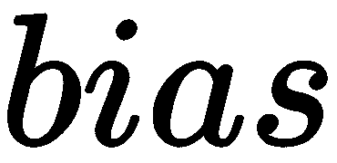，然后我们定义线性函数：

```py
weight = tf.Variable(1.0)
bias = tf.Variable(0.2)
predicted_vals = weight * input_values + bias
```

在典型的线性回归模型中，我们最小化我们希望调整的方程的平方误差，减去目标值（即我们拥有的数据），因此我们将要最小化的方程定义为损失。

为了找到损失值，我们使用 `tf.reduce_mean()`。这个函数计算多维张量的均值，结果可以具有不同的维度：

```py
model_loss = tf.reduce_mean(tf.square(predicted_vals - output_values))
```

然后，我们定义优化器方法。在这里，我们将使用简单的梯度下降法，学习率为 0.5。

现在，我们将定义图表的训练方法，但我们将使用什么方法来最小化损失呢？答案是 `tf.train.GradientDescentOptimizer`。

`.minimize()` 函数将最小化优化器的误差函数，从而得到一个更好的模型：

```py
model_optimizer = tf.train.GradientDescentOptimizer(0.5)
train = model_optimizer.minimize(model_loss)
```

别忘了在执行图表之前初始化变量：

```py
init = tf.global_variables_initializer()
sess = tf.Session()
sess.run(init)
```

现在，我们准备开始优化并运行图表：

```py
train_data = []
for step in range(100):
    evals = sess.run([train,weight,bias])[1:]
    if step % 5 == 0:
       print(step, evals)
       train_data.append(evals)
```

```py
Output:
(0, [2.5176678, 2.9857566])
(5, [2.4192538, 2.3015416])
(10, [2.5731843, 2.221911])
(15, [2.6890132, 2.1613526])
(20, [2.7763696, 2.1156814])
(25, [2.8422525, 2.0812368])
(30, [2.8919399, 2.0552595])
(35, [2.9294133, 2.0356679])
(40, [2.957675, 2.0208921])
(45, [2.9789894, 2.0097487])
(50, [2.9950645, 2.0013444])
(55, [3.0071881, 1.995006])
(60, [3.0163314, 1.9902257])
(65, [3.0232272, 1.9866205])
(70, [3.0284278, 1.9839015])
(75, [3.0323503, 1.9818509])
(80, [3.0353084, 1.9803041])
(85, [3.0375392, 1.9791379])
(90, [3.039222, 1.9782581])
(95, [3.0404909, 1.9775947])
```

让我们可视化训练过程，以适应数据点：

```py
print('Plotting the data points with their corresponding fitted line...')
converter = plt.colors
cr, cg, cb = (1.0, 1.0, 0.0)

for f in train_data:

    cb += 1.0 / len(train_data)
    cg -= 1.0 / len(train_data)

    if cb > 1.0: cb = 1.0

    if cg < 0.0: cg = 0.0

    [a, b] = f
    f_y = np.vectorize(lambda x: a*x + b)(input_values)
    line = plt.plot(input_values, f_y)
    plt.setp(line, color=(cr,cg,cb))

plt.plot(input_values, output_values, 'ro')
green_line = mpatches.Patch(color='red', label='Data Points')
plt.legend(handles=[green_line])
plt.show()
```

```py
Output:
```

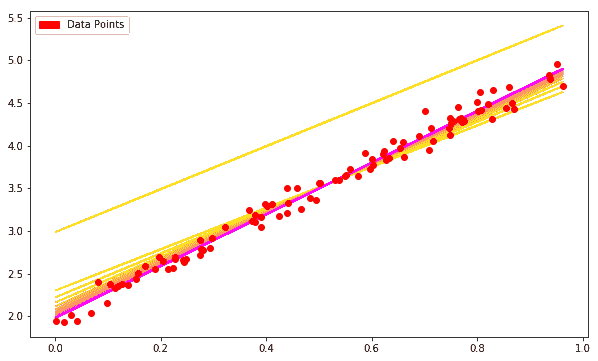

图 12：回归线拟合数据点的可视化

# 逻辑回归模型——构建与训练

同样根据我们在第二章《数据建模实践——泰坦尼克号示例》中的逻辑回归解释，*数据建模实践——泰坦尼克号示例*，我们将实现 TensorFlow 中的逻辑回归算法。简而言之，逻辑回归将输入通过逻辑/ sigmoid 函数传递，然后将结果视为概率：

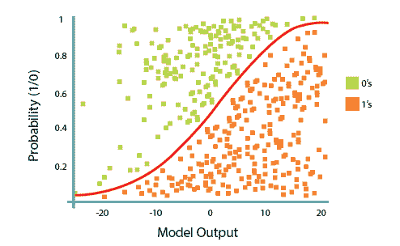

图 13：区分两个线性可分类别，0 和 1

# 在 TensorFlow 中使用逻辑回归

为了在 TensorFlow 中使用逻辑回归，我们首先需要导入我们将要使用的库。为此，你可以运行以下代码单元：

```py
import tensorflow as tf

import pandas as pd

import numpy as np
import time
from sklearn.datasets import load_iris
from sklearn.cross_validation import train_test_split
import matplotlib.pyplot as plt
```

接下来，我们将加载我们要使用的数据集。在这种情况下，我们使用内置的鸢尾花数据集。因此，不需要进行任何预处理，我们可以直接开始操作它。我们将数据集分成 `x` 和 `y`，然后再分成训练集的 `x` 和 `y` 以及测试集的 `x` 和 `y`，（伪）随机地：

```py
iris_dataset = load_iris()
iris_input_values, iris_output_values = iris_dataset.data[:-1,:], iris_dataset.target[:-1]
iris_output_values= pd.get_dummies(iris_output_values).values
train_input_values, test_input_values, train_target_values, test_target_values = train_test_split(iris_input_values, iris_output_values, test_size=0.33, random_state=42)
```

现在，我们定义了 `x` 和 `y`。这些占位符将存储我们的鸢尾花数据（包括特征和标签矩阵），并帮助将它们传递到算法的不同部分。你可以把占位符看作是空的壳子，我们将数据插入到这些壳子里。我们还需要给它们指定与数据形状相对应的形状。稍后，我们将通过 `feed_dict`（数据字典）将数据插入到这些占位符中：

# 为什么使用占位符？

TensorFlow 的这一特性使得我们可以创建一个接受数据并且知道数据形状的算法，而不需要知道进入的数据量。在训练时，当我们插入 *batch* 数据时，我们可以轻松调整每次训练步骤中训练样本的数量，而无需改变整个算法：

```py
# numFeatures is the number of features in our input data.
# In the iris dataset, this number is '4'.
num_explanatory_features = train_input_values.shape[1]

# numLabels is the number of classes our data points can be in.
# In the iris dataset, this number is '3'.
num_target_values = train_target_values.shape[1]

# Placeholders
# 'None' means TensorFlow shouldn't expect a fixed number in that dimension
input_values = tf.placeholder(tf.float32, [None, num_explanatory_features]) # Iris has 4 features, so X is a tensor to hold our data.
output_values = tf.placeholder(tf.float32, [None, num_target_values]) # This will be our correct answers matrix for 3 classes.

```

# 设置模型的权重和偏置

和线性回归类似，我们需要一个共享的变量权重矩阵用于逻辑回归。我们将 `W` 和 `b` 都初始化为全零的张量。因为我们将要学习 `W` 和 `b`，所以它们的初始值并不重要。这些变量是定义我们回归模型结构的对象，我们可以在训练后保存它们，以便以后重用。

我们定义了两个 TensorFlow 变量作为我们的参数。这些变量将存储我们逻辑回归的权重和偏置，并且在训练过程中会不断更新。

请注意，`W` 的形状是 [4, 3]，因为我们希望将 4 维的输入向量与其相乘，以产生 3 维的证据向量来区分不同的类别。`b` 的形状是 [3]，因此我们可以将它加到输出中。此外，与我们的占位符（本质上是等待数据的空壳）不同，TensorFlow 变量需要用值进行初始化，比如使用零初始化：

```py
#Randomly sample from a normal distribution with standard deviation .01

weights = tf.Variable(tf.random_normal([num_explanatory_features,num_target_values],
                                      mean=0,
                                      stddev=0.01,
                                      name="weights"))

biases = tf.Variable(tf.random_normal([1,num_target_values],
                                   mean=0,
                                   stddev=0.01,
                                   name="biases"))
```

# 逻辑回归模型

我们现在定义我们的操作，以便正确地运行逻辑回归。逻辑回归通常被视为一个单一的方程：

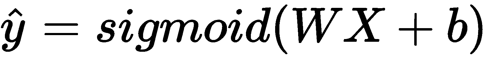

然而，为了清晰起见，我们可以将其拆分为三个主要部分：

+   一个加权特征矩阵乘法操作

+   对加权特征和偏置项的求和

+   最后，应用 Sigmoid 函数

因此，您将会发现这些组件被定义为三个独立的操作：

```py
# Three-component breakdown of the Logistic Regression equation.
# Note that these feed into each other.
apply_weights = tf.matmul(input_values, weights, name="apply_weights")
add_bias = tf.add(apply_weights, biases, name="add_bias")
activation_output = tf.nn.sigmoid(add_bias, name="activation")
```

正如我们之前所看到的，我们将使用的函数是逻辑函数，在应用权重和偏差后将输入数据提供给它。在 TensorFlow 中，这个函数被实现为`nn.sigmoid`函数。有效地，它将带有偏差的加权输入拟合到 0-100 百分比曲线中，这是我们想要的概率函数。

# 训练

学习算法是如何搜索最佳权重向量（`w`）的。这个搜索是一个优化问题，寻找能够优化错误/成本度量的假设。

因此，模型的成本或损失函数将告诉我们我们的模型不好，我们需要最小化这个函数。您可以遵循不同的损失或成本标准。在这个实现中，我们将使用**均方误差**（**MSE**）作为损失函数。

为了完成最小化损失函数的任务，我们将使用梯度下降算法。

# 成本函数

在定义我们的成本函数之前，我们需要定义我们将要训练多长时间以及我们应该如何定义学习速率：

```py
#Number of training epochs
num_epochs = 700
# Defining our learning rate iterations (decay)
learning_rate = tf.train.exponential_decay(learning_rate=0.0008,
                                          global_step=1,
                                          decay_steps=train_input_values.shape[0],
                                          decay_rate=0.95,
                                          staircase=True)

# Defining our cost function - Squared Mean Error
model_cost = tf.nn.l2_loss(activation_output - output_values, name="squared_error_cost")
# Defining our Gradient Descent
model_train = tf.train.GradientDescentOptimizer(learning_rate).minimize(model_cost)
```

现在，是时候通过会话变量执行我们的计算图了。

首先，我们需要使用`tf.initialize_all_variables()`将我们的权重和偏差初始化为零或随机值。这个初始化步骤将成为我们计算图中的一个节点，当我们将图放入会话中时，操作将运行并创建变量：

```py
# tensorflow session
sess = tf.Session()

# Initialize our variables.
init = tf.global_variables_initializer()
sess.run(init)

#We also want some additional operations to keep track of our model's efficiency over time. We can do this like so:
# argmax(activation_output, 1) returns the label with the most probability
# argmax(output_values, 1) is the correct label
correct_predictions = tf.equal(tf.argmax(activation_output,1),tf.argmax(output_values,1))

# If every false prediction is 0 and every true prediction is 1, the average returns us the accuracy
model_accuracy = tf.reduce_mean(tf.cast(correct_predictions, "float"))

# Summary op for regression output
activation_summary = tf.summary.histogram("output", activation_output)

# Summary op for accuracy
accuracy_summary = tf.summary.scalar("accuracy", model_accuracy)

# Summary op for cost
cost_summary = tf.summary.scalar("cost", model_cost)

# Summary ops to check how variables weights and biases are updating after each iteration to be visualized in TensorBoard
weight_summary = tf.summary.histogram("weights", weights.eval(session=sess))
bias_summary = tf.summary.histogram("biases", biases.eval(session=sess))

merged = tf.summary.merge([activation_summary, accuracy_summary, cost_summary, weight_summary, bias_summary])
writer = tf.summary.FileWriter("summary_logs", sess.graph)

#Now we can define and run the actual training loop, like this:
# Initialize reporting variables

inital_cost = 0
diff = 1
epoch_vals = []
accuracy_vals = []
costs = []

# Training epochs
for i in range(num_epochs):
    if i > 1 and diff < .0001:
       print("change in cost %g; convergence."%diff)
       break

    else:
       # Run training step
       step = sess.run(model_train, feed_dict={input_values: train_input_values, output_values: train_target_values})

       # Report some stats evert 10 epochs
       if i % 10 == 0:
           # Add epoch to epoch_values
           epoch_vals.append(i)

           # Generate the accuracy stats of the model
           train_accuracy, new_cost = sess.run([model_accuracy, model_cost], feed_dict={input_values: train_input_values, output_values: train_target_values})

           # Add accuracy to live graphing variable
           accuracy_vals.append(train_accuracy)

           # Add cost to live graphing variable
           costs.append(new_cost)
>
           # Re-assign values for variables
           diff = abs(new_cost - inital_cost)
           cost = new_cost

           print("Training step %d, accuracy %g, cost %g, cost change %g"%(i, train_accuracy, new_cost, diff))
```

```py
Output:
Training step 0, accuracy 0.343434, cost 34.6022, cost change 34.6022
Training step 10, accuracy 0.434343, cost 30.3272, cost change 30.3272
Training step 20, accuracy 0.646465, cost 28.3478, cost change 28.3478
Training step 30, accuracy 0.646465, cost 26.6752, cost change 26.6752
Training step 40, accuracy 0.646465, cost 25.2844, cost change 25.2844
Training step 50, accuracy 0.646465, cost 24.1349, cost change 24.1349
Training step 60, accuracy 0.646465, cost 23.1835, cost change 23.1835
Training step 70, accuracy 0.646465, cost 22.3911, cost change 22.3911
Training step 80, accuracy 0.646465, cost 21.7254, cost change 21.7254
Training step 90, accuracy 0.646465, cost 21.1607, cost change 21.1607
Training step 100, accuracy 0.666667, cost 20.677, cost change 20.677
Training step 110, accuracy 0.666667, cost 20.2583, cost change 20.2583
Training step 120, accuracy 0.666667, cost 19.8927, cost change 19.8927
Training step 130, accuracy 0.666667, cost 19.5705, cost change 19.5705
Training step 140, accuracy 0.666667, cost 19.2842, cost change 19.2842
Training step 150, accuracy 0.666667, cost 19.0278, cost change 19.0278
Training step 160, accuracy 0.676768, cost 18.7966, cost change 18.7966
Training step 170, accuracy 0.69697, cost 18.5867, cost change 18.5867
Training step 180, accuracy 0.69697, cost 18.3951, cost change 18.3951
Training step 190, accuracy 0.717172, cost 18.2191, cost change 18.2191
Training step 200, accuracy 0.717172, cost 18.0567, cost change 18.0567
Training step 210, accuracy 0.737374, cost 17.906, cost change 17.906
Training step 220, accuracy 0.747475, cost 17.7657, cost change 17.7657
Training step 230, accuracy 0.747475, cost 17.6345, cost change 17.6345
Training step 240, accuracy 0.757576, cost 17.5113, cost change 17.5113
Training step 250, accuracy 0.787879, cost 17.3954, cost change 17.3954
Training step 260, accuracy 0.787879, cost 17.2858, cost change 17.2858
Training step 270, accuracy 0.787879, cost 17.182, cost change 17.182
Training step 280, accuracy 0.787879, cost 17.0834, cost change 17.0834
Training step 290, accuracy 0.787879, cost 16.9895, cost change 16.9895
Training step 300, accuracy 0.79798, cost 16.8999, cost change 16.8999
Training step 310, accuracy 0.79798, cost 16.8141, cost change 16.8141
Training step 320, accuracy 0.79798, cost 16.732, cost change 16.732
Training step 330, accuracy 0.79798, cost 16.6531, cost change 16.6531
Training step 340, accuracy 0.808081, cost 16.5772, cost change 16.5772
Training step 350, accuracy 0.818182, cost 16.5041, cost change 16.5041
Training step 360, accuracy 0.838384, cost 16.4336, cost change 16.4336
Training step 370, accuracy 0.838384, cost 16.3655, cost change 16.3655
Training step 380, accuracy 0.838384, cost 16.2997, cost change 16.2997
Training step 390, accuracy 0.838384, cost 16.2359, cost change 16.2359
Training step 400, accuracy 0.848485, cost 16.1741, cost change 16.1741
Training step 410, accuracy 0.848485, cost 16.1141, cost change 16.1141
Training step 420, accuracy 0.848485, cost 16.0558, cost change 16.0558
Training step 430, accuracy 0.858586, cost 15.9991, cost change 15.9991
Training step 440, accuracy 0.858586, cost 15.944, cost change 15.944
Training step 450, accuracy 0.858586, cost 15.8903, cost change 15.8903
Training step 460, accuracy 0.868687, cost 15.8379, cost change 15.8379
Training step 470, accuracy 0.878788, cost 15.7869, cost change 15.7869
Training step 480, accuracy 0.878788, cost 15.7371, cost change 15.7371
Training step 490, accuracy 0.878788, cost 15.6884, cost change 15.6884
Training step 500, accuracy 0.878788, cost 15.6409, cost change 15.6409
Training step 510, accuracy 0.878788, cost 15.5944, cost change 15.5944
Training step 520, accuracy 0.878788, cost 15.549, cost change 15.549
Training step 530, accuracy 0.888889, cost 15.5045, cost change 15.5045
Training step 540, accuracy 0.888889, cost 15.4609, cost change 15.4609
Training step 550, accuracy 0.89899, cost 15.4182, cost change 15.4182
Training step 560, accuracy 0.89899, cost 15.3764, cost change 15.3764
Training step 570, accuracy 0.89899, cost 15.3354, cost change 15.3354
Training step 580, accuracy 0.89899, cost 15.2952, cost change 15.2952
Training step 590, accuracy 0.909091, cost 15.2558, cost change 15.2558
Training step 600, accuracy 0.909091, cost 15.217, cost change 15.217
Training step 610, accuracy 0.909091, cost 15.179, cost change 15.179
Training step 620, accuracy 0.909091, cost 15.1417, cost change 15.1417
Training step 630, accuracy 0.909091, cost 15.105, cost change 15.105
Training step 640, accuracy 0.909091, cost 15.0689, cost change 15.0689
Training step 650, accuracy 0.909091, cost 15.0335, cost change 15.0335
Training step 660, accuracy 0.909091, cost 14.9987, cost change 14.9987
Training step 670, accuracy 0.909091, cost 14.9644, cost change 14.9644
Training step 680, accuracy 0.909091, cost 14.9307, cost change 14.9307
Training step 690, accuracy 0.909091, cost 14.8975, cost change 14.8975

```

现在，是时候看看我们训练好的模型在`iris`数据集上的表现了，让我们将训练好的模型与测试集进行测试：

```py
# test the model against the test set
print("final accuracy on test set: %s" %str(sess.run(model_accuracy,
                                                    feed_dict={input_values: test_input_values,
                                                               output_values: test_target_values}))
```

```py
Output:
final accuracy on test set: 0.9
```

在测试集上获得 0.9 的准确率真的很好，您可以通过更改 epochs 的数量尝试获得更好的结果。

# 摘要

在本章中，我们对神经网络进行了基本解释，并讨论了多层神经网络的需求。我们还涵盖了 TensorFlow 的计算图模型，并举了一些基本的例子，如线性回归和逻辑回归。

接下来，我们将通过更高级的例子，展示如何使用 TensorFlow 构建像手写字符识别之类的东西。我们还将解决传统机器学习中已经替代特征工程的核心架构工程思想。
