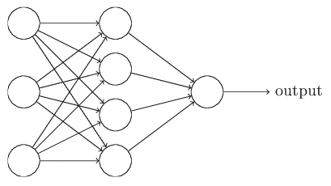

# 第六章：深度前馈神经网络 - 实现数字分类

**前馈神经网络**（**FNN**）是一种特殊类型的神经网络，其中神经元之间的连接/链接不形成循环。因此，它不同于我们在本书后面将学习的其他神经网络架构（如递归神经网络）。FNN 是广泛使用的架构，也是最早和最简单的神经网络类型。

本章中，我们将讲解典型的前馈神经网络（FNN）架构，并使用 TensorFlow 库进行实现。掌握这些概念后，我们将通过一个实际的数字分类示例进行说明。这个示例的问题是，*给定一组包含手写数字的图像，你如何将这些图像分类为 10 个不同的类别（0-9）*？

本章将涵盖以下主题：

+   隐藏单元和架构设计

+   MNIST 数据集分析

+   数字分类 - 模型构建与训练

# 隐藏单元和架构设计

在下一节中，我们将回顾人工神经网络；它们在分类任务中表现良好，例如分类手写数字。

假设我们有如下所示的网络，参见*图 1*：



图 1：具有一个隐藏层的简单 FNN

如前所述，这个网络中最左侧的层被称为**输入层**，这一层内的神经元被称为**输入神经元**。最右侧的层或输出层包含输出神经元，或者在本例中，仅包含一个输出神经元。中间的层被称为**隐藏层**，因为这一层中的神经元既不是输入神经元，也不是输出神经元。术语“隐藏”可能听起来有些神秘——我第一次听到这个词时，觉得它一定有某种深奥的哲学或数学意义——但它实际上仅仅意味着*既不是输入也不是输出*。就这么简单。前面的网络只有一个隐藏层，但有些网络有多个隐藏层。例如，下面这个四层的网络就有两个隐藏层：


图 2：具有更多隐藏层的人工神经网络

输入层、隐藏层和输出层的架构非常简单明了。例如，我们通过一个实际的例子来看一下，如何判断一张手写图像是否包含数字 9。

首先，我们将输入图像的像素传递给输入层；例如，在 MNIST 数据集中，我们有单色图像。每一张图像的尺寸为 28×28，因此我们需要在输入层中有 28×28 = 784 个神经元来接收这个输入图像。

在输出层，我们只需要一个神经元，该神经元输出一个概率（或得分），表示该图像是否包含数字 9。例如，输出值大于 0.5 表示该图像包含数字 9，如果小于 0.5，则表示该输入图像不包含数字 9。

所以这种类型的网络，其中一个层的输出作为输入传递给下一层，称为 FNN（前馈神经网络）。这种层与层之间的顺序性意味着网络中没有循环。

# MNIST 数据集分析

在这一部分，我们将亲自动手实现一个手写图像的分类器。这种实现可以被看作是神经网络的 *Hello world!*。

MNIST 是一个广泛使用的数据集，用于基准测试机器学习技术。该数据集包含一组手写数字，像这里展示的这些：


图 3：MNIST 数据集中的样本数字

所以，数据集包括手写图像及其对应的标签。

在这一部分，我们将基于这些图像训练一个基本的模型，目标是识别输入图像中的手写数字。

此外，您会发现我们可以通过非常少的代码行来完成这个分类任务，但这个实现的核心思想是理解构建神经网络解决方案的基本组件。此外，我们还将涵盖在此实现中神经网络的主要概念。

# MNIST 数据

MNIST 数据托管在 Yann LeCun 的网站上 ([`yann.lecun.com/exdb/mnist/`](http://yann.lecun.com/exdb/mnist/))。幸运的是，TensorFlow 提供了一些辅助函数来下载数据集，所以让我们先用以下两行代码下载数据集：

```py
from tensorflow.examples.tutorials.mnist import input_data
mnist_dataset = input_data.read_data_sets("MNIST_data/", one_hot=True)
```

MNIST 数据分为三部分：55,000 个训练数据点（`mnist.train`），10,000 个测试数据点（`mnist.test`），和 5,000 个验证数据点（`mnist.validation`）。这种划分非常重要；在机器学习中，必须有独立的数据集，我们不能从这些数据中学习，以确保我们的学习结果具有泛化能力！

如前所述，每个 MNIST 样本有两个部分：一个手写数字的图像和它对应的标签。训练集和测试集都包含图像及其相应的标签。例如，训练图像是 `mnist.train.images`，训练标签是 `mnist.train.labels`。

每张图片的尺寸为 28 像素 x 28 像素。我们可以将其解释为一个包含数字的大数组：


图 4：MNIST 数字的矩阵表示（强度值）

为了将这张像素值矩阵输入到神经网络的输入层，我们需要将矩阵展平为一个包含 784 个值的向量。因此，数据集的最终形状将是一个 784 维的向量空间。

结果是 `mnist.train.images` 是一个形状为 `(55000, 784)` 的张量。第一个维度是图像列表的索引，第二个维度是每个图像中每个像素的索引。张量中的每个条目是一个特定图像中特定像素的像素强度，值在 0 到 1 之间：


图 5：MNIST 数据分析

如前所述，数据集中的每个图像都有一个对应的标签，范围从 0 到 9。

对于本实现，我们将标签编码为 one-hot 向量。One-hot 向量是一个除了表示该向量所代表的数字索引位置为 1 之外，其它位置全为 0 的向量。例如，3 将是 [0,0,0,1,0,0,0,0,0,0]。因此，`mnist.train.labels` 是一个形状为 `(55000, 10)` 的浮点数组：


图 6：MNIST 数据分析

# 数字分类 – 模型构建与训练

现在，让我们开始构建我们的模型。所以，我们的数据集有 10 个类别，分别是 0 到 9，目标是将任何输入图像分类为其中一个类别。我们不会仅仅给出输入图像属于哪个类别的硬性判断，而是将输出一个包含 10 个可能值的向量（因为我们有 10 个类别）。它将表示每个数字从 0 到 9 为输入图像的正确类别的概率。

例如，假设我们输入一个特定的图像。模型可能 70% 确定这个图像是 9，10% 确定这个图像是 8，依此类推。所以，我们将在这里使用 softmax 回归，它将产生介于 0 和 1 之间的值。

Softmax 回归有两个步骤：首先我们将输入属于某些类别的证据加总，然后将这些证据转换为概率。

为了统计某个图像属于特定类别的证据，我们对像素强度进行加权求和。如果某个像素强度高则反映该图像不属于该类别，则权重为负；如果它支持该图像属于该类别，则权重为正。

*图 7* 显示了模型为每个类别学到的权重。红色代表负权重，蓝色代表正权重：


图 7：模型为每个 MNIST 类别学到的权重

我们还添加了一些额外的证据，称为 **偏置**。基本上，我们希望能够说某些事情在不依赖于输入的情况下更有可能。结果是，给定输入 `x` 时，类别 `i` 的证据为：


其中：

+   `Wᵢ` 是权重

+   `bᵢ` 是类别 `i` 的偏置

+   `j` 是用来对输入图像 `x` 中的像素求和的索引。

然后，我们使用 softmax 函数将证据总和转换为我们的预测概率 `y`：

*y = softmax(证据)*

在这里，softmax 作为激活或连接函数，塑造了我们线性函数的输出形式，我们希望它是一个 10 类的概率分布（因为我们有 10 个可能的类，范围是 0 到 9）。你可以将其看作是将证据的统计数据转换为输入属于每个类的概率。它的定义是：

*softmax(证据) = 归一化(exp(证据))*

如果你展开这个方程，你会得到：


但通常更有帮助的是按第一种方式理解 softmax：对其输入进行指数运算，然后进行归一化。指数运算意味着多一个证据单位会使任何假设的权重指数级增长。反过来，减少一个证据单位意味着该假设的权重会减少。没有任何假设的权重会为零或负值。然后，softmax 对这些权重进行归一化，使它们的和为 1，形成一个有效的概率分布。

你可以把我们的 softmax 回归想象成以下的样子，尽管它会有更多的 `x`'s。对于每个输出，我们计算 `x`'s 的加权和，加入偏置，然后应用 softmax：


图 8：softmax 回归的可视化

如果我们将其写成方程式，我们得到：


图 9：softmax 回归的方程表示

我们可以使用向量表示法来处理这个过程。这意味着我们将其转换为矩阵乘法和向量加法。这对于计算效率和可读性非常有帮助：


图 10：softmax 回归方程的向量化表示

更简洁地，我们可以写成：

*y = softmax(W[x] + b)*

现在，让我们将其转换为 TensorFlow 可以使用的形式。

# 数据分析

那么，让我们开始实现我们的分类器。我们首先导入实现所需的包：

```py
import tensorflow as tf
import matplotlib.pyplot as plt
import numpy as np
import random as ran
```

接下来，我们将定义一些辅助函数，以便从我们下载的原始数据集中进行子集选择：

```py
#Define some helper functions 
# to assign the size of training and test data we will take from MNIST dataset
def train_size(size):
    print ('Total Training Images in Dataset = ' + str(mnist_dataset.train.images.shape))
    print ('############################################')
    input_values_train = mnist_dataset.train.images[:size,:]
    print ('input_values_train Samples Loaded = ' + str(input_values_train.shape))
    target_values_train = mnist_dataset.train.labels[:size,:]
    print ('target_values_train Samples Loaded = ' + str(target_values_train.shape))
    return input_values_train, target_values_train

def test_size(size):
    print ('Total Test Samples in MNIST Dataset = ' + str(mnist_dataset.test.images.shape))
    print ('############################################')
    input_values_test = mnist_dataset.test.images[:size,:]
    print ('input_values_test Samples Loaded = ' + str(input_values_test.shape))
    target_values_test = mnist_dataset.test.labels[:size,:]
    print ('target_values_test Samples Loaded = ' + str(target_values_test.shape))
    return input_values_test, target_values_test
```

此外，我们还将定义两个辅助函数，用于显示数据集中的特定数字，或者甚至显示某个图像子集的平铺版本：

```py
#Define a couple of helper functions for digit images visualization
def visualize_digit(ind):
    print(target_values_train[ind])
    target = target_values_train[ind].argmax(axis=0)
    true_image = input_values_train[ind].reshape([28,28])
    plt.title('Sample: %d Label: %d' % (ind, target))
    plt.imshow(true_image, cmap=plt.get_cmap('gray_r'))
    plt.show()

def visualize_mult_imgs_flat(start, stop):
    imgs = input_values_train[start].reshape([1,784])
    for i in range(start+1,stop):
        imgs = np.concatenate((imgs, input_values_train[i].reshape([1,784])))
    plt.imshow(imgs, cmap=plt.get_cmap('gray_r'))
    plt.show()
```

现在，让我们开始正式处理数据集。我们将定义我们希望从原始数据集中加载的训练和测试示例。

现在，我们将开始构建和训练我们的模型。首先，我们定义变量，指定我们希望加载的训练和测试示例的数量。目前，我们将加载所有数据，但稍后会更改这个值以节省资源：

```py
input_values_train, target_values_train = train_size(55000)

Output:
Total Training Images in Dataset = (55000, 784)
############################################
input_values_train Samples Loaded = (55000, 784)
target_values_train Samples Loaded = (55000, 10)
```

所以现在，我们有一个包含 55,000 个手写数字样本的训练集，每个样本是 28×28 像素的图像，经过展平成为 784 维的向量。我们还拥有这些样本对应的标签，采用 one-hot 编码格式。

`target_values_train`数据是所有`input_values_train`样本的关联标签。在以下示例中，数组代表数字 7 的独热编码格式：


图 11：数字 7 的独热编码

所以让我们从数据集中随机选择一张图片并看看它是什么样子的，我们将使用之前的辅助函数来显示数据集中的随机数字：

```py
visualize_digit(ran.randint(0, input_values_train.shape[0]))

Output:
```


图 12：`display_digit`方法的输出数字

我们还可以使用之前定义的辅助函数来可视化一堆展平后的图片。展平向量中的每个值代表一个像素的强度，因此可视化这些像素将是这样的：

```py
visualize_mult_imgs_flat(0,400)
```


图 13：前 400 个训练样本

# 构建模型

到目前为止，我们还没有开始为这个分类器构建计算图。让我们先创建一个会负责执行我们将要构建的计算图的会话变量：

```py
sess = tf.Session()
```

接下来，我们将定义我们模型的占位符，这些占位符将用于将数据传递到计算图中：

```py
input_values = tf.placeholder(tf.float32, shape=[None, 784]
```

当我们在占位符的第一个维度指定`None`时，这意味着该占位符可以接受任意数量的样本。在这种情况下，我们的占位符可以接收任何数量的样本，每个样本有一个`784`的值。

现在，我们需要定义另一个占位符来传入图片标签。我们将在之后使用这个占位符来将模型的预测与图像的实际标签进行比较：

```py
output_values = tf.placeholder(tf.float32, shape=[None, 10])
```

接下来，我们将定义`weights`和`biases`。这两个变量将成为我们网络的可训练参数，它们将是进行未知数据预测时所需的唯一两个变量：

```py
weights = tf.Variable(tf.zeros([784,10]))
biases = tf.Variable(tf.zeros([10]))
```

我喜欢把这些`weights`看作是每个数字的 10 张备忘单。这类似于老师用备忘单来给多选考试打分。

现在我们将定义我们的 softmax 回归，它是我们的分类器函数。这个特殊的分类器叫做**多项式逻辑回归**，我们通过将数字的展平版本与权重相乘然后加上偏差来做出预测：

```py
softmax_layer = tf.nn.softmax(tf.matmul(input_values,weights) + biases)
```

首先，让我们忽略 softmax，看看 softmax 函数内部的内容。`matmul`是 TensorFlow 用于矩阵乘法的函数。如果你了解矩阵乘法（[`en.wikipedia.org/wiki/Matrix_multiplication`](https://en.wikipedia.org/wiki/Matrix_multiplication)），你就会明白它是如何正确计算的，并且：


将导致一个由训练样本数（`m`） × 类别数（`n`）的矩阵：


图 13：简单的矩阵乘法。

你可以通过评估`softmax_layer`来确认这一点：

```py
print(softmax_layer)
Output:
Tensor("Softmax:0", shape=(?, 10), dtype=float32)
```

现在，让我们用之前定义的计算图，使用训练集中的三个样本来进行实验，看看它是如何工作的。为了执行计算图，我们需要使用之前定义的会话变量。并且，我们需要使用`tf.global_variables_initializer()`来初始化变量。

现在，我们仅向计算图输入三个样本进行实验：

```py
input_values_train, target_values_train = train_size(3)
sess.run(tf.global_variables_initializer())
#If using TensorFlow prior to 0.12 use:
#sess.run(tf.initialize_all_variables())
print(sess.run(softmax_layer, feed_dict={input_values: input_values_train}))
```

```py
Output:

[[ 0.1  0.1  0.1  0.1  0.1  0.1  0.1  0.1  0.1  0.1]
 [ 0.1  0.1  0.1  0.1  0.1  0.1  0.1  0.1  0.1  0.1]
 [ 0.1  0.1  0.1  0.1  0.1  0.1  0.1  0.1  0.1  0.1]]
```

在这里，你可以看到模型对于输入的三个训练样本的预测结果。目前，模型还没有学到任何关于我们任务的东西，因为我们还没有经过训练过程，所以它只是输出每个数字为输入样本正确类别的 10% 概率。

如前所述，softmax 是一种激活函数，它将输出压缩到 0 到 1 之间，TensorFlow 对 softmax 的实现确保单个输入样本的所有概率加起来为 1。

让我们稍微实验一下 TensorFlow 的 softmax 函数：

```py
sess.run(tf.nn.softmax(tf.zeros([4])))
sess.run(tf.nn.softmax(tf.constant([0.1, 0.005, 2])))

Output:
array([0.11634309, 0.10579926, 0.7778576 ], dtype=float32)
```

接下来，我们需要为这个模型定义损失函数，来衡量分类器在尝试为输入图像分配类别时的好坏。模型的准确度是通过比较数据集中实际的值与模型输出的预测值来计算的。

目标是减少实际值和预测值之间的误分类。

交叉熵的定义为：


其中：

+   `y`是我们预测的概率分布

+   *y'*是实际分布（带有数字标签的独热编码向量）

在某种粗略的意义上，交叉熵衡量了我们预测值在描述实际输入时的低效程度。

我们可以实现交叉熵函数：

```py
model_cross_entropy = tf.reduce_mean(-tf.reduce_sum(output_values * tf.log(softmax_layer), reduction_indices=[1]))
```

这个函数对所有从 `softmax_layer`（其值在 0 到 1 之间）得到的预测取对数，并按元素逐个与示例的真实值 `output_values` 相乘（[`en.wikipedia.org/wiki/Hadamard_product_%28matrices%29`](https://en.wikipedia.org/wiki/Hadamard_product_%28matrices%29)）。如果每个值的 `log` 函数接近零，它将使值变成一个大负数（`-np.log(0.01) = 4.6`）；如果接近一，它将使值变成一个小负数（`-np.log(0.99) = 0.1`）：


图 15：Y = log(x) 的可视化

本质上，如果预测结果自信地错误，我们会用一个非常大的数字来惩罚分类器；如果预测结果自信地正确，我们则用一个非常小的数字来惩罚。

这里是一个简单的 Python 示例，展示了一个对数字为 3 的预测非常自信的 softmax 预测：

```py
j = [0.03, 0.03, 0.01, 0.9, 0.01, 0.01, 0.0025,0.0025, 0.0025, 0.0025]
```

让我们创建一个值为 3 的数组标签作为真实值，以便与 softmax 函数进行比较：

```py
k = [0,0,0,1,0,0,0,0,0,0]
```

你能猜到我们的损失函数给出的值是什么吗？你能看到 `j` 的对数如何用一个大的负数惩罚错误答案吗？试试这个来理解：

```py
-np.log(j)
-np.multiply(np.log(j),k)
```

当它们全部加起来时，这将返回九个零和 0.1053 的值；我们可以认为这是一个很好的预测。注意当我们对实际上是 2 的预测做出同样的预测时会发生什么：

```py
k = [0,0,1,0,0,0,0,0,0,0]
np.sum(-np.multiply(np.log(j),k))
```

现在，我们的`cross_entropy`函数给出了 4.6051，显示了一个严重惩罚的、预测不良的预测。由于分类器非常确信它是 3，而实际上是 2，因此受到了严重的惩罚。

接下来，我们开始训练我们的分类器。为了训练它，我们必须开发适当的 W 和 b 的值，以便给出尽可能低的损失。

现在，如果我们希望，我们可以为训练分配自定义变量。以下所有大写的值都可以更改和搞砸。事实上，我鼓励这样做！首先，使用这些值，然后注意当您使用太少的训练示例或学习率过高或过低时会发生什么：

```py
input_values_train, target_values_train = train_size(5500)
input_values_test, target_values_test = test_size(10000)
learning_rate = 0.1
num_iterations = 2500
```

现在，我们可以初始化所有变量，以便它们可以被我们的 TensorFlow 图使用：

```py
init = tf.global_variables_initializer()
#If using TensorFlow prior to 0.12 use:
#init = tf.initialize_all_variables()
sess.run(init)
```

接下来，我们需要使用梯度下降算法训练分类器。因此，我们首先定义我们的训练方法和一些用于测量模型准确性的变量。变量`train`将执行梯度下降优化器，选择一个学习率来最小化模型损失函数`model_cross_entropy`：

```py
train = tf.train.GradientDescentOptimizer(learning_rate).minimize(model_cross_entropy)
model_correct_prediction = tf.equal(tf.argmax(softmax_layer,1), tf.argmax(output_values,1))
model_accuracy = tf.reduce_mean(tf.cast(model_correct_prediction, tf.float32))
```

# 模型训练

现在，我们将定义一个循环，它将迭代`num_iterations`次。对于每个循环，它都会运行训练，使用`feed_dict`从`input_values_train`和`target_values_train`中提供值。

为了计算准确性，它将测试模型对`input_values_test`中的未见数据的表现：

```py
for i in range(num_iterations+1):
    sess.run(train, feed_dict={input_values: input_values_train, output_values: target_values_train})
    if i%100 == 0:
        print('Training Step:' + str(i) + ' Accuracy = ' + str(sess.run(model_accuracy, feed_dict={input_values: input_values_test, output_values: target_values_test})) + ' Loss = ' + str(sess.run(model_cross_entropy, {input_values: input_values_train, output_values: target_values_train})))

Output:
Training Step:0 Accuracy = 0.5988 Loss = 2.1881988
Training Step:100 Accuracy = 0.8647 Loss = 0.58029664
Training Step:200 Accuracy = 0.879 Loss = 0.45982164
Training Step:300 Accuracy = 0.8866 Loss = 0.40857208
Training Step:400 Accuracy = 0.8904 Loss = 0.37808096
Training Step:500 Accuracy = 0.8943 Loss = 0.35697535
Training Step:600 Accuracy = 0.8974 Loss = 0.34104997
Training Step:700 Accuracy = 0.8984 Loss = 0.32834956
Training Step:800 Accuracy = 0.9 Loss = 0.31782663
Training Step:900 Accuracy = 0.9005 Loss = 0.30886236
Training Step:1000 Accuracy = 0.9009 Loss = 0.3010645
Training Step:1100 Accuracy = 0.9023 Loss = 0.29417014
Training Step:1200 Accuracy = 0.9029 Loss = 0.28799513
Training Step:1300 Accuracy = 0.9033 Loss = 0.28240603
Training Step:1400 Accuracy = 0.9039 Loss = 0.27730304
Training Step:1500 Accuracy = 0.9048 Loss = 0.27260992
Training Step:1600 Accuracy = 0.9057 Loss = 0.26826677
Training Step:1700 Accuracy = 0.9062 Loss = 0.2642261
Training Step:1800 Accuracy = 0.9061 Loss = 0.26044932
Training Step:1900 Accuracy = 0.9063 Loss = 0.25690478
Training Step:2000 Accuracy = 0.9066 Loss = 0.2535662
Training Step:2100 Accuracy = 0.9072 Loss = 0.25041154
Training Step:2200 Accuracy = 0.9073 Loss = 0.24742197
Training Step:2300 Accuracy = 0.9071 Loss = 0.24458146
Training Step:2400 Accuracy = 0.9066 Loss = 0.24187621
Training Step:2500 Accuracy = 0.9067 Loss = 0.23929419
```

注意，损失在接近尾声时仍在减小，但我们的准确率略有下降！这表明我们仍然可以最小化我们的损失，从而在训练数据上最大化准确率，但这可能无助于预测用于测量准确性的测试数据。这也被称为**过拟合**（不具有泛化性）。使用默认设置，我们获得了约 91%的准确率。如果我想欺骗以获得 94%的准确率，我本可以将测试示例设置为 100。这显示了没有足够的测试示例可能会给您一个偏见的准确性感觉。

请记住，这种方式计算我们分类器的性能非常不准确。但是，出于学习和实验的目的，我们特意这样做了。理想情况下，当使用大型数据集进行训练时，您应该一次使用小批量的训练数据，而不是全部一起。

这是有趣的部分。现在我们已经计算出了我们的权重备忘单，我们可以用以下代码创建一个图表：

```py
for i in range(10):
    plt.subplot(2, 5, i+1)
    weight = sess.run(weights)[:,i]
    plt.title(i)
    plt.imshow(weight.reshape([28,28]), cmap=plt.get_cmap('seismic'))
    frame = plt.gca()
    frame.axes.get_xaxis().set_visible(False)
    frame.axes.get_yaxis().set_visible(False)
```


图 15：我们权重的可视化从 0 到 9

上图显示了 0 到 9 的模型权重，这是我们分类器最重要的一部分。所有这些机器学习的工作都是为了找出最优的权重。一旦根据优化标准计算出这些权重，你就拥有了**备忘单**，并且可以轻松地利用学习到的权重找到答案。

学到的模型通过比较输入数字样本与红色和蓝色权重的相似度或差异来做出预测。红色越深，命中越好；白色表示中立，蓝色表示未命中。

现在，让我们使用备忘单，看看我们的模型在其上的表现：

```py
input_values_train, target_values_train = train_size(1)
visualize_digit(0)

Output:
Total Training Images in Dataset = (55000, 784)
############################################
input_values_train Samples Loaded = (1, 784)
target_values_train Samples Loaded = (1, 10)
[0\. 0\. 0\. 0\. 0\. 0\. 0\. 1\. 0\. 0.]
```


让我们看看我们的 softmax 预测器：

```py
answer = sess.run(softmax_layer, feed_dict={input_values: input_values_train})
print(answer)
```

上述代码会给我们一个 10 维向量，每一列包含一个概率：

```py
[[2.1248012e-05 1.1646927e-05 8.9631692e-02 1.9201526e-02 8.2086492e-04
  1.2516821e-05 3.8538201e-05 8.5374612e-01 6.9188857e-03 2.9596921e-02]]
```

我们可以使用`argmax`函数来找出最有可能的数字作为我们输入图像的正确分类：

```py
answer.argmax()

Output:
7
```

现在，我们从网络中得到了一个正确的分类结果。

让我们运用我们的知识定义一个辅助函数，能够从数据集中随机选择一张图像，并将模型应用于其上进行测试：

```py
def display_result(ind):

    # Loading a training sample
    input_values_train = mnist_dataset.train.images[ind,:].reshape(1,784)
    target_values_train = mnist_dataset.train.labels[ind,:]

    # getting the label as an integer instead of one-hot encoded vector
    label = target_values_train.argmax()

    # Getting the prediction as an integer
    prediction = sess.run(softmax_layer, feed_dict={input_values: input_values_train}).argmax()
    plt.title('Prediction: %d Label: %d' % (prediction, label))
    plt.imshow(input_values_train.reshape([28,28]), cmap=plt.get_cmap('gray_r'))
    plt.show()
```

现在，试试看：

```py
display_result(ran.randint(0, 55000))

Output:
```


我们再次得到了一个正确的分类结果！

# 总结

在本章中，我们介绍了用于数字分类任务的 FNN（前馈神经网络）的基本实现。我们还回顾了神经网络领域中使用的术语。

接下来，我们将构建一个更复杂的数字分类模型，使用一些现代最佳实践和技巧来提升模型的表现。
