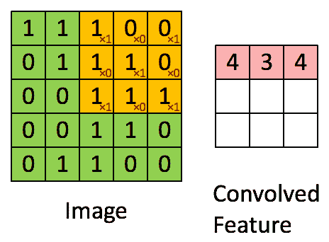
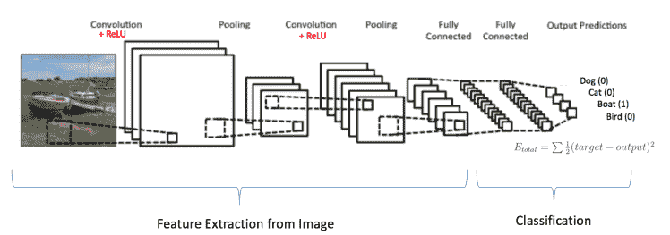

# 第七章：卷积神经网络简介

在数据科学中，**卷积神经网络**（**CNN**）是一种特定的深度学习架构，它使用卷积操作来提取输入图像的相关解释特征。CNN 层以前馈神经网络的方式连接，同时使用此卷积操作来模拟人类大脑在试图识别物体时的工作方式。个别皮层神经元对在一个限制区域内的刺激做出反应，这个区域被称为感受野。特别地，生物医学成像问题有时可能会很有挑战性，但在本章中，我们将看到如何使用 CNN 来发现图像中的模式。

本章将涵盖以下主题：

+   卷积操作

+   动机

+   CNN 的不同层

+   CNN 基本示例：MNIST 数字分类

# 卷积操作

CNN 在计算机视觉领域得到了广泛应用，并且它们在很多方面超越了我们一直在使用的传统计算机视觉技术。CNN 结合了著名的卷积操作和神经网络，因此得名卷积神经网络。因此，在深入探讨 CNN 的神经网络部分之前，我们将介绍卷积操作并了解它的工作原理。

卷积操作的主要目的是从图像中提取信息或特征。任何图像都可以看作是一个值矩阵，其中矩阵中的特定值组将形成一个特征。卷积操作的目的是扫描这个矩阵，尝试提取与该图像相关或具有解释性的特征。例如，考虑一个 5x5 的图像，其对应的强度或像素值显示为零和一：


图 9.1：像素值矩阵

并考虑以下 3 x 3 的矩阵：


图 9.2：像素值矩阵

我们可以使用 3 x 3 的卷积核对 5 x 5 的图像进行卷积，方法如下：



图 9.3：卷积操作。输出矩阵称为卷积特征或特征图

上述图可以总结如下。为了使用 3 x 3 的卷积核对原始 5 x 5 图像进行卷积，我们需要执行以下操作：

+   使用橙色矩阵扫描原始绿色图像，每次只移动 1 像素（步幅）

+   对于每个橙色图像的位置，我们在橙色矩阵和绿色矩阵中对应的像素值之间执行逐元素相乘操作

+   将这些逐元素相乘的结果加起来得到一个单一整数，这个整数将构成输出粉色矩阵中的单一值。

如前图所示，橙色的 3 x 3 矩阵每次只对原始绿色图像的一个部分进行操作（步幅），或者它每次只看到图像的一部分。

那么，让我们将前面的解释放到 CNN 术语的背景下：

+   橙色的 3 x 3 矩阵被称为**核**、**特征检测器**或**滤波器**。

+   输出的粉色矩阵，其中包含逐元素相乘的结果，称为**特征图**。

因为我们是通过核与原始输入图像中对应像素的逐元素相乘来获得特征图，所以改变核或滤波器的值每次都会生成不同的特征图。

因此，我们可能会认为，在卷积神经网络的训练过程中，我们需要自己确定特征检测器的值，但事实并非如此。CNN 在学习过程中自动确定这些值。所以，如果我们有更多的滤波器，就意味着我们可以从图像中提取更多的特征。

在进入下一部分之前，让我们介绍一些在 CNN 上下文中通常使用的术语：

+   **步幅**：我们之前简要提到了这个术语。一般来说，步幅是指我们在卷积输入矩阵时，特征检测器或滤波器在输入矩阵上移动的像素数。例如，步幅为 1 意味着每次移动一个像素，而步幅为 2 意味着每次移动两个像素。步幅越大，生成的特征图就越小。

+   **零填充**：如果我们想包含输入图像的边缘像素，那么部分滤波器将超出输入图像的范围。零填充通过在输入矩阵的边缘周围填充零来解决这个问题。

# 动机

传统的计算机视觉技术用于执行大多数计算机视觉任务，如物体检测和分割。尽管这些传统计算机视觉技术的性能不错，但始终无法接近实时使用的要求，例如自动驾驶汽车。2012 年，Alex Krizhevsky 推出了 CNN，凭借其在 ImageNet 竞赛中的突破性表现，将物体分类错误率从 26% 降至 15%。从那时起，CNN 被广泛应用，并且发现了不同的变种。它甚至在 ImageNet 竞赛中超越了人类分类错误，如下图所示：


图 9.4：随着时间推移的分类错误，其中人类级别的错误用红色标出

# CNN 的应用

自从 CNN 在计算机视觉甚至自然语言处理的不同领域取得突破以来，大多数公司已经将这一深度学习解决方案集成到他们的计算机视觉生态系统中。例如，谷歌在其图像搜索引擎中使用该架构，Facebook 则在自动标记等功能中使用它：


图 9.5：典型的用于物体识别的 CNN 一般架构

CNN 之所以能取得突破，正是因为它们的架构，直观地使用卷积操作从图像中提取特征。稍后你会发现，这与人脑的工作方式非常相似。

# CNN 的不同层

典型的 CNN 架构由多个执行不同任务的层组成，如上图所示。在本节中，我们将详细了解它们，并看到将所有这些层以特定方式连接起来的好处，这使得计算机视觉取得了这样的突破。

# 输入层

这是任何 CNN 架构中的第一层。所有后续的卷积层和池化层都期望输入以特定格式出现。输入变量将是张量，具有以下形状：

```py
[batch_size, image_width, image_height, channels]
```

这里：

+   `batch_size`是从原始训练集中的一个随机样本，用于应用随机梯度下降时。

+   `image_width`是输入到网络中的图像宽度。

+   `image_height`是输入到网络中的图像高度。

+   `channels`是输入图像的颜色通道数。这个数字对于 RGB 图像可能是 3，对于二值图像则是 1。

例如，考虑我们著名的 MNIST 数据集。假设我们将使用 CNN 进行数字分类，使用这个数据集。

如果数据集由 28 x 28 像素的单色图像组成，如 MNIST 数据集，那么我们输入层所需的形状如下：

```py
[batch_size, 28, 28, 1].
```

为了改变输入特征的形状，我们可以执行以下重塑操作：

```py
input_layer = tf.reshape(features["x"], [-1, 28, 28, 1])
```

如你所见，我们已经将批量大小指定为-1，这意味着这个数字应根据特征中的输入值动态确定。通过这样做，我们将能够通过控制批量大小来微调我们的 CNN 模型。

作为重塑操作的示例，假设我们将输入样本分成五个一批，并且我们的特征`["x"]`数组将包含 3,920 个输入图像的`values()`，其中该数组的每个值对应于图像中的一个像素。对于这种情况，输入层将具有以下形状：

```py
[5, 28, 28, 1]
```

# 卷积步骤

如前所述，卷积步骤得名于卷积操作。进行这些卷积步骤的主要目的是从输入图像中提取特征，然后将这些特征输入到线性分类器中。

在自然图像中，特征可能出现在图像的任何位置。例如，边缘可能出现在图像的中间或角落，因此堆叠一系列卷积步骤的整个目的是能够在图像的任何地方检测到这些特征。

在 TensorFlow 中定义卷积步骤非常简单。例如，如果我们想对输入层应用 20 个大小为 5x5 的滤波器，并使用 ReLU 激活函数，那么可以使用以下代码来实现：

```py
conv_layer1 = tf.layers.conv2d(
 inputs=input_layer,
 filters=20,
 kernel_size=[5, 5],
 padding="same",
 activation=tf.nn.relu)
```

这个`conv2d`函数的第一个参数是我们在前面的代码中定义的输入层，它具有合适的形状，第二个参数是滤波器参数，指定要应用于图像的滤波器数量，滤波器数量越多，从输入图像中提取的特征就越多。第三个参数是`kernel_size`，表示滤波器或特征探测器的大小。padding 参数指定了使用零填充的方法，这里我们使用`"same"`来给输入图像的角落像素添加零填充。最后一个参数指定了应该应用于卷积操作输出的激活函数。

因此，在我们的 MNIST 示例中，输入张量将具有以下形状：

```py
[batch_size, 28, 28, 1]
```

该卷积步骤的输出张量将具有以下形状：

```py
[batch_size, 28, 28, 20]
```

输出张量的维度与输入图像相同，但现在我们有 20 个通道，表示应用了 20 个滤波器到输入图像。

# 引入非线性

在卷积步骤中，我们提到过将卷积步骤的输出传递给 ReLU 激活函数以引入非线性：


图 9.6: ReLU 激活函数

ReLU 激活函数将所有负的像素值替换为零，而将卷积步骤的输出传递给该激活函数的目的就是为了引入非线性，因为我们使用的数据通常是非线性的，这对训练过程非常有用。为了清楚地理解 ReLU 激活函数的好处，看看下面的图，它展示了卷积步骤的行输出及其经过修正后的版本：


图 9.7: 对输入特征图应用 ReLU 的结果

# 池化步骤

我们学习过程中的一个重要步骤是池化步骤，有时也叫做下采样或子采样步骤。这个步骤主要是为了减少卷积步骤输出的特征图（feature map）的维度。池化步骤的优点是，在减小特征图的大小的同时，保留了新版本中重要的信息。

下图展示了通过一个 2x2 滤波器和步幅 2 扫描图像，并应用最大池化操作的步骤。这种池化操作称为**最大池化**：


图 9.8：使用 2 x 2 窗口在经过卷积和 ReLU 操作后的修正特征图上进行最大池化操作的示例（来源：http://textminingonline.com/wp-content/uploads/2016/10/max_polling-300x256.png）

我们可以使用以下代码行将卷积步骤的输出连接到池化层：

```py
pool_layer1 = tf.layers.max_pooling2d(inputs=conv_layer1, pool_size=[2, 2], strides=2)
```

池化层接收来自卷积步骤的输入，形状如下：

```py
[batch_size, image_width, image_height, channels]
```

例如，在我们的数字分类任务中，池化层的输入将具有以下形状：

```py
[batch_size, 28, 28, 20]
```

池化操作的输出将具有以下形状：

```py
[batch_size, 14, 14, 20]
```

在这个例子中，我们将卷积步骤的输出大小减少了 50%。这个步骤非常有用，因为它只保留了重要的信息，同时还减少了模型的复杂度，从而避免了过拟合。

# 全连接层

在堆叠了多个卷积和池化步骤之后，我们使用一个全连接层，在这个层中，我们将从输入图像中提取的高级特征输入到全连接层，以便利用这些特征进行实际的分类：


图 9.9：全连接层 - 每个节点都与相邻层的所有其他节点相连接

例如，在数字分类任务中，我们可以在卷积和池化步骤之后使用一个具有 1,024 个神经元和 ReLU 激活函数的全连接层来执行实际的分类。这个全连接层接受以下格式的输入：

```py
[batch_size, features]
```

因此，我们需要重新调整或展平来自`pool_layer2`的输入特征图，以匹配这种格式。我们可以使用以下代码行来重新调整输出：

```py
pool1_flat = tf.reshape(pool_layer1, [-1, 14 * 14 * 20])
```

在这个 reshape 函数中，我们使用`-1`表示批量大小将动态确定，并且`pool_layer1`输出中的每个示例将具有宽度为`14`、高度为`14`且有`20`个通道。

因此，这个重塑操作的最终输出将如下所示：

```py
 [batch_size, 3136]
```

最后，我们可以使用 TensorFlow 的`dense()`函数来定义我们的全连接层，设定所需的神经元（单位）数量和最终的激活函数：

```py
dense_layer = tf.layers.dense(inputs=pool1_flat, units=1024, activation=tf.nn.relu)
```

# Logits 层

最后，我们需要 logits 层，它将接受全连接层的输出并生成原始的预测值。例如，在数字分类任务中，输出将是一个包含 10 个值的张量，每个值代表 0-9 类中的一个类别的分数。因此，让我们为数字分类示例定义这个 logits 层，其中我们只需要 10 个输出，并且使用线性激活函数，这是 TensorFlow 的`dense()`函数的默认值：

```py
logits_layer = tf.layers.dense(inputs=dense_layer, units=10)
```



图 9.10：训练 ConvNet

这个 logits 层的最终输出将是一个具有以下形状的张量：

```py
[batch_size, 10]
```

如前所述，模型的 logits 层将返回我们批次的原始预测值。但我们需要将这些值转换为可解释的格式：

+   输入样本 0-9 的预测类别。

+   每个可能类别的得分或概率。例如，样本属于类别 0 的概率是 1，依此类推。


图 9.11：CNN 不同层的可视化（来源：http://cs231n.github.io/assets/cnn/convnet.jpeg）

因此，我们的预测类别将是 10 个概率中最大值对应的类别。我们可以通过使用`argmax`函数如下获取这个值：

```py
tf.argmax(input=logits_layer, axis=1)
```

记住，`logits_layer`的形状是这样的：

```py
[batch_size, 10]
```

因此，我们需要沿着预测结果的维度（即索引为 1 的维度）找到最大值：

最后，我们可以通过对`logits_layer`的输出应用`softmax`激活函数来得到下一个值，该值表示每个目标类别的概率，将每个值压缩到 0 和 1 之间：

```py
tf.nn.softmax(logits_layer, name="softmax_tensor")
```

# CNN 基础示例 – MNIST 数字分类

在本节中，我们将通过使用 MNIST 数据集实现数字分类的完整 CNN 示例。我们将构建一个包含两个卷积层和全连接层的简单模型。

让我们先导入实现中所需的库：

```py
%matplotlib inline
import matplotlib.pyplot as plt
import tensorflow as tf
import numpy as np
from sklearn.metrics import confusion_matrix
import math
```

接下来，我们将使用 TensorFlow 的辅助函数下载并预处理 MNIST 数据集，如下所示：

```py
from tensorflow.examples.tutorials.mnist import input_data
mnist_data = input_data.read_data_sets('data/MNIST/', one_hot=True)
```

```py
Output:
Successfully downloaded train-images-idx3-ubyte.gz 9912422 bytes.
Extracting data/MNIST/train-images-idx3-ubyte.gz
Successfully downloaded train-labels-idx1-ubyte.gz 28881 bytes.
Extracting data/MNIST/train-labels-idx1-ubyte.gz
Successfully downloaded t10k-images-idx3-ubyte.gz 1648877 bytes.
Extracting data/MNIST/t10k-images-idx3-ubyte.gz
Successfully downloaded t10k-labels-idx1-ubyte.gz 4542 bytes.
Extracting data/MNIST/t10k-labels-idx1-ubyte.gz
```

数据集被分为三个不重叠的集合：训练集、验证集和测试集。因此，让我们打印出每个集合中的图像数量：

```py
print("- Number of images in the training set:\t\t{}".format(len(mnist_data.train.labels)))
print("- Number of images in the test set:\t\t{}".format(len(mnist_data.test.labels)))
print("- Number of images in the validation set:\t{}".format(len(mnist_data.validation.labels)))
```

```py
- Number of images in the training set: 55000
- Number of images in the test set: 10000
- Number of images in the validation set: 5000
```

图像的实际标签以独热编码格式存储，所以我们有一个包含 10 个值的数组，除了表示该图像所属类别的索引外，其余值均为零。为了后续使用，我们需要将数据集中的类别号转换为整数：

```py
mnist_data.test.cls_integer = np.argmax(mnist_data.test.labels, axis=1)
```

让我们定义一些已知的变量，以便在后续实现中使用：

```py
# Default size for the input monocrome images of MNIST
image_size = 28

# Each image is stored as vector of this size.
image_size_flat = image_size * image_size

# The shape of each image
image_shape = (image_size, image_size)

# All the images in the mnist dataset are stored as a monocrome with only 1 channel
num_channels = 1

# Number of classes in the MNIST dataset from 0 till 9 which is 10
num_classes = 10
```

接下来，我们需要定义一个辅助函数，用于从数据集中绘制一些图像。这个辅助函数将以九个子图的网格方式绘制图像：

```py
def plot_imgs(imgs, cls_actual, cls_predicted=None):
    assert len(imgs) == len(cls_actual) == 9

    # create a figure with 9 subplots to plot the images.
    fig, axes = plt.subplots(3, 3)
    fig.subplots_adjust(hspace=0.3, wspace=0.3)

    for i, ax in enumerate(axes.flat):
        # plot the image at the ith index
        ax.imshow(imgs[i].reshape(image_shape), cmap='binary')

        # labeling the images with the actual and predicted classes.
        if cls_predicted is None:
            xlabel = "True: {0}".format(cls_actual[i])
        else:
            xlabel = "True: {0}, Pred: {1}".format(cls_actual[i], cls_predicted[i])

        # Remove ticks from the plot.
        ax.set_xticks([])
        ax.set_yticks([])

        # Show the classes as the label on the x-axis.
        ax.set_xlabel(xlabel)

    plt.show()
```

让我们从测试集绘制一些图像，看看它们长什么样：

```py
# Visualizing 9 images form the test set.
imgs = mnist_data.test.images[0:9]

# getting the actual classes of these 9 images
cls_actual = mnist_data.test.cls_integer[0:9]

#plotting the images
plot_imgs(imgs=imgs, cls_actual=cls_actual)
```

这是输出：


图 9.12：来自 MNIST 数据集的一些示例的可视化

# 构建模型

现在，到了构建模型核心部分的时候。计算图包含我们在本章前面提到的所有层。我们将从定义一些用于定义特定形状变量并随机初始化它们的函数开始：

```py
def new_weights(shape):
    return tf.Variable(tf.truncated_normal(shape, stddev=0.05))
```

```py
def new_biases(length):
    return tf.Variable(tf.constant(0.05, shape=[length]))
```

现在，让我们定义一个函数，该函数负责根据某些输入层、输入通道、滤波器大小、滤波器数量以及是否使用池化参数来创建一个新的卷积层：

```py
def conv_layer(input, # the output of the previous layer.
                   input_channels, 
                   filter_size, 
                   filters, 
                   use_pooling=True): # Use 2x2 max-pooling.

    # preparing the accepted shape of the input Tensor.
    shape = [filter_size, filter_size, input_channels, filters]

    # Create weights which means filters with the given shape.
    filters_weights = new_weights(shape=shape)

    # Create new biases, one for each filter.
    filters_biases = new_biases(length=filters)

    # Calling the conve2d function as we explained above, were the strides parameter
    # has four values the first one for the image number and the last 1 for the input image channel
    # the middle ones represents how many pixels the filter should move with in the x and y axis
    conv_layer = tf.nn.conv2d(input=input,
                         filter=filters_weights,
                         strides=[1, 1, 1, 1],
                         padding='SAME')

    # Adding the biase to the output of the conv_layer.
    conv_layer += filters_biases

    # Use pooling to down-sample the image resolution?
    if use_pooling:
        # reduce the output feature map by max_pool layer
        pool_layer = tf.nn.max_pool(value=conv_layer,
                               ksize=[1, 2, 2, 1],
                               strides=[1, 2, 2, 1],
                               padding='SAME')

    # feeding the output to a ReLU activation function.
    relu_layer = tf.nn.relu(pool_layer)

    # return the final results after applying relu and the filter weights
    return relu_layer, filters_weights
```

如前所述，池化层生成一个 4D 张量。我们需要将这个 4D 张量展平为 2D 张量，以便传递到全连接层：

```py
def flatten_layer(layer):
    # Get the shape of layer.
    shape = layer.get_shape()

    # We need to flatten the layer which has the shape of The shape [num_images, image_height, image_width, num_channels]
    # so that it has the shape of [batch_size, num_features] where number_features is image_height * image_width * num_channels

    number_features = shape[1:4].num_elements()

    # Reshaping that to be fed to the fully connected layer
    flatten_layer = tf.reshape(layer, [-1, number_features])

    # Return both the flattened layer and the number of features.
    return flatten_layer, number_features
```

该函数创建一个全连接层，假设输入是一个 2D 张量：

```py
def fc_layer(input, # the flatten output.
                 num_inputs, # Number of inputs from previous layer
                 num_outputs, # Number of outputs
                 use_relu=True): # Use ReLU on the output to remove negative values

    # Creating the weights for the neurons of this fc_layer
    fc_weights = new_weights(shape=[num_inputs, num_outputs])
    fc_biases = new_biases(length=num_outputs)

    # Calculate the layer values by doing matrix multiplication of
    # the input values and fc_weights, and then add the fc_bias-values.
    fc_layer = tf.matmul(input, fc_weights) + fc_biases

    # if use RelU parameter is true
    if use_relu:
        relu_layer = tf.nn.relu(fc_layer)
        return relu_layer

    return fc_layer
```

在构建网络之前，让我们定义一个占位符用于输入图像，其中第一维是`None`，表示可以输入任意数量的图像：

```py
input_values = tf.placeholder(tf.float32, shape=[None, image_size_flat], name='input_values')
```

正如我们之前提到的，卷积步骤期望输入图像的形状是 4D 张量。因此，我们需要将输入图像调整为以下形状：

```py
[num_images, image_height, image_width, num_channels]
```

所以，让我们重新调整输入值的形状以匹配这种格式：

```py
input_image = tf.reshape(input_values, [-1, image_size, image_size, num_channels])
```

接下来，我们需要定义另一个占位符用于实际类别的值，格式为独热编码：

```py
y_actual = tf.placeholder(tf.float32, shape=[None, num_classes], name='y_actual')
```

此外，我们还需要定义一个占位符来保存实际类别的整数值：

```py
y_actual_cls_integer = tf.argmax(y_actual, axis=1)
```

所以，让我们从构建第一个卷积神经网络开始：

```py
conv_layer_1, conv1_weights = \
        conv_layer(input=input_image,
                   input_channels=num_channels,
                   filter_size=filter_size_1,
                   filters=filters_1,
                   use_pooling=True)
```

让我们检查第一卷积层将产生的输出张量的形状：

```py
conv_layer_1
```

```py
Output:
<tf.Tensor 'Relu:0' shape=(?, 14, 14, 16) dtype=float32>
```

接下来，我们将创建第二个卷积神经网络，并将第一个网络的输出作为输入：

```py
conv_layer_2, conv2_weights = \
         conv_layer(input=conv_layer_1,
                   input_channels=filters_1,
                   filter_size=filter_size_2,
                   filters=filters_2,
                   use_pooling=True)
```

此外，我们需要再次检查第二卷积层输出张量的形状。形状应该是`(?, 7, 7, 36)`，其中`?`表示任意数量的图像。

接下来，我们需要将 4D 张量展平，以匹配全连接层所期望的格式，即 2D 张量：

```py
flatten_layer, number_features = flatten_layer(conv_layer_2)
```

我们需要再次检查展平层输出张量的形状：

```py
flatten_layer
```

```py
Output:
<tf.Tensor 'Reshape_1:0' shape=(?, 1764) dtype=float32>
```

接下来，我们将创建一个全连接层，并将展平层的输出传递给它。我们还将把全连接层的输出输入到 ReLU 激活函数中，然后再传递给第二个全连接层：

```py
fc_layer_1 = fc_layer(input=flatten_layer,
                         num_inputs=number_features,
                         num_outputs=fc_num_neurons,
                         use_relu=True)
```

让我们再次检查第一个全连接层输出张量的形状：

```py
fc_layer_1
```

```py
Output:
<tf.Tensor 'Relu_2:0' shape=(?, 128) dtype=float32>
```

接下来，我们需要添加另一个全连接层，它将接收第一个全连接层的输出，并为每张图像生成一个大小为 10 的数组，表示每个目标类别是正确类别的得分：

```py
fc_layer_2 = fc_layer(input=fc_layer_1,
                         num_inputs=fc_num_neurons,
                         num_outputs=num_classes,
                         use_relu=False)
```

```py
fc_layer_2
```

```py
Output:
<tf.Tensor 'add_3:0' shape=(?, 10) dtype=float32>
```

接下来，我们将对第二个全连接层的得分进行归一化，并将其输入到`softmax`激活函数中，这样它会将值压缩到 0 到 1 之间：

```py
y_predicted = tf.nn.softmax(fc_layer_2)
```

然后，我们需要使用 TensorFlow 的`argmax`函数选择具有最高概率的目标类别：

```py
y_predicted_cls_integer = tf.argmax(y_predicted, axis=1)
```

# 成本函数

接下来，我们需要定义我们的性能衡量标准，即交叉熵。如果预测的类别是正确的，那么交叉熵的值为 0：

```py
cross_entropy = tf.nn.softmax_cross_entropy_with_logits(logits=fc_layer_2,
                                                        labels=y_actual)
```

接下来，我们需要将之前步骤得到的所有交叉熵值求平均，以便得到一个单一的性能衡量标准：

```py
model_cost = tf.reduce_mean(cross_entropy)
```

现在，我们有了一个需要优化/最小化的成本函数，因此我们将使用`AdamOptimizer`，它是一种优化方法，类似于梯度下降，但更为先进：

```py
model_optimizer = tf.train.AdamOptimizer(learning_rate=1e-4).minimize(model_cost)
```

# 性能衡量标准

为了显示输出，让我们定义一个变量来检查预测的类别是否等于真实类别：

```py
model_correct_prediction = tf.equal(y_predicted_cls_integer, y_actual_cls_integer)
```

通过将布尔值转换并求平均，计算模型的准确性，进而统计正确分类的数量：

```py
model_accuracy = tf.reduce_mean(tf.cast(model_correct_prediction, tf.float32))
```

# 模型训练

让我们通过创建一个会负责执行先前定义的计算图的会话变量来启动训练过程：

```py
session = tf.Session()
```

此外，我们需要初始化到目前为止已定义的变量：

```py
session.run(tf.global_variables_initializer())
```

我们将按批次输入图像，以避免出现内存溢出错误：

```py
train_batch_size = 64
```

在开始训练过程之前，我们将定义一个辅助函数，该函数通过遍历训练批次来执行优化过程：

```py
# number of optimization iterations performed so far
total_iterations = 0

def optimize(num_iterations):
    # Update globally the total number of iterations performed so far.
    global total_iterations

    for i in range(total_iterations,
                   total_iterations + num_iterations):

        # Generating a random batch for the training process
        # input_batch now contains a bunch of images from the training set and
        # y_actual_batch are the actual labels for the images in the input batch.
        input_batch, y_actual_batch = mnist_data.train.next_batch(train_batch_size)

        # Putting the previous values in a dict format for Tensorflow to automatically assign them to the input
        # placeholders that we defined above
        feed_dict = {input_values: input_batch,
                           y_actual: y_actual_batch}

        # Next up, we run the model optimizer on this batch of images
        session.run(model_optimizer, feed_dict=feed_dict)

        # Print the training status every 100 iterations.
        if i % 100 == 0:
            # measuring the accuracy over the training set.
            acc_training_set = session.run(model_accuracy, feed_dict=feed_dict)

            #Printing the accuracy over the training set
            print("Iteration: {0:>6}, Accuracy Over the training set: {1:>6.1%}".format(i + 1, acc_training_set))

    # Update the number of iterations performed so far
    total_iterations += num_iterations
```

我们还将定义一些辅助函数，帮助我们可视化模型的结果，并查看哪些图像被模型误分类：

```py
def plot_errors(cls_predicted, correct):

    # cls_predicted is an array of the predicted class number of each image in the test set.

    # Extracting the incorrect images.
    incorrect = (correct == False)

    # Get the images from the test-set that have been
    # incorrectly classified.
    images = mnist_data.test.images[incorrect]

    # Get the predicted classes for those incorrect images.
    cls_pred = cls_predicted[incorrect]

    # Get the actual classes for those incorrect images.
    cls_true = mnist_data.test.cls_integer[incorrect]

    # Plot 9 of these images
    plot_imgs(imgs=imgs[0:9],
                cls_actual=cls_actual[0:9],
                cls_predicted=cls_predicted[0:9])
```

我们还可以绘制预测结果与实际类别的混淆矩阵：

```py
def plot_confusionMatrix(cls_predicted):

 # cls_predicted is an array of the predicted class number of each image in the test set.

 # Get the actual classes for the test-set.
 cls_actual = mnist_data.test.cls_integer

 # Generate the confusion matrix using sklearn.
 conf_matrix = confusion_matrix(y_true=cls_actual,
 y_pred=cls_predicted)

 # Print the matrix.
 print(conf_matrix)

 # visualizing the confusion matrix.
 plt.matshow(conf_matrix)

 plt.colorbar()
 tick_marks = np.arange(num_classes)
 plt.xticks(tick_marks, range(num_classes))
 plt.yticks(tick_marks, range(num_classes))
 plt.xlabel('Predicted class')
 plt.ylabel('True class')

 # Showing the plot
 plt.show()
```

最后，我们将定义一个辅助函数，帮助我们测量训练模型在测试集上的准确率：

```py
# measuring the accuracy of the trained model over the test set by splitting it into small batches
test_batch_size = 256

def test_accuracy(show_errors=False,
                        show_confusionMatrix=False):

    #number of test images 
    number_test = len(mnist_data.test.images)

    # define an array of zeros for the predicted classes of the test set which
    # will be measured in mini batches and stored it.
    cls_predicted = np.zeros(shape=number_test, dtype=np.int)

    # measuring the predicted classes for the testing batches.

    # Starting by the batch at index 0.
    i = 0

    while i < number_test:
        # The ending index for the next batch to be processed is j.
        j = min(i + test_batch_size, number_test)

        # Getting all the images form the test set between the start and end indices
        input_images = mnist_data.test.images[i:j, :]

        # Get the acutal labels for those images.
        actual_labels = mnist_data.test.labels[i:j, :]

        # Create a feed-dict with the corresponding values for the input placeholder values
        feed_dict = {input_values: input_images,
                     y_actual: actual_labels}

        cls_predicted[i:j] = session.run(y_predicted_cls_integer, feed_dict=feed_dict)

        # Setting the start of the next batch to be the end of the one that we just processed j
        i = j

    # Get the actual class numbers of the test images.
    cls_actual = mnist_data.test.cls_integer

    # Check if the model predictions are correct or not
    correct = (cls_actual == cls_predicted)

    # Summing up the correct examples
    correct_number_images = correct.sum()

    # measuring the accuracy by dividing the correclty classified ones with total number of images in the test set.
    testset_accuracy = float(correct_number_images) / number_test

    # showing the accuracy.
    print("Accuracy on Test-Set: {0:.1%} ({1} / {2})".format(testset_accuracy, correct_number_images, number_test))

    # showing some examples form the incorrect ones.
    if show_errors:
        print("Example errors:")
        plot_errors(cls_predicted=cls_predicted, correct=correct)

    # Showing the confusion matrix of the test set predictions
    if show_confusionMatrix:
        print("Confusion Matrix:")
        plot_confusionMatrix(cls_predicted=cls_predicted)
```

让我们打印出未经任何优化的模型在测试集上的准确率：

```py
test_accuracy()
```

```py
Output:
Accuracy on Test-Set: 4.1% (410 / 10000)
```

让我们通过运行一次优化过程来感受优化过程如何增强模型的能力，将图像正确分类到对应的类别：

```py
optimize(num_iterations=1)
Output:
Iteration: 1, Accuracy Over the training set: 4.7%
test_accuracy()
Output
Accuracy on Test-Set: 4.4% (437 / 10000)
```

现在，让我们开始进行一项长时间的优化过程，进行 10,000 次迭代：

```py
optimize(num_iterations=9999) #We have already performed 1 iteration.
```

在输出的最后，您应该看到与以下输出非常接近的结果：

```py
Iteration: 7301, Accuracy Over the training set: 96.9%
Iteration: 7401, Accuracy Over the training set: 100.0%
Iteration: 7501, Accuracy Over the training set: 98.4%
Iteration: 7601, Accuracy Over the training set: 98.4%
Iteration: 7701, Accuracy Over the training set: 96.9%
Iteration: 7801, Accuracy Over the training set: 96.9%
Iteration: 7901, Accuracy Over the training set: 100.0%
Iteration: 8001, Accuracy Over the training set: 98.4%
Iteration: 8101, Accuracy Over the training set: 96.9%
Iteration: 8201, Accuracy Over the training set: 100.0%
Iteration: 8301, Accuracy Over the training set: 98.4%
Iteration: 8401, Accuracy Over the training set: 98.4%
Iteration: 8501, Accuracy Over the training set: 96.9%
Iteration: 8601, Accuracy Over the training set: 100.0%
Iteration: 8701, Accuracy Over the training set: 98.4%
Iteration: 8801, Accuracy Over the training set: 100.0%
Iteration: 8901, Accuracy Over the training set: 98.4%
Iteration: 9001, Accuracy Over the training set: 100.0%
Iteration: 9101, Accuracy Over the training set: 96.9%
Iteration: 9201, Accuracy Over the training set: 98.4%
Iteration: 9301, Accuracy Over the training set: 98.4%
Iteration: 9401, Accuracy Over the training set: 100.0%
Iteration: 9501, Accuracy Over the training set: 100.0%
Iteration: 9601, Accuracy Over the training set: 98.4%
Iteration: 9701, Accuracy Over the training set: 100.0%
Iteration: 9801, Accuracy Over the training set: 100.0%
Iteration: 9901, Accuracy Over the training set: 100.0%
Iteration: 10001, Accuracy Over the training set: 98.4%
```

现在，让我们检查模型在测试集上的泛化能力：

```py
test_accuracy(show_errors=True,
                    show_confusionMatrix=True)
```

```py
Output:
Accuracy on Test-Set: 92.8% (9281 / 10000)
Example errors:

```


图 9.13：测试集上的准确率

```py
Confusion Matrix:
[[ 971    0    2    2    0    4    0    1    0    0]
 [   0 1110    4    2    1    2    3    0   13    0]
 [  12    2  949   15   16    3    4   17   14    0]
 [   5    3   14  932    0   34    0   13    6    3]
 [   1    2    3    0  931    1    8    2    3   31]
 [  12    1    4   13    3  852    2    1    3    1]
 [  21    4    5    2   18   34  871    1    2    0]
 [   1   10   26    5    5    0    0  943    2   36]
 [  16    5   10   27   16   48    5   13  815   19]
 [  12    5    5   11   38   10    0   18    3  907]]
```

以下是输出结果：


图 9.14：测试集的混淆矩阵。

有趣的是，实际上在使用基础卷积网络时，我们在测试集上的准确率几乎达到了 93%。这个实现和结果展示了一个简单的卷积网络能做些什么。

# 总结

在本章中，我们介绍了卷积神经网络（CNN）的直觉和技术细节，同时也了解了如何在 TensorFlow 中实现一个基本的 CNN 架构。

在下一章中，我们将展示一些更先进的架构，这些架构可以用于检测数据科学家广泛使用的图像数据集中的物体。我们还将看到卷积神经网络（CNN）的魅力，它们是如何通过首先识别物体的基本特征，再在这些特征基础上构建更高级的语义特征，从而模拟人类对物体的理解，最终得出对物体的分类的。尽管这个过程在人类大脑中发生得非常迅速，但它实际上是我们识别物体时的运作方式。
