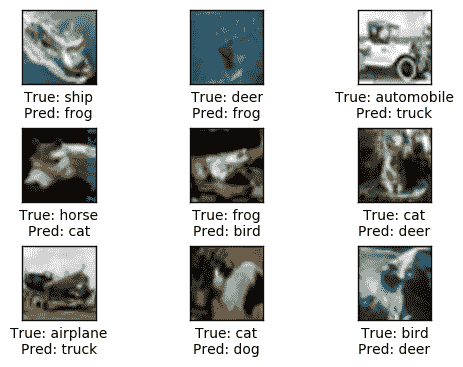

# 第九章：目标检测 – 使用卷积神经网络（CNNs）进行迁移学习

“个体如何在一个情境中转移到另一个具有相似特征的情境”

*E. L. Thorndike*，*R. S. Woodworth (1991)*

**迁移学习**（**TL**）是数据科学中的一个研究问题，主要关注在解决特定任务时获得的知识如何得以保存，并利用这些获得的知识来解决另一个不同但相似的任务。在本章中，我们将展示数据科学领域中使用迁移学习的现代实践和常见主题之一。这里的思想是如何从数据集非常大的领域获得帮助，转移到数据集较小的领域。最后，我们将重新审视我们在 CIFAR-10 上的目标检测示例，并尝试通过迁移学习减少训练时间和性能误差。

本章将涵盖以下主题：

+   迁移学习

+   重新审视 CIFAR-10 目标检测

# 迁移学习

深度学习架构对数据的需求很大，训练集中的样本较少时无法充分发挥其潜力。迁移学习通过将从大数据集解决一个任务中学到的知识/表示转移到另一个不同但相似的小数据集任务中，解决了这一问题。

迁移学习不仅对小训练集有用，我们还可以用它来加速训练过程。从头开始训练大型深度学习架构有时会非常慢，因为这些架构中有数百万个权重需要学习。相反，可以通过迁移学习，只需微调在类似问题上学到的权重，而不是从头开始训练模型。

# 迁移学习的直觉

让我们通过以下师生类比来建立迁移学习的直觉。一位教师在他/她教授的模块中有多年的经验。另一方面，学生从这位教师的讲座中获得了该主题的简洁概述。所以你可以说，教师正在以简洁紧凑的方式将自己的知识传授给学生。

教师与学生的类比同样适用于我们在深度学习或神经网络中知识迁移的情况。我们的模型从数据中学习一些表示，这些表示由网络的*权重*表示。这些学习到的表示/特征（权重）可以转移到另一个不同但相似的任务中。将学到的权重转移到另一个任务的过程将减少深度学习架构收敛所需的庞大数据集，并且与从头开始训练模型相比，它还会减少将模型适应新数据集所需的时间。

深度学习现在广泛应用，但通常大多数人在训练深度学习架构时都会使用迁移学习（TL）；很少有人从零开始训练深度学习架构，因为大多数情况下，深度学习需要的数据集规模通常不足以支持收敛。所以，使用在大型数据集上预训练的模型，如`ImageNet`（大约有 120 万张图像），并将其应用到新任务上是非常常见的。我们可以使用该预训练模型的权重作为特征提取器，或者我们可以将其作为初始化模型，然后对其进行微调以适应新任务。使用迁移学习有三种主要场景：

+   **使用卷积网络作为固定特征提取器**：在这种场景下，你使用在大型数据集（如 ImageNet）上预训练的卷积模型，并将其调整为适应你的问题。例如，一个在 ImageNet 上预训练的卷积模型将有一个全连接层，输出 ImageNet 上 1,000 个类别的得分。所以你需要移除这个层，因为你不再关心 ImageNet 的类别。然后，你将所有其他层当作特征提取器。一旦使用预训练模型提取了特征，你可以将这些特征输入到任何线性分类器中，比如 softmax 分类器，甚至是线性支持向量机（SVM）。

+   **微调卷积神经网络**：第二种场景涉及到第一种场景，但增加了使用反向传播在你的新任务上微调预训练权重的额外工作。通常，人们保持大部分层不变，只微调网络的顶部。尝试微调整个网络或大多数层可能导致过拟合。因此，你可能只对微调与图像的语义级别特征相关的那些层感兴趣。保持早期层固定的直觉是，它们包含了大多数图像任务中常见的通用或低级特征，如角点、边缘等。如果你正在引入模型在原始数据集中没有的新类别，那么微调网络的高层或顶部层会非常有用。

    

图 10.1：为新任务微调预训练的卷积神经网络（CNN）

+   **预训练模型**：第三种广泛使用的场景是下载互联网上人们提供的检查点。如果你没有足够的计算能力从零开始训练模型，可以选择这种场景，只需使用发布的检查点初始化模型，然后做一点微调。

# 传统机器学习和迁移学习（TL）的区别

如你从前一部分中注意到的，传统机器学习和涉及迁移学习（TL）的机器学习有明显的区别（如以下图示*所示）。在传统机器学习中，你不会将任何知识或表示迁移到其他任务中，而在迁移学习中却不同。有时，人们会错误地使用迁移学习，因此我们将列出一些条件，只有在这些条件下使用迁移学习才能最大化收益。

以下是应用迁移学习（TL）的条件：

+   与传统的机器学习不同，源任务和目标任务或领域不需要来自相同的分布，但它们必须是相似的。

+   如果训练样本较少或你没有足够的计算能力，你也可以使用迁移学习。


图 10.2：传统机器学习与迁移学习（TL）相结合的机器学习

# CIFAR-10 目标检测—重新审视

在上一章中，我们在 CIFAR-10 数据集上训练了一个简单的**卷积神经网络**（**CNN**）模型。在这里，我们将展示如何使用预训练模型作为特征提取器，同时移除预训练模型的全连接层，然后将提取的特征或迁移值输入 Softmax 层。

这次实现中的预训练模型将是 Inception 模型，它将在 ImageNet 上进行预训练。但请记住，这个实现是基于前两章介绍的 CNN。

# 解决方案概述

我们将再次替换预训练 Inception 模型的最终全连接层，并使用其余部分作为特征提取器。因此，我们首先将原始图像输入 Inception 模型，模型会从中提取特征，然后输出我们所谓的迁移值。

在从 Inception 模型中获取提取特征的迁移值后，你可能需要将它们保存到本地，因为如果你实时处理，这可能需要一些时间，因此将它们持久化到本地可以节省时间。在 TensorFlow 教程中，他们使用“瓶颈值”这一术语来代替迁移值，但这只是对相同概念的不同命名。

在获得迁移值或从本地加载它们后，我们可以将它们输入到任何为新任务定制的线性分类器中。在这里，我们将提取的迁移值输入到另一个神经网络，并为 CIFAR-10 的新类别进行训练。

以下图示展示了我们将遵循的一般解决方案概述：


图 10.3：使用 CIFAR-10 数据集进行目标检测任务的解决方案概述（使用迁移学习）

# 加载和探索 CIFAR-10

让我们首先导入本次实现所需的包：

```py
%matplotlib inline
import matplotlib.pyplot as plt
import tensorflow as tf
import numpy as np
import time
from datetime import timedelta
import os

# Importing a helper module for the functions of the Inception model.
import inception
```

接下来，我们需要加载另一个辅助脚本，以便下载处理 CIFAR-10 数据集：

```py
import cifar10
#importing number of classes of CIFAR-10
from cifar10 import num_classes
```

如果你还没有做过这一点，你需要设置 CIFAR-10 的路径。这个路径将被 `cifar-10.py` 脚本用来持久化数据集：

```py
cifar10.data_path = "data/CIFAR-10/"

The CIFAR-10 dataset is about 170 MB, the next line checks if the dataset is already downloaded if not it downloads the dataset and store in the previous data_path:

cifar10.maybe_download_and_extract</span>()

Output:

- Download progress: 100.0%
Download finished. Extracting files.
Done.
```

让我们来看一下 CIFAR-10 数据集中的类别：

```py
#Loading the class names of CIFAR-10 dataset
class_names = cifar10.load_class_names()
class_names
```

输出：

```py
Loading data: data/CIFAR-10/cifar-10-batches-py/batches.meta
['airplane',
 'automobile',
 'bird',
 'cat',
 'deer',
 'dog',
 'frog',
 'horse', 
 'ship',
 'truck']
Load the training-set. 
```

这将返回 `images`，类别编号作为 `integers`，以及类别编号作为一种名为 `labels` 的 one-hot 编码数组：

```py
training_images, training_cls_integers, trainig_one_hot_labels = cifar10.load_training_data()
```

输出：

```py
Loading data: data/CIFAR-10/cifar-10-batches-py/data_batch_1
Loading data: data/CIFAR-10/cifar-10-batches-py/data_batch_2
Loading data: data/CIFAR-10/cifar-10-batches-py/data_batch_3
Loading data: data/CIFAR-10/cifar-10-batches-py/data_batch_4
Loading data: data/CIFAR-10/cifar-10-batches-py/data_batch_5
Load the test-set.
```

现在，让我们对测试集做相同的操作，加载图像及其相应的目标类别的整数表示和 one-hot 编码：

```py
#Loading the test images, their class integer, and their corresponding one-hot encoding
testing_images, testing_cls_integers, testing_one_hot_labels = cifar10.load_test_data()

Output:

Loading data: data/CIFAR-10/cifar-10-batches-py/test_batch
```

让我们看看 CIFAR-10 中训练集和测试集的分布：

```py
print("-Number of images in the training set:\t\t{}".format(len(training_images)))
print("-Number of images in the testing set:\t\t{}".format(len(testing_images)))
```

输出：

```py
-Number of images in the training set:          50000
-Number of images in the testing set:           10000
```

让我们定义一些辅助函数，以便我们可以探索数据集。以下辅助函数将把九张图片绘制成网格：

```py
def plot_imgs(imgs, true_class, predicted_class=None):

    assert len(imgs) == len(true_class)

    # Creating a placeholders for 9 subplots
    fig, axes = plt.subplots(3, 3)

    # Adjustting spacing.
    if predicted_class is None:
        hspace = 0.3
    else:
        hspace = 0.6
    fig.subplots_adjust(hspace=hspace, wspace=0.3)

    for i, ax in enumerate(axes.flat):
        # There may be less than 9 images, ensure it doesn't crash.
        if i < len(imgs):
            # Plot image.
            ax.imshow(imgs[i],
                      interpolation='nearest')

            # Get the actual name of the true class from the class_names array
            true_class_name = class_names[true_class[i]]

            # Showing labels for the predicted and true classes
            if predicted_class is None:
                xlabel = "True: {0}".format(true_class_name)
            else:
                # Name of the predicted class.
                predicted_class_name = class_names[predicted_class[i]]

                xlabel = "True: {0}\nPred: {1}".format(true_class_name, predicted_class_name)

            ax.set_xlabel(xlabel)

        # Remove ticks from the plot.
        ax.set_xticks([])
        ax.set_yticks([])

    plt.show()
```

让我们可视化测试集中的一些图像，并查看它们相应的实际类别：

```py
# get the first 9 images in the test set
imgs = testing_images[0:9]

# Get the integer representation of the true class.
true_class = testing_cls_integers[0:9]

# Plotting the images
plot_imgs(imgs=imgs, true_class=true_class)
```

输出：


图 10.4：测试集的前九张图片

# Inception 模型传递值

如前所述，我们将使用在 ImageNet 数据集上预训练的 Inception 模型。因此，我们需要从互联网上下载这个预训练的模型。

让我们首先定义 `data_dir` 来为 Inception 模型设置路径：

```py
inception.data_dir = 'inception/'
```

预训练 Inception 模型的权重大约为 85 MB。如果它不在之前定义的 `data_dir` 中，以下代码行将下载该模型：

```py
inception.maybe_download()

Downloading Inception v3 Model ...
- Download progress: 100%
```

我们将加载 Inception 模型，以便可以将其作为特征提取器来处理我们的 CIFAR-10 图像：

```py
# Loading the inception model so that we can inialized it with the pre-trained weights and customize for our model
inception_model = inception.Inception()
```

如前所述，计算 CIFAR-10 数据集的传递值需要一些时间，因此我们需要将它们缓存以便将来使用。幸运的是，`inception` 模块中有一个辅助函数可以帮助我们做到这一点：

```py
from inception import transfer_values_cache
```

接下来，我们需要设置缓存的训练和测试文件的文件路径：

```py
file_path_train = os.path.join(cifar10.data_path, 'inception_cifar10_train.pkl')
file_path_test = os.path.join(cifar10.data_path, 'inception_cifar10_test.pkl')
print("Processing Inception transfer-values for the training images of Cifar-10 ...")
# First we need to scale the imgs to fit the Inception model requirements as it requires all pixels to be from 0 to 255,
# while our training examples of the CIFAR-10 pixels are between 0.0 and 1.0
imgs_scaled = training_images * 255.0

# Checking if the transfer-values for our training images are already calculated and loading them, if not calculate and save them.
transfer_values_training = transfer_values_cache(cache_path=file_path_train,
                                              images=imgs_scaled,
                                              model=inception_model)
print("Processing Inception transfer-values for the testing images of Cifar-10 ...")
# First we need to scale the imgs to fit the Inception model requirements as it requires all pixels to be from 0 to 255,
# while our training examples of the CIFAR-10 pixels are between 0.0 and 1.0
imgs_scaled = testing_images * 255.0
# Checking if the transfer-values for our training images are already calculated and loading them, if not calcaulate and save them.
transfer_values_testing = transfer_values_cache(cache_path=file_path_test,
                                     images=imgs_scaled,
                                     model=inception_model)

```

如前所述，CIFAR-10 数据集的训练集中有 50,000 张图像。让我们检查这些图像的传递值的形状。每张图像的传递值应该是 2,048：

```py
transfer_values_training.shape
```

输出：

```py
(50000, 2048)
```

我们需要对测试集做相同的操作：

```py
transfer_values_testing.shape
```

输出：

```py
(10000, 2048)
```

为了直观地理解传递值的样子，我们将定义一个辅助函数，帮助我们绘制训练集或测试集中某张图像的传递值：

```py
def plot_transferValues(ind):
    print("Original input image:")

    # Plot the image at index ind of the test set.
    plt.imshow(testing_images[ind], interpolation='nearest')
    plt.show()

    print("Transfer values using Inception model:")

    # Visualize the transfer values as an image.
    transferValues_img = transfer_values_testing[ind]
    transferValues_img = transferValues_img.reshape((32, 64))

    # Plotting the transfer values image.
    plt.imshow(transferValues_img, interpolation='nearest', cmap='Reds')
    plt.show()
plot_transferValues(i=16)

Input image:
```


图 10.5：输入图像

使用 Inception 模型的传递值：


图 10.6：图 10.3 中输入图像的传递值

```py
plot_transferValues(i=17)
```


图 10.7：输入图像

使用 Inception 模型的传递值：


图 10.8：图 10.5 中输入图像的传递值

# 传递值分析

在这一部分，我们将分析刚刚为训练图像获得的传输值。这次分析的目的是看这些传输值是否足以对我们在 CIFAR-10 中的图像进行分类。

每张输入图像都有 2,048 个传输值。为了绘制这些传输值并对其进行进一步分析，我们可以使用像 scikit-learn 中的**主成分分析**（**PCA**）这样的降维技术。我们将传输值从 2,048 减少到 2，以便能够可视化它，并查看它们是否能成为区分 CIFAR-10 不同类别的好特征：

```py
from sklearn.decomposition import PCA
```

接下来，我们需要创建一个 PCA 对象，其中组件数量为`2`：

```py
pca_obj = PCA(n_components=2)
```

将传输值从 2,048 减少到 2 需要花费很多时间，因此我们将只选取 5,000 张图像中的 3,000 张作为子集：

```py
subset_transferValues = transfer_values_training[0:3000]
```

我们还需要获取这些图像的类别编号：

```py
cls_integers = testing_cls_integers[0:3000]
```

我们可以通过打印传输值的形状来再次检查我们的子集：

```py
subset_transferValues.shape
```

输出：

```py
(3000, 2048)
```

接下来，我们使用我们的 PCA 对象将传输值从 2,048 减少到仅 2：

```py
reduced_transferValues = pca_obj.fit_transform(subset_transferValues)
```

现在，让我们看看 PCA 降维过程的输出：

```py
reduced_transferValues.shape
```

输出：

```py
(3000, 2)
```

在将传输值的维度减少到仅为 2 之后，让我们绘制这些值：

```py
#Importing the color map for plotting each class with different color.
import matplotlib.cm as color_map

def plot_reduced_transferValues(transferValues, cls_integers):

    # Create a color-map with a different color for each class.
    c_map = color_map.rainbow(np.linspace(0.0, 1.0, num_classes))

    # Getting the color for each sample.
    colors = c_map[cls_integers]

    # Getting the x and y values.
    x_val = transferValues[:, 0]
    y_val = transferValues[:, 1]

    # Plot the transfer values in a scatter plot
    plt.scatter(x_val, y_val, color=colors)
    plt.show()

```

在这里，我们绘制的是训练集子集的减少后的传输值。CIFAR-10 中有 10 个类别，所以我们将使用不同的颜色绘制它们对应的传输值。从下图可以看出，传输值根据对应的类别被分组。组与组之间的重叠是因为 PCA 的降维过程无法正确分离传输值：

```py
plot_reduced_transferValues(reduced_transferValues, cls_integers)
```


图 10.9：使用 PCA 减少的传输值

我们可以使用另一种降维方法**t-SNE**进一步分析我们的传输值：

```py
from sklearn.manifold import TSNE

```

再次，我们将减少传输值的维度，从 2,048 减少到 50 个值，而不是 2：

```py
pca_obj = PCA(n_components=50)
transferValues_50d = pca_obj.fit_transform(subset_transferValues)
```

接下来，我们堆叠第二种降维技术，并将 PCA 过程的输出传递给它：

```py
tsne_obj = TSNE(n_components=2)
```

最后，我们使用 PCA 方法减少后的值并将 t-SNE 方法应用于其上：

```py
reduced_transferValues = tsne_obj.fit_transform(transferValues_50d) 
```

并再次检查它是否具有正确的形状：

```py
reduced_transferValues.shape
```

输出：

```py
(3000, 2)
```

让我们绘制 t-SNE 方法减少后的传输值。正如你在下图中看到的，t-SNE 比 PCA 更好地分离了分组的传输值。

通过这次分析，我们得出的结论是，通过将输入图像输入预训练的 Inception 模型获得的提取传输值，可以用于将训练图像分为 10 个类别。由于下图中存在轻微的重叠，这种分离不会 100%准确，但我们可以通过对预训练模型进行微调来消除这种重叠：

```py
plot_reduced_transferValues(reduced_transferValues, cls_integers)
```


图 10.10：使用 t-SNE 减少的传输值

现在我们已经提取了训练图像中的转移值，并且知道这些值能够在一定程度上区分 CIFAR-10 中的不同类别。接下来，我们需要构建一个线性分类器，并将这些转移值输入其中，进行实际分类。

# 模型构建与训练

所以，让我们首先指定将要输入到神经网络模型中的输入占位符变量。第一个输入变量（将包含提取的转移值）的形状将是`[None, transfer_len]`。第二个占位符变量将以独热向量格式存储训练集的实际类别标签：

```py
transferValues_arrLength = inception_model.transfer_len
input_values = tf.placeholder(tf.float32, shape=[None, transferValues_arrLength], name='input_values')
y_actual = tf.placeholder(tf.float32, shape=[None, num_classes], name='y_actual')
```

我们还可以通过定义另一个占位符变量，获取每个类别从 1 到 10 的对应整数值：

```py
y_actual_cls = tf.argmax(y_actual, axis=1)
```

接下来，我们需要构建实际的分类神经网络，该网络将接受这些输入占位符，并生成预测的类别：

```py
def new_weights(shape):
    return tf.Variable(tf.truncated_normal(shape, stddev=0.05))

def new_biases(length):
    return tf.Variable(tf.constant(0.05, shape=[length]))

def new_fc_layer(input,          # The previous layer.
                 num_inputs,     # Num. inputs from prev. layer.
                 num_outputs,    # Num. outputs.
                 use_relu=True): # Use Rectified Linear Unit (ReLU)?

    # Create new weights and biases.
    weights = new_weights(shape=[num_inputs, num_outputs])
    biases = new_biases(length=num_outputs)

    # Calculate the layer as the matrix multiplication of
    # the input and weights, and then add the bias-values.
    layer = tf.matmul(input, weights) + biases

    # Use ReLU?
    if use_relu:
        layer = tf.nn.relu(layer)

    return layer

# First fully-connected layer.
layer_fc1 = new_fc_layer(input=input_values,
                             num_inputs=2048,
                             num_outputs=1024,
                             use_relu=True)

# Second fully-connected layer.
layer_fc2 = new_fc_layer(input=layer_fc1,
                             num_inputs=1024,
                             num_outputs=num_classes,
                             use_relu=False)

# Predicted class-label.
y_predicted = tf.nn.softmax(layer_fc2)

# Cross-entropy for the classification of each image.
cross_entropy = \
    tf.nn.softmax_cross_entropy_with_logits(logits=layer_fc2,
                                                labels=y_actual)

# Loss aka. cost-measure.
# This is the scalar value that must be minimized.
loss = tf.reduce_mean(cross_entropy)

```

然后，我们需要定义一个优化标准，作为分类器训练过程中使用的准则。在此实现中，我们将使用`AdamOptimizer`。该分类器的输出将是一个包含 10 个概率分数的数组，对应 CIFAR-10 数据集中类别的数量。接下来，我们将对这个数组应用`argmax`操作，将最大分数的类别分配给该输入样本：

```py
step = tf.Variable(initial_value=0,
                          name='step', trainable=False)
optimizer = tf.train.AdamOptimizer(learning_rate=1e-4).minimize(loss, step)
y_predicted_cls = tf.argmax(y_predicted, axis=1)
#compare the predicted and true classes
correct_prediction = tf.equal(y_predicted_cls, y_actual_cls)
#cast the boolean values to fload
model_accuracy = tf.reduce_mean(tf.cast(correct_prediction, tf.float32))
```

接下来，我们需要定义一个 TensorFlow 会话，实际执行计算图，并初始化我们之前在此实现中定义的变量：

```py
session = tf.Session()
session.run(tf.global_variables_initializer())

```

在这个实现中，我们将使用**随机梯度下降**（**SGD**），因此我们需要定义一个函数，从我们包含 50,000 张图像的训练集中随机生成指定大小的批次。

因此，我们将定义一个辅助函数，从输入的训练集转移值中生成一个随机批次：

```py
#defining the size of the train batch
train_batch_size = 64

#defining a function for randomly selecting a batch of images from the dataset
def select_random_batch():
    # Number of images (transfer-values) in the training-set.
    num_imgs = len(transfer_values_training)

    # Create a random index.
    ind = np.random.choice(num_imgs,
                           size=training_batch_size,
                           replace=False)

    # Use the random index to select random x and y-values.
    # We use the transfer-values instead of images as x-values.
    x_batch = transfer_values_training[ind]
    y_batch = trainig_one_hot_labels[ind]

    return x_batch, y_batch
```

接下来，我们需要定义一个辅助函数，进行实际的优化过程，优化网络的权重。它将在每次迭代时生成一个批次，并根据该批次优化网络：

```py
def optimize(num_iterations):

    for i in range(num_iterations):
        # Selectin a random batch of images for training
        # where the transfer values of the images will be stored in input_batch
        # and the actual labels of those batch of images will be stored in y_actual_batch
        input_batch, y_actual_batch = select_random_batch()

        # storing the batch in a dict with the proper names
        # such as the input placeholder variables that we define above.
        feed_dict = {input_values: input_batch,
                           y_actual: y_actual_batch}

        # Now we call the optimizer of this batch of images
        # TensorFlow will automatically feed the values of the dict we created above
        # to the model input placeholder variables that we defined above.
        i_global, _ = session.run([step, optimizer],
                                  feed_dict=feed_dict)

        # print the accuracy every 100 steps.
        if (i_global % 100 == 0) or (i == num_iterations - 1):
            # Calculate the accuracy on the training-batch.
            batch_accuracy = session.run(model_accuracy,
                                    feed_dict=feed_dict)

            msg = "Step: {0:>6}, Training Accuracy: {1:>6.1%}"
            print(msg.format(i_global, batch_accuracy))
```

我们将定义一些辅助函数来显示之前神经网络的结果，并展示预测结果的混淆矩阵：

```py
def plot_errors(cls_predicted, cls_correct):

    # cls_predicted is an array of the predicted class-number for
    # all images in the test-set.

    # cls_correct is an array with boolean values to indicate
    # whether is the model predicted the correct class or not.

    # Negate the boolean array.
    incorrect = (cls_correct == False)

    # Get the images from the test-set that have been
    # incorrectly classified. 
    incorrectly_classified_images = testing_images[incorrect]

    # Get the predicted classes for those images.
    cls_predicted = cls_predicted[incorrect]

    # Get the true classes for those images.
    true_class = testing_cls_integers[incorrect]

    n = min(9, len(incorrectly_classified_images))

    # Plot the first n images.
    plot_imgs(imgs=incorrectly_classified_images[0:n],
                true_class=true_class[0:n],
                predicted_class=cls_predicted[0:n])
```

接下来，我们需要定义一个用于绘制混淆矩阵的辅助函数：

```py
from sklearn.metrics import confusion_matrix

def plot_confusionMatrix(cls_predicted):

    # cls_predicted array of all the predicted 
    # classes numbers in the test.

    # Call the confucion matrix of sklearn
    cm = confusion_matrix(y_true=testing_cls_integers,
                          y_pred=cls_predicted)

    # Printing the confusion matrix
    for i in range(num_classes):
        # Append the class-name to each line.
        class_name = "({}) {}".format(i, class_names[i])
        print(cm[i, :], class_name)

    # labeling each column of the confusion matrix with the class number
    cls_numbers = [" ({0})".format(i) for i in range(num_classes)]
    print("".join(cls_numbers))
```

此外，我们还将定义另一个辅助函数，用于在测试集上运行训练好的分类器，并测量训练模型在测试集上的准确性：

```py
# Split the data-set in batches of this size to limit RAM usage.
batch_size = 128

def predict_class(transferValues, labels, cls_true):

    # Number of images.
    num_imgs = len(transferValues)

    # Allocate an array for the predicted classes which
    # will be calculated in batches and filled into this array.
    cls_predicted = np.zeros(shape=num_imgs, dtype=np.int)

    # Now calculate the predicted classes for the batches.
    # We will just iterate through all the batches.
    # There might be a more clever and Pythonic way of doing this.

    # The starting index for the next batch is denoted i.
    i = 0

    while i < num_imgs:
        # The ending index for the next batch is denoted j.
        j = min(i + batch_size, num_imgs)

        # Create a feed-dict with the images and labels
        # between index i and j.
        feed_dict = {input_values: transferValues[i:j],
                     y_actual: labels[i:j]}

        # Calculate the predicted class using TensorFlow.
        cls_predicted[i:j] = session.run(y_predicted_cls, feed_dict=feed_dict)

        # Set the start-index for the next batch to the
        # end-index of the current batch.
        i = j

    # Create a boolean array whether each image is correctly classified.
    correct = [a == p for a, p in zip(cls_true, cls_predicted)]

    return correct, cls_predicted

#Calling the above function making the predictions for the test

def predict_cls_test():
    return predict_class(transferValues = transfer_values_test,
                       labels = labels_test,
                       cls_true = cls_test)

def classification_accuracy(correct):
    # When averaging a boolean array, False means 0 and True means 1.
    # So we are calculating: number of True / len(correct) which is
    # the same as the classification accuracy.

    # Return the classification accuracy
    # and the number of correct classifications.
    return np.mean(correct), np.sum(correct)

def test_accuracy(show_example_errors=False,
                        show_confusion_matrix=False):

    # For all the images in the test-set,
    # calculate the predicted classes and whether they are correct.
    correct, cls_pred = predict_class_test()

    # Classification accuracypredict_class_test and the number of correct classifications.
    accuracy, num_correct = classification_accuracy(correct)

    # Number of images being classified.
    num_images = len(correct)

    # Print the accuracy.
    msg = "Test set accuracy: {0:.1%} ({1} / {2})"
    print(msg.format(accuracy, num_correct, num_images))

    # Plot some examples of mis-classifications, if desired.
    if show_example_errors:
        print("Example errors:")
        plot_errors(cls_predicted=cls_pred, cls_correct=correct)

    # Plot the confusion matrix, if desired.
    if show_confusion_matrix:
        print("Confusion Matrix:")
        plot_confusionMatrix(cls_predicted=cls_pred)
```

在进行任何优化之前，让我们看看之前神经网络模型的表现：

```py
test_accuracy(show_example_errors=True,
                    show_confusion_matrix=True)

Accuracy on Test-Set: 9.4% (939 / 10000)
```

如你所见，网络的表现非常差，但在我们基于已定义的优化标准进行一些优化后，性能会有所提升。因此，我们将运行优化器进行 10,000 次迭代，并在此之后测试模型的准确性：

```py
optimize(num_iterations=10000)
test_accuracy(show_example_errors=True,
                           show_confusion_matrix=True)
Accuracy on Test-Set: 90.7% (9069 / 10000)
Example errors:
```



图 10.11：来自测试集的部分误分类图像

```py
Confusion Matrix:
[926   6  13   2   3   0   1   1  29  19] (0) airplane
[  9 921   2   5   0   1   1   1   2  58] (1) automobile
[ 18   1 883  31  32   4  22   5   1   3] (2) bird
[  7   2  19 855  23  57  24   9   2   2] (3) cat
[  5   0  21  25 896   4  24  22   2   1] (4) deer
[  2   0  12  97  18 843  10  15   1   2] (5) dog
[  2   1  16  17  17   4 940   1   2   0] (6) frog
[  8   0  10  19  28  14   1 914   2   4] (7) horse
[ 42   6   1   4   1   0   2   0 932  12] (8) ship
[  6  19   2   2   1   0   1   1   9 959] (9) truck
 (0) (1) (2) (3) (4) (5) (6) (7) (8) (9)
```

最后，我们将结束之前打开的会话：

```py
model.close()
session.close()
```

# 总结

在本章中，我们介绍了深度学习中最广泛使用的最佳实践之一。TL 是一个非常令人兴奋的工具，您可以利用它让深度学习架构从小数据集进行学习，但请确保您以正确的方式使用它。

接下来，我们将介绍一种广泛应用于自然语言处理的深度学习架构。这些递归型架构在大多数 NLP 领域取得了突破：机器翻译、语音识别、语言建模和情感分析。
