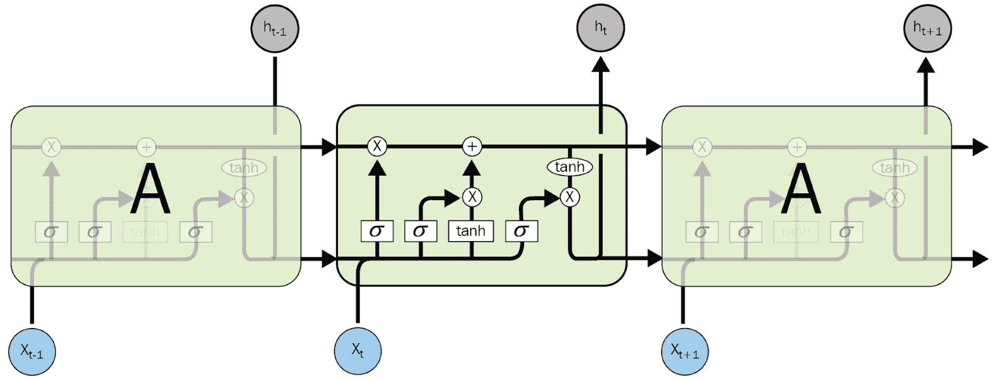

# 第十章：递归类型神经网络 - 语言建模

**递归神经网络**（**RNNs**）是一类广泛用于自然语言处理的深度学习架构。这类架构使我们能够为当前的预测提供上下文信息，并且具有处理任何输入序列中长期依赖性的特定架构。在本章中，我们将展示如何构建一个序列到序列模型，这将在 NLP 的许多应用中非常有用。我们将通过构建一个字符级语言模型来展示这些概念，并查看我们的模型如何生成与原始输入序列相似的句子。

本章将涵盖以下主题：

+   RNNs 背后的直觉

+   LSTM 网络

+   语言模型的实现

# RNNs 背后的直觉

到目前为止，我们处理的所有深度学习架构都没有机制来记住它们之前接收到的输入。例如，如果你给**前馈神经网络**（**FNN**）输入一串字符，例如**HELLO**，当网络处理到**E**时，你会发现它没有保留任何信息/忘记了它刚刚读取的**H**。这是基于序列的学习的一个严重问题。由于它没有记住任何它读取过的先前字符，这种网络将非常难以训练来预测下一个字符。这对于许多应用（如语言建模、机器翻译、语音识别等）来说是没有意义的。

出于这个特定的原因，我们将介绍 RNNs，这是一组能够保存信息并记住它们刚刚遇到的内容的深度学习架构。

让我们展示 RNNs 如何在相同的字符输入序列**HELLO**上工作。当 RNN 单元接收到**E**作为输入时，它也接收到先前输入的字符**H**。这种将当前字符和先前字符一起作为输入传递给 RNN 单元的做法为这些架构提供了一个巨大优势，即短期记忆；它还使这些架构能够用于预测/推测在这个特定字符序列中**H**之后最可能的字符，即**L**。

我们已经看到，先前的架构将权重分配给它们的输入；RNNs 遵循相同的优化过程，将权重分配给它们的多个输入，包括当前输入和过去输入。因此，在这种情况下，网络将为每个输入分配两个不同的权重矩阵。为了做到这一点，我们将使用**梯度下降**和一种更重的反向传播版本，称为**时间反向传播**（**BPTT**）。

# 递归神经网络架构

根据我们对以前深度学习架构的了解，你会发现 RNN 是特别的。我们学过的前几种架构在输入或训练方面并不灵活。它们接受固定大小的序列/向量/图像作为输入，并产生另一个固定大小的输出。RNN 架构则有所不同，因为它们允许你输入一个序列并得到另一个序列作为输出，或者仅在输入/输出中使用序列，如*图 1*所示。这种灵活性对于多种应用，如语言建模和情感分析，非常有用：


图 1：RNN 在输入或输出形状上的灵活性（[`karpathy.github.io/2015/05/21/rnn-effectiveness/`](http://karpathy.github.io/2015/05/21/rnn-effectiveness/)）

这些架构的直观原理是模仿人类处理信息的方式。在任何典型的对话中，你对某人话语的理解完全依赖于他之前说了什么，甚至可能根据他刚刚说的内容预测他接下来会说什么。

在 RNN 的情况下，应该遵循完全相同的过程。例如，假设你想翻译句子中的某个特定单词。你不能使用传统的 FNN，因为它们无法将之前单词的翻译作为输入与当前我们想翻译的单词结合使用，这可能导致翻译错误，因为缺少与该单词相关的上下文信息。

RNN 保留了关于过去的信息，并且它们具有某种循环结构，允许在任何给定时刻将之前学到的信息用于当前的预测：


图 2：具有循环结构的 RNN 架构，用于保留过去步骤的信息（来源：[`colah.github.io/posts/2015-08-Understanding-LSTMs/`](http://colah.github.io/posts/2015-08-Understanding-LSTMs/)）

在*图 2*中，我们有一些神经网络称为*A*，它接收输入 *X[t]* 并生成输出 *h[t]*。同时，它借助这个循环接收来自过去步骤的信息。

这个循环看起来似乎不太清楚，但如果我们使用*图 2*的展开版本，你会发现它非常简单且直观，RNN 其实就是同一网络的重复版本（这可以是普通的 FNN），如*图 3*所示：


图 3：递归神经网络架构的展开版本（来源：[`colah.github.io/posts/2015-08-Understanding-LSTMs/`](http://colah.github.io/posts/2015-08-Understanding-LSTMs/)）

RNN 的这种直观架构及其在输入/输出形状上的灵活性，使得它们非常适合处理有趣的基于序列的学习任务，如机器翻译、语言建模、情感分析、图像描述等。

# RNN 的示例

现在，我们对循环神经网络（RNN）的工作原理有了直观的理解，也了解它在不同有趣的基于序列的例子中的应用。让我们更深入地了解一些这些有趣的例子。

# 字符级语言模型

语言建模是许多应用中一个至关重要的任务，如语音识别、机器翻译等。在本节中，我们将尝试模拟 RNN 的训练过程，并更深入地理解这些网络的工作方式。我们将构建一个基于字符的语言模型。所以，我们将向网络提供一段文本，目的是尝试建立一个概率分布，用于预测给定前一个字符后的下一个字符的概率，这将使我们能够生成类似于我们在训练过程中输入的文本。

例如，假设我们有一个词汇表仅包含四个字母，**helo**。

任务是训练一个循环神经网络，处理一个特定的字符输入序列，如**hello**。在这个具体的例子中，我们有四个训练样本：

1.  给定第一个输入字符**h**的上下文，应该计算字符**e**的概率，

1.  给定**he**的上下文，应该计算字符**l**的概率，

1.  给定**hel**的上下文，应该计算字符**l**的概率，

1.  最终，给定**hell**的上下文，应该计算字符**o**的概率。

正如我们在前几章中学到的那样，机器学习技术，深度学习也属于其中的一部分，一般只接受实数值作为输入。因此，我们需要以某种方式将输入字符转换或编码为数字形式。为此，我们将使用 one-hot 向量编码，这是一种通过将一个向量中除一个位置外其他位置填充为零的方式来编码文本，其中该位置的索引表示我们试图建模的语言（在此为**helo**）中的字符索引。在对训练样本进行编码后，我们将逐个提供给 RNN 类型的模型。在给定的每个字符时，RNN 类型模型的输出将是一个四维向量（该向量的大小对应于词汇表的大小），表示词汇表中每个字符作为下一个字符的概率。*图 4* 清楚地说明了这个过程：


图 4：RNN 类型网络的示例，输入为通过 one-hot 向量编码的字符，输出是词汇表中的分布，表示当前字符后最可能的字符（来源：http://karpathy.github.io/2015/05/21/rnn-effectiveness/）

如*图 4*所示，你可以看到我们将输入序列中的第一个字符**h**喂给模型，输出是一个四维向量，表示下一个字符的置信度。所以它对**h**作为下一个字符的置信度是**1.0**，对**e**是**2.2**，对**l**是**-3.0**，对**o**是**4.1**。在这个特定的例子中，我们知道下一个正确字符是**e**，基于我们的训练序列**hello**。所以，我们在训练这个 RNN 类型网络时的主要目标是增加**e**作为下一个字符的置信度，并减少其他字符的置信度。为了进行这种优化，我们将使用梯度下降和反向传播算法来更新权重，影响网络产生更高置信度的正确下一个字符**e**，并以此类推，处理其他三个训练例子。

如你所见，RNN 类型网络的输出会产生一个对所有词汇中字符的置信度分布，表示下一个字符可能性。我们可以将这种置信度分布转化为概率分布，使得某个字符作为下一个字符的概率增加时，其他字符的概率会相应减少，因为概率总和必须为 1。对于这种特定的修改，我们可以对每个输出向量使用一个标准的 Softmax 层。

为了从这些类型的网络生成文本，我们可以将一个初始字符输入模型，并得到一个关于下一个字符可能性的概率分布，然后我们可以从这些字符中采样并将其反馈作为输入给模型。通过重复这一过程多次，我们就能生成一个具有所需长度的字符序列。

# 使用莎士比亚数据的语言模型

从前面的例子中，我们可以得到生成文本的模型。但网络会让我们惊讶，因为它不仅仅会生成文本，还会学习训练数据中的风格和结构。我们可以通过训练一个 RNN 类型的模型来展示这一有趣的过程，使用具有结构和风格的特定文本，例如以下的莎士比亚作品。

让我们来看看从训练好的网络生成的输出：

第二位参议员：

他们远离了我灵魂上的痛苦，

当我死去时，打破并强烈应当埋葬

许多国家的地球与思想。

尽管网络一次只知道如何生成一个字符，但它还是能够生成有意义的文本和实际具有莎士比亚作品风格和结构的名字。

# 梯度消失问题

在训练这些 RNN 类型架构时，我们使用梯度下降和通过时间的反向传播，这些方法为许多基于序列的学习任务带来了成功。但是，由于梯度的性质以及使用快速训练策略，研究表明梯度值往往会变得过小并消失。这一过程引发了许多从业者遇到的梯度消失问题。接下来，在本章中，我们将讨论研究人员如何解决这些问题，并提出了传统 RNN 的变种来克服这个问题：


图 5：梯度消失问题

# 长期依赖问题

研究人员面临的另一个挑战性问题是文本中的长期依赖。例如，如果有人输入类似 *我曾经住在法国，并且我学会了如何说……* 的序列，那么接下来的显而易见的词是 French。

在这种情况下，传统 RNN 能够处理短期依赖问题，如*图 6*所示：


图 6：展示文本中的短期依赖（来源：http://colah.github.io/posts/2015-08-Understanding-LSTMs/）

另一个例子是，如果某人开始输入 *我曾经住在法国……* 然后描述住在那里的一些美好经历，最后以 *我学会了说法语* 结束序列。那么，为了让模型预测他/她在序列结束时学会的语言，模型需要保留早期词汇 *live* 和 *France* 的信息。如果模型不能有效地跟踪文本中的长期依赖，它就无法处理这种情况：


图 7：文本中长期依赖问题的挑战（来源：http://colah.github.io/posts/2015-08-Understanding-LSTMs/）

为了处理文本中的梯度消失和长期依赖问题，研究人员引入了一种名为**长短时记忆网络**（**LSTM**）的变种网络。

# LSTM 网络

LSTM 是一种 RNN 的变种，用于帮助学习文本中的长期依赖。LSTM 最初由 Hochreiter 和 Schmidhuber（1997 年）提出（链接：[`www.bioinf.jku.at/publications/older/2604.pdf`](http://www.bioinf.jku.at/publications/older/2604.pdf)），许多研究者在此基础上展开了工作，并在多个领域取得了有趣的成果。

这些架构能够处理文本中长期依赖的问题，因为它们的内部架构设计使然。

LSTM 与传统的 RNN 相似，都具有一个随着时间重复的模块，但这个重复模块的内部结构与传统 RNN 不同。它包括更多的层，用于遗忘和更新信息：


图 8：标准 RNN 中包含单一层的重复模块（来源：http://colah.github.io/posts/2015-08-Understanding-LSTMs/）

如前所述，基础 RNN 只有一个神经网络层，而 LSTM 有四个不同的层以特殊的方式相互作用。这种特殊的交互方式使得 LSTM 在许多领域中表现得非常好，正如我们在构建语言模型示例时会看到的那样：



图 9：LSTM 中包含四个交互层的重复模块（来源：http://colah.github.io/posts/2015-08-Understanding-LSTMs/）

关于数学细节以及四个层是如何相互作用的更多信息，可以参考这个有趣的教程：[`colah.github.io/posts/2015-08-Understanding-LSTMs/`](http://colah.github.io/posts/2015-08-Understanding-LSTMs/)

# 为什么 LSTM 有效？

我们的基础 LSTM 架构的第一步是决定哪些信息是不必要的，它通过丢弃这些信息，为更重要的信息留出更多空间。为此，我们有一个叫做**遗忘门层**的层，它查看前一个输出*h[t-1]*和当前输入*x[t]*，并决定我们要丢弃哪些信息。

LSTM 架构中的下一步是决定哪些信息值得保留/持久化并存储到细胞中。这是通过两个步骤完成的：

1.  一个叫做**输入门层**的层，决定了哪些来自前一状态的值需要被更新

1.  第二步是生成一组新的候选值，这些值将被添加到细胞中

最后，我们需要决定 LSTM 单元将输出什么。这个输出将基于我们的细胞状态，但会是一个经过筛选的版本。

# 语言模型的实现

在本节中，我们将构建一个基于字符的语言模型。在这个实现中，我们将使用《安娜·卡列尼娜》小说，并观察网络如何学习实现文本的结构和风格：


图 10：字符级 RNN 的一般架构（来源：http://karpathy.github.io/2015/05/21/rnn-effectiveness/）

该网络基于 Andrej Karpathy 关于 RNN 的文章（链接：[`karpathy.github.io/2015/05/21/rnn-effectiveness/`](http://karpathy.github.io/2015/05/21/rnn-effectiveness/)）和在 Torch 中的实现（链接：[`github.com/karpathy/char-rnn`](https://github.com/karpathy/char-rnn)）。此外，这里还有一些来自 r2rt 的资料（链接：[`r2rt.com/recurrent-neural-networks-in-tensorflow-ii.html`](http://r2rt.com/recurrent-neural-networks-in-tensorflow-ii.html)）以及 Sherjil Ozairp（链接：[`github.com/sherjilozair/char-rnn-tensorflow`](https://github.com/sherjilozair/char-rnn-tensorflow)）在 GitHub 上的内容。以下是字符级 RNN 的一般架构。

我们将构建一个基于《安娜·卡列尼娜》小说的字符级 RNN（链接：[`en.wikipedia.org/wiki/Anna_Karenina`](https://en.wikipedia.org/wiki/Anna_Karenina)）。它将能够基于书中的文本生成新的文本。你将在这个实现的资源包中找到`.txt`文件。

让我们首先导入实现字符级别操作所需的库：

```py
import numpy as np
import tensorflow as tf

from collections import namedtuple
```

首先，我们需要通过加载数据集并将其转换为整数来准备数据集。因此，我们将字符转换为整数，然后将其编码为整数，这使得它可以作为模型的输入变量，直观且易于使用：

```py
#reading the Anna Karenina novel text file
with open('Anna_Karenina.txt', 'r') as f:
    textlines=f.read()

#Building the vocan and encoding the characters as integers
language_vocab = set(textlines)
vocab_to_integer = {char: j for j, char in enumerate(language_vocab)}
integer_to_vocab = dict(enumerate(language_vocab))
encoded_vocab = np.array([vocab_to_integer[char] for char in textlines], dtype=np.int32)
```

让我们看一下《安娜·卡列尼娜》文本中的前 200 个字符：

```py
textlines[:200]
Output:
"Chapter 1\n\n\nHappy families are all alike; every unhappy family is unhappy in its own\nway.\n\nEverything was in confusion in the Oblonskys' house. The wife had\ndiscovered that the husband was carrying on"
```

我们还将字符转换为适合网络使用的便捷形式，即整数。因此，让我们来看一下这些字符的编码版本：

```py
encoded_vocab[:200]
Output:
array([70, 34, 54, 29, 24, 19, 76, 45, 2, 79, 79, 79, 69, 54, 29, 29, 49,
       45, 66, 54, 39, 15, 44, 15, 19, 12, 45, 54, 76, 19, 45, 54, 44, 44,
      45, 54, 44, 15, 27, 19, 58, 45, 19, 30, 19, 76, 49, 45, 59, 56, 34,
       54, 29, 29, 49, 45, 66, 54, 39, 15, 44, 49, 45, 15, 12, 45, 59, 56,
       34, 54, 29, 29, 49, 45, 15, 56, 45, 15, 24, 12, 45, 11, 35, 56, 79,
       35, 54, 49, 53, 79, 79, 36, 30, 19, 76, 49, 24, 34, 15, 56, 16, 45,
       35, 54, 12, 45, 15, 56, 45, 31, 11, 56, 66, 59, 12, 15, 11, 56, 45,
       15, 56, 45, 24, 34, 19, 45, 1, 82, 44, 11, 56, 12, 27, 49, 12, 37,
       45, 34, 11, 59, 12, 19, 53, 45, 21, 34, 19, 45, 35, 15, 66, 19, 45,
       34, 54, 64, 79, 64, 15, 12, 31, 11, 30, 19, 76, 19, 64, 45, 24, 34,
       54, 24, 45, 24, 34, 19, 45, 34, 59, 12, 82, 54, 56, 64, 45, 35, 54,
       12, 45, 31, 54, 76, 76, 49, 15, 56, 16, 45, 11, 56], dtype=int32)
```

由于网络处理的是单个字符，因此它类似于一个分类问题，我们试图从之前的文本中预测下一个字符。以下是我们网络需要选择的类别数。

因此，我们将一次喂给模型一个字符，模型将通过对可能出现的下一个字符（词汇表中的字符）的概率分布进行预测，从而预测下一个字符，这相当于网络需要从中选择的多个类别：

```py
len(language_vocab)
Output:
83
```

由于我们将使用随机梯度下降来训练我们的模型，因此我们需要将数据转换为训练批次。

# 用于训练的小批次生成

在本节中，我们将把数据分成小批次以供训练使用。因此，这些批次将包含许多具有所需序列步数的序列。让我们在*图 11*中查看一个可视化示例：


图 11：批次和序列的可视化示例（来源：[`oscarmore2.github.io/Anna_KaRNNa_files/charseq.jpeg`](http://oscarmore2.github.io/Anna_KaRNNa_files/charseq.jpeg)）

现在，我们需要定义一个函数，该函数将遍历编码后的文本并生成批次。在这个函数中，我们将使用 Python 中的一个非常棒的机制，叫做**yield**（链接：[`jeffknupp.com/blog/2013/04/07/improve-your-python-yield-and-generators-explained/`](https://jeffknupp.com/blog/2013/04/07/improve-your-python-yield-and-generators-explained/)）。

一个典型的批次将包含*N × M*个字符，其中*N*是序列的数量，*M*是序列步数的数量。为了获得数据集中可能的批次数，我们可以简单地将数据的长度除以所需的批次大小，然后在得到这个可能的批次数后，我们可以确定每个批次应该包含多少个字符。

之后，我们需要将现有数据集拆分成所需数量的序列（*N*）。我们可以使用 `arr.reshape(size)`。我们知道我们需要 *N* 个序列（在后续代码中使用 `num_seqs`），让我们将其作为第一维的大小。对于第二维，你可以使用 -1 作为占位符，它会为你填充适当的数据。这样，你应该得到一个形状为 *N × (M * K)* 的数组，其中 *K* 是批次的数量。

现在我们有了这个数组，可以通过它进行迭代以获取训练批次，每个批次包含 *N × M* 个字符。对于每个后续批次，窗口会向右移动 `num_steps`。最后，我们还需要创建输入和输出数组，以便将它们用作模型输入。这一步创建输出值非常简单；记住，目标是将输入移位一个字符。你通常会看到第一个输入字符作为最后一个目标字符使用，像这样：


其中 *x* 是输入批次，*y* 是目标批次。

我喜欢通过使用 range 函数来做这个窗口，步长为 `num_steps`，从 0 到 `arr.shape[1]`，也就是每个序列的总步数。这样，你从 range 函数得到的整数始终指向一个批次的开始，每个窗口宽度为 `num_steps`：

```py
def generate_character_batches(data, num_seq, num_steps):
    '''Create a function that returns batches of size
       num_seq x num_steps from data.
    '''
    # Get the number of characters per batch and number of batches
    num_char_per_batch = num_seq * num_steps
    num_batches = len(data)//num_char_per_batch

    # Keep only enough characters to make full batches
    data = data[:num_batches * num_char_per_batch]

    # Reshape the array into n_seqs rows
    data = data.reshape((num_seq, -1))

    for i in range(0, data.shape[1], num_steps):
        # The input variables
        input_x = data[:, i:i+num_steps]

        # The output variables which are shifted by one
        output_y = np.zeros_like(input_x)

        output_y[:, :-1], output_y[:, -1] = input_x[:, 1:], input_x[:, 0]
        yield input_x, output_y
```

所以，让我们使用这个函数来演示，通过生成一个包含 15 个序列和 50 个序列步骤的批次：

```py
generated_batches = generate_character_batches(encoded_vocab, 15, 50)
input_x, output_y = next(generated_batches)
print('input\n', input_x[:10, :10])
print('\ntarget\n', output_y[:10, :10])
Output:

input
 [[70 34 54 29 24 19 76 45 2 79]
 [45 19 44 15 16 15 82 44 19 45]
 [11 45 44 15 16 34 24 38 34 19]
 [45 34 54 64 45 82 19 19 56 45]
 [45 11 56 19 45 27 56 19 35 79]
 [49 19 54 76 12 45 44 54 12 24]
 [45 41 19 45 16 11 45 15 56 24]
 [11 35 45 24 11 45 39 54 27 19]
 [82 19 66 11 76 19 45 81 19 56]
 [12 54 16 19 45 44 15 27 19 45]]

target
 [[34 54 29 24 19 76 45 2 79 79]
 [19 44 15 16 15 82 44 19 45 16]
 [45 44 15 16 34 24 38 34 19 54]
 [34 54 64 45 82 19 19 56 45 82]
 [11 56 19 45 27 56 19 35 79 35]
 [19 54 76 12 45 44 54 12 24 45]
 [41 19 45 16 11 45 15 56 24 11]
 [35 45 24 11 45 39 54 27 19 33]
 [19 66 11 76 19 45 81 19 56 24]
 [54 16 19 45 44 15 27 19 45 24]]
```

接下来，我们将着手构建本示例的核心部分，即 LSTM 模型。

# 构建模型

在深入使用 LSTM 构建字符级模型之前，值得提到一个叫做 **堆叠 LSTM** 的概念。

堆叠 LSTM 对于在不同时间尺度上查看信息非常有用。

# 堆叠 LSTM

“通过将多个递归隐藏状态堆叠在一起构建深度 RNN。这种方法可以使每个层次的隐藏状态在不同的时间尺度上运行。” ——《如何构建深度递归神经网络》（链接: https://arxiv.org/abs/1312.6026），2013 年

“RNN 本质上在时间上是深度的，因为它们的隐藏状态是所有先前隐藏状态的函数。启发本文的一个问题是，RNN 是否也能从空间深度中受益；也就是将多个递归隐藏层堆叠在一起，就像在传统深度网络中堆叠前馈层一样。” ——《深度 RNN 的语音识别》（链接: [`arxiv.org/abs/1303.5778`](https://arxiv.org/abs/1303.5778)），2013 年

大多数研究人员都在使用堆叠 LSTM 来解决具有挑战性的序列预测问题。堆叠 LSTM 架构可以定义为由多个 LSTM 层组成的 LSTM 模型。前面的 LSTM 层为 LSTM 层提供序列输出，而不是单一的值输出，如下所示。

具体来说，它是每个输入时间步都有一个输出，而不是所有输入时间步都只有一个输出时间步：


图 12：堆叠 LSTM

所以，在这个例子中，我们将使用这种堆叠 LSTM 架构，它能提供更好的性能。

# 模型架构

在这里你将构建网络。我们将把它分成几个部分，这样更容易理解每个部分。然后，我们可以将它们连接成一个完整的网络：


图 13：字符级模型架构

# 输入

现在，让我们开始定义模型输入作为占位符。模型的输入将是训练数据和目标。我们还将使用一个叫做`keep_probability`的参数用于 dropout 层，帮助模型避免过拟合：

```py
def build_model_inputs(batch_size, num_steps):

    # Declare placeholders for the input and output variables
    inputs_x = tf.placeholder(tf.int32, [batch_size, num_steps], name='inputs')
    targets_y = tf.placeholder(tf.int32, [batch_size, num_steps], name='targets')

    # define the keep_probability for the dropout layer
    keep_probability = tf.placeholder(tf.float32, name='keep_prob')

    return inputs_x, targets_y, keep_probability
```

# 构建一个 LSTM 单元

在这一部分，我们将编写一个函数来创建 LSTM 单元，这将用于隐藏层。这个单元将是我们模型的构建块。因此，我们将使用 TensorFlow 来创建这个单元。让我们看看如何使用 TensorFlow 构建一个基本的 LSTM 单元。

我们调用以下代码行来创建一个 LSTM 单元，参数`num_units`表示隐藏层中的单元数：

```py
lstm_cell = tf.contrib.rnn.BasicLSTMCell(num_units)
```

为了防止过拟合，我们可以使用一种叫做**dropout**的技术，它通过减少模型的复杂度来防止模型过拟合数据：

```py
tf.contrib.rnn.DropoutWrapper(lstm, output_keep_prob=keep_probability)
```

正如我们之前提到的，我们将使用堆叠 LSTM 架构；它将帮助我们从不同角度查看数据，并且在实践中已被证明能表现得更好。为了在 TensorFlow 中定义堆叠 LSTM，我们可以使用`tf.contrib.rnn.MultiRNNCell`函数（链接：[`www.tensorflow.org/versions/r1.0/api_docs/python/tf/contrib/rnn/MultiRNNCell`](https://www.tensorflow.org/versions/r1.0/api_docs/python/tf/contrib/rnn/MultiRNNCell)）：

```py
tf.contrib.rnn.MultiRNNCell([cell]*num_layers)
```

初始时，对于第一个单元，没有前一个信息，因此我们需要将单元状态初始化为零。我们可以使用以下函数来实现：

```py
initial_state = cell.zero_state(batch_size, tf.float32)
```

那么，让我们把所有部分结合起来，创建我们的 LSTM 单元：

```py
def build_lstm_cell(size, num_layers, batch_size, keep_probability):

    ### Building the LSTM Cell using the tensorflow function
    lstm_cell = tf.contrib.rnn.BasicLSTMCell(size)

    # Adding dropout to the layer to prevent overfitting
    drop_layer = tf.contrib.rnn.DropoutWrapper(lstm_cell, output_keep_prob=keep_probability)

    # Add muliple cells together and stack them up to oprovide a level of more understanding
    stakced_cell = tf.contrib.rnn.MultiRNNCell([drop_layer] * num_layers)
    initial_cell_state = lstm_cell.zero_state(batch_size, tf.float32)

    return lstm_cell, initial_cell_state
```

# RNN 输出

接下来，我们需要创建输出层，负责读取各个 LSTM 单元的输出并通过全连接层传递。这个层有一个 softmax 输出，用于生成可能出现的下一个字符的概率分布。

如你所知，我们为网络生成了输入批次，大小为 *N × M* 字符，其中 *N* 是该批次中的序列数，*M* 是序列步数。我们在创建模型时也使用了 *L* 个隐藏单元。根据批次大小和隐藏单元的数量，网络的输出将是一个 *3D* Tensor，大小为 *N × M × L*，这是因为我们调用 LSTM 单元 *M* 次，每次处理一个序列步。每次调用 LSTM 单元会产生一个大小为 *L* 的输出。最后，我们需要做的就是执行 *N* 次，即序列的数量。

然后，我们将这个 *N × M × L* 的输出传递给一个全连接层（所有输出使用相同的权重），但在此之前，我们将输出重新调整为一个 *2D* 张量，形状为 *(M * N) × L*。这个重新调整形状将使我们在处理输出时更加简便，因为新的形状会更方便；每一行的值代表了 LSTM 单元的 *L* 个输出，因此每一行对应一个序列和步骤。

在获取新形状之后，我们可以通过矩阵乘法将其与权重相乘，将其连接到带有 softmax 的全连接层。LSTM 单元中创建的权重和我们在这里即将创建的权重默认使用相同的名称，这样 TensorFlow 就会抛出错误。为避免这个错误，我们可以使用 TensorFlow 函数 `tf.variable_scope()` 将在这里创建的权重和偏置变量封装在一个变量作用域内。

在解释了输出的形状以及如何重新调整形状后，为了简化操作，我们继续编写这个 `build_model_output` 函数：

```py
def build_model_output(output, input_size, output_size):

    # Reshaping output of the model to become a bunch of rows, where each row correspond for each step in the seq
    sequence_output = tf.concat(output, axis=1)
    reshaped_output = tf.reshape(sequence_output, [-1, input_size])

    # Connect the RNN outputs to a softmax layer
    with tf.variable_scope('softmax'):
        softmax_w = tf.Variable(tf.truncated_normal((input_size, output_size), stddev=0.1))
        softmax_b = tf.Variable(tf.zeros(output_size))

    # the output is a set of rows of LSTM cell outputs, so the logits will be a set
    # of rows of logit outputs, one for each step and sequence
    logits = tf.matmul(reshaped_output, softmax_w) + softmax_b

    # Use softmax to get the probabilities for predicted characters
    model_out = tf.nn.softmax(logits, name='predictions')

    return model_out, logits
```

# 训练损失

接下来是训练损失。我们获取 logits 和 targets，并计算 softmax 交叉熵损失。首先，我们需要对 targets 进行 one-hot 编码；我们得到的是编码后的字符。然后，我们重新调整 one-hot targets 的形状，使其成为一个 *2D* 张量，大小为 *(M * N) × C*，其中 *C* 是我们拥有的类别/字符数。记住，我们已经调整了 LSTM 输出的形状，并通过一个具有 *C* 单元的全连接层。于是，我们的 logits 也将具有大小 *(M * N) × C*。

然后，我们将 `logits` 和 `targets` 输入到 `tf.nn.softmax_cross_entropy_with_logits` 中，并计算其均值以获得损失：

```py
def model_loss(logits, targets, lstm_size, num_classes):

    # convert the targets to one-hot encoded and reshape them to match the logits, one row per batch_size per step
    output_y_one_hot = tf.one_hot(targets, num_classes)
    output_y_reshaped = tf.reshape(output_y_one_hot, logits.get_shape())

    #Use the cross entropy loss
    model_loss = tf.nn.softmax_cross_entropy_with_logits(logits=logits, labels=output_y_reshaped)
    model_loss = tf.reduce_mean(model_loss)
    return model_loss
```

# 优化器

最后，我们需要使用一种优化方法，帮助我们从数据集中学习到一些东西。正如我们所知，普通的 RNN 存在梯度爆炸和梯度消失的问题。LSTM 仅解决了其中一个问题，即梯度值的消失，但即使使用了 LSTM，仍然有一些梯度值会爆炸并且无限增大。为了解决这个问题，我们可以使用一种叫做**梯度裁剪**的技术，它可以将爆炸的梯度裁剪到一个特定的阈值。

所以，让我们通过使用 Adam 优化器来定义我们的优化器，用于学习过程：

```py
def build_model_optimizer(model_loss, learning_rate, grad_clip):

    # define optimizer for training, using gradient clipping to avoid the exploding of the gradients
    trainable_variables = tf.trainable_variables()
    gradients, _ = tf.clip_by_global_norm(tf.gradients(model_loss, trainable_variables), grad_clip)

    #Use Adam Optimizer
    train_operation = tf.train.AdamOptimizer(learning_rate)
    model_optimizer = train_operation.apply_gradients(zip(gradients, trainable_variables))

    return model_optimizer
```

# 构建网络

现在，我们可以将所有部分组合起来，构建一个网络的类。为了真正将数据传递到 LSTM 单元，我们将使用`tf.nn.dynamic_rnn`（链接：[`www.tensorflow.org/versions/r1.0/api_docs/python/tf/nn/dynamic_rnn`](https://www.tensorflow.org/versions/r1.0/api_docs/python/tf/nn/dynamic_rnn)）。这个函数会适当地传递隐藏状态和单元状态给 LSTM 单元。它返回每个序列中每个 LSTM 单元在每个步骤的输出。它还会给我们最终的 LSTM 状态。我们希望将这个状态保存为`final_state`，以便在下一次 mini-batch 运行时将其传递给第一个 LSTM 单元。对于`tf.nn.dynamic_rnn`，我们传入从`build_lstm`获得的单元和初始状态，以及我们的输入序列。此外，我们需要对输入进行 one-hot 编码，然后才能进入 RNN：

```py
class CharLSTM:

    def __init__(self, num_classes, batch_size=64, num_steps=50, 
                       lstm_size=128, num_layers=2, learning_rate=0.001, 
                       grad_clip=5, sampling=False):

        # When we're using this network for generating text by sampling, we'll be providing the network with
        # one character at a time, so providing an option for it.
        if sampling == True:
            batch_size, num_steps = 1, 1
        else:
            batch_size, num_steps = batch_size, num_steps

        tf.reset_default_graph()

        # Build the model inputs placeholders of the input and target variables
        self.inputs, self.targets, self.keep_prob = build_model_inputs(batch_size, num_steps)

        # Building the LSTM cell
        lstm_cell, self.initial_state = build_lstm_cell(lstm_size, num_layers, batch_size, self.keep_prob)

        ### Run the data through the LSTM layers
        # one_hot encode the input
        input_x_one_hot = tf.one_hot(self.inputs, num_classes)

        # Runing each sequence step through the LSTM architecture and finally collecting the outputs
        outputs, state = tf.nn.dynamic_rnn(lstm_cell, input_x_one_hot, initial_state=self.initial_state)
        self.final_state = state

        # Get softmax predictions and logits
        self.prediction, self.logits = build_model_output(outputs, lstm_size, num_classes)

        # Loss and optimizer (with gradient clipping)
        self.loss = model_loss(self.logits, self.targets, lstm_size, num_classes)
        self.optimizer = build_model_optimizer(self.loss, learning_rate, grad_clip)
```

# 模型超参数

和任何深度学习架构一样，有一些超参数可以用来控制模型并进行微调。以下是我们为这个架构使用的超参数集：

+   批次大小是每次通过网络运行的序列数量。

+   步骤数是网络训练过程中序列中的字符数量。通常，越大越好；网络将学习更多的长程依赖，但训练时间也会更长。100 通常是一个不错的数字。

+   LSTM 的大小是隐藏层中单元的数量。

+   架构层数是要使用的隐藏 LSTM 层的数量。

+   学习率是训练中典型的学习率。

+   最后，我们引入了一个新的概念，叫做保持概率，它由 dropout 层使用；它帮助网络避免过拟合。如果你的网络出现过拟合，尝试减小这个值。

# 训练模型

现在，让我们通过提供输入和输出给构建的模型来启动训练过程，然后使用优化器训练网络。不要忘记，在为当前状态做出预测时，我们需要使用前一个状态。因此，我们需要将输出状态传递回网络，以便在预测下一个输入时使用。

让我们为超参数提供初始值（你可以在之后根据训练该架构使用的数据集调整这些值）：

```py

batch_size = 100        # Sequences per batch
num_steps = 100         # Number of sequence steps per batch
lstm_size = 512         # Size of hidden layers in LSTMs
num_layers = 2          # Number of LSTM layers
learning_rate = 0.001   # Learning rate
keep_probability = 0.5  # Dropout keep probability
```

```py
epochs = 5

# Save a checkpoint N iterations
save_every_n = 100

LSTM_model = CharLSTM(len(language_vocab), batch_size=batch_size, num_steps=num_steps,
                lstm_size=lstm_size, num_layers=num_layers, 
                learning_rate=learning_rate)

saver = tf.train.Saver(max_to_keep=100)
with tf.Session() as sess:
    sess.run(tf.global_variables_initializer())

    # Use the line below to load a checkpoint and resume training
    #saver.restore(sess, 'checkpoints/______.ckpt')
    counter = 0
    for e in range(epochs):
        # Train network
        new_state = sess.run(LSTM_model.initial_state)
        loss = 0
        for x, y in generate_character_batches(encoded_vocab, batch_size, num_steps):
            counter += 1
            start = time.time()
            feed = {LSTM_model.inputs: x,
                    LSTM_model.targets: y,
                    LSTM_model.keep_prob: keep_probability,
                    LSTM_model.initial_state: new_state}
            batch_loss, new_state, _ = sess.run([LSTM_model.loss, 
                                                 LSTM_model.final_state, 
                                                 LSTM_model.optimizer], 
                                                 feed_dict=feed)

            end = time.time()
            print('Epoch number: {}/{}... '.format(e+1, epochs),
                  'Step: {}... '.format(counter),
                  'loss: {:.4f}... '.format(batch_loss),
                  '{:.3f} sec/batch'.format((end-start)))

            if (counter % save_every_n == 0):
                saver.save(sess, "checkpoints/i{}_l{}.ckpt".format(counter, lstm_size))

    saver.save(sess, "checkpoints/i{}_l{}.ckpt".format(counter, lstm_size))
```

在训练过程的最后，你应该得到一个接近以下的错误：

```py
.
.
.
Epoch number: 5/5...  Step: 978...  loss: 1.7151...  0.050 sec/batch
Epoch number: 5/5...  Step: 979...  loss: 1.7428...  0.051 sec/batch
Epoch number: 5/5...  Step: 980...  loss: 1.7151...  0.050 sec/batch
Epoch number: 5/5...  Step: 981...  loss: 1.7236...  0.050 sec/batch
Epoch number: 5/5...  Step: 982...  loss: 1.7314...  0.051 sec/batch
Epoch number: 5/5...  Step: 983...  loss: 1.7369...  0.051 sec/batch
Epoch number: 5/5...  Step: 984...  loss: 1.7075...  0.065 sec/batch
Epoch number: 5/5...  Step: 985...  loss: 1.7304...  0.051 sec/batch
Epoch number: 5/5...  Step: 986...  loss: 1.7128...  0.049 sec/batch
Epoch number: 5/5...  Step: 987...  loss: 1.7107...  0.051 sec/batch
Epoch number: 5/5...  Step: 988...  loss: 1.7351...  0.051 sec/batch
Epoch number: 5/5...  Step: 989...  loss: 1.7260...  0.049 sec/batch
Epoch number: 5/5...  Step: 990...  loss: 1.7144...  0.051 sec/batch
```

# 保存检查点

现在，让我们加载检查点。关于保存和加载检查点的更多信息，你可以查看 TensorFlow 文档（[`www.tensorflow.org/programmers_guide/variables`](https://www.tensorflow.org/programmers_guide/variables)）：

```py
tf.train.get_checkpoint_state('checkpoints')
```

```py
Output:
model_checkpoint_path: "checkpoints/i990_l512.ckpt"
all_model_checkpoint_paths: "checkpoints/i100_l512.ckpt"
all_model_checkpoint_paths: "checkpoints/i200_l512.ckpt"
all_model_checkpoint_paths: "checkpoints/i300_l512.ckpt"
all_model_checkpoint_paths: "checkpoints/i400_l512.ckpt"
all_model_checkpoint_paths: "checkpoints/i500_l512.ckpt"
all_model_checkpoint_paths: "checkpoints/i600_l512.ckpt"
all_model_checkpoint_paths: "checkpoints/i700_l512.ckpt"
all_model_checkpoint_paths: "checkpoints/i800_l512.ckpt"
all_model_checkpoint_paths: "checkpoints/i900_l512.ckpt"
all_model_checkpoint_paths: "checkpoints/i990_l512.ckpt"
```

# 生成文本

我们有一个基于输入数据集训练的模型。下一步是使用这个训练好的模型生成文本，并看看这个模型是如何学习输入数据的风格和结构的。为此，我们可以从一些初始字符开始，然后将新预测的字符作为下一个步骤的输入。我们将重复这个过程，直到生成特定长度的文本。

在以下代码中，我们还向函数添加了额外的语句，以便用一些初始文本为网络预热并从那里开始。

网络为我们提供了词汇中每个字符的预测或概率。为了减少噪声并只使用网络更加自信的字符，我们将只从输出中选择前*N*个最可能的字符：

```py
def choose_top_n_characters(preds, vocab_size, top_n_chars=4):
    p = np.squeeze(preds)
    p[np.argsort(p)[:-top_n_chars]] = 0
    p = p / np.sum(p)
    c = np.random.choice(vocab_size, 1, p=p)[0]
    return c
```

```py
def sample_from_LSTM_output(checkpoint, n_samples, lstm_size, vocab_size, prime="The "):
    samples = [char for char in prime]
    LSTM_model = CharLSTM(len(language_vocab), lstm_size=lstm_size, sampling=True)
    saver = tf.train.Saver()
    with tf.Session() as sess:
        saver.restore(sess, checkpoint)
        new_state = sess.run(LSTM_model.initial_state)
        for char in prime:
            x = np.zeros((1, 1))
            x[0,0] = vocab_to_integer[char]
            feed = {LSTM_model.inputs: x,
                    LSTM_model.keep_prob: 1.,
                    LSTM_model.initial_state: new_state}
            preds, new_state = sess.run([LSTM_model.prediction, LSTM_model.final_state], 
                                         feed_dict=feed)

        c = choose_top_n_characters(preds, len(language_vocab))
        samples.append(integer_to_vocab[c])

        for i in range(n_samples):
            x[0,0] = c
            feed = {LSTM_model.inputs: x,
                    LSTM_model.keep_prob: 1.,
                    LSTM_model.initial_state: new_state}
            preds, new_state = sess.run([LSTM_model.prediction, LSTM_model.final_state], 
                                         feed_dict=feed)

            c = choose_top_n_characters(preds, len(language_vocab))
            samples.append(integer_to_vocab[c])

    return ''.join(samples)
```

让我们开始使用保存的最新检查点进行采样过程：

```py
tf.train.latest_checkpoint('checkpoints')
```

```py
Output:
'checkpoints/i990_l512.ckpt'
```

现在，使用这个最新的检查点进行采样的时间到了：

```py
checkpoint = tf.train.latest_checkpoint('checkpoints')
sampled_text = sample_from_LSTM_output(checkpoint, 1000, lstm_size, len(language_vocab), prime="Far")
print(sampled_text)
```

```py
Output:
INFO:tensorflow:Restoring parameters from checkpoints/i990_l512.ckpt
```

```py
Farcial the
confiring to the mone of the correm and thinds. She
she saw the
streads of herself hand only astended of the carres to her his some of the princess of which he came him of
all that his white the dreasing of
thisking the princess and with she was she had
bettee a still and he was happined, with the pood on the mush to the peaters and seet it.

"The possess a streatich, the may were notine at his mate a misted
and the
man of the mother at the same of the seem her
felt. He had not here.

"I conest only be alw you thinking that the partion
of their said."

"A much then you make all her
somether. Hower their centing
about
this, and I won't give it in
himself.
I had not come at any see it will that there she chile no one that him.

"The distiction with you all.... It was
a mone of the mind were starding to the simple to a mone. It to be to ser in the place," said Vronsky.
"And a plais in
his face, has alled in the consess on at they to gan in the sint
at as that
he would not be and t
```

你可以看到，我们能够生成一些有意义的词汇和一些无意义的词汇。为了获得更多结果，你可以让模型训练更多的 epochs，并尝试调整超参数。

# 总结

我们学习了 RNN，它们是如何工作的，以及为什么它们变得如此重要。我们在有趣的小说数据集上训练了一个 RNN 字符级语言模型，并看到了 RNN 的发展方向。你可以自信地期待在 RNN 领域会有大量的创新，我相信它们将成为智能系统中无处不在且至关重要的组成部分。
