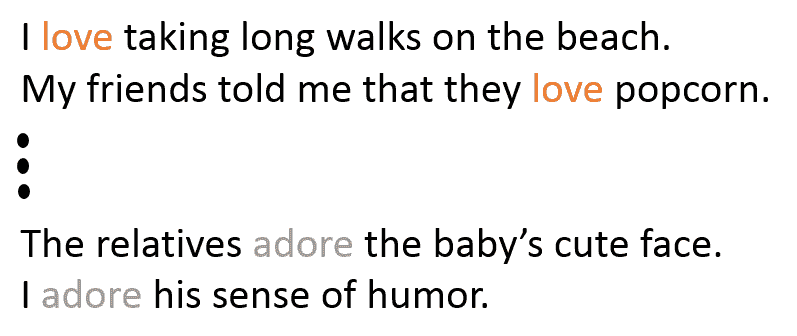
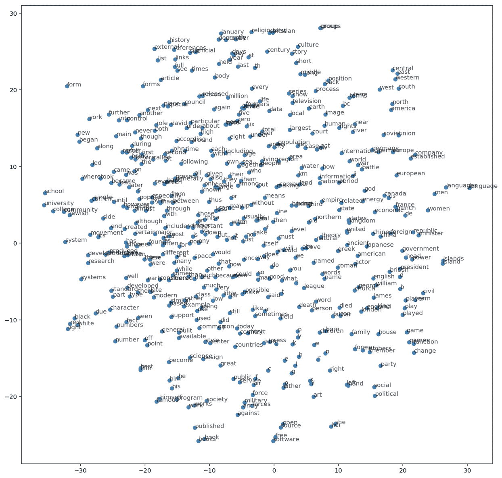

# 第十一章：表示学习 - 实现词嵌入

机器学习是一门主要基于统计学和线性代数的科学。矩阵运算在大多数机器学习或深度学习架构中非常常见，因为反向传播的原因。这也是深度学习或机器学习通常只接受实值输入的主要原因。这个事实与许多应用相矛盾，比如机器翻译、情感分析等，它们的输入是文本。因此，为了将深度学习应用于这些场景，我们需要将文本转化为深度学习能够接受的形式！

在本章中，我们将介绍表示学习领域，这是从文本中学习实值表示的一种方法，同时保持实际文本的语义。例如，love 的表示应该与 adore 的表示非常接近，因为它们在非常相似的上下文中使用。

所以，本章将涵盖以下主题：

+   表示学习简介

+   Word2Vec

+   Skip-gram 架构的实际示例

+   Skip-gram Word2Vec 实现

# 表示学习简介

到目前为止，我们使用的所有机器学习算法或架构都要求输入为实值或实值矩阵，这是机器学习中的一个共同主题。例如，在卷积神经网络中，我们必须将图像的原始像素值作为模型输入。在这一部分，我们处理的是文本，因此我们需要以某种方式对文本进行编码，并生成可以输入到机器学习算法中的实值数据。为了将输入文本编码为实值数据，我们需要使用一种名为**自然语言处理**（**NLP**）的中介技术。

我们提到过，在这种管道中，当我们将文本输入到机器学习模型中进行情感分析时，这将是一个问题，并且无法工作，因为我们无法在输入（字符串）上应用反向传播或其他操作（如点积）。因此，我们需要使用 NLP 的机制，构建一个文本的中间表示，该表示能够携带与文本相同的信息，并且可以被输入到机器学习模型中。

我们需要将输入文本中的每个单词或标记转换为实值向量。如果这些向量不携带原始输入的模式、信息、意义和语义，那么它们将毫无用处。例如，像真实文本中的两个单词 love 和 adore 非常相似，并且有相同的含义。我们需要将它们表示为的实值向量接近彼此，并处于相同的向量空间中。因此，这两个单词的向量表示与另一个不相似的单词一起，将呈现如下图所示的形态：


图 15.1：词的向量表示

有许多技术可以用于这个任务。这些技术统称为**嵌入（embeddings）**，它将文本嵌入到另一个实值向量空间中。

正如我们稍后所见，这个向量空间实际上非常有趣，因为你会发现你可以通过其他与之相似的单词来推导一个单词的向量，甚至可以在这个空间里进行一些“地理”操作。

# Word2Vec

Word2Vec 是自然语言处理（NLP）领域中广泛使用的嵌入技术之一。该模型通过观察输入单词出现的上下文信息，将输入文本转换为实值向量。因此，你会发现相似的单词通常会出现在非常相似的上下文中，从而模型会学到这些单词应该被放置在嵌入空间中的彼此相近位置。

从下面图示中的陈述来看，模型将学到 **love** 和 **adore** 共享非常相似的上下文，并且应该被放置在最终的向量空间中非常接近的位置。单词 like 的上下文可能也与 love 稍有相似，但它不会像 adore 那样接近 love：



图 15.2：情感句子示例

Word2Vec 模型还依赖于输入句子的语义特征；例如，单词 adore 和 love 主要在积极的语境中使用，通常会出现在名词短语或名词前面。同样，模型会学习到这两个词有共同之处，因此更可能将这两个词的向量表示放在相似的语境中。因此，句子的结构会告诉 Word2Vec 模型很多关于相似词的信息。

实际上，人们将一个大规模的文本语料库输入到 Word2Vec 模型中。该模型将学习为相似的单词生成相似的向量，并为输入文本中的每个唯一单词执行此操作。

所有这些单词的向量将被结合起来，最终的输出将是一个嵌入矩阵，其中每一行代表特定唯一单词的实值向量表示。


图 15.3：Word2Vec 模型流程示例

因此，模型的最终输出将是一个针对训练语料库中所有唯一单词的嵌入矩阵。通常，好的嵌入矩阵可以包含数百万个实值向量。

Word2Vec 建模使用窗口扫描句子，然后根据上下文信息预测窗口中间单词的向量；Word2Vec 模型一次扫描一个句子。与任何机器学习技术类似，我们需要为 Word2Vec 模型定义一个成本函数以及相应的优化标准，使得该模型能够为每个唯一的单词生成实值向量，并根据上下文信息将这些向量彼此关联。

# 构建 Word2Vec 模型

在本节中，我们将深入讨论如何构建一个 Word2Vec 模型。如前所述，我们的最终目标是拥有一个训练好的模型，能够为输入的文本数据生成实值向量表示，这也叫做词嵌入。

在模型训练过程中，我们将使用最大似然法 ([`en.wikipedia.org/wiki/Maximum_likelihood`](https://en.wikipedia.org/wiki/Maximum_likelihood))，这个方法可以用来最大化给定模型已经看到的前一个词的条件下，下一个词 *w[t]* 在输入句子中的概率，我们可以称之为 *h*。

这个最大似然法将用软最大函数来表示：


在这里，*score* 函数计算一个值，用来表示目标词 *w[t]* 与上下文 *h* 的兼容性。该模型将在输入序列上进行训练，旨在最大化训练数据的似然性（为简化数学推导，使用对数似然）。


因此，*ML* 方法将尝试最大化上述方程，从而得到一个概率语言模型。但由于需要使用评分函数计算所有词的每个概率，这一计算非常耗费计算资源。

词汇表 *V* 中的单词 *w'*，在该模型的当前上下文 *h* 中。这将在每个训练步骤中发生。


图 15.4：概率语言模型的一般架构

由于构建概率语言模型的计算开销较大，人们倾向于使用一些计算上更为高效的技术，比如 **连续词袋模型** (**CBOW**) 和跳字模型。

这些模型经过训练，用逻辑回归构建一个二元分类模型，以区分真实目标词 *w[t]* 和 *h* 噪声或虚构词 **,** 它们处在相同的上下文中。下面的图表简化了这个概念，采用了 CBOW 技术：


图 15.5：跳字模型的一般架构

下一张图展示了你可以用来构建 Word2Vec 模型的两种架构：


图 15.6：Word2Vec 模型的不同架构

更正式地说，这些技术的目标函数最大化如下：


其中：

+   **** 是基于模型在数据集 *D* 中看到词 *w* 在上下文 *h* 中的二元逻辑回归概率，这个概率是通过 θ 向量计算的。这个向量表示已学习的嵌入。

+    是我们可以从一个噪声概率分布中生成的虚拟或噪声词汇，例如训练输入样本的 unigram。

总结来说，这些模型的目标是区分真实和虚拟的输入，因此需要给真实词汇分配较高的概率，而给虚拟或噪声词汇分配较低的概率。

当模型将高概率分配给真实词汇，低概率分配给噪声词汇时，该目标得到了最大化。

从技术上讲，将高概率分配给真实词汇的过程称为**负采样**（[`papers.nips.cc/paper/5021-distributed-representations-of-words-and-phrases-and-their-compositionality.pdf`](https://papers.nips.cc/paper/5021-distributed-representations-of-words-and-phrases-and-their-compositionality.pdf)），并且使用这种损失函数有很好的数学依据：它提出的更新近似了软最大（softmax）函数在极限情况下的更新。但从计算角度来看，它尤其具有吸引力，因为现在计算损失函数的复杂度仅与我们选择的噪声词数量（*k*）相关，而与词汇表中的所有词汇（*V*）无关。这使得训练变得更加高效。实际上，我们将使用非常类似的**噪声对比估计**（**NCE**）（[`papers.nips.cc/paper/5165-learning-word-embeddings-efficiently-with-noise-contrastive-estimation.pdf`](https://papers.nips.cc/paper/5165-learning-word-embeddings-efficiently-with-noise-contrastive-estimation.pdf)）损失函数，TensorFlow 提供了一个便捷的辅助函数 `tf.nn.nce_loss()`。

# skip-gram 架构的一个实际示例

让我们通过一个实际例子，看看在这种情况下 skip-gram 模型是如何工作的：

```py
the quick brown fox jumped over the lazy dog
```

首先，我们需要构建一个包含词语及其对应上下文的数据集。上下文的定义取决于我们，但必须合理。因此，我们会围绕目标词设置一个窗口，并从右边取一个词，再从左边取一个词。

通过采用这种上下文技术，我们最终会得到以下一组词语及其对应的上下文：

```py
([the, brown], quick), ([quick, fox], brown), ([brown, jumped], fox), ...
```

生成的词语及其对应的上下文将以 `(context, target)` 的形式表示。skip-gram 模型的思想与 CBOW 模型正好相反。在 skip-gram 模型中，我们会尝试根据目标词来预测该词的上下文。例如，考虑第一个词对，skip-gram 模型会尝试从目标词 `quick` 预测出 `the` 和 `brown` 等词，依此类推。所以，我们可以将数据集重写如下：

```py
(quick, the), (quick, brown), (brown, quick), (brown, fox), ...
```

现在，我们有了一组输入和输出的词对。

让我们尝试模仿在特定步骤 *t* 处的训练过程。那么，skip-gram 模型将以第一个训练样本为输入，其中输入词为 `quick`，目标输出词为 `the`。接下来，我们需要构造噪声输入，因此我们将从输入数据的单词集中随机选择。为了简化，噪声向量的大小仅为 1。例如，我们可以选择 `sheep` 作为噪声样本。

现在，我们可以继续计算真实对和噪声对之间的损失，公式如下：


在这种情况下，目标是更新 θ 参数，以改进之前的目标函数。通常，我们可以使用梯度来进行这个操作。因此，我们将尝试计算损失相对于目标函数参数 θ 的梯度，其表示为 。

在训练过程之后，我们可以基于实值向量表示的降维结果可视化一些结果。你会发现这个向量空间非常有趣，因为你可以用它做很多有趣的事情。例如，你可以在这个空间中学习类比，通过说“国王对王后就像男人对女人”。我们甚至可以通过从王后向量中减去国王向量并加上男人向量来推导出女人的向量；这个结果将非常接近实际学习到的女人向量。你也可以在这个空间中学习地理。


图 15.7：使用 t-分布随机邻域嵌入（t-SNE）降维技术将学习到的向量投影到二维空间

上面的例子为这些向量提供了很好的直觉，并且展示了它们如何对大多数自然语言处理应用（如机器翻译或 **词性**（**POS**）标注）非常有用。

# Skip-gram Word2Vec 实现

在理解了 skip-gram 模型如何工作的数学细节后，我们将实现 skip-gram，该模型将单词编码为具有某些属性的实值向量（因此得名 Word2Vec）。通过实现这一架构，你将了解学习另一种表示方式的过程是如何进行的。

文本是许多自然语言处理应用的主要输入，例如机器翻译、情感分析和语音合成系统。因此，为文本学习实值表示将帮助我们使用不同的深度学习技术来处理这些任务。

在本书的早期章节中，我们介绍了叫做独热编码（one-hot encoding）的方法，它会生成一个零向量，除了表示该词的索引外其他都为零。那么，你可能会想，为什么这里不使用它呢？这种方法非常低效，因为通常你会有一个很大的独特单词集，可能有 50,000 个单词，使用独热编码时，将会生成一个包含 49,999 个零的向量，并且只有一个位置是 1。

如果输入非常稀疏，会导致大量计算浪费，特别是在神经网络的隐藏层进行矩阵乘法时。


图 15.8：一热编码将导致大量计算浪费

如前所述，使用一热编码的结果将是一个非常稀疏的向量，特别是当你有大量不同的词汇需要编码时。

以下图所示，当我们将这个除了一个条目之外全为零的稀疏向量与一个权重矩阵相乘时，输出将仅为矩阵中与稀疏向量中唯一非零值对应的行：


图 15.9：将一个几乎全为零的一热向量与隐藏层权重矩阵相乘的效果

为了避免这种巨大的计算浪费，我们将使用嵌入技术，它仅仅是一个带有嵌入权重的全连接层。在这一层中，我们跳过了低效的乘法操作，而是通过所谓的**权重矩阵**来查找嵌入层的嵌入权重。

所以，为了避免计算时产生的浪费，我们将使用这个权重查找矩阵来查找嵌入权重。首先，需要构建这个查找表。为此，我们将所有输入词编码为整数，如下图所示，然后为了获取该词的对应值，我们将使用其整数表示作为该权重矩阵中的行号。找到特定词汇对应嵌入值的过程称为**嵌入查找**。如前所述，嵌入层只是一个全连接层，其中单元的数量代表嵌入维度。


图 15.10：标记化的查找表

你可以看到这个过程非常直观且简单；我们只需要按照这些步骤操作：

1.  定义将被视为权重矩阵的查找表

1.  将嵌入层定义为具有特定数量单元（嵌入维度）的全连接隐藏层

1.  使用权重矩阵查找作为避免不必要的矩阵乘法的替代方案

1.  最后，将查找表作为任何权重矩阵进行训练

如前所述，我们将在本节中构建一个跳字模型的 Word2Vec，这是学习词语表示的一种高效方式，同时保持词语的语义信息。

所以，让我们继续构建一个使用跳字架构的 Word2Vec 模型，它已被证明优于其他模型。

# 数据分析与预处理

在这一部分，我们将定义一些辅助函数，以帮助我们构建一个良好的 Word2Vec 模型。为了实现这一目标，我们将使用清理过的维基百科版本（[`mattmahoney.net/dc/textdata.html`](http://mattmahoney.net/dc/textdata.html)）。

那么，我们从导入实现所需的包开始：

```py
#importing the required packages for this implementation
import numpy as np
import tensorflow as tf

#Packages for downloading the dataset
from urllib.request import urlretrieve
from os.path import isfile, isdir
from tqdm import tqdm
import zipfile

#packages for data preprocessing
import re
from collections import Counter
import random
```

接下来，我们将定义一个类，用于在数据集未下载时进行下载：

```py
# In this implementation we will use a cleaned up version of Wikipedia from Matt Mahoney.
# So we will define a helper class that will helps to download the dataset
wiki_dataset_folder_path = 'wikipedia_data'
wiki_dataset_filename = 'text8.zip'
wiki_dataset_name = 'Text8 Dataset'

class DLProgress(tqdm):

    last_block = 0

    def hook(self, block_num=1, block_size=1, total_size=None):
        self.total = total_size
        self.update((block_num - self.last_block) * block_size)
        self.last_block = block_num

# Cheking if the file is not already downloaded
if not isfile(wiki_dataset_filename):
    with DLProgress(unit='B', unit_scale=True, miniters=1, desc=wiki_dataset_name) as pbar:
        urlretrieve(
            'http://mattmahoney.net/dc/text8.zip',
            wiki_dataset_filename,
            pbar.hook)

# Checking if the data is already extracted if not extract it
if not isdir(wiki_dataset_folder_path):
    with zipfile.ZipFile(wiki_dataset_filename) as zip_ref:
        zip_ref.extractall(wiki_dataset_folder_path)

with open('wikipedia_data/text8') as f:
    cleaned_wikipedia_text = f.read()

Output:

Text8 Dataset: 31.4MB [00:39, 794kB/s]                             
```

我们可以查看该数据集的前 100 个字符：

```py
cleaned_wikipedia_text[0:100]

' anarchism originated as a term of abuse first used against early working class radicals including t'
```

接下来，我们将对文本进行预处理，因此我们将定义一个辅助函数，帮助我们将标点等特殊字符替换为已知的标记。此外，为了减少输入文本中的噪音，您可能还想去除那些在文本中出现频率较低的单词：

```py
def preprocess_text(input_text):

    # Replace punctuation with some special tokens so we can use them in our model
    input_text = input_text.lower()
    input_text = input_text.replace('.', ' <PERIOD> ')
    input_text = input_text.replace(',', ' <COMMA> ')
    input_text = input_text.replace('"', ' <QUOTATION_MARK> ')
    input_text = input_text.replace(';', ' <SEMICOLON> ')
    input_text = input_text.replace('!', ' <EXCLAMATION_MARK> ')
    input_text = input_text.replace('?', ' <QUESTION_MARK> ')
    input_text = input_text.replace('(', ' <LEFT_PAREN> ')
    input_text = input_text.replace(')', ' <RIGHT_PAREN> ')
    input_text = input_text.replace('--', ' <HYPHENS> ')
    input_text = input_text.replace('?', ' <QUESTION_MARK> ')

    input_text = input_text.replace(':', ' <COLON> ')
    text_words = input_text.split()

    # neglecting all the words that have five occurrences of fewer
    text_word_counts = Counter(text_words)
    trimmed_words = [word for word in text_words if text_word_counts[word] > 5]

    return trimmed_words
```

现在，让我们在输入文本上调用这个函数，并查看输出：

```py
preprocessed_words = preprocess_text(cleaned_wikipedia_text)
print(preprocessed_words[:30])
```

```py
Output:
['anarchism', 'originated', 'as', 'a', 'term', 'of', 'abuse', 'first', 'used', 'against', 'early', 'working', 'class', 'radicals', 'including', 'the', 'diggers', 'of', 'the', 'english', 'revolution', 'and', 'the', 'sans', 'culottes', 'of', 'the', 'french', 'revolution', 'whilst']
```

让我们看看在处理过的文本中有多少个单词和不同的单词：

```py
print("Total number of words in the text: {}".format(len(preprocessed_words)))
print("Total number of unique words in the text: {}".format(len(set(preprocessed_words))))

Output:

Total number of words in the text: 16680599
Total number of unique words in the text: 63641
```

在这里，我正在创建字典，将单词转换为整数并反向转换，即将整数转换为单词。这些整数按频率降序排列，因此出现频率最高的单词（`the`）被赋予整数`0`，接下来频率次高的得到`1`，以此类推。单词被转换为整数并存储在列表`int_words`中。

正如本节前面提到的，我们需要使用单词的整数索引来查找它们在权重矩阵中的值，因此我们将单词转换为整数，并将整数转换为单词。这将帮助我们查找单词，并且获取特定索引的实际单词。例如，输入文本中最常出现的单词将被索引为位置 0，接下来是第二常出现的单词，以此类推。

那么，让我们定义一个函数来创建这个查找表：

```py
def create_lookuptables(input_words):
 """
 Creating lookup tables for vocan

 Function arguments:
 param words: Input list of words
 """
 input_word_counts = Counter(input_words)
 sorted_vocab = sorted(input_word_counts, key=input_word_counts.get, reverse=True)
 integer_to_vocab = {ii: word for ii, word in enumerate(sorted_vocab)}
 vocab_to_integer = {word: ii for ii, word in integer_to_vocab.items()}

 # returning A tuple of dicts
 return vocab_to_integer, integer_to_vocab
```

现在，让我们调用已定义的函数来创建查找表：

```py
vocab_to_integer, integer_to_vocab = create_lookuptables(preprocessed_words)
integer_words = [vocab_to_integer[word] for word in preprocessed_words]
```

为了构建更精确的模型，我们可以去除那些对上下文变化不大的单词，如`of`、`for`、`the`等。因此，实际上已经证明，在丢弃这些单词的情况下，我们可以构建更精确的模型。从上下文中去除与上下文无关的单词的过程被称为**子抽样**。为了定义一种通用的丢弃机制，Mikolov 提出了一个函数，用于计算某个单词的丢弃概率，该概率由以下公式给出：


其中：

+   *t* 是单词丢弃的阈值参数

+   *f(w[i])* 是输入数据集中目标单词 *w[i]* 的频率

我们将实现一个辅助函数，用于计算数据集中每个单词的丢弃概率：

```py
# removing context-irrelevant words threshold
word_threshold = 1e-5

word_counts = Counter(integer_words)
total_number_words = len(integer_words)

#Calculating the freqs for the words
frequencies = {word: count/total_number_words for word, count in word_counts.items()}

#Calculating the discard probability
prob_drop = {word: 1 - np.sqrt(word_threshold/frequencies[word]) for word in word_counts}
training_words = [word for word in integer_words if random.random() < (1 - prob_drop[word])]
```

现在，我们有了一个更精炼、更清晰的输入文本版本。

我们提到过，skip-gram 架构在生成目标单词的实值表示时，会考虑目标单词的上下文，因此它在目标单词周围定义了一个大小为 *C* 的窗口。

我们将不再平等地对待所有上下文单词，而是为那些距离目标单词较远的单词分配较小的权重。例如，如果我们选择窗口大小为 *C = 4*，那么我们将从 1 到 *C* 的范围内随机选择一个数字 *L*，然后从当前单词的历史和未来中采样 *L* 个单词。关于这一点的更多细节，请参见 Mikolov 等人的论文：[`arxiv.org/pdf/1301.3781.pdf`](https://arxiv.org/pdf/1301.3781.pdf)。

所以，让我们继续定义这个函数：

```py
# Defining a function that returns the words around specific index in a specific window
def get_target(input_words, ind, context_window_size=5):

    #selecting random number to be used for genearting words form history and feature of the current word
    rnd_num = np.random.randint(1, context_window_size+1)
    start_ind = ind - rnd_num if (ind - rnd_num) > 0 else 0
    stop_ind = ind + rnd_num

    target_words = set(input_words[start_ind:ind] + input_words[ind+1:stop_ind+1])

    return list(target_words)    
```

此外，让我们定义一个生成器函数，从训练样本中生成一个随机批次，并为该批次中的每个单词获取上下文词：

```py
#Defining a function for generating word batches as a tuple (inputs, targets)
def generate_random_batches(input_words, train_batch_size, context_window_size=5):

    num_batches = len(input_words)//train_batch_size

    # working on only only full batches
    input_words = input_words[:num_batches*train_batch_size]

    for ind in range(0, len(input_words), train_batch_size):
        input_vals, target = [], []
        input_batch = input_words[ind:ind+train_batch_size]

        #Getting the context for each word
        for ii in range(len(input_batch)):
            batch_input_vals = input_batch[ii]
            batch_target = get_target(input_batch, ii, context_window_size)

            target.extend(batch_target)
            input_vals.extend([batch_input_vals]*len(batch_target))
        yield input_vals, target
```

# 构建模型

接下来，我们将使用以下结构来构建计算图：


图 15.11：模型架构

正如之前所提到的，我们将使用一个嵌入层，尝试为这些词学习一个特殊的实数表示。因此，单词将作为 one-hot 向量输入。我们的想法是训练这个网络来构建权重矩阵。

那么，让我们从创建模型输入开始：

```py
train_graph = tf.Graph()

#defining the inputs placeholders of the model
with train_graph.as_default():
    inputs_values = tf.placeholder(tf.int32, [None], name='inputs_values')
    labels_values = tf.placeholder(tf.int32, [None, None], name='labels_values')
```

我们要构建的权重或嵌入矩阵将具有以下形状：

```py
num_words X num_hidden_neurons
```

此外，我们不需要自己实现查找函数，因为它在 Tensorflow 中已经可用：`tf.nn.embedding_lookup()`。因此，它将使用单词的整数编码，并找到它们在权重矩阵中的对应行。

权重矩阵将从均匀分布中随机初始化：

```py
num_vocab = len(integer_to_vocab)

num_embedding =  300
with train_graph.as_default():
    embedding_layer = tf.Variable(tf.random_uniform((num_vocab, num_embedding), -1, 1))

    # Next, we are going to use tf.nn.embedding_lookup function to get the output of the hidden layer
    embed_tensors = tf.nn.embedding_lookup(embedding_layer, inputs_values) 
```

更新嵌入层的所有权重是非常低效的。我们将采用负采样技术，它只会更新正确单词的权重，并且只涉及一个小的错误单词子集。

此外，我们不必自己实现这个函数，因为在 TensorFlow 中已经有了 **`tf.nn.sampled_softmax_loss`**：

```py
# Number of negative labels to sample
num_sampled = 100

with train_graph.as_default():
    # create softmax weights and biases
    softmax_weights = tf.Variable(tf.truncated_normal((num_vocab, num_embedding))) 
    softmax_biases = tf.Variable(tf.zeros(num_vocab), name="softmax_bias") 

    # Calculating the model loss using negative sampling
    model_loss = tf.nn.sampled_softmax_loss(
        weights=softmax_weights,
        biases=softmax_biases,
        labels=labels_values,
        inputs=embed_tensors,
        num_sampled=num_sampled,
        num_classes=num_vocab)

    model_cost = tf.reduce_mean(model_loss)
    model_optimizer = tf.train.AdamOptimizer().minimize(model_cost)
```

为了验证我们训练的模型，我们将采样一些常见的词和一些不常见的词，并尝试基于跳字模型的学习表示打印它们的最近词集：

```py
with train_graph.as_default():

    # set of random words for evaluating similarity on
    valid_num_words = 16 
    valid_window = 100

    # pick 8 samples from (0,100) and (1000,1100) each ranges. lower id implies more frequent 
    valid_samples = np.array(random.sample(range(valid_window), valid_num_words//2))
    valid_samples = np.append(valid_samples, 
                               random.sample(range(1000,1000+valid_window), valid_num_words//2))

    valid_dataset_samples = tf.constant(valid_samples, dtype=tf.int32)

    # Calculating the cosine distance
    norm = tf.sqrt(tf.reduce_sum(tf.square(embedding_layer), 1, keep_dims=True))
    normalized_embed = embedding_layer / norm
    valid_embedding = tf.nn.embedding_lookup(normalized_embed, valid_dataset_samples)
    cosine_similarity = tf.matmul(valid_embedding, tf.transpose(normalized_embed))
```

现在，我们已经拥有了模型的所有组成部分，准备开始训练过程。

# 训练

让我们继续启动训练过程：

```py
num_epochs = 10
train_batch_size = 1000
contextual_window_size = 10

with train_graph.as_default():
    saver = tf.train.Saver()

with tf.Session(graph=train_graph) as sess:

    iteration_num = 1
    average_loss = 0

    #Initializing all the vairables
    sess.run(tf.global_variables_initializer())

    for e in range(1, num_epochs+1):

        #Generating random batch for training
        batches = generate_random_batches(training_words, train_batch_size, contextual_window_size)

        #Iterating through the batch samples
        for input_vals, target in batches:

            #Creating the feed dict
            feed_dict = {inputs_values: input_vals,
                    labels_values: np.array(target)[:, None]}

            train_loss, _ = sess.run([model_cost, model_optimizer], feed_dict=feed_dict)

            #commulating the loss
            average_loss += train_loss

            #Printing out the results after 100 iteration
            if iteration_num % 100 == 0: 
                print("Epoch Number {}/{}".format(e, num_epochs),
                      "Iteration Number: {}".format(iteration_num),
                      "Avg. Training loss: {:.4f}".format(average_loss/100))
                average_loss = 0

            if iteration_num % 1000 == 0:

                ## Using cosine similarity to get the nearest words to a word
                similarity = cosine_similarity.eval()
                for i in range(valid_num_words):
                    valid_word = integer_to_vocab[valid_samples[i]]

                    # number of nearest neighbors
                    top_k = 8 
                    nearest_words = (-similarity[i, :]).argsort()[1:top_k+1]
                    msg = 'The nearest to %s:' % valid_word
                    for k in range(top_k):
                        similar_word = integer_to_vocab[nearest_words[k]]
                        msg = '%s %s,' % (msg, similar_word)
                    print(msg)

            iteration_num += 1
    save_path = saver.save(sess, "checkpoints/cleaned_wikipedia_version.ckpt")
    embed_mat = sess.run(normalized_embed)
```

在运行前面的代码片段 10 个周期后，您将得到以下输出：

```py
Epoch Number 10/10 Iteration Number: 43100 Avg. Training loss: 5.0380
Epoch Number 10/10 Iteration Number: 43200 Avg. Training loss: 4.9619
Epoch Number 10/10 Iteration Number: 43300 Avg. Training loss: 4.9463
Epoch Number 10/10 Iteration Number: 43400 Avg. Training loss: 4.9728
Epoch Number 10/10 Iteration Number: 43500 Avg. Training loss: 4.9872
Epoch Number 10/10 Iteration Number: 43600 Avg. Training loss: 5.0534
Epoch Number 10/10 Iteration Number: 43700 Avg. Training loss: 4.8261
Epoch Number 10/10 Iteration Number: 43800 Avg. Training loss: 4.8752
Epoch Number 10/10 Iteration Number: 43900 Avg. Training loss: 4.9818
Epoch Number 10/10 Iteration Number: 44000 Avg. Training loss: 4.9251
The nearest to nine: one, seven, zero, two, three, four, eight, five,
The nearest to such: is, as, or, some, have, be, that, physical,
The nearest to who: his, him, he, did, to, had, was, whom,
The nearest to two: zero, one, three, seven, four, five, six, nine,
The nearest to which: as, a, the, in, to, also, for, is,
The nearest to seven: eight, one, three, five, four, six, zero, two,
The nearest to american: actor, nine, singer, actress, musician, comedian, athlete, songwriter,
The nearest to many: as, other, some, have, also, these, are, or,
The nearest to powers: constitution, constitutional, formally, assembly, state, legislative, general, government,
The nearest to question: questions, existence, whether, answer, truth, reality, notion, does,
The nearest to channel: tv, television, broadcasts, broadcasting, radio, channels, broadcast, stations,
The nearest to recorded: band, rock, studio, songs, album, song, recording, pop,
The nearest to arts: art, school, alumni, schools, students, university, renowned, education,
The nearest to orthodox: churches, orthodoxy, church, catholic, catholics, oriental, christianity, christians,
The nearest to scale: scales, parts, important, note, between, its, see, measured,
The nearest to mean: is, exactly, defined, denote, hence, are, meaning, example,

Epoch Number 10/10 Iteration Number: 45100 Avg. Training loss: 4.8466
Epoch Number 10/10 Iteration Number: 45200 Avg. Training loss: 4.8836
Epoch Number 10/10 Iteration Number: 45300 Avg. Training loss: 4.9016
Epoch Number 10/10 Iteration Number: 45400 Avg. Training loss: 5.0218
Epoch Number 10/10 Iteration Number: 45500 Avg. Training loss: 5.1409
Epoch Number 10/10 Iteration Number: 45600 Avg. Training loss: 4.7864
Epoch Number 10/10 Iteration Number: 45700 Avg. Training loss: 4.9312
Epoch Number 10/10 Iteration Number: 45800 Avg. Training loss: 4.9097
Epoch Number 10/10 Iteration Number: 45900 Avg. Training loss: 4.6924
Epoch Number 10/10 Iteration Number: 46000 Avg. Training loss: 4.8999
The nearest to nine: one, eight, seven, six, four, five, american, two,
The nearest to such: can, example, examples, some, be, which, this, or,
The nearest to who: him, his, himself, he, was, whom, men, said,
The nearest to two: zero, five, three, four, six, one, seven, nine
The nearest to which: to, is, a, the, that, it, and, with,
The nearest to seven: one, six, eight, five, nine, four, three, two,
The nearest to american: musician, actor, actress, nine, singer, politician, d, one,
The nearest to many: often, as, most, modern, such, and, widely, traditional,
The nearest to powers: constitutional, formally, power, rule, exercised, parliamentary, constitution, control,
The nearest to question: questions, what, answer, existence, prove, merely, true, statements,
The nearest to channel: network, channels, broadcasts, stations, cable, broadcast, broadcasting, radio,
The nearest to recorded: songs, band, song, rock, album, bands, music, studio,
The nearest to arts: art, school, martial, schools, students, styles, education, student,
The nearest to orthodox: orthodoxy, churches, church, christianity, christians, catholics, christian, oriental,
The nearest to scale: scales, can, amounts, depends, tend, are, structural, for,
The nearest to mean: we, defined, is, exactly, equivalent, denote, number, above,
Epoch Number 10/10 Iteration Number: 46100 Avg. Training loss: 4.8583
Epoch Number 10/10 Iteration Number: 46200 Avg. Training loss: 4.8887
```

如您所见，网络在某种程度上学习到了输入单词的一些语义有用的表示。为了帮助我们更清楚地看到嵌入矩阵，我们将使用降维技术，如 t-SNE，将实数值向量降至二维，然后我们将对它们进行可视化，并用相应的单词标记每个点：

```py
num_visualize_words = 500
tsne_obj = TSNE()
embedding_tsne = tsne_obj.fit_transform(embedding_matrix[:num_visualize_words, :])

fig, ax = plt.subplots(figsize=(14, 14))
for ind in range(num_visualize_words):
    plt.scatter(*embedding_tsne[ind, :], color='steelblue')
    plt.annotate(integer_to_vocab[ind], (embedding_tsne[ind, 0], embedding_tsne[ind, 1]), alpha=0.7)
```

```py

Output:
```



图 15.12：词向量的可视化

# 总结

在本章中，我们介绍了表示学习的概念以及它为什么对深度学习或机器学习（尤其是对非实数形式的输入）非常有用。此外，我们还讲解了将单词转换为实数向量的一种常用技术——Word2Vec，它具有非常有趣的特性。最后，我们使用 skip-gram 架构实现了 Word2Vec 模型。

接下来，你将看到这些学习到的表示在情感分析示例中的实际应用，在该示例中，我们需要将输入文本转换为实数向量。
