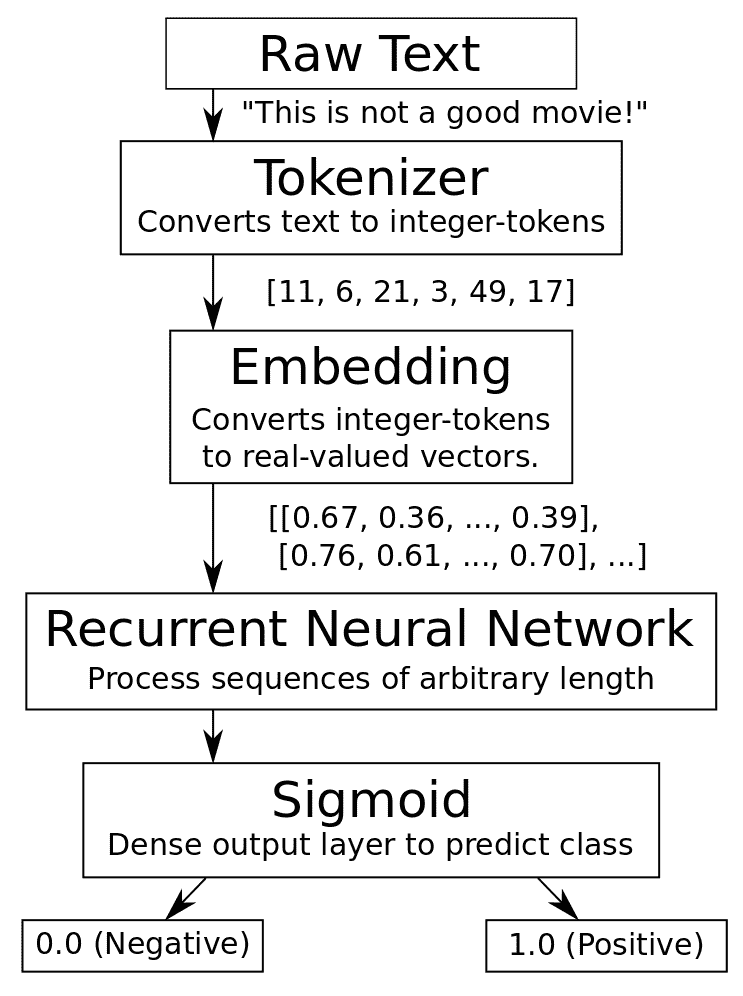
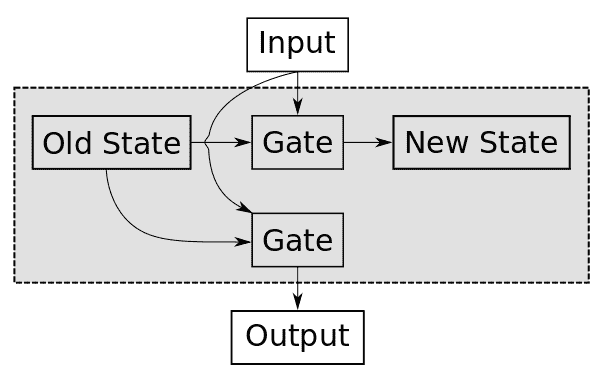
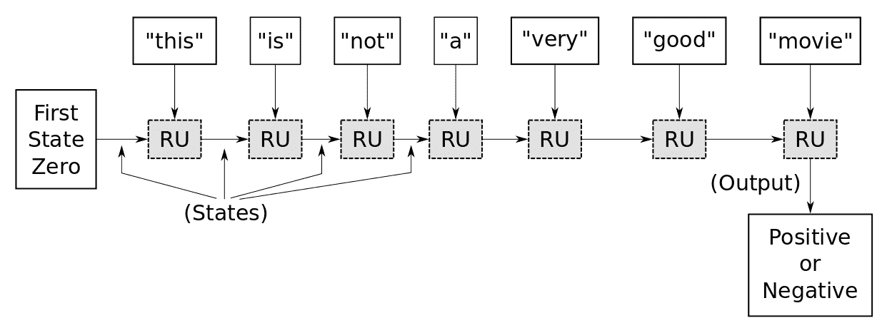
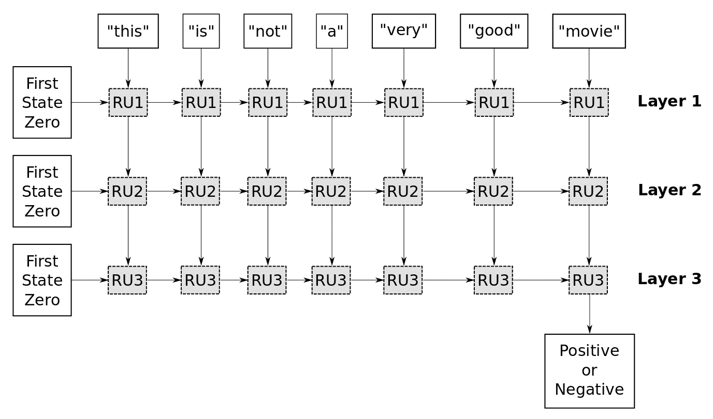

# 第十二章：神经情感分析

在本章中，我们将讨论自然语言处理领域中的一个热门应用，即**情感分析**。如今，大多数人通过社交媒体平台表达他们的意见，利用这一海量文本来跟踪客户对某事的满意度，对于公司甚至政府来说都是非常重要的。

在本章中，我们将使用递归类型的神经网络来构建情感分析解决方案。本章将涉及以下主题：

+   一般的情感分析架构

+   情感分析——模型实现

# 一般的情感分析架构

在本节中，我们将重点讨论可以用于情感分析的一般深度学习架构。下图展示了构建情感分析模型所需的处理步骤。

所以，首先，我们将处理自然语言：



图 1：情感分析解决方案或基于序列的自然语言解决方案的一般管道

我们将使用电影评论来构建这个情感分析应用程序。这个应用程序的目标是根据输入的原始文本生成正面或负面评论。例如，如果原始文本是类似于**这部电影很好**的内容，那么我们需要模型为其生成一个正面情感。

一个情感分析应用程序将带我们经历许多必要的处理步骤，这些步骤是神经网络中处理自然语言所必需的，例如词嵌入。

所以在这种情况下，我们有一个原始文本，例如**这不是一部好电影！** 我们希望最终得到的是它是负面还是正面的情感。

在这种类型的应用程序中，有几个难点：

+   其中之一是序列可能具有**不同的长度**。这是一个非常短的序列，但我们会看到一些文本，它们的长度超过了 500 个单词。

+   另一个问题是，如果我们仅仅看单独的单词（例如，good），它表示的是正面情感。然而，它前面有一个**not**，所以现在它变成了负面情感。这可能变得更加复杂，我们稍后会看到一个例子。

正如我们在上一章所学的，神经网络无法直接处理原始文本，因此我们需要先将其转换成所谓的**词元**。这些基本上就是整数值，所以我们遍历整个数据集，统计每个词出现的次数。然后，我们创建一个词汇表，每个词在该词汇表中都会有一个索引。因此，单词**this**有一个整数 ID 或词元**11**，单词**is**的词元是**6**，**not**的词元是**21**，依此类推。现在，我们已经将原始文本转换成了一个由整数构成的列表，称为词元。

神经网络仍然无法处理这些数据，因为如果我们有一个包含 10,000 个单词的词汇表，那么这些标记的值可以在 0 到 9,999 之间变化，而它们之间可能没有任何关联。因此，单词编号 998 和单词编号 999 的语义可能完全不同。

因此，我们将使用上一章学习的表示学习或嵌入的概念。这个嵌入层将整数标记转换为实值向量，例如，标记**11**变为向量[0.67,0.36,...,0.39]，如*图 1*所示。对于下一个标记 6 也是如此。

我们在上一章学习内容的简要回顾：前面图中的嵌入层学习的是标记（tokens）与其对应的实值向量之间的映射关系。同时，嵌入层还学习单词的语义含义，使得具有相似含义的单词在这个嵌入空间中会彼此接近。

从原始输入文本中，我们得到一个二维矩阵或张量，它现在可以作为输入传递给**递归神经网络**（**RNN**）。该网络可以处理任意长度的序列，其输出随后会传递到一个全连接层或密集层，并使用 sigmoid 激活函数。因此，输出值介于 0 和 1 之间，其中 0 表示负面情感。那么，如果 sigmoid 函数的值既不是 0 也不是 1 该怎么办？此时我们需要引入一个中间的切割值或阈值，当该值低于 0.5 时，认为对应的输入是负面情感，而当该值高于此阈值时，则认为是正面情感。

# RNN——情感分析的背景

现在，让我们回顾一下 RNN 的基本概念，并在情感分析应用的背景下讨论它们。正如我们在 RNN 章节中提到的，RNN 的基本构建块是递归单元，如图所示：



图 2：RNN 单元的抽象概念

这张图是对递归单元内部运作的抽象。在这里，我们有输入数据，例如，单词**good**。当然，它需要被转换为嵌入向量。然而，我们暂时忽略这一部分。此外，这个单元还有一种内存状态，根据**State**和**Input**的内容，我们会更新这个状态并将新数据写入状态。例如，假设我们之前在输入中看到过单词**not**，我们将其写入状态，这样当我们在后续输入中看到单词**good**时，我们可以从状态中得知之前见过单词**not**。现在，我们看到单词**good**，因此，我们必须在状态中写入已见过**not good**这两个单词，这可能表明整个输入文本的情感是负面的。

从旧状态和输入到新状态内容的映射是通过所谓的**门控**来完成的，这些门控在不同版本的递归单元中有不同的实现方式。它基本上是一个矩阵运算加上激活函数，但正如我们稍后会看到的，反向传播梯度时会遇到问题。因此，RNN 必须以一种特殊方式设计，以避免梯度被过度扭曲。

在递归单元中，我们有一个类似的门控来生成输出，再次强调，递归单元的输出依赖于当前状态的内容和我们正在看到的输入。所以我们可以尝试展开递归单元中的处理过程：



图 3：递归神经网络的展开版本

现在，我们看到的是一个递归单元，但流程图展示了不同时间步发生的情况。所以：

+   在时间步 1，我们将单词**this**输入到递归单元中，它的内部记忆状态首先初始化为零。当我们开始处理新的数据序列时，TensorFlow 会执行此操作。所以我们看到单词**this**，而递归单元的状态是 0。因此，我们使用内部门控来更新记忆状态，**this**随后在时间步 2 被使用，在此时间步我们输入单词**is**，此时记忆状态已有内容。**this**这个词的意义并不大，因此状态可能仍然接近 0。

+   而且**is**也没有太多的意义，所以状态可能仍然接近 0。

+   在下一个时间步，我们看到单词**not**，这具有我们最终想要预测的意义，即整个输入文本的情感。这个信息需要存储在记忆中，以便递归单元中的门控能够看到该状态已经可能包含接近零的值。但现在它需要存储我们刚刚看到的单词**not**，因此它在该状态中保存了一些非零值。

+   然后，我们进入下一个时间步，看到单词**a**，这个也没有太多信息，所以可能会被忽略。它只是将状态复制过去。

+   现在，我们看到单词**very**，这表示任何情感可能是强烈的情感，因此递归单元现在知道我们已经看到了**not**和**very**。它以某种方式将其存储在内存状态中。

+   在下一个时间步，我们看到单词**good**，所以现在网络知道**not very good**，并且它想，*哦，这可能是负面情感！*因此，它将这个值存储在内部状态中。

+   然后，在最后一个时间步，我们看到**movie**，这实际上与情感无关，因此可能会被忽略。

+   接下来，我们使用递归单元中的另一个门控输出记忆状态的内容，然后通过 sigmoid 函数处理（这里没有展示）。我们得到一个介于 0 和 1 之间的输出值。

这个想法是，我们希望在互联网上的电影评论数据集（Internet Movie Database）上训练这个网络，其中，对于每个输入文本，我们都会提供正确的情感值——正面或负面。接着，我们希望 TensorFlow 能找出循环单元内部的门控应该是什么，以便它能够准确地将这个输入文本映射到正确的情感：



图 4：本章实现所用的架构

我们在这个实现中将使用的 RNN 架构是一个具有三层的 RNN 类型架构。在第一层，我们刚才解释的过程会发生，只是现在我们需要在每个时间步输出来自循环单元的值。然后，我们收集新的数据序列，即第一循环层的输出。接下来，我们可以将它输入到第二个循环层，因为循环单元需要输入数据的序列（而我们从第一层得到的输出和我们想要输入到第二个循环层的是一些浮点值，其含义我们并不完全理解）。这在 RNN 内部有其意义，但我们作为人类并不能理解它。然后，我们在第二个循环层中进行类似的处理。

所以，首先，我们将这个循环单元的内部记忆状态初始化为 0；然后，我们取第一个循环层的第一个输出并输入。我们用循环单元内部的门控处理它，更新状态，取第一个层循环单元的输出作为第二个词**is**的输入，并使用该输入和内部记忆状态。我们继续这样做，直到处理完整个序列，然后我们将第二个循环层的所有输出收集起来。我们将它们作为输入传递给第三个循环层，在那里我们进行类似的处理。但在这里，我们只需要最后一个时间步的输出，它是迄今为止输入的所有内容的摘要。然后，我们将它输出到一个全连接层，这里没有展示。最后，我们使用 sigmoid 激活函数，因此我们得到一个介于 0 和 1 之间的值，分别表示负面和正面情感。

# 梯度爆炸和梯度消失——回顾

正如我们在上一章提到的，存在一种现象叫做**梯度爆炸**和**梯度消失**，它在 RNN 中非常重要。让我们回过头来看一下*图 1*；该流程图解释了这个现象是什么。

假设我们有一个包含 500 个词的文本数据集，这将用于实现我们的情感分析分类器。在每个时间步，我们以递归方式应用循环单元内的门控；因此，如果有 500 个词，我们将在 500 次时间步中应用这些门控，以更新循环单元的内部记忆状态。

如我们所知，神经网络的训练方式是通过所谓的梯度反向传播，所以我们有一个损失函数，它获取神经网络的输出，然后是我们希望得到的该输入文本的真实输出。接下来，我们希望最小化这个损失值，以使神经网络的实际输出与此特定输入文本的期望输出相符。因此，我们需要计算这个损失函数关于这些递归单元内部权重的梯度，而这些权重用于更新内部状态并最终输出结果的门控。

现在，这个门可能会应用大约 500 次，如果其中有乘法运算，我们实际上得到的是一个指数函数。所以，如果你将一个值与其本身相乘 500 次，并且这个值略小于 1，那么它将很快消失或丢失。同样地，如果一个值略大于 1，并与其本身相乘 500 次，它将爆炸。

唯一能在 500 次乘法中生存的值是 0 和 1。它们将保持不变，所以递归单元实际上比你看到的要复杂得多。这是一个抽象的概念——我们希望以某种方式将内部记忆状态和输入映射，用于更新内部记忆状态并输出某个值——但实际上，我们需要非常小心地将梯度反向传播通过这些门，以防止在多次时间步中发生这种指数级的乘法。我们也鼓励你查看一些关于递归单元数学定义的教程。

# 情感分析 – 模型实现

我们已经了解了如何实现堆叠版本的 LSTM 变种 RNN。为了让事情更有趣，我们将使用一个更高级的 API，叫做 `Keras`。

# Keras

"Keras 是一个高级神经网络 API，使用 Python 编写，可以在 TensorFlow、CNTK 或 Theano 上运行。它的开发重点是快速实验的实现。从想法到结果的转换延迟最小化是做出良好研究的关键。" – Keras 网站

所以，Keras 只是 TensorFlow 和其他深度学习框架的一个封装。它非常适合原型设计和快速构建，但另一方面，它让你对代码的控制较少。我们将尝试在 Keras 中实现这个情感分析模型，这样你可以在 TensorFlow 和 Keras 中获得一个动手实现。你可以使用 Keras 进行快速原型设计，而将 TensorFlow 用于生产环境的系统。

更有趣的消息是，你不需要切换到一个完全不同的环境。你现在可以在 TensorFlow 中将 Keras 作为模块访问，并像以下代码一样导入包：

```py
from tensorflow.python.keras.models 
import Sequential
from tensorflow.python.keras.layers 
import Dense, GRU, Embedding
from tensorflow.python.keras.optimizers 
import Adam
from tensorflow.python.keras.preprocessing.text 
import Tokenizer
from tensorflow.python.keras.preprocessing.sequence 
import pad_sequences
```

所以，让我们继续使用现在可以称之为更抽象的 TensorFlow 模块，它将帮助我们非常快速地原型化深度学习解决方案。因为我们只需几行代码就能写出完整的深度学习解决方案。

# 数据分析和预处理

现在，让我们进入实际的实现，我们需要加载数据。Keras 实际上有一个功能，可以用来从 IMDb 加载这个情感数据集，但问题是它已经将所有单词映射到整数令牌了。这是处理自然语言与神经网络之间非常关键的一部分，我真的想向你展示如何做到这一点。

此外，如果你想将这段代码用于其他语言的情感分析，你需要自己做这个转换，所以我们快速实现了一些下载这个数据集的函数。

让我们从导入一些必需的包开始：

```py
%matplotlib inline
import matplotlib.pyplot as plt
import tensorflow as tf
import numpy as np
from scipy.spatial.distance import cdist
from tensorflow.python.keras.models import Sequential
from tensorflow.python.keras.layers import Dense, GRU, Embedding
from tensorflow.python.keras.optimizers import Adam
from tensorflow.python.keras.preprocessing.text import Tokenizer
from tensorflow.python.keras.preprocessing.sequence import pad_sequences
```

然后我们加载数据集：

```py
import imdb
imdb.maybe_download_and_extract()

Output:
- Download progress: 100.0%
Download finished. Extracting files.
Done.
```

```py
input_text_train, target_train = imdb.load_data(train=True)
input_text_test, target_test = imdb.load_data(train=False)
```

```py
print("Size of the trainig set: ", len(input_text_train))
print("Size of the testing set:  ", len(input_text_test))

Output:
Size of the trainig set: 25000
Size of the testing set: 25000
```

如你所见，训练集中有 25,000 个文本，测试集中也有。

我们来看看训练集中的一个例子，它是如何呈现的：

```py
#combine dataset
text_data = input_text_train + input_text_test
input_text_train[1]

Output:
'This is a really heart-warming family movie. It has absolutely brilliant animal training and "acting" (if you can call it like that) as well (just think about the dog in "How the Grinch stole Christmas"... it was plain bad training). The Paulie story is extremely well done, well reproduced and in general the characters are really elaborated too. Not more to say except that this is a GREAT MOVIE!<br /><br />My ratings: story 8.5/10, acting 7.5/10, animals+fx 8.5/10, cinematography 8/10.<br /><br />My overall rating: 8/10 - BIG FAMILY MOVIE AND VERY WORTH WATCHING!'

target_train[1]

Output:
1.0
```

这是一个相当简短的文本，情感值为`1.0`，这意味着它是一个积极的情感，因此这是一篇关于某部电影的正面评价。

现在，我们进入了分词器，这也是处理这些原始数据的第一步，因为神经网络不能直接处理文本数据。Keras 实现了一个叫做**分词器**的工具，用来构建词汇表并将单词映射到整数。

此外，我们可以说我们希望最大使用 10,000 个单词，因此它将只使用数据集中最流行的 10,000 个单词：

```py
num_top_words = 10000
tokenizer_obj = Tokenizer(num_words=num_top_words)
```

现在，我们将从数据集中获取所有文本，并在文本上调用这个函数`fit`：

```py
tokenizer_obj.fit_on_texts(text_data)
```

分词器大约需要 10 秒钟，然后它将构建出词汇表。它看起来是这样的：

```py
tokenizer_obj.word_index

Output:
{'britains': 33206,
 'labcoats': 121364,
 'steeled': 102939,
 'geddon': 67551,
 "rossilini's": 91757,
 'recreational': 27654,
 'suffices': 43205,
 'hallelujah': 30337,
 'mallika': 30343,
 'kilogram': 122493,
 'elphic': 104809,
 'feebly': 32818,
 'unskillful': 91728,
 "'mistress'": 122218,
 "yesterday's": 25908,
 'busco': 85664,
 'goobacks': 85670,
 'mcfeast': 71175,
 'tamsin': 77763,
 "petron's": 72628,
 "'lion": 87485,
 'sams': 58341,
 'unbidden': 60042,
 "principal's": 44902,
 'minutiae': 31453,
 'smelled': 35009,
 'history\x97but': 75538,
 'vehemently': 28626,
 'leering': 14905,
 'kýnay': 107654,
 'intendend': 101260,
 'chomping': 21885,
 'nietsze': 76308,
 'browned': 83646,
 'grosse': 17645,
 "''gaslight''": 74713,
 'forseeing': 103637,
 'asteroids': 30997,
 'peevish': 49633,
 "attic'": 120936,
 'genres': 4026,
 'breckinridge': 17499,
 'wrist': 13996,
 "sopranos'": 50345,
 'embarasing': 92679,
 "wednesday's": 118413,
 'cervi': 39092,
 'felicity': 21570,
 "''horror''": 56254,
 'alarms': 17764,
 "'ol": 29410,
 'leper': 27793,
 'once\x85': 100641,
 'iverson': 66834,
 'triply': 117589,
 'industries': 19176,
 'brite': 16733,
 'amateur': 2459,
 "libby's": 46942,
 'eeeeevil': 120413,
 'jbc33': 51111,
 'wyoming': 12030,
 'waned': 30059,
 'uchida': 63203,
 'uttter': 93299,
 'irector': 123847,
 'outriders': 95156,
 'perd': 118465,
.
.
.}
```

所以，现在每个单词都与一个整数相关联；因此，单词`the`的编号是`1`：

```py
tokenizer_obj.word_index['the']

Output:
1
```

这里，`and`的编号是`2`：

```py
tokenizer_obj.word_index['and']

Output:
2
```

单词`a`的编号是`3`：

```py
tokenizer_obj.word_index['a']

Output:
3
```

以此类推。我们看到`movie`的编号是`17`：

```py
tokenizer_obj.word_index['movie']

Output:
17
```

并且`film`的编号是`19`：

```py
tokenizer_obj.word_index['film']

Output:
19
```

所有这些的意思是，`the`是数据集中使用最多的单词，`and`是第二多的单词。因此，每当我们想要将单词映射到整数令牌时，我们将得到这些编号。

让我们以单词编号`743`为例，这就是单词`romantic`：

```py
tokenizer_obj.word_index['romantic']

Output:
743
```

所以，每当我们在输入文本中看到单词`romantic`时，我们将其映射到令牌整数`743`。我们再次使用分词器将训练集中的所有单词转换为整数令牌：

```py
input_text_train[1]
Output:
'This is a really heart-warming family movie. It has absolutely brilliant animal training and "acting" (if you can call it like that) as well (just think about the dog in "How the Grinch stole Christmas"... it was plain bad training). The Paulie story is extremely well done, well reproduced and in general the characters are really elaborated too. Not more to say except that this is a GREAT MOVIE!<br /><br />My ratings: story 8.5/10, acting 7.5/10, animals+fx 8.5/10, cinematography 8/10.<br /><br />My overall rating: 8/10 - BIG FAMILY MOVIE AND VERY WORTH WATCHING!
```

当我们将这些文本转换为整数令牌时，它就变成了一个整数数组：

```py
np.array(input_train_tokens[1])

Output:
array([ 11, 6, 3, 62, 488, 4679, 236, 17, 9, 45, 419,
        513, 1717, 2425, 2, 113, 43, 22, 67, 654, 9, 37,
         12, 14, 69, 39, 101, 42, 1, 826, 8, 85, 1,
       6418, 3492, 1156, 9, 13, 1042, 74, 2425, 1, 6419, 64,
          6, 568, 69, 221, 69, 2, 8, 825, 1, 102, 23,
         62, 96, 21, 51, 5, 131, 556, 12, 11, 6, 3,
         78, 17, 7, 7, 56, 2818, 64, 723, 447, 156, 113,
        702, 447, 156, 1598, 3611, 723, 447, 156, 633, 723, 156,
          7, 7, 56, 437, 670, 723, 156, 191, 236, 17, 2,
         52, 278, 147])
```

所以，单词`this`变成了编号 11，单词`is`变成了编号 59，以此类推。

我们还需要转换剩余的文本：

```py
input_test_tokens = tokenizer_obj.texts_to_sequences(input_text_test)
```

现在，还有另一个问题，因为标记的序列长度根据原始文本的长度而有所不同，尽管循环神经网络（RNN）单元可以处理任意长度的序列。但是 TensorFlow 的工作方式是，批量中的所有数据必须具有相同的长度。

所以，我们可以确保数据集中的所有序列都具有相同的长度，或者编写一个自定义数据生成器，确保单个批次中的序列具有相同的长度。现在，确保数据集中的所有序列具有相同的长度要简单得多，但问题是有一些极端值。我们有一些句子，我认为，它们超过了 2,200 个单词。如果所有的*短*句子都超过 2,200 个单词，将极大地影响我们的内存。所以我们做的折衷是：首先，我们需要统计每个输入序列中的单词数，或者标记数。我们看到，序列中单词的平均数大约是 221：

```py
total_num_tokens = [len(tokens) for tokens in input_train_tokens + input_test_tokens]
total_num_tokens = np.array(total_num_tokens)

#Get the average number of tokens
np.mean(total_num_tokens)

Output:
221.27716
```

我们看到，最大单词数超过了 2200 个：

```py
np.max(total_num_tokens)

Output:
2208
```

现在，平均值和最大值之间有很大的差异，如果我们仅仅将数据集中的所有句子都填充到`2208`个标记，这将浪费大量的内存。尤其是如果你有一个包含百万级文本序列的数据集，这个问题就更加严重。

所以我们要做的折衷是，填充所有序列并截断那些太长的序列，使它们有`544`个单词。我们计算这一点的方式是——我们取了数据集中所有序列的平均单词数，并加上了两个标准差：

```py
max_num_tokens = np.mean(total_num_tokens) + 2 * np.std(total_num_tokens)
max_num_tokens = int(max_num_tokens)
max_num_tokens

Output:
544
```

这样做的结果是什么？我们覆盖了数据集中文本的约 95%，所以只有大约 5%的文本超过了`544`个单词：

```py
np.sum(total_num_tokens < max_num_tokens) / len(total_num_tokens)

Output:
0.94532
```

现在，我们调用 Keras 中的这些函数。它们会填充那些太短的序列（即只会添加零），或者截断那些太长的序列（如果文本过长，基本上会删除一些单词）。

现在，这里有一个重要的点：我们可以选择在预处理模式（pre mode）或后处理模式（post mode）下进行填充和截断。假设我们有一个整数标记的序列，并且我们希望填充它，因为它太短了。我们可以：

+   要么在开头填充所有这些零，这样我们就可以把实际的整数标记放在最后。

+   或者以相反的方式进行处理，将所有数据放在开头，然后将所有的零放在末尾。但是，如果我们回头看看前面的 RNN 流程图，记住它是一步一步地处理序列的，所以如果我们开始处理零，它可能没有任何意义，内部状态可能会保持为零。因此，每当它最终看到特定单词的整数标记时，它就会知道，好，现在开始处理数据了。

然而，如果所有的零都在末尾，那么我们将开始处理所有数据；接着，我们会在递归单元内部有一些内部状态。现在，我们看到的是一堆零，这实际上可能会破坏我们刚刚计算出来的内部状态。这就是为什么将零填充到开始处可能是个好主意。

但另一个问题是当我们截断文本时，如果文本非常长，我们会将其截断到`544`个单词，或者其他任何数字。现在，假设我们抓住了这句话，它在中间某个地方，并且它说的是**这部非常好的电影**或**这不是**。你当然知道，我们只有在处理非常长的序列时才会这样做，但很可能我们会丢失一些关键信息，无法正确分类这段文本。所以，当我们截断输入文本时，这是我们所做的妥协。更好的方法是创建一个批次，并在该批次中填充文本。所以，当我们看到非常非常长的序列时，我们将填充其他序列，使它们具有相同的长度。但我们不需要将所有这些数据都存储在内存中，因为其中大部分是浪费的。

让我们回到并转换整个数据集，使其被截断并填充；这样，它就变成了一个庞大的数据矩阵：

```py
seq_pad = 'pre'

input_train_pad = pad_sequences(input_train_tokens, maxlen=max_num_tokens,
 padding=seq_pad, truncating=seq_pad)

input_test_pad = pad_sequences(input_test_tokens, maxlen=max_num_tokens,
 padding=seq_pad, truncating=seq_pad)
```

我们检查这个矩阵的形状：

```py
input_train_pad.shape

Output:
(25000, 544)

input_test_pad.shape

Output:
(25000, 544)
```

那么，让我们来看一下在填充前后的特定样本标记：

```py
np.array(input_train_tokens[1])

Output:
array([ 11, 6, 3, 62, 488, 4679, 236, 17, 9, 45, 419,
        513, 1717, 2425, 2, 113, 43, 22, 67, 654, 9, 37,
         12, 14, 69, 39, 101, 42, 1, 826, 8, 85, 1,
       6418, 3492, 1156, 9, 13, 1042, 74, 2425, 1, 6419, 64,
          6, 568, 69, 221, 69, 2, 8, 825, 1, 102, 23,
         62, 96, 21, 51, 5, 131, 556, 12, 11, 6, 3,
         78, 17, 7, 7, 56, 2818, 64, 723, 447, 156, 113,
        702, 447, 156, 1598, 3611, 723, 447, 156, 633, 723, 156,
          7, 7, 56, 437, 670, 723, 156, 191, 236, 17, 2,
         52, 278, 147])
```

填充后，这个样本将如下所示：

```py
input_train_pad[1]

Output:
array([ 0, 0, 0, 0, 0, 0, 0, 0, 0, 0, 0,
          0, 0, 0, 0, 0, 0, 0, 0, 0, 0, 0,
          0, 0, 0, 0, 0, 0, 0, 0, 0, 0, 0,
          0, 0, 0, 0, 0, 0, 0, 0, 0, 0, 0,
          0, 0, 0, 0, 0, 0, 0, 0, 0, 0, 0,
          0, 0, 0, 0, 0, 0, 0, 0, 0, 0, 0,
          0, 0, 0, 0, 0, 0, 0, 0, 0, 0, 0,
          0, 0, 0, 0, 0, 0, 0, 0, 0, 0, 0,
          0, 0, 0, 0, 0, 0, 0, 0, 0, 0, 0,
          0, 0, 0, 0, 0, 0, 0, 0, 0, 0, 0,
          0, 0, 0, 0, 0, 0, 0, 0, 0, 0, 0,
          0, 0, 0, 0, 0, 0, 0, 0, 0, 0, 0,
          0, 0, 0, 0, 0, 0, 0, 0, 0, 0, 0,
          0, 0, 0, 0, 0, 0, 0, 0, 0, 0, 0,
          0, 0, 0, 0, 0, 0, 0, 0, 0, 0, 0,
          0, 0, 0, 0, 0, 0, 0, 0, 0, 0, 0,
          0, 0, 0, 0, 0, 0, 0, 0, 0, 0, 0,
          0, 0, 0, 0, 0, 0, 0, 0, 0, 0, 0,
          0, 0, 0, 0, 0, 0, 0, 0, 0, 0, 0,
          0, 0, 0, 0, 0, 0, 0, 0, 0, 0, 0,
          0, 0, 0, 0, 0, 0, 0, 0, 0, 0, 0,
          0, 0, 0, 0, 0, 0, 0, 0, 0, 0, 0,
          0, 0, 0, 0, 0, 0, 0, 0, 0, 0, 0,
          0, 0, 0, 0, 0, 0, 0, 0, 0, 0, 0,
          0, 0, 0, 0, 0, 0, 0, 0, 0, 0, 0,
          0, 0, 0, 0, 0, 0, 0, 0, 0, 0, 0,
          0, 0, 0, 0, 0, 0, 0, 0, 0, 0, 0,
          0, 0, 0, 0, 0, 0, 0, 0, 0, 0, 0,
          0, 0, 0, 0, 0, 0, 0, 0, 0, 0, 0,
          0, 0, 0, 0, 0, 0, 0, 0, 0, 0, 0,
          0, 0, 0, 0, 0, 0, 0, 0, 0, 0, 0,
          0, 0, 0, 0, 0, 0, 0, 0, 0, 0, 0,
          0, 0, 0, 0, 0, 0, 0, 0, 0, 0, 0,
          0, 0, 0, 0, 0, 0, 0, 0, 0, 0, 0,
          0, 0, 0, 0, 0, 0, 0, 0, 0, 0, 0,
          0, 0, 0, 0, 0, 0, 0, 0, 0, 0, 0,
          0, 0, 0, 0, 0, 0, 0, 0, 0, 0, 0,
          0, 0, 0, 0, 0, 0, 0, 0, 0, 0, 0,
          0, 0, 0, 0, 0, 0, 0, 0, 0, 0, 0,
          0, 0, 0, 0, 0, 0, 0, 0, 0, 0, 0,
          0, 0, 11, 6, 3, 62, 488, 4679, 236, 17, 9,
         45, 419, 513, 1717, 2425, 2, 113, 43, 22, 67, 654,
          9, 37, 12, 14, 69, 39, 101, 42, 1, 826, 8,
         85, 1, 6418, 3492, 1156, 9, 13, 1042, 74, 2425, 1,
       6419, 64, 6, 568, 69, 221, 69, 2, 8, 825, 1,
        102, 23, 62, 96, 21, 51, 5, 131, 556, 12, 11,
          6, 3, 78, 17, 7, 7, 56, 2818, 64, 723, 447,
        156, 113, 702, 447, 156, 1598, 3611, 723, 447, 156, 633,
        723, 156, 7, 7, 56, 437, 670, 723, 156, 191, 236,
         17, 2, 52, 278, 147], dtype=int32)
```

此外，我们需要一个功能来进行反向映射，使其能够将整数标记映射回文本单词；我们在这里只需要这个。它是一个非常简单的辅助函数，所以让我们继续实现它：

```py
index = tokenizer_obj.word_index
index_inverse_map = dict(zip(index.values(), index.keys()))
```

```py
def convert_tokens_to_string(input_tokens):

 # Convert the tokens back to words
 input_words = [index_inverse_map[token] for token in input_tokens if token != 0]

 # join them all words.
 combined_text = " ".join(input_words)

return combined_text
```

现在，举个例子，数据集中的原始文本是这样的：

```py
input_text_train[1]
Output:

input_text_train[1]

'This is a really heart-warming family movie. It has absolutely brilliant animal training and "acting" (if you can call it like that) as well (just think about the dog in "How the Grinch stole Christmas"... it was plain bad training). The Paulie story is extremely well done, well reproduced and in general the characters are really elaborated too. Not more to say except that this is a GREAT MOVIE!<br /><br />My ratings: story 8.5/10, acting 7.5/10, animals+fx 8.5/10, cinematography 8/10.<br /><br />My overall rating: 8/10 - BIG FAMILY MOVIE AND VERY WORTH WATCHING!'
```

如果我们使用一个辅助函数将标记转换回文本单词，我们会得到以下文本：

```py
convert_tokens_to_string(input_train_tokens[1])

'this is a really heart warming family movie it has absolutely brilliant animal training and acting if you can call it like that as well just think about the dog in how the grinch stole christmas it was plain bad training the paulie story is extremely well done well and in general the characters are really too not more to say except that this is a great movie br br my ratings story 8 5 10 acting 7 5 10 animals fx 8 5 10 cinematography 8 10 br br my overall rating 8 10 big family movie and very worth watching'
```

基本上是一样的，只是标点符号和其他符号不同。

# 构建模型

现在，我们需要创建 RNN，我们将在 Keras 中实现，因为它非常简单。我们使用所谓的`sequential`模型来实现这一点。

该架构的第一层将是所谓的**嵌入层**。如果我们回顾一下*图 1*中的流程图，我们刚才做的是将原始输入文本转换为整数标记。但我们仍然无法将其输入到 RNN 中，所以我们必须将其转换为嵌入向量，这些值介于-1 和 1 之间。它们可能在某种程度上超出这一范围，但通常情况下它们会在-1 和 1 之间，这些是我们可以在神经网络中进行处理的数据。

这有点像魔法，因为这个嵌入层与 RNN 同时训练，它看不到原始单词。它看到的是整数标记，但学会了识别单词如何一起使用的模式。所以它可以在某种程度上推断出一些单词或一些整数标记具有相似的意义，然后它将这些信息编码到看起来相似的嵌入向量中。

因此，我们需要决定每个向量的长度，例如，“11”这个标记将被转换成一个实值向量。在这个例子中，我们使用长度为 8 的向量，实际上它非常短（通常是 100 到 300 之间）。尝试改变这个嵌入向量中的元素数量，并重新运行这段代码，看看结果会是什么。

所以，我们将嵌入大小设置为 8，然后使用 Keras 将这个嵌入层添加到 RNN 中。它必须是网络中的第一个层：

```py
embedding_layer_size = 8

rnn_type_model.add(Embedding(input_dim=num_top_words,
                    output_dim=embedding_layer_size,
                    input_length=max_num_tokens,
                    name='embedding_layer'))
```

然后，我们可以添加第一个循环层，我们将使用一个叫做**门控循环单元**（**GRU**）。通常，你会看到人们使用叫做**LSTM**的结构，但有些人似乎认为 GRU 更好，因为 LSTM 中有些门是冗余的。实际上，简单的代码在减少门的数量后也能很好地工作。你可以给 LSTM 加上更多的门，但那并不意味着它会变得更好。

所以，让我们定义我们的 GRU 架构；我们设定输出维度为 16，并且需要返回序列：

```py
rnn_type_model.add(GRU(units=16, return_sequences=True))
```

如果我们看一下*图 4*中的流程图，我们想要添加第二个循环层：

```py
rnn_type_model.add(GRU(units=8, return_sequences=True))
```

然后，我们有第三个也是最后一个循环层，它不会输出一个序列，因为它后面会跟随一个全连接层；它应该只给出 GRU 的最终输出，而不是一整个输出序列：

```py
rnn_type_model.add(GRU(units=4))
```

然后，这里输出的结果将被输入到一个全连接或密集层，这个层应该只输出每个输入序列的一个值。它通过 sigmoid 激活函数处理，因此输出一个介于 0 和 1 之间的值：

```py
rnn_type_model.add(Dense(1, activation='sigmoid'))
```

然后，我们说我们想使用 Adam 优化器，并设定学习率，同时损失函数应该是 RNN 输出与训练集中的实际类别值之间的二元交叉熵，这个值应该是 0 或 1：

```py
model_optimizer = Adam(lr=1e-3)

rnn_type_model.compile(loss='binary_crossentropy',
              optimizer=model_optimizer,
              metrics=['accuracy'])
```

现在，我们可以打印出模型的摘要：

```py
rnn_type_model.summary()

_________________________________________________________________
Layer (type) Output Shape Param # 
=================================================================
embedding_layer (Embedding) (None, 544, 8) 80000 
_________________________________________________________________
gru_1 (GRU) (None, None, 16) 1200 
_________________________________________________________________
gru_2 (GRU) (None, None, 8) 600 
_________________________________________________________________
gru_3 (GRU) (None, 4) 156 
_________________________________________________________________
dense_1 (Dense) (None, 1) 5 
=================================================================
Total params: 81,961
Trainable params: 81,961
Non-trainable params: 0
_________________________
```

如你所见，我们有嵌入层，第一个循环单元，第二、第三个循环单元和密集层。请注意，这个模型的参数并不多。

# 模型训练与结果分析

现在，是时候开始训练过程了，这里非常简单：

```py
Output:
rnn_type_model.fit(input_train_pad, target_train,
          validation_split=0.05, epochs=3, batch_size=64)

Output:
Train on 23750 samples, validate on 1250 samples
Epoch 1/3
23750/23750 [==============================]23750/23750 [==============================] - 176s 7ms/step - loss: 0.6698 - acc: 0.5758 - val_loss: 0.5039 - val_acc: 0.7784

Epoch 2/3
23750/23750 [==============================]23750/23750 [==============================] - 175s 7ms/step - loss: 0.4631 - acc: 0.7834 - val_loss: 0.2571 - val_acc: 0.8960

Epoch 3/3
23750/23750 [==============================]23750/23750 [==============================] - 174s 7ms/step - loss: 0.3256 - acc: 0.8673 - val_loss: 0.3266 - val_acc: 0.8600
```

让我们在测试集上测试训练好的模型：

```py
model_result = rnn_type_model.evaluate(input_test_pad, target_test)

Output:
25000/25000 [==============================]25000/25000 [==============================] - 60s 2ms/step

print("Accuracy: {0:.2%}".format(model_result[1]))
Output:
Accuracy: 85.26%
```

现在，让我们看看一些被错误分类的文本示例。

所以首先，我们计算测试集中前 1,000 个序列的预测类别，然后取实际类别值。我们将它们进行比较，并得到一个索引列表，其中包含不匹配的地方：

```py
target_predicted = rnn_type_model.predict(x=input_test_pad[0:1000])
target_predicted = target_predicted.T[0]
```

使用阈值来表示所有大于`0.5`的值将被认为是正类，其他的将被认为是负类：

```py
class_predicted = np.array([1.0 if prob>0.5 else 0.0 for prob in target_predicted])
```

现在，我们来获取这 1,000 个序列的实际类别：

```py
class_actual = np.array(target_test[0:1000])
```

让我们从输出中获取错误的样本：

```py
incorrect_samples = np.where(class_predicted != class_actual)
incorrect_samples = incorrect_samples[0]
len(incorrect_samples)

Output:
122
```

我们看到有 122 个文本被错误分类，占我们计算的 1,000 个文本的 12.1%。让我们来看一下第一个被错误分类的文本：

```py
index = incorrect_samples[0]
index
```

```py
Output:
9

incorrectly_predicted_text = input_text_test[index]
incorrectly_predicted_text
```

```py
Output:

'I am not a big music video fan. I think music videos take away personal feelings about a particular song.. Any song. In other words, creative thinking goes out the window. Likewise, Personal feelings aside about MJ, toss aside. This was the best music video of alltime. Simply wonderful. It was a movie. Yes folks it was. Brilliant! You had awesome acting, awesome choreography, and awesome singing. This was spectacular. Simply a plot line of a beautiful young lady dating a man, but was he a man or something sinister. Vincent Price did his thing adding to the song and video. MJ was MJ, enough said about that. This song was to video, what Jaguars are for cars. Top of the line, PERFECTO. What was even better about this was, that we got the real MJ without the thousand facelifts. Though ironically enough, there was more than enough makeup and costumes to go around. Folks go to Youtube. Take 14 mins. out of your life and see for yourself what a wonderful work of art this particular video really is.'
```

让我们看看这个样本的模型输出以及实际类别：

```py
target_predicted[index]
```

```py
Output:
0.1529513

class_actual[index]
Output:
1.0
```

现在，让我们测试一下我们训练好的模型，看看它在一组新数据样本上的表现：

```py
test_sample_1 = "This movie is fantastic! I really like it because it is so good!"
test_sample_2 = "Good movie!"
test_sample_3 = "Maybe I like this movie."
test_sample_4 = "Meh ..."
test_sample_5 = "If I were a drunk teenager then this movie might be good."
test_sample_6 = "Bad movie!"
test_sample_7 = "Not a good movie!"
test_sample_8 = "This movie really sucks! Can I get my money back please?"
test_samples = [test_sample_1, test_sample_2, test_sample_3, test_sample_4, test_sample_5, test_sample_6, test_sample_7, test_sample_8]
```

现在，让我们将它们转换为整数标记：

```py
test_samples_tokens = tokenizer_obj.texts_to_sequences(test_samples)
```

然后进行填充：

```py
test_samples_tokens_pad = pad_sequences(test_samples_tokens, maxlen=max_num_tokens,
                           padding=seq_pad, truncating=seq_pad)
test_samples_tokens_pad.shape

Output:
(8, 544)
```

最后，让我们将模型应用于这些数据：

```py
rnn_type_model.predict(test_samples_tokens_pad)

Output:
array([[0.9496784 ],
 [0.9552593 ],
 [0.9115685 ],
 [0.9464672 ],
 [0.87672734],
 [0.81883633],
 [0.33248223],
 [0.15345531 ]], dtype=float32)
```

所以，接近零的值意味着负面情感，而接近 1 的值意味着正面情感；最后，这些数字会在每次训练模型时有所变化。

# 总结

在这一章中，我们介绍了一个有趣的应用——情感分析。情感分析被不同的公司用来追踪客户对其产品的满意度。甚至政府也使用情感分析解决方案来跟踪公民对他们未来想做的事情的满意度。

接下来，我们将重点关注一些可以用于半监督和无监督应用的先进深度学习架构。
