# 第十三章：自编码器 – 特征提取与去噪

自编码器网络如今是广泛使用的深度学习架构之一。它主要用于无监督学习高效解码任务。它也可以通过学习特定数据集的编码或表示来进行降维。在本章中使用自编码器，我们将展示如何通过构建另一个具有相同维度但噪声较少的数据集来去噪你的数据集。为了将这一概念付诸实践，我们将从 MNIST 数据集中提取重要特征，并尝试查看如何通过这一方法显著提高性能。

本章将涵盖以下主题：

+   自编码器简介

+   自编码器示例

+   自编码器架构

+   压缩 MNIST 数据集

+   卷积自编码器

+   去噪自编码器

+   自编码器的应用

# 自编码器简介

自编码器是另一种深度学习架构，可以用于许多有趣的任务，但它也可以被看作是普通前馈神经网络的一种变体，其中输出与输入具有相同的维度。如 *图 1* 所示，自编码器的工作原理是将数据样本 *(x[1],...,x[6])* 输入网络。它将在 *L2* 层学习该数据的较低表示，你可以把它看作是将数据集编码为较低表示的一种方式。然后，网络的第二部分（你可以称之为解码器）负责根据这个表示构建输出！[](img/f1bff437-7017-445b-93d4-7886dd3f1623.png)。你可以将网络从输入数据中学习到的中间较低表示看作是它的压缩版本。

和我们迄今为止见过的其他深度学习架构并没有太大不同，自编码器使用反向传播算法。

自编码器神经网络是一种无监督学习算法，应用反向传播，将目标值设为与输入相同：

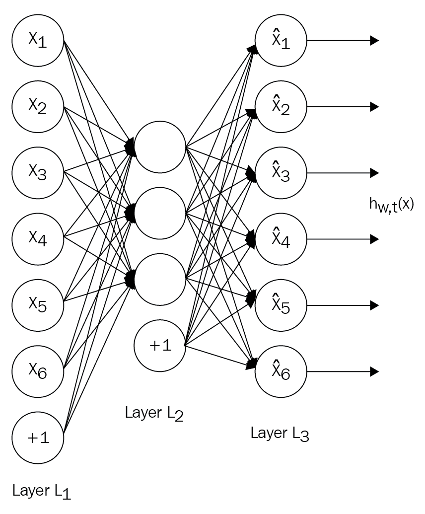

图 1：一般自编码器架构

# 自编码器示例

在本章中，我们将通过使用 MNIST 数据集演示一些不同类型的自编码器变体。作为一个具体例子，假设输入 *x* 是来自 28 x 28 图像的像素强度值（784 个像素）；因此，输入数据样本的数量为 *n=784*。在 *L2* 层中有 *s2=392* 个隐藏单元。由于输出将与输入数据样本的维度相同，*y ∈ R784*。输入层中的神经元数量为 *784*，中间层 *L2* 中有 *392* 个神经元；因此，网络将是一个较低的表示，这是输出的压缩版本。然后，网络将把这个压缩的较低表示 *a(L2) ∈ R392* 输入到网络的第二部分，后者将尽力从这个压缩版本中重建输入像素 *784*。

自编码器依赖于输入样本由图像像素表示，这些像素在某种程度上是相关的，然后它将利用这一点来重建它们。因此，自编码器有点类似于降维技术，因为它们也学习输入数据的低维表示。

总结一下，典型的自编码器将由三个部分组成：

1.  编码器部分，负责将输入压缩为低维表示

1.  代码部分，即编码器的中间结果

1.  解码器，负责使用该代码重建原始输入

以下图展示了典型自编码器的三个主要组成部分：

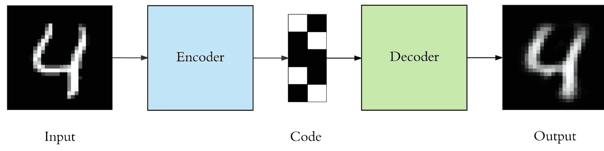

图 2：编码器如何在图像上发挥作用

正如我们所提到的，自编码器部分学习输入的压缩表示，然后将其馈送给第三部分，后者尝试重建输入。重建后的输入将类似于输出，但不会完全与原始输出相同，因此自编码器不能用于压缩任务。

# 自编码器架构

正如我们所提到的，典型的自编码器由三个部分组成。让我们更详细地探索这三部分。为了激励你，我们在本章中不会重新发明轮子。编码器-解码器部分不过是一个完全连接的神经网络，而代码部分是另一个神经网络，但它不是完全连接的。这个代码部分的维度是可控的，我们可以把它当作超参数来处理：

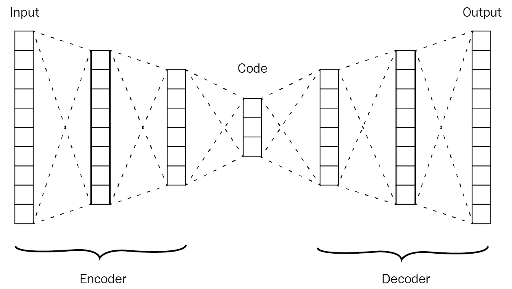

图 3：自编码器的一般编码器-解码器架构

在深入使用自编码器压缩 MNIST 数据集之前，我们将列出可以用于微调自编码器模型的一组超参数。主要有四个超参数：

1.  **代码部分大小**：这是中间层的单元数。中间层的单元数越少，我们得到的输入压缩表示越多。

1.  **编码器和解码器的层数**：正如我们所提到的，编码器和解码器不过是一个完全连接的神经网络，我们可以通过添加更多层使其尽可能深。

1.  **每层单元数**：我们也可以在每一层使用不同的单元数。编码器和解码器的形状与 DeconvNets 非常相似，其中编码器的层数在接近代码部分时减少，然后在接近解码器的最终层时开始增加。

1.  **模型损失函数**：我们也可以使用不同的损失函数，例如 MSE 或交叉熵。

在定义这些超参数并赋予它们初始值后，我们可以使用反向传播算法来训练网络。

# 压缩 MNIST 数据集

在本部分中，我们将构建一个简单的自动编码器，用于压缩 MNIST 数据集。因此，我们将把该数据集中的图像输入到编码器部分，编码器将尝试为它们学习一个压缩的低维表示；然后，我们将在解码器部分尝试重新构建输入图像。

# MNIST 数据集

我们将通过使用 TensorFlow 的辅助函数获取 MNIST 数据集来开始实现。

让我们导入实现所需的必要包：

```py
%matplotlib inline

import numpy as np
import tensorflow as tf
import matplotlib.pyplot as plt
```

```py

from tensorflow.examples.tutorials.mnist import input_data
mnist_dataset = input_data.read_data_sets('MNIST_data', validation_size=0)

Output:
Extracting MNIST_data/train-images-idx3-ubyte.gz
Extracting MNIST_data/train-labels-idx1-ubyte.gz
Extracting MNIST_data/t10k-images-idx3-ubyte.gz
Extracting MNIST_data/t10k-labels-idx1-ubyte.gz
```

让我们先从绘制一些 MNIST 数据集中的示例开始：

```py
# Plotting one image from the training set.
image = mnist_dataset.train.images[2]
plt.imshow(image.reshape((28, 28)), cmap='Greys_r')
```

```py
Output:
```

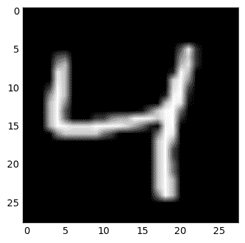

图 4：来自 MNIST 数据集的示例图像

```py
# Plotting one image from the training set.
image = mnist_dataset.train.images[2]
plt.imshow(image.reshape((28, 28)), cmap='Greys_r')

Output:
```

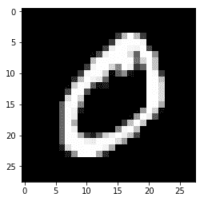

图 5：来自 MNIST 数据集的示例图像

# 构建模型

为了构建编码器，我们需要弄清楚每张 MNIST 图像包含多少像素，这样我们就能确定编码器输入层的大小。每张来自 MNIST 数据集的图像是 28 x 28 像素，因此我们将把该矩阵重塑为一个包含 28 x 28 = 784 个像素值的向量。我们不需要对 MNIST 图像进行归一化处理，因为它们已经是归一化的。

让我们开始构建模型的三个组件。在此实现中，我们将使用一个非常简单的架构，即单个隐藏层后接 ReLU 激活函数，如下图所示：

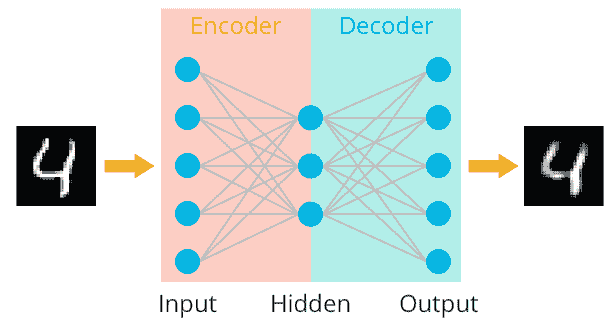

图 6：MNIST 实现的编码器-解码器架构

根据之前的解释，接下来我们将实现这个简单的编码器-解码器架构：

```py
# The size of the encoding layer or the hidden layer.
encoding_layer_dim = 32 

img_size = mnist_dataset.train.images.shape[1]

# defining placeholder variables of the input and target values
inputs_values = tf.placeholder(tf.float32, (None, img_size), name="inputs_values")
targets_values = tf.placeholder(tf.float32, (None, img_size), name="targets_values")

# Defining an encoding layer which takes the input values and incode them.
encoding_layer = tf.layers.dense(inputs_values, encoding_layer_dim, activation=tf.nn.relu)

# Defining the logit layer, which is a fully-connected layer but without any activation applied to its output
logits_layer = tf.layers.dense(encoding_layer, img_size, activation=None)

# Adding a sigmoid layer after the logit layer
decoding_layer = tf.sigmoid(logits_layer, name = "decoding_layer")

# use the sigmoid cross entropy as a loss function
model_loss = tf.nn.sigmoid_cross_entropy_with_logits(logits=logits_layer, labels=targets_values)

# Averaging the loss values accross the input data
model_cost = tf.reduce_mean(model_loss)

# Now we have a cost functiont that we need to optimize using Adam Optimizer
model_optimizier = tf.train.AdamOptimizer().minimize(model_cost)
```

现在我们已经定义了模型，并且使用了二元交叉熵，因为图像像素已经进行了归一化处理。

# 模型训练

在本节中，我们将启动训练过程。我们将使用 `mnist_dataset` 对象的辅助函数来从数据集中获取指定大小的随机批次；然后我们将在这一批图像上运行优化器。

让我们通过创建会话变量来开始本节内容，该变量将负责执行我们之前定义的计算图：

```py
# creating the session
 sess = tf.Session()
```

接下来，让我们启动训练过程：

```py
num_epochs = 20
train_batch_size = 200

sess.run(tf.global_variables_initializer())
for e in range(num_epochs):
    for ii in range(mnist_dataset.train.num_examples//train_batch_size):
        input_batch = mnist_dataset.train.next_batch(train_batch_size)
        feed_dict = {inputs_values: input_batch[0], targets_values: input_batch[0]}
        input_batch_cost, _ = sess.run([model_cost, model_optimizier], feed_dict=feed_dict)

        print("Epoch: {}/{}...".format(e+1, num_epochs),
              "Training loss: {:.3f}".format(input_batch_cost))
```

```py
Output:
.
.
.
Epoch: 20/20... Training loss: 0.091
Epoch: 20/20... Training loss: 0.091
Epoch: 20/20... Training loss: 0.093
Epoch: 20/20... Training loss: 0.093
Epoch: 20/20... Training loss: 0.095
Epoch: 20/20... Training loss: 0.095
Epoch: 20/20... Training loss: 0.089
Epoch: 20/20... Training loss: 0.095
Epoch: 20/20... Training loss: 0.095
Epoch: 20/20... Training loss: 0.096
Epoch: 20/20... Training loss: 0.094
Epoch: 20/20... Training loss: 0.093
Epoch: 20/20... Training loss: 0.094
Epoch: 20/20... Training loss: 0.093
Epoch: 20/20... Training loss: 0.095
Epoch: 20/20... Training loss: 0.094
Epoch: 20/20... Training loss: 0.096
Epoch: 20/20... Training loss: 0.092
Epoch: 20/20... Training loss: 0.093
Epoch: 20/20... Training loss: 0.091
Epoch: 20/20... Training loss: 0.093
Epoch: 20/20... Training loss: 0.091
Epoch: 20/20... Training loss: 0.095
Epoch: 20/20... Training loss: 0.094
Epoch: 20/20... Training loss: 0.091
Epoch: 20/20... Training loss: 0.096
Epoch: 20/20... Training loss: 0.089
Epoch: 20/20... Training loss: 0.090
Epoch: 20/20... Training loss: 0.094
Epoch: 20/20... Training loss: 0.088
Epoch: 20/20... Training loss: 0.094
Epoch: 20/20... Training loss: 0.093
Epoch: 20/20... Training loss: 0.091
Epoch: 20/20... Training loss: 0.095
Epoch: 20/20... Training loss: 0.093
Epoch: 20/20... Training loss: 0.091
Epoch: 20/20... Training loss: 0.094
Epoch: 20/20... Training loss: 0.090
Epoch: 20/20... Training loss: 0.091
Epoch: 20/20... Training loss: 0.095
Epoch: 20/20... Training loss: 0.095
Epoch: 20/20... Training loss: 0.094
Epoch: 20/20... Training loss: 0.092
Epoch: 20/20... Training loss: 0.092
Epoch: 20/20... Training loss: 0.093
Epoch: 20/20... Training loss: 0.093
```

在运行上述代码片段 20 个 epoch 后，我们将得到一个训练好的模型，它能够从 MNIST 数据的测试集中生成或重建图像。请记住，如果我们输入的图像与模型训练时使用的图像不相似，那么重建过程将无法正常工作，因为自动编码器是针对特定数据的。

让我们通过输入一些来自测试集的图像来测试训练好的模型，看看模型在解码器部分如何重建这些图像：

```py
fig, axes = plt.subplots(nrows=2, ncols=10, sharex=True, sharey=True, figsize=(20,4))

input_images = mnist_dataset.test.images[:10]
reconstructed_images, compressed_images = sess.run([decoding_layer, encoding_layer], feed_dict={inputs_values: input_images})

for imgs, row in zip([input_images, reconstructed_images], axes):
    for img, ax in zip(imgs, row):
        ax.imshow(img.reshape((28, 28)), cmap='Greys_r')
        ax.get_xaxis().set_visible(False)
        ax.get_yaxis().set_visible(False)

fig.tight_layout(pad=0.1)
```

输出：

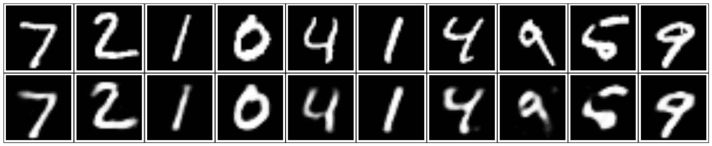

图 7：原始测试图像（第一行）及其重建（第二行）的示例

如你所见，重建后的图像与输入图像非常接近，但我们可能可以通过在编码器-解码器部分使用卷积层来获得更好的图像。

# 卷积自动编码器

之前的简单实现很好地完成了从 MNIST 数据集中重建输入图像的任务，但通过在自编码器的编码器和解码器部分添加卷积层，我们可以获得更好的性能。这个替换后得到的网络称为**卷积自编码器**（**CAE**）。这种能够替换层的灵活性是自编码器的一个巨大优势，使它们能够应用于不同的领域。

我们将用于 CAE 的架构将在网络的解码器部分包含上采样层，以获取图像的重建版本。

# 数据集

在这个实现中，我们可以使用任何类型的图像数据集，看看卷积版本的自编码器会带来什么变化。我们仍然将使用 MNIST 数据集，因此让我们开始使用 TensorFlow 辅助函数获取数据集：

```py
%matplotlib inline

import numpy as np
import tensorflow as tf
import matplotlib.pyplot as plt
```

```py
from tensorflow.examples.tutorials.mnist import input_data
mnist_dataset = input_data.read_data_sets('MNIST_data', validation_size=0)

Output:
from tensorflow.examples.tutorials.mnist import input_data

mnist_dataset = input_data.read_data_sets('MNIST_data', validation_size=0)

Extracting MNIST_data/train-images-idx3-ubyte.gz
Extracting MNIST_data/train-labels-idx1-ubyte.gz
Extracting MNIST_data/t10k-images-idx3-ubyte.gz
Extracting MNIST_data/t10k-labels-idx1-ubyte.gz
```

让我们展示数据集中的一个数字：

```py
# Plotting one image from the training set.
image = mnist_dataset.train.images[2]
plt.imshow(image.reshape((28, 28)), cmap='Greys_r')
```

输出：

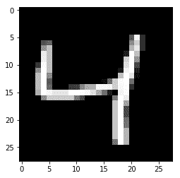

图 8：来自 MNIST 数据集的示例图像

# 构建模型

在这个实现中，我们将使用步幅为 1 的卷积层，并将填充参数设置为相同。这样，我们不会改变图像的高度或宽度。同时，我们使用了一组最大池化层来减少图像的宽度和高度，从而构建图像的压缩低维表示。

所以，让我们继续构建网络的核心部分：

```py
learning_rate = 0.001

# Define the placeholder variable sfor the input and target values
inputs_values = tf.placeholder(tf.float32, (None, 28,28,1), name="inputs_values")
targets_values = tf.placeholder(tf.float32, (None, 28,28,1), name="targets_values")

# Defining the Encoder part of the netowrk
# Defining the first convolution layer in the encoder parrt
# The output tenosor will be in the shape of 28x28x16
conv_layer_1 = tf.layers.conv2d(inputs=inputs_values, filters=16, kernel_size=(3,3), padding='same', activation=tf.nn.relu)

# The output tenosor will be in the shape of 14x14x16
maxpool_layer_1 = tf.layers.max_pooling2d(conv_layer_1, pool_size=(2,2), strides=(2,2), padding='same')

# The output tenosor will be in the shape of 14x14x8
conv_layer_2 = tf.layers.conv2d(inputs=maxpool_layer_1, filters=8, kernel_size=(3,3), padding='same', activation=tf.nn.relu)

# The output tenosor will be in the shape of 7x7x8
maxpool_layer_2 = tf.layers.max_pooling2d(conv_layer_2, pool_size=(2,2), strides=(2,2), padding='same')

# The output tenosor will be in the shape of 7x7x8
conv_layer_3 = tf.layers.conv2d(inputs=maxpool_layer_2, filters=8, kernel_size=(3,3), padding='same', activation=tf.nn.relu)

# The output tenosor will be in the shape of 4x4x8
encoded_layer = tf.layers.max_pooling2d(conv_layer_3, pool_size=(2,2), strides=(2,2), padding='same')

# Defining the Decoder part of the netowrk
# Defining the first upsampling layer in the decoder part
# The output tenosor will be in the shape of 7x7x8
upsample_layer_1 = tf.image.resize_images(encoded_layer, size=(7,7), method=tf.image.ResizeMethod.NEAREST_NEIGHBOR)

# The output tenosor will be in the shape of 7x7x8
conv_layer_4 = tf.layers.conv2d(inputs=upsample_layer_1, filters=8, kernel_size=(3,3), padding='same', activation=tf.nn.relu)

# The output tenosor will be in the shape of 14x14x8
upsample_layer_2 = tf.image.resize_images(conv_layer_4, size=(14,14), method=tf.image.ResizeMethod.NEAREST_NEIGHBOR)

# The output tenosor will be in the shape of 14x14x8
conv_layer_5 = tf.layers.conv2d(inputs=upsample_layer_2, filters=8, kernel_size=(3,3), padding='same', activation=tf.nn.relu)

# The output tenosor will be in the shape of 28x28x8
upsample_layer_3 = tf.image.resize_images(conv_layer_5, size=(28,28), method=tf.image.ResizeMethod.NEAREST_NEIGHBOR)

# The output tenosor will be in the shape of 28x28x16
conv6 = tf.layers.conv2d(inputs=upsample_layer_3, filters=16, kernel_size=(3,3), padding='same', activation=tf.nn.relu)

# The output tenosor will be in the shape of 28x28x1
logits_layer = tf.layers.conv2d(inputs=conv6, filters=1, kernel_size=(3,3), padding='same', activation=None)

# feeding the logits values to the sigmoid activation function to get the reconstructed images
decoded_layer = tf.nn.sigmoid(logits_layer)

# feeding the logits to sigmoid while calculating the cross entropy
model_loss = tf.nn.sigmoid_cross_entropy_with_logits(labels=targets_values, logits=logits_layer)

# Getting the model cost and defining the optimizer to minimize it
model_cost = tf.reduce_mean(model_loss)
model_optimizer = tf.train.AdamOptimizer(learning_rate).minimize(model_cost)
```

现在我们可以开始了。我们已经构建了卷积神经网络的解码器-解码器部分，并展示了输入图像在解码器部分如何被重建。

# 模型训练

现在我们已经构建了模型，我们可以通过生成来自 MNIST 数据集的随机批次并将它们输入到之前定义的优化器中来启动学习过程。

让我们从创建会话变量开始；它将负责执行我们之前定义的计算图：

```py
sess = tf.Session()
num_epochs = 20
train_batch_size = 200
sess.run(tf.global_variables_initializer())

for e in range(num_epochs):
    for ii in range(mnist_dataset.train.num_examples//train_batch_size):
        input_batch = mnist_dataset.train.next_batch(train_batch_size)
        input_images = input_batch[0].reshape((-1, 28, 28, 1))
        input_batch_cost, _ = sess.run([model_cost, model_optimizer], feed_dict={inputs_values: input_images,targets_values: input_images})

        print("Epoch: {}/{}...".format(e+1, num_epochs),
              "Training loss: {:.3f}".format(input_batch_cost))
```

```py
Output:
.
.
.
Epoch: 20/20... Training loss: 0.102
Epoch: 20/20... Training loss: 0.099
Epoch: 20/20... Training loss: 0.103
Epoch: 20/20... Training loss: 0.102
Epoch: 20/20... Training loss: 0.100
Epoch: 20/20... Training loss: 0.101
Epoch: 20/20... Training loss: 0.098
Epoch: 20/20... Training loss: 0.103
Epoch: 20/20... Training loss: 0.104
Epoch: 20/20... Training loss: 0.103
Epoch: 20/20... Training loss: 0.098
Epoch: 20/20... Training loss: 0.102
Epoch: 20/20... Training loss: 0.098
Epoch: 20/20... Training loss: 0.099
Epoch: 20/20... Training loss: 0.103
Epoch: 20/20... Training loss: 0.104
Epoch: 20/20... Training loss: 0.101
Epoch: 20/20... Training loss: 0.105
Epoch: 20/20... Training loss: 0.102
Epoch: 20/20... Training loss: 0.102
Epoch: 20/20... Training loss: 0.100
Epoch: 20/20... Training loss: 0.099
Epoch: 20/20... Training loss: 0.102
Epoch: 20/20... Training loss: 0.102
Epoch: 20/20... Training loss: 0.104
Epoch: 20/20... Training loss: 0.101
Epoch: 20/20... Training loss: 0.099
Epoch: 20/20... Training loss: 0.098
Epoch: 20/20... Training loss: 0.100
Epoch: 20/20... Training loss: 0.101
Epoch: 20/20... Training loss: 0.100
Epoch: 20/20... Training loss: 0.100
Epoch: 20/20... Training loss: 0.101
Epoch: 20/20... Training loss: 0.098
Epoch: 20/20... Training loss: 0.101
Epoch: 20/20... Training loss: 0.103
Epoch: 20/20... Training loss: 0.103
Epoch: 20/20... Training loss: 0.102
Epoch: 20/20... Training loss: 0.101
Epoch: 20/20... Training loss: 0.100
Epoch: 20/20... Training loss: 0.101
Epoch: 20/20... Training loss: 0.102
Epoch: 20/20... Training loss: 0.103
Epoch: 20/20... Training loss: 0.103
Epoch: 20/20... Training loss: 0.103
Epoch: 20/20... Training loss: 0.099
Epoch: 20/20... Training loss: 0.101
Epoch: 20/20... Training loss: 0.096
Epoch: 20/20... Training loss: 0.104
Epoch: 20/20... Training loss: 0.104
Epoch: 20/20... Training loss: 0.103
Epoch: 20/20... Training loss: 0.103
Epoch: 20/20... Training loss: 0.104
Epoch: 20/20... Training loss: 0.099
Epoch: 20/20... Training loss: 0.101
Epoch: 20/20... Training loss: 0.101
Epoch: 20/20... Training loss: 0.099
Epoch: 20/20... Training loss: 0.100
Epoch: 20/20... Training loss: 0.102
Epoch: 20/20... Training loss: 0.100
Epoch: 20/20... Training loss: 0.098
Epoch: 20/20... Training loss: 0.100
Epoch: 20/20... Training loss: 0.097
Epoch: 20/20... Training loss: 0.102
```

在运行前面的代码片段 20 个周期后，我们将得到一个训练好的 CAE，因此我们可以继续通过输入来自 MNIST 数据集的相似图像来测试这个模型：

```py
fig, axes = plt.subplots(nrows=2, ncols=10, sharex=True, sharey=True, figsize=(20,4))
input_images = mnist_dataset.test.images[:10]
reconstructed_images = sess.run(decoded_layer, feed_dict={inputs_values: input_images.reshape((10, 28, 28, 1))})

for imgs, row in zip([input_images, reconstructed_images], axes):
    for img, ax in zip(imgs, row):
        ax.imshow(img.reshape((28, 28)), cmap='Greys_r')
        ax.get_xaxis().set_visible(False)
        ax.get_yaxis().set_visible(False)

fig.tight_layout(pad=0.1)

Output:
```

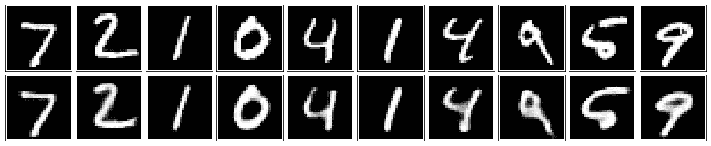

图 9：原始测试图像（第一行）及其重建图像（第二行），使用卷积自编码器

# 去噪自编码器

我们可以进一步优化自编码器架构，迫使它学习关于输入数据的重要特征。通过向输入图像添加噪声，并以原始图像作为目标，模型将尝试去除这些噪声，并学习关于它们的重要特征，以便在输出中生成有意义的重建图像。这种 CAE 架构可以用于去除输入图像中的噪声。这种自编码器的特定变种称为**去噪自编码器**：

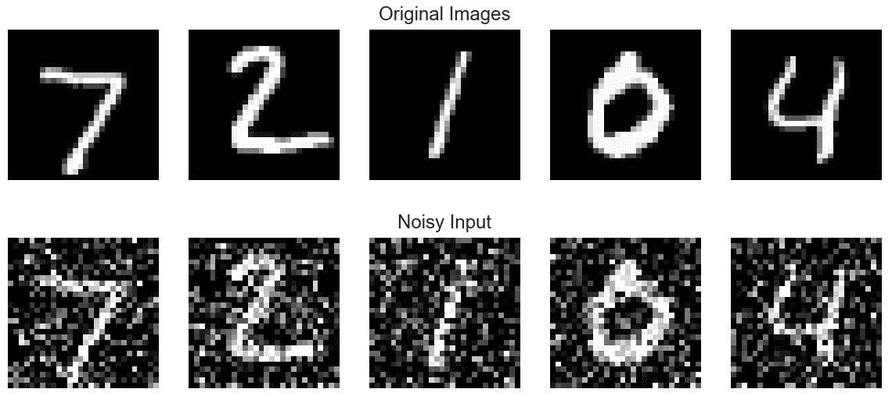

图 10：原始图像及添加少量高斯噪声后的相同图像示例

所以让我们从实现下图中的架构开始。我们在这个去噪自编码器架构中唯一添加的额外内容就是在原始输入图像中加入了一些噪声：

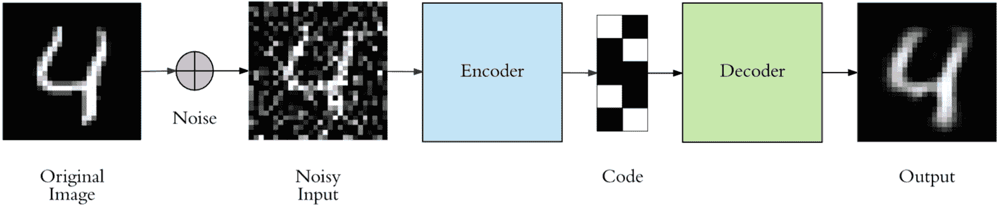

图 11：自编码器的通用去噪架构

# 构建模型

在这个实现中，我们将在编码器和解码器部分使用更多的层，原因在于我们给输入增加了新的复杂度。

下一个模型与之前的 CAE 完全相同，只是增加了额外的层，这将帮助我们从有噪声的图像中重建出无噪声的图像。

那么，让我们继续构建这个架构：

```py
learning_rate = 0.001

# Define the placeholder variable sfor the input and target values
inputs_values = tf.placeholder(tf.float32, (None, 28, 28, 1), name='inputs_values')
targets_values = tf.placeholder(tf.float32, (None, 28, 28, 1), name='targets_values')

# Defining the Encoder part of the netowrk
# Defining the first convolution layer in the encoder parrt
# The output tenosor will be in the shape of 28x28x32
conv_layer_1 = tf.layers.conv2d(inputs=inputs_values, filters=32, kernel_size=(3,3), padding='same', activation=tf.nn.relu)

# The output tenosor will be in the shape of 14x14x32
maxpool_layer_1 = tf.layers.max_pooling2d(conv_layer_1, pool_size=(2,2), strides=(2,2), padding='same')

# The output tenosor will be in the shape of 14x14x32
conv_layer_2 = tf.layers.conv2d(inputs=maxpool_layer_1, filters=32, kernel_size=(3,3), padding='same', activation=tf.nn.relu)

# The output tenosor will be in the shape of 7x7x32
maxpool_layer_2 = tf.layers.max_pooling2d(conv_layer_2, pool_size=(2,2), strides=(2,2), padding='same')

# The output tenosor will be in the shape of 7x7x16
conv_layer_3 = tf.layers.conv2d(inputs=maxpool_layer_2, filters=16, kernel_size=(3,3), padding='same', activation=tf.nn.relu)

# The output tenosor will be in the shape of 4x4x16
encoding_layer = tf.layers.max_pooling2d(conv_layer_3, pool_size=(2,2), strides=(2,2), padding='same')

# Defining the Decoder part of the netowrk
# Defining the first upsampling layer in the decoder part
# The output tenosor will be in the shape of 7x7x16
upsample_layer_1 = tf.image.resize_images(encoding_layer, size=(7,7), method=tf.image.ResizeMethod.NEAREST_NEIGHBOR)

# The output tenosor will be in the shape of 7x7x16
conv_layer_4 = tf.layers.conv2d(inputs=upsample_layer_1, filters=16, kernel_size=(3,3), padding='same', activation=tf.nn.relu)

# The output tenosor will be in the shape of 14x14x16
upsample_layer_2 = tf.image.resize_images(conv_layer_4, size=(14,14), method=tf.image.ResizeMethod.NEAREST_NEIGHBOR)

# The output tenosor will be in the shape of 14x14x32
conv_layer_5 = tf.layers.conv2d(inputs=upsample_layer_2, filters=32, kernel_size=(3,3), padding='same', activation=tf.nn.relu)

# The output tenosor will be in the shape of 28x28x32
upsample_layer_3 = tf.image.resize_images(conv_layer_5, size=(28,28), method=tf.image.ResizeMethod.NEAREST_NEIGHBOR)

# The output tenosor will be in the shape of 28x28x32
conv_layer_6 = tf.layers.conv2d(inputs=upsample_layer_3, filters=32, kernel_size=(3,3), padding='same', activation=tf.nn.relu)

# The output tenosor will be in the shape of 28x28x1
logits_layer = tf.layers.conv2d(inputs=conv_layer_6, filters=1, kernel_size=(3,3), padding='same', activation=None)

# feeding the logits values to the sigmoid activation function to get the reconstructed images
decoding_layer = tf.nn.sigmoid(logits_layer)

# feeding the logits to sigmoid while calculating the cross entropy
model_loss = tf.nn.sigmoid_cross_entropy_with_logits(labels=targets_values, logits=logits_layer)

# Getting the model cost and defining the optimizer to minimize it
model_cost = tf.reduce_mean(model_loss)
model_optimizer = tf.train.AdamOptimizer(learning_rate).minimize(model_cost)
```

现在我们有了一个更复杂或更深的卷积模型版本。

# 模型训练

现在是时候开始训练这个更深的网络了，这将需要更多的时间来收敛，通过从有噪声的输入中重建无噪声的图像。

所以让我们先创建会话变量：

```py
sess = tf.Session()
```

接下来，我们将启动训练过程，但使用更多的训练轮次：

```py
num_epochs = 100
train_batch_size = 200

# Defining a noise factor to be added to MNIST dataset
mnist_noise_factor = 0.5
sess.run(tf.global_variables_initializer())

for e in range(num_epochs):
    for ii in range(mnist_dataset.train.num_examples//train_batch_size):
        input_batch = mnist_dataset.train.next_batch(train_batch_size)

        # Getting and reshape the images from the corresponding batch
        batch_images = input_batch[0].reshape((-1, 28, 28, 1))

        # Add random noise to the input images
        noisy_images = batch_images + mnist_noise_factor * np.random.randn(*batch_images.shape)

        # Clipping all the values that are above 0 or above 1
        noisy_images = np.clip(noisy_images, 0., 1.)

        # Set the input images to be the noisy ones and the original images to be the target
        input_batch_cost, _ = sess.run([model_cost, model_optimizer], feed_dict={inputs_values: noisy_images,
                                                         targets_values: batch_images})

        print("Epoch: {}/{}...".format(e+1, num_epochs),
              "Training loss: {:.3f}".format(input_batch_cost))
```

```py
Output:
.
.
.
Epoch: 100/100... Training loss: 0.098
Epoch: 100/100... Training loss: 0.101
Epoch: 100/100... Training loss: 0.103
Epoch: 100/100... Training loss: 0.098
Epoch: 100/100... Training loss: 0.102
Epoch: 100/100... Training loss: 0.102
Epoch: 100/100... Training loss: 0.103
Epoch: 100/100... Training loss: 0.101
Epoch: 100/100... Training loss: 0.098
Epoch: 100/100... Training loss: 0.099
Epoch: 100/100... Training loss: 0.096
Epoch: 100/100... Training loss: 0.100
Epoch: 100/100... Training loss: 0.100
Epoch: 100/100... Training loss: 0.103
Epoch: 100/100... Training loss: 0.100
Epoch: 100/100... Training loss: 0.101
Epoch: 100/100... Training loss: 0.099
Epoch: 100/100... Training loss: 0.096
Epoch: 100/100... Training loss: 0.102
Epoch: 100/100... Training loss: 0.099
Epoch: 100/100... Training loss: 0.098
Epoch: 100/100... Training loss: 0.102
Epoch: 100/100... Training loss: 0.100
Epoch: 100/100... Training loss: 0.100
Epoch: 100/100... Training loss: 0.099
Epoch: 100/100... Training loss: 0.098
Epoch: 100/100... Training loss: 0.100
Epoch: 100/100... Training loss: 0.099
Epoch: 100/100... Training loss: 0.102
Epoch: 100/100... Training loss: 0.099
Epoch: 100/100... Training loss: 0.102
Epoch: 100/100... Training loss: 0.100
Epoch: 100/100... Training loss: 0.101
Epoch: 100/100... Training loss: 0.102
Epoch: 100/100... Training loss: 0.098
Epoch: 100/100... Training loss: 0.103
Epoch: 100/100... Training loss: 0.100
Epoch: 100/100... Training loss: 0.098
Epoch: 100/100... Training loss: 0.100
Epoch: 100/100... Training loss: 0.097
Epoch: 100/100... Training loss: 0.099
Epoch: 100/100... Training loss: 0.100
Epoch: 100/100... Training loss: 0.101
Epoch: 100/100... Training loss: 0.101
```

现在我们已经训练好了模型，能够生成无噪声的图像，这使得自编码器适用于许多领域。

在接下来的代码片段中，我们不会直接将 MNIST 测试集的原始图像输入到模型中，因为我们需要先给这些图像添加噪声，看看训练好的模型如何生成无噪声的图像。

在这里，我给测试图像加入噪声，并通过自编码器传递它们。即使有时很难分辨原始的数字是什么，模型仍然能够出色地去除噪声：

```py
#Defining some figures
fig, axes = plt.subplots(nrows=2, ncols=10, sharex=True, sharey=True, figsize=(20,4))

#Visualizing some images
input_images = mnist_dataset.test.images[:10]
noisy_imgs = input_images + mnist_noise_factor * np.random.randn(*input_images.shape)

#Clipping and reshaping the noisy images
noisy_images = np.clip(noisy_images, 0., 1.).reshape((10, 28, 28, 1))

#Getting the reconstructed images
reconstructed_images = sess.run(decoding_layer, feed_dict={inputs_values: noisy_images})

#Visualizing the input images and the noisy ones
for imgs, row in zip([noisy_images, reconstructed_images], axes):
    for img, ax in zip(imgs, row):
        ax.imshow(img.reshape((28, 28)), cmap='Greys_r')
        ax.get_xaxis().set_visible(False)
        ax.get_yaxis().set_visible(False)

fig.tight_layout(pad=0.1)
```

```py

Output:
```

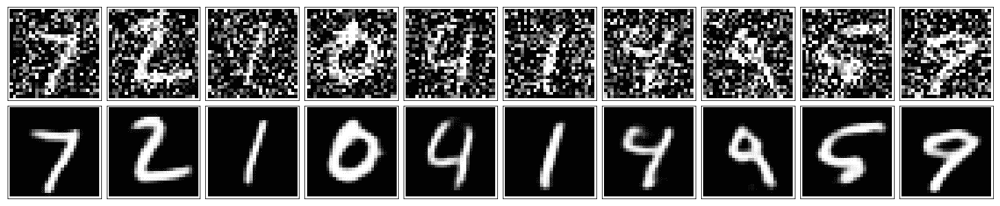

图 12：原始测试图像中加入一些高斯噪声（顶部行）以及基于训练好的去噪自编码器重建后的图像示例

# 自编码器的应用

在之前从较低表示构建图像的示例中，我们看到它与原始输入非常相似，而且我们还看到在去噪噪声数据集时，卷积自编码网络（CANs）的优势。我们上面实现的这种示例对于图像构建应用和数据集去噪非常有用。因此，你可以将上述实现推广到你感兴趣的任何其他示例。

此外，在本章中，我们还展示了自编码器架构的灵活性，以及我们如何对其进行各种更改。我们甚至测试了它在解决更复杂的图像去噪问题中的表现。这种灵活性为自编码器的更多应用开辟了大门。

# 图像上色

自编码器——尤其是卷积版本——可以用于更难的任务，例如图像上色。在接下来的示例中，我们给模型输入一张没有颜色的图像，经过自编码器模型重建后的图像将会被上色：

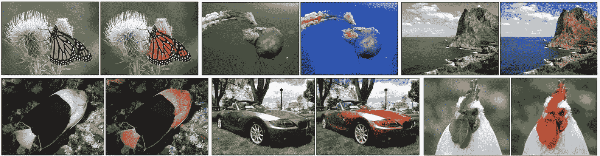

图 13：CAE 模型训练进行图像上色

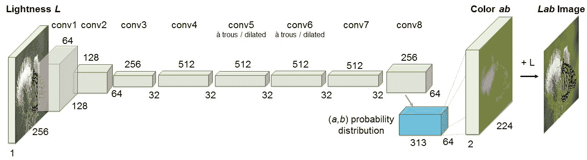

图 14：上色论文架构

现在我们的自编码器已经训练完成，我们可以用它给我们之前从未见过的图片上色！

这种应用可以用于给拍摄于早期相机时代的非常老旧图像上色。

# 更多应用

另一个有趣的应用是生成更高分辨率的图像，或者像下图所示的神经图像增强。

这些图展示了理查德·张提供的更真实的图像上色版本：

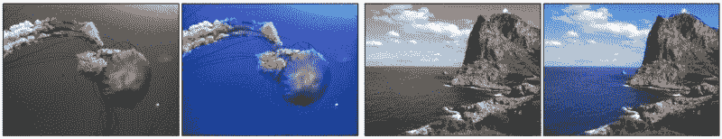

图 15：理查德·张（Richard Zhang）、菲利普·伊索拉（Phillip Isola）和亚历克塞·A·埃夫罗斯（Alexei A. Efros）提供的彩色图像上色

这张图展示了自编码器在图像增强中的另一个应用：

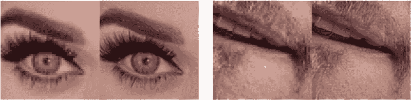

图 16：亚历克西（Alexjc）提供的神经增强（[`github.com/alexjc/neural-enhance`](https://github.com/alexjc/neural-enhance)）

# 总结

在本章中，我们介绍了一种全新的架构，可以用于许多有趣的应用。自编码器非常灵活，所以可以随意提出你自己在图像增强、上色或构建方面的问题。此外，还有自编码器的更多变体，称为**变分自编码器**。它们也被用于非常有趣的应用，比如图像生成。
