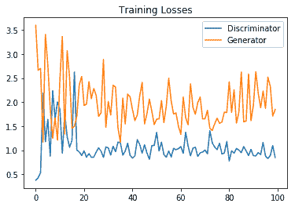

# 第十四章：生成对抗网络

**生成对抗网络**（**GANs**）是深度神经网络架构，由两个相互对立的网络组成（因此得名**对抗**）。

GANs 是在 2014 年由 Ian Goodfellow 和其他研究人员，包括 Yoshua Bengio，在蒙特利尔大学的一篇论文中提出的（[`arxiv.org/abs/1406.2661`](https://arxiv.org/abs/1406.2661)）。Facebook 的 AI 研究总监 Yann LeCun 曾提到，**对抗训练**是过去 10 年中在机器学习领域最有趣的想法。

GANs 的潜力巨大，因为它们可以学习模仿任何数据分布。也就是说，GANs 可以被训练生成在任何领域与我们现实世界极为相似的世界：图像、音乐、语音或散文。从某种意义上说，它们是机器人艺术家，它们的输出令人印象深刻（[`www.nytimes.com/2017/08/14/arts/design/google-how-ai-creates-new-music-and-new-artists-project-magenta.html`](https://www.nytimes.com/2017/08/14/arts/design/google-how-ai-creates-new-music-and-new-artists-project-magenta.html))——并且也令人感动。

本章将涵盖以下内容：

+   直观介绍

+   GANs 的简单实现

+   深度卷积 GANs

# 直观介绍

本节将以非常直观的方式介绍 GANs。为了理解 GANs 的工作原理，我们将采用一个虚拟情境——获得一张派对门票的过程。

故事从一个非常有趣的派对或活动开始，这个活动在某个地方举行，你非常想参加。你听说这个活动时已经很晚了，所有的门票都卖光了，但你会不惜一切代价进入派对。所以，你想到了一个主意！你将尝试伪造一张与原始门票完全相同或者非常相似的票。但因为生活总是充满挑战，还有一个难题：你不知道原始门票长什么样子。所以，根据你参加过类似派对的经验，你开始想象这张门票可能是什么样子的，并开始根据你的想象设计这张票。

你将尝试设计这张票，然后去活动现场，向保安展示这张票。希望他们会被说服，并让你进去。但你不想多次向保安展示自己的脸，于是你决定寻求朋友的帮助，朋友会拿着你对原始门票的初步猜测去向保安展示。如果他们没有让他进去，他会根据看到其他人用真正的门票进入的情况，给你一些信息，告诉你这张票可能是什么样的。你会根据朋友的反馈不断完善门票，直到保安允许他进入。到那时——只有到那时——你才会设计出一张完全相同的票，并让自己也顺利进入。

不要过多思考这个故事有多不现实，但 GAN 的工作原理与这个故事非常相似。如今 GAN 非常流行，人们将其用于计算机视觉领域的许多应用。

你可以将 GAN 用于许多有趣的应用，我们将在实现并提到其中的一些应用。

在 GAN 中，有两个主要组成部分在许多计算机视觉领域中取得了突破。第一个组件被称为**生成器**，第二个组件被称为**判别器**：

+   生成器将尝试从特定的概率分布中生成数据样本，这与那个试图复制活动票的人的行为非常相似。

+   判别器将判断（就像安保人员试图找出票上的缺陷，以决定它是原始的还是伪造的）输入是来自原始训练集（原始票）还是来自生成器部分（由试图复制原始票的人设计）：


图 1：GAN——通用架构

# 简单的 GAN 实现

从伪造活动票的故事来看，GAN 的概念似乎非常直观。为了清楚地理解 GAN 如何工作以及如何实现它们，我们将展示一个在 MNIST 数据集上实现简单 GAN 的例子。

首先，我们需要构建 GAN 网络的核心，主要由两个部分组成：生成器和判别器。正如我们所说，生成器将尝试从特定的概率分布中生成或伪造数据样本；判别器则能够访问和看到实际的数据样本，它将判断生成器的输出是否在设计上存在缺陷，或者它与原始数据样本有多么接近。类似于事件的场景，生成器的整个目的是尽力说服判别器，生成的图像来自真实数据集，从而试图欺骗判别器。

训练过程的结果类似于活动故事的结局；生成器最终将成功生成看起来与原始数据样本非常相似的图像：


图 2：MNIST 数据集的 GAN 通用架构

任何 GAN 的典型结构如*图 2*所示，将会在 MNIST 数据集上进行训练。图中的`潜在样本`部分是一个随机的思维或向量，生成器利用它来用假图像复制真实图像。

如我们所述，判别器充当一个判断者，它会尝试将生成器设计的假图像与真实图像区分开来。因此，这个网络的输出将是二值的，可以通过一个 sigmoid 函数表示，0 表示输入是一个假图像，1 表示输入是一个真实图像。

让我们继续并开始实现这个架构，看看它在 MNIST 数据集上的表现。

让我们从导入实现所需的库开始：

```py
%matplotlib inline

import matplotlib.pyplot as plt
import pickle as pkl

import numpy as np
import tensorflow as tf
```

我们将使用 MNIST 数据集，因此我们将使用 TensorFlow 辅助工具获取数据集并将其存储在某个地方：

```py
from tensorflow.examples.tutorials.mnist import input_data
mnist_dataset = input_data.read_data_sets('MNIST_data')
```

```py
Output:
Extracting MNIST_data/train-images-idx3-ubyte.gz
Extracting MNIST_data/train-labels-idx1-ubyte.gz
Extracting MNIST_data/t10k-images-idx3-ubyte.gz
Extracting MNIST_data/t10k-labels-idx1-ubyte.gz
```

# 模型输入

在深入构建 GAN 的核心部分（由生成器和鉴别器表示）之前，我们将定义计算图的输入。如 *图 2* 所示，我们需要两个输入。第一个是实际图像，将传递给鉴别器。另一个输入称为 **潜在空间**，它将传递给生成器并用于生成假图像：

```py
# Defining the model input for the generator and discrimator
def inputs_placeholders(discrimator_real_dim, gen_z_dim):
    real_discrminator_input = tf.placeholder(tf.float32, (None, discrimator_real_dim), name="real_discrminator_input")
    generator_inputs_z = tf.placeholder(tf.float32, (None, gen_z_dim), name="generator_input_z")

    return real_discrminator_input, generator_inputs_z
```


图 3：MNIST GAN 实现的架构

现在是时候开始构建我们架构的两个核心组件了。我们将从构建生成器部分开始。如 *图 3* 所示，生成器将包含至少一个隐藏层，该层将作为近似器工作。此外，我们将使用一种称为 leaky ReLU 的激活函数，而不是使用普通的 ReLU 激活函数。这样，梯度值就可以在层之间流动，而没有任何限制（关于 leaky ReLU 的更多内容将在下一节介绍）。

# 变量作用域

变量作用域是 TensorFlow 的一个功能，帮助我们完成以下任务：

+   确保我们有一些命名约定以便稍后能检索它们，例如，可以让它们以“generator”或“discriminator”开头，这将帮助我们在训练网络时。我们本可以使用作用域命名功能，但这个功能对第二个目的帮助不大。

+   为了能够重用或重新训练相同的网络，但使用不同的输入。例如，我们将从生成器中采样假图像，以查看生成器在复制原始图像方面的表现如何。另外，鉴别器将能够访问真实图像和假图像，这将使我们能够重用变量，而不是在构建计算图时创建新变量。

以下语句将展示如何使用 TensorFlow 的变量作用域功能：

```py
with tf.variable_scope('scopeName', reuse=False):
    # Write your code here
```

你可以在[`www.tensorflow.org/programmers_guide/variable_scope#the_problem`](https://www.tensorflow.org/programmers_guide/variable_scope#the_problem)阅读更多关于使用变量作用域功能的好处。

# Leaky ReLU

我们提到过，我们将使用一个不同版本的 ReLU 激活函数，称为 leaky ReLU。传统版本的 ReLU 激活函数会选择输入值与零的最大值，换句话说，将负值截断为零。而 leaky ReLU，即我们将使用的版本，允许某些负值存在，因此得名 **leaky ReLU**。

有时，如果我们使用传统的 ReLU 激活函数，网络会陷入一个叫做“死亡状态”的常见状态，这时网络对于所有输出都会产生零值。

使用 Leaky ReLU 的目的是通过允许一些负值通过，防止出现“死亡”状态。

使生成器正常工作的整个思路是接收来自判别器的梯度值，如果网络处于“死亡”状态，则学习过程无法发生。

以下图示展示了传统 ReLU 和其 Leaky 版本之间的区别：


图 4：ReLU 函数


图 5：Leaky ReLU 激活函数

Leaky ReLU 激活函数在 TensorFlow 中没有实现，因此我们需要自己实现。该激活函数的输出如果输入为正，则为正值，如果输入为负，则为一个受控的负值。我们将通过一个名为 **alpha** 的参数来控制负值的大小，从而通过允许一些负值通过来为网络引入容忍度。

以下方程表示我们将要实现的 Leaky ReLU：


# 生成器

MNIST 图像的值已归一化在 0 和 1 之间，在这个范围内，`sigmoid` 激活函数表现最佳。但是，实际上，发现 `tanh` 激活函数的性能优于其他任何函数。因此，为了使用 `tanh` 激活函数，我们需要将这些图像的像素值范围重新缩放到 -1 和 1 之间：

```py
def generator(gen_z, gen_out_dim, num_hiddern_units=128, reuse_vars=False, leaky_relu_alpha=0.01):

    ''' Building the generator part of the network

        Function arguments
        ---------
        gen_z : the generator input tensor
        gen_out_dim : the output shape of the generator
        num_hiddern_units : Number of neurons/units in the hidden layer
        reuse_vars : Reuse variables with tf.variable_scope
        leaky_relu_alpha : leaky ReLU parameter

        Function Returns
        -------
        tanh_output, logits_layer: 
    '''
    with tf.variable_scope('generator', reuse=reuse_vars):

        # Defining the generator hidden layer
        hidden_layer_1 = tf.layers.dense(gen_z, num_hiddern_units, activation=None)

        # Feeding the output of hidden_layer_1 to leaky relu
        hidden_layer_1 = tf.maximum(hidden_layer_1, leaky_relu_alpha*hidden_layer_1)

        # Getting the logits and tanh layer output
        logits_layer = tf.layers.dense(hidden_layer_1, gen_out_dim, activation=None)
        tanh_output = tf.nn.tanh(logits_layer)

        return tanh_output, logits_layer
```

现在生成器部分已经准备好了，让我们继续定义网络的第二个组件。

# 判别器

接下来，我们将构建生成对抗网络中的第二个主要组件，即判别器。判别器与生成器非常相似，但我们将使用 `sigmoid` 激活函数，而不是 `tanh` 激活函数；它将输出一个二进制结果，表示判别器对输入图像的判断：

```py
def discriminator(disc_input, num_hiddern_units=128, reuse_vars=False, leaky_relu_alpha=0.01):
    ''' Building the discriminator part of the network

        Function Arguments
        ---------
        disc_input : discrminator input tensor
        num_hiddern_units : Number of neurons/units in the hidden layer
        reuse_vars : Reuse variables with tf.variable_scope
        leaky_relu_alpha : leaky ReLU parameter

        Function Returns
        -------
        sigmoid_out, logits_layer: 
    '''
    with tf.variable_scope('discriminator', reuse=reuse_vars):

        # Defining the generator hidden layer
        hidden_layer_1 = tf.layers.dense(disc_input, num_hiddern_units, activation=None)

        # Feeding the output of hidden_layer_1 to leaky relu
        hidden_layer_1 = tf.maximum(hidden_layer_1, leaky_relu_alpha*hidden_layer_1)

        logits_layer = tf.layers.dense(hidden_layer_1, 1, activation=None)
        sigmoid_out = tf.nn.sigmoid(logits_layer)

        return sigmoid_out, logits_layer
```

# 构建 GAN 网络

在定义了构建生成器和判别器部分的主要函数后，接下来是将它们堆叠起来，并定义模型的损失函数和优化器进行实现。

# 模型超参数

我们可以通过更改以下超参数集来微调 GAN：

```py
# size of discriminator input image
#28 by 28 will flattened to be 784
input_img_size = 784 

# size of the generator latent vector
gen_z_size = 100

# number of hidden units for the generator and discriminator hidden layers
gen_hidden_size = 128
disc_hidden_size = 128

#leaky ReLU alpha parameter which controls the leak of the function
leaky_relu_alpha = 0.01

# smoothness of the label 
label_smooth = 0.1
```

# 定义生成器和判别器

在定义了生成虚假 MNIST 图像的架构的两个主要部分后（这些图像看起来和真实的完全一样），现在是时候使用我们目前定义的函数来构建网络了。为了构建网络，我们将按照以下步骤进行：

1.  定义我们的模型输入，这将由两个变量组成。其中一个变量是真实图像，将被输入到判别器中，另一个是潜在空间，将被生成器用于复制原始图像。

1.  调用定义好的生成器函数来构建网络的生成器部分。

1.  调用定义的判别器函数来构建网络的判别器部分，但我们将调用这个函数两次。第一次调用将用于真实数据，第二次调用将用于来自生成器的假数据。

1.  通过重用变量保持真实图像和假图像的权重相同：

```py
tf.reset_default_graph()

# creating the input placeholders for the discrminator and generator
real_discrminator_input, generator_input_z = inputs_placeholders(input_img_size, gen_z_size)

#Create the generator network
gen_model, gen_logits = generator(generator_input_z, input_img_size, gen_hidden_size, reuse_vars=False, leaky_relu_alpha=leaky_relu_alpha)

# gen_model is the output of the generator
#Create the generator network
disc_model_real, disc_logits_real = discriminator(real_discrminator_input, disc_hidden_size, reuse_vars=False, leaky_relu_alpha=leaky_relu_alpha)
disc_model_fake, disc_logits_fake = discriminator(gen_model, disc_hidden_size, reuse_vars=True, leaky_relu_alpha=leaky_relu_alpha)
```

# 判别器和生成器的损失

在这一部分，我们需要定义判别器和生成器的损失，这可以看作是该实现中最棘手的部分。

我们知道生成器试图复制原始图像，而判别器充当一个判断者，接收来自生成器和原始输入图像的两种图像。所以，在设计每个部分的损失时，我们需要关注两个方面。

首先，我们需要网络的判别器部分能够区分由生成器生成的假图像和来自原始训练示例的真实图像。在训练时，我们将为判别器部分提供一个批次，该批次分为两类。第一类是来自原始输入的图像，第二类是生成器生成的假图像。

所以，判别器的最终总损失将是其将真实样本识别为真实和将假样本识别为假的能力之和；然后最终的总损失将是：


```py
tf.reduce_mean(tf.nn.sigmoid_cross_entropy_with_logits(logits=logits_layer, labels=labels))
```

所以，我们需要计算两个损失来得出最终的判别器损失。

第一个损失，`disc_loss_real`，将根据我们从判别器得到的`logits`值和`labels`计算，这里标签将全部为 1，因为我们知道这个小批次中的所有图像都来自 MNIST 数据集的真实输入图像。为了增强模型在测试集上的泛化能力并提供更好的结果，实践中发现将 1 的值改为 0.9 更好。对标签值进行这样的修改引入了**标签平滑**：

```py
 labels = tf.ones_like(tensor) * (1 - smooth)
```

对于判别器损失的第二部分，即判别器检测假图像的能力，损失将是判别器从生成器得到的 logits 值与标签之间的差异；这些标签全为 0，因为我们知道这个小批次中的所有图像都是来自生成器，而不是来自原始输入图像。

现在我们已经讨论了判别器损失，我们还需要计算生成器的损失。生成器损失将被称为`gen_loss`，它是`disc_logits_fake`（判别器对于假图像的输出）和标签之间的损失（由于生成器试图通过其设计的假图像来说服判别器，因此标签将全部为 1）：

```py

# calculating the losses of the discrimnator and generator
disc_labels_real = tf.ones_like(disc_logits_real) * (1 - label_smooth)
disc_labels_fake = tf.zeros_like(disc_logits_fake)

disc_loss_real = tf.nn.sigmoid_cross_entropy_with_logits(labels=disc_labels_real, logits=disc_logits_real)
disc_loss_fake = tf.nn.sigmoid_cross_entropy_with_logits(labels=disc_labels_fake, logits=disc_logits_fake)

#averaging the disc loss
disc_loss = tf.reduce_mean(disc_loss_real + disc_loss_fake)

#averaging the gen loss
gen_loss = tf.reduce_mean(
    tf.nn.sigmoid_cross_entropy_with_logits(
        labels=tf.ones_like(disc_logits_fake), 
        logits=disc_logits_fake))
```

# 优化器

最后是优化器部分！在这一部分，我们将定义训练过程中使用的优化标准。首先，我们将分别更新生成器和鉴别器的变量，因此我们需要能够获取每部分的变量。

对于第一个优化器，即生成器优化器，我们将从计算图的可训练变量中获取所有以`generator`开头的变量；然后，我们可以通过变量的名称来查看每个变量代表什么。

我们对鉴别器的变量也做相同的处理，允许所有以`discriminator`开头的变量。之后，我们可以将需要优化的变量列表传递给优化器。

所以，TensorFlow 的变量范围功能使我们能够获取以特定字符串开头的变量，然后我们可以得到两份不同的变量列表，一份是生成器的，一份是鉴别器的：

```py

# building the model optimizer

learning_rate = 0.002

# Getting the trainable_variables of the computational graph, split into Generator and Discrimnator parts
trainable_vars = tf.trainable_variables()
gen_vars = [var for var in trainable_vars if var.name.startswith("generator")]
disc_vars = [var for var in trainable_vars if var.name.startswith("discriminator")]

disc_train_optimizer = tf.train.AdamOptimizer().minimize(disc_loss, var_list=disc_vars)
gen_train_optimizer = tf.train.AdamOptimizer().minimize(gen_loss, var_list=gen_vars)
```

# 模型训练

现在，让我们开始训练过程，看看 GAN 是如何生成与 MNIST 图像相似的图像的：

```py
train_batch_size = 100
num_epochs = 100
generated_samples = []
model_losses = []

saver = tf.train.Saver(var_list = gen_vars)

with tf.Session() as sess:
    sess.run(tf.global_variables_initializer())

    for e in range(num_epochs):
        for ii in range(mnist_dataset.train.num_examples//train_batch_size):
            input_batch = mnist_dataset.train.next_batch(train_batch_size)

            # Get images, reshape and rescale to pass to D
            input_batch_images = input_batch[0].reshape((train_batch_size, 784))
            input_batch_images = input_batch_images*2 - 1

            # Sample random noise for G
            gen_batch_z = np.random.uniform(-1, 1, size=(train_batch_size, gen_z_size))

            # Run optimizers
            _ = sess.run(disc_train_optimizer, feed_dict={real_discrminator_input: input_batch_images, generator_input_z: gen_batch_z})
            _ = sess.run(gen_train_optimizer, feed_dict={generator_input_z: gen_batch_z})

        # At the end of each epoch, get the losses and print them out
        train_loss_disc = sess.run(disc_loss, {generator_input_z: gen_batch_z, real_discrminator_input: input_batch_images})
        train_loss_gen = gen_loss.eval({generator_input_z: gen_batch_z})

        print("Epoch {}/{}...".format(e+1, num_epochs),
              "Disc Loss: {:.3f}...".format(train_loss_disc),
              "Gen Loss: {:.3f}".format(train_loss_gen)) 

        # Save losses to view after training
        model_losses.append((train_loss_disc, train_loss_gen))

        # Sample from generator as we're training for viegenerator_inputs_zwing afterwards
        gen_sample_z = np.random.uniform(-1, 1, size=(16, gen_z_size))
        generator_samples = sess.run(
                       generator(generator_input_z, input_img_size, reuse_vars=True),
                       feed_dict={generator_input_z: gen_sample_z})

        generated_samples.append(generator_samples)
        saver.save(sess, './checkpoints/generator_ck.ckpt')

# Save training generator samples
with open('train_generator_samples.pkl', 'wb') as f:
    pkl.dump(generated_samples, f)
```

```py
Output:
.
.
.
Epoch 71/100... Disc Loss: 1.078... Gen Loss: 1.361
Epoch 72/100... Disc Loss: 1.037... Gen Loss: 1.555
Epoch 73/100... Disc Loss: 1.194... Gen Loss: 1.297
Epoch 74/100... Disc Loss: 1.120... Gen Loss: 1.730
Epoch 75/100... Disc Loss: 1.184... Gen Loss: 1.425
Epoch 76/100... Disc Loss: 1.054... Gen Loss: 1.534
Epoch 77/100... Disc Loss: 1.457... Gen Loss: 0.971
Epoch 78/100... Disc Loss: 0.973... Gen Loss: 1.688
Epoch 79/100... Disc Loss: 1.324... Gen Loss: 1.370
Epoch 80/100... Disc Loss: 1.178... Gen Loss: 1.710
Epoch 81/100... Disc Loss: 1.070... Gen Loss: 1.649
Epoch 82/100... Disc Loss: 1.070... Gen Loss: 1.530
Epoch 83/100... Disc Loss: 1.117... Gen Loss: 1.705
Epoch 84/100... Disc Loss: 1.042... Gen Loss: 2.210
Epoch 85/100... Disc Loss: 1.152... Gen Loss: 1.260
Epoch 86/100... Disc Loss: 1.327... Gen Loss: 1.312
Epoch 87/100... Disc Loss: 1.069... Gen Loss: 1.759
Epoch 88/100... Disc Loss: 1.001... Gen Loss: 1.400
Epoch 89/100... Disc Loss: 1.215... Gen Loss: 1.448
Epoch 90/100... Disc Loss: 1.108... Gen Loss: 1.342
Epoch 91/100... Disc Loss: 1.227... Gen Loss: 1.468
Epoch 92/100... Disc Loss: 1.190... Gen Loss: 1.328
Epoch 93/100... Disc Loss: 0.869... Gen Loss: 1.857
Epoch 94/100... Disc Loss: 0.946... Gen Loss: 1.740
Epoch 95/100... Disc Loss: 0.925... Gen Loss: 1.708
Epoch 96/100... Disc Loss: 1.067... Gen Loss: 1.427
Epoch 97/100... Disc Loss: 1.099... Gen Loss: 1.573
Epoch 98/100... Disc Loss: 0.972... Gen Loss: 1.884
Epoch 99/100... Disc Loss: 1.292... Gen Loss: 1.610
Epoch 100/100... Disc Loss: 1.103... Gen Loss: 1.736
```

在运行模型 100 个周期后，我们得到了一个训练好的模型，它能够生成与我们输入给鉴别器的原始图像相似的图像：

```py
fig, ax = plt.subplots()
model_losses = np.array(model_losses)
plt.plot(model_losses.T[0], label='Disc loss')
plt.plot(model_losses.T[1], label='Gen loss')
plt.title("Model Losses")
plt.legend()
```

输出：



图 6：鉴别器和生成器的损失

如前图所示，可以看到模型的损失（由鉴别器和生成器的曲线表示）正在收敛。

# 生成器从训练中获得的样本

让我们测试一下模型的表现，甚至看看生成器在接近训练结束时，生成技能（为活动设计票据）是如何增强的：

```py
def view_generated_samples(epoch_num, g_samples):
    fig, axes = plt.subplots(figsize=(7,7), nrows=4, ncols=4, sharey=True, sharex=True)

    print(gen_samples[epoch_num][1].shape)

    for ax, gen_image in zip(axes.flatten(), g_samples[0][epoch_num]):
        ax.xaxis.set_visible(False)
        ax.yaxis.set_visible(False)
        img = ax.imshow(gen_image.reshape((28,28)), cmap='Greys_r')

    return fig, axes

```

在绘制训练过程中最后一个周期生成的一些图像之前，我们需要加载包含每个周期生成样本的持久化文件：

```py
# Load samples from generator taken while training
with open('train_generator_samples.pkl', 'rb') as f:
    gen_samples = pkl.load(f)
```

现在，让我们绘制出训练过程中最后一个周期生成的 16 张图像，看看生成器是如何生成有意义的数字（如 3、7 和 2）的：

```py
_ = view_generated_samples(-1, gen_samples)
```


图 7：最终训练周期的样本

我们甚至可以看到生成器在不同周期中的设计能力。所以，让我们可视化它在每 10 个周期生成的图像：

```py
rows, cols = 10, 6
fig, axes = plt.subplots(figsize=(7,12), nrows=rows, ncols=cols, sharex=True, sharey=True)

for gen_sample, ax_row in zip(gen_samples[::int(len(gen_samples)/rows)], axes):
    for image, ax in zip(gen_sample[::int(len(gen_sample)/cols)], ax_row):
        ax.imshow(image.reshape((28,28)), cmap='Greys_r')
        ax.xaxis.set_visible(False)
        ax.yaxis.set_visible(False)
```


图 8：网络训练过程中每 10 个周期生成的图像

正如你所看到的，生成器的设计能力以及其生成假图像的能力在最开始时非常有限，之后随着训练过程的进行有所增强。

# 从生成器采样

在上一节中，我们展示了一些在这个 GAN 架构训练过程中生成的示例图像。我们还可以通过加载我们保存的检查点，并给生成器提供一个新的潜在空间，让它用来生成全新的图像：

```py
# Sampling from the generator
saver = tf.train.Saver(var_list=g_vars)

with tf.Session() as sess:

    #restoring the saved checkpints
    saver.restore(sess, tf.train.latest_checkpoint('checkpoints'))
    gen_sample_z = np.random.uniform(-1, 1, size=(16, z_size))
    generated_samples = sess.run(
                   generator(generator_input_z, input_img_size, reuse_vars=True),
                   feed_dict={generator_input_z: gen_sample_z})
view_generated_samples(0, [generated_samples])
```


图 9：来自生成器的样本

在实现这个例子时，你可以得出一些观察结果。在训练过程的最初几个周期里，生成器没有能力生成与真实图像相似的图像，因为它不知道这些图像是什么样子的。即使是判别器也不知道如何区分由生成器生成的假图像和真实图像。在训练开始时，会出现两种有趣的情况。首先，生成器不知道如何创建像我们最初输入到网络中的真实图像一样的图像。第二，判别器不知道真实图像和假图像之间的区别。

随着训练的进行，生成器开始生成一定程度上有意义的图像，这是因为生成器会学习到原始输入图像的来源数据分布。与此同时，判别器将能够区分真假图像，最终在训练结束时被生成器所欺骗。

# 摘要

现在，GANs 已经被应用于许多有趣的领域。GANs 可以用于不同的设置，例如半监督学习和无监督学习任务。此外，由于大量研究人员正在致力于 GANs，这些模型日益进步，生成图像或视频的能力越来越强。

这些模型可以用于许多有趣的商业应用，比如为 Photoshop 添加一个插件，可以接受像`让我的笑容更迷人`这样的命令。它们还可以用于图像去噪。
