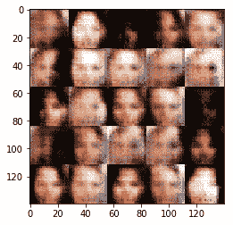

# 第十五章：人脸生成与处理缺失标签

我们可以使用 GAN 的有趣应用无穷无尽。在本章中，我们将演示 GAN 的另一个有前途的应用——基于 CelebA 数据库的人脸生成。我们还将演示如何在半监督学习设置中使用 GAN，其中我们有一个标签不全的数据集。

本章将涵盖以下主题：

+   人脸生成

+   使用生成对抗网络（GAN）的半监督学习

# 人脸生成

如我们在上一章所提到的，生成器和判别器由**反卷积网络**（**DNN**：[`www.quora.com/How-does-a-deconvolutional-neural-network-work`](https://www.quora.com/How-does-a-deconvolutional-neural-network-work)）和**卷积神经网络**（**CNN**：[`cs231n.github.io/convolutional-networks/`](http://cs231n.github.io/convolutional-networks/)）组成：

+   CNN 是一种神经网络，它将图像的数百个像素编码成一个小维度的向量（z），该向量是图像的摘要。

+   DNN 是一种网络，它学习一些滤波器，以从 z 中恢复原始图像。

此外，判别器会输出 1 或 0，表示输入的图像是来自真实数据集，还是由生成器生成。另一方面，生成器会尝试根据潜在空间 z 复制与原始数据集相似的图像，这些图像可能遵循高斯分布。因此，判别器的目标是正确区分真实图像，而生成器的目标是学习原始数据集的分布，从而欺骗判别器，使其做出错误的决策。

在本节中，我们将尝试教导生成器学习人脸图像的分布，以便它能够生成逼真的人脸。

生成类人面孔对于大多数图形公司来说至关重要，这些公司总是在为其应用程序寻找新的面孔，这也让我们看到人工智能在生成逼真人脸方面接近现实的程度。

在本示例中，我们将使用 CelebA 数据集。CelebFaces 属性数据集（CelebA）是一个大规模的面部属性数据集，包含约 20 万张名人图像，每张图像有 40 个属性标注。数据集涵盖了大量的姿势变化，以及背景杂乱，因此 CelebA 非常多样且注释完备。它包括：

+   10,177 个身份

+   202,599 张人脸图像

+   每张图像有五个地标位置和 40 个二元属性注释

我们可以将此数据集用于许多计算机视觉应用，除了人脸生成，还可以用于人脸识别、定位或人脸属性检测。

该图展示了生成器误差，或者说学习人脸分布，在训练过程中如何逐渐接近现实：


图 1：使用 GAN 从名人图像数据集中生成新面孔

# 获取数据

在这一部分，我们将定义一些辅助函数，帮助我们下载 CelebA 数据集。我们将通过导入实现所需的包开始：

```py
import math
import os
import hashlib
from urllib.request import urlretrieve
import zipfile
import gzip
import shutil

import numpy as np
from PIL import Image
from tqdm import tqdm
import utils

import tensorflow as tf
```

接下来，我们将使用 utils 脚本下载数据集：

```py
#Downloading celebA dataset
celebA_data_dir = 'input'
utils.download_extract('celeba', celebA_data_dir)
```

```py
Output:

Downloading celeba: 1.44GB [00:21, 66.6MB/s] 
Extracting celeba...
```

# 探索数据

CelebA 数据集包含超过 20 万张带注释的名人图像。由于我们将使用 GAN 生成类似的图像，因此值得看一些来自数据集的图像，看看它们的效果。在这一部分，我们将定义一些辅助函数，用于可视化 CelebA 数据集中的一组图像。

现在，让我们使用`utils`脚本从数据集中显示一些图像：

```py
#number of images to display
num_images_to_show = 25

celebA_images = utils.get_batch(glob(os.path.join(celebA_data_dir, 'img_align_celeba/*.jpg'))[:num_images_to_show], 28,
                                28, 'RGB')
pyplot.imshow(utils.images_square_grid(celebA_images, 'RGB'))
```

```py
Output:
```


图 2：从 CelebA 数据集中绘制一组图像

这个计算机视觉任务的主要目标是使用 GAN 生成类似于名人数据集中图像的图像，因此我们需要专注于图像的面部部分。为了聚焦于图像的面部部分，我们将去除不包含名人面孔的部分。

# 构建模型

现在，让我们开始构建我们实现的核心——计算图；它主要包括以下组件：

+   模型输入

+   判别器

+   生成器

+   模型损失

+   模型优化器

+   训练模型

# 模型输入

在这一部分，我们将实现一个辅助函数，定义模型的输入占位符，这些占位符将负责将数据输入到计算图中。

这些函数应该能够创建三个主要的占位符：

+   来自数据集的实际输入图像，尺寸为（批量大小，输入图像宽度，输入图像高度，通道数）

+   潜在空间 Z，将被生成器用来生成假图像

+   学习率占位符

辅助函数将返回这三个输入占位符的元组。现在，让我们定义这个函数：

```py
# defining the model inputs
def inputs(img_width, img_height, img_channels, latent_space_z_dim):
    true_inputs = tf.placeholder(tf.float32, (None, img_width, img_height, img_channels),
                                 'true_inputs')
    l_space_inputs = tf.placeholder(tf.float32, (None, latent_space_z_dim), 'l_space_inputs')
    model_learning_rate = tf.placeholder(tf.float32, name='model_learning_rate')

    return true_inputs, l_space_inputs, model_learning_rate
```

# 判别器

接下来，我们需要实现网络的判别器部分，用于判断输入是来自真实数据集还是由生成器生成的。我们将再次使用 TensorFlow 的`tf.variable_scope`功能为一些变量添加前缀“判别器”，以便我们能够检索和重用它们。

那么，让我们定义一个函数，返回判别器的二进制输出以及 logit 值：

```py
# Defining the discriminator function
def discriminator(input_imgs, reuse=False):
    # using variable_scope to reuse variables
    with tf.variable_scope('discriminator', reuse=reuse):
        # leaky relu parameter
        leaky_param_alpha = 0.2

        # defining the layers
        conv_layer_1 = tf.layers.conv2d(input_imgs, 64, 5, 2, 'same')
        leaky_relu_output = tf.maximum(leaky_param_alpha * conv_layer_1, conv_layer_1)

        conv_layer_2 = tf.layers.conv2d(leaky_relu_output, 128, 5, 2, 'same')
        normalized_output = tf.layers.batch_normalization(conv_layer_2, training=True)
        leay_relu_output = tf.maximum(leaky_param_alpha * normalized_output, normalized_output)

        conv_layer_3 = tf.layers.conv2d(leay_relu_output, 256, 5, 2, 'same')
        normalized_output = tf.layers.batch_normalization(conv_layer_3, training=True)
        leaky_relu_output = tf.maximum(leaky_param_alpha * normalized_output, normalized_output)

        # reshaping the output for the logits to be 2D tensor
        flattened_output = tf.reshape(leaky_relu_output, (-1, 4 * 4 * 256))
        logits_layer = tf.layers.dense(flattened_output, 1)
        output = tf.sigmoid(logits_layer)

    return output, logits_layer
```

# 生成器

现在，轮到实现网络的第二部分，它将尝试使用潜在空间`z`来复制原始输入图像。我们也将使用`tf.variable_scope`来实现这个功能。

那么，让我们定义一个函数，返回生成器生成的图像：

```py
def generator(z_latent_space, output_channel_dim, is_train=True):

    with tf.variable_scope('generator', reuse=not is_train):

        #leaky relu parameter
        leaky_param_alpha = 0.2

        fully_connected_layer = tf.layers.dense(z_latent_space, 2*2*512)

        #reshaping the output back to 4D tensor to match the accepted format for convolution layer
        reshaped_output = tf.reshape(fully_connected_layer, (-1, 2, 2, 512))
        normalized_output = tf.layers.batch_normalization(reshaped_output, training=is_train)
        leaky_relu_output = tf.maximum(leaky_param_alpha * normalized_output, normalized_output)

        conv_layer_1 = tf.layers.conv2d_transpose(leaky_relu_output, 256, 5, 2, 'valid')
        normalized_output = tf.layers.batch_normalization(conv_layer_1, training=is_train)
        leaky_relu_output = tf.maximum(leaky_param_alpha * normalized_output, normalized_output)

        conv_layer_2 = tf.layers.conv2d_transpose(leaky_relu_output, 128, 5, 2, 'same')
        normalized_output = tf.layers.batch_normalization(conv_layer_2, training=is_train)
        leaky_relu_output = tf.maximum(leaky_param_alpha * normalized_output, normalized_output)

        logits_layer = tf.layers.conv2d_transpose(leaky_relu_output, output_channel_dim, 5, 2, 'same')
        output = tf.tanh(logits_layer)

        return output
```

# 模型损失

接下来是比较棘手的部分，我们在前一章中讲过，即计算判别器和生成器的损失。

所以，让我们定义这个函数，它将使用之前定义的`generator`和`discriminator`函数：

```py
# Define the error for the discriminator and generator
def model_losses(input_actual, input_latent_z, out_channel_dim):
    # building the generator part
    gen_model = generator(input_latent_z, out_channel_dim)
    disc_model_true, disc_logits_true = discriminator(input_actual)
    disc_model_fake, disc_logits_fake = discriminator(gen_model, reuse=True)

    disc_loss_true = tf.reduce_mean(
        tf.nn.sigmoid_cross_entropy_with_logits(logits=disc_logits_true, labels=tf.ones_like(disc_model_true)))

    disc_loss_fake = tf.reduce_mean(tf.nn.sigmoid_cross_entropy_with_logits(
        logits=disc_logits_fake, labels=tf.zeros_like(disc_model_fake)))

    gen_loss = tf.reduce_mean(tf.nn.sigmoid_cross_entropy_with_logits(
        logits=disc_logits_fake, labels=tf.ones_like(disc_model_fake)))

    disc_loss = disc_loss_true + disc_loss_fake

    return disc_loss, gen_loss
```

# 模型优化器

最后，在训练我们的模型之前，我们需要实现该任务的优化标准。我们将使用之前使用的命名约定来检索判别器和生成器的可训练参数并训练它们：

```py
# specifying the optimization criteria
def model_optimizer(disc_loss, gen_loss, learning_rate, beta1):
    trainable_vars = tf.trainable_variables()
    disc_vars = [var for var in trainable_vars if var.name.startswith('discriminator')]
    gen_vars = [var for var in trainable_vars if var.name.startswith('generator')]

    disc_train_opt = tf.train.AdamOptimizer(
        learning_rate, beta1=beta1).minimize(disc_loss, var_list=disc_vars)

    update_operations = tf.get_collection(tf.GraphKeys.UPDATE_OPS)
    gen_updates = [opt for opt in update_operations if opt.name.startswith('generator')]

    with tf.control_dependencies(gen_updates):
        gen_train_opt = tf.train.AdamOptimizer(
            learning_rate, beta1).minimize(gen_loss, var_list=gen_vars)

    return disc_train_opt, gen_train_opt
```

# 训练模型

现在，是时候训练模型并观察生成器如何在一定程度上欺骗判别器，通过生成与原始 CelebA 数据集非常接近的图像。

但首先，让我们定义一个辅助函数，它将展示生成器生成的一些图像：

```py
# define a function to visualize some generated images from the generator
def show_generator_output(sess, num_images, input_latent_z, output_channel_dim, img_mode):
    cmap = None if img_mode == 'RGB' else 'gray'
    latent_space_z_dim = input_latent_z.get_shape().as_list()[-1]
    examples_z = np.random.uniform(-1, 1, size=[num_images, latent_space_z_dim])

    examples = sess.run(
        generator(input_latent_z, output_channel_dim, False),
        feed_dict={input_latent_z: examples_z})

    images_grid = utils.images_square_grid(examples, img_mode)
    pyplot.imshow(images_grid, cmap=cmap)
    pyplot.show()
```

然后，我们将使用之前定义的辅助函数来构建模型输入、损失和优化标准。我们将它们堆叠在一起，并开始基于 CelebA 数据集训练我们的模型：

```py
def model_train(num_epocs, train_batch_size, z_dim, learning_rate, beta1, get_batches, input_data_shape, data_img_mode):
    _, image_width, image_height, image_channels = input_data_shape

    actual_input, z_input, leaningRate = inputs(
        image_width, image_height, image_channels, z_dim)

    disc_loss, gen_loss = model_losses(actual_input, z_input, image_channels)

    disc_opt, gen_opt = model_optimizer(disc_loss, gen_loss, learning_rate, beta1)

    steps = 0
    print_every = 50
    show_every = 100
    model_loss = []
    num_images = 25

    with tf.Session() as sess:

        # initializing all the variables
        sess.run(tf.global_variables_initializer())

        for epoch_i in range(num_epocs):
            for batch_images in get_batches(train_batch_size):

                steps += 1
                batch_images *= 2.0
                z_sample = np.random.uniform(-1, 1, (train_batch_size, z_dim))

                _ = sess.run(disc_opt, feed_dict={
                    actual_input: batch_images, z_input: z_sample, leaningRate: learning_rate})
                _ = sess.run(gen_opt, feed_dict={
                    z_input: z_sample, leaningRate: learning_rate})

                if steps % print_every == 0:
                    train_loss_disc = disc_loss.eval({z_input: z_sample, actual_input: batch_images})
                    train_loss_gen = gen_loss.eval({z_input: z_sample})

                    print("Epoch {}/{}...".format(epoch_i + 1, num_epocs),
                          "Discriminator Loss: {:.4f}...".format(train_loss_disc),
                          "Generator Loss: {:.4f}".format(train_loss_gen))
                    model_loss.append((train_loss_disc, train_loss_gen))

                if steps % show_every == 0:
                    show_generator_output(sess, num_images, z_input, image_channels, data_img_mode)
```

启动训练过程，这可能会根据你的主机机器规格需要一些时间：

```py
# Training the model on CelebA dataset
train_batch_size = 64
z_dim = 100
learning_rate = 0.002
beta1 = 0.5

num_epochs = 1

celeba_dataset = utils.Dataset('celeba', glob(os.path.join(data_dir, 'img_align_celeba/*.jpg')))
with tf.Graph().as_default():
    model_train(num_epochs, train_batch_size, z_dim, learning_rate, beta1, celeba_dataset.get_batches,
                celeba_dataset.shape, celeba_dataset.image_mode)
```

输出：

```py

 Epoch 1/1... Discriminator Loss: 0.9118... Generator Loss: 12.2238
 Epoch 1/1... Discriminator Loss: 0.6119... Generator Loss: 3.2168
 Epoch 1/1... Discriminator Loss: 0.5383... Generator Loss: 2.8054
 Epoch 1/1... Discriminator Loss: 1.4381... Generator Loss: 0.4672
 Epoch 1/1... Discriminator Loss: 0.7815... Generator Loss: 14.8220
 Epoch 1/1... Discriminator Loss: 0.6435... Generator Loss: 9.2591
 Epoch 1/1... Discriminator Loss: 1.5661... Generator Loss: 10.4747
 Epoch 1/1... Discriminator Loss: 1.5407... Generator Loss: 0.5811
 Epoch 1/1... Discriminator Loss: 0.6470... Generator Loss: 2.9002
 Epoch 1/1... Discriminator Loss: 0.5671... Generator Loss: 2.0700
```


图 3：此时训练的生成输出样本

```py
Epoch 1/1... Discriminator Loss: 0.7950... Generator Loss: 1.5818
Epoch 1/1... Discriminator Loss: 1.2417... Generator Loss: 0.7094
Epoch 1/1... Discriminator Loss: 1.1786... Generator Loss: 1.0948
Epoch 1/1... Discriminator Loss: 1.0427... Generator Loss: 2.8878
Epoch 1/1... Discriminator Loss: 0.8409... Generator Loss: 2.6785
Epoch 1/1... Discriminator Loss: 0.8557... Generator Loss: 1.7706
Epoch 1/1... Discriminator Loss: 0.8241... Generator Loss: 1.2898
Epoch 1/1... Discriminator Loss: 0.8590... Generator Loss: 1.8217
Epoch 1/1... Discriminator Loss: 1.1694... Generator Loss: 0.8490
Epoch 1/1... Discriminator Loss: 0.9984... Generator Loss: 1.0042
```



图 4：此时训练的生成输出样本

经过一段时间的训练后，你应该会得到类似这样的结果：


图 5：此时训练的生成输出样本

# 使用生成对抗网络（GAN）进行半监督学习

鉴于此，半监督学习是一种技术，其中使用标注数据和未标注数据来训练分类器。

这种类型的分类器采用一小部分标注数据和大量未标注数据（来自同一领域）。目标是将这些数据源结合起来，训练一个**深度卷积神经网络**（**DCNN**），以学习一个推断函数，能够将新的数据点映射到其期望的结果。

在这个领域，我们提出了一种 GAN 模型，用于使用非常小的标注训练集对街景房号进行分类。实际上，该模型使用了原始 SVHN 训练标签的大约 1.3%，即 1000 个标注样本。我们使用了在论文*Improved Techniques for Training GANs from OpenAI*中描述的一些技术（[`arxiv.org/abs/1606.03498`](https://arxiv.org/abs/1606.03498)）。

# 直觉

在构建生成图像的 GAN 时，我们同时训练生成器和判别器。训练后，我们可以丢弃判别器，因为我们只在训练生成器时使用了它。


图 6：用于 11 类分类问题的半监督学习 GAN 架构

在半监督学习中，我们需要将判别器转变为一个多类分类器。这个新模型必须能够在测试集上很好地泛化，尽管我们没有很多带标签的训练样本。此外，这一次，训练结束时，我们实际上可以抛弃生成器。请注意，角色发生了变化。现在，生成器仅用于在训练过程中帮助判别器。换句话说，生成器充当了一个不同的信息来源，判别器从中获取未经标签的原始训练数据。正如我们将看到的，这些未经标签的数据对于提高判别器的性能至关重要。此外，对于一个常规的图像生成 GAN，判别器只有一个角色：计算其输入是否真实的概率——我们将其称为 GAN 问题。

然而，要将判别器转变为一个半监督分类器，除了 GAN 问题，判别器还必须学习原始数据集每个类别的概率。换句话说，对于每个输入图像，判别器必须学习它属于某个类别（如 1、2、3 等）的概率。

回顾一下，对于图像生成 GAN 的判别器，我们有一个单一的 sigmoid 单元输出。这个值代表了输入图像是真实的概率（接近 1），还是假的概率（接近 0）。换句话说，从判别器的角度来看，接近 1 的值意味着样本很可能来自训练集。同样，接近 0 的值则意味着样本更有可能来自生成器网络。通过使用这个概率，判别器能够将信号传回生成器。这个信号使生成器能够在训练过程中调整其参数，从而有可能提高生成真实图像的能力。

我们必须将判别器（来自之前的 GAN）转换为一个 11 类分类器。为此，我们可以将其 sigmoid 输出转换为具有 11 个类别输出的 softmax，前 10 个输出表示 SVHN 数据集各个类别的概率（0 至 9），第 11 类则表示所有来自生成器的假图像。

请注意，如果我们将第 11 类的概率设为 0，那么前 10 个概率的总和就等于使用 sigmoid 函数计算的相同概率。

最后，我们需要设置损失函数，使得判别器能够同时完成两项任务：

+   帮助生成器学习生成真实图像。为了做到这一点，我们必须指示判别器区分真实样本和假样本。

+   使用生成器的图像以及带标签和不带标签的训练数据，帮助分类数据集。

总结一下，判别器有三种不同的训练数据来源：

+   带标签的真实图像。这些是像任何常规监督分类问题一样的图像标签对。

+   没有标签的真实图像。对于这些图像，分类器只能学习到这些图像是“真实的”。

+   来自生成器的图像。为了使用这些图像，判别器学习将其分类为假。

这些不同数据源的结合将使分类器能够从更广泛的角度学习。反过来，这使得模型的推理性能比仅使用 1,000 个标注样本进行训练时更为精准。

# 数据分析和预处理

对于这个任务，我们将使用 SVHN 数据集，它是斯坦福大学的街景房屋号码（Street View House Numbers）数据集的缩写（[`ufldl.stanford.edu/housenumbers/`](http://ufldl.stanford.edu/housenumbers/)）。所以，让我们通过导入实现所需的包开始实现：

```py
# Lets start by loading the necessary libraries
%matplotlib inline

import pickle as pkl
import time
import matplotlib.pyplot as plt
import numpy as np
from scipy.io import loadmat
import tensorflow as tf
import os

```

接下来，我们将定义一个辅助类来下载 SVHN 数据集（记得你需要首先手动创建`input_data_dir`目录）：

```py
from urllib.request import urlretrieve
from os.path import isfile, isdir
from tqdm import tqdm
input_data_dir = 'input/'

input_data_dir = 'input/'

if not isdir(input_data_dir):
    raise Exception("Data directory doesn't exist!")

class DLProgress(tqdm):
    last_block = 0

    def hook(self, block_num=1, block_size=1, total_size=None):
        self.total = total_size
        self.update((block_num - self.last_block) * block_size)
        self.last_block = block_num

if not isfile(input_data_dir + "train_32x32.mat"):
    with DLProgress(unit='B', unit_scale=True, miniters=1, desc='SVHN Training Set') as pbar:
        urlretrieve(
            'http://ufldl.stanford.edu/housenumbers/train_32x32.mat',
            input_data_dir + 'train_32x32.mat',
            pbar.hook)

if not isfile(input_data_dir + "test_32x32.mat"):
    with DLProgress(unit='B', unit_scale=True, miniters=1, desc='SVHN Training Set') as pbar:
        urlretrieve(
            'http://ufldl.stanford.edu/housenumbers/test_32x32.mat',
            input_data_dir + 'test_32x32.mat',
            pbar.hook)

train_data = loadmat(input_data_dir + 'train_32x32.mat')
test_data = loadmat(input_data_dir + 'test_32x32.mat')
```

```py
Output:
```

```py
trainset shape: (32, 32, 3, 73257)
testset shape: (32, 32, 3, 26032)
```

让我们了解一下这些图像的样子：

```py
indices = np.random.randint(0, train_data['X'].shape[3], size=36)
fig, axes = plt.subplots(6, 6, sharex=True, sharey=True, figsize=(5,5),)
for ii, ax in zip(indices, axes.flatten()):
    ax.imshow(train_data['X'][:,:,:,ii], aspect='equal')
    ax.xaxis.set_visible(False)
    ax.yaxis.set_visible(False)
plt.subplots_adjust(wspace=0, hspace=0)
```

```py
Output:
```


图 7：来自 SVHN 数据集的样本图像。

接下来，我们需要将图像缩放到-1 到 1 之间，这对于使用`tanh()`函数是必要的，因为该函数将压缩生成器输出的值：

```py
# Scaling the input images
def scale_images(image, feature_range=(-1, 1)):
    # scale image to (0, 1)
    image = ((image - image.min()) / (255 - image.min()))

    # scale the image to feature range
    min, max = feature_range
    image = image * (max - min) + min
    return image
```

```py
class Dataset:
    def __init__(self, train_set, test_set, validation_frac=0.5, shuffle_data=True, scale_func=None):
        split_ind = int(len(test_set['y']) * (1 - validation_frac))
        self.test_input, self.valid_input = test_set['X'][:, :, :, :split_ind], test_set['X'][:, :, :, split_ind:]
        self.test_target, self.valid_target = test_set['y'][:split_ind], test_set['y'][split_ind:]
        self.train_input, self.train_target = train_set['X'], train_set['y']

        # The street house number dataset comes with lots of labels,
        # but because we are going to do semi-supervised learning we are going to assume that we don't have all labels
        # like, assume that we have only 1000
        self.label_mask = np.zeros_like(self.train_target)
        self.label_mask[0:1000] = 1

        self.train_input = np.rollaxis(self.train_input, 3)
        self.valid_input = np.rollaxis(self.valid_input, 3)
        self.test_input = np.rollaxis(self.test_input, 3)

        if scale_func is None:
            self.scaler = scale_images
        else:
            self.scaler = scale_func
        self.train_input = self.scaler(self.train_input)
        self.valid_input = self.scaler(self.valid_input)
        self.test_input = self.scaler(self.test_input)
        self.shuffle = shuffle_data

    def batches(self, batch_size, which_set="train"):
        input_name = which_set + "_input"
        target_name = which_set + "_target"

        num_samples = len(getattr(dataset, target_name))
        if self.shuffle:
            indices = np.arange(num_samples)
            np.random.shuffle(indices)
            setattr(dataset, input_name, getattr(dataset, input_name)[indices])
            setattr(dataset, target_name, getattr(dataset, target_name)[indices])
            if which_set == "train":
                dataset.label_mask = dataset.label_mask[indices]

        dataset_input = getattr(dataset, input_name)
        dataset_target = getattr(dataset, target_name)

        for jj in range(0, num_samples, batch_size):
            input_vals = dataset_input[jj:jj + batch_size]
            target_vals = dataset_target[jj:jj + batch_size]

            if which_set == "train":
                # including the label mask in case of training
                # to pretend that we don't have all the labels
                yield input_vals, target_vals, self.label_mask[jj:jj + batch_size]
            else:
                yield input_vals, target_vals
```

# 构建模型

在本节中，我们将构建所有必要的组件以进行测试，因此我们首先定义将用于向计算图输入数据的输入。

# 模型输入

首先，我们将定义模型输入函数，该函数将创建用于输入数据的模型占位符：

```py
# defining the model inputs
def inputs(actual_dim, z_dim):
    inputs_actual = tf.placeholder(tf.float32, (None, *actual_dim), name='input_actual')
    inputs_latent_z = tf.placeholder(tf.float32, (None, z_dim), name='input_latent_z')

    target = tf.placeholder(tf.int32, (None), name='target')
    label_mask = tf.placeholder(tf.int32, (None), name='label_mask')

    return inputs_actual, inputs_latent_z, target, label_mask
```

# 生成器

在本节中，我们将实现 GAN 网络的第一个核心部分。该部分的架构和实现将遵循原始的 DCGAN 论文：

```py
def generator(latent_z, output_image_dim, reuse_vars=False, leaky_alpha=0.2, is_training=True, size_mult=128):
    with tf.variable_scope('generator', reuse=reuse_vars):
        # define a fully connected layer
        fully_conntected_1 = tf.layers.dense(latent_z, 4 * 4 * size_mult * 4)

        # Reshape it from 2D tensor to 4D tensor to be fed to the convolution neural network
        reshaped_out_1 = tf.reshape(fully_conntected_1, (-1, 4, 4, size_mult * 4))
        batch_normalization_1 = tf.layers.batch_normalization(reshaped_out_1, training=is_training)
        leaky_output_1 = tf.maximum(leaky_alpha * batch_normalization_1, batch_normalization_1)

        conv_layer_1 = tf.layers.conv2d_transpose(leaky_output_1, size_mult * 2, 5, strides=2, padding='same')
        batch_normalization_2 = tf.layers.batch_normalization(conv_layer_1, training=is_training)
        leaky_output_2 = tf.maximum(leaky_alpha * batch_normalization_2, batch_normalization_2)

        conv_layer_2 = tf.layers.conv2d_transpose(leaky_output_2, size_mult, 5, strides=2, padding='same')
        batch_normalization_3 = tf.layers.batch_normalization(conv_layer_2, training=is_training)
        leaky_output_3 = tf.maximum(leaky_alpha * batch_normalization_3, batch_normalization_3)

        # defining the output layer
        logits_layer = tf.layers.conv2d_transpose(leaky_output_3, output_image_dim, 5, strides=2, padding='same')

        output = tf.tanh(logits_layer)

        return output
```

# 判别器

现在，是时候构建 GAN 网络的第二个核心部分——判别器了。在之前的实现中，我们提到判别器会产生一个二元输出，表示输入图像是否来自真实数据集（1）还是由生成器生成（0）。在这里，情况有所不同，因此判别器将变为一个多类别分类器。

现在，让我们继续构建架构中的判别器部分：

```py
# Defining the discriminator part of the network
def discriminator(input_x, reuse_vars=False, leaky_alpha=0.2, drop_out_rate=0., num_classes=10, size_mult=64):
    with tf.variable_scope('discriminator', reuse=reuse_vars):

        # defining a dropout layer
        drop_out_output = tf.layers.dropout(input_x, rate=drop_out_rate / 2.5)

        # Defining the input layer for the discriminator which is 32x32x3
        conv_layer_3 = tf.layers.conv2d(input_x, size_mult, 3, strides=2, padding='same')
        leaky_output_4 = tf.maximum(leaky_alpha * conv_layer_3, conv_layer_3)
        leaky_output_4 = tf.layers.dropout(leaky_output_4, rate=drop_out_rate)

        conv_layer_4 = tf.layers.conv2d(leaky_output_4, size_mult, 3, strides=2, padding='same')
        batch_normalization_4 = tf.layers.batch_normalization(conv_layer_4, training=True)
        leaky_output_5 = tf.maximum(leaky_alpha * batch_normalization_4, batch_normalization_4)

        conv_layer_5 = tf.layers.conv2d(leaky_output_5, size_mult, 3, strides=2, padding='same')
        batch_normalization_5 = tf.layers.batch_normalization(conv_layer_5, training=True)
        leaky_output_6 = tf.maximum(leaky_alpha * batch_normalization_5, batch_normalization_5)
        leaky_output_6 = tf.layers.dropout(leaky_output_6, rate=drop_out_rate)

        conv_layer_6 = tf.layers.conv2d(leaky_output_6, 2 * size_mult, 3, strides=1, padding='same')
        batch_normalization_6 = tf.layers.batch_normalization(conv_layer_6, training=True)
        leaky_output_7 = tf.maximum(leaky_alpha * batch_normalization_6, batch_normalization_6)

        conv_layer_7 = tf.layers.conv2d(leaky_output_7, 2 * size_mult, 3, strides=1, padding='same')
        batch_normalization_7 = tf.layers.batch_normalization(conv_layer_7, training=True)
        leaky_output_8 = tf.maximum(leaky_alpha * batch_normalization_7, batch_normalization_7)

        conv_layer_8 = tf.layers.conv2d(leaky_output_8, 2 * size_mult, 3, strides=2, padding='same')
        batch_normalization_8 = tf.layers.batch_normalization(conv_layer_8, training=True)
        leaky_output_9 = tf.maximum(leaky_alpha * batch_normalization_8, batch_normalization_8)
        leaky_output_9 = tf.layers.dropout(leaky_output_9, rate=drop_out_rate)

        conv_layer_9 = tf.layers.conv2d(leaky_output_9, 2 * size_mult, 3, strides=1, padding='valid')

        leaky_output_10 = tf.maximum(leaky_alpha * conv_layer_9, conv_layer_9)
```

```py
...
```

我们将不再在最后应用全连接层，而是执行所谓的**全局平均池化**（**GAP**），该操作在特征向量的空间维度上取平均值；这将把张量压缩为一个单一的值：

```py
...
```

```py
# Flatten it by global average pooling
leaky_output_features = tf.reduce_mean(leaky_output_10, (1, 2))
```

```py
...
```

例如，假设经过一系列卷积操作后，我们得到一个形状为的输出张量：

```py
[BATCH_SIZE, 8, 8, NUM_CHANNELS] 
```

要应用全局平均池化，我们计算[8x8]张量片的平均值。该操作将产生一个形状如下的张量：

```py
 [BATCH_SIZE, 1, 1, NUM_CHANNELS] 
```

这可以重塑为：

```py
[BATCH_SIZE, NUM_CHANNELS].
```

在应用全局平均池化后，我们添加一个全连接层，该层将输出最终的 logits。这些 logits 的形状为：

`[BATCH_SIZE, NUM_CLASSES]`

这将表示每个类别的得分。为了获得这些类别的概率得分，我们将使用`softmax`激活函数：

```py
...
# Get the probability that the input is real rather than fake
softmax_output = tf.nn.softmax(classes_logits)s
...
```

最终，判别器函数将如下所示：

```py
# Defining the discriminator part of the network
def discriminator(input_x, reuse_vars=False, leaky_alpha=0.2, drop_out_rate=0., num_classes=10, size_mult=64):
    with tf.variable_scope('discriminator', reuse=reuse_vars):

        # defining a dropout layer
        drop_out_output = tf.layers.dropout(input_x, rate=drop_out_rate / 2.5)

        # Defining the input layer for the discrminator which is 32x32x3
        conv_layer_3 = tf.layers.conv2d(input_x, size_mult, 3, strides=2, padding='same')
        leaky_output_4 = tf.maximum(leaky_alpha * conv_layer_3, conv_layer_3)
        leaky_output_4 = tf.layers.dropout(leaky_output_4, rate=drop_out_rate)

        conv_layer_4 = tf.layers.conv2d(leaky_output_4, size_mult, 3, strides=2, padding='same')
        batch_normalization_4 = tf.layers.batch_normalization(conv_layer_4, training=True)
        leaky_output_5 = tf.maximum(leaky_alpha * batch_normalization_4, batch_normalization_4)

        conv_layer_5 = tf.layers.conv2d(leaky_output_5, size_mult, 3, strides=2, padding='same')
        batch_normalization_5 = tf.layers.batch_normalization(conv_layer_5, training=True)
        leaky_output_6 = tf.maximum(leaky_alpha * batch_normalization_5, batch_normalization_5)
        leaky_output_6 = tf.layers.dropout(leaky_output_6, rate=drop_out_rate)

        conv_layer_6 = tf.layers.conv2d(leaky_output_6, 2 * size_mult, 3, strides=1, padding='same')
        batch_normalization_6 = tf.layers.batch_normalization(conv_layer_6, training=True)
        leaky_output_7 = tf.maximum(leaky_alpha * batch_normalization_6, batch_normalization_6)

        conv_layer_7 = tf.layers.conv2d(leaky_output_7, 2 * size_mult, 3, strides=1, padding='same')
        batch_normalization_7 = tf.layers.batch_normalization(conv_layer_7, training=True)
        leaky_output_8 = tf.maximum(leaky_alpha * batch_normalization_7, batch_normalization_7)

        conv_layer_8 = tf.layers.conv2d(leaky_output_8, 2 * size_mult, 3, strides=2, padding='same')
        batch_normalization_8 = tf.layers.batch_normalization(conv_layer_8, training=True)
        leaky_output_9 = tf.maximum(leaky_alpha * batch_normalization_8, batch_normalization_8)
        leaky_output_9 = tf.layers.dropout(leaky_output_9, rate=drop_out_rate)

        conv_layer_9 = tf.layers.conv2d(leaky_output_9, 2 * size_mult, 3, strides=1, padding='valid')

        leaky_output_10 = tf.maximum(leaky_alpha * conv_layer_9, conv_layer_9)

        # Flatten it by global average pooling
        leaky_output_features = tf.reduce_mean(leaky_output_10, (1, 2))

        # Set class_logits to be the inputs to a softmax distribution over the different classes
        classes_logits = tf.layers.dense(leaky_output_features, num_classes + extra_class)

        if extra_class:
            actual_class_logits, fake_class_logits = tf.split(classes_logits, [num_classes, 1], 1)
            assert fake_class_logits.get_shape()[1] == 1, fake_class_logits.get_shape()
            fake_class_logits = tf.squeeze(fake_class_logits)
        else:
            actual_class_logits = classes_logits
            fake_class_logits = 0.

        max_reduced = tf.reduce_max(actual_class_logits, 1, keep_dims=True)
        stable_actual_class_logits = actual_class_logits - max_reduced

        gan_logits = tf.log(tf.reduce_sum(tf.exp(stable_actual_class_logits), 1)) + tf.squeeze(
            max_reduced) - fake_class_logits

        softmax_output = tf.nn.softmax(classes_logits)

        return softmax_output, classes_logits, gan_logits, leaky_output_features
```

# 模型损失

现在是时候定义模型的损失函数了。首先，判别器的损失将分为两部分：

+   一个将表示 GAN 问题的部分，即无监督损失

+   第二部分将计算每个实际类别的概率，这就是监督损失

对于判别器的无监督损失，它必须区分真实训练图像和生成器生成的图像。

和常规 GAN 一样，一半时间，判别器将从训练集获取未标记的图像作为输入，另一半时间，从生成器获取虚假未标记的图像。

对于判别器损失的第二部分，即监督损失，我们需要基于判别器的 logits 来构建。因此，我们将使用 softmax 交叉熵，因为这是一个多分类问题。

正如《*增强训练 GAN 的技术*》论文中提到的，我们应该使用特征匹配来计算生成器的损失。正如作者所描述的：

“特征匹配是通过惩罚训练数据集上一组特征的平均值与生成样本上该组特征的平均值之间的绝对误差来实现的。为此，我们从两个不同的来源提取一组统计数据（矩），并迫使它们相似。首先，我们取出从判别器中提取的特征的平均值，这些特征是在处理真实训练小批量数据时得到的。其次，我们以相同的方式计算矩，但这次是针对当判别器分析来自生成器的虚假图像小批量时的情况。最后，利用这两个矩的集合，生成器的损失是它们之间的平均绝对差。换句话说，正如论文强调的那样：我们训练生成器使其匹配判别器中间层特征的期望值。”

最终，模型的损失函数将如下所示：

```py
def model_losses(input_actual, input_latent_z, output_dim, target, num_classes, label_mask, leaky_alpha=0.2,
                     drop_out_rate=0.):

        # These numbers multiply the size of each layer of the generator and the discriminator,
        # respectively. You can reduce them to run your code faster for debugging purposes.
        gen_size_mult = 32
        disc_size_mult = 64

        # Here we run the generator and the discriminator
        gen_model = generator(input_latent_z, output_dim, leaky_alpha=leaky_alpha, size_mult=gen_size_mult)
        disc_on_data = discriminator(input_actual, leaky_alpha=leaky_alpha, drop_out_rate=drop_out_rate,
                                     size_mult=disc_size_mult)
        disc_model_real, class_logits_on_data, gan_logits_on_data, data_features = disc_on_data
        disc_on_samples = discriminator(gen_model, reuse_vars=True, leaky_alpha=leaky_alpha,
                                        drop_out_rate=drop_out_rate, size_mult=disc_size_mult)
        disc_model_fake, class_logits_on_samples, gan_logits_on_samples, sample_features = disc_on_samples

        # Here we compute `disc_loss`, the loss for the discriminator.
        disc_loss_actual = tf.reduce_mean(
            tf.nn.sigmoid_cross_entropy_with_logits(logits=gan_logits_on_data,
                                                    labels=tf.ones_like(gan_logits_on_data)))
        disc_loss_fake = tf.reduce_mean(
            tf.nn.sigmoid_cross_entropy_with_logits(logits=gan_logits_on_samples,
                                                    labels=tf.zeros_like(gan_logits_on_samples)))
        target = tf.squeeze(target)
        classes_cross_entropy = tf.nn.softmax_cross_entropy_with_logits(logits=class_logits_on_data,
                                                                        labels=tf.one_hot(target,
                                                                                          num_classes + extra_class,
                                                                                          dtype=tf.float32))
        classes_cross_entropy = tf.squeeze(classes_cross_entropy)
        label_m = tf.squeeze(tf.to_float(label_mask))
        disc_loss_class = tf.reduce_sum(label_m * classes_cross_entropy) / tf.maximum(1., tf.reduce_sum(label_m))
        disc_loss = disc_loss_class + disc_loss_actual + disc_loss_fake

        # Here we set `gen_loss` to the "feature matching" loss invented by Tim Salimans.
        sampleMoments = tf.reduce_mean(sample_features, axis=0)
        dataMoments = tf.reduce_mean(data_features, axis=0)

        gen_loss = tf.reduce_mean(tf.abs(dataMoments - sampleMoments))

        prediction_class = tf.cast(tf.argmax(class_logits_on_data, 1), tf.int32)
        check_prediction = tf.equal(tf.squeeze(target), prediction_class)
        correct = tf.reduce_sum(tf.to_float(check_prediction))
        masked_correct = tf.reduce_sum(label_m * tf.to_float(check_prediction))

        return disc_loss, gen_loss, correct, masked_correct, gen_model
```

# 模型优化器

现在，让我们定义模型优化器，它与我们之前定义的非常相似：

```py
def model_optimizer(disc_loss, gen_loss, learning_rate, beta1):

        # Get weights and biases to update. Get them separately for the discriminator and the generator
        trainable_vars = tf.trainable_variables()
        disc_vars = [var for var in trainable_vars if var.name.startswith('discriminator')]
        gen_vars = [var for var in trainable_vars if var.name.startswith('generator')]
        for t in trainable_vars:
            assert t in disc_vars or t in gen_vars

        # Minimize both gen and disc costs simultaneously
        disc_train_optimizer = tf.train.AdamOptimizer(learning_rate, beta1=beta1).minimize(disc_loss,
                                                                                           var_list=disc_vars)
        gen_train_optimizer = tf.train.AdamOptimizer(learning_rate, beta1=beta1).minimize(gen_loss, var_list=gen_vars)
        shrink_learning_rate = tf.assign(learning_rate, learning_rate * 0.9)

        return disc_train_optimizer, gen_train_optimizer, shrink_learning_rate
```

# 模型训练

最后，在将所有内容组合在一起后，让我们开始训练过程：

```py
class GAN:
        def __init__(self, real_size, z_size, learning_rate, num_classes=10, alpha=0.2, beta1=0.5):
            tf.reset_default_graph()

            self.learning_rate = tf.Variable(learning_rate, trainable=False)
            model_inputs = inputs(real_size, z_size)
            self.input_actual, self.input_latent_z, self.target, self.label_mask = model_inputs
            self.drop_out_rate = tf.placeholder_with_default(.5, (), "drop_out_rate")

            losses_results = model_losses(self.input_actual, self.input_latent_z,
                                          real_size[2], self.target, num_classes,
                                          label_mask=self.label_mask,
                                          leaky_alpha=0.2,
                                          drop_out_rate=self.drop_out_rate)
            self.disc_loss, self.gen_loss, self.correct, self.masked_correct, self.samples = losses_results

            self.disc_opt, self.gen_opt, self.shrink_learning_rate = model_optimizer(self.disc_loss, self.gen_loss,
                                                                                     self.learning_rate, beta1)
```

```py
def view_generated_samples(epoch, samples, nrows, ncols, figsize=(5, 5)):
        fig, axes = plt.subplots(figsize=figsize, nrows=nrows, ncols=ncols,
                                 sharey=True, sharex=True)
        for ax, img in zip(axes.flatten(), samples[epoch]):
            ax.axis('off')
            img = ((img - img.min()) * 255 / (img.max() - img.min())).astype(np.uint8)
            ax.set_adjustable('box-forced')
            im = ax.imshow(img)

        plt.subplots_adjust(wspace=0, hspace=0)
        return fig, axes
```

```py
def train(net, dataset, epochs, batch_size, figsize=(5, 5)):

        saver = tf.train.Saver()
        sample_z = np.random.normal(0, 1, size=(50, latent_space_z_size))

        samples, train_accuracies, test_accuracies = [], [], []
        steps = 0

        with tf.Session() as sess:
            sess.run(tf.global_variables_initializer())
            for e in range(epochs):
                print("Epoch", e)

                num_samples = 0
                num_correct_samples = 0
                for x, y, label_mask in dataset.batches(batch_size):
                    assert 'int' in str(y.dtype)
                    steps += 1
                    num_samples += label_mask.sum()

                    # Sample random noise for G
                    batch_z = np.random.normal(0, 1, size=(batch_size, latent_space_z_size))

                    _, _, correct = sess.run([net.disc_opt, net.gen_opt, net.masked_correct],
                                             feed_dict={net.input_actual: x, net.input_latent_z: batch_z,
                                                        net.target: y, net.label_mask: label_mask})
                    num_correct_samples += correct

                sess.run([net.shrink_learning_rate])

                training_accuracy = num_correct_samples / float(num_samples)

                print("\t\tClassifier train accuracy: ", training_accuracy)

                num_samples = 0
                num_correct_samples = 0

                for x, y in dataset.batches(batch_size, which_set="test"):
                    assert 'int' in str(y.dtype)
                    num_samples += x.shape[0]

                    correct, = sess.run([net.correct], feed_dict={net.input_real: x,
                                                                  net.y: y,
                                                                  net.drop_rate: 0.})
                    num_correct_samples += correct

                testing_accuracy = num_correct_samples / float(num_samples)
                print("\t\tClassifier test accuracy", testing_accuracy)

                gen_samples = sess.run(
                    net.samples,
                    feed_dict={net.input_latent_z: sample_z})
                samples.append(gen_samples)
                _ = view_generated_samples(-1, samples, 5, 10, figsize=figsize)
                plt.show()

                # Save history of accuracies to view after training
                train_accuracies.append(training_accuracy)
                test_accuracies.append(testing_accuracy)

            saver.save(sess, './checkpoints/generator.ckpt')

        with open('samples.pkl', 'wb') as f:
            pkl.dump(samples, f)

        return train_accuracies, test_accuracies, samples
```

别忘了创建一个名为 checkpoints 的目录：

```py
real_size = (32,32,3)
latent_space_z_size = 100
learning_rate = 0.0003

net = GAN(real_size, latent_space_z_size, learning_rate)
```

```py
dataset = Dataset(train_data, test_data)

train_batch_size = 128
num_epochs = 25
train_accuracies, test_accuracies, samples = train(net,
                                                   dataset,
                                                   num_epochs,
                                                   train_batch_size,
                                                   figsize=(10,5))
```

最后，在`Epoch 24`时，你应该得到如下结果：

```py
Epoch 24
                Classifier train accuracy:  0.937
                Classifier test accuracy 0.67401659496
                Step time:  0.03694915771484375
                Epoch time:  26.15842580795288
```


图 8：使用特征匹配损失由生成器网络创建的示例图像

```py
fig, ax = plt.subplots()
plt.plot(train_accuracies, label='Train', alpha=0.5)
plt.plot(test_accuracies, label='Test', alpha=0.5)
plt.title("Accuracy")
plt.legend()
```


图 9：训练过程中训练与测试的准确率

尽管特征匹配损失在半监督学习任务中表现良好，但生成器生成的图像不如上一章中创建的图像那么好。不过，这个实现主要是为了展示我们如何将 GAN 应用于半监督学习设置。

# 概述

最后，许多研究人员认为无监督学习是通用人工智能系统中的缺失环节。为了克服这些障碍，尝试通过使用更少标注数据来解决已知问题是关键。在这种情况下，GAN 为使用较少标注样本学习复杂任务提供了真正的替代方案。然而，监督学习和半监督学习之间的性能差距仍然相当大。我们可以肯定地预期，随着新方法的出现，这一差距将逐渐缩小。
