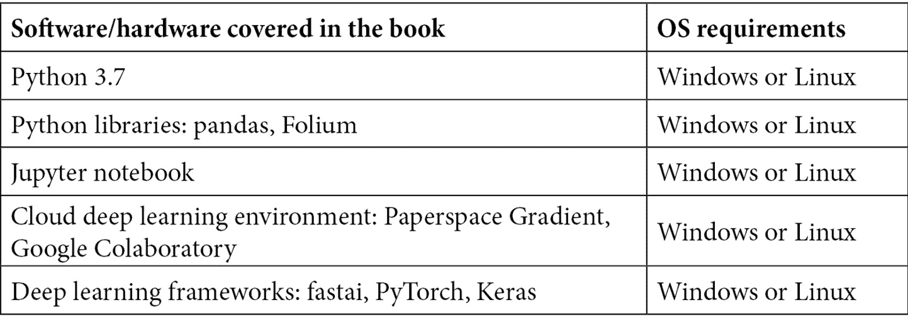

# 前言

fastai 是一个易于使用的深度学习框架，建立在 PyTorch 之上，可以让你通过少量的代码快速创建完整的深度学习解决方案。如今，主流的低级深度学习框架（TensorFlow 和 PyTorch）即使是处理简单应用，也需要编写大量代码。相反，fastai 为你处理了繁琐的细节，让你能够专注于将深度学习应用于实际问题的解决。

我们将首先总结 fastai 的价值，并展示一个简单的“hello world”深度学习应用。然后，我们将描述如何使用 fastai 处理框架明确支持的四个应用领域：表格数据、文本数据（NLP）、推荐系统和视觉数据。你将通过一系列实际示例来学习如何创建每种类型的真实应用。之后，你将学习如何部署 fastai 模型。例如，你将学会如何创建一个简单的 Web 应用，预测图像中展示的物体。最后，我们将总结 fastai 的高级功能概述。

在本书结束时，你将能够使用 fastai 创建自己的深度学习应用。你将了解如何使用 fastai 准备原始数据集、探索数据集、训练深度学习模型并部署训练好的模型。

# 适合读者

本书适合数据科学家、机器学习开发人员和深度学习爱好者，旨在通过基于实例的方法学习和探索 fastai 框架。强烈推荐具备 Python 编程语言的基本知识和机器学习基础，以便充分利用本书内容。

本书提供了如何使用 fastai 解决多种深度学习应用领域的实际示例，但并不是该平台的详尽参考。要获取关于 fastai 的全面细节，请参阅*第八章**，扩展的 fastai 和部署功能*部分。此部分指向其他 fastai 内容，包括 Jeremy Howard 及其团队基于 fastai 创建的优秀深度学习课程。

# 本书涵盖的内容

*第一章*，*快速入门 fastai*，教你如何为 fastai 设置环境，带你训练一个初始的*hello world* fastai 模型，解释 fastai 的四个关键应用领域（表格数据、文本数据、推荐系统和图像数据），并将 fastai 与另一个重要的高级深度学习框架 Keras 进行对比。

*第二章*，*使用 fastai 探索和清理数据*，描述了 fastai 开箱即用的各类数据集（**整理**数据集）；描述了如何检查表格、文本和图像数据集；并展示了如何使用 fastai 的工具清理数据集，例如，通过处理缺失值来清理数据。

*第三章*，*使用表格数据训练模型*，解释了如何创建基于表格数据集（即按行和列排列的数据集）训练的 fastai 深度学习模型。本章中的示例展示了如何在整理数据集和独立数据集上训练 fastai 模型。

*第四章*，*使用文本数据训练模型*，解释了如何创建基于文本数据集训练的 fastai 深度学习模型。本章中的示例展示了如何训练语言模型（即，给定一系列单词，预测下一个单词的模型），以及如何训练文本分类模型（即，预测例如某个评论是负面还是正面的模型）。本章涵盖了使用整理数据集和独立数据集训练的模型。

*第五章*，*训练推荐系统*，解释了如何使用 fastai 创建推荐系统，即例如预测某个读者是否会喜欢某本书，基于其他读者为该书提供的评分。本章涵盖了使用整理数据集和独立数据集训练的推荐系统。

*第六章*，*使用视觉数据训练模型*，解释了如何使用 fastai 创建基于图像数据集训练的深度学习模型。本章中的示例展示了如何为描述一个或多个对象的图像创建图像分类系统，训练数据包括经过整理的数据集和独立数据集。

*第七章*，*部署与模型维护*，解释了如何将训练好的 fastai 模型部署到一个简单的 Web 应用程序中。本章中的示例展示了如何部署基于表格和图像数据集训练的 fastai 深度学习模型。本章还介绍了如何在模型部署后进行维护。

*第八章*，*扩展 fastai 和部署特性*，解释了 fastai 的额外功能，包括对从*第三章* *使用表格数据训练模型*到*第六章* *使用视觉数据训练模型*中引入的模型进行的增强，以及对*第七章* *部署与模型维护*中介绍的部署技术的变体。

# 为了充分利用本书

为了充分利用本书，你应该对 Python 编程（在 Jupyter 笔记本和独立 Python 模块中）和机器学习的核心概念感到熟悉。本书解释了多种深度学习应用，但没有深入探讨深度学习的内部原理。如果你对深度学习的基本工作原理有所了解，你会发现书中的高级示例更容易理解。



本书中的大多数代码示例设计用于在支持 GPU 的云深度学习 Jupyter 笔记本环境中运行。你可以选择使用**Paperspace Gradient**或**Google Colab**来运行这些示例，推荐使用 Gradient 环境。第*7 章*《部署与模型维护》和第*8 章*《扩展 fastai 与部署功能》中的模型部署示例，设计用于在本地系统上运行，需要在本地安装 fastai 和 PyTorch。

**如果你使用的是本书的数字版，建议你自己输入代码，或者通过 GitHub 仓库访问代码（链接将在下一节提供）。这样做可以帮助你避免与复制和粘贴代码相关的潜在错误。**

# 下载示例代码文件

你可以从 GitHub 下载本书的示例代码文件，网址为[`github.com/PacktPublishing/Deep-Learning-with-fastai-Cookbook`](https://github.com/PacktPublishing/Deep-Learning-with-fastai-Cookbook)。如果代码有更新，它将在现有的 GitHub 仓库中进行更新。

我们还提供了其他的代码包，来自我们丰富的书籍和视频目录，网址：[`github.com/PacktPublishing/`](https://github.com/PacktPublishing/)。快去看看吧！

# 下载彩色图像

我们还提供了一个 PDF 文件，里面包含了本书中使用的截图/图表的彩色图像。你可以在这里下载：https://static.packt-cdn.com/downloads/9781800208100_ColorImages.pdf。

# 使用的约定

本书中使用了一些文本约定。

`文本中的代码`：表示文本中的代码词汇、数据库表名、文件夹名称、文件名、文件扩展名、路径名、虚拟 URL、用户输入和 Twitter 用户名。例如：“在浏览器中访问`localhost:5000`以显示`home.html`。”

代码块设置如下：

```py
for(var i = 0; i < relationship_list.length; i++) {
            var opt = relationship_list[i];
            select_relationship.innerHTML += "<option value=\"" + opt + "\">" + opt + "</option>";
```

任何命令行输入或输出均如下所示：

```py
cp -r deploy_image deploy_image_test
```

**粗体**：表示新术语、重要词汇或你在屏幕上看到的词汇。例如，菜单或对话框中的词汇在文本中会这样显示。以下是一个示例：“选择**选择文件**按钮以打开文件选择对话框。”

提示或重要说明

以这种方式呈现。

# 章节

本书中会有一些经常出现的标题（*准备工作、如何做…、它是如何工作的…、还有更多…*和另见）。

为了给出清晰的完成食谱的指导，请按如下方式使用这些部分：

# 准备工作

本节告诉你在食谱中可以期待什么，并描述了如何设置任何软件或进行任何准备工作。

# 如何做…

本节包含执行食谱所需的步骤。

# 它是如何工作的…

本节通常是对前一节发生的事情的详细解释。

# 还有更多…

本节包含有关食谱的附加信息，以帮助你更好地理解食谱。

# 另见

本节提供了与食谱相关的其他有用信息的链接。

# 联系我们

我们始终欢迎读者的反馈。

**一般反馈**：如果你对本书的任何方面有疑问，请在邮件的主题中提到书名，并通过[customercare@packtpub.com](https://customercare@packtpub.com)与我们联系。

**勘误**：尽管我们已尽一切努力确保内容的准确性，但错误还是难以避免。如果你在本书中发现了错误，我们将不胜感激你能向我们报告。请访问[www.packtpub.com/support/errata](https://www.packtpub.com/support/errata)，选择你的书籍，点击“勘误提交表格”链接并填写相关信息。

**盗版**：如果你在互联网上发现我们作品的任何非法副本，我们将不胜感激你能提供该副本的地址或网站名称。请通过[版权@packt.com](https://copyright@packt.com)联系我们，并提供材料的链接。

**如果你有兴趣成为作者**：如果你在某个领域具有专业知识，并且有兴趣撰写或为一本书做贡献，请访问[authors.packtpub.com](https://authors.packtpub.com)。

# 分享你的想法

阅读完*Deep Learning with fastai Cookbook*后，我们很想听听你的想法！请[点击这里直接进入亚马逊评论页面](https://packt.link/r/1-800-20810-3)，并分享你的反馈。

你的评论对我们以及技术社区至关重要，它将帮助我们确保提供优质的内容。
