# 第一章：*第一章*: 快速入门 fastai

在过去的十年里，深度学习彻底改变了众多技术领域，从图像识别到机器翻译。直到最近，只有那些经过广泛训练并拥有专门硬件的人才能解锁深度学习的好处。fastai 框架旨在通过使深度学习对非专业人士更易获取，来实现深度学习的普及化。fastai 使得深度学习能够面向大众的关键方式之一就是让入门变得简单。

在本章中，我们将向你展示开始使用 fastai 所需的内容，从如何设置 fastai 的环境开始。到本章结束时，你将能够做到以下几点：设置一个用于运行`fastai`示例的云环境；练习一个基础的 fastai 示例；解释 fastai 与 PyTorch（fastai 的底层深度学习库）之间的关系；并对比 fastai 与 Keras，这个另一个高层次的深度学习库。

本章将涵盖以下内容：

+   在 Paperspace Gradient 中设置 fastai 环境

+   在 Google Colaboratory（Google Colab）中设置 fastai 环境

+   在 Paperspace Gradient 中设置 JupyterLab 环境

+   fastai 的"Hello world"——为**修改版国家科学技术研究所**（**MNIST**）数据集创建一个模型

+   从四个应用领域了解世界：表格、文本、推荐系统和图像

+   使用 PyTorch 张量

+   对比 fastai 与 Keras

+   测试你的知识

# 技术要求

本章中，你将使用以下技术：

+   Paperspace Gradient: [`gradient.paperspace.com/`](https://gradient.paperspace.com/)

+   Google Colab: [`colab.research.google.com/notebooks/intro.ipynb`](https://colab.research.google.com/notebooks/intro.ipynb)

+   Google Drive: [`drive.google.com`](https://drive.google.com)

+   Keras: [`keras.io/`](https://keras.io/)

你可以在以下链接找到本章提到的代码：

[`github.com/PacktPublishing/Deep-Learning-with-fastai-Cookbook/tree/main/ch1`](https://github.com/PacktPublishing/Deep-Learning-with-fastai-Cookbook/tree/main/ch1)

# 在 Paperspace Gradient 中设置 fastai 环境

你可以使用两个免费的云环境来探索 fastai：**Paperspace Gradient**和**Google Colab**。在本节中，我们将介绍如何设置 Paperspace Gradient 与 fastai 笔记本环境，并在下一节中介绍 Colab 的设置步骤。这是你的选择，选择最适合你的环境。

Gradient 使用起来更简单，因为你可以访问一个标准的文件系统来进行存储。而在 Colab 中，你需要使用 Google Drive 来进行存储，并且与 Gradient 不同，你无法方便地访问终端来进行命令行交互。

另一方面，Colab 提供了比 fastai 更多的库，例如，你可以在 Colab 中运行 Keras MNIST 示例，但它无法直接在 Gradient fastai 实例中运行。为了充分利用本书中的示例，最好设置这两种环境，这样你可以根据需要选择最适合你的环境。我们将从 Gradient 开始，因为它是最容易入手的。

## 准备工作

在为 fastai 设置 Gradient 之前，你需要创建一个 Paperspace 账户。你可以通过访问 [`console.paperspace.com/signup?gradient=true`](https://console.paperspace.com/signup?gradient=true) 来完成注册。

## 如何操作…

一旦你有了 Paperspace 账户，就可以按照以下步骤在 Gradient 中创建一个免费的 fastai 笔记本。创建后，这将是一个完整的 Jupyter Notebook 环境，包含你需要的所有库（包括 fastai、PyTorch 及相关库）。

1.  访问 Paperspace 网站并使用在 *准备工作* 部分创建的账户登录。

1.  在页面顶部的下拉菜单中，选择 **Gradient**：

    图 1.1 – 从下拉菜单中选择 Gradient

1.  选择 **笔记本** 标签：

    图 1.2 – 选择笔记本标签

1.  选择 **创建** 按钮。

    图 1.3 – 创建按钮

1.  在 **名称** 字段中输入你的笔记本名称。

1.  在 **选择运行时** 部分，选择 **fastai**。

1.  在 **选择机器** 部分，选择 **Free-GPU** 或 **Free-P5000**。请注意，你可能会收到一条提示消息，说明你选择的机器类型超出了容量。如果发生这种情况，你可以选择另一个支持 GPU 的机器类型，或者稍等几分钟再试。如果你的笔记本已经创建完成，你还可以更改机器类型。例如，如果你发现免费的实例无法满足需求，可以将笔记本切换到付费机器。你还可以为不同的应用程序定义多个笔记本，并配置自动关机（即实例运行多少小时后自动关闭），如果你选择付费订阅。详细信息请参见 [`console.paperspace.com/teim6pi2i/upgrade`](https://console.paperspace.com/teim6pi2i/upgrade)。

1.  选择 **启动笔记本** 按钮，以在 Gradient 中为你创建一个新的 fastai 实例。

    图 1.4 – 启动笔记本按钮

1.  你的笔记本需要大约一分钟的时间来创建。当它准备好时，你会在屏幕底部看到 **正在运行** 消息：

    图 1.5 – 正在运行的消息

1.  接下来，你应该会在左侧的导航面板中看到一个 Jupyter 按钮，如 *图 1.6* 中所示：

    图 1.6 – 导航面板中的 Jupyter 图标

1.  选择 Jupyter 按钮以启动新的笔记本环境。你现在应该会看到 Jupyter 文件视图，如 *图 1.7* 所示：

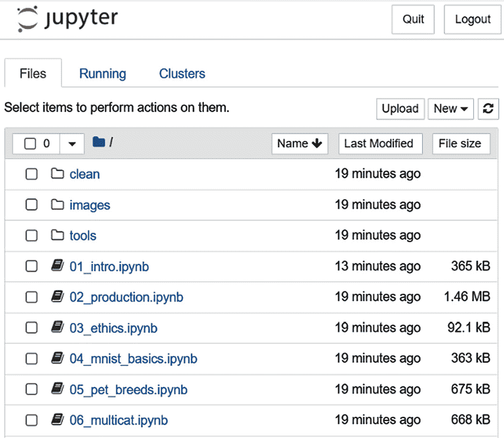

图 1.7 – Gradient 中的 Jupyter 文件视图

现在你的笔记本已经启动，你需要通过运行一个简短的笔记本来验证它是否正确设置。此笔记本将检查你的笔记本上可用的 fastai 版本，并确认笔记本是否能够访问 **图形处理单元**（**GPU**），这是后续示例高效运行所必需的专用硬件：

1.  在你的 Gradient 笔记本环境的根目录中打开终端：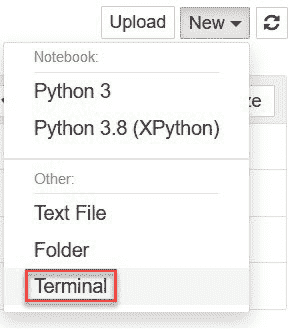

    图 1.8– 在 Jupyter 笔记本中下拉打开终端

1.  在终端中，在笔记本的根目录创建一个新目录 `fastai_cookbook`：

    ```py
    mkdir fastai_cookbook
    ```

1.  在终端中，将此新目录设置为当前目录：

    ```py
    cd fastai_cookbook
    ```

1.  在此新目录中初始化 `git`：

    ```py
    git init
    ```

1.  克隆本书的仓库：

    ```py
    git clone https://github.com/PacktPublishing/Deep-Learning-with-fastai-Cookbook.git
    ```

1.  一旦仓库被克隆，进入 `ch1` 目录并打开 `validate_gradient_setup.ipynb` 笔记本：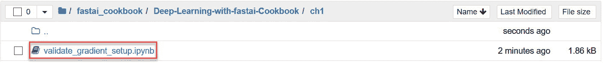

    图 1.9 – Files 视图中的 validate_gradient_setup.ipynb 笔记本

1.  运行整个笔记本（**单元格 -> 全部运行**）并检查输出。

1.  对于第一个代码单元，如果你的笔记本能访问 `fastai` 库，你应该会看到类似下面的输出。无需担心 fastai 的具体版本——关键是你能够导入该库并获得有效的版本，而不会出现错误：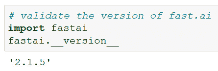

    图 1.10 – 获取 fastai 版本

1.  对于第二个代码单元，如果你的笔记本有访问 GPU 的权限，你应该会看到类似下面的表格。GPU 是一种专门用于深度学习的硬件，后续示例的高效运行将依赖于它。无需担心列出的具体 GPU 类型；只需确认输出中出现了类似的表格即可：

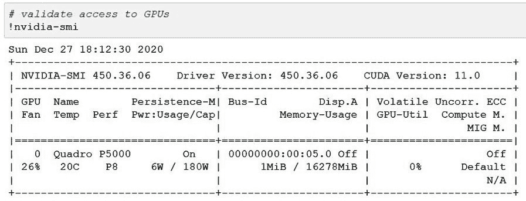

图 1.11 – nvidia-smi 命令的输出

如果你从此单元获得如下输出，则说明你的笔记本未正确设置以访问 GPU：

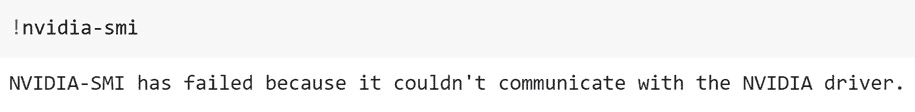

图 1.12 – 来自 nvidia-smi 命令的错误

恭喜！你已经设置好一个可以探索 fastai 的 Gradient 环境。

## 它是如何工作的…

现在你有了一个正常工作的 Gradient 实例，你将能够运行 fastai 示例。Gradient 包括 PyTorch、fastai 和其他运行本书示例所需的库，以及你需要的 GPU 硬件，能够高效地运行这些示例。

你需要注意的一些 Gradient 笔记本的方面列在这里：

+   默认情况下，你的免费实例将运行 6 小时后自动关闭。如果你想要更长时间、不间断的会话，你需要更改为付费订阅。

+   一般来说，重新启动一个 Gradient 实例需要大约 3 到 10 分钟，因此在你准备开始工作之前，最好提前几分钟进入 Paperspace 控制台的**Notebook**部分，然后点击**START**启动你的笔记本。我习惯先启动我的笔记本，然后去做其他事情（例如发邮件或泡一杯茶），这样就不会因为等待笔记本启动而浪费太多时间。

+   如果你对如何使用 Jupyter 笔记本有些生疏，[`www.dataquest.io/blog/jupyter-notebook-tutorial/`](https://www.dataquest.io/blog/jupyter-notebook-tutorial/)上的教程会很好地复习关键点。

## 还有更多……

如果你已经完成了本节中的所有步骤，并且拥有一个正常工作的 Gradient 环境，那么下一节不是必需的。我建议你同时设置 Gradient 和 Colab，但并不是必须同时拥有这两个环境才能完成本书中的大部分示例。不过，如果你想要两个环境的优点，你也可以为 fastai 设置 Colab——它也是免费的，而且相比 Gradient 有一些优势，比如支持 Keras 应用。

# 在 Google Colab 中设置 fastai 环境

如果你已经熟悉**Google Colab**环境，或者希望利用 Google 的整体机器学习生态系统，那么 Colab 可能是你用来探索 fastai 的合适环境。在本节中，我们将介绍如何设置 Colab 并验证它是否已准备好用于 fastai。

## 准备工作

要使用 Colab，你需要一个 Google ID 和访问 Google Drive 的权限。如果你还没有 Google ID，请按照这里的说明创建一个：[`support.google.com/accounts/answer/27441?hl=en`](https://support.google.com/accounts/answer/27441?hl=en)。

一旦你有了 Google ID，你需要确认你是否可以访问 Google Drive。你需要访问 Drive，因为它作为 Colab 的存储系统。当你在 Colab 中工作时，你会将笔记本和数据保存到 Drive 中。按照这里的说明获取 Drive 访问权限：[`support.google.com/drive/answer/2424384?co=GENIE.Platform%3DDesktop&hl=en`](https://support.google.com/drive/answer/2424384?co=GENIE.Platform%3DDesktop&hl=en)。

## 如何操作……

一旦你拥有一个可以访问 Drive 的 Google ID，就可以按照以下步骤设置 Colab 以与 fastai 一起使用。首先，我们将在 Colab 笔记本中获取 Drive 的访问权限，然后克隆本书的仓库，最后运行验证笔记本来确认设置是否成功。

1.  打开 Colab ([`colab.research.google.com/`](https://colab.research.google.com/))。

1.  通过选择**文件 -> 新建笔记本**，打开一个新的空白笔记本。

1.  在新的笔记本中，将以下语句粘贴到一个空白单元格中：

    ```py
    print("hello world")
    ```

    然后，选择**运行**按钮：

    

    图 1.13 – Colab 运行按钮

1.  确认你获得了预期的输出: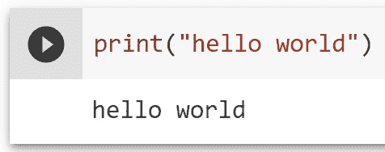

    图 1.14 – 在 Colab 中“hello world”预期输出

1.  转到 Drive 并在 Drive 的根文件夹中创建一个名为`fastai_cookbook`的新文件夹。

1.  进入这个新文件夹，右键点击，选择**Google Colaboratory**:

    图 1.15 – 在 Drive 中新目录中选择 Google Colaboratory

1.  Colab 将打开一个新的笔记本。在这个笔记本中，选择**连接** -> **连接到托管运行时**: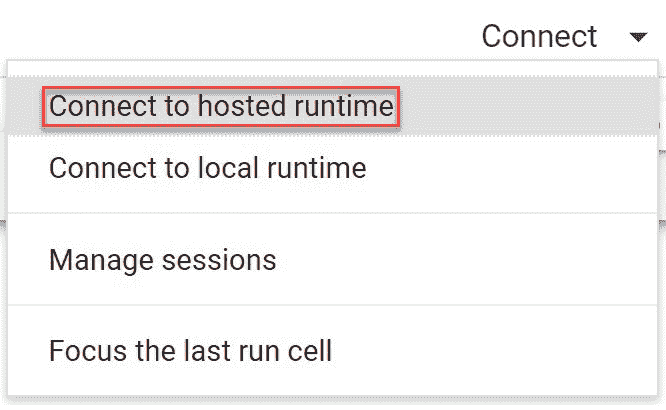

    图 1.16 – 选择连接到托管运行时

1.  在这个笔记本的一个新单元格中，粘贴以下代码并运行单元格（例如，点击箭头）：

    ```py
    from google.colab import drive
    drive.mount('/content/drive')
    ```

1.  在返回的响应中，点击提供的链接: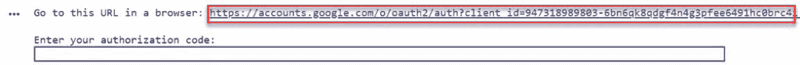

    图 1.17 – 提示在笔记本中挂载 Google Drive

1.  选择一个帐户:

    图 1.18 – 选择 Google 帐户的对话框

1.  在**Google Drive 文件流**访问屏幕上，选择**允许**:

    图 1.19 – Google Drive 文件流对话框

1.  在**登录**屏幕上，选择**复制**图标以复制你的访问代码:

    图 1.20 – 获取访问代码的对话框

1.  现在，返回 Colab 中的笔记本，并将访问代码粘贴到授权码字段中，然后按*Enter*键：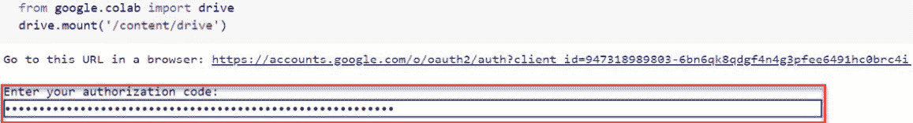

    图 1.21 – 输入访问代码以挂载 Google Drive

1.  该单元格将运行并产生以下挂载消息，以确认你的 Google Drive 已经挂载，并且可以在 Colab 笔记本中使用：

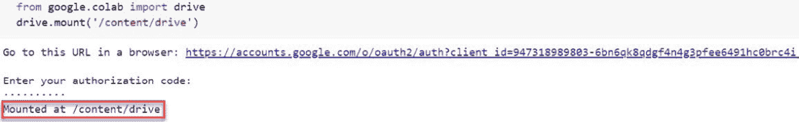

图 1.22 – 确认 Google Drive 已挂载的消息

现在 Drive 已在 Colab 中挂载，下一步是克隆本书的仓库：

1.  通过在笔记本中运行以下命令，将 `fastai_cookbook` 新的目录文件夹设为当前目录：

    ```py
    %cd /content/drive/MyDrive/fastai_cookbook
    ```

1.  在新单元中运行以下命令来列出此目录的内容：

    ```py
    %ls
    ```

1.  在笔记本的新单元中运行以下代码来克隆书本的仓库：

    ```py
    !git clone https://github.com/PacktPublishing/Deep-Learning-with-fastai-Cookbook.git 
    ```

1.  再次运行该单元来列出目录内容，你应该会看到现在为仓库创建的目录。你可以在 Drive 中确认仓库已被克隆。

现在你已经克隆了仓库，可以运行验证笔记本来确认你已能访问 `fastai` 库和 GPU：

1.  在 Drive 中，导航到 `fastai_cookbook/Deep-Learning-with-fastai-Cookbook/ch1` 文件夹，右键点击 `validate_gradient_setup.ipynb` 笔记本，并选择 **使用方式** | **Google Colaboratory**。

1.  笔记本在 Colab 中打开。选择 **运行时** | **更改运行时类型**。在弹出的 **笔记本设置** 对话框中，选择 **GPU** 作为 **硬件加速器**，然后点击 **保存**：

    图 1.23 – 在笔记本设置对话框中选择 GPU 作为硬件加速器

1.  选择 **运行时** | **全部运行** 来运行笔记本。

1.  确认你能像下面这样得到输出，没有错误，这是笔记本中的第一个代码单元的结果：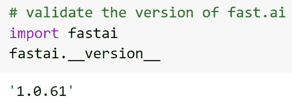

    图 1.24 – 确认 fastai 版本

1.  确认你能像下面这样得到输出，这是笔记本第二个代码单元的结果。不要担心列出的具体 GPU 类型——这会根据可用资源有所不同。如果你没有在 *步骤 2* 中指定 **GPU** 作为硬件加速器，那么你将不会得到这个输出：

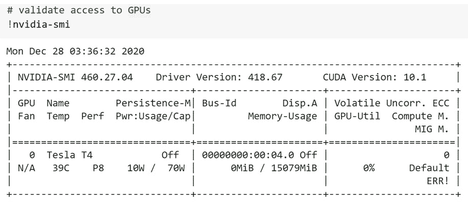

图 1.25 – nvidia-smi 输出确认访问 GPU

恭喜！你已设置好一个可以探索 fastai 的 Colab 环境。

## 它是如何工作的…

现在你已拥有一个可用的 Colab 环境，你将能够在其中运行 fastai 示例。Colab 集成了 PyTorch、fastai 以及其他运行书中示例所需的库。请注意，不同于 Gradient，每次启动新的 Colab 会话时，你都需要按照步骤挂载 Drive，并指定你需要 GPU。默认情况下，Drive 并未挂载，你的 Colab 笔记本在没有明确更改硬件加速器类型之前无法访问 GPU。

## 还有更多…

如果你同时设置了 Gradient 和 Colab 环境，我建议你默认使用 Gradient 来运行本书中的示例。Gradient 让你可以直接访问终端，这对于输入命令行命令非常方便，而且每次启动新会话时无需挂载文件系统或请求 GPU。虽然 Colab 有一些优势，比如 6 小时后不会自动关闭，但总体而言，你在 Gradient 上的体验会更流畅。

# 在 Gradient 中设置 JupyterLab 环境

本章之前我们已经介绍了设置 Gradient 作为 fastai 探索环境的步骤。通过这个设置，你将获得标准的 Jupyter notebook 环境，其中包括文件系统视图，并能够更新笔记本、启动终端窗口，以及执行基本操作，如上传和下载本地系统中的文件。如果你希望拥有更丰富的开发环境，可以设置 Gradient 使用 JupyterLab。

除了让你在同一个浏览器标签页内维护多个视图（例如，终端视图和多个笔记本视图）外，JupyterLab 还允许你在笔记本环境中利用可视化调试器。在本节中，我们将介绍设置 Gradient 以便你可以使用 JupyterLab 的步骤。请注意，这个步骤是可选的——本书中任何可以在 Gradient 上运行的 JupyterLab 示例，也可以在普通 Jupyter 上运行。

## 准备工作

在你尝试设置 Gradient 与 JupyterLab 配合使用之前，确保你已经成功完成了 *在 Paperspace Gradient 中设置 fastai 环境* 部分的步骤。一旦你设置好 JupyterLab Gradient，你就可以随时在普通 Jupyter 视图和 JupyterLab 视图之间切换。

## 如何操作……

要设置 JupyterLab 环境，首先启动你的 Gradient 实例，运行一个命令来安装 JupyterLab，然后重新启动实例查看效果。以下是执行此操作的步骤：

1.  启动你的 Gradient fastai 实例以打开普通 Jupyter **Files** 视图：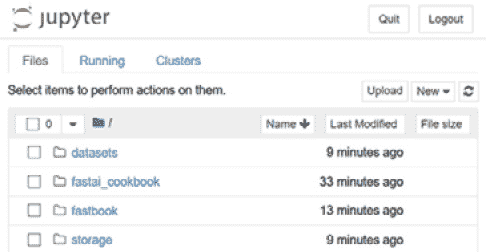

    图 1.26 – 普通 Jupyter 文件视图

1.  一旦你进入了实例的文件系统视图，选择 **New** | **Terminal**：

    图 1.27 – 下拉菜单打开 Jupyter 终端

1.  这将打开一个终端窗口：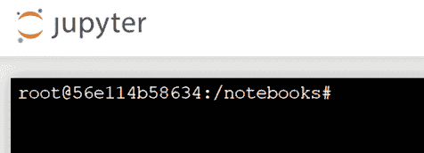

    图 1.28 – Jupyter 终端窗口

1.  在终端窗口中，输入以下命令安装 JupyterLab：

    ```py
    pip install jupyterlab
    ```

1.  安装完成后，退出 Jupyter，在 Paperspace 控制台中停止你的 Gradient 实例，然后重新启动它。

1.  当你在 URL 末尾看到带有 `lab` 的普通 Jupyter `tree` 时，按下 *Enter*。此时，你应该会看到 JupyterLab 视图，而不是普通 Jupyter 视图：

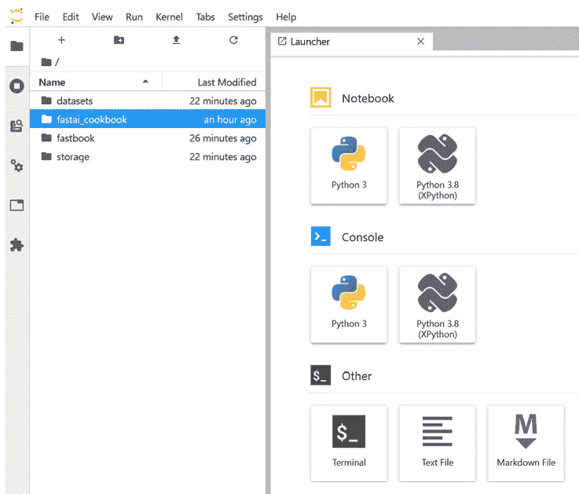

图 1.29 – Gradient 中的 JupyterLab 环境

恭喜！你已经成功设置 Gradient，以便使用 JupyterLab 视图。

## 它是如何工作的……

你可以随时在原生 Jupyter 视图和 JupyterLab 之间来回切换，只需修改 URL，使其末尾是 `tree`（表示 Jupyter）或 `lab`（表示 JupyterLab）。

## 还有更多……

如果你想了解更多 JupyterLab 的好处，这篇教程会解释其功能以及如何使用它们：[`dzone.com/articles/getting-started-with-jupyterlab`](https://dzone.com/articles/getting-started-with-jupyterlab)。

我之前提到过 JupyterLab 的一个好处是它支持可视化的 Python 调试器，你可以在笔记本中使用它。有关此调试器以及如何设置的更多详细信息，请参阅 `https://medium.com/@cristiansaavedra/visual-jupyter-debugger-for-python-e96fdd4f6f68` 和 [`blog.jupyter.org/a-visual-debugger-for-jupyter-914e61716559`](https://blog.jupyter.org/a-visual-debugger-for-jupyter-914e61716559)。

# "Hello world" for fastai – 为 MNIST 创建一个模型

现在你已经为 fastai 设置好了环境，接下来是运行一个示例。在这一节中，你将经历创建一个简单深度学习模型的过程，该模型在 MNIST 数据集上进行训练。这个数据集由手写数字的图像组成。训练后的模型目标是根据给定的图像预测数字。例如，我们希望训练的模型预测以下数字是 `6`、`3`、`9` 和 `6`：


图 1.30 – 来自 MNIST 数据集的手写数字样本

在这一节中，我们不会涵盖 fastai 解决方案的每个细节，但我们将运行一个完整的示例，展示 fastai 的一个关键优势——仅用几行代码就能获得强大的深度学习结果。这个示例也应该能激发你对接下来几章中更高级 fastai 示例的兴趣。

## 准备工作……

请确保你已经按照步骤在 Gradient 中设置好 fastai，并确认你可以在 `ch1` 目录下打开 `MNIST` 的 `hello_world` 笔记本（`mnist_hello_world.ipynb`）。如果你选择使用 Colab，请确保你选择了 **Runtime** | **Change runtime type**，并选择了 **GPU** 作为硬件加速器。

本节使用的数据集是深度学习经典数据集 MNIST（[`yann.lecun.com/exdb/mnist/`](http://yann.lecun.com/exdb/mnist/)）。我非常感谢能使用这个数据集来提供 fastai 功能的初步演示。

数据集引用

Y. LeCun, L. Bottou, Y. Bengio 和 P. Haffner。（1998）基于梯度的学习应用于文档识别（[`yann.lecun.com/exdb/publis/pdf/lecun-98.pdf`](http://yann.lecun.com/exdb/publis/pdf/lecun-98.pdf)）。IEEE 会议录，86(11)：2278-2324，1998 年 11 月

## 如何操作……

你将开始从头到尾运行整个笔记本。通过运行笔记本中的所有单元格，你将执行训练一个图像分类深度学习模型的代码，该模型预测给定手写数字图像属于哪个类别（即从 0 到 9 的哪个数字）。

首先，你将使 MNIST 数据集可用，该数据集包含一组按目录组织的手写数字图像（每个数字从 0 到 9 都有一个目录）。接下来，你将定义一个 `dataloaders` 对象，指定数据集的训练子集（即用于训练模型的图像）和验证子集（即用于评估模型训练过程中表现的图像）。接下来，你将使用 fastai 提供的预定义架构（即由多个层组成的模型组织方式）来定义深度学习模型本身。

接下来，你将训练模型，即迭代地应用训练集来更新模型中的权重，以优化模型在指定指标（在此模型中是准确率）上的表现。接下来，你将检查训练集和验证集中的图像批次。然后，你将查看模型分类表现最差的图像。最后，你将把训练好的深度学习模型应用于示例手写图像，看看模型是否能够预测这些图像的正确数字。接下来的步骤中，你将运行整个笔记本中的代码，然后逐个单元格查看代码的作用：

1.  打开 `ch1` 目录下的 MNIST `hello_world` 笔记本 `mnist_hello_world.ipynb`。

1.  选择适合你环境的选项来运行整个笔记本：

    a) **单元格**|**全部运行**（Jupyter）

    b) **运行**|**全部运行**（JupyterLab）

    c) **运行时**|**全部运行**（Colab）

1.  确认笔记本能够正确运行到最后。你应该看到最后一个单元格的以下输出。如果看到不同的数字输出也不用担心，只要在这个单元格没有错误输出即可：

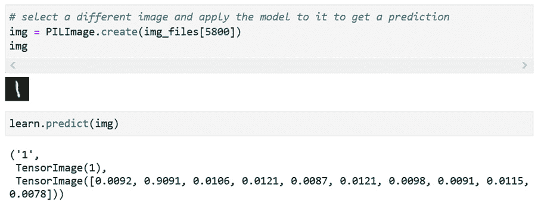

](img/B16216_01_31.jpg)

图 1.31 – 示例 MNIST 数字预测

恭喜！你刚刚成功地使用 fastai 训练了你的第一个深度学习模型，并使用训练好的模型预测 MNIST 数据集中的一组手写数字。接下来，我们将逐个单元格地回顾这个示例，了解它告诉我们关于 fastai 的信息：

1.  第一个代码单元格导入笔记本所需的库：

    ```py
    !pip install -Uqq fastbook
    import fastbook
    from fastbook import *
    from fastai.vision.all import *
    ```

1.  第二个单元格调用 `fastai` 函数，准备运行 fastai 应用程序的笔记本。在 Colab 中，举例来说，这个函数会触发挂载 Drive 的步骤，使得 Drive 在笔记本中可用：

    ```py
    fastbook.setup_book()
    ```

1.  第三个单元格定义了将用于训练模型的数据集的位置。fastai 提供了一组现成的数据集（包括多个版本的 MNIST 数据集），你可以通过一次调用 `untar_data()` 函数将其导入到你的笔记本中。我们将在*第二章*《使用 fastai 探索和清理数据》中详细讨论这些数据集：

    ```py
    path = untar_data(URLs.MNIST)
    ```

1.  第五个单元格是笔记本的核心，展示了 fastai 的强大功能。以下是三行代码，完全定义并训练了一个深度学习模型：

    a) 第一行代码从前一个单元格创建的 `path` 对象生成一个 `dataloaders` 对象，并识别包含训练和验证数据集的子目录。有关 `ImageDataLoaders` 的更多详细信息，请参见 fastai 文档（[`docs.fast.ai/vision.data.html#ImageDataLoaders`](https://docs.fast.ai/vision.data.html#ImageDataLoaders)），`dataloaders` 对象的具体类型，专门用于图像问题：

    ```py
    dls = ImageDataLoaders.from_folder(path, train='training', valid='testing')
    ```

    b) 第二行定义了深度学习模型的结构，包括其架构（基于著名的 `1` 轮（即，遍历整个训练集一次）和学习率将设置为 `0.1`）：

    ```py
    learn.fit_one_cycle(1, 0.1)
    ```

1.  这个单元格的输出显示了训练过程的结果，包括训练和验证损失、验证准确率以及完成训练所花费的时间。请注意，准确率非常高：

    图 1.32 – MNIST 模型训练输出

1.  接下来的两个单元格展示了训练和验证 **测试** 数据集的示例：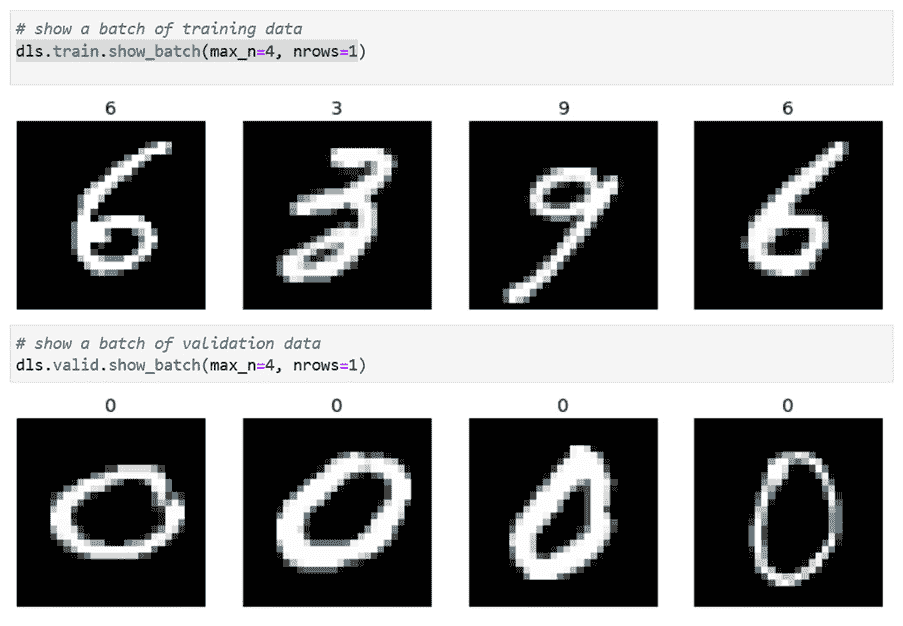

    图 1.33 – 来自 MNIST 训练和测试数据集的示例

1.  下一个单元格展示了模型预测错误最多的数字示例。注意，这些数字对于我们人类来说也不容易识别，所以模型预测错它们并不令人惊讶：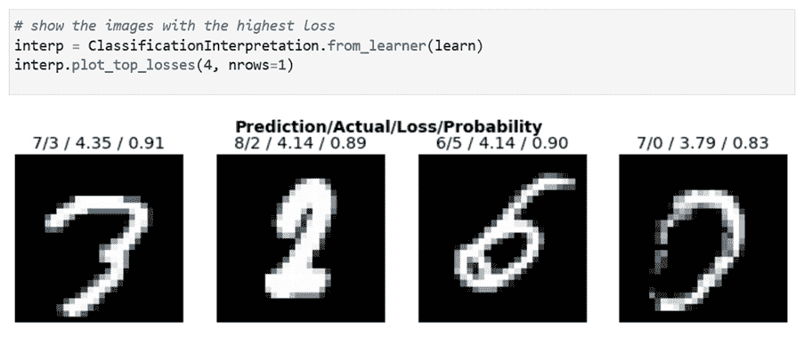

    图 1.34 – MNIST 模型最差预测的数字

1.  下一个单元格显示了关于模型的摘要信息，包括构成它的层、它的参数数量以及使用的优化器和损失函数：

    ```py
    learn.summary()
    ```

1.  最后，在笔记本的最后一组单元格中，显示来自验证集的数字图像，并应用训练好的模型对图像中的数字进行预测。在以下示例中，模型正确地从验证集中识别出零的图像为零：

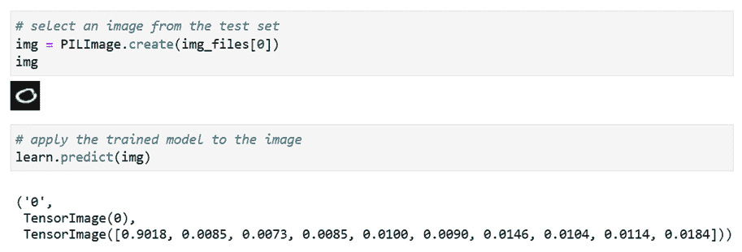

图 1.35 – MNIST 模型的预测示例

就这样——一个完整的、自包含的深度学习模型，成功解决了一个著名的计算机视觉问题（预测手写图像中的数字），并且具有惊人的准确性。使用 fastai，你只需几行代码就能完成这项工作。这个笔记本包含一些额外的代码来验证模型并调查数据集，但你真正需要的只有前五个单元格，这些单元格加起来不到 10 行代码。

## 它是如何工作的……

你可能会问自己关于我们刚才讲解的代码的细节。数据摄取是如何工作的？什么是 dataloader？模型是如何知道包含`summary()`函数显示的所有层的？我们将在后续章节中回答这些问题。在*第二章**，使用 fastai 探索和清理数据*中，我们将深入探讨 fastai 的数据摄取过程，在后续章节中，我们将详细介绍 fastai 为一系列常见深度学习应用提供的解决方案，包括表格数据、文本数据、推荐系统和计算机视觉。

fastai 的一个优点是，你可以抽象掉深度学习的大部分复杂性（如果你愿意的话），并且仅用几行代码就能得到一个有效且有用的模型，就像我们刚才看到的 MNIST 模型一样。然而，fastai 并没有隐藏这些细节，也没有限制你的灵活性。除了提供一种用非常少的代码创建深度学习模型的优雅方式，fastai 还包含了一套层，每一层都揭示了更多的灵活性和细节。这意味着，随着你对 fastai 了解的深入，你可以继续挖掘并自定义你的解决方案，以满足你的具体需求。

## 还有更多……

本节使用了一些标准的机器学习术语，包括**损失函数**、**优化器**、**准确率**和**多类分类**。如果你需要复习这些和其他基础机器学习概念，我推荐你参考这里的教程系列：[`machinelearningmastery.com/`](https://machinelearningmastery.com/)。这个网站包含了机器学习的主要概念的清晰描述，并且提供了 Python 代码示例，展示了如何应用这些概念。

# 通过四个应用理解世界：表格、文本、推荐系统和图像

在他们描述 fastai 的开创性论文中，Howard 和 Gugger（[`arxiv.org/pdf/2002.04688.pdf`](https://arxiv.org/pdf/2002.04688.pdf)）描述了 fastai 支持的四个应用领域，这些领域是*开箱即用*的。在本节中，我们将介绍 fastai 直接支持的这四个深度学习应用：表格数据、文本数据、推荐系统和计算机视觉。你在上一节看到的 MNIST 示例就是计算机视觉应用的一个例子。MNIST 示例包括以下内容：

+   精选数据集：MNIST。你可以在这里找到精选数据集的总体列表：

    [`course.fast.ai/datasets`](https://course.fast.ai/datasets)

+   通过`untar_data()`轻松加载精心整理的数据集

+   通过数据加载器对象对数据集进行图像特定处理

+   通过`Learner`对象定义图像特定模型结构

+   用于检查数据集的工具

同样，fastai 还提供了专门针对其他三个应用领域（表格数据、文本数据和推荐系统）的组件。在本节中，我们将逐一查看这些应用领域，并了解 fastai 如何为它们提供支持。

## 准备工作

保持你在上一节中完成的 MNIST 示例打开，因为我们将在回顾四个应用领域时引用它。在进入四个应用领域的描述之前，先定义一些术语：

+   `DataLoader`：一种结构，允许你访问批次的*x*（独立）值和*y*（依赖）值。*x*值是你用来训练模型的数据，而*y*值是你希望模型预测的内容。

+   `DataLoaders`：包含训练和验证`DataLoader`对象的结构。

+   `Learner`：一个结合了`DataLoaders`、架构和其他特征（包括损失函数和优化器）的对象，用来定义一个模型。为了与 Keras 中的模型进行对比，`Learner`对象完全包含了用于训练模型的数据，而在 Keras 模型中，数据集的各个方面（如训练中的独立值、依赖值等）是作为参数传递给模型，需要与模型本身分开处理。

## 如何实现…

让我们逐个回顾这四个应用领域，并检查 fastai 如何为它们提供支持。

1.  `AG_NEWS`（约 50 万篇分类新闻文章），以及`DBPedia`（来自知识库的训练/测试样本，[`wiki.dbpedia.org/about`](https://wiki.dbpedia.org/about)，包含来自 Wikimedia 项目的结构化内容），`YELP_REVIEWS`（约 150 万条 Yelp 评论及其相应的星级评分）

    b) 针对文本的`DataLoaders`对象：`TextDataLoaders` [`docs.fast.ai/text.data.html#TextDataLoaders`](https://docs.fast.ai/text.data.html#TextDataLoaders)

    c) 针对文本的学习器对象：`TextLearner` [`docs.fast.ai/text.learner.html#TextLearner`](https://docs.fast.ai/text.learner.html#TextLearner)

1.  `DataLoaders`对象：`TabularDataLoaders` [`docs.fast.ai/tabular.data.html#TabularDataLoaders`](https://docs.fast.ai/tabular.data.html#TabularDataLoaders)

    b) 针对表格数据的`Learner`对象：`TabularDataLearner` [`docs.fast.ai/tabular.learner.html#TabularLearner`](https://docs.fast.ai/tabular.learner.html#TabularLearner)

    c) 用于检查数据集的工具：`TabularPandas` [`docs.fast.ai/tabular.core.html#TabularPandas`](https://docs.fast.ai/tabular.core.html#TabularPandas)

1.  `ML_SAMPLE`和`ML_100k`（成千上万用户对成千上万电影的评分）

    b) 特定推荐系统的 `DataLoaders` 对象：`CollabDataLoaders` [`docs.fast.ai/collab.html#CollabDataLoaders`](https://docs.fast.ai/collab.html#CollabDataLoaders)

    c) 特定推荐系统的 `Learner` 对象：`collab_learner` [`docs.fast.ai/collab.html#Create-a-Learner`](https://docs.fast.ai/collab.html#Create-a-Learner)

1.  `BIWI_HEAD_POSE`（人物图像及其位置描述）、`PASCAL_2007` 和 `PASCAL_2012`（图像及每个图像的对应分割图）图像定位数据集

    b) 特定图像的 `DataLoaders` 对象：`ImageDataLoaders` [`docs.fast.ai/vision.data.html#ImageDataLoaders`](https://docs.fast.ai/vision.data.html#ImageDataLoaders)

    c) 特定图像的 `Learner` 对象：`cnn_learner` [`docs.fast.ai/vision.learner.html#cnn_learner`](https://docs.fast.ai/vision.learner.html#cnn_learner)

    d) 用于检查数据集的工具：许多便捷的函数，使得渲染单个图像和图像类别变得简单

## 它是如何工作的……

本节内容较多需要消化，但不用担心。fastai 的每个应用特定方面都有专门的章节，我们将详细介绍应用特定功能（数据集、`DataLoaders`、`Learners` 等）并展示如何利用这些功能为各个应用领域创建深度学习解决方案。需要注意的重要一点是，fastai 提供这些应用特定功能，旨在让你能够轻松创建涉及以下四个领域的应用：**表格数据**、**文本数据**、**推荐系统**和**计算机视觉**。

# 使用 PyTorch 张量

本书的大部分内容将重点讲解 fastai 框架提供的功能。然而，我们回顾的一些解决方案也会利用一些通用的 Python 库（例如用于表格数据的深度学习应用中的 `pandas` 库），以及 fastai 构建所基于的低级深度学习框架 PyTorch 的一些方面。为了让你初步了解 PyTorch，本节将介绍一些使用张量的基础示例，张量是 PyTorch 用于表示多维矩阵的结构。

## 准备工作

如果你已经熟悉 NumPy 数组，那么你会有一个很好的基础来理解 PyTorch 张量，因为张量在 PyTorch 中的作用与 NumPy 数组在通用 Python 应用中的作用类似。如果你不熟悉 NumPy 数组，或者有一段时间没有使用过它们，建议花点时间复习一下它们，比如通过阅读这个教程：[`numpy.org/doc/stable/user/quickstart.html`](https://numpy.org/doc/stable/user/quickstart.html)。

完成 NumPy 数组回顾后，确保你已经按照步骤在 Gradient 中设置 fastai，并确认你可以打开 `ch1` 目录中的 PyTorch 张量演练笔记本 (`pytorch_tensor_walkthrough.ipynb`)。如果你选择使用 Colab，确保你已经选择了**运行时** | **更改运行时类型**并选择了**GPU**作为硬件加速器。

## 如何操作……

在本节中，我们将介绍一些基本的 PyTorch 张量操作：

1.  打开 `ch1` 目录中的 `pytorch_tensor_walkthrough.ipynb` PyTorch 张量演练笔记本。

1.  运行笔记本中的前四个单元格，以导入所需的库并定义三个张量。

    a) 请注意，由于本笔记本只使用了 PyTorch，并不需要任何 fastai 库，因此我们只需要一个`import`语句：

    ```py
    import torch
    ```

    b) 定义`a`：一个二维的 5x7 张量，所有位置的值都是`1`：

    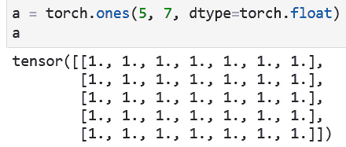

    图 1.36 – 定义一个 5x7 张量

    c) 定义`b`：一个二维的 5x7 张量，除对角线上的`1`外，其他位置都为`0`：

    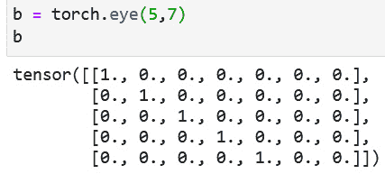

    图 1.37 – 定义一个对角线为 1 的 5x7 张量

    d) 定义`c`：一个二维的 5x5 单位张量：

    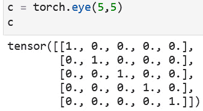

    图 1.38 – 定义一个 5x5 单位张量

1.  现在，运行张量`b`的`0`行单元格：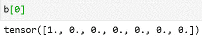

    图 1.39 – 张量 b 的第 0 行

    b) 获取`0`行的`0`元素：

    ![图 1.40 – 张量 b 的元素 [0,0]

    ](img/B16216_01_40.jpg)

    图 1.40 – 张量 b 的元素 [0,0]

    c) 获取从第 2 行开始到最后一行的所有行：

    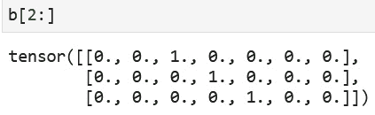

    图 1.41 – 张量 b 从某一行到最后一行

1.  运行 `a` 和 `b` 的单元格：

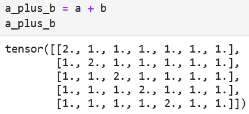

图 1.42 – 添加两个张量

b) 尝试将张量`a`和`c`相乘——请注意，你会遇到错误，因为这两个张量的维度不兼容。要乘以两个二维张量，第一个张量的第二维必须与第二个张量的第一维相同：

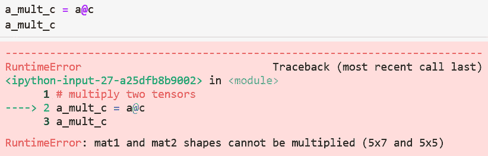

图 1.43 – 尝试乘以两个不兼容的张量会产生错误

c) 定义一个 7x7 单位张量：

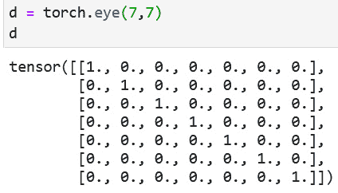

图 1.44 – 定义一个 7x7 单位张量

d) 现在，乘以张量`a`和`d`——这次没有错误，因为这两个张量的维度是兼容的：

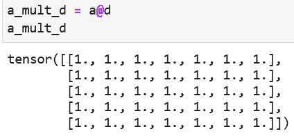

图 1.45 – 乘法运算两个兼容的张量

e) 创建一个新的张量，它是张量`a`的转置（即，张量`a`的列变为新张量的行）：

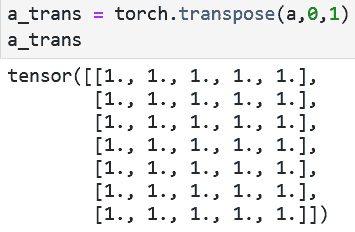

](img/B16216_01_46.jpg)

图 1.46 – 转置张量

f) 计算张量`a`的转置与张量`c`的乘积——尽管张量`a`与张量`c`相乘时会导致错误，但这次不会发生错误，因为张量的维度是兼容的：

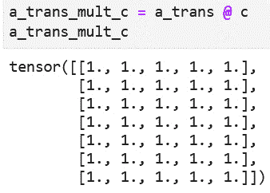

](img/B16216_01_47.jpg)

图 1.47 – 乘法两个兼容的张量

恭喜！你已经初步体验了 PyTorch，这也是 fastai 的底层框架。

## 如何运作…

在本节中，你了解了张量，PyTorch 的基本构建块之一。如果你熟悉 Keras 与 TensorFlow 之间的关系，可以将 fastai 与 PyTorch 之间的关系视为类似。就像 Keras 是 TensorFlow 的高级**应用程序编程接口**（**API**）一样，fastai 构建在 PyTorch 之上，并简化了 PyTorch 的一些复杂性（例如，通过对默认值做出合理的假设）。有了 fastai，你可以专注于创建深度学习应用，而无需担心所有细节。

## 还有更多内容…

如果你感到好奇并想了解 PyTorch 的概况，你可以查看这个入门教程：[`pytorch.org/tutorials/beginner/nlp/pytorch_tutorial.html`](https://pytorch.org/tutorials/beginner/nlp/pytorch_tutorial.html)。

# 对比 fastai 与 Keras

在本节中，我们将讨论 fastai 与 Keras 之间的一些相似性和差异。虽然这两个框架都提供了深度学习的高级 API，但在架构、解决问题的方法以及使用这两个框架的社区之间，它们存在一些显著的差异。通过对比这两个框架，你将能更清晰地了解 fastai 的优势，为后续章节中对 fastai 应用的详细探讨做好准备。

## 准备开始

如果你最近使用过 Keras，那么你将能很好地从这一节中受益。如果你以前没有使用过 Keras，或者已经有一段时间没用过了，我建议你快速浏览一下这个教程，这样你就可以重新了解 Keras：[`keras.io/getting_started/intro_to_keras_for_engineers/`](https://keras.io/getting_started/intro_to_keras_for_engineers/)。

## 如何操作…

在本节中，我们将把 Keras 处理 MNIST 问题的方法与我们在本章前面回顾过的 fastai MNIST 解决方案进行对比。你可以在仓库的`ch1`目录下的`keras_sequential_api_hello_world.ipynb`文件中查看 Keras 的方法。

请注意，默认情况下，你无法在 fastai 的 Gradient 实例中运行这个 Keras 笔记本，因为所需的 TensorFlow 和 Keras 库在该实例中并未安装。如果你已经设置好了 Colab，你可以在 Colab 中运行 Keras 的 MNIST 笔记本。

1.  比较库的`import`语句。两个 MNIST 示例需要的`import`语句数量相似：

    a) Keras：

    ```py
    import tensorflow as tf
    import pydotplus
    from tensorflow.keras.utils import plot_model
    ```

    b) fastai：

    ```py
    import fastbook
    from fastbook import *
    from fastai.vision.all import *
    ```

1.  比较数据集的设置和定义：

    a) Keras—MNIST 数据集在 Keras 中是*现成的*。Keras 提供了七个这样的数据集—详情请参见[`keras.io/api/datasets/`](https://keras.io/api/datasets/)。相比之下，fastai 提供了超过 25 个这样的数据集。详情请参见[`course.fast.ai/datasets`](https://course.fast.ai/datasets)：

    ```py
    mnist = tf.keras.datasets.mnist
    (x_train, y_train), (x_test, y_test) = mnist.load_data()
    x_train, x_test = x_train / 255.0, x_test / 255.0
    ```

    b) fastai—这需要一个 Keras 不需要的`setup`语句（尽管这个`setup`语句在使用 Colab 时可以节省 Drive 挂载过程中的一步），但只需要两条语句来定义数据集，而 Keras 则需要三条语句：

    ```py
    fastbook.setup_book()
    path = untar_data(URLs.MNIST)
    dls = ImageDataLoaders.from_folder(path, train='training', valid='testing')
    ```

1.  比较模型定义语句：

    a) Keras—模型中的每一层都需要明确列出：

    ```py
    # define layers for the hello world model
    hello_world_model = tf.keras.models.Sequential([ 
            tf.keras.layers.Flatten(input_shape=(28, 28)), 
            tf.keras.layers.Dense(128, activation='relu'), 
            tf.keras.layers.Dropout(0.15), 
            tf.keras.layers.Dense(10) 
    ])
    # compile the hello world model, including specifying the 
    loss # function, optimizer, and metrics
    hello_world_model.compile(optimizer='adam',                                                    
    sloss=tf.keras.losses.SparseCategoricalCrossentropy(from
    _logits=True), metrics=['accuracy'])
    ```

    b) fastai—一个语句定义整个模型。通过单一参数来指定架构（例如`resnet18`）使得模型定义更加简洁。需要注意的是，fastai 模型的架构与 Keras 模型的架构并不完全相同。例如，如果你将本笔记本中`learn.summary()`单元输出的层与 Keras 模型定义中的层进行比较，你会发现 fastai 模型比 Keras 模型有更多的层。总之，fastai 和 Keras 在 MNIST 问题上的解决方案并不是严格的*对等比较*：

    ```py
    learn = cnn_learner(dls, resnet18, pretrained=False,                                                                            
    sloss_func=LabelSmoothingCrossEntropy(), metrics=accuracy)
    ```

1.  比较`fit`语句：

    a) Keras：

    ```py
    history = hello_world_model.fit(x_train, y_train,
                                               batch_size=64,
                                               epochs=10,
                                               validation
    _split=0.15)
    ```

    b) fastai：

    ```py
    learn.fit_one_cycle(1, 0.1)
    ```

1.  比较 Keras 模型和 fastai 模型的性能。同样需要注意的是，由于模型之间存在差异（包括架构和拟合过程的细节），因此无法从两者在性能上的差异中得出一般性结论：

    a) Keras：

    ```py
    Loss for test dataset: 0.07588852692145155
    Accuracy for test dataset: 0.9775
    ```

    b) fastai：

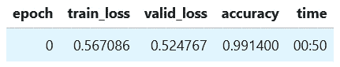

图 1.48 – 使用 fastai 训练 MNIST 模型的结果

现在，你已经快速比较了 fastai 和 Keras 在相同 MNIST 问题上的表现。

## 它是如何工作的……

这个 Keras 解决方案和 fastai 解决方案在 MNIST 问题上的对比告诉了我们什么？

+   Keras 提供的*现成*数据集远少于 fastai，而定义这些数据集的 fastai 语句更简单。这是 fastai 的一个关键优势，特别是对于初学者来说。拥有多种可以轻松获取的数据集，对于学习深度学习非常有帮助。得益于 fastai 提供的大量且多样化的*现成*数据集，fastai 在这方面表现非常出色。在下一章，我们将花一些时间更详细地了解这些数据集。

+   除了模型定义之外，在每个解决方案步骤中，Keras 和 fastai 之间的代码行数没有太大差别。这意味着对于 MNIST 问题，Keras 在提供一个完整解决方案时，并不比 fastai 的标准逊色多少，后者只需要几行代码。

+   在 Keras 中，模型定义更为复杂，主要是因为 fastai 允许我们通过一个单一的架构参数定义构成模型的各个层，而在 Keras 中我们必须显式地定义每一层。尽管模型定义的复杂性增加，但 Keras 的可读性较好。因为在 Keras 中，层是显式列出的。相比之下，在高级的 fastai API 中，层并没有列出。

+   fastai 提供的可用性优于 Keras，因为它使用户可以使用高级 fastai API，而不必担心所有显式的细节。

+   在 fastai 中，模型拟合的语句更简洁。此外，fastai 默认设置集成了最佳实践，这通常能带来更快的拟合时间和更好的性能。

Keras 由于显式列出了各个层，具有更高的透明性。而 fastai 则通过精心挑选的默认设置，提供了更好的可用性和开箱即用的性能。本书中我们不打算对 Keras 和 fastai 进行更多的比较，但根据我对 Keras 和 fastai 的使用经验，fastai 的优势在复杂应用中会更加突出。此外，fastai 还具有一个巨大的优势，那就是其拥有大量精心策划的*现成可用*数据集。

# 测试你的知识

现在你已经完成了本章的所有示例，接下来可以按照以下步骤来巩固你所学的知识：

1.  复制 `mnist_hello_world.ipynb` 笔记本，并将其命名为 `mnist_hello_world_variations.ipynb`。

1.  更新你新复制的笔记本，使其能够加载一种 MNIST 数据集的变体，称为 `MNIST_SAMPLE`。为了加载这个数据集，你需要更新哪个语句，而不是使用完整的 MNIST 精选数据集？

1.  使用 `path.ls()` 语句检查 `MNIST_SAMPLE` 数据集的目录结构。该语句的输出与完整 MNIST 数据集的输出有什么不同？

1.  记住 `MNIST_SAMPLE` 数据集的目录结构差异，更新以下语句中的 `train` 和 `valid` 参数值，以便它们能够与该数据集一起使用：

    ```py
    dls = ImageDataLoaders.from_folder(path, train='training', valid='testing')
    ```

1.  再次考虑目录结构的差异，更新以下语句，使其能够与 `MNIST_SAMPLE` 数据集一起使用：

    ```py
    img_files = get_image_files(path/"testing")
    ```

1.  `MNIST_SAMPLE` 数据集比完整的 MNIST 数据集要小。记住这一点，请更新以下语句，以便它们能够与较小的数据集一起使用：

    ```py
    img = PILImage.create(img_files[7000])
    img = PILImage.create(img_files[2030])
    img = PILImage.create(img_files[5800])
    ```

1.  现在你已经更新了笔记本，使其能够与 `MNIST_SAMPLE` 数据集一起使用，运行整个笔记本来确认它能够顺利运行到最后，不会出现错误。

恭喜！如果你已经完成这一部分，那么你就成功地将一个食谱调整为适应另一个精选数据集。
