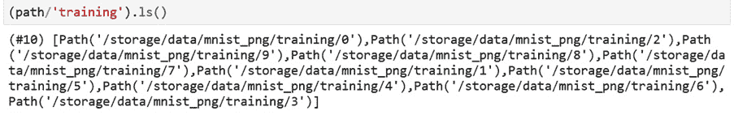

# 第二章：使用 fastai 探索和清理数据

在上一章中，我们通过设置 fastai 框架的编程环境，完成一个具体的应用示例（MNIST），并调查了与 fastai 关系不同的两个框架：PyTorch 和 Keras，成功入门 fastai。在本章中，我们将深入探讨 fastai 的一个重要方面：**获取**、**探索**和**清理数据**。特别地，我们将探索 fastai 管理的一些数据集。

到本章结束时，你将能够描述 fastai 支持的完整数据集，使用 fastai 提供的工具查看这些数据集，并清理数据集以去除缺失值和非数字值。

本章将介绍以下的食谱：

+   获取完整的 *即用型* fastai 数据集

+   使用 fastai 查看表格数据集

+   使用 fastai 查看文本数据集

+   使用 fastai 查看图像数据集

+   使用 fastai 清理原始数据集

# 技术要求

确保你已完成*第一章*《与 fastai 开始》中的设置部分，并且拥有一个有效的 Gradient 实例或 Colab 环境。确保你已克隆了这本书的代码库（[`github.com/PacktPublishing/Deep-Learning-with-fastai-Cookbook`](https://github.com/PacktPublishing/Deep-Learning-with-fastai-Cookbook)），并且可以访问 `ch2` 文件夹。此文件夹包含本章将描述的代码示例。

# 获取完整的即用型 fastai 数据集

在*第一章*《与 fastai 开始》中，你接触了 MNIST 数据集，并了解了如何轻松使该数据集可用于训练 fastai 深度学习模型。你能够训练该模型而不需要担心数据集的位置或结构（除了包含训练集和验证集的文件夹名称）。你还能够方便地查看数据集的元素。

在本节中，我们将更详细地了解 fastai 管理的完整数据集，并解释你如何获取关于这些数据集的更多信息。

## 准备工作

确保你已按照*第一章*《与 fastai 开始》中的步骤设置了 fastai 环境，并确认可以在克隆的代码库中的 `ch2` 目录下打开 `fastai_dataset_walkthrough.ipynb` 笔记本。

## 如何实现……

在本节中，你将通过运行 `fastai_dataset_walkthrough.ipynb` 笔记本以及 fastai 数据集文档，来了解 fastai 所管理的数据集。一旦你在 fastai 环境中打开了该笔记本，请按照以下步骤操作：

1.  运行笔记本中的前三个单元，加载所需的库，设置 fastai 环境，并定义 MNIST 数据集：

    图 2.1 – 加载库、设置笔记本环境并定义 MNIST 数据集的单元

1.  考虑 `untar_data` 函数的参数：`URLs.MINST`。这是什么？让我们尝试 `??` 快捷方式查看 `URLs` 对象的源代码：

    图 2.2 – `URLs` 的源代码

1.  通过查看 `URLs` 源代码中的 `image classification datasets` 部分，我们可以找到 `URLs.MNIST` 的定义：

    ```py
    MNIST           = f'{S3_IMAGE}mnist_png.tgz'
    ```

1.  通过逆向分析 `URLs` 类的源代码，我们可以得到 MNIST 的完整 URL：

    ```py
    S3_IMAGE     = f'{S3}imageclas/'
    S3  = 'https://s3.amazonaws.com/fast-ai-'
    ```

1.  综合来看，我们可以得到 `URLs.MNIST` 的 URL：

    ```py
    https://s3.amazonaws.com/fast-ai-imageclas/mnist_png.tgz
    ```

1.  你可以自己下载这个文件并解压。你会发现解压后的包的目录结构是这样的：

    ```py
    mnist_png
    ├── testing
    │   ├── 0
    │   ├── 1
    │   ├── 2
    │   ├── 3
    │   ├── 4
    │   ├── 5
    │   ├── 6
    │   ├── 7
    │   ├── 8
    │   └── 9
    └── training
         ├── 0
         ├── 1
         ├── 2
         ├── 3
         ├── 4
         ├── 5
         ├── 6
         ├── 7
         ├── 8
         └── 9
    ```

1.  在解压后的目录结构中，每个测试和训练目录下都有子目录，分别对应每个数字。这些数字目录包含该数字的图像文件。这意味着数据集的标签——我们希望模型预测的值——是通过图像文件所在的目录来编码的。

1.  是否有办法获取某个精心策划的数据集的目录结构，而无需从 `URLs` 的定义中确定其 URL、下载数据集并解压？有的 – 使用 `path.ls()`：

    图 2.3 – 使用 path.ls() 获取数据集的目录结构

1.  这告诉我们数据集包含两个子目录：`training` 和 `testing`。你可以调用 `ls()` 来获取 `training` 子目录的结构：

    图 2.4 – 训练子目录的结构

1.  现在我们已经学会如何使用 `ls()` 函数获取 MNIST 数据集的目录结构，那么我们还能从 `??URLs` 的输出中学到什么呢？

1.  首先，让我们按组查看 `??URLs` 输出中列出的其他数据集。首先，查看 `main datasets` 下列出的数据集。这个列表包括表格数据集（`ADULT_SAMPLE`）、文本数据集（`IMDB_SAMPLE`）、推荐系统数据集（`ML_SAMPLE`）以及各种图像数据集（`CIFAR`, `IMAGENETTE`, `COCO_SAMPLE`）：

    ```py
         ADULT_SAMPLE           = f'{URL}adult_sample.tgz'
         BIWI_SAMPLE            = f'{URL}biwi_sample.tgz'
         CIFAR                     = f'{URL}cifar10.tgz'
         COCO_SAMPLE            = f'{S3_COCO}coco_sample.tgz'
         COCO_TINY               = f'{S3_COCO}coco_tiny.tgz'
         HUMAN_NUMBERS         = f'{URL}human_numbers.tgz'
         IMDB                       = f'{S3_NLP}imdb.tgz'
         IMDB_SAMPLE            = f'{URL}imdb_sample.tgz'
         ML_SAMPLE               = f'{URL}movie_lens_sample.tgz'
         ML_100k                  = 'http://files.grouplens.org/datasets/movielens/ml-100k.zip'
         MNIST_SAMPLE           = f'{URL}mnist_sample.tgz'
         MNIST_TINY              = f'{URL}mnist_tiny.tgz'
         MNIST_VAR_SIZE_TINY = f'{S3_IMAGE}mnist_var_size_tiny.tgz'
         PLANET_SAMPLE         = f'{URL}planet_sample.tgz'
         PLANET_TINY            = f'{URL}planet_tiny.tgz'
         IMAGENETTE              = f'{S3_IMAGE}imagenette2.tgz'
         IMAGENETTE_160        = f'{S3_IMAGE}imagenette2-160.tgz'
         IMAGENETTE_320        = f'{S3_IMAGE}imagenette2-320.tgz'
         IMAGEWOOF               = f'{S3_IMAGE}imagewoof2.tgz'
         IMAGEWOOF_160         = f'{S3_IMAGE}imagewoof2-160.tgz'
         IMAGEWOOF_320         = f'{S3_IMAGE}imagewoof2-320.tgz'
         IMAGEWANG               = f'{S3_IMAGE}imagewang.tgz'
         IMAGEWANG_160         = f'{S3_IMAGE}imagewang-160.tgz'
         IMAGEWANG_320         = f'{S3_IMAGE}imagewang-320.tgz'
    ```

1.  接下来，让我们看看其他类别的数据集：图像分类数据集、自然语言处理数据集、图像定位数据集、音频分类数据集和医学图像分类数据集。请注意，精心策划的数据集列表中包括一些与 fastai 支持的四个主要应用领域无关的数据集。例如，音频数据集应用于四个主要应用领域以外的使用场景：

    ```py
         # image classification datasets
         CALTECH_101  = f'{S3_IMAGE}caltech_101.tgz'
         CARS            = f'{S3_IMAGE}stanford-cars.tgz'
         CIFAR_100     = f'{S3_IMAGE}cifar100.tgz'
         CUB_200_2011 = f'{S3_IMAGE}CUB_200_2011.tgz'
         FLOWERS        = f'{S3_IMAGE}oxford-102-flowers.tgz'
         FOOD            = f'{S3_IMAGE}food-101.tgz'
         MNIST           = f'{S3_IMAGE}mnist_png.tgz'
         PETS            = f'{S3_IMAGE}oxford-iiit-pet.tgz'
         # NLP datasets
         AG_NEWS                        = f'{S3_NLP}ag_news_csv.tgz'
         AMAZON_REVIEWS              = f'{S3_NLP}amazon_review_full_csv.tgz'
         AMAZON_REVIEWS_POLARITY = f'{S3_NLP}amazon_review_polarity_csv.tgz'
         DBPEDIA                        = f'{S3_NLP}dbpedia_csv.tgz'
         MT_ENG_FRA                    = f'{S3_NLP}giga-fren.tgz'
         SOGOU_NEWS                    = f'{S3_NLP}sogou_news_csv.tgz'
         WIKITEXT                       = f'{S3_NLP}wikitext-103.tgz'
         WIKITEXT_TINY               = f'{S3_NLP}wikitext-2.tgz'
         YAHOO_ANSWERS               = f'{S3_NLP}yahoo_answers_csv.tgz'
         YELP_REVIEWS                 = f'{S3_NLP}yelp_review_full_csv.tgz'
         YELP_REVIEWS_POLARITY   = f'{S3_NLP}yelp_review_polarity_csv.tgz'
         # Image localization datasets
         BIWI_HEAD_POSE      = f"{S3_IMAGELOC}biwi_head_pose.tgz"
         CAMVID                  = f'{S3_IMAGELOC}camvid.tgz'
         CAMVID_TINY           = f'{URL}camvid_tiny.tgz'
         LSUN_BEDROOMS        = f'{S3_IMAGE}bedroom.tgz'
         PASCAL_2007           = f'{S3_IMAGELOC}pascal_2007.tgz'
         PASCAL_2012           = f'{S3_IMAGELOC}pascal_2012.tgz'
         # Audio classification datasets
         MACAQUES               = 'https://storage.googleapis.com/ml-animal-sounds-datasets/macaques.zip'
         ZEBRA_FINCH           = 'https://storage.googleapis.com/ml-animal-sounds-datasets/zebra_finch.zip'
         # Medical Imaging datasets
         SIIM_SMALL            = f'{S3_IMAGELOC}siim_small.tgz'
    ```

1.  现在我们已经列出了`URLs`中定义的所有数据集，我们如何了解更多信息呢？

    a) fastai 文档（[`course.fast.ai/datasets`](https://course.fast.ai/datasets)）记录了`URLs`中列出的一些数据集。请注意，这些文档与`URLs`源中的内容不完全一致。例如，数据集的命名不统一，且文档页面未涵盖所有数据集。如有疑问，请将`URLs`源视为你了解 fastai 策划数据集的唯一可信来源。

    b) 使用`path.ls()`函数来检查目录结构，如下例所示，它列出了 MNIST 数据集`training`子目录下的目录：

    

    ```py
    path = untar_data(URLs.PETS)
    ```

    e) 在这里，你可以找到`storage/data/oxford-iiit-pet`中的数据集，并查看目录结构：

    ```py
    oxford-iiit-pet
    ├── annotations
    │   ├── trimaps
    │   └── xmls
    └── images
    ```

1.  如果你想查看笔记本中某个函数的定义，可以运行一个包含`??`的单元格，后跟函数名。例如，要查看`ls()`函数的定义，你可以使用`??Path.ls`：

    图 2.6 – Path.ls()的来源

1.  若要查看任何函数的文档，你可以使用`doc()`函数。例如，`doc(Path.ls)`的输出会显示该函数的签名，并提供指向源代码（[`github.com/fastai/fastcore/blob/master/fastcore/xtras.py#L111`](https://github.com/fastai/fastcore/blob/master/fastcore/xtras.py#L111)）和文档（[`fastcore.fast.ai/xtras#Path.ls`](https://fastcore.fast.ai/xtras#Path.ls)）的链接：


图 2.7 – doc(Path.ls)的输出

你现在已经浏览了 fastai 策划的即用型数据集列表。你还学会了如何获取这些数据集的目录结构，以及如何从笔记本中检查函数的源代码和文档。

## 它是如何工作的…

正如你在本节中看到的，fastai 为每个策划的数据集在`URLs`类中定义了相应的链接。当你用某个策划数据集作为参数调用`untar_data`时，如果该数据集的文件尚未被复制，这些文件会被下载到你的文件系统中（在 Gradient 实例中是`storage/data`）。你从`untar_data`获取的对象允许你查看数据集的目录结构，然后将其传递到创建 fastai 深度学习模型的下一阶段。通过这种便捷的方式包装大量有趣的数据集，fastai 使得你可以轻松地用这些数据集创建深度学习模型，并且可以将精力集中在创建和改进深度学习模型上，而不是在处理数据集导入的细节。

## 还有更多内容…

你可能会问，为什么我们要费力检查 `URLs` 类的源代码以获取有关精心策划数据集的详细信息。毕竟，这些数据集在 [`course.fast.ai/datasets`](https://course.fast.ai/datasets) 上有文档说明。问题是，这个文档页面没有提供所有精心策划数据集的完整列表，也没有清楚地解释你需要了解什么，以便为特定的精心策划数据集做出正确的 `untar_data` 调用。精心策划数据集的不完整文档展示了 fastai 的一个弱点——*文档不一致*。有时，文档是完整的，但有时也缺少细节，因此你需要直接查看源代码来弄清楚发生了什么，就像我们在这一节中为精心策划数据集所做的那样。这个问题还被 Google 搜索的结果所加剧，因为它返回的是早期版本 fastai 的文档。如果你正在搜索有关 fastai 的一些细节，避免进入 fastai 版本 1 的文档页面（[`fastai1.fast.ai/`](https://fastai1.fast.ai/)），并始终参考当前版本 fastai 的文档：[`docs.fast.ai/`](https://docs.fast.ai/)。

# 使用 fastai 检查表格数据集

在上一节中，我们查看了 fastai 精心策划的所有数据集。在本节中，我们将深入分析精心策划数据集中一个表格数据集。我们将加载数据集，查看一些示例记录，然后探索数据集的特征，包括记录数和每列的唯一值数量。

## 准备工作

确保你已按照 *第一章* 的步骤，*开始使用 fastai*，并已设置好 fastai 环境。确认你能够在你的仓库的 `ch2` 目录中打开 `examining_tabular_datasets.ipynb` 笔记本。

我很感激有机会在本节中包含 *ADULT_SAMPLE* 数据集。

数据集引用

Ron Kohavi. (1996) *提升朴素贝叶斯分类器的准确性：决策树混合模型* ([`robotics.stanford.edu/~ronnyk/nbtree.pdf`](http://robotics.stanford.edu/~ronnyk/nbtree.pdf))。

## 如何操作……

在本节中，你将运行 `examining_tabular_datasets.ipynb` 笔记本来检查 `ADULT_SAMPLE` 数据集。

打开 fastai 环境中的笔记本后，完成以下步骤：

1.  运行前两个单元格，导入必要的库并为 fastai 设置笔记本环境。

1.  运行以下单元格，将数据集复制到你的文件系统中（如果尚未复制），并定义数据集的路径：

    ```py
    path = untar_data(URLs.ADULT_SAMPLE)
    ```

1.  运行以下单元格，以获取 `path.ls()` 的输出，查看数据集的目录结构：

    图 2.8 – `path.ls()` 的输出

1.  数据集位于 `adult.csv` 文件中。运行以下单元格，将此 CSV 文件加载到 pandas DataFrame 中：

    ```py
    df = pd.read_csv(path/'adult.csv')
    ```

1.  运行`head()`命令以获取数据集开头的记录样本：

    图 2.9 - 数据集开头的记录样本

1.  运行以下命令以获取数据集中的记录数（行数）和字段数（列数）：

    ```py
    df.shape
    ```

1.  运行以下命令以获取数据集中每一列的唯一值数量。你能从输出中看出哪些列是类别型的吗？

    ```py
    df.nunique()
    ```

1.  运行以下命令以获取数据集中每一列的缺失值数量。哪些列有缺失值？

    ```py
    df.isnull().sum()
    ```

1.  运行以下命令以显示数据集中年龄小于或等于 40 岁的人的部分样本记录：

    ```py
    df_young = df[df.age <= 40]
    df_young.head()
    ```

恭喜！你已经摄取了 fastai 精心策划的表格数据集，并对数据集进行了基本的检查。

## 它是如何工作的……

你在本节中探索的数据集`ADULT_SAMPLE`，是你在前一节中看到的源中`URLs`部分列出的数据集之一。请注意，虽然`URLs`源识别了哪些数据集与图像或 NLP（文本）应用相关，但它没有明确指出哪些是表格数据集或推荐系统数据集。`ADULT_SAMPLE`是`main datasets`下列出的数据集之一：


图 2.10 - 来自 URLs 源的主要数据集

我是如何确定`ADULT_SAMPLE`是一个表格数据集的呢？首先，Howard 和 Gugger 的论文（[`arxiv.org/pdf/2002.04688.pdf`](https://arxiv.org/pdf/2002.04688.pdf)）将`ADULT_SAMPLE`标识为一个表格数据集。其次，我只需要摄取它并试一试，确认它能被摄取到 pandas DataFrame 中。

## 还有更多……

对于源中没有明确分类为`URLs`的其他精心策划的数据集怎么办？以下是源中`URLs`下`main datasets`部分列出的数据集总结：

+   表格数据：

    a) `ADULT_SAMPLE`

+   自然语言处理（文本）：

    a) `HUMAN_NUMBERS  `

    b) `IMDB`

    c) `IMDB_SAMPLE      `

+   协同过滤：

    a) `ML_SAMPLE               `

    b) `ML_100k                              `

+   图像数据：

    a) `URLs`中`main datasets`下列出的所有其他数据集。

# 使用 fastai 检查文本数据集

在前一节中，我们看了如何摄取一个精心策划的表格数据集。在本节中，我们将深入探讨来自精心策划列表的文本数据集。

## 准备工作

确保你已经按照*第一章*中的步骤，*快速入门 fastai*，设置了 fastai 环境。确认你能在仓库的`ch2`目录中打开`examining_text_datasets.ipynb`笔记本。

我非常感激有机会使用本节中提到的 WIKITEXT_TINY 数据集（[`blog.einstein.ai/the-wikitext-long-term-dependency-language-modeling-dataset/`](https://blog.einstein.ai/the-wikitext-long-term-dependency-language-modeling-dataset/)）。

数据集引用

Stephen Merity, Caiming Xiong, James Bradbury, Richard Socher. (2016). *指针信号量混合模型* ([`arxiv.org/pdf/1609.07843.pdf`](https://arxiv.org/pdf/1609.07843.pdf))。

## 如何做...

在本节中，你将运行`examining_text_datasets.ipynb`笔记本，检查`WIKITEXT_TINY`数据集。顾名思义，这是一个从优秀的维基百科文章中提取的小型文本数据集。

一旦你在 fastai 环境中打开了这个笔记本，完成以下步骤：

1.  运行前两个单元格来导入必要的库，并为 fastai 设置笔记本环境。

1.  运行以下代码将数据集复制到你的文件系统中（如果它还没有在那里），并定义数据集的路径：

    ```py
    path = untar_data(URLs.WIKITEXT_TINY)
    ```

1.  运行以下代码获取`path.ls()`的输出，以便检查数据集的目录结构：

    图 2.11 – path.ls()的输出

1.  这个数据集由两个 CSV 文件组成。让我们将它们分别导入到 pandas 的 DataFrame 中，首先导入`train.csv`：

    ```py
    df_train = pd.read_csv(path/'train.csv')
    ```

1.  当你使用`head()`检查 DataFrame 时，你会发现有些问题——CSV 文件没有列名的标题行，但默认情况下，`read_csv`会假设第一行是标题，所以第一行会被误解为标题。如以下截图所示，输出的第一行是粗体的，这表示第一行被解释为标题，尽管它实际上是普通的数据行：

    图 2.12 – df_train 中的第一条记录

1.  为了解决这个问题，重新运行`read_csv`函数，但这次使用`header=None`参数，指定 CSV 文件没有标题行：

    ```py
    df_train = pd.read_csv(path/'train.csv',header=None)
    ```

1.  再次检查`head()`，确认问题已解决：

    图 2.13 – 修正 df_train 中的第一条记录

1.  使用`header=None`参数将`test.csv`导入 DataFrame：

    ```py
    df_test = pd.read_csv(path/'test.csv',header=None)
    ```

1.  我们希望对数据集进行分词，并将其转换为单词列表。由于我们希望为整个数据集提供一个通用的词汇集，我们将从合并测试集和训练集的 DataFrame 开始：

    ```py
    df_combined = pd.concat([df_train,df_test])
    ```

1.  确认训练集、测试集和合并数据集的形状——合并后的 DataFrame 行数应该是训练集和测试集 DataFrame 行数的总和：

    ```py
    print("df_train: ",df_train.shape)
    print("df_test: ",df_test.shape)
    print("df_combined: ",df_combined.shape)
    ```

1.  现在，我们准备对 DataFrame 进行标记。`tokenize_df()`函数将包含我们要标记文本的列的列表作为参数。由于 DataFrame 的列没有标签，我们需要通过列的位置而不是列名来引用我们想要标记的列：

    ```py
    df_tok, count = tokenize_df(df_combined,[df_combined.columns[0]])
    ```

1.  检查`df_tok`的前几条记录，这是包含组合 DataFrame 标记内容的新 DataFrame：

    图 2.14 – `df_tok`的前几条记录

1.  检查一些示例单词的数量，确保它们大致符合预期。选择一个非常常见的单词、一个中等常见的单词和一个罕见的单词：

    ```py
    print("very common word (count['the']):", count['the'])
    print("moderately common word (count['prepared']):", count['prepared'])
    print("rare word (count['gaga']):", count['gaga'])
    ```

恭喜！您已成功加载、探索并标记了一个精选的文本数据集。

## 它是如何工作的…

您在本节中探索的数据集`WIKITEXT_TINY`是您在*获取完整的即用型 fastai 数据集*一节中看到的`URLs`来源中的数据集之一。在这里，您可以看到`WIKITEXT_TINY`位于`URLs`来源中的 NLP 数据集部分：


图 2.15 – `WIKITEXT_TINY`在`URLs`来源中的 NLP 数据集列表中

# 使用 fastai 检查图像数据集

在过去的两个部分中，我们检查了表格数据和文本数据，并了解了 fastai 提供的访问和探索这些数据集的功能。在本部分中，我们将查看图像数据。我们将查看两个数据集：`FLOWERS`图像分类数据集和`BIWI_HEAD_POSE`图像定位数据集。

## 准备就绪

确保您已经按照*第一章*，“*快速入门 fastai*”部分中的步骤设置好 fastai 环境。确认您可以在代码库的`ch2`目录中打开`examining_image_datasets.ipynb`笔记本。

我很感激有机会使用本节中展示的 FLOWERS 数据集。

数据集引用

Maria-Elena Nilsback, Andrew Zisserman. (2008). *自动化花卉分类（跨多个类别）* ([`www.robots.ox.ac.uk/~vgg/publications/papers/nilsback08.pdf`](https://www.robots.ox.ac.uk/~vgg/publications/papers/nilsback08.pdf))。

我很感激有机会使用本节中展示的 BIWI_HEAD_POSE 数据集。

数据集引用

Gabriele Fanelli, Thibaut Weise, Juergen Gall, Luc Van Gool. (2011). *来自消费者深度相机的实时头部姿态估计* ([`link.springer.com/chapter/10.1007/978-3-642-23123-0_11`](https://link.springer.com/chapter/10.1007/978-3-642-23123-0_11))。计算机科学讲义，卷 6835，Springer，柏林，海德堡 [`doi.org/10.1007/978-3-642-23123-0_11`](https://doi.org/10.1007/978-3-642-23123-0_11)。

## 如何操作…

在本节中，您将运行`examining_image_datasets.ipynb`笔记本，以检查`FLOWERS`和`BIWI_HEAD_POSE`数据集。

一旦您在 fastai 环境中打开笔记本，完成以下步骤：

1.  运行前两个单元以导入必要的库并为 fastai 设置笔记本环境。

1.  运行以下单元以将`FLOWERS`数据集复制到您的文件系统中（如果还没有的话），并为该数据集定义路径：

    ```py
    path = untar_data(URLs.FLOWERS)
    ```

1.  运行以下单元来获取`path.ls()`的输出，以便您可以检查数据集的目录结构：

    图 2.16 – `path.ls()`的输出

1.  查看`valid.txt`文件的内容。这表明`train.txt`、`valid.txt`和`test.txt`包含属于这些数据集的图像文件列表：

    图 2.17 – `valid.txt`文件的前几个记录

1.  查看`jgp`子目录：

    ```py
    (path/'jpg').ls()
    ```

1.  查看其中一个图像文件。请注意，`get_image_files()`函数不需要指向特定的子目录，它会递归地收集目录及其子目录中的所有图像文件：

    ```py
    img_files = get_image_files(path)
    img = PILImage.create(img_files[100])
    img
    ```

1.  您应该注意到，在上一步中显示的图像是图像的原始尺寸，这使得它对笔记本来说相当大。为了获取更合适大小的图像，可以应用`to_thumb`函数，并将图像的尺寸作为参数指定。请注意，当您运行此单元时，您可能会看到不同的图像：

    图 2.18 – 对图像应用 to_thumb

1.  现在，导入`BIWI_HEAD_POSE`数据集：

    ```py
    path = untar_data(URLs.BIWI_HEAD_POSE)
    ```

1.  查看此数据集的路径：

    ```py
    path.ls()
    ```

1.  查看`05`子目录：

    ```py
    (path/"05").ls()
    ```

1.  查看其中一张图像。请注意，您可能会看到不同的图像：

    图 2.19 – `BIWI_HEAD_POSE`数据集中的一张图像

1.  除了图像文件，此数据集还包括编码图像中所示姿势的文本文件。将其中一个文本文件导入到 pandas DataFrame 中并显示：


图 2.20 – 其中一个位置文本文件的前几个记录

在本节中，您学习了如何导入两种不同类型的图像数据集，探索它们的目录结构，并检查数据集中的图像。

## 它是如何工作的…

你使用了相同的 `untar_data()` 函数来加载精心策划的表格、文本和图像数据集，并使用相同的 `ls()` 函数检查所有不同类型数据集的目录结构。除了这些通用功能，fastai 还提供了额外的便捷函数来检查图像数据：`get_image_files()` 用于收集从指定目录开始的目录树中所有的图像文件，`to_thumb()` 用于以适合笔记本的尺寸渲染图像。

## 还有更多…

除了图像分类数据集（训练模型的目标是预测图像中显示的类别）和图像定位数据集（目标是预测图像中给定特征的位置），fastai 精心策划的数据集还包括图像分割数据集，目标是识别图像中包含特定物体的子集，包括 `CAMVID` 和 `CAMVID_TINY` 数据集。

# 使用 fastai 清理原始数据集

现在我们已经探讨了 fastai 精心策划的各种数据集，本章还有一个主题需要介绍：如何使用 fastai 清理数据集。清理数据集包括处理缺失值和将类别值转换为数字标识符。我们需要对数据集应用这些清理步骤，因为深度学习模型只能使用数字数据进行训练。如果我们尝试用包含非数字数据的数据集（如缺失值和类别列中的字母数字标识符）来训练模型，训练过程将会失败。在本节中，我们将回顾 fastai 提供的工具，使清理数据集变得更加简单，从而使数据集准备好用于训练深度学习模型。

## 准备工作

确保你已按照 *第一章* *快速入门 fastai* 中的步骤，设置好 fastai 环境。确认你能够在仓库的 `ch2` 目录下打开 `cleaning_up_datasets.ipynb` 笔记本。

## 如何做…

在这一部分中，你将通过运行 `cleaning_up_datasets.ipynb` 笔记本来处理 `ADULT_SAMPLE` 数据集中的缺失值，并将类别值替换为数字标识符。

一旦在 fastai 环境中打开笔记本，完成以下步骤：

1.  运行前两个单元格，导入必要的库并为 fastai 设置笔记本环境。

1.  回想一下本章的*检查表格数据集与 fastai*部分。当你检查 `ADULT_SAMPLE` 数据集中哪些列存在缺失值时，你会发现确实有些列包含缺失值。我们将识别 `ADULT_SAMPLE` 中缺失值所在的列，并利用 fastai 提供的功能，对这些列的缺失值进行处理，然后将这些类别值替换为数字标识符。

1.  首先，我们再次获取 `ADULT_SAMPLE` 精心整理的数据集：

    ```py
    path = untar_data(URLs.ADULT_SAMPLE)
    ```

1.  现在，创建一个 pandas DataFrame 来存储数据集，并检查每列中的缺失值数量。注意哪些列有缺失值：

    ```py
    df = pd.read_csv(path/'adult.csv')
    df.isnull().sum()
    ```

1.  为了处理这些缺失值（并准备分类列），我们将使用 fastai 的 `TabularPandas` 类 ([`docs.fast.ai/tabular.core.html#TabularPandas`](https://docs.fast.ai/tabular.core.html#TabularPandas))。使用此类时，我们需要准备以下参数：

    a) `TabularPandas`。在这里，我们将指定希望填充缺失值（`FillMissing`），并且我们将用数字标识符替换分类列中的值（`Categorify`）。

    b) `ADULT_SAMPLE`，其中因变量是 `salary`。

    c) `cont_cat_split()` ([`docs.fast.ai/tabular.core.html#cont_cat_split`](https://docs.fast.ai/tabular.core.html#cont_cat_split)) 函数，用于自动识别连续列和分类列：

    ```py
    procs = [FillMissing,Categorify]
    dep_var = 'salary'
    cont,cat = cont_cat_split(df, 1, dep_var=dep_var)
    ```

1.  现在，使用这些参数创建一个名为 `df_no_missing` 的 `TabularPandas` 对象。这个对象将包含填补了缺失值的数据集，并且分类列中的值已经被替换为数字标识符：

    ```py
    df_no_missing = TabularPandas(df, procs, cat, cont, y_names = dep_var)
    ```

1.  使用 `show` API 显示 `df_no_missing` 的内容示例。请注意，当使用 `show()` 显示该对象时，分类列中的值得以保留。那么，如何将分类值替换为数字标识符呢？别担心——我们将在下一步中看到这个结果：

    图 2.21 – `df_no_missing` 中的前几条记录

1.  现在，使用 `items.head()` API 显示 `df_no_missing` 的一些示例内容。这时，分类列中包含的是数字标识符，而非原始值。这是 fastai 提供的一个好处：它优雅地处理了原始分类值与数字标识符之间的切换。如果你需要查看原始值，可以使用 `show()` API，它会将分类列中的数字值转换回原始值，而 `items.head()` API 显示的是分类列中的实际数字标识符：

    图 2.22 – `df_no_missing` 中前几条记录，分类列中为数字标识符

1.  最后，让我们确认缺失值是否已正确处理。正如你所看到的，原本有缺失值的两个列在 `df_no_missing` 中已经没有缺失值：


图 2.23 – `df_no_missing` 中的缺失值

通过这些步骤，你已经看到 fastai 如何轻松准备数据集来训练深度学习模型。它通过填补缺失值并将分类列中的值转换为数字标识符来实现这一点。

## 它是如何工作的…

在这一节中，你看到了一些 fastai 如何简化常见数据准备步骤的方法。`TabularPandas`类通过简化执行准备表格数据集的常见步骤（包括替换缺失值和处理类别列）提供了很大的价值。`cont_cat_split()`函数会自动识别数据集中的连续和类别列。总的来说，fastai 使得数据清理过程变得更容易，且比手动编写所有所需函数来完成这些数据集清理步骤时出错的概率更低。
