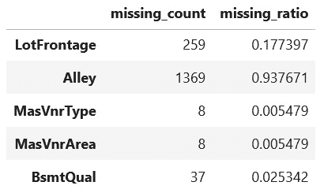
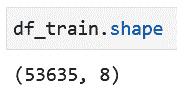

# 第三章：*第三章*：使用表格数据训练模型

在上一章中，我们学习了如何使用 fastai 导入各种类型的数据集，以及如何清理数据集。在本章中，我们将深入了解如何使用 fastai 和表格数据训练模型。**表格数据**是指以行和列组织的数据，通常可以在电子表格文件或数据库表中找到，它对大多数企业至关重要。fastai 框架通过提供一整套功能来支持基于表格数据的深度学习应用，充分认识到了表格数据的重要性。

为了使用 fastai 探索表格数据的深度学习，我们将回到 `ADULT_SAMPLE` 数据集，这是我们在*第二章*《使用 fastai 探索和清理数据》中检查的其中一个数据集。通过使用这个数据集，我们将训练一个深度学习模型，同时学习 `TabularDataLoaders`（用于定义训练和测试数据集）和 `tabular_learner`（用于定义和训练模型）对象。

我们还将研究 curated 数据集以外的其他数据集，学习如何将非 curated 数据集导入到 fastai 中，以便训练深度学习模型。我们将通过探索什么使得表格数据集成为训练 fastai 深度学习模型的良好候选者，并学习如何保存已训练的模型来结束本章内容。

本章将涵盖以下食谱：

+   使用 curated 表格数据集在 fastai 中训练模型

+   使用非 curated 表格数据集在 fastai 中训练模型

+   使用独立数据集训练模型

+   评估一个表格数据集是否适合 fastai

+   保存已训练的表格模型

+   测试你的知识

# 技术要求

确保你已经完成了*第一章*《使用 fastai 入门》中的设置部分，并且有一个可用的 Gradient 实例或 Colab 设置。确保你已经克隆了本书的代码仓库（[`github.com/PacktPublishing/Deep-Learning-with-fastai-Cookbook`](https://github.com/PacktPublishing/Deep-Learning-with-fastai-Cookbook)），并且可以访问 `ch3` 文件夹。该文件夹包含本章描述的代码示例。

# 使用 curated 表格数据集在 fastai 中训练模型

在*第二章*《使用 fastai 探索和清理数据》中，你学习了如何导入和检查 `ADULT_SAMPLE` curated 表格数据集。在这个食谱中，我们将详细介绍如何使用 fastai 在该数据集上训练一个深度学习模型。这将为你提供使用 fastai 创建表格深度学习模型的*顺畅路径*的概述。本食谱的目标是使用这个数据集训练一个深度学习模型，预测特定记录中描述的人员的薪资是否会高于或低于 50k。

## 准备工作

确认你能在你的代码库的`ch3`目录下打开`training_with_tabular_datasets.ipynb`笔记本。

我感谢能有机会在本节中包含`ADULT_SAMPLE`数据集。

数据集引用

Ron Kohavi. (1996) *提高朴素贝叶斯分类器的准确性：决策树混合方法* ([`robotics.stanford.edu/~ronnyk/nbtree.pdf`](http://robotics.stanford.edu/~ronnyk/nbtree.pdf))。

## 如何操作……

在这个食谱中，你将会运行`training_with_tabular_datasets.ipynb`笔记本。打开笔记本并在 fastai 环境中后，完成以下步骤：

1.  运行笔记本中的单元格，直到`定义转换`、`因变量`、`连续和分类列`单元格。运行这些单元格后，你将设置好笔记本，并将`ADULT_SAMPLE`策划的表格数据集导入到 pandas DataFrame 中，之后会在本笔记本的其他部分使用它们。这些单元格与在*第二章*中展示的笔记本相同，*使用 fastai 探索和清理数据*，用于检查策划的表格数据集`examining_tabular_datasets.ipynb`。

1.  使用以下代码运行笔记本中的第一个新单元格：

    ```py
    procs = [FillMissing,Categorify]
    dep_var = 'salary'
    cont,cat = cont_cat_split(df, 1, dep_var=dep_var)
    ```

    这个单元格设置了以下值：

    a) `procs`：这是将应用于`TabularDataLoaders`对象的转换列表。`FillMissing`表示将列中的缺失值替换为该列的中位数值。`Categorify`表示将分类列中的值替换为数字标识符。

    b) `dep_var`：用于识别数据集中哪个列包含因变量。这个列也被称为目标值或模型的 y 值——它是训练好的模型将要预测的值。在这个模型中，我们预测的是`salary`列的值。

    c) `cont`和`cat`：这是从`df` DataFrame 中分别返回的连续列和分类列的列表，这些列是由`cont_cat_split`函数返回的。这个函数是 fastai 为表格深度学习模型提供的一个主要优势。它通过自动检测哪些列是连续的（即可以取无限集合的值，如货币金额、物理尺寸或物体的计数）或分类的（即只能取有限的离散值，如美国的州或一周的天数），从而节省了大量的重复编码。

1.  使用以下代码运行下一个单元格，以定义名为`dls`的`TabularDataLoaders`对象。请注意，在定义该对象时指定的一些参数（如批次大小）通常与训练过程相关，而不是定义训练数据集：

    ```py
    dls=TabularDataLoaders.from_df(
    df, path, procs= procs,
    cat_names= cat, cont_names = cont, 
    y_names = dep_var, 
    valid_idx=list(range(1024,1260)), bs=64)
    ```

    `TabularDataLoaders`对象的定义使用以下参数：

    a) `df, path, procs`：包含已处理数据集的 DataFrame、数据集的路径对象，以及在前一步中定义的转换列表。

    b) `cat_names, cont_names`：在前一步中定义的分类列和连续列的列表。

    c) `y_names`：包含因变量/目标值的列。

    d) `valid_idx`：`df` DataFrame 中将被保留作为训练过程验证数据集的行子集的索引值。

    e) `bs`：训练过程中的批量大小。

1.  运行以下代码单元格来定义并训练模型。第一行指定使用 `TabularDataLoaders` 对象定义模型，该对象在前一步中已定义，并使用准确度作为训练过程中优化的度量标准。第二行触发训练过程，进行三次迭代（即三轮遍历整个数据集）：

    ```py
    learn = tabular_learner(dls,layers=[200,100], metrics=accuracy)
    learn.fit_one_cycle(3)
    ```

    该单元格的输出将是按轮次显示的训练结果。结果包括每个轮次的编号、训练损失、验证损失以及每轮的耗时：

    

    图 3.1 – 训练结果

1.  运行以下单元格以获取训练模型预测的示例结果。你可以将 `salary` 列与 `salary_pred` 列（模型预测值，在前面的截图中突出显示）进行比较，从而获得模型在这一数据集样本中表现的概览。在这个样本集中，模型的预测与 `salary` 列中因变量的实际值相匹配：

    图 3.2 – show_results 的输出

1.  运行以下单元格以获取训练模型结构的总结：

    ```py
    learn.summary()
    ```

    该单元格的输出包括以下细节：

    a) 构成模型的所有层的列表：


图 3.3 – 构成模型的层列表

b) 训练模型中的参数、优化器和损失函数，以及使用的回调函数。回调函数（[`docs.fast.ai/callback.core.html`](https://docs.fast.ai/callback.core.html)）指定在训练过程中执行的操作，如在执行所有迭代之前停止训练过程。对于这个训练好的模型，回调函数由 fastai 自动指定，以跟踪已完成的训练轮次（`TrainEvalCallback`）、按批次/轮次跟踪损失和度量（`Recorder`）以及在训练过程中显示进度条（`ProgressCallBack`）：


图 3.4 – summary() 输出中的附加细节

你现在已经使用 fastai 完全训练了一个深度学习模型，并使用了精心整理的表格数据集。

## 它是如何工作的…

正如你在这个食谱中看到的那样，一旦数据被导入，只需几行 fastai 代码就能得到一个训练好的深度学习模型。fastai 代码的简洁性和紧凑性，部分归功于它在可能的情况下做出合理的默认选择。

例如，fastai 确定，当目标列是分类数据时，模型应预测某一类别中的选项（在这个模型中，是预测一个人的工资是否高于或低于 50k，而不是连续的数值）。以下是 fastai 在使用表格数据训练深度学习模型时提供的额外好处：

+   检测 DataFrame 中哪些列是分类数据，哪些列是连续数据

+   选择适当的回调函数来进行训练过程

+   定义深度学习模型的层（包括为类别列定义的嵌入层）

让我们比较一下在 Keras 深度学习模型中需要做些什么。在 Keras 深度学习模型中，对于一个表格数据集，模型的每个特征都必须明确编码，这将导致创建模型的代码更长、更复杂。此外，学习表格数据集深度学习模型的人还需要处理更多细节，才能得到第一个有效的训练模型。总的来说，fastai 使得快速构建基本深度学习模型成为可能。

在继续下一个食谱之前，值得深入探讨一下这个食谱中的模型，因为本章其他食谱将遵循相同的模式。对该模型的详细描述超出了本书的范围，因此我们这里只关注一些亮点。

如食谱中所示，模型被定义为 `tabular_learner` 对象（文档链接：[`docs.fast.ai/tabular.learner.html`](https://docs.fast.ai/tabular.learner.html)）。这个对象是 fastai `learner` 对象的一个特化版本，后者你首次见到是在 *第一章* *了解四大应用领域：表格、文本、推荐系统和图像* 部分中。在 `learn.summary()` 的输出中，你可以看到这个模型的结构。输出的开始部分指定了 `Input shape: ['64 x 9', '64 x 6']` —— 第一个元素的第二维度对应着类别列的数量，第二个元素的第二维度对应着连续列的数量。为类别列（`cat` 列表中的列）定义了嵌入层（文档链接：[`docs.fast.ai/layers.html#Embeddings`](https://docs.fast.ai/layers.html#Embeddings)），并为连续列定义了一个 `BatchNorm` 层（文档链接：[`docs.fast.ai/layers.html#BatchNorm-layers`](https://docs.fast.ai/layers.html#BatchNorm-layers)）。

要查看模型结构的更多详细信息，请查看`learn.model`的输出。特别地，你可以看到，在最后一个`Linear`层中，`out_features = 2`，这对应着模型的二元输出（个人收入是否高于/低于 50k）。

# 在 fastai 中使用非精心整理的表格数据集训练模型

在*第二章*《使用 fastai 探索和清理数据》中，你回顾了 fastai 提供的精心整理的数据集。在之前的食谱中，你创建了一个深度学习模型，该模型已经在这些精心整理的数据集之一上进行了训练。如果你想为一个非精心整理的数据集训练 fastai 模型，该怎么办呢？

在本食谱中，我们将介绍如何处理一个非精心整理的数据集——Kaggle 房价数据集（[`www.kaggle.com/c/house-prices-advanced-regression-techniques/data`](https://www.kaggle.com/c/house-prices-advanced-regression-techniques/data)）并在其上训练深度学习模型。这个数据集提出了一些额外的挑战。与精心整理的 fastai 数据集相比，处理该数据集需要额外的步骤，而且它的结构需要特别处理，以应对缺失值问题。

本食谱的目标是使用该数据集训练一个深度学习模型，预测房屋的销售价格是高于还是低于该数据集的平均价格。

## 准备就绪

要完成本食谱，你需要一个 Kaggle ID。如果你还没有，可以在这里注册：[`www.kaggle.com/account/login`](https://www.kaggle.com/account/login)。获得 Kaggle ID 后，请按照以下步骤获取在笔记本中访问 Kaggle 房价数据集的令牌：

1.  使用你的 Kaggle ID 登录，点击账户（右上角），然后点击**账户**：

    图 3.5 – Kaggle 账户菜单

1.  `kaggle.json`文件将被下载到你的本地系统：

    图 3.6 – 选择创建新 API 密钥来获取新的 Kaggle API 密钥

1.  在你的 Gradient 环境中，打开一个终端会话，进入`/root`目录，并创建一个名为`.kaggle`的新目录。

1.  将你在*步骤 2*中下载的`kaggle.json`文件上传到你刚刚创建的新目录中，也就是`/root/.kaggle`。

这些步骤将帮助你准备好在本食谱中使用 Kaggle 房价数据集（[`www.kaggle.com/c/house-prices-advanced-regression-techniques/data`](https://www.kaggle.com/c/house-prices-advanced-regression-techniques/data)）。

我很感激能有机会在这一部分包含房价数据集。

数据集引用

Dean De Cock (2011)。艾姆斯，爱荷华州：作为学期末回归项目的波士顿住房数据的替代方案 ([`jse.amstat.org/v19n3/decock.pdf)`](http://jse.amstat.org/v19n3/decock.pdf) 《统计学教育期刊》第 19 卷，第 3 期（2011 年），([www.amstat.org/publications/jse/v19n3/decock.pdf](http://www.amstat.org/publications/jse/v19n3/decock.pdf))

## 如何操作…

在此示例中，你将通过 `accessing_non_curated_datasets.ipynb` 笔记本以及 fastai 数据集文档来理解 fastai 所整理的数据集。一旦你在 fastai 环境中打开了该笔记本，完成以下步骤：

1.  如果你还没有安装，运行以下命令以安装 `kaggle` 库：

    ```py
    pip install kaggle
    ```

1.  运行笔记本的前三个单元格，加载你在此示例中所需的库，并准备好 fastai 笔记本。

1.  在你的 Gradient 环境中，进入 `/root/.kaggle` 目录并打开 `kaggle.json` 文件。该文件的内容应如下所示，其中你的 ID 和 32 字符的密钥分别是第一个和第二个值：

    ```py
    {"username":<YOUR ID>,"key":<YOUR KEY>}
    ```

1.  复制你的 `kaggle.json` 文件的内容。

1.  在你复制的 `accessing_non_curated_datasets.ipynb` 笔记本中，将 `kaggle.json` 文件的内容粘贴到单引号中，以将值分配给变量 creds。然后，运行此单元格：

    ```py
    creds = '{"username":<YOUR ID>,"key":<YOUR KEY>}'
    ```

1.  运行此单元格以设置数据集的凭证路径：

    ```py
    cred_path = Path('~/.kaggle/kaggle.json').expanduser()
    ```

1.  运行此单元格以设置数据集的路径：

    ```py
    path = URLs.path('house_price')
    ```

1.  运行此单元格以创建目标目录以存储数据集，下载数据集，将数据集解压到目标目录，并列出目标目录的内容：

    ```py
    if not path.exists():
        path.mkdir()
        api.competition_download_cli('house-prices-advanced-regression-techniques', path=path)
        file_extract(path/'house-prices-advanced-regression-techniques.zip')
        path.ls(file_type='text')
    ```

1.  `path.ls()` 函数的输出显示了数据集的结构。在此示例中，我们将使用 `train.csv` 来训练深度学习模型，然后使用 `test.csv` 来测试训练后的模型：

    ```py
    [Path('/storage/archive/house_price/sample_submission.csv'),
    Path('/storage/archive/house_price/data_description.txt'),
    Path('/storage/archive/house_price/train.csv'),
    Path('/storage/archive/house_price/test.csv')]
    ```

1.  运行此单元格以将 `train.csv` 文件加载到名为 `df_train` 的 pandas DataFrame 中：

    ```py
    df_train = pd.read_csv(path/'train.csv')
    ```

1.  运行此单元格以将 `test.csv` 文件加载到名为 `df_test` 的 pandas DataFrame 中：

    ```py
    df_test = pd.read_csv(path/'test.csv')
    ```

1.  运行 `shape` 命令获取 `df_train` 和 `df_test` 的维度。注意到 `df_test` 比 `df_train` 少了一列——你能想到为什么会这样吗？哪个列在 `df_test` 中缺失？

1.  运行此单元格以定义 `under_over()` 函数，如果输入值小于均值，则返回 `'0'`，否则返回 `'1'`：

    ```py
    def under_over(x,mean_x):
        if (x <= mean_x):
            returner = '0'
        else:
            returner = '1'
        return(returner)
    ```

1.  运行此单元格使用 `under_over()` 函数，该函数将用指示值是否高于或低于该列平均值的标志替换 `SalePrice` 列中的值：

    ```py
    mean_sp = int(df_train['SalePrice'].mean())
    df_train['SalePrice'] = df_train['SalePrice'].apply(lambda x: under_over(x,mean_sp))
    df_train.head()
    ```

1.  当你显示 `df_train` DataFrame 的内容时，你会看到 `SalePrice` 列中的值已被替换为零和一：

    图 3.7 – `SalePrice` 列中的值已被替换

1.  运行此单元格以查看 `SalePrice` 列中新值的计数：

    ```py
    df_train['SalePrice'].value_counts()
    ```

1.  运行此单元格以定义应用于数据集的变换，包含因变量（目标）的列，以及连续和分类列：

    ```py
    dep_var = 'SalePrice'
    cont,cat = cont_cat_split(df_train, 1, dep_var=dep_var)
    ```

    此单元格设置以下值：

    a) `procs`：这是一个将应用于`TabularDataLoaders`对象的变换列表。`FillMissing`指定将列中的缺失值替换为该列的中位数值。`Categorify`指定将分类列中的值替换为数字标识符。

    b) `dep_var`：用于标识数据集中包含因变量的列，即包含我们希望模型预测的值的列。对于此模型，我们预测的是`SalePrice`列的值。

    c) `cont`和`cat`：这些是使用`cont_cat_split`从`df_train` DataFrame 返回的连续和分类列的列表。

1.  运行此单元格以检查`df_train` DataFrame 中的缺失值。第一行获取 DataFrame 中缺失值的计数，而第二行定义了一个新的 DataFrame，`df_train_missing`，它包含原始 DataFrame 中每一列中至少有一个缺失值的行。此 DataFrame 的列包括包含缺失值的列的名称、每列的缺失值计数以及每列中缺失值的比例：

    ```py
    count = df_train.isna().sum()
    df_train_missing = (pd.concat([count.rename('missing_count'),count.div(len(df_train)).rename('missing_ratio')],axis = 1).loc[count.ne(0)])
    ```

    查看`df_train_missing`中的值，我们可以看到某些列有大量的缺失值：

    

    图 3.8 – 来自 df_train_missing 的行

1.  运行此单元格以处理`df_train`和`df_test` DataFrame 中的缺失值。前两条语句将分类列中的缺失值替换为最常见的非缺失值，而后两条语句将连续列中的缺失值替换为零：

    ```py
    df_train[cat] = df_train[cat].fillna(df_train[cat].mode().iloc[0])
    df_test[cat] = df_test[cat].fillna(df_test[cat].mode().iloc[0])
    df_train[cont] = df_train[cont].fillna(0.0)
    df_test[cont] = df_test[cont].fillna(0.0)
    ```

1.  运行此单元格以再次检查`df_train` DataFrame 中的缺失值：

    ```py
    count = df_train.isna().sum()
    df_train_missing = (pd.concat([count.rename('missing_count'),count.div(len(df_train)).rename('missing_ratio')],axis = 1).loc[count.ne(0)])
    ```

1.  现在，当你检查`df_train_missing` DataFrame 的内容时，它将是空的，确认所有缺失值已经处理完毕：

    图 3.9 – 确认缺失值已经处理

1.  运行此单元格以创建`TabularDataLoaders`对象。第一行定义了将在`TabularDataLoaders`对象中应用的变换程序，第二行定义了`TabularDataLoaders`对象：

    ```py
    procs = [Categorify, Normalize]
    dls_house=TabularDataLoaders.from_df(
        df_train,path,procs= procs,
        cat_names= cat, cont_names = cont, y_names = dep_var, 
        valid_idx=list(range((df_train.shape[0]-100),df_train.shape[0])), 
        bs=64)
    ```

    以下是`TabularDataLoaders`对象定义的参数：

    a) `procs`：这是一个将应用于`TabularDataLoaders`对象的变换列表。`Normalize`指定所有值都会被缩放到一致的范围。`Categorify`指定将分类列中的值替换为数字标识符。

    b) `df_train, path, procs`：包含导入数据集的 DataFrame，数据集的路径对象，以及在前一步中定义的转换列表。

    c) `cat_names, cont_names`：类别和连续列的列表。

    d) `y_names`：包含因变量/目标值的列。

    e) `valid_idx`：将保留为训练过程验证数据集的`df` DataFrame 中行子集的索引值。

    f) `bs`：训练过程的批次大小。

1.  运行此单元格来定义并训练深度学习模型。第一行指定模型是使用我们在前一步中定义的`TabularDataLoaders`对象创建的，并且使用默认的层数和准确度作为训练过程中优化的指标。第二行触发了`5`个 epoch 的训练过程：

    ```py
    learn = tabular_learner(dls_house, layers=[200,100], metrics=accuracy)
    learn.fit_one_cycle(5)
    ```

    训练过程会产生一个输出，显示每个 epoch 的训练损失、验证损失和准确度。这意味着我们已经训练出了一个可以预测验证集中的某个属性成本是否高于或低于平均值的模型，准确率为 92%。你能想到一些原因，为什么这个模型的准确率比你在前一节中训练的模型要好一些吗？

    

    图 3.10 – 在非精选数据集上训练的结果

1.  你可以运行此单元格来将训练好的模型应用于测试数据集。请注意，由于该数据集的结构，测试数据集不包含 y 相关的值，这意味着虽然你可以将模型应用于测试记录，但你无法评估模型在测试集上做出的预测的准确性：

    ```py
    dl = learn.dls.test_dl(df_test)
    ```

1.  运行此单元格以获取训练模型在测试数据集上做出的预测样本：

    ```py
    learn.show_results()
    ```

    `learn.show_results()`的输出让你可以查看将训练好的模型应用于数据集的结果：


图 3.11 – 将训练好的模型应用于非精选数据集后的结果子集

你现在已经完成了使用非精选数据集来训练 fastai 深度学习模型的过程。

## 它是如何工作的……

在本节中，你学习了如何适应另一种类型的数据集，其中训练集和测试集是分开的。在这种情况下，你不能依赖`TabularDataLoaders`对象中的转换来处理缺失数据。因此，本节中的代码单独处理了训练集和测试集中的缺失值。

# 使用独立数据集训练模型

在本章的前几个食谱中，我们介绍了如何在一个经过整理的表格数据集和一个直接从 Kaggle 加载的数据集上训练 fastai 模型。在这个食谱中，我们将探讨如何用来自自立文件的数据集来训练模型。我们将在这个食谱中使用的数据集由马来西亚吉隆坡的房地产列表组成，并可通过 Kaggle 网站上的[`www.kaggle.com/dragonduck/property-listings-in-kuala-lumpur`](https://www.kaggle.com/dragonduck/property-listings-in-kuala-lumpur)获取。

这个数据集与我们之前见过的表格数据集不同。我们之前遇到的数据集行为良好，仅需要少量清理工作。相比之下，吉隆坡的房地产数据集是一个现实世界的数据集。除了缺失值外，它还包含许多错误和不规则性。它的规模也足够大（超过 5 万条记录），为深度学习提供了一个合适的应用场景。

## 准备工作

确保你已经按照*第一章*中的步骤操作，*快速入门 fastai*，以便设置好 fastai 环境。确认你能够在你的仓库的`ch3`目录下打开`training_model_standalone_tabular_dataset.ipynb`笔记本。还需确保按照以下步骤上传了数据文件：

1.  从[`www.kaggle.com/dragonduck/property-listings-in-kuala-lumpur`](https://www.kaggle.com/dragonduck/property-listings-in-kuala-lumpur)下载`data_kaggle.csv.zip`。

1.  解压下载的文件以提取`data_kaggle.csv`。

1.  在你的 Gradient 环境中的终端，从`/storage/archive`设置为当前目录：

    ```py
    cd /storage/archive
    ```

1.  创建一个名为`/storage/archive/kl_property`的文件夹：

    ```py
    mkdir kl_property
    ```

1.  将`data_kaggle.csv`上传到`/storage/archive/kl_property`。你可以使用 Gradient 中的 JupyterLab 上传按钮进行上传，但需要按照以下步骤操作：

    a) 在你的 Gradient 环境中的终端，将`/notebooks`设置为当前目录：

    ```py
    /notebooks/temp:

    ```

    临时打开你的当前文件夹，选择上传按钮，如下图所示，并从你解压文件的本地系统文件夹中选择`data_kaggle.csv`文件：

    ```py

    ```


](img/B16216_03_12.jpg)

图 3.12 – JupyterLab 中的上传按钮

d) 在你的 Gradient 环境中的终端，将`data_kaggle.csv`复制到`/storage/archive/kl_property`：

```py
cp /notebooks/temp/data_kaggle.csv /storage/archive/kl_property/data_kaggle.csv
```

我想在此感谢本节中使用的数据集，并感谢能够将其纳入本书的机会。

数据集引用

Jas S (2019)。 *吉隆坡房地产列表* ([`www.kaggle.com/dragonduck/property-listings-in-kuala-lumpur`](https://www.kaggle.com/dragonduck/property-listings-in-kuala-lumpur))

让我们看看下一节该如何进行。

## 如何操作…

在本教程中，你将通过运行`training_model_standalone_tabular_dataset.ipynb`笔记本，使用吉隆坡房地产价格数据集来训练模型。

打开 fastai 环境中的笔记本后，按照以下步骤操作：

1.  运行前三个单元格以导入必要的库，并为 fastai 设置笔记本。

1.  运行此单元格，将`path`与您复制了`data_kaggle.csv`文件的目录关联起来：

    ```py
    path = URLs.path('kl_property')
    ```

1.  运行此单元格以将数据集导入到`df_train`数据框中：

    ```py
    df_train = pd.read_csv(path/'data_kaggle.csv')
    ```

1.  运行以下单元格查看数据集的前几行：

    ```py
    df_train.head()
    ```

    `df_train.head()`的输出显示了数据集中的一些数据行：

    

    图 3.13 – 吉隆坡房地产数据集中的一部分数据行

1.  注意查看`Price`列中的值。本教程的目标是训练一个深度学习模型，预测此列中的值是高于还是低于平均值。为此，我们需要从此列中的数值开始。仅从这小段数据样本中，你可以看到三个问题：

    a) 这些值包括`RM`，这是马来西亚货币林吉特的符号。

    b) 这些值包括千分位的逗号分隔符。

    c) 某些行在此列中有缺失值。

    在接下来的几个单元格中，我们将处理这些问题，确保该列最终包含完全有效的数值。

1.  运行此单元格以获取数据集中的行数。输出的第一个元素是数据框中的行数：

    ```py
    df_train.shape
    ```

1.  运行单元格以定义`remove_currency()`和`remove_after_space()`函数。你将需要这些函数来清理数据集。

1.  运行此单元格以解决`Price`列中由`df_train.head()`输出显示的问题。此单元格将删除数据集中`Price`值缺失的行（第一条语句），去除`Price`列中的货币符号（第二条语句），并在去除逗号后将`Price`列中的值转换为数值：

    ```py
    df_train.dropna(subset=['Price'], inplace=True)
    df_train['Price'] = df_train['Price'].apply(lambda x: remove_currency("RM ",x))
    df_train['Price'] = pd.to_numeric(df_train['Price'].str.replace(',',''), errors='coerce')
    ```

1.  运行此单元格再次获取数据集中的行数。了解这个数字很重要，因为我们已经在上一个单元格中删除了一些行，并且在清理`Size`列时还会删除更多行。通过检查删除行前后数据框的形状，我们可以确保不会丢失过多的信息：

    图 3.14 – 删除行之前获取数据框的形状

1.  `Size`列包含了许多有用的信息，但我们必须做一些工作，才能将其准备好帮助训练深度学习模型。首先，运行以下单元格以查看`Size`列中一些示例值。我们希望从此列中提取以下信息：

    a) 将前缀（例如，`Built-up`、`Land area`等）提取到新列中。

    b) 获取`Size`列剩余内容的单一数值；即，将 1,335 sq. ft.替换为 1,335，将 22 x 80 sq. ft.替换为 1,760。

    c) 删除`Size`列中后缀无法转换为数值的行。

    `df_train['Size'].head()`的输出显示了`Size`列中值的示例：

    

    图 3.15 – `Size`列中值的示例

    以下是我们希望对`Size`列进行的操作，以便为训练深度学习模型做准备：

    a) 将前缀（例如`Built-up`、`Land area`等）提取到一个新列中。

    b) 在可能的情况下，获取`Size`列剩余内容的单一数值。例如，我们希望将 1,335 sq. ft.替换为 1,335，将 22 x 80 sq. ft.替换为 1,760。

    c) 对于无法从`Size`列剩余内容中提取数值的行，删除该行。

1.  运行单元格以定义`clean_up_size()`函数。你将使用此函数对`Size`列执行以下清理步骤。结果将是一个 DataFrame，`Size`列中的所有值都将是代表物业面积的数值。以下是`clean_up_size()`函数执行的一些转换：

    a) 将`Size`列中的所有值转为小写。

    b) 将`Size`列拆分为一个新列(`Size_type`)，该列包含非数值信息，剩余的`Size`列则包含有关物业面积的数值信息。

    c) 用`0`替换新`Size`列中的缺失值。

    d) 删除不包含任何数字的行。

    e) 删除包含问题子串的行，如`clean_up_list`中列出的内容。

    f) 替换多余的字符，使所有`Size`条目都为数值型或`numerica * numericb`的形式。

    g) 将`numerica * numericb`形式的值替换为两者的乘积；即，`numerica`和`numericb`。

1.  运行此单元格以执行`clean_up_size()`函数：

    ```py
    clean_up_list = ["-","\+",'\'','\~',"xx","sf","acre","#"]
    df_train = clean_up_size(df_train,clean_up_list)
    ```

1.  再次运行`shape`命令，以获取删除了不包含足够数据的行后的 DataFrame 形状。这确认了在删除无效行后，我们丢失了约 2%的行：

    图 3.16 – 清理后 DataFrame 的形状

1.  运行`df_train.head()`查看清理步骤后的 DataFrame 样本。注意，现在我们得到以下结果：

    a) 添加了新的`Size_type`列。

    b) `Size`列包含数值型数据。

    `df_train.head()`的输出显示了`Price`和`Size`列清理后的 DataFrame 样子：

    

    图 3.17 – 执行完 Price 和 Size 列清理步骤后的 DataFrame

1.  运行该单元格以定义`under_over()`函数。你将运行该函数，以将`Price`列中的值替换为指示价格是否高于或低于平均价格的标记。

1.  运行以下单元格以将`Price`列中的值替换为指示价格高于或低于平均值的标记：

    ```py
    mean_sp = int(df_train['Price'].mean())
    if categorical_target:
        df_train['Price'] = df_train['Price'].apply(lambda x: under_over(x,mean_sp))
    ```

    运行该单元格后，`Price`列中的值将被替换：

    

    图 3.18 – 替换了价格值为高于/低于平均值指示的 DataFrame

1.  运行该单元格以定义将应用于`TabularDataLoaders`对象的转换、目标列（`Price`）以及连续和类别列列表：

    ```py
    procs = [FillMissing,Categorify]
    dep_var = 'Price'
    cont,cat = cont_cat_split(df_train, 1, dep_var=dep_var)
    ```

1.  运行该单元格以定义`TabularDataLoaders`对象，使用你在笔记本中定义的参数，包括数据集（`df_train`）、将应用于数据集的转换列表（`procs`）、连续和类别列列表（`cont`和`cat`）以及因变量（`dep_var`）：

    ```py
    dls = TabularDataLoaders.from_df(df_train,path,procs= procs, 
             cat_names= cat, cont_names = cont, 
             y_names = dep_var,
             valid_idx=list(range((df_train.shape[0]-5000),df_train.shape[0])), 
             bs=64)
    ```

1.  运行该单元格以拟合模型并查看模型的性能。你的准确率和损失值可能会有所不同，但你应该能看到超过 90%的准确率，对于一个训练数据少于 10 万条记录的模型来说，这已经很好了：

    图 3.19 – 模型拟合结果

1.  运行该单元格以查看验证集中的结果。你将看到，在这组结果中，模型正确预测了一个属性的价格是否高于或低于平均价格：


图 3.20 – 模型预测属性价格是否高于或低于平均值

恭喜你！你已经在一个需要进行不小清理的数据集上，使用 fastai 训练了一个深度学习模型。

## 它是如何工作的……

在本教程中，你看到虽然 fastai 提供了便捷工具来训练深度学习模型，以处理表格数据集，但你仍需确保数据集能够训练模型。这意味着需要从数值列中去除非数值值。这可能需要迭代清理步骤，就像你在本教程的笔记本中所看到的那样。

本教程中的数据集包含了典型的现实世界数据集中的异常和不一致，因此你在本教程中使用的技术（包括通过 pandas 操作去除某些列中有问题值的行，以及字符串替换技术）将适用于其他现实世界的数据集。

即使数据集杂乱，得益于 fastai 自动选择智能默认值并自动化关键操作（如识别分类和连续列、处理缺失值），它也能轻松帮助你获得高性能的深度学习模型。

# 评估表格数据集是否适合 fastai

到目前为止，我们已经使用 fastai 为表格数据集创建了三个深度学习模型。但如果你想确定一个新数据集是否适合使用 fastai 训练深度学习模型呢？在本节中，我们将介绍如何评估一个数据集是否适合使用 fastai 进行深度学习。

## 准备就绪

确保你已按照*第一章*的步骤，*快速入门 fastai*，设置好 fastai 环境。

## 如何操作…

正如你在本章中所看到的，你可以选择多种数据集进行深度学习应用。为了评估一个数据集是否适合，我们将通过从头开始创建一个新的笔记本并从在线 API 获取数据的过程。请按照以下步骤操作：

1.  在 Gradient 中创建一个新笔记本。你可以通过以下步骤在 Gradient JupyterLab 中完成此操作：

    a) 点击主窗口中的新启动器按钮（**+**）：

    

    图 3.21 – 在 JupyterLab 中获取新启动器

    b) 当启动器窗格打开时，点击 **Python 3** 来打开一个新的笔记本：

    

    图 3.22 – JupyterLab 中的启动器窗格

1.  在新笔记本中，创建并运行两个新的单元格，设置笔记本所需的语句：

    图 3.23 – 为表格数据集设置 fastai 笔记本的单元格

1.  运行以下单元格以导入调查此数据集所需的附加库：

    ```py
    ! pip install pandas_datareader
    import numpy as np
    import pandas as pd
    import os
    import yaml
    # For reading stock data
    from pandas_datareader.data import DataReader
    # For time stamps
    from datetime import datetime
    ```

1.  运行以下单元格以加载 AstraZeneca（股票代码 = `AZN`）公司的股票价格数据集：

    ```py
    df = DataReader('AZN', 'stooq')
    ```

1.  检查 `df.head()` 的输出，查看数据框的内容：

    图 3.24 – 股票价格数据集示例

1.  获取数据框 `df` 的形状，以确定数据框中有多少行。你认为这个数据集足够大，能够成功训练一个深度学习模型吗？

    图 3.25 – 获取 df 的形状

1.  运行以下单元格以准备检查数据框是否有缺失值

    ```py
    count = df.isna().sum()
    df_missing = (pd.concat([count.rename('missing_count'),count.div(len(df)).rename('missing_ratio')],axis = 1).loc[count.ne(0)])
    ```

1.  现在确认数据集没有缺失值！图 3.26 – 确认数据集没有缺失值

    

    图 3.26 – 确认数据集没有缺失值

1.  运行以下单元格以设置训练运行的参数：

    ```py
    dep_var = 'Close'
    # define columns that are continuous / categorical
    cont,cat = cont_cat_split(df, 1, dep_var=dep_var)
    ```

1.  运行以下单元格来定义 TabularDataLoaders 对象：

    ```py
    procs = [Normalize]
    dls = TabularDataLoaders.from_df(df,procs= procs,
            cat_names= cat, cont_names = cont, 
            y_names = dep_var, 
            valid_idx=list(range((df.shape[0]-50),df.shape[0])), bs=64)
    ```

1.  运行以下单元格来定义并训练模型：

    ```py
    learn = tabular_learner(dls, metrics=accuracy)
    learn.fit_one_cycle(30)
    ```

1.  你可以从以下输出看到模型的表现很差：

    图 3.27 – 训练模型时的较差表现

1.  现在，我们想进行一些更改，尝试获得一个表现更好的模型。首先，运行以下单元格来定义一个函数，创建一个新的目标列：

    ```py
    def get_target(value,threshold):
        '''return based on whether the input value is greater than or less than input threshold'''
        if value <= threshold:
            return_value = "0"
        else:
            return_value = "1"
        return(return_value)
    ```

1.  运行以下单元格来定义新的目标列：

    ```py
    threshold = df['Close'].mean()
    df['target'] = df['Close'].apply(lambda x: get_target(x,threshold))
    ```

1.  运行以下单元格来指定新的`target`列为因变量，并限制`cont`，即用于训练模型的连续列集合。注意，在本节的第一个模型中，因变量是`Close`，一个连续列。这意味着第一个模型是在尝试预测一个连续值。由于`target`是一个分类列，新的模型将预测一个分类值而不是连续值：

    ```py
    dep_var = 'target'
    cont = ['High', 'Low', 'Open', 'Volume']
    ```

1.  运行以下单元格来使用新的因变量和新的连续列集合训练一个新模型：

    ```py
    dls = TabularDataLoaders.from_df(df,procs= procs, 
        cat_names= cat, cont_names = cont, 
        y_names = dep_var, 
        valid_idx=list(range((df.shape[0]-50),df.shape[0])), 
        bs=64)
    learn = tabular_learner(dls, metrics=accuracy)
    learn.fit_one_cycle(30)
    ```

1.  你可以看到这个新模型比之前的模型有更好的表现：


图 3.28 – 第二个模型的表现提升

在这个配方中，你尝试了两种深度学习模型变体，用于预测股价信息数据集。第一个模型的因变量是连续的，并且在整个过程中使用了 fastai 的默认设置。与本章中的其他配方不同，第一个模型的表现较差。如果你尝试使用更多的训练轮次来训练第一个模型，你会发现性能并没有改善。第二个模型将因变量从连续变量改为分类变量，表现要好得多。

## 它是如何工作的……

本节的第一个模型并未成功。在使用 1.3 千条记录训练深度学习模型来预测连续值时，很可能无法成功。一般来说，你需要一个大一个数量级的训练集，至少是数十万条甚至数百万条记录，才能预测一个连续的结果。

# 保存训练好的表格模型

到目前为止，我们已经在表格数据集上训练了一系列 fastai 深度学习模型。这些模型在我们训练模型的 Python 会话中是可用的，但是我们该如何保存这些模型，以便在不同的会话中再次使用呢？在这个配方中，我们将学习如何将一个 fastai 深度学习模型保存到文件，并在另一个 Python 会话中访问该模型。

## 准备工作

确保您已经按照*第一章*的步骤，*快速入门 fastai*，来设置 fastai 环境。确认您可以在存储库的`ch3`目录中打开`saving_models_trained_with_tabular_datasets.ipynb`和`loading_saved_models_trained_with_tabular_datasets.ipynb`笔记本。

## 如何操作…

在这个操作步骤中，您将通过运行`saving_models_trained_with_tabular_datasets.ipynb`笔记本来训练一个模型——这个模型与本章第一个操作步骤中训练的模型相同——并将其保存。然后，您将使用`loading_saved_models_trained_with_tabular_datasets.ipynb`笔记本加载并执行已保存的 fastai 模型。

一旦您在 fastai 环境中打开了`saving_models_trained_with_tabular_datasets.ipynb`笔记本，按照以下步骤操作：

1.  运行笔记本中的单元格，直到`保存训练好的模型`单元格。通过运行这些单元格，您将把`ADULT_SAMPLE`整理好的表格数据集导入到 pandas DataFrame 中，并在其上训练一个 fastai 模型。

1.  运行接下来的两个单元格，将模型的路径值设置为可写目录。确保您设置的 learn.path 指向的目录存在并且是可写的。

1.  运行此单元格，将训练好的模型保存到`adult_sample_model.pkl`文件中：

    ```py
    learn.export('adult_sample_model.pkl')
    ```

1.  现在您已经将训练好的模型保存到文件中，您必须将其加载到另一个笔记本中，以测试您在新的 Python 会话中加载模型的过程，然后使用保存的模型对测试数据进行预测。

1.  在 Gradient 会话中打开`loading_saved_models_trained_with_tabular_datasets.ipynb`笔记本。

1.  运行单元格，直到`加载已保存的训练模型`单元格，以加载所需的库并设置笔记本。

1.  运行此单元格，将您之前在本操作步骤中保存的模型加载到这个新笔记本中。确保您指定了之前保存模型的路径：

    ```py
    learn = load_learner('/notebooks/temp/models/adult_sample_model.pkl')
    ```

1.  运行此单元格，将测试数据集加载到 DataFrame 中：

    ```py
    df_test = pd.read_csv('adult_sample_test.csv')
    ```

1.  运行此单元格，选择测试数据集的第一行，并应用训练好的模型来获取该数据点的预测：

    ```py
    test_sample = df_test.iloc[0]
    learn.predict(test_sample)
    ```

1.  结果包括模型对该数据点的预测。您可以看到，对于这个数据点，模型预测的`salary`值为`1.0`，这意味着它预测该个体的工资将超过 50k：


](img/B16216_03_29.jpg)

图 3.29 – 应用保存的模型对测试数据点进行预测的结果

恭喜！您已经成功保存了一个 fastai 深度学习模型，加载了保存的模型到新笔记本中，并应用该模型对一行测试数据进行预测。

## 其工作原理…

fastai 框架包括支持，使用`learner`对象的`export()`方法将深度学习模型保存到文件系统中。在这个配方中，你看到了如何将训练后的模型保存到 pickle 文件的示例。你还学会了如何将 pickle 文件加载回 Python，并将训练后的模型应用于新的数据示例。这是对在部署的模型上进行推理的过程的提前预览。在*第七章*《部署与模型维护》中，你将看到在部署的模型上进行推理的完整示例。

# 测试你的知识

现在你已经完成了本章中的配方，按照这里展示的步骤来实践你所学的内容。你将通过调整你在本章中操作过的一个笔记本，使其能够与新数据集配合使用。

## 准备工作

按照以下步骤上传新的表格数据集：

1.  访问 Kaggle 未来销售预测比赛的站点（[`www.kaggle.com/c/competitive-data-science-predict-future-sales/data`](https://www.kaggle.com/c/competitive-data-science-predict-future-sales/data)），并接受比赛条件，以便访问与比赛相关的数据集。

1.  下载`sales_train.csv.zip`和`test.csv.zip`文件。

1.  解压下载的文件以提取`sales_train.csv`和`test.csv`。

1.  在 Gradient 环境中的终端中，将当前目录设置为`/storage/archive`：

    ```py
    cd /storage/archive
    ```

1.  创建一个名为`/storage/archive/price_prediction`的文件夹：

    ```py
    mkdir price_prediction
    ```

1.  将`sales_train.csv`和`test.csv`上传到`/storage/archive/price_prediction`。你可以使用 Gradient 中的 JupyterLab 上传按钮，通过你在本章前面创建的`/notebooks/temp`目录来上传：

    a) 在 JupyterLab 文件浏览器中，将`temp`设置为当前文件夹，选择上传按钮，如下图所示，然后从本地系统文件夹中选择`sales_train.csv`和`test.csv`，该文件夹是你在*第 2 步*中提取它们的地方：


图 3.30 – JupyterLab 中的上传按钮

b) 在 Gradient 环境中的终端中，将`/storage/archive/price_prediction`设置为当前目录：

```py
cd /storage/archive/price_prediction
```

c) 将`sales_train.csv`、`test.csv`和`data_kaggle.csv`复制到`/storage/archive/price_prediction`：

```py
cp /notebooks/temp/sales_train.csv  sales_train.csv 
cp /notebooks/temp/test.csv  test.csv
```

现在你已经上传了数据集，是时候创建一个笔记本来导入数据集了：

1.  创建一个你在*使用独立数据集训练模型*配方中操作过的`training_model_standalone_tabular_dataset.ipynb`笔记本的副本。将副本命名为`training_model_new_tabular_dataset.ipynb`。

1.  在你的新笔记本中，更新用于导入训练数据集的单元格：

    ```py
    path = URLs.path('price_prediction') 
    df_train = pd.read_csv(path/'sales_train.csv')
    ```

1.  `df_train.head()` 的输出应该展示数据集的结构。你可以在 [`www.kaggle.com/c/competitive-data-science-predict-future-sales/data?select=sales_train.csv`](https://www.kaggle.com/c/competitive-data-science-predict-future-sales/data?select=sales_train.csv) 找到该数据集的列描述：


图 3.31 – sales_train.csv 内容的一个样本

恭喜！你已经将另一个独立的表格数据集导入到 fastai 笔记本中。你可以应用类似的技术将其他表格数据集导入，以便在 fastai 解决方案中使用。

现在你已经导入了数据集，考虑一下你将采取哪些步骤来准备该数据集用于训练深度学习模型。你会如何处理任何缺失值？你是否可以对某些列应用测试，来检测和修正错误值？Kaggle 比赛预测每个产品和商店的下个月总销售量。完成一个 fastai 模型来解决这个问题超出了本书的范围，但请考虑如何重构数据集，以便为这个问题做好准备。
