# 第四章：使用文本数据训练模型

在*第三章*，*使用表格数据训练模型*中，你通过一系列实例展示了如何利用 fastai 的功能在表格数据上训练深度学习模型。在本章中，我们将研究如何利用 fastai 框架在文本数据集上训练深度学习模型。

为了在 fastai 中探索文本数据的深度学习，我们将从一个预训练的**语言模型**开始（即给定一个短语，预测接下来会出现哪些词），并使用 IMDb 精心挑选的数据集对其进行微调。接着，我们将使用微调后的语言模型创建一个**文本分类器模型**，用于电影评论用例，这个用例由 IMDb 数据集表示。该文本分类器用于预测一个短语的类别；在电影评论用例中，它预测给定短语是**积极的**还是**消极的**。

最后，我们将相同的方法应用于一个独立的（即非精心挑选的）关于 Covid 相关推文的文本数据集。首先，我们将在 Covid 推文数据集上对现有的语言模型进行微调。然后，我们将使用微调后的语言模型训练一个文本分类器，该分类器根据 Covid 推文数据集定义的类别来预测短语的类别：**极其消极**、**消极**、**中立**、**积极**和**极其积极**。

本章中使用的在文本数据集上训练深度学习模型的方法，也叫**ULMFiT**，最初由 fastai 的创始人在他们的论文《*通用语言模型微调用于文本分类*》[`arxiv.org/abs/1801.06146`](https://arxiv.org/abs/1801.06146)中描述。该方法将**迁移学习**的概念引入了**自然语言处理**（**NLP**）领域。

迁移学习是指将一个在大型通用数据集上训练的模型，通过在特定用例的小型数据集上微调，使其适用于特定的用例。

ULMFiT 的迁移学习方法可以总结如下：

1.  从一个在大型文本数据集上训练的大型语言模型开始。

1.  在与特定用例相关的文本数据集上微调该语言模型。

1.  使用微调后的语言模型为特定用例创建文本分类器。

在本章中，大型模型被称为`AWD_LSTM`，它是在一个来自维基百科文章的大型语料库上训练的。我们将根据两个特定用例的数据集对该大型语言模型进行微调：IMDb 电影评论数据集和 Covid 推文数据集，用于社交媒体关于 Covid-19 疫情的帖子。然后，我们将使用每个微调后的语言模型来训练每个用例的文本分类器。

以下是本章中将要介绍的实例：

+   使用精心挑选的 IMDb 文本数据集训练深度学习语言模型

+   使用精心挑选的文本数据集训练深度学习分类模型

+   使用独立文本数据集训练深度学习语言模型

+   使用独立文本数据集训练深度学习文本分类器

+   测试你的知识

# 技术要求

确保你已经完成了**第一章**的设置部分，*快速入门 fastai*，并且有一个有效的`ch4`文件夹。该文件夹包含本章中描述的代码示例。

本章中的一些示例可能需要一个多小时才能运行。

注意

请不要使用 Colab 来运行这些示例。在 Colab 中，你无法控制会话使用的 GPU，而这些示例可能需要很长时间才能运行。对于本章中的示例，请使用付费的 GPU 支持的 Gradient 环境，以确保它们能在合理时间内完成。

# 使用精心挑选的 IMDb 文本数据集训练深度学习语言模型

在本节中，你将了解如何使用 fastai 在精心挑选的文本数据集上训练语言模型。我们将使用一个与 fastai 一起打包的现有语言模型，并通过精心挑选的文本数据集 IMDb 对其进行微调，该数据集包含电影评论用例的文本样本。最终结果将是一个具有现有语言模型的广泛语言能力，同时具备 IMDb 数据集的特定用例细节。本食谱展示了 fastai 团队所取得的突破之一，即将迁移学习应用于自然语言处理（NLP）。

## 准备工作

在本书的前几章中，我们推荐使用 Gradient 环境。你可以在此食谱中使用 Gradient，下面的说明包括几个解决方法，帮助你在 Gradient 中运行该食谱。特别地，如果预训练的`AWD_LSTM`模型的初始设置被中断，且`IMDB`模型目录不可写，Gradient 中将无法使用该模型。如果预训练的`AWD_LSTM`模型设置被中断，请按照以下步骤操作：

1.  在 Colab 中，运行`text_model_training.ipynb`笔记本中的单元格，直到并包括学习者定义和训练单元格。完成后，将`/root/.fastai/models/wt103-fwd`目录的内容复制到你的 Drive 环境中的一个文件夹里。

1.  将你在上一步复制的文件上传到 Gradient 环境中的`/storage/models/wt103-fwd`目录。

完成这些步骤后，你现在应该能够在 Gradient 中运行本食谱的笔记本（以及其他使用`AWD_LSTM`的食谱）。

我感谢能有机会在本章中使用 IMDB 数据集。

数据集引用

Andrew L. Maas, Raymond E. Daly, Peter T. Pham, Dan Huang, Andrew Y. Ng, Christopher Potts. (2011) *学习情感分析的词向量* ([`ai.stanford.edu/~amaas/papers/wvSent_acl2011.pdf`](https://ai.stanford.edu/~amaas/papers/wvSent_acl2011.pdf))

## 操作步骤…

在本节中，您将通过运行`text_model_training.ipynb`笔记本来使用 IMDb 精心策划的数据集训练语言模型。一旦您在 Colab 中打开笔记本，请完成以下步骤：

1.  运行笔记本中直到`Training a language model`单元格的单元格。

1.  运行以下单元格以定义与 IMDb 精心策划的数据集相关联的`path`对象：

    ```py
    path = untar_data(URLs.IMDB)
    ```

1.  您可以在`imdb`目录中运行`tree -d`命令的输出中看到此数据集的目录结构（在 Gradient 中为`/storage/data/imdb`）。请注意数据集的标签（评论是积极的还是消极的）是由文本样本所在的目录编码的。例如，训练数据集中负面评论文本样本包含在`train/neg`目录中。

    以下是在`imdb`目录中运行`tree -d`命令的输出：

    ```py
    ├── test
    │   ├── neg
    │   └── pos
    ├── tmp_clas
    ├── tmp_lm
    ├── train
    │   ├── neg
    │   └── pos
    └── unsup
    ```

1.  运行以下单元格以定义`TextDataLoaders`对象：

    ```py
    dls =TextDataLoaders.from_folder(\
    path, valid = 'test', is_lm=True, bs=16)
    ```

    以下是`TextDataLoaders`对象定义的参数：

    a) `path`: 您在笔记本中先前定义的与 IMDb 精心策划的数据集相关联的`path`对象。

    b) `valid`: 标识将用于评估模型性能的数据集目录结构中的文件夹：`imdb/test`。

    c) `is_lm`: 设置为`True`以指示此对象将用于语言模型（而不是文本分类器）。

    d) `bs`: 指定批量大小。

    注意

    当您训练大型数据集（如 IMDb）的语言模型时，将`bs`值调整为低于默认批量大小`64`将是避免内存错误的关键，因此在此`TextDataLoaders`定义中将其设置为`16`。

1.  运行以下单元格以显示样本批次中的几个项目：

    ```py
    dls.show_batch(max_n=2)
    ```

    `max_n`参数指定要显示的样本批次项数。

    注意此单元格的输出。`text`列显示原始文本。`text_`列显示相同文本向前移动一个标记，即从原始文本的下一个词开始，直到原始文本的下一个词。例如，给定`text`列中的一个样本，语言模型将预测下一个单词，如`text_`列中所示。我们可以在以下截图中看到`show_batch()`的输出：

    

    图 4.1 – show_batch()的输出

1.  运行以下单元格以定义和训练深度学习模型：

    ```py
    learn = language_model_learner(\
    dls,AWD_LSTM, metrics=accuracy).to_fp16()
    learn.fine_tune(1, 1e-2)
    ```

    以下是`language_model_learner`对象定义的参数：

    a) `dls`: 在此笔记本中先前定义的`TextDataLoaders`对象。

    b) `AWD_LSTM`: 用作此模型基础的预训练模型。这是在 Wikipedia 上使用 fastai 训练的预训练语言模型。如果您在 Colab 上运行此笔记本，在运行此单元格后，您可以在`/root/.fastai/models/wt103-fwd`目录中找到构成此模型的文件。

    c) `metrics`：模型需要优化的性能指标，在此案例中为准确度。

    以下是`fine_tune`语句的参数：

    a) 纪元数（第一个参数）指定了训练过程中算法遍历完整训练数据的次数。

    b) 学习率（第二个参数）指定了训练过程中的学习率。学习率是算法在学习最优参数时的步长。

    注意

    a) 根据你的环境，运行该单元格可能需要超过一小时才能完成。强烈建议你使用收费的 GPU 支持的 Gradient 环境，并为实例指定至少 3 小时，以确保其在合理的时间内完成并且实例在该单元格运行时不会关闭。

    b) `language_model_learner`定义中包括了调用`to_fp16()`来指定混合精度训练（简要说明：[`docs.fast.ai/callback.fp16.html#Learner.to_fp16`](https://docs.fast.ai/callback.fp16.html#Learner.to_fp16)），以减少训练过程中的内存消耗并防止内存错误。更多细节请参考*更多内容…*部分。

    `fine_tune`语句的输出显示了模型的准确率以及完成微调所需的时间，如下方截图所示：

    

    图 4.2 – `fine_tune`语句的输出

1.  运行以下单元格以执行你刚刚训练的语言模型：

    ```py
    learn.predict("what comes next", n_words=20)
    ```

    这是该语言模型调用的参数：

    a) 输入文本样本 `"what comes next"`（第一个参数）是模型将完成的短语。语言模型将预测接下来应该跟随哪些词语。

    b) `n_words`：这是语言模型应预测的单词数，用来完成输入的短语。

    以下截图展示了模型预测结果可能的样子：

    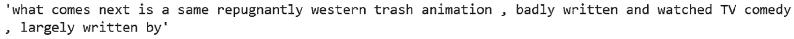

    图 4.3 – 语言模型完成一个短语

1.  运行以下单元格以保存模型。你可以更新单元格来指定保存模型的目录和文件名：

    ```py
    learn.export('/notebooks/temp/models/lm_model_'+modifier)
    ```

1.  运行以下单元格以保存当前路径值：

    ```py
    keep_path = learn.path
    ```

1.  运行以下单元格以为学习器对象路径指定一个新值。这样做的原因是，默认情况下，模型的位置在 Gradient 上不可写，因此你需要更改路径值为你具有写入权限的目录：

    ```py
    learn.path = Path('/notebooks/temp')
    ```

1.  运行以下单元格以保存模型的编码器子集。这个模型去除了最后一层。在你训练文本分类器时，你将在*使用精心策划的文本数据集训练深度学习分类模型*部分使用这个模型：

    ```py
    learn.save_encoder('ft_'+modifier)
    ```

恭喜！你已经成功地将迁移学习应用于在精心挑选的 IMDb 数据集上训练语言模型。需要注意的是，像这样将迁移学习应用于 NLP 的想法，直到 2018 年才首次被提出。现在，感谢 fastai 框架，只需几行代码，你就能利用一种在四年前几乎不存在的技术！

## 它是如何工作的…

在这一部分，你已经看到了如何使用经过精心挑选的文本数据集训练语言模型的简单示例。语言模型通过使用在庞大的维基数据集上预训练的`AWD_LSTM`模型，并使用 IMDb 数据集进行微调来创建。

通过这种方式利用迁移学习，我们最终得到了一个语言模型，它不仅具备了在通用英语方面的较强能力（得益于在维基数据集上预训练的模型），还能生成与电影评论用例相关的文本（得益于 IMDb 数据集）。

值得稍微深入了解一下本食谱中的模型。关于该模型的详细描述超出了本书的范围，因此我们将重点关注其中的一些要点。

如食谱所示，模型被定义为`language_model_learner`对象（文档链接：[`docs.fast.ai/text.learner.html#language_model_learner`](https://docs.fast.ai/text.learner.html#language_model_learner)）。这个对象是 fastai `learner`对象的一个特化版本，你第一次看到这个对象是在*理解世界的四种应用：表格、文本、推荐系统*部分，以及*第一章**，快速上手 fastai*中的图片中。

本食谱中的模型基于预定义的`AWD_LSTM`模型（文档链接：[`docs.fast.ai/text.models.awdlstm.html#AWD_LSTM`](https://docs.fast.ai/text.models.awdlstm.html#AWD_LSTM)）。对于这个模型，`learn.summary()`的输出仅显示高级结构，包括 LSTM 层（传统 NLP 深度学习模型的基础）和 dropout 层（用于减少过拟合）。类似地，该模型的`learn.model`输出从编码层开始（即将输入数据转换为模型内部使用的中间表示），以解码层结束（即将内部表示转换回单词）。

## 还有更多…

在本章中，你将使用一些非常大的数据集，这意味着你可能需要采取额外的步骤，以确保在准备数据集和训练模型时不会耗尽内存。在这里，我们将描述一些步骤，帮助你确保在处理文本数据集时，不会因为内存不足而无法训练你的 fastai 深度学习模型。我们还会详细讨论如何在 Gradient 中保存编码器。

### 如果内存不足会发生什么？

如果你正在尝试训练一个大型模型，可能会遇到类似以下的内存不足提示：

```py
RuntimeError: CUDA out of memory. Tried to allocate 102.00 MiB (GPU 0; 7.93 GiB total capacity; 7.14 GiB already allocated; 6.50 MiB free; 7.32 GiB reserved in total by PyTorch)
```

该消息表示你的环境中的 GPU 内存已满。如果遇到这种内存错误，你可以采取哪些措施呢？有三种方法可以帮助你解决此类内存错误：

+   显式设置批量大小。

+   使用混合精度训练。

+   确保一次只激活一个笔记本。

### 内存错误缓解方法 #1：显式设置批量大小

要显式设置批量大小，你可以重新启动笔记本的内核，然后更新`TextDataLoaders`对象的定义来设置`bs`参数，如下所示：

```py
dls = TextDataLoaders.from_folder(untar_data(URLs.IMDB), valid='test', bs=16)
```

设置`bs`参数可以显式指定批量大小（即用于计算平均损失的数据项数量），而不是默认值 64。通过显式将批量大小设置为比默认值小的值，你限制了每个训练周期（即完全遍历训练数据）消耗的内存量。当你像这样显式设置`bs`参数的值时，确保所设置的`bs`参数值是 8 的倍数。

### 内存错误缓解方法 #2：混合精度训练

另一个可以用来控制内存消耗的技巧是将`to_fp16()`函数应用于学习者对象的定义，如下所示：

```py
learn = language_model_learner(dls,AWD_LSTM,
drop_mult=0.5,metrics=accuracy).to_fp16()
```

通过指定此`to_fp16()`调用，你可以让模型使用精度较低的浮点数进行训练，从而节省内存。结果是，模型训练过程消耗的内存更少。有关更多详细信息，请参考 fastai 文档：[`docs.fast.ai/callback.fp16.html#Learner.to_fp16`](https://docs.fast.ai/callback.fp16.html#Learner.to_fp16)。

### 内存错误缓解方法 #3：坚持使用单个活跃的笔记本

最后，另一种防止内存不足的方法是一次运行一个笔记本。例如，在 Gradient 中，如果你同时激活多个笔记本，可能会耗尽可用内存。如果你已经在`TextDataLoaders`对象中设置了较小的批量大小，并在学习者对象中指定了`to_fp16()`，但仍然出现内存错误，那么可以关闭除当前正在使用的笔记本之外的所有笔记本的内核。

在 Gradient 的 JupyterLab 中，你可以通过右键点击导航面板中的笔记本，然后从菜单中选择**关闭内核**来关闭一个笔记本的内核，如下图所示：

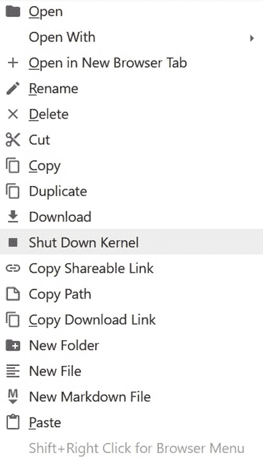

图 4.4 – 在 Gradient JupyterLab 中关闭内核

### 解决方法允许你保存编码器

除了我们刚才回顾的内存优化技巧之外，如果你在使用 Gradient 时，还需要知道一个针对文本模型的额外技巧。在 Gradient 中，你可能会遇到无法在 fastai 希望保存的目录中保存和检索临时对象的情况。

例如，你需要保存语言模型的编码器，并在训练文本分类器时加载该编码器。然而，fastai 强制你将编码器保存在数据集的路径中。`save_encoder` 函数只允许你指定不带路径的文件名，而不是指定保存编码器的目录，正如你在下面的 `save_encoder` 调用中看到的那样：

```py
learn.save_encoder('ft_'+modifier)
```

与此同时，在 Gradient 中，IMDb 数据集的目录 `/storage/data/imdb` 是只读的。那么，如果必须保存的目录不可写，如何保存编码器呢？你可以通过临时更新学习者的 `path` 对象，先将编码器保存在该临时 `path` 值指示的目录中，然后将 `path` 对象设置回原始值来解决这个问题，如下所示：

1.  保存模型的路径值：

    ```py
    keep_path = learner.path
    ```

1.  将模型的路径值更改为你有写权限的目录，例如：

    ```py
    learner.path = Path('/temp/models')
    ```

1.  保存模型。

1.  将路径恢复为原始值：

    ```py
    learner.path = keep_path
    ```

# 使用精心整理的文本数据集训练深度学习分类模型

在前一部分中，我们使用整理过的 IMDb 文本数据集训练了一个语言模型。前一部分中的模型预测给定一组单词后，接下来的一组单词。在本节中，我们将使用在 IMDb 数据集上微调的语言模型，来训练一个文本分类模型，该模型用于分类特定于电影评论的文本样本。

## 准备工作

本配方使用了你在前一部分中训练的编码器，因此请确保你已经按照该部分中的配方步骤进行操作，特别是已经保存了从训练语言模型中得到的编码器。

正如前一部分所述，在 Gradient 中运行使用了在 Wikipedia 语料库上预训练的语言模型的配方之前，你需要执行一些额外的步骤。为了确保你可以使用在本配方中所需的预训练语言模型，如果 AWD_LSTM 的设置被中断，请完成以下步骤。

1.  在 Colab 中，运行 `text_model_training.ipynb` 笔记本中的单元格，直到并包括学习者定义和训练单元格。完成后，将 `/root/.fastai/models/wt103-fwd` 目录中的内容复制到你的 Drive 环境中的一个文件夹。

1.  将你在上一步复制的文件上传到 Gradient 环境中的 `/storage/models/wt103-fwd` 目录。

按照这些步骤，你就可以在 Gradient 中运行此配方的笔记本（以及其他使用 `AWD_LSTM` 的配方）。

## 如何操作…

在本节中，你将通过运行`text_classifier_model.ipynb`笔记本，使用`IMDb`整理的数据集训练一个文本分类深度学习模型。打开笔记本后，完成以下步骤：

1.  运行笔记本中的单元，直到`定义文本分类器`单元。

1.  运行以下单元来定义一个`TextDataLoaders`对象：

    ```py
    dls_clas = TextDataLoaders.from_folder(\
    path, valid='test')
    ```

    下面是`TextDataLoaders`对象定义的参数：

    a) `path`：定义用于定义`TextDataLoaders`对象的数据集路径

    b) `valid`：标识数据集目录结构中用于评估模型性能的文件夹：`imdb/test`

1.  运行以下单元查看一个批次中的样本条目：

    ```py
    dls_clas.show_batch(max_n=3)
    ```

1.  `show_batch()`的输出展示了文本样本及其类别（在`category`列中表示）。fastai 知道类别是编码在文本样本所在的目录中的，并在`show_batch()`中正确显示，如下图所示：

    图 4.5 – `show_batch()`输出

1.  运行以下单元来定义文本分类模型：

    ```py
    learn_clas = text_classifier_learner(dls_clas, AWD_LSTM, 
                                    metrics=accuracy).to_fp16()
    ```

    下面是`text_classifier_learner`对象定义的参数：

    a) `dls_clas`：这是在前一个单元中定义的`TextDataLoaders`对象。

    b) `AWD_LSTM`：这是作为该模型基础使用的预训练模型。如果你在 Colab 中运行此笔记本，你可以在运行此单元后，找到组成该模型的文件，路径是`/root/.fastai/models/wt103-fwd`。

    c) `metrics`：这是要优化的模型性能指标，在此案例中为准确率。

1.  你需要加载在上一节中作为配方保存的编码器。第一步是为`learn_clas`对象设置路径，使其指向保存编码器的路径，运行以下单元即可。确保指定的目录是你在上一节保存编码器的目录：

    ```py
    learn_clas.path = Path('/notebooks/temp')
    ```

1.  运行以下单元来加载你在*使用整理文本数据集训练深度学习语言模型*一节中保存的编码器到`learn_clas`对象：

    ```py
    learn_clas = learn_clas.load_encoder('ft_'+modifier)
    ```

1.  运行以下单元来训练模型：

    ```py
    learn_clas.fit_one_cycle(5, 2e-2)
    ```

    下面是`fit_one_cycle`的参数：

    a) 参数 epoch 计数（第一个参数）指定训练运行`5`个 epoch。

    b) 参数学习率（第二个参数）指定学习率为`0.02`。

    该单元的输出显示了训练结果，包括每个 epoch 的准确度和所需时间，如下图所示：

    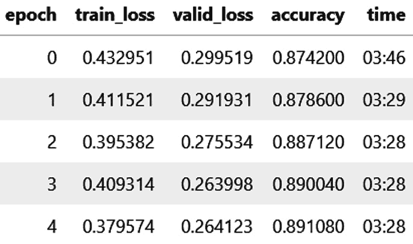

    图 4.6 – 文本分类模型训练结果

1.  运行这些单元，对你期望为负面和正面的文本字符串进行预测，并观察训练好的模型是否做出了预期的预测，如以下截图所示：

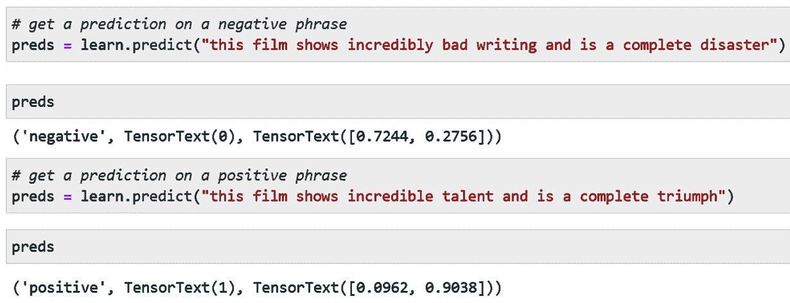

图 4.7 – 使用文本分类器对文本字符串进行预测

恭喜你！你已经将经过 IMDb 数据集微调的语言模型用于训练文本分类模型，该模型对特定于电影评论的文本样本进行分类。

## 它是如何工作的…

你可以通过对比本节定义文本分类器的代码与前一节定义语言模型的代码，看到 fastai 的强大。总共只有三点差异：

1.  在`TextDataLoaders`对象的定义中，以下内容适用：

    a) 语言模型具有`is_lm`参数，用于指示该模型是一个语言模型。

    b) 文本分类器具有`label_col`参数，用于指示数据集中的哪一列包含模型正在预测的类别。在本节定义的文本分类器中，数据集的标签是通过数据集的目录结构进行编码的，而不是数据集中的一列，因此在定义`TextDataLoaders`对象时不需要该参数。

1.  在模型定义中，以下内容适用：

    a) 语言模型定义了一个`language_model_learner`对象。

    b) 文本分类器定义了一个`text_classifier_learner`对象。

1.  在从模型获取预测时，以下内容适用：

    a) 语言模型在调用`learn.predict()`时有两个参数，第一个是用来进行预测的字符串，第二个是要预测的单词数量。

    b) 文本分类器在调用`learn.predict()`时有一个参数，即模型将预测其类别的字符串。

仅通过这三点差异，fastai 就处理了语言模型和文本分类器之间的所有底层差异。

## 还有更多内容…

如果你使用的是 Gradient 环境，并且正在使用带有费用的笔记本，你可能需要控制笔记本的活跃时间，以避免支付超过所需的时间。你可以在启动时通过从**自动关机**菜单中选择小时数来选择会话持续时间，如下截图所示：

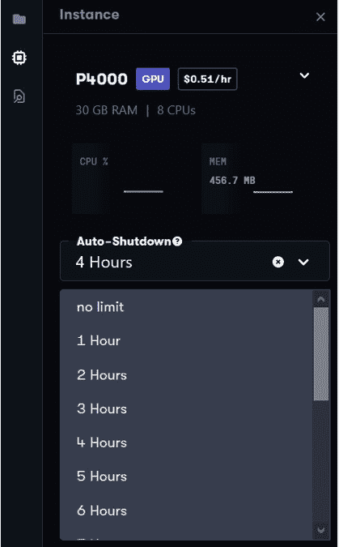

图 4.8 – 为 Gradient 笔记本会话选择持续时间

假设你选择了比实际需要更长的时间，并且在自动关机时间限制到达之前就完成了会话。那么，你是否应该显式地关闭会话？

我的经验是，如果你尝试在 Gradient 笔记本界面中通过选择**停止实例**按钮（如*图 4.9*所示）来停止实例，你将面临将实例置于无法轻松重新启动的状态的风险：


图 4.9 – 在 Gradient 中的实例视图中的“停止实例”按钮

如果您选择**停止实例**并且您的实例进入无法重新启动的状态，那么您必须联系*Paperspace*支持团队来修复您的实例。在这种情况发生了几次之后，我停止使用**停止实例**按钮，而是等实例在我完成工作后超时自动停止。通过不显式停止您的 Gradient 实例，而是让其在会话结束时超时，您将节省更多时间。

# 使用独立文本数据集训练深度学习语言模型

在前面的章节中，我们使用精选的文本数据集 IMDb 训练了一个语言模型和文本分类器。在这一节和接下来的章节中，我们将使用一个独立的文本数据集——*Kaggle 新冠推文 NLP – 文本分类*数据集，进行语言模型和文本分类器的训练。该数据集可以在这里找到：[`www.kaggle.com/datatattle/covid-19-nlp-text-classification`](https://www.kaggle.com/datatattle/covid-19-nlp-text-classification)。该数据集包含与新冠疫情相关的一些推文，并且对这些推文进行了五个类别的分类：

+   极度负面

+   负面

+   中立

+   正面

+   极度正面

在这个数据集上训练的语言模型的目标是根据一个起始短语预测新冠相关推文中的后续单词。在这个数据集上训练的文本分类模型的目标，如*使用独立文本数据集训练深度学习文本分类器*一节中所述，是预测一个短语属于五个类别中的哪一个。

## 准备工作

如本章前面所述，在您能够在 Gradient 中运行此食谱之前，您需要采取一些额外的步骤，以确保您可以访问将在此食谱中使用的预训练语言模型。如果您尚未执行这些步骤，请按照以下步骤准备 Gradient 环境（如果 AWD_LSTM 的设置中断了）：

1.  在 Colab 中，运行`text_model_training.ipynb`笔记本的单元格，直到包括学习者定义和训练单元格为止。完成后，将`/root/.fastai/models/wt103-fwd`目录中的内容复制到您的 Drive 环境中的文件夹中。

1.  将您在上一步中复制的文件上传到 Gradient 环境中的`/storage/models/wt103-fwd`目录。

完成这些步骤后，您现在应该能够在 Gradient 中运行此食谱（以及其他使用`AWD_LSTM`的食谱）。

确保您已将构成独立新冠相关推文数据集的文件上传到您的 Gradient 环境中，可以按照以下步骤操作：

1.  从[`www.kaggle.com/datatattle/covid-19-nlp-text-classification`](https://www.kaggle.com/datatattle/covid-19-nlp-text-classification)下载`archive.zip`文件。

1.  解压下载的`archive.zip`文件，提取`Corona_NLP_test.csv`和`Corona_NLP_train.csv`文件。

1.  在 Gradient 环境的终端中，将`/storage/archive`设置为当前目录：

    ```py
    cd /storage/archive
    ```

1.  创建`/storage/archive/covid_tweets`目录：

    ```py
    mkdir covid_tweets
    ```

1.  将`/storage/archive/covid_tweets`设置为当前目录：

    ```py
    cd /storage/archive/covid_tweets
    ```

1.  在`/storage/archive/covid_tweets`中创建`test`和`train`目录：

    ```py
    mkdir test
    mkdir train
    ```

1.  将您在*步骤 2*中解压的文件（`Corona_NLP_test.csv`和`Corona_NLP_train.csv`）上传到`/storage/archive/covid_tweets`。您可以使用 Gradient 中的 JupyterLab 的上传按钮进行上传，但需要分几步完成：

    a) 在 Gradient 环境的终端中，将`/notebooks`设置为当前目录：

    ```py
    notebooks/temp directory, make a new /notebooks/temp directory:

    ```

    在临时文件夹中，选择上传按钮（见*图 4.10*），并从本地系统文件夹中选择在*步骤 2*中解压的`Corona_NLP_test.csv`和`Corona_NLP_train.csv`文件：

    ```py

    ```

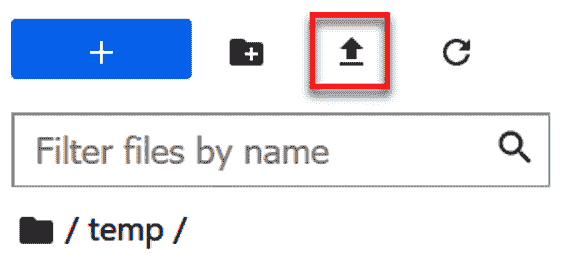

图 4.10 – JupyterLab 中的上传按钮

d) 在 Gradient 环境的终端中，将`Corona_NLP_test.csv`文件复制到`/storage/archive/covid_tweets/test`目录：

```py
cp /notebooks/temp/Corona_NLP_test.csv /storage/archive/covid_tweets/test/Corona_NLP_test.csv
```

e) 将`Corona_NLP_train.csv`文件复制到`/storage/archive/covid_tweets/train`目录：

```py
cp /notebooks/temp/Corona_NLP_train.csv /storage/archive/covid_tweets/train/Corona_NLP_train.csv
```

一旦您完成上传构成 Covid 相关推文数据集的文件步骤，您应该在 Gradient 环境中的`/storage/archive/covid_tweets`目录下拥有以下目录结构：

```py
├── test
│   └── Corona_NLP_test.csv
└── train
    └── Corona_NLP_train.csv
```

通过这些准备步骤，您已将构成数据集的文件放入 Gradient 环境中的正确位置，以供 fastai 模型使用。

我感谢有机会在本书中包含 Covid 推文数据集，并感谢该数据集的策展人以及 Kaggle 使该数据集得以公开。

数据集引用

Aman Miglani (2020). *Coronavirus tweets NLP - Text Classification* ([`www.kaggle.com/datatattle/covid-19-nlp-text-classification`](https://www.kaggle.com/datatattle/covid-19-nlp-text-classification))

## 如何操作…

在本节中，您将运行`text_standalone_dataset_lm.ipynb`笔记本，使用与 Covid 相关的推文独立数据集训练语言模型。打开笔记本后，完成以下步骤：

1.  运行笔记本中的单元格直到`Ingest the dataset`单元格。

1.  运行以下单元格来定义数据集的路径对象：

    ```py
    path = URLs.path('covid_tweets')
    ```

    注意

    该路径定义的参数是您在 Gradient 环境中复制了数据集 CSV 文件的目录层次结构根目录的名称。

1.  运行以下单元格来定义一个`df_train`数据框，用于包含`Corona_NLP_train.csv`文件的内容：

    ```py
    df_train = pd.read_csv(path/'train/Corona_NLP_train.csv',
                           encoding = "ISO-8859-1")
    ```

    以下是定义数据框架的参数：

    a) `path/'train/Corona_NLP_train.csv'`参数指定了数据集训练部分的部分文件名。

    b) `encoding = "ISO-8859-1"`参数指定用于文件的编码。此编码选择是为了确保 CSV 文件的内容可以无误地导入到数据框中。

1.  运行以下单元格以定义`TextDataLoaders`对象：

    ```py
    dls = TextDataLoaders.from_df(df_train, path=path, 
                                 text_col='OriginalTweet',
                                 is_lm=True)
    ```

    以下是`TextDataLoaders`对象定义的参数：

    a) `df_train`：你在上一步中创建的数据框。

    b) `path`：数据集的路径对象。

    c) `text_col`：数据框中包含用于训练模型的文本的列。在这个数据集里，`OriginalTweet`列包含了用于训练模型的文本。

    d) `is_lm`：指示该模型是语言模型的标志。

1.  运行以下单元格以定义并训练带有`language_model_learner`对象的深度学习模型：

    ```py
    learn = language_model_learner(dls,AWD_LSTM,
                               metrics=accuracy).to_fp16()
    learn.fine_tune(1, 1e-2)
    ```

    注意

    `language_model_learner`对象的定义包括调用`to_fp16()`来指定混合精度训练（总结见：[`docs.fast.ai/callback.fp16.html#Learner.to_fp16`](https://docs.fast.ai/callback.fp16.html#Learner.to_fp16)），以减少训练过程中的内存消耗。

    以下是`language_model_learner`对象定义的参数：

    a) `dls`：你在上一步中定义的`TextDataLoaders`对象。

    b) `AWD_LSTM`：用作此模型基础的预训练模型。这是与 fastai 结合使用的预训练语言模型，使用维基百科进行训练。

    c) `metrics`：模型优化的性能指标，在本例中为准确率。

    以下是`fine_tune`语句的参数：

    a) epoch 计数参数（第一个参数）指定训练过程中的迭代次数。

    b) 学习率参数（第二个参数）指定训练过程中的学习率。

    训练过程的结果，如*图 4.11*所示，在执行`fine_tune`语句后显示：

    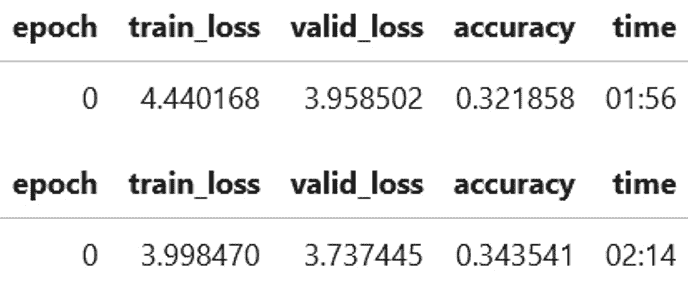

    图 4.11 – 训练过程的结果

1.  运行以下单元格以运行训练好的语言模型：

    ```py
    learn.predict("what comes next", n_words=20)
    ```

    结果如下所示：

    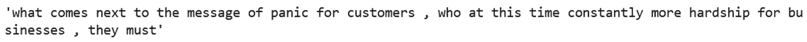

    图 4.12 – 在独立文本数据集上训练的语言模型的预测

1.  运行以下单元格以保存模型。你可以更新单元格来指定保存模型的目录和文件名：

    ```py
    learn.export('/notebooks/temp/models/lm_model_standalone'+modifier)
    ```

1.  运行以下单元格以保存当前路径值：

    ```py
    keep_path = learn.path
    ```

1.  运行以下单元格以为学习器对象路径分配新值。这样做的原因是，模型的默认位置在 Gradient 上不可写，因此你需要将路径值更改为你有写入权限的目录：

    ```py
    learn.path = Path('/notebooks/temp')
    ```

1.  运行以下单元格以保存语言模型的编码器子集。这是去除最后一层的模型。你将在下一部分中使用这个编码器，当你在 Covid 相关推文的独立数据集上训练文本分类器时将用到它：

    ```py
    learn.save_encoder('ft_standalone'+modifier)
    ```

恭喜！你使用 fastai 在现有模型的基础上进行了迁移学习，并结合 Covid 相关推文独立数据集创建了一个经过微调的语言模型。在下一部分中，你将使用上一步保存的编码器来微调一个基于独立数据集训练的文本分类器。

## 它是如何工作的…

在这一部分，你已经看到了一个简单的例子，展示了如何使用 fastai 和独立文本数据集训练语言模型。语言模型的创建是通过使用一个已经在海量 Wikipedia 数据集上训练的现有模型（`AWD_LSTM`），然后使用独立的 Covid 相关推文数据集对其进行微调。

通过这种方式利用迁移学习，我们得到了一个语言模型，既具备了良好的通用英语能力（得益于在 Wikipedia 数据集上预训练的模型），也具备了生成与 Covid-19 大流行相关的社交媒体内容的能力（得益于 Covid 推文数据集）。通过遵循本节中的教程，你可以利用 fastai 在其他文本数据集和用例中应用这种方法（NLP 的迁移学习）。

# 使用独立文本数据集训练深度学习文本分类器

在*使用独立文本数据集训练深度学习语言模型*部分，我们使用独立文本数据集训练了一个语言模型：Kaggle 上的“Coronavirus tweets NLP – Text Classification”数据集，详细描述请见这里：[`www.kaggle.com/datatattle/covid-19-nlp-text-classification`](https://www.kaggle.com/datatattle/covid-19-nlp-text-classification)。在这一部分，我们将使用这个语言模型创建一个基于与 Covid 相关的推文数据集训练的文本分类器。

## 准备工作

这个教程使用了你在*使用独立文本数据集训练深度学习语言模型*部分中训练的编码器，因此请确保你已按照该部分中的教程步骤进行操作，特别是要确保你已经保存了上部分训练的语言模型中的编码器。

同时，请确保你已按照上一部分的*准备工作*子节中的所有步骤，确保以下几点：

+   你已在 Gradient 环境中访问到`AWD_LSTM`模型。

+   你已经将包含独立 Covid 相关推文数据集的文件（`Corona_NLP_test.csv`和`Corona_NLP_train.csv`）上传到你的 Gradient 环境中。

## 如何操作...

在本节中，你将通过 `text_standalone_dataset_classifier.ipynb` 笔记本来训练一个文本分类深度学习模型，使用的是与 Covid 相关的推文数据集。打开笔记本后，按以下步骤操作：

1.  运行笔记本中的单元格，直到 `Ingest the dataset` 单元格。

1.  运行以下单元格来定义数据集的路径对象。注意，参数是你在 Gradient 环境中复制 CSV 文件所在的根目录的名称：

    ```py
    path = URLs.path('covid_tweets')
    ```

1.  运行以下单元格来定义一个数据框，包含 `Corona_NLP_train.csv` 文件的内容（与 Covid 相关的推文数据集的训练部分）：

    ```py
    df_train = pd.read_csv(path/'train/Corona_NLP_train.csv',
                           encoding = "ISO-8859-1")
    ```

    以下是定义数据框的参数：

    a) `path/'train/Corona_NLP_train.csv'` 参数指定了数据集训练部分的部分限定文件名。

    b) `encoding = "ISO-8859-1"` 参数指定了用于文件的编码格式。选择此编码格式是为了确保 CSV 文件的内容能够无误地导入到数据框中。

1.  运行以下单元格来定义 `TextDataLoaders` 对象：

    ```py
    dls = TextDataLoaders.from_df(df_train, path=path, text_col='OriginalTweet',label_col='Sentiment')
    ```

    以下是定义 `TextDataLoaders` 对象的参数：

    a) `df_train`：你在前一步中创建的数据框。

    b) `path`：数据集的路径对象。

    c) `text_col`：数据框中包含将用于训练模型的文本的列。对于该数据集，`OriginalTweet` 列包含用于训练模型的文本。

    d) `label_col`：数据框中包含文本分类器将预测的标签的列。

1.  运行以下单元格来查看你在前一步中定义的 `TextDataLoaders` 对象中的一个批次：

    ```py
    dls.show_batch(max_n=3)
    ```

    该语句的输出，`text` 和 `category` 列，将如下所示：

    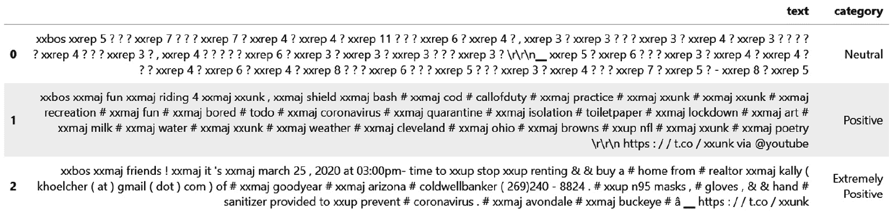

    图 4.13 – 来自 Covid 推文数据集的批次

1.  运行以下单元格来定义 `text_classifier_learner` 对象，以用于文本分类模型：

    ```py
    learn_clas = text_classifier_learner(dls, AWD_LSTM, 
                               metrics=accuracy).to_fp16()
    ```

    注意

    `text_classifier_learner` 对象的定义包括调用 `to_fp16()` 来指定混合精度训练（此处总结：[`docs.fast.ai/callback.fp16.html#Learner.to_fp16`](https://docs.fast.ai/callback.fp16.html#Learner.to_fp16)），以减少训练过程中内存的消耗。

    以下是定义 `text_classifier_learner` 对象的参数：

    a) `dls`：你在前一步中定义的 `TextDataLoaders` 对象。

    b) `AWD_LSTM`：用作此模型基础的预训练模型。它是与 fastai 集成的预训练语言模型，已使用维基百科进行训练。

    c) `metrics`：要优化的模型性能指标，在此案例中为准确度。

1.  运行以下单元格，为学习器对象路径分配一个新值。这样做的原因是将路径设置为与你在前一部分保存编码器的目录匹配：

    ```py
    learn_clas.path = Path('/notebooks/temp')
    ```

1.  运行以下代码单元，将你在*训练深度学习语言模型与独立文本数据集*部分保存的编码器加载到`learn_clas`对象中：

    ```py
    learn_clas =\
    learn_clas.load_encoder('ft_standalone'+modifier)
    ```

1.  运行以下代码单元，重置学习器对象路径的值：

    ```py
    learn_clas.path = keep_path
    ```

1.  运行以下单元格来训练模型：

    ```py
    learn_clas.fit_one_cycle(1, 2e-2)
    ```

    这是`fit_one_cycle`的参数：

    a) 纪元计数参数（第一个参数）指定训练运行 1 个纪元。

    b) 学习率参数（第二个参数）指定学习率为 0.02。

    该单元格的输出（如*图 4.14*所示）展示了训练的结果：

    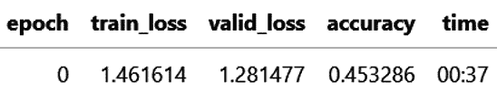

    图 4.14 – 文本分类器训练的输出

1.  运行单元格，对你预期为负面和正面的文本字符串进行预测，观察训练好的模型是否做出了预期的预测（如*图 4.15*所示）：

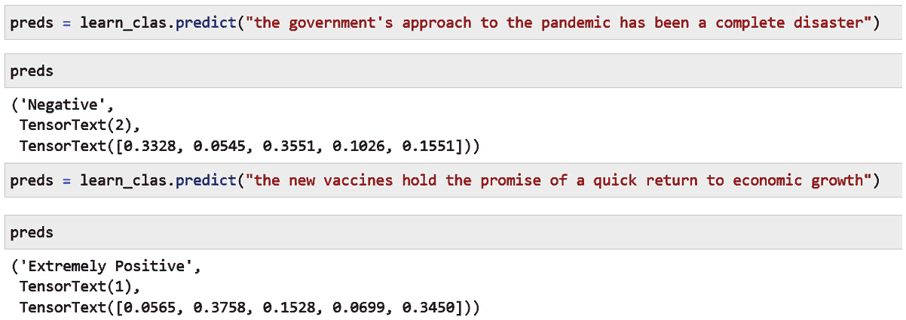

图 4.15 – 使用文本分类器对文本字符串进行预测

恭喜！你已经利用 fastai 的功能，在独立数据集上使用迁移学习训练了文本分类器。

## 它是如何工作的…

针对独立的 Covid 相关推文数据集，文本分类器模型的代码与针对精心策划的 IMDb 文本数据集的文本分类器模型代码有一些不同。让我们来看一下其中的一些差异。

对于 IMDb 数据集，`TextDataLoaders`定义不包括`label_col`参数：

```py
dls_clas = TextDataLoaders.from_folder(path, valid='test')
```

相比之下，独立数据集的`TextDataLoaders`定义包括`text_col`和`label_col`参数：

```py
dls = TextDataLoaders.from_df(df_train, path=path, text_col='OriginalTweet',label_col='Sentiment')
```

为什么会有这些差异？首先，对于`IMDb`数据集，我们使用`TextDataLoaders`的`from_folder`变体，因为数据集是按单独的文本文件组织的，而每个文件所属的类别由该文件所在的目录编码。以下是 IMDb 数据集的目录结构：

```py
├── test
│   ├── neg
│   └── pos
├── tmp_clas
├── tmp_lm
├── train
│   ├── neg
│   └── pos
└── unsup
```

考虑 IMDb 数据集中的一个文件，`train/pos/9971_10.txt`：

*这部电影非常棒，我觉得原版还算平庸。不过这部作品却具备了所有要素，一辆 1970 年的 Hemi Challenger，配备四速变速器，真的展示了母亲 Mopar 如何打造出最棒的肌肉车！每次 Kowalski 踩下那大块 Hemi 时，我仿佛置身于克莱斯勒的天堂，而他确实经常这么做 :)*

当我们训练文本分类模型时，fastai 如何知道这篇评论的类别？它知道，因为这个文件位于`/pos`目录中。得益于 fastai 的灵活性，我们只需将`path`值传递给`TextDataLoaders`对象的定义，fastai 框架会自动识别数据集中每个文本样本的类别。

现在，让我们来看一下独立的与 Covid 相关的推文数据集。这个数据集被打包为 CSV 文件，格式如下：

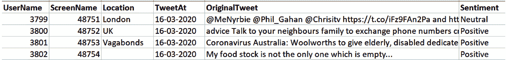

图 4.16 —— 来自与 Covid 相关的推文数据集的样本

与 IMDb 数据集不同，Covid 相关的推文数据集只包含两个文件（一个用于训练数据集，一个用于测试数据集）。这些文件的列包含 fastai 训练模型所需的信息：

+   样本的文本 —— 在`OriginalTweet`列中

+   样本的类别（也称为标签）——在`Sentiment`列中

为了告诉 fastai 如何解读这个数据集，我们需要在`TextDataLoaders`对象的定义中明确告诉它文本所在的列和类别（或标签）所在的列，方法如下：

```py
dls = TextDataLoaders.from_df(df_train, path=path, text_col='OriginalTweet',label_col='Sentiment')
```

`IMDb`数据集由成千上万的单独文本文件组成，这些文件分布在一个复杂的目录结构中，目录编码了每个文本文件的类别。相比之下，Covid 相关的推文数据集由两个 CSV 文件组成，其中列包含文本样本及其类别。尽管这两个数据集的组织方式不同，fastai 仍然能够加载它们并通过对`TextDataLoaders`对象定义进行少许调整，准备好用于训练深度学习模型。fastai 能够轻松加载各种格式的数据集，不仅对文本数据集有用，对所有种类的数据集都很有帮助。正如你将在*第六章*《使用视觉数据训练模型》中看到的那样，处理图像数据集时，我们从这一能力中受益匪浅，因为图像数据集有许多不同的组织方式。

# 测试你的知识

现在，你已经完成了多个使用文本数据集训练 fastai 深度学习模型的扩展示例，你可以尝试一些变化来练习你所学到的内容。

## 准备工作

确保你已按照*使用独立文本数据集训练深度学习文本分类器*部分中的*准备工作*步骤准备好你的 Gradient 环境并上传与 Covid 相关的推文数据集。

## 如何操作…

你可以按照本节中的步骤，尝试一些使用 Covid 相关推文数据集训练的模型的变化：

1.  复制你在*使用独立文本数据集训练深度学习语言模型*部分中操作过的`text_standalone_dataset_lm.ipynb`笔记本。给你的新副本命名为：`text_standalone_dataset_lm_combo.ipynb`。

1.  在你的新笔记本中，除了为训练用的 CSV 文件 `Corona_NLP_train.csv` 创建一个数据框（dataframe），还需要通过在笔记本中添加一个类似于下面的单元格来为测试用的 CSV 文件 `Corona_NLP_test.csv` 创建一个数据框：

    ```py
    df_test = pd.read_csv(path/'test/Corona_NLP_test.csv ',encoding = "ISO-8859-1")
    ```

1.  使用 pandas 的 `concat` 函数将两个数据框合并成一个新的数据框，命名为 `df_combo`：

    ```py
    df_combo = pd.concat([df_train, df_test], axis=0)
    ```

1.  现在更新你新笔记本的其余部分，使用 `df_combo` 代替 `df_train`，并运行整个笔记本来训练一个新的语言模型。你注意到模型性能有什么不同吗？

1.  在大多数模型训练场景中，你需要确保不要使用测试数据集来训练模型。你能想出为什么可以用测试集来训练这样的语言模型吗？

恭喜！你已经完成了使用 fastai 在文本数据集上训练 fastai 深度学习模型的复习。
