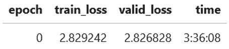

# 第五章：*第五章*：训练推荐系统

在本书中，到目前为止我们已经通过使用 fastai 训练深度学习的配方，处理了各种数据集。在本章中，我们将介绍一些配方，这些配方利用 fastai 对**推荐系统**（也称为**协同过滤系统**）的支持。推荐系统结合了在*第三章*《使用表格数据训练模型》中介绍的表格数据模型的特点，以及在*第四章*《使用文本数据训练模型》中介绍的文本数据模型的特点。

推荐系统涵盖了一个狭窄但已被验证的应用场景：给定一组用户及其对一组项目的评分，推荐系统可以预测用户对一个尚未评分的项目的评分。例如，给定一组书籍和一组读者对这些书籍的评价，推荐系统可以预测某位读者对一本他们尚未阅读的书籍的评价。

在本章中，你将学习如何通过处理一系列配方，利用 fastai 内建的推荐系统支持，在各种推荐系统数据集上训练模型。你将看到一些你在前几章中已经熟悉的 fastai 特性，以及一些独特的、仅适用于推荐系统的新特性。在完成本章内容后，你将能够使用 fastai 的高级 API 在你自己的数据集上创建推荐系统。

本章将涵盖以下配方：

+   在小型精心策划的数据集上训练推荐系统

+   在大型精心策划的数据集上训练推荐系统

+   在独立数据集上训练推荐系统

+   测试你的知识

# 技术要求

确保你已经完成了*第一章*《快速入门 fastai》中的设置部分，并且已经有了一个可用的 `ch5` 文件夹。这个文件夹包含了本章描述的代码示例。

# 在小型精心策划的数据集上训练推荐系统

你可能还记得，在*第一章*《快速入门 fastai》中，描述了 fastai 支持的应用，涵盖了四种类型的数据集：**表格数据**、**文本数据**、**推荐系统**和**图像数据**。在*第二章*《使用 fastai 探索和清理数据》中，你看到了关于检查表格数据集、文本数据集和图像数据集的部分内容。

你可能会想，为什么没有关于检查推荐系统数据集的章节。原因是，在 fastai 中，推荐系统的数据导入过程与表格数据集的数据导入过程是相同的，正如你将在本节中看到的那样。虽然推荐系统的数据导入过程与表格数据集的导入过程相同，但 fastai 提供了专门针对推荐系统的模型训练细节。

在本节中，我们将介绍如何在一个精心挑选的数据集上训练推荐系统，以了解如何使用 fastai 训练推荐系统。

在本节中，你将使用一个小型的精心挑选的数据集——`ML_SAMPLE`来训练推荐系统。该数据集是 MovieLens 数据集的一个子集（[`grouplens.org/datasets/movielens`](https://grouplens.org/datasets/movielens)），包含了用户对电影的评分。在*在大规模精心挑选的数据集上训练推荐系统*这一节中，我们将使用 MovieLens 数据集的更大子集——`ML_100k`来训练推荐系统。

## 准备就绪

确保你可以在仓库的`ch5`目录下打开`training_recommender_systems.ipynb`笔记本。

本节中使用的数据集以及*在大规模精心挑选的数据集上训练推荐系统*部分的数据集来自 MovieLens 数据集。我衷心感谢能够使用这个数据集来展示 fastai 的推荐系统功能。

数据集引用

Andrew L. Maas, Raymond E. Daly, Peter T. Pham, Dan Huang, Andrew Y. Ng, 和 Christopher Potts. (2011). *用于情感分析的词向量学习* ([`ai.stanford.edu/~amaas/papers/wvSent_acl2011.pdf`](http://ai.stanford.edu/~amaas/papers/wvSent_acl2011.pdf))。第 49 届计算语言学协会年会（ACL 2011）[`www.aclweb.org/anthology/P11-1015`](http://www.aclweb.org/anthology/P11-1015)

## 如何操作…

在本节中，你将运行`training_recommender_systems.ipynb`笔记本。一旦你在 fastai 环境中打开了该笔记本，完成以下步骤：

1.  运行笔记本中的单元格，直到`导入数据集`单元格，以导入所需的库并设置笔记本。

1.  运行以下单元格定义该数据集的`path`对象：

    ```py
    path = untar_data(URLs.ML_SAMPLE)
    ```

1.  运行以下单元格检查数据集的目录结构：

    ```py
    path.ls()
    ```

    以下输出显示了数据集的目录结构：

    

    图 5.1 – path.ls()的输出

1.  运行以下单元格将数据集加载到`df`数据框中：

    ```py
    df = pd.read_csv(path/'ratings.csv')
    ```

1.  运行以下单元格查看数据集中的一些记录：

    ```py
    df.head()
    ```

    输出，如*图 5.2*所示，列出了数据集中的记录。每条记录代表用户对电影的评分。`userId` 列包含用户的 ID，`movieId` 列包含电影的 ID，`rating` 列中的值是用户对电影的评分。例如，用户 `73` 给电影 `1097` 评分为 4.0：

    

    图 5.2 – `df.head()` 的输出

1.  运行以下代码单元来为数据集定义一个 `CollabDataLoaders` 对象：

    ```py
    dls=CollabDataLoaders.from_df(df,bs= 64)
    ```

    `CollabDataLoaders` 对象的定义使用了以下参数：

    a) `df`：你在此笔记本中早些时候定义的 DataFrame

    b) `bs`：模型训练过程中的批次大小

1.  运行以下代码单元，查看你在前一步定义的 `CollabDataLoaders` 对象的一个批次：

    ```py
    dls.show_batch()
    ```

    输出显示了批次的内容，如下图所示：

    

    图 5.3 – `show_batch()` 的输出

1.  运行以下代码单元来定义推荐系统模型的 `collab_learner` 对象：

    ```py
    learn=collab_learner(dls, y_range= [ 0 , 5.0 ] )
    ```

    以下是定义 `collab_learner` 对象时的参数：

    a) `dls`：你在前一步定义的 `CollabDataLoaders` 对象

    b) `y_range`：`rating` 列中的值范围

1.  运行以下代码单元来训练协同过滤模型：

    ```py
    learn.fit_one_cycle( 5 )
    ```

    以下是模型定义的参数：

    a) `5`：模型训练运行的纪元数

    输出显示了训练和验证损失，如下图所示。你可以通过验证损失随纪元数的减少而降低，来观察训练的改进：

    

    图 5.4 – 训练协同过滤模型的输出

1.  现在我们已经训练了推荐系统，我们想通过让它预测一些用户对某些电影的评分来进行测试。为了测试推荐系统，我们首先需要创建一些测试数据。创建测试数据，请运行以下代码单元，定义一个包含几个测试条目的 DataFrame：

    ```py
    scoring_columns = ['userId','movieId']
    test_df = pd.DataFrame(columns=scoring_columns)
    test_df.at[0,'userId'] = 388
    test_df.at[0,'movieId'] = 153
    test_df.at[1,'userId'] = 607
    test_df.at[1,'movieId'] = 1210
    test_df.head()
    ```

    以下是该代码单元的关键元素：

    a) `scoring_columns`：一个包含 DataFrame 列名的列表。请注意，这些列名与 `show_batch()` 输出中看到的列名相同。

    b) `test_df`：包含测试条目的 DataFrame，列名由 `scoring_columns` 列表指定。

    `test_df.head()` 的输出显示了完成的 DataFrame 内容，如下图所示：

    

    图 5.5 – `test_df` DataFrame 的内容

    这些 `test_df` DataFrame 中的条目是什么意思？我们将使用该 DataFrame 来查看推荐系统对于以下组合的预测：

    a) `userId` 为 `388` 的用户对 `movieId` 为 `153` 的电影评分。

    b) `userId` `607` 对 `movieId` `1210` 的评分。

1.  现在你已经定义了 `test_df` 数据框，包含了你想要测试推荐系统的条目，你可以使用它来测试已训练的推荐系统。运行以下代码单元来获取推荐系统对 `test_df` 中条目的评分预测：

    ```py
    dl = learn.dls.test_dl(test_df)
    learn.get_preds(dl=dl)
    ```

    此代码单元的输出展示了推荐系统的结果，如下图所示：


图 5.6 – 推荐系统的结果

这些结果意味着什么？推荐系统的预测结果如下：

a) `userId` `388` 对 `movieId` `153` 的评分是 `2.4156`。

b) `userId` `607` 对 `movieId` `1210` 的评分是 `3.6090`。

恭喜！你已经使用 fastai 训练并测试了一个推荐系统，且使用了其中一个整理好的数据集。

## 它是如何工作的……

在这一部分，你通过一个教程训练了一个非常基础的推荐系统。以下是你在这个教程中创建的关键 fastai 对象的总结：

+   一个与 `URLs` 对象相关的 `path` 对象，用于存储精心整理的数据集：

    ```py
    path = untar_data(URLs.ML_SAMPLE)
    ```

+   一个 `DataLoaders` 对象：

    ```py
    dls=CollabDataLoaders.from_df(df,bs= 64)
    ```

+   一个 `learner` 对象：

    ```py
    learn=collab_learner(dls, y_range= [ 0 , 5.0 ]
    ```

这些组成部分对你来说应该很熟悉，它们是你在*第三章*《使用表格数据训练模型》和*第四章*《使用文本数据训练模型》中使用的相同核心组成部分。fastai 高级 API 的一个优点是，它使用相同的构建模块来创建和训练适用于广泛数据集的深度学习模型，包括你在前面的章节和本节中见到的数据集。

这一部分有一部分不同于你到目前为止见过的大多数教程——在一组测试样本上测试已训练的深度学习模型。回忆一下你如何在*第四章*《使用文本数据训练模型》中测试语言模型的方式。以下是 `text_model_training.ipynb` 笔记本中测试语言模型的代码单元：

```py
learn.predict("what comes next", n_words=20)
```

通过简单调用 `predict()` 函数，你可以从训练好的语言模型中获得结果，如下图所示：


图 5.7 – 在独立文本数据集上训练的语言模型的预测结果

我们将对比你在*第四章*《使用文本数据训练模型》中如何测试语言模型的方式，以及你在这个教程中训练推荐系统时需要做的工作，具体如下：

1.  构建一个 `test_df` 数据框，包含测试样本，如下图所示：

    图 5.8 – `test_df` 数据框的内容

1.  使用刚刚创建的`test_df` DataFrame 作为参数，调用`test_dl`。您可以把`test_dl`看作是在`test_df` DataFrame 上应用了与`CollabDataLoaders`对象`dls`相同的管道：

    ```py
    dl = learn.dls.test_dl(test_df)
    ```

    这次调用的输出是测试数据加载器对象`dl`。通过这次对`test_dl`的调用，您已经将 DataFrame 转换成了训练好的模型（推荐系统）可以应用的格式。

1.  在`learn`对象上调用`get_preds`，将训练好的推荐系统应用于数据加载器对象`dl`：

    ```py
    learn.get_preds(dl=dl)
    ```

为什么在训练推荐系统时需要额外的步骤，而在训练语言模型时不需要这些步骤？答案是，作为语言模型输入的文本短语不需要经过特定于样本的管道处理，就可以直接应用到模型中。

在后台，fastai 使用与`TextDataLoaders`对象相关的词汇表将输入字符串转换为标记（默认为单词），然后将标记转换为数字 ID。您不需要显式地调用这个管道——当您在语言模型上调用`predict()`时，这个管道会自动为您调用。

与输入语言模型的文本字符串不同，推荐系统的输入具有结构，因此您需要将推荐系统的输入样本定义为 DataFrame。一旦定义了 DataFrame，您还需要调用`test_dl`来应用转化管道（该管道在定义`CollabDataLoaders`对象时已隐式定义）到输入样本上。然后，您可以使用`test_dl`的输出从推荐系统中获取预测。

在进入下一个配方之前，值得更仔细地查看一下这个配方中的模型。由于对模型的详细描述超出了本书的范围，我们这里只关注一些重点内容。

如配方所示，模型被定义为`collab_learner`对象（文档在此：[`docs.fast.ai/collab.html#collab_learner`](https://docs.fast.ai/collab.html#collab_learner)）。这个对象是 fastai 的`learner`对象的一个特化，您在*理解四大应用：表格、文本、推荐系统*和*第一章**，快速上手 fastai*中的图片部分首次见到过这个对象。

`learn.model`的输出显示该模型是一个`EmbeddingDotBias`模型（文档在此：[`docs.fast.ai/collab.html#EmbeddingDotBias`](https://docs.fast.ai/collab.html#EmbeddingDotBias)）。

# 在大规模精选数据集上训练推荐系统

在 *在一个小型精选数据集上训练推荐系统* 部分，我们了解了如何创建推荐系统模型的基础知识。最终的系统还有一些不足，因为数据集只包含用户 ID 和电影 ID，因此无法确定哪些电影实际上被用户评价，模型也无法预测这些电影的评分。

在本节中，我们将创建一个推荐系统，解决之前推荐系统中的这个问题，因为它是基于一个包含电影标题的数据集训练的。和 `ML_SAMPLE` 数据集一样，我们将在本节中使用的数据集 `ML_100k` 也是来源于 MovieLens 数据集，但它包含了更多的记录和更丰富的特征。通过使用这个数据集创建推荐系统，我们将接触到 fastai 中用于摄取和处理推荐系统数据集的附加特性，并获得一个更有趣的训练推荐系统。

## 准备工作

确认你可以在仓库的 `ch5` 目录下打开 `training_large_recommender_systems.ipynb` 笔记本。

在本节的操作中，你将使用 `tree` 命令检查包含数据集的目录。如果你还没有在 Gradient 实例中安装 `tree` 命令，按照以下步骤安装它：

1.  在 Gradient 终端中运行以下命令以准备安装 `tree` 命令：

    ```py
    apt update
    ```

1.  在 Gradient 终端中运行以下命令以安装 `tree` 命令：

    ```py
    apt install tree
    ```

现在你已经可以在 Gradient 环境中使用 `tree` 命令，准备好按照本节中的步骤进行操作。

## 如何操作……

在本节中，你将运行 `training_large_recommender_systems.ipynb` 笔记本。一旦在 fastai 环境中打开笔记本，完成以下步骤：

1.  运行笔记本中的单元格，直到 `Ingest the dataset` 单元格，以导入所需的库并设置笔记本。

1.  运行以下单元格来定义该数据集的 `path` 对象：

    ```py
    path = untar_data(URLs.ML_100k)
    ```

1.  运行以下单元格以检查数据集的目录结构：

    ```py
    path.ls()
    ```

    输出显示了数据集的目录结构，如 *图 5.9* 所示。请注意，数据集的结构比 `ML_SAMPLE` 更复杂：

    

    图 5.9 – ML_100k 数据集的 path.ls() 输出

1.  你可以通过直接检查路径来了解构成数据集的文件。你可以通过运行 `tree` 命令来做到这一点。首先，在 Gradient 终端中运行以下命令，将数据集的根目录设置为当前目录：

    ```py
    cd /storage/data/ml-100k
    ```

1.  接下来，在 Gradient 终端中运行以下命令以列出目录的内容：

    ```py
    tree command lists the contents of the directory:

    ```

    ├── README

    ├── allbut.pl

    ├── mku.sh

    ├── u.data

    ├── u.genre

    ├── u.info

    ├── u.item

    ├── u.occupation

    ├── u.user

    ├── u1.base

    ├── u1.test

    ├── u2.base

    ├── u2.test

    ├── u3.base

    ├── u3.test

    ├── u4.base

    ├── u4.test

    ├── u5.base

    ├── u5.test

    ├── ua.base

    ├── ua.test

    ├── ub.base

    └── ub.test

    ```py

    We want to focus on the contents of two files from this set: `u.data`, which lists the ratings provided by users for movie IDs, and `u.item`, which lists details about the movies, including their titles.
    ```

1.  运行以下单元格来定义`df_data`数据框，以包含`u.data`文件的内容。这个数据框将包含用户为电影提供的评分：

    ```py
    df_data = pd.read_csv(path/'u.data', delimiter = '\t',
    header = None,\
    names = ['userId','movieId','rating','timestamp'])
    ```

    这个数据框定义是我们迄今为止看到的最复杂的。让我们逐个分析这些参数：

    a) `path/'u.data'`：指定此数据框的来源，即`u.data`文件

    b) `delimiter = '\t'`：指定制表符是此文件中分隔列的分隔符

    c) `header = None`：指定`u.data`文件的第一行不包含列名

    d) `names = ['userId','movieId','rating','timestamp']`：为数据框的列指定名称

1.  运行以下单元格定义`df_item`数据框，以包含`u.item`文件的内容。这个数据框将包含关于电影的详细信息，包括它们的标题：

    ```py
    df_item = pd.read_csv(path/'u.item', delimiter = '|',header = None,encoding = "ISO-8859-1")
    ```

    这是`df_item`定义的参数：

    a) `path/'u.item'`：指定此数据框的来源，即`u.item`文件

    b) `delimiter = '|'`：指定管道符号`'|'`是此文件中分隔列的分隔符

    c) `header = None`：指定此文件的第一行不包含列名

    d) `encoding = "ISO-8859-1"`：指定用于读取文件的编码。如果不指定此编码，你将会遇到错误。

1.  运行以下单元格查看你创建的`df_data`数据框的样本内容：

    ```py
    df_data.head()
    ```

    该命令的输出显示数据框的前几行：

    

    ](img/B16216_5_10.jpg)

    图 5.10 – df_data 数据框的前几行

1.  运行以下单元格查看`df_data`数据框的维度：

    ```py
    df_data.shape
    ```

    该命令的输出显示`df_data`数据框的行数和列数：

    

    ](img/B16216_5_11.jpg)

    图 5.11 – df_data 数据框的形状

1.  运行以下单元格查看你创建的`df_item`数据框的样本内容：

    ```py
    df_item.head()
    ```

    该命令的输出显示数据框的前几行：

    

    图 5.12 – df_item 数据框的前几行

1.  运行以下单元格查看`df_item`数据框的维度：

    ```py
    df_item DataFrame:Figure 5.13 – The shape of the df_item DataFrame
    ```

1.  运行以下单元格准备`df_item`数据框，通过删除大部分列并为剩余的列添加列名：

    ```py
    df_item = df_item.iloc[:,0:2]: Removes all the columns in the DataFrame except for the first two columns that contain the movie ID and the movie titleb) `df_item.columns = ['movieId','movieName']`: Assigns names to the columns in the remaining columns in the DataFramec) `df_item.head()`: Displays the first few rows of the transformed DataFrameThis cell produces as output the first few rows of the transformed DataFrame, as shown in *Figure 5.14*:Figure 5.14 – The first few rows of the updated df_item DataFrame
    ```

1.  运行以下单元格将`df_data`和`df_item`数据框合并成一个新的数据框`df`，该数据框包含原始数据框的所有列：

    ```py
    df =\
    pd.merge(df_data,df_item,on=['movieId'],how='left')
    df.head()
    ```

    这是`merge`用于合并数据框的参数：

    a) `df_data`：包含用户 ID、电影 ID 和评分的数据框。

    b) `df_item`：包含电影 ID 和电影标题的数据框。

    c) `on=['movieId']`：指定两个数据框将根据`movieID`列进行连接。

    d) `how='left'`：指定从`df_data`数据框中提取的行将构成合并后新数据框的基础。也就是说，新数据框将与`df_data`具有相同的行数，每行包含`df_data`的所有列以及`df_item`的`movieName`列。

    这个单元格输出的是新`df`数据框的前几行，如*图 5.15*所示。与`df_data`相比，您可以看到`df`有一个额外的列，`movieName`：

    

    图 5.15 – df 的前几行

1.  运行以下单元格以查看`df`数据框的维度：

    ```py
    df DataFrame. Note that df has the same number of rows as df_data:Figure 5.16 – The shape of the df DataFrame
    ```

1.  运行以下单元格以查看`df`数据框中每列的唯一值数量：

    ```py
    df.nunique()
    ```

    此命令的输出列出了数据框的所有列及每列中唯一项的数量：

    

    图 5.17 – df 数据框中每列的唯一值计数

1.  运行以下单元格以检查`df`的任何列中是否存在缺失值。如果有缺失值，我们需要在训练推荐系统之前处理它们：

    ```py
    df.isnull().sum()
    ```

    此命令的输出列出了每列缺失值的数量。由于没有缺失值，我们可以继续进行训练推荐系统的步骤：

    

    图 5.18 – df 数据框中每列缺失值的计数

1.  运行以下单元格以为推荐系统定义一个`CollabDataLoaders`对象：

    ```py
    dls=/
    CollabDataLoaders.from_df(df,item_name='movieName',bs= 64)
    ```

    以下是定义`CollabDataLoaders`对象的参数：

    a) `df`：用于创建`CollabDataLoaders`对象的数据框

    b) `item_name='movieName'`：指定包含推荐系统主题项名称的列，在本例中为`movieName`

    c) `bs= 64`：设置批次大小（即计算平均损失的项目数）为 64

1.  运行以下单元格以查看前一步中定义的`CollabDataLoaders`对象的一个批次：

    ```py
    dls.show_batch()
    ```

    输出显示了批次的内容，如*图 5.19*所示：

    

    图 5.19 – show_batch 的输出

1.  运行以下单元格通过定义`collab_learner`对象来定义推荐系统的模型：

    ```py
    learn=collab_learner(dls,y_range= [ 1 , 5 ] )
    ```

    以下是定义`collab_learner`对象的参数：

    a) `dls`：您为数据集定义的`CollabDataLoaders`对象。

    b) `y_range= [ 1 , 5 ]`：指定推荐系统预测的值的范围。在我们的例子中，这是数据集`rating`列中电影评分的范围。

1.  运行以下单元格以训练推荐系统的模型：

    ```py
    learn.fit_one_cycle( 5 )
    ```

    以下是模型定义的参数：

    a) `5`：模型训练周期数

    输出显示了每个周期的训练和验证损失，如*图 5.20*所示。随着验证损失在各周期中的减少，你可以看到训练的改进：

    

    图 5.20 – 训练协同过滤模型的输出

1.  在使用推荐系统之前，让我们先了解一下用户对一部口碑不太好的电影给出的评分。运行以下单元格，查看`df`数据框中电影《Showgirls》的子集：

    ```py
    df_one_movie = df[df.movieName=='Showgirls (1995)']
    df_one_movie.head()
    ```

    输出显示了`df`数据框中包含《Showgirls》评分的前几行，如*图 5.21*所示：

    

    图 5.21 – `df`数据框中单部电影的子集

1.  从前一个单元格的输出来看，这部电影的评分范围似乎很广。让我们来看看所有用户对这部电影的平均评分是多少。运行以下单元格查看该电影的平均评分：

    ```py
    df_one_movie['rating'].mean()
    ```

    输出如*图 5.22*所示。正如我们所预料的，这部电影的平均评分确实很低：

    

    图 5.22 – 《Showgirls》的平均评分

1.  为了使用推荐系统，我们想要为一个用户的多部电影获取评分预测。运行以下单元格定义一个测试数据框，以便测试训练过的推荐系统：

    ```py
    scoring_columns = ['userId','movieId','movieName']
    test_df = pd.DataFrame(columns=scoring_columns)
    test_df.at[0,'userId'] = 607
    test_df.at[0,'movieId'] = 242
    test_df.at[0,'movieName'] = 'Kolya (1996)'
    test_df.at[1,'userId'] = 607
    test_df.at[1,'movieId'] = 302
    test_df.at[1,'movieName'] = 'L.A. Confidential (1997)'
    test_df.at[2,'userId'] = 607
    test_df.at[2,'movieId'] = 375
    test_df.at[2,'movieName'] = 'Showgirls (1995)'
    test_df.head()
    ```

    这是此单元格的关键元素：

    a) `scoring_columns`：数据框的列名列表

    b) `test_df`：包含测试条目的数据框，列名在`scoring_columns`列表中指定

    注意，在这个数据框的每一行中，`userId`的值是相同的。当我们将这个数据框应用到推荐系统时，我们将为该用户的三部电影获取预测评分。

    `test_df.head()`的输出显示了完成数据框的内容，如*图 5.23*所示。对于这个数据框中的每一行，我们将使用推荐系统来预测`userID`为`607`的用户对该行中电影的评分：

    

    图 5.23 – `test_df` 数据框的内容

1.  运行以下单元格以从推荐系统获取`test_df`中条目的评分预测：

    ```py
    dl = learn.dls.test_dl(test_df)
    learn.get_preds(dl=dl)
    ```

    此单元格的输出显示了推荐系统的结果，如下图所示：


图 5.24 – 推荐系统的结果

这些结果意味着什么？推荐系统预测`userID`为`607`的用户将给出以下评分：

a) `4.2557` 对于《Kolya》

b) `4.3637` 对于《L.A. Confidential》

c) `2.2996` 对于《Showgirls》

这并不是对推荐系统的详尽测试，但评分似乎是可信的，因为对于被高度评价的电影《L.A. Confidential》，预测的评分较高；而对于获得非常差评价的电影《Showgirls》，预测的评分较低。

恭喜！你已经使用包含各种评分组合的大型整理数据集，在 fastai 中训练了一个推荐系统。

## 它是如何工作的…

在本节中，你通过一个操作在大型数据集上训练了推荐系统。值得总结一下这个操作与*在小型整理数据集上训练推荐系统*部分的操作有何不同。以下是关键区别：

+   `ratings.csv`。大数据集由 20 多个文件组成，尽管在本节中的操作中我们只使用了其中两个：`u.data`（包含用户 ID、电影 ID 以及用户对电影的评分）和`u.item`（包含有关电影的其他信息，包括其标题）。

+   **数据集的大小**：小数据集包含略多于 6,000 条记录。大数据集包含 100k 条记录。

+   **测试数据框**：对于在小数据集上训练的推荐系统，测试数据框包含我们希望获取预测评分的用户 ID 和电影 ID。对于在大数据集上训练的推荐系统，测试数据框包含用户 ID、电影 ID 以及我们希望获取预测评分的电影标题。

fastai 的功能使得在小型和大型整理数据集上创建推荐系统变得容易。在接下来的部分中，我们将探索如何使用 fastai 在独立数据集上创建推荐系统。

# 在独立数据集上训练推荐系统

在*在小型整理数据集上训练推荐系统*和*在大型整理数据集上训练推荐系统*的操作中，我们使用了两个来自 MovieLens 数据集的整理数据集，这些数据集包含了用户 ID、电影 ID 和用户对这些电影的评分。通过这两个整理数据集，我们创建了推荐系统，预测用户对特定电影的评分。

在本节中，我们将探索一个不属于 fastai 整理数据集范围的数据集。我们将在本节中使用的数据集是亚马逊产品数据集（[`www.kaggle.com/saurav9786/amazon-product-reviews`](https://www.kaggle.com/saurav9786/amazon-product-reviews)）。该数据集包含了亚马逊上各种产品的用户评分。

在本节中，我们将使用数据集的一个子集，即与电子产品相关的子集。在本节中的操作中，我们将导入这个独立数据集，并利用它来训练一个推荐系统，预测用户对某个商品的评分。

## 准备工作

确认你能够打开位于仓库`ch5`目录中的`training_recommender_systems_on_standalone_dataset.ipynb`笔记本。

请确保通过以下步骤已将亚马逊产品数据集文件上传到您的 Gradient 环境：

1.  从[`www.kaggle.com/saurav9786/amazon-product-reviews`](https://www.kaggle.com/saurav9786/amazon-product-reviews)下载`archive.zip`文件。

1.  解压下载的`archive.zip`文件，提取`ratings_Electronics (1).csv`。将此文件重命名为`ratings_Electronics.csv`。

1.  在您的 Gradient 环境中的终端，从`/storage/archive`设置为当前目录：

    ```py
    cd /storage/archive
    ```

1.  创建`/storage/archive/amazon_reviews`目录：

    ```py
    mkdir amazon_reviews
    ```

1.  将`/storage/archive/amazon_reviews`设置为当前目录：

    ```py
    cd /storage/archive/amazon_reviews
    ```

1.  将您在*步骤 2*中解压的文件（`ratings_Electronics.csv`）上传到`/storage/archive/amazon_reviews`。您可以按照以下步骤使用 Gradient 中 JupyterLab 的上传按钮进行上传：

    a) 在您的 Gradient 环境中的终端，将`/notebooks`设置为当前目录：

    ```py
    notebooks/temp directory, make a new /notebooks/temp directory:

    ```

    临时选择当前文件夹，点击上传按钮（参见*图 5.25*），然后从您在*步骤 2*中解压的本地系统文件夹中选择`ratings_Electronics.csv`文件：

    ```py

    ```


图 5.25 – JupyterLab 中的上传按钮

d) 从您的 Gradient 环境中的终端，将`ratings_Electronics.csv`文件复制到`/storage/archive/amazon_reviews`目录：

```py
cp /notebooks/temp/ratings_Electronics.csv /storage/archive/amazon_reviews/ratings_Electronics.csv
```

我衷心感谢能够使用亚马逊产品数据集，展示 fastai 在非精选数据集上的推荐系统能力。

数据集引用

J. McAuley, C. Targett, J. Shi, A. van den Hengel (2015)。*基于图像的风格和替代品推荐*（[`cseweb.ucsd.edu/~jmcauley/pdfs/sigir15.pdf`](http://cseweb.ucsd.edu/~jmcauley/pdfs/sigir15.pdf)）。信息检索特别兴趣小组（SIGIR 2015）

现在您已将数据集文件复制到 Gradient 环境中，您已准备好按照步骤进行操作。

## 如何操作…

在本节中，您将运行`training_recommender_systems_on_standalone_dataset.ipynb`笔记本。一旦您在 fastai 环境中打开该笔记本，按照以下步骤完成：

1.  运行笔记本中的单元格直到`导入数据集`单元格，以导入所需的库并设置您的笔记本。

1.  运行以下单元格以定义该数据集的路径对象：

    ```py
    path = URLs.path('amazon_reviews')
    ```

    参数`'amazon_reviews'`表示正在定义此路径对象以指向您在*准备阶段*中创建的`/storage/archive/amazon_reviews`目录。

1.  运行以下单元格以检查数据集的目录结构：

    ```py
    path.ls()
    ```

    输出显示数据集的目录结构，如*图 5.26*所示：

    

    图 5.26 – 亚马逊产品数据集的`path.ls()`输出

1.  运行以下单元格以定义`df`数据框，包含`ratings_Electronics.csv`文件的内容：

    ```py
    df = pd.read_csv(path/'ratings_Electronics.csv',header = None)
    ```

    以下是定义 `df` 数据框的参数：

    a) `path/'ratings_Electronics.csv'`：指定该数据框的来源，即 `ratings_Electronics.csv` 文件

    b) `header = None`：指定该文件的第一行不包含列名

1.  运行以下单元格，为 `df` 数据框的列定义名称。这些列名称来自于数据集的描述：[`www.kaggle.com/saurav9786/amazon-product-reviews`](https://www.kaggle.com/saurav9786/amazon-product-reviews)：

    ```py
    df.columns = ['userID','productID','rating','timestamp']
    ```

1.  运行以下单元格检查 `df` 数据框：

    ```py
    df.head()
    ```

    输出，如*图 5.26*所示，列出了数据集中的记录。每条记录表示一个用户对某个产品的评分。`userID` 列包含用户的 ID，`productID` 列包含产品的 ID，`rating` 列包含用户对该产品的评分：

    

    图 5.27 – `df.head()` 输出

1.  运行以下单元格获取 `df` 数据框的维度：

    ```py
    df.shape
    ```

    输出，如*图 5.27*所示，显示了数据框（DataFrame）有超过 700 万行：

    

    图 5.28 – 数据框 df 的形状

1.  运行以下单元格定义 `CollabDataLoaders` 对象 `dls`：

    ```py
    dls=CollabDataLoaders.from_df(df,bs= 64)
    ```

    以下是定义 `CollabDataLoaders` 对象 `dls` 的参数：

    a) `df`：指定你为数据集创建的 `df` 数据框用于创建 `CollabDataLoaders` 对象

    b) `bs = 64`：指定批量大小为 `64`

1.  运行以下单元格查看你在前一步定义的 `CollabDataLoaders` 对象中的一批数据：

    ```py
    dls.show_batch()
    ```

    输出显示了该批次的内容，如*图 5.28*所示：

    

    图 5.29 – `show_batch()` 输出

1.  运行以下单元格定义用于推荐系统模型的 `collab_learner` 对象：

    ```py
    learn=collab_learner(dls,y_range= [ 0 , 5.0 ] )
    ```

    以下是定义 `collab_learner` 对象的参数：

    a) `dls`：你在前一步定义的 `CollabDataLoaders` 对象

    b) `y_range`：`rating` 列中值的范围

1.  运行以下单元格训练推荐系统模型：

    ```py
    learn.fit_one_cycle( 1 )
    ```

    这是模型定义的参数：

    a) `1`：模型训练过程中使用的 epoch 数量。

    注意

    你在本例中使用的数据集很大。回想一下，当你运行获取 `df` 数据框维度的单元格时，你发现该数据框有超过 700 万行。这意味着训练模型将需要一些时间。例如，在一个 Gradient 环境中，我花费了超过 3 小时才在这个数据集上训练了推荐系统模型。

    输出显示了训练和验证的损失，如以下截图所示：

    

    图 5.30 – 训练协同过滤模型的输出

1.  运行以下单元格以定义 `test_df` 数据框，其中包含一些你可以用来测试已训练的推荐系统的测试项：

    ```py
    scoring_columns = ['userID','productID']
    test_df = pd.DataFrame(columns=scoring_columns)
    test_df.at[0,'userID'] = 'A2NYK9KWFMJV4Y'
    test_df.at[0,'productID'] = 'B008ABOJKS'
    test_df.at[1,'userID'] = 'A29ZTEO6EKSRDV'
    test_df.at[1,'productID'] = 'B006202R44'
    test_df.head()
    ```

    下面是该单元格的关键元素：

    a) `scoring_columns`：数据框的列名列表。请注意，这些列名与你在 *图 5.29* 的 `show_batch()` 输出中看到的列名相同。

    b) `test_df`：包含测试项的数据框，列名由 `scoring_columns` 列表中指定。

    `test_df.head()` 的输出显示了完成的 `test_df` 数据框的内容，如下图所示：

    

    图 5.31 – `test_df` 数据框的内容

1.  现在，你已经定义了 `test_df` 数据框，可以使用它来测试已训练的推荐系统。运行以下单元格以获取推荐系统对 `test_df` 中条目的评分预测：

    ```py
    dl = learn.dls.test_dl(test_df)
    learn.get_preds(dl=dl)
    ```

    该单元格的输出显示了推荐系统的结果，如下图所示：


图 5.32 – 推荐系统的结果

这些结果意味着什么？

a) 输出中的第一项，`4.4364`，是推荐系统对 `test_df` 中第一项的预测。推荐系统预测，用户 ID 为 `A2NYK9KWFMJV4Y` 的用户会为产品 ID 为 `B008ABOJKS` 的产品打出 `4.4364` 的评分。

b) 输出中的第二项，`2.5531`，是推荐系统对 `test_df` 中第二项的预测。推荐系统预测，用户 ID 为 `A29ZTEO6EKSRDV` 的用户会为产品 ID 为 `B006202R44` 的产品打出 `2.5531` 的评分。

恭喜！你已经使用 fastai 在独立数据集上训练了推荐系统。

## 它是如何工作的…

在这一部分，你完成了一个在独立数据集上训练推荐系统的教程。与*第三章*《使用表格数据训练模型》和*第四章*《使用文本数据训练模型》中的独立数据集类似，本节使用的独立数据集要求你比使用 fastai 精心挑选的数据集时多做一些额外的步骤，这些步骤见于《在小型精心挑选数据集上训练推荐系统》和《在大型精心挑选数据集上训练推荐系统》教程中。

下面是独立数据集所需额外步骤的总结：

1.  **找到一个数据集**。这听起来可能很简单，但一旦你超越了 fastai 提供的精选数据集，并尝试使用独立的数据集进行学习时，找到合适的数据集就可能成为一大挑战。Kaggle 网站，[`www.kaggle.com/`](https://www.kaggle.com/)，是一个很好的起点。你需要一个足够大的数据集，以便在训练深度学习模型时有更好的机会。

    我的经验是，如果我不使用迁移学习（即，从一个已经在通用数据集上训练过的预先存在的模型开始，这个数据集适用于我想要训练的深度学习模型的应用场景），那么我需要有一个至少包含数万条数据项的数据集。

    你需要的数据集不宜过大。正如你在本节的食谱中看到的，以及你在*第四章*中训练的语言模型中看到的，*使用文本数据训练模型*，用一个大数据集训练模型可能需要几个小时。如果你使用的是需要付费的 Gradient 实例（而不是 Colab 或免费的 Gradient 实例），你可能会为一次训练花费几美元。如果你需要进行多次训练，费用可能会累积。

1.  **将数据集导入到你的 fastai 环境中**。正如本食谱中*准备工作*部分所描述的那样，在你将数据集下载到本地系统后，你需要在 fastai 环境中创建一个目录来存放数据集文件，然后将文件上传到该目录。

fastai 的一个优势是提供了大量精选数据集。然而，对于像推荐系统这样的数据集类型，fastai 只提供一两个精选数据集，在这种情况下，掌握寻找具有不同特点的独立数据集的能力是很有优势的，这样你就可以进行更多种类的实验。通过遵循本节中的建议，你将能够在准备好进一步学习时，拓宽你的数据集视野，超越 fastai 提供的精选数据集。

# 测试你的知识

现在你已经完成了一些扩展的 fastai 推荐系统训练示例，你可以尝试一些变体来巩固你所学到的内容。

## 准备工作

确保你已经按照*在独立数据集上训练推荐系统*的食谱进行了操作。在本节中，你将根据该食谱中操作的笔记本，调整并为一个新的独立数据集创建推荐系统。

## 如何做…

你可以按照本节中的步骤尝试一些你在*在独立数据集上训练推荐系统*食谱中用 Amazon 产品数据集训练的推荐系统的变体：

1.  复制你在 *Training a recommender system on a standalone dataset* 这个教程中操作过的 `training_recommender_systems_on_standalone_dataset.ipynb` 笔记本。给你新复制的笔记本命名为：`training_recommender_systems_on_new_standalone_dataset.ipynb`。

1.  查看整个 Amazon 产品数据集的描述，访问 [`jmcauley.ucsd.edu/data/amazon/`](http://jmcauley.ucsd.edu/data/amazon/)。从 `small subsets for``experimentation` 列表中，选择一个除 `Electronics` 外的类别。你已经在 *Training a recommender system on a standalone dataset* 这个教程中使用 `Electronics` 数据集训练过推荐系统，所以你需要选择另一个类别。

    例如，你可以选择 `Office Products` 或 `Automotive`。我建议避免选择 `Books` 类别，因为它的文件大小是 `Electronics` 数据集的三倍，这样你可能需要整整一天来训练一个 *Books* 数据集的推荐系统。

1.  修改 *Training a recommender system on a standalone dataset* 教程中 *Getting ready* 部分的步骤，获取你在 *Step 2* 中选择的类别的 *ratings only* 数据集，并将其加载到你的 fastai 环境中。

1.  更新你的 `training_recommender_systems_on_new_standalone_dataset.ipynb` 笔记本，将你在 *Step 3* 中导入到 fastai 环境中的数据集加载进来。

1.  更新你的笔记本，加载数据集到 DataFrame 中，并使用你在本章中学到的技巧（包括 `head()` 和 `shape`）来检查数据集的结构。

1.  运用你在 *Step 5* 中学到的知识，更新你新创建的 `training_recommender_systems_on_new_standalone_dataset.ipynb` 笔记本，构建、训练并测试你在 *Step 2* 中选择的数据集的推荐系统。

恭喜！你已经完成了使用 fastai 训练推荐系统的复习。
