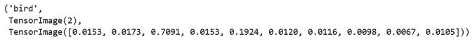
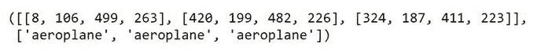

# 第六章：*第六章*：使用视觉数据训练模型

深度学习已经成功应用于许多不同类型的数据，包括表格数据、文本数据和推荐系统数据。在*第三章* *使用表格数据训练模型*、*第四章* *使用文本数据训练模型* 和 *第五章* *训练推荐系统* 中，你已经见识过 fastai 对这些类型数据的处理方法。这些数据类型都是深度学习故事的一部分，但**视觉数据**或**图像数据**是传统上与深度学习最紧密相关的数据类型。

视觉数据也是 fastai 框架最全面支持的数据类型。fastai 的高级 API 主要是为视觉数据开发的，70%的精选 fastai 数据集都是视觉数据集。在本章中，我们将探索 fastai 为探索视觉数据集和构建高性能深度学习图像模型所提供的一些功能。

在本章中，你将学习如何使用 fastai 提供的一套丰富功能来准备图像数据集，并使用这些数据集训练深度学习模型。特别是，你将学习如何创建 fastai 深度学习模型来分类图像，即确定图像中的对象是什么，同时也将学习如何使用 fastai 来识别同一图像中的多个对象。

本章将涵盖以下内容：

+   使用简单精选视觉数据集训练分类模型

+   探索精选图像位置数据集

+   使用独立视觉数据集训练分类模型

+   使用精选视觉数据集训练多图像分类模型

+   测试你的知识

# 技术要求

请确保你已经完成了*第一章* *快速入门 fastai* 中的设置部分，并且已经成功设置了 Gradient 实例或 Colab 环境。本章中的食谱假设你正在使用 Gradient。请确保你已经从[`github.com/PacktPublishing/Deep-Learning-with-fastai-Cookbook`](https://github.com/PacktPublishing/Deep-Learning-with-fastai-Cookbook)克隆了本书的代码库，并且能够访问`ch6`文件夹。该文件夹包含本章中描述的代码示例。

# 使用简单精选视觉数据集训练分类模型

你可能还记得你在*第一章*中训练的第一个 fastai 模型，*快速入门 fastai*。那个模型是使用 MNIST 手写数字数据集训练的。给定一张手写数字的图像，那个模型能够对图像进行分类，即确定图像中显示的是从 0 到 9 的哪个数字。

在本教程中，你将应用在 MNIST 模型中看到的相同方法，使用另一个 fastai 精选数据集：CIFAR 数据集。这个数据集是更大 CIFA_100 数据集的一个子集，包含 6000 张图像，按 10 个类别进行组织。在本节中，你训练的模型将能够确定来自该数据集的图像所属的类别。

## 准备工作

确认你可以在仓库的 `ch6` 目录中打开 `training_with_curated_image_datasets.ipynb` 笔记本。

注意事项

`CIFAR` 数据集中的图像相当小。在本节中，我们将它们以更大的尺寸呈现，以便在书中的上下文中更容易识别，但结果是它们看起来可能有些模糊。

本节中介绍的 `CIFAR` 数据集在论文 *Learning Multiple Layers of Features from Tiny Image*（Krizhevsky，2009）中有所介绍。我很感激能有机会将这个数据集包含在本书中。

数据集引用

Alex Krizhevsky. (2009). *Learning Multiple Layers of Features from Tiny Image*. University of Toronto: [`www.cs.toronto.edu/~kriz/learning-features-2009-TR.pdf`](https://www.cs.toronto.edu/~kriz/learning-features-2009-TR.pdf).

## 如何操作…

在本节中，你将运行 `training_with_curated_image_datasets.ipynb` 笔记本。一旦你在 fastai 环境中打开该笔记本，请完成以下步骤：

1.  运行笔记本中的单元格，直到 `Ingest the dataset` 单元格，以导入所需的库并设置笔记本环境。

1.  运行以下单元格以定义此数据集的 `path` 对象：

    ```py
    path = untar_data(URLs.CIFAR)
    ```

1.  运行以下单元格以检查数据集的目录结构：

    ```py
    path.ls()
    ```

    输出显示了数据集的目录结构，如下截图所示：

    

    图 6.1 – path.ls() 的输出

1.  运行以下单元格以为此数据集定义一个 `ImageDataLoaders` 对象：

    ```py
    dls = ImageDataLoaders.from_folder(path, train='train', valid='test')
    ```

    以下是定义 `ImageDataLoaders` 对象的参数：

    a) `path`：指定 `ImageDataLoaders` 对象是通过你在前一个单元格中创建的 `path` 对象定义的

    b) `train='train'`：指定训练数据位于 `/storage/data/cifar10/train` 目录中

    c) `valid='test'`：指定验证数据位于 `/storage/data/cifar10/test` 目录中

1.  运行以下单元格以显示数据集中的一批图像：

    ```py
    dls.train.show_batch(max_n=4, nrows=1)
    ```

    该单元格的输出是一组 `4` 项来自一批数据，显示图像及其对应的类别，如下图所示：

    

    图 6.2 – show_batch() 的输出

1.  运行以下单元格以检查 `train` 子目录的内容：

    ```py
    (path/'train').ls()
    ```

    输出显示了 `train` 子目录的结构，如下截图所示：

    

    图 6.3 – train 子目录的内容

1.  运行以下单元格检查`train/dog`子目录的内容：

    ```py
    (path/'train/dog').ls()
    ```

    输出显示了`train/dog`子目录的结构：

    

    图 6.4 – `train/dog`子目录的内容

1.  如果你想从不同的角度查看该数据集的目录结构，可以使用`tree`命令。为此，在 Gradient 终端中输入以下命令：

    ```py
    test and train directories have subdirectories for each of the 10 categories of the dataset:

    ```

    ├── test

    │   ├── airplane

    │   ├── automobile

    │   ├── bird

    │   ├── cat

    │   ├── deer

    │   ├── dog

    │   ├── frog

    │   ├── horse

    │   ├── ship

    │   └── truck

    └── train

    ├── airplane

    ├── automobile

    ├── bird

    ├── cat

    ├── deer

    ├── dog

    ├── frog

    ├── horse

    ├── ship

    └── truck

    ```py

    ```

1.  运行以下单元格查看数据集中的单个项目：

    ```py
    img_files = get_image_files(path)
    img = PILImage.create(img_files[100])
    img
    ```

    以下是该单元格的关键元素：

    a) `img_files = get_image_files(path)`：指定`path`将被递归地检查，并返回路径中所有的图片文件。如果你想了解更多关于`get_image_files`的细节，可以查看以下文档：[`docs.fast.ai/data.transforms.html#get_image_files`](https://docs.fast.ai/data.transforms.html#get_image_files)。

    b) `img = PILImage.create(img_files[100])`：从先前语句返回的特定文件创建图像对象`img`。

    该单元格的输出是数据集文件之一，在笔记本中呈现为图像，如下所示：

    

    图 6.5 – 数据集中的一张图片

1.  运行以下单元格显示数据集中的另一张图片：

    ```py
    img = PILImage.create(img_files[3000])
    img
    ```

    输出是数据集中的另一张图像，已在笔记本中呈现如下：

    

    图 6.6 – 数据集中的另一张图片

1.  运行以下单元格将模型定义为`cnn_learner`对象：

    ```py
    learn = cnn_learner(dls, resnet18, 
                        loss_func=LabelSmoothingCrossEntropy(), 
                        metrics=accuracy))
    ```

    以下是定义`cnn_learner`对象的参数：

    a) `dls`：指定模型使用你在*步骤 4*中定义的`ImageDataLoaders`对象`dls`。

    b) `resnet18`：指定使用预训练模型`resnet18`作为该模型的起点。

    c) `loss_func=LabelSmoothingCrossEntropy()`：指定训练过程中使用的损失函数。

    d) `metrics=accuracy`：指定`accuracy`为训练过程中优化的性能度量标准。

1.  运行以下单元格训练模型：

    ```py
    learn.fine_tune(5)
    ```

    该参数表示训练将进行`5`个周期。

    输出显示了每个周期的训练损失、验证损失和准确率，如下截图所示：

    

    图 6.7 – 模型训练输出

1.  让我们尝试使用训练好的模型对测试数据集中的一些示例进行预测。首先，运行以下单元格为测试数据集中的一张图片定义一个对象：

    ```py
    img_test_files = get_image_files(path/"test")
    img2 = PILImage.create(img_test_files[700])
    img2
    ```

    以下是该单元格的关键元素：

    a) `img_files = get_image_files(path/"test")`：返回`test`目录下的所有图像文件

    b) `img = PILImage.create(img_files[700])`：从前一个语句返回的特定文件创建图像对象`img2`

    这个单元格的输出是一张狗的图像：

    

    图 6.8 – 测试数据集中的狗图像

1.  运行以下单元格，为测试数据集中的另一张图像定义一个对象：

    ```py
    img3 = PILImage.create(img_test_files[8000])
    img3
    ```

    这个单元格的输出是一张鸟类图像：

    

    图 6.9 – 测试数据集中的鸟类图像

1.  现在我们已经为测试数据集中的几张图像定义了对象，让我们在这些图像上运行训练好的图像分类模型。首先，运行以下单元格，将模型应用于狗的图像：

    ```py
    learn.predict(img2)
    ```

    这个单元格的输出是模型的预测，见下图。注意，模型正确地预测了图像的类别：

    

    图 6.10 – 图像分类模型在狗图像上的预测

1.  现在让我们看看模型在鸟类图像上的表现。运行以下单元格来将模型应用于鸟类图像：

    ```py
    learn.predict(img3)
    ```

    这个单元格的输出是模型的预测，见下图。注意，模型正确地预测了这张图像是鸟类：

    

    图 6.11 – 图像分类模型在鸟类图像上的预测

1.  现在我们已经成功地训练了模型，让我们保存它。运行以下单元格来保存模型：

    ```py
    learn.path = Path('/notebooks/temp')
    learn.export('cifar_apr20_2021.pkl') 
    ```

    下面是这个单元格中语句的作用：

    a) `learn.path = Path('/notebooks/temp')`：将`learn`对象的路径设置为可以写入的目录。请记住，在 Gradient 中，默认情况下，`learn`对象的路径是只读的，因此你需要将路径调整为可写目录，才能保存模型。

    b) `learn.export('cifar_apr20_2021.pkl')`：指定保存的模型名称为`cifar_apr20_2021.pkl`。

    在 Gradient 中运行此单元格后，你的模型将保存到`/notebooks/temp/model/cifar_apr20_2021.pkl`。

恭喜！你已经使用精心挑选的图像数据集，训练并执行了一个 fastai 图像分类模型。

## 它是如何工作的……

在本节的配方中，有一些重要的内容值得回顾。在这一部分，我们将讨论一些在配方主干部分可能不太明显的细节。

### 标签在目录名和文件名中进行编码

首先，考虑构成数据集的文件名。`train/dog`子目录中的文件如下所示：


图 6.12 – `train/dog`子目录中的文件

`train/cat`子目录中的文件如下所示：


图 6.13 – train/cat 子目录中的文件

让我们来看一下这些子目录中每个目录的一个示例文件。要显示来自`train/dog`子目录的图像文件，请运行以下单元格：

```py
dog_files = get_image_files(path/"train/dog")
dog_img = PILImage.create(dog_files[30])
dog_img
```

该单元格的输出确实是一张狗的图像，如下所示：


图 6.14 – 来自训练数据集的狗的图像

要显示来自`train/cat`子目录的图像文件，请运行以下单元格：

```py
cat_files = get_image_files(path/"train/cat")
cat_img = PILImage.create(cat_files[30])
cat_img
```

该单元格的输出，如预期所示，是一张猫的图像，如下所示：


图 6.15 – 来自训练数据集的猫的图像

对于这个图像分类问题，模型正试图预测图像的标签，即图像中所示对象的类别，例如狗、鹿或鸟。对于这个数据集，标签以以下两种方式编码：

+   **包含图像文件的目录名称**。如你在*图 6.14*和*图 6.15*中看到的那样，图像的标签是通过图像所在子目录的名称进行编码的。

+   `xxxx_dog.png`的文件名，猫的图像文件名则为`xxxx_cat.png`。

### 你使用迁移学习训练了图像分类模型

在*第四章*中，*使用文本数据训练模型*，我们使用迁移学习将现有的训练模型调整为适应特定用例的数据集。你可能没有注意到，但我们在这个示例中做了同样的事情。线索就在定义`cnn_learner`对象的单元格中，具体如下：

```py
learn = cnn_learner(dls, resnet18, 
                    loss_func=LabelSmoothingCrossEntropy(), 
                    metrics=accuracy))
```

在`cnn_learner`的定义中，`resnet18`参数是作为图像分类模型基础的预训练模型。第一次运行此单元格时，你将看到类似*图 6.16*中显示的消息，指示模型正在你的环境中设置：


图 6.16 – 第一次运行 cnn_learner 定义时你收到的消息

第二个线索在训练模型的单元格中，具体如下：

```py
learn.fine_tune(5)
```

对于到目前为止你在本书中看到的大多数模型，你使用了`learn.fit_one_cycle()`来训练模型。这里，由于我们想要更新一个现有的模型以适应我们的特定用例，因此我们使用`learn.fine_tune()`。这正是我们在*第四章*中所做的，*使用文本数据训练模型*，我们使用迁移学习在预训练的`AWD_LSTM`模型上训练语言模型。

为什么我们在这个用例中使用迁移学习而不是从头开始训练模型？简单的答案是，通过使用迁移学习，我们能够更快地获得模型的良好表现。你可以通过对 `training_with_curated_image_datasets.ipynb` 笔记本做两个修改并重新运行来亲自试试看。以下是进行此操作的步骤：

1.  更新 `cnn_learner` 对象的定义，添加 `pretrained=False` 参数，如下所示：

    ```py
    learn = cnn_learner(dls, resnet18, pretrained=False,
                        loss_func=LabelSmoothingCrossEntropy(), metrics=accuracy)
    ```

    这一更改意味着，模型将使用 `CIFAR` 数据集从头开始训练，而不是利用预训练模型。

1.  将训练语句更改为以下内容：

    ```py
    learn.fit_one_cycle(5)
    ```

在做出这些更改后重新运行笔记本时，这个新模型在分类图像时不会表现得很好。迁移学习是有效的，正如 Howard 和 Gugger 在他们的书中解释的那样，它在深度学习的标准介绍中并没有得到足够的关注。幸运的是，fastai 被设计成易于利用迁移学习的强大功能，正如你在本食谱的 *How to do it…* 部分训练的图像分类模型所展示的那样。

### 更仔细地审视模型

在继续下一个食谱之前，值得更仔细地看看本食谱中的模型。由于本书的范围限制，模型的详细描述将超出本书内容，我们将在这里关注一些重点。

如食谱中所示，模型被定义为 `cnn_learner` 对象（文档链接：[`docs.fast.ai/vision.learner.html#cnn_learner`](https://docs.fast.ai/vision.learner.html#cnn_learner)），使用的是预训练的 `resnet18` 模型（文档链接：[`pytorch.org/vision/stable/models.html`](https://pytorch.org/vision/stable/models.html)）。`learn.summary()` 输出显示该模型包括一系列卷积层及其相关层。有关卷积神经网络（CNN）的描述，请参见：[`machinelearningmastery.com/how-to-develop-a-convolutional-neural-network-from-scratch-for-mnist-handwritten-digit-classification/`](https://machinelearningmastery.com/how-to-develop-a-convolutional-neural-network-from-scratch-for-mnist-handwritten-digit-classification/)。

# 探索一个精心策划的图像位置数据集

在*第二章*《使用 fastai 探索和清理数据》中，我们介绍了使用 fastai 导入和探索多种数据集的过程。

在本节中，我们将探索一个特别策划的图像数据集，名为`COCO_TINY`。这是一个`CIFAR`数据集，我们在*使用简单策划视觉数据集训练分类模型*教程中使用过，它在每张图片中只有一个带标签的物体，而图像位置数据集中的图片则带有边界框（指示图片中物体的位置）以及物体的名称。此外，`COCO_TINY`数据集中的图片可以包含多个带标签的物体，如下所示：


图 6.17 – 来自图像位置数据集的标注图片

在本节的教程中，我们将引入数据集并应用其注释信息，创建该数据集的`dataloaders`对象。每张图片的注释信息可能相当复杂。每张图片可以包含多个带标签的物体。每个带标签的物体的注释信息包括图片的文件名、围绕物体的边界框的*x*和*y*坐标，以及物体类别的标签。例如，*图 6.17*中展示的图片包含了几个**沙发**物体和一个**椅子**物体。

请注意，数据集中的图片实际上并不展示注释。数据集中的典型图片如下所示：


图 6.18 – 来自 COCO_TINY 数据集的原始图片

图片本身没有边界框或标签。这些注释信息包含在一个单独的文件中。本节的教程将展示如何将图片文件与注释信息结合起来。

在本教程的最后，当我们使用`show_batch()`显示包含注释的批次样本时，图片中会显示边界框和标签。例如，*图 6.19*展示了当通过`show_batch()`显示*图 6.18*中的图片时的效果——现在你可以看到图片中的**花瓶**物体的边界框和标签：


图 6.19 – 图 6.18 中图片的注释版

在本节的教程中，你将结合`COCO_TINY`数据集中的图片文件，例如*图 6.18*中展示的图片，与注释文件中的信息，以获得一个`dataloaders`对象，该对象包含所有带标签物体的图片、边界框和标签，如*图 6.19*所示。

## 准备开始

确认你可以打开位于你的仓库中`ch6`目录下的`exploring_image_location_datasets.ipynb`笔记本。

本教程中用于检查数据集的方法包括受这个 Kaggle 内核启发的方法，https://www.kaggle.com/jachen36/coco-tiny-test-prediction，演示了如何使用 fastai 探索图像位置数据集。

本节中介绍的`COCO_TINY`数据集出自论文《*Microsoft COCO: Common Objects in Context*》，Lin 等人，2014 年。我很感激能够在本书中使用这个数据集作为示例。

数据集引用

Tsung-Yi Lin, Michael Maire, Serge Belongie, Lubomir Bourdev, Ross Girshick, James Hays, Pietro Perona, Deva Ramanan, C. Lawrence Zitnick 和 Piotr Dollár. (2014). *Microsoft COCO: Common Objects in Context*: [`arxiv.org/abs/1405.0312`](https://arxiv.org/abs/1405.0312).

## 如何操作…

在本节中，您将运行`exploring_image_location_datasets.ipynb`笔记本。将该笔记本在您的 fastai 环境中打开后，完成以下步骤：

1.  运行笔记本中的单元，直到`导入数据集`单元，以导入所需的库并设置笔记本环境。

1.  运行以下单元来为此数据集定义`path`对象：

    ```py
    path = untar_data(URLs.COCO_TINY)
    ```

1.  运行以下单元以检查数据集的目录结构：

    ```py
    path.ls()
    ```

    输出显示了数据集的目录结构，如*图 6.20*所示：

    

    图 6.20 – path.ls() 的输出

    数据集由`train`子目录中的一组图像文件和`train.json`注释文件组成。在本食谱的接下来的步骤中，我们将更详细地查看`train.json`文件的内容。

1.  运行以下单元将`train.json`文件导入为一系列 Python 字典：

    ```py
    with open(path/'train.json') as json_file:
        data = json.load(json_file)
        # each nested structure is a list of dictionaries
        categories = data['categories']
        images = data['images']
        annotations = data['annotations']  
    ```

    以下是该单元中使用的代码的关键部分：

    a) `data = json.load(json_file)`：将整个`train.json`文件的内容加载到`data`字典中。

    b) `categories = data['categories']`：为类别定义创建一个单独的字典列表。该字典定义了图像中的对象。

    c) `images = data['images']`：为图像文件创建一个单独的字典列表。

    d) `annotations = data['annotations']`：为边界框创建一个单独的字典列表。

1.  运行以下单元查看前一个单元中创建的每个字典的结构：

    ```py
    print("categories ", categories)
    print()
    print("subset of images",list(images)[:5])
    print()
    print("subset of annotations",list(annotations)[:5])
    ```

    该单元的输出显示了每个字典内容的示例，如下图所示：

    

    图 6.21 – 注释字典的内容

1.  我们在前一步创建的字典并不是我们所需要的，无法为图像提供完整的注释。我们需要的是每个图像的汇总注释，列出图像中每个对象的边界框及其类别。我们可以通过操作前面创建的字典手动完成这个任务，但 fastai 提供了一个非常方便的函数`get_annotations`，它可以为我们完成这个工作。运行以下单元来定义注释结构：

    ```py
    image_files, bbox_lbl = get_annotations(path/'train.json')
    img_bbox_combo = dict(zip(image_files, bbox_lbl))
    ```

    以下是该单元中代码的关键部分：

    a) `aget_annotations(path/'train.json')`：对`train.json`文件应用`get_annotations`函数，以获取注释结构。该函数的输出是文件名列表和标记边界框列表。

    b) `dict(zip(image_files, bbox_lbl))`：创建一个字典，将文件列表和从前一个命令输出的标记边界框列表结合起来。

1.  运行以下单元格以检查在前一个单元格中创建的注释字典元素之一，`img_bbox_combo`：

    ```py
    img_bbox_combo[image_files[5]]
    ```

    此单元格的输出，如下图所示，表明字典的元素是由包含边界框列表（定义对象周围区域的 2 个*x*和*y*坐标，分别表示左上角和右下角点）和对应对象类别的列表组成的元组：

    

    图 6.22 – img_bbox_combo 的一个元素

1.  运行以下单元格以查看与前一个单元格中检查的注释相关的图像：

    ```py
    image_subpath = 'train/'+image_files[5]
    img = PILImage.create(path/image_subpath)
    img
    ```

    此单元格的输出是以下图像：

    

    图 6.23 – 示例图像

1.  运行以下单元格以定义一个函数，返回与输入图像文件相关的边界框：

    ```py
    def get_bbox(filename):
        return np.array(img_bbox_combo[os.path.basename(filename)][0])
    ```

1.  运行以下单元格以定义一个函数，返回与输入图像文件相关的标签（即类别）：

    ```py
    def get_lbl(filename):
        return np.array(img_bbox_combo[os.path.basename(filename)][1],dtype=object)
    ```

1.  运行以下单元格以定义一个函数，返回数据集中的图像文件：

    ```py
    def get_items(noop):
        return get_image_files(path/'train')
    ```

1.  运行以下单元格以使用你在前面三个单元格中定义的函数，为数据集定义一个`DataBlock`对象：

    ```py
    db = DataBlock(blocks=(ImageBlock, BBoxBlock, BBoxLblBlock),
                     get_items=get_image_files,
                     splitter=RandomSplitter(),
                     get_y=[get_bbox, get_lbl],
                     n_inp=1)
    ```

    迄今为止，在本书的几乎所有配方中，我们都使用了顶层的 fastai API，这意味着在此步骤中我们会定义某种类型的`dataloaders`对象。然而，对于此数据集，我们需要比`dataloaders`对象提供的更大的灵活性，这就是为什么我们在这里定义了一个`DataBlock`对象。有关`DataBlock`对象的详细信息，请参考以下文档：https://docs.fast.ai/data.block.html#DataBlock。

    以下是`DataBlock`对象定义的参数：

    a) `blocks=(ImageBlock, BBoxBlock, BBoxLblBlock)`：指定模型的输入是图像（`ImageBlock`），目标有两个部分：图像中对象的边界框（`BBoxBlock`），以及与每个边界框相关的标签（类别）（`BBoxLblBlock`）。

    b) `get_items=get_image_files`：指定调用`get_image_files`函数以获取`DataBlock`对象的输入。

    c) `get_y=[get_bbox, get_lbl]`：指定应用于`get_items`结果的函数。图像文件名作为参数传递给这些函数。第一个函数`get_bbox`根据我们从`train.json`文件中导入的注释信息，返回与图像文件关联的边界框列表。第二个函数`get_lbl`根据我们从`train.json`文件中导入的注释信息，返回与图像文件关联的边界框的标签（类别）列表。

    d) `n_inp=1`：指定在`blocks`参数中定义的元组中应视为输入的元素数量，在我们的情况下，仅为图像文件。

1.  运行以下单元格，使用你在前一个单元格中创建的`DataBlock`对象`db`来定义`dataloaders`对象：

    ```py
    dls = db.dataloaders(path,bs=32)
    ```

    这是`dataloaders`定义的参数：

    a) `path`：指定用于`dataloaders`对象的路径是你在笔记本开始时为数据集定义的`path`对象

    b) `bs=32`：指定批次大小为 32

1.  现在终于可以看到`dataloaders`对象的批次样子了。运行以下单元格，查看一个批次中的条目示例：

    ```py
    dls.show_batch(max_n=4, figsize=(10,10))
    ```

    这是`show_batch()`的参数：

    a) `max_n=4`：指定要显示的样本数量

    b) `figsize=(10,10)`：指定样本的尺寸

    `show_batch()`的输出显示在下图中。注意，你会看到带有边界框和注释文本的标注物体的图像。同时注意，你可能会在笔记本中运行`show_batch()`时看到不同的示例图像：


](img/B16216_6_24.jpg)

图 6.24 – show_batch()输出的示例图像

恭喜你！你已经成功地导入并准备了图像位置数据集，这是本书中你将要处理的最复杂的数据操作任务之一。

## 它是如何工作的……

在本节的操作中，可能会对`COCO_TINY`数据集和图像位置数据集的一般情况有一些问题。在本节中，我们将解答一些你在操作过程中可能会遇到的问题。

### 数据集中的图像标注了哪些类型的物体？

如果你多次运行以下单元格，你会看到多种标注图像：

```py
dls.show_batch(max_n=4, figsize=(10,10))
```

你可以在*图 6.25*中看到此单元格输出的示例。注意，注释并没有覆盖图像中的每个可能物体。例如，第一个图像中的动物没有被注释。在`COCO_TINY`中的图像会注释哪些物体？我们将在本节中回答这个问题：


](img/B16216_6_25.jpg)

图 6.25 – show_batch()的输出

当你运行以下单元格将注释文件`train.json`引入 Python 字典时，你创建了一个名为`categories`的子字典，其中包含`COCO_TINY`数据集中所有注释物体的类别，如下所示：

```py
with open(path/'train.json') as json_file:
    data = json.load(json_file)
    # each nested structure is a list of dictionaries
    categories = data['categories']
    images = data['images']
    annotations = data['annotations']  
```

要查看`categories`字典中的内容，请运行以下单元格：

```py
print("categories ", categories)
```

该单元格的输出如下：


图 6.26 – 类别字典

从这个字典中，你可以看到`COCO_TINY`数据集中的图像只有六个注释物体：**椅子**，**沙发**，**电视**，**遥控器**，**书**，和**花瓶**。

如果你反复运行`show_batch()`，你将看到即使是图像中仅部分显示的物体也会被注释。例如，*图 6.25*中的第一张图像就有一个椅子的注释，如下图所示，尽管图像中只显示了椅子部分的腿：


图 6.27 – 椅子注释的特写

你还将看到一些图像包含许多注释物体，并且这些物体的边界框可能会重叠，如下图所示：


图 6.28 – 一张包含多个重叠边界框的图像

本小节描述了`COCO_TINY`中哪些物体被注释。在你多次运行`show_batch()`命令时，你将亲眼看到某些物体的注释是多么复杂。

### 注释物体的边界框是如何定义的？

当你在本节中按步骤操作时，可能会问自己边界框是在哪里定义的。当你运行以下单元格将注释文件`train.json`引入 Python 字典时，你创建了一个名为`annotations`的子字典，其中包含`COCO_TINY`数据集中所有物体的注释：

```py
with open(path/'train.json') as json_file:
    data = json.load(json_file)
    # each nested structure is a list of dictionaries
    categories = data['categories']
    images = data['images']
    annotations = data['annotations']  
```

你可以运行以下单元格来查看`annotations`字典子集的内容：

```py
print("subset of annotations",list(annotations)[:5])
```

该单元格的输出显示了特定图像中物体注释的示例，如下截图所示：


图 6.29 – 注释示例

该字典中`bbox`键的值通过指定物体边界的* x *和* y *值来定义物体的边界框。

请看下图。这张图像包含一个注释的物体——让我们看看如何查看其边界框的坐标：


图 6.30 – 带有边界框的注释示例图像

这张图像的文件名是`000000071159.jpg`。要查看此图像的边界框，请运行以下单元格：

```py
get_bbox(path/'train/000000071159.jpg')
```

此单元格的输出显示了该图像的边界框坐标。如果图像中有多个对象被注释，那么每个对象都会定义一个边界框：


图 6.31 – 图 6.30 中示例图像的对象边界框

在这一部分中，我们回顾了 `COCO_TINY` 数据集中边界框注释的一些细节。

### 为什么我们没有使用 COCO_TINY 来训练模型？

与本书中大多数食谱不同，本部分的食谱并没有包括模型训练。在我们为 `COCO_TINY` 数据集创建 `dataloaders` 对象之后，为什么我们没有继续训练模型呢？

简单的答案是，fastai 框架目前并未提供一种简单的方法来训练像 `COCO_TINY` 这样的图像位置数据集。如果你想尝试训练这样的模型，可以参考这个仓库中的方法，但要准备好深入细节，超出我们在本书中探索的高层 fastai API：[`github.com/muellerzr/Practical-Deep-Learning-for-Coders-2.0/blob/master/Computer%20Vision/06_Object_Detection.ipynb`](https://github.com/muellerzr/Practical-Deep-Learning-for-Coders-2.0/blob/master/Computer%20Vision/06_Object_Detection.ipynb)。

# 使用独立视觉数据集训练分类模型

在 *使用简单的策划视觉数据集训练分类模型* 这一食谱中，你学习了如何导入 fastai 策划数据集并使用它来训练图像分类模型。

在这一部分，你将通过相同的过程处理一个独立的数据集，叫做 `fruits-360`。该数据集（详细描述见这里：https://www.kaggle.com/moltean/fruits）包含了超过 90,000 张水果和蔬菜的图像，分为超过 130 个类别。

在本食谱中，我们将首先将该数据集导入 Gradient。然后，我们将通过 `training_with_standalone_image_datasets.ipynb` 笔记本来导入数据集并用它来训练一个 fastai 图像分类模型。最后，我们将查看训练好的模型如何分类测试集中的图像，并保存训练好的模型。

## 准备工作

确保你已经按照以下步骤将 `fruits-360` 数据集上传到你的 Gradient 环境中：

1.  从 [`www.kaggle.com/moltean/fruits`](https://www.kaggle.com/moltean/fruits) 下载 `archive.zip`。

1.  将 `archive.zip` 上传到你的 Gradient 环境中。你可以使用 Gradient 中 JupyterLab 的上传按钮进行上传，但需要按照以下几个步骤进行操作：

    a) 在 Gradient 环境的终端中，将 `/notebooks` 设为当前目录：

    ```py
    notebooks/temp directory, make a new /notebooks/temp directory:

    ```

    临时切换到当前文件夹，选择上传按钮（参见 *图 6.32*），然后从你在 *步骤 1* 中下载的本地系统文件夹中选择 `archive.zip`：图 6.32 – JupyterLab 中的上传按钮

    ```py

    ```

1.  现在你已经将`archive.zip`上传至 Gradient 环境中的`/notebooks/temp`目录，通过在 Gradient 终端运行以下命令，将该目录设为当前目录：

    ```py
    cd /notebooks/temp
    ```

1.  通过在 Gradient 终端运行以下命令，将`archive.zip`解压到`/storage/archive`目录：

    ```py
    unzip archive.zip -d /storage/archive
    ```

1.  通过在 Gradient 终端中运行以下命令，确认你现在已经在 Gradient 环境中设置了数据集：

    ```py
    cd /storage/archive/fruits-360
    ```

1.  然后，运行以下命令列出该目录的内容：

    ```py
    ls
    ```

    此命令的输出应与以下截图所示的内容类似：


图 6.33 – fruits-360 目录的内容

通过这些准备步骤，你已将`fruits-360`数据集的文件移动到 Gradient 环境中的正确位置，以便 fastai 模型使用。

本节中展示的`fruits-360`数据集来源于 2020 年 Kaggle 比赛**Fruits 360**（[`www.kaggle.com/moltean/fruits`](https://www.kaggle.com/moltean/fruits)）。非常感谢有机会在本书中使用这个数据集作为示例。

数据集引用

Mihai Oltean（2017-2020）。*Fruits 360 – 包含 131 种水果和蔬菜的 90,380 张图片的数据集* ([`mihaioltean.github.io`](https://mihaioltean.github.io))。

## 如何操作…

在本节中，你将运行`training_with_standalone_image_datasets.ipynb`笔记本。一旦在你的 fastai 环境中打开该笔记本，完成以下步骤：

1.  在笔记本中运行单元格，直到`Ingest the dataset`单元格，以导入所需的库并设置笔记本。

1.  运行以下单元格，为此数据集定义`path`对象：

    ```py
    path = URLs.path('fruits-360')
    ```

1.  运行以下单元格检查数据集的目录结构：

    ```py
    path.ls()
    ```

    输出显示数据集的目录结构，如以下截图所示：

    

    图 6.34 – path.ls()的输出

1.  运行以下单元格，为此数据集定义一个`ImageDataLoaders`对象：

    ```py
    dls = ImageDataLoaders.from_folder(path, train='Training', valid='Test')
    ```

    以下是`ImageDataLoaders`对象定义的参数：

    a) `path`：指定使用你在前一个单元格中创建的`path`对象来定义`ImageDataLoaders`对象

    b) `train='Training'`：指定训练数据位于`/storage/archive/fruits-360/Training`目录中

    c) `valid='Test'`：指定验证数据位于`/storage/archive/fruits-360/Test`目录中

1.  运行以下单元格显示数据集的一批数据：

    ```py
    dls.train.show_batch(max_n=4, nrows=1)
    ```

    此单元格的输出是一组来自一批的`4`个项目，显示了图片及其对应的类别，如以下截图所示：

    

    图 6.35 – show_batch()的输出

1.  运行以下单元格以检查`Training`子目录的内容：

    ```py
    (path/'Training').ls() 
    ```

    输出显示了`Training`子目录的结构，如下图所示：

    

    图 6.36 – `Training`子目录的内容

1.  运行以下单元格以查看数据集中的单个项目：

    ```py
    img_files = get_image_files(path)
    img = PILImage.create(img_files[100])
    img
    ```

    以下是此单元格的关键要素：

    a) `img_files = get_image_files(path)`: 指定递归地检查`path`并返回该路径中的所有图像文件

    b) `img = PILImage.create(img_files[100])`: 从前述语句返回的特定文件创建图像对象`img`

    该单元格的输出是数据集文件之一，并在笔记本中渲染为图像：

    

    图 6.37 – 来自数据集的一张图像

1.  运行以下单元格来将模型定义为一个`cnn_learner`对象：

    ```py
    learn = cnn_learner(dls, resnet18, 
                        loss_func=LabelSmoothingCrossEntropy(), 
                        metrics=accuracy))
    ```

    以下是`cnn_learner`对象定义的参数：

    a) `dls`: 指定使用你在本笔记本中之前定义的`ImageDataLoaders`对象来定义`cnn_learner`对象

    b) `resnet18`: 指定用于该模型的预训练模型作为起点

    c) `loss_func=LabelSmoothingCrossEntropy()`: 指定在训练过程中使用的损失函数

    d) `metrics=accuracy`: 指定`accuracy`作为训练过程中优化的性能指标

1.  运行以下单元格来训练模型：

    ```py
    learn.fine_tune(5)
    ```

    该参数表示训练将运行`5`个时期（epoch）。

    输出显示每个时期的训练损失、验证损失和准确率，如下图所示：

    

    图 6.38 – 训练模型的输出

1.  让我们在测试数据集中的一些示例上尝试训练好的模型。首先，运行以下单元格为测试数据集中的一张图像定义一个对象：

    ```py
    img_test_files = get_image_files(path/"Test")
    img2 = PILImage.create(img_test_files[700])
    img2
    ```

    以下是此单元格的关键要素：

    a) `img_files = get_image_files(path/"Test")`: 返回`Test`目录下的所有图像文件

    b) `img = PILImage.create(img_files[700])`: 从前述语句返回的特定文件创建图像对象`img2`

    该单元格的输出是草莓的图像，如下图所示：

    

    图 6.39 – 测试数据集中的一张草莓图像

1.  运行以下单元格为测试数据集中的另一张图像定义一个对象：

    ```py
    img3 = PILImage.create(img_test_files[8000])
    img3
    ```

    该单元格的输出是番茄的图像，如下图所示：

    

    图 6.40 – 测试数据集中的一张番茄图像

1.  现在我们已经为测试数据集中的几张图像定义了对象，让我们在这些图像上测试训练好的图像分类模型。首先，运行以下单元格来应用模型到草莓图像：

    ```py
    learn.predict(img2)
    ```

    本单元格的输出是模型的预测结果，如下图所示。请注意，模型正确预测了图像的类别。`TensorImage` 数组中显示的数字对应训练模型认为该图像属于每个类别的可能性：

    

    图 6.41 – 图像分类模型对草莓图像的预测

1.  让我们看看模型在番茄图像上的表现。运行以下单元格，将模型应用于番茄图像：

    ```py
    learn.predict(img3)
    ```

    本单元格的输出是模型的预测结果，如下图所示。请注意，模型正确预测了图像是番茄：

    

    图 6.42 – 图像分类模型对鸟类图像的预测

1.  训练好的模型似乎在预测测试集中的图像类别时表现良好，但仍然存在一些模糊性。水果和蔬菜的图像可能对人类来说是模糊的，因此让我们看看训练好的模型如何预测那些我们明确知道类别的图像。首先，运行以下单元格，定义来自测试数据集的鳄梨图像：

    ```py
    avocado_files = get_image_files(path/"Test/Avocado")
    avocado_img = PILImage.create(avocado_files[30])
    avocado_img
    ```

    下面是本单元格的关键元素：

    a) `avocado_files = get_image_files(path/"Test/Avocado")`：返回 `Test/Avocado` 目录下的所有图像文件

    b) `avocado_img = PILImage.create(avocado_files[30])`：从先前语句返回的文件集中的特定鳄梨图像文件创建图像对象 `avocado_img`

    本单元格的输出是鳄梨的图像，如下图所示：

    

    图 6.43 – 来自测试数据集的鳄梨图像

1.  让我们从测试数据集中的另一个目录获取一张图像。运行以下单元格，定义来自测试数据集的胡桃图像：

    ```py
    walnut_files = get_image_files(path/"Test/Walnut")
    walnut_img = PILImage.create(walnut_files[30])
    walnut_img
    ```

    下面是本单元格的关键元素：

    a) `walnut_files = get_image_files(path/"Test/Walnut")`：返回 `Test/Walnut` 目录下的所有图像文件

    b) `walnut_img = PILImage.create(walnut_files[30])`：从先前语句返回的文件集中的特定胡桃图像文件创建图像对象 `walnut_img`

    本单元格的输出是胡桃的图像，如下图所示：

    

    图 6.44 – 来自测试数据集的胡桃图像

1.  现在我们已经为来自测试数据集中某些特定目录的几张图像定义了对象，让我们在这些图像上运用训练好的图像分类模型。首先，运行以下单元格，将模型应用于鳄梨图像：

    ```py
    learn.predict(avocado_img)
    ```

    该单元格的输出是模型对`avocado_img`图像的预测结果，如下截图所示。请注意，模型正确预测了图像的类别：

    

    图 6.45 – 图像分类模型对鳄梨图像的预测

1.  让我们看看模型在胡桃图像上的表现。运行以下单元格，将模型应用于胡桃图像：

    ```py
    learn.predict(walnut_img) 
    ```

    该单元格的输出是模型的预测结果，如下截图所示。请注意，模型正确预测了图像为胡桃：

    

    图 6.46 – 图像分类模型对胡桃图像的预测

1.  现在我们已经测试了模型，确认它能够对少量图像做出准确预测，运行以下单元格来保存模型：

    ```py
    learn.save("fruits_model"+modifier)
    ```

    该单元格的输出确认模型已保存在数据集路径的`models`子目录中，如下截图所示：


图 6.47 – 保存模型的输出

恭喜！你已经在一个大型独立图像数据集上训练了一个 fastai 图像分类模型，并使用该数据集中的一组示例对训练后的模型进行了测试。

## 它是如何工作的…

如果你将*使用简单整理的视觉数据集训练分类模型*的配方与本节中的配方进行对比，你会注意到代码非常相似。实际上，一旦你将`fruits-360`数据集导入到你的 Gradient 环境中，`training_with_standalone_image_datasets.ipynb`笔记本中的代码与`training_with_curated_image_datasets.ipynb`笔记本中的代码非常接近。然而，仍然有一些不同之处，如下所示：

+   路径定义语句有所不同。对于整理数据集，路径定义语句的参数是`URLs`对象：

    ```py
    path = untar_data(URLs.CIFAR)
    ```

    而对于独立数据集，路径语句的参数是`fruits-360`目录：

    ```py
    path = URLs.path('fruits-360')
    ```

+   测试集和训练集目录在两个数据集之间有不同的名称。

+   独立数据集的规模远大于整理数据集，无论是在图像数量还是图像分类数目上。

+   默认情况下，独立数据集的训练模型在准确度上（超过 95%）要高于整理数据集（约 80%）。

尽管存在这些差异，但值得注意的是，fastai 能够如此轻松地训练一个模型来对`fruits-360`数据集中的图像进行分类。正如你在本节中的配方所看到的那样，你能够在`fruits-360`数据集上训练模型，并且只用几行代码就能获得出色的性能。我认为你在本节中创建的模型是 fastai 强大灵活性的一个绝佳例子。

# 使用策划的视觉数据集训练多图像分类模型

在*使用简单策划的视觉数据集训练分类模型*食谱中，你已经完成了加载 fastai 策划数据集并使用它训练图像分类模型的步骤。

在本节中，你将为另一个名为`PASCAL_2007`的策划数据集进行相同的操作。这个数据集（在这里有更详细的描述：http://host.robots.ox.ac.uk/pascal/VOC/）包含大约 5000 张训练图像和相同数量的测试图像。该数据集包括标注，标识出每张图像中出现的常见物体。标识的物体来自 20 个类别，包括动物（牛、狗、猫、羊和马）、交通工具（船、公交车、火车、飞机、自行车和汽车）以及其他物品（人、沙发、瓶子和电视显示器）。

在*使用简单策划的视觉数据集训练分类模型*食谱中引入的`CIFAR`数据集中的图像只有一个标注的物体。相比之下，`PASCAL_2007`数据集中的图像可以包含零个、一个或多个标注的物体。正如你将在本节中看到的，训练一个能够预测同一图像中多个物体的模型是存在一些挑战的。

在本节中，我们将加载`PASCAL_2007`数据集，包括图像注释，探索数据集，训练一个 fastai 模型，根据图像中描绘的物体对图像进行分类，然后在测试数据集中的一些示例上测试训练好的模型。

## 准备工作

确认你可以在 repo 的`ch6`目录中打开`training_with_curated_multi_image_classification_datasets.ipynb`笔记本。

本节中介绍的`PASCAL_2007`数据集在以下文献中介绍：*PASCAL 视觉物体类别（VOC）挑战*：http://host.robots.ox.ac.uk/pascal/VOC/pubs/everingham10.pdf。非常感谢能够在本书中包含使用该数据集的示例。

数据集引用

Mark Everingham、Luc Van Gool、Christopher K. I. Williams、John Winn 和 Andrew Zisserman（2008 年）。*PASCAL 视觉物体类别（VOC）挑战* (http://host.robots.ox.ac.uk/pascal/VOC/pubs/everingham10.pdf)。

## 如何操作…

在本节中，你将运行`training_with_curated_multi_image_classification_datasets.ipynb`笔记本。一旦你在 fastai 环境中打开了这个笔记本，完成以下步骤：

1.  运行笔记本中的代码单元，直到`加载数据集`单元，以导入所需的库并设置笔记本环境。

1.  运行以下代码单元，为此数据集定义`path`对象：

    ```py
    path = untar_data(URLs.PASCAL_2007)
    ```

1.  运行以下代码单元，检查数据集的目录结构：

    ```py
    path.ls()
    ```

    输出显示了数据集的目录结构，如下图所示：

    

    图 6.48 – path.ls()的输出

    现在让我们回顾一下`PASCAL_2007`数据集中我们将在本食谱中使用的目录结构中的关键项：

    a) `/storage/data/pascal_2007/train`：包含用于训练模型的图像的目录

    b) `/storage/data/pascal_2007/test`：包含用于测试训练模型的图像的目录

    c) `/storage/data/pascal_2007/train.json`：包含训练图像注释的文件

    d) `/storage/data/pascal_2007/test.json`：包含测试图像注释的文件

1.  运行以下单元格，将`train.json`文件中的注释转化为 Python 对象：

    ```py
    with open(path/'train.json') as json_file:
        data = json.load(json_file)
        # each nested structure is a list of dictionaries
        categories = data['categories']
        images = data['images']
        annotations = data['annotations']
    ```

    下面是此单元格中使用的代码的关键部分：

    a) `data = json.load(json_file)`：将整个`train.json`文件的内容加载到`data`字典中。

    b) `categories = data['categories']`：创建一个仅用于类别定义的字典列表。这个字典定义了数据集中图像中的对象。

    c) `images = data['images']`：创建一个仅用于图像文件的字典列表。

    d) `annotations = data['annotations']`：创建一个仅用于图像中对象及其边界框的注释字典列表。

    正如你将在本教程的后续步骤中看到的那样，我们不会使用`categories`、`images`和`annotations`字典列表来提取注释以供 fastai 模型训练过程使用。相反，我们将使用 fastai 的内置 API，`get_annotations`，直接处理注释。然而，我们在这个单元格中定义的字典，将有助于我们理解关于注释的细节。

1.  运行以下单元格，查看一些注释示例：

    ```py
    print("categories ", categories)
    print()
    print("subset of images",list(images)[:5])
    print()
    print("subset of annotations",list(annotations)[:5])
    ```

    本单元格的输出列出了你在前一个单元格中创建的每个字典列表的条目。如下面的截图所示，`categories`字典列表包含了图像中可能出现的对象类别及其对应的 ID：

    

    图 6.49 – 类别字典列表的条目

    以下截图显示，`images`字典列表列出了训练集中的图像文件名，以及它们的 ID 和尺寸：

    

    图 6.50 – 图像字典列表的条目

    以下截图显示，`annotations`列出了给定`image_id`的图像中出现的对象的边界框和类别 ID：

    

    图 6.51 – 注释字典列表的条目

1.  我们将使用 fastai 函数`get_annotations`来获取给定图像所需的所有注释信息，也就是图像中所描绘对象的类别。运行以下单元格以定义所需的注释结构：

    ```py
    image_files, bbox_lbl = get_annotations(path/'train.json')
    img_bbox_combo = dict(zip(image_files, bbox_lbl))
    ```

    下面是此单元格中使用的代码的关键部分：

    a) `get_annotations(path/'train.json')`：将`get_annotations`函数应用于`train.json`文件以获取注释结构。此函数的输出是一个文件名列表，以及每个图像中每个对象的边界框和对象类别列表。以下截图显示了`bbox_lbl`的示例内容，指定了三个对象的边界框和类别：

    

    图 6.52 – 示例边界框和类别

    b) `dict(zip(image_files, bbox_lbl))`：创建一个字典，将文件列表和从前一个命令输出的标注边界框列表结合起来。

1.  现在，让我们来看看训练集中的一个图像文件及其注释。首先，运行以下单元格查看特定图像文件的注释：

    ```py
    img_bbox_combo[image_files[5]]
    ```

    输出显示与该图像文件相关联的注释：

    

    图 6.53 – 图像文件的注释

1.  运行以下单元格查看我们在前一个单元格中检查过注释的图像：

    ```py
    image_subpath = 'train/'+image_files[5]
    img = PILImage.create(path/image_subpath)
    img
    ```

    输出显示与`image_files[5]`相关联的图像。如以下图所示，该图像确实包含三架飞机，这也在前一个单元格中看到的注释中有所指示：

    

    图 6.54 – 标注表明包含三架飞机的图像

1.  运行以下单元格以定义`get_category`函数，从您之前创建的字典列表中提取值。我们稍后将使用此函数来检查测试集中的图像注释：

    ```py
    def get_category(in_key_value,in_key,out_key,dict_list):
        return([cat[out_key] for cat in dict_list if cat[in_key]==in_key_value] )
    ```

1.  运行以下单元格以定义`get_lbl`函数，该函数以文件名为输入，并返回该文件注释结构中的类别名称列表：

    ```py
    def get_lbl(filename):
        return np.array(img_bbox_combo[os.path.basename(filename)][1],dtype=object)
    ```

    下面是这个函数的关键部分：

    a) `os.path.basename(filename)`：返回完整路径`filename`的最后部分。例如，如果`filename`是完整路径`/storage/data/pascal_2007/train/006635.jpg`，则`os.path.basename`返回`006635.jpg`。此转换是必需的，因为输入的图像文件将包含完整路径，但`img_bbox_combo`结构仅使用文件名的最后部分进行索引。

    b) `img_bbox_combo[os.path.basename(filename)][1]`：返回与`filename`图像文件相关联的类别。

1.  运行以下单元格查看`get_lbl`如何工作的示例：

    ```py
    get_lbl('/storage/data/pascal_2007/train/007911.jpg') 
    ```

    输出，如以下截图所示，是一个包含与`/storage/data/pascal_2007/train/006635.jpg`图像文件相关的类别的 NumPy 数组：

    

    图 6.55 – `get_lbl`的示例输出

1.  看起来我们在前一个单元格中作为`get_lbl`参数使用的图像上发生了很多事情。运行以下单元格查看图像：

    ```py
    image_subpath = 'train/007911.jpg'
    img = PILImage.create(path/image_subpath)
    img
    ```

    如下图所示，这张图片与我们在前一个单元格中看到的注释相匹配。它确实包含了一辆摩托车和一群人：

    

    图 6.56 – 一张包含摩托车和几个人的图片

1.  运行以下单元格来检查此数据集中训练集和测试集中文件的数量：

    ```py
    print("number of training images: ",len(get_image_files(path/'train')))
    print("number of testing images: ",len(get_image_files(path/'test')))
    ```

    输出，如下图所示，显示了每个集合中的文件数量：

    

    图 6.57 – 训练集和测试集中文件数量

1.  运行以下单元格来查看数据集中的类别数量：

    ```py
    print("number of categories is: ",len(categories))
    ```

    输出，如下图所示，显示了数据集中的类别数量：

    

    图 6.58 – 数据集中的类别数量

1.  运行以下单元格来定义`get_items`函数，该函数将在`DataBlock`定义中用于获取输入数据文件：

    ```py
    def get_items(noop):
        return_list = []
        empty_list = []
        # filter the training files and keep only the ones with valid info in the JSON file
        for file_path in get_image_files(path/'train'):
            file_id_list = get_category(os.path.basename(file_path),'file_name','id',images)
            if len(file_id_list) > 0:
                return_list.append(file_path)
            else:
                empty_list.append(file_path)
        print("len(return_list): ",len(return_list))
        print("len(empty_list): ",len(empty_list))
        return(return_list)
    ```

    以下是此函数定义中的关键项：

    a) `return_list = []`：初始化一个包含带注释的训练集图像文件的列表。

    b) `empty_list = []`：初始化一个包含没有注释的训练集图像文件的列表。

    c) `for file_path in get_image_files(path/'train')`：遍历训练集中的文件。

    d) `file_id_list`：是与当前`file_path`对应的注释中的文件 ID 列表。

    e) `if len(file_id_list) > 0`：检查`file_id_list`是否有条目。如果有，函数将当前`file_path`添加到`return_list`中。否则，函数将当前`file_path`添加到`empty_list`中。

    f) `return(return_list)`：此函数只返回带注释的图像文件子集。如果包括任何没有注释的图像文件，在定义`dataloaders`对象的步骤中会发生错误。

1.  运行以下单元格来为数据集定义一个`DataBlock`对象：

    ```py
    db = DataBlock(blocks=(ImageBlock, MultiCategoryBlock),
                     get_items = get_items,               
                     splitter=RandomSplitter(),
                     get_y=[get_lbl],
                     item_tfms = RandomResizedCrop(128,\
    min_scale=0.35),
                     n_inp=1)
    ```

    以下是`DataBlock`对象定义中的关键项：

    a) `blocks=(ImageBlock, MultiCategoryBlock)`：指定输入数据的类型（图像文件），并表明数据集具有多类别标签，即每张图片可以包含多个标注对象。

    b) `get_items = get_items`：指定用于获取输入项的函数；在此情况下，是我们在前一个单元格中定义的`get_items`函数，它返回所有带有注释的训练集文件。

    c) `splitter=RandomSplitter()`：告诉 fastai 从训练集中随机选择项目来创建验证集，默认使用训练集中的 20%的项目。

    d) `get_y=[get_lbl]`：指定获取输入标签的函数，在此情况下为`get_lbl`函数。该函数以文件名为输入，返回该文件注释中的类别列表。

    e) `item_tfms = RandomResizedCrop(168, min_scale=0.3)`：指定训练过程中应用的转换。由于训练集中的图像文件大小不同，我们需要将它们转换为统一的大小，否则会在`show_batch`中出现错误。此转换通过裁剪图像来调整其大小，使其具有相同的尺寸。

    f) `n_inp=1`：指定在定义的`blocks`子句中应视为输入的元素，在此情况下是`1`，即仅为`ImageBlock`。

1.  运行以下单元格以使用你在前一个单元格中创建的`DataBlock`对象`db`来定义`dataloaders`对象：

    ```py
    dls = db.dataloaders(path,bs=32)
    ```

    这是`dataloaders`定义的参数：

    a) `path`：指定`dataloaders`对象的源是你在笔记本中之前创建的`path`对象。

    b) `bs=32`：指定批处理大小为`32`。

    此单元格的输出，如下图所示，显示了`return_list`（包含有效注释的图像文件列表）和`empty_list`（没有有效注释的图像文件列表）中元素的数量：

    

    图 6.59 – dataloader 定义输出

1.  运行以下单元格以显示一组来自批次的样本：

    ```py
    dls.show_batch(max_n=4, figsize=(10,10))
    ```

    输出显示来自训练集的图像及其对应图像文件注释中描述的物体类别，如下图所示：

    

    图 6.60 – show_batch 的结果

1.  运行以下单元格以通过指定`cnn_learner`对象来定义模型：

    ```py
    learn = cnn_learner(dls, resnet18)
    ```

    这是`cnn_learner`定义的参数：

    a) `dls`：指定模型使用你在前一个单元格中定义的`dataloaders`对象进行训练。

    b) `resnet18`：指定模型基于预训练的`resnet18`模型。

1.  运行以下单元格以训练模型`10`个 epoch：

    ```py
    learn.fine_tune(10)
    ```

    输出列出了每个 epoch 的训练和验证损失，如下图所示。随着验证损失的降低，模型的性能得到了提升：

    

    图 6.61 – 多类别图像分类模型训练输出

1.  现在我们已经训练好了模型，让我们用一些来自测试集的图像来测试它。首先，运行以下单元格以准备并显示测试集中的一张图像：

    ```py
    img_test_files = get_image_files(path/"test")
    img2 = PILImage.create(img_test_files[100])
    img2
    ```

    此单元格显示以下图像：

    

    图 6.62 – 来自测试集的图像

1.  运行以下单元格，将训练好的模型应用于上一单元格中显示的图像：

    ```py
    learn.predict(img2)
    ```

    从输出结果中，如下截图所示，你可以看到模型正确地分类了图像中的一个物体，但对图像中的第二个物体的分类是错误的：

    

    图 6.63 – 模型对马图像的预测

1.  运行以下单元格来准备并显示来自测试集的另一张图像：

    ```py
    img3 = PILImage.create(img_test_files[200])
    img3
    ```

    这个单元格显示了以下图像：

    

    图 6.64 – 来自测试集的图像

1.  运行以下单元格，将训练好的模型应用于上一单元格中显示的图像：

    ```py
    learn.predict(img3)
    ```

    从输出结果中，如下截图所示，你可以看到模型正确地分类了图像中的物体：


图 6.65 – 模型对猫图像的预测

恭喜你！你已经训练了一个 fastai 模型，能够对图像中的多个物体进行分类。

## 它是如何工作的……

本节中的配方是本书中最长、最复杂的配方之一。以下是一些你在完成步骤时可能没有注意到的配方方面。

### 本配方使用了迁移学习

如果你查看*步骤 19*和*步骤 20*中的代码，你会看到一个类似于模型定义和训练步骤的模式，跟*使用简单精心策划的视觉数据集训练分类模型*配方和*使用独立视觉数据集训练分类模型*配方中的步骤相似。

在所有这些配方中，你在模型定义中指定了一个预训练模型，然后使用`fine_tune`语句对模型进行训练。利用这个预训练的视觉分类模型对于本配方是非常合理的，因为我们的训练集相对较小，正如你将在下一部分看到的那样。

### 本配方的训练集对于深度学习模型来说比较小

这个配方的训练集有多大？初始训练集稍微超过了 5,000 张图像，如你在*步骤 13*中看到的训练集数量：


图 6.66 – 训练集和测试集中项目的数量

然而，在*步骤 15*中，我们定义了`get_items`函数时，必须过滤训练图像列表，只保留那些具有有效类别标注的图像。从*步骤 17*的输出中可以看到，我们定义了`dataloaders`对象并调用了`get_items`函数，输入的训练图像中不到一半具有有效的标注：


图 6.67 – return_list 和 empty_list 中的项目数量

这意味着什么？这意味着我们有 2,500 张图像来训练我们的模型。只有 2,500 张图像来训练一个复杂的模型，会产生影响，正如我们将在下一节看到的那样。

### 这个配方训练的模型表现并不出色

我们在本节中的配方中训练的模型表现并不突出。它通常能正确识别图像中的一个物体，但往往无法识别多个物体，而且当它能识别第二个或第三个物体时，通常会将这些物体分配到错误的类别。为什么这个模型的表现不好呢？

在这个配方中，我们只使用了 2,500 张图像来训练一个复杂的模型，将图像中的多个物体分类为 20 个类别。与*使用独立视觉数据集训练分类模型*配方中使用的`fruits-360`数据集相比，后者有超过 90,000 张图像。要查看训练集中有多少文件，可以在你的 Gradient 环境中运行以下命令：

```py
find /storage/archive/fruits-360/Training -type f | wc -l
```

以下截图显示了该命令的输出：


](img/B16216_6_68.jpg)

图 6.68 – `fruits-360`训练集中的图像数量

`fruits-360`数据集的训练集包含超过 67,500 个文件。这意味着，在本章中我们看到的第一个精心策划的图像数据集问题中，我们的训练样本是本节配方的 25 倍，并且在第一个实例中，我们将模型应用于识别每张图像中的单一物体这一相对简单的问题。`PASCAL_2007`数据集中训练图像的相对不足，可能部分解释了我们用这个数据集训练的模型表现平平。

# 测试你的知识

在 fastai 明确支持的四个应用领域（表格、文本、推荐系统和图像/视觉）中，fastai 为使用图像数据集创建模型提供了最全面的支持。在本章中，我们仅仅触及了 fastai 和图像数据集的部分应用。接下来，你将有机会更深入地了解本章中的 fastai 图像数据集配方。

## 准备工作

确保你已经完成了*使用精心策划的视觉数据集训练多图像分类模型*配方。在本节中，你将根据该配方中的笔记本，尝试对图像数据集进行深度学习的新的变动。

## 如何做……

你可以按照本节中的步骤，尝试对你用`PASCAL_2007`数据集训练的图像分类模型做一些变动，参考*使用精心策划的视觉数据集训练多图像分类模型*配方：

1.  创建一个`training_with_curated_multi_image_classification_datasets.ipynb`笔记本的副本，这是你在*使用精选视觉数据集训练多图像分类模型*食谱中使用过的。将新副本命名为：`training_with_curated_multi_image_classification_datasets_variations.ipynb`。

1.  运行笔记本，直到并包括模型定义单元：

    ```py
    learn = cnn_learner(dls, resnet18)
    ```

1.  在此单元后立即添加以下单元并运行它：

    ```py
    learn.summary()
    ```

    此单元的输出列出了模型的结构。请注意输出末尾的可训练和非可训练参数的总结，如下图所示：

    

    图 6.69 – 微调前总结输出末尾的可训练参数描述

1.  更新模型训练单元，将训练次数设置为 20 个周期，然后运行它：

    ```py
    learn.fine_tune(20)
    ```

    此单元的输出，如下图所示，显示了训练损失和验证损失在各个周期中的变化情况。注意训练损失在第 20 个周期之前稳步下降，而验证损失在第 10 个周期之后下降，然后开始波动。在这种情况下，训练损失不断下降，但验证损失停止下降，这表明了什么问题？

    

    图 6.70 – 20 个周期训练运行的结果

1.  上一步显示训练更多周期并不会改善模型性能。你可以通过运行笔记本的其余部分并比较使用 20 个周期训练的模型如何预测所选测试图像中的物体来验证这一点。

1.  在模型训练单元后立即添加以下内容并运行它：

    ```py
    learn.summary()
    ```

    此单元的输出列出了模型的结构。请注意输出末尾的可训练和非可训练参数的总结，如下图所示。将此输出与微调模型前`summary()`的输出进行比较，如*步骤 3*所示。输出中`summary()`的差异变化有什么解释？

    

    图 6.71 – 微调后总结输出末尾的可训练参数描述

1.  在之前食谱的*工作原理...*部分中，我们查看了`PASCAL_2007`的训练集大小，并提出其较小的大小可能是模型性能不理想的原因之一。另一个潜在原因是我们在定义`DataBlock`对象时调整图像大小的方式，如下单元所示：

    ```py
    db = DataBlock(blocks=(ImageBlock, MultiCategoryBlock),
                     get_items = get_items, 
                     splitter=RandomSplitter(),
                     get_y=[get_lbl],
                     item_tfms = RandomResizedCrop(168,\
    min_scale=0.3),
                     n_inp=1)
    ```

    用于调整图像大小的转换是`RandomResizedCrop(168, min_scale=0.3)`。更新`DataBlock`定义单元格，尝试不同的图像转换。首先，更新`RandomResizedCrop`函数调用，尝试不同的图像大小和`min_scale`值。然后再次训练并在测试集的样本上测试模型，查看不同图像大小和`min_scale`值是否会改变性能。

1.  尝试使用`Resize`而不是`RandomResizedCrop`作为转换函数（如下面的单元格所示），然后重新训练模型。查看在训练集的样本图像上使用训练好的模型时，是否能获得更好的结果：

    ```py
    db = DataBlock(blocks=(ImageBlock, MultiCategoryBlock),
                     get_items = get_items, 
                     splitter=RandomSplitter(),
                     get_y=[get_lbl],
                     item_tfms = Resize(168),
                     n_inp=1)
    ```

恭喜你！你已经完成了在图像数据集上训练 fastai 模型的复习。
