# 第七章：*第七章*：部署与模型维护

到目前为止，在本书中你已经训练了多种 fastai 模型，包括使用表格数据集训练的模型、使用文本数据集训练的模型、推荐系统以及使用图像数据训练的模型。所有这些模型都已经在 Jupyter Notebook 环境中进行了演示。Jupyter Notebook 很适合用于训练模型并使用几个测试样本进行测试，但如果要真正让模型有用怎么办？如何使你的模型可以供其他人或应用程序使用，以实际解决问题？

将你的深度学习模型提供给其他人或应用程序的过程称为 **部署**。在本章中，我们将通过一些步骤，展示如何部署你的 fastai 模型。深度学习模型的工业级生产部署超出了本书的范围。在本章中，你将学习如何创建简单、独立的部署，并能够从你自己的本地系统提供服务。

本章将涉及以下步骤：

+   在本地系统上设置 fastai

+   部署一个使用表格数据集训练的 fastai 模型

+   部署一个使用图像数据集训练的 fastai 模型

+   维护你的 fastai 模型

+   测试你的知识

# 技术要求

在本章中，你将在本地系统上运行部署，这要求你在本地系统上安装 fastai。要在本地运行 fastai，推荐使用 Windows 或 Linux 系统，并安装 Python。虽然 fastai 也可以在 macOS 上安装，但如果你使用 Windows 或 Linux 系统进行本地安装，将能节省许多麻烦。

确保你已经克隆了本书的 GitHub 仓库 [`github.com/PacktPublishing/Deep-Learning-with-fastai-Cookbook`](https://github.com/PacktPublishing/Deep-Learning-with-fastai-Cookbook)，并可以访问 `ch7` 文件夹。该文件夹包含本章中描述的代码示例。

# 在本地系统上设置 fastai

在能够简单部署一个 fastai 深度学习模型的第一步是将你的本地系统设置为安装 PyTorch 和 fastai。你需要这么做，因为你将在本地系统上运行代码，调用你在本书中之前训练的模型。为了在本地系统上运行模型并进行预测，你需要安装 fastai 框架。在本节中，你将看到如何在本地系统上设置 fastai，以及如何验证你的安装。

## 准备工作

确保你在本地系统上安装了 Python（至少是 3.7）。

要检查 Python 的版本，可以在命令行中输入以下命令：

```py
python –version
```

输出将显示你本地系统上安装的 Python 版本，如下所示：


图 7.1 – Python 版本

确保您已经将书的存储库克隆到您的本地系统上：[`github.com/PacktPublishing/Deep-Learning-with-fastai-Cookbook`](https://github.com/PacktPublishing/Deep-Learning-with-fastai-Cookbook)。

## 如何做…

要在本地系统上设置 fastai，您需要设置 PyTorch（fastai 运行的深度学习框架），然后是 fastai。要做到这一点，请按照以下步骤操作：

1.  通过在本地系统的终端或命令窗口中运行以下命令，在您的本地系统上安装 PyTorch。您可以在此处找到有关在本地系统上安装 PyTorch 的完整详细信息：[`pytorch.org/get-started/locally/`](https://pytorch.org/get-started/locally/)：

    ```py
    pip3 install torch==1.8.1+cpu torchvision==0.9.1+cpu torchaudio===0.8.1 -f https://download.pytorch.org/whl/torch_stable.html
    ```

1.  根据您的操作系统和典型的 Python 安装方法，按照此处的说明在本地系统上安装 fastai：[`docs.fast.ai/`](https://docs.fast.ai/)。

1.  安装完 PyTorch 和 fastai 后，通过在本地 repo 的`ch7`目录中打开`validate_local_setup.ipynb`笔记本并运行以下单元格来验证您的安装：

    ```py
    import fastai
    fastai.__version__
    ```

恭喜！你已成功在本地系统上设置了 fastai。

## 它是如何工作的…

您可能会问为什么有必要在本地系统上设置 fastai 来演示如何部署 fastai 模型。虽然可以在不使用本地系统的情况下部署 fastai 模型，但在本地安装 fastai 具有几个优点：

1.  您可以完全控制整个环境。通过在本地安装 fastai，您可以控制整个堆栈，从 pandas 的层面到用于部署的网页的详细信息。

1.  通过在本地部署 fastai 模型，您将避免可能会限制您完全理解 fastai 模型在部署时如何工作的快捷方式。您将在本章中看到的部署可能很简单，但它们是完整的。通过通过没有留下任何黑盒子的配方来工作，您将深入了解 fastai 模型在部署时真正发生的事情。

1.  如果你认真对待 fastai 的使用，拥有本地安装环境会非常方便。在*第一章**，快速入门 fastai*中，我曾指定你需要一个云环境，像是 Gradient 或 Colab，以便进行本书中的实践部分。大多数 fastai 应用需要 GPU 才能高效训练。要在现有本地系统上设置 GPU 并不简单，除非你完全致力于通过全职工作在深度学习应用中定期使用 GPU，否则购买一个预配置有 GPU 的系统并没有太大意义。因此，使用启用 GPU 的云环境是最好的起点。然而，即便你不会在本地系统上进行模型训练，拥有一个可以运行 fastai 环境的本地系统也是非常有用的。例如，在编写本书的过程中，曾经有几次遇到 Gradient 环境的问题，而我大部分的开发工作都是在该环境中进行的。由于我本地已安装 fastai，当 Gradient 无法使用时，我依然可以在本地系统上继续编写与模型无关的代码，取得进展。

1.  如果你之前没有接触过 web 应用开发，本章中的简短体验将对你有所帮助。根据我的经验，许多数据科学家对于 web 应用的工作原理一无所知，而我们大多数的工作最终都会在某种形式下通过 web 框架呈现，因此，理解 web 应用的基本工作原理对我们来说是非常重要的。通过结合 Python 的 Flask 库与基础的 HTML 和 JavaScript，我们将创建一个非常简单但完整的 web 应用，展示一些基本的 web 应用原理。如果你以前没有接触过这些原理，学会这些知识会对你非常有用。

我希望这些背景信息能够帮助你理解，在本地系统上拥有一个正常工作的 fastai 环境是多么有价值。现在你已经完成了 fastai 环境的设置，接下来的章节中，你将学会如何在本地系统上部署模型。

# 部署一个在表格数据集上训练的 fastai 模型

回到*第三章**，训练表格数据的模型*中的*保存已训练的表格模型*部分，你曾经练习过一个已保存的 fastai 模型。回想一下你在该部分中所经历的步骤。

首先，你按照以下方式加载了已保存的模型：

```py
learn = load_learner('/storage/data/adult_sample/adult_sample_model.pkl')
```

然后你拿取了一个测试样本，并从模型中生成了该测试样本的预测：

```py
test_sample = df_test.iloc[0]
learn.predict(test_sample)
```

如下截图所示，预测的输出包括了输入样本的值、预测结果以及每个结果的概率：

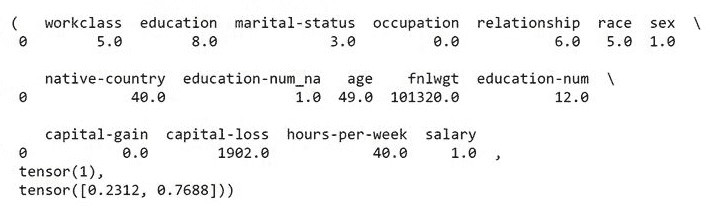

图 7.2 – 运行已保存的 adult_sample_model 模型进行预测的输出

在本食谱中描述的模型网页部署过程中，你将按照与我们刚刚回顾的*第三章*《使用表格数据训练模型》食谱中完全相同的步骤（如下所列）进行操作：

1.  加载已保存的训练模型。

1.  将模型应用到输入样本上。

1.  获取模型的预测结果。

与*第三章*《使用表格数据训练模型》中所有操作都在 Jupyter notebook 环境下进行不同，在这个示例中，你将通过一个简单的网页应用程序完成这些步骤。你将能够以非常自然的方式输入新的样本并获得预测结果，预测结果会以清晰的英文语句呈现，而不是张量的形式。更棒的是，你将能够与他人分享你的网页应用程序，让他们也能使用你的模型并查看其做出的预测。简而言之，通过部署你的模型，你将其从一个只能在程序中访问的抽象编码工件转变为一个普通人也能实际使用的软件工具。

本节描述的部署过程包含一个作为 Flask 模块实现的网络服务器。Flask 是一个 Python 库，它让你可以在熟悉的 Python 环境中提供网页应用程序。在本示例中，你将启动 Flask 模块，并使用它所提供的网页来调用模型。

## 准备工作

确保你已经按照*在本地系统上设置 fastai*这一食谱中的步骤安装了 fastai，并确认你可以访问 `ch7` 目录下 `deploy_tabular` 目录中的文件。

## 如何操作…

要在你的系统上部署一个训练好的表格数据集模型，你将启动 Flask 服务器，并通过相关的网页来验证你是否能根据给定的输入评分参数从模型中获取预测。完成以下步骤来操作：

1.  在本地系统的命令窗口/终端中，将 `ch7` 目录下的 `deploy_tabular` 设置为当前目录。

1.  在命令行/终端中输入以下命令来启动 Flask 服务器：

    ```py
    localhost:5000, as shown in the following screenshot: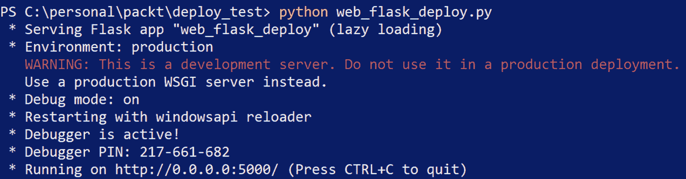Figure 7.3 – Output when the Flask server starts
    ```

1.  打开浏览器窗口，并在地址栏输入以下内容：

    ```py
    home.html web page will be loaded in the browser, as shown in *Figure 7.4*: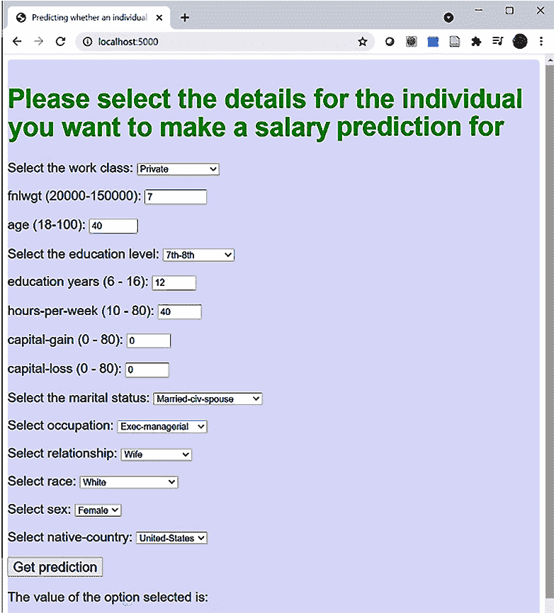Figure 7.4 – home.html being server by the Flask server
    ```

1.  现在，选择 `home.html`，在此案例中，选择字段的默认值：

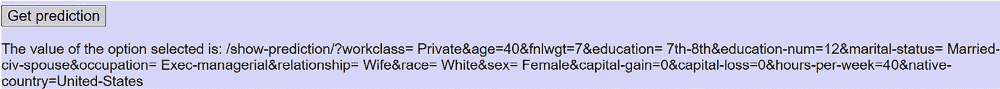

图 7.5 – 在 home.html 中使用默认设置生成的查询字符串

几秒钟后，`show-prediction.html` 网页将显示模型对 `home.html` 中输入的值进行预测的结果，如*图 7.6*所示：

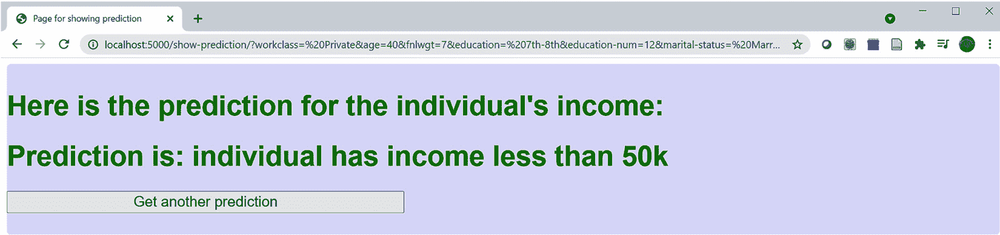

图 7.6 – 模型在 show-prediction.html 中显示的预测结果

恭喜！你已成功设置了 Flask 服务器，并在简单网页部署的背景下练习了 fastai 模型的网页部署。

## 它是如何工作的…

当你运行这个配方时，幕后发生了很多事情。在本节中，我们将首先概述网页部署的流程，然后深入研究构成该部署的关键代码部分。

### 快速介绍 fastai 表格模型的网页部署工作原理

本配方中描述的网页部署与本书前面看到的配方有所不同。与其他配方（它们涉及以 Jupyter 笔记本形式呈现的单个代码文件）不同，网页部署涉及多个文件中分布的代码，如 *图 7.7* 所示：

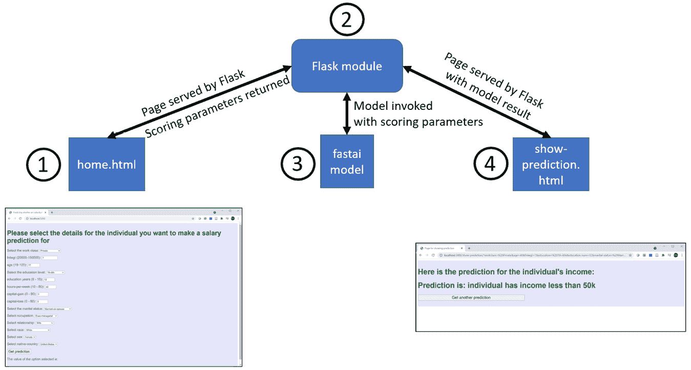

图 7.7 – 使用 Flask 部署 fastai 模型的网页概述

以下是 *图 7.7* 中数字所标示的关键项：

1.  `home.html` – 这是用户指定每个特征的网页，用于训练模型时使用的特征。`home.html` 包含一组 JavaScript 函数，这些函数设置每个控件中的可用值，打包用户的输入，并调用 `show-prediction.html`，将评分参数作为参数传递。

1.  Flask `web_flask_deploy.py` 模块 – 一个 Python 模块，使用 Flask 库来服务构成网页部署的网页。该模块包括 `home.html` 和 `show-prediction.html`，它们完成了网页部署的大部分工作。`show-prediction.html` 的视图函数解析从 `home.html` 发送来的评分参数，将评分参数值组装成 DataFrame，使用包含评分参数的 DataFrame 调用训练好的模型进行预测，生成模型预测的字符串，最后触发 `show-prediction.html` 显示预测字符串。

1.  fastai `adult_sample_model.pkl` 模型 – 这是你在 *第三章* *《使用表格数据训练模型》* 中的 *保存训练好的表格模型* 配方中训练并保存的模型。`web_flask_deploy.py` Flask 模块中的 `show-prediction.html` 视图函数加载此模型，并使用它对在 `home.html` 中输入的评分参数进行预测。

1.  `show-prediction.html` – 这个网页显示模型根据在 `home.html` 中输入的评分参数所做的预测。用户阅读预测结果后，可以选择返回 `home.html` 输入另一组评分参数。

这是关于网页部署工作原理的高层次总结。接下来，我们将查看一些构成该部署的关键代码部分。

### 深入探索网页部署背后的代码

现在你已经了解了幕后发生的高层次过程，让我们深入探讨两段对整体 Web 部署特别重要的代码。我们将逐步解析部署中组成部分的主要代码，包括 Flask 服务器模块中的 Python 代码以及 HTML 文件中的 JavaScript 函数。

当你启动 Flask 服务器时，如食谱中的 *步骤 2* 所示，训练好的模型将被加载到 Python 模块中，以下是来自 Flask 服务器代码的片段：

```py
path = Path(os.getcwd())
full_path = os.path.join(path,'adult_sample_model.pkl')
learner = load_learner(full_path)
```

这是该片段的关键部分：

+   `path = Path(os.getcwd())` – 设置 `path` 为启动 Flask 服务器的目录。代码假设模型文件位于相同的目录中。

+   `full_path = os.path.join(path,'adult_sample_model.pkl')` – 定义了模型的完整路径，包括文件名。

+   `learner = load_learner(full_path)` – 将模型加载到 `learner` 中。

当你在浏览器中访问 `localhost:5000` 时，将显示 `home.html` 页面。这个过程是如何发生的呢？在 `web_flask_deploy.py` Flask 模块中，`home.html` 控制了当 Flask 服务器运行时，你访问 `localhost:5000` 时发生的事情，如以下代码片段所示：

```py
@app.route('/')
def home():   
    title_text = "fastai deployment"
    title = {'titlename':title_text}
    return render_template('home.html',title=title)  
```

这是此视图函数的关键部分：

+   `@app.route('/')` – 指定当你访问 `localhost:5000` 地址时应用此视图函数。

+   `return render_template('home.html',title=title)` – 指定当你访问 `localhost:5000` 时显示 `home.html`。

当 `home.html` 被加载时，操作从 Flask 服务器模块中的 Python 转移到 `home.html` 中的 HTML 和 JavaScript 的结合体。首先，调用 `load_selections()` 函数将值加载到网页上的控件中，如以下 HTML 语句所示：

```py
<body onload="load_selections()">
```

`load_selections()` 函数通过指定有效值的列表填充页面上的选择控件（下拉列表），例如以下 `relationship` 控件的内容：

```py
var relationship_list = [" Wife" ," Not-in-family" ," Unmarried" ," Husband" ," Own-child" ," Other-relative" ];
```

`load_selections()` 函数还包括 `for` 循环，这些循环将有效值列表设置到选择控件中，例如以下 `for` 循环填充 `relationship` 控件：

```py
for(var i = 0; i < relationship_list.length; i++) {
      var opt = relationship_list[i];
      select_relationship.innerHTML += "<option value=\"" + opt + "\">" + opt + "</option>";
```

对于输入数值的控件，`load_selections()` 函数设置页面加载时显示的默认值。例如，以下 `load_selections()` 函数中的语句为 `age` 字段设置了默认值：

```py
document.getElementById("age").defaultValue = 40;
```

一旦值被加载到控件中并且页面显示，用户可以在控件中选择与默认值不同的评分参数值。

在用户选择了评分参数的值后，用户可以选择按钮，调用 `link_with_args()` 函数：

```py
<button>
<a onclick="link_with_args();" style="font-size : 20px; width: 100%; height: 100px;">Get prediction</a>
</button>
```

`link_with_args()` 函数调用 `getOption()` 函数，加载用户在 `home.html` 中选择的控件值，并用这些值构建查询字符串，如下所示，这是 `getOption()` 中的代码片段：

```py
prefix = "/show-prediction/?"
window.output = prefix.concat("workclass=",workclass_string,"&age=",age_value,"&fnlwgt=",fnlwgt_value,"&education=",education_string,"&education-num=",education_num_value,"&marital-status=",marital_status_string,"&occupation=",occupation_string,"&relationship=",relationship_string,"&race=",race_string,"&sex=",sex_string,"&capital-gain=",capital_gain_value,"&capital-loss=",capital_loss_value,"&hours-per-week=",hours_per_week_value,"&native-country=",native_country_string);
document.querySelector('.output').textContent = window.output;
```

以下是该代码片段的关键部分：

+   `prefix = "/show-prediction/?"` – 指定当链接被触发时，Flask 模块中将调用哪个视图函数。

+   `window.output` – 指定查询字符串中包含的参数集。这个字符串由一系列键值对组成，每个值等于在 `home.html` 中对应的控件。

+   `document.querySelector('.output').textContent = window.output;` – 指定查询字符串将在浏览器窗口中显示。

你可能记得在这个过程中的查询字符串。在食谱的*步骤 4*中，当你选择 `home.html` 时，查询字符串会在页面底部短暂显示，随后加载 `show-prediction.html`。

在调用 `getOption()` 后，`link_with_args()` 函数通过以下语句触发对 `show-prediction.html` 的引用：

```py
window.location.href = window.output;
```

通过这个语句，操作从 HTML 和 JavaScript 的世界切换回 Python，并在 Flask 服务器中调用 `show-prediction.html` 的视图函数。以下是该视图函数的开始部分，其中在 `home.html` 中输入并通过查询字符串传递的评分参数值被加载到 `score_df` DataFrame 中：

```py
@app.route('/show-prediction/')
def show_prediction():
     score_df = pd.DataFrame(columns=scoring_columns)
for col in scoring_columns:
        print("value for "+col+" is: "+str(request.args.get(col)))    
        score_df.at[0,col] = request.args.get(col)
```

以下是该代码片段的关键部分：

+   `@app.route('/show-prediction/')` – 指定此视图函数适用于 `show-prediction.html` 网页。

+   `score_df = pd.DataFrame(columns=scoring_columns)` – 创建一个空的 DataFrame 来存储评分参数。

+   `score_df.at[0,col] = request.args.get(col)` – 这个语句会针对 `scoring_columns` 列表中的每一列运行。它将查询字符串中由 `getOption()` JavaScript 函数构建并作为引用传递到 `show-prediction.html` 的值复制到 `score_df` DataFrame 第一行的对应列。这就是用户在 `home.html` 中输入的评分参数值如何传入 Python Flask 服务器模块的方式。

现在，评分参数已被加载到 `score_df` DataFrame 的第一行中，我们可以在 DataFrame 的第一行上调用模型，正如以下来自 `show-prediction.html` 视图函数的代码片段所示：

```py
pred_class,pred_idx,outputs = learner.predict(score_df.iloc[0])
if outputs[0] >= outputs[1]:
        predict_string = "Prediction is: individual has income less than 50k"
    else:
        predict_string = "Prediction is: individual has income greater than 50k"
    prediction = {'prediction_key':predict_string}
    return(render_template('show-prediction.html',prediction=prediction))
```

以下是该代码片段的关键部分：

+   `pred_class,pred_idx,outputs = learner.predict(score_df.iloc[0])` – 使用 `score_df` DataFrame 的第一行作为输入调用模型。此调用有三个输出：

    a) `pred_class` 列出了输入到模型中的评分参数。对于类别列，原始的评分参数值被替换为类别标识符。例如，`native-country` 列中的 `United States` 被替换为 `40.0`。这些转换与训练数据时所做的转换完全相同，正如你在 *第三章**《使用表格数据训练模型》* 中所做的那样。由于 fastai 管理这些转换的方式，不像 Keras，你不需要担心在部署模型时维护管道对象并应用它——fastai 会自动处理这一切。这是 fastai 的一个巨大优势。

    b) `pred_idx` – 预测的索引。对于此模型，预测值将为 0（表示个人收入低于 50,000）或 1（表示个人收入高于 50,000）。

    c) `outputs` – 显示每个预测值的概率。

    *图 7.8* 显示了预测输出的示例，以及它如何对应于 `pred_class`、`pred_idx` 和 `outputs` 变量：

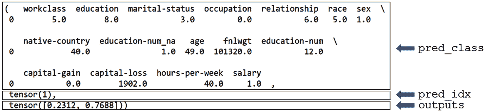

图 7.8 – 模型预测输出示例

+   `return(render_template('show-prediction.html',prediction=prediction))` – 指定以该视图函数中设置的参数值显示 `show-prediction.html`。

执行此操作后，页面返回到 HTML，`show-prediction.html` 被加载到浏览器中。以下代码片段显示了展示预测文本的 HTML：

```py
<div class="home">
  <h1 style="color: green"> 
    Here is the prediction for the individual's income:
  </h1> 
  <h1 style="color: green"> 
    {{ prediction.prediction_key }}
  </h1>
```

`{{ prediction.prediction_key }}` 值对应于 Flask 服务器中 `show-prediction` 的视图函数中设置的 `predict_string` 值。结果是，模型对评分参数做出的预测会被显示出来，如 *图 7.9* 所示：


图 7.9 – 部署模型的最终结果 – 对评分参数的预测

现在你已经看到了构成整个 fastai 模型 Web 部署流程的所有主要代码项。该流程包括以下几个步骤：

1.  流程从启动 Flask 服务器开始。一旦启动了 Flask 服务器，它就准备好在 `localhost:5000` 提供 `home.html`。

1.  当你在浏览器中访问 `localhost:5000` 时，Flask 服务器会运行 `home.html` 的视图函数，并在浏览器中显示 `home.html`。

1.  然后流程转到 `home.html` 中的 HTML/JavaScript，用户在此选择评分参数并点击 **获取预测** 按钮。

1.  然后流程返回到 Flask 服务器，运行 `show-prediction.html` 的视图函数，从模型中获取评分参数的预测，并在浏览器中展示 `show-prediction.html`。

1.  最后，流程回到`show-prediction.html`，在该页面上展示模型的预测结果。

1.  此时，用户可以选择`show-prediction.html`，使用不同的评分参数从*步骤 2*重新开始整个过程。

## 还有更多……

本食谱中的网络部署示例仅仅触及了 Flask 的表面，它只涵盖了现代 HTML 和 JavaScript 的基本应用。本书的范围无法深入探讨如何使用 Python 开发 Web 应用，但如果你有兴趣了解更多，可以参考以下资源：

+   *使用 Flask 部署深度学习模型* ([`towardsdatascience.com/deploying-a-deep-learning-model-using-flask-3ec166ef59fb`](https://towardsdatascience.com/deploying-a-deep-learning-model-using-flask-3ec166ef59fb)) 更详细地介绍了如何使用 Flask 部署深度学习模型。尽管这篇文章重点介绍的是部署 Keras 模型，而非 fastai 模型，但文章中描述的原则同样适用于这两种框架。

+   *HTML5 与 CSS 的响应式网页设计* ([`www.amazon.com/Responsive-Web-Design-HTML5-CSS/dp/1839211563/ref=sr_1_2?dchild=1&keywords=html5+packt&qid=1623055650&sr=8-2`](https://www.amazon.com/Responsive-Web-Design-HTML5-CSS/dp/1839211563/ref=sr_1_2?dchild=1&keywords=html5+packt&qid=1623055650&sr=8-2)) 提供了现代 HTML 的广泛背景，并涉及了**层叠样式表**（**CSS**），它用于控制网页的渲染方式。

+   *JavaScript 中的 Clean Code* ([`www.amazon.com/Clean-Code-JavaScript-reliable-maintainable/dp/1789957648/ref=sr_1_6?dchild=1&keywords=Javascript+Packt&qid=1623055616&sr=8-6`](https://www.amazon.com/Clean-Code-JavaScript-reliable-maintainable/dp/1789957648/ref=sr_1_6?dchild=1&keywords=Javascript+Packt&qid=1623055616&sr=8-6)) 介绍了 JavaScript 的良好编程实践。如果你正在阅读这本书，说明你对 Python 已经有了相当的掌握，应该能够轻松地掌握 JavaScript。虽然 JavaScript 在 C++和 Scala 等更高大上的语言程序员中并不总是得到应有的尊重，但事实上，JavaScript 非常灵活，学会它非常有用。

# 部署一个基于图像数据集训练的 fastai 模型

在*使用 fastai 部署基于表格数据集训练的模型*这一食谱中，我们讲解了如何部署一个基于表格数据集训练的模型。我们部署了一个根据一组被称为**评分参数**的特征（包括教育水平、工作类别和每周工作小时数）来预测个人是否会有超过 50,000 收入的模型。为了进行这个部署，我们需要一种方式让用户选择评分参数的值，并展示由训练好的 fastai 模型基于这些评分参数所做的预测。

在本教程中，我们将部署在*第六章**，训练具有视觉数据的模型*中的 *使用独立视觉数据集训练分类模型* 处训练的图像分类模型。此模型可以预测图像中展示的水果或蔬菜。与表格数据集模型的部署不同，部署图像数据集模型时，我们需要能够指定要进行预测的图像文件。

注意

为了简化操作，此部署使用与我们在*部署基于表格数据集训练的 fastai 模型*教程中相同名称的网页（`home.html` 和 `show-prediction.html`）。不过，这些网页是为图像模型部署定制的。

## 准备工作

确保你已经按照*在本地系统上设置 fastai*教程中的步骤，成功安装了 fastai。确认你可以访问 `ch7` 目录中的 `deploy_image` 目录下的文件。

## 如何操作……

要在本地系统上演练图像分类模型的部署，首先启动 Flask 服务器，打开浏览器中部署的 `home.html` 页面，选择一个图像文件进行预测，然后验证在该部署的 `show-prediction.html` 页面中是否显示了图像的预测结果。

按照以下步骤进行操作，以演练部署在图像数据集上训练的 fastai 模型：

1.  在本地系统的命令窗口/终端中，将 `ch7` 目录中的 `deploy_image` 目录设置为当前目录。

1.  在命令行/终端输入以下命令以启动 Flask 服务器：

    ```py
    localhost:5000, as shown in *Figure 7.10*: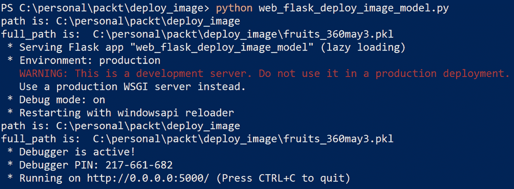Figure 7.10 – Output when the Flask server starts
    ```

1.  打开浏览器窗口，在地址栏输入以下内容：

    ```py
    home.html will be loaded in the browser, as shown in *Figure 7.11*: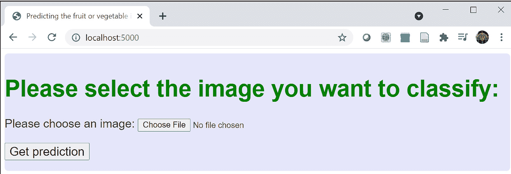Figure 7.11 – home.html for the image model deployment being served by the Flask server
    ```

1.  现在选择 `deploy_images` 目录中的 `test_images` 子目录。选择柠檬图像文件 `5_100.jpg`，并关闭文件对话框，例如，在 Windows 中选择 **打开**。

1.  当文件对话框关闭时，你选择的文件名会显示在 `home.html` 中的 **选择文件** 按钮旁边，如*图 7.12*所示：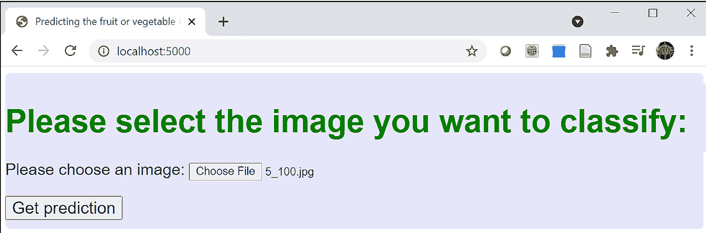

    图 7.12 – 你选择的文件名显示在 home.html 页面中

1.  现在选择`show-prediction.html` 页面，该页面显示模型对你在 `home.html` 中选择的图像的预测结果，如*图 7.13*所示：

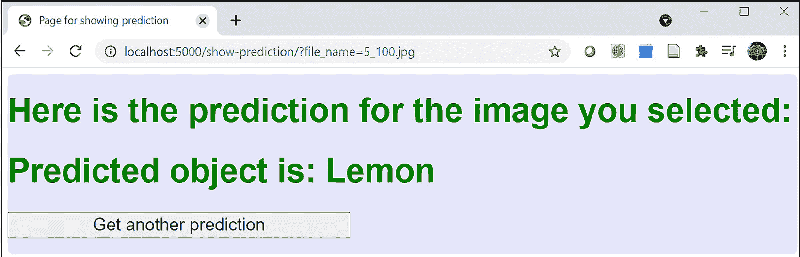

图 7.13 – 模型对图像内容的预测，显示在 show-prediction.html 页面中

恭喜！你已成功设置了 Flask 服务器并演练了 fastai 模型的 Web 部署，该模型可以预测图像中展示的物体。

## 工作原理……

现在你已经完成了 fastai 图像分类模型的 Web 部署，让我们来看一下幕后发生了什么。我们将从部署的概述开始，然后深入探讨图像分类模型和表格数据集模型部署之间的代码差异，正如在 *《部署一个基于表格数据集训练的 fastai 模型》* 配方中所描述的那样。

### fastai 图像分类模型 Web 部署的工作概述

让我们回顾一下如 *图 7.14* 所示的端到端部署流程：

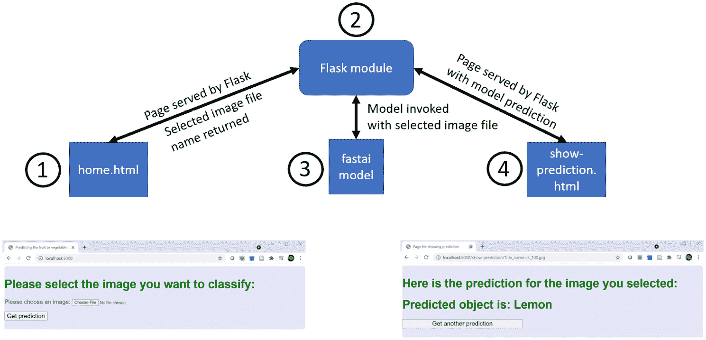

图 7.14 – 使用 Flask 部署 fastai 图像分类模型的 Web 概述

以下是 *图 7.14* 中数字高亮的关键项目：

1.  `home.html`——这是用户指定要让模型对其进行预测的图像文件的网页。用于图像分类模型部署的 `home.html` 版本包含了显示文件选择对话框、打包选中文件名称并调用 `show-prediction.html` 的 HTML 和 JavaScript 函数，并将选定的图像文件名作为参数传递。

1.  Flask `web_flask_deploy_image_model.py` 模块——这个 Python 模块使用 Flask 库来提供构成 Web 部署的网页。该模块包括 `home.html` 和 `show-prediction.html` 的视图函数。`show-prediction.html` 的视图函数接收从 `home.html` 中选择的图像文件名称，使用该文件名调用训练好的模型进行预测，生成模型预测的字符串，并最终触发 `show-prediction.html` 显示预测字符串。

1.  fastai `fruits_360may3.pkl` 图像分类模型——这是你在 *《使用独立视觉数据集训练分类模型》* 配方中训练并保存的模型，位于 *第六章**，《使用视觉数据训练模型*》一章中。`web_flask_deploy_image_model.py` Flask 模块中的 `show-prediction.html` 视图函数加载这个模型，然后使用它对 `home.html` 中选择的图像文件进行预测。

1.  `show-prediction.html`——这个网页展示了模型对 `home.html` 中选择的图像文件所做的预测。在这个页面，用户可以选择 `home.html` 来选择另一张图像文件进行预测。

这就是图像分类模型 Web 部署工作的高级总结。

### 深入分析图像分类模型 Web 部署背后的代码

现在我们已经回顾了图像分类模型部署的整体流程，接下来让我们来看一下与我们在*《部署基于 tabular 数据集训练的 fastai 模型》*配方中涉及的 tabular 模型部署相比，图像分类模型部署的一些关键区别。以下是主要的区别：

+   `home.html`中的 HTML – 用于部署 tabular 数据集模型的`home.html`版本需要大量控件，以便用户能够指定所有必需的评分参数。用户需要能够为训练模型使用的所有特征指定值。对于图像分类模型的部署，只有一个特征——图像文件——因此我们只需要一个用于选择文件的控件。以下是文件选择控件的 HTML：

    ```py
      <label for="image_field">Please choose an image:</label>
      <input type="file"
           id="image_field" name="image_field"
           accept="image/png, image/jpeg">  
    ```

    以下是该 HTML 片段中的关键内容：

    a) `input type="file"` – 指定该控件用于从本地文件系统输入文件。

    b) `accept="image/png, image/jpeg"` – 指定从此控件打开的文件对话框只允许选择具有`image/png`或`image/jpeg`内容类型的图像文件。

+   `home.html`中的 JavaScript – 用于部署 tabular 数据集模型的`home.html`版本包含三个 JavaScript 函数：

    a) `getOption()`，用于从控件中获取值。

    b) `link_with_args()`，用于调用`getOption()`并将查询字符串发送到视图函数`show-prediction.html`。

    c) `load_selections()`，用于初始化控件。

    用于图像分类模型部署的`home.html`版本不需要`load_selections()`（因为没有需要初始化的控件），其版本的`link_with_args()`与 tabular 模型部署版本相同。剩下的是`getOption()`函数，它与 tabular 模型部署中的版本有显著区别。以下是图像分类部署版本的`getOption()`：

    ```py
    function getOption() { 
          var file_value = [];
          const input = document.querySelector('input');
          const curFiles = input.files;
          if(curFiles.length === 0) {
            console.log("file list empty");

          } else {
          for(const file of curFiles) {
            file_value.push(file.name);
            }
          }
          prefix = "/show-prediction/?"
          window.output = prefix.concat("file_name=",file_value[0])
        }
    ```

    以下是`getOption()`定义中的关键内容：

    a) `const input = document.querySelector('input');` – 将`input`与文件选择器关联起来。

    b) `const curFiles = input.files;` – 将与文件选择器关联的文件列表赋值给`curFiles`。

    c) `for(const file of curFiles) { file_value.push(file.name);}` – 遍历与文件选择器关联的文件列表，并将每个文件名添加到`file_value`列表中。

    d) `window.output = prefix.concat("file_name=",file_value[0])` – 使用`file_value`文件名列表中的第一个元素构建查询字符串。由于我们每次只对一个文件进行预测，因此查询字符串只需要一个文件名。最终生成的查询字符串类似于：`/show-prediction/?file_name=5_100.jpg`。

+   Flask 服务器中的 `show-prediction.html` 视图函数 – 以下代码片段展示了图像分类 Web 部署的视图函数：

    ```py
    @app.route('/show-prediction/')
    def show_prediction():
        image_file_name = request.args.get("file_name")
        full_path = os.path.join(path,image_directory,image_file_name)
        img = PILImage.create(full_path)
        pred_class, ti1, ti2 = learner.predict(img)
        predict_string = "Predicted object is: "+pred_class
        prediction = {'prediction_key':predict_string}
        return(render_template('show-prediction.html',prediction=prediction))
    ```

    以下是定义此视图函数时的关键项：

    a) `image_file_name = request.args.get("file_name")` – 将 `image_file_name` 的值设置为查询字符串中的文件名。

    b) `full_path = os.path.join(path,image_directory,image_file_name)` – 将 `full_path` 的值设置为在 `home.html` 中选择的图像文件的完整文件名。假设该文件是从运行 Flask 服务器的目录中的 `test_images` 子目录中选择的。

    c) `img = PILImage.create(full_path)` – 为在 `home.html` 中选择的图像文件创建一个名为 `img` 的图像对象。

    d) `pred_class, ti1, ti2 = learner.predict(img)` – 从图像分类模型中获取预测结果，预测的对象是 `img`。`pred_class` 包含模型对图像文件预测的类别（如 *苹果* 或 *梨*）。

    e) `return(render_template('show-prediction.html',prediction=prediction))` – 指定显示 `show-prediction.html` 并在此视图函数中设置参数值。

现在你已经看到了在表格数据集模型部署与图像分类模型部署之间的所有主要代码差异。

## 还有更多内容……

在本章中，你已经看到了两个使用基于 Flask 的 Web 应用程序部署 fastai 模型的示例。这并不是你可以采用的唯一部署模型的方法。其他方法包括通过 REST API 端点部署模型（以便其他应用程序可以直接调用模型），或将模型及其依赖项封装到其他应用程序中。可以将模型和依赖项（例如所需的 Python 库）打包到 Docker 容器中，然后通过像 Kubernetes 这样的编排系统将这些容器提供给其他应用程序。

与其停留在这些一般的部署概念上，可能更有用的是回顾一些具体的快速部署 fastai 模型的方法。以下是部署 fastai 模型的一些方法示例：

+   使用 Amazon SageMaker（AWS 的机器学习环境）进行部署，具体描述请参见：[`aws.amazon.com/blogs/machine-learning/building-training-and-deploying-fastai-models-with-amazon-sagemaker/`](https://aws.amazon.com/blogs/machine-learning/building-training-and-deploying-fastai-models-with-amazon-sagemaker/)。这种方法需要直接使用一些 PyTorch 代码，并且可能未在 fastai 的最新版本上进行验证。

+   使用 TorchServe 在 AWS 中部署，如此处所述：[`aws.amazon.com/blogs/opensource/deploy-fast-ai-trained-pytorch-model-in-torchserve-and-host-in-amazon-sagemaker-inference-endpoint/`](https://aws.amazon.com/blogs/opensource/deploy-fast-ai-trained-pytorch-model-in-torchserve-and-host-in-amazon-sagemaker-inference-endpoint/)。这种方法相比前述方法，*组件较少*，并且更为现代，但方法的核心似乎是重新实现 fastai 模型在 PyTorch 中的运行。

+   使用 Google Cloud Platform 部署，如此处所述：[`jianjye.medium.com/how-to-deploy-fast-ai-models-to-google-cloud-functions-for-predictions-e3d73d71546b`](https://jianjye.medium.com/how-to-deploy-fast-ai-models-to-google-cloud-functions-for-predictions-e3d73d71546b)。

+   使用 Azure 部署，如此处所述：[`forums.fast.ai/t/platform-azure/65527/7`](https://forums.fast.ai/t/platform-azure/65527/7)。

这个列表并不详尽，但它展示了可供 fastai 模型部署的各种选项。

# 维护你的 fastai 模型

部署一个模型并不是故事的结束。一旦你部署了一个模型，你需要维护该部署，以确保它与模型训练所使用的当前数据特征匹配。如何在生产环境中维护深度学习模型的详细描述超出了本书的范围，但值得简要提及如何在本章所描述的简单模型部署环境下维护模型。在本教程中，我们将讨论你可以采取哪些措施来维护在 *部署基于表格数据集训练的 fastai 模型* 中部署的表格模型。

## 准备工作

确保你已经按照 *在本地系统上设置 fastai* 这个教程的步骤完成安装，确保 fastai 已经安装在你的本地系统中。同时，确保你已经启动了用于表格模型部署的 Flask 服务器，可以通过遵循 *部署基于表格数据集训练的 fastai 模型* 这个教程中的 *步骤 1, 2 和 3* 来完成。

在这个教程中，你将对用于训练表格模型的数据进行一些基本分析，这个模型已在 *部署基于表格数据集训练的 fastai 模型* 这个教程中进行了部署。为了进行此分析，请确认你可以使用你选择的电子表格应用（如 Excel 或 Google Sheets）打开 `adult.csv` 文件，这是 `ADULT_SAMPLE` 数据集中的训练数据文件。如果你尚未在本地系统中拥有 `adult.csv`，请按照以下步骤获取该文件，并确认你可以使用电子表格应用打开它：

1.  在你的 Gradient 环境中，在终端窗口输入以下命令，将 `adult.csv` 复制到你的 `temp` 目录：

    ```py
    cp /storage/data/adult_sample/adult.csv /notebooks/temp/adult.csv
    ```

1.  在你的 Gradient 环境中的 JupyterLab 中，导航到你在前一步复制 `adult.csv` 的 `temp` 目录，右键点击 `adult.csv` 并选择 **下载**。

1.  使用你的电子表格应用程序打开在上一步中下载的本地`adult.csv`副本。*图 7.15* 显示了`adult.csv`在 Excel 中的前几行：

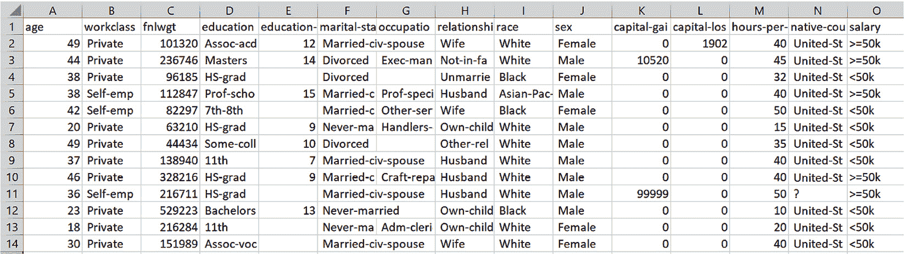

图 7.15 – adult.csv 在 Excel 中的前几行

注意

你可能会问，为什么我建议使用电子表格来检查此配方中的数据，而不是使用 Python？我推荐在这里使用电子表格有几个原因。首先，甚至像 Jeremy Howard 这样的权威人物都表示 Excel 是一个很棒的数据科学工具，而我恰好认为他完全正确。它灵活、轻便，并且对于在小数据集上进行简单调查，比 Python 更快。其次，Excel 帮助我调试了表格模型部署中的问题。当我第一次测试部署时，我很难理解为什么部署的模型与在 Python 笔记本中调用的模型产生不同的预测。然而，一旦我在 Excel 中检查数据，问题就显而易见了：用于训练模型的数据中的所有类别值都以空格开头。而在部署中，用户可以选择的类别值并没有以空格开头，因此模型没有将它们识别为与训练时遇到的类别值相同。Excel 给了我一个快速的方式来检测问题的根本原因。

## 如何操作…

为了执行一些模型维护操作，请完成以下步骤：

1.  首先，仔细观察`ADULT_SAMPLE`中类别值的表示方式。如果你还没有在电子表格应用程序中打开本地的`adult.csv`副本，现在就打开它。选择`workclass`列中的一个值。你是否注意到该值有任何不寻常的地方？查看其他一些类别列中的值：`relationship`和`native-country`。你会看到每个类别列中的值都以空格开头。

1.  请回想，在`home.html`中，用户在每个类别特征上可以选择的值是有限制的。打开表格模型部署中的`home.html`，查看`workclass`可以选择的值。*图 7.16* 显示了用户可以为`workclass`选择的值：

    图 7.16 – home.html 中可用的 `workclass` 值

1.  用户在`home.html`中可以选择的类别列的值是通过`load_selections()` JavaScript 函数中的一系列列表定义的。以下是`load_selections()` JavaScript 函数中为`workclass`、`relationship`和`native-country`定义的列表：

    ```py
    var workclass_list = [" Private" ," Self-emp-inc" ," Self-emp-not-inc" ," State-gov" ," Federal-gov" ," Local-gov" ];
    var relationship_list = [" Wife" ," Not-in-family" ," Unmarried" ," Husband" ," Own-child" ," Other-relative" ];
    var native_country_list = [" United-States"," Puerto-Rico"," Mexico"," Canada"," Taiwan"," Vietnam"," Philippines"];
    ```

    请注意，这些列表中的值每个都以一个空格开始，就像`adult.csv`中对应类别列的值一样。这些列表中的值用于构建查询字符串，查询字符串又被用作输入，以从模型中获取预测，作为`show-prediction.html`视图函数的输入。如果`home.html`中的列表值定义时没有前导空格，会发生什么情况？

1.  假设模型的训练数据已经扩展，包括来自`adult.csv`的数据，这些数据在`native-country`列中包含`United-Kingdom`值。你需要做以下操作来更新部署以适应这个变化：

    a) 使用新版本的`adult.csv`重新训练模型，并使用`learner.export()` fastai API 将新的训练模型保存为`pkl`文件。为了本教程的目的，假设你将新的模型命名为`adult_sample_model_new.pkl`。

    b) 将更新后的`adult_sample_model_new.pkl`模型文件复制到本地系统的`deploy_tabular`目录。

    c) 更新`web_flask_deploy.py` Flask 服务器模块中模型路径的定义，包含新的模型文件名：

    ```py
    full_path = os.path.join(path, 'adult_sample_model_new.pkl')
    ```

    d) 更新`home.html`中的`native_country_list`，以包括新的值：

    ```py
    var native_country_list = [" United-States"," Puerto-Rico"," Mexico"," Canada"," Taiwan"," Vietnam"," Philippines", "  United-Kingdom"  ];
    ```

    对于任何类别列的新值，你需要采取相同的步骤来更新部署：使用更新后的训练数据集重新训练模型，将更新后的训练模型复制到部署目录，更新 Flask 服务器以加载更新后的模型，并在`home.html`中更新有效的类别值列表。

1.  在上一阶段，我们了解了如果数据集随着新的类别值扩展，我们需要做什么。如果数据集中添加了一个全新的列呢？就像*步骤 4*中描述的过程一样，你需要在包含新列的更新训练数据集上重新训练模型，将新模型复制到`deploy_tabular`目录，并更新`web_flask_deploy.py`以加载新模型。最后，你还需要更新`home.html`，以便用户能够输入新列的信息。你需要进行的更新取决于新列是否在每个`home.html`的情况下。

1.  假设你需要更新部署，以处理一个名为`years-in-job`的新连续列——即记录个人在当前工作岗位上工作的年数。有效值为 0 到 45，默认值为 5。为了添加这个列，你需要对`home.html`进行几项更新。首先，你需要添加以下代码来定义这个新列的控制项：

    ```py
    <p> 
      <label for="years-in-job">years in job (0 - 45):</label>
      <input type="number" id="years-in-job" name="years-in-job"  min="0" max="45">
      </p>
    ```

    接下来，你需要在`load_selection()` JavaScript 函数中添加以下行，以设置默认值：

    ```py
    document.getElementById("years-in-job").defaultValue = 5;
    ```

    接下来，你需要在`getOption()` JavaScript 函数中添加以下行，以设置将包含在查询字符串中的这个列的值：

    ```py
    years_in_job_value = document.getElementById("years-in-job ").value;
    ```

    最后，你需要在用于定义`window.output`的查询字符串末尾添加以下内容：

    ```py
    ,"&years-in-job=",years_in_job_value
    ```

1.  假设你需要更新部署，处理一个新的分类列 `work-location`，它指定个人当前工作的地点。该列的有效值包括 `remote`（远程）、`on-site`（现场）和 `mixed`（混合）。为了让 `home.html` 适应这个新列，首先通过添加以下代码来定义 `work-location` 列的控制：

    ```py
      <p>
        Select work location:
        <select id="work-location">
        </select>
      </p>
    ```

    接下来，向 `load_selection()` JavaScript 函数添加以下几行代码，以设置新列控制的值。请注意，我们假设与其他分类列一样，`work-location` 中的值将以空格开头，因此 `work_location_list` 中的所有值都以空格开始：

    ```py
    var select_work_location = document.getElementById("work-location");
    var work_location_list = [" remote"," on-site"," mixed"];
    for(var i = 0; i < work_location_list.length; i++) {
          var opt = work_location_list[i];
          select_work_location.innerHTML += "<option value=\"" + opt + "\">" + opt + "</option>";
        }
    ```

    接下来，向`getOption()` JavaScript 函数添加以下几行代码，以设置查询字符串中包含该列的值：

    ```py
    selectElementworklocation = \
    document.querySelector('#work-location'); 
    work_location_string =\
    selectElementworklocation.options[selectElementworklocation.selectedIndex].value
    ```

    最后，向用于定义 `window.output` 的查询字符串的末尾添加以下内容：

    ```py
    ,"&work-location=",work_location_string
    ```

恭喜！你已经完成了维护模型部署的一些必要操作，确保它能够适应训练数据集的变化。

## 它是如何工作的……

在这个食谱中，我们回顾了如何维持在表格数据上训练的模型的网络部署。我们了解了为适应训练数据集变化而调整部署的步骤。我们讨论的那些数据集变化包括现有分类列中的新值、新的连续列和新的分类列。

在工业级生产部署中，数据集的架构，即构成数据集的所有列的特征，将保存在 HTML 文件之外。例如，我们可能会将架构保存在一个单独的配置文件中，里面包含有关数据集列的信息。这样一来，`home.html` 中的控制和有效值就不是硬编码的，而是根据配置文件的内容动态生成。

使用这种动态设置方式，当数据集添加新列或列的有效值发生变化时，我们只需更新配置文件中的数据集架构定义，`home.html` 将会自动更新。为了让网络部署尽可能简单，我们将控制和有效值直接编写在 `home.html` 中，而不是动态生成它们。这使得 *基于表格数据训练 fastai 模型的部署* 食谱更易于跟随，但也意味着在 `home.html` 中有多个地方需要更新，以维持数据集发生变化时的部署。

## 还有更多内容……

在这个食谱中，我们讨论了如何处理数据集架构的变更，但我们没有讨论如何处理数据集分布的变化，或者如何监控模型以确保它随着时间的推移保持其性能。这两个问题对于维持已部署的模型至关重要，但它们超出了本书的范围。

如果你有兴趣了解更多关于在生产环境中监控模型性能的内容，这篇文章提供了一个很好的概述：[`christophergs.com/machine%20learning/2020/03/14/how-to-monitor-machine-learning-models/`](https://christophergs.com/machine%20learning/2020/03/14/how-to-monitor-machine-learning-models/)。

# 测试你的知识

现在你已经部署了两种 fastai 模型，并解决了与维护已部署模型相关的一些挑战，你可以尝试一些额外的部署变种，来锻炼你所学到的内容。

## 准备就绪

确保你已经按照*在本地系统上设置 fastai*教程中的步骤，在本地系统上安装了 fastai。同时，确保你已经按照*部署在图像数据集上训练的 fastai 模型*教程中的*第 1 步、第 2 步*和*第 3 步*，启动了 Flask 服务器以进行图像分类模型的部署。

为了在图像分类模型部署上进行实验，复制`deploy_image`目录。为此，将包含`deploy_image`的目录设置为当前目录，并运行以下命令来复制该目录及其内容，命名为`deploy_image_test`：

```py
cp -r deploy_image deploy_image_test
```

## 如何做到……

你可以按照此教程中的步骤，扩展和增强你在*部署在图像数据集上训练的 fastai 模型*教程中遵循的模型部署，以允许用户在`home.html`中选择多个图像文件，并在`show-prediction.html`中显示所有图像的预测结果：

1.  将`deploy_image_test`设置为当前目录。

1.  为了允许用户选择多个文件并同时显示所有文件的预测结果，你需要更新`home.html`、Flask 服务器和`show-prediction.html`。

1.  首先更新`home.html`，使用户能够在文件对话框中选择多个文件。向文件对话框控件的定义中添加`multiple`属性，如下所示的 HTML 代码片段所示：

    ```py
      <input type="file" multiple
           id="image_field" name="image_field"
           accept="image/png, image/jpeg">
    ```

    现在，用户将能够在文件对话框中选择多个文件。

1.  接下来，更新`home.html`中的`getOption()` JavaScript 函数，构建一个文件名列表，将其添加到查询字符串中，并发送回 Flask 服务器。更新后的`getOption()`函数如下所示：

    ```py
    function getOption() { 
         var file_value = [];
      var file_count = 0;
      const input = document.querySelector('input');
      var file_path = input.value;
      const curFiles = input.files;
      if(curFiles.length === 0) {
        console.log("file list empty");
       } else {
      for(const file of curFiles) {
        if (file_count == 0) {
          file_count = 1;
          file_list_prefix = "&file_name=";
          var file_list = file_list_prefix.concat(file.name);
        } else {
          file_list = file_list.concat("&file_name=",file.name);
        }
        file_value.push(file.name);
      }
      }
      prefix = "/show-prediction/?"
      window.output = prefix.concat("file_path=",file_path,file_list)
    }  
    ```

    以下是`getOption()`函数中的关键更新项：

    a) `var file_list = file_list_prefix.concat(file.name);` – 指定如果这是第一个文件，则初始化`file_list`字符串。

    b) `file_list = file_list.concat("&file_name=",file.name);` – 指定如果这不是第一个文件，将文件名添加到`file_list`字符串的末尾。

    c) `window.output = prefix.concat("file_path=",file_path,file_list)` – 指定查询字符串包括`file_list`字符串，其中包含用户选择的所有图像文件的文件名。

    你已经完成了`home.html`中所需的更新，以处理多个图像文件。

1.  现在是时候更新 Flask 服务器了。首先，向 Flask 服务器中添加以下函数。稍后你将使用这个函数构建要发送到 `show-prediction.html` 的参数：

    ```py
    def package_list(key_name,list_in):
        i = 0
        list_out = []
        for element in list_in:
            key_value = list_in[i].strip()
            list_out.append({key_name:key_value})
            i = i+1
        return(list_out)
    ```

1.  接下来，更新 `show-prediction.html` 的视图函数。首先，你需要将你在 `home.html` 的 `getOption()` 函数中构建的文件名列表转为 Python 列表。以下语句将创建一个名为 `image_file_name_list` 的列表：

    ```py
    image_file_name_list = request.args.getlist('file_name')
    ```

1.  接下来，更新 `show-prediction.html` 的视图函数，使其能够遍历 `image_file_name_list`，为列表中的每个文件获取预测结果。将每个预测的 `pred_class` 值保存在一个名为 `prediction_string_list` 的列表中。

1.  使用你在 *步骤 5* 中定义的 `package_list` 函数来准备 `prediction_string_list`，并将其发送到 `show-prediction.html`：

    ```py
        prediction_list = package_list("prediction_key",prediction_string_list)
    ```

1.  更新视图函数的 `return` 语句，包含 `prediction_list`：

    ```py
        return(render_template('show-prediction.html',prediction_list=prediction_list))
    ```

    现在你已经完成了对 Flask 服务器的更新，以便处理多个图像文件。

1.  接下来，更新 `show-prediction.html`，显示每个图像的预测结果：

    ```py
      <h1 style="color: green"> 
        Here are the predictions for the images you selected:
      </h1> 
      <h1 style="color: green">
      <p> 
      
        {{prediction.prediction_key}}, 
      
      </p>  
      </h1>
    ```

1.  现在测试是否一切正常。启动位于 `deploy_image_test` 目录中的 Flask 服务器：

    ```py
    python web_flask_deploy_image_model.py
    ```

1.  在浏览器中打开 `localhost:5000` 来显示 `home.html`。从 `deploy_image_test/test_images` 目录中选择 `4_100.jpg`、`5_100.jpg` 和 `26_100.jpg` 文件。选择这些文件后，`home.html` 会更新，显示已选择了三个文件，如 *图 7.17* 所示：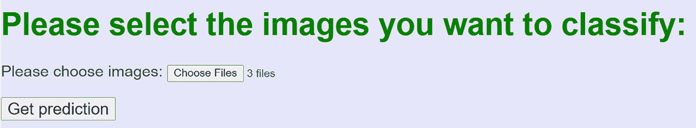

    图 7.17 – 选择三个图像文件后的 home.html

1.  选择 `show-predictions.html`，如 *图 7.18* 所示：


图 7.18 – show-prediction.html 显示多个图像的预测结果

恭喜！你已完成了一个有用的扩展，成功部署了图像分类模型。
