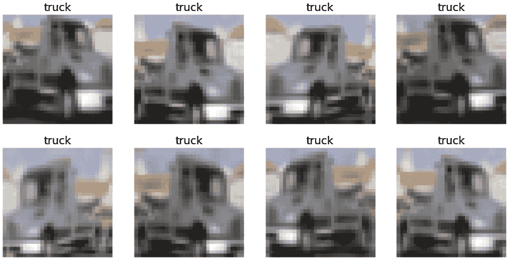

# 第八章：扩展的 fastai 和部署功能

到目前为止，在本书中，你已经学习了如何使用 fastai 获取和探索数据集，如何使用表格数据、文本数据和图像数据集训练 fastai 模型，以及如何部署 fastai 模型。到目前为止，本书的重点一直是在尽可能多地展示 fastai 的功能，且主要使用 fastai 高级 API。特别是，我们强调了使用 `dataloaders` 对象作为定义用于训练模型的数据集的基础。在本书的这一部分，我们尽可能地遵循了*理想路径*。为了演示如何使用 fastai 完成任务，我们选择了最直接的方式。

在本章中，我们将从*理想路径*中走出一些步骤，探索 fastai 的额外功能。你将学习如何更密切地追踪模型的变化，如何控制训练过程，并且如何充分利用 fastai 提供的更多功能。我们还将介绍一些与模型部署相关的高级主题。

以下是本章将覆盖的食谱：

+   获取更多关于使用表格数据训练的模型的详细信息

+   获取更多关于图像分类模型的详细信息

+   使用增强数据训练模型

+   使用回调函数充分利用训练周期

+   使你的模型部署对他人可用

+   在图像分类模型部署中显示缩略图

+   测试你的知识

# 技术要求

在本章中，你将同时使用云环境和本地环境来进行模型部署：

+   确保你已完成*第一章*《快速入门 fastai》中的设置部分，并且拥有一个可用的 Gradient 实例或 Colab 设置。

+   确保你已完成*第七章*《部署与模型维护》中的*在本地系统上设置 fastai*的步骤，以便在本地系统上设置 fastai。

确保你已从 [`github.com/PacktPublishing/Deep-Learning-with-fastai-Cookbook`](https://github.com/PacktPublishing/Deep-Learning-with-fastai-Cookbook) 克隆了本书的代码仓库，并且能够访问 `ch8` 文件夹。这个文件夹包含了本章中描述的代码示例。

# 获取更多关于使用表格数据训练的模型的详细信息

在*第三章*《使用表格数据训练模型》中的*使用 fastai 训练模型并使用精度作为度量指标*的食谱中，你使用表格数据集训练了一个 fastai 模型，并使用了准确度作为评估指标。在本食谱中，你将学习如何为这个模型获取额外的指标：**精确度**和**召回率**。精确度是指真正例除以真正例加上假正例的比例。召回率是指真正例除以真正例加上假负例的比例。

这些是有用的指标。例如，在本示例中，我们正在训练的模型预测个人收入是否超过 50,000 美元。如果要尽量避免假阳性 – 即在个人收入低于 50,000 美元时预测其收入超过该金额 – 那么我们希望精确率尽可能高。本示例将向您展示如何将这些有用的指标添加到 fastai 模型的训练过程中。

## 准备工作

确认您可以在您的 repo 的`ch8`目录中打开`training_with_tabular_datasets_metrics.ipynb`笔记本。

## 如何操作…

在这个示例中，您将运行`training_with_tabular_datasets_metrics.ipynb`笔记本。一旦您在您的 fastai 环境中打开笔记本，请完成以下步骤：

1.  运行笔记本中的单元格，直到`Define and train model`单元格以导入所需的库、设置您的笔记本和准备数据集。

1.  运行以下单元格以定义和训练模型：

    ```py
    recall_instance = Recall()
    precision_instance = Precision()
    learn = tabular_learner(dls,layers=[200,100], metrics=[accuracy,recall_instance,precision_instance])
    learn.fit_one_cycle(3)
    ```

    本单元格中的关键项如下：

    a) `recall_instance = Recall()` – 定义一个召回率度量对象。请注意，如果您直接将`Recall`放入模型的指标列表中，将会出现错误。相反，您需要定义一个召回率度量对象，例如`recall_instance`，然后将该对象包含在指标列表中。有关此度量标准的更多详细信息，请参阅 fastai 文档（[`docs.fast.ai/metrics.html#Recall`](https://docs.fast.ai/metrics.html#Recall)）。

    b) `precision_instance = Precision()` – 定义一个精确率度量对象。如果您直接将`Precision`放入指标列表中，将会出现错误，因此您需要首先定义`precision_instance`对象，然后将该对象包含在模型的指标列表中。

    c) `metrics=[accuracy,recall_instance,precision_instance]` – 指定模型将以准确率、召回率和精确率作为指标进行训练。

    该单元格的输出，如*图 8.1*所示，包括每个训练运行时的准确率以及召回率和精确率：


图 8.1 – 训练输出包括召回率和精确率

恭喜！您已经用表格数据训练了一个模型，并生成了召回率和精确率指标以用于训练过程。

## 工作原理…

您可能会问自己，我是如何知道您不能直接将`Recall`和`Precision`放入模型的指标列表中，并且需要先定义对象，然后将这些对象包含在指标列表中的。简单的答案是通过试错。具体来说，当我尝试直接将`Recall`和`Precision`放入模型的指标列表时，我遇到了以下错误：

```py
TypeError: unsupported operand type(s) for *: 'AccumMetric' and 'int'
```

当我搜索这个错误时，我在 fastai 论坛上找到了这篇帖子：[`forums.fast.ai/t/problem-with-f1scoremulti-metric/63721`](https://forums.fast.ai/t/problem-with-f1scoremulti-metric/63721)。帖子解释了错误的原因，并指出为了解决这个问题，我需要先定义`Recall`和`Precision`对象，然后再将它们包含在 metrics 列表中。

这个经验既展示了 fastai 的一个弱点，也展示了它的一个优点。弱点是`Precision`和`Recall`的文档缺少一个重要的细节——你不能直接将它们用于 metrics 列表。优点是 fastai 论坛提供了清晰准确的解决方案，解决了像这样的疑难问题，体现了 fastai 社区的力量。

# 获取有关图像分类模型的更多细节

在*第六章*的*使用简单整理视觉数据集训练分类模型*食谱中，你使用`CIFAR`整理数据集训练了一个图像分类模型。训练和训练模型的代码很简单，因为我们利用了 fastai 中的高级结构。在本食谱中，我们将重新审视这个图像分类模型，并探索 fastai 中的技术，以获取关于模型及其表现的更多信息，包括以下内容：

+   检查 fastai 生成的数据预处理**流水线**

+   获取训练过程中的训练和验证损失图表

+   显示模型表现最差的图像

+   显示**混淆矩阵**以获取模型表现不佳的情况快照

+   将模型应用于测试集，并检查模型在测试集上的表现

在本食谱中，我们将扩展之前训练`CIFAR`整理数据集的食谱。通过利用 fastai 的附加功能，我们将能够更好地理解我们的模型。

## 做好准备

确认你可以在仓库的`ch8`目录中打开`training_with_image_datasets_datablock.ipynb`笔记本。

## 如何操作…

在本节中，你将运行`training_with_image_datasets_datablock.ipynb`笔记本。一旦你在 fastai 环境中打开了该笔记本，请完成以下步骤：

1.  更新以下单元格，以确保`model_path`指向你在 Gradient 或 Colab 实例中的可写目录：

    ```py
    model_path = '/notebooks/temp'
    ```

1.  运行笔记本中的单元格，直到`定义 DataBlock`单元格，以导入所需的库，设置你的笔记本，并加载`CIFAR`数据集。

1.  运行以下单元格以定义一个`DataBlock`对象。通过显式地定义一个`DataBlock`对象，我们将能够执行一些我们无法在`dataloaders`对象上直接执行的额外操作，比如获取流水线的摘要：

    ```py
    db = DataBlock(blocks = (ImageBlock, CategoryBlock),
                     get_items=get_image_files,
                     splitter=RandomSplitter(seed=42),
                     get_y=parent_label)
    ```

    以下是此单元格中的关键内容：

    a) `blocks = (ImageBlock, CategoryBlock)` – 指定模型的输入为图像（`ImageBlock`），目标为对输入图像的分类（`CategoryBlock`）。

    b) `get_items=get_image_files` – 指定调用`get_image_files`函数来获取`DataBlock`对象的输入。

    c) `splitter=RandomSplitter(seed=42)` – 指定如何从训练集中定义验证集。默认情况下，20%的训练集被随机选择构成验证集。通过为`seed`指定值，此调用`RandomSplitter`将在多次运行中产生一致的结果。有关`RandomSplitter`的更多细节，请参阅文档（[`docs.fast.ai/data.transforms.html#RandomSplitter`](https://docs.fast.ai/data.transforms.html#RandomSplitter)）。

    d) `get_y=parent_label` – 指定图像的标签（即图像所属的类别）由图像所在目录在输入数据集中的位置定义。例如，在 Gradient 上，训练集中的猫图像位于`/storage/data/cifar10/train/cat`目录下。

1.  运行以下代码单元，使用在前一个代码单元中创建的`DataBlock`对象`db`来定义一个`dataloaders`对象：

    ```py
    dls = db.dataloaders(path/'train',bs=32)
    ```

    以下是此代码单元中的关键项：

    a) `db.dataloaders` – 指定使用`DataBlock`对象`db`来创建`dataloaders`对象

    b) `path/'train'` – 指定此模型的输入仅为`CIFAR`数据集的训练子集。

1.  运行以下代码单元来获取管道的概述：

    ```py
    db.summary(path/"train")
    ```

    让我们看一下此代码单元输出的关键部分。首先，输出展示了有关输入数据集的详细信息，包括源目录、整个数据集的大小以及训练集和验证集的大小，如下图所示：

    

    图 8.2 – 输入数据集的概述

    接下来，输出展示了 fastai 应用于单个输入样本的管道，包括样本的源目录、为该样本创建的图像对象以及样本的标签（类别），如*图 8.3*所示：

    

    图 8.3 – 单个图像文件的管道概述

    接下来，输出展示了 fastai 应用于构建单个批次的管道，即将从样本管道中输出的图像对象转换为张量。如*图 8.4*所示，32 x 32 像素的图像对象被转换为 3 x 32 x 32 的张量，其中第一维包含图像的颜色信息：

    

    图 8.4 – 应用于单个批次的管道的概述

    最后，输出展示了应用于整个批次的变换，如*图 8.5*所示：

    

    图 8.5 – 应用于所有批次的流水线总结描述

1.  运行以下单元格以为测试集定义一个 `DataBlock` 对象：

    ```py
    db_test = DataBlock(blocks = (ImageBlock, CategoryBlock),
                     get_items=get_image_files,
                     splitter=RandomSplitter(valid_pct=0.99,seed=42),
                     get_y=parent_label)
    ```

    请注意，与训练集的 `DataBlock` 对象不同，我们为 `db_test` 定义了一个明确的 `valid_pct` 值。我们将此值设置为 99%，因为在将测试集应用于模型时我们不会进行任何训练，因此无需将测试集的一部分用于训练。我们没有将 `valid_pct` 设置为 `1.0`，因为这个值会在你对 `db_test` 应用汇总时产生错误。

1.  运行笔记本中的单元格直到 `定义并训练模型` 单元格以检查数据集。

1.  运行以下单元格以使用 `cnn_learner` 对象定义模型。请注意，由于你从 `DataBlock` 对象定义了一个 `dataloaders` 对象，你将获得两全其美的效果：既有 `DataBlock` 对象特有的附加功能（例如汇总），又有你在本书中大多数食谱中使用的 `dataloaders` 对象的熟悉代码模式：

    ```py
    learn = cnn_learner(dls, resnet18, 
                        loss_func=LabelSmoothingCrossEntropy(), 
                        metrics=accuracy)
    ```

1.  运行以下单元格以训练模型：

    ```py
    learn.fine_tune(2,cbs=ShowGraphCallback())
    ```

    请注意 `cbs=ShowGraphCallback()` 参数。使用该参数，训练过程的输出包括训练和验证损失的图形，如 *图 8.6* 所示：

    

    图 8.6 – 训练和验证损失图

    该图表包含与从训练过程中默认获得的训练结果表相同的数据，如 *图 8.7* 所示：

    

    图 8.7 – 训练和验证损失表

1.  运行以下单元格以保存训练好的模型。我们暂时将模型的路径更新为一个在 Gradient 中可写的目录，以便我们能够保存模型：

    ```py
    save_path = learn.path
    learn.path = Path(model_path)
    learn.save('cifar_save_'+modifier)
    learn.path = save_path
    ```

    这个单元格中的关键项如下：

    a) `save_path = learn.path` – 指定将当前模型路径保存到 `save_path`。

    b) `learn.path = Path(model_path)` – 指定将模型路径设置为可写目录。

    c) `learn.save('cifar_save_'+modifier)` – 保存模型。稍后我们将加载保存的模型，并使用测试集对其进行验证。

    d) `learn.path = save_path` – 将模型的路径重置为其原始值。

1.  运行以下单元格以确认训练模型的准确性表现：

    ```py
    learn.validate()
    ```

    输出中的第二个值应与在训练的最后一个时期看到的准确度相匹配，如 *图 8.8* 所示：

    

    图 8.8 – 验证输出

1.  运行单元格直到 `检查顶级损失示例和混淆矩阵` 单元格。

1.  运行以下单元格以查看模型损失最大的样本：

    ```py
    interp = ClassificationInterpretation.from_learner(learn)
    interp.plot_top_losses(9, figsize=(15,11))
    ```

    这个单元格中的关键项如下：

    a) `interp = ClassificationInterpretation.from_learner(learn)` – 指定`interp`是`learn`模型的解释对象

    b) `interp.plot_top_losses(9, figsize=(15,11))` – 指定显示损失最大的九张图片

    输出显示了模型在预测时损失最大的图像示例，以及图像的预测内容和实际内容。你可以将这些图像视为模型预测最差的图像。*图 8.9*展示了输出的一个子集。例如，对于显示的第一张图像，模型预测图像包含一只鸟，而图像实际上标记为猫：

    

    图 8.9 – 最大损失的图像示例

1.  运行以下单元格以生成训练模型的混淆矩阵：

    ```py
    interp.plot_confusion_matrix()
    ```

    该单元格的输出是一个混淆矩阵，用于总结训练模型的性能，如*图 8.10*所示。混淆矩阵是一个`N` x `N`的矩阵，其中`N`是目标类别的数量。它将实际的目标类别值（纵轴）与预测值（横轴）进行比较。矩阵的对角线显示了模型做出正确预测的情况，而对角线之外的所有条目则是模型做出错误预测的情况。例如，在*图 8.10*所示的混淆矩阵中，在 138 个实例中，模型将一张狗的图片预测为猫，而在 166 个实例中，它将一张猫的图片预测为狗：

    

    图 8.10 – 训练模型的混淆矩阵

1.  现在你已经检查了模型在训练集上的表现，接下来让我们检查模型在测试集上的表现。为此，我们将使用测试集定义一个新的`dataloaders`对象，定义一个基于该`dataloaders`对象的模型，加载训练模型的保存权重，然后执行与训练集上训练的模型相同的步骤来评估模型性能。首先，运行以下单元格以创建一个新的`dataloaders`对象`dls_test`，该对象是使用测试数据集定义的：

    ```py
    dls_test = db_test.dataloaders(path/'test',bs=32)
    ```

1.  运行以下单元格以定义一个新的模型对象`learn_test`，该对象基于你在前一步创建的`dataloaders`对象。注意，模型定义与在*步骤 8*中为训练集定义的模型完全相同，只是它使用了在前一步中用测试数据集定义的`dataloaders`对象`dls_test`：

    ```py
    learn_test = cnn_learner(dls_test, resnet18, 
                        loss_func=LabelSmoothingCrossEntropy(), 
                        metrics=accuracy)
    ```

1.  运行以下单元格以加载使用训练集训练的模型的保存权重：

    ```py
    learn_test.path = Path(model_path)
    learn_test.load('cifar_save_'+modifier)
    ```

    以下是该单元格中的关键项：

    a) `learn_test.path = Path(model_path)` – 指定`learn_test`模型的路径更改为保存模型权重的目录，该目录在*步骤 10*中定义

    b) `learn_test.load('cifar_save_'+modifier')` – 指定`learn_test`模型加载来自使用训练集训练的模型的权重

    现在我们准备好使用测试集来测试模型了。

1.  运行以下单元格以查看模型在测试集上的总体准确度：

    ```py
    learn_test.validate()
    ```

    输出中的第二个值是模型在测试集上的准确度，如*图 8.11*所示：

    

    图 8.11 – 在测试集上验证的输出

1.  运行以下单元格以查看测试集中模型损失最大的一些图像：

    ```py
    interp_test = ClassificationInterpretation.from_learner(learn_test)
    interp_test.plot_top_losses(9, figsize=(15,11))
    ```

    输出显示了测试集中损失最大的一些图像示例，以及图像的预测内容和实际内容。*图 8.12*显示了输出的一部分：

    

    图 8.12 – 测试集中模型表现最差的样本图像

1.  运行以下单元格以获取应用于测试集的模型的混淆矩阵：

    ```py
    interp_test.plot_confusion_matrix()
    ```

    该单元格的输出是一个混淆矩阵，汇总了模型在测试集上的表现，如*图 8.13*所示。请注意，这个混淆矩阵中的数字比应用于训练集的模型的混淆矩阵中的数字要小：


图 8.13 – 应用在测试集上的模型的混淆矩阵

恭喜！你已经完成了图像分类模型的工作，见证了 fastai 所提供的附加信息的好处。你还学会了如何将模型应用于整个测试集，并检查模型在测试集上的表现。

## 它是如何工作的……

将本节中创建的模型与*第六章**，使用视觉数据训练模型*配方中创建的模型进行比较是很有启发性的。

以下是来自*第六章**，使用视觉数据训练模型*配方中的`dataloaders`对象的定义：

```py
dls = ImageDataLoaders.from_folder(path, train='train', valid='test')
```

这里是这个配方中`dataloaders`对象的定义。与之前的`dataloaders`定义不同，这个定义使用了`DataBlock`对象`db`：

```py
dls = db.dataloaders(path/'train',bs=32)
```

以下是`DataBlock`对象`db`的定义：

```py
db = DataBlock(blocks = (ImageBlock, CategoryBlock),
                 get_items=get_image_files,
                 splitter=RandomSplitter(seed=42),
                 get_y=parent_label)
```

使用`DataBlock`对象定义`dataloaders`对象有什么好处？

首先，从`DataBlock`对象开始，你可以更好地控制数据集的详细设置。你可以显式定义用于定义输入数据集的函数（赋值给`get_items`的函数），以及用于定义标签的函数（赋值给`get_y`的函数）。你可能还记得，在*第六章*《使用视觉数据训练模型》的*使用多图像分类模型与精心策划的视觉数据集训练*示例中，我们利用了这种灵活性。在那个例子中，我们需要确保输入数据集排除没有注释的图像。通过在那个例子中使用`DataBlock`对象，我们能够定义一个自定义函数并赋值给`get_items`，从而排除了没有注释的图像。

其次，如果我们有一个`DataBlock`对象，可以利用 fastai 的一些附加功能。在这个例子中，我们能够对`DataBlock`对象应用`summary()`函数，查看 fastai 对输入数据集应用的处理流程。`summary()`函数不能应用于`dataloaders`对象，因此如果没有定义`DataBlock`对象，我们将错过有关数据处理流程的额外细节。

如果`DataBlock`对象如此有用，为什么在*第六章*《使用视觉数据训练模型》的*使用简单的精心策划视觉数据集训练分类模型*示例中没有使用它呢？在那个例子中，我们只使用了`dataloaders`对象（而不是从`DataBlock`对象开始），因为那个例子相对简单——我们不需要`DataBlock`对象的额外灵活性。在整本书中，我们尽可能使用 fastai 的最高级 API，包括在那个例子中。简洁性是 fastai 的一个关键优势，因此如果可以使用最高级的 API（包括直接使用`dataloaders`），那么保持简单并坚持使用最高级的 API 是合乎逻辑的。

# 使用增强数据训练模型

在前面的例子中，你了解了 fastai 提供的一些额外功能，以跟踪你的模型，并学习了如何将测试集应用于在训练集上训练的模型。在这个例子中，你将学习如何将这些技术与 fastai 使其易于融入模型训练的另一项技术结合起来：**数据增强**。通过数据增强，你可以扩展训练数据集，包含原始训练样本的变体，并可能提高训练模型的性能。

*图 8.14* 显示了对来自`CIFAR`数据集的图像应用增强的结果：


图 8.14 – 应用于图像的增强

你可以在这些示例中看到，应用到图像上的增强操作包括在垂直轴上翻转图像、旋转图像以及调整图像的亮度。

与之前的教程类似，本教程中我们将使用在`CIFAR`精选数据集上训练的图像分类模型，但本教程中我们将尝试对数据集中的图像进行增强。

## 准备工作

确认你能在你的仓库的`ch8`目录中打开`training_with_image_datasets_datablock_augmented.ipynb`笔记本。

## 如何执行...

在本教程中，你将运行`training_with_image_datasets_datablock_augmented.ipynb`笔记本。以下是你在本教程中将要完成的高层次概述：

1.  使用未增强的数据训练模型。

1.  使用增强的数据训练模型。

1.  使用未增强的数据的模型对测试集进行测试。

1.  使用增强数据训练的模型对测试集进行测试。

一旦你在 fastai 环境中打开了笔记本，按照以下步骤完成操作：

1.  更新以下单元格，确保`model_path`指向你在 Gradient 或 Colab 实例中可写的目录：

    ```py
    model_path = '/notebooks/temp'
    ```

1.  运行笔记本中的单元格，直到`尝试增强训练集`单元格，以导入所需的库、设置笔记本并在未增强的`CIFAR`数据集上训练模型。

1.  运行以下单元格以创建一个新的`DataBlock`对象`db2`，该对象包含增强功能，并定义了一个新的`dataloaders`对象`dls2`：

    ```py
    db2 = db.new(batch_tfms=aug_transforms())
    dls2 = db2.dataloaders(path/'train',bs=32)
    ```

    该单元格中的关键内容如下：

    a) `db2 = db.new(batch_tfms=aug_transforms())` – 定义了一个新的`DataBlock`对象`db2`，该对象包含由`aug_transforms()`定义的默认增强。有关`aug_transforms()`的详细信息，请参见 fastai 文档：[`docs.fast.ai/vision.augment.html#aug_transforms`](https://docs.fast.ai/vision.augment.html#aug_transforms)。

    b) `dls2 = db2.dataloaders(path/'train',bs=32)` – 基于`DataBlock`对象`db2`定义了一个新的`dataloaders`对象`dls2`。现在，`dls2`定义了输入数据集的训练子集。

1.  运行以下单元格以获取处理流程的总结：

    ```py
    db2.summary(path/"train")
    ```

    此单元格的输出为我们提供了关于应用到数据集的处理流程的详细信息。首先，输出显示了输入数据集的详细信息，包括源目录、整个数据集的大小以及训练集和验证集的大小，如*图 8.15*所示：

    

    图 8.15 – 输入数据集的总结描述

    接下来，输出展示了 fastai 对单个输入样本应用的处理流程，包括样本的源目录、为样本创建的图像对象以及样本的标签（类别），如*图 8.16*所示：

    

    图 8.16 – 单个图像文件的管道概述描述

    接下来，输出显示了 fastai 应用于构建单个批次的管道，即将从样本管道输出的图像对象转换为张量。如*图 8.17*所示，32 x 32 像素的图像对象被转换为 3 x 32 x 32 的张量，其中第一维包含图像的颜色信息：

    

    图 8.17 – 应用于单个批次的管道概述描述

    输出的前三部分与*获取更多关于图像分类模型的细节*食谱中`summary()`的输出的相同部分一致。然而，最后一部分不同，它描述了在增强过程中应用于图像的变换，如*图 8.18*所示：

    

    图 8.18 – 应用于所有批次的管道描述（包括增强变换）

1.  运行以下单元格以查看应用于数据集中图像的增强变换示例：

    ```py
    dls2.train.show_batch(unique=True, max_n=8, nrows=2)
    ```

    `unique=True`参数指定我们希望看到应用于单个图像的增强示例。

    该单元格的输出示例如*图 8.19*所示：请注意增强图像的变化，包括在垂直轴上翻转、亮度变化和卡车占据垂直空间的程度变化：

    

    图 8.19 – 图像的增强版本

1.  运行以下单元格来定义一个模型，以便使用增强数据集进行训练：

    ```py
    learn2 = cnn_learner(dls2, resnet18, 
                        loss_func=LabelSmoothingCrossEntropy(), 
                        metrics=accuracy)
    ```

1.  运行以下单元格来使用增强数据集训练模型：

    ```py
    learn2.fine_tune(2)
    ```

    该单元格的输出显示了训练损失、验证损失和验证准确率，如*图 8.20*所示：

    

    图 8.20 – 使用增强数据集训练模型的输出

1.  运行以下单元格来保存使用增强数据集训练后的模型：

    ```py
    save_path = learn2.path
    learn2.path = Path(model_path)
    learn2.save('cifar_augmented_save_'+modifier)
    learn2.path = save_path
    ```

1.  运行单元格直到`检查使用增强数据集训练的模型在测试集上的表现`单元格，以了解使用未增强数据集训练的模型在测试数据集上进行预测的表现。

1.  运行以下单元格来定义一个与测试集关联的`dataloaders`对象`dls_test`：

    ```py
    dls_test = db_test.dataloaders(path/'test',bs=32)
    ```

1.  运行以下单元格来定义`learn_augment_test`模型，以便在测试数据集上进行测试：

    ```py
    learn_augment_test = cnn_learner(dls_test, resnet18, 
                        loss_func=LabelSmoothingCrossEntropy(), 
                        metrics=accuracy)
    ```

1.  运行以下单元格来加载`learn_augment_test`模型，并使用从增强数据集训练模型时保存的权重：

    ```py
    learn_augment_test.path = Path(model_path)
    learn_augment_test.load('cifar_augmented_save_'+modifier)
    ```

    现在我们有一个`learn_augment_test`学习器对象，它包含了使用增强数据集训练后的权重，并与测试数据集关联。

1.  运行以下单元格，查看`learn_augment_test`模型在测试集上的整体准确性：

    ```py
    learn_augment_test.validate()
    ```

    此单元格的输出显示了该模型在测试集上的准确性，如*图 8.21*所示：

    

    图 8.21 – 在增广数据集上训练的模型应用于测试集的准确性

1.  运行以下单元格，获取在增广数据集上训练的模型在测试集上损失最大时的图像示例：

    ```py
    interp_augment_test = ClassificationInterpretation.from_learner(learn_augment_test)
    interp_augment_test.plot_top_losses(9, figsize=(15,11))
    ```

    此单元格的输出显示了在增广数据集上训练的模型在测试集上损失最大的图像。*图 8.22*显示了这个输出结果的示例：

    

    图 8.22 – 模型在增广数据集上训练时损失最大的图像示例

1.  运行以下单元格，查看在增广数据集上训练的模型应用于测试集的混淆矩阵：

    ```py
    interp_augment_test.plot_confusion_matrix()
    ```

    此单元格的输出是*图 8.23*所示的混淆矩阵：


图 8.23 – 在增广数据集上训练的模型应用于测试集的混淆矩阵

恭喜你！你已经使用增广数据集训练了一个 fastai 图像分类模型，并在测试集上进行了验证。

## 它是如何工作的…

在本示例中，我们详细讲解了如何在增广数据集上训练图像分类模型。我们在这个示例中使用的笔记本还包括了在非增广数据集上训练图像分类模型。现在让我们比较这两个模型的性能，看看使用增广数据集是否值得。

如果我们比较两个模型的训练结果，如*图 8.24*所示，训练于非增广数据集上的模型似乎表现更好：


图 8.24 – 使用和不使用增广数据训练时的结果对比

现在让我们比较这两个模型在测试数据集上的表现。*图 8.25*显示了在增广和非增广数据集上训练的模型应用于测试集时`validate()`的输出结果。再次强调，训练于非增广数据集上的模型似乎表现更好：


图 8.25 – 使用和不使用增广数据训练时`validate()`结果的对比

*图 8.26*显示了在增广数据集和非增广数据集上训练的模型应用于测试集时的混淆矩阵：


图 8.26 – 使用和不使用增强数据训练时混淆矩阵的对比

总体而言，使用增强数据集训练的模型在测试集上的表现似乎并不比使用非增强数据训练的模型更好。这可能令人失望，但没关系。

本教程的目的是向你展示如何利用 fastai 中的增强数据功能，而不是进行深入的分析以获得增强数据的最佳结果。并非所有应用都会从数据增强中受益，我们只尝试了默认的增强方法。fastai 为图像模型提供了广泛的增强选项，具体可以参考 fastai 文档：[`docs.fast.ai/vision.augment.html`](https://docs.fast.ai/vision.augment.html)。可能这个数据集具有某些特性（例如相对较低的分辨率），导致数据增强效果不佳。也有可能默认的 fastai 增强方法中的增强操作集并不适合这个数据集，使用自定义的增强操作集可能会得到更好的结果。

`aug_transforms()` 这个函数是如何增强训练集中的图像的？我们可以通过对比使用非增强训练集训练的模型与使用增强数据训练的模型的流水线摘要来获得线索。*图 8.27* 显示了非增强型 `DataBlock` 对象的 `summary()` 输出的最后部分：


图 8.27 – 非增强型 DataBlock 对象的摘要输出

*图 8.28* 显示了增强型 `DataBlock` 对象的 `summary()` 输出的最后部分：


图 8.28 – 非增强型 DataBlock 对象的摘要输出

通过对比这两个模型的摘要输出部分，你可以了解在增强数据集上应用了哪些变换，如 *图 8.29* 所示：


图 8.29 – 在 `aug_transforms()` 中应用的变换

现在，你已经了解了使用增强数据集与非增强数据集训练图像分类模型之间的一些区别。

# 使用回调函数来最大化你的训练周期的效果

到目前为止，在本书中，我们已经通过将`fit_one_cycle`或`fine_tune`应用于学习器对象来启动 fastai 模型的训练过程，并且让训练按照指定的轮次运行。对于我们在本书中训练的许多模型，这种方法已经足够好，特别是对于每个周期需要很长时间的模型，而我们只训练一个或两个周期。但如果我们希望训练模型 10 个周期或更多呢？如果我们只是让训练过程一直运行到结束，我们将面临*图 8.30*中显示的问题。在*图 8.30*中，我们可以看到使用`metric`设置为`accuracy`训练一个表格模型 10 个周期的结果：


图 8.30 – 训练一个表格数据模型的 10 轮训练结果

这个训练过程的目标是得到一个具有最佳准确度的模型。考虑到这一目标，*图 8.30*中显示的结果存在两个问题：

1.  最佳准确度出现在第 5 轮，但我们在训练过程结束时得到的模型是最后一轮的准确度。对于这个模型的`validate()`输出，如*图 8.31*所示，显示该模型的准确度不是训练过程中最佳的准确度：

    图 8.31 – 使用 10 轮训练模型后`validate()`的输出

    注意，如果准确度在训练结束时仍然稳步提高，则模型可能还没有过拟合，尽管你需要通过使用测试集对已训练的模型进行验证来确认这一点。

1.  训练在准确度不再提高后仍然继续进行，因此浪费了训练能力。对于像这样每个周期不到一分钟就完成的训练来说，这不算什么问题。然而，想象一下，如果每个周期都需要一个小时，而你正在使用付费的 Gradient 实例进行训练，那么浪费的训练周期可能会花费大量的钱，而这些周期并没有提高模型的性能。

幸运的是，fastai 提供了解决这两个问题的方法：**回调函数**。你可以使用回调函数来控制训练过程，并在训练期间自动采取行动。在本节中，你将学习如何在 fastai 中指定回调函数，当模型没有进一步改善时，停止训练过程并保存训练过程中最佳的模型。你将重新回顾在*第三章**，使用表格数据训练模型*中的*使用整理过的表格数据训练模型*一节中训练的模型，但这次你将使用 fastai 回调函数来控制模型的训练过程。

## 准备就绪

确认你可以在你的仓库的`ch8`目录中打开`training_with_tabular_datasets_callbacks.ipynb`笔记本。

## 如何操作…

在这个食谱中，你将运行`training_with_tabular_datasets_callbacks.ipynb`笔记本。在这个食谱中，你将训练模型的三个不同变体：

+   无回调的训练

+   使用单个回调，在训练过程停止改进时结束训练

+   使用两个回调进行训练：一个用于在训练停止改进时结束训练，另一个用于保存最佳模型

一旦你在 fastai 环境中打开笔记本，完成以下步骤：

1.  更新以下单元格，确保`model_path`指向你在 Gradient 或 Colab 实例中可写的目录：

    ```py
    model_path = '/notebooks/temp'
    ```

1.  运行笔记本中的单元格，直到`Define and train the model with no callbacks`单元格，导入所需的库，设置你的笔记本，并为`ADULT_SAMPLE`数据集定义一个`dataloaders`对象。

    通过这种方式调用`set_seed()`并在每次训练运行之前定义一个`dataloaders`对象，我们可以获得跨多个训练运行的一致训练结果。当我们比较有回调和没有回调的训练结果时，你将看到保持一致的训练结果的重要性。

1.  运行以下单元格以定义并训练一个没有回调的模型：

    ```py
    %%time
    set_seed(dls,x=42)
    learn = tabular_learner(dls,layers=[200,100], metrics=accuracy)
    learn.fit_one_cycle(10)
    ```

    对`set_seed()`的调用指定了与模型相关的随机种子被设置为`42`（一个任意值），并且结果是可重复的，这正是我们所希望的。

    该单元格的输出显示了每一轮的训练损失、验证损失和准确率，以及整个训练运行所花费的时间，正如*图 8.32*所示。请注意，训练运行进行了所有 10 轮，尽管准确率在第 2 轮之后停止改进：

    

    图 8.32 – 使用没有回调的模型训练结果

1.  运行以下单元格以获取训练模型的准确率：

    ```py
    learn.validate()
    ```

    该单元格的输出显示在*图 8.33*中。模型的准确率是在第 9 轮，也就是训练运行的最后一轮，达到的准确率：

    

    图 8.33 – 使用没有回调的模型进行验证时的输出

1.  运行以下单元格以定义并训练一个带有一个回调的模型——当模型的准确率不再改进时进行早停：

    ```py
    %%time
    set_seed(dls,x=42)
    learn_es = tabular_learner(dls,layers=[200,100], metrics=accuracy)
    learn_es.fit_one_cycle(10,cbs=EarlyStoppingCallback(monitor='accuracy', min_delta=0.01, patience=3))
    ```

    这个模型的`fit`语句包括了`EarlyStoppingCallback`回调的定义。以下是定义回调时使用的参数：

    a) `monitor='accuracy'` – 指定回调正在跟踪准确率指标的值。当准确率指标在指定的时间段内停止改进时，将触发该回调。

    b) `min_delta=0.01` – 指定回调函数关注的准确率变化至少为 0.01。也就是说，如果准确率在两个周期之间的变化小于 0.01，则回调函数将忽略这种变化。

    c) `patience=3` – 指定回调函数在准确率指标在 3 个周期内不再改善时触发。

    该单元格的输出显示了每个周期的训练损失、验证损失和准确率，以及训练运行所需的总时间，如 *图 8.34* 所示：

    

    图 8.34 – 使用早期停止回调函数训练模型的结果

    请注意，现在训练在第 5 个周期之后停止了。您可以看到回调函数跟踪的指标 `accuracy` 在第 2 个周期之后不再改善。一旦过了另外 3 个周期（回调函数的 `patience` 参数设置为的值），训练过程将提前停止，在第 5 个周期停止，即使 `fit_one_cycle()` 调用指定了运行 10 个周期。因此，使用早期停止回调函数，我们保存了 4 个周期和约 25%的训练时间（使用早期停止回调函数为 51 秒，而没有回调函数为 68 秒）。

1.  运行以下单元格以获取经过训练模型的准确率：

    ```py
    learn_es.validate()
    ```

    该单元格的输出显示在 *图 8.35* 中。模型的准确率是在第 5 个周期（训练运行的最后一个周期）中实现的准确率：

    

    图 8.35 – 使用早期停止回调函数训练的模型的验证输出

1.  使用早期停止回调函数，相比没有回调函数的模型，我们减少了训练时间，但训练得到的模型准确率低于训练运行期间达到的最佳准确率。让我们训练另一个模型，其中包括一个回调函数来保存最佳模型。该回调函数将确保经过训练的模型的准确率是我们从训练运行中获得的最佳结果。要做到这一点，请从运行以下单元格开始定义并训练一个包括两个回调函数的模型 – 当模型的准确率不再改善时提前停止训练，并保存最佳模型：

    ```py
    %%time
    set_seed(dls,x=42)
    learn_es_sm = tabular_learner(dls,layers=[200,100], metrics=accuracy)
    keep_path = learn_es_sm.path
    # set the model path to a writeable directory. If you don't do this, the code will produce an error on Gradient
    #learn_es_sm.path = Path('/notebooks/temp/models')
    learn_es_sm.path = Path(model_path)
    learn_es_sm.fit_one_cycle(10,cbs=[EarlyStoppingCallback(monitor='accuracy', min_delta=0.01, patience=3),SaveModelCallback(monitor='accuracy', min_delta=0.01)])
    # reset the model path
    learn_es_sm.path = keep_path
    ```

    除了像 *步骤 5* 中指定的 `EarlyStoppingCallback` 回调函数的定义之外，此模型的 `fit` 语句还包括一个 `SaveModelCallback` 回调函数。这里用来定义此回调函数的参数如下：

    a) `monitor='accuracy'` – 指定 `SaveModelCallback` 回调函数跟踪准确率指标的值。当准确率达到新的最高水平时，模型将被保存。

    b) `min_delta=0.01` – 指定回调函数关注的准确率变化至少为 0.01。

    请注意，该单元还包括调整模型路径为 Gradient 可写目录的语句。如果不将模型路径更改为可写目录，运行该单元时会在 Gradient 中出现错误。同时请注意，当你运行此单元时，可能会看到**保存的文件不包含优化器状态**的警告信息——在本教程中，你无需担心此消息。 

    该单元的输出显示了每轮训练损失、验证损失和准确度，以及训练运行所花费的总时间，如*图 8.36*所示。请注意，由于早停回调，训练在第 5 轮结束：

    

    图 8.36 – 使用早停回调和模型保存回调训练模型的结果

1.  运行以下单元以获取训练模型的准确度：

    ```py
    learn_es.validate()
    ```

    该单元的输出如*图 8.37*所示。模型的准确度是在第 2 轮迭代中的准确度，是训练过程中最好的准确度：


图 8.37 – 使用早停和模型保存回调训练的模型的 validate() 输出

通过使用这两个回调，我们避免了运行不会提高模型性能的迭代，并最终得到了在训练过程中最佳表现的训练模型。

恭喜！你已经成功应用了 fastai 的回调来优化训练过程，从而在训练周期中最大化你的模型表现。

## 它是如何工作的……

本教程演示了如何使用 fastai 的回调来控制训练过程，以便从系统的计算能力和训练时间中获得最佳结果。关于 fastai 回调，还有一些额外的细节值得回顾。在本节中，我们将深入探讨 fastai 中回调的使用方式。

### set_seed() 函数并非 fastai 的默认函数

为了清楚地比较有回调和没有回调时模型的表现，我们需要控制训练运行之间的随机差异。也就是说，我们希望多次训练模型，并在不同的训练运行之间获得一致的损失和准确度。例如，如果第一次训练运行的第 1 轮准确度为 `0.826271`，我们希望每次后续训练运行的第 1 轮准确度完全相同。通过确保训练运行之间表现一致，我们可以进行*公平对比*，聚焦于回调的影响，而不是训练运行之间的随机差异。

在本配方中，我们使用了 `set_seed()` 函数来控制训练运行之间的随机差异。你可能已经注意到，虽然 fastai 文档中包含了一个 `set_seed()` 函数（[`docs.fast.ai/torch_core.html#set_seed`](https://docs.fast.ai/torch_core.html#set_seed)），但我们在配方中并没有使用它。相反，我们使用了以下这个函数，它是从论坛讨论中分享的代码中修改过来的——[`github.com/fastai/fastai/issues/2832`](https://github.com/fastai/fastai/issues/2832)：

```py
def set_seed(dls,x=42): 
    random.seed(x)
    dls.rng.seed(x) 
    np.random.seed(x)
    torch.manual_seed(x)
    torch.backends.cudnn.deterministic = True
    torch.backends.cudnn.benchmark = False
    if torch.cuda.is_available():
        torch.cuda.manual_seed_all(x)
```

为什么要使用这个自定义的 `set_seed()` 函数，而不是 fastai 文档中提供的默认 `set_seed()` 函数？简单的原因是默认的 `set_seed()` 函数无法按预期工作——我没有得到一致的训练结果。而使用上面列出的 `set_seed()` 函数，我得到了稳定的一致性训练结果。

### summary() 的回调部分没有包括在配方中定义的回调。

你可能会注意到，`training_with_tabular_datasets_callbacks.ipynb` 笔记本的末尾包含了对三个训练模型的学习者对象调用 `summary()` 函数的代码。这三个模型在配方中进行了训练。你可能预期，包含回调的 `learn_es` 和 `learn_es_sm` 模型的 `summary()` 输出中的 `Callbacks` 部分会列出早停和模型保存回调，但事实并非如此。*图 8.38* 展示了两个模型（它们显式定义了回调）的 `Callbacks` 部分，而这一部分与没有回调的模型的 `Callbacks` 部分是相同的：


图 8.38 – summary() 输出中的回调部分

图 8.38 – summary() 输出中的回调部分

为什么 `summary()` 输出中的 `Callbacks` 部分不包括模型中定义的回调？`summary()` 函数仅列出 fastai 本身定义的回调，而不是你自己定义的回调。

### 在 fastai 中，你还能做些什么与回调相关的操作？

在本配方中，我们使用了回调来确保训练过程尽可能高效，但这只是你在 fastai 中使用回调的一小部分功能。fastai 框架支持多种回调，用于控制训练过程的各个方面。事实上，在本书中，你已经接触到几种不同类型的 fastai 回调：

+   **追踪回调** – 我们在本配方中使用的早停和模型保存回调就是追踪回调的例子。这类回调的文档可以在这里找到：[`docs.fast.ai/callback.tracker.html`](https://docs.fast.ai/callback.tracker.html)。

+   使用 `ShowGraphCallback` 回调来显示训练和验证损失的图表。进度和日志回调的文档可以在这里找到：[`docs.fast.ai/callback.progress.html`](https://docs.fast.ai/callback.progress.html)。

+   使用`to_fp16()`来指定你在该部分训练的语言模型的混合精度训练。有关混合精度训练的回调文档，请参见：[`docs.fast.ai/callback.fp16.html`](https://docs.fast.ai/callback.fp16.html)。

到目前为止，通过本书中的配方所使用的回调函数展示了使用回调函数与 fastai 结合时，你可以获得的一些强大功能和灵活性。

# 让你的模型部署对其他人可用

在*第七章*《部署和模型维护》中，你部署了几个 fastai 模型。为了获取预测结果，你将浏览器指向了`localhost:5000`，这会打开`home.html`，在这里你设置了评分参数，请求了预测，并在`show-prediction.html`中得到了预测结果。所有这些操作都是在本地系统上完成的。通过*第七章*《部署和模型维护》中的 Web 部署，你只能在本地系统上访问部署，因为`localhost`只在本地系统上可访问。如果你想将这些部署与朋友分享，让他们在自己的电脑上尝试你的模型，你该怎么办？

最简单的方法是使用一种叫做`localhost`的工具，在你的电脑上与其他电脑上的人一起工作。在这个配方中，我们将通过一些步骤来展示如何使用 ngrok 让你的部署对其他人可用。

## 准备工作

按照[`dashboard.ngrok.com/get-started`](https://dashboard.ngrok.com/get-started)中的说明设置一个免费的 ngrok 帐户，并在本地系统上设置 ngrok。记下你安装 ngrok 的目录—你将在配方中需要它。

## 如何实现…

借助 ngrok，你可以获得一个可以与朋友分享的 URL，这样他们就可以尝试你的 fastai 模型部署。本配方将向你展示如何分享表格模型的部署。

要分享你在*第七章*《部署和模型维护》中创建的部署，按照以下步骤进行：

1.  将安装 ngrok 的目录设置为当前目录。

1.  在命令行/终端中输入以下命令：

    ```py
    https Forwarding URL:Figure 8.39 – Output of ngrok
    ```

1.  通过将`deploy_tabular`设置为当前目录并输入以下命令，启动表格模型的部署：

    ```py
    python web_flask_deploy.py
    ```

1.  在另一台计算机上，打开浏览器并访问你在*步骤 2*中复制的`https` `Forwarding` URL。你应该能看到`home.html`，如*图 8.40*所示：

    图 8.40 – home.html

1.  在`home.html`中，选择`Get prediction`并确认你在`show-prediction.html`中看到了预测结果，如*图 8.41*所示：


图 8.41 – show-prediction.html

恭喜你！你已经成功共享了你的 fastai 模型部署，使其可以通过你分享的 ngrok 转发 URL 供其他系统的用户访问。

## 它是如何工作的…

当你运行 ngrok 时，它会在你的本地系统上创建一个安全隧道到`localhost`。当你分享 ngrok 返回的转发 URL 时，接收 URL 的人可以将浏览器指向该 URL，以查看你在本地系统上提供的内容。

当你启动 ngrok 时，你指定了 ngrok 隧道指向的端口。例如，在本教程中你输入了以下命令，指定 ngrok 转发的 URL 指向`localhost:5000`：

```py
.\ngrok http 5000
```

现在你对 ngrok 如何方便地帮助你与其他系统上的用户分享你的模型部署有了了解。

# 在图像分类模型部署中显示缩略图

当你在*第七章*《部署和模型维护》中为图像分类模型创建部署时，缺少了一个有用的功能：显示在`home.html`中选择的图像的缩略图。在本教程中，你将学习如何更新`home.html`，以显示用户选择的图像的缩略图。

## 准备工作

确保你已经按照*第七章*《部署和模型维护》中的*部署一个使用图像数据集训练的 fastai 模型*教程的步骤完成了图像分类模型的部署。

## 如何做…

在本教程中，你将更新图像分类模型部署中的`home.html`，以便显示你选择的图像的缩略图。

为了进行这些更新，请按照以下步骤操作：

1.  将图像分类部署的目录`deploy_image`设置为当前目录。

1.  通过运行以下命令，将`templates`子目录设置为当前目录：

    ```py
    cd templates
    ```

1.  在编辑器中打开`home.html`。我喜欢使用 Notepad++（见[`notepad-plus-plus.org/`](https://notepad-plus-plus.org/)），但你也可以使用你喜欢的编辑器。

1.  更新文件对话框的控件，指定一个`onchange`动作来调用`getFile()` JavaScript 函数。更新后，文件对话框的控件应如下所示：

    ```py
      <input type="file" 
           id="image_field" name="image_field"
           accept="image/png, image/jpeg"
         onchange="getFile();">
    ```

1.  在`home.html`中定义一个新的 JavaScript 函数`getFile()`：

    ```py
      <script>
      function getFile() {
        file_list = document.getElementById("image_field").files;
        img_f = document.createElement("img");
        img_f.setAttribute("id","displayImage");
        img_f.setAttribute("style","width:50px");
        img_f.setAttribute("alt","image to display here");
        document.body.appendChild(img_f);
        document.getElementById("displayImage").src = \
    URL.createObjectURL(file_list[0]);
      }
      </script>
    ```

    以下是该函数定义中的关键内容：

    a) `file_list = document.getElementById("image_field").files;` – 指定`file_list`包含与`image_field`文件选择器相关联的文件列表

    b) `img_f = document.createElement("img");` – 在页面上定义一个新的图像元素`img_f`

    c) `img_f.setAttribute("id","displayImage");` – 将`displayImage` ID 分配给新的图像元素

    d) `document.body.appendChild(img_f);` – 将新的图像元素添加到页面底部

    e) `document.getElementById("displayImage").src = URL.createObjectURL(file_list[0]);` – 指定在文件对话框中选择的文件会显示在新的图片元素中

1.  将你的更改保存到`home.html`，并通过运行以下命令将`deploy_image`设置为当前目录：

    ```py
    cd ..
    ```

1.  通过运行以下命令启动 Flask 服务器：

    ```py
    python web_flask_deploy_image_model.py
    ```

1.  在浏览器中打开`localhost:5000`来显示`home.html`。

1.  选择`test_images`目录。如果一切正常，你应该会看到页面底部显示你选择的图片的缩略图，如*图 8.42*所示：


图 8.42 – home.html 显示选中图片的缩略图

恭喜你！你已经更新了图像分类模型的部署，现在选择一张图片时会显示该图片的缩略图。

## 它是如何工作的……

在这个示例中，你看到了一个在 HTML 页面中动态创建元素的小例子。与`home.html`中的其他所有元素不同，当`home.html`首次加载时，显示缩略图的图片元素并不存在。图片元素只有在选择了图片文件并且调用`getFile()`函数时才会被创建。为什么我们不在文件首次加载时就像其他控件一样将图片元素硬编码在页面中呢？

如果我们将图片元素硬编码，那么当你加载`home.html`时，在选择图片之前，你会看到一个丑陋的缺失图片图标，原本应该显示缩略图的位置，如*图 8.43*所示：


图 8.43 – home.html 带有硬编码图片元素

通过在选择图片之后才动态创建图片元素，我们可以避免出现丑陋的缺失图片图标。

你可能还记得在*第七章**，部署和模型维护*的*维护你的 fastai 模型*配方中，我提到过在专业的部署中，当数据集模式出现类别列的新值或全新的列时，你不需要手动调整`home.html`中的控件。你可以使用本配方中描述的技术，动态创建控件，来应对`home.html`中大部分控件的变化，使得部署更容易适应模式变动。

# 测试你的知识

在本章中，我们回顾了从充分利用 fastai 提供的有关模型的信息，到将你的网页部署提供给系统外部用户的一系列主题。在本节中，你将有机会练习在本章中学到的一些概念。

## 探索可重复结果的价值

在*使用回调最大化训练周期的效益*的食谱中，你在训练每个模型之前调用了`set_seed()`函数。在那个食谱中，我提到这些调用是必要的，以确保多个训练周期的结果是可重复的。通过执行以下步骤亲自测试这一断言：

1.  首先，复制`training_with_tabular_datasets_callbacks.ipynb`笔记本。

1.  通过注释掉第一次对`set_seed()`的调用并重新运行整个笔记本，更新你的新笔记本。在没有回调的模型和具有早期停止回调的模型之间，`fit_one_cycle()`的输出有什么不同？在有早期停止回调和同时具有早期停止以及模型保存回调的模型之间，`fit_one_cycle()`的输出有什么不同？

1.  通过注释掉第二次对`set_seed()`的调用并重新运行整个笔记本，更新你的新笔记本。现在，在没有回调的模型和具有早期停止回调的模型之间，`fit_one_cycle()`的输出有什么不同？在有早期停止回调和同时具有早期停止以及模型保存回调的模型之间，`fit_one_cycle()`的输出有什么不同？

1.  最后，再次更新你的笔记本，通过注释掉对`set_seed()`的最终调用并重新运行整个笔记本。再次比较模型的结果，看看有什么变化吗？

恭喜！希望通过执行这些步骤，你能够证明可重复结果的价值。当你比较不同的模型变体，并且希望确保你在进行变体间的*公平比较*时，使用 fastai 中的工具来控制模型的随机初始化非常有价值，这样你就能确保多次训练运行中结果的一致性。

## 在你的图像分类模型部署中显示多个缩略图

在*展示缩略图在你的图像分类模型部署*的食谱中，你学会了如何通过展示选定用于分类的图像的缩略图来增强图像分类部署，这些内容来自*第七章* *部署与模型维护*食谱。你可能还记得，在*第七章* *部署与模型维护*的*测试你的知识*部分，你进行了一个练习，通过允许用户选择多个图像进行分类来增强图像分类模型部署。如果你想将这两个增强功能结合起来，既允许用户选择多个图像进行分类，又展示每个选定图像的缩略图，该怎么做呢？请按照以下步骤来了解如何实现：

1.  确保你已经完成了*第七章**“部署与模型维护”*部分中的*测试你的知识*章节，以创建一个允许用户选择多个图像进行分类的图像分类模型部署。你将更新你在该部分完成的代码，使其显示所选图像的缩略图。

1.  复制`deploy_image_test`目录，创建名为`deploy_image_multi_test`的副本，该目录包含你创建的多图像分类部署。为此，首先将包含`deploy_image_test`的目录设为当前目录，并运行以下命令：

    ```py
    cp -r deploy_image_test deploy_image_multi_test
    ```

1.  使`deploy_image_multi_test/templates`成为当前目录。你将对该目录中的`home.html`文件进行更新。

1.  在`home.html`中，更新文件对话框控件，指定一个`onchange`动作来调用`getFile()` JavaScript 函数。更新后，文件对话框控件应如下所示：

    ```py
    <input type="file" multiple
           id="image_field" name="image_field"
           accept="image/png, image/jpeg"
         onchange="getFile();">
    ```

1.  在`home.html`中定义一个新的 JavaScript 函数，命名为`getFile()`。该函数将是你在*显示图像分类模型部署中的缩略图*配方中定义的`getFile()`函数的泛化：

    ```py
    function getFile() {
      img_f = [];
      var i = 0;
      var di_string = "displayImage"
      file_list = \
    document.getElementById("image_field").files;
      for (file_item of file_list) {
        img_f[i] = document.createElement("img");
        var di_1 = di_string.concat(i)
        img_f[i].setAttribute("id",di_1);
        img_f[i].setAttribute("style","width:50px");
        img_f[i].setAttribute("alt","image to display here");
        document.body.appendChild(img_f[i]);
        document.getElementById(di_1).src =\
    URL.createObjectURL(file_item);
        i =  i+1
      }
      }
    ```

    这是该函数定义中的关键项目：

    a) `file_list = document.getElementById("image_field").files;` – 指定`file_list`包含与`image_field`文件选择器关联的文件列表。

    b) `var di_string = "displayImage"` – 定义`di_string`字符串，该字符串将用作将添加到页面的图像元素 ID 的前缀。

    c) `for (file_item of file_list)` – 指定`for`循环遍历`file_list`中的项。对于`file_list`中的每个项，将创建一个图像元素以显示与该项关联的图像。

    d) `img_f[i] = document.createElement("img");` – 在页面上定义一个新的`img_f[i]`图像元素。

    e) `var di_1 = di_string.concat(i)` – 使用`dl_string`前缀和`i`索引定义一个`di_1`字符串。例如，在循环的第一次执行中，`di_1`的值将是`displayImage1`。

    f) `img_f[i].setAttribute("id",di_1);` – 将`di_1` ID 分配给`img_f[i]`图像元素。

    g) `document.body.appendChild(img_f[i]);` – 将`img_f[i]`图像元素添加到页面的底部。

    h) `document.getElementById(di_1).src = URL.createObjectURL(file_item);` – 指定与`file_item`关联的图像文件将显示在`img_f[i]`图像元素中。

    通过这些更改，用户在文件对话框中选择的文件的缩略图将显示在`home.html`的底部。

1.  现在测试一切是否正常。保存对`home.html`的更改，将`deploy_image_multi_test`设为当前目录，并通过运行以下命令启动 Flask 服务器：

    ```py
    python web_flask_deploy_image_model.py
    ```

1.  在浏览器中打开`localhost:5000`以显示`home.html`。

1.  选择`test_images`目录。如果一切正常，你应该在页面底部看到你选择的每个图像的缩略图，如*图 8.44*所示：


图 8.44 – home.html 显示多个选定图像的缩略图

恭喜你！你已经结合了图像分类部署的两个增强功能，允许用户选择多个图像供模型分类，并查看他们所选图像的缩略图。

# 结论和 fastai 的附加资源

在本书中，你已经探索了 fastai 框架的广泛功能。通过调整书中的示例，你应该能够应用 fastai 创建深度学习模型，对各种数据集进行预测。你还将能够将你的模型部署到简单的 Web 应用程序中。

fastai 有许多超出本书内容的功能。以下是一些你可以使用的额外 fastai 资源，帮助你更深入了解该平台：

+   要更深入地了解 fastai，你可以查看该框架的在线文档（https://docs.fast.ai/）。

+   如果你想要一本全面的 fastai 指南，我强烈推荐 Jeremy Howard（fastai 的创始人）和 Sylvain Gugger 的杰出著作*《Deep Learning for Coders with Fastai and PyTorch》*（[`www.amazon.com/Deep-Learning-Coders-fastai-PyTorch/dp/1492045527`](https://www.amazon.com/Deep-Learning-Coders-fastai-PyTorch/dp/1492045527)）。

+   Jeremy Howard 的 YouTube 频道（[`www.youtube.com/user/howardjeremyp`](https://www.youtube.com/user/howardjeremyp)）是另一个关于 fastai 的优质信息来源，包括 Howard 基于 fastai 制作的深度学习课程视频*《Practical Deep Learning for Coders》*（[`course.fast.ai/`](https://course.fast.ai/)）。

+   当你准备深入学习时，Zachary Mueller 的*《Walk with fastai》*网站（[`walkwithfastai.com/`](https://walkwithfastai.com/)）是一个非常棒的资源，它整合了 fastai 论坛（[`forums.fast.ai/`](https://forums.fast.ai/)）的许多见解，以及 Mueller 对平台的百科全书式理解。

感谢你花时间阅读本书并遵循书中的示例。我希望你觉得本书有用，并鼓励你应用所学的知识，利用 fastai 的深度学习力量做出伟大的事情。
